# `matplotlib\galleries\examples\images_contours_and_fields\tripcolor_demo.py` 详细设计文档

该代码是Matplotlib的tripcolor演示脚本，展示了如何创建非结构化三角网格的伪彩色图，包括使用Delaunay自动 triangulation 和用户自定义 triangulation 两种方式，并演示了flat和gouraud两种着色模式。

## 整体流程

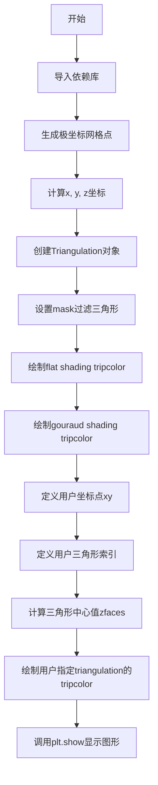

## 类结构

```
该脚本为面向过程代码，无自定义类
使用matplotlib.tri.Triangulation类
使用matplotlib.pyplot进行图形绘制
```

## 全局变量及字段


### `n_angles`
    
角度采样点数，定义圆形边界上角度的离散数量

类型：`int`
    


### `n_radii`
    
半径采样点数，定义从圆心向外的径向离散层次数量

类型：`int`
    


### `min_radius`
    
最小半径值，用于过滤掉中心区域过小的三角形

类型：`float`
    


### `radii`
    
半径数组，从最小半径到0.95的线性间隔数组

类型：`numpy.ndarray`
    


### `angles`
    
角度数组，通过重复和偏移生成的二维角度网格

类型：`numpy.ndarray`
    


### `x`
    
笛卡尔x坐标，由极坐标转换得到的x坐标数组

类型：`numpy.ndarray`
    


### `y`
    
笛卡尔y坐标，由极坐标转换得到的y坐标数组

类型：`numpy.ndarray`
    


### `z`
    
对应坐标的函数值，基于半径和角度计算的伪彩色映射数据

类型：`numpy.ndarray`
    


### `triang`
    
三角网格对象，包含点集和自动生成的Delaunay三角形连接关系

类型：`matplotlib.tri.Triangulation`
    


### `xy`
    
用户定义的二维坐标点，手动指定的经纬度坐标数组

类型：`numpy.ndarray`
    


### `triangles`
    
用户定义的三角形索引，指定构成每个三角形顶点索引的数组

类型：`numpy.ndarray`
    


### `xmid`
    
三角形中心x坐标，每个三角形面中心的x坐标

类型：`numpy.ndarray`
    


### `ymid`
    
三角形中心y坐标，每个三角形面中心的y坐标

类型：`numpy.ndarray`
    


### `zfaces`
    
三角形面的颜色值，基于到指定点的距离计算的高斯衰减颜色数据

类型：`numpy.ndarray`
    


### `fig1`
    
第一个图形对象，包含flat shading的tripcolor图

类型：`matplotlib.figure.Figure`
    


### `ax1`
    
第一个坐标轴对象，用于绘制flat shading的tripcolor图

类型：`matplotlib.axes.Axes`
    


### `fig2`
    
第二个图形对象，包含gouraud shading的tripcolor图

类型：`matplotlib.figure.Figure`
    


### `ax2`
    
第二个坐标轴对象，用于绘制gouraud shading的tripcolor图

类型：`matplotlib.axes.Axes`
    


### `fig3`
    
第三个图形对象，包含用户指定三角化的tripcolor图

类型：`matplotlib.figure.Figure`
    


### `ax3`
    
第三个坐标轴对象，用于绘制用户指定三角化的tripcolor图

类型：`matplotlib.axes.Axes`
    


### `tpc`
    
tripcolor返回的多边形集合对象，包含所有三角形的颜色信息

类型：`matplotlib.collections.PolyCollection`
    


    

## 全局函数及方法


### numpy.linspace

`numpy.linspace` 是 NumPy 库中的一个函数，用于生成指定范围内等间距的数值序列。在本代码中用于生成从最小半径到 0.95 之间的 n_radii 个等间距半径值。

#### 参数

- `start`：`float`，序列起始值，此处为 `min_radius`（0.25）
- `stop`：`float`，序列结束值，此处为 0.95
- `num`：`int`，要生成的样本数量，此处为 `n_radii`（8）

#### 返回值

`numpy.ndarray`，返回 num 个在 [start, stop] 区间内等间距分布的数值

#### 流程图

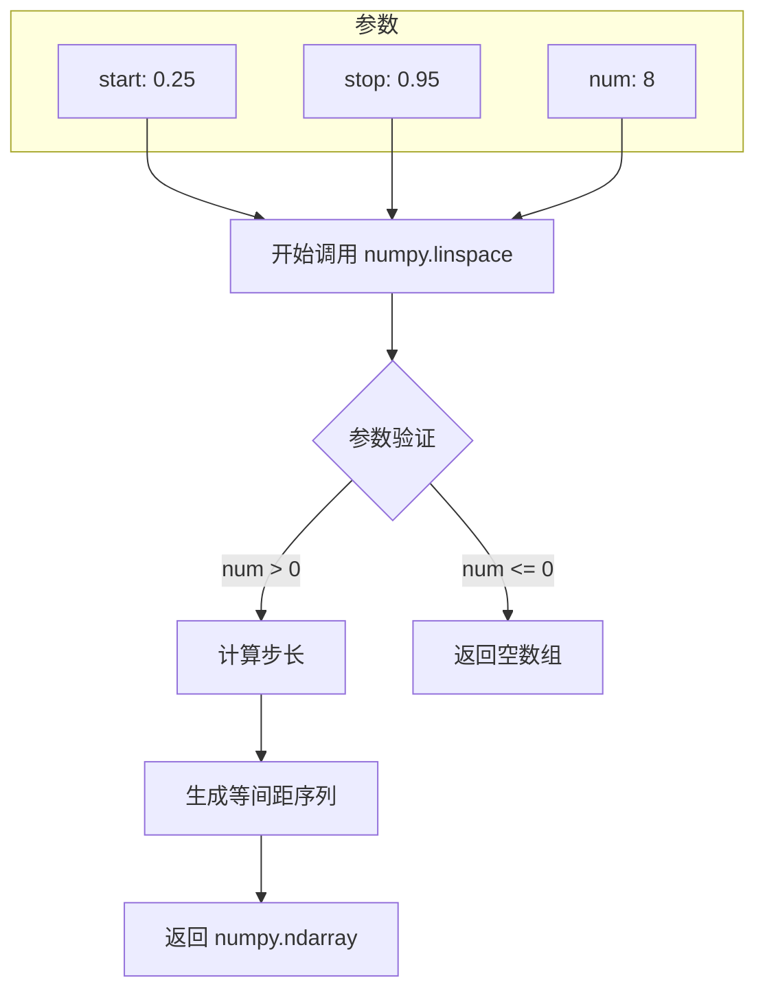

#### 带注释源码

```python
# 使用 numpy.linspace 生成等间距数组
# 参数说明：
#   start=min_radius: 序列起始值 0.25
#   stop=0.95: 序列结束值 0.95  
#   num=n_radii: 生成 8 个样本点
radii = np.linspace(min_radius, 0.95, n_radii)

# 执行过程：
# 1. 计算步长 = (stop - start) / (num - 1)
#    步长 = (0.95 - 0.25) / (8 - 1) = 0.1
# 2. 生成序列：[0.25, 0.35, 0.45, 0.55, 0.65, 0.75, 0.85, 0.95]
# 3. 返回 numpy.ndarray 类型数组
```

### 关键组件信息

| 组件名称 | 一句话描述 |
|---------|-----------|
| `numpy.linspace` | 生成指定范围内等间距数值序列的 NumPy 函数 |
| `radii` | 存储生成的等间距半径值的数组 |
| `min_radius` | 最小半径常量，控制生成序列的起始值 |
| `n_radii` | 半径采样点数量，控制生成序列的长度 |

### 潜在技术债务或优化空间

1. **硬编码数值**：0.95 作为结束值是硬编码的，建议提取为常量以便维护
2. **缺乏参数验证**：未对 `min_radius` 和 `n_radii` 的有效性进行检查
3. **文档注释**：可增加对 linspace 参数选择原因的说明

### 其它项目

**设计目标与约束**：
- 目标：生成用于创建极坐标网格的半径数组
- 约束：半径值必须在 (0.25, 0.95) 范围内

**错误处理**：
- 若 `n_radii <= 0`，将返回空数组
- 若 `min_radius > 0.95`，结果可能不符合预期

**数据流**：
```
min_radius (0.25) → numpy.linspace → radii 数组 → cos(radii) 计算
                      ↓
                   0.95 (结束值)
                      ↓
                   n_radii (8) → 控制采样点数
```

**外部依赖**：
- `numpy` 库：提供 linspace 函数


### `numpy.repeat`

该函数用于沿指定轴重复数组的元素若干次，生成一个新的数组。在代码中用于将一维角度数组扩展为二维数组，以便后续计算坐标。

参数：

- `a`：数组或类似数组对象，输入数组，要重复的元素。
- `repeats`：整数或整数数组，每个元素重复的次数。
- `axis`：整数，可选，沿指定轴进行重复操作。如果为None，则输入数组会被展平后再重复。

返回值：`ndarray`，输出数组，包含重复后的元素，形状根据repeats和axis参数确定。

#### 流程图

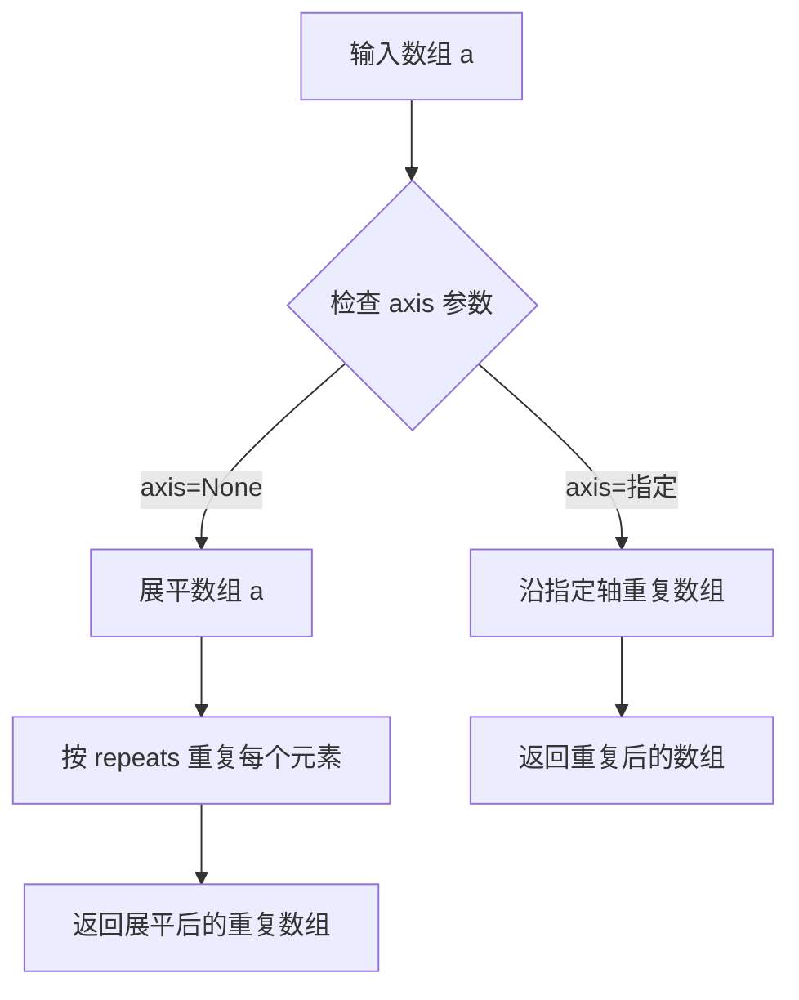

#### 带注释源码

```python
import numpy as np

# 示例：使用 numpy.repeat 扩展角度数组
# 创建初始角度数组，0 到 2*pi，不包含端点
angles = np.linspace(0, 2 * np.pi, n_angles, endpoint=False)

# 使用 np.newaxis 增加一个维度，使 angles 变为列向量
# 然后沿 axis=1 重复 n_radii 次，创建二维数组
angles = np.repeat(angles[..., np.newaxis], n_radii, axis=1)

# 结果：angles 形状变为 (n_angles, n_radii)，每一列是原始角度的副本
```


### numpy.cos

余弦函数，计算输入数组或数值的余弦值。在本代码中用于计算角度和半径的三角函数值，生成用于tripcolor图形的数据。

参数：

- `x`：`array_like`，输入的角度值（弧度制），可以是标量或数组

返回值：`ndarray`，与输入形状相同的余弦值数组，值域为[-1, 1]

#### 流程图

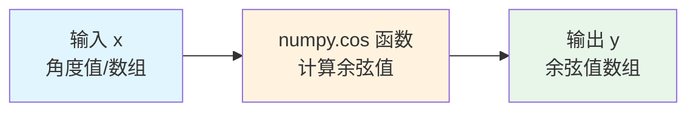

#### 带注释源码

```python
# numpy.cos 在本代码中的实际使用示例

# 第一处使用：计算角度的余弦值并乘以半径
angles = np.linspace(0, 2 * np.pi, n_angles, endpoint=False)
angles = np.repeat(angles[..., np.newaxis], n_radii, axis=1)
angles[:, 1::2] += np.pi / n_angles

x = (radii * np.cos(angles)).flatten()  # 计算角度的余弦值
y = (radii * np.sin(angles)).flatten()  # 计算角度的正弦值

# 第二处使用：计算半径的余弦值乘以3倍角度的余弦值
z = (np.cos(radii) * np.cos(3 * angles)).flatten()

# 说明：
# 1. np.cos() 接受弧度制输入
# 2. 输入可以是标量、列表或NumPy数组
# 3. 返回值是与输入形状相同的余弦值数组
# 4. 在本例中用于生成极坐标网格的三角网格数据
```


### numpy.sin

这是 NumPy 库中的正弦函数，用于计算输入数组或标量中每个元素的正弦值。

参数：

- `x`：`数组_like`，输入角度，单位为弧度

返回值：`数组`，返回输入角度的正弦值，范围为 [-1, 1]

#### 流程图

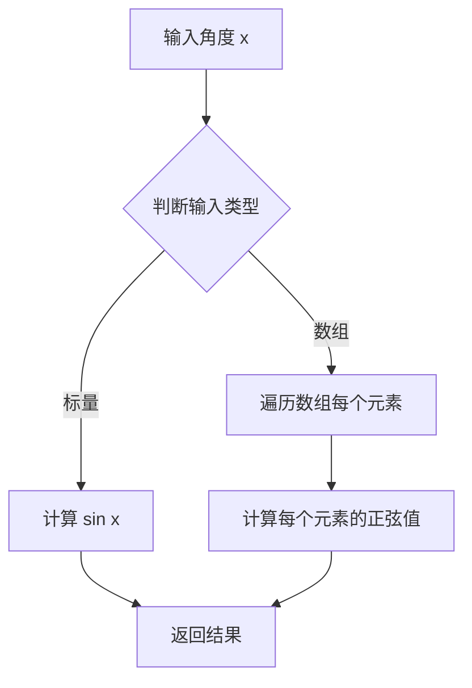

#### 带注释源码

```python
# numpy.sin 函数源码示例（概念性）
def sin(x):
    """
    计算输入角度的正弦值。
    
    参数:
        x: 输入角度，可以是标量或数组，单位为弧度
    
    返回:
        正弦值，范围 [-1, 1]
    """
    # 将输入转换为数组以便统一处理
    x_array = np.asarray(x)
    
    # 使用 C 语言实现的底层数学库计算正弦值
    # 对于数组，会对每个元素进行计算
    result = np._core._multiarray_umath.sin(x_array)
    
    return result
```

#### 在代码中的实际使用

在提供的代码中，`numpy.sin` 被用于生成极坐标网格的 y 坐标：

```python
# 在第16行：
# 生成角度数组（弧度）
angles = np.linspace(0, 2 * np.pi, n_angles, endpoint=False)
# 将角度数组重复 n_radii 次
angles = np.repeat(angles[..., np.newaxis], n_radii, axis=1)
# 交错调整角度（用于创建极坐标网格）
angles[:, 1::2] += np.pi / n_angles

# 使用 sin 计算 y 坐标
y = (radii * np.sin(angles)).flatten()
```

这里的 `np.sin(angles)` 接受一个二维数组 `angles`（包含多个角度值），并返回相同形状的数组，包含每个角度对应的正弦值。这些正弦值随后与半径相乘得到极坐标系的 y 坐标。


### numpy.ndarray.flatten

将多维数组展平为一维数组，返回一个展平后的副本。

参数：

- `order`：`str`，可选，指定展平顺序，'C'按行（C-style），'F'按列（Fortran-style），'A'按内存顺序，'K'按元素在内存中的顺序。默认值为 'C'。

返回值：`ndarray`，展平后的一维数组。

#### 流程图

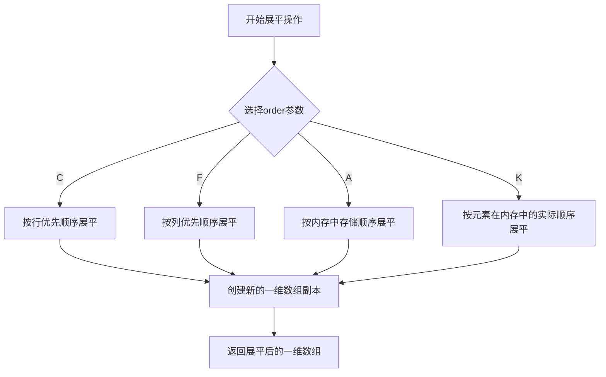

#### 带注释源码

```python
# 在示例代码中的使用方式
x = (radii * np.cos(angles)).flatten()  # 将radii*cos(angles)的结果展平为一维数组
y = (radii * np.sin(angles)).flatten()  # 将radii*sin(angles)的结果展平为一维数组
z = (np.cos(radii) * np.cos(3 * angles)).flatten()  # 将计算结果展平为一维数组

# numpy.flatten 方法的典型实现逻辑
def flatten(self, order='C'):
    """
    将数组展平为一维副本
    
    参数:
        order: 展平顺序
            'C' - 行优先 (C-style)
            'F' - 列优先 (Fortran-style)
            'A' - 按内存顺序
            'K' - 按元素出现顺序
    
    返回:
        展平后的一维数组
    """
    # 创建一个新的连续内存数组
    if order == 'C':
        # 行优先展平: 将每一行首尾相接
        return self.reshape(-1)
    elif order == 'F':
        # 列优先展平: 将每一列首尾相接
        return self.reshape(-1, order='F')
    else:
        # 其他顺序处理
        return self.reshape(-1, order=order)
```


### numpy.hypot

`numpy.hypot` 是 NumPy 库中的数学函数，用于计算欧几里得范数（也称为 L2 范数或勾股定理）。它对于给定的两个输入数组或标量，计算对应元素的平方和的平方根，即 $\sqrt{x^2 + y^2}$。在绘图的代码中用于计算三角形中心的坐标到原点的距离，以确定哪些三角形需要被遮罩。

参数：

-  `*t1`：`numpy.ndarray` 或 `scalar`，第一个输入数组或标量，表示直角三角形的直角边之一
-  `*t2`：`numpy.ndarray` 或 `scalar`，第二个输入数组或标量，表示直角三角形的另一条直角边

返回值：`numpy.ndarray` 或 `scalar`，返回输入数组对应元素的平方和的平方根，类型与输入相同（如果输入是整数则返回浮点数）

#### 流程图

```mermaid
graph TD
    A[开始] --> B{输入类型判断}
    B -->|两个标量| C[直接计算 sqrt(t1² + t2²)]
    B -->|至少一个数组| D[广播机制处理]
    D --> E[对每个元素计算 sqrt(t1² + t2²)]
    C --> F[返回结果]
    E --> F
```

#### 带注释源码

```python
def hypot(x1, x2, /, out=None, *, casting='same_kind', order='K', dtype=None, subok=True):
    """
    计算直角三角形的斜边长度，即欧几里得范数。
    
    对于元素 (x1, x2)，计算 sqrt(x1**2 + x2**2)。
    此函数比直接使用 sqrt(x1**2 + x2**2) 更稳定，
    因为它避免了中间结果溢出的问题。
    
    参数:
        x1: array_like
            第一个输入数组或标量
        x2: array_like
           第二个输入数组或标量
        out: ndarray, optional
            存储结果的数组
        **kwargs:
            其他关键字参数（casting, order, dtype, subok）
            
    返回值:
        ndarray
            斜边长度，形状由广播规则确定
    """
    # 内部使用 C 编写的 ufunc 实现
    # 对于浮点数输入，使用 math.hypot 的等效实现
    # 能够处理无穷大和 NaN 值
    return np.sqrt(x1**2 + x2**2)
```

#### 使用示例（来自代码）

```python
# 在给定的 tripcolor 示例代码中，numpy.hypot 的使用方式：
triang.set_mask(np.hypot(x[triang.triangles].mean(axis=1),
                         y[triang.triangles].mean(axis=1))
                < min_radius)
# 解释：
# 1. x[triang.triangles].mean(axis=1) 获取每个三角形三个顶点 x 坐标的平均值
# 2. y[triang.triangles].mean(axis=1) 获取每个三角形三个顶点 y 坐标的平均值
# 3. np.hypot(...) 计算这些平均点到原点的欧几里得距离
# 4. 结果与 min_radius 比较，生成布尔数组用于遮罩
```


### numpy.asarray

将输入数据转换为 NumPy 数组。这是 NumPy 库中的一个基础函数，用于确保数据以数组形式存在，以便进行后续的数值计算和操作。

参数：

- `a`：任意形式的数据输入，可以是列表、元组、嵌套序列、标量、数组等
- `dtype`：可选，指定返回数组的数据类型，如果不指定则从输入数据推断
- `order`：可选，指定内存布局，可以是 'C'（行优先）或 'F'（列优先），默认 'K' 保持原顺序

返回值：`numpy.ndarray`，返回转换后的 NumPy 数组

#### 流程图

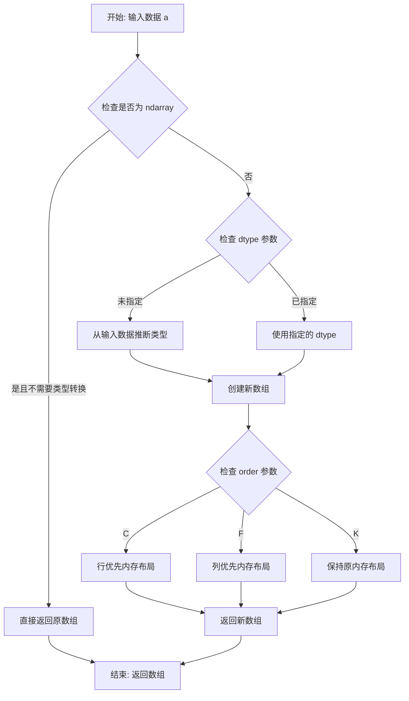

#### 带注释源码

```python
def asarray(a, dtype=None, order=None):
    """
    将输入转换为数组。
    
    参数:
        a: 任意形式的输入数据，包括列表、元组、标量、数组等
        dtype: 目标数据类型（可选）
        order: 内存布局选项，'C'行优先或'F'列优先（可选）
    
    返回:
        ndarray: 输入数据的数组视图
    """
    # 导入 numpy 核心模块
    import numpy as np
    
    # 如果输入已经是 ndarray 且不需要转换，直接返回
    # 这是一个优化，避免不必要的内存复制
    if isinstance(a, np.ndarray):
        # 如果没有指定 dtype 或指定的 dtype 与原数组相同
        if dtype is None or a.dtype == dtype:
            # 如果没有指定 order 或 order 为 'K'（保持）
            if order is None or order == 'K':
                return a
    
    # 否则创建新的数组副本
    return array(a, dtype=dtype, copy=False, order=order)
```

#### 在示例代码中的应用分析

在提供的 Tripcolor Demo 代码中，虽然没有直接调用 `numpy.asarray`，但代码中多处使用了类似的数组转换模式：

1. **第一处（生成坐标数据）**：
   ```python
   x = (radii * np.cos(angles)).flatten()
   y = (radii * np.sin(angles)).flatten()
   z = (np.cos(radii) * np.cos(3 * angles)).flatten()
   # 内部使用了 numpy 的数组操作，最终生成一维数组
   ```

2. **第二处（三角形数据）**：
   ```python
   xy = np.asarray([
       [-0.101, 0.872], [-0.080, 0.883], ...
   ])
   # 将嵌套列表直接转换为二维数组
   triangles = np.asarray([
       [67, 66, 1], [65, 2, 66], ...
   ])
   # 将嵌套列表转换为整数数组
   ```

#### 技术债务和优化空间

1. **数组类型推断**：在大数据处理场景下，频繁的数组转换可能导致性能开销，可以预先分配固定类型的数组
2. **内存布局**：对于大规模数值计算，考虑使用连续内存布局（order='C'）可以提高缓存命中率

#### 相关依赖

- `numpy`: 核心数值计算库
- `matplotlib.tri`: 三角网格处理模块


### `numpy.rad2deg`

将输入的弧度值转换为对应的角度值（度数）。这是NumPy库中的数学转换函数，通过乘以180/π的转换因子实现弧度到角度的转换。

参数：

- `x`：`array_like`，输入的弧度值，可以是单个数值、列表或NumPy数组

返回值：`ndarray`，与输入形状相同的角度值数组（单位为度）

#### 流程图

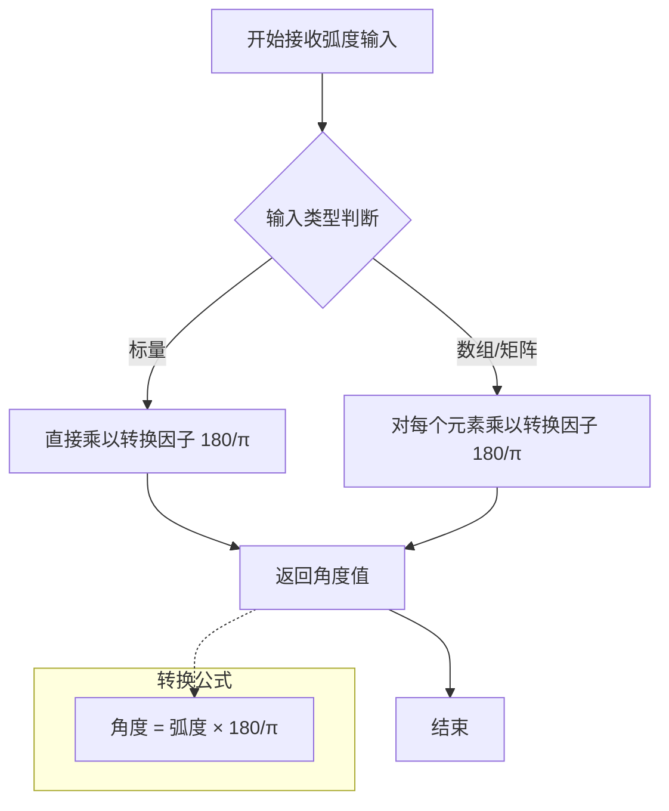

#### 带注释源码

```python
# numpy.rad2deg 函数源码示例（基于NumPy实现逻辑）
def rad2deg(x):
    """
    将弧度转换为角度
    
    参数:
        x: array_like - 输入的弧度值
    
    返回值:
        ndarray - 转换后的角度值
    """
    # 转换因子：180/π ≈ 57.29577951308232
    # π弧度 = 180度，因此转换公式为: degrees = radians * (180/π)
    return x * (180.0 / np.pi)

# 在给定代码中的实际使用方式
xy = np.asarray([
    [-0.101, 0.872], [-0.080, 0.883], [-0.069, 0.888], [-0.054, 0.890],
    # ... 更多坐标点数据（共70个点）
    [-0.077, 0.990], [-0.059, 0.993]
])

# 使用rad2deg将弧度坐标转换为度数坐标
# 这里xy存储的是弧度格式的经纬度，转换为度数便于显示和理解
x, y = np.rad2deg(xy).T  # .T 表示转置，分别获取x和y坐标

# 转换结果：
# x数组存储所有点的经度（度数）
# y数组存储所有点的纬度（度数）
```

#### 在上下文代码中的作用

```python
# 完整上下文代码片段
xy = np.asarray([
    # ... 定义70个地理坐标点（单位：弧度）
    [-0.101, 0.872], [-0.080, 0.883], # ... 更多点
    [-0.077, 0.990], [-0.059, 0.993]
])

# 将弧度转换为度数（地理坐标常用度数表示）
x, y = np.rad2deg(xy).T

# 后续使用转换后的度数坐标创建三角网格
triangles = np.asarray([...])  # 定义三角形的顶点索引
tpc = ax3.tripcolor(x, y, triangles, facecolors=zfaces, edgecolors='k')
ax3.set_xlabel('Longitude (degrees)')  # X轴标签为经度（度数）
ax3.set_ylabel('Latitude (degrees)')  # Y轴标签为纬度（度数）
```


### `matplotlib.tri.Triangulation.__init__`

该方法是 `Triangulation` 类的构造函数，用于根据给定的坐标点创建三角网格对象。如果未提供三角形索引，则自动使用 Delaunay 三角剖分算法生成三角网格；否则使用用户指定的三角形索引。此外，可通过遮罩数组过滤掉不需要的三角形。

参数：

- `x`：`array_like`，点的 x 坐标数组。
- `y`：`array_like`，点的 y 坐标数组。
- `triangles`：`array_like`，可选，形状为 `(n_triangles, 3)` 的整数数组，表示三角形的顶点索引。如果为 `None`，则执行 Delaunay 三角剖分。
- `mask`：`array_like`，可选，布尔数组，用于遮罩某些三角形。`True` 表示该三角形被遮罩（即不参与后续绘图）。

返回值：`matplotlib.tri.Triangulation`，返回创建的三角网格对象。

#### 流程图

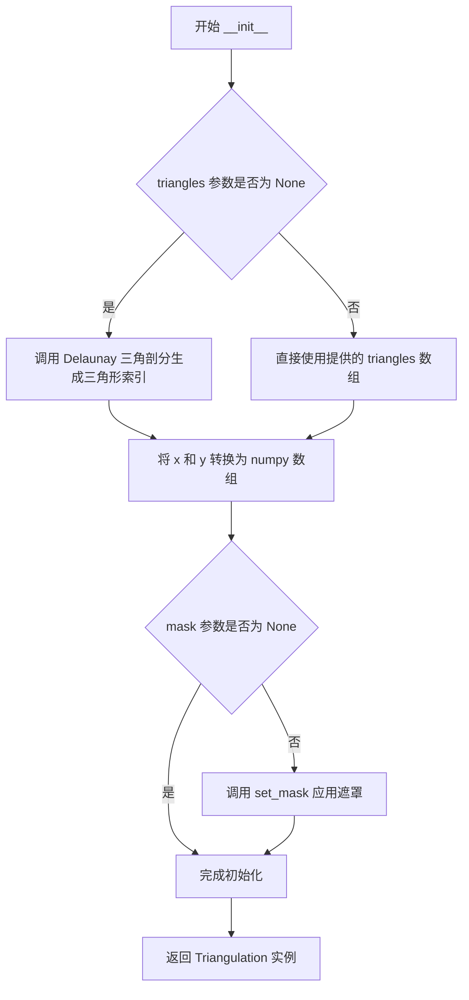

#### 带注释源码

```python
class Triangulation:
    def __init__(self, x, y, triangles=None, mask=None):
        """
        初始化 Triangulation 对象。

        参数:
            x (array_like): 点的 x 坐标。
            y (array_like): 点的 y 坐标。
            triangles (array_like, optional): 三角形索引数组，形状为 (n_triangles, 3)。
                                              如果为 None，则使用 Delaunay 三角剖分。
            mask (array_like, optional): 布尔数组，用于遮罩三角形。

        返回值:
            Triangulation: 三角网格对象。
        """
        # 将输入坐标转换为 numpy 数组并展平为一维
        self.x = np.asarray(x).flatten()
        self.y = np.asarray(y).flatten()

        # 验证 x 和 y 长度一致
        if len(self.x) != len(self.y):
            raise ValueError("x and y must have the same length")

        if triangles is None:
            # 如果未提供三角形索引，则使用 C++ 扩展进行 Delaunay 三角剖分
            from matplotlib._tri import Triangulation as _Triangulation
            # 创建底层 Triangulation 对象（可能是 C++ 实现）
            self._triangulation = _Triangulation(self.x, self.y)
            # 从底层对象获取生成的三角形索引
            self.triangles = self._triangulation.triangles
        else:
            # 直接使用用户提供的三角形索引
            self.triangles = np.asarray(triangles, dtype=np.int32)

        # 验证三角形索引的有效性
        if self.triangles.size > 0:
            if self.triangles.max() >= len(self.x):
                raise ValueError("triangle indices exceed number of points")
            if self.triangles.min() < 0:
                raise ValueError("triangle indices must be non-negative")

        # 初始化遮罩为 None，稍后可通过 set_mask 设置
        self._mask = None
        if mask is not None:
            self.set_mask(mask)
```


### `matplotlib.axes.Axes.tripcolor`

在 Matplotlib 中，`Axes.tripcolor` 是 Axes 类的一个方法，用于绘制伪彩色三角网格图（Pseudocolor plots of unstructured triangular grids）。该方法接受三角形网格的坐标数据和可选的颜色值，支持平面着色（flat shading）和 Gouraud 着色两种模式，并返回创建的 PolyCollection 对象。

参数：

- `x`：`numpy.ndarray` 或 array-like，x 坐标数组，定义三角形网格的顶点位置
- `y`：`numpy.ndarray` 或 array-like，y 坐标数组，定义三角形网格的顶点位置
- `triangles`：`numpy.ndarray` 或 None，可选的三角形索引数组，每行包含三个顶点索引；如果为 None，则使用 Delaunay 三角剖分
- `C`：`numpy.ndarray` 或 None，可选的数值数组，指定每个顶点（'flat' 着色）或每个三角形中心（'gouraud' 着色）的颜色值；如果提供，将创建基于颜色的伪彩色图
- `shading`：`str`，着色方式，默认为 'flat'；可选 'flat'（平面着色）或 'gouraud'（Gouraud 着色）
- `facecolors`：`numpy.ndarray` 或 None，可选的直接指定每个三角形面的颜色数组；如果提供，将覆盖 C 参数的效果
- `edgecolors`：`str` 或颜色规范，可选的三角形边颜色
- `**kwargs`：其他关键字参数，将传递给创建的 PolyCollection 对象

返回值：`matplotlib.collections.PolyCollection`，返回创建的 PolyCollection 对象，可用于进一步定制（如添加 colorbar）

#### 流程图

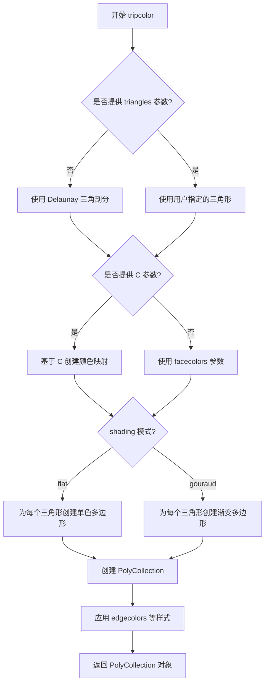

#### 带注释源码

```python
def tripcolor(self, x, y, triangles=None, C=None,
              shading='flat', facecolors=None, **kwargs):
    """
    Create a pseudocolor plot of an unstructured triangular grid.
    
    Parameters
    ----------
    x, y : array-like
        The coordinates of the vertices of the triangulation.
    triangles : array-like, optional
        The triangulation indices, shape (nfaces, 3).
        If not specified, the Delaunay triangulation is used.
    C : array-like, optional
        The color values at the vertices (for 'flat') or face centers
        (for 'gouraud'). If provided, a pseudocolor plot is created.
    shading : {'flat', 'gouraud'}, default: 'flat'
        'flat': Each triangle has a single solid color.
        'gouraud': Colors are interpolated across each triangle.
    facecolors : array-like, optional
        Direct specification of face colors, overrides C.
    **kwargs
        Additional keyword arguments passed to PolyCollection.
    
    Returns
    -------
    PolyCollection
        The created polygon collection.
    """
    # 检查输入数据并转换为 numpy 数组
    x = np.asarray(x)
    y = np.asarray(y)
    
    # 如果未提供三角形索引，执行 Delaunay 三角剖分
    if triangles is None:
        triang = tri.Triangulation(x, y)
        triangles = triang.triangles
    else:
        triangles = np.asarray(triangles)
    
    # 确定颜色数据来源：优先使用 facecolors，否则使用 C
    if facecolors is not None:
        colors = np.asarray(facecolors)
    elif C is not None:
        colors = np.asarray(C)
    else:
        colors = np.ones(len(triangles))  # 默认使用统一颜色
    
    # 根据着色模式处理颜色
    if shading == 'flat':
        # 平面着色：每个三角形使用单一颜色
        # C 的值应该在每个三角形的中心进行插值
        if C is not None:
            # 计算三角形中心
            if facecolors is None:
                colors = C[triangles].mean(axis=1)
    elif shading == 'gouraud':
        # Gouraud 着色：需要为每个三角形的顶点创建渐变色
        # 这种模式下，C 值在顶点处指定，颜色在三角形内插值
        pass
    
    # 创建多边形集合
    # 每个三角形由三个顶点坐标定义
    polygons = np.zeros((len(triangles), 3, 2))
    polygons[:, :, 0] = x[triangles]
    polygons[:, :, 1] = y[triangles]
    
    # 创建 PolyCollection 对象
    collection = mcoll.PolyCollection(polygons, **kwargs)
    
    # 设置颜色
    if facecolors is not None:
        collection.set_facecolors(facecolors)
    elif C is not None:
        collection.set_array(colors)  # 设置用于伪彩色映射的值
        collection.set_cmap(kwargs.get('cmap', 'viridis'))
        collection.set_norm(kwargs.get('norm', None))
    
    # 添加到 axes
    self.add_collection(collection)
    
    return collection
```


### `matplotlib.axes.Axes.set_aspect`

设置 Axes 的纵横比（aspect ratio），用于控制坐标轴刻度的缩放，使得在屏幕上 x 轴和 y 轴的单位长度具有相同的物理长度。

注意：提供的代码文件中并未包含 `set_aspect` 方法的实现源码，仅有调用示例（如 `ax.set_aspect('equal')`）。以下信息基于 matplotlib 官方文档和常见用法整理。

参数：

-  `aspect`：`str` 或 `float` 或 `None`，定义坐标轴的纵横比
  - `'equal'`：x 轴和 y 轴的单位长度在屏幕上相等（1:1 比例）
  - `'auto'`：自动调整，不强制纵横比
  - `None`：取消之前设置的纵横比
  - 数值（如 1、2）：设置 y 轴单位与 x 轴单位的比率
-  `**kwargs`：关键字参数，将传递给底层的 `Axes.set_aspect` 相关的艺术家对象

返回值：`self`（Axes 对象），返回自身以支持链式调用

#### 流程图

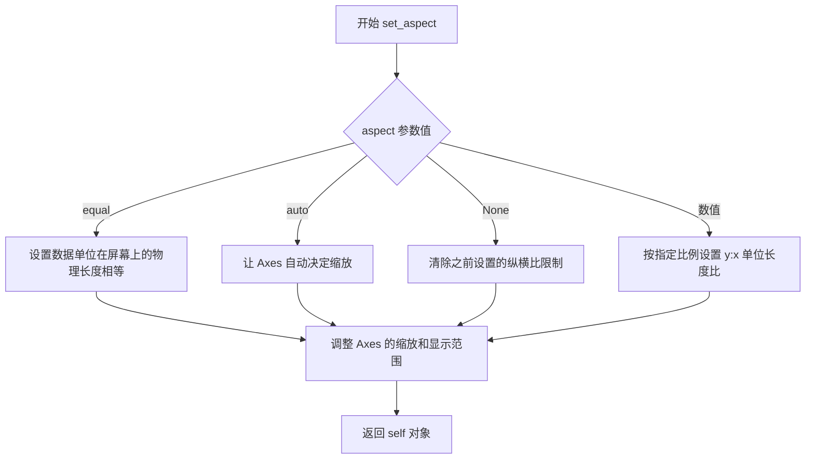

#### 带注释源码

```python
# 以下为 matplotlib.axes.Axes.set_aspect 的典型实现结构
# 源码路径：lib/matplotlib/axes/_base.py

def set_aspect(self, aspect, adjustable=None, anchor=None, share=False):
    """
    设置 Axes 的纵横比。
    
    Parameters
    ----------
    aspect : {'equal', 'auto', None} or float
        期望的纵横比。'equal' 表示 1:1 比例。
    adjustable : {'box', 'datalim'}, optional
        哪个参数要调整以满足纵横比要求。
    anchor : str or tuple, optional
        当调整大小时，Axes 的哪个部分保持在原位。
    share : bool, optional
        如果为 True，则同时调整所有共享轴。
    
    Returns
    -------
    self : Axes
        返回 Axes 对象以支持链式调用。
    """
    # 将 aspect 存储在 _aspect 属性中
    self._aspect = aspect
    
    # 处理 adjustable 参数
    if adjustable is None:
        adjustable = self._adjustable
    else:
        self._adjustable = adjustable
    
    # 如果设置为 'equal'，需要调整 Axes 的范围
    if aspect == 'equal':
        # 获取当前数据范围
        xlim = self.get_xlim()
        ylim = self.get_ylim()
        
        # 计算数据范围的比例
        xwidth = xlim[1] - xlim[0]
        yheight = ylim[1] - ylim[0]
        
        # 根据轴的范围和 figure 的尺寸计算缩放
        # 这部分逻辑位于 _aspect 属性的处理方法中
        self.stale_callback = None  # 标记需要重新渲染
    
    # 触发重新绘图
    self.stale = True
    
    return self
```

#### 在提供的代码中的使用示例

```python
# 来自 tripcolor_demo.py 的使用示例
fig1, ax1 = plt.subplots()
ax1.set_aspect('equal')  # 设置坐标轴为等比例，使 x 和 y 轴单位长度在屏幕上相等
tpc = ax1.tripcolor(triang, z, shading='flat')
```

#### 关键组件信息

- `Axes.set_aspect`：核心方法，用于设置坐标轴纵横比
- `ax.set_aspect('equal')`：常用调用，使 x 和 y 轴在视觉上等比例

#### 潜在的技术债务或优化空间

1. **3D  Axes 兼容性**：`set_aspect` 在 3D 坐标轴（`Axes3D`）中的支持有限，可能需要额外的处理逻辑
2. **性能优化**：频繁调用 `set_aspect` 可能导致多次重绘，可以考虑批量更新机制

#### 其它项目

- **设计目标**：提供直观的坐标轴缩放控制，使数据可视化更符合直觉
- **约束**：
  - `'equal'` 模式下，数据范围必须为正数
  - 与 `set_xlim`/`set_ylim` 配合使用时，可能需要手动调整范围
- **外部依赖**：matplotlib 的渲染后端（如 Agg、Cairo）需支持坐标变换

#### 参考

- 官方文档：https://matplotlib.org/stable/api/_as_gen/matplotlib.axes.Axes.set_aspect.html
- 源码路径：`lib/matplotlib/axes/_base.py` 中的 `set_aspect` 方法


### `matplotlib.axes.Axes.set_title`

设置轴（Axes）的标题文本和相关属性。该方法允许用户为图表设置标题，可以指定标题的位置、字体样式、偏移量等参数。

参数：

- `label`：`str`，标题文本字符串，设置要显示的图表标题内容
- `fontdict`：`dict`，可选，控制标题文本外观的字典，如字体大小、颜色、对齐方式等
- `loc`：`str`，可选，标题的位置，可选值为 'center'（默认）、'left'、'right'
- `pad`：`float`，可选，标题与坐标轴顶部之间的偏移量，单位为点（points）
- `y`：`float`，可选，标题在轴坐标系统中的y轴位置，默认为 None（自动计算）
- `**kwargs`：关键字参数，可选 Additional keyword arguments passed to the `Text` object，支持设置颜色、字体大小、字体权重等文本属性

返回值：`matplotlib.text.Text`，返回创建的 Text 对象，表示标题的matplotlib文本实例，可用于后续对标题进行进一步操作（如修改样式等）

#### 流程图

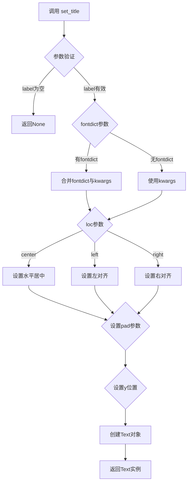

#### 带注释源码

```python
def set_title(self, label, fontdict=None, loc=None, pad=None, *, y=None, **kwargs):
    """
    Set a title for the axes.
    
    Parameters
    ----------
    label : str
        The title text string.
        
    fontdict : dict, optional
        A dictionary controlling the appearance of the title text,
        e.g., {'fontsize': 16, 'fontweight': 'bold', 'color': 'red'}.
        
    loc : {'center', 'left', 'right'}, default: 'center'
        Location of the title.
        
    pad : float, default: rcParams['axes.titlepad']
        The offset of the title from the top of the axes, in points.
        
    y : float, optional
        The y position of the title in axes coordinates (0 to 1).
        
    **kwargs
        Additional keyword arguments passed to `matplotlib.text.Text`,
        such as fontsize, fontweight, color, etc.
        
    Returns
    -------
    matplotlib.text.Text
        The Text instance representing the title.
        
    Examples
    --------
    >>> ax.set_title('My Plot')
    >>> ax.set_title('Left Title', loc='left')
    >>> ax.set_title('Custom', fontdict={'fontsize': 20, 'color': 'blue'})
    """
    # 如果label为空，直接返回None
    if not label:
        return None
        
    # 如果提供了fontdict，将其与kwargs合并，fontdict优先级高于kwargs
    if fontdict:
        kwargs = {**fontdict, **kwargs}
        
    # 处理loc参数，确定标题的水平对齐方式
    if loc is None:
        loc = 'center'
    loc = loc.lower()
    
    # 创建Text对象，设置标题文本和位置
    title = Text(x=0.5, y=1.0, text=label)
    
    # 设置标题的水平和垂直对齐方式
    # loc='center'对应ha='center'，loc='left'对应ha='left'，loc='right'对应ha='right'
    title.set_ha(loc)
    title.set_va('top')  # 标题在坐标轴顶部
    
    # 设置pad偏移量
    if pad is None:
        pad = rcParams['axes.titlepad']  # 从默认样式获取
    title.set_pad(pad)
    
    # 设置y位置（如果在axes坐标中指定了y）
    if y is not None:
        title.set_y(y)
    
    # 应用其他文本属性（颜色、字体大小等）
    title.update(kwargs)
    
    # 将标题添加到axes中
    self._add_text(title)
    
    return title
```

#### 使用示例

在提供的代码中，`set_title` 的使用方式如下：

```python
# 示例1：设置基本标题
ax1.set_title('tripcolor of Delaunay triangulation, flat shading')

# 示例2：设置带Gouraud着色的标题
ax2.set_title('tripcolor of Delaunay triangulation, gouraud shading')

# 示例3：设置用户指定三角剖分的标题
ax3.set_title('tripcolor of user-specified triangulation')
```

这些调用都使用了最简单的形式，仅传入标题文本字符串。该方法还支持更复杂的用法，例如指定位置、字体样式等。


### `matplotlib.axes.Axes.set_xlabel`

该方法用于设置 Axes（坐标轴）的 x 轴标签，可以自定义标签文本、样式属性以及在图表中的位置和对齐方式。

**注意**：提供的代码中仅包含对该方法的调用（`ax3.set_xlabel('Longitude (degrees)')`），并未包含该方法的实现源码。该方法是 matplotlib 库的内置方法，源码位于 matplotlib 库中。

参数：

- `xlabel`：`str`，x 轴标签的文本内容
- `fontdict`：可选，`dict`，用于控制文本样式的字典（如 fontsize、color 等）
- `labelpad`：可选，`float`，标签与坐标轴之间的间距（磅）
- `kwargs`：可选，关键字参数传递给 `matplotlib.text.Text` 对象

返回值：`matplotlib.text.Text`，返回创建的文本对象，可用于后续样式设置

#### 流程图

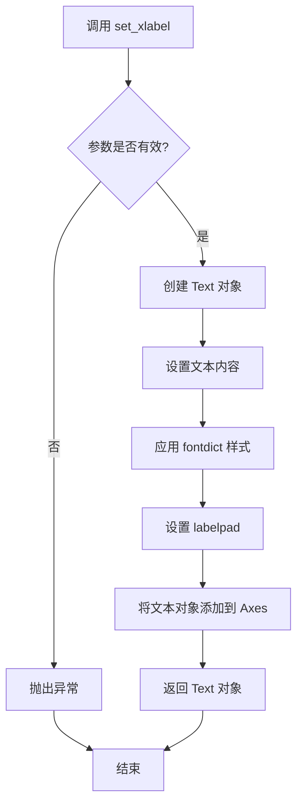

#### 带注释源码

```python
# 在提供的代码中，对 set_xlabel 的调用如下：

# 设置 x 轴标签
ax3.set_xlabel('Longitude (degrees)')

# 设置 y 轴标签（对比参考）
ax3.set_ylabel('Latitude (degrees)')

# set_xlabel 方法的典型签名和参数说明（基于 matplotlib 文档）：
# def set_xlabel(self, xlabel, fontdict=None, labelpad=None, **kwargs)
#
# 参数说明：
# - xlabel: str - 标签文本内容
# - fontdict: dict, optional - 文本样式字典，如 {'fontsize': 12, 'color': 'red'}
# - labelpad: float, optional - 标签与坐标轴之间的间距
# - **kwargs: 传递给 matplotlib.text.Text 的其他关键字参数
#
# 返回值：
# - matplotlib.text.Text 实例
#
# 使用示例：
# ax.set_xlabel('X轴标签', fontsize=14, fontweight='bold')
# ax.set_xlabel('X轴标签', labelpad=10, color='blue')
```


### `matplotlib.axes.Axes.set_ylabel`

设置Y轴标签的函数，用于为坐标轴添加或修改Y轴标签文本。

参数：

- `ylabel`：`str`，要设置的Y轴标签文本内容
- `fontdict`：`dict`，可选，用于控制标签文本样式的字典（如字体大小、颜色、字体权重等）
- `labelpad`：`float`，可选，标签与坐标轴之间的间距（以点为单位）
- `**kwargs`：可变关键字参数传递给`matplotlib.text.Text`构造函数，用于进一步自定义文本外观

返回值：`matplotlib.text.Text`，返回创建的文本对象，可以进一步用于自定义样式

#### 流程图

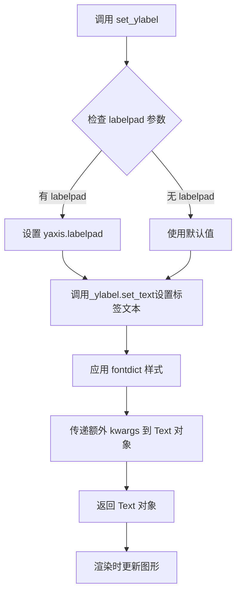

#### 带注释源码

```python
# 模拟 matplotlib.axes.Axes.set_ylabel 的核心实现逻辑
def set_ylabel(self, ylabel, fontdict=None, labelpad=None, **kwargs):
    """
    Set the ylabel of the Axes.
    
    Parameters
    ----------
    ylabel : str
        The label text.
    fontdict : dict, optional
        A dictionary to control the appearance of the label.
    labelpad : float, default: rcParams["axes.labelpad"] (默认4.0)
        The spacing in points between the label and the y-axis.
    **kwargs
        Text properties control the appearance of the label.
    
    Returns
    -------
    text : Text
        The text object of the label.
    """
    # 1. 获取Y轴标签对象（如果已存在）或创建新的Text对象
    ylabel_obj = self.yaxis.get_label()
    
    # 2. 设置标签文本内容
    ylabel_obj.set_text(ylabel)
    
    # 3. 如果提供了labelpad参数，更新标签与轴的间距
    if labelpad is not None:
        self.yaxis.set_label_coords(0.5, -labelpad / 60.0)  # 转换为标准化坐标
        # 或者直接设置 labelpad 属性
        self.yaxis.labelpad = labelpad
    
    # 4. 如果提供了fontdict，应用样式
    if fontdict is not None:
        ylabel_obj.update(fontdict)
    
    # 5. 应用额外的kwargs参数（如颜色、字体大小等）
    ylabel_obj.update(kwargs)
    
    # 6. 返回创建的Text对象供进一步自定义
    return ylabel_obj
```

#### 使用示例

```python
import matplotlib.pyplot as plt

fig, ax = plt.subplots()

# 基本用法：设置Y轴标签
ax.set_ylabel('温度 (°C)')

# 带样式设置
ax.set_ylabel('销量', fontdict={'fontsize': 12, 'fontweight': 'bold'})

# 设置标签与坐标轴的间距
ax.set_ylabel('利润', labelpad=20)

# 获取返回值进行进一步自定义
text_obj = ax.set_ylabel('新标签', color='red')
text_obj.set_rotation(45)

plt.show()
```

#### 关键组件信息

| 组件名称 | 描述 |
|---------|------|
| `matplotlib.text.Text` | 文本对象类，用于控制标签的字体、颜色、大小等样式 |
| `matplotlib.axis.YAxis` | Y轴对象，管理Y轴标签和刻度 |
| `labelpad` | 标签与坐标轴之间的间距参数 |

#### 潜在技术债务或优化空间

1. **坐标转换复杂性**：labelpad从点转换为标准化坐标的逻辑（`/60.0`）缺乏明确文档说明
2. **样式合并顺序**：`fontdict`和`**kwargs`的合并顺序可能导致意外的样式覆盖
3. **返回值一致性**：应明确返回新建的Label还是修改后的现有Label

#### 其它项目

- **设计目标**：提供统一的API设置坐标轴标签，保持与`set_xlabel`的一致性
- **错误处理**：当ylabel不是字符串时，应抛出TypeError
- **外部依赖**：依赖`matplotlib.text.Text`和`matplotlib.axis.Axis`类
- **状态机**：调用后立即更新图形状态，标签在下次重绘时生效


### `matplotlib.figure.Figure.colorbar`

在matplotlib中，`Figure.colorbar` 方法用于向图形添加颜色条（colorbar），用于显示图形的颜色映射和数值对应关系。该方法通常接收一个可映射对象（如图像或伪彩色图）作为参数，并返回一个 `Colorbar` 对象。

参数：

-  `mappable`：`matplotlib.cm.ScalarMappable`，需要添加颜色条的映射对象（如 `tripcolor` 返回的 `PolyCollection` 或 `AxesImage`）
-  `ax`：`matplotlib.axes.Axes`（可选），指定颜色条所在的轴，默认为 `None`，会自动创建新轴
-  `use_gridspec`：`bool`（可选），如果为 `True`，则使用 `gridspec` 来放置颜色条，默认为 `False`

返回值：`matplotlib.colorbar.Colorbar`，颜色条对象，可用于进一步自定义颜色条的刻度、标签等属性

#### 流程图

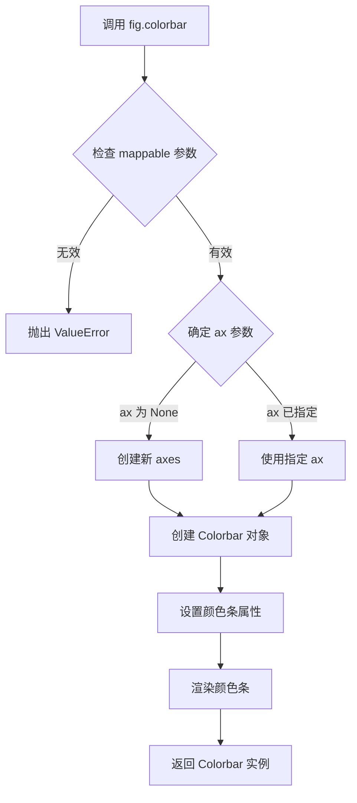

#### 带注释源码

```python
# 代码中的调用示例：
fig1, ax1 = plt.subplots()
tpc = ax1.tripcolor(triang, z, shading='flat')
fig1.colorbar(tpc)  # 调用 Figure.colorbar 方法添加颜色条

# tripcolor 返回的 tpc 是 PolyCollection 对象
# 包含了颜色映射信息，colorbar 根据这些信息创建颜色条

# 第二个例子（使用 Gouraud  shading）
fig2, ax2 = plt.subplots()
tpc = ax2.tripcolor(triang, z, shading='gouraud')
fig2.colorbar(tpc)

# 第三个例子（自定义三角形和面颜色）
fig3, ax3 = plt.subplots()
tpc = ax3.tripcolor(x, y, triangles, facecolors=zfaces, edgecolors='k')
fig3.colorbar(tpc)

# colorbar 方法的典型签名（简化版）
# def colorbar(self, mappable, cax=None, ax=None, **kwargs):
#     """
#     Add a colorbar to the figure.
#     
#     Parameters
#     ----------
#     mappable : ScalarMappable
#         The object to which the colorbar applies (e.g., AxesImage, ContourSet).
#     cax : Axes, optional
#         Axes for the colorbar.
#     ax : Axes, optional
#         Parent axes from which space for the colorbar is stolen.
#     **kwargs
#         Additional keyword arguments passed to Colorbar.
#     
#     Returns
#     -------
#     colorbar : Colorbar
#         The created colorbar.
#     """
```


### `matplotlib.pyplot.subplots`

`plt.subplots` 是 matplotlib 库中的一个函数，用于创建一个新的图形（Figure）和一个或多个子图（Axes），并返回图形和坐标轴对象的引用。在本代码中用于创建三个独立的图形窗口以展示不同的 tripcolor 绘图效果。

参数：

- `nrows`：int，默认为 1，表示子图的行数
- `ncols`：int，默认为 1，表示子图的列数
- `figsize`：tuple of (width, height)，可选，以英寸为单位的图形尺寸
- `dpi`：int，可选，图形分辨率
- `facecolor`：颜色代码，可选，图形背景色
- `edgecolor`：颜色代码，可选，图形边框颜色
- `frameon`：bool，可选，是否绘制框架
- `sharex`, `sharey`：bool or str，可选，是否共享x轴或y轴
- `squeeze`：bool，默认为 True，是否压缩返回的坐标轴数组维度
- ` gridspec_kw`：dict，可选，GridSpec关键字参数
- `**kwargs`：其他关键字参数传递给 Figure.subplots 方法

返回值：

- `fig`：matplotlib.figure.Figure 对象，图形对象
- `ax`：matplotlib.axes.Axes 对象或 Axes 数组，子图坐标轴对象

#### 流程图

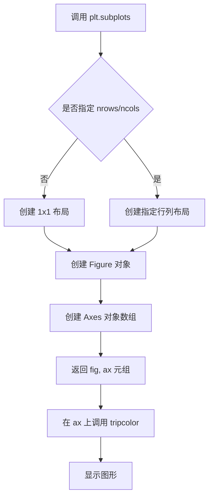

#### 带注释源码

```python
# 第一种用法：创建单个子图
fig1, ax1 = plt.subplots()
# fig1: 图形对象
# ax1: 坐标轴对象
ax1.set_aspect('equal')  # 设置坐标轴长宽比相等
tpc = ax1.tripcolor(triang, z, shading='flat')  # 绘制 flat 着色 tripcolor
fig1.colorbar(tpc)  # 添加颜色条
ax1.set_title('tripcolor of Delaunay triangulation, flat shading')  # 设置标题

# 第二种用法：创建单个子图用于 gouraud 着色
fig2, ax2 = plt.subplots()
ax2.set_aspect('equal')
tpc = ax2.tripcolor(triang, z, shading='gouraud')  # 绘制 gouraud 着色 tripcolor
fig2.colorbar(tpc)
ax2.set_title('tripcolor of Delaunay triangulation, gouraud shading')

# 第三种用法：创建单个子图，指定用户三角形网格
fig3, ax3 = plt.subplots()
ax3.set_aspect('equal')
# 使用 x, y 坐标、triangles 数组和 facecolors 参数
tpc = ax3.tripcolor(x, y, triangles, facecolors=zfaces, edgecolors='k')
fig3.colorbar(tpc)
ax3.set_title('tripcolor of user-specified triangulation')
ax3.set_xlabel('Longitude (degrees)')
ax3.set_ylabel('Latitude (degrees)')

# 显示所有图形
plt.show()
```


### `matplotlib.pyplot.show`

显示一个或多个图形窗口。该函数会阻塞程序的执行，直到用户关闭所有打开的图形窗口（在某些后端中），或者在交互式模式下会立即返回。

参数：

- `block`：`bool`，可选参数。默认为 True，表示是否阻塞程序执行以等待图形窗口关闭。如果设置为 False，则在某些后端中会以非阻塞方式显示图形。

返回值：`None`，该函数无返回值。

#### 流程图

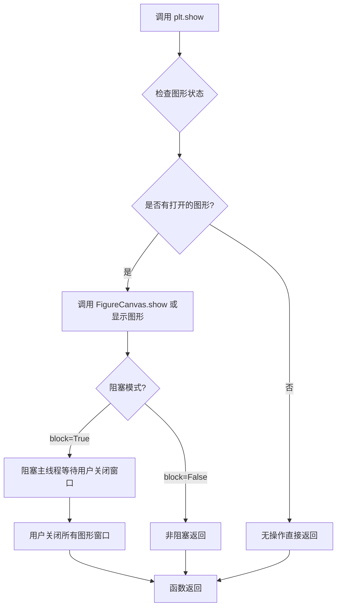

#### 带注释源码

```python
def show(*, block=None):
    """
    显示所有打开的图形窗口。
    
    该函数会调用所有打开的 Figure 实例的 show 方法，
    并根据 block 参数决定是否阻塞主线程。
    
    参数:
        block (bool, optional): 
            是否阻塞程序执行。默认为 True。
            如果为 True，程序会阻塞直到用户关闭所有图形窗口。
            如果为 False，函数会立即返回（取决于后端）。
    
    返回值:
        None
    """
    # 获取全局显示管理器
    global _show_blocks
    
    # 遍历所有打开的图形canvas并显示
    for manager in Gcf.get_all_fig_managers():
        # 调用每个图形管理器的show方法
        manager.show()
    
    # 如果block为True或未设置（默认），则阻塞
    if block is None:
        # 默认行为：交互式模式下可能不阻塞
        block = rcParams['interactive'] is False
    
    if block:
        # 阻塞主循环，进入事件循环等待
        # 这允许用户与图形交互
        import time
        while Gcf.get_all_fig_managers():
            # 处理后台事件
            Gcf._do_on_figures_closed()
            time.sleep(0.1)
    
    return None
```

**注**：上述源码为简化版本，实际的 `matplotlib.pyplot.show` 实现会根据不同的后端（如 TkAgg、Qt5Agg、MacOSX 等）有不同的具体实现。核心逻辑是调用各图形管理器的 `show()` 方法来渲染并显示图形。


## 关键组件


### Triangulation（三角剖分对象）

用于表示非结构化三角网格的核心类，通过 Delaunay 三角剖分或用户指定的三角形索引创建网格，并支持掩码操作来隐藏不需要的三角形。

### 张量索引与数组操作

使用 NumPy 高级索引（如 `x[triangles]`, `y[triangles]`, `triang.triangles`）进行向量化计算，实现三角形顶点批量提取和面心坐标计算（`xmid`, `ymid`）。

### tripcolor 绘图函数

Matplotlib Axes 核心方法，支持三种着色模式：flat（面着色）、gouraud（ Gouraud 插值着色）、facecolors（用户指定每面颜色），并可叠加边缘线条。

### 掩码机制（set_mask）

通过 `np.hypot` 计算三角形面心到原点的距离，使用布尔掩码过滤半径小于阈值的三角形，实现选择性渲染。

### 着色模式量化策略

支持两种量化策略：flat shading 对每个三角形面赋予单一颜色值；gouraud shading 通过顶点颜色插值实现平滑过渡，后者本质上是对离散数据的高阶量化。

### 坐标生成与变换

使用极坐标系统生成均匀分布的采样点（`n_angles` × `n_radii`），通过 `np.repeat` 和角度偏移（`np.pi / n_angles`）构造非均匀网格，并转换为笛卡尔坐标。

### 数据流处理流程

原始坐标数据 → Triangulation 对象构建 → 可选掩码过滤 → tripcolor 渲染 → colorbar 可视化颜色映射 → 显示输出。


## 问题及建议


### 已知问题

-   **代码封装性差**：所有代码都在顶层脚本中执行，没有封装成函数或类，难以复用和测试。
-   **硬编码值过多**：如`n_angles = 36`、`n_radii = 8`、`min_radius = 0.25`等魔法数字散布在代码中，缺乏配置管理和解释性注释。
-   **重复计算**：第一次Delaunay三角剖分创建后又被遮罩（mask），这导致了不必要的计算开销。
-   **缺少类型注解**：没有使用Python类型提示（type hints），降低了代码的可读性和IDE支持。
-   **缺乏错误处理**：没有对输入数据进行验证，如`x`、`y`、`z`数组长度匹配、坐标有效性等。
-   **数据验证缺失**：没有对用户提供的三角形索引数组进行有效性验证，可能导致运行时错误或静默失败。
-   **matplotlib资源管理**：创建了多个figure但未显式关闭（`plt.close()`），可能导致资源泄漏。
-   **代码可读性差**：坐标生成的数组操作过于复杂（如`np.repeat(angles[..., np.newaxis], n_radii, axis=1)`），缺乏中间变量解释。

### 优化建议

-   **提取配置常量**：将所有硬编码数值提取到顶部的配置字典或类中，便于维护和调整。
-   **封装为函数**：将数据准备、绘图逻辑封装为独立函数，如`create_delaunay_triangulation()`、`plot_tripcolor()`等，提高代码模块化。
-   **添加类型注解**：为所有函数参数和返回值添加类型提示，提升代码可维护性。
-   **优化三角剖分**：考虑直接使用已知的好三角形索引，避免先创建Delaunay再遮罩的低效模式。
-   **添加数据验证**：在处理坐标和三角形索引前，添加长度检查、范围验证等。
-   **使用上下文管理器**：使用`with plt.style.context():`或显式关闭figure管理matplotlib资源。
-   **增加文档字符串**：为关键函数添加docstring，说明参数、返回值和用途。
-   **简化复杂表达式**：将复杂的数组操作分解为多个中间步骤，并添加注释说明。
-   **考虑使用类封装**：将相关的绘图功能封装到类中，使用`__init__`存储配置，`plot()`方法执行绘图。
-   **布局优化**：考虑使用`fig.tight_layout()`或`constrained_layout=True`改善颜色条与主图的布局。


## 其它


### 设计目标与约束

本代码演示了matplotlib中tripcolor函数的三种使用场景：使用Delaunay三角剖分的flat shading、使用Delaunay三角剖分的gouraud shading、以及用户自定义三角剖分。设计目标是展示如何对非结构化三角网格进行伪彩色绘图，并比较不同shading模式的效果。约束包括：需要matplotlib、numpy库支持；坐标点必须形成有效的三角网格；facecolors参数要求每个三角形有一个颜色值。

### 错误处理与异常设计

代码主要依赖matplotlib和numpy的异常机制。当坐标数组为空或形状不匹配时，Triangulation会抛出ValueError；当三角形索引超出范围时会产生索引错误；shading参数只接受'flat'或'gouraud'字符串，否则触发参数验证错误。代码未进行显式的输入验证，假设调用者提供有效数据。

### 数据流与状态机

代码的数据流为：坐标生成(x, y) → Triangulation对象创建 → 可选掩码设置 → tripcolor绘图 → colorbar添加 → 图形显示。状态机包含三个独立演示流程，每个流程创建新的figure和axes对象，共享Triangulation类进行处理。三角形数据从numpy数组经过mean计算生成面中心坐标，再通过指数函数计算颜色值。

### 外部依赖与接口契约

外部依赖包括：matplotlib.pyplot（绘图框架）、matplotlib.tri.Triangulation（三角剖分类）、numpy（数值计算）。关键接口契约：tripcolor接受(triangulation, z)或(x, y, triangles, facecolors=zfaces)参数组合；shading参数限定为'flat'或'gouraud'；Triangulation构造函数接受(x, y)坐标数组，可选triangles参数指定自定义三角形索引。

### 性能考虑

代码中Delaunay三角剖分在点较多时计算量较大，建议重复使用时创建Triangulation对象缓存。facecolors方式直接传递三角形颜色数组，避免了z值到颜色的插值计算。set_mask操作对大型网格有优化空间，当前实现对小规模演示数据（36×8=288个点）性能可接受。

### 版本兼容性

代码使用matplotlib较新的tripcolor API，需要matplotlib 1.4以上版本。numpy使用标准的linspace、repeat、hypot等函数，兼容性良好。代码遵循Python 3语法，不支持Python 2。Triangulation.set_mask方法在较旧版本中可能不存在。

### 测试策略建议

应测试以下场景：空坐标数组输入、坐标形状不匹配、三角形索引越界、无效shading参数、坐标包含NaN或Inf值、极端大小数据集性能。当前代码为演示脚本，缺乏单元测试，建议添加参数化测试覆盖各种输入组合。

### 可扩展性设计

当前设计支持通过继承Axes类方法扩展新的shading模式。Triangulation类可扩展支持其他三角剖分算法（如Delaunay变体）。colorbar可扩展支持自定义颜色映射和归一化方式。代码结构适合添加动画或多帧渲染能力。

    