# `matplotlib\galleries\examples\images_contours_and_fields\triplot_demo.py` 详细设计文档

这是一个matplotlib triplot演示脚本，展示了如何创建和绘制非结构化三角网格，包括自动Delaunay三角剖分和用户指定三角形的两种方式。

## 整体流程

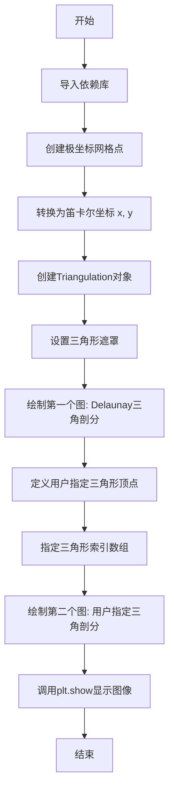

## 类结构

```
本脚本为面向过程代码，无自定义类
主要依赖 matplotlib.tri.Triangulation 类
流程: 数据准备 -> Triangulation创建 -> 绘图
```

## 全局变量及字段


### `n_angles`
    
角度采样点数，用于生成极坐标网格的角度分辨率

类型：`int`
    


### `n_radii`
    
半径采样点数，用于生成极坐标网格的半径分辨率

类型：`int`
    


### `min_radius`
    
最小半径值，用于筛选Delaunay三角形中小于该值的三角形

类型：`float`
    


### `radii`
    
半径数组，包含从最小半径到0.95的线性间隔值

类型：`numpy.ndarray`
    


### `angles`
    
角度数组，包含从0到2π的角度值，并进行了交错偏移以优化网格分布

类型：`numpy.ndarray`
    


### `x`
    
笛卡尔坐标x，通过极坐标转换得到的x坐标数组

类型：`numpy.ndarray`
    


### `y`
    
笛卡尔坐标y，通过极坐标转换得到的y坐标数组

类型：`numpy.ndarray`
    


### `triang`
    
三角剖分对象，基于x和y坐标自动进行Delaunay三角化

类型：`matplotlib.tri.Triangulation`
    


### `fig1`
    
第一个图形对象，用于展示Delaunay三角化结果

类型：`matplotlib.figure.Figure`
    


### `ax1`
    
第一个坐标轴对象，用于绘制Delaunay三角网

类型：`matplotlib.axes.Axes`
    


### `xy`
    
用户指定顶点坐标数组，包含一组经纬度坐标点

类型：`numpy.ndarray`
    


### `triangles`
    
用户指定三角形索引数组，定义每个三角形的三个顶点索引

类型：`numpy.ndarray`
    


### `fig2`
    
第二个图形对象，用于展示用户指定的三角化结果

类型：`matplotlib.figure.Figure`
    


### `ax2`
    
第二个坐标轴对象，用于绘制用户指定的三角网

类型：`matplotlib.axes.Axes`
    


    

## 全局函数及方法


### `plt.subplots()`

`plt.subplots()` 是 Matplotlib 库中的核心函数，用于创建一个新的图形（Figure）对象以及一个或多个子图坐标轴（Axes）对象，提供灵活的子图布局管理功能，是进行多子图绑制的基础接口。

参数：

- `nrows`：`int`，默认值=1，子图的行数
- `ncols`：`int`，默认值=1，子图的列数
- `sharex`：`bool` 或 `str`，默认值=False，如果为True，则所有子图共享x轴；如果为'col'，则每列子图共享x轴
- `sharey`：`bool` 或 `str`，默认值=False，如果为True，则所有子图共享y轴；如果为'row'，则每行子图共享y轴
- `squeeze`：`bool`，默认值=True，如果为True，则返回的axes对象维度会被压缩：单子图返回Axes对象，多子图返回Axes数组
- `width_ratios`：`array-like`，子图列宽比例
- `height_ratios`：`array-like`，子图行高比例
- `subplot_kw`：`dict`，关键字参数，传递给`add_subplot`的方法
- `gridspec_kw`：`dict`，关键字参数，传递给`GridSpec`构造函数的参数
- `figsize`：`tuple`，图形的宽和高（英寸）
- `facecolor`：图形背景色
- `edgecolor`：图形边框颜色
- `linewidth`：图形边框线宽
- `tight_layout`：`bool`，是否自动调整子图参数以适应图形区域

返回值：`tuple(Figure, Axes or ndarray of Axes)`，返回一个元组，包含Figure对象和Axes对象（或Axes对象数组）

#### 流程图

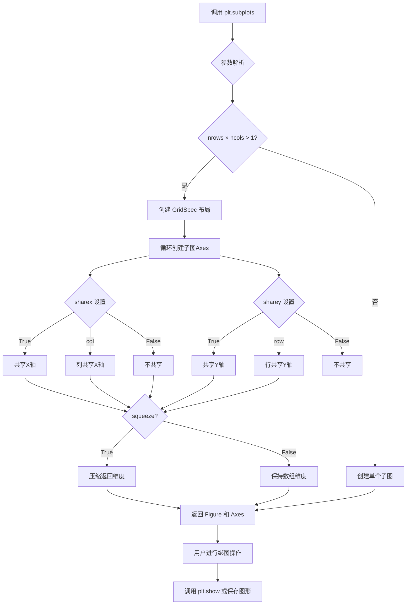

#### 带注释源码

```python
def subplots(nrows=1, ncols=1, sharex=False, sharey=False, 
             squeeze=True, width_ratios=None, height_ratios=None,
             subplot_kw=None, gridspec_kw=None, **fig_kw):
    """
    创建图形和子图坐标轴的便捷函数。
    
    参数:
        nrows: 子图行数，默认为1
        ncols: 子图列数，默认为1
        sharex: 控制x轴共享，可为True/False/'col'
        sharey: 控制y轴共享，可为True/False/'row'
        squeeze: 是否压缩返回的数组维度
        width_ratios: 各列宽度比例
        height_ratios: 各行高度比例
        subplot_kw: 传递给add_subplot的关键字
        gridspec_kw: 传递给GridSpec的关键字
        **fig_kw: 传递给Figure构造函数的关键字
    
    返回:
        fig: Figure对象
        ax: Axes对象或Axes数组
    """
    # 1. 创建Figure对象
    fig = figure(**fig_kw)
    
    # 2. 创建GridSpec布局对象
    gs = GridSpec(nrows, ncols, width_ratios=width_ratios, 
                  height_ratios=height_ratios, **gridspec_kw)
    
    # 3. 循环创建子图
    axarr = np.empty((nrows, ncols), dtype=object)
    for i in range(nrows):
        for j in range(ncols):
            # 创建子图位置
            ax = fig.add_subplot(gs[i, j], **subplot_kw)
            axarr[i, j] = ax
            
            # 处理共享x轴
            if sharex and i > 0:
                ax.sharex(axarr[0, j])
            elif sharex == 'col' and i > 0:
                ax.sharex(axarr[0, j])
            
            # 处理共享y轴
            if sharey and j > 0:
                ax.sharey(axarr[i, 0])
            elif sharey == 'row' and j > 0:
                ax.sharey(axarr[i, 0])
    
    # 4. 处理返回值
    if squeeze and nrows == 1 and ncols == 1:
        # 单个子图，返回Axes对象而非数组
        return fig, axarr[0, 0]
    elif squeeze and (nrows == 1 or ncols == 1):
        # 压缩为一维数组
        return fig, axarr.ravel()[()]
    else:
        # 返回二维数组
        return fig, axarr
```

### 文件的整体运行流程

本代码演示了如何使用 Matplotlib 的 `triplot` 函数绑制非结构化三角形网格。整体流程如下：

1. **导入依赖**：导入 `matplotlib.pyplot`、`numpy` 和 `matplotlib.tri` 模块
2. **第一部分 - Delaunay 三角剖分**：
   - 生成极坐标网格点（36个角度，8个半径）
   - 将极坐标转换为笛卡尔坐标
   - 创建 `Triangulation` 对象（自动进行 Delaunay 三角剖分）
   - 使用 `set_mask` 遮蔽超出最小半径的三角形
   - 调用 `plt.subplots()` 创建图形和坐标轴
   - 使用 `ax.triplot()` 绑制三角网格
3. **第二部分 - 自定义三角剖分**：
   - 定义一组二维坐标点
   - 手动指定三角形顶点索引
   - 直接将 x、y 和 triangles 数组传递给 `triplot`
   - 调用 `plt.subplots()` 创建第二个图形
   - 设置坐标轴标签和标题
4. **显示图形**：调用 `plt.show()` 渲染并显示所有图形

### 关键组件信息

| 名称 | 一句话描述 |
|------|------------|
| `matplotlib.pyplot` | Matplotlib 的 MATLAB 风格绘图接口，提供便捷的图形创建和绑图函数 |
| `matplotlib.tri` | 包含三角网格相关类和函数的模块，用于处理非结构化三角形数据 |
| `Triangulation` | 表示三角网格的数据结构，包含节点坐标和三角形顶点索引 |
| `plt.subplots()` | 创建图形和子图坐标轴的工厂函数，返回 (Figure, Axes) 元组 |
| `ax.triplot()` | 在坐标轴上绑制三角形网格的专用方法，支持多种输入格式 |

### 潜在的技术债务或优化空间

1. **重复计算**：代码中两次调用 `plt.subplots()` 创建独立的图形，如果需要同时显示多个子图，可以合并为一个调用，提高窗口管理效率
2. **硬编码参数**：`n_angles=36`、`n_radii=8` 等参数硬编码，建议提取为配置文件或命令行参数
3. **缺少错误处理**：坐标数组为空或三角形索引越界时没有异常捕获和提示
4. **图形资源释放**：未显式调用 `plt.close(fig)` 释放图形资源，在大规模绑图中可能导致内存泄漏

### 其它项目

**设计目标与约束**：
- 目标：展示 `triplot` 绑制非结构化三角形网格的两种方式（Delaunay 自动剖分和手动指定）
- 约束：使用 Matplotlib 兼容的数据格式（numpy 数组）

**错误处理与异常设计**：
- 当三角形索引超出点数组范围时，Matplotlib 会抛出 `ValueError`
- 当输入坐标为空时，会创建空图形

**数据流与状态机**：
- 输入：坐标数组 (x, y) 和可选的三角形索引数组
- 处理：Delaunay 三角剖分计算 → 三角形遮蔽 → 图形渲染
- 输出：可视化图形窗口或图像文件

**外部依赖与接口契约**：
- 依赖：`numpy`、`matplotlib`
- 接口：numpy 数组输入，返回 Matplotlib 图形对象


### `tri.Triangulation(x, y)`

#### 描述

`tri.Triangulation(x, y)` 是 `matplotlib.tri` 模块中的核心类构造函数。该函数用于根据输入的二维坐标点创建并返回一个 `Triangulation`（三角剖分）对象。如果未显式提供三角形顶点索引 (`triangles` 参数)，该方法将在内部自动执行 Delaunay 三角化算法，将平面上的离散点连接成三角网格。该对象存储了网格的坐标、拓扑关系以及可选的掩码（mask），是后续绘制等高线图、三角网图（triplot）的基础。

#### 参数

- `x`：`array_like`（通常为 `numpy.ndarray`），表示平面上点的 X 坐标。
- `y`：`array_like`（通常为 `numpy.ndarray`），表示平面上点的 Y 坐标。

*(注：在完整的 API 定义中，通常还包括 `triangles` 和 `mask` 参数，但在本任务指定的调用形式 `tri.Triangulation(x, y)` 中，主要关注坐标输入。)*

#### 返回值

- `matplotlib.tri.Triangulation`：返回一个包含点坐标 (x, y) 和三角形索引 (triangles) 的三角剖分对象。

#### 流程图

```mermaid
flowchart TD
    A([开始: 输入 x, y]) --> B{是否传入 triangles 参数?}
    B -- 否 (调用形式 tri.Triangulation(x, y)) --> C[调用 Delaunay 三角化算法]
    C --> D[生成三角形索引数组]
    B -- 是 --> D
    D --> E[初始化 Triangulation 对象]
    E --> F[设置默认 Mask (全为 False)]
    F --> G([返回 Triangulation 实例])
```

#### 带注释源码

以下代码展示了 `Triangulation` 类的构造函数逻辑，以及在示例代码中的具体调用方式。

```python
import numpy as np
import matplotlib.tri as tri

# --- 模拟 Triangulation 类的构造函数逻辑 ---
class Triangulation:
    def __init__(self, x, y, triangles=None, mask=None):
        """
        初始化三角剖分对象。
        
        参数:
            x: array_like, X坐标
            y: array_like, Y坐标
            triangles: array_like, 可选，自定义的三角形顶点索引
            mask: array_like, 可选，用于隐藏某些三角形
        """
        # 1. 参数类型检查与转换，确保输入为 numpy 数组
        self.x = np.asarray(x)
        self.y = np.asarray(y)
        
        # 2. 判定逻辑：如果未提供 triangles，则自动计算 Delaunay 三角剖分
        if triangles is None:
            # 调用 matplotlib 内部的 C 语言扩展或纯 Python 实现进行三角化
            # 这里的 self._triangles 是计算结果
            self.triangles = self._compute_delaunay(self.x, self.y)
        else:
            self.triangles = np.asarray(triangles)
            
        # 3. 处理 Mask（掩码），用于在绘图中隐藏特定三角形
        if mask is None:
            # 默认创建一个全 False 的掩码，表示所有三角形可见
            self.mask = np.zeros(len(self.triangles), dtype=bool)
        else:
            self.mask = np.asarray(mask)

    def _compute_delaunay(self, x, y):
        """内部方法：执行 Delaunay 三角化"""
        # ... (调用底层 C 库或 qhull 等算法库的细节)
        pass

# --- 用户代码中的实际调用示例 ---
# 1. 定义坐标点
n_angles = 36
n_radii = 8
min_radius = 0.25
radii = np.linspace(min_radius, 0.95, n_radii)

angles = np.linspace(0, 2 * np.pi, n_angles, endpoint=False)
angles = np.repeat(angles[..., np.newaxis], n_radii, axis=1)
angles[:, 1::2] += np.pi / n_angles

x = (radii * np.cos(angles)).flatten()
y = (radii * np.sin(angles)).flatten()

# 2. 调用 Triangulation 构造函数
# 行为：根据 x, y 自动生成三角网格
triang = tri.Triangulation(x, y)

# 3. 使用 set_mask 方法进一步修改网格（属于对象方法）
triang.set_mask(np.hypot(x[triang.triangles].mean(axis=1),
                         y[triang.triangles].mean(axis=1))
                < min_radius)
```


```json
```json
{
  "name": "triang.set_mask(mask)",
  "category": "类方法",
  "description": "设置三角形遮罩数组，用于控制 Triangulation 对象中哪些三角形应该被隐藏或不绘制",
  "parameters": [
    {
      "name": "mask",
      "type": "numpy.ndarray 或 None",
      "description": "布尔类型的一维数组，长度等于三角形数量。True 表示对应的三角形将被遮蔽（不绘制），False 表示显示该三角形。如果设置为 None，则清除所有遮罩"
    }
  ],
  "return": {
    "type": "None",
    "description": "该方法没有返回值（None），直接修改 Triangulation 对象的内部状态"
  }
}
```

### `triang.set_mask(mask)`

设置三角形遮罩，指定 Triangulation 对象中哪些三角形应该被隐藏（即不参与绘图）

参数：
-  `mask`：`numpy.ndarray`，布尔类型的一维数组，长度必须与三角形数量相同。`True` 表示遮蔽对应三角形，`False` 表示显示三角形。也可以是 `None`，用于清除所有遮罩

返回值：`None`，无返回值，直接修改对象内部状态

#### 流程图

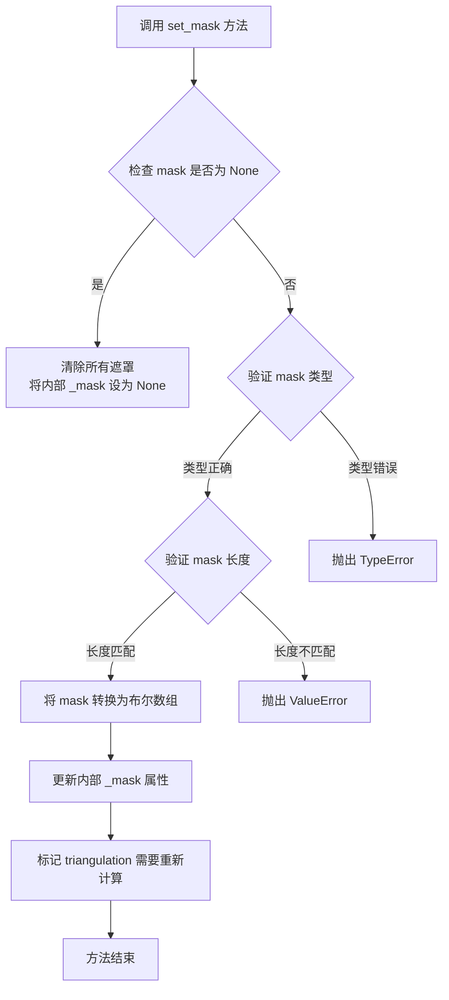

#### 带注释源码

```python
# 源码位于 matplotlib/tri/triangulation.py 文件中
# 以下为简化版本的核心逻辑

def set_mask(self, mask):
    """
    Set the array of masks for the triangulation.
    
    This function is used to hide (mask) certain triangles in the 
    triangulation so that they are not plotted or considered in 
    subsequent calculations.
    
    Parameters
    ----------
    mask : array-like or None
        A boolean array of length ntri (number of triangles).
        If True, the triangle will be masked (hidden).
        If False, the triangle will be shown.
        If None, all masks will be cleared.
    """
    # 如果 mask 为 None，清除所有遮罩
    if mask is None:
        self._mask = None
    else:
        # 将 mask 转换为 numpy 数组
        mask = np.asarray(mask, dtype=bool)
        
        # 验证 mask 长度是否与三角形数量匹配
        if len(mask) != len(self.triangles):
            raise ValueError(
                f"mask length ({len(mask)}) must equal number of "
                f"triangles ({len(self.triangles)})"
            )
        
        # 更新内部 _mask 属性
        self._mask = mask
        
        # 标记需要重新计算（如外接圆等）
        self._compute_edges()
    
    # 注意：此方法直接修改对象状态，不返回任何值
```

#### 使用示例

```python
# 基于用户提供的代码示例
import numpy as np
import matplotlib.tri as tri

# 创建三角剖分对象
n_angles = 36
n_radii = 8
min_radius = 0.25
radii = np.linspace(min_radius, 0.95, n_radii)

angles = np.linspace(0, 2 * np.pi, n_angles, endpoint=False)
angles = np.repeat(angles[..., np.newaxis], n_radii, axis=1)
angles[:, 1::2] += np.pi / n_angles

x = (radii * np.cos(angles)).flatten()
y = (radii * np.sin(angles)).flatten()

# 创建 Triangulation（自动进行 Delaunay 三角化）
triang = tri.Triangulation(x, y)

# 设置遮罩：隐藏靠近原点的三角形
# 计算每个三角形中心点到原点的距离
mask = np.hypot(x[triang.triangles].mean(axis=1),
                y[triang.triangles].mean(axis=1)) < min_radius

# 调用 set_mask 方法
# 距离小于 min_radius 的三角形将被遮蔽
triang.set_mask(mask)

# 后续可以使用 ax.triplot(triang, 'bo-', lw=1) 绘制
# 被遮蔽的三角形将不会显示
```


### `ax1.triplot` (或 `Axes.triplot`)

该函数是 `matplotlib.axes.Axes` 类的一个方法，用于在二维坐标平面上绘制非结构化三角网格（unstructured triangular grid）。它接受坐标数据或 `Triangulation` 对象，并可选地使用格式字符串和关键字参数调用底层的 `plot` 方法来渲染三角形的边。

参数：

-  `x`：`array-like`，可选。x 坐标序列。如果不提供 `triangulation`，则必须提供。
-  `y`：`array-like`，可选。y 坐标序列。如果不提供 `triangulation`，则必须提供。
-  `triangles`：`array-like`，可选。三角形索引数组，形状为 `(n_triangles, 3)`。如果不提供，将基于 `x` 和 `y` 进行 Delaunay 三角剖分。
-  `mask`：`array-like`，可选。布尔数组，用于屏蔽（不绘制）某些三角形。
-  `fmt`：`str`，可选。格式字符串（如 `'bo-'`、`'go-'`），用于指定线条颜色、标记和样式，语法与 `plot` 方法一致。
-  `**kwargs`：关键字参数，其他参数将直接传递给底层的 `Axes.plot` 方法，用于控制线条属性（如 `lw`, `alpha` 等）。

返回值：`list of matplotlib.lines.Line2D`，返回一个包含所绘制线条（Line2D）对象的列表。

#### 流程图

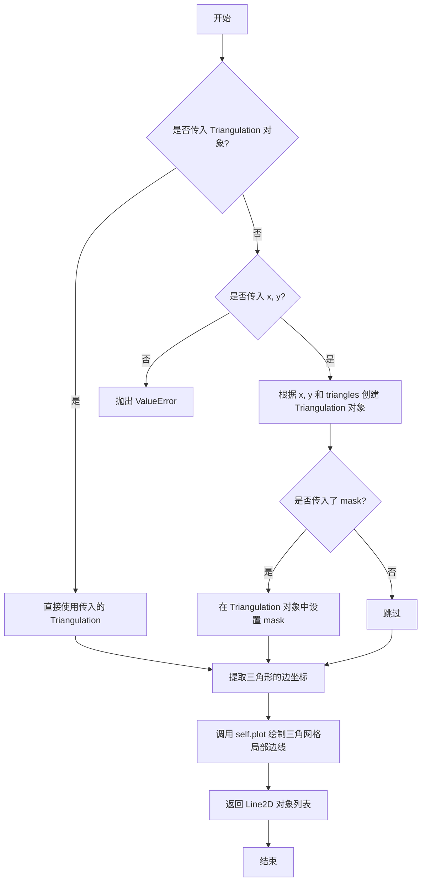

#### 带注释源码

```python
# 假设这是 Axes.triplot 方法的内部核心逻辑简化版

def triplot(self, *args, **kwargs):
    """
    在 Axes 对象上绘制三角网格。
    
    参数处理示例：
    ax.triplot(x, y, triangles, 'bo-', lw=1)
    ax.triplot(triangulation_object, 'go-')
    """
    
    # 1. 参数解析：检查第一个参数是否为 Triangulation 对象
    if args and isinstance(args[0], tri.Triangulation):
        # 如果是，直接使用该对象（例如代码中的 ax1.triplot(triang, 'bo-', lw=1)）
        triang = args[0]
        # 剩余参数视为 fmt 和其他关键字参数
        args = args[1:]
    else:
        # 如果不是，则尝试将位置参数解析为 x, y, triangles
        # 这里需要解析 args 和 kwargs 来提取坐标和索引
        # (实际实现中会使用 _triplot_args_helper 等辅助函数)
        x, y, triangles = self._parse_triplot_args(args, kwargs)
        
        # 从坐标创建 Triangulation 对象
        # 例如代码中的 ax2.triplot(x, y, triangles, 'go-', lw=1.0)
        mask = kwargs.pop('mask', None) # 提取 mask 如果存在
        triang = tri.Triangulation(x, y, triangles, mask)

    # 2. 获取三角形顶点的坐标
    # triang.triangles 包含索引，triang.x 和 triang.y 包含坐标
    x = triang.x
    y = triang.y
    triangles = triang.triangles
    
    # 3. 构建用于绘制线条的坐标
    # 每个三角形有3条边，我们需要将三角形索引转换为边的坐标序列
    # 这通常涉及提取每对顶点并将它们连接起来
    # (内部实现会生成适合 plot 的 x, y 交错数组)
    plot_coords = triang.get_transformed_path() # 这里的逻辑较复杂，简化表示
    
    # 4. 调用底层 plot 方法进行绘制
    # kwargs 中可能包含 'color', 'linewidth' (lw), 'linestyle' 等
    lines = self.plot(plot_coords[0], plot_coords[1], *args, **kwargs)
    
    # 5. 返回 Line2D 对象列表
    return lines
```


### `ax2.triplot`

`ax2.triplot` 是 Matplotlib 库中 `Axes` 类的一个方法，用于绘制非结构化的三角网格图（Triangular Mesh）。它接受 x 和 y 坐标以及可选的三角形索引，根据这些数据生成三角形的边界线。

参数：

-  `x`：`numpy.ndarray` 或 array-like，X坐标。
-  `y`：`numpy.ndarray` 或 array-like，Y坐标。
-  `triangles`：`numpy.ndarray`，可选参数，形状为 `(n_triangles, 3)` 的整数数组，指定构成每个三角形的顶点索引。如果不提供，则默认执行 Delaunay 三角剖分。
-  `fmt`：`str`，可选参数，格式字符串（如 `'go-''`），用于控制线条和标记的样式。
-  `**kwargs`：`dict`，关键字参数，这些参数会被传递给底层的 `plot` 方法（例如 `lw=1.0` 用于设置线宽）。

返回值：`list` of `matplotlib.lines.Line2D`，返回由该方法创建的所有线条对象列表。

#### 流程图

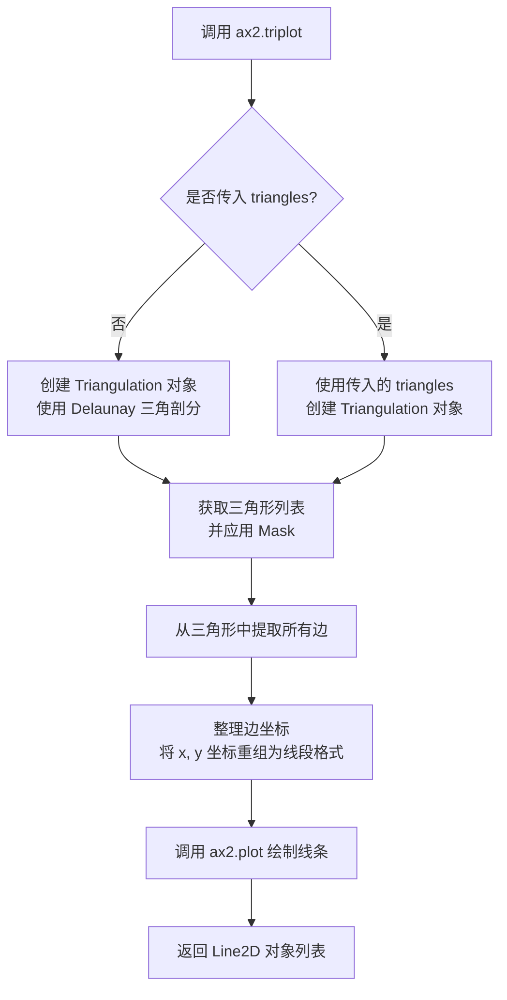

#### 带注释源码

由于 `triplot` 属于外部库 (Matplotlib)，其源码并未包含在当前提供的代码片段中。以下为基于 Matplotlib 公开逻辑重构的**结构化伪代码**，用于展示其核心执行流程：

```python
def triplot(self, x, y, triangles=None, *args, **kwargs):
    """
    绘制三角网格图。
    
    参数:
        self: Axes 对象实例
        x: x 坐标数组
        y: y 坐标数组
        triangles: 三角形索引数组 (可选)
        *args: 位置参数，通常用于 fmt 格式字符串
        **kwargs: 关键字参数，如 lw (线宽), color 等
    """
    # 1. 处理三角剖分
    # 如果没有提供 triangles，则自动使用 Delaunay 算法生成三角网格
    if triangles is None:
        # 导入通常在实际代码中由 import 处理
        # triang = tri.Triangulation(x, y)
        pass 
    else:
        # 使用用户提供的三角形索引
        # triang = tri.Triangulation(x, y, triangles)
        pass

    # 2. 获取有效的三角形（考虑 Mask）
    # masked_triangles = triang.get_masked_triangles()
    # 这会过滤掉被遮罩（Mask）的三角形

    # 3. 提取边
    # 三角形由 3 个顶点组成，每两个顶点构成一条边。
    # 需要将三角形数组 (例如 Nx3) 转换为边的列表，并去重。
    # edges = ... # 提取逻辑
    
    # 4. 准备绘图数据
    # 根据边的索引，提取对应的 x, y 坐标。
    # x_plot = x[edges]
    # y_plot = y[edges]

    # 5. 调用底层 plot 方法
    # 使用提取出的边坐标调用 self.plot 进行绘制
    # return self.plot(x_plot, y_plot, *args, **kwargs)
    
    # 在本例中调用为: ax2.triplot(x, y, triangles, 'go-', lw=1.0)
    # 实际执行: plot(x_edges, y_edges, 'go-', lw=1.0)
    pass
```

### 2. 文件的整体运行流程

本文件是一个标准的 Matplotlib 脚本 `Triplot Demo`，演示了两种绘制三角网格图的方法。

1.  **环境初始化**：导入 `matplotlib.pyplot`、`numpy` 和 `matplotlib.tri`。
2.  **自动三角剖分演示**：
    - 生成极坐标网格数据（角度和半径）。
    - 将极坐标转换为笛卡尔坐标 `(x, y)`。
    - 创建 `Triangulation` 对象（不指定三角形时，使用 Delaunay 算法自动生成）。
    - 使用 `set_mask` 去除中心区域不符合条件的三角形。
    - 调用 `ax1.triplot` 绘制第一幅图。
3.  **指定三角形演示**：
    - 手动定义一组复杂的平面坐标点 `xy`。
    - 手动定义三角形索引数组 `triangles`。
    - 调用 `ax2.triplot`，将 `x, y` 和 `triangles` 作为参数传入，直接绘制而不经过 Delaunay 计算。
4.  **渲染展示**：调用 `plt.show()` 弹出窗口显示图形。

### 3. 关键组件信息

-   **`matplotlib.tri.Triangulation`**：核心数据结构，用于存储网格点坐标和三角形连接关系，并提供生成掩码（mask）和获取三角形边的功能。
-   **`matplotlib.axes.Axes.triplot`**：绘图接口，封装了从三角网数据到绘制线条的转换逻辑。
-   **`numpy.linalg.norm` (或 `np.hypot`)**：用于计算距离，在生成掩码时判断三角形到原点的距离。

### 4. 潜在的技术债务或优化空间

-   **数据硬编码**：在第二个示例中，`xy` 坐标和 `triangles` 数组是直接以数字形式硬编码在代码中的。这不仅使代码冗长、难以阅读，而且数据本身占用大量行数。优化方向是将数据外部化（如存入 CSV 或 JSON 文件），或在运行时动态生成。
-   **重复计算**：示例代码中使用了两种不同的绘图方式（对象式和直接传入数组式）。在实际项目中，如果多次使用同一个三角网格，创建 `Triangulation` 对象可以缓存计算结果，提高性能。

### 5. 其它项目

**设计目标与约束**：
`triplot` 的设计目标是提供一个简便的接口，既支持全自动的 Delaunay 三角剖分，也支持用户手动干预（自定义三角形索引）。它底层依赖于稳健的 `Triangulation` 类来处理各种边界情况（如自相交）。

**错误处理与异常设计**：
-   如果 `x` 和 `y` 长度不匹配，会抛出异常。
-   如果 `triangles` 中的索引超出 `x` 或 `y` 的范围，会导致绘制错误或异常。
-   Matplotlib 内部通常会尝试处理无效数据，但在 `triplot` 中，如果三角形数量为 0 或坐标无效，可能不会绘制任何内容。

**外部依赖与接口契约**：
-   依赖 `numpy` 进行数值计算。
-   依赖 `matplotlib.tri` 进行网格处理。
-   返回值为标准 Matplotlib artist 列表（`Line2D`），因此可以进一步使用 Matplotlib 的标准 API（如 `set_color`, `set_label`）对其进行属性修改。


### `plt.show()`

显示所有打开的图形窗口。该函数会阻塞程序执行（默认行为），直到用户关闭所有图形窗口，或者以非阻塞模式运行。

参数：

- `block`：`bool`，可选参数，控制是否阻塞程序执行。如果为 `True`，代码将等待所有图形窗口关闭后才返回；如果为 `False`，代码将继续执行，图形将以非阻塞方式显示。默认值为 `None`，在交互模式下默认为 `True`，在非交互模式下默认为 `False`。

返回值：`None`，该函数无返回值。

#### 流程图

```mermaid
graph TD
    A[开始调用 plt.show()] --> B{是否有打开的图形?}
    B -->|是| C[显示所有图形]
    C --> D{block 参数值?}
    D -->|True| E[阻塞模式<br/>等待用户关闭图形窗口]
    D -->|False| F[非阻塞模式<br/>立即返回继续执行]
    D -->|None| G{是否交互模式?}
    G -->|是| E
    G -->|否| F
    E --> H[所有窗口关闭后返回]
    F --> I[返回继续执行]
    B -->|否| J[直接返回]
    H --> K[结束]
    I --> K
    J --> K
```

#### 带注释源码

```python
def show(*, block=None):
    """
    显示所有打开的图形窗口。
    
    Parameters
    ----------
    block : bool, optional
        如果 block 为 True，代码将阻塞等待直到所有图形窗口关闭。
        如果 block 为 False，图形将以非阻塞方式显示，代码继续执行。
        默认为 None，在交互模式下为 True，非交互模式下为 False。
    """
    # 获取当前所有的图形对象
    figs = get_fignums()
    
    # 如果没有打开的图形，直接返回
    if not figs:
        return
    
    # 遍历所有图形并显示
    for fig in figs:
        # 获取每个图形的canvas并刷新
        canvas = fig.canvas
        canvas.draw()
        # 显示图形
        canvas.show()
    
    # 如果处于阻塞模式，等待用户关闭窗口
    if block:
        # 进入事件循环等待
        while any(fig.number in get_fignums() for fig in figs):
            # 处理事件并短暂休眠
            time.sleep(0.1)
            # 允许GUI更新
            fig.canvas.flush_events()
    
    return None
```


### `np.linspace`

`np.linspace` 是 NumPy 库中的一个函数，用于创建等间距的数值序列。它会在指定的起始值和结束值之间生成指定数量的均匀分布样本点，常用于创建测试数据、坐标轴采样等场景。

参数：

- `start`：`float`，序列的起始值
- `stop`：`float`，序列的结束值（当 `endpoint=True` 时包含该值）
- `num`：`int`，生成的样本数量（可选，默认值为 50）
- `endpoint`：`bool`，是否包含结束值（可选，默认值为 True）
- `retstep`：`bool`，是否返回步长（可选，默认值为 False）
- `dtype`：`dtype`，输出数组的数据类型（可选，默认值为 None）
- `axis`：`int`，结果数组的存储轴（可选，默认值为 0）

返回值：`ndarray`，返回等间距的数组

#### 流程图

```mermaid
flowchart TD
    A[开始] --> B[接收 start, stop, num 参数]
    B --> C{endpoint 参数为 True?}
    C -->|是| D[计算步长 = (stop - start) / (num - 1)]
    C -->|否| E[计算步长 = (stop - start) / num]
    D --> F[生成 num 个样本点]
    E --> F
    F --> G{retstep 参数为 True?}
    G -->|是| H[返回数组和步长元组]
    G -->|否| I[仅返回数组]
    H --> J[结束]
    I --> J
```

#### 带注释源码

```python
def linspace(start, stop, num=50, endpoint=True, retstep=False, dtype=None, axis=0):
    """
    返回指定间隔内的均匀间隔数字。
    
    参数:
        start: 序列的起始值
        stop: 序列的结束值
        num: 生成的样本数量，默认50
        endpoint: 是否包含结束值，默认True
        retstep: 是否返回步长，默认False
        dtype: 输出数组的数据类型
        axis: 结果数组的存储轴，默认0
    
    返回:
        均匀间隔的数组，可选返回步长
    """
    # 将输入转换为数组以便后续处理
    _multiarray_umath.set_module('numpy')
    
    # 处理 num 参数，确保为整数
    if not isinstance(num, int):
        raise TypeError("num must be an integer")
    
    # 处理负数或零的情况
    if num < 0:
        raise ValueError("num must be non-negative")
    
    # 计算步长
    if endpoint:
        step = (stop - start) / (num - 1) if num > 1 else 0
    else:
        step = (stop - start) / num if num > 0 else 0
    
    # 生成序列
    if num == 0:
        y = array([], dtype=dtype)
    else:
        # 使用arange生成基础序列
        y = arange(0, num, dtype=dtype) * step + start
    
    # 处理endpoint=False的情况，移除最后一个点
    if not endpoint and num > 0:
        y = y[:-1]
    
    # 根据retstep决定返回值
    if retstep:
        return y, step
    else:
        return y
```


# 代码设计文档

## 1. 一段话描述

该代码是 Matplotlib 的三角网格（Triplot）演示程序，展示了如何创建、绘制和分析非结构化三角网格，包括使用 Delaunay 算法自动生成三角剖分以及用户手动指定三角形两种方式，最终通过可视化展示三角网格结果。

## 2. 文件的整体运行流程

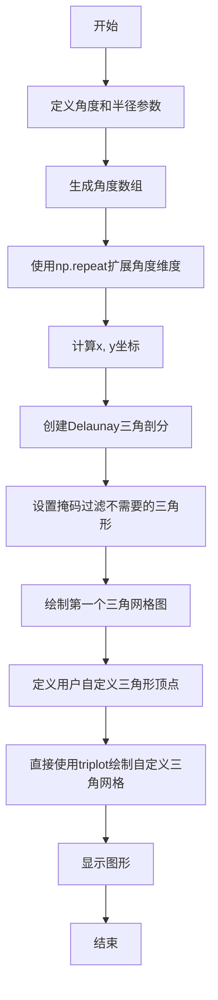

## 3. 类的详细信息

### 3.1 类：matplotlib.tri.Triangulation

三角剖分类，用于存储和管理三角网格数据。

**类字段：**

- `triangles`：numpy.ndarray，三角形索引数组，每行包含三个顶点索引
- `x`：numpy.ndarray，x坐标数组
- `y`：numpy.ndarray，y坐标数组
- `mask`：numpy.ndarray，可选的掩码数组，用于隐藏某些三角形

**类方法：**

- `__init__(self, x, y, triangles=None)`：初始化三角剖分对象
- `set_mask(self, mask)`：设置三角形掩码

### 3.2 全局函数：np.repeat

用于重复数组元素，详细信息见下文第4节。

## 4. np.repeat 函数详细信息

### np.repeat

该函数用于重复数组中的元素，可沿指定轴重复，生成一个新的数组。

参数：

- `a`：`array_like`，输入数组，要重复的数组
- `repeats`：`int` 或 `int` 数组，每个元素重复的次数
- `axis`：`int`，可选，沿指定轴重复，默认为 None（展开数组）

返回值：`numpy.ndarray`，重复后的新数组

#### 流程图

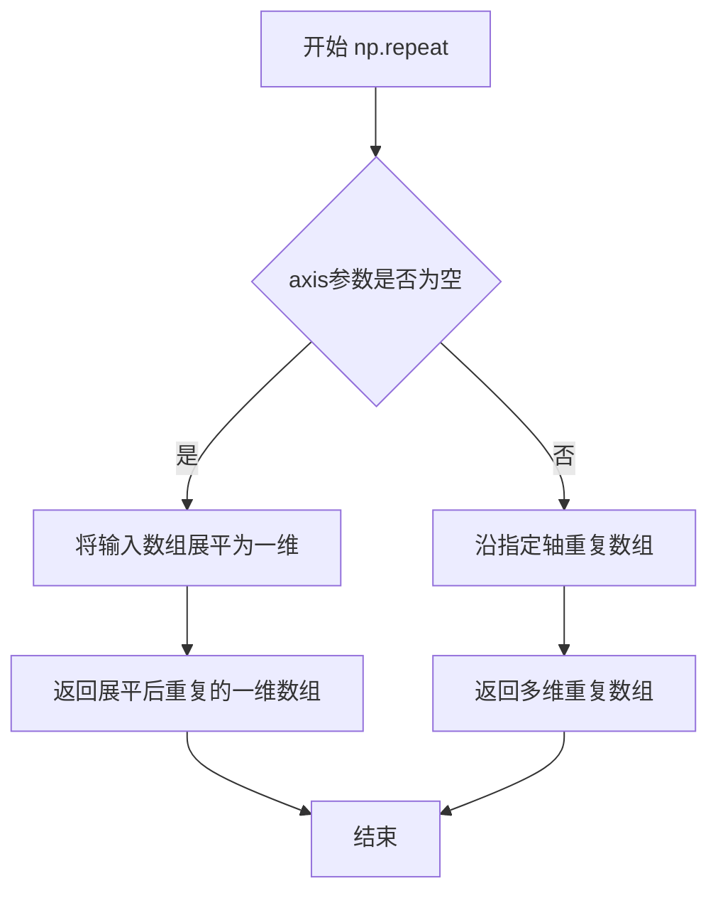

#### 带注释源码

```python
# 代码中的实际用法
angles = np.linspace(0, 2 * np.pi, n_angles, endpoint=False)  # 生成36个角度值
angles = angles[..., np.newaxis]  # 添加新维度，从(36,)变为(36,1)
# 使用np.repeat沿axis=1重复n_radii次
angles = np.repeat(angles[..., np.newaxis], n_radii, axis=1)
# 结果：将(36,1)的数组变为(36,8)的数组，每列是角度的重复

# 举例说明：如果angles是[[0], [π/18], [2π/18], ...]
# np.repeat(angles, 8, axis=1)后变为：
# [[0, 0, 0, 0, 0, 0, 0, 0],
#  [π/18, π/18, π/18, π/18, π/18, π/18, π/18, π/18],
#  ...]
```

## 5. 关键组件信息

| 组件名称 | 一句话描述 |
|---------|-----------|
| matplotlib.tri.Triangulation | 存储三角网格顶点坐标和三角形索引的数据结构 |
| matplotlib.pyplot.triplot | 绘制三角网格线的函数 |
| np.linspace | 生成等间距数组的函数 |
| np.repeat | 沿指定轴重复数组元素的函数 |
| np.hypot | 计算欧几里得范数的函数 |
| np.degrees | 将弧度转换为角度的函数 |

## 6. 潜在的技术债务或优化空间

1. **坐标生成优化**：代码中重复计算 `angles` 和 `radii`，可预先计算好形状
2. **硬编码参数**：`n_angles=36`、`n_radii=8` 等参数硬编码，缺乏可配置性
3. **缺少错误处理**：没有对输入数据有效性进行验证
4. **重复计算**：第二次绘制时用户自定义三角形数组未复用 Triangulation 对象
5. **图形资源未释放**：未显式关闭图形对象，可能导致资源泄漏

## 7. 其它项目

### 设计目标与约束

- **目标**：演示 Matplotlib 三角网格绑定的两种方式（Delaunay 自动生成 vs 用户自定义）
- **约束**：使用 Matplotlib 官方示例数据集格式

### 错误处理与异常设计

- 缺乏输入参数类型检查
- 三角形索引越界未处理
- 空数组输入未考虑

### 数据流与状态机

```
输入参数(n_angles, n_radii, min_radius)
    ↓
生成坐标数据(x, y)
    ↓
创建三角剖分对象
    ↓
应用掩码过滤
    ↓
渲染图形输出
```

### 外部依赖与接口契约

- **matplotlib**：图形绑定的核心依赖
- **numpy**：数值计算依赖
- **matplotlib.tri.Triangulation**：三角网格数据结构接口
- **matplotlib.axes.Axes.triplot**：绘图方法接口


### `np.cos()`

计算给定角度（弧度）的余弦值。该函数是 NumPy 库提供的三角函数之一，用于数学计算，在本代码中用于将极坐标系的极角转换为笛卡尔坐标系的 x 分量。

参数：

- `angle`：`ndarray` 或 `scalar`，输入角度数组（弧度制），需要计算余弦值的角度
- 其他可选参数（如 `out`, `where`, `dtype`, `subok`, `signature`, `extobj`）：使用默认行为

返回值：`ndarray`，输入角度的余弦值，范围在 [-1, 1] 之间

#### 流程图

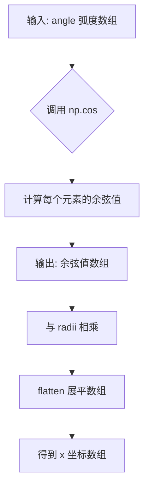

#### 带注释源码

```python
# angles 是从 0 到 2*pi 的角度数组（弧度制）
angles = np.linspace(0, 2 * np.pi, n_angles, endpoint=False)

# 将角度数组在第二个维度上重复 n_radii 次，形成角度网格
angles = np.repeat(angles[..., np.newaxis], n_radii, axis=1)

# 交错排列：偶数列角度不变，奇数列角度偏移 pi/n_angles
angles[:, 1::2] += np.pi / n_angles

# np.cos() 计算每个角度的余弦值
# 输入：角度数组（弧度）
# 输出：对应的余弦值数组，范围 [-1, 1]
x = (radii * np.cos(angles)).flatten()
# 解释：radii * np.cos(angles) 计算极坐标中的 x 分量
# .flatten() 将二维数组展平为一维数组
```

---

### `np.sin()`

计算给定角度（弧度）的正弦值。该函数是 NumPy 库提供的三角函数之一，用于数学计算，在本代码中用于将极坐标系的极角转换为笛卡尔坐标系的 y 分量。

参数：

- `angle`：`ndarray` 或 `scalar`，输入角度数组（弧度制），需要计算正弦值的角度
- 其他可选参数（如 `out`, `where`, `dtype`, `subok`, `signature`, `extobj`）：使用默认行为

返回值：`ndarray`，输入角度的正弦值，范围在 [-1, 1] 之间

#### 流程图

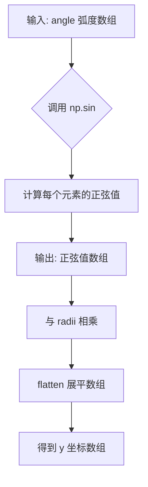

#### 带注释源码

```python
# angles 是从 0 到 2*pi 的角度数组（弧度制）
angles = np.linspace(0, 2 * np.pi, n_angles, endpoint=False)

# 将角度数组在第二个维度上重复 n_radii 次，形成角度网格
angles = np.repeat(angles[..., np.newaxis], n_radii, axis=1)

# 交错排列：偶数列角度不变，奇数列角度偏移 pi/n_angles
angles[:, 1::2] += np.pi / n_angles

# np.sin() 计算每个角度的正弦值
# 输入：角度数组（弧度）
# 输出：对应的正弦值数组，范围 [-1, 1]
y = (radii * np.sin(angles)).flatten()
# 解释：radii * np.sin(angles) 计算极坐标中的 y 分量
# .flatten() 将二维数组展平为一维数组
```

---

### 综合使用说明

在代码中，`np.cos()` 和 `np.sin()` 配合使用，将极坐标系下的坐标 (radius, angle) 转换为笛卡尔坐标系下的坐标 (x, y)：

```python
# 将极坐标 (radii, angles) 转换为笛卡尔坐标 (x, y)
# x = r * cos(θ)
# y = r * sin(θ)
x = (radii * np.cos(angles)).flatten()
y = (radii * np.sin(angles)).flatten()
```

这种转换常用于生成圆形或环形网格数据，本例中生成了 36 个角度和 8 个半径的网格点，形成一个辐射状的点阵。


### `np.hypot`

该函数用于计算对应元素的欧几里得范数（即勾股定理中的斜边长度），计算公式为 $\sqrt{x^2 + y^2}$。在当前代码中，它用于计算三角形重心到原点的距离，以便根据最小半径过滤掉过小的三角形。

参数：

-  `x1`：`array_like`，第一个数组或标量，代表 x 坐标或向量。
-  `x2`：`array_like`，第二个数组或标量，代表 y 坐标或向量。

返回值：`ndarray` 或 `scalar`，返回欧几里得距离。如果输入是数组，则返回距离数组。

#### 流程图

```mermaid
graph LR
    InputA[输入 x1 (x坐标)] --> PowA[x1²]
    InputB[输入 x2 (y坐标)] --> PowB[x2²]
    PowA --> Sum[求和: x1² + x2²]
    PowB --> Sum
    Sum --> Sqrt[开根号: √(x1² + x2²)]
    Sqrt --> Output[返回结果]
    
    style InputA fill:#f9f,stroke:#333
    style InputB fill:#f9f,stroke:#333
```

#### 带注释源码

```python
# NumPy 的 hypot 函数源码逻辑 (概念简化)
def hypot(x1, x2):
    """
    计算欧几里得范数。
    
    相当于 np.sqrt(x1**2 + x2**2)，但对大数值更加稳定，避免了上溢。
    """
    # 1. 获取输入的绝对值，准备计算平方
    # abs_x1 = np.abs(x1)
    # abs_x2 = np.abs(x2)
    
    # 2. 找到最大值和最小值，防止精度损失
    # max_val = np.maximum(abs_x1, abs_x2)
    # min_val = np.minimum(abs_x1, abs_x2)
    
    # 3. 如果最大值为0，直接返回0
    # if max_val == 0: return 0
    
    # 4. 计算结果: max * sqrt(1 + (min/max)^2)
    # return max_val * np.sqrt(1 + (min_val / max_val)**2)

# ------------------------------------------------------------------
# 在当前代码中的实际调用示例
# ------------------------------------------------------------------

# 提取三角形的 x 和 y 坐标索引
# x[triang.triangles] 获取所有三角形顶点的 x 坐标 (形状: n_triangles, 3)
# .mean(axis=1) 计算每个三角形的平均 x 坐标 (即重心的 x)
x_coords = x[triang.triangles].mean(axis=1)
y_coords = y[triang.triangles].mean(axis=1)

# 调用 np.hypot 计算重心到原点的距离
distances = np.hypot(x_coords, y_coords)

# 根据距离生成布尔掩码
mask = distances < min_radius

# 应用掩码
triang.set_mask(mask)
```


### `np.degrees`

将输入的弧度值转换为角度值。这是 NumPy 库中的数学函数，用于弧度到度的转换。

参数：

- `x`：`array_like`，输入的弧度值数组

返回值：`ndarray`，转换后的角度值数组

#### 流程图

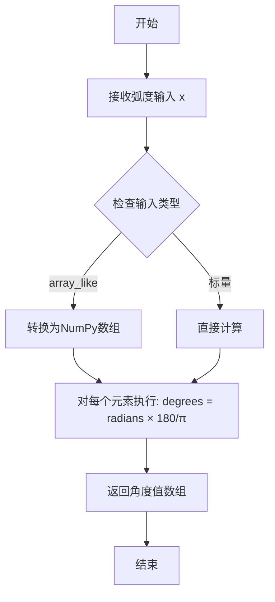

#### 带注释源码

```python
# np.degrees 函数源码分析（位于 numpy/lib/ufunclike.py）

def degrees(x, out=None, where=None, casting='same_kind', order='K', dtype=None, subok=True):
    """
    将弧度转换为角度
    
    参数:
        x: array_like
            输入的弧度值，可以是单个数值、列表或NumPy数组
        
        out: ndarray, optional
            存储结果的数组
        
        where: array_like, optional
            值为True的位置将计算结果写入输出
        
        其他参数: casting, order, dtype, subok
            用于控制类型转换、内存顺序等底层行为
    
    返回值:
        ndarray
            与输入形状相同的角度值数组
    """
    # 核心转换逻辑：角度 = 弧度 × (180 / π)
    # 其中 np.pi 是 NumPy 中的数学常数 π
    
    # 使用 ufunc (universal function) 的 multiply 进行逐元素计算
    # 180 / np.pi ≈ 57.29577951308232
    return multiply(x, 180.0/pi, out=out, where=where, 
                    casting=casting, order=order, dtype=dtype, subok=subok)
```

#### 在本项目中的具体调用

```python
# 代码中第72-73行
# 将原始数据中的弧度坐标转换为度数（用于绘制经纬度图）
x = np.degrees(xy[:, 0])  # 将第一列（经度）从弧度转为度数
y = np.degrees(xy[:, 1])  # 将第二列（纬度）从弧度转为度数
```

#### 关键组件信息

| 组件名称 | 一句话描述 |
|---------|-----------|
| `np.pi` | NumPy 中的数学常数 π (≈3.14159...) |
| `np.multiply` | NumPy 的逐元素乘法 ufunc |
| `xy[:, 0]` | 提取二维数组的第一列（经度坐标） |
| `xy[:, 1]` | 提取二维数组的第二列（纬度坐标） |

#### 技术债务与优化空间

1. **缺乏输入验证**：函数未检查输入是否为有效的数值类型
2. **单位一致性**：代码中混合使用弧度和度数，需要更清晰的文档说明输入数据的单位
3. **精度问题**：对于极大的弧度值，累积舍入误差可能影响结果精度

#### 错误处理与异常设计

- 如果输入包含 `NaN` 或 `Inf`，结果也会传播这些特殊值
- 对于无效输入类型（如字符串），会抛出 `TypeError`
- 不支持复数输入


### np.asarray

将输入数据转换为NumPy数组

参数：

- `a`：`array_like`，输入数据，可以是列表、元组、另一个数组或其他类似数组的对象
- `dtype`：`data-type, optional`，可选参数，覆盖结果数组的数据类型
- `order`：`{'C', 'F', 'A', 'K'}, optional`，可选参数，指定内存布局。'C'为C语言顺序（行优先），'F'为Fortran顺序（列优先），'A'为任意顺序，'K'为保持输入数据的内存布局

返回值：`ndarray`，返回输入数据的数组视图。如果输入已经是相同dtype的ndarray，则不会复制。

#### 流程图

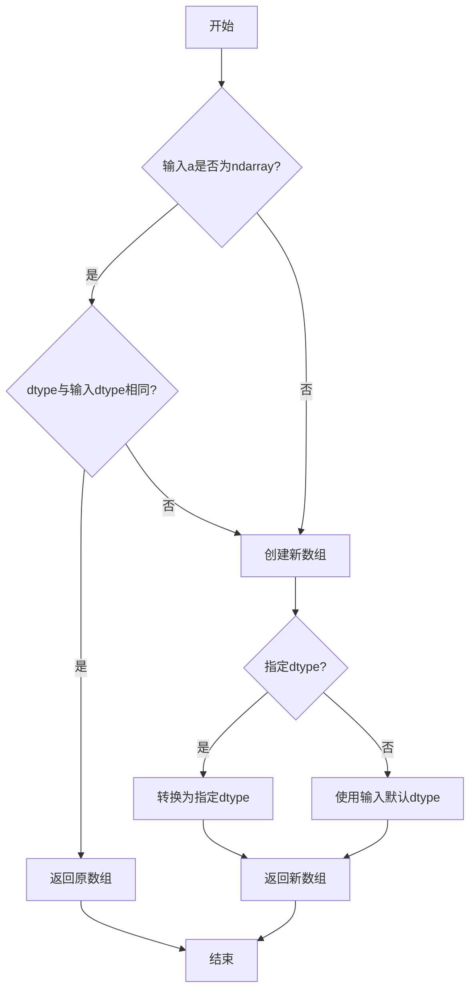

#### 带注释源码

```python
# 代码中使用np.asarray()的示例

# 示例1：将列表转换为NumPy数组
# np.asarray()将Python列表转换为二维数组
xy = np.asarray([
    [-0.101, 0.872], [-0.080, 0.883], [-0.069, 0.888], [-0.054, 0.890],
    [-0.045, 0.897], [-0.057, 0.895], [-0.073, 0.900], [-0.087, 0.898],
    [-0.090, 0.904], [-0.069, 0.907], [-0.069, 0.921], [-0.080, 0.919],
    # ... 更多坐标点
    [-0.077, 0.990], [-0.059, 0.993]
])
# 结果：xy变为shape为(72, 2)的float64类型数组

# 示例2：从数组切片创建新数组
# 从xy数组的第一列提取所有行作为新数组
x = np.degrees(xy[:, 0])
# 等价于：x = np.asarray(xy[:, 0], dtype=float)

# 示例3：将嵌套列表转换为整数数组
# 将三角形索引列表转换为int64类型的二维数组
triangles = np.asarray([
    [67, 66, 1], [65, 2, 66], [1, 66, 2], [64, 2, 65], [63, 3, 64],
    [60, 59, 57], [2, 64, 3], [3, 63, 4], [0, 67, 1], [62, 4, 63],
    # ... 更多三角形索引
])
# 结果：triangles变为shape为(76, 3)的int64类型数组
```


## 关键组件


### 极坐标生成与坐标转换

将极坐标系下的角度和半径转换为笛卡尔坐标系的x、y坐标，用于后续三角网格的创建。

### Delaunay 三角剖分

利用 matplotlib.tri.Triangulation 类自动对给定的散点进行 Delaunay 三角剖分，生成三角网格的连接关系。

### 三角形掩码（Mask）

通过 triang.set_mask() 方法过滤掉不符合条件的三角形（如中心距离小于最小半径的三角形），实现选择性渲染。

### triplot 绑图

使用 Axes.triplot() 方法将三角网格可视化，支持自定义线条样式、线宽等绘图参数。

### 用户指定三角形索引

通过直接传入 triangles 数组（每个元素包含三个顶点索引）来创建自定义三角网格，绕过自动 Delaunay 剖分。


## 问题及建议


### 已知问题

-   **变量重复声明**：代码中多次声明了`x`和`y`变量，虽然在不同作用域内不会冲突，但容易造成混淆，增加了代码的理解难度
-   **硬编码数据缺乏说明**：第二个示例中的`xy`坐标数组和`triangles`数组是完全硬编码的数值，缺乏数据来源说明和注释，可维护性差
-   **缺少错误处理**：代码未对输入数据进行合法性校验，如`triangles`数组中的索引是否越界、`min_radius`是否为负值等边界情况未做处理
-   **Magic Number问题**：代码中使用了多个魔法数字（如36、8、0.25、0.95等），没有使用常量或枚举进行命名，降低了代码可读性
-   **代码重复**：两段绘图代码（`fig1, ax1`和`fig2, ax2`）存在大量重复的设置逻辑（`plt.subplots()`、`set_aspect('equal')`、`set_title`等），未抽取为复用函数
-   **数据类型未使用注解**：整个代码未使用Python类型注解（Type Hints），降低了代码的可读性和IDE支持
-   **Sphinx注释混用**：代码中使用了`# %%`作为Jupyter Notebook cell分隔符，并与Sphinx文档字符串混合，对于纯Python脚本执行场景不够规范
-   **潜在的性能优化点**：文档注释提到"使用Triangulation对象可以避免重复计算"，但示例2直接传入数组，未遵循自身建议的最佳实践

### 优化建议

-   将魔法数字提取为模块级常量，如`N_ANGLES = 36`、`N_RADII = 8`、`MIN_RADIUS = 0.25`等，提高可读性和可维护性
-   抽取通用绘图逻辑为函数，例如`create_triplot_figure(triang, title, **kwargs)`，减少代码重复
-   为`xy`坐标数据和`triangles`数组添加来源说明注释，或考虑从外部文件/配置加载
-   添加基本的输入验证函数，检查三角形索引是否在有效范围内、`min_radius`是否为正数等
-   在第二个示例中使用`Triangulation`对象而非直接传入数组，遵循代码中自身提出的最佳实践
-   考虑使用Python类型注解提升代码质量
-   将文档字符串和Sphinx标记移至模块级docstring，或在独立文档中说明，避免在脚本中混入过多文档标记
-   统一变量命名，避免在同一模块的不同作用域中使用相同变量名`x`和`y`，可改为`x_delaunay`、`y_delaunay`和`x_custom`、`y_custom`等


## 其它


### 设计目标与约束

该代码演示了 matplotlib 库中 triplot 函数的两种使用方式：Delaunay 自动三角剖分和用户自定义三角形。其设计目标是展示非结构化三角网格的创建与可视化方法。约束条件包括：需要 matplotlib、numpy 库支持；Delaunay 三角剖分在点分布不均匀时可能产生非理想结果；用户自定义三角形时需确保索引有效且符合顺时针或逆时针顺序。

### 错误处理与异常设计

代码主要依赖 matplotlib 和 numpy 的内置错误处理。未对以下情况进行显式处理：空坐标数组输入会导致 Triangulation 初始化失败；三角形索引超出点范围会抛出索引异常；重复的点坐标可能导致退化的三角形。改进建议：添加输入验证逻辑，检查 x、y 数组长度一致性，验证三角形索引的有效性范围。

### 数据流与状态机

数据流分为两个独立分支。第一分支：生成极坐标点 → 转换为笛卡尔坐标 → 创建 Triangulation 对象 → 计算 mask → 绘制三角网。第二分支：定义点坐标数组 → 定义三角形索引数组 → 直接传递给 triplot → 绘制三角网。状态机概念：初始化状态（点坐标生成）→ Triangulation 状态（计算三角形连接关系）→ 渲染状态（调用 triplot 绘制）→ 显示状态（plt.show()）。

### 外部依赖与接口契约

核心依赖包括：matplotlib.pyplot（图形创建与显示）、matplotlib.tri（Triangulation 类和 triplot 函数）、numpy（数值计算）。外部接口契约：tri.Triangulation(x, y, triangles=None, mask=None) 接受 x、y 坐标数组及可选的三角形索引和掩码数组；ax.triplot(x, y, triangles=None, fmt='o', ...) 接受坐标、三角形索引和格式字符串，返回线条和标记对象。

### 版本信息与兼容性

代码基于 matplotlib 3.x 和 numpy 1.x 版本编写。使用 Python 3 语法（类型注解未使用但兼容）。代码中 np.newaxis 等用法与 NumPy 1.20+ 兼容。matplotlib.tri 模块在 matplotlib 1.2+ 稳定存在。

### 配置参数说明

关键配置参数包括：n_angles=36（角度采样点数）、n_radii=8（径向采样层数）、min_radius=0.25（内部掩码半径阈值）、lw=1 或 lw=1.0（线条宽度）、fmt='bo-' 和 'go-'（绘图格式字符串）。这些参数控制三角网的密度、Mask 效果和可视化样式。

### 性能考量

第一部分代码创建 Triangulation 时会执行 Delaunay 三角剖分计算，时间复杂度约为 O(n log n) 到 O(n^2)，取决于点数。对于大规模点集，建议预先计算 Triangulation 并重用。第二部分直接传递三角形数组，性能更优但需要手动维护三角形索引。

### 测试用例建议

应覆盖以下场景：空输入（x=[], y=[]）的处理、单个点的行为、点共线时的三角剖分结果、mask 全为 False/True 的边界情况、三角形索引越界的错误处理、不同格式字符串的兼容性、多子图同时显示的场景。

### 参考资料与延伸阅读

matplotlib 官方文档：matplotlib.axes.Axes.triplot、matplotlib.tri.Triangulation；NumPy 文档：numpy.linspace、numpy.repeat、numpy.hypot；Matplotlib Gallery 中的相关示例；SciPy 的 Delaunay 三角剖分文档（matplotlib 底层实现参考）。

### 代码结构图示

```
┌─────────────────────────────────────────┐
│           Main Script                   │
├─────────────────────────────────────────┤
│  Part 1: Delaunay Triangulation         │
│  ├─ Generate polar coordinates          │
│  ├─ Convert to Cartesian (x, y)         │
│  ├─ Create Triangulation                │
│  ├─ Apply mask                          │
│  └─ Plot with triplot                   │
├─────────────────────────────────────────┤
│  Part 2: User-specified Triangulation   │
│  ├─ Define points (x, y)                │
│  ├─ Define triangle indices             │
│  └─ Plot directly with triplot          │
├─────────────────────────────────────────┤
│  plt.show()                             │
└─────────────────────────────────────────┘
```

    