# `matplotlib\galleries\examples\images_contours_and_fields\watermark_image.py` 详细设计文档

This code overlays an image on a plot using matplotlib, setting the image to be semi-transparent and placed in front of the plot elements.

## 整体流程

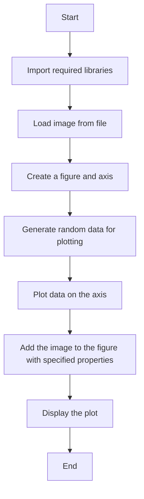

## 类结构

```
matplotlib.pyplot (主模块)
├── matplotlib.image (图像处理模块)
│   ├── imread (全局函数)
│   └── image (模块)
└── matplotlib.cbook (辅助模块)
```

## 全局变量及字段


### `im`
    
An image array loaded from 'logo2.png'.

类型：`numpy.ndarray`
    


### `fig`
    
The main figure object created by plt.subplots.

类型：`matplotlib.figure.Figure`
    


### `ax`
    
The axes object on which the plot is drawn.

类型：`matplotlib.axes._subplots.AxesSubplot`
    


### `x`
    
An array of x-coordinates for the bars in the plot.

类型：`numpy.ndarray`
    


### `y`
    
An array of y-coordinates for the bars in the plot.

类型：`numpy.ndarray`
    


### `matplotlib.pyplot`
    
The matplotlib.pyplot module that provides a MATLAB-like interface for plotting.

类型：`module`
    


### `matplotlib.image`
    
The matplotlib.image module that provides functions for loading and saving images.

类型：`module`
    


### `matplotlib.cbook`
    
The matplotlib.cbook module that contains utility functions for the matplotlib library.

类型：`module`
    


### `matplotlib.pyplot.fig`
    
The main figure object created by plt.subplots.

类型：`matplotlib.figure.Figure`
    


### `matplotlib.pyplot.ax`
    
The axes object on which the plot is drawn.

类型：`matplotlib.axes._subplots.AxesSubplot`
    


### `matplotlib.image.imread`
    
Function to read an image file.

类型：`function`
    


### `matplotlib.cbook.get_sample_data`
    
Function to get sample data files from the matplotlib package.

类型：`function`
    
    

## 全局函数及方法


### np.arange

`np.arange` 是 NumPy 库中的一个函数，用于生成一个沿指定范围的数组。

参数：

- `start`：`int`，数组的起始值。
- `stop`：`int`，数组的结束值（不包括此值）。
- `step`：`int`，步长，默认为 1。

返回值：`numpy.ndarray`，一个沿指定范围生成的数组。

#### 流程图

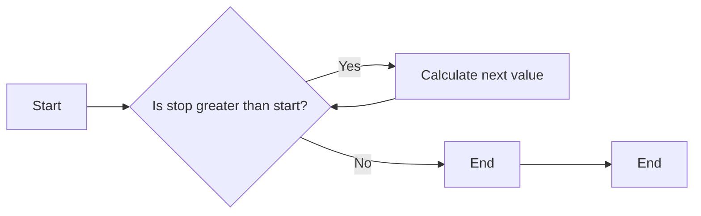

#### 带注释源码

```python
import numpy as np

# 生成一个从 0 到 29 的数组，步长为 1
x = np.arange(30)
```


### np.random.seed

`np.random.seed` 是 NumPy 库中的一个全局函数，用于设置随机数生成器的种子。

参数：

- `seed`：`int`，用于初始化随机数生成器的种子值。

参数描述：`seed` 参数是一个整数，用于设置随机数生成器的初始状态，从而确保每次运行代码时生成的随机数序列是相同的。

返回值类型：无

返回值描述：该函数没有返回值，它只是用于设置随机数生成器的种子。

#### 流程图

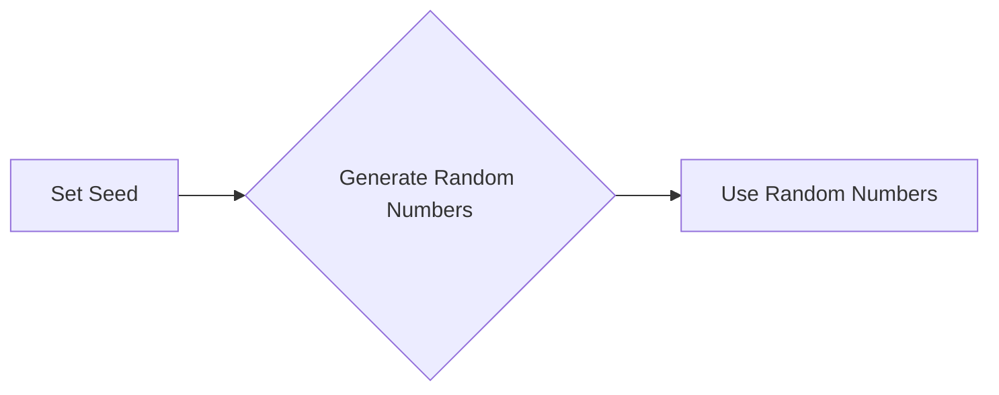

#### 带注释源码

```
np.random.seed(19680801)
```


### np.arange

`np.arange` 是 NumPy 库中的一个函数，用于生成一个等差数列。

参数：

- `start`：`int`，数列的起始值。
- `stop`：`int`，数列的结束值。
- `step`：`int`，数列的步长，默认为 1。

参数描述：`start` 是数列的起始值，`stop` 是数列的结束值，`step` 是数列的步长。

返回值类型：`numpy.ndarray`

返回值描述：返回一个包含指定起始值、结束值和步长的等差数列的 NumPy 数组。

#### 流程图

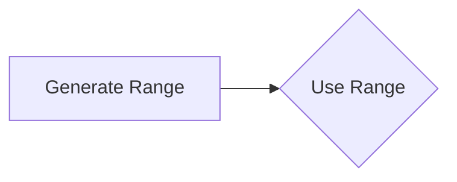

#### 带注释源码

```
x = np.arange(30)
```


### np.random.randn

`np.random.randn` 是 NumPy 库中的一个函数，用于生成符合标准正态分布的随机样本。

参数：

- `size`：`int` 或 `tuple`，指定生成的随机样本的数量或形状。

参数描述：`size` 参数可以是一个整数，表示生成一个指定数量的随机样本，也可以是一个元组，表示生成一个多维数组。

返回值类型：`numpy.ndarray`

返回值描述：返回一个符合标准正态分布的随机样本数组。

#### 流程图

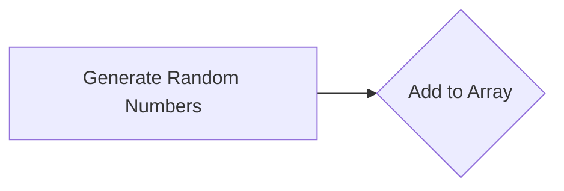

#### 带注释源码

```
y = x + np.random.randn(30)
```


### ax.bar

`ax.bar` 是 Matplotlib 库中的一个方法，用于在轴上绘制柱状图。

参数：

- `x`：`array_like`，柱状图的 x 坐标。
- `y`：`array_like`，柱状图的 y 坐标。
- `color`：`color`，柱状图的颜色。

参数描述：`x` 和 `y` 是柱状图的 x 和 y 坐标，`color` 是柱状图的颜色。

返回值类型：`matplotlib.patches.PatchCollection`

返回值描述：返回一个包含柱状图元素的 PatchCollection 对象。

#### 流程图


#### 带注释源码

```
ax.bar(x, y, color='#6bbc6b')
```


### fig.figimage

`fig.figimage` 是 Matplotlib 库中的一个方法，用于在图上绘制图像。

参数：

- `img`：`image_like`，要绘制的图像。
- `x`：`float`，图像在 x 轴上的位置。
- `y`：`float`，图像在 y 轴上的位置。
- `zorder`：`int`，图像的 z 轴顺序。
- `alpha`：`float`，图像的透明度。

参数描述：`img` 是要绘制的图像，`x` 和 `y` 是图像在图上的位置，`zorder` 是图像的 z 轴顺序，`alpha` 是图像的透明度。

返回值类型：无

返回值描述：该函数没有返回值。

#### 流程图


#### 带注释源码

```
fig.figimage(im, 25, 25, zorder=3, alpha=.7)
```


### plt.show

`plt.show` 是 Matplotlib 库中的一个函数，用于显示图形。

参数：无

参数描述：该函数没有参数。

返回值类型：无

返回值描述：该函数没有返回值，它只是用于显示图形。

#### 流程图


#### 带注释源码

```
plt.show()
```


### cbook.get_sample_data

获取示例数据文件的路径。

参数：

- `filename`：`str`，示例数据文件的名称。

返回值：`file`，一个上下文管理器，用于打开示例数据文件。

#### 流程图

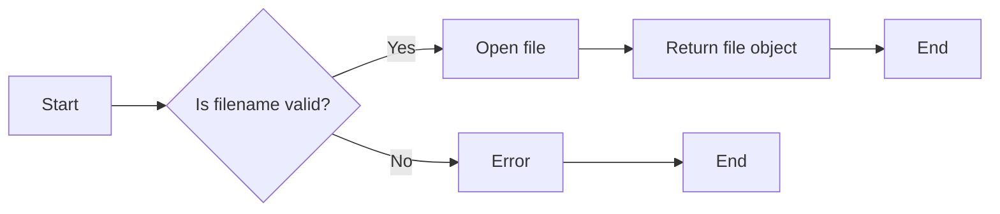

#### 带注释源码

```python
"""
Get the path to a sample data file.

Parameters
----------
filename : str
    The name of the sample data file.

Returns
-------
file : context manager
    An object that opens the sample data file.
"""

import os

def get_sample_data(filename):
    """
    Get the path to a sample data file.

    Parameters
    ----------
    filename : str
        The name of the sample data file.

    Returns
    -------
    file : context manager
        An object that opens the sample data file.
    """
    base_dir = os.path.join(os.path.dirname(__file__), 'data')
    full_path = os.path.join(base_dir, filename)
    return open(full_path, 'rb')
```


### image.imread

该函数用于读取图像文件并将其转换为NumPy数组。

参数：

- `file`：`str`，图像文件的路径。

返回值：`numpy.ndarray`，图像数据作为NumPy数组。

#### 流程图

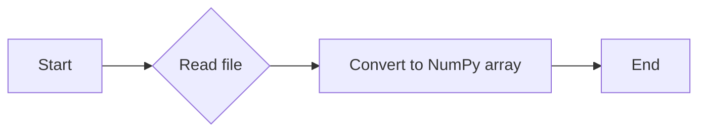

#### 带注释源码

```python
import numpy as np

def imread(file):
    """
    Read an image file and convert it to a NumPy array.

    Parameters
    ----------
    file : str
        The path to the image file.

    Returns
    -------
    numpy.ndarray
        The image data as a NumPy array.
    """
    # ... (The actual implementation of imread is not shown here,
    # as it is part of the matplotlib.image module and not the code snippet provided.)
```


### fig.figimage

该函数将图像叠加到matplotlib图形的指定位置。

参数：

- `im`：`numpy.ndarray`，图像数据
- `x`：`float`，图像在x轴上的位置
- `y`：`float`，图像在y轴上的位置
- `zorder`：`int`，图像的z顺序，确保图像在图形的最前面
- `alpha`：`float`，图像的透明度

返回值：无

#### 流程图

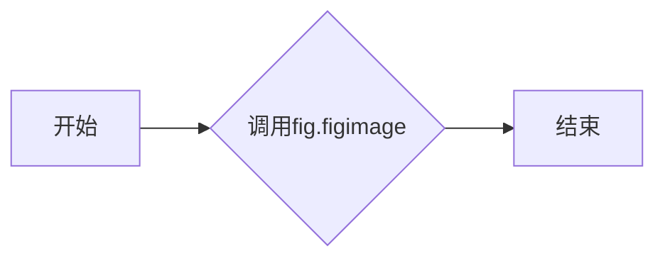

#### 带注释源码

```python
fig.figimage(im, 25, 25, zorder=3, alpha=.7)
```


### plt.subplots()

该函数用于创建一个新的图形和轴对象。

参数：

- `figsize`：`tuple`，指定图形的大小，默认为(6, 4)。
- `dpi`：`int`，指定图形的分辨率，默认为100。
- `facecolor`：`color`，指定图形的背景颜色，默认为白色。
- `edgecolor`：`color`，指定图形的边缘颜色，默认为白色。
- `frameon`：`bool`，指定是否显示图形的边框，默认为True。
- `num`：`int`，指定要创建的轴的数量，默认为1。
- `gridspec_kw`：`dict`，指定GridSpec的参数，用于创建多个轴。
- `constrained_layout`：`bool`，指定是否启用约束布局，默认为False。

返回值：`Figure`，图形对象；`Axes`，轴对象。

#### 流程图

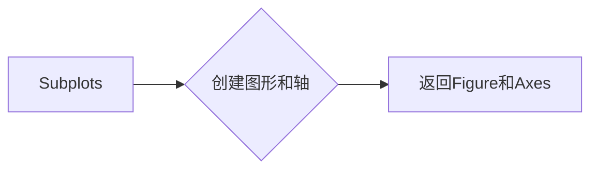

#### 带注释源码

```python
import matplotlib.pyplot as plt

fig, ax = plt.subplots()
```


### matplotlib.pyplot.bar

matplotlib.pyplot.bar 是一个用于在 matplotlib 图形中绘制条形图的函数。

参数：

- `x`：`numpy.ndarray`，表示条形图的 x 轴位置。
- `y`：`numpy.ndarray`，表示条形图的高度。
- `color`：`str` 或 `tuple`，表示条形图的颜色。

返回值：`matplotlib.patches.BboxPatch` 对象，表示绘制的条形图。

#### 流程图

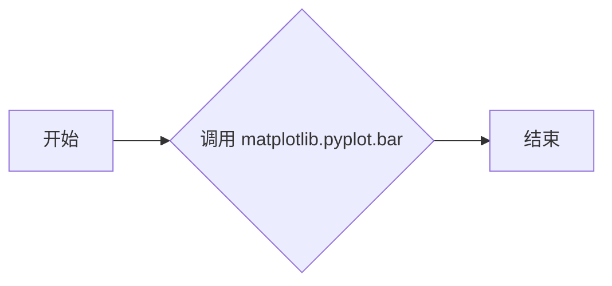

#### 带注释源码

```python
import numpy as np
import matplotlib.pyplot as plt

# 创建一个包含 30 个元素的数组，表示 x 轴位置
x = np.arange(30)

# 创建一个包含 30 个元素的数组，表示 y 轴高度
y = x + np.random.randn(30)

# 绘制条形图
bar = plt.bar(x, y, color='#6bbc6b')

# 显示图形
plt.show()
```


### matplotlib.pyplot.grid

matplotlib.pyplot.grid 是一个用于在图表上添加网格线的函数。

参数：

- 无

返回值：`None`，该函数不返回任何值，它直接在图表上添加网格线。

#### 流程图


#### 带注释源码

```python
import matplotlib.pyplot as plt

# 创建图表和轴
fig, ax = plt.subplots()

# 生成随机数据
np.random.seed(19680801)
x = np.arange(30)
y = x + np.random.randn(30)

# 绘制条形图
ax.bar(x, y, color='#6bbc6b')

# 添加网格线
ax.grid()

# 显示图表
plt.show()
```


### figimage

`figimage` 方法用于在 matplotlib 图形上叠加一个图像。

参数：

- `im`：`numpy.ndarray`，图像数据，通常是通过 `matplotlib.image.imread` 或 `matplotlib.pyplot.imread` 加载的图像。
- `x`：`float`，图像在 x 轴上的位置。
- `y`：`float`，图像在 y 轴上的位置。
- `zorder`：`int`，图像的 z 轴顺序，用于控制图像的叠加顺序。
- `alpha`：`float`，图像的透明度。

返回值：无，`figimage` 方法不返回任何值。

#### 流程图

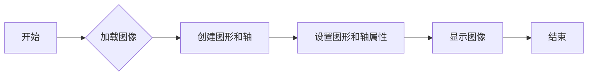

#### 带注释源码

```python
import matplotlib.pyplot as plt
import numpy as np
import matplotlib.cbook as cbook
import matplotlib.image as image

with cbook.get_sample_data('logo2.png') as file:
    im = image.imread(file)

fig, ax = plt.subplots()

np.random.seed(19680801)
x = np.arange(30)
y = x + np.random.randn(30)
ax.bar(x, y, color='#6bbc6b')
ax.grid()

fig.figimage(im, 25, 25, zorder=3, alpha=.7)

plt.show()
```


### plt.show()

显示当前图形。

参数：

- 无

返回值：无

#### 流程图

```mermaid
graph LR
A[开始] --> B{调用plt.show()}
B --> C[结束]
```

#### 带注释源码

```
plt.show()
```


### matplotlib.pyplot.show()

显示当前图形。

参数：

- 无

返回值：无

#### 流程图

```mermaid
graph LR
A[开始] --> B{调用plt.show()}
B --> C[结束]
```

#### 带注释源码

```
# 显示当前图形
plt.show()
```


### fig.figimage(im, 25, 25, zorder=3, alpha=.7)

将图像叠加到图表上，使其半透明并置于最前面。

参数：

- `im`：`numpy.ndarray`，图像数据
- `25`：`int`，图像在图表中的水平位置
- `25`：`int`，图像在图表中的垂直位置
- `zorder=3`：`int`，图像的z顺序，确保图像在图表的最前面
- `alpha=.7`：`float`，图像的透明度

返回值：无

#### 流程图

```mermaid
graph LR
A[开始] --> B{调用fig.figimage()}
B --> C[结束]
```

#### 带注释源码

```python
fig.figimage(im, 25, 25, zorder=3, alpha=.7)
```


### image.imread

该函数用于读取图像文件并将其转换为NumPy数组。

参数：

- `file`：`str`，图像文件的路径。

返回值：`numpy.ndarray`，图像数据作为NumPy数组。

#### 流程图


#### 带注释源码

```python
import numpy as np

def imread(file):
    """
    Read an image file and return it as a NumPy array.

    Parameters
    ----------
    file : str
        The path to the image file.

    Returns
    -------
    numpy.ndarray
        The image data as a NumPy array.
    """
    # ... (The actual implementation is not shown here as it is part of the matplotlib library)
```


### matplotlib.image.imread

该函数用于读取图像文件，并将其转换为NumPy数组。

参数：

- `file`：`str`，图像文件的路径。
- ...

返回值：`numpy.ndarray`，图像数据。

#### 流程图


#### 带注释源码

```python
import matplotlib.image as image

with cbook.get_sample_data('logo2.png') as file:
    im = image.imread(file)
```


### matplotlib.pyplot.imread

该函数用于读取图像文件，并将其转换为NumPy数组。

参数：

- `file`：`str`，图像文件的路径。
- ...

返回值：`numpy.ndarray`，图像数据。

#### 流程图

```mermaid
graph LR
A[Start] --> B[Read image file]
B --> C[Convert to NumPy array]
C --> D[End]
```

#### 带注释源码

```python
import matplotlib.pyplot as plt
import matplotlib.image as image

with cbook.get_sample_data('logo2.png') as file:
    im = image.imread(file)
```


### matplotlib.figure.Figure.figimage

该函数用于在matplotlib图形中插入图像。

参数：

- `self`：`matplotlib.figure.Figure`，当前图形对象。
- `im`：`numpy.ndarray`，图像数据。
- `x`：`float`，图像在x轴上的位置。
- `y`：`float`，图像在y轴上的位置。
- `zorder`：`int`，图像的z顺序。
- `alpha`：`float`，图像的透明度。

返回值：无。

#### 流程图

```mermaid
graph LR
A[Start] --> B[Insert image]
B --> C[Set zorder]
C --> D[Set alpha]
D --> E[End]
```

#### 带注释源码

```python
import matplotlib.pyplot as plt
import matplotlib.image as image

fig, ax = plt.subplots()

np.random.seed(19680801)
x = np.arange(30)
y = x + np.random.randn(30)
ax.bar(x, y, color='#6bbc6b')
ax.grid()

fig.figimage(im, 25, 25, zorder=3, alpha=.7)
```


### `cbook.get_sample_data`

该函数用于从matplotlib的样本数据目录中获取指定文件。

参数：

- `filename`：`str`，指定要获取的文件名。

返回值：`file`，`file`对象，用于读取文件内容。

#### 流程图

```mermaid
graph LR
A[Start] --> B{Is filename valid?}
B -- Yes --> C[Open file]
B -- No --> D[Error]
C --> E[Read file content]
E --> F[Return file object]
F --> G[End]
D --> H[End]
```

#### 带注释源码

```python
# from matplotlib.cbook import get_sample_data

def get_sample_data(filename):
    """
    Return the file object for the sample data file.

    Parameters
    ----------
    filename : str
        The name of the sample data file.

    Returns
    -------
    file : file object
        The file object for the sample data file.
    """
    # Check if the file exists in the sample data directory
    if not cbook._is_valid_sample_data_filename(filename):
        raise IOError("Sample data file not found: %s" % filename)

    # Open the file and return the file object
    return open(cbook._get_sample_data_path(filename), 'rb')
```


### `matplotlib.figure.Figure.figimage`

`figimage` 方法用于在 matplotlib 图像上叠加一个图像。

参数：

- `image`：`numpy.ndarray`，要叠加的图像数据。
- `x`：`float`，图像在 x 轴上的位置。
- `y`：`float`，图像在 y 轴上的位置。
- `zorder`：`int`，图像的 z 轴顺序，用于控制图像的叠加顺序。
- `alpha`：`float`，图像的透明度。

返回值：无

#### 流程图

```mermaid
graph LR
A[开始] --> B{调用figimage方法}
B --> C[结束]
```

#### 带注释源码

```python
fig.figimage(im, 25, 25, zorder=3, alpha=.7)
```

在这段代码中，`fig` 是一个 `Figure` 对象，`im` 是一个图像数组，`25, 25` 是图像在图中的位置，`zorder=3` 表示图像的 z 轴顺序，`alpha=.7` 表示图像的透明度。

## 关键组件


### Watermark image

Overlay an image on a plot by moving it to the front (zorder=3) and making it semi-transparent (alpha=0.7).

### 图像加载

{描述1}

### 绘图

{描述2}

### 图像叠加

{描述3}

...


## 问题及建议


### 已知问题

-   **代码复用性低**：代码中直接使用硬编码的图像路径和坐标，这限制了代码的复用性，如果需要处理不同的图像或坐标，需要修改代码。
-   **缺乏异常处理**：代码中没有异常处理机制，如果图像文件不存在或读取失败，程序可能会崩溃。
-   **全局变量使用**：`fig` 和 `ax` 对象被用作全局变量，这可能导致代码难以理解和维护。
-   **硬编码的图像透明度**：图像的透明度被硬编码为 0.7，如果需要不同的透明度，需要修改代码。

### 优化建议

-   **增加参数化**：将图像路径、坐标和透明度作为参数传递给函数，以提高代码的复用性和灵活性。
-   **添加异常处理**：在读取图像和处理图像时添加异常处理，确保程序在遇到错误时能够优雅地处理。
-   **避免全局变量**：将 `fig` 和 `ax` 对象作为函数参数传递，避免使用全局变量。
-   **使用配置文件**：将图像路径、坐标和透明度等信息存储在配置文件中，以便于管理和修改。
-   **文档化**：为代码添加详细的文档注释，说明函数的用途、参数和返回值，以便于其他开发者理解和使用。


## 其它


### 设计目标与约束

- 设计目标：实现一个能够在图表上叠加水印图像的功能，确保图像透明且位于图表前端。
- 约束条件：使用matplotlib库进行图像叠加，图像透明度设置为0.7，图像zorder设置为3。

### 错误处理与异常设计

- 错误处理：确保在读取图像文件时能够处理文件不存在或损坏的情况。
- 异常设计：使用try-except语句捕获可能发生的异常，并给出相应的错误信息。

### 数据流与状态机

- 数据流：从读取图像文件开始，到创建图表、绘制柱状图、添加图像水印，最后展示图表。
- 状态机：程序从开始到结束，没有明显的状态转换，因此不涉及状态机设计。

### 外部依赖与接口契约

- 外部依赖：依赖于matplotlib库进行图像显示和图表绘制。
- 接口契约：matplotlib库提供的图像读取、图表创建和显示接口。


    