# `matplotlib\galleries\examples\lines_bars_and_markers\axline.py` 详细设计文档

This code generates plots with various lines using the matplotlib library, including horizontal and vertical lines, and lines with arbitrary slopes.

## 整体流程

```mermaid
graph TD
    A[Start] --> B[Import matplotlib.pyplot and numpy]
    B --> C[Define the function sig to compute the sigmoid function]
    C --> D[Create a figure and an axis object]
    D --> E[Draw horizontal lines at y=0, y=0.5, and y=1.0]
    D --> F[Draw a vertical line at x=0]
    D --> G[Draw a line with slope=0.25 through the point (0, 0.5)]
    D --> H[Plot the sigmoid function]
    H --> I[Set x-axis limits and label]
    I --> J[Add a legend]
    J --> K[Show the plot]
    K --> L[End of first plot]
    L --> M[Create another figure and axis object]
    M --> N[Draw diagonal grid lines with slope=0.5]
    N --> O[Set x-axis and y-axis limits]
    O --> P[Show the plot]
    P --> Q[End of second plot]
    Q --> R[End of script]
```

## 类结构

```
matplotlib.pyplot (全局模块)
├── np (全局模块)
└── sig (函数)
```

## 全局变量及字段


### `t`
    
Array of evenly spaced values between -10 and 10.

类型：`numpy.ndarray`
    


### `sig`
    
Array of sigmoid function values corresponding to the values in 't'.)

类型：`numpy.ndarray`
    


### `fig`
    
Figure object created by 'plt.subplots()'.)

类型：`matplotlib.figure.Figure`
    


### `ax`
    
Axes object created by 'plt.subplots()'.)

类型：`matplotlib.axes._subplots.AxesSubplot`
    


### `plt`
    
matplotlib.pyplot module containing functions for plotting.

类型：`matplotlib.pyplot`
    


### `{'name': 'matplotlib.pyplot', 'fields': ['fig', 'ax', 'show', '...'], 'methods': ['subplots', 'plot', 'axhline', 'axvline', 'axline', 'set', 'legend', '...']}.fig`
    
Figure object within the matplotlib.pyplot module.

类型：`matplotlib.figure.Figure`
    


### `{'name': 'matplotlib.pyplot', 'fields': ['fig', 'ax', 'show', '...'], 'methods': ['subplots', 'plot', 'axhline', 'axvline', 'axline', 'set', 'legend', '...']}.ax`
    
Axes object within the matplotlib.pyplot module.

类型：`matplotlib.axes._subplots.AxesSubplot`
    


### `{'name': 'matplotlib.pyplot', 'fields': ['fig', 'ax', 'show', '...'], 'methods': ['subplots', 'plot', 'axhline', 'axvline', 'axline', 'set', 'legend', '...']}.show`
    
Function within the matplotlib.pyplot module to display the plot.

类型：`function`
    


### `{'name': 'numpy', 'fields': ['linspace', 'exp', '...'], 'methods': ['linspace', 'exp', '...']}.linspace`
    
Function within the numpy module to create an array of evenly spaced values.

类型：`function`
    


### `{'name': 'numpy', 'fields': ['linspace', 'exp', '...'], 'methods': ['linspace', 'exp', '...']}.exp`
    
Function within the numpy module to compute the exponential of a number.

类型：`function`
    


### `matplotlib.pyplot.{'name': 'matplotlib.pyplot', 'fields': ['fig', 'ax', 'show', '...'], 'methods': ['subplots', 'plot', 'axhline', 'axvline', 'axline', 'set', 'legend', '...']}.fig`
    
Figure object within the matplotlib.pyplot module.

类型：`matplotlib.figure.Figure`
    


### `matplotlib.pyplot.{'name': 'matplotlib.pyplot', 'fields': ['fig', 'ax', 'show', '...'], 'methods': ['subplots', 'plot', 'axhline', 'axvline', 'axline', 'set', 'legend', '...']}.ax`
    
Axes object within the matplotlib.pyplot module.

类型：`matplotlib.axes._subplots.AxesSubplot`
    


### `numpy.{'name': 'numpy', 'fields': ['linspace', 'exp', '...'], 'methods': ['linspace', 'exp', '...']}.linspace`
    
Function within the numpy module to create an array of evenly spaced values.

类型：`function`
    


### `numpy.{'name': 'numpy', 'fields': ['linspace', 'exp', '...'], 'methods': ['linspace', 'exp', '...']}.exp`
    
Function within the numpy module to compute the exponential of a number.

类型：`function`
    
    

## 全局函数及方法


### `matplotlib.pyplot.axhline`

`matplotlib.pyplot.axhline` 是一个全局函数，用于在图表中绘制水平线。

参数：

- `y`：`float`，水平线的y坐标。
- `color`：`str` 或 `color`，水平线的颜色。
- `linestyle`：`str` 或 `Line2D`，水平线的线型。

返回值：`Line2D`，绘制的水平线对象。

#### 流程图

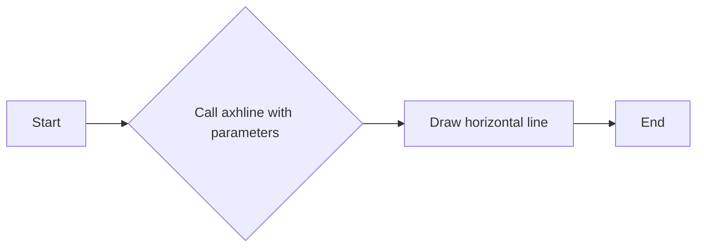

#### 带注释源码

```python
ax.axhline(y=0, color="black", linestyle="--")
```


### `matplotlib.pyplot.axvline`

`matplotlib.pyplot.axvline` 是一个全局函数，用于在图表中绘制垂直线。

参数：

- `x`：`float`，垂直线的x坐标。
- `color`：`str` 或 `color`，垂直线的颜色。
- `linestyle`：`str` 或 `Line2D`，垂直线的线型。

返回值：`Line2D`，绘制的垂直线对象。

#### 流程图

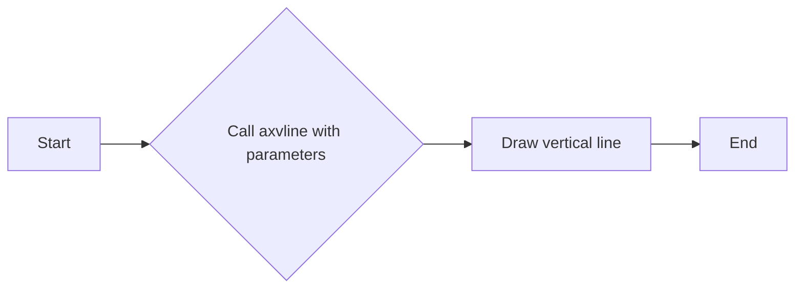

#### 带注释源码

```python
ax.axvline(color="grey")
```


### `matplotlib.pyplot.axline`

`matplotlib.pyplot.axline` 是一个全局函数，用于在图表中绘制任意方向的直线。

参数：

- `xy`：`tuple`，直线的起点和终点坐标。
- `slope`：`float`，直线的斜率。
- `color`：`str` 或 `color`，直线的颜色。
- `linestyle`：`str` 或 `Line2D`，直线的线型。
- `transform`：`Transform`，用于转换点的变换。

返回值：`Line2D`，绘制的直线对象。

#### 流程图

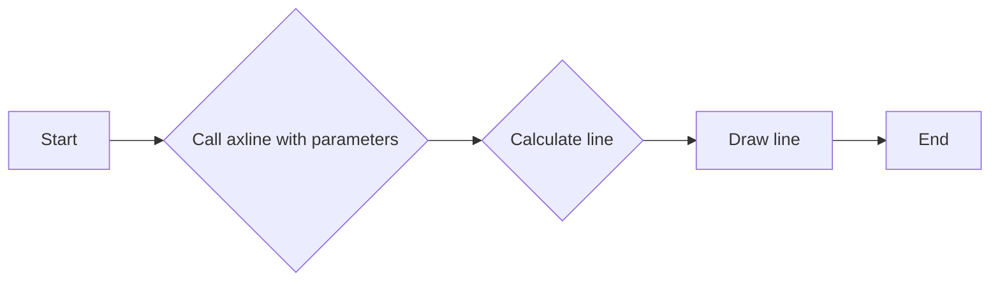

#### 带注释源码

```python
ax.axline((0, 0.5), slope=0.25, color="black", linestyle=(0, (5, 5)))
```


### `matplotlib.pyplot.subplots`

`matplotlib.pyplot.subplots` 是一个全局函数，用于创建一个新的图表和轴对象。

参数：

- `figsize`：`tuple`，图表的大小。
- `dpi`：`int`，图表的分辨率。
- `ncols`：`int`，轴的列数。
- `nrows`：`int`，轴的行数。
- `sharex`：`bool`，是否共享x轴。
- `sharey`：`bool`，是否共享y轴。
- `fig`：`Figure`，现有的图表对象。
- `gridspec`：`GridSpec`，用于定义网格的布局。

返回值：`Figure`，图表对象；`Axes`，轴对象。

#### 流程图

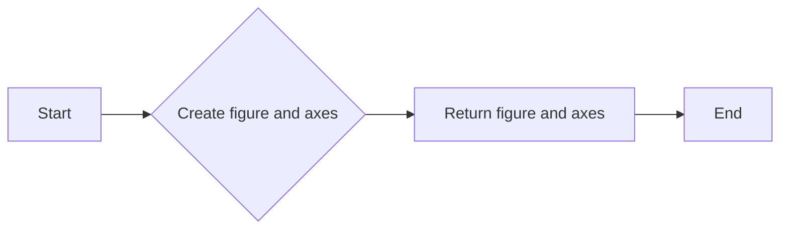

#### 带注释源码

```python
fig, ax = plt.subplots()
```


### `matplotlib.pyplot.show`

`matplotlib.pyplot.show` 是一个全局函数，用于显示图表。

参数：

- `block`：`bool`，是否阻塞程序执行直到图表关闭。

#### 流程图

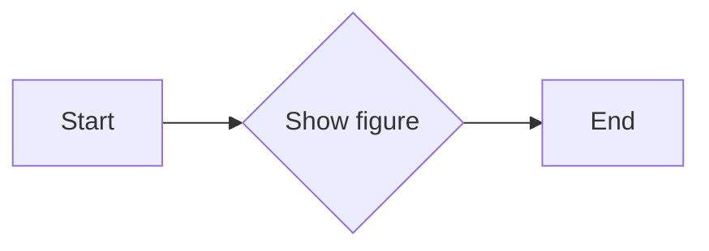

#### 带注释源码

```python
plt.show()
```


### `matplotlib.pyplot.subplots`

`subplots` 函数用于创建一个包含一个或多个子图的图形和一个轴对象的元组。

参数：

- `figsize`：`tuple`，图形的大小（宽度和高度），默认为 (6, 4)。
- `dpi`：`int`，图形的分辨率，默认为 100。
- `facecolor`：`color`，图形的背景颜色，默认为白色。
- `edgecolor`：`color`，图形的边缘颜色，默认为 'none'。
- `frameon`：`bool`，是否显示图形的边框，默认为 True。
- `num`：`int`，子图的数量，默认为 1。
- `gridspec_kw`：`dict`，用于定义子图网格的参数。
- `constrained_layout`：`bool`，是否启用约束布局，默认为 False。

返回值：`fig, ax`，其中 `fig` 是图形对象，`ax` 是轴对象。

#### 流程图

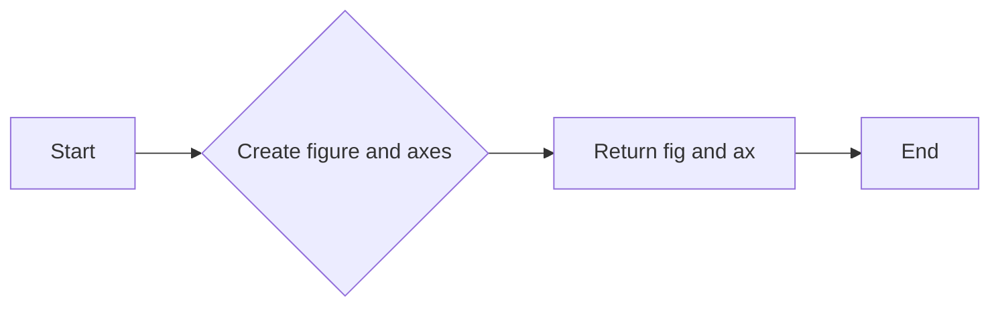

#### 带注释源码

```python
import matplotlib.pyplot as plt

fig, ax = plt.subplots()
```


### matplotlib.pyplot.plot

matplotlib.pyplot.plot 是一个用于绘制二维数据的函数，它可以将一系列的 x 和 y 值绘制成线图或散点图。

参数：

- `t`：`numpy.ndarray`，时间序列的值。
- `sig`：`numpy.ndarray`，与时间序列对应的信号值。
- `linewidth`：`int`，线宽。
- `label`：`str`，图例标签。

返回值：`Line2D`，matplotlib 线对象。

#### 流程图

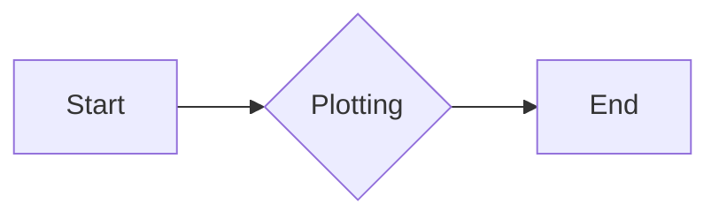

#### 带注释源码

```python
ax.plot(t, sig, linewidth=2, label=r"$\sigma(t) = \frac{1}{1 + e^{-t}}$")

# ax.plot(t, sig, linewidth=2, label=r"$\sigma(t) = \frac{1}{1 + e^{-t}}$")
# Line2D object is created and added to the Axes object 'ax'.
```


### matplotlib.pyplot.axhline

matplotlib.pyplot.axhline 是一个用于绘制水平线的函数，它可以在指定的 y 位置绘制无限长的水平线。

参数：

- `y`：`float`，指定水平线的 y 位置。
- `color`：`str` 或 `Color`，指定水平线的颜色。
- `linestyle`：`str` 或 `Line2D`，指定水平线的线型。
- `linewidth`：`float`，指定水平线的线宽。
- `clip_on`：`bool`，指定是否将水平线裁剪到轴的界限内。
- `transform`：`Transform`，指定用于转换点的变换。

返回值：`Line2D`，返回绘制的水平线对象。

#### 流程图

```mermaid
graph LR
A[Start] --> B{Call axhline()}
B --> C[Set parameters]
C --> D[Draw line]
D --> E[Return Line2D object]
E --> F[End]
```

#### 带注释源码

```python
import matplotlib.pyplot as plt

# 创建一个图形和轴
fig, ax = plt.subplots()

# 绘制水平线
line = ax.axhline(y=0, color="black", linestyle="--")

# 显示图形
plt.show()
```


### matplotlib.pyplot.axvline

matplotlib.pyplot.axvline 是一个用于绘制垂直线的函数，它可以在指定的 x 位置绘制无限长的垂直线。

参数：

- `x`：`float`，指定垂直线的 x 位置。
- `ydata`：`array_like`，可选，指定垂直线在 y 轴上的数据点，默认为 [0, 0]。
- `color`：`color`，可选，指定线的颜色，默认为 'C0'。
- `linestyle`：`str`，可选，指定线的样式，默认为 '-'。
- `linewidth`：`float`，可选，指定线的宽度，默认为 1.0。
- `transform`：`Transform`，可选，指定用于转换点的变换，默认为 ax.transData。

返回值：`Line2D`，返回绘制的线对象。

#### 流程图

```mermaid
graph LR
A[Start] --> B{Call axvline()}
B --> C[End]
```

#### 带注释源码

```python
import matplotlib.pyplot as plt

# 创建一个图形和轴
fig, ax = plt.subplots()

# 绘制垂直线
line = ax.axvline(x=0, color='red')

# 显示图形
plt.show()
```


### matplotlib.pyplot.axline

matplotlib.pyplot.axline 是一个用于绘制无限直线的函数，它可以在任意方向上绘制直线。

参数：

- `xdata`：`float` 或 `array`，指定直线的起点 x 坐标。
- `ydata`：`float` 或 `array`，指定直线的起点 y 坐标。
- `slope`：`float`，指定直线的斜率。
- `intercept`：`float`，指定直线与 y 轴的截距。
- `color`：`color`，指定直线的颜色。
- `linestyle`：`str` 或 `tuple`，指定直线的样式。
- `transform`：`Transform`，指定用于转换点的变换。

返回值：`Line2D`，表示绘制的直线。

#### 流程图

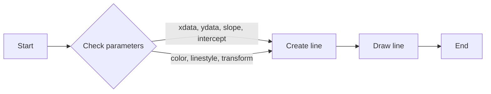

#### 带注释源码

```python
import matplotlib.pyplot as plt
import numpy as np

# 创建一个图形和坐标轴
fig, ax = plt.subplots()

# 绘制一条直线
line = ax.axline((0, 0.5), slope=0.25, color="black", linestyle=(0, (5, 5)))

# 显示图形
plt.show()
```


### matplotlib.pyplot.axline

matplotlib.pyplot.axline is a function used to draw infinite straight lines in arbitrary directions on a plot.

参数：

- `xdata`：`array_like`，指定线的起点x坐标。
- `ydata`：`array_like`，指定线的起点y坐标。
- `slope`：`float`，指定线的斜率。
- `intercept`：`float`，指定线的截距。
- `color`：`color`，指定线的颜色。
- `linestyle`：`str` or `tuple`，指定线的样式。
- `transform`：`Transform`，指定线的坐标变换。

返回值：`Line2D`，表示绘制的线。

#### 流程图

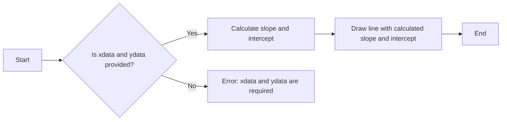

#### 带注释源码

```python
import matplotlib.pyplot as plt
import numpy as np

# 创建一个图和坐标轴
fig, ax = plt.subplots()

# 绘制一条线
line = ax.axline((0, 0.5), slope=0.25, color="black", linestyle=(0, (5, 5)))

# 显示图形
plt.show()
```


### `matplotlib.pyplot.legend`

`matplotlib.pyplot.legend` 是一个用于在matplotlib图形中添加图例的函数。

参数：

- `loc`：`int` 或 `str`，指定图例的位置。
- `bbox_to_anchor`：`tuple`，指定图例的锚点位置。
- `ncol`：`int`，指定图例的列数。
- `mode`：`str`，指定图例的显示模式。
- `title`：`str` 或 `None`，指定图例的标题。
- `fontsize`：`float` 或 `None`，指定图例的字体大小。
- `frameon`：`bool`，指定是否显示图例的边框。
- `fancybox`：`bool`，指定是否显示图例的边框为圆角。
- `shadow`：`bool`，指定是否显示图例的阴影。
- `handlelength`：`float`，指定图例手柄的长度。
- `borderpad`：`float`，指定图例边框与图例内容的间距。
- `labelspacing`：`float`，指定图例标签之间的间距。
- `borderaxespad`：`float`，指定图例边框与坐标轴的间距。
- `handletextpad`：`float`，指定图例手柄与文本之间的间距。
- `columnspacing`：`float`，指定图例列之间的间距。
- `title_fontsize`：`float` 或 `None`，指定图例标题的字体大小。
- `title_fontweight`：`str` 或 `None`，指定图例标题的字体粗细。
- `title_fontstyle`：`str` 或 `None`，指定图例标题的字体样式。
- `title_fontname`：`str` 或 `None`，指定图例标题的字体名称。
- `title_boxstyle`：`str` 或 `None`，指定图例标题的框样式。

返回值：`matplotlib.legend.Legend` 对象，表示图例。

#### 流程图

```mermaid
graph LR
A[Start] --> B{Call matplotlib.pyplot.legend()}
B --> C[End]
```

#### 带注释源码

```python
ax.legend(fontsize=14)
```

在这个例子中，`ax.legend(fontsize=14)` 调用将创建一个图例，其中图例的字体大小为14。


### `matplotlib.pyplot.axline`

`matplotlib.pyplot.axline` 是一个用于绘制无限直线的函数，它可以在任意方向上绘制直线。

参数：

- `xdata`：`float` 或 `array`，指定直线的起点 x 坐标。
- `ydata`：`float` 或 `array`，指定直线的起点 y 坐标。
- `slope`：`float`，指定直线的斜率。
- `intercept`：`float`，指定直线与 y 轴的截距。
- `color`：`str` 或 `color`，指定直线的颜色。
- `linestyle`：`str` 或 `tuple`，指定直线的样式。
- `transform`：`Transform`，指定用于转换点的变换。

返回值：`Line2D`，表示绘制的直线。

#### 流程图

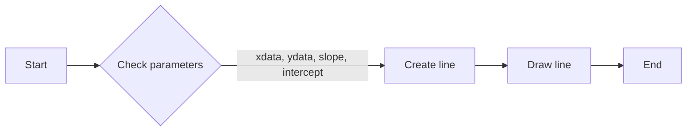

#### 带注释源码

```python
import matplotlib.pyplot as plt
import numpy as np

# 创建一个图形和坐标轴
fig, ax = plt.subplots()

# 绘制一条直线
line = ax.axline((0, 0.5), slope=0.25, color="black", linestyle=(0, (5, 5)))

# 显示图形
plt.show()
```


### numpy.linspace

`numpy.linspace` 是一个 NumPy 函数，用于生成线性间隔的数字数组。

参数：

- `start`：`float`，起始值。
- `stop`：`float`，结束值。
- `num`：`int`，生成的数组中的数字数量（不包括结束值）。
- `dtype`：`dtype`，可选，输出数组的类型。
- `endpoint`：`bool`，可选，是否包含结束值。

返回值：`numpy.ndarray`，一个包含线性间隔数字的数组。

#### 流程图

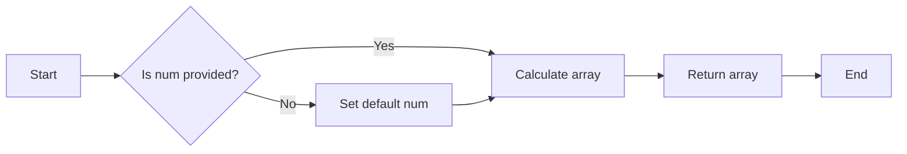

#### 带注释源码

```python
import numpy as np

def linspace(start, stop, num=50, dtype=None, endpoint=True):
    """
    Return evenly spaced numbers over a specified interval.

    Parameters
    ----------
    start : float
        Start of interval.
    stop : float
        End of interval.
    num : int, optional
        Number of samples to generate. Default is 50.
    dtype : dtype, optional
        The type of the output array. If `dtype` is not specified, the type is
        inferred from the other input arguments.
    endpoint : bool, optional
        If True, include the stop value in the array. Default is True.

    Returns
    -------
    out : ndarray
        Array of evenly spaced values.

    Examples
    --------
    >>> np.linspace(0, 5, 10)
    array([ 0.        ,  1.04427397,  2.08854794,  3.13282191,
            4.17709588,  5.22136985,  6.26564382,  7.30991779,
            8.35318976,  9.39746374])
    """
    return np.linspace(start, stop, num, dtype, endpoint)
```


### numpy.exp

`numpy.exp` 是一个全局函数，用于计算自然指数函数的值。

参数：

- `x`：`numpy.ndarray` 或 `float`，输入值，可以是单个数值或数组。

返回值：`numpy.ndarray` 或 `float`，输出值，与输入值类型相同，包含自然指数函数的值。

#### 流程图

```mermaid
graph LR
A[Start] --> B{Is x a numpy.ndarray or float?}
B -- Yes --> C[Calculate exp(x)]
B -- No --> D[Error: Invalid input type]
C --> E[End]
D --> E
```

#### 带注释源码

```python
import numpy as np

def numpy_exp(x):
    """
    Calculate the exponential of x.
    
    Parameters:
    - x: numpy.ndarray or float, the input value.
    
    Returns:
    - numpy.ndarray or float, the exponential value of x.
    """
    return np.exp(x)
```


### `matplotlib.pyplot.axhline`

`matplotlib.pyplot.axhline` 是一个全局函数，用于在图表中绘制水平线。

参数：

- `y`：`float`，水平线的y坐标。
- `color`：`str` 或 `color`，水平线的颜色。
- `linestyle`：`str` 或 `Line2D`，水平线的线型。

返回值：`Line2D`，绘制的水平线对象。

#### 流程图


#### 带注释源码

```python
ax.axhline(y=0, color="black", linestyle="--")
```


### `matplotlib.pyplot.axvline`

`matplotlib.pyplot.axvline` 是一个全局函数，用于在图表中绘制垂直线。

参数：

- `x`：`float`，垂直线的x坐标。
- `color`：`str` 或 `color`，垂直线的颜色。
- `linestyle`：`str` 或 `Line2D`，垂直线的线型。

返回值：`Line2D`，绘制的垂直线对象。

#### 流程图


#### 带注释源码

```python
ax.axvline(color="grey")
```


### `matplotlib.pyplot.axline`

`matplotlib.pyplot.axline` 是一个全局函数，用于在图表中绘制任意方向的直线。

参数：

- `xydata`：`tuple` 或 `list`，直线的起点和终点坐标。
- `slope`：`float`，直线的斜率。
- `color`：`str` 或 `color`，直线的颜色。
- `linestyle`：`str` 或 `Line2D`，直线的线型。
- `transform`：`Transform`，用于转换坐标的变换对象。

返回值：`Line2D`，绘制的直线对象。

#### 流程图

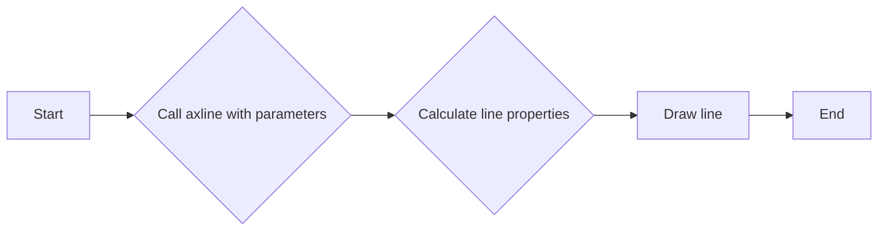

#### 带注释源码

```python
ax.axline((0, 0.5), slope=0.25, color="black", linestyle=(0, (5, 5)))
```


### `matplotlib.pyplot.subplots`

`matplotlib.pyplot.subplots` 是一个全局函数，用于创建一个新的图表和轴对象。

参数：

- `figsize`：`tuple`，图表的大小。
- `dpi`：`int`，图表的分辨率。
- `ncols`：`int`，轴的列数。
- `nrows`：`int`，轴的行数。
- `sharex`：`bool`，是否共享x轴。
- `sharey`：`bool`，是否共享y轴。
- `fig`：`Figure`，现有的图表对象。
- `gridspec`：`GridSpec`，用于定义网格的布局。

返回值：`Figure`，图表对象；`Axes`，轴对象。

#### 流程图

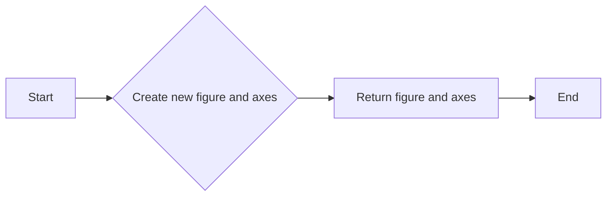

#### 带注释源码

```python
fig, ax = plt.subplots()
```


### `matplotlib.pyplot.show`

`matplotlib.pyplot.show` 是一个全局函数，用于显示图表。

参数：

- `block`：`bool`，是否阻塞程序执行直到图表关闭。

#### 流程图

```mermaid
graph LR
A[Start] --> B{Show the figure}
B --> C[End]
```

#### 带注释源码

```python
plt.show()
```

## 关键组件


### 张量索引与惰性加载

张量索引与惰性加载是指在处理大型数据集时，只对需要的数据进行索引和加载，以减少内存消耗和提高计算效率。

### 反量化支持

反量化支持是指代码能够处理和转换不同量化的数据，例如从浮点数到定点数，以及从定点数到浮点数的转换。

### 量化策略

量化策略是指对数据或模型进行量化处理的方法，以减少模型大小和提高计算效率。这通常涉及到将数据或模型的精度降低到特定的位数。

## 问题及建议


### 已知问题

-   **代码重复性**：在两个示例中，都使用了 `plt.subplots()` 来创建图形和轴。这可以封装到一个函数中，以减少代码重复。
-   **注释不足**：代码中的注释主要集中在解释函数和模块的使用，但缺乏对代码逻辑和设计决策的解释。
-   **全局变量**：代码中使用了全局变量 `plt` 和 `np`，这可能导致命名冲突和难以维护。
-   **代码风格**：代码风格不一致，例如在注释中使用了不同的缩进和格式。

### 优化建议

-   **封装函数**：创建一个函数来创建图形和轴，以减少代码重复并提高可读性。
-   **增强注释**：添加更多注释来解释代码逻辑和设计决策。
-   **避免全局变量**：使用局部变量或参数传递来避免使用全局变量。
-   **统一代码风格**：遵循一个代码风格指南，以确保代码的一致性和可读性。
-   **代码复用**：考虑将绘图逻辑封装到类中，以便在不同的项目中复用。
-   **性能优化**：如果绘图操作是性能瓶颈，可以考虑使用更高效的绘图库或优化绘图算法。


## 其它


### 设计目标与约束

- 设计目标：实现一个能够绘制无限直线、水平线和垂直线的函数，用于标记特殊数据值或绘制网格线。
- 约束条件：使用matplotlib库进行绘图，确保代码兼容性。

### 错误处理与异常设计

- 错误处理：在绘图过程中，如果发生matplotlib相关的错误（如无法创建图形窗口），应捕获异常并给出友好的错误信息。
- 异常设计：定义自定义异常类，用于处理特定的错误情况。

### 数据流与状态机

- 数据流：输入参数包括时间序列、线条属性（颜色、线型等），输出为绘制的图形。
- 状态机：程序从初始化图形和坐标轴开始，通过设置线条属性和绘制线条，最终展示图形。

### 外部依赖与接口契约

- 外部依赖：matplotlib库和numpy库。
- 接口契约：matplotlib的Axes类提供了绘制线条的方法，如axhline、axvline和axline。


    