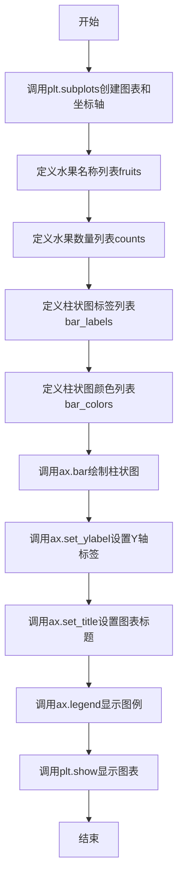
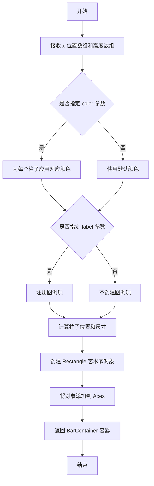
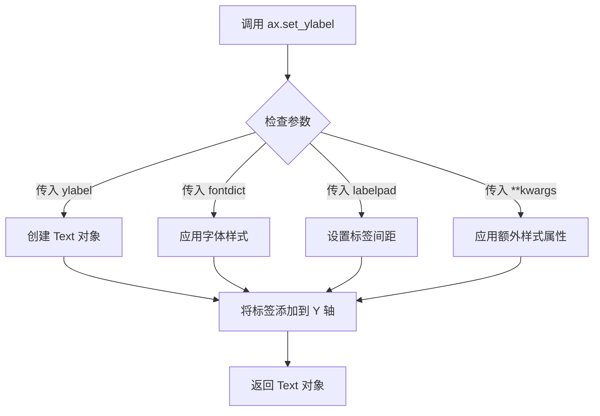
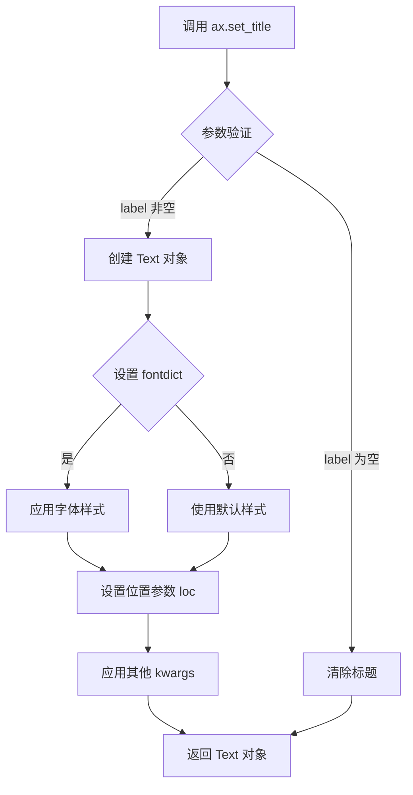
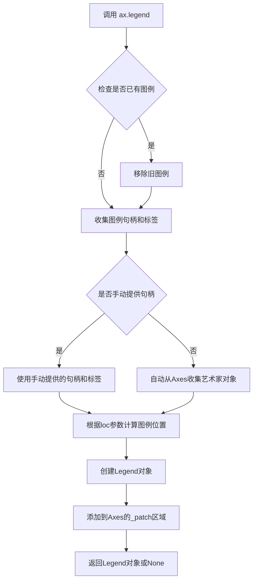
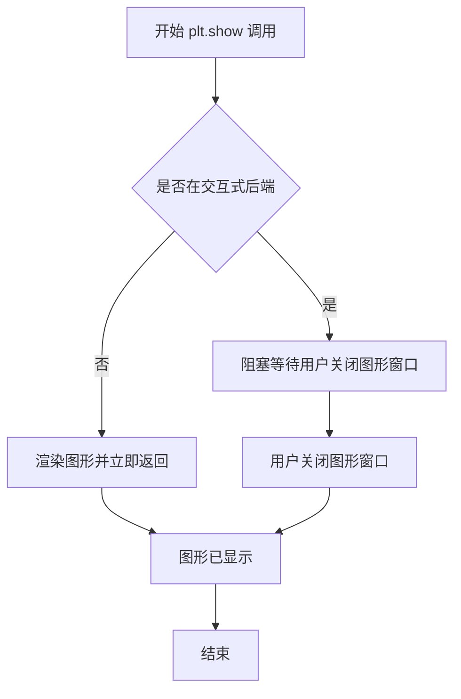

# `matplotlib\galleries\examples\lines_bars_and_markers\bar_colors.py` 详细设计文档

这是一个matplotlib柱状图示例脚本，演示如何通过color和label参数控制单个柱子的颜色和图例条目，实现不同水果按颜色分类的可视化展示。

## 整体流程



## 类结构

```
无自定义类（仅使用matplotlib库）
└── matplotlib.pyplot 模块
    ├── Figure 对象 (通过plt.subplots返回)
    └── Axes 对象 (通过plt.subplots返回)
```

## 全局变量及字段


### `fig`
    
图表容器对象

类型：`matplotlib.figure.Figure`
    


### `ax`
    
坐标轴对象

类型：`matplotlib.axes.Axes`
    


### `fruits`
    
水果名称列表

类型：`list[str]`
    


### `counts`
    
水果数量列表

类型：`list[int]`
    


### `bar_labels`
    
柱状图图例标签列表（下划线前缀的标签不会显示在图例中）

类型：`list[str]`
    


### `bar_colors`
    
柱状图颜色列表

类型：`list[str]`
    


    

## 全局函数及方法


### `plt.subplots`

创建包含一个或多个子图的图形和坐标轴对象的函数

参数：

- `nrows`：`int`，可选，默认值为1，子图的行数
- `ncols`：`int`，可选，默认值为1，子图的列数
- `sharex`：`bool` 或 `str`，可选，默认值为False，如果为True，则所有子图共享x轴；如果为'col'，则每列子图共享x轴
- `sharey`：`bool` 或 `str`，可选，默认值为False，如果为True，则所有子图共享y轴；如果为'row'，则每行子图共享y轴
- `squeeze`：`bool`，可选，默认值为True，如果为True，则返回的坐标轴数组维度会被压缩为更少的维度
- `width_ratios`：`array-like`，可选，定义每列子图的宽度比例
- `height_ratios`：`array-like`，可选，定义每行子图的高度比例
- `subplot_kw`：`dict`，可选，传递给`add_subplot`的参数字典
- `gridspec_kw`：`dict`，可选，传递给`GridSpec`的参数字典
- `figsize`：`tuple`，可选，图形的大小，宽度和高度，单位为英寸
- `facecolor`：`color`，可选，图形背景颜色
- `edgecolor`：`color`，可选，图形边框颜色
- `frameon`：`bool`，可选，是否绘制图形框架

返回值：`tuple`，返回一个包含两个元素的元组 `(fig, ax)`
- `fig`：`matplotlib.figure.Figure`，图形对象
- `ax`：`matplotlib.axes.Axes` 或 `numpy.ndarray`，坐标轴对象或坐标轴对象数组

#### 流程图

```mermaid
flowchart TD
    A[开始 plt.subplots 调用] --> B{参数校验}
    B -->|nrows > 0, ncols > 0| C[创建 Figure 对象]
    C --> D[创建 GridSpec 布局]
    D --> E{循环创建子图}
    E -->|每次迭代| F[调用 add_subplot 创建 Axes]
    E -->|循环结束| G{判断 squeeze 参数}
    G -->|squeeze=True 且仅有一个子图| H[返回展平的坐标轴]
    G -->|squeeze=False 或多个子图| I[返回坐标轴数组]
    H --> J[返回 (fig, ax) 元组]
    I --> J
    J --> K[结束]
```

#### 带注释源码

```python
# matplotlib.pyplot.subplots 的简化实现原理

def subplots(nrows=1, ncols=1, sharex=False, sharey=False, 
             squeeze=True, width_ratios=None, height_ratios=None,
             subplot_kw=None, gridspec_kw=None, figsize=None,
             facecolor=None, edgecolor=None, frameon=True):
    """
    创建包含子图的图形和坐标轴
    
    参数:
        nrows: 子图行数
        ncols: 子图列数
        sharex: 是否共享x轴
        sharey: 是否共享y轴
        squeeze: 是否压缩返回的坐标轴维度
        width_ratios: 每列宽度比例
        height_ratios: 每行高度比例
        subplot_kw: 创建子图的额外参数
        gridspec_kw: 网格布局的额外参数
        figsize: 图形尺寸 (宽度, 高度)
        facecolor: 背景颜色
        edgecolor: 边框颜色
        frameon: 是否显示框架
    
    返回:
        (fig, ax): 图形对象和坐标轴对象
    """
    
    # 1. 创建 Figure 对象
    fig = plt.figure(figsize=figsize, facecolor=facecolor, 
                     edgecolor=edgecolor, frameon=frameon)
    
    # 2. 创建 GridSpec 布局对象
    # 用于定义子图的网格结构
    gs = GridSpec(nrows, ncols, figure=fig,
                  width_ratios=width_ratios,
                  height_ratios=height_ratios,
                  **gridspec_kw)
    
    # 3. 创建坐标轴数组
    ax_array = np.empty((nrows, ncols), dtype=object)
    
    # 4. 遍历每个子图位置，创建对应的 Axes 对象
    for i in range(nrows):
        for j in range(ncols):
            # 使用 add_subplot 添加子图
            ax = fig.add_subplot(gs[i, j], **subplot_kw)
            ax_array[i, j] = ax
            
            # 处理 sharex/sharey 逻辑
            if sharex and i > 0:
                ax.shared_x_axes.join(ax, ax_array[0, j])
            if sharey and j > 0:
                ax.shared_y_axes.join(ax, ax_array[i, 0])
    
    # 5. 根据 squeeze 参数处理返回值
    if squeeze:
        # 尝试简化返回的坐标轴维度
        if nrows == 1 and ncols == 1:
            ax = ax_array[0, 0]  # 返回单个坐标轴而非数组
        elif nrows == 1 or ncols == 1:
            ax = ax_array.flatten()  # 返回一维数组
        else:
            ax = ax_array  # 返回二维数组
    else:
        ax = ax_array  # 始终返回二维数组
    
    # 6. 返回 (图形, 坐标轴) 元组
    return fig, ax


# 在示例代码中的调用
fig, ax = plt.subplots()

# 等价于:
# fig = plt.figure()
# ax = fig.add_subplot(1, 1, 1)
```


### `ax.bar`

该方法用于在 Axes 对象上绘制柱状图，支持自定义每个柱子的颜色和图例标签。通过传入水果名称作为 x 轴标签、数量作为柱子高度、颜色列表和标签列表，可以创建具有个性化样式的柱状图，并使用 `ax.legend()` 显示图例。

参数：

- `x`：list，数据类型为字符串列表，表示每个柱子的 x 轴位置（本例中为水果名称：'apple', 'blueberry', 'cherry', 'orange'）
- `height`：list，数据类型为数值列表，表示每个柱子的高度（本例中为水果数量：[40, 100, 30, 55]）
- `label`：list，可选参数，数据类型为字符串列表，表示每个柱子对应的图例标签（本例中为 ['red', 'blue', '_red', 'orange']，注意下划线开头的标签不会显示在图例中）
- `color`：list，可选参数，数据类型为字符串列表，表示每个柱子的填充颜色（本例中为 ['tab:red', 'tab:blue', 'tab:red', 'tab:orange']）

返回值：`BarContainer` 或 `list[Polygon]`，返回包含所有柱子艺术对象的容器，用于进一步操作（如设置误差线等）

#### 流程图



#### 带注释源码

```python
# 导入 matplotlib.pyplot 模块，用于创建图表
import matplotlib.pyplot as plt

# 创建一个新的图表和一个 Axes 对象
# fig: Figure 对象，整个图表容器
# ax: Axes 对象，用于绘制图形
fig, ax = plt.subplots()

# 定义水果名称列表，作为柱状图的 x 轴标签
fruits = ['apple', 'blueberry', 'cherry', 'orange']

# 定义每个水果的数量列表，作为柱子的高度
counts = [40, 100, 30, 55]

# 定义每个柱子的图例标签列表
# 注意：以下划线 '_' 开头的标签不会显示在图例中
bar_labels = ['red', 'blue', '_red', 'orange']

# 定义每个柱子的颜色列表
# 使用 matplotlib 支持的颜色规范，如 'tab:red', 'tab:blue' 等
bar_colors = ['tab:red', 'tab:blue', 'tab:red', 'tab:orange']

# 绘制柱状图
# 参数说明：
#   x=fruits: x 轴位置，使用水果名称
#   height=counts: 柱子高度，使用水果数量
#   label=bar_labels: 每个柱子的图例标签
#   color=bar_colors: 每个柱子的填充颜色
ax.bar(fruits, counts, label=bar_labels, color=bar_colors)

# 设置 y 轴标签
ax.set_ylabel('fruit supply')

# 设置图表标题
ax.set_title('Fruit supply by kind and color')

# 添加图例
# title='Fruit color' 设置图例标题
ax.legend(title='Fruit color')

# 显示图表
plt.show()
```


### `ax.set_ylabel`

设置 Y 轴的标签，用于指定图表 Y 轴所表示的数据含义。

参数：

- `ylabel`：`str`，Y 轴标签的文本内容
- `fontdict`：`dict`，可选，用于控制标签外观的字体字典（如字体大小、颜色等）
- `labelpad`：`float`，可选，标签与 Y 轴之间的间距（磅值）
- `**kwargs`：可选，其他关键字参数，会传递给 `matplotlib.text.Text` 对象，用于进一步自定义标签样式（如 fontsize、color、rotation 等）

返回值：`matplotlib.text.Text`，返回创建的文本对象，可用于后续进一步自定义或获取信息

#### 流程图



#### 带注释源码

```python
# 设置 Y 轴标签为 'fruit supply'
ax.set_ylabel('fruit supply')

# 带样式的设置示例（参考 matplotlib 官方用法）
ax.set_ylabel(
    'fruit supply',           # ylabel: str - Y 轴标签文本
    fontdict={                # fontdict: dict - 字体样式字典
        'family': 'sans-serif',   # 字体系列
        'color': 'black',         # 字体颜色
        'weight': 'normal',       # 字体粗细
        'size': 12               # 字体大小
    },
    labelpad=10,              # labelpad: float - 标签与轴的间距（磅）
    rotation=0,               # rotation: float - 标签旋转角度
    horizontalalignment='center'  # 水平对齐方式
)
```

#### 详细说明

在给定的示例代码中：

```python
ax.set_ylabel('fruit supply')
```

这行代码的作用是：
1. 获取当前 axes 对象的 Y 轴
2. 创建一个文本标签 "fruit supply"
3. 将该标签放置在 Y 轴的默认位置（通常在左侧）
4. 返回一个 `matplotlib.text.Text` 对象

`set_ylabel` 方法是 matplotlib 中 `Axes` 类的方法，属于 `matplotlib.axes.Axes` 模块。该方法底层调用了 `matplotlib.axis.Axis.set_label_text()` 来实际设置轴标签，并使用 `matplotlib.text.Text` 来渲染标签文本。

该方法支持丰富的自定义选项，可以通过 `fontdict` 或直接传入 `**kwargs` 来设置文本的字体、颜色、大小、旋转角度等属性，也可以通过 `labelpad` 控制标签与坐标轴之间的间距。


### `ax.set_title`

设置图表的标题文字和样式。

参数：

- `label`：`str`，要显示的标题文本内容
- `fontdict`：`dict`，可选，用于控制标题字体样式的字典（如 font-size、font-weight 等）
- `loc`：`str`，可选，标题对齐方式，可选值为 'center'（默认）、'left'、'right'
- `pad`：`float`，可选，标题与图表顶部边缘的距离（单位为点）
- `y`：`float`，可选，标题的垂直位置（相对于 axes 区域，0-1 之间）
- `**kwargs`：`dict`，其他传递给 `matplotlib.text.Text` 的参数，如 color、fontsize、fontweight 等

返回值：`matplotlib.text.Text`，返回创建的标题文本对象，可用于后续样式调整或获取标题属性。

#### 流程图



#### 带注释源码

```python
# matplotlib 中 Axes.set_title 的简化实现原理
def set_title(self, label, fontdict=None, loc=None, pad=None, *, y=None, **kwargs):
    """
    设置 Axes 对象的标题
    
    参数:
        label: 标题文本内容
        fontdict: 字体属性字典
        loc: 标题对齐方式 ('center', 'left', 'right')
        pad: 标题与顶部的间距
        y: 垂直位置
        **kwargs: 其他 Text 属性
    """
    
    # 1. 如果 label 为空或 None，则清除标题
    if not label:
        self.title.set_text('')
        return self.title
    
    # 2. 设置标题文本
    self.title.set_text(label)
    
    # 3. 如果提供了 fontdict，应用字体样式
    if fontdict:
        self.title.update(fontdict)
    
    # 4. 设置对齐方式（默认居中）
    if loc:
        self.set_title_loc(loc)  # 内部方法
    
    # 5. 设置与顶部的间距
    if pad is not None:
        self.title.set_pad(pad)
    
    # 6. 设置垂直位置
    if y is not None:
        self.title.set_y(y)
    
    # 7. 应用其他关键字参数（如颜色、字体大小等）
    self.title.update(kwargs)
    
    # 8. 返回 Text 对象，允许链式调用或后续修改
    return self.title
```

#### 在示例代码中的使用

```python
# 示例代码中的实际调用
ax.set_title('Fruit supply by kind and color')

# 等效的完整调用形式（展示所有可用参数）
ax.set_title(
    label='Fruit supply by kind and color',  # 标题文本
    fontdict={'fontsize': 16, 'fontweight': 'bold'},  # 字体样式
    loc='center',  # 居中对齐
    pad=20,  # 与顶部间距20点
    y=1.0,  # 垂直位置
    color='black'  # 标题颜色
)
```


### `ax.legend`

该方法是 Matplotlib 中 `Axes` 类的实例方法，用于将图例添加到当前 Axes 对象中。它通过自动或手动方式获取艺术家对象（如柱状图、折线图等）的标签，并在图表的指定位置显示对应的图例。

参数：

- `loc`：`str` 或 `int`，图例显示位置，如 'upper right', 'lower left', 'center' 等，默认为 'best'
- `title`：`str`，图例标题，默认为 None（无标题）
- `labelspacing`：`float`，标签之间的垂直间距
- `frameon`：`bool`，是否显示图例边框
- `fancybox`：`bool`，是否使用圆角边框
- `shadow`：`bool`，是否显示阴影
- `ncol`：`int`，图例列数
- `fontsize`：`int` 或 `str`，字体大小
- `title_fontsize`：`int` 或 `str`，标题字体大小
- `handles`：`list`，手动指定的艺术家对象列表
- `labels`：`list`，手动指定的标签列表
- `*args`：可变位置参数，用于传递图例句柄和标签
- `**kwargs`：可变关键字参数，用于传递其他图例属性

返回值：`matplotlib.legend.Legend`，返回创建的 Legend 对象，如果已存在图例则返回 None

#### 流程图



#### 带注释源码

```python
# 示例代码中的调用方式
ax.legend(title='Fruit color')

# 详细参数说明
# ax.legend(
#     *args,          # 可选：图例句柄和标签，如 (handles, labels) 或直接是艺术家对象
#     loc='best',     # 位置：'upper right', 'lower left', 'center' 等
#     title='Fruit color',  # 图例标题
#     fontsize=None,  # 字体大小
#     title_fontsize=None,  # 标题字体大小
#     frameon=True,   # 是否显示边框
#     fancybox=True,  # 圆角边框
#     shadow=False,   # 阴影效果
#     framealpha=None,  # 边框透明度
#     facecolor='inherit',  # 背景色
#     edgecolor='inherit',  # 边框颜色
#     mode=None,      # 水平扩展模式
#     bbox_to_anchor=None,  # 自定义锚点
#     ncol=1,         # 列数
#     labelspacing=None,  # 标签间距
#     borderpad=None,  # 边框内边距
#     labelsetpt=None,  # 标签刻度设置
#     title_fontsize=None,  # 标题字体大小
#     **kwargs        # 其他matplotlib Text属性
# )
```


### `plt.show`

显示当前所有打开的图形窗口，并将图形渲染到屏幕。这是matplotlib中用于输出可视化结果的最终步骤。

参数：

- `block`：`bool`，可选参数。默认为`True`。控制是否阻塞程序执行以等待图形窗口关闭。在非交互式环境中可设置为`False`。

返回值：`None`，无返回值。该函数直接渲染图形到显示设备，不返回任何数据。

#### 流程图



#### 带注释源码

```python
# 导入matplotlib.pyplot模块，提供了类似MATLAB的绘图接口
import matplotlib.pyplot as plt

# 创建一个新的图形窗口和一个子图对象
# fig: Figure对象，代表整个图形窗口
# ax: Axes对象，代表子图坐标轴
fig, ax = plt.subplots()

# 定义水果种类列表
fruits = ['apple', 'blueberry', 'cherry', 'orange']

# 定义每种水果的数量
counts = [40, 100, 30, 55]

# 定义图例标签（以'_'开头的标签不会显示在图例中）
bar_labels = ['red', 'blue', '_red', 'orange']

# 定义每个条形的颜色
bar_colors = ['tab:red', 'tab:blue', 'tab:red', 'tab:orange']

# 绘制条形图，设置标签和颜色
# label参数用于图例显示，color参数用于条形填充色
ax.bar(fruits, counts, label=bar_labels, color=bar_colors)

# 设置y轴标签
ax.set_ylabel('fruit supply')

# 设置图表标题
ax.set_title('Fruit supply by kind and color')

# 添加图例，设置标题为'Fruit color'
ax.legend(title='Fruit color')

# =====================================
# 核心函数：plt.show()
# =====================================
# 显示所有打开的图形窗口，将图形渲染到屏幕
# 在交互式后端（如TkAgg, Qt5Agg）会阻塞程序执行
# 直到用户关闭图形窗口；在非交互式后端会立即返回
plt.show()

# 关闭图形窗口以释放资源（可选，在脚本中通常不需要）
plt.close()
```

---
**补充说明**

| 项目 | 说明 |
|------|------|
| **所属模块** | `matplotlib.pyplot` |
| **调用时机** | 在所有图形配置完成后调用，作为绘图的最后一个步骤 |
| **后端依赖** | 实际行为依赖于matplotlib配置的显示后端（如Qt、Tk、AGG等） |
| **常见用法** | 在交互式Python解释器中会自动显示，但在脚本中需要显式调用 |
| **与close()配合** | `plt.show()`后可调用`plt.close()`释放内存和资源 |


## 关键组件


### matplotlib.pyplot

matplotlib的pyplot模块，提供类似MATLAB的绘图接口

### fig, ax = plt.subplots()

创建图形窗口和坐标轴对象的工厂函数，返回Figure和Axes对象

### ax.bar()

绑制条形图的核心方法，支持颜色和标签参数

### bar_colors

定义每个条形的颜色，使用tab:red、tab:blue等颜色规范

### bar_labels

定义图例标签，下划线开头的标签不会显示在图例中

### ax.legend()

显示图例，title参数设置图例标题

### ax.set_ylabel() / ax.set_title()

设置坐标轴标签和图表标题


## 问题及建议


### 已知问题

- **数据硬编码**：fruits、counts、bar_labels、bar_colors 均以硬编码方式直接写在代码中，降低了代码的可维护性和可复用性
- **缺少参数一致性检查**：未验证 fruits、counts、bar_labels、bar_colors 四个列表长度是否一致，可能导致运行时错误或静默失败
- **无输入数据验证**：未对 counts 的数值有效性（如负数、NaN）进行校验
- **函数封装缺失**：整个绘图逻辑未封装为可复用的函数，难以在其他场景中重复使用
- **无类型注解**：代码中未使用 Python 类型提示，降低了代码的可读性和 IDE 支持
- **错误处理缺失**：没有 try-except 块来捕获可能的异常（如字体缺失、显示服务器连接失败等）
- **资源管理不当**：使用 plt.show() 但未显式管理图形生命周期，无 fig.clear() 或 plt.close() 调用

### 优化建议

- 将绘图逻辑封装为函数，接受 fruits、counts、bar_colors 等作为参数，并添加类型注解和文档字符串
- 在函数入口处添加数据一致性校验，确保列表长度匹配，数值有效
- 添加异常处理，捕获并妥善处理绘图过程中可能出现的异常
- 考虑使用面向对象方式，将图表配置封装为类，支持更灵活的配置和状态管理
- 将颜色映射、标签映射等配置抽取为常量或配置文件，提高可维护性
- 添加 plt.close(fig) 或使用 with 语句管理图形生命周期，避免资源泄漏
- 如需支持中文显示，应在绘图前配置中文字体（如 SimHei）
- 考虑将 matplotlib 样式和主题配置外部化，支持主题切换
</think> 

## 其它


### 设计目标与约束

本代码旨在演示matplotlib条形图（bar chart）的个性化配色功能，主要目标包括：（1）展示如何为每个条形设置不同颜色；（2）演示如何控制图例条目的显示与隐藏（带下划线前缀的标签不显示在图例中）；（3）提供基础的数据可视化示例供初学者学习。技术约束方面，代码仅依赖matplotlib和Python标准库，需要matplotlib 3.4.0及以上版本支持label和color参数。

### 错误处理与异常设计

当前代码为简单的示例脚本，未包含复杂的错误处理机制。潜在的异常情况包括：（1）数据长度不匹配异常——当fruits、counts、bar_labels、bar_colors四个列表长度不一致时，matplotlib会抛出ValueError或产生意外行为；（2）无效颜色值异常——当bar_colors中包含非法的颜色字符串时，matplotlib会抛出ValueError；（3）图形关闭异常——在plt.show()调用后关闭图形窗口时，程序正常退出无异常处理。改进建议：添加数据验证逻辑，确保输入列表长度一致；捕获异常并提供友好的错误提示信息。

### 数据流与状态机

数据流从输入数据（fruits、counts、bar_labels、bar_colors）经过以下流程：（1）数据准备阶段——定义四个列表数据；（2）图形创建阶段——通过plt.subplots()创建Figure和Axes对象；（3）绑定数据阶段——调用ax.bar()方法将数据绑定到Axes的图形元素；（4）属性设置阶段——通过set_ylabel()和set_title()设置轴标签和标题；（5）图例创建阶段——通过ax.legend()生成图例；（6）渲染显示阶段——调用plt.show()渲染并显示图形。状态机包含三个主要状态：初始化状态（数据定义）→配置状态（图形参数设置）→渲染状态（显示图形），状态转换顺序执行，无分支或循环状态。

### 外部依赖与接口契约

主要外部依赖为matplotlib库，具体依赖项包括：（1）matplotlib.pyplot模块——提供plt.subplots()和plt.show()函数；（2）matplotlib.figure模块——Figure对象的隐式依赖；（3）matplotlib.axes模块——Axes对象的隐式依赖。接口契约方面，ax.bar()函数接受x（类别位置）、height（条形高度）、label（图例标签）、color（条形颜色）四个关键参数，所有参数均为可变参数，函数返回BarContainer对象，包含所有条形补丁对象。ax.legend()接受title（图例标题）参数，返回Legend对象。plt.show()无参数，返回值为None。

### 性能考虑

当前代码为静态单次绑制示例，性能表现良好。对于大规模数据场景的性能优化建议包括：（1）当条形数量超过1000个时，考虑使用barh()水平条形图提升可读性；（2）对于实时数据更新场景，使用ax.clear()代替重复创建Figure对象以减少内存开销；（3）避免在循环中频繁调用plt.show()，应在循环外统一调用或使用交互式后端；（4）对于需要导出高分辨率图像的场景，可在plt.show()前调用fig.savefig('output.png', dpi=300)。

### 安全性考虑

当前代码为数据可视化示例，不涉及用户输入、网络请求或敏感数据处理，安全性风险较低。潜在安全考虑包括：（1）当从外部文件读取数据绘制图表时，需对输入数据进行验证，防止注入攻击；（2）避免将敏感数据以明文形式嵌入代码或注释中；（3）当使用eval()或exec()动态执行代码时需格外谨慎，当前代码未使用此类危险函数。

### 可测试性

当前代码以脚本形式存在，单元测试需求较低。可测试性改进建议：（1）将图表创建逻辑封装为函数，接受数据参数，返回Figure对象，便于单元测试；（2）针对数据验证逻辑编写单元测试，验证长度不匹配时的异常抛出；（3）使用matplotlib的Agg后端（非交互式后端）进行无头测试，避免显示窗口依赖；（4）可使用pytest-mpl插件进行图形渲染的视觉回归测试。

### 版本兼容性

代码使用的matplotlib API兼容性如下：（1）ax.bar()的label和color参数需要matplotlib 3.4.0及以上版本；（2）plt.subplots()在matplotlib 2.0.0及以上版本稳定支持；（3）图例的title参数为标准API，兼容所有现代版本；（4）代码不适用于matplotlib 2.0以下版本。Python版本兼容性方面，代码使用Python 3语法（类型注解风格的类型提示虽然代码中未使用），兼容Python 3.6及以上版本。

### 图表可访问性

当前代码的可访问性考虑包括：（1）图表标题和轴标签使用英文，对于中文用户群体可考虑国际化；（2）颜色方案中包含红色和绿色，需考虑色盲用户的辨识度，建议使用色盲友好调色板（如viridis、tab10）；（3）图例标题"Fruit color"清晰描述了颜色与水果的对应关系。改进建议：添加ARIA标签描述图表内容，为打印版本确保足够的对比度，考虑添加数据表格作为图表的替代展示形式。

### 代码风格与规范

当前代码遵循以下规范：（1）使用Python PEP 8代码风格；（2）模块级文档字符串使用Sphinx reStructuredText格式，符合matplotlib文档标准；（3）注释规范使用# %%进行单元格分割，便于Jupyter Notebook交互使用；（4）变量命名使用有意义的英文单词（fruits、counts、bar_labels、bar_colors）。符合matplotlib官方示例的编码规范，代码可直接作为文档示例使用。


    