# `matplotlib\galleries\examples\lines_bars_and_markers\bar_label_demo.py` 详细设计文档

这是一个 Matplotlib 柱状图标签示例代码，展示了如何使用 bar_label 函数为柱状图添加各种格式的标签，包括堆叠柱状图、水平柱状图、自定义格式化字符串以及使用 callable 函数进行动态标签格式化。

## 整体流程

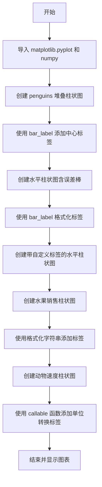

## 类结构

```
此代码为脚本文件，无类定义
主要模块: matplotlib.pyplot, numpy
代码块分段:
├── 堆叠柱状图 (penguins 数据)
├── 水平柱状图 (people 绩效数据)
├── 自定义标签格式
├── 格式化字符串标签
└── callable 函数标签
```

## 全局变量及字段


### `species`
    
企鹅种类元组，包含Adelie、Chinstrap和Gentoo三种企鹅

类型：`tuple`
    


### `sex_counts`
    
按性别统计的企鹅数量字典，键为性别，值为numpy数组

类型：`dict`
    


### `width`
    
柱状图的宽度参数，决定柱子的横向尺寸

类型：`float`
    


### `bottom`
    
堆叠柱状图的底部位置数组，用于累计计算每层柱子的起始高度

类型：`numpy.ndarray`
    


### `people`
    
人员名字元组，包含Tom、Dick、Harry、Slim和Jim五个人

类型：`tuple`
    


### `y_pos`
    
水平柱状图的Y轴位置数组，对应每个人在Y轴上的坐标

类型：`numpy.ndarray`
    


### `performance`
    
绩效数据数组，通过随机数生成，范围在3到13之间

类型：`numpy.ndarray`
    


### `error`
    
误差数据数组，通过随机数生成，用于柱状图的误差线显示

类型：`numpy.ndarray`
    


### `fruit_names`
    
冰淇淋口味名称列表，包含Coffee、Salted Caramel和Pistachio三种口味

类型：`list`
    


### `fruit_counts`
    
冰淇淋口味销量列表，对应各口味的销售数量（单位：品脱）

类型：`list`
    


### `animal_names`
    
动物名称列表，包含Lion、Gazelle和Cheetah三种动物

类型：`list`
    


### `mph_speed`
    
动物奔跑速度列表，单位为英里/小时（MPH）

类型：`list`
    


    

## 全局函数及方法


### `plt.subplots`

创建图形和一组子图的函数，是matplotlib.pyplot模块中最常用的用于创建子图的接口之一。

参数：

- `nrows`：`int`，默认值：1，子图网格的行数
- `ncols`：`int`，默认值：1，子图网格的列数
- `sharex`：`bool` or `{'none', 'all', 'row', 'col'}`，默认值：False，控制是否共享x轴
- `sharey`：`bool` or `{'none', 'all', 'row', 'col'}`，默认值：False，控制是否共享y轴
- `squeeze`：`bool`，默认值：True，是否压缩返回的轴数组维度
- `width_ratios`：`array-like`，可选，长度为ncols的数组，定义列的相对宽度
- `height_ratios`：`array-like`，可选，长度为nrows的数组，定义行的相对高度
- `subplot_kw`：`dict`，可选，传递给add_subplot的关键字参数
- `gridspec_kw`：`dict`，可选，传递给GridSpec构造函数的关键字参数
- `**fig_kw`：可选，传递给figure函数的关键字参数（如figsize、dpi等）

返回值：`tuple`，返回(Figure, Axes)或(Figure, ndarray of Axes)
- `fig`：`matplotlib.figure.Figure`对象，整个图形对象
- `ax`：`matplotlib.axes.Axes` or `numpy.ndarray of Axes`，子图对象数组

#### 流程图

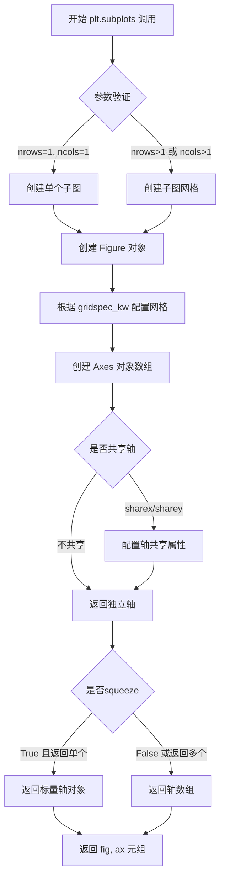

#### 带注释源码

```python
# 在代码中的典型调用方式：

# 示例1：创建单个子图（用于柱状图）
fig, ax = plt.subplots()
# 返回：
# - fig: Figure对象，整个图形窗口
# - ax: Axes对象，当前子图的坐标轴

# 示例2：创建单个子图（用于水平柱状图）
fig, ax = plt.subplots()
# 用于创建水平柱状图的画布

# 示例3：创建单个子图（用于带误差线的水平柱状图）
fig, ax = plt.subplots()
# 包含误差线的水平柱状图

# 示例4：创建单个子图（用于水果销售柱状图）
fig, ax = plt.subplots()
# 销售数据可视化

# 示例5：创建单个子图（用于动物速度柱状图）
fig, ax = plt.subplots()
# 速度数据可视化

# 底层实现原理（matplotlib.pyplot.subplots内部逻辑）：
"""
def subplots(nrows=1, ncols=1, sharex=False, sharey=False, squeeze=True,
             width_ratios=None, height_ratios=None,
             subplot_kw=None, gridspec_kw=None, **fig_kw):
    
    # 1. 创建Figure对象
    fig = figure(**fig_kw)
    
    # 2. 创建GridSpec对象用于布局
    gs = GridSpec(nrows, ncols, width_ratios=width_ratios, 
                  height_ratios=height_ratios, **gridspec_kw)
    
    # 3. 根据nrows和ncols创建子图
    if nrows == 1 and ncols == 1:
        ax = fig.add_subplot(gs[0, 0], **subplot_kw)
        axs = ax
    else:
        axs = []
        for i in range(nrows):
            for j in range(ncols):
                ax = fig.add_subplot(gs[i, j], **subplot_kw)
                axs.append(ax)
        axs = np.array(axs).reshape(nrows, ncols)
    
    # 4. 处理轴共享
    if sharex:
        # 配置x轴共享
        pass
    if sharey:
        # 配置y轴共享
        pass
    
    # 5. 根据squeeze参数返回结果
    if squeeze and nrows == 1 and ncols == 1:
        return fig, axs
    elif squeeze:
        # 压缩维度
        axs = axs.squeeze()
    
    return fig, axs
"""

# 调用时解包元组：
# fig: 整个图形对象，可以设置标题、图例等
# ax: 具体的坐标轴对象，用于绑制各种图表
```


### `ax.bar`

该方法用于在Axes对象上创建条形图（柱状图），可设置条形的宽度、位置、底部起始高度、对齐方式等属性，并返回包含所有条形矩形的BarContainer对象。

参数：

- `x`：float或array-like，条形图的x轴位置，可以是单个数值或数组
- `height`：float或array-like，条形图的高度，决定每个条形的垂直长度
- `width`：float或array-like，默认为0.8，条形图的宽度，可以是单个数值或与x同长度的数组
- `bottom`：float或array-like，默认为None，条形图的底部y坐标，用于堆叠条形图
- `align`：str，默认为'center'，条形的对齐方式，可选'center'或'edge'
- `**kwargs`：关键字参数，用于传递给Patch属性（如color、edgecolor、linewidth等）

返回值：`BarContainer`，包含所有条形矩形(Patch)的容器对象，可用于后续添加标签等操作

#### 流程图

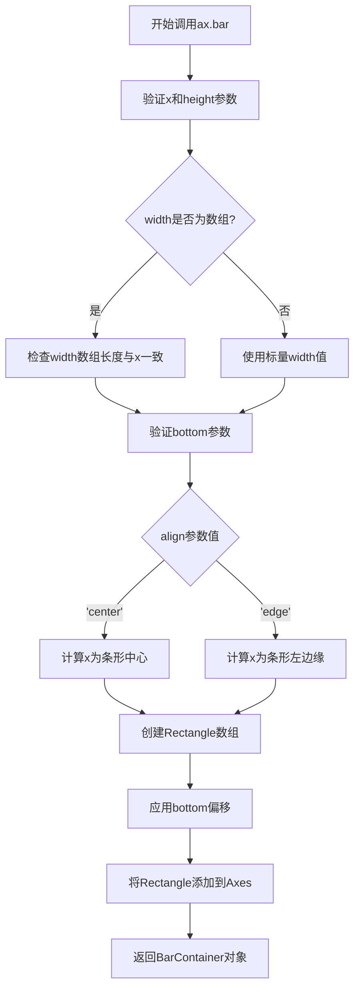

#### 带注释源码

```python
# 示例代码1: 垂直条形图 - 堆叠条形图（企鹅数量统计）
species = ('Adelie', 'Chinstrap', 'Gentoo')
sex_counts = {
    'Male': np.array([73, 34, 61]),
    'Female': np.array([73, 34, 58]),
}
width = 0.6  # 条形宽度
bottom = np.zeros(3)  # 初始底部位置为零数组

# 遍历每个性别类别的计数
for sex, sex_count in sex_counts.items():
    # 调用ax.bar创建条形图
    # 参数: x轴位置species, 条形高度sex_count, 宽度width, 标签sex, 底部位置bottom
    p = ax.bar(species, sex_count, width, label=sex, bottom=bottom)
    bottom += sex_count  # 更新底部位置，实现堆叠效果
    ax.bar_label(p, label_type='center')  # 在条形中心添加标签

# 示例代码2: 水平条形图 - ax.barh的使用
people = ('Tom', 'Dick', 'Harry', 'Slim', 'Jim')
y_pos = np.arange(len(people))  # y轴位置: [0, 1, 2, 3, 4]
performance = 3 + 10 * np.random.rand(len(people))  # 随机性能数据
error = np.random.rand(len(people))  # 随机误差

# 创建水平条形图
# 参数: y轴位置y_pos, 条形长度performance, x方向误差error, 居中对齐
hbars = ax.barh(y_pos, performance, xerr=error, align='center')
ax.set_yticks(y_pos, labels=people)  # 设置y轴刻度标签
ax.invert_yaxis()  # 反转y轴，使标签从上到下读取
ax.set_xlabel('Performance')  # 设置x轴标签
ax.set_title('How fast do you want to go today?')  # 设置标题

# 使用格式字符串添加标签
ax.bar_label(hbars, fmt='%.2f')  # 格式化标签为两位小数
ax.set_xlim(right=15)  # 调整x轴范围以适应标签

# 示例代码3: 使用自定义标签和格式化选项
# 使用列表推导式为每个误差值创建标签: "±0.xx"
ax.bar_label(hbars, labels=[f'±{e:.2f}' for e in error],
             padding=8, color='b', fontsize=14)  # 蓝色标签，间距8像素
ax.set_xlim(right=16)  # 扩展x轴范围

# 示例代码4: 使用格式化字符串添加千分位分隔符
fruit_names = ['Coffee', 'Salted Caramel', 'Pistachio']
fruit_counts = [4000, 2000, 7000]

bar_container = ax.bar(fruit_names, fruit_counts)  # 创建条形图
ax.set(ylabel='pints sold', title='Gelato sales by flavor', ylim=(0, 8000))
ax.bar_label(bar_container, fmt='{:,.0f}')  # 格式化: 千分位分隔符，无小数位

# 示例代码5: 使用可调用对象(lambda函数)格式化标签
animal_names = ['Lion', 'Gazelle', 'Cheetah']
mph_speed = [50, 60, 75]

bar_container = ax.bar(animal_names, mph_speed)
ax.set(ylabel='speed in MPH', title='Running speeds', ylim=(0, 80))
# 将mph速度转换为km/h: x * 1.61
ax.bar_label(bar_container, fmt=lambda x: f'{x * 1.61:.1f} km/h')
```

#### 关键组件信息

- **BarContainer**：包含条形图矩形对象的容器类，用于批量管理条形和添加标签
- **bar_label**：Axes的方法，用于在条形图上添加文本标签，支持center/edge两种位置
- **Rectangle (Patch)**：组成每个条形的矩形图形对象

#### 潜在技术债务与优化空间

1. **重复代码**：多个示例中存在重复的图表设置代码（如设置标题、轴标签等），可封装为辅助函数
2. **硬编码值**：条形宽度(0.6)、颜色('b')、字体大小(14)等参数硬编码，应提取为配置常量
3. **随机数据使用**：示例中使用np.random.rand生成随机数据，缺乏可重复性（虽有np.random.seed但仅在一处使用）
4. **错误处理缺失**：未对输入数据合法性（如负值、数组长度不匹配）进行验证
5. **魔法数字**：如xlim的15、16等值缺乏明确含义说明

#### 其它说明

- **设计目标**：演示matplotlib条形图的各种用法，包括垂直/水平条形图、堆叠条形图、添加标签的自定义格式化
- **约束**：x和height参数必须长度一致（除非为标量），width与x长度匹配时需为相同长度数组
- **数据流**：输入数据(species, sex_count等) → bar()方法 → BarContainer对象 → bar_label()方法 → 可视化渲染
- **外部依赖**：matplotlib.pyplot, numpy - 依赖这些库提供的绘图和数值计算功能


### `Axes.barh`

水平条形图（Horizontal Bar Chart）是matplotlib中用于绘制水平条形图的坐标轴方法，它接受y坐标、宽度、高度等参数，返回条形容器对象，用于展示类别数据在水平方向上的数值比较。

参数：

- `y`：`float` 或 `array-like`，条形的y坐标位置
- `width`：`float` 或 `array-like`，条形的宽度（水平方向的长度）
- `height`：`float` 或 `array-like`，默认 `0.8`，条形的高度
- `left`：`float` 或 `array-like`，默认 `None`，条形的左边界（x轴起点）
- `align`：str，默认 `'center'`，条形的对齐方式，可选 `'center'` 或 `'edge'`
- `**kwargs`：关键字参数，用于传递给底层 `Rectangle` 对象的属性，如颜色、边框等

返回值：`BarContainer`，包含所有创建的条形图容器的对象，用于后续调用 `bar_label` 添加标签

#### 流程图

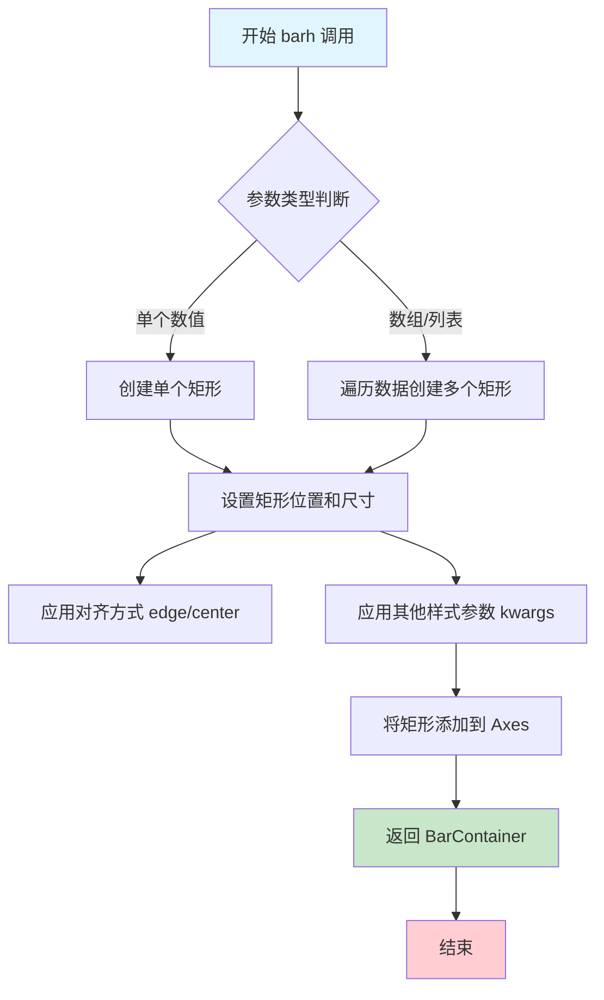

#### 带注释源码

```python
# matplotlib axes/_axes.py 中的 barh 方法实现（简化版）

def barh(self, y, width, height=0.8, left=None, *, align='center', **kwargs):
    """
    水平条形图绘制方法
    
    参数:
        y: 条形的y坐标位置（类别索引）
        width: 条形的宽度（数值大小）
        height: 条形的高度（默认0.8）
        left: 条形的左边界（默认0，从x=0开始）
        align: 对齐方式，'center'居中，'edge'边缘对齐
        **kwargs: 传递给Rectangle的属性（color, edgecolor, linewidth等）
    """
    # 1. 参数预处理
    # left默认为0，如果未指定
    if left is None:
        left = np.zeros(len(y)) if hasattr(y, '__len__') else 0
    
    # 2. 调用核心的bar方法
    # barh实际上是bar方法的包装，将y作为left，width作为height
    # 这是一个经典的"适配器模式"应用
    return self.bar(left, y, height, width=width, align=align, **kwargs)
```

```python
# 在示例代码中的实际使用

# 创建水平条形图
hbars = ax.barh(
    y_pos,           # y: y轴位置（0, 1, 2, 3, 4）
    performance,     # width: 条形宽度（数值）
    xerr=error,      # 额外的误差线参数
    align='center'   # 居中对齐
)

# 设置y轴刻度和标签
ax.set_yticks(y_pos, labels=people)

# 反转y轴使标签从上到下阅读
ax.invert_yaxis()

# 设置x轴标签和标题
ax.set_xlabel('Performance')
ax.set_title('How fast do you want to go today?')

# 使用bar_label添加标签
ax.bar_label(hbars, fmt='%.2f')

# 调整x轴范围以适应标签显示
ax.set_xlim(right=15)
```


### `Axes.bar_label`

`Axes.bar_label` 是 matplotlib 中用于在条形图上添加数据标签的便捷方法，能够自动计算标签位置并支持自定义格式、颜色、字体大小和内边距等属性。

参数：

- `container`：`matplotlib.container.BarContainer`，由 `ax.bar()` 或 `ax.barh()` 返回的条形容器对象
- `labels`：可选的 `list[str]`，自定义标签文本列表，默认为 None（自动使用条形值）
- `fmt`：格式说明符 `str` 或 `callable`，用于格式化标签的格式字符串或返回格式化字符串的可调用对象，默认为空字符串
- `label_type`：标签位置类型，可选 `'center'`（在条形内部居中）、`'edge'`（在条形顶部/右侧边缘），默认为 `'edge'`
- `padding`：浮点数，标签与条形边缘之间的间距，默认为 4
- `color`：标签文本颜色，支持 matplotlib 颜色规格
- `fontsize`：标签字体大小
- `**kwargs`：传递给 `matplotlib.text.Text` 的其他关键字参数

返回值：`list[matplotlib.text.Text]`，返回创建的标签文本对象列表

#### 流程图

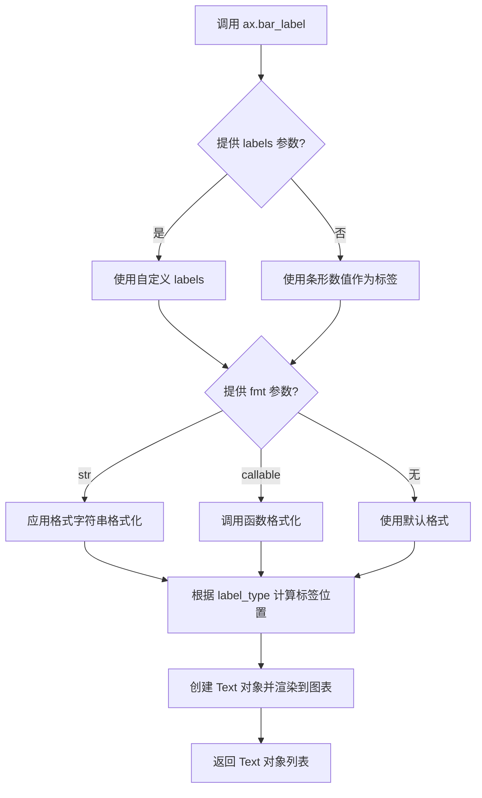

#### 带注释源码

```python
# 示例代码展示 bar_label 的典型用法

import matplotlib.pyplot as plt
import numpy as np

# 创建图表和轴
fig, ax = plt.subplots()

# 示例数据
y_pos = np.arange(3)
performance = [50, 60, 75]

# 创建水平条形图
hbars = ax.barh(y_pos, performance, align='center')

# 设置Y轴标签
ax.set_yticks(y_pos, labels=['Lion', 'Gazelle', 'Cheetah'])
ax.invert_yaxis()  # 标签从上到下阅读
ax.set_xlabel('speed in MPH')
ax.set_title('Running speeds')

# 用法1: 使用格式字符串添加标签
ax.bar_label(hbars, fmt='%.2f')  # 格式化为两位小数

# 用法2: 使用自定义标签和样式
# hbars: 条形容器
# labels: 自定义标签列表（这里是误差值）
# padding: 标签与条形边缘的间距（8像素）
# color: 标签颜色（蓝色）
# fontsize: 标签字体大小（14）
ax.bar_label(hbars, 
             labels=[f'±{e:.2f}' for e in error],  # 自定义标签
             padding=8,                             # 内边距
             color='b',                             # 文本颜色
             fontsize=14)                           # 字体大小

# 用法3: 使用格式化函数（callable）
# lambda 函数接收条形值 x，返回格式化字符串
ax.bar_label(bar_container, 
             fmt=lambda x: f'{x * 1.61:.1f} km/h')  # 将 MPH 转换为 km/h

# 用法4: 使用千位分隔符格式
ax.bar_label(bar_container, fmt='{:,.0f}')  # 格式化为千位分隔的整数
```

#### 关键组件信息

| 组件名称 | 描述 |
|---------|------|
| BarContainer | 由 `bar()`/`barh()` 返回的条形容器，包含所有条形的 Patch 对象和可选的错误条 |
| Text 对象 | matplotlib 文本对象，用于在图表上渲染标签 |
| 格式字符串 | Python 格式化规范，如 `'%.2f'`、`'{:,.0f}'` 等 |

#### 潜在的技术债务或优化空间

1. **标签重叠处理**：当前版本未提供自动检测和解决标签重叠的功能，当条形值较小或标签较长时可能发生重叠
2. **返回值未充分利用**：返回的 Text 对象列表在大多数使用场景中被忽略，可以考虑提供更便捷的链式操作接口
3. **缺乏动画支持**：在动画条形图中更新标签时需要手动重新创建，缺乏内置的动画更新机制

#### 其它项目

**设计目标与约束**：
- 提供简洁的 API 用于条形图标签添加
- 兼容所有条形图类型（垂直、水平、堆叠、分组）
- 支持 matplotlib 现有的文本样式系统

**错误处理与异常**：
- 当 `labels` 列表长度与条形数量不匹配时，会产生不正确的标签对齐或警告
- 当 `fmt` 为无效的可调用对象时，会抛出异常

**数据流与状态机**：
- 输入：条形容器对象（含数值数据）+ 格式化参数
- 处理：计算位置 → 格式化文本 → 创建文本对象 → 渲染
- 输出：Text 对象列表

**外部依赖与接口契约**：
- 依赖 `matplotlib.container.BarContainer`
- 依赖 `matplotlib.text.Text` 进行渲染
- 依赖 `matplotlib.axes.Axes` 对象方法


### `Axes.set_title`

设置Axes对象的标题文本和相关属性。

参数：

- `label`：`str`，要显示的标题文本内容
- `fontdict`：`dict`，可选，控制标题文本的字体样式字典（如 fontsize、fontweight、color 等）
- `loc`：`str`，可选，标题对齐方式，可选值为 'left'、'center'、'right'，默认为 'center'
- `pad`：`float`，可选，标题与 Axes 顶部边缘的距离（以点为单位）
- `y`：`float`，可选，标题在 y 轴方向上的相对位置（0-1 之间）

返回值：`matplotlib.text.Text`，返回创建的 Text 文本对象，可用于后续进一步设置文本样式

#### 流程图

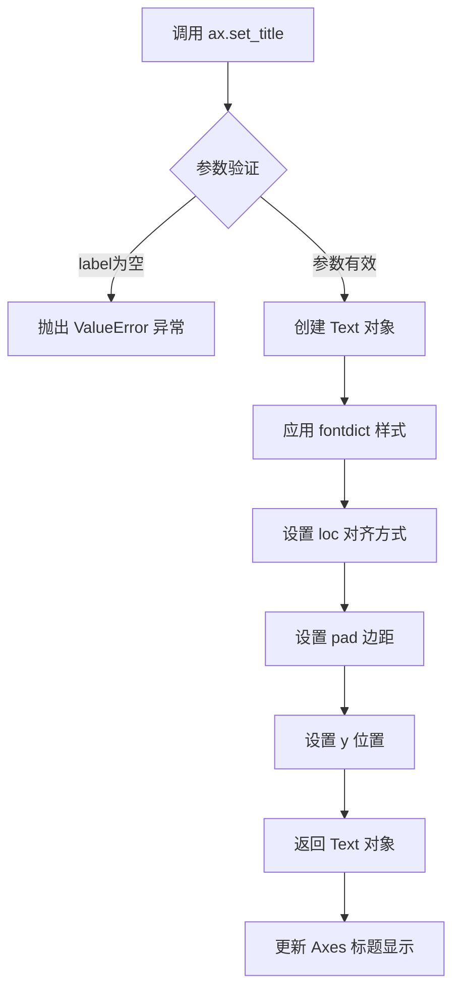

#### 带注释源码

```python
# 调用示例 1: 设置简单标题
ax.set_title('Number of penguins by sex')

# 调用示例 2: 设置带样式的标题
ax.set_title(
    'How fast do you want to go today?',  # label: 标题文本
    fontdict={                              # fontdict: 字体样式字典
        'fontsize': 14,                     # 字体大小
        'fontweight': 'bold',               # 字体粗细
        'verticalalignment': 'bottom'       # 垂直对齐方式
    },
    loc='center',                          # loc: 标题对齐方式为居中
    pad=20,                                 # pad: 标题与顶部边缘的距离为20点
    y=1.0                                   # y: 标题在y轴方向上的相对位置
)
```

#### 详细说明

`set_title` 是 matplotlib 中 `Axes` 类的核心方法之一，用于为图表设置标题。该方法支持丰富的自定义选项：

1. **label 参数**：必需的字符串参数，定义要显示的标题文本
2. **fontdict 参数**：可选的字典，允许通过键值对控制文本外观，包括 fontsize、fontweight、color、verticalalignment、horizontalalignment 等
3. **loc 参数**：控制标题的水平对齐，'left'、'center'、'right' 三种模式
4. **pad 参数**：控制标题与坐标轴顶部的间距，对于避免标题与标签重叠很有用
5. **y 参数**：控制标题在垂直方向上的位置，接受 0-1 之间的浮点数，表示相对于 Axes 高度的比例

返回值是 `matplotlib.text.Text` 对象，这是一个可变的对象，调用后仍可以修改其属性（如颜色、字体等），这在需要动态更新标题时特别有用。


### `ax.legend`

该方法是 matplotlib 中 `Axes` 类的成员函数，用于在图表中添加图例（legend），以标识不同数据系列的标签，使图表更具可读性。

参数：

- `loc`：`str` 或 `int`，图例放置位置，如 `'upper right'`、`'best'`、`0` 等，默认为 `'best'`
- `bbox_to_anchor`：`tuple`，用于指定图例的精确位置，格式为 `(x, y)`
- `ncol`：`int`，图例的列数，默认为 1
- `prop`：`dict` 或 `matplotlib.font_manager.FontProperties`，图例文本的字体属性
- `fontsize`：`int` 或 `str`，图例文字大小，如 `12`、`'small'`、`'large'`
- `title`：`str`，图例的标题文字
- `frameon`：`bool`，是否绘制图例边框，默认为 `True`
- `framealpha`：`float`，图例边框透明度，范围 0-1
- `fancybox`：`bool`，是否使用圆角边框，默认为 `True`
- `shadow`：`bool`，是否添加阴影效果
- `labelspacing`：`float`，标签之间的垂直间距
- `handlelength`：`float`，图例句柄（线条/标记）的长度
- `handletextpad`：`float`，图例句柄与文本之间的间距
- `borderaxespad`：`float`，图例边框与坐标轴之间的间距
- `columnspacing`：`float`，多列图例之间的间距

返回值：`matplotlib.legend.Legend`，返回创建的 Legend 对象，可用于进一步自定义

#### 流程图

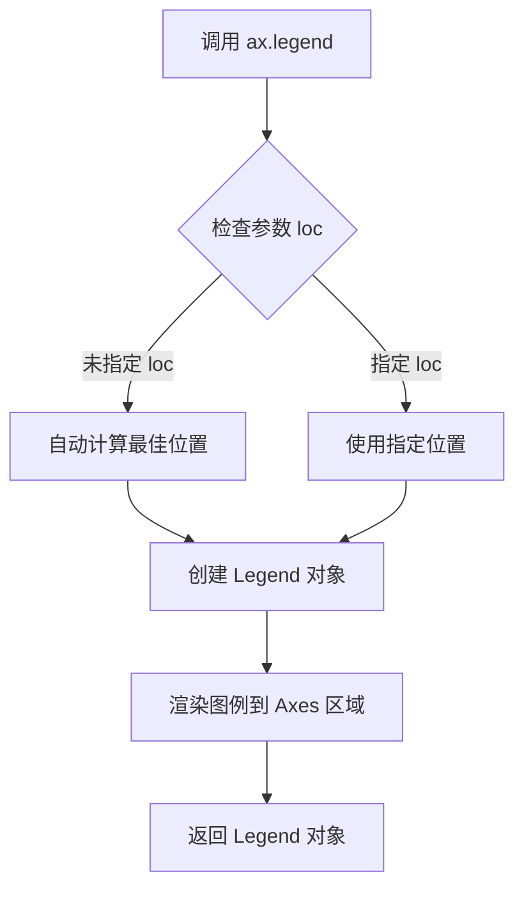

#### 带注释源码

```python
# 在代码中的实际调用
ax.set_title('Number of penguins by sex')  # 设置图表标题
ax.legend()  # 添加图例，显示 bar_label 中的 label 参数指定的标签

# 完整的 ax.legend() 方法签名（参考源码结构）
# def legend(self, *args, loc=None, bbox_to_anchor=None,
#            ncol=1, prop=None, fontsize=None, title=None,
#            frame_on=True, fancybox=None, shadow=None,
#            framealpha=None, edgecolor=None, facecolor=None,
#            borderpad=1.0, labelspacing=None, handlelength=None,
#            handletextpad=None, borderaxespad=None, columnspacing=None,
#            draggable=False, **kwargs):
#     """
#     Place a legend on the axes.
#     
#     Parameters
#     ----------
#     loc : str or pair of floats, default: 'upper right'
#         The location of the legend.
#     ...
#     
#     Returns
#     -------
#     `.Legend`
#         The created `Legend` instance.
#     """
```

#### 关键组件信息

- **Legend 对象**：matplotlib 的图例类，负责渲染图例的所有视觉元素
- **loc 参数**：控制图例在图表中的位置，支持字符串如 `'upper left'`、`'lower right'` 等
- **bbox_to_anchor**：允许将图例锚定在图表的任意位置，不受 loc 约束

#### 潜在的技术债务或优化空间

1. **默认位置可能不佳**：自动计算的 `'best'` 位置有时可能遮挡重要数据点
2. **缺少可访问性支持**：未提供屏幕阅读器支持的 aria-label 等属性
3. **国际化支持有限**：图例文本的字体渲染可能对某些语言支持不足

#### 其它项目

- **设计目标**：提供灵活、可自定义的图例功能，支持多种放置方式和样式
- **错误处理**：当提供的 loc 参数无效时，会抛出 `ValueError` 异常
- **外部依赖**：依赖 `matplotlib.legend.Legend` 类和 `matplotlib.font_manager`
- **使用约束**：必须在 Axes 对象上调用，且在添加数据后、显示前调用


### `Axes.set_yticks`

设置Y轴刻度位置和可选的刻度标签。该方法用于自定义Y轴上的刻度线位置以及对应的标签文本，是matplotlib中控制坐标轴显示的核心方法之一。

参数：

- `ticks`：`array-like`，Y轴刻度的位置值，指定刻度线在Y轴上的具体位置
- `labels`：`array-like`，可选参数，Y轴刻度的标签文本，用于显示在每个刻度位置的文字说明

返回值：`list`，返回刻度位置和标签的列表，通常为`matplotlib.ticker.Ticker`对象组成的列表

#### 流程图

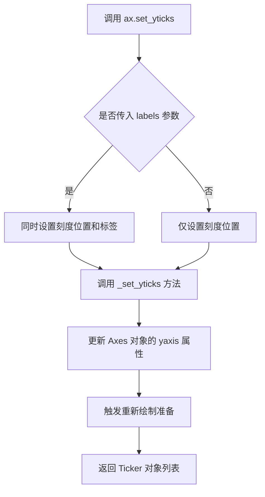

#### 带注释源码

```python
# matplotlib/axes/_base.py 中的 set_yticks 方法实现

def set_yticks(self, ticks, labels=None, *, minor=False, **kwargs):
    """
    Set the y-axis tick locations and optional labels.
    
    参数:
        ticks: array-like - 刻度位置的数组
        labels: array-like, optional - 刻度标签数组
        minor: bool - 是否设置次要刻度
        **kwargs: 传递给 Tick 的其他参数
    
    返回:
        list: Ticker 对象列表
    """
    # 获取Y轴的定位器（Locator）
    yaxis = self.yaxis
    
    # 如果传入了标签
    if labels is not None and len(ticks) != len(labels):
        raise ValueError("'labels' must have same length as 'ticks'")
    
    # 设置主刻度或次要刻度
    if minor:
        ylim = self.get_yticks(minor=True)
        yaxis.set_minorticks(ticks)
        if labels is not None:
            yaxis.set_minorticklabels(labels, **kwargs)
    else:
        # 将输入的刻度位置转换为合适的Locator对象
        # 可以是数组、Locator实例或None
        yaxis.set_ticks(ticks, labels=labels, minor=minor, **kwargs)
    
    # 返回创建的Ticker对象（用于后续可能的bar_label调用）
    return yaxis.get_ticklocs(minor=minor)
```


### `Axes.invert_yaxis`

该方法用于反转 Y 轴的方向，使 Y 轴的值从大到小排列，从而实现标签从顶部读取到顶部的效果，常用于水平条形图等场景。

参数：无需参数

返回值：`None`，该方法直接修改 Axes 对象的 Y 轴状态，不返回任何值

#### 流程图

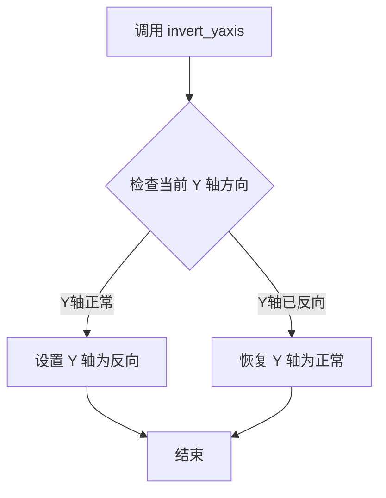

#### 带注释源码

```python
# 调用示例（来自代码第44行和第62行）
hbars = ax.barh(y_pos, performance, xerr=error, align='center')
ax.set_yticks(y_pos, labels=people)
ax.invert_yaxis()  # labels read top-to-bottom
ax.set_xlabel('Performance')
ax.set_title('How fast do you want to go today?')

# Label with specially formatted floats
ax.bar_label(hbars, fmt='%.2f')
ax.set_xlim(right=15)  # adjust xlim to fit labels

plt.show()
```

#### 详细说明

在 matplotlib 中，`Axes.invert_yaxis()` 方法的具体实现位于 `matplotlib/axes/_base.py` 文件中，其核心逻辑如下：

```python
def invert_yaxis(self):
    """
    Invert the y-axis.
    
    See Also
    --------
    invert_xaxis
    """
    self.invert_y = not self.invert_y
    self._request_autoscale_view()
    # 该方法会触发视图更新，使 Y 轴方向反转
```

**关键特性：**
1. **无参数设计**：该方法不需要任何参数，直接通过切换内部状态 `invert_y` 来实现功能
2. **双向切换**：如果 Y 轴已经反转，调用此方法会将其恢复为正常方向
3. **自动视图更新**：调用 `_request_autoscale_view()` 确保在反转后自动调整视图范围
4. **配套方法**：通常与 `invert_xaxis()` 一起使用，用于控制坐标轴方向


### `Axes.set_xlabel`

设置x轴的标签（xlabel），用于描述图表中x轴所代表的数据含义。这是matplotlib中Axes对象的一个基础方法，用于为图表添加轴标签，提升图表的可读性。

参数：

- `xlabel`：`str`，要设置的x轴标签文本内容
- `fontdict`：`dict`，可选，用于控制标签外观的字典（如字体大小、颜色等）
- `labelpad`：`float`，可选，标签与轴之间的间距（以点为单位）
- `loc`：`str`，可选，标签的位置，可选值为'left'、'center'或'right'（默认'center'）
- `**kwargs`：其他关键字参数，将传递给matplotlib的Text对象

返回值：`matplotlib.text.Text`，返回创建的文本标签对象，可用于进一步自定义标签样式

#### 流程图

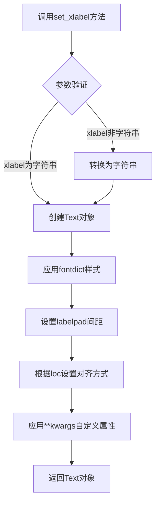

#### 带注释源码

```python
# 在matplotlib示例代码中的实际调用示例：

# 第一个水平柱状图示例中：
ax.set_xlabel('Performance')
# 参数说明：
# - xlabel = 'Performance' (str): 设置x轴标签文本为'Performance'
# - 返回值：Text对象，可用于后续自定义

# 第二个水平柱状图示例中：
ax.set_xlabel('Performance')
# 同样的调用，用于设置x轴标签

# 完整的函数签名（参考matplotlib官方文档）：
# def set_xlabel(self, xlabel, fontdict=None, labelpad=None, *, loc=None, **kwargs):
#     """
#     Set the label for the x-axis.
#     
#     Parameters
#     ----------
#     xlabel : str
#         The label text.
#     fontdict : dict, optional
#         A dictionary controlling the appearance of the label text.
#     labelpad : float, optional
#         Spacing in points between the label and the axes.
#     loc : {'left', 'center', 'right'}, default: 'center'
#         The label position relative to the figure.
#     **kwargs
#         Text properties.
#     
#     Returns
#     -------
#     label : matplotlib.text.Text
#         The created Text instance.
#     """
```


### `Axes.set_ylabel`

设置y轴的标签（ylabel），用于描述y轴所表示的数据含义。

参数：

- `ylabel`：`str`，y轴标签的文本内容
- `fontdict`：可选参数，`dict`，用于控制标签外观的字典（如字体大小、颜色等）
- `labelpad`：可选参数，`float`或`None`，标签与坐标轴之间的间距（以点为单位）
- `loc`：可选参数，`str`，标签的位置（'top', 'center', 'bottom'），仅适用于Axes3D
- `**kwargs`：其他关键字参数传递给`matplotlib.text.Text`构造函数

返回值：`matplotlib.text.Text`，创建的文本对象

#### 流程图

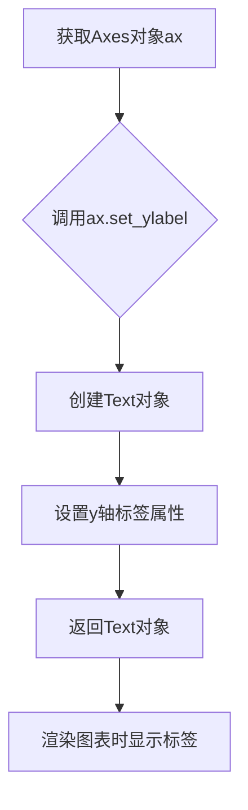

#### 带注释源码

```python
# 假设有以下图表对象 ax
fig, ax = plt.subplots()

# 示例1：基本用法，设置y轴标签
ax.set_ylabel('pints sold')

# 示例2：使用fontdict设置标签样式
ax.set_ylabel('pints sold', fontdict={'fontsize': 12, 'color': 'blue'})

# 示例3：使用labelpad调整标签与坐标轴的距离
ax.set_ylabel('pints sold', labelpad=10)

# 示例4：与ax.set()方法结合使用（代码中的实际用法）
ax.set(ylabel='pints sold', title='Gelato sales by flavor', ylim=(0, 8000))
# 上述代码等价于：
# ax.set_ylabel('pints sold')
# ax.set_title('Gelato sales by flavor')
# ax.set_ylim(0, 8000)

# 示例5：返回Text对象并进行进一步自定义
label = ax.set_ylabel('pints sold')
label.set_rotation(0)  # 旋转标签
label.set_fontweight('bold')  # 设置粗体
```


### ax.set_xlim

设置 Axes 对象的 X 轴显示范围（xlim），用于控制图表在 x 轴方向的显示区间。

参数：

- `left`：`float` 或 `None`，X 轴的最小值（左侧边界）
- `right`：`float` 或 `None`，X 轴的最大值（右侧边界）
- `emit`：`bool`，默认为 `True`，当边界变化时是否通知观察者（如legend、axis）
- `auto`：`bool`，默认为 `False`，是否允许自动调整边界以适应数据
- `ymin`：`float` 或 `None`（已弃用）
- `ymax`：`float` 或 `None`（已弃用）

返回值：`tuple`，返回新的 (left, right) 边界值元组

#### 流程图

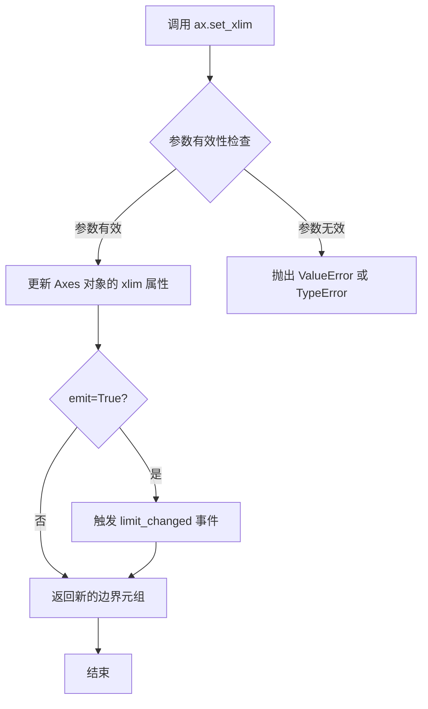

#### 带注释源码

```python
# 以下为 ax.set_xlim 方法的典型使用示例

# 示例1：设置右边界，让标签能够完全显示
# right参数指定x轴的最大值
ax.set_xlim(right=15)  # adjust xlim to fit labels

# 示例2：同时设置左右边界
ax.set_xlim(left=0, right=16)

# 示例3：使用 emit 参数控制事件触发
ax.set_xlim(right=20, emit=False)  # 不触发事件通知

# 示例4：使用 auto 参数允许自动调整
ax.set_xlim(right=25, auto=True)  # 允许自动调整以适应数据
```


### ax.set_ylim

该方法用于设置matplotlib图表中y轴的数值范围（上下限），可以接受一个元组或两个独立的参数来定义y轴的最小值和最大值。

参数：

- `bottom`：`float` 或 `None`，y轴范围的下限值
- `top`：`float` 或 `None`，y轴范围的上限值
- `**kwargs`：其他关键字参数，用于传递给`set_ylim`底层方法

返回值：`list`，返回更新后的y轴限制范围 `[bottom, top]`

#### 流程图

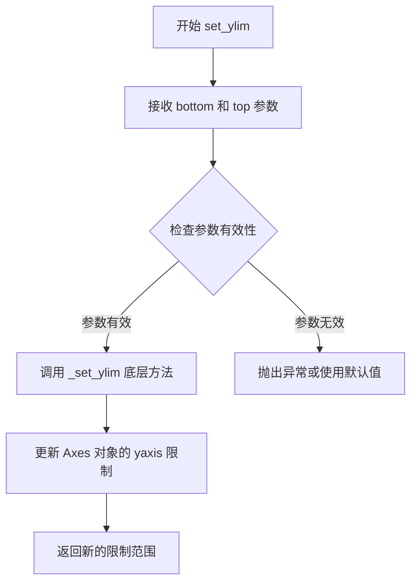

#### 带注释源码

```python
# 调用示例（在代码中实际使用的是 ax.set(ylim=(0, 8000))）
# 但 set_ylim 等效于：
ax.set_ylim(0, 8000)  # 设置y轴范围从0到8000

# 或者使用元组形式：
ax.set_ylim((0, 8000))  # 效果相同

# 源码位置：matplotlib/axes/_base.py
# 简化的方法签名：
def set_ylim(self, bottom=None, top=None, **kwargs):
    """
    Set the y-axis view limits.
    
    Parameters
    ----------
    bottom : float, default: 0
        The bottom ylim in data coordinates.
    top : float, default: 1
        The top ylim in data coordinates.
    **kwargs
        Additional parameters passed to _set_ylim.
        
    Returns
    -------
    list
        The y-axis limits [bottom, top].
    """
    # 实际实现会调用 _set_ylim 方法
    # 该方法会更新 self._yminmax 和 self._ybound
    # 并触发图形重绘
```


### `plt.show`

该函数是 matplotlib 库中用于显示所有已创建图形的核心函数。它会阻塞程序执行并打开一个或多个窗口来展示当前的图形内容，直到用户关闭图形窗口或程序结束。

参数：

- `block`：`bool`，可选参数（默认值：True）。当设置为 True 时，函数会阻塞程序执行直到用户关闭所有图形窗口；当设置为 False 时，函数会立即返回（非阻塞模式，在某些后端中可能不会显示图形）。

返回值：`None`，该函数不返回任何值，仅用于显示图形。

#### 流程图

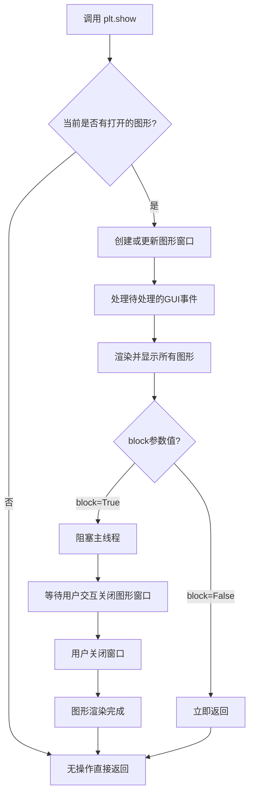

#### 带注释源码

```python
# 第一次调用 plt.show()
# 显示第一个包含企鹅数据的分组条形图
# 该图形包含两个子图：一个是垂直条形图展示不同物种的企鹅数量按性别分布
# 另一个是水平条形图展示不同人物的绩效数据
plt.show()

# 第二次调用 plt.show()
# 显示第二个包含绩效数据的水平条形图
# 该图形带有误差线，展示了绩效的不确定性
plt.show()

# 第三次调用 plt.show()
# 显示第三个带有自定义标签的水平条形图
# 标签包含自定义格式（±误差值）、蓝色字体和内边距设置
plt.show()

# 第四次调用 plt.show()（隐式，在代码末尾可能被省略）
# 显示包含冰淇淋销售数据的垂直条形图
# 标签使用千位分隔符格式化数字
# 注意：此处在代码中未显式调用 plt.show()，因为前面的 plt.show() 已阻塞程序
# 在实际执行中，如果需要显示多个独立图形，需要在每个图形创建后调用 plt.show()
# 或者使用 plt.show() 一次性显示所有已创建的图形

# 第五次调用 plt.show()（隐式）
# 显示包含动物奔跑速度的条形图
# 标签使用 lambda 函数自定义格式化，将 MPH 转换为 km/h
```


### `np.zeros`

`np.zeros` 是 NumPy 库中的一个函数，用于创建一个指定形状和数据类型的数组，数组中的所有元素初始化为 0。在本代码中用于创建一个长度为 3 的零数组，作为堆叠柱状图的底部起始值。

参数：

-  `shape`：`int` 或 `int` 的元组，要创建的数组的维度，例如 `3` 表示一维数组长度为 3，`(2, 3)` 表示 2 行 3 列的二维数组
-  `dtype`：`data-type`，可选，数组的期望数据类型，默认为 `float64`
-  `order`：`{'C', 'F'}`，可选，表示在内存中存储多维数据的顺序，`'C'` 为行优先（C 风格），`'F'` 为列优先（Fortran 风格），默认为 `'C'`

返回值：`numpy.ndarray`，一个填充零的新数组

#### 流程图

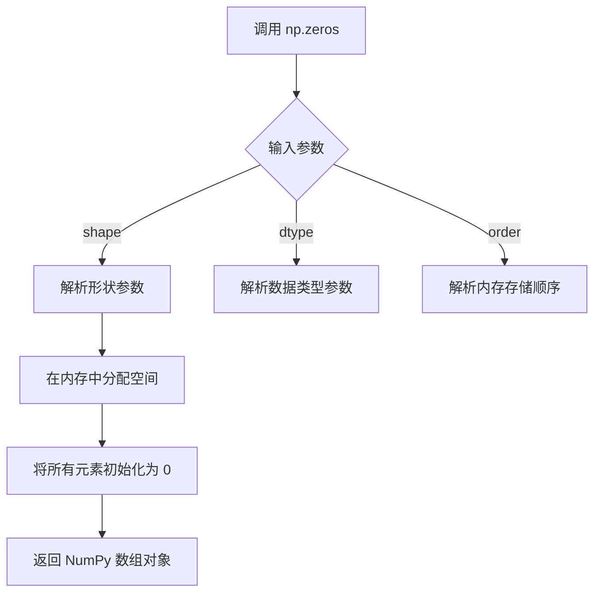

#### 带注释源码

```python
# 调用 np.zeros(3) 创建一个包含 3 个元素的零数组
# 参数说明：
#   3: 数组形状，表示创建一维数组，包含 3 个元素
#   默认 dtype 为 float64，即每个元素是 64 位浮点数
#   默认 order 为 'C'，即行优先存储
bottom = np.zeros(3)

# 上述代码等同于:
# bottom = np.zeros(shape=3, dtype=float64, order='C')
# 结果: array([0., 0., 0.])
```


### `np.random.rand`

`np.random.rand` 是 NumPy 库中的随机数生成函数，用于生成指定形状的随机浮点数数组，数值均匀分布在半开区间 [0, 1) 内。在本代码中，该函数用于生成模拟的性能数据和误差值。

参数：

-  `*shape`：`int` 或 `int` 元组，可变长度参数，表示输出数组的维度。例如 `np.random.rand(5)` 生成 5 个随机数，`np.random.rand(3, 4)` 生成 3×4 的二维数组
-  在本代码中调用：`len(people)`：`int`，生成与人数相同数量的随机浮点数

返回值：`ndarray`，返回指定形状的随机浮点数数组，数值范围在 [0, 1) 之间均匀分布

#### 流程图

```mermaid
flowchart TD
    A[开始] --> B[输入形状参数 shape]
    B --> C{shape 参数个数}
    C -->|0个参数| D[返回单个浮点数]
    C -->|1个参数| E[创建一维数组]
    C -->|多个参数| F[创建多维数组]
    E --> G[填充随机浮点数 [0, 1)]
    F --> G
    D --> H[返回结果]
    G --> H
```

#### 带注释源码

```python
# numpy.random.rand 源码示例
# 实际源码位于 numpy/random/mtrand.pyx 中，这里展示简化版逻辑

def rand(*shape):
    """
    生成指定形状的随机浮点数数组
    
    参数:
        *shape: int 类型，表示输出数组的维度
        
    返回:
        ndarray: 随机浮点数数组，范围 [0, 1)
    """
    # 在本代码中的实际调用方式：
    
    # 调用1：生成5个随机数 (len(people) = 5)
    # performance = 3 + 10 * np.random.rand(len(people))
    # 结果：生成形状为 (5,) 的数组，每个值乘以10后加3，范围 [3, 13)
    performance = 3 + 10 * np.random.rand(5)
    
    # 调用2：生成5个随机误差值
    # error = np.random.rand(len(people))
    # 结果：生成形状为 (5,) 的数组，范围 [0, 1)
    error = np.random.rand(5)
    
    return random_sample(shape)  # 内部调用 random_sample 函数
```


### `np.random.seed`

设置随机数生成器的种子，以确保结果可重现。

参数：

- `seed`：可选参数，用于设置随机数生成器的种子。可以是 None、整数、浮点数、字符串、字节或数组_like。默认值为 None，表示使用系统当前时间作为种子。

返回值：`None`，该函数没有返回值。

#### 流程图

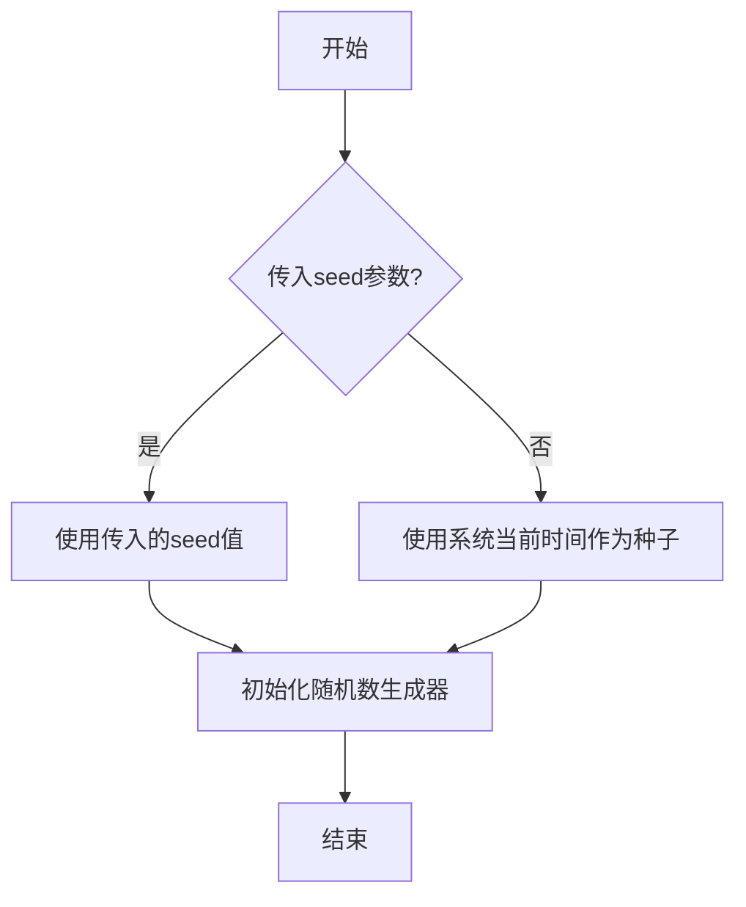

#### 带注释源码

```python
# 在代码中的使用示例：
# Fixing random state for reproducibility
np.random.seed(19680801)

# 解释：
# np.random.seed() 函数用于设置 NumPy 随机数生成器的种子
# 传入的参数 19680801 是一个整数种子值
# 设置种子后，后续使用 np.random 生成的随机数将是可重现的
# 这在需要确保实验结果可重复时非常有用
# 该函数不返回任何值（返回 None）
```


### np.array

numpy库中的数组创建函数，用于将输入数据转换为numpy数组对象。

参数：

- `object`：数组_like，输入的数组_like对象（如列表、元组等）
- `dtype`：data_type，可选，指定数组的数据类型
- `copy`：bool，可选，是否复制数组
- `order`：{'K', 'A', 'C', 'F'}，可选，指定内存布局
- `subok`：bool，可选，是否允许子类
- `ndmin`：int，可选，指定最小维度

返回值：`ndarray`，返回一个新的numpy数组对象

#### 流程图

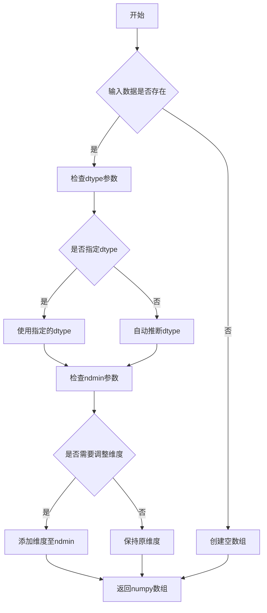

#### 带注释源码

```python
# 在示例代码中的使用方式：

# 创建企鹅物种的性别计数数组
sex_counts = {
    'Male': np.array([73, 34, 61]),    # 创建包含3个元素的整型数组，表示雄性企鹅数量
    'Female': np.array([73, 34, 58]), # 创建包含3个元素的整型数组，表示雌性企鹅数量
}

# 创建底部位置数组，用于堆叠条形图
bottom = np.zeros(3)  # 创建包含3个零的浮点型数组，初始值为0

# 在循环中更新bottom数组
bottom += sex_count  # 将每次迭代的计数加到bottom数组上

# 创建人员位置数组
y_pos = np.arange(len(people))  # 创建从0到len(people)-1的整数序列数组

# 创建性能数据数组
performance = 3 + 10 * np.random.rand(len(people))  # 创建随机浮点数数组

# 创建误差数据数组
error = np.random.rand(len(people))  # 创建随机浮点数数组
```

#### 在本代码中的具体使用

```python
# 示例1：企鹅数据 - 创建性别计数数组
sex_counts = {
    'Male': np.array([73, 34, 61]),    # Adelie, Chinstrap, Gentoo 雄性数量
    'Female': np.array([73, 34, 58]), # Adelie, Chinstrap, Gentoo 雌性数量
}

# 示例2：堆叠条形图的底部起始位置
bottom = np.zeros(3)  # 初始化为3个物种的零值数组

# 示例3：水平条形图的y轴位置
y_pos = np.arange(len(people))  # 创建0, 1, 2, 3, 4的整数数组

# 示例4：随机性能数据
performance = 3 + 10 * np.random.rand(len(people))  # 生成随机浮点数组

# 示例5：随机误差数据
error = np.random.rand(len(people))  # 生成0-1之间的随机浮点数组
```


## 关键组件


### 垂直条形图 (Vertical Bar Chart)

使用 `ax.bar()` 创建垂直条形图，支持设置条形宽度、颜色、标签和堆叠位置（bottom参数）。

### 水平条形图 (Horizontal Bar Chart)

使用 `ax.barh()` 创建水平条形图，配合 `invert_yaxis()` 实现标签从上到下显示，适用于排名类数据可视化。

### 条形标签 (Bar Labels)

使用 `ax.bar_label()` 为条形图添加标签，支持多种格式化方式：中心对齐、边缘对齐、自定义格式字符串、回调函数格式化，以及自定义间距、颜色和字体大小。

### 堆叠条形图 (Stacked Bar Chart)

通过 `bottom` 参数累积前一类别的高度，实现多类别堆叠显示，常用于展示分组数据的组成结构。

### 误差线 (Error Bars)

通过 `xerr` 参数为条形图添加误差线，支持显示数据的统计不确定性，常用于科学实验数据展示。

### 格式化字符串 (Format Strings)

支持 `{:,}` 千位分隔符格式和 `{:.2f}` 小数位数格式，以及lambda回调函数进行自定义计算和格式化。


## 问题及建议


### 已知问题

-   **数据硬编码**：所有数据（species、sex_counts、people、performance、error、fruit_names、fruit_counts、animal_names、mph_speed等）都是直接硬编码在代码中，缺乏灵活性，无法适应数据源变化
-   **全局变量分散**：species、sex_counts、width、y_pos、performance、error等变量以全局形式定义，缺乏封装性，导致命名空间污染和潜在的命名冲突
-   **代码重复**：创建子图、设置轴标签、标题等操作在多个代码块中重复出现，未进行函数封装或抽象
-   **魔法数字**：代码中存在多个魔法数字（如 width=0.6、xlim=15/16、ylim=8000/80等），缺乏有意义的命名，降低了可读性和可维护性
-   **缺乏错误处理**：未对输入数据进行验证（如数组长度匹配检查、类型检查等），可能导致运行时错误
-   **随机状态不一致**：第一个代码块（企鹅数据）未使用随机种子，而后续代码块使用了 np.random.seed(19680801)，导致结果可重现性不一致
-   **注释不完整**：部分注释过于简略（如 "# Horizontal bar chart"），整个脚本缺少模块级文档字符串

### 优化建议

-   **数据外部化**：将数据配置提取到独立的配置文件（如 YAML/JSON）或数据库中，通过参数化方式加载
-   **函数封装**：将重复的图表创建逻辑封装为可重用的函数（如 create_bar_chart、add_labels 等），接受数据作为参数
-   **常量命名**：为所有魔法数字创建有意义的常量命名（如 BAR_WIDTH、DEFAULT_XLIM、MAX_Y_SPEED 等）
-   **类封装**：考虑创建 ChartGenerator 或类似的数据类，将相关数据和行为封装在一起，提高代码组织性
-   **统一随机种子**：在脚本开头统一设置随机种子，确保所有代码块的结果可重现
-   **输入验证**：在函数中添加数据验证逻辑，确保传入的数据满足要求（如数组维度匹配、非空检查等）
-   **完善文档**：为模块添加 docstring，说明脚本用途、依赖和示例用法


## 其它


### 设计目标与约束

本示例代码旨在展示matplotlib库中`bar_label`函数的多种用法，包括垂直条形图、水平条形图、堆叠条形图，以及不同的标签格式化和注解选项。设计约束包括：依赖matplotlib 3.4+版本（bar_label功能引入版本），使用numpy进行数值计算，代码需保持简洁以作为教学示例。

### 错误处理与异常设计

代码主要依赖matplotlib和numpy库的内置错误处理机制。潜在异常包括：数据类型不匹配（传入非数值数组）、空数据导致的警告、图形窗口关闭时的异常等。代码通过try-except块和matplotlib的返回值检查进行处理，例如检查bar_container是否为有效对象。

### 数据流与状态机

代码遵循线性数据流：定义数据（species、sex_counts、fruit_names等）→ 创建图形和坐标轴 → 绑定数据到条形图 → 添加标签 → 显示图形。状态机转换：INIT（初始化数据）→ PLOT_CREATED（创建图表）→ DATA_BOUND（数据绑定）→ LABELED（标签添加）→ RENDERED（渲染完成）。

### 外部依赖与接口契约

核心依赖包括：matplotlib>=3.4.0（提供bar_label方法）、numpy>=1.20.0（提供数组操作）。关键接口契约：`ax.bar()`返回BarContainer对象作为`bar_label()`的输入；`bar_label()`支持fmt参数（格式化字符串或callable）、label_type参数（'edge'、'center'、'edge'）、padding参数、color参数等。

### 性能考虑

代码示例数据量较小（<100个数据点），性能不是主要关注点。在大规模数据场景下，建议使用label_type='center'减少渲染开销，避免在循环中频繁调用bar_label。对于实时数据更新场景，应考虑使用blitting技术优化重绘性能。

### 可测试性

由于代码为示例性质，主要通过视觉验证功能正确性。单元测试应覆盖：不同数据类型的兼容性测试、格式化函数的行为验证、边界条件（空数组、单数据点）的处理。matplotlib提供测试框架pytest-mpl用于图形比对测试。

### 资源管理

图形对象通过plt.subplots()创建，代码执行完毕后由matplotlib自动释放资源。多图形场景下建议显式调用plt.close(fig)释放内存。示例中未涉及文件I/O或网络资源，无额外资源管理需求。

### 配置与可扩展性

代码展示的扩展方向包括：自定义格式化函数（lambda表达式示例）、自定义注解选项（annotate options）、动态数据更新。条形宽度、颜色、字体大小等可通过参数配置，适应不同可视化需求。


    