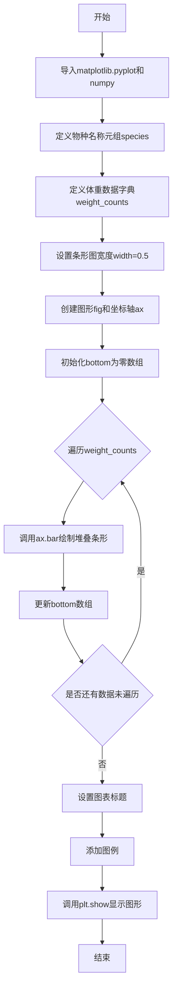
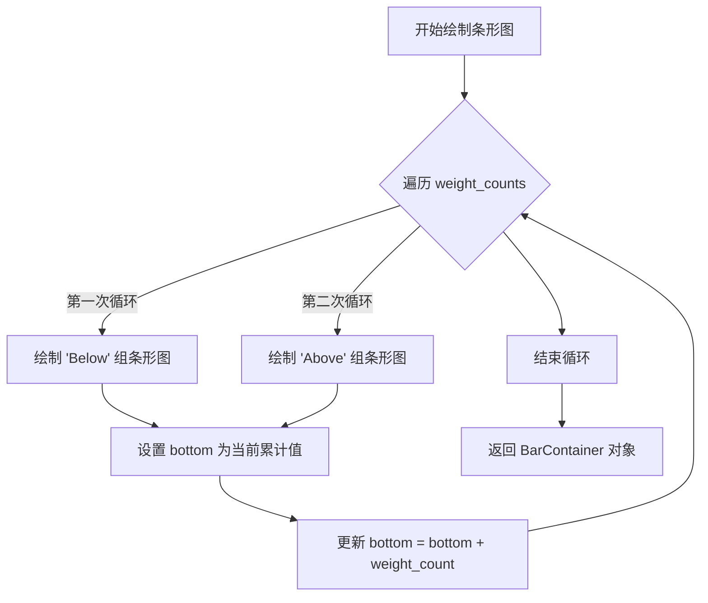
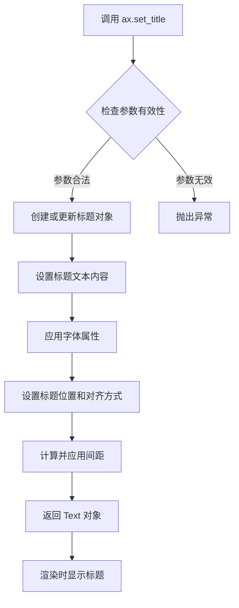
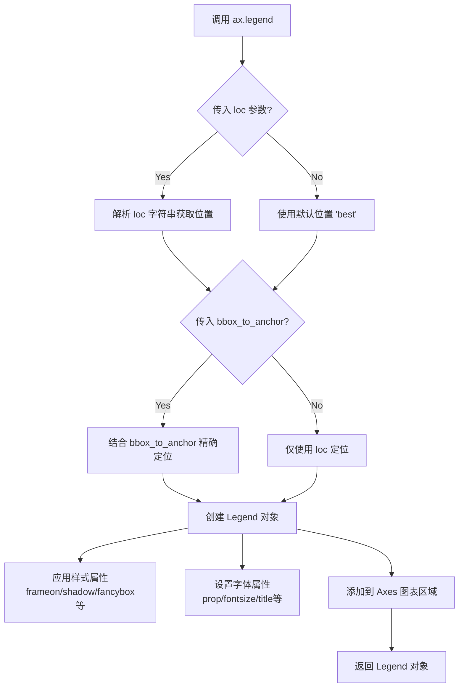
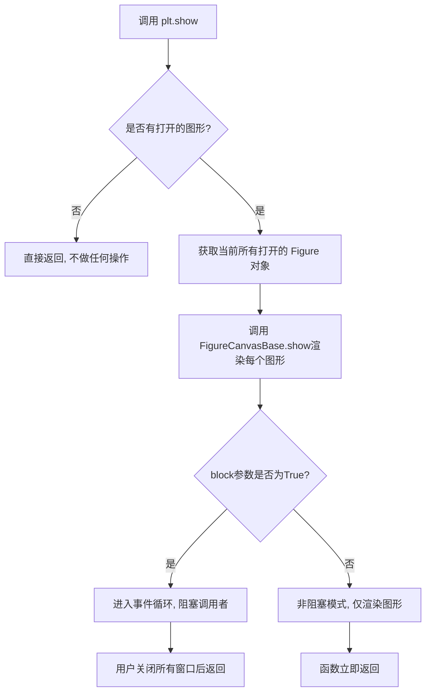

# `matplotlib\galleries\examples\lines_bars_and_markers\bar_stacked.py` 详细设计文档

这是一个使用matplotlib绘制堆叠条形图的示例脚本，通过展示三种企鹅（Adelie、Chinstrap、Gentoo）的体重数据（分为高于和低于平均体重两个类别），可视化地比较不同物种的体重分布情况。

## 整体流程



## 类结构

```
Python脚本 (无类定义)
├── 导入模块
│   ├── matplotlib.pyplot (绑定为plt)
│   └── numpy (绑定为np)
├── 全局数据定义
│   ├── species (物种名称元组)
│   ├── weight_counts (体重数据字典)
│   └── width (条形宽度)
├── 图形创建
│   ├── fig (Figure对象)
│   └── ax (Axes对象)
└── 绘图逻辑
    ├── 堆叠条形图绘制循环
    ├── 标题设置
    └── 图例添加
```

## 全局变量及字段


### `species`
    
包含三种企鹅物种名称和平均体重的元组

类型：`tuple`
    


### `weight_counts`
    
存储低于和高于平均体重的企鹅数量

类型：`dict`
    


### `width`
    
条形图的宽度设置为0.5

类型：`float`
    


### `fig`
    
图形对象

类型：`matplotlib.figure.Figure`
    


### `ax`
    
坐标轴对象

类型：`matplotlib.axes.Axes`
    


### `bottom`
    
堆叠条形图的底部位置数组

类型：`numpy.ndarray`
    


### `p`
    
条形图容器对象

类型：`matplotlib.container.BarContainer`
    


    

## 全局函数及方法


### `plt.subplots()`

创建图形（Figure）和一个或多个坐标轴（Axes）的函数，返回图形对象和坐标轴对象元组，用于构建数据可视化图表。

参数：

- `nrows`：`int`，行数，默认为1，表示子图网格的行数
- `ncols`：`int`，列数，默认为1，表示子图网格的列数
- `sharex`：`bool` 或 `str`，是否共享x轴，可选 'row'、'col'、'all' 或 False
- `sharey`：`bool` 或 `str`，是否共享y轴，可选 'row'、'col'、'all' 或 False
- `squeeze`：`bool`，是否压缩返回的坐标轴数组为标量，默认为True
- `width_ratios`：`array-like`，列宽比例数组
- `height_ratios`：`array-like`，行高比例数组
- `figsize`：`tuple`，图形尺寸，格式为（宽度，高度）英寸
- `dpi`：`int`，图形分辨率，每英寸点数
- `facecolor`：`color`，图形背景颜色
- `edgecolor`：`color`，图形边框颜色
- `frameon`：`bool`，是否显示图形边框
- `subplot_kw`：`dict`，创建子图的关键字参数
- `**fig_kw`：`dict`，传递给 Figure 构造器的额外关键字参数

返回值：`(Figure, Axes or array of Axes)`，返回图形对象和坐标轴对象（或坐标轴对象数组）的元组。在本例中 `fig` 为图形对象，`ax` 为单个坐标轴对象。

#### 流程图

```mermaid
flowchart TD
    A[调用 plt.subplots] --> B{传入参数}
    B -->|nrows=1, ncols=1| C[创建 Figure 对象]
    C --> D[创建 Axes 对象]
    D --> E[返回 (fig, ax) 元组]
    
    B -->|指定 nrows/ncols| F[创建多子图布局]
    F --> G[根据布局创建多个 Axes]
    G --> H{检查 squeeze 参数}
    H -->|squeeze=True| I[单轴返回标量,多轴返回数组]
    H -->|squeeze=False| J[始终返回二维数组]
    I --> K[返回 (fig, ax) 或 (fig, axes) 元组]
    J --> K
    
    K --> L[绑定到变量 fig, ax]
    L --> M[使用 ax 调用 bar 方法创建堆叠条形图]
```

#### 带注释源码

```python
import matplotlib.pyplot as plt
import numpy as np

# 定义企鹅物种标签（包含均值信息）
species = (
    "Adelie\n $\\mu=$3700.66g",
    "Chinstrap\n $\\mu=$3733.09g",
    "Gentoo\n $\\mu=5076.02g$",
)

# 定义堆叠数据：体重低于/高于平均值的企鹅数量
weight_counts = {
    "Below": np.array([70, 31, 58]),
    "Above": np.array([82, 37, 66]),
}
width = 0.5  # 条形宽度

# 调用 plt.subplots() 创建图形和坐标轴
# 等同于: fig = plt.figure(); ax = fig.add_subplot(111)
# 参数全部使用默认值：nrows=1, ncols=1, figsize=None 等
# 返回: fig - Figure 对象（画布）; ax - Axes 对象（坐标轴/绘图区）
fig, ax = plt.subplots()

# 初始化底部堆叠起始点为零向量
bottom = np.zeros(3)

# 遍历每个体重类别，创建堆叠条形图
for boolean, weight_count in weight_counts.items():
    # ax.bar() 在坐标轴上绘制条形图
    # 参数: x位置, 高度, 宽度, 标签, 底部堆叠起始点
    p = ax.bar(species, weight_count, width, label=boolean, bottom=bottom)
    # 更新底部堆叠位置，为下一个类别做准备
    bottom += weight_count

# 设置图表标题
ax.set_title("Number of penguins with above average body mass")
# 在右上角显示图例
ax.legend(loc="upper right")

# 显示图形
plt.show()
```


### `ax.bar()`

绘制堆叠条形图的核心方法，用于在指定位置绘制高度可变的矩形条形图，并支持底部堆叠功能。

参数：

- `x`：`str array`，条形图的 x 轴位置，对应物种名称数组
- `height`：`np.ndarray`，条形图的高度，对应每种企鹅的数量
- `width`：`float`，条形图的宽度，默认值为 0.5
- `label`：`str`，图例标签，用于区分 "Above" 和 "Below" 两组数据
- `bottom`：`np.ndarray`，堆叠条的底部起始位置，用于实现堆叠效果

返回值：`matplotlib.container.BarContainer`，包含所有条形图对象的容器，可用于设置条形图属性

#### 流程图



#### 带注释源码

```python
# 初始化底部位置为零向量，用于堆叠
bottom = np.zeros(3)

# 遍历每个体重分类（Below/Above）
for boolean, weight_count in weight_counts.items():
    # 调用 ax.bar() 绘制条形图
    p = ax.bar(
        species,           # x: x轴位置（物种名称）
        weight_count,      # height: 条形高度（企鹅数量）
        width,             # width: 条形宽度
        label=boolean,     # label: 图例标签
        bottom=bottom      # bottom: 堆叠起始位置
    )
    # 更新底部位置，实现堆叠效果
    # 每次将当前类别的数量加到累积的底部位置上
    bottom += weight_count
```


### `ax.set_title`

设置图表的标题，用于为可视化图形添加标题文本，以描述图表的主题或内容。

参数：

- `label`：`str`，要设置的标题文本内容
- `fontdict`：`dict`，可选，字体属性字典，用于控制标题的字体样式、大小、颜色等
- `loc`：`str`，可选，标题对齐方式，可选值为 'center'、'left'、'right'，默认为 'center'
- `pad`：`float`，可选，标题与图表顶部的间距（以点为单位）
- `fontsize`：`int` 或 `str`，可选，标题字体大小
- `fontweight`：`str` 或 `int`，可选，标题字体粗细
- `color`：`str`，可选，标题文字颜色
- `verticalalignment` 或 `va`：`str`，可选，标题垂直对齐方式
- `horizontalalignment` 或 `ha`：`str`，可选，标题水平对齐方式

返回值：`matplotlib.text.Text`，返回创建的标题文本对象，可用于后续对标题样式的进一步操作

#### 流程图



#### 带注释源码

```python
# 示例代码来自提供的 matplotlib 图表
import matplotlib.pyplot as plt
import numpy as np

# 创建图表和坐标轴对象
fig, ax = plt.subplots()

# ... (创建堆叠条形图的代码) ...

# 设置图表标题
# 参数：label - 标题文本内容
# 返回值：Text 对象，可用于后续样式调整
ax.set_title("Number of penguins with above average body mass")

# 常见用法示例：
# 1. 设置标题并指定位置
ax.set_title("Chart Title", loc="left")  # 左侧对齐

# 2. 设置标题并指定字体属性
ax.set_title("Chart Title", fontsize=16, fontweight="bold", color="darkblue")

# 3. 设置标题并添加间距
ax.set_title("Chart Title", pad=20)  # 标题与图表顶部保持20点间距

# 4. 获取返回值进行进一步操作
title_obj = ax.set_title("Custom Title")
title_obj.set_rotation(0)  # 旋转标题文本

plt.show()
```

---

### 附加信息

#### 设计目标与约束

- `ax.set_title()` 方法的设计目标是提供一种简单直观的方式来为图表添加标题
- 约束：该方法只能应用于 Axes 对象，且标题文本应为字符串类型

#### 错误处理与异常设计

- 如果传入的 `label` 参数不是字符串类型，可能会引发 TypeError
- 如果传入无效的 `loc` 参数（如非 'center'、'left'、'right' 的值），会抛出 ValueError 异常

#### 外部依赖与接口契约

- 依赖 matplotlib 库的核心组件
- 返回的 Text 对象继承自 matplotlib.text.Text 类，具有丰富的文本样式属性和方法


### `matplotlib.axes.Axes.legend`

`ax.legend()` 是 matplotlib 中 Axes 类的成员方法，用于向图表添加图例（Legend），以标识图中不同数据系列的名称和对应的视觉元素。该方法支持多种参数自定义图例的位置、样式、字体、边框、阴影等属性，并返回 `matplotlib.legend.Legend` 对象供进一步操作。

参数：

- `loc`：`str` 或 `int`，图例在图表中的位置，可选值包括 `"best"`, `"upper right"`, `"upper left"`, `"lower left"`, `"lower right"`, `"right"`, `"center left"`, `"center right"`, `"lower center"`, `"upper center"`, `"center"`（对应整数 0-10）
- `bbox_to_anchor`：`tuple` 或 `Bbox`，可选，用于更精细地定位图例的坐标（例如 `(0.5, 0.5)` 表示图表中心）
- `ncol`：`int`，图例的列数，默认为 1
- `prop`：`dict`，字体属性字典，可通过 `{"size": 12, "family": "serif"}` 等形式设置
- `fontsize`：`int` 或 `str`，图例项的字体大小
- `title`：`str`，图例的标题文字
- `title_fontsize`：`int` 或 `str`，图例标题的字体大小
- `edgecolor`：`str`，图例边框颜色
- `facecolor`：`str`，图例背景颜色
- `frameon`：`bool`，是否绘制图例边框框架
- `framealpha`：`float`，框架透明度（0-1 之间）
- `shadow`：`bool`，是否在图例后显示阴影
- `fancybox`：`bool`，是否使用圆角边框
- `alignment`：`str`，图例内容的对齐方式，可选 `"center"` 或 `"left"` / `"right"`
- `labelspacing`：`float`，图例条目之间的垂直间距
- `handlelength`：`float`，图例句柄（线段/标记）的长度
- `handletextpad`：`float`，图例句柄与文本之间的间距
- `borderaxespad`：`float`，轴与图例边框之间的间距
- `borderpad`：`float`，图例边框内部的填充间距
- `draggable`：`bool`，是否允许通过鼠标拖动图例

返回值：`matplotlib.legend.Legend`，返回创建的 Legend 对象，可用于后续对图例的进一步操作或修改。

#### 流程图



#### 带注释源码

```python
# 调用示例（来自提供的代码）
ax.legend(loc="upper right")

# 详细参数调用示例（完整签名）
legend = ax.legend(
    loc='upper right',          # 位置：右上角
    bbox_to_anchor=(1.0, 1.0),  # 可选：使用 bbox 精细定位
    ncol=1,                     # 列数：1列
    prop=None,                  # 字体属性：默认使用 rcParams
    fontsize=None,              # 字体大小：默认
    title='Legend Title',       # 图例标题：无
    title_fontsize=None,        # 标题字体大小：默认
    edgecolor='0.8',            # 边框颜色：灰色
    facecolor='white',          # 背景颜色：白色
    frameon=True,               # 显示框架：默认开启
    framealpha=0.8,            # 框架透明度：0.8
    shadow=False,               # 阴影：默认关闭
    fancybox=False,             # 圆角：默认方角
    alignment='center',         # 对齐：居中
    labelspacing=0.5,           # 标签间距：0.5
    handlelength=2.0,           # 句柄长度：2.0
    handletextpad=0.8,          # 句柄与文本间距：0.8
    borderaxespad=0.5,          # 轴边框间距：0.5
    borderpad=0.5,              # 边框内边距：0.5
    draggable=False             # 可拖动：默认关闭
)

# 源码逻辑简化表示
def legend(self, *args, **kwargs):
    """
    将图例添加到轴上。
    
    参数可以是：
    1. 无参数：自动检测 Artists 的标签
    2. (handles, labels) 元组：手动指定句柄和标签
    3. 单一 Artist 列表：使用其标签
    """
    # 1. 解析位置参数 loc
    loc = kwargs.get('loc', 'best')
    
    # 2. 解析 bbox_to_anchor 定位参数
    bbox_to_anchor = kwargs.get('bbox_to_anchor', None)
    
    # 3. 解析样式参数
    frameon = kwargs.get('frameon', True)
    shadow = kwargs.get('shadow', False)
    fancybox = kwargs.get('fancybox', False)
    # ... 其他样式参数
    
    # 4. 解析字体参数
    fontsize = kwargs.get('fontsize', None)
    prop = kwargs.get('prop', None)
    # ... 其他字体参数
    
    # 5. 创建 Legend 对象
    legend = Legend(self, handles, labels, loc, 
                    bbox_to_anchor, **kwargs)
    
    # 6. 添加到 Axes
    self._add_text(legend)
    self.stale_callback.add(legend._legend_stale)
    
    # 7. 返回 Legend 对象
    return legend
```


### `plt.show()`

显示所有打开的图形窗口。该函数是 matplotlib.pyplot 模块的核心函数之一，用于将所有待显示的图形渲染到屏幕并进入交互式显示模式。

参数：

- `*args`：可变位置参数，传递给底层的 `show()` 实现（通常不使用）
- `**kwargs`：可变关键字参数，用于传递额外的显示选项（如 `block` 参数控制是否阻塞主线程）

返回值：`None`，无返回值

#### 流程图



#### 带注释源码

```python
def show(*, block=None):
    """
    显示所有打开的图形窗口。
    
    参数:
        block: bool, optional
            控制是否阻塞主线程以等待用户交互。
            如果为 True（默认在某些后端），则阻塞直到所有窗口关闭。
            如果为 False，则立即返回（非阻塞模式）。
            默认为 None，后端自行决定行为。
    
    返回值:
        None
    
    示例:
        >>> import matplotlib.pyplot as plt
        >>> plt.plot([1, 2, 3], [4, 5, 6])
        >>> plt.show()  # 显示图形并进入交互模式
    """
    # 获取全局的 matplotlib 后端
   _backend_mod = sys.modules.get('matplotlib.backends')
    
    # 遍历所有已创建的 Figure 对象
    for manager in Gcf.get_all_fig_managers():
        # 检查是否需要阻塞
        if block is None:
            # 默认行为：大多数交互式后端会阻塞
            block = _get_blocking_behavior(manager)
        
        # 调用后端的 show 方法渲染图形
        manager.show()
        
        # 如果 block 为 True，进入事件循环
        if block:
            # 启动 GUI 事件循环，等待用户交互
            manager.start_event_loop()
    
    # 刷新所有挂起的绘图操作
    _draw_all_if_interactive()
```

> **注**：上述源码为简化版注释说明，实际 `plt.show()` 的实现会根据不同后端（如 Qt、Tkinter、MacOSX 等）有不同的具体实现细节。核心逻辑是调用各后端的 `Canvas.show()` 方法将图形渲染到屏幕，并根据 `block` 参数决定是否进入阻塞模式以响应用户交互。

## 关键组件


### 核心功能概述

该代码是一个matplotlib堆叠条形图（Stacked Bar Chart）的示例程序，展示了三种企鹅物种（Adelie、Chinstrap、Gentoo）的体重分布情况，将体重数据分为"Below"和"Above"两个类别进行堆叠可视化展示。

### 文件整体运行流程

1. **数据定义阶段**：定义物种名称列表和体重统计数据字典
2. **图表初始化阶段**：创建图形画布和坐标轴对象
3. **堆叠绘制阶段**：遍历体重类别数据，使用循环累加bottom坐标实现堆叠效果
4. **图表装饰阶段**：设置图表标题和图例
5. **渲染显示阶段**：调用plt.show()显示最终图表

### 全局变量详情

#### species
- **类型**: tuple
- **描述**: 包含三个企鹅物种名称及平均体重的元组，用于x轴标签显示

#### weight_counts
- **类型**: dict
- **描述**: 字典，键为体重类别字符串("Below"/"Above")，值为对应的企鹅数量numpy数组

#### width
- **类型**: float
- **描述**: 条形图的宽度参数，设置为0.5

#### bottom
- **类型**: numpy.ndarray
- **描述**: 用于跟踪堆叠条形图累积高度的数组，初始值为全零

### 函数详情

#### plt.subplots()
- **参数**: 无
- **返回值**: (fig, ax) 元组
- **描述**: 创建图形画布和坐标轴对象

#### ax.bar()
- **参数**: 
  - x: species (物种名称)
  - height: weight_count (体重数量)
  - width: width (条形宽度)
  - label: boolean (类别标签)
  - bottom: bottom (堆叠底部位置)
- **返回值**: BarContainer对象
- **描述**: 绘制单个堆叠条形，返回的容器对象用于后续访问

#### ax.set_title()
- **参数**: "Number of penguins with above average body mass"
- **返回值**: Text
- **描述**: 设置图表标题

#### ax.legend()
- **参数**: loc="upper right"
- **返回值**: Legend
- **描述**: 在右上角显示图例

#### plt.show()
- **参数**: 无
- **返回值**: None
- **描述**: 渲染并显示图表

### 关键组件信息

#### 数据准备组件
负责定义可视化所需的原始数据，包括物种名称元组和体重分类统计数据字典。

#### 堆叠逻辑组件
通过维护bottom数组并在其中累加每个类别的权重，实现堆叠条形图的层层叠加效果。

#### 图表渲染组件
封装了条形图绘制、坐标轴设置、标题和图例添加等可视化元素。

### 潜在技术债务与优化空间

1. **硬编码数据问题**：数据直接写入代码中，缺乏从外部文件或API加载的灵活性
2. **魔法数字**：width=0.5和bottom=np.zeros(3)中的数值应提取为常量配置
3. **重复计算**：每次循环都执行bottom += weight_count，可考虑向量化操作
4. **错误处理缺失**：没有对输入数据维度一致性的验证
5. **国际化支持**：图表文本硬编码为英文，缺乏多语言支持

### 其它项目

#### 设计目标与约束
- 目标：创建清晰的堆叠条形图展示分类数据
- 约束：使用matplotlib原生API，保持代码简洁易懂

#### 错误处理与异常设计
- 缺乏对weight_counts数据结构和维度有效性的检查
- 没有处理空数据或异常值的逻辑

#### 数据流与状态机
- 数据流：静态定义 → 数据结构转换 → 可视化渲染
- 状态：初始化 → 数据加载 → 绘制 → 显示

#### 外部依赖与接口契约
- 依赖库：matplotlib、numpy
- 接口：标准matplotlib面向对象API


## 问题及建议


### 已知问题

- **硬编码数据**：数据直接写在代码中，缺乏从外部配置或文件读取的灵活性，不利于维护和复用
- **魔法命令依赖**：使用了 `# %%` Jupyter 魔法命令，限制了代码仅能在 Jupyter 环境中运行，降低了可移植性
- **缺少类型注解**：所有变量和函数均无类型注解，降低了代码的可读性和静态分析能力
- **图形尺寸未设置**：未指定 `figsize` 参数，可能导致图形在不同环境下显示比例不佳
- **plt.show() 阻塞**：使用 `plt.show()` 会阻塞程序，且没有异常处理机制
- **中文字体风险**：代码中虽未使用中文，但注释包含英文字符，若后续添加中文可能出现字体渲染问题
- **资源未显式释放**：未使用 Context Manager (`with` 语句) 管理 `fig` 对象，可能导致资源泄漏

### 优化建议

- 将数据提取为配置文件或函数参数，提高代码复用性
- 移除 `# %%` 魔法命令，或添加环境检测逻辑
- 为关键变量添加类型注解（如 `species: tuple[str, ...]`, `weight_counts: dict[str, np.ndarray]`, `width: float`）
- 设置 `fig, ax = plt.subplots(figsize=(10, 6))` 明确图形尺寸
- 考虑使用 `fig.canvas.draw()` 替代 `plt.show()` 或添加超时控制
- 预先设置中文字体：`plt.rcParams['font.sans-serif'] = ['SimHei']`
- 使用 `with plt.style.context('seaborn-v0_8-whitegrid'):` 或类似方式封装绘图逻辑
- 添加数据验证逻辑，检查 `weight_counts` 各数组长度是否与 `species` 一致
- 将循环逻辑封装为函数，添加文档字符串说明参数和返回值
</think>

## 其它


### 设计目标与约束

本代码旨在演示如何使用matplotlib创建堆叠柱状图，展示企鹅物种（Adelie、Chinstrap、Gentoo）的体重分布情况（高于和低于平均体重的数量）。约束条件包括：需要matplotlib和numpy依赖库支持，数据格式为字典包含numpy数组，图表为静态可视化展示。

### 错误处理与异常设计

代码未实现显式的错误处理机制。潜在异常包括：1) weight_counts字典中各数组长度不匹配导致bottom累加错误；2) species元组与weight_counts数组维度不一致；3) matplotlib后端未正确配置导致plt.show()失败；4) 中文字体或特殊字符渲染问题。建议添加数据验证逻辑，确保数组维度一致，并捕获可能的matplotlib显示异常。

### 数据流与状态机

数据流：species元组（字符串）→ weight_counts字典（numpy数组）→ bottom数组（累加计算）→ ax.bar()调用（渲染）→ 图例和标题设置 → plt.show()展示。无复杂状态机，为线性执行流程：初始化数据→创建画布→循环绘制堆叠条形→设置图表元数据→显示图表。

### 外部依赖与接口契约

外部依赖：1) matplotlib.pyplot模块，提供fig, ax对象创建及bar(), set_title(), legend()等绘图接口；2) numpy库，提供array数组创建和数组运算。接口契约：bar()方法接受species（类别标签）、weight_count（数值数组）、width（条形宽度）、label（图例标签）、bottom（底部偏移数组）参数，返回BarContainer对象。

### 性能考虑

代码为简单示例，无性能瓶颈。数组操作（bottom累加）时间复杂度O(n)，n为类别数量（3个），可忽略不计。大量数据场景下建议预先分配bottom数组并使用向量化操作替代显式循环。

### 安全考虑

代码为本地可视化脚本，无用户输入处理，无安全风险。不涉及网络请求、文件操作或敏感数据处理。

### 可测试性

测试点包括：1) 验证weight_counts数组维度与species一致；2) 验证bottom累加结果正确性；3) 验证ax.bar()调用次数与weight_counts键数量匹配；4) 验证图例和标题设置正确。可通过单元测试模拟fig, ax对象进行断言验证。

    