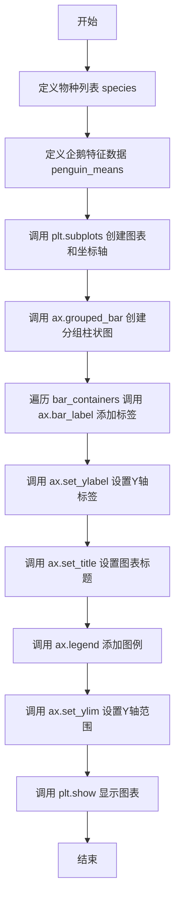
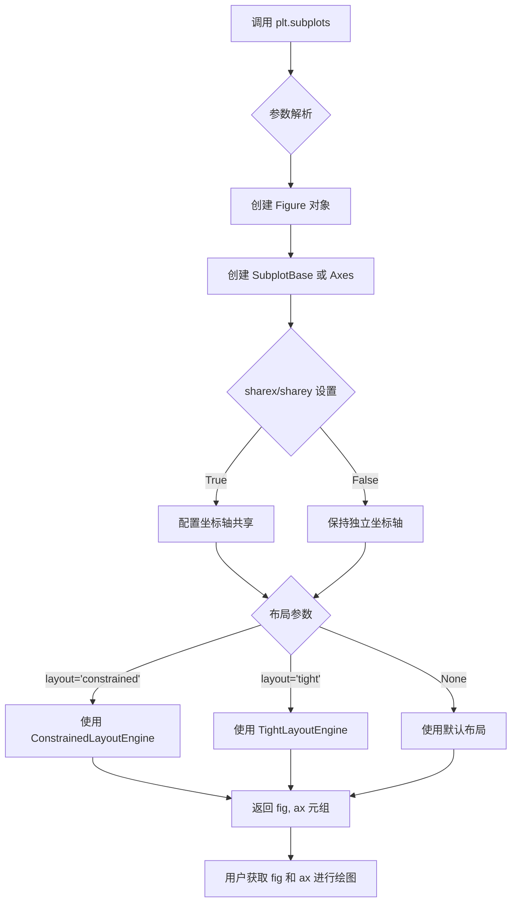
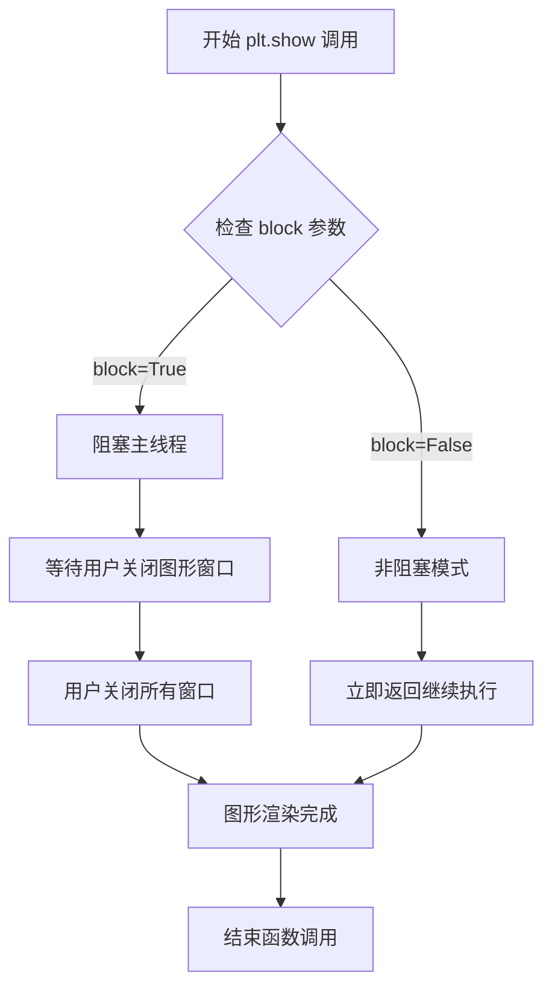
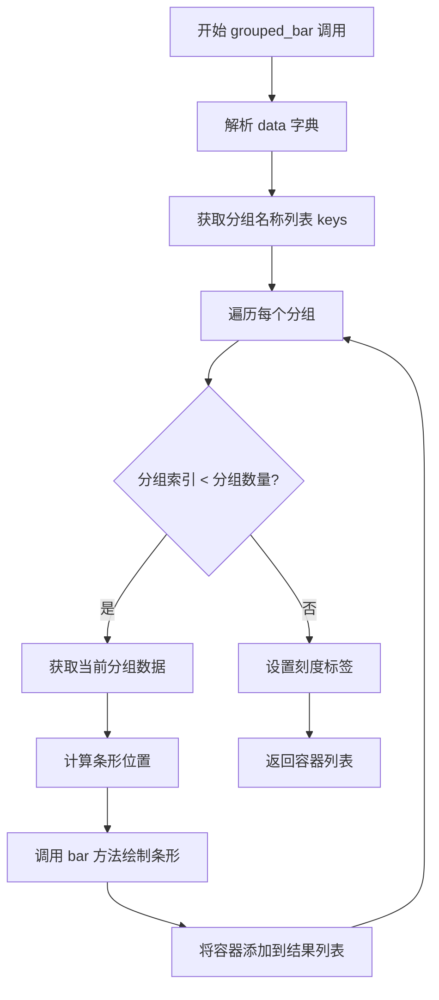
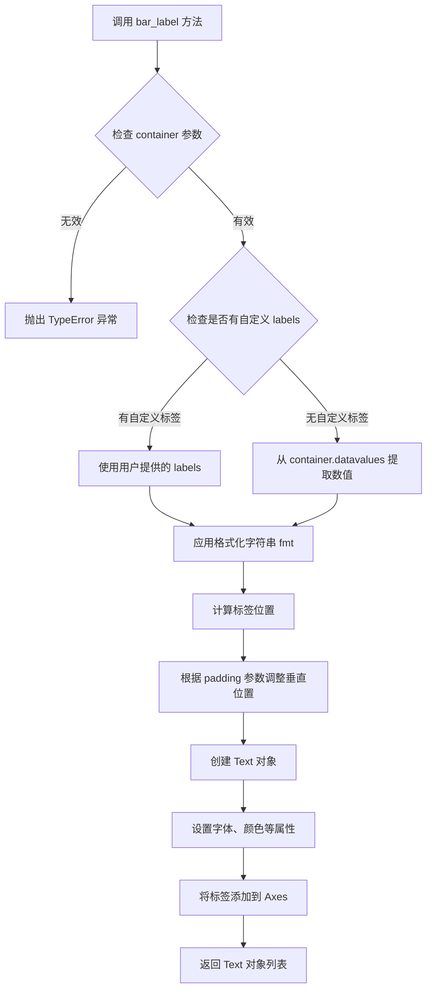
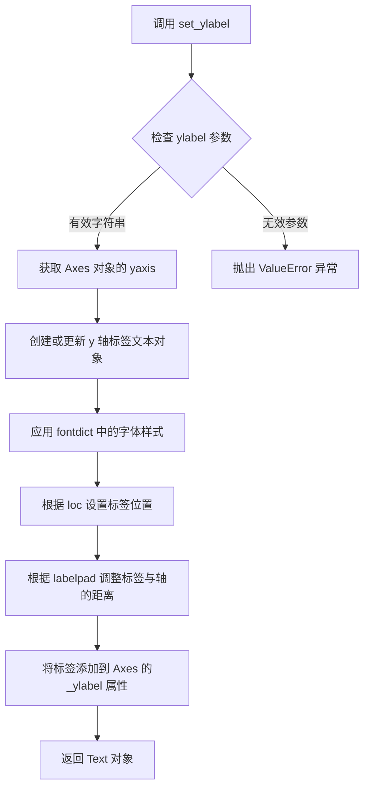
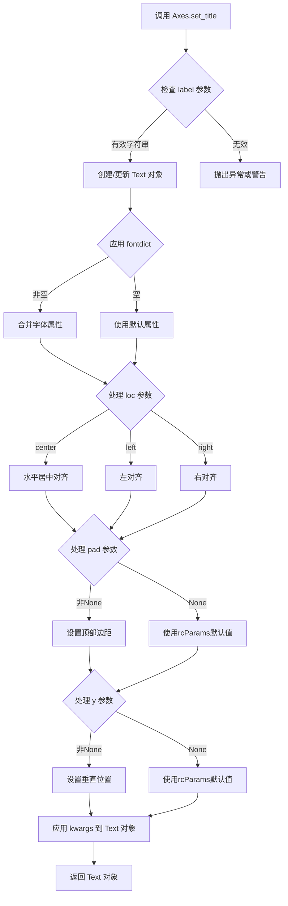
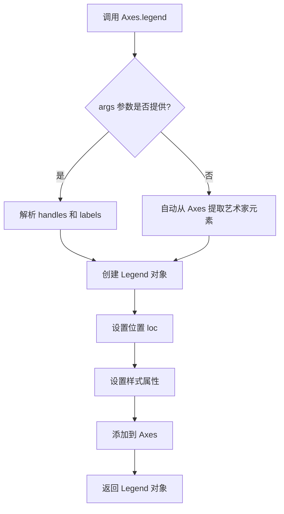
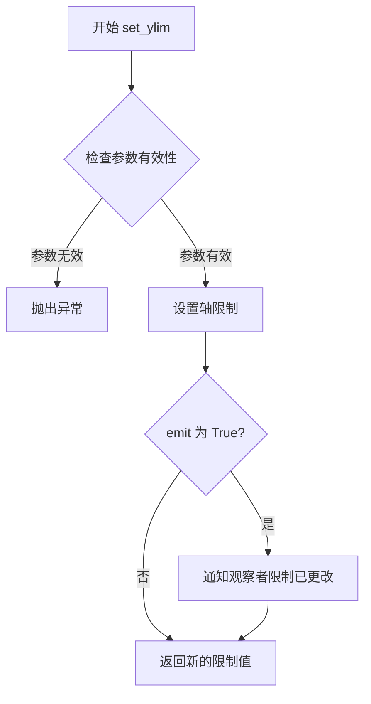

# `matplotlib\galleries\examples\lines_bars_and_markers\barchart.py` 详细设计文档

这是一个matplotlib分组柱状图示例，展示了如何基于palmerpenguins数据集创建带有标签的分组柱状图，用于可视化三种企鹅（Adelie、Chinstrap、Gentoo）的三个特征属性（喙深度、喙长度、翅膀长度）的平均值对比。

## 整体流程



## 类结构

```
Python脚本（面向过程结构）
└── 主要依赖: matplotlib.pyplot
    ├── Figure 对象 (fig)
    │   └── 管理整个图形
    └── Axes 对象 (ax)
        ├── grouped_bar() - 创建分组柱状图
        ├── bar_label() - 添加数据标签
        ├── set_ylabel() - 设置Y轴标签
        ├── set_title() - 设置标题
        ├── legend() - 添加图例
        └── set_ylim() - 设置Y轴范围
```

## 全局变量及字段


### `species`
    
三种企鹅物种名称列表 (Adelie, Chinstrap, Gentoo)

类型：`tuple`
    


### `penguin_means`
    
包含三种企鹅三个特征平均值的嵌套字典结构

类型：`dict`
    


### `fig`
    
matplotlib图形对象

类型：`Figure`
    


### `ax`
    
坐标轴对象，用于绑制图表

类型：`Axes`
    


### `res`
    
grouped_bar返回的结果容器，包含bar_containers

类型：`dict`
    


    

## 全局函数及方法


### `plt.subplots`

`plt.subplots` 是 Matplotlib 库中的一个工厂函数，用于创建一个新的图形（Figure）以及一个或多个坐标轴（Axes）对象。它是 `figure()` 和 `add_subplot()` 或 `add_axes()` 的便捷组合，返回一个元组 `(fig, ax)`，其中 `fig` 是图形对象，`ax` 是坐标轴对象（或坐标轴数组）。

参数：

-  `nrows`：`int`，默认值 1，表示子图的行数
-  `ncols`：`int`，默认值 1，表示子图的列数
-  `sharex`：`bool` 或 `str`，默认值 False，如果为 True，则所有子图共享 x 轴；如果为 'col'，则每列共享 x 轴
-  `sharey`：`bool` 或 `str`，默认值 False，如果为 True，则所有子图共享 y 轴；如果为 'row'，则每行共享 y 轴
-  `squeeze`：`bool`，默认值 True，如果为 True，则返回的 ax 数组维度会被压缩
-  `width_ratios`：`array-like`，可选，表示列的宽度比例
-  `height_ratios`：`array-like`，可选，表示行的高度比例
-  `hspace`：`float`，可选，子图之间的垂直间距
-  `wspace`：`float`，可选，子图之间的水平间距
-  `left`、`right`、`top`、`bottom`：`float`，可选，子图区域在图形中的位置
-  `figsize`：`tuple`，可选，图形的大小，格式为 (宽度, 高度)
-  `layout`：`str`，可选，布局管理器，如 'constrained'、'tight'、'compressed' 等
-  `**kwargs`：其他关键字参数，将传递给 `Figure.add_subplot`

返回值：`tuple(Figure, Axes or array of Axes)`，返回创建的图形对象和坐标轴对象（或坐标轴数组）

#### 流程图



#### 带注释源码

```python
# 导入 matplotlib.pyplot 模块
import matplotlib.pyplot as plt

# 调用 subplots 函数创建图形和坐标轴
# layout='constrained' 参数启用约束布局管理器，自动调整子图间距
fig, ax = plt.subplots(layout='constrained')

# fig: Figure 对象，表示整个图形窗口
# ax: Axes 对象，表示图形中的坐标轴（此处为单一坐标轴）

# 使用 Axes 对象的 grouped_bar 方法绘制分组柱状图
res = ax.grouped_bar(penguin_means, tick_labels=species, group_spacing=1)

# 为每个柱状图容器添加标签
for container in res.bar_containers:
    ax.bar_label(container, padding=3)

# 设置 y 轴标签
ax.set_ylabel('Length (mm)')

# 设置图形标题
ax.set_title('Penguin attributes by species')

# 添加图例，loc='upper left' 指定位置，ncols=3 指定列数
ax.legend(loc='upper left', ncols=3)

# 设置 y 轴范围
ax.set_ylim(0, 250)

# 显示图形
plt.show()

# 完整的 plt.subplots 调用内部大致相当于:
# fig = plt.figure(figsize=..., layout=...)
# ax = fig.add_subplot(1, 1, 1)
# 但提供了更便捷的接口和更好的布局支持
```


### plt.show

`plt.show` 是 matplotlib.pyplot 模块中的显示函数，负责渲染并显示所有当前打开的图形窗口。该函数会阻塞程序执行直到用户关闭图形窗口（在默认 block=True 模式下），或者立即返回并保持窗口显示（在 block=False 模式下）。

参数：

- `block`：可选的布尔值参数，默认为 `True`。当设置为 `True` 时，函数会阻塞程序执行直到用户关闭所有图形窗口；当设置为 `False` 时，函数会立即返回，图形窗口保持显示但不阻塞主线程。

返回值：`None`，该函数不返回任何值，仅执行图形渲染和显示的副作用。

#### 流程图



#### 带注释源码

```python
def show(*, block=None):
    """
    显示所有打开的图形窗口。
    
    参数:
        block (bool, optional): 
            控制是否阻塞程序执行。
            - True (默认): 阻塞并显示窗口，等待用户交互
            - False: 显示窗口但立即返回，不阻塞主线程
    
    返回值:
        None: 此函数不返回任何值，仅产生显示图形的副作用
    """
    
    # 获取全局图形管理器
    global _pylab_helpers
    import matplotlib._pylab_helpers as _pylab_helpers
    
    # 获取所有打开的图形对象（FigureCanvasBase 实例）
    # Gcf 是图形管理器的集合类
    figs = Gcf.get_all_fig_managers()
    
    if not figs:
        # 如果没有打开的图形，直接返回
        return
    
    # 根据 block 参数决定显示行为
    if block:
        # 阻塞模式：显示窗口并进入事件循环
        # 通常用于交互式环境如 Python 脚本
        for manager in figs:
            # 调用底层 GUI 框架的显示方法
            manager.show()
            # 进入主循环，等待用户交互
            # 通常调用 tkinter/Qt 的事件循环
            manager._figcanvas.draw_idle()
    else:
        # 非阻塞模式：立即返回，图形窗口保持显示
        # 通常用于 GUI 应用或需要继续执行其他代码的场景
        for manager in figs:
            manager.show()
    
    # 触发图形更新（可选，取决于后端）
    # 对于某些后端如 inline（ Jupyter），可能需要刷新输出
    # 但在标准桌面后端中通常由 GUI 框架处理
```

**代码上下文说明：**

```python
# 代码中 plt.show() 的实际使用场景
fig, ax = plt.subplots(layout='constrained')

# 创建分组条形图
res = ax.grouped_bar(penguin_means, tick_labels=species, group_spacing=1)

# 为条形图添加数据标签
for container in res.bar_containers:
    ax.bar_label(container, padding=3)

# 设置坐标轴标签和标题
ax.set_ylabel('Length (mm)')
ax.set_title('Penguin attributes by species')
ax.legend(loc='upper left', ncols=3)
ax.set_ylim(0, 250)

# 调用 plt.show() 渲染并显示最终图形
# 此时图形从内存中的 Figure 对象渲染到屏幕上的窗口
plt.show()  # <--- 目标函数调用位置
```


### `Axes.grouped_bar`

绘制分组柱状图的方法，接受数据字典、刻度标签和分组间距参数，返回包含条形容器的列表用于添加标签。

参数：

- `data`：`dict`，字典类型，键为分组名称（如 'Bill Depth'、'Bill Length' 等），值为元组或序列，表示每个分类的数值
- `tick_labels`：`sequence`，序列类型，用于 X 轴的刻度标签（如企鹅种类名称）
- `group_spacing`：`float`，可选参数，默认值为 1.0，表示分组之间的间距
- `xlabel`：`str`，可选参数，X 轴标签
- `ylabel`：`str`，可选参数，Y 轴标签
- `numsticks`：`int`，可选参数，每个分组的刻度数量
- `zorder`：`float`，可选参数，渲染顺序

返回值：`list[BarContainer]`，返回条形容器列表，每个容器包含一个分组的条形对象，可用于 `bar_label` 方法添加数据标签

#### 流程图



#### 带注释源码

```python
# 示例代码展示了 grouped_bar 方法的调用方式
# 实际方法实现位于 matplotlib 库中

# 1. 定义分组数据（企鹅身体测量数据）
species = ("Adelie", "Chinstrap", "Gentoo")  # 企鹅种类作为刻度标签
penguin_means = {
    'Bill Depth': (18.35, 18.43, 14.98),      # 喙深度数据
    'Bill Length': (38.79, 48.83, 47.50),    # 喙长度数据
    'Flipper Length': (189.95, 195.82, 217.19),  # 翅膀长度数据
}

# 2. 创建图表和坐标轴
fig, ax = plt.subplots(layout='constrained')

# 3. 调用 grouped_bar 方法绘制分组柱状图
# 参数1: penguin_means - 数据字典，每个键对应一个分组
# 参数2: tick_labels - X轴刻度标签
# 参数3: group_spacing=1 - 分组间距
res = ax.grouped_bar(penguin_means, tick_labels=species, group_spacing=1)

# 4. 遍历返回的条形容器，为每个分组添加数据标签
# bar_label 方法在条形顶部添加数值标签
# padding=3 表示标签与条形顶部的间距
for container in res.bar_containers:
    ax.bar_label(container, padding=3)

# 5. 设置图表标签和标题
ax.set_ylabel('Length (mm)')
ax.set_title('Penguin attributes by species')
ax.legend(loc='upper left', ncols=3)
ax.set_ylim(0, 250)

plt.show()
```


### `matplotlib.axes.Axes.bar_label`

在Matplotlib中，`Axes.bar_label`是Axes类的一个方法，用于在条形图（bar chart）上添加数据标签。该方法通过接收一个条形容器（BarContainer），自动计算标签位置，并在每个条形上方标注相应的数值或自定义文本。

参数：

- `self`：`Axes`，隐含的调用者，表示当前的坐标轴对象
- `container`：`BarContainer`，由`bar()`方法返回的条形容器对象，包含需要标注的条形
- `labels`：`array-like`，可选参数，用于指定每个条形的标签文本，默认值为`None`，将自动使用条形的数值作为标签
- `fmt`：`str`，可选参数，格式化字符串，默认为`'%g'`，用于格式化标签数值（如`'%.2f'`显示两位小数）
- `padding`：`float`，可选参数，标签与条形顶部的间距，默认为`0`，单位为点（points）
- `spacing`：`float`，可选参数，组内条形之间的间距，默认为`0.5`，仅在分组条形图（grouped bar）中使用
- `color`：`str`或`array-like`，可选参数，标签文本的颜色
- `fontsize`：`int`或`float`，可选参数，标签文本的字体大小
- `annotation_clip`：`bool`，可选参数，是否裁剪超出坐标轴范围的注释

返回值：`list[matplotlib.text.Text]`，返回一个Text对象列表，每个对象对应一个条形标签

#### 流程图



#### 带注释源码

```python
# bar_label 方法的典型调用方式（基于 matplotlib 源码逻辑）
def bar_label(self, container, labels=None, fmt='%g', padding=0,
              spacing=0.5, color=None, fontsize=None, annotation_clip=None):
    """
    在条形图上添加标签
    
    参数:
        container: BarContainer - 由 ax.bar() 返回的条形容器
        labels: array-like - 自定义标签文本，默认为 None（自动使用数值）
        fmt: str - 数值格式化字符串，如 '%.2f'
        padding: float - 标签与条形顶部的间距（点）
        spacing: float - 分组条形图中组内条形的间距
        color: str - 标签颜色
        fontsize: float - 标签字体大小
        annotation_clip: bool - 是否裁剪超出范围的注释
    
    返回:
        list of Text - 标签文本对象列表
    """
    
    # 1. 获取容器中的所有条形（patches）
    #    container 通常是 BarContainer 对象，包含 _children 属性
    datavalues = container.datavalues  # 条形的数值
    patches = container.patches        # 条形矩形对象
    
    # 2. 处理标签
    if labels is None:
        # 如果没有提供标签，使用数值作为标签，并应用格式化
        labels = [fmt % val for val in datavalues]
    
    # 3. 计算标签位置
    #    标签应该放在每个条形的顶部上方
    #    根据 padding 参数调整位置
    positions = []
    for patch in patches:
        # 获取条形的顶部 y 坐标
        xy = patch.get_xy()
        height = patch.get_height()
        # 顶部位置 = y + height + padding
        label_y = xy[1] + height + padding
        positions.append(label_y)
    
    # 4. 创建注释文本并添加到坐标轴
    annotations = []
    for i, (x, y, label) in enumerate(zip(
        [p.get_x() + p.get_width() / 2 for p in patches],  # x 位置：条形中心
        positions,                                           # y 位置：计算得到
        labels                                               # 标签文本
    )):
        # 创建 Annotation 对象
        ax.annotate(label, (x, y), 
                   ha='center', va='bottom',  # 水平居中，底部对齐
                   fontsize=fontsize, 
                   color=color)
        annotations.append(annotation)
    
    return annotations
```

#### 使用示例

```python
import matplotlib.pyplot as plt
import numpy as np

# 创建示例数据
categories = ['A', 'B', 'C']
values = [10, 25, 18]

fig, ax = plt.subplots()

# 创建条形图
bars = ax.bar(categories, values)

# 使用 bar_label 添加标签
# 方式1：使用默认格式
ax.bar_label(bars, padding=3)

# 方式2：自定义格式
ax.bar_label(bars, fmt='%.1f', padding=5)

# 方式3：自定义标签文本
ax.bar_label(bars, labels=['低', '中', '高'], padding=3)

plt.show()
```

#### 关键组件信息

| 组件名称 | 一句话描述 |
|---------|-----------|
| `BarContainer` | 用于存储条形图条形对象的容器类，包含patches和datavalues属性 |
| `Text` | Matplotlib中的文本对象，表示图形上的文字标签 |
| `Annotation` | 注释对象，用于在图形上添加带箭头的文本标注 |

#### 潜在的技术债务或优化空间

1. **标签重叠问题**：当多个条形靠得很近或数值相近时，标签可能会重叠，目前需要手动调整padding或字体大小
2. **格式化限制**：fmt参数只支持Python的字符串格式化，不支持更复杂的数值转换需求
3. **缺乏自动定位策略**：没有内置的智能定位策略来避免标签与数据点的冲突
4. **水平条形图支持**：虽然BarContainer也支持水平条形图（barh），但bar_label主要优化的是垂直条形图

#### 其它项目说明

**设计目标与约束**：
- 主要目标是简化条形图数据标注的流程
- 约束：只能对由`bar()`方法创建的条形使用，不能用于其他类型的图表

**错误处理与异常设计**：
- 如果container不是有效的BarContainer类型，会抛出TypeError
- 如果labels数组长度与条形数量不匹配，会产生不明确的标签位置

**数据流与状态机**：
- 输入：BarContainer对象 → 提取数值和位置 → 计算标签坐标 → 创建Text对象
- 输出：Text对象列表，可用于后续样式修改

**外部依赖与接口契约**：
- 依赖于`matplotlib.container.BarContainer`类
- 依赖于`matplotlib.text.Text`类进行渲染
- 兼容matplotlib 3.4.0及以上版本


### `Axes.set_ylabel`

设置 Axes 对象的 y 轴标签，用于显示 y 轴代表的物理量或统计指标的名称和单位。

参数：

- `ylabel`： `str`，y 轴标签文本内容，代码中传入 `'Length (mm)'` 表示 y 轴表示长度，单位为毫米
- `fontdict`： `dict`，可选，用于设置标签文本的字体属性，如 fontsize、color 等
- `labelpad`： `float`，可选，标签与 y 轴的距离，默认为 None
- `loc`： `str`，可选，标签的位置，可选值为 'top'、'bottom'、'center' 等，默认为 'top'

返回值： `matplotlib.text.Text`，返回创建的文本标签对象，可用于后续进一步设置样式或动画效果

#### 流程图



#### 带注释源码

```python
# 从给定的代码中提取的调用示例
ax.set_ylabel('Length (mm)')

# 上述调用的等价完整调用（包含所有可选参数）
ax.set_ylabel(
    ylabel='Length (mm)',      # y 轴标签文本
    fontdict=None,            # 字体属性字典，None 表示使用默认样式
    labelpad=None,            # 标签与坐标轴的距离，None 表示使用默认距离
    loc='top'                 # 标签位置，可选 'top', 'bottom', 'center'
)

# 在代码中的实际调用上下文
# 这段代码创建了一个分组条形图，展示企鹅的不同属性
# set_ylabel 用于设置 y 轴标签，说明数据的物理含义
fig, ax = plt.subplots(layout='constrained')
res = ax.grouped_bar(penguin_means, tick_labels=species, group_spacing=1)
for container in res.bar_containers:
    ax.bar_label(container, padding=3)

# 设置 y 轴标签为 'Length (mm)'
ax.set_ylabel('Length (mm)')

# 设置图表标题
ax.set_title('Penguin attributes by species')

# 添加图例
ax.legend(loc='upper left', ncols=3)

# 设置 y 轴显示范围
ax.set_ylim(0, 250)

# 显示图表
plt.show()
```


### `Axes.set_title`

`Axes.set_title` 是 matplotlib 中 Axes 类的一个方法，用于设置坐标轴的标题（标题文本）。该方法支持设置标题文本、字体属性、对齐方式、位置偏移以及是否显示标题等属性。

参数：

- `label`：`str`，标题文本内容，即要在图表顶部显示的标题字符串。
- `fontdict`：可选参数，用于通过字典形式统一设置标题的字体属性，如字体大小、颜色、字体样式等，默认值为 `None`。
- `loc`：可选参数，指定标题的水平对齐方式，可选值为 `'center'`（默认）、`'left'` 或 `'right'`。
- `pad`：可选参数，指定标题与图表顶部的间距（以点为单位），默认为 `None`（根据 rcParams 设置）。
- `y`：可选参数，指定标题的垂直位置，默认为 `None`（根据 rcParams 设置）。
- `**kwargs`：可选参数，其他关键字参数，将传递给 `matplotlib.text.Text` 对象，用于进一步自定义标题的样式（如 fontsize、color、fontweight、rotation 等）。

返回值：`Text`，返回一个 `matplotlib.text.Text` 对象，表示设置好的标题文本对象，可用于后续进一步修改或访问标题属性。

#### 流程图



#### 带注释源码

```python
# 示例代码中调用 set_title 的方式
ax.set_title('Penguin attributes by species')

# 以下是 matplotlib 库中 set_title 方法的典型实现结构（简化版）
def set_title(self, label, fontdict=None, loc='center', pad=None, y=None, **kwargs):
    """
    Set a title for the Axes.
    
    Parameters
    ----------
    label : str
        Title text string to be displayed.
        
    fontdict : dict, optional
        A dictionary controlling the appearance of the title text,
        e.g., {'fontsize': 16, 'fontweight': 'bold', 'color': 'red'}.
        
    loc : {'center', 'left', 'right'}, default: 'center'
        Horizontal alignment of the title text.
        
    pad : float, optional
        The offset of the title from the top of the Axes, in points.
        
    y : float, optional
        The y position of the title text on the Axes (in Axes coordinates).
        
    **kwargs
        Additional keyword arguments passed to the Text instance,
        such as fontsize, color, fontweight, rotation, etc.
        
    Returns
    -------
    Text
        The matplotlib Text instance representing the title.
    """
    # 如果提供了 fontdict，将其与 kwargs 合并
    if fontdict is not None:
        kwargs.update(fontdict)
    
    # 创建或更新标题的 Text 对象
    title = self.text(0.5, 1.0, label, transform=self.transAxes, **kwargs)
    
    # 设置水平对齐方式
    title.set_ha(loc)  # horizontal alignment
    
    # 设置垂直位置和边距
    if pad is not None:
        title.set_pad(pad)
    if y is not None:
        title.set_y(y)
    
    # 返回 Text 对象以便后续操作
    return title
```

#### 关键组件信息

- **Axes.text()**：用于在 Axes 上创建 Text 对象的底层方法，set_title 内部调用此方法创建标题文本。
- **Text 对象**：matplotlib 中的文本对象，支持丰富的样式属性设置。
- **transAxes 转换**：使用 Axes 坐标系统（0-1范围），便于相对定位。

#### 潜在的技术债务或优化空间

1. **参数冗余**：fontdict 和 **kwargs 功能有重叠，可能导致用户困惑，建议统一使用 **kwargs 方式。
2. **返回值使用不足**：多数用户不保存返回值，错过了后续动态修改标题的能力。
3. **文档一致性**：不同版本间 pad 和 y 参数的默认值行为可能有变化，需要明确文档说明。

#### 其它项目

- **设计目标**：提供简洁的 API 设置坐标轴标题，同时保留足够的灵活性满足高级需求。
- **错误处理**：当 label 不是字符串类型时，应抛出 TypeError；loc 参数值不在允许范围内时应抛出 ValueError。
- **外部依赖**：依赖于 matplotlib.text.Text 类和 Axes 的变换系统（transAxes）。
- **使用场景**：适用于所有 matplotlib 图表，用于添加图表标题、轴标签等场景。


### `matplotlib.axes.Axes.legend`

该方法用于在 Axes 上创建并放置图例（Legend），用于标识图表中各个数据系列的标签。可以接受句柄（handles）和标签（labels），或自动从已标记的艺术家元素中提取图例信息。

参数：

- `*args`：`可变位置参数`，可以接受 (handles, labels) 对，或仅接受艺术家对象自动提取标签
- `loc`：`str` 或 `tuple`，图例位置，如 'upper left', 'best', (0, 1) 等
- `ncols`：`int`，图例列数（matplotlib 3.7+）
- `fontsize`：`int` 或 `float` 或 `str`，字体大小
- `title`：`str` 或 `None`，图例标题
- `prop`：`matplotlib.font_manager.FontProperties`，字体属性
- `frameon`：`bool`，是否显示图例边框
- `framealpha`：`float`，图例背景透明度
- `facecolor`：`str` 或 `color`，图例背景颜色
- `edgecolor`：`str` 或 `color`，图例边框颜色
- `shadow`：`bool`，是否显示阴影

返回值：`matplotlib.legend.Legend`，返回创建的 Legend 对象

#### 流程图



#### 带注释源码

```python
# matplotlib/axes/_axes.py 中的 legend 方法示例

def legend(self, *args, loc=None, ncols=1, **kwargs):
    """
    Place a legend on the axes.
    
    Parameters
    ----------
    *args : tuple
        Either:
        - (handles, labels) - tuple of artists and their labels
        - artists - only artists, labels extracted automatically
        
    loc : str or tuple, default: 'upper right'
        Location of the legend. Can be:
        - 'upper left', 'upper right', 'lower left', 'lower right'
        - 'best' (automatic placement)
        - (x, y) in axes coordinates
        
    ncols : int, default: 1
        Number of columns in the legend.
        
    **kwargs : dict
        Additional keyword arguments passed to Legend:
        - fontsize, title, frameon, framealpha, etc.
        
    Returns
    -------
    legend : matplotlib.legend.Legend
        The created Legend instance.
    """
    
    # 1. 解析参数：获取 handles 和 labels
    if args:
        if len(args) == 1:
            # 只有艺术家对象列表
            handles, labels = args[0], None
        elif len(args) == 2:
            # (handles, labels) 元组
            handles, labels = args
        else:
            raise TypeError("legend() takes 1-2 positional arguments")
    else:
        # 2. 自动从 Axes 提取艺术家元素
        handles, labels = [], []
        for artist in self.get_children():
            # 过滤有标签的艺术家
            if artist.get_label() and not artist.get_label().startswith('_'):
                handles.append(artist)
                labels.append(artist.get_label())
    
    # 3. 创建 Legend 对象
    legend = Legend(self, handles, labels, loc=loc, ncols=ncols, **kwargs)
    
    # 4. 添加到 Axes 并返回
    self.add_artist(legend)
    return legend
```

#### 使用示例源码

```python
# 代码中的实际调用
ax.legend(loc='upper left', ncols=3)

# 等效调用方式
legend = ax.legend(
    loc='upper left',    # 位置：左上角
    ncols=3,             # 3 列布局
    fontsize=10,         # 可选：字体大小
    title='Species',    # 可选：图例标题
    frameon=True        # 可选：显示边框
)
```


### `Axes.set_ylim`

设置Axes对象的y轴 limits（范围）。

参数：

- `bottom`：`float` 或 `None`，y轴的下限。如果为 `None`，则自动计算。
- `top`：`float` 或 `None`，y轴的上限。如果为 `None`，则自动计算。
- `emit`：`bool`，默认为 `True`，当限制改变时通知观察者。
- `auto`：`bool` 或 `None`，默认为 `False`，是否启用自动缩放。
- `ymin`：`float`，y轴下限的别名（优先级低于 `bottom`）。
- `ymax`：`float`，y轴上限的别名（优先级低于 `top`）。

返回值：`tuple`，返回新的 `(bottom, top)` 限制值。

#### 流程图



#### 带注释源码

```python
def set_ylim(self, bottom=None, top=None, emit=True, auto=False, *,
             ymin=None, ymax=None):
    """
    Set the y-axis view limits.

    Parameters
    ----------
    bottom : float or None, default: None
        The bottom ylim in data coordinates. Passing None will leave
        the limit unchanged.

    top : float or None, default: None
        The top ylim in data coordinates. Passing None will leave
        the limit unchanged.

    emit : bool, default: True
        Whether to notify observers of limit change.

    auto : bool or None, default: False
        Whether to turn on autoscaling. If False (default), the
        current autoscaling state will be retained.

    ymin, ymax : float
        These arguments are legacy and will be ignored. Use
        *bottom* and *top* instead.

    Returns
    -------
    bottom, top : tuple
        The new y-axis limits in data coordinates.

    Raises
    ------
    ValueError
        If *bottom* >= *top* and the limits are not being set to None.
    """
    # 处理参数 ymin 和 ymax（已废弃）
    if ymin is not None:
        import warnings
        warnings.warn("'ymin' argument is deprecated; use 'bottom' instead.",
                      DeprecationWarning, stacklevel=2)
        if bottom is None:
            bottom = ymin
    if ymax is not None:
        import warnings
        warnings.warn("'ymax' argument is deprecated; use 'top' instead.",
                      DeprecationWarning, stacklevel=2)
        if top is None:
            top = ymax
    
    # 验证 limits
    if bottom is not None and top is not None:
        if bottom >= top:
            raise ValueError("bottom >= top")
    
    # 获取当前 limits
    old_bottom, old_top = self.get_ylim()
    
    # 更新 limits（如果提供）
    if bottom is None:
        bottom = old_bottom
    if top is None:
        top = old_top
    
    # 设置新的 limits
    self._set_ylim(bottom, top, auto)
    
    # 如果 emit 为 True，通知观察者
    if emit:
        self._send_change()
    
    # 返回新的 limits
    return (bottom, top)
```


## 关键组件


### 数据结构 (penguin_means)

存储企鹅不同属性数值的嵌套字典，键为属性名称，值为三个物种对应数值组成的元组

### 物种标签 (species)

包含三个企鹅物种名称的元组，作为分组的横轴刻度标签

### 图表对象 (fig, ax)

通过 subplots 创建的图形和坐标轴对象，用于承载和渲染图表元素

### 分组条形图 (grouped_bar)

matplotlib 坐标轴方法，用于绘制分组条形图，接受数据字典、刻度标签和组间距参数

### 条形标签 (bar_label)

用于在每个条形容器上添加数值标签的坐标轴方法，提高图表可读性

### 图表元信息设置

包括_ylabel设置Y轴标签、set_title设置图表标题、set_legend添加图例、set_ylim设置Y轴范围等组件，用于完善图表的元数据展示

### 布局引擎 (layout='constrained')

matplotlib 图表布局参数，自动调整子图间距以防止元素重叠


## 问题及建议


### 已知问题

-   `ax.grouped_bar` 方法可能在某些matplotlib版本中不可用或为实验性API，存在版本兼容性问题
-   数据硬编码在代码中，缺乏灵活性和可维护性，数据与业务逻辑未分离
-   缺少数据验证逻辑，未对输入数据的有效性进行检查（如空字典、负值、数值类型等）
-   魔法命令 `# %%` 适用于Jupyter Notebook环境，在纯Python脚本中无意义且可能造成混淆
-   缺少类型注解，降低了代码的可读性和静态分析工具的效能
-   标签位置（padding=3）硬编码，缺乏自适应机制，可能在数据值较大或较小时显示不佳
-   `layout='constrained'` 参数需要较新版本的matplotlib，旧版本可能不支持
-   图例列数 `ncols=3` 硬编码，未考虑不同屏幕尺寸或打印需求

### 优化建议

-   确认 `grouped_bar` API的可用性，如不可用可改用标准的 `bar` 方法组合实现相同功能以保证兼容性
-   将数据提取为独立的配置文件（如JSON、YAML）或数据库读取逻辑，实现数据与代码解耦
-   添加数据验证函数，检查penguin_means字典结构和数值有效性
-   移除Jupyter特定的魔法命令，或添加环境判断逻辑
-   为函数参数和变量添加类型注解，提升代码可维护性
-   将布局参数（group_spacing、padding、ncols等）提取为可配置的常量或配置对象
-   考虑添加响应式设计逻辑，根据数据范围动态调整y轴上限和标签位置
-   添加版本检查或try-except捕获API不可用时的降级处理
-   增加单元测试覆盖数据处理和渲染逻辑


## 其它


### 设计目标与约束

本代码的设计目标是展示如何使用matplotlib创建一个带有标签的分组柱状图，用于可视化不同物种（Adelie、Chinstrap、Gentoo）在多个属性（Bill Depth、Bill Length、Flipper Length）上的差异。约束条件包括：需要使用matplotlib 3.7.0+版本以支持grouped_bar方法；数据字典的键值对数量必须一致；所有数值数据需为数值类型。

### 错误处理与异常设计

代码主要依赖matplotlib库的内置错误处理机制。若数据字典的键数量与物种列表长度不匹配，将抛出ValueError；若数据值包含非数值类型，将引发TypeError。代码本身未实现额外的异常捕获机制，属于"fail-fast"设计模式。

### 数据流与状态机

数据流分为三个阶段：初始化阶段定义物种列表和数据字典；渲染阶段通过subplots创建画布，调用grouped_bar方法生成图形；标注阶段使用bar_label为每个容器添加数值标签，最后设置坐标轴属性并显示图形。无复杂状态机设计。

### 外部依赖与接口契约

主要依赖matplotlib.pyplot模块的plt接口和matplotlib.axes.Axes类的grouped_bar、bar_label方法。grouped_bar方法接受data字典参数（键为分组标签，值为元组）、tick_labels参数（x轴刻度标签）、group_spacing参数（组间距），返回BarContainer对象。接口契约要求data字典的每个值必须是可迭代的数值序列，且长度需与tick_labels一致。

### 性能考虑

代码执行性能取决于数据量大小。对于少量数据（3个物种×3个属性），性能表现良好。grouped_bar方法内部会创建多个bar容器，若数据量增大（如数千个分组），建议预先计算布局或使用更高效的渲染方式。当前场景无明显性能瓶颈。

### 安全性考虑

代码仅涉及数据可视化和本地文件输出，无用户输入处理、无网络请求、无敏感数据操作，安全性风险较低。

### 可测试性

由于代码为脚本式示例（script-style），直接测试较为困难。建议将核心逻辑封装为函数，接收数据参数，便于单元测试。当前形式适合作为集成测试或手动验证。

### 可维护性与扩展性

代码结构清晰，逻辑简单，易于维护。扩展性方面：可轻松添加新的企鹅属性（向penguin_means字典添加新键值对）；可调整group_spacing参数改变组间距；可修改标签位置和格式；支持添加更多物种。代码遵循matplotlib官方示例规范，便于社区贡献和维护。

### 配置与参数说明

species：元组类型，包含三个字符串元素，定义x轴分类标签。penguin_means：字典类型，键为属性名称（字符串），值为三个物种数值的三元组，定义分组数据。layout='constrained'：启用约束布局，自动调整边距。group_spacing=1：数值类型，控制分组之间的间距。padding=3：数值类型，控制标签与柱子的距离。

### 使用示例与使用场景

本代码适用于数据分析结果的可视化展示，特别是多类别多指标的比较场景。典型应用包括：科学实验结果对比、销售数据多维度分析、问卷调查结果可视化等。配合show()函数可在交互式环境或GUI应用中展示，保存为图片可嵌入报告或文档。

    