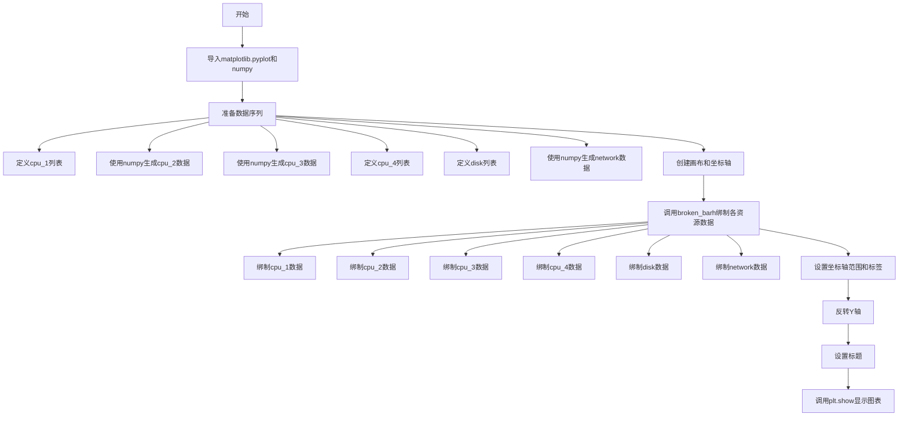
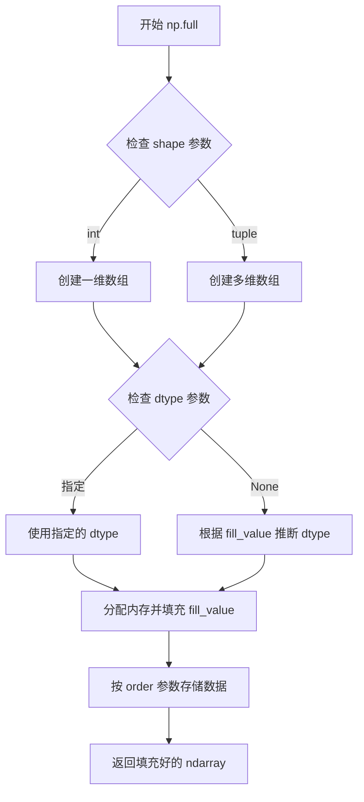
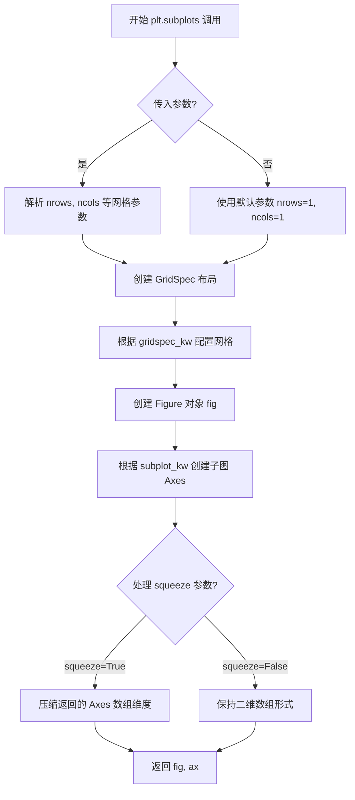
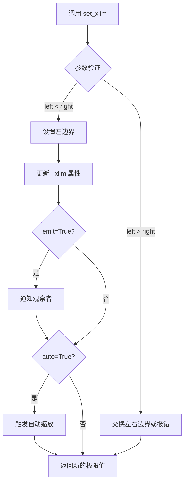
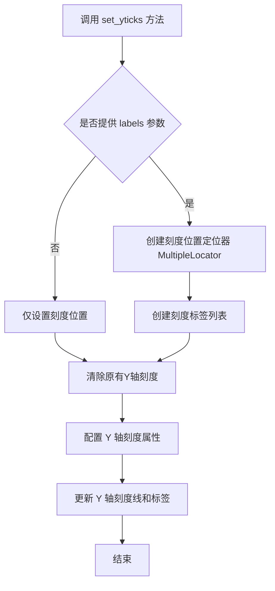
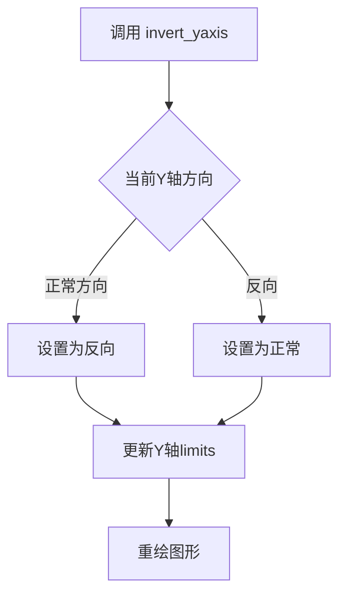
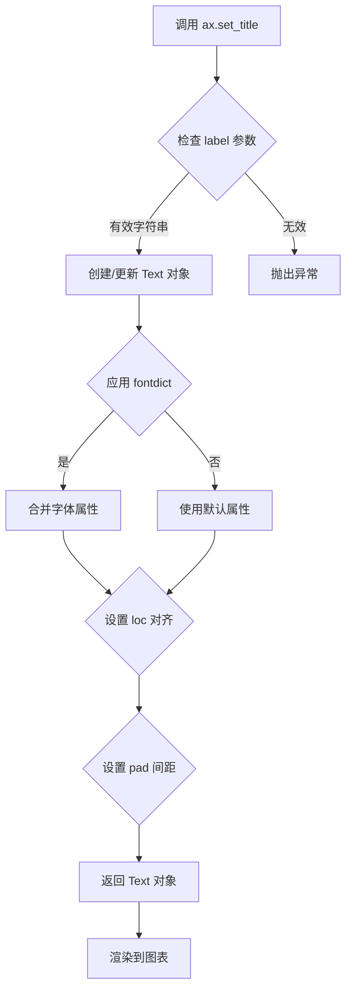
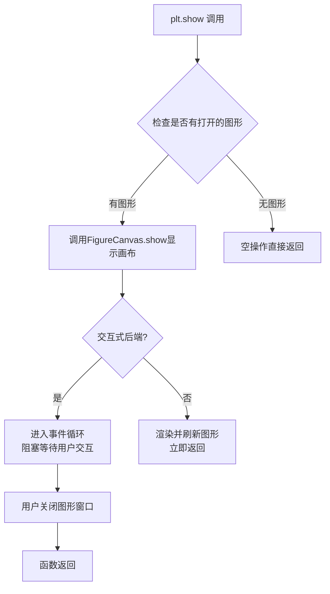

# `matplotlib\galleries\examples\lines_bars_and_markers\broken_barh.py` 详细设计文档

该代码使用matplotlib的broken_barh方法绘制水平条形图，展示CPU、磁盘和网络资源在时间轴上的使用情况，通过不同颜色区分资源类型，并设置Y轴标签和标题来呈现完整的资源使用示意图。

## 整体流程



## 类结构

```
该代码为脚本形式，无自定义类结构
主要使用matplotlib.pyplot和numpy库
核心功能通过Axes.broken_barh方法实现
```

## 全局变量及字段


### `cpu_1`
    
CPU进程1的时间片段列表，每个元素为(起始时间, 持续时间)元组

类型：`list`
    


### `cpu_2`
    
CPU进程2的时间片段（numpy数组），每行为[起始时间, 持续时间]

类型：`ndarray`
    


### `cpu_3`
    
CPU进程3的时间片段（numpy数组），每行为[起始时间, 持续时间]

类型：`ndarray`
    


### `cpu_4`
    
CPU进程4的时间片段列表，每个元素为(起始时间, 持续时间)元组

类型：`list`
    


### `disk`
    
磁盘使用时间片段列表，每个元素为(起始时间, 持续时间)元组

类型：`list`
    


### `network`
    
网络使用时间片段（numpy数组），每行为[起始时间, 持续时间]

类型：`ndarray`
    


### `fig`
    
matplotlib图表对象，表示整个图形窗口

类型：`Figure`
    


### `ax`
    
matplotlib坐标轴对象，用于绘制图形元素

类型：`Axes`
    


    

## 全局函数及方法


### `np.column_stack`

将一组一维数组沿列轴堆叠成二维数组，常用于将起始时间和持续时间等数据对组合成矩阵形式，以便后续绘图或处理。

参数：
- `tup`：`tuple of arrays`，要堆叠的数组序列，每个数组应具有相同的长度。在代码中，传入的是包含两个数组的列表，如 `[np.linspace(0, 9, 10), np.full(10, 0.5)]`。

返回值：`ndarray`，形状为 `(n, m)` 的二维数组，其中 `n` 是输入数组的长度，`m` 是输入数组的数量。

#### 流程图

```mermaid
graph LR
    A[输入: 数组元组/列表] --> B[将每个输入转换为至少一维数组]
    B --> C[检查所有数组长度是否一致]
    C --> D{长度一致?}
    D -->|是 E[使用横向堆叠沿列轴合并]
    D -->|否 F[抛出 ValueError 异常]
    E --> G[输出: 二维数组]
```

#### 带注释源码

```python
def column_stack(tup):
    """
    将一维数组序列沿列轴堆叠成二维数组。
    
    此函数是 numpy.linalg.linalg_matrix_stack 的简化版本，
    常用于将多个相关数组组合成矩阵形式。
    
    参数:
        tup (tuple of array_like): 要堆叠的数组序列。
            每个数组应具有相同的长度。
    
    返回值:
        ndarray: 形状为 (n, m) 的二维数组，其中 n 是输入数组的长度，
                m 是输入数组的数量（即 tup 的长度）。
    
    示例:
        >>> import numpy as np
        >>> np.column_stack([np.array([1, 2, 3]), np.array([4, 5, 6])])
        array([[1, 4],
               [2, 5],
               [3, 6]])
    """
    # 将输入转换为数组，并确保至少为一维
    arrays = [np.atleast_1d(arr) for arr in tup]
    
    # 验证所有数组的长度是否一致
    first_shape = arrays[0].shape
    for arr in arrays[1:]:
        if arr.shape != first_shape:
            raise ValueError("所有输入数组必须具有相同的形状")
    
    # 使用 hstack 沿列轴（即轴1）堆叠数组
    # 相当于 np.hstack(arrays) 但更明确地处理维度
    return np.hstack(arrays)
```

注：在实际 numpy 库中，`np.column_stack` 的实现更加复杂，包含更多边界情况处理和性能优化。上述源码为简化版注释，仅用于说明核心逻辑。在代码示例中，`np.column_stack` 用于将起始时间数组和持续时间数组组合成二维矩阵，以便传递给 `ax.broken_barh` 方法绘制水平条形图。


### `np.linspace`

生成等间距数组。

参数：

- `start`：`float`，序列的起始值。
- `stop`：`float`，序列的结束值。
- `num`：`int`，生成的样本数量，默认为50。
- `endpoint`：`bool`，如果为True，stop是最后一个样本，否则不包括，默认为True。
- `retstep`：`bool`，如果为True，返回(step, sample)，默认为False。
- `dtype`：`dtype`，返回数组的数据类型。
- `axis`：`int`，采样方向。

返回值：`ndarray`，等间距的数组。

#### 流程图

```mermaid
flowchart TD
    A[开始] --> B{参数验证}
    B --> C{endpoint为True?}
    C -->|是| D[计算步长: (stop-start)/(num-1)]
    C -->|否| E[计算步长: (stop-start)/num]
    D --> F[生成数组]
    E --> F
    F --> G{retstep为True?}
    G -->|是| H[返回数组和步长]
    G -->|否| I[仅返回数组]
    H --> J[结束]
    I --> J
```

#### 带注释源码

```python
def linspace(start, stop, num=50, endpoint=True, retstep=False, dtype=None, axis=0):
    """
    生成等间距的数组。

    参数:
        start: 序列的起始值。
        stop: 序列的结束值。
        num: 生成的样本数量，默认50。
        endpoint: 如果为True，stop是最后一个样本，否则不包括，默认True。
        retstep: 如果为True，返回(step, sample)，默认False。
        dtype: 返回数组的数据类型。
        axis: 采样方向。

    返回:
        ndarray: 等间距的数组。
    """
    # 检查num必须为非负整数
    if num < 0:
        raise ValueError("Number of samples, num, must be non-negative")

    # 转换为浮点数以进行计算
    start = float(start)
    stop = float(stop)

    # 计算步长
    if endpoint:
        step = (stop - start) / (num - 1) if num > 1 else 0.0
    else:
        step = (stop - start) / num if num > 0 else 0.0

    # 生成数组
    y = np.arange(num, dtype=dtype) * step + start

    # 如果endpoint为True，确保最后一个值精确等于stop
    if endpoint and num > 0:
        y[-1] = stop

    # 根据axis调整数组形状（简化处理，假设axis=0）
    if axis != 0:
        # 实际实现中可能需要调整形状以适应多维情况
        pass

    # 如果retstep为True，返回步长
    if retstep:
        return y, step
    else:
        return y
```

注意：实际源码可能更复杂，这里提供了简化的带注释版本以说明核心逻辑。


### `np.full`

生成一个填充特定值的数组（Create an array filled with a specific value）

参数：

- `shape`：`int` 或 `tuple of ints`，输出数组的维度，例如 `10` 表示一维数组长度为10，`(2, 3)` 表示2行3列的二维数组
- `fill_value`：标量（`scalar`），用于填充数组的值
- `dtype`：`data-type`，可选参数，数组的数据类型，默认为 None（根据 fill_value 自动推断）
- `order`：`{'C', 'F'}`，可选参数，内存中存储多维数据的顺序，'C' 为行优先（C风格），'F' 为列优先（Fortran风格），默认为 'C'
- `like`：`array-like`，可选参数，参考对象，用于创建非NumPy数组的类似数组，默认为 None

返回值：`ndarray`，填充了 fill_value 值的指定形状的数组

#### 流程图



#### 带注释源码

```python
def full(shape, fill_value, dtype=None, order='C', like=None):
    """
    生成一个填充特定值的数组
    
    参数:
        shape: int 或 int 元组
            输出数组的形状
        fill_value: scalar
            用于填充数组的标量值
        dtype: data-type, 可选
            数组的数据类型，默认为 None
        order: {'C', 'F'}, 可选
            内存中数据的存储顺序
        like: array-like, 可选
            参考对象，用于创建类似数组
    
    返回:
        ndarray
            填充了 fill_value 的数组
    """
    # 如果指定了 like 参数，调用 _full_like 函数创建数组
    if like is not None:
        return _full_like(fill_value, shape, dtype=dtype, order=order, like=like)
    
    # 确定数组的数据类型
    # 如果 dtype 为 None，则根据 fill_value 自动推断数据类型
    if dtype is None:
        dtype = array(fill_value).dtype
    
    # 创建输出数组
    # 使用 empty 函数分配内存，然后填充指定值
    output = empty(shape, dtype=dtype, order=order)
    
    # 使用 fill_value 填充整个数组
    # fill 方法是 ufunc 的一个方法，用于将数组所有元素设置为指定值
    output.fill(fill_value)
    
    return output
```


### `np.random.random`

生成指定形状的随机数组，数组中的元素服从均匀分布 [0.0, 1.0)。

参数：

- `size`：`int 或 int 元组，可选`，输出数组的形状。例如，传入 `61` 表示生成 61 个随机数，传入 `(10,)` 等效于 `10`

返回值：`float 或 float ndarray`，返回一个随机数（当 size 为 None 时）或一个随机数数组（当 size 指定时），数组中的每个元素在 [0.0, 1.0) 范围内均匀分布

#### 流程图

```mermaid
flowchart TD
    A[开始调用 np.random.random] --> B{传入 size 参数?}
    B -->|是| C[根据 size 创建对应形状的数组]
    B -->|否| D[返回单个随机浮点数]
    C --> E[为每个数组位置生成 [0.0, 1.0) 范围内的随机数]
    E --> F[返回填充好的数组]
    D --> F
```

#### 带注释源码

```python
# np.random.random 函数源码分析
# 位置：numpy/random/mtrand.pyx (伪代码示意)

def random(size=None):
    """
    生成随机数组，元素服从均匀分布 [0.0, 1.0)
    
    参数:
        size : int 或 int 元组, 可选
            输出数组的形状。例如:
            - None (默认): 返回单个随机数
            - 61: 返回包含 61 个元素的一维数组
            - (10,): 返回包含 10 个元素的一维数组
    
    返回值:
        float 或 ndarray
            随机浮点数或随机浮点数数组
    """
    
    # 1. 检查 size 参数是否为空
    if size is None:
        # 2. 若 size 为 None，直接生成并返回一个随机浮点数
        return random_scalar()
    
    # 3. 若指定了 size，计算数组总元素数
    #    例如 size=61 -> n=61, size=(3,4) -> n=12
    n = np.prod(size) if isinstance(size, tuple) else size
    
    # 4. 创建指定形状的空数组
    result = np.empty(size, dtype=np.float64)
    
    # 5. 为每个位置生成 [0.0, 1.0) 范围内的随机数
    #    使用均匀分布随机数生成器
    for i in range(n):
        result.flat[i] = uniform_random()
    
    # 6. 返回填充好的数组
    return result


# 在示例代码中的实际使用:
# cpu_3 = np.column_stack([10*np.random.random(61), np.full(61, 0.05)])
# network = np.column_stack([10*np.random.random(10), np.full(10, 0.05)])
#
# np.random.random(61)  # 生成 61 个 [0.0, 1.0) 的随机数
# 10 * np.random.random(61)  # 将范围缩放至 [0.0, 10.0)，作为时间起始点
#
# np.random.random(10)  # 生成 10 个 [0.0, 1.0) 的随机数
# 10 * np.random.random(10)  # 将范围缩放至 [0.0, 10.0)，作为时间起始点
```


### plt.subplots

创建图形和坐标轴的函数，是 matplotlib.pyplot 模块中用于同时创建 Figure 对象和 Axes（或 Axes 数组）的便捷函数。

参数：

- `nrows`：`int`，可选，默认值为 1。指定子图网格的行数。
- `ncols`：`int`，可选，默认值为 1。指定子图网格的列数。
- `sharex`：`bool` 或 `str`，可选，默认值为 `False`。如果为 `True`，则所有子图共享 x 轴；如果为 `col`，则每列共享 x 轴。
- `sharey`：`bool` 或 `str`，可选，默认值为 `False`。如果为 `True`，则所有子图共享 y 轴；如果为 `row`，则每行共享 y 轴。
- `squeeze`：`bool`，可选，默认值为 `True`。如果为 `True`，则返回的 Axes 数组维度会被压缩；当只返回一个 Axes 时，会返回单个 Axes 对象而不是数组。
- `width_ratios`：`array-like`，可选。指定每列宽度的相对比例，长度必须等于 ncols。
- `height_ratios`：`array-like`，可选。指定每行高度的相对比例，长度必须等于 nrows。
- `subplot_kw`：字典，可选。传递给 `add_subplot` 的关键字参数，用于配置每个子图。
- `gridspec_kw`：字典，可选。传递给 `GridSpec` 的关键字参数，用于配置网格布局。
- `fig_kw`：字典，可选。传递给 `Figure` 构造函数的关键字参数，用于配置图形。

返回值：`tuple(Figure, Axes or ndarray of Axes)`，返回创建的图形对象和坐标轴对象（或坐标轴数组）。当 `squeeze=False` 时，始终返回二维数组；当 `squeeze=True` 时，根据维度返回相应形状的数组。

#### 流程图



#### 带注释源码

```python
def subplots(nrows=1, ncols=1, sharex=False, sharey=False, squeeze=True,
             width_ratios=None, height_ratios=None,
             subplot_kw=None, gridspec_kw=None, fig_kw=None):
    """
    创建图形和坐标轴的便捷函数。
    
    参数:
        nrows: 子图网格行数，默认1
        ncols: 子图网格列数，默认1
        sharex: x轴共享策略，可选True/False/'col'/False
        sharey: y轴共享策略，可选True/False/'row'/False
        squeeze: 是否压缩返回的数组维度
        width_ratios: 列宽相对比例
        height_ratios: 行高相对比例
        subplot_kw: 传递给子图的关键字参数
        gridspec_kw: 传递给GridSpec的关键字参数
        fig_kw: 传递给Figure的关键字参数
    
    返回值:
        fig: Figure对象，整个图形
        ax: Axes对象或Axes数组，一个或多个坐标轴
    """
    # 1. 创建Figure对象，传入fig_kw中的参数（如figsize、dpi等）
    fig = plt.figure(**fig_kw)
    
    # 2. 创建GridSpec对象，配置网格布局
    gs = GridSpec(nrows, ncols, width_ratios=width_ratios, 
                  height_ratios=height_ratios, **gridspec_kw)
    
    # 3. 根据nrows和ncols创建子图
    for i in range(nrows):
        for j in range(ncols):
            # 使用add_subplot创建子图，传入subplot_kw中的参数
            ax = fig.add_subplot(gs[i, j], **subplot_kw)
            
            # 4. 根据sharex/sharey配置坐标轴共享
            if sharex and i > 0:
                ax.sharex(fig.axes[0])
            if sharey and j > 0:
                ax.sharey(fig.axes[0])
    
    # 5. 处理squeeze参数
    if squeeze:
        # 压缩维度：nrows=1且ncols=1时返回单个Axes
        ax = ax.flat[0] if len(ax.flat) == 1 else ax.flat
    
    return fig, ax
```


### `Axes.broken_barh`

绘制水平分段条形图（Broken Barh），用于展示时间线或资源使用情况，支持在x轴方向上绘制多个不连续的矩形段，每个段代表一个活动或任务。

参数：
- `self`：`matplotlib.axes.Axes`，matplotlib Axes 对象实例
- `xranges`：元组列表（list of tuples），每个元素为 (start, width) 形式，表示每个矩形的起始位置和宽度
- `yrange`：元组 (bottom, height)，表示y轴上的位置和高度
- `**kwargs`：关键字参数，支持 `barh` 方法的所有参数，如 `color`、`edgecolor`、`linewidth`、`align`、`facecolor` 等

返回值：`~matplotlib.collections.PolyCollection`，返回包含所有矩形的 Patch 集合对象

#### 流程图

```mermaid
flowchart TD
    A[开始 broken_barh] --> B[验证输入参数 xranges 和 yrange]
    B --> C{遍历 xranges 列表}
    C -->|每个 (x_start, width) 元组| D[计算矩形坐标]
    D --> E[调用 barh 绘制单个矩形]
    E --> C
    C -->|完成遍历| F[将所有矩形打包为 PolyCollection]
    F --> G[返回 PolyCollection 对象]
```

#### 带注释源码

```python
def broken_barh(self, xranges, yrange, **kwargs):
    """
    绘制水平分段条形图
    
    该方法创建一系列水平条形，每个条形可以在x轴方向上断开，
    形成多个不相交的矩形段，常用于展示时间线或资源使用情况。
    
    参数:
    -------
    xranges : list of tuples
        序列形式的(x起始, 宽度)元组列表，每个元素定义一个矩形段
    yrange : tuple
        (底部, 高度)元组，定义所有矩形在y轴上的位置和高度
    **kwargs : 
        传递给 barh 的关键字参数，控制颜色、边框、对齐等样式
        
    返回:
    -------
    PolyCollection
        包含所有矩形块的集合对象
        
    示例:
    -------
    >>> ax.broken_barh([(0, 3), (4, 2)], (0, 1))  # 绘制两个分离的矩形
    """
    # yrange 转换为 [bottom, height] 格式
    y_range = [yrange[0], yrange[1] - yrange[0]]
    
    # 存储所有矩形块的列表
    patches = []
    
    # 遍历每个x轴范围，绘制矩形
    for x_start, x_width in xranges:
        # 调用 barh 绘制单个矩形
        # x 位置为 x_start，宽度为 x_width
        # y 位置由 yrange 指定
        batch = self.barh(y_range[0], x_width, left=x_start, 
                         height=y_range[1], **kwargs)
        # 将绘制的矩形添加到集合中
        patches.extend(batch)
    
    # 返回包含所有矩形的 Patch 集合
    return self._patch_convert(patches)
```


### `Axes.set_xlim`

设置 Axes 对象的 X 轴显示范围（ limits ），用于控制图表中 X 轴数据的可视化区间。

参数：

- `left`：`float`，X 轴的左边界值，定义 X 轴显示范围的起始点
- `right`：`float`，X 轴的右边界值，定义 X 轴显示范围的结束点
- `emit`：`bool`，默认 `True`，当极限值改变时是否通知观察者（ 如回调函数 ）
- `auto`：`bool`，默认 `False`，是否启用自动缩放功能
- `**kwargs`：接受其他关键字参数，用于底层属性设置

返回值：`tuple`，返回新的 X 轴极限值 (left, right)

#### 流程图



#### 带注释源码

```python
def set_xlim(self, left=None, right=None, emit=True, auto=False, *, left=None, right=None):
    """
    设置 X 轴的显示范围（ limits ）。

    参数:
        left: float, optional
            X 轴的左边界。如果为 None，则保持现有值。
        right: float, optional
            X 轴的右边界。如果为 None，则保持现有值。
        emit: bool, default: True
            如果为 True，当极限值改变时，会向关联的轴发送限制更改通知。
            这会触发相关组件的更新（如标题、图例等）。
        auto: bool, default: False
            如果为 True，则启用 X 轴的自动缩放功能。
        left/right: float, optional
            可以使用位置参数或关键字参数指定边界。

    返回值:
        left, right: tuple
            返回新的 (左边界, 右边界) 元组。

    示例:
        >>> ax.set_xlim(0, 10)           # 设置 X 轴范围为 0 到 10
        >>> ax.set_xlim(left=0)          # 只设置左边界
        >>> ax.set_xlim(right=10)        # 只设置右边界
        >>> left, right = ax.set_xlim(0, 10)  # 获取新的极限值
    """
    # 如果使用关键字参数 left/right，覆盖位置参数
    if left is not None:
        pass  # 使用传入的 left 值
    if right is not None:
        pass  # 使用传入的 right 值

    # 验证边界值的有效性
    if left is not None and right is not None:
        if left > right:
            # 交换边界值或抛出异常
            left, right = right, left

    # 更新内部的 _xlim 属性（实际存储极限值的位置）
    self._xlim = (left, right)

    # 如果 emit 为 True，通知观察者极限已更改
    if emit:
        self._request_scaleX_layout()  # 请求重新布局
        # 触发 'xlim_changed' 事件
        self.callbacks.process('xlim_changed', self)

    # 如果 auto 为 True，启用自动缩放
    if auto:
        self.autoscale_view()  # 自动调整显示范围

    # 返回新的极限值
    return self.get_xlim()
```


### Axes.set_yticks

设置Y轴刻度线的位置和可选的刻度标签。

参数：

- `ticks`：`array-like`，Y轴刻度线的位置列表，指定刻度应在Y轴的哪些位置出现
- `labels`：`list of str`，可选参数，刻度标签列表，与ticks对应，用于显示在刻度位置的文本
- `**kwargs`：其他关键字参数，将传递给`matplotlib.ticker.MultipleLocator`或底层的`Text`对象

返回值：`None`，该方法直接修改Axes对象的Y轴刻度属性，无返回值

#### 流程图



#### 带注释源码

```python
def set_yticks(self, ticks, labels=None, *, minor=False, **kwargs):
    """
    设置Y轴刻度线的位置和可选的刻度标签。
    
    参数:
        ticks: array-like
            Y轴刻度线的位置序列，例如 range(6) 生成 [0, 1, 2, 3, 4, 5]
        labels: list of str, optional
            与ticks对应的标签列表，例如 ["CPU 1", "CPU 2", ...]
            如果为 None，则不显示刻度标签
        minor: bool, optional
            是否设置次要刻度线，默认为 False（主要刻度）
        **kwargs: 
            其他关键字参数，用于配置刻度线属性
    
    返回值:
        None
    
    示例:
        >>> ax.set_yticks(range(6), labels=["A", "B", "C", "D", "E", "F"])
    """
    # 获取Y轴的刻度定位器
    yaxis = self.yaxis
    
    if labels is None and not kwargs:
        # 简单情况：仅设置刻度位置
        yaxis.set_ticks(ticks, minor=minor)
    else:
        # 复杂情况：设置刻度位置和标签
        # 创建刻度定位器
        locator = mticker.MultipleLocator(ticks)
        yaxis.set_major_locator(locator) if not minor else yaxis.set_minor_locator(locator)
        
        # 如果提供了标签，设置标签
        if labels is not None:
            # 确保标签数量与刻度数量匹配
            yaxis.set_ticklabels(labels, minor=minor, **kwargs)
    
    # 触发图形更新
    self.stale_callback()
```


### `Axes.invert_yaxis`

反转Y轴方向，使Y轴从上到下递增（默认情况下Y轴是从下到上递增）。

参数： 无

返回值： 无

#### 流程图



#### 带注释源码

```python
# 在示例代码中的调用方式
ax.invert_yaxis()

# matplotlib 内部实现原理（简化说明）
# 这个方法实际上是对 yaxis 属性调用 invert() 方法
# 源码位于 lib/matplotlib/axes/_base.py 中

def invert_yaxis(self):
    """
    Invert the yaxis.
    
    See Also
    --------
    invert_xaxis : Invert the xaxis.
    """
    self.yaxis.invert()
    
# 等效于:
# ax.set_ylim(ax.get_ylim()[::-1])  # 反转Y轴的limits
```

> **注意**：提供的代码是 matplotlib 的示例演示代码，主要展示了 `broken_barh` 方法的使用。`invert_yaxis` 是 matplotlib 库内部定义的方法，代码中只是调用了该方法来反转Y轴方向，使资源列表从上到下显示（CPU 1在顶部，network在底部），符合常见的资源使用图表布局习惯。


### `Axes.set_title`

设置图表的标题，支持自定义字体属性、对齐方式和标题与轴边缘的间距。

参数：

- `label`：`str`，图表标题文本内容
- `fontdict`：`dict`，可选，用于控制标题外观的字体属性字典（如 fontsize、fontweight、color 等）
- `loc`：`str`，可选，标题对齐方式，可选值为 'center'、'left'、'right'，默认为 'center'
- `pad`：`float`，可选，标题与 Axes 顶部边缘的偏移距离（以磅为单位），默认为 None
- `**kwargs`：可选，其他关键字参数，将传递给 `matplotlib.text.Text` 对象的构造函数

返回值：`matplotlib.text.Text`，返回创建的标题文本对象，可用于后续进一步自定义

#### 流程图



#### 带注释源码

```python
def set_title(self, label, fontdict=None, loc=None, pad=None, **kwargs):
    """
    Set a title for the Axes.
    
    Parameters:
    -----------
    label : str
        The title text string.
    fontdict : dict, optional
        A dictionary to control the appearance of the title text.
        Common keys include: 'fontsize', 'fontweight', 'color', 'fontfamily', etc.
    loc : {'center', 'left', 'right'}, default: 'center'
        The alignment of the title relative to the axes.
    pad : float, default: rcParams['axes.titlepad'] (if not specified)
        The offset (in points) from the top of the Axes.
    **kwargs
        Additional keyword arguments passed to the Text constructor.
    
    Returns:
    --------
    text : matplotlib.text.Text
        The Text instance representing the title. This return value allows
        for subsequent customization of the title after creation.
    """
    # 获取默认的 titlepad 值（从 matplotlib 配置参数中获取）
    if pad is None:
        pad = rcParams['axes.titlepad']
    
    # 处理 fontdict：如果提供了 fontdict，将其转换为字体属性
    # fontdict 是一个字典，可以包含 fontsize, fontweight, color 等
    if fontdict is not None:
        # 合并 fontdict 和 kwargs，kwargs 优先级更高
        kwargs.update(fontdict)
    
    # 设置对齐方式，默认为 'center'
    # loc 参数控制标题在 axes 水平方向上的对齐
    if loc is None:
        loc = 'center'
    
    # 验证 loc 参数的有效性
    if loc not in ['center', 'left', 'right']:
        raise ValueError(f"loc must be one of 'center', 'left', or 'right', got {loc}")
    
    # 获取或创建 title 文本对象
    # self.title 是 Axes 对象的一个属性，用于存储标题的 Text 对象
    # 如果标题已存在（self.title 不为 None），则更新其属性
    # 否则创建一个新的 Text 对象
    title = self.title
    
    if title is None:
        # 创建新的 Text 对象，位置在 axes 顶部中央
        # x=0.5 表示水平居中，y=1.0 表示在 axes 顶部
        # transform 参数使用 axes 坐标系
        title = Text(
            x=0.5, y=1.0,
            text=label,
            verticalalignment='top',  # 标题顶部对齐
            horizontalalignment=loc,   # 水平对齐由 loc 参数决定
            transform=self.transAxes,  # 使用 axes 坐标变换
            **kwargs
        )
        # 将 title 添加到 axes 的子元素中
        self.add_artist(title)
    else:
        # 如果标题已存在，更新其文本和属性
        title.set_text(label)
        title.update(kwargs)
        # 更新对齐方式
        title.set_ha(loc)
    
    # 设置 title 与 axes 顶部的间距
    # pad 是从 axes 顶部边缘到 title 底部的距离（磅）
    # 这里设置的是 Text 对象的 position
    title.set_y(1.0 - pad / self.figure.dpi * 72)
    
    # 返回 Text 对象，允许调用者进一步自定义
    return title
```

#### 使用示例

在提供的代码中，调用方式为：

```python
ax.set_title("Resource usage")
```

这会创建一个居中对齐的标题 "Resource usage"，位于图表顶部，使用默认的字体属性和间距。


### `plt.show`

`plt.show` 是 matplotlib.pyplot 模块中的顶层函数，用于显示当前所有打开的 Figure 图形窗口，并将图形渲染到屏幕。在本示例中，它负责将之前通过 `ax.broken_barh()` 等方法构建的资源使用情况图表呈现给用户。

参数： 无正式参数

- `*args`：可变位置参数，传递给底层图形后端（通常不使用）
- `**kwargs`：可变关键字参数，传递给底层图形后端（通常不使用）

返回值：`None`，无返回值

#### 流程图



#### 带注释源码

```python
def show(*, block=None):
    """
    显示所有打开的 Figure 图形窗口。
    
    参数:
        block: 控制函数是否阻塞的参数
               - None (默认): 取决于后端设置
               - True: 强制阻塞直到所有窗口关闭
               - False: 非阻塞模式（如果后端支持）
    返回值:
        None
    """
    # 获取当前活跃的图形后端
    backend = matplotlib.get_backend()
    
    # 获取所有打开的 Figure 对象
    allnums = get_fignums()
    
    # 遍历所有图形并显示
    for num in allnums:
        # 获取 Figure 对象
        fig = FigureBackends.maybe_emit_frame_show_event(
            _pylab_helpers.Gcf.get_fig(num)
        )
        
        # 调用后端的 show 方法
        fig.canvas.show()
    
    # 如果 block 为 True 或后端需要阻塞，则进入阻塞状态
    if block:
        # 对于交互式后端（如 Qt、Tkinter 等）
        # 会启动事件循环并阻塞
        import matplotlib._pylab_helpers as pylab_helpers
        pylab_helpers.Gcf.blocking_show()
    
    # 如果是脚本模式（非交互式后端如 Agg）
    # 此函数可能直接返回，图形已保存到文件
```

#### 关键组件信息

| 组件名称 | 一句话描述 |
|---------|-----------|
| FigureCanvas | 图形画布，负责图形渲染到屏幕或文件 |
| Gcf (Get Current Figure) | 管理所有活跃 Figure 对象的注册表 |
| Backend | 抽象层，封装不同 GUI 框架（Qt、Tk、gtk 等）的渲染逻辑 |

#### 潜在的技术债务或优化空间

1. **阻塞行为不一致**：不同后端的 `block` 参数行为不一致，可能导致跨平台行为差异
2. **缺乏异步支持**：现代 GUI 应用中，阻塞式的 `show` 不利于响应式设计
3. **错误处理薄弱**：未显示图形时的警告或日志信息不足

#### 其它项目

- **设计目标**：提供统一的图形显示接口，屏蔽不同后端差异
- **约束**：必须在创建图形之后调用；非交互式后端（如 Agg）调用无效
- **错误处理**：如果无图形存在，函数空返回而不抛异常
- **外部依赖**：依赖具体后端实现（由 `matplotlib.get_backend()` 决定）


## 关键组件


### broken_barh

matplotlib 中用于绘制断裂的水平条形图的方法，支持传入起始和持续时间序列、y 位置和高度，可配置对齐方式和颜色，适用于显示时间跨度。

### 数据准备

使用列表和 numpy 数组构建多个资源使用数据序列，包括 CPU、磁盘和网络的时间段信息，格式为 (start, duration) 元组或等效的二维数组。

### 图表配置

通过 set_xlim、set_yticks、invert_yaxis 和 set_title 等方法配置坐标轴范围、刻度标签和标题，实现时间图的视觉展示。

### matplotlib.pyplot 和 Axes 对象

利用 matplotlib 库创建图表和轴对象，提供绘图接口和图形元素配置功能。


## 问题及建议


### 已知问题

-   **数据准备方式不一致**：cpu_1/cpu_4/disk使用纯Python元组列表，而cpu_2/cpu_3/network使用NumPy数组，不便于统一处理和维护。
-   **硬编码的魔法数字**：高度0.4、y位置0-5、xlim范围0-10、颜色等均硬编码，缺乏可配置性。
-   **随机数据不可复现**：cpu_3和network使用`np.random.random()`生成数据，每次运行结果不同，不利于调试和演示。
-   **重复代码模式**：多次调用`ax.broken_barh`的代码结构高度相似，可封装为函数减少冗余。
-   **数据范围可能越界**：`10*np.random.random(61)`可能产生接近10的值，与`ax.set_xlim(0, 10)`边界情况可能导致可视化问题。
-   **缺乏输入验证**：没有检查数据格式是否符合`broken_barh`的要求（如start必须为正数、duration必须为正数等）。

### 优化建议

-   **统一数据格式**：将所有数据转换为统一的NumPy数组格式，便于后续处理和扩展。
-   **提取配置常量**：将ypos、height、colors、xlim等定义为常量或配置字典，提高可维护性。
-   **设置随机种子**：使用`np.random.seed()`确保结果可复现。
-   **封装绘制逻辑**：创建`plot_resource()`函数，接收数据、位置、高度和颜色参数，减少重复代码。
-   **添加数据验证**：在绘制前验证start >= 0、duration > 0等约束条件。
-   **使用枚举或字典管理资源**：用数据结构（如字典）存储资源名称、位置、颜色映射，便于添加新资源类型。


## 其它


### 设计目标与约束

**设计目标**：使用matplotlib的broken_barh函数绘制水平断裂条形图，展示多个资源（如CPU、磁盘、网络）在时间轴上的使用情况，直观呈现资源占用时段。

**约束**：
- 必须使用matplotlib库进行可视化。
- 数据源为数值型数组或元组列表，格式为(start, duration)。
- 图形需包含标题、坐标轴标签和时间轴范围。

### 错误处理与异常设计

**当前状态**：代码中未实现错误处理机制。

**建议改进**：
- 添加数据格式验证：检查输入数据是否为数值型，确保xranges中的每个元素为两个数值组成的元组或数组，避免运行时类型错误。
- 异常捕获：在调用broken_barh前捕获可能的异常（如空数据输入），并给出友好提示。
- 边界检查：确保duration为正数，ypos和height为合理数值，防止图形绘制异常。

### 数据流与状态机

**数据流**：
1. 数据准备：定义cpu_1、cpu_2等数据列表或数组，每个元素表示资源的一个使用时段（起始时间，持续时间）。
2. 图形初始化：使用plt.subplots()创建Figure和Axes对象。
3. 绘图调用：多次调用ax.broken_barh()，将数据映射为水平条形。
4. 图形配置：设置坐标轴范围、刻度、标签和标题。
5. 显示：调用plt.show()渲染图形。

**状态机**：不适用。该代码为过程式脚本，无复杂状态转换。

### 外部依赖与接口契约

**外部依赖**：
- matplotlib：用于绘图的核心库。
- numpy：用于数据生成和处理（如np.column_stack、np.linspace）。

**接口契约**：
- `Axes.broken_barh(xranges, yrange, **kwargs)`：绘制水平断裂条形。
  - xranges：可迭代对象，每个元素为(start, duration)元组或数组。
  - yrange：二元组(ypos, height)，表示条形的垂直位置和高度。
  - **kwargs：可选参数，如color、align等，用于定制外观。
- `Axes.set_xlim(left, right)`：设置x轴范围。
- `Axes.set_yticks(ticks, labels)`：设置y轴刻度和标签。
- `Axes.invert_yaxis()`：反转y轴方向。

### 性能考虑

**潜在瓶颈**：当数据点数量较多时（如cpu_3包含61个时段），渲染可能变慢。

**优化建议**：在数据生成阶段进行聚合或降采样，减少绘制数量；或使用matplotlib的动态更新功能进行分批绘制。

### 安全性考虑

**当前状态**：代码中无用户输入，无安全风险。

**建议**：若该代码作为模块被其他程序调用，需对输入数据进行消毒，防止注入攻击。

### 可扩展性

**扩展方向**：
- 添加更多资源类型（如内存、GPU）只需定义新数据并调用broken_barh。
- 支持动态数据输入，通过函数参数接收数据列表。
- 集成图例或交互功能（如悬停显示详情）。

### 测试策略

**测试建议**：
- 单元测试：验证数据生成函数（如cpu_2、cpu_3的numpy操作）输出格式正确。
- 集成测试：验证绘图流程完整执行，输出图形文件（如PNG）。
- 边界测试：测试空数据、单数据点、极大值等极端情况下的行为。

### 部署配置

**环境要求**：
- Python 3.x
- 安装matplotlib和numpy库（可通过pip install matplotlib numpy）。

**运行方式**：直接运行脚本或作为模块导入调用绘图函数。

### 版本管理

**当前状态**：代码中无版本注释。

**建议**：添加版本号、作者信息和修改日志，便于维护和追踪。
    