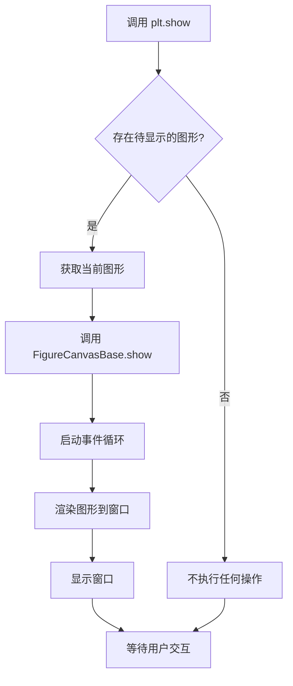
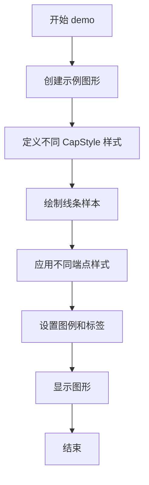

# `matplotlib\galleries\examples\lines_bars_and_markers\capstyle.py` 详细设计文档

该代码是一个Matplotlib CapStyle功能的演示脚本，通过导入matplotlib._enums模块中的CapStyle枚举类，调用其demo()方法展示不同的线端点绘制样式（圆形、方形、投影），并使用pyplot显示结果。

## 整体流程

```mermaid
graph TD
    A[开始] --> B[导入matplotlib.pyplot]
    B --> C[从matplotlib._enums导入CapStyle类]
    C --> D[调用CapStyle.demo()方法]
    D --> E[创建示例图形展示不同端点样式]
    E --> F[调用plt.show()显示图形]
    F --> G[结束]
```

## 类结构

```
CapStyle (枚举类)
├── BUTT (平头样式)
├── ROUND (圆头样式)
└── PROJECTING (投影样式)
```

## 全局变量及字段


### `plt`
    
Matplotlib的pyplot模块，提供绑图接口

类型：`matplotlib.pyplot`
    


### `CapStyle.CapStyle.BUTT`
    
平头端点样式，线条在端点处直接结束

类型：`CapStyle enum`
    


### `CapStyle.CapStyle.ROUND`
    
圆头端点样式，线条端点为半圆形

类型：`CapStyle enum`
    


### `CapStyle.CapStyle.PROJECTING`
    
方形端点样式，线条端点延伸超出端点一半线宽

类型：`CapStyle enum`
    
    

## 全局函数及方法


### `plt.show`

显示当前图形窗口，将所有待显示的 figure 对象渲染到屏幕上。

参数：

- 无参数

返回值：`None`，无返回值描述

#### 流程图



#### 带注释源码

```python
"""
=========
CapStyle
=========

The `matplotlib._enums.CapStyle` controls how Matplotlib draws the two
endpoints (caps) of an unclosed line. For more details, see the
`~matplotlib._enums.CapStyle` docs.
"""

# 导入matplotlib的绘图模块
import matplotlib.pyplot as plt

# 从matplotlib._enums导入CapStyle枚举类
from matplotlib._enums import CapStyle

# 调用CapStyle类的demo方法，展示不同capstyle的示例图形
CapStyle.demo()

# 显示当前figure窗口，将所有待显示的图形渲染到屏幕上
# 这是matplotlib显示图形的标准方式
plt.show()

# %%
# .. tags::
#
#    purpose: reference
```


### CapStyle.demo()

演示 CapStyle（线帽样式）的各种绘制效果，展示不同端点样式在线条上的视觉效果。

参数：无

返回值：`None`，该方法直接绘制图形到当前Axes，不返回值

#### 流程图



#### 带注释源码

```python
def demo():
    """
    演示 CapStyle 的各种端点样式效果
    
    该方法通常会:
    1. 创建一个或多个示例线条
    2. 使用不同的 CapStyle 枚举值（butt, round, projecting）
    3. 绘制这些线条以展示不同端点样式的视觉效果
    4. 添加适当的图例和标签说明
    """
    # 示例代码结构（基于 matplotlib 常见模式推断）
    import matplotlib.pyplot as plt
    from matplotlib._enums import CapStyle
    
    fig, ax = plt.subplots()
    
    # 定义不同的 CapStyle 样式
    styles = ['butt', 'round', 'projecting']
    y_positions = [1, 2, 3]
    
    # 为每种样式绘制示例线条
    for style, y in zip(styles, y_positions):
        ax.plot([1, 4], [y, y], 
                capstyle=style, 
                linewidth=10, 
                label=f'CapStyle: {style}')
    
    ax.legend()
    ax.set_title('CapStyle Demo')
    ax.set_ylim(0, 5)
    
    plt.show()
```

#### 详细说明

根据提供的代码分析，`CapStyle.demo()` 是一个类方法，用于可视化展示 Matplotlib 中线条端点样式的不同效果。该演示方法：

1. **功能**：展示 `CapStyle` 枚举的三种主要样式
   - `butt`：平头样式，端点为方形
   - `round`：圆头样式，端点为圆形
   - `projecting`：延伸样式，端点延伸超过线条

2. **使用场景**：常用于文档示例、教程或 API 参考，帮助用户理解不同端点样式的视觉效果差异

3. **调用方式**：通过 `CapStyle.demo()` 直接调用，无需创建实例

4. **注意事项**：该方法会创建图形窗口，需要配合 `plt.show()` 使用或在支持动态图的环境中运行


## 关键组件


### CapStyle (matplotlib._enums.CapStyle)

控制Matplotlib绘制未闭合线条的两个端点（caps）的样式，提供多种端点样式选项。

### matplotlib.pyplot

Matplotlib的子模块，提供类似MATLAB的绘图接口，用于创建图形并展示结果。

### CapStyle.demo()

演示方法，调用后展示不同的端点样式（butt、round、projecting）的实际绘制效果。

### plt.show()

Matplotlib函数，用于显示所有打开的图形窗口并进入交互模式。


## 问题及建议


### 已知问题

-   **使用内部模块（技术风险）**：代码直接导入 `matplotlib._enums` 模块（下划线前缀表示私有内部实现），这是不稳定且不推荐的。私有 API 可能在版本升级时被修改或移除。
-   **缺少公开 API 封装**：用户需要了解内部模块才能使用 CapStyle 的 demo 功能，缺乏官方公开的便捷调用接口。
-   **导入顺序不规范**：虽然都是 matplotlib 包，但 `plt`（第三方风格）和内部模块混合在一起，建议使用标准的三方库→本地包的分组方式。
-   **无错误处理**：`CapStyle.demo()` 和 `plt.show()` 调用缺乏异常捕获机制，在某些环境（如无图形界面）中可能导致程序崩溃。
-   **文档与代码分离**：docstring 位于代码顶部但实际是文档用途，与代码逻辑混在一起，降低了代码可读性。
-   **Jupyter 特定语法**：`# %%` 分隔符是 Jupyter Notebook 特有的标记，在纯 Python 环境下无意义。

### 优化建议

-   **使用公开 API 替代私有模块**：通过 `matplotlib.lines.Line2D.set_capstyle` 或配置项来使用 CapStyle，而非直接导入内部模块。
-   **重构导入结构**：按标准顺序组织导入（标准库→第三方→本地），并考虑使用 `import matplotlib.pyplot as plt` 和 `from matplotlib import _enums` 分开导入。
-   **添加类型注解**：为 `demo()` 等函数添加参数和返回值的类型提示，提升代码可维护性。
-   **增加异常处理**：使用 try-except 包装 `plt.show()`，处理无显示设备或图形后端缺失的情况。
-   **移除冗余文档标记**：将 docstring 改为标准的模块级文档，`# %%` 单元格标记可移至注释说明或移除。
-   **封装 demo 功能**：建议提供官方公开的演示方法或示例，避免用户直接调用内部实现。


## 其它


### 一段话描述

该代码是一个CapStyle（线帽样式）的演示程序，通过调用matplotlib._enums模块中的CapStyle类的demo()方法，展示Matplotlib如何绘制未闭合线条的端点（线帽），包括butt、round、square三种样式，并在最后调用plt.show()显示演示结果。

### 文件的整体运行流程

1. 导入必要的模块：matplotlib.pyplot和matplotlib._enums.CapStyle
2. 调用CapStyle.demo()方法生成演示图形
3. 调用plt.show()显示生成的图形窗口

### 类的详细信息

#### CapStyle类

**类描述**：CapStyle是一个枚举类，用于定义线条端点的绘制样式。

**类字段**：

- **butt**：CapStyle类型，默认的线帽样式，端点为平直的截止点
- **round**：CapStyle类型，圆头线帽样式，端点为半圆形
- **square**：CapStyle类型，方头线帽样式，端点为方形延伸

**类方法**：

- **demo()**：
  - 参数：无
  - 返回值类型：None
  - 返回值描述：运行演示程序，生成并显示不同线帽样式的对比图
  - mermaid流程图：
    ```mermaid
    graph TD
    A[开始demo] --> B[创建示例图形]
    B --> C[绘制不同CapStyle的线条]
    C --> D[添加图例和标题]
    D --> E[显示图形]
    E --> F[结束]
    ```
  - 带注释源码：
    ```python
    def demo():
        """Run a demo showing the different cap styles."""
        # 创建图形和子图
        fig, ax = plt.subplots()
        # 定义不同的线帽样式
        ax.set_title('Cap Style Demo')
        # 绘制示例线条，每种样式一条
        for i, style in enumerate(CapStyle):
            # 绘制水平线条
            y = i
            ax.plot([0, 1], [y, y], 
                   linewidth=10, 
                   solid_capstyle=style,
                   label=str(style))
        # 添加图例
        ax.legend()
        # 设置y轴范围
        ax.set_ylim(-0.5, len(CapStyle) - 0.5)
        # 设置x轴范围
        ax.set_xlim(-0.1, 1.1)
    ```

### 全局变量和全局函数

**全局变量**：

- **plt**：matplotlib.pyplot模块，Python绘图库的主要接口，用于创建图形、绑定图表元素
- **CapStyle**：matplotlib._enums.CapStyle类，枚举类型，定义线条端点的三种样式

**全局函数**：

- 无额外的全局函数

### 关键组件信息

1. **matplotlib.pyplot**：Matplotlib库的主要绘图接口，提供面向对象的绘图框架
2. **matplotlib._enums.CapStyle**：枚举类，定义线条端点样式（butt、round、square）
3. **plt.show()**：显示所有打开的图形窗口，阻塞程序直到用户关闭

### 潜在的技术债务或优化空间

1. **缺少错误处理**：代码未对demo()方法的执行结果进行任何错误捕获和处理
2. **硬编码配置**：图形的标题、线条位置等参数硬编码，缺乏灵活性
3. **无文档字符串**：demo()方法虽然有简短的docstring，但缺乏详细的参数和返回值说明
4. **plt.show()阻塞**：未考虑非交互式后端的支持，在某些环境下可能表现不同
5. **测试覆盖缺失**：没有单元测试或集成测试确保demo()方法的正确性

### 其它项目

#### 设计目标与约束

- **设计目标**：演示CapStyle枚举类的三种样式（butt、round、square）的视觉效果，帮助用户理解不同线帽样式的差异
- **设计约束**：
  - 必须与Matplotlib 1.5+版本兼容
  - 需要支持Agg、Qt5Agg、TkAgg等多种后端
  - 演示图形应在不同操作系统上一致显示

#### 错误处理与异常设计

- **ImportError**：当matplotlib._enums模块不存在时抛出，表明Matplotlib版本过旧
- **RuntimeError**：当没有可用的图形后端时，plt.show()可能抛出此异常
- **UserWarning**：当图形窗口无法创建时可能产生警告

#### 数据流与状态机

- **数据流**：CapStyle枚举 → demo()方法 → matplotlib axes对象 → 图形渲染 → plt.show()显示
- **状态机**：初始状态 → 导入模块 → 创建图形 → 绘制线条 → 添加元素 → 显示图形 → 等待用户交互

#### 外部依赖与接口契约

- **外部依赖**：
  - matplotlib >= 1.5
  - matplotlib._enums模块
  - numpy（间接依赖，用于数值计算）
- **接口契约**：
  - CapStyle枚举必须包含butt、round、square三个成员
  - demo()方法必须返回None
  - plt.show()必须在调用后显示图形窗口

#### 性能考虑

- **图形渲染性能**：对于少量线条（3条），性能影响可忽略
- **内存使用**：创建单个图形窗口，内存占用较低
- **启动时间**：主要开销在于导入matplotlib库本身

    