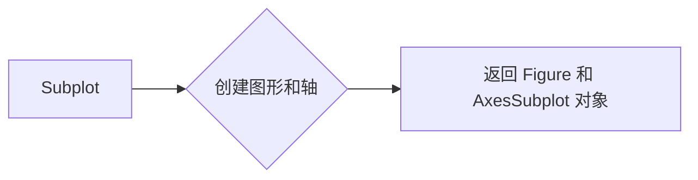
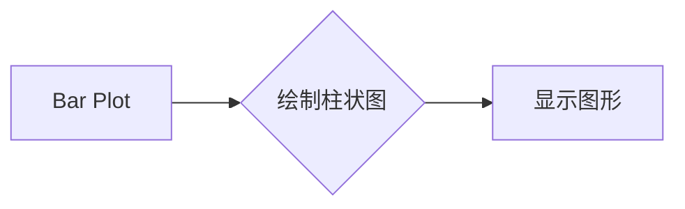
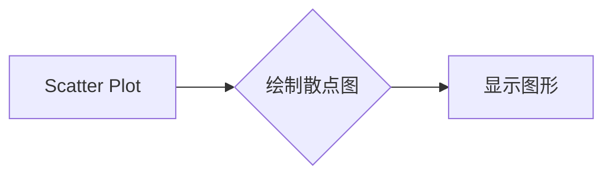
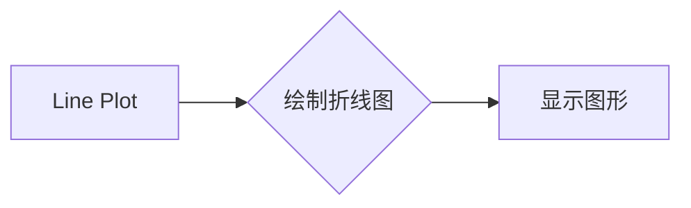
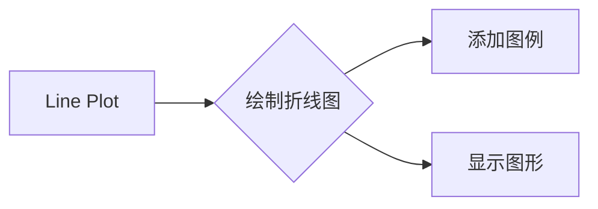
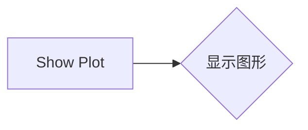
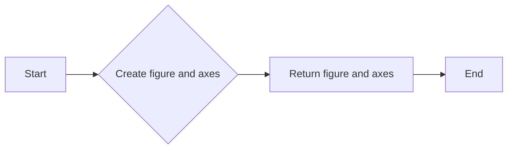
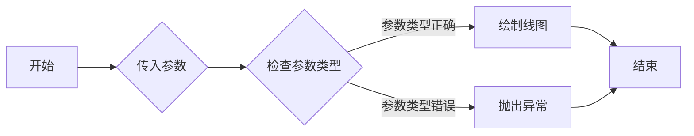

# `matplotlib\galleries\examples\lines_bars_and_markers\categorical_variables.py` 详细设计文档

This code generates plots for categorical data using matplotlib, demonstrating different plotting techniques such as bar, scatter, and line plots.

## 整体流程

```mermaid
graph TD
    A[开始] --> B[导入matplotlib.pyplot]
    B --> C[定义数据字典data和names]
    C --> D[创建子图fig和子轴axs]
    D --> E[在第一个子轴axs[0]上绘制条形图]
    E --> F[在第二个子轴axs[1]上绘制散点图]
    F --> G[在第三个子轴axs[2]上绘制折线图]
    G --> H[设置主标题]
    H --> I[显示图形]
    I --> J[定义cat, dog, activity列表]
    J --> K[创建图形fig和轴ax]
    K --> L[在轴ax上绘制dog和cat活动]
    L --> M[添加图例]
    M --> N[显示图形]
    N --> O[结束]
```

## 类结构

```
matplotlib.pyplot
```

## 全局变量及字段


### `data`
    
A dictionary containing categorical values with keys as names and values as counts.

类型：`dict`
    


### `names`
    
A list of names corresponding to the keys in the 'data' dictionary.

类型：`list`
    


### `values`
    
A list of values corresponding to the counts in the 'data' dictionary.

类型：`list`
    


### `cat`
    
A list of categorical values representing activities for cats.

类型：`list`
    


### `dog`
    
A list of categorical values representing activities for dogs.

类型：`list`
    


### `activity`
    
A list of activities associated with the 'cat' and 'dog' lists.

类型：`list`
    


### `matplotlib.pyplot.fig`
    
The main figure object created by the subplots method.

类型：`matplotlib.figure.Figure`
    


### `matplotlib.pyplot.axs`
    
A list of axes objects created by the subplots method.

类型：`list of matplotlib.axes.Axes`
    


### `matplotlib.pyplot.ax`
    
An individual axes object created by the subplots method.

类型：`matplotlib.axes.Axes`
    
    

## 全局函数及方法


### plt.subplots

`plt.subplots` 是 Matplotlib 库中用于创建一个图形和多个轴（axes）的函数。

参数：

- `1`：`int`，指定要创建的轴的数量。
- `3`：`int`，指定每个子图中的轴的数量。
- `figsize=(9, 3)`：`tuple`，指定图形的大小（宽度和高度）。
- `sharey=True`：`bool`，指定是否共享所有轴的y轴。

返回值：`fig`：`Figure` 对象，包含图形和轴。
         `axs`：`AxesSubplot` 对象数组，包含所有轴。

#### 流程图



#### 带注释源码

```python
fig, axs = plt.subplots(1, 3, figsize=(9, 3), sharey=True)
```

### axs[0].bar

`axs[0].bar` 是 Matplotlib 库中用于绘制柱状图的函数。

参数：

- `names`：`list`，x轴的标签。
- `values`：`list`，y轴的值。

返回值：无。

#### 流程图



#### 带注释源码

```python
axs[0].bar(names, values)
```

### axs[1].scatter

`axs[1].scatter` 是 Matplotlib 库中用于绘制散点图的函数。

参数：

- `names`：`list`，x轴的标签。
- `values`：`list`，y轴的值。

返回值：无。

#### 流程图



#### 带注释源码

```python
axs[1].scatter(names, values)
```

### axs[2].plot

`axs[2].plot` 是 Matplotlib 库中用于绘制折线图的函数。

参数：

- `names`：`list`，x轴的标签。
- `values`：`list`，y轴的值。

返回值：无。

#### 流程图



#### 带注释源码

```python
axs[2].plot(names, values)
```

### ax.plot

`ax.plot` 是 Matplotlib 库中用于绘制折线图的函数。

参数：

- `activity`：`list`，x轴的标签。
- `dog`：`list`，y轴的值。
- `label="dog"`：`str`，图例标签。

返回值：无。

#### 流程图



#### 带注释源码

```python
ax.plot(activity, dog, label="dog")
```

### plt.show

`plt.show` 是 Matplotlib 库中用于显示图形的函数。

参数：无。

返回值：无。

#### 流程图



#### 带注释源码

```python
plt.show()
```


### plt.subplots

`subplots` 是 `matplotlib.pyplot` 模块中的一个函数，用于创建一个图形和多个轴（axes）。

#### 描述

`subplots` 函数用于创建一个图形和多个轴（axes），这些轴可以用于绘制不同的子图。它返回一个图形对象和一个轴对象的元组。

#### 参数：

- `nrows`：整数，指定行数。
- `ncols`：整数，指定列数。
- `sharex`：布尔值，指定是否共享x轴。
- `sharey`：布尔值，指定是否共享y轴。
- `figsize`：元组，指定图形的大小（宽度和高度）。
- `gridspec_kw`：字典，用于指定网格规格的参数。

#### 返回值：

- `fig`：图形对象。
- `axs`：轴对象列表。

#### 流程图



#### 带注释源码

```python
import matplotlib.pyplot as plt

fig, axs = plt.subplots(1, 3, figsize=(9, 3), sharey=True)
```


### matplotlib.pyplot.bar

matplotlib.pyplot.bar 是一个用于绘制柱状图的函数。

参数：

- `names`：`list`，包含用于x轴的标签或名称。
- `values`：`list` 或 `numpy.ndarray`，包含与 `names` 对应的值。

返回值：`matplotlib.axes.Axes`，包含柱状图的轴对象。

#### 流程图

```mermaid
graph LR
A[开始] --> B{调用 bar()}
B --> C[绘制柱状图]
C --> D[结束]
```

#### 带注释源码

```python
import matplotlib.pyplot as plt

# 创建数据
data = {'apple': 10, 'orange': 15, 'lemon': 5, 'lime': 20}
names = list(data.keys())
values = list(data.values())

# 创建图形和轴
fig, axs = plt.subplots(1, 3, figsize=(9, 3), sharey=True)

# 绘制柱状图
axs[0].bar(names, values)
```


### matplotlib.pyplot.scatter

matplotlib.pyplot.scatter 是一个用于在二维坐标系中绘制散点图的函数。

参数：

- `x`：`array_like`，散点图的 x 坐标值。
- `y`：`array_like`，散点图的 y 坐标值。
- `s`：`array_like`，散点的大小，默认为 None，表示所有散点大小相同。
- `c`：`array_like`，散点的颜色，默认为 None，表示所有散点颜色相同。
- `cmap`：`str` 或 `Colormap`，颜色映射，默认为 None，表示使用默认颜色映射。
- `vmin`：`float`，颜色映射的最小值，默认为 None。
- `vmax`：`float`，颜色映射的最大值，默认为 None。
- `alpha`：`float`，散点的透明度，默认为 1.0。
- `edgecolors`：`color`，散点边缘的颜色，默认为 'k'。
- `linewidths`：`float` 或 `array_like`，散点边缘的宽度，默认为 None。
- ` marker`：`str` 或 `path`，散点的标记形状，默认为 'o'。
- ` markersize`：`float` 或 `array_like`，散点的标记大小，默认为 None。

返回值：`AxesSubplot`，散点图所在的轴对象。

#### 流程图

```mermaid
graph LR
A[Start] --> B{Call scatter()}
B --> C[End]
```

#### 带注释源码

```python
import matplotlib.pyplot as plt

# 创建散点图
ax.scatter(x, y, s=s, c=c, cmap=cmap, vmin=vmin, vmax=vmax, alpha=alpha,
           edgecolors=edgecolors, linewidths=linewidths, marker=marker,
           markersize=markersize)

# 绘制散点图
ax.plot(x, y, s=s, c=c, cmap=cmap, vmin=vmin, vmax=vmax, alpha=alpha,
        edgecolors=edgecolors, linewidths=linewidths, marker=marker,
        markersize=markersize)
```


### plot()

matplotlib.pyplot.plot

该函数用于绘制二维数据点，可以用于绘制线图、散点图等。

参数：

- `x`：`array_like`，x轴数据点
- `y`：`array_like`，y轴数据点
- `label`：`str`，图例标签，默认为空字符串

返回值：`Line2D`，绘制的线对象

#### 流程图



#### 带注释源码

```python
import matplotlib.pyplot as plt

def plot(x, y, label=''):
    """
    绘制二维数据点。

    参数:
    x : array_like
        x轴数据点
    y : array_like
        y轴数据点
    label : str
        图例标签，默认为空字符串

    返回值:
    Line2D
        绘制的线对象
    """
    # 检查参数类型
    if not isinstance(x, (list, np.ndarray)) or not isinstance(y, (list, np.ndarray)):
        raise TypeError("x 和 y 必须是列表或numpy数组")

    # 绘制线图
    line = plt.plot(x, y, label=label)
    return line
```


### `suptitle`

`suptitle` 方法用于设置整个图表的标题。

参数：

- `title`：`str`，图表的标题文本。
- `fontweight`：`str`，标题的字体粗细，默认为 'normal'。
- `fontsize`：`int`，标题的字体大小，默认为 12。
- `color`：`str`，标题的颜色，默认为 'black'。
- `horizontalalignment`：`str`，标题的水平对齐方式，默认为 'center'。
- `verticalalignment`：`str`，标题的垂直对齐方式，默认为 'center'。

返回值：`None`，无返回值。

#### 流程图

```mermaid
graph LR
A[Start] --> B{Call suptitle()}
B --> C[End]
```

#### 带注释源码

```python
fig.suptitle('Categorical Plotting')
# 设置整个图表的标题为 'Categorical Plotting'
```


### plt.show()

显示matplotlib图形。

参数：

- 无

返回值：无

#### 流程图

```mermaid
graph LR
A[开始] --> B{调用plt.show()}
B --> C[结束]
```

#### 带注释源码

```
plt.show()  # 显示当前图形，如果没有当前图形，则抛出异常
```


### plt.legend()

`plt.legend()` 是 Matplotlib 库中的一个函数，用于在图表中添加图例。

参数：

- `labels`：`list`，包含图例标签的列表。
- `loc`：`str`，指定图例的位置。
- `bbox_to_anchor`：`tuple`，指定图例的锚点位置。
- `ncol`：`int`，指定图例的列数。
- `mode`：`str`，指定图例的显示模式。
- `title`：`str`，指定图例的标题。
- `frameon`：`bool`，指定是否显示图例的边框。
- `fancybox`：`bool`，指定是否显示图例的边框。
- `shadow`：`bool`，指定是否显示图例的阴影。

返回值：`Legend` 对象，表示图例。

#### 流程图

```mermaid
graph LR
A[Start] --> B{Call plt.legend()}
B --> C[End]
```

#### 带注释源码

```python
ax.plot(activity, dog, label="dog")
ax.plot(activity, cat, label="cat")
ax.legend()  # 添加图例
```


## 关键组件


### 张量索引与惰性加载

张量索引与惰性加载允许在处理大型数据集时，只加载和处理需要的数据部分，从而提高效率。

### 反量化支持

反量化支持使得代码能够处理不同类型的量化数据，提供灵活的量化策略。

### 量化策略

量化策略定义了如何将浮点数转换为固定点数，以减少内存使用和提高计算速度。


## 问题及建议


### 已知问题

-   {问题1}：代码中使用了硬编码的绘图函数和参数，这可能导致代码的可重用性和可维护性较差。如果需要修改绘图类型或参数，需要手动修改代码。
-   {问题2}：代码没有进行错误处理，如果绘图过程中出现异常（例如matplotlib库未安装），程序可能会崩溃。
-   {问题3}：代码没有进行数据验证，如果传入的数据格式不正确，可能会导致绘图错误或程序崩溃。

### 优化建议

-   {建议1}：将绘图函数封装成类或函数，并使用参数化方式，提高代码的可重用性和可维护性。
-   {建议2}：添加异常处理机制，确保程序在遇到错误时能够优雅地处理异常，而不是直接崩溃。
-   {建议3}：在绘图前进行数据验证，确保传入的数据格式正确，避免因数据问题导致的错误。
-   {建议4}：考虑使用更高级的绘图库，如seaborn，它提供了更丰富的绘图功能和更好的可视化效果。
-   {建议5}：如果数据量较大，可以考虑使用更高效的绘图方法，例如使用matplotlib的`scatter`函数的`rasterized=True`参数，以提高绘图速度。
-   {建议6}：对于具有重复值的分类变量，可以考虑使用不同的映射策略，例如使用颜色或形状来区分不同的值。


## 其它


### 设计目标与约束

- 设计目标：实现一个能够处理和可视化分类变量的绘图工具。
- 约束条件：使用matplotlib库进行绘图，确保代码简洁且易于理解。

### 错误处理与异常设计

- 错误处理：在数据输入和绘图过程中，应捕获并处理可能的异常，如matplotlib绘图错误或数据类型不匹配。
- 异常设计：定义明确的异常类，以便于调试和错误追踪。

### 数据流与状态机

- 数据流：数据从输入字典到绘图函数的流动，包括数据清洗、转换和绘图。
- 状态机：描述数据从输入到输出的状态变化，包括数据准备、绘图和展示。

### 外部依赖与接口契约

- 外部依赖：matplotlib库用于绘图。
- 接口契约：定义函数和类的方法签名，确保外部模块可以正确使用。


    