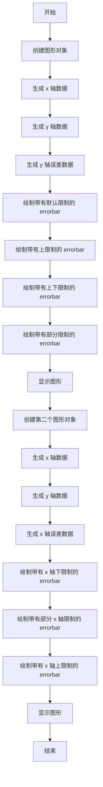
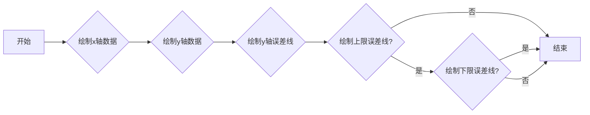
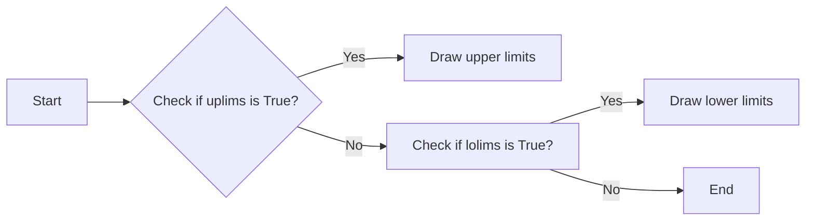
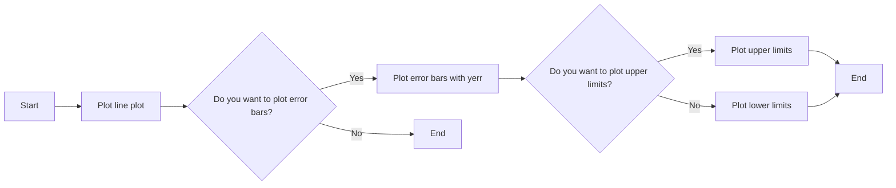
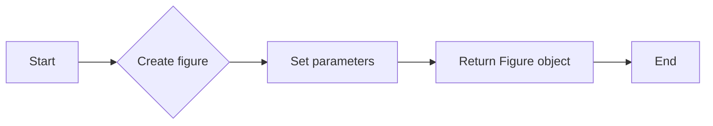
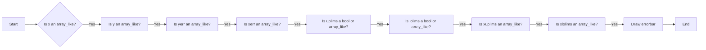
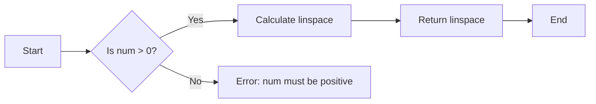
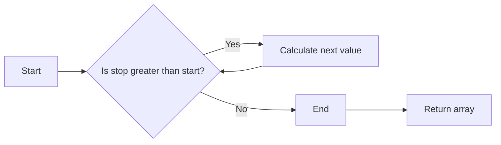

# `matplotlib\galleries\examples\lines_bars_and_markers\errorbar_limits_simple.py` 详细设计文档

This code demonstrates the usage of the `errorbar` function from the `matplotlib.pyplot` module to selectively draw upper and/or lower limit symbols on errorbars in plots.

## 整体流程



## 类结构

```
matplotlib.pyplot (主模块)
├── figure (创建图形对象)
│   ├── arange (生成数组)
│   ├── sin (正弦函数)
│   ├── linspace (生成线性空间数组)
│   ├── errorbar (绘制 errorbar 图形)
│   ├── legend (添加图例)
│   └── show (显示图形)
└── numpy (数值计算库)
    ├── arange (生成数组)
    └── sin (正弦函数)
```

## 全局变量及字段


### `fig`
    
The main figure object where all plots are drawn.

类型：`matplotlib.figure.Figure`
    


### `x`
    
The x-axis data for the plots.

类型：`numpy.ndarray`
    


### `y`
    
The y-axis data for the plots.

类型：`numpy.ndarray`
    


### `yerr`
    
The error values for the y-axis data.

类型：`numpy.ndarray`
    


### `upperlimits`
    
A list of boolean values indicating which upper limits to display.

类型：`list`
    


### `lowerlimits`
    
A list of boolean values indicating which lower limits to display.

类型：`list`
    


### `matplotlib.pyplot.figure.Figure.matplotlib.pyplot.figure`
    
The main figure object where all plots are drawn.

类型：`matplotlib.figure.Figure`
    


### `matplotlib.pyplot.matplotlib.pyplot.arange`
    
Generate evenly spaced values within a given interval.

类型：`numpy.ndarray`
    


### `matplotlib.pyplot.matplotlib.pyplot.sin`
    
Compute the sine of each value in the input array.

类型：`numpy.ndarray`
    


### `matplotlib.pyplot.matplotlib.pyplot.linspace`
    
Return evenly spaced numbers over a specified interval.

类型：`numpy.ndarray`
    


### `matplotlib.pyplot.matplotlib.pyplot.errorbar`
    
Plot errorbar plots.

类型：`None`
    


### `matplotlib.pyplot.matplotlib.pyplot.legend`
    
Add a legend to the plot.

类型：`None`
    


### `matplotlib.pyplot.matplotlib.pyplot.show`
    
Display the figure.

类型：`None`
    


### `numpy.numpy.arange`
    
Generate evenly spaced values within a given interval.

类型：`numpy.ndarray`
    


### `numpy.numpy.sin`
    
Compute the sine of each value in the input array.

类型：`numpy.ndarray`
    
    

## 全局函数及方法


### `matplotlib.pyplot.errorbar`

`matplotlib.pyplot.errorbar` 是一个用于绘制带有误差线的条形图的方法。

参数：

- `x`：`numpy.ndarray`，x轴的数据点。
- `y`：`numpy.ndarray`，y轴的数据点。
- `yerr`：`numpy.ndarray`，y轴的误差线数据。
- `uplims`：`bool` 或 `numpy.ndarray`，是否绘制上限误差线。
- `lolims`：`bool` 或 `numpy.ndarray`，是否绘制下限误差线。
- `xerr`：`numpy.ndarray`，x轴的误差线数据。
- `xlolims`：`bool` 或 `numpy.ndarray`，是否绘制x轴的下限误差线。
- `xuplims`：`numpy.ndarray`，是否绘制x轴的上限误差线。

返回值：`AxesSubplot`，绘制的轴对象。

#### 流程图



#### 带注释源码

```python
import matplotlib.pyplot as plt
import numpy as np

fig = plt.figure()
x = np.arange(10)
y = 2.5 * np.sin(x / 20 * np.pi)
yerr = np.linspace(0.05, 0.2, 10)

plt.errorbar(x, y + 3, yerr=yerr, label='both limits (default)')
# ...
plt.show()
```


### matplotlib.pyplot.errorbar

`matplotlib.pyplot.errorbar` 是一个用于绘制带有误差线的条形图的方法。

参数：

- `x`：`numpy.ndarray`，x轴数据点。
- `y`：`numpy.ndarray`，y轴数据点。
- `yerr`：`numpy.ndarray`，y轴误差线数据。
- `uplims`：`bool` 或 `numpy.ndarray`，是否绘制上限。
- `lolims`：`bool` 或 `numpy.ndarray`，是否绘制下限。
- `xerr`：`numpy.ndarray`，x轴误差线数据。
- `xlolims`：`bool` 或 `numpy.ndarray`，是否绘制x轴下限。
- `xuplims`：`numpy.ndarray`，是否绘制x轴上限。

返回值：`Line2D` 对象，绘制的线。

#### 流程图



#### 带注释源码

```python
import matplotlib.pyplot as plt
import numpy as np

fig = plt.figure()
x = np.arange(10)
y = 2.5 * np.sin(x / 20 * np.pi)
yerr = np.linspace(0.05, 0.2, 10)

plt.errorbar(x, y + 3, yerr=yerr, label='both limits (default)')
# ...
plt.errorbar(x, y, yerr=yerr, uplims=upperlimits, lolims=lowerlimits,
             label='subsets of uplims and lolims')
# ...
```


### matplotlib.pyplot.errorbar

matplotlib.pyplot.errorbar is a function used to plot error bars on a line plot. It allows for the plotting of both upper and lower error limits on the y-axis or x-axis.

参数：

- `x`：`numpy.ndarray`，x轴数据点
- `y`：`numpy.ndarray`，y轴数据点
- `yerr`：`numpy.ndarray`，y轴误差值
- `xerr`：`numpy.ndarray`，x轴误差值（可选）
- `uplims`：`bool` 或 `numpy.ndarray`，是否绘制上误差线，或上误差线数据（可选）
- `lolims`：`bool` 或 `numpy.ndarray`，是否绘制下误差线，或下误差线数据（可选）
- `xuplims`：`numpy.ndarray`，x轴上误差线数据（可选）
- `xlolims`：`numpy.ndarray`，x轴下误差线数据（可选）
- `label`：`str`，图例标签（可选）

返回值：`Line2D` 对象，表示绘制的线

#### 流程图



#### 带注释源码

```python
import matplotlib.pyplot as plt
import numpy as np

fig = plt.figure()
x = np.arange(10)
y = 2.5 * np.sin(x / 20 * np.pi)
yerr = np.linspace(0.05, 0.2, 10)

plt.errorbar(x, y + 3, yerr=yerr, label='both limits (default)')
# ... (rest of the code)
plt.show()
```


### `matplotlib.pyplot.figure`

`matplotlib.pyplot.figure` 是一个用于创建图形窗口的函数。

参数：

- `figsize`：`tuple`，图形的宽度和高度，默认为 (6.4, 4.8)。
- `dpi`：`int`，图形的分辨率，默认为 100。
- `facecolor`：`color`，图形窗口的背景颜色，默认为白色。
- `frameon`：`bool`，是否显示图形窗口的边框，默认为 True。
- `num`：`int`，图形窗口的编号，默认为 1。
- `figclass`：`class`，图形窗口的类，默认为 `matplotlib.figure.Figure`。

返回值：`Figure` 对象，表示创建的图形窗口。

#### 流程图



#### 带注释源码

```python
import matplotlib.pyplot as plt

fig = plt.figure(figsize=(6.4, 4.8), dpi=100, facecolor='white', frameon=True, num=1, figclass=plt.figure.Figure)
```


### matplotlib.pyplot.errorbar

matplotlib.pyplot.errorbar 是一个用于绘制带有误差线的条形图的方法。

参数：

- `x`：`array_like`，x轴数据点。
- `y`：`array_like`，y轴数据点。
- `yerr`：`array_like`，y轴误差线数据点。
- `xerr`：`array_like`，x轴误差线数据点。
- `uplims`：`bool` 或 `array_like`，是否绘制上限。
- `lolims`：`bool` 或 `array_like`，是否绘制下限。
- `xuplims`：`array_like`，x轴上限。
- `xlolims`：`array_like`，x轴下限。
- `label`：`str`，图例标签。

返回值：`Line2D` 对象，绘制的线。

#### 流程图



#### 带注释源码

```python
import matplotlib.pyplot as plt
import numpy as np

fig = plt.figure()
x = np.arange(10)
y = 2.5 * np.sin(x / 20 * np.pi)
yerr = np.linspace(0.05, 0.2, 10)

plt.errorbar(x, y + 3, yerr=yerr, label='both limits (default)')
# ...
plt.errorbar(x + 1.2, y, xerr=0.1, xuplims=True, label='xuplims=True')
# ...
plt.legend()
plt.show()
```


### matplotlib.pyplot.sin

matplotlib.pyplot.sin 是一个用于计算正弦值的函数。

参数：

- `x`：`numpy.ndarray` 或 `float`，输入值，可以是单个数值或数组。

返回值：`numpy.ndarray` 或 `float`，正弦值数组或单个正弦值。

#### 流程图

```mermaid
graph LR
A[Input] --> B{Is x a numpy.ndarray or float?}
B -- Yes --> C[Calculate sin(x)]
B -- No --> D[Error: Invalid input type]
C --> E[Output sin(x)]
```

#### 带注释源码

```python
import numpy as np

def sin(x):
    """
    Calculate the sine of x.

    Parameters:
    - x: numpy.ndarray or float, the input value.

    Returns:
    - numpy.ndarray or float, the sine of x.
    """
    return np.sin(x)
```


### matplotlib.pyplot.linspace

matplotlib.pyplot.linspace 是一个用于生成线性间隔数列的函数。

参数：

- `start`：`float`，线性间隔数列的起始值。
- `stop`：`float`，线性间隔数列的结束值。
- `num`：`int`，生成的线性间隔数列中的点数（不包括结束值）。

返回值：`numpy.ndarray`，包含线性间隔数列的数组。

#### 流程图



#### 带注释源码

```python
import numpy as np

def linspace(start, stop, num=50, endpoint=True, dtype=None):
    """
    Return evenly spaced numbers over a specified interval.

    Parameters
    ----------
    start : float
        The starting value of the sequence.
    stop : float
        The end value of the sequence, exclusive.
    num : int, optional
        Number of samples to generate. Default is 50.
    endpoint : bool, optional
        If True, include stop in the output sequence. Default is True.
    dtype : dtype, optional
        The type of the output array. If dtype is None, infer the type from the
        input values.

    Returns
    -------
    out : ndarray
        Array of evenly spaced values.

    Raises
    ------
    ValueError
        If num is not positive.

    Examples
    --------
    >>> linspace(0, 1, 5)
    array([0.  0.25 0.5  0.75 1. ])
    >>> linspace(0, 1, 5, endpoint=False)
    array([0.  0.25 0.5  0.75])
    """
    if num <= 0:
        raise ValueError("num must be positive")
    return np.linspace(start, stop, num, endpoint, dtype)
```


### matplotlib.pyplot.errorbar

matplotlib.pyplot.errorbar 是一个用于绘制带有误差线的条形图的方法。

参数：

- `x`：`array_like`，x轴数据点。
- `y`：`array_like`，y轴数据点。
- `yerr`：`array_like`，y轴误差线数据点。
- `xerr`：`array_like`，x轴误差线数据点。
- `uplims`：`bool` 或 `array_like`，是否绘制上限。
- `lolims`：`bool` 或 `array_like`，是否绘制下限。
- `xuplims`：`array_like`，x轴上限。
- `xlolims`：`array_like`，x轴下限。
- `label`：`str`，图例标签。

返回值：`Line2D` 对象，绘制的线对象。

#### 流程图


#### 带注释源码

```python
import matplotlib.pyplot as plt
import numpy as np

fig = plt.figure()
x = np.arange(10)
y = 2.5 * np.sin(x / 20 * np.pi)
yerr = np.linspace(0.05, 0.2, 10)

plt.errorbar(x, y + 3, yerr=yerr, label='both limits (default)')
# ...
plt.errorbar(x + 1.2, y, xerr=0.1, xuplims=True, label='xuplims=True')
# ...
plt.legend()
plt.show()
```


### `matplotlib.pyplot.legend`

`matplotlib.pyplot.legend` 是一个用于在matplotlib图形中添加图例的函数。

参数：

- `loc`：`str`，指定图例的位置。默认为 'best'，它会自动选择最佳位置。
- `bbox_to_anchor`：`tuple`，指定图例的锚点位置。默认为 None，表示使用自动位置。
- `ncol`：`int`，指定图例的列数。默认为 1。
- `mode`：`str`，指定图例的显示模式。默认为 'expand'。
- `frameon`：`bool`，指定是否显示图例的边框。默认为 True。
- `fancybox`：`bool`，指定是否显示图例的边框为圆角。默认为 False。
- `shadow`：`bool`，指定是否显示图例的阴影。默认为 False。
- `title`：`str`，指定图例的标题。默认为 None。

返回值：`matplotlib.legend.Legend`，返回创建的图例对象。

#### 流程图

```mermaid
graph LR
A[Start] --> B{Call matplotlib.pyplot.legend()}
B --> C[End]
```

#### 带注释源码

```python
plt.legend(loc='lower right')
```

在这个例子中，`plt.legend(loc='lower right')` 调用会创建一个图例，并将其放置在图形的右下角。


### matplotlib.pyplot.show

matplotlib.pyplot.show 是一个全局函数，用于显示当前图形。

参数：

- 无

返回值：无

#### 流程图

```mermaid
graph LR
A[Start] --> B[Call plt.show()]
B --> C[End]
```

#### 带注释源码

```python
# 带注释的源码
plt.show()  # 显示当前图形
```


### numpy.arange

`numpy.arange` 是一个用于生成等差数列的函数。

参数：

- `start`：`int`，等差数列的起始值。
- `stop`：`int`，等差数列的结束值（不包括此值）。
- `step`：`int`，等差数列的公差，默认为 1。

返回值：`numpy.ndarray`，一个包含等差数列的数组。

#### 流程图



#### 带注释源码

```python
def arange(start, stop=None, step=1):
    """
    Generate an array of evenly spaced values within a given interval.

    Parameters
    ----------
    start : int
        The starting value of the sequence.
    stop : int, optional
        The end value of the sequence, exclusive.
    step : int, optional
        The spacing between values.

    Returns
    -------
    numpy.ndarray
        An array with evenly spaced values.

    Examples
    --------
    >>> np.arange(0, 10, 2)
    array([0, 2, 4, 6, 8])
    >>> np.arange(0, 10)
    array([0, 1, 2, 3, 4, 5, 6, 7, 8, 9])
    """
    if stop is None:
        stop = start
        start = 0

    if step == 0:
        raise ValueError("step cannot be zero")

    array = np.empty((stop - start) // step, dtype=int)
    array.fill(start)
    for i in range(1, len(array)):
        array[i] = array[i - 1] + step

    return array
```


### numpy.sin

`numpy.sin` 是一个数学函数，用于计算输入数值的正弦值。

参数：

- `x`：`numpy.ndarray` 或 `float`，输入数值，可以是单个数值或数组。

返回值：`numpy.ndarray` 或 `float`，输入数值的正弦值。

#### 流程图

```mermaid
graph LR
A[Start] --> B{Is x a numpy.ndarray or float?}
B -- Yes --> C[Calculate sin(x)]
B -- No --> D[Error: Invalid input type]
C --> E[End]
D --> E
```

#### 带注释源码

```python
import numpy as np

def calculate_sin(x):
    """
    Calculate the sine of a number or an array of numbers.

    Parameters:
    - x: numpy.ndarray or float, the input number or array of numbers.

    Returns:
    - numpy.ndarray or float, the sine of the input number or array of numbers.
    """
    return np.sin(x)
```


## 关键组件


### 张量索引与惰性加载

张量索引与惰性加载允许在绘制错误条时仅对需要显示的上下限进行计算和绘制，从而提高效率。

### 反量化支持

反量化支持使得错误条可以处理非整数索引，允许更灵活的数据表示。

### 量化策略

量化策略定义了如何将浮点数索引转换为整数索引，以适应绘图库的要求。


## 问题及建议


### 已知问题

-   **代码重复性**：代码中多次使用相同的 `x` 和 `y` 数据，以及相同的 `yerr`，这可能导致维护困难。建议使用函数或类来封装这些重复的代码。
-   **全局变量**：代码中使用了全局变量 `fig`，这可能导致代码难以理解和维护。建议将 `fig` 作为参数传递给函数。
-   **错误处理**：代码中没有错误处理机制，如果出现异常（例如，matplotlib版本不兼容），程序可能会崩溃。建议添加异常处理来提高代码的健壮性。

### 优化建议

-   **代码重构**：将重复的代码封装成函数或类，减少代码重复，提高可维护性。
-   **局部变量**：将 `fig` 作为参数传递给函数，避免使用全局变量。
-   **异常处理**：添加异常处理来捕获和处理可能出现的错误，例如检查matplotlib版本，并在出现错误时提供有用的反馈。
-   **代码注释**：添加更多的注释来解释代码的功能和逻辑，提高代码的可读性。
-   **单元测试**：编写单元测试来验证代码的功能，确保代码在修改后仍然正确工作。


## 其它


### 设计目标与约束

- 设计目标：实现一个能够根据参数选择性地绘制误差棒的上下限符号的功能。
- 约束条件：必须使用matplotlib库进行绘图，且代码应尽可能简洁。

### 错误处理与异常设计

- 错误处理：代码中应包含异常处理机制，以处理可能出现的matplotlib绘图错误或numpy数组操作错误。
- 异常设计：定义自定义异常类，以提供更具体的错误信息。

### 数据流与状态机

- 数据流：数据从numpy数组生成，通过matplotlib的errorbar函数进行绘图。
- 状态机：代码中没有明确的状态机，但绘图过程可以视为一个状态转换过程。

### 外部依赖与接口契约

- 外部依赖：代码依赖于matplotlib和numpy库。
- 接口契约：matplotlib的errorbar函数提供了绘图接口，需要遵循其参数规范。


    