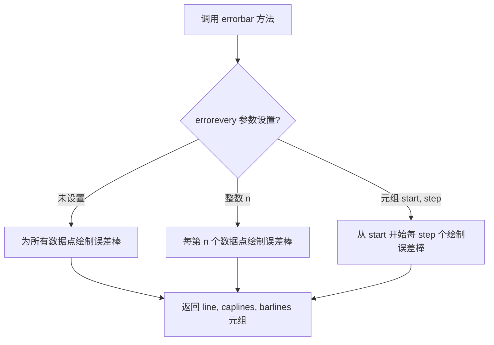
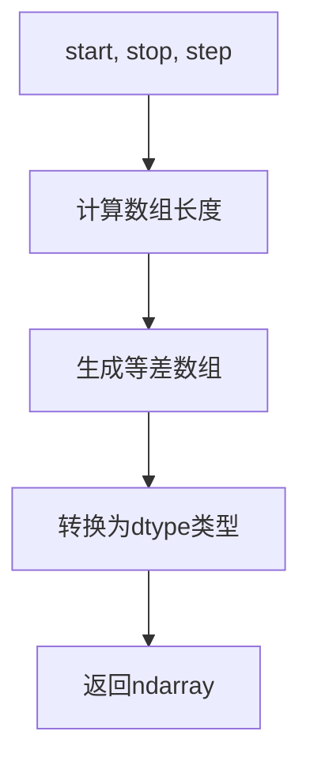

# `matplotlib\galleries\examples\lines_bars_and_markers\errorbar_subsample.py` 详细设计文档

这是一个matplotlib可视化示例代码，演示如何使用errorbar的errorevery参数对错误条进行子采样显示，避免在数据点密集时出现视觉拥挤的问题。

## 整体流程

```mermaid
graph TD
    A[开始] --> B[导入matplotlib.pyplot和numpy]
B --> C[生成x轴数据: np.arange(0.1, 4, 0.1)]
C --> D[生成y数据: y1=exp(-x), y2=exp(-0.5x)]
D --> E[生成误差数据: y1err, y2err]
E --> F[创建3个子图: fig, (ax0, ax1, ax2)]
F --> G[子图1: 显示所有错误条]
F --> H[子图2: 每6个显示一个错误条 errorevery=6]
F --> I[子图3: 第二系列从第3个开始每6个显示 errorevery=(0,6) 和 (3,6)]
G --> J[设置标题和显示]
H --> J
I --> J
```

## 类结构

```
本文件为脚本文件，无类层次结构
采用面向过程编程方式
使用matplotlib.pyplot和numpy作为主要依赖
```

## 全局变量及字段


### `x`
    
x轴数据数组，范围0.1到4，步长0.1

类型：`numpy.ndarray`
    


### `y1`
    
指数衰减数据exp(-1.0*x)

类型：`numpy.ndarray`
    


### `y2`
    
指数衰减数据exp(-0.5*x)

类型：`numpy.ndarray`
    


### `y1err`
    
y1的误差值，0.1+0.1*sqrt(x)

类型：`numpy.ndarray`
    


### `y2err`
    
y2的误差值，0.1+0.1*sqrt(x/2)

类型：`numpy.ndarray`
    


### `fig`
    
整个图形对象

类型：`matplotlib.figure.Figure`
    


### `ax0`
    
第一个子图 axes 对象

类型：`matplotlib.axes.Axes`
    


### `ax1`
    
第二个子图 axes 对象

类型：`matplotlib.axes.Axes`
    


### `ax2`
    
第三个子图 axes 对象

类型：`matplotlib.axes.Axes`
    


    

## 全局函数及方法


### `Axes.errorbar`

该方法用于绘制带误差棒的线图，其中 `errorevery` 参数可控制误差棒的显示频率，实现数据点的稀疏采样，避免过多误差棒导致的视觉混乱。

参数：

- `x`：`array-like`，X轴数据坐标
- `y`：`array-like`，Y轴数据坐标
- `yerr`：`scalar`, `array-like`, `shape (N,)` 或 `shape (2, N)`，误差棒的大小，可为对称或非对称误差
- `xerr`：`scalar`, `array-like`, `shape (N,)` 或 `shape (2, N)`，可选，X轴误差棒大小
- `errorevery`：可选，指定显示误差棒的数据点，可为整数（每N个显示一个）或元组 (start, step)（从start开始每step个显示一个）
- `fmt`：可选，格式化字符串，用于设置线型和标记
- `ecolor`：可选，误差棒线条颜色
- `elinewidth`：可选，误差棒线条宽度
- `capsize`：可选，误差棒端点（caps）的大小
- `capthick`：可选，误差棒端点线条厚度
- `barsabove`：可选，布尔值，是否在数据点上方显示误差棒
- `lolims`, `uplims`, `xlolims`, `xuplims`：可选，布尔值数组，指定哪些点只显示上限或下限
- `err_kw`：可选，关键字参数字典，用于传递给误差棒集合的设置
- `**kwargs`：其他关键字参数传递给 `Line2D` 属性设置

返回值：`tuple` of `(line, caplines, barlines)`，分别包含线对象、端点对象和误差棒对象

#### 流程图



#### 带注释源码

```python
# 示例代码展示 errorbar 的 errorevery 参数用法

import matplotlib.pyplot as plt
import numpy as np

# 生成示例数据
x = np.arange(0.1, 4, 0.1)  # X轴数据点
y1 = np.exp(-1.0 * x)       # 第一个Y序列（指数衰减）
y2 = np.exp(-0.5 * x)       # 第二个Y序列（较慢指数衰减）

# 生成误差值（与x的平方根成正比）
y1err = 0.1 + 0.1 * np.sqrt(x)
y2err = 0.1 + 0.1 * np.sqrt(x/2)

# 创建1行3列的子图布局
fig, (ax0, ax1, ax2) = plt.subplots(nrows=1, ncols=3, sharex=True,
                                    figsize=(12, 6))

# 子图1：显示所有误差棒
ax0.set_title('all errorbars')
ax0.errorbar(x, y1, yerr=y1err)      # 默认显示所有点的误差棒
ax0.errorbar(x, y2, yerr=y2err)

# 子图2：每6个点显示一个误差棒
ax1.set_title('only every 6th errorbar')
ax1.errorbar(x, y1, yerr=y1err, errorevery=6)  # 整数参数：每6个点显示
ax1.errorbar(x, y2, yerr=y2err, errorevery=6)

# 子图3：第二个序列从第3个点开始每6个点显示
ax2.set_title('second series shifted by 3')
ax2.errorbar(x, y1, yerr=y1err, errorevery=(0, 6))  # 元组参数：从0开始每6个
ax2.errorbar(x, y2, yerr=y2err, errorevery=(3, 6))   # 元组参数：从3开始每6个

# 设置总标题
fig.suptitle('Errorbar subsampling')
plt.show()
```

---

### `numpy.arange`

生成指定范围内的等差数组。

参数：

- `start`：数值，可选，序列起始值（默认0）
- `stop`：数值，序列结束值（不包含）
- `step`：数值，可选，步长（默认1）
- `dtype`：dtype，可选，输出数组数据类型

返回值：`ndarray`，生成的数组

#### 流程图



---

### `numpy.exp`

计算数组中所有元素的指数函数值。

参数：

- `x`：array_like，输入数组
- `out`：ndarray，可选，指定输出数组
- `where`：array_like，可选，条件广播
- `**kwargs`：其他参数

返回值：`ndarray`，e的x次方组成的数组

---

### `numpy.sqrt`

计算数组中所有元素的平方根。

参数：

- `x`：array_like，输入数组
- `out`：ndarray，可选，指定输出数组
- `where`：array_like，可选，条件广播

返回值：`ndarray`，平方根数组

---

### `matplotlib.pyplot.subplots`

创建一个 figure 和一组子图。

参数：

- `nrows`：int，可选，行数（默认1）
- `ncols`：int，可选，列数（默认1）
- `sharex`：bool或str，可选，是否共享X轴
- `sharey`：bool或str，可选，是否共享Y轴
- `squeeze`：bool，可选，是否压缩返回的轴数组维度
- `width_ratios`：array-like，可选，列宽度比例
- `height_ratios`：array-like，可选，行高度比例
- `**kwargs`：其他关键字参数

返回值：`tuple` of `(fig, axes)`，Figure对象和Axes对象（或数组）

---

### 关键组件信息

| 组件名称 | 一句话描述 |
|---------|-----------|
| `errorevery` 参数 | 控制误差棒显示频率的参数，支持整数和元组形式 |
| `errorbar` 方法 | Matplotlib中绘制带误差棒线图的核心方法 |
| Axes 对象 | Matplotlib中用于绑制图形的主对象 |

---

### 潜在的技术债务或优化空间

1. **示例代码缺乏交互性**：可以添加滑块控件动态调整 `errorevery` 参数，增强演示效果
2. **硬编码的图表参数**：标题、颜色、尺寸等可提取为配置参数
3. **注释可更详细**：每个子图的用途可以添加更详细的中文说明

---

### 其它项目

**设计目标与约束**：
- 演示 `errorevery` 参数的三种用法（不设置、整数、元组）
- 保持代码简洁，适合 beginner 级别学习

**错误处理与异常设计**：
- `errorevery` 参数类型错误时会抛出 TypeError
- 数据维度不匹配时会产生 ValueError

**数据流与状态机**：
- 数据流：numpy生成数据 → errorbar处理数据 → 渲染到Axes → 显示Figure
- 无复杂状态机设计

**外部依赖与接口契约**：
- 依赖：matplotlib、numpy
- 接口契约：`errorbar` 返回包含 Line2D、LineCollection 的元组


## 关键组件


### 错误棒子采样（Errorbar Subsampling）

该代码展示了matplotlib中errorbar函数的errorevery参数用法，用于在数据点较多时仅在部分数据点上绘制误差棒，以提高图表可读性。

### errorevery参数

errorevery参数控制误差棒的显示频率，支持两种模式：1) 整数模式（如6）表示每隔6个数据点显示一个误差棒；2) 元组模式（如(0, 6)）表示从第0个数据点开始，每隔6个显示一个误差棒；(3, 6)表示从第3个数据点开始每隔6个显示一个。

### 多子图对比布局

代码创建了三个并排的子图，分别展示：全部误差棒、每隔6个显示误差棒、第二个序列从第3个点开始每隔6个显示误差棒，用于对比不同子采样策略的效果。

### 数值数据生成

使用numpy生成指数衰减的x、y数据以及随x变化的误差值（y1err和y2err），模拟真实科学计算场景中的误差棒数据。


## 问题及建议


### 已知问题

- 硬编码的魔法数字和参数值（如`0.1, 4, 0.1`、`errorevery=6`等）分散在代码各处，缺乏可配置性，降低了代码的可维护性和可复用性
- 数据生成逻辑存在重复（`y1err`和`y2err`的生成代码结构相似），未提取为可复用的函数，导致代码冗余
- 缺少输入数据的验证逻辑（如未检查x、y数组长度一致性），可能导致运行时错误或隐式异常
- 使用了`sharex=True`但未处理子图间的x轴标签显示，可能导致标签重叠或显示不完整（虽然这不是长期运行的应用）
- 缺少函数级别的文档字符串和类型注解，降低了代码的可读性和可维护性

### 优化建议

- 将所有硬编码的配置参数（数据范围、误差系数、子采样参数等）提取到文件顶部的配置常量区域，便于统一管理和调整
- 将误差数据的生成逻辑封装为独立的函数，接收参数并返回计算结果，消除重复代码
- 在数据生成后添加简单的验证检查（如数组长度匹配、正值检查等），提供明确的错误信息
- 考虑使用`set_xlabel`在底部子图统一设置x轴标签，并使用`label_outer()`方法自动隐藏内部子图的刻度标签，提升图表美观度
- 为主要逻辑代码块添加详细的注释和文档字符串，说明每个部分的目的和参数含义
- 如果此代码会被多次调用或集成到更大项目中，建议将图表创建逻辑封装为函数或类，接受数据参数并返回figure对象，提高复用性

## 其它


### 设计目标与约束

本示例旨在演示matplotlib中`Axes.errorbar`方法的`errorevery`参数功能，用于在数据点较多时减少错误条的可视化密度，提高图表可读性。设计目标包括：支持三种子采样模式（全量、指定间隔、偏移间隔），保持与标准errorbar API的兼容性，并提供清晰的视觉反馈。约束条件为数据点需为数值型数组，误差值需与数据点一一对应。

### 错误处理与异常设计

本示例未包含显式的错误处理代码。在实际API设计中，当`errorevery`参数类型不匹配（需为整数或元组）时应抛出TypeError；当`errorevery`值超出数据点范围时应产生警告或自动裁剪。数值计算中的NaN值应作为缺失数据处理，不绘制对应的错误条。

### 性能考虑

当数据点数量较大（如超过10000个）时，绘制所有错误条会影响渲染性能。`errorevery`参数本质上是客户端的性能优化方案。后续可考虑在C/C++层面实现底层渲染优化，或提供离屏渲染选项。

### 外部依赖与接口契约

本代码依赖numpy（数值计算）和matplotlib（可视化）两个核心库。`errorbar`方法的接口契约包括：x、y为必需的位置参数，yerr为可选的误差数据，errorevery为可选的采样控制参数。返回值包含数据容器（LineContainer）和错误条容器（ErrorbarLine）。

### 可测试性设计

测试用例应覆盖：整数参数（如errorevery=6）、元组参数（如errorevery=(0, 6)）、边界条件（errorevery=1等同于全显示）、空数据输入、NaN值处理、负数处理等场景。推荐使用pytest框架编写单元测试。

### 版本兼容性

本示例基于matplotlib 3.x版本设计。`errorevery`参数在matplotlib 3.1.0版本引入。文档应注明最低依赖版本要求，确保API在目标环境中可用。

### 许可证和版权

本代码为matplotlib项目的一部分，遵循matplotlib的BSD-style许可证。代码中包含的文档字符串遵循matplotlib的文档规范。


    