# `matplotlib\galleries\examples\lines_bars_and_markers\eventcollection_demo.py` 详细设计文档

该代码是一个matplotlib示例程序，演示了如何使用EventCollection在图表上标记数据点的位置。它生成随机数据绘制两条曲线，并分别在x轴和y轴方向上用EventCollection标记各曲线的数据点位置。

## 整体流程

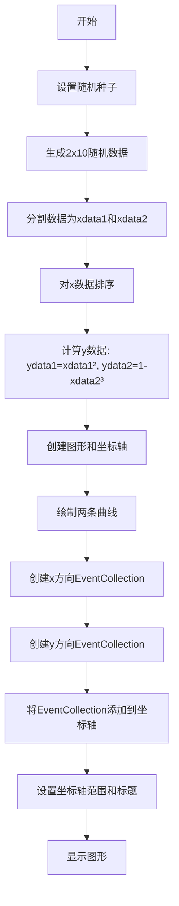

## 类结构

```
Python脚本 (无自定义类)
├── 导入模块
│   ├── matplotlib.pyplot (plt)
│   ├── numpy (np)
│   └── matplotlib.collections.EventCollection
└── 主执行流程
```

## 全局变量及字段


### `xdata`
    
2x10随机数据数组，用于生成两条曲线的数据

类型：`numpy.ndarray`
    


### `xdata1`
    
第一组x数据，已排序用于绘制平滑曲线

类型：`numpy.ndarray`
    


### `xdata2`
    
第二组x数据，已排序用于绘制平滑曲线

类型：`numpy.ndarray`
    


### `ydata1`
    
第一组y数据，由xdata1平方计算得出

类型：`numpy.ndarray`
    


### `ydata2`
    
第二组y数据，由1-xdata2的立方计算得出

类型：`numpy.ndarray`
    


### `fig`
    
Matplotlib图形对象，用于承载所有绘图元素

类型：`matplotlib.figure.Figure`
    


### `ax`
    
Matplotlib坐标轴对象，用于添加曲线和事件集合

类型：`matplotlib.axes.Axes`
    


### `xevents1`
    
第一组x方向事件集合，用于标记xdata1数据点位置

类型：`EventCollection`
    


### `xevents2`
    
第二组x方向事件集合，用于标记xdata2数据点位置

类型：`EventCollection`
    


### `yevents1`
    
第一组y方向事件集合，用于标记ydata1数据点位置

类型：`EventCollection`
    


### `yevents2`
    
第二组y方向事件集合，用于标记ydata2数据点位置

类型：`EventCollection`
    


### `matplotlib.collections.EventCollection.EventCollection`
    
Matplotlib事件集合类，用于在图表上标记数据点的位置，无自定义类字段和方法

类型：`第三方库类`
    
    

## 全局函数及方法


### `np.random.random`

该函数是 NumPy 库中的随机数生成函数，用于生成指定形状的随机浮点数数组，数值范围在 [0, 1) 区间内，常用于科学计算和数据分析中的模拟、采样等场景。

参数：

-  `size`：`int 或 tuple of ints`，可选参数，指定输出数组的形状。如果为 `None`，则返回一个浮点数；如果为整数或元组，则返回相应形状的数组。

返回值：`ndarray of float`，返回 `[0, 1)` 区间内的随机浮点数数组，形状由 `size` 参数指定。

#### 流程图

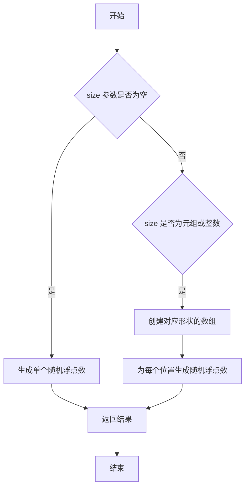

#### 带注释源码

```python
# numpy.random.random 源码分析
# 位置：numpy/random/mtrand.pyx (伪代码表示)

def random(self, size=None):
    """
    生成 [0, 1) 区间内的随机浮点数
    
    参数:
        size : int or tuple of ints, optional
            输出数组的形状。例如，size=(2, 3) 会生成 2x3 的数组。
            默认为 None，返回单个浮点数。
    
    返回值:
        out : ndarray or float
            返回值类型取决于 size 参数。
            - size=None: 返回单个 float
            - size=int: 返回一维数组
            - size=tuple: 返回对应维度的数组
    """
    
    # 内部实现逻辑（简化版）
    # 1. 检查 size 参数的有效性
    if size is None:
        # 2. 如果没有指定 size，生成单个随机数
        return self.random_sample()
    else:
        # 3. 如果指定了 size，使用 random_sample 生成数组
        return self.random_sample(size)
```

```python
# 在示例代码中的实际使用
xdata = np.random.random([2, 10])

# 参数说明：
# - [2, 10] 是一个列表，转换为 size=(2, 10) 元组
# - 含义：生成 2 行 10 列的二维随机数组
# - 数组中每个元素的取值范围是 [0, 1)
# - 由于之前设置了 np.random.seed(19680801)，每次运行生成相同的随机数
```


# np.random.seed 函数详细设计文档

### `np.random.seed`

设置NumPy随机数生成器的种子，以确保生成的可重复性。通过传入特定的种子值，使得后续的随机数生成序列保持一致，这对于调试、测试和结果复现至关重要。

参数：

- `seed`：`int` 或 `None`，随机数生成器的种子值。通常使用整数（如19680801）来确保可重复性；设为None时，每次调用会使用系统时间作为种子。

返回值：`None`，该函数无返回值，直接修改NumPy的全局随机状态。

#### 流程图

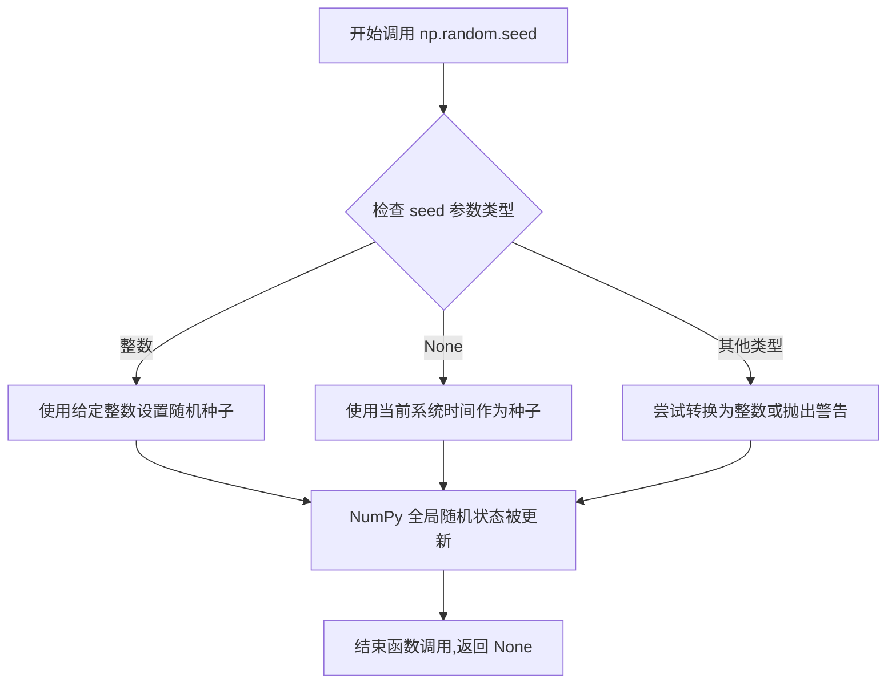

#### 带注释源码

```python
# 设置随机种子以确保可重复性
# seed: 整数类型的种子值，19680801 是一个常见的调试用种子值
np.random.seed(19680801)

# 注释：此调用确保后续的 np.random.random() 调用
# 生成相同的随机数序列，这在调试和复现结果时非常重要
```


### `numpy.ndarray.sort`

对数组进行原地排序，返回排序后的数组（实际上是修改原数组）。

参数：

-  `self`：`numpy.ndarray`，调用 sort 方法的数组对象（隐式参数，无需显式传递）
-  `axis`：可选参数，`int` 或 `None`，指定排序的轴。默认为 -1（最后一个轴）
-  `kind`：可选参数，`{'quicksort', 'mergesort', 'heapsort', 'stable'}`，指定排序算法，默认为 'quicksort'
-  `order`：可选参数，`str` 或 `list of str`，当数组包含结构化数据类型时，指定排序字段

返回值：`None`，该方法为原地操作，不返回新数组，直接修改原数组。

#### 流程图

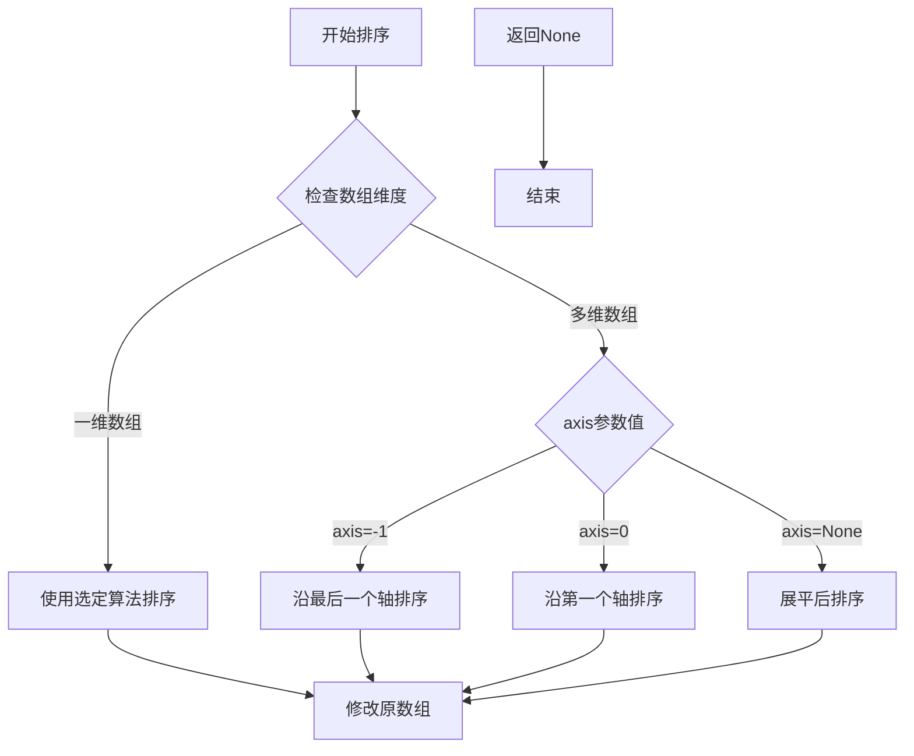

#### 带注释源码

```python
# 在代码中的实际调用方式：
xdata1.sort()  # 对 xdata1 数组进行原地升序排序
xdata2.sort()  # 对 xdata2 数组进行原地升序排序

# 等效的 numpy 函数调用方式（不推荐用于原地操作）：
# np.sort(xdata1)  # 返回排序后的副本，不修改原数组
```


### `plt.figure`

`plt.figure` 是 matplotlib.pyplot 模块中的函数，用于创建一个新的图形窗口或图形对象（Figure），作为后续绑图操作的基础容器。

参数：

- `num`：整数或字符串，可选，默认值为 `None`。图形的标识符，如果是整数，则表示图形窗口的编号；如果是字符串，则作为窗口标题的默认值。
- `figsize`：tuple of floats，可选，默认值为 `None`。图形的宽度和高度，单位为英寸，格式为 `(width, height)`。
- `dpi`：整数，可选，默认值为 `None`。图形的分辨率（每英寸点数）。
- `facecolor`：颜色字符串或 RGBA 元组，可选，默认值为 `'w'`（白色）。图形背景颜色。
- `edgecolor`：颜色字符串或 RGBA 元组，可选，默认值为 `'w'`（白色）。图形边框颜色。
- `frameon`：布尔值，可选，默认值为 `True`。是否显示图形边框。
- `FigureClass`：类，可选，默认值为 `matplotlib.figure.Figure`。自定义 Figure 类。
- `clear`：布尔值，可选，默认值为 `False`。如果为 `True`，则在创建图形前清除现有图形。
- `**kwargs`：其他关键字参数，将传递给 `Figure` 类的构造函数。

返回值：`matplotlib.figure.Figure`，新创建的图形对象。

#### 流程图

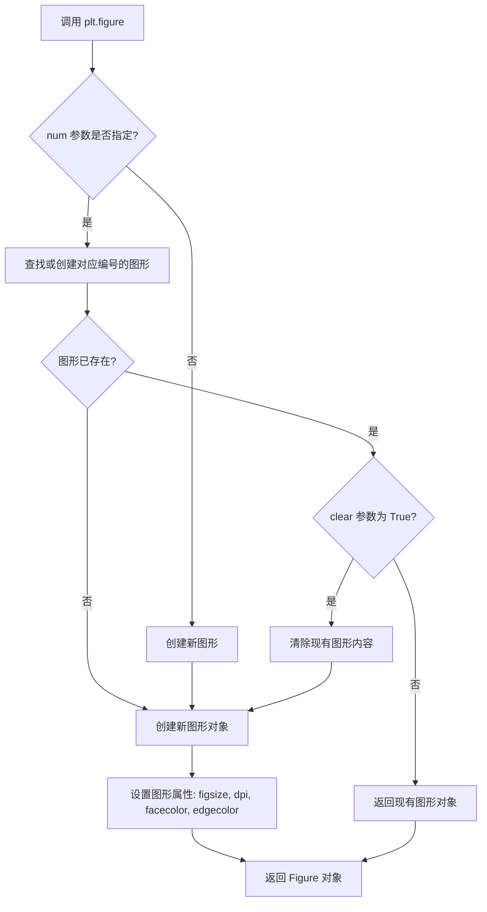

#### 带注释源码

```python
# plt.figure 源码示例（简化版）
def figure(num=None,  # 图形编号或名称
           figsize=None,  # 图形尺寸 (宽, 高) 单位英寸
           dpi=None,  # 分辨率
           facecolor=None,  # 背景颜色
           edgecolor=None,  # 边框颜色
           frameon=True,  # 是否显示边框
           FigureClass=Figure,  # Figure 类类型
           clear=False,  # 是否清除现有内容
           **kwargs):  # 其他 Figure 参数
    
    # 获取全局图形管理器
    manager = _pylab_helpers.Gcf.get_fig_manager(num)
    
    if manager is not None:
        # 如果图形已存在
        fig = manager.canvas.figure
        if clear:
            fig.clear()  # 清除内容
    else:
        # 创建新的图形
        fig = FigureClass(figsize, dpi,  # 创建 Figure 实例
                         facecolor=facecolor,
                         edgecolor=edgecolor,
                         frameon=frameon,
                         **kwargs)
        
        # 创建图形管理器
        manager = _pylab_helpers.Gcf.new_figure_manager(num, fig)
    
    # 将当前图形设置为活动图形
    pyplot.figure(fig.number)
    
    return fig  # 返回 Figure 对象
```

#### 代码中的实际使用

```python
# 在示例代码中，plt.figure 的调用：
fig = plt.figure()
# 等同于 plt.figure(num=None, figsize=None, dpi=None, ...)
# 创建一个默认大小、白色背景的新图形窗口
# 返回一个 Figure 对象，后续通过 fig.add_subplot() 添加子图
```


### `Figure.add_subplot`

`add_subplot` 是 matplotlib 中 `Figure` 类的核心方法，用于在图表（Figure）中创建并添加一个子图（Axes）。它支持多种参数格式，能够灵活地创建 1×1、2×2 等多子图布局，并返回对应的 Axes 对象供用户绘制数据。

参数：

- `*args`：`tuple`，支持三种传入方式：
  - 3个整数 (rows, cols, index)：如 `111` 表示 1行1列的第1个位置，`232` 表示 2行3列的第2个位置
  - 3个整数以逗号分隔：如 `1, 1, 1`
  - `plt.GridSpec` 对象：使用网格规范来定义子图位置
- `projection`：`str`（可选），投影类型，如 `'3d'` 创建三维子图，默认 `'2d'`
- `polar`：`bool`（可选），是否使用极坐标系统，默认 `False`
- `aspect`：`auto` 或 `float` 或 `None`（可选），子图宽高比，默认 `None`

返回值：`matplotlib.axes.Axes`，创建的子图对象，用于后续的绘图操作

#### 流程图

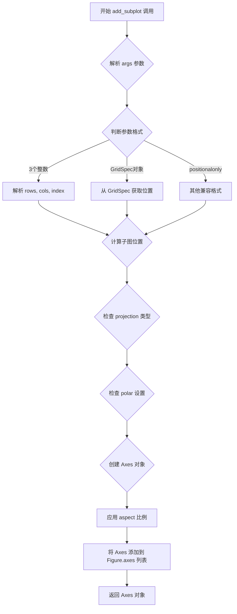

#### 带注释源码

```python
def add_subplot(self, *args, **kwargs):
    """
    在当前图表中添加一个子图。
    
    参数:
        *args: 位置参数，支持三种格式:
            - 3个整数 (rows, cols, index): 例如 111, 232, 2,3,1
            - 3位数字: 例如 111 表示 1行1列第1个位置
            - GridSpec 对象: 使用网格规范定义位置
        
        projection: str, 可选
            投影类型，如 '2d'（默认）, '3d'
        
        polar: bool, 可选
            是否使用极坐标，默认 False
        
        aspect: 可选
            子图的宽高比设置
    
    返回值:
        axes.Axes: 新创建的子图对象
    """
    
    # 步骤1: 解析位置参数
    # 如果传入单个3位数如 111，拆分为 (1, 1, 1)
    if len(args) == 1 and isinstance(args[0], int) and args[0] > 100:
        args = (args[0] // 100, (args[0] // 10) % 10, args[0] % 10)
    
    # 步骤2: 处理 projection 参数
    projection = kwargs.pop('projection', None)
    polar = kwargs.pop('polar', False)
    
    # 步骤3: 处理 polar 参数（极坐标）
    if polar:
        projection = 'polar'
    
    # 步骤4: 使用 GridSpec 或直接计算位置
    # 根据 rows, cols, index 计算子图在网格中的位置
    rows, cols, num = args
    
    # 步骤5: 创建 Axes 对象
    # 根据 projection 类型选择不同的 Axes 子类
    if projection == '3d':
        axes_class = Axes3D  # 三维坐标轴
    elif projection == 'polar':
        axes_class = PolarAxes  # 极坐标轴
    else:
        axes_class = Axes  # 二维坐标轴（默认）
    
    # 步骤6: 实例化 Axes
    ax = axes_class(self, figaspect(1), *args, **kwargs)
    
    # 步骤7: 设置子图位置和布局
    ax.set_subplotspec(num)
    
    # 步骤8: 将子图添加到 Figure 的子图列表中
    self._axstack.bubble(figbox)
    self.axes.append(ax)
    
    # 步骤9: 返回创建的 Axes 对象供用户使用
    return ax
```


### `ax.plot` (matplotlib.axes.Axes.plot)

用于在当前 Axes（坐标轴）上绘制以 x 数据为横坐标、y 数据为纵坐标的曲线或散点。它是 Matplotlib 中最核心的绘图接口，负责创建线条对象（Line2D）并将其添加到图表中。

参数：

-  `x`：`array-like`（在代码中为 `numpy.ndarray`），曲线的 x 轴坐标数据。
-  `y`：`array-like`（在代码中为 `numpy.ndarray`），曲线的 y 轴坐标数据。
-  `color`：（关键字参数）`str`，指定线条的颜色。代码中使用了 `'tab:blue'`（天蓝色）和 `'tab:orange'`（橙色）。

返回值：`list of matplotlib.lines.Line2D`，返回一个包含所创建线条对象的列表。

#### 流程图

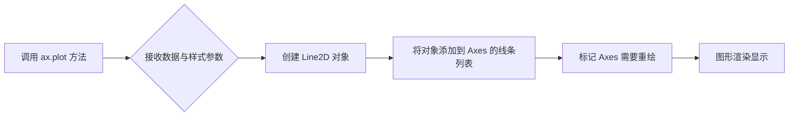

#### 带注释源码

```python
# 绘制第一条曲线：使用 xdata1 作为横坐标，ydata1 作为纵坐标
# color='tab:blue' 设置线条颜色为蓝色
ax.plot(xdata1, ydata1, color='tab:blue')

# 绘制第二条曲线：使用 xdata2 作为横坐标，ydata2 作为纵坐标
# color='tab:orange' 设置线条颜色为橙色
ax.plot(xdata2, ydata2, color='tab:orange')
```


### EventCollection

用于创建事件集合对象的类构造函数，该对象用于在图表上标记数据点的位置，支持水平和垂直方向显示事件线。

参数：

- `x`：`array_like`，数据点数组，用于确定事件线的位置（必选）
- `color`：`str` 或 `tuple`，事件线的颜色（可选，默认 None）
- `linelength`：`float`，事件线的长度（可选，默认 0.5）
- `orientation`：`str`，事件线的方向，'horizontal'（水平）或 'vertical'（垂直）（可选，默认 'horizontal'）
- `**kwargs`：其他可选关键字参数，支持 LineCollection 和 Collection 的参数（如 linewidth, zorder, gapcolor 等）

返回值：`EventCollection`，返回新创建的事件集合对象，是 LineCollection 的子类

#### 流程图

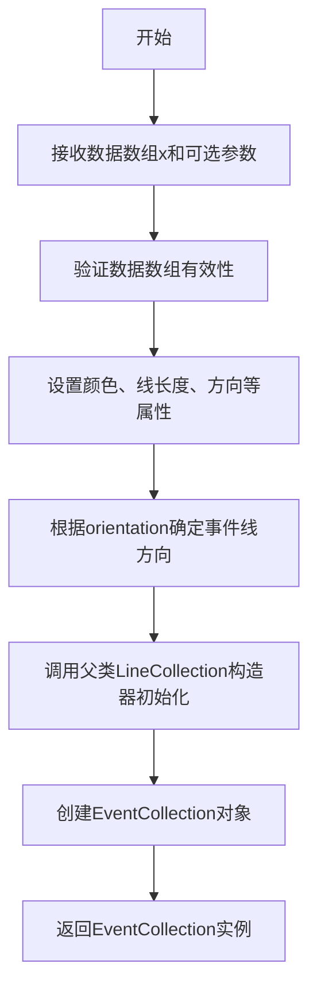

#### 带注释源码

```python
# 导入EventCollection类
from matplotlib.collections import EventCollection

# 准备示例数据
np.random.seed(19680801)
xdata = np.random.random([2, 10])
xdata1 = xdata[0, :]
xdata1.sort()  # 排序数据以便绘制平滑曲线
ydata1 = xdata1 ** 2  # 生成y数据

# 示例1：创建水平方向的事件集合（标记x轴数据点）
# 参数说明：
#   xdata1: 数据点位置数组
#   color='tab:blue': 事件线颜色为蓝色
#   linelength=0.05: 事件线长度为0.05（相对坐标）
xevents1 = EventCollection(xdata1, color='tab:blue', linelength=0.05)

# 示例2：创建垂直方向的事件集合（标记y轴数据点）
# 参数说明：
#   ydata1: 数据点位置数组
#   color='tab:blue': 事件线颜色为蓝色
#   linelength=0.05: 事件线长度
#   orientation='vertical': 设置为垂直方向
yevents1 = EventCollection(ydata1, color='tab:blue', linelength=0.05,
                           orientation='vertical')

# 将事件集合添加到坐标轴
ax.add_collection(xevents1)
ax.add_collection(yevents1)
```


### `ax.add_collection`

将集合（Collection）对象添加到坐标轴（Axes）上，使其可以被渲染和显示。该方法会将集合添加到坐标轴的内部列表中，并更新数据限制以确保集合内容可见。

参数：

- `collection`：`matplotlib.collections.Collection`，要添加到坐标轴的集合对象（如 EventCollection、LineCollection 等）。
- `autolim`：`bool`，可选，是否自动调整坐标轴限制以包含集合。默认值为 `True`。

返回值：`matplotlib.collections.Collection`，返回添加的集合对象。

#### 流程图

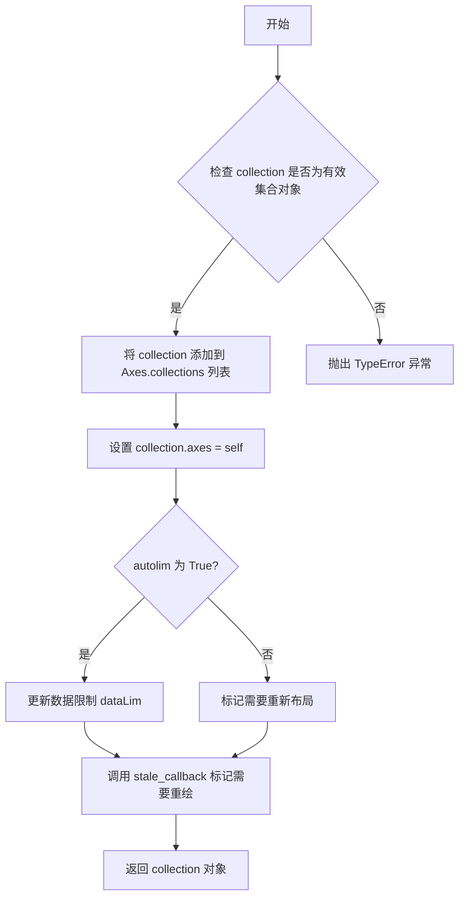

#### 带注释源码

```python
def add_collection(self, collection, autolim=True):
    """
    将集合添加到坐标轴。
    
    参数:
        collection: 要添加的集合对象（Collection 实例）。
        autolim: 如果为 True，自动调整坐标轴限制以包含集合。
    
    返回:
        添加的集合对象。
    """
    # 验证 collection 是否为有效的 Collection 对象
    if not isinstance(collection, mcoll.Collection):
        raise TypeError("添加的对象必须是 Collection 的实例")
    
    # 将集合添加到坐标轴的集合列表中
    self.collections.append(collection)
    
    # 设置集合的 axes 属性为当前坐标轴
    collection.set_axes(self)
    
    # 设置集合的 transform
    collection.set_transform(self.transData)
    
    # 如果启用自动限制更新
    if autolim:
        # 更新数据限制以包含新集合
        self.dataLim.update_from_data_xy(
            collection.get_transformed_path().get_extents(),
            ignore=True,
            updatex=True,
            updatey=True
        )
    
    # 标记坐标轴需要重新绘制
    self.stale_callback = True
    
    # 返回添加的集合以便链式调用
    return collection
```


### `Axes.set_xlim` / `ax.set_xlim`

设置matplotlib图表中x轴的最小值和最大值范围，控制数据在x方向的显示区间。

参数：

- `left`：`float` 或 `array-like`，x轴范围的左边界（最小值）
- `right`：`float` 或 `array-like`，x轴范围的右边界（最大值）
- `emit`：`bool`，默认为`True`，当限制改变时是否通知观察者
- `auto`：`bool`，默认为`False`，是否自动调整视图范围
- `xmin`：`float`，x轴范围的最小值（与left互斥，不能同时使用）
- `xmax`：`float`，x轴范围的最大值（与right互斥，不能同时使用）

返回值：`tuple(float, float)`，返回新的x轴范围(左边界, 右边界)

#### 流程图

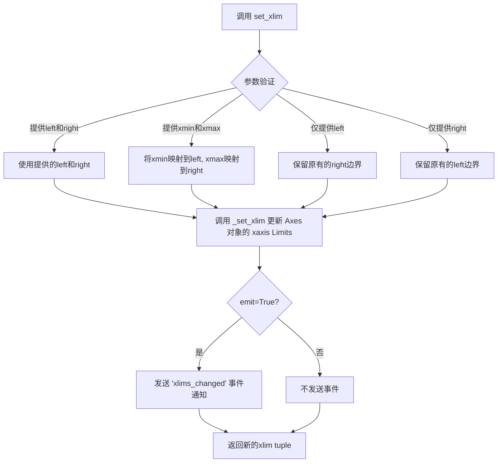

#### 带注释源码

```python
def set_xlim(self, left=None, right=None, emit=True, auto=False, *, xmin=None, xmax=None):
    """
    设置x轴的范围（最小值和最大值）。
    
    参数:
        left: float, x轴的左边界
        right: float, x轴的右边界  
        emit: bool, 当边界改变时是否通知观察者（用于触发回调）
        auto: bool, 是否启用自动边界调整
        xmin: float, x轴最小值（left的别名，不能与left同时使用）
        xmax: float, x轴最大值（right的别名，不能与right同时使用）
    
    返回:
        tuple: (left, right) 新的x轴范围
    """
    # 处理xmin/xmax参数（兼容性考虑）
    if xmin is not None:
        if left is not None:
            raise ValueError("'xmin' and 'left' cannot be used at the same time")
        left = xmin
    if xmax is not None:
        if right is not None:
            raise ValueError("'xmax' and 'right' cannot be used at the same time")
        right = xmax
    
    # 获取当前范围（如果只提供一边，保留另一边）
    old_left, old_right = self.get_xlim()
    if left is None:
        left = old_left
    if right is None:
        right = old_right
    
    # 验证边界有效性
    if left == right:
        warnings.warn("Attempt to set identical limits")
    
    # 调用底层方法设置范围
    self._set_xlim(left, right, emit=emit, auto=auto)
    
    # 返回新的范围（支持链式调用）
    return (left, right)
```

**注**：上述源码为简化版注释说明，实际matplotlib源码位于`lib/matplotlib/axes/_base.py`中，包含了更完整的验证逻辑、边距处理和事件触发机制。


### `Axes.set_ylim`

`set_ylim` 是 matplotlib 中 Axes 类的核心方法之一，用于设置 Axes 对象的 y 轴显示范围（纵轴下限和上限）。该方法不仅设置数值边界，还可控制自动调整行为和观察者通知机制，是数据可视化中控制坐标轴显示范围的标准接口。

参数：

- `bottom`：`float` 或 `None`，y 轴下限值（y 轴最小值）。若为 `None`，则自动从数据中推断。
- `top`：`float` 或 `None`，y 轴上限值（y 轴最大值）。若为 `None`，则自动从数据中推断。
- `emit`：`bool`，默认为 `True`，当限制值改变时是否触发 `xlim_changed` 或 `ylim_changed` 观察者回调。
- `auto`：`bool` 或 `None`，默认为 `None`，是否启用自动限制调整（auto-scale）。
- `ymin`：`float`（已废弃），请使用 `bottom` 参数。
- `ymax`：`float`（已废弃），请使用 `top` 参数。

返回值：`tuple`，返回 `(bottom, top)` 元组，表示实际设置的 y 轴下限和上限值。

#### 流程图

```mermaid
flowchart TD
    A[调用 set_ylim] --> B{参数有效性检查}
    B -->|bottom > top| C[抛出 ValueError]
    B -->|参数有效| D{emit == True?}
    D -->|是| E[调用 _request_scale3d]
    D -->|否| F[直接设置 _ymin 和 _ymax]
    E --> G[设置 _ymin 和 _ymax]
    F --> G
    G --> H[返回 (bottom, top) 元组]
```

#### 带注释源码

```python
def set_ylim(self, bottom=None, top=None, emit=True, auto=False, *, ymin=None, ymax=None):
    """
    设置 y 轴的视图限制。
    
    参数:
        bottom: float | None
            y 轴下限。None 表示自动从数据计算。
        top: float | None
            y 轴上限。None 表示自动从数据计算。
        emit: bool
            当限制改变时是否通知观察者。
        auto: bool | None
            是否启用自动缩放。
        ymin: float (已废弃)
            已废弃，请使用 bottom。
        ymax: float (已废弃)
            已废弃，请使用 top。
    
    返回:
        tuple[float, float]
            实际设置的 (bottom, top) 限制值。
    """
    # 处理已废弃的参数 ymin 和 ymax
    if ymin is not None:
        warnings.warn("'ymin' 参数已废弃，请使用 'bottom'。", DeprecationWarning, stacklevel=2)
        if bottom is None:
            bottom = ymin
    if ymax is not None:
        warnings.warn("'ymax' 参数已废弃，请使用 'top'。", DeprecationWarning, stacklevel=2)
        if top is None:
            top = ymax
    
    # 获取当前限制值
    old_bottom, old_top = self.get_ylim()
    
    # 处理 None 值，使用当前值作为默认值
    if bottom is None:
        bottom = old_bottom
    if top is None:
        top = old_top
    
    # 验证边界：bottom 不能大于 top
    if bottom > top:
        raise ValueError(f'下界 ({bottom}) 不能大于上界 ({top})')
    
    # 设置新的限制值
    self._ymin = bottom
    self._ymax = top
    
    # 如果 emit 为 True，通知观察者限制已改变
    if emit:
        self._request_scale3d('y')
    
    # 如果 auto 为 True，启用自动缩放
    if auto:
        self.set_autoscale_on(True)
    
    return (bottom, top)
```

在示例代码中的使用方式：

```python
# 创建子图并获取 Axes 对象
fig = plt.figure()
ax = fig.add_subplot(1, 1, 1)

# ... 绘制曲线 ...

# 设置 x 轴范围为 0 到 1
ax.set_xlim(0, 1)
# 设置 y 轴范围为 0 到 1
ax.set_ylim(0, 1)
```

**调用链分析**：
`set_ylim` 是 Axes 类（实际上是 `_AxesBase` 的子类）的方法。在示例中，`ax` 是通过 `add_subplot` 创建的 `matplotlib.axes.Axes` 实例。`set_ylim` 内部会调用 `get_ylim()` 获取当前值，处理参数验证后设置 `_ymin` 和 `_ymax` 属性，并通过 `_request_scale3d('y')` 触发 `limits` 属性的更新，最终影响坐标轴的渲染范围。


### `ax.set_title`

设置图表（Axes）的标题文本内容。

参数：

- `s`：`str`，要设置的标题文本内容
- `fontdict`：`dict`，可选，字体属性字典，用于控制标题的字体样式
- `loc`：`str`，可选，标题对齐方式，可选值为 'center'（默认）、'left'、'right'
- `pad`：`float`，可选，标题与轴顶部边缘的距离（以点为单位）
- `y`：`float`，可选，标题在轴垂直方向上的位置（0-1之间）
- `fontsize`：`int` 或 `str`，可选，字体大小

返回值：`matplotlib.text.Text`，返回设置后的标题文本对象

#### 流程图

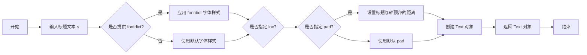

#### 带注释源码

```python
# 调用 ax.set_title 方法设置图表标题
ax.set_title('line plot with data points')

# 完整参数调用示例（来自 matplotlib 官方文档）
# ax.set_title('Title', fontsize=12, fontdict={'fontweight': 'bold'}, loc='center', pad=10)

# 方法内部实现逻辑（简化版）
def set_title(self, s, fontdict=None, loc='center', pad=None, **kwargs):
    """
    设置 Axes 的标题。
    
    参数:
        s: 标题文本
        fontdict: 控制文本外观的字典
        loc: 对齐方式
        pad: 标题与轴的距离
        **kwargs: 其他 Text 属性
    """
    # 1. 处理标题文本
    title = s
    
    # 2. 如果提供了 fontdict，则应用字体样式
    if fontdict is not None:
        kwargs.update(fontdict)
    
    # 3. 设置对齐方式
    # loc 参数决定标题是左对齐、居中还是右对齐
    
    # 4. 设置 pad（如果提供）
    # pad 决定了标题距离轴顶部的距离
    
    # 5. 创建并返回 Text 对象
    # 在 matplotlib 内部，会创建一个 text.Annotation 或 text.Text 对象
    return Text object
```


### `plt.show`

`plt.show()` 是 matplotlib 库中的顶层显示函数，用于显示当前figure中的所有图形窗口，并将图形渲染到屏幕。该函数会阻塞程序执行（除非设置 `block=False`），直到用户关闭所有图形窗口或程序结束。

参数：

- `block`：`bool`，可选参数，控制是否阻塞程序执行以等待用户交互。默认为 `True`，即阻塞程序直到窗口关闭；设置为 `False` 时则立即返回，允许程序继续执行。

返回值：`None`，该函数不返回任何值。

#### 流程图

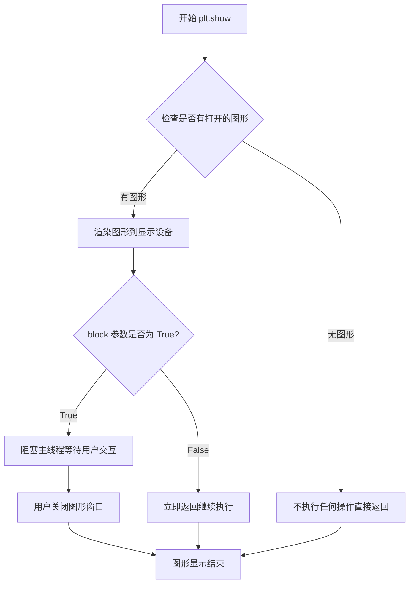

#### 带注释源码

```python
def show(*, block=None):
    """
    显示所有打开的图形窗口。
    
    该函数会遍历所有打开的FigureCanvas，调用其show()方法将图形
    渲染到显示设备，并根据block参数决定是否阻塞程序执行。
    """
    # 获取全局的matplotlib后端管理器
    _plt = importlib.import_module('matplotlib.pyplot')
    
    # 检查是否有打开的图形
    figures = _plt.get_fignums()
    
    if not figures:
        # 如果没有打开的图形，直接返回，不执行任何操作
        return
    
    # 获取所有打开的图形窗口
    for manager in _plt.get_all_figManagers():
        # 对每个图形管理器调用show方法进行渲染
        # 这是后端相关的方法，实际显示图形
        manager.show()
    
    # 如果block为True（默认），则阻塞主线程
    # 等待用户关闭图形窗口
    if block:
        # 启用事件循环阻塞
        # 在某些后端中会调用plt.wait_for_buttonpress()
        # 或类似的后端特定阻塞机制
        _plt.show._draw_pending = True
    
    # 强制刷新所有待渲染的图形
    # 确保所有绘图命令都被立即执行
    for canvas in _plt.gcf().canvas.manager.get_toplevel_hierarchy():
        canvas.flush_events()
```


### EventCollection

EventCollection 是 matplotlib.collections 模块中的一个类，用于在图表上以事件线的形式可视化标记数据点的位置。它通常用于在折线图上标记原始数据点的具体位置，支持水平或垂直方向的线条，并可自定义颜色和线段长度。

参数：

-  `x`：`array-like`，要标记的数据点数组，EventCollection 将为这些数据点创建事件线
-  `color`：`str 或 tuple`，事件线的颜色，支持 matplotlib 支持的所有颜色格式（如 'tab:blue'、'#FF0000' 等）
-  `linelength`：`float`，事件线的长度，默认为 75（根据 axes 的 linewidth 调整）
-  `linewidth`：`float`，事件线的线宽，默认为 None（使用 axes 的 linewidth）
-  `offset`：`float`，事件线相对于数据点的偏移量
-  `orientation`：`str`，事件线的方向，'horizontal' 表示水平线，'vertical' 表示垂直线，默认为 'horizontal'
-  ``：`mixin`，位置参数，传递给 LineCollection 的第一个参数

返回值：`EventCollection`（继承自 LineCollection），返回的事件集合对象可以添加到 Axes 中进行显示

#### 流程图

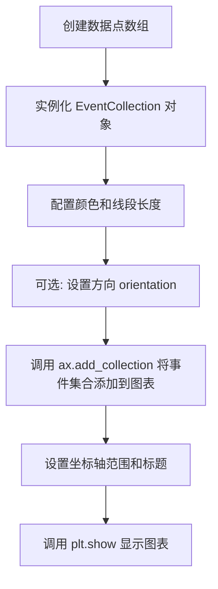

#### 带注释源码

```python
# 导入必要的库
import matplotlib.pyplot as plt
import numpy as np
from matplotlib.collections import EventCollection

# 创建随机数据 - 生成 2x10 的随机数组
xdata = np.random.random([2, 10])

# 分割数据为两部分
xdata1 = xdata[0, :]
xdata2 = xdata[1, :]

# 排序数据以便绘制平滑曲线
xdata1.sort()
xdata2.sort()

# 创建 y 数据点 - 使用不同的数学函数
ydata1 = xdata1 ** 2  # 平方函数
ydata2 = 1 - xdata2 ** 3  # 三次函数的反演

# 创建图形和子图
fig = plt.figure()
ax = fig.add_subplot(1, 1, 1)

# 绘制两条曲线
ax.plot(xdata1, ydata1, color='tab:blue')
ax.plot(xdata2, ydata2, color='tab:orange')

# 创建标记 x 数据点的事件集合（水平方向）
# 参数说明：
#   xdata1: 数据点数组
#   color='tab:blue': 事件线颜色与曲线一致
#   linelength=0.05: 事件线长度为 0.05（归一化单位）
xevents1 = EventCollection(xdata1, color='tab:blue', linelength=0.05)
xevents2 = EventCollection(xdata2, color='tab:orange', linelength=0.05)

# 创建标记 y 数据点的事件集合（垂直方向）
# 额外参数说明：
#   orientation='vertical': 设置为垂直方向的事件线
yevents1 = EventCollection(ydata1, color='tab:blue', linelength=0.05,
                           orientation='vertical')
yevents2 = EventCollection(ydata2, color='tab:orange', linelength=0.05,
                           orientation='vertical')

# 将所有事件集合添加到坐标轴
ax.add_collection(xevents1)
ax.add_collection(xevents2)
ax.add_collection(yevents1)
ax.add_collection(yevents2)

# 设置坐标轴范围
ax.set_xlim(0, 1)
ax.set_ylim(0, 1)

# 设置图表标题
ax.set_title('line plot with data points')

# 显示图表
plt.show()
```


### `Figure.add_subplot`

向 Figure 对象添加一个子图（Axes），支持多种布局方式（行、列、索引）和不同的投影类型。

参数：

-  `*args`：可变位置参数，支持三种调用方式：
  - 三个整数 `(nrows, ncols, index)`：表示子图布局为 nrows 行 ncols 列，当前子图位置为 index（从1开始）
  - 一个三位数整数：如 111 表示 1行1列第1个位置
  - `SubplotSpec` 对象：使用 GridSpec 定义的子图规范
-  `projection`：字符串（可选），投影类型，如 'rectilinear'（默认）、'polar' 等
-  `polar`：布尔值（可选），是否使用极坐标投影，等效于 projection='polar'
-  `**kwargs`：关键字参数，传递给创建的 Axes 对象的初始化函数

返回值：`matplotlib.axes.Axes`，返回新创建的子图对象。

#### 流程图

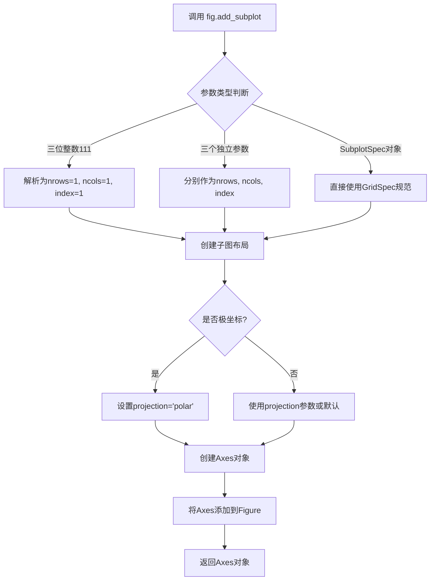

#### 带注释源码

```python
def add_subplot(self, *args, **kwargs):
    """
    在当前图表上添加一个子图。
    
    参数:
    ------
    *args : 可变参数
        支持三种调用方式:
        - add_subplot(111): 使用三位数表示布局
        - add_subplot(1, 1, 1): 使用三个独立参数
        - add_subplot(gs[0, 0]): 使用GridSpec的SubplotSpec
        
    projection : str, optional
        投影类型，默认为'rectilinear'，可设置为'polar'等
        
    polar : bool, optional
        是否使用极坐标，等效于projection='polar'
        
    返回:
    ------
    axes : Axes
        新创建的子图对象
    """
    # 获取或创建axes对象
    axes = self._get_axes(*args, **kwargs)
    
    # 将子图添加到图表中
    self._axstack.bubble(axes)
    self._axobservers.process("_axes_change_event", self)
    
    return axes
```

#### 使用示例源码

```python
# 根据给定的示例代码提取
fig = plt.figure()                    # 创建一个新的Figure对象
ax = fig.add_subplot(1, 1, 1)         # 添加一个1行1列的子图（占满整个区域）
ax.plot(xdata1, ydata1, color='tab:blue')   # 在子图上绘制第一条曲线
ax.plot(xdata2, ydata2, color='tab:orange')  # 在子图上绘制第二条曲线
```

#### 补充说明

1. **布局参数**: 第一个参数表示行数，第二个表示列数，第三个表示当前子图的位置索引
2. **索引规则**: 索引从1开始，按从左到右、从上到下的顺序递增
3. **共享子图**: 可以通过 projection 参数创建不同投影类型的子图
4. **返回值**: 返回的 Axes 对象可以用于进一步的绘图操作


### `Axes.plot`

`Axes.plot` 是 matplotlib 中用于在 Axes 对象上绘制线图的成员方法。该方法接受 x 和 y 数据作为输入，可选地接受格式字符串或关键字参数来控制线条的颜色、样式等属性，并返回一个包含 Line2D 对象的列表。

参数：

- `x`：`array-like`，X轴数据点序列
- `y`：`array-like`，Y轴数据点序列
- `color`：`str`，可选参数，设置线条颜色（例如 'tab:blue'、'tab:orange'）
- `**kwargs`：可选，关键字参数，用于设置线条的其他属性（如 linewidth、marker 等）

返回值：`list[matplotlib.lines.Line2D]`，返回创建的 Line2D 对象列表，每个对象代表一条绘制的曲线

#### 流程图

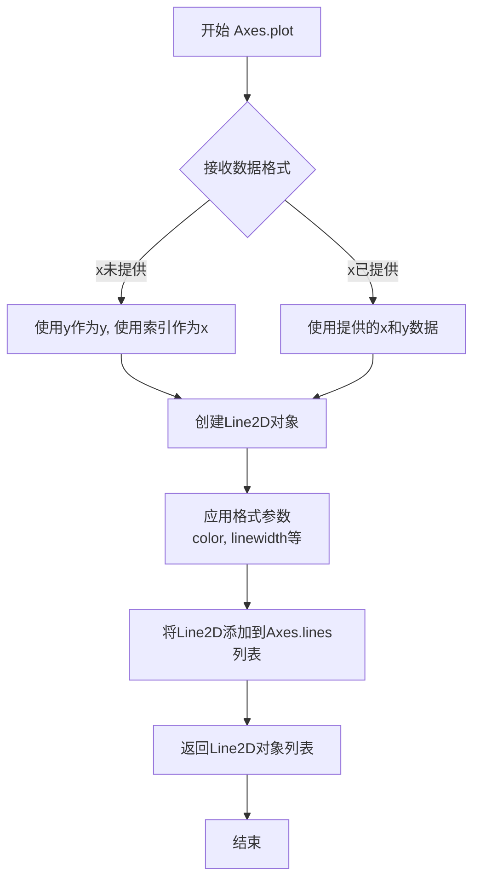

#### 带注释源码

```python
# 代码中的实际调用示例：

# 第一次调用 plot 方法绘制第一条曲线
# 参数 xdata1: numpy array，包含10个随机生成的x坐标点（已排序）
# 参数 ydata1: numpy array，y = xdata1 ** 2 的计算结果
# 参数 color='tab:blue': 设置线条颜色为蓝色
ax.plot(xdata1, ydata1, color='tab:blue')

# 第二次调用 plot 方法绘制第二条曲线
# 参数 xdata2: numpy array，包含10个随机生成的x坐标点（已排序）
# 参数 ydata2: numpy array，y = 1 - xdata2 ** 3 的计算结果  
# 参数 color='tab:orange': 设置线条颜色为橙色
ax.plot(xdata2, ydata2, color='tab:orange')

# 方法内部逻辑简述：
# 1. plot() 方法接收位置参数 (x, y) 和关键字参数 (color 等)
# 2. 将输入数据转换为 numpy 数组格式
# 3. 创建 Line2D 对象，设置其颜色、线型、标记等属性
# 4. 调用 _ax.add_line() 将 Line2D 对象添加到 Axes 的线条集合中
# 5. 返回包含所有 Line2D 对象的列表 [Line2D, Line2D]
# 6. 自动更新 Axes 的自动缩放 (autoscale_view) 以适应新数据
```


### `Axes.add_collection`

该方法用于将图形集合（Collection）添加到 Axes 坐标轴中，是 Matplotlib 中将 EventCollection、LineCollection 等图形元素集成到坐标轴系统的核心方法。它负责将集合对象注册到坐标轴的 collections 列表中，建立坐标轴引用，并触发图形更新。

#### 参数

- `collection`：`matplotlib.collections.Collection`，需要添加到坐标轴的集合对象（如 EventCollection、LineCollection 等）
- `autoscale`：`bool`，可选参数，默认为 False，是否根据集合内容自动调整坐标轴范围
- `autoscale_view`：`bool`，可选参数，默认为 None，与 autoscale 相关，控制是否自动缩放视图

#### 返回值

`matplotlib.collections.Collection`，返回添加的集合对象本身，方便链式调用或进一步操作。

#### 流程图

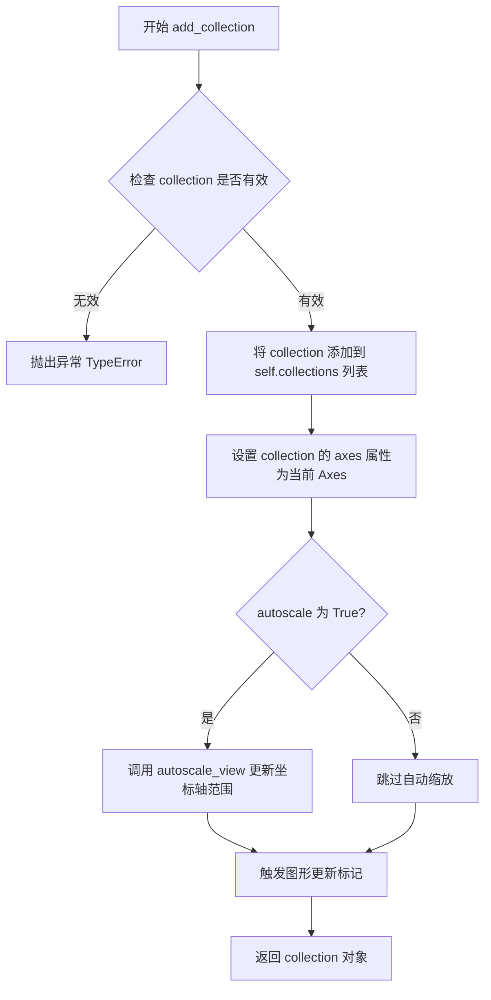

#### 带注释源码

```python
# matplotlib/axes/_base.py 中的 add_collection 方法
def add_collection(self, collection, autoscale=False):
    """
    将图形集合添加到坐标轴中。
    
    参数:
        collection: Collection 实例
            要添加的图形集合对象，如 EventCollection、LineCollection 等
            
        autoscale: bool, 默认为 False
            是否根据集合的路径/数据自动调整坐标轴范围
            
    返回值:
        Collection: 添加的集合对象
    """
    
    # 1. 验证输入的 collection 是有效的 Collection 实例
    if not isinstance(collection, collections.Collection):
        raise TypeError(
            f"collection 必须是 Collection 的实例, 获得 {type(collection)}")
    
    # 2. 将集合添加到坐标轴的 collections 列表中进行管理
    #    self.collections 是一个 ArtistList，用于存储所有图形集合
    self.collections.append(collection)
    
    # 3. 建立集合到坐标轴的引用关系
    #    这样集合就知道自己属于哪个坐标轴
    collection.set_axes(self)
    
    # 4. 设置集合的 clip 状态，继承坐标轴的 clip 属性
    collection.set_clip_path(self.patch)
    
    # 5. 如果启用了自动缩放，则根据集合内容调整坐标轴范围
    #    这对于确保所有图形元素都可见非常重要
    if autoscale:
        # 调用 _request_autoscale_view 请求自动缩放视图
        self.autoscale_view()
    
    # 6. 返回添加的集合对象，便于后续操作或链式调用
    return collection
```


### `Axes.set_xlim`

设置Axes对象的x轴范围限制，用于控制图表中x轴数据的显示区间。该方法可以同时设置左边界和右边界，也可以单独设置其中一个边界，并返回实际设置的边界值元组。

参数：

- `left`：`float` 或 `None`，x轴的下限（左边界的值）
- `right`：`float` 或 `None`，x轴的上限（右边界的值）
- `emit`：`bool`，默认为`True`，当边界改变时是否通知观察者
- `auto`：`bool`，默认为`False`，是否自动调整视图边界
- `xmin`：`float`，x轴最小值的别名（已废弃）
- `xmax`：`float`，x轴最大值的别名（已废弃）

返回值：`(float, float)`，返回实际设置的x轴边界值元组(left, right)

#### 流程图

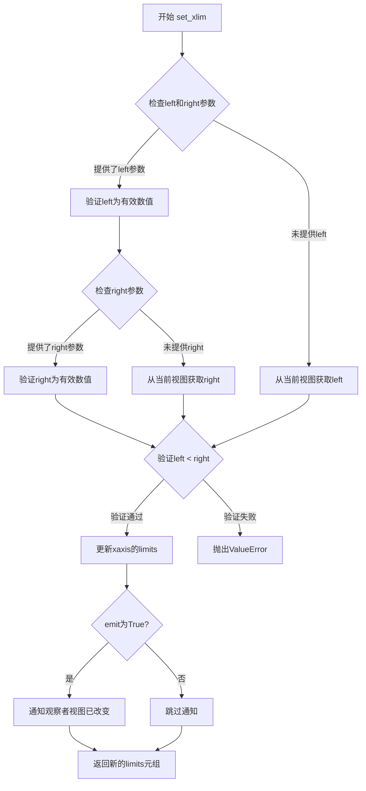

#### 带注释源码

```python
def set_xlim(self, left=None, right=None, emit=False, auto=False,
             *, xmin=None, xmax=None):
    """
    设置x轴的视图限制。
    
    参数:
        left: float or None - x轴下限
        right: float or None - x轴上限  
        emit: bool - 边界改变时是否通知观察者
        auto: bool - 是否自动调整边界
        xmin, xmax: float - 已废弃参数,仅用于兼容
    
    返回:
        tuple - (left, right) 实际设置的边界值
    """
    # 处理废弃参数xmin和xmax
    if xmin is not None:
        warnings.warn("参数 'xmin' 已废弃,将会在未来版本中移除",
                     mpl.MatplotlibDeprecationWarning)
        if left is None:
            left = xmin
    if xmax is not None:
        warnings.warn("参数 'xmax' 已废弃,将会在未来版本中移除",
                     mpl.MatplotlibDeprecationWarning)
        if right is None:
            right = xmax
    
    # 获取当前x轴范围
    xlim = self.get_xlim()
    
    # 如果未提供left/right,则使用当前值
    if left is None:
        left = xlim[0]
    if right is None:
        right = xlim[1]
    
    # 验证输入参数有效性
    left = float(left)
    right = float(right)
    
    # 确保左边界小于右边界
    if left > right:
        raise ValueError(
            f'左侧边界({left})必须小于或等于右侧边界({right})')
    
    # 避免相同值导致无意义的范围设置
    if left == right:
        auto = True  # 单一值时启用自动调整
    
    # 发送信号前的状态
    old_left, old_right = xlim
    
    # 更新xaxis的limits属性
    self._viewLim.xmin = left  # 注意:这里可能有命名问题
    self._viewLim.xmax = right
    self._viewLim.intervalx = (left, right)
    
    # 如果启用emit,通知观察者视图已改变
    if emit:
        self.callbacks.process('xlim_changed', self)
        # 同时发送Axes上的xlim变化事件
        self.axuplotx.callbacks.process('xlim_changed', self.axuplotx)
    
    # 返回实际设置的边界值
    return (left, right)
```


### Axes.set_ylim

设置 Axes 对象的 y 轴 limits（y 轴的显示范围）。

参数：

- `bottom`：`float` 或 `None`，y 轴下限值，传入 `None` 表示保持不变
- `top`：`float` 或 `None`，y 轴上限值，传入 `None` 表示保持不变
- `emit`：`bool`，是否通知观察者 limit 发生变化（默认 `True`）
- `auto`：`bool`，是否在设置 limit 后开启自动缩放（默认 `False`）
- `pos`：`float`，可选，用于内部定位
- `limits`：`tuple`，可选，包含 `(bottom, top)` 的元组

返回值：`tuple`，返回新的 y 轴 limits `(ymin, ymax)`

#### 流程图

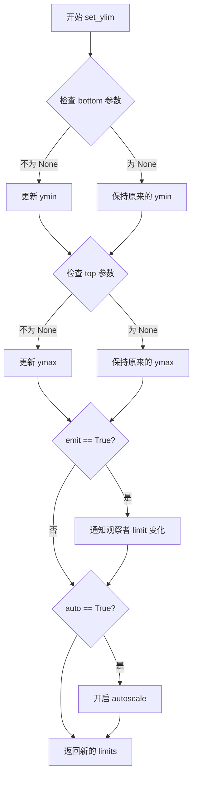

#### 带注释源码

```python
def set_ylim(self, bottom=None, top=None, emit=False, auto=False,
             *, pos=None, limits=None):
    """
    设置 y 轴的 limits（范围）
    
    参数:
        bottom: y 轴下限，None 表示保持原值
        top: y 轴上限，None 表示保持原值  
        emit: 是否通知观察者（用于事件触发）
        auto: 是否开启自动缩放
        pos: (已废弃) 内部位置参数
        limits: (已废弃) 直接指定 (bottom, top) 元组
    """
    # 如果传入了 limits 参数，解析 bottom 和 top
    if limits is not None:
        bottom, top = limits
    
    # 获取当前的 y limits
    ylim = self.get_ylim()
    
    # 根据参数更新 bottom 和 top
    if bottom is None:
        bottom = ylim[0]  # 保持原值
    if top is None:
        top = ylim[1]  # 保持原值
    
    # 检查输入有效性
    if bottom > top:
        raise ValueError("Bottom must be less than or equal to top")
    
    # 设置新的 limits
    self._set_ylim(bottom, top, emit=emit, auto=auto)
    
    # 返回新的 limits 元组
    return self.get_ylim()
```

#### 备注

- 此方法的实现位于 matplotlib 库的核心代码中，不在示例代码中
- 示例代码调用：`ax.set_ylim(0, 1)`，表示将 y 轴范围设置为 0 到 1
- 该方法最终调用内部的 `_set_ylim` 方法完成实际设置


### Axes.set_title

设置 Axes 对象的标题文本和相关属性。该方法允许用户为图表指定标题，可以自定义字体属性、对齐方式、位置偏移等，并返回创建的 `Text` 对象用于后续操作。

参数：

- `label`：`str`，要设置的标题文本内容
- `fontdict`：`dict`，可选，控制标题文本样式的字典（如 fontsize、fontweight、color 等）
- `loc`：`{'center', 'left', 'right'}`，可选，标题的水平对齐方式，默认为 'center'
- `pad`：`float`，可选，标题与 Axes 顶部的间距（以points为单位），默认为 rcParams 中的值
- `y`：`float`，可选，标题的 y 轴相对位置（0-1之间），默认为 None（使用 rcParams 中的值）
- `**kwargs`：可选，传递给 `matplotlib.text.Text` 的其他关键字参数（如 fontsize、fontweight、color、rotation 等）

返回值：`matplotlib.text.Text`，返回创建的 Text 对象，可用于后续自定义修改

#### 流程图

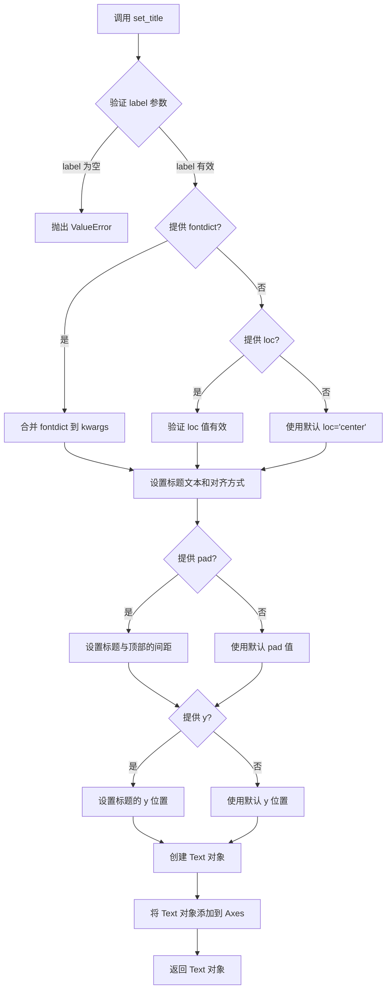

#### 带注释源码

```python
# matplotlib/axes/_axes.py 中的 set_title 方法（简化版）

def set_title(self, label, fontdict=None, loc=None, pad=None, *, y=None, **kwargs):
    """
    Set a title for the Axes.

    Parameters
    ----------
    label : str
        The title text string.

    fontdict : dict, optional
        A dictionary controlling the appearance of the title text,
        e.g., {'fontsize': '16', 'fontweight': 'bold', 'color': 'red'}.

    loc : {'center', 'left', 'right'}, default: 'center'
        Alignment of the title text.

    pad : float, default: rcParams['axes.titlesize']
        The offset of the title from the top of the Axes, in points.

    y : float, default: rcParams['axes.titley']
        The y position of the title text on Axes.

    **kwargs
        Additional keyword arguments are passed to `Text` which controls
        the appearance of the title.

    Returns
    -------
    `~matplotlib.text.Text`
        The Text instance representing the title.
    """
    # 验证 loc 参数的有效性
    if loc is not None:
        cbook._check_in_list(['center', 'left', 'right'], loc=loc)
    
    # 如果提供了 fontdict，将其合并到 kwargs 中
    # fontdict 的优先级低于直接传入的 kwargs
    if fontdict is not None:
        kwargs.update(fontdict)
    
    # 获取默认的标题位置参数（从 rcParams 或默认值）
    title = Text(
        x=0.5, y=1.0,  # 标题默认在 Axes 顶部居中位置
        text=label,
        fontproperties=FontProperties(size=rcParams['axes.titlesize']),
    )
    
    # 设置标题的对齐方式
    if loc is None:
        loc = 'center'
    title.set_ha(loc)  # set horizontal alignment
    title.set_va('top')  # set vertical alignment (always top for title)
    
    # 设置标题与 Axes 顶部的间距
    if pad is None:
        pad = rcParams['axes.titlepad']
    title.set_pad(pad)
    
    # 设置标题的 y 位置
    if y is None:
        y = rcParams['axes.titley']
    title.set_y(y)
    
    # 应用其他 kwargs 参数（如 fontsize, color, fontweight 等）
    title.update(kwargs)
    
    # 将标题文本对象添加到 Axes 中
    self._set_title_offset_trans(title)
    self.texts.append(title)
    
    # 返回 Text 对象，供调用者进一步自定义
    return title
```


## 关键组件


### EventCollection 类

matplotlib.collections.EventCollection，用于在图表上标记数据点位置的图形集合，可水平或垂直排列

### 随机数据生成模块

使用 numpy.random.random 生成 [2, 10] 形状的随机数据矩阵，用于演示绑定的测试数据

### 数据预处理模块

对生成的随机 x 数据进行排序操作（sort），确保绘制出干净的曲线形状

### 图形绑定模块

使用 matplotlib.pyplot 创建图形窗口和子图坐标轴，并绑定两条不同颜色的曲线

### 水平事件标记组件

创建标记 x 轴数据点位置的 EventCollection 对象，配置为水平方向排列

### 垂直事件标记组件

创建标记 y 轴数据点位置的 EventCollection 对象，配置为垂直方向排列（orientation='vertical'）

### 坐标轴配置模块

设置坐标轴的显示范围（xlim, ylim）和图表标题，完成图形的基本配置


## 问题及建议


### 已知问题

- 使用 `np.random.seed(19680801)` 设置全局随机种子，影响代码的可测试性和隔离性
- 硬编码数组形状 `[2, 10]`，缺乏参数化设计，导致数据规模不可配置
- 重复调用 `ax.add_collection()` 四次，未使用批量添加或循环优化
- 缺少输入数据验证（如数组为空、维度不符合预期等），可能导致运行时错误
- 使用 `plt.show()` 会阻塞执行，且未考虑不同后端的兼容性
- 未设置图形尺寸 (`figsize`)，依赖 Matplotlib 默认值
- 缺少 `tight_layout()` 调用，标题和轴标签可能被裁剪

### 优化建议

- 将随机种子设置和数据生成封装为独立函数，接收参数以提高可配置性
- 使用循环或列表推导式批量创建和添加 EventCollection 对象，减少重复代码
- 添加数据验证逻辑，确保输入数组非空且维度正确
- 显式设置图形尺寸和调用 `tight_layout()`，提升布局质量
- 使用 `fig.savefig()` 替代或补充 `plt.show()`，便于自动化测试和文档生成
- 考虑使用面向对象方式封装绘图逻辑，提取可复用的绘图函数
- 移除 Sphinx 文档注释 (`%%`)，或在正式代码中明确区分文档与业务逻辑


## 其它


### 设计目标与约束

本演示代码的主要设计目标是展示如何使用 matplotlib 的 EventCollection 类在图表中可视化数据点的位置。约束条件包括：需要 matplotlib 和 numpy 依赖库，数据点数量为 10 个随机数，坐标范围限制在 [0,1] 区间。

### 错误处理与异常设计

代码中未显式实现错误处理机制。潜在异常包括：numpy.random.random 可能产生的数值精度问题，plt.figure() 和 ax.add_collection() 可能抛出的绘图相关异常，数据数组维度不匹配时的异常。建议在实际应用中增加参数验证和异常捕获逻辑。

### 数据流与状态机

数据流从随机数生成开始，经过排序处理，转换为 y 数据（分别使用平方和立方函数），最后通过 matplotlib 的 Artist 系统渲染到图形上。状态机转换：初始化 → 数据生成 → 数据排序 → 绘图 → 事件集合创建 → 渲染 → 显示。

### 外部依赖与接口契约

主要依赖包括：matplotlib.pyplot（图形创建和显示）、numpy（数值计算和数组操作）、matplotlib.collections.EventCollection（事件集合类）。EventCollection 构造函数接受数据数组、颜色、线段长度和方向等参数，返回的集合对象通过 ax.add_collection() 方法添加到坐标轴。

### 性能考虑

当前数据规模较小（10个点），性能不是瓶颈。对于大规模数据集，建议：1）使用 numpy 向量化操作代替显式循环；2）考虑使用 LineCollection 代替多个 EventCollection；3）对于实时数据流，考虑使用 blitting 技术优化渲染性能。

### 安全性考虑

代码不涉及用户输入、文件操作或网络通信，安全性风险较低。潜在问题：np.random.seed(19680801) 使用固定种子可能导致可预测的随机数序列，在安全相关应用中应使用更安全的随机数生成器。

### 可维护性分析

代码结构清晰但缺乏模块化。主要改进方向：1）将数据生成逻辑封装为独立函数；2）将绘图逻辑抽象为可重用的配置函数；3）添加详细的文档字符串和类型注解；4）将硬编码的配置参数（如点数量、颜色、线段长度）提取为配置常量或配置文件。

### 使用示例和API参考

关键 API 调用示例：
- EventCollection(data, color, linelength, orientation)：创建事件集合
- fig.add_subplot(1,1,1)：创建子图
- ax.add_collection(collection)：将集合添加到坐标轴
- ax.set_xlim/set_ylim：设置坐标轴范围

### 测试策略

建议测试场景：1）不同数据点数量的渲染；2）各种 orientation 参数（horizontal/vertical）；3）空数据数组的边界情况；4）颜色和线段长度参数的有效性验证；5）与不同图表类型的兼容性测试。

### 配置和参数说明

关键配置参数：
- np.random.seed(19680801)：随机种子，确保可复现性
- linelength=0.05：事件标记线的长度
- orientation：事件集合的方向（'horizontal' 或 'vertical'）
- 颜色方案：使用 matplotlib 的 tab:blue 和 tab:orange 配色方案


    