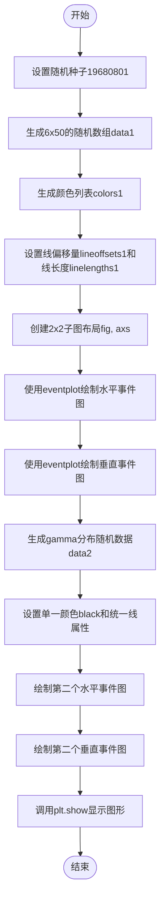
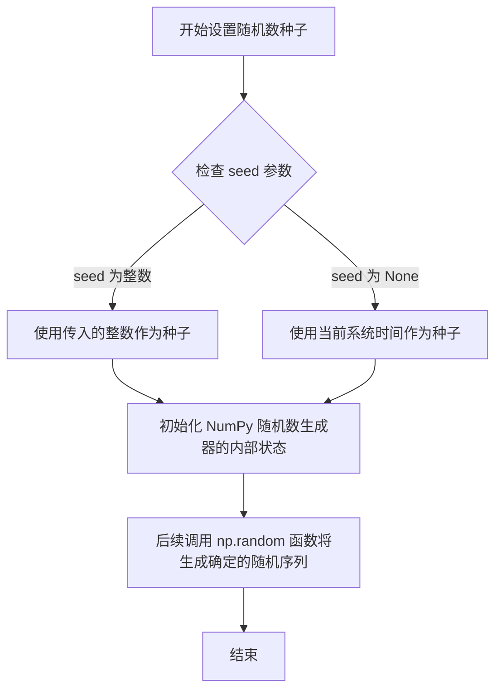
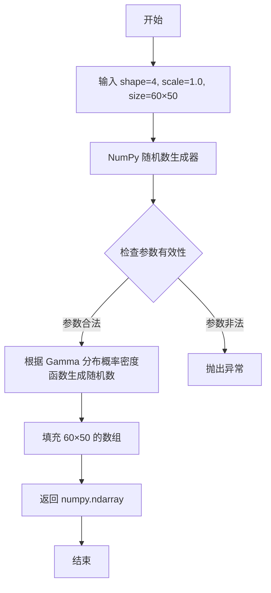
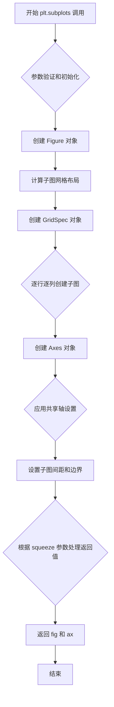
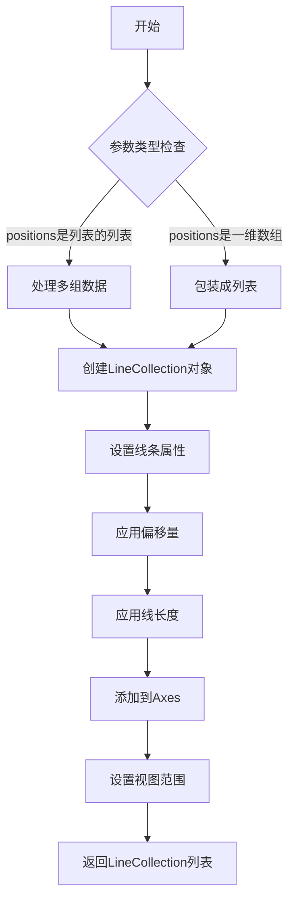
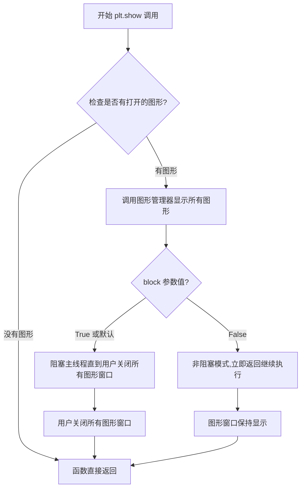

# `matplotlib\galleries\examples\lines_bars_and_markers\eventplot_demo.py` 详细设计文档

这是一个 matplotlib eventplot 函数的演示脚本，用于展示如何在水平 和垂直方向上绘制事件序列数据，并演示不同的颜色、线偏移和线长度参数的效果。

## 整体流程

```mermaid
graph TD
    A[开始] --> B[设置随机种子 19680801]
    B --> C[生成随机数据 data1: 6x50 矩阵]
    C --> D[生成颜色列表 colors1: C0-C5]
    D --> E[设置线偏移量 lineoffsets1]
    E --> F[设置线长度 linelengths1]
    F --> G[创建 2x2 子图布局]
    G --> H[绘制水平 eventplot (data1)]
    H --> I[绘制垂直 eventplot (data1)]
    I --> J[生成 gamma 分布数据 data2: 60x50]
    J --> K[设置单一颜色 black 和统一参数]
    K --> L[绘制水平 eventplot (data2)]
    L --> M[绘制垂直 eventplot (data2)]
    M --> N[调用 plt.show() 显示图表]
    N --> O[结束]
```

## 类结构

```
该脚本为面向过程代码，无自定义类
主要依赖 matplotlib.axes.Axes.eventplot 方法
└── plt.subplots 返回 axes 数组
    └── ax.eventplot() 实例方法调用
```

## 全局变量及字段


### `data1`
    
随机生成的 6x50 数据矩阵，用于第一组演示

类型：`np.ndarray`
    


### `colors1`
    
包含6个颜色字符串的列表 (C0-C5)

类型：`list`
    


### `lineoffsets1`
    
第一组事件的线偏移量列表 [-15, -3, 1, 1.5, 6, 10]

类型：`list`
    


### `linelengths1`
    
第一组事件的线长度列表 [5, 2, 1, 1, 3, 1.5]

类型：`list`
    


### `data2`
    
gamma分布生成的 60x50 数据矩阵，用于第二组演示

类型：`np.ndarray`
    


### `colors2`
    
单一颜色值 'black'

类型：`str`
    


### `lineoffsets2`
    
第二组事件的线偏移量 1

类型：`int`
    


### `linelengths2`
    
第二组事件的线长度 1

类型：`int`
    


### `fig`
    
plt.subplots 返回的图形对象

类型：`matplotlib.figure.Figure`
    


### `axs`
    
2x2 的 axes 数组对象

类型：`np.ndarray`
    


    

## 全局函数及方法


### `main script`

该脚本是matplotlib的eventplot示例程序，通过生成随机数据并使用不同颜色、线偏移和线长度参数，在水平和垂直方向上绘制事件序列图，展示`Axes.eventplot`方法的使用。

参数：
- 该脚本不接受任何外部参数，内部定义的变量（如`data1`, `colors1`, `lineoffsets1`等）为局部变量，用于配置绘图。

返回值：该脚本无返回值，主要通过`plt.show()`显示图形。

#### 流程图



#### 带注释源码

```python
"""
==============
Eventplot demo
==============

An `~.axes.Axes.eventplot` showing sequences of events with various line
properties. The plot is shown in both horizontal and vertical orientations.
"""

# 导入matplotlib的pyplot模块，用于绘图
import matplotlib.pyplot as plt
# 导入numpy模块，用于数值计算
import numpy as np

# 导入matplotlib模块
import matplotlib
# 设置字体大小为8.0
matplotlib.rcParams['font.size'] = 8.0

# 修复随机状态以确保可重复性
np.random.seed(19680801)


# 创建随机数据：6行50列的随机数数组
data1 = np.random.random([6, 50])

# 为每组位置设置不同颜色：使用C0到C5的颜色
colors1 = [f'C{i}' for i in range(6)]

# 为每组位置设置不同的线属性
# 注意：有些线属性会重叠
lineoffsets1 = [-15, -3, 1, 1.5, 6, 10]  # 线偏移量
linelengths1 = [5, 2, 1, 1, 3, 1.5]       # 线长度

# 创建2x2的子图布局
fig, axs = plt.subplots(2, 2)

# 创建水平事件图
axs[0, 0].eventplot(data1, colors=colors1, lineoffsets=lineoffsets1,
                    linelengths=linelengths1)

# 创建垂直事件图
axs[1, 0].eventplot(data1, colors=colors1, lineoffsets=lineoffsets1,
                    linelengths=linelengths1, orientation='vertical')

# 创建另一组随机数据
# gamma分布仅用于美观目的
data2 = np.random.gamma(4, size=[60, 50])

# 这次使用单个值作为参数
# 这些值将用于所有数据集（除了lineoffsets2，它设置了每个数据集之间的增量）
colors2 = 'black'           # 统一颜色为黑色
lineoffsets2 = 1            # 线偏移量为1
linelengths2 = 1            # 线长度为1

# 创建水平事件图
axs[0, 1].eventplot(data2, colors=colors2, lineoffsets=lineoffsets2,
                    linelengths=linelengths2)


# 创建垂直事件图
axs[1, 1].eventplot(data2, colors=colors2, lineoffsets=lineoffsets2,
                    linelengths=linelengths2, orientation='vertical')

# 显示图形
plt.show()

# %%
# .. tags::
#
#    plot-type: eventplot
#    level: beginner
#    purpose: showcase
```


### `np.random.seed`

设置随机数种子确保可重复性，通过初始化随机数生成器的内部状态，使得每次运行程序时生成相同的随机数序列。

参数：

- `seed`：`int` 或 `None`，随机数种子值，用于初始化随机数生成器。如果为 `None`，则使用系统时间作为种子

返回值：`None`，该函数无返回值

#### 流程图



#### 带注释源码

```python
# 设置随机数种子确保可重复性
# 固定为 19680801，这是 matplotlib 示例代码的经典种子值
np.random.seed(19680801)

# 作用说明：
# 1. seed 参数是一个整数，用于初始化随机数生成器
# 2. 设置相同的种子值，每次程序运行时都会生成相同的随机数序列
# 3. 在科学计算和可视化中，为了结果的可复现性，通常需要设置随机种子
# 4. 19680801 是 Matplotlib 官方示例中常用的种子值，代表 1968年8月8日01时
```

#### 详细设计说明

| 项目 | 内容 |
|------|------|
| **函数名称** | `np.random.seed` |
| **所属模块** | `numpy.random` |
| **设计目标** | 确保随机数生成的可重复性，便于调试、测试和结果复现 |
| **约束条件** | 种子值应为整数，相同的种子产生相同的随机序列 |
| **错误处理** | 如果传入无效的种子类型，可能会抛出 TypeError |
| **外部依赖** | NumPy 库 |
| **技术债务** | 种子设置方式在多线程环境下可能存在潜在竞争问题，建议使用 `np.random.Generator` 的新随机数 API |


### `np.random.random`

生成均匀分布的随机数矩阵，返回一个指定形状的数组，数组中的元素服从[0, 1)区间内的均匀分布。

参数：

- `size`：`int` 或 `tuple of ints`，可选，输出数组的形状。例如 `(m, n, k)` 表示生成 `m * n * k` 个随机数，如果为 `None`则返回单个标量值。默认值为 `None`。

返回值：`ndarray`，随机值。数组的形状由 `size` 参数决定，元素值在 [0, 1) 区间内均匀分布。

#### 流程图

```mermaid
flowchart TD
    A[开始] --> B{size参数是否为空}
    B -->|是| C[返回单个随机标量]
    B -->|否| D[根据size创建指定形状的数组]
    D --> E[为每个元素生成[0,1均匀分布的随机数]
    E --> F[返回随机数数组]
```

#### 带注释源码

```python
# np.random.random 函数源码分析

# 使用示例 - 从代码中提取
data1 = np.random.random([6, 50])  # 生成6行50列的均匀分布随机数矩阵

# 函数调用过程：
# 1. 接收size参数 [6, 50]
# 2. 创建形状为 (6, 50) 的数组
# 3. 为每个位置生成 [0, 1) 区间的随机浮点数
# 4. 返回 6x50 的随机数矩阵

# 等效的底层调用方式：
# rng = np.random.default_rng()
# data = rng.random([6, 50])

# 函数签名（NumPy文档）：
# numpy.random.random(size=None)
# 
# 参数:
#     size : int or tuple of ints, optional
#         Output shape.  If the given shape is, e.g., ``(m, n, k)``, then
#         ``m * n * k`` samples are drawn.  Default is None, in which case
#         a single value is returned.
#
# 返回值:
#     out : ndarray
#         Random values.
```


### `np.random.gamma`

生成满足 Gamma 分布的随机数矩阵，用于从 Gamma 分布中抽取样本。在本代码中用于生成第二组演示数据，使得事件图的视觉效果更加多样化。

参数：

-  `shape`：`float`，Gamma 分布的形状参数 (α)，控制分布的峰值位置和形态。在本代码中为 `4`
-  `scale`：`float`，Gamma 分布的尺度参数 (β)，默认为 `1.0`，控制分布的拉伸程度（本代码未显式指定，使用默认值）
-  `size`：`int` 或 `tuple`，输出数组的维度或形状。在本代码中为 `[60, 50]`，表示生成 60 行 50 列的矩阵

返回值：`numpy.ndarray`，返回从 Gamma 分布中抽取的随机数组成的数组，形状由 `size` 参数决定（本代码中为 60×50 的二维数组）

#### 流程图



#### 带注释源码

```python
# np.random.gamma 函数调用示例（来自代码第 45 行）
# 该函数属于 NumPy 库的随机数生成模块

# 参数说明：
#   第一个参数 4: 形状参数 shape (alpha)，控制分布的偏斜程度
#   size=[60, 50]: 输出矩阵的维度，60 行 50 列

data2 = np.random.gamma(4, size=[60, 50])

# 内部实现原理（简化说明）：
# 1. NumPy 使用 Marsaglia and Tsang 方法生成符合 Gamma 分布的随机数
# 2. 该方法基于 Box-Muller 变换或逆变换采样技术
# 3. 对于 shape < 1 的情况，使用接受-拒绝算法增强效率
# 4. 对于 shape >= 1 的情况，使用直接采样方法
# 5. 最终生成形状为 (60, 50) 的二维浮点数组
# 
# 返回值 data2 的用途：
#   - 作为 axs[0, 1] 和 axs[1, 1] 子图的 eventplot 数据源
#   - 用于展示垂直和水平方向的事件序列
#   - 相比 data1 的均匀分布，Gamma 分布提供不同的视觉密度效果
```


### `plt.subplots`

`plt.subplots` 是 matplotlib.pyplot 模块中的核心函数，用于创建一个包含多个子图的图形（Figure）和坐标轴（Axes）数组，并返回图形对象和坐标轴对象（或数组），支持灵活的多子图布局配置。

参数：

- `nrows`：`int`，默认值 1，子图的行数
- `ncols`：`int`，默认值 1，子图的列数
- `sharex`：`bool` 或 `str`，默认值 False，如果为 True，则所有子图共享 x 轴；如果为 'col'，则每列子图共享 x 轴
- `sharey`：`bool` 或 `str`，默认值 False，如果为 True，则所有子图共享 y 轴；如果为 'row'，则每行子图共享 y 轴
- `squeeze`：`bool`，默认值 True，如果为 True，则返回的 axes 数组维度会被压缩：当只有一行或一列时，返回 1D 数组而不是 2D 数组
- `width_ratios`：`array-like`，可选，每个子图列的相对宽度
- `height_ratios`：`array-like`，可选，每个子图行的相对高度
- `hspace`：`float`，可选，子图之间的垂直间距
- `wspace`：`float`，可选，子图之间的水平间距
- `left`、`right`、`top`、`bottom`：`float`，可选，子图区域的边界（相对于图形大小）
- `fig_kw`：`dict`，可选，传递给 `plt.figure()` 的额外关键字参数

返回值：`tuple`，返回一个包含两个元素的元组：
- `fig`：`matplotlib.figure.Figure`，图形对象
- `ax`：`numpy.ndarray` 或 `matplotlib.axes.Axes`，坐标轴对象或坐标轴数组

#### 流程图



#### 带注释源码

```python
def subplots(nrows=1, ncols=1, *, sharex=False, sharey=False, squeeze=True,
             width_ratios=None, height_ratios=None,
             hspace=None, wspace=None,
             left=None, right=None, top=None, bottom=None,
             fig_kw=None, **kwargs):
    """
    创建子图布局并返回图形和坐标轴对象
    
    参数:
        nrows: 子图行数，默认为1
        ncols: 子图列数，默认为1
        sharex: 是否共享x轴，可选True/False/'col'
        sharey: 是否共享y轴，可选True/False/'row'
        squeeze: 是否压缩返回的axes数组维度
        width_ratios: 每列子图的相对宽度
        height_ratios: 每行子图的相对高度
        hspace: 子图垂直间距
        wspace: 子图水平间距
        left/right/top/bottom: 子图区域边界
        fig_kw: 传递给figure的额外参数
        **kwargs: 其他传递给add_subplot的参数
    
    返回:
        fig: matplotlib.figure.Figure 对象
        ax: 坐标轴对象或数组
    """
    # 1. 创建Figure对象，使用fig_kw中的参数
    fig = figure(**fig_kw)
    
    # 2. 创建GridSpec对象，用于管理子图布局
    gs = GridSpec(nrows, ncols, width_ratios=width_ratios,
                  height_ratios=height_ratios, hspace=hspace,
                  wspace=wspace, left=left, right=right,
                  top=top, bottom=bottom)
    
    # 3. 创建子图数组
    ax_array = np.empty((nrows, ncols), dtype=object)
    
    # 4. 遍历每个子图位置，创建Axes对象
    for i in range(nrows):
        for j in range(ncols):
            ax = fig.add_subplot(gs[i, j], **kwargs)
            ax_array[i, j] = ax
            
            # 5. 配置共享轴
            if sharex and i > 0:
                ax.sharex(ax_array[0, j])
            if sharey and j > 0:
                ax.sharey(ax_array[i, 0])
    
    # 6. 根据squeeze参数处理返回值
    if squeeze:
        # 压缩维度：nrows=1时返回1D数组
        if nrows == 1 and ncols == 1:
            ax = ax_array[0, 0]
        elif nrows == 1 or ncols == 1:
            ax = ax_array.flatten()
        else:
            ax = ax_array
    
    return fig, ax
```


### `matplotlib.axes.Axes.eventplot`

`eventplot` 是 matplotlib 中 Axes 类的一个方法，用于绘制事件序列图（event plot）。这种图表特别适用于显示多个离散事件的发生时间，可以水平或垂直展示，每个事件用一条短线表示，位置由数据决定。

#### 参数：

- `positions`：array-like或array-like的列表，事件的位置数据
- `orientation`：str，可选，'horizontal'（默认）或 'vertical'，决定事件线的方向
- `lineoffsets`：float或array-like，可选，事件线组的垂直/水平偏移量
- `linelengths`：float或array-like，可选，事件线的长度
- `linewidths`：float或array-like，可选，事件线的宽度
- `colors`：str或array-like，可选，事件线的颜色
- `linestyles`：str或tuple或array-like，可选，事件线的样式
- `alpha`：float，可选，透明度
- `offsets`：tuple或array-like，可选，线条集合的偏移量

返回值：`list of LineCollection`，返回包含所有事件线的 LineCollection 对象列表。

#### 流程图



#### 带注释源码

由于提供的代码是演示脚本而非 eventplot 的实现源码，以下是演示代码的详细分析：

```python
"""
==============
Eventplot demo
==============

An `~.axes.Axes.eventplot` showing sequences of events with various line
properties. The plot is shown in both horizontal and vertical orientations.
"""

# 导入matplotlib.pyplot用于绘图，numpy用于数值计算
import matplotlib.pyplot as plt
import numpy as np

# 导入matplotlib并设置全局字体大小
import matplotlib
matplotlib.rcParams['font.size'] = 8.0

# 修复随机状态以确保可重复性
np.random.seed(19680801)

# 创建随机数据：6组，每组50个随机值
# 这代表6个不同的事件序列，每个序列有50个事件
data1 = np.random.random([6, 50])

# 为每组位置设置不同的颜色（C0到C5）
colors1 = [f'C{i}' for i in range(6)]

# 为每组位置设置不同的线属性
# 注意有些值是重叠的（如1和1.5）
lineoffsets1 = [-15, -3, 1, 1.5, 6, 10]  # 各组之间的偏移量
linelengths1 = [5, 2, 1, 1, 3, 1.5]       # 每组中线的长度

# 创建2x2的子图
fig, axs = plt.subplots(2, 2)

# 绘制水平事件图（第一行第一列）
# 使用data1，指定颜色、线偏移量和线长度
axs[0, 0].eventplot(data1, colors=colors1, lineoffsets=lineoffsets1,
                    linelengths=linelengths1)

# 绘制垂直事件图（第二行第一列）
# 设置orientation='vertical'使事件线垂直排列
axs[1, 0].eventplot(data1, colors=colors1, lineoffsets=lineoffsets1,
                    linelengths=linelengths1, orientation='vertical')

# 创建另一组随机数据
# 使用gamma分布，仅用于美学目的
data2 = np.random.gamma(4, size=[60, 50])

# 这次使用单个值作为参数
# 这些值将用于所有数据组（除了lineoffsets2，它设置每组之间的增量）
colors2 = 'black'          # 统一使用黑色
lineoffsets2 = 1           # 组间偏移量为1
linelengths2 = 1            # 线长度为1

# 创建水平事件图（第一行第二列）
axs[0, 1].eventplot(data2, colors=colors2, lineoffsets=lineoffsets2,
                    linelengths=linelengths2)

# 创建垂直事件图（第二行第二列）
axs[1, 1].eventplot(data2, colors=colors2, lineoffsets=lineoffsets2,
                    linelengths=linelengths2, orientation='vertical')

# 显示图形
plt.show()
```

### 关键组件信息

- **LineCollection**：matplotlib.collections.LineCollection，用于高效绘制多条线段
- **Axes.eventplot()**：核心绘图方法，封装在 Axes 类中
- **np.random**：用于生成演示数据

### 潜在的技术债务或优化空间

1. **参数验证**：eventplot 方法可以添加更严格的参数验证，例如检查数组维度
2. **性能优化**：对于大量事件，可以考虑使用更高效的数据结构
3. **文档完善**：某些参数的具体行为可以更详细地文档化

### 其它项目

- **设计目标**：提供一种可视化离散事件序列的清晰方式，支持水平/垂直两种方向
- **约束**：数据必须是数值型的，位置信息需要预先计算
- **错误处理**：当数据维度不匹配或参数类型错误时应给出明确的错误信息
- **外部依赖**：完全依赖 matplotlib 核心库，无外部依赖


### `plt.show`

`plt.show` 是 Matplotlib 库中的一个顶层函数，用于显示所有当前已创建的图形窗口，并将图形渲染到屏幕上。在调用该函数之前，所有使用 matplotlib 创建的图形都存储在内存中，只有调用 `plt.show()` 才会将它们实际显示给用户。

参数：

- 无必需参数
- `block`：布尔值（可选），控制是否阻塞程序执行。默认值为 `None`，在交互模式下为 `True`，在非交互模式下为 `False`

返回值：`None`，该函数不返回任何值

#### 流程图



#### 带注释源码

```python
# 导入 matplotlib 的 pyplot 模块，用于创建图形和可视化
import matplotlib.pyplot as plt

# 导入 numpy 库，用于数值计算和生成随机数据
import numpy as np

# 导入 matplotlib 本身，用于访问全局配置
import matplotlib

# 设置全局字体大小为 8.0，用于图形中的文本显示
matplotlib.rcParams['font.size'] = 8.0

# 固定随机种子为 19680801，确保生成的可随机数据在每次运行时保持一致
# 这对于代码的可重复性和调试非常重要
np.random.seed(19680801)

# 创建形状为 [6, 50] 的随机数据矩阵，用于事件绘制
data1 = np.random.random([6, 50])

# 为每组数据生成不同的颜色，使用 'C0' 到 'C5' 的颜色字符串
colors1 = [f'C{i}' for i in range(6)]

# 定义每组数据的线条偏移量，用于在垂直方向上区分不同的事件组
# 注意：有些偏移量是重叠的（如 1 和 1.5）
lineoffsets1 = [-15, -3, 1, 1.5, 6, 10]

# 定义每组事件线的长度
linelengths1 = [5, 2, 1, 1, 3, 1.5]

# 创建一个 2x2 的子图布局，返回图形对象和轴对象数组
fig, axs = plt.subplots(2, 2)

# 在左上角子图创建水平事件图
# 使用 data1 数据，指定颜色、偏移量和线长度
axs[0, 0].eventplot(data1, colors=colors1, lineoffsets=lineoffsets1,
                    linelengths=linelengths1)

# 在左下角子图创建垂直方向的事件图
# orientation='vertical' 参数改变事件线的方向
axs[1, 0].eventplot(data1, colors=colors1, lineoffsets=lineoffsets1,
                    linelengths=linelengths1, orientation='vertical')

# 创建第二组随机数据，使用伽马分布用于美观目的
data2 = np.random.gamma(4, size=[60, 50])

# 使用单一颜色和统一的线属性应用于所有数据组
colors2 = 'black'
lineoffsets2 = 1
linelengths2 = 1

# 在右上角子图创建水平事件图
axs[0, 1].eventplot(data2, colors=colors2, lineoffsets=lineoffsets2,
                    linelengths=linelengths2)

# 在右下角子图创建垂直方向的事件图
axs[1, 1].eventplot(data2, colors=colors2, lineoffsets=lineoffsets2,
                    linelengths=linelengths2, orientation='vertical')

# 显示所有已创建的图形窗口，将图形渲染到屏幕上
# 这是 Matplotlib 绘图的最后一一步
plt.show()
```


## 关键组件


### eventplot函数

matplotlib的主要绘图函数，用于在坐标轴上绘制事件序列。支持水平 和垂直两种方向，可自定义颜色、线偏移和线长度等属性。

### 数据生成模块

使用numpy生成随机数据，包括均匀随机数组data1（形状6x50）和gamma分布数组data2（形状60x50），用于演示不同的数据分布效果。

### 颜色配置系统

支持两种颜色模式：1) 为每个数据序列指定独立颜色（colors1列表）；2) 统一颜色（colors2='black'）。颜色通过f-string格式化生成。

### 线属性配置

包含lineoffsets（事件线起始偏移量）和linelengths（事件线长度）两个参数。可以为每个数据序列设置独立值或统一值，用于控制事件线的位置和长度。

### 方向控制系统

通过orientation参数控制事件plot的方向：'horizontal'水平展示和'vertical'垂直展示，两种模式共用相同的底层绘图逻辑。

### 子图布局模块

使用plt.subplots创建2x2的子图网格，提供四个独立的坐标轴用于展示不同配置的事件plot效果。

### matplotlib rcParams配置

通过matplotlib.rcParams['font.size'] = 8.0设置全局字体大小，确保文档级别的显示效果一致性。

### numpy随机种子

使用np.random.seed(19680801)固定随机状态，确保代码结果可复现，用于测试和演示目的。


## 问题及建议


### 已知问题

- **魔法数字与硬编码值**：代码中存在多个硬编码的数值（如`19680801`随机种子、`4`作为gamma分布参数、`8.0`字体大小），缺乏配置管理，难以适应不同场景
- **重复代码模式**：水平/垂直方向的eventplot绘制代码高度重复，未提取为可复用的函数
- **数据生成与绘图紧耦合**：数据准备逻辑与绘图逻辑混合在同一代码块中，违反了单一职责原则
- **缺乏输入验证**：未对`data1`、`data2`的维度、`colors`、`lineoffsets`、`linelengths`等参数进行有效性检查
- **资源未显式释放**：使用`plt.show()`后未调用`plt.close()`，在某些环境（如Jupyter Notebook）可能导致资源泄漏
- **注释标记不规范**：使用了`# %%`作为代码分段标记，但该标记的功能依赖特定IDE（VS Code等），非标准Python注释
- **中文注释缺失国际化**：注释全为英文，但文件开头的中文描述"Eventplot demo"与英文混用不一致

### 优化建议

- **参数配置化**：将所有配置参数（颜色、偏移、长度、随机种子等）提取到单独的配置字典或配置类中
- **函数封装**：提取重复的eventplot绘制逻辑为通用函数，接受数据、方向等参数
- **数据生成模块化**：将数据生成逻辑封装为独立函数，与绘图逻辑解耦
- **添加参数验证**：在绘图前验证数据维度一致性、参数类型等，增强健壮性
- **资源管理**：使用`plt.close()`显式关闭图形，或使用`with`语句管理图表生命周期
- **文档完善**：为关键函数添加docstring，说明参数、返回值和异常情况
- **移除IDE依赖注释**：将`# %%`替换为标准Python注释或移除


## 其它


### 设计目标与约束

本代码旨在演示matplotlib Axes.eventplot()函数的各种用法，包括水平/垂直方向、不同颜色设置、不同线属性（lineoffsets、linelengths）等。约束条件：需要matplotlib 3.1+版本支持eventplot函数，依赖numpy进行数值计算，使用gamma分布生成演示数据。

### 错误处理与异常设计

本代码未包含显式的错误处理逻辑，属于演示脚本性质。在实际使用eventplot时，可能的异常包括：数据维度不匹配异常（ValueError）、颜色参数格式错误（TypeError）、无效的orientation参数（ValueError: 'vertical' or 'horizontal'）等。建议在实际应用中增加参数验证和数据类型检查。

### 数据流与状态机

数据流：numpy.random生成随机数据 → 颜色/偏移/长度参数列表 → eventplot函数 → Axes对象渲染 → Figure显示。状态机：plt.subplots()创建画布 → 配置参数 → 调用eventplot() → plt.show()显示。无复杂状态转换。

### 外部依赖与接口契约

主要依赖：matplotlib.pyplot（绘图API）、numpy（数值计算）、matplotlib（配置）。eventplot接口契约：data参数接受array-like；colors可接受列表或单一颜色字符串；lineoffsets可接受标量或列表；linelengths可接受标量或列表；orientation可选'horizontal'或'vertical'。

### 性能考虑

代码性能瓶颈在np.random.gamma(4, size=[60, 50])大数据生成，eventplot本身对中小规模数据性能良好。优化建议：对于大规模数据，考虑使用LineCollection替代eventplot；对于实时渲染场景，预计算数据并缓存。

### 安全性考虑

本代码为演示脚本，无用户输入，无安全风险。实际应用中需注意：避免将未验证的用户数据直接传入eventplot的data参数；颜色参数需进行白名单验证防止代码注入；远程数据源需进行SSL验证。

### 可测试性

代码可测试性评估：单元测试可针对eventplot的返回值进行验证（返回LineCollection对象）；参数组合测试覆盖所有分支；可视化输出可使用pytest-mpl进行图像对比测试。建议添加：data为空时的边界条件测试、数据类型兼容性测试。

### 配置文件

matplotlib.rcParams['font.size'] = 8.0 - 全局字体大小配置。实际项目中可扩展：plt.style.use('样式名')选择绘图风格、matplotlibrc文件配置默认参数、rcParams可覆盖的DPI、figure.figsize等属性。

### 版本兼容性

代码需要：Python 3.6+、numpy 1.15+、matplotlib 3.1+（eventplot orientation参数在此版本引入）。向下兼容：早期matplotlib版本不支持orientation参数，需要使用set_xlim/set_ylim调整方向。

### 国际化/本地化

本代码无国际化需求。实际项目如需支持：字体选择考虑多语言支持、CJK字符显示需配置相应字体（如SimHei、Noto Sans CJK）、日期/数字格式需根据locale调整。

### 许可证和版权信息

本代码为matplotlib官方示例代码，遵循BSD-style许可证。代码本身无版权声明，作为示例传播时需保留原始matplotlib许可声明。

### 使用示例

基础用法：ax.eventplot(data)绘制单组事件；多组事件：ax.eventplot([data1, data2, data3])；自定义颜色：ax.eventplot(data, colors=['red', 'blue'])；时间序列：eventplot在神经科学用于显示神经元发放时刻。

### 常见问题和调试

常见问题1：垂直方向事件重叠 - 解决：调整lineoffsets参数增加间距。常见问题2：颜色不生效 - 解决：确保colors参数长度与data行数匹配。常见问题3：图形不显示 - 解决：检查plt.show()是否被调用或保存为图片文件。调试技巧：使用ax.get_children()检查返回的LineCollection对象属性。

### 代码度量

代码行数：约50行（不含注释和docstring）；圈复杂度：2（主要流程顺序执行）；重复代码：无明显重复；模块依赖：3个标准库/第三方模块。


    