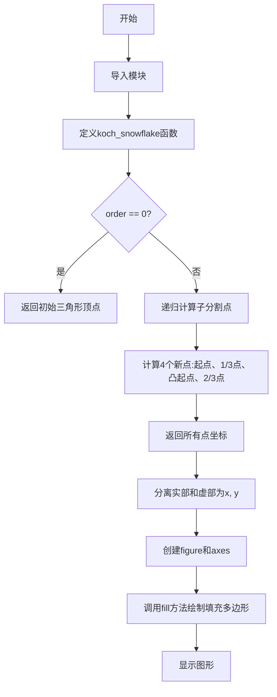
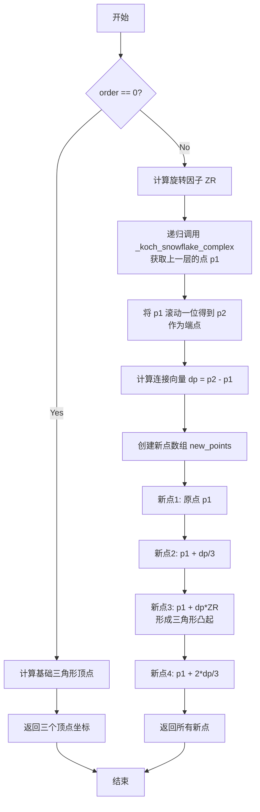

# `matplotlib\galleries\examples\lines_bars_and_markers\fill.py` 详细设计文档

该代码实现了一个绘制科赫雪花（Koch snowflake）填充多边形的示例，通过递归算法生成雪花的几何坐标点，并使用matplotlib的fill方法将点连接成封闭的填充多边形进行可视化展示。

## 整体流程



## 类结构

```
该代码为脚本式示例，无类层次结构
主要包含:
└── 模块级函数
    ├── koch_snowflake (主函数)
    └── _koch_snowflake_complex (内部递归函数)
```

## 全局变量及字段


### `x`
    
雪花顶点的x坐标数组

类型：`numpy.ndarray`
    


### `y`
    
雪花顶点的y坐标数组

类型：`numpy.ndarray`
    


### `order`
    
递归深度，控制雪花的复杂度

类型：`int`
    


### `scale`
    
雪花的规模（基础三角形边长）

类型：`float`
    


### `points`
    
复数形式的坐标点数组

类型：`numpy.ndarray`
    


### `p1`
    
线段起点

类型：`numpy.ndarray`
    


### `p2`
    
线段终点

类型：`numpy.ndarray`
    


### `dp`
    
连接向量

类型：`numpy.ndarray`
    


### `new_points`
    
细分后的新点数组

类型：`numpy.ndarray`
    


    

## 全局函数及方法


### koch_snowflake

生成科赫雪花（Koch Snowflake）分形几何图形的坐标点序列。该函数通过递归算法在复平面上计算科赫雪花的顶点坐标，支持自定义递归深度和图形尺寸，最终返回两组坐标数组（x 和 y）用于绘制填充多边形。

参数：

- `order`：`int`，递归深度，指定科赫曲线细分的次数，次数越多雪花边缘越精细
- `scale`：`float`，雪花的尺寸（默认值为10），表示基础等边三角形的边长

返回值：`tuple`，返回两个 numpy 数组 (x, y)，分别表示科赫雪花顶点的横坐标和纵坐标

#### 流程图

```mermaid
flowchart TD
    A[开始 koch_snowflake] --> B[调用 _koch_snowflake_complex order]
    B --> C{order == 0?}
    C -->|Yes| D[生成初始等边三角形顶点<br/>angles = [90, 210, 330]<br/>return scale/√3 × e^(i×角度)]
    C -->|No| E[计算旋转因子 ZR<br/>ZR = 0.5 - 0.5j×√3/3]
    E --> F[递归调用 _koch_snowflake_complex order-1]
    F --> G[获取起点 p1 和终点 p2<br/>p2 = roll(p1, -1)]
    G --> H[计算连接向量 dp = p2 - p1]
    H --> I[生成4个新顶点<br/>p1, p1+dp/3, p1+dp×ZR, p1+2dp/3]
    I --> J[返回新顶点数组]
    D --> K[合并所有递归结果]
    J --> K
    K --> L[分离实部和虚部<br/>x = points.real<br/>y = points.imag]
    L --> M[返回 x, y 坐标]
```

#### 带注释源码

```python
def koch_snowflake(order, scale=10):
    """
    Return two lists x, y of point coordinates of the Koch snowflake.

    Parameters
    ----------
    order : int
        The recursion depth.
    scale : float
        The extent of the snowflake (edge length of the base triangle).
    """
    
    def _koch_snowflake_complex(order):
        """内部递归函数，在复平面上计算科赫雪花顶点"""
        
        if order == 0:
            # 递归基准情况：生成初始等边三角形
            # 角度偏移90度使三角形顶点朝上
            angles = np.array([0, 120, 240]) + 90
            # 计算三角形外接圆半径：scale / √3
            # 将角度转换为复数指数形式：r × e^(iθ)
            return scale / np.sqrt(3) * np.exp(np.deg2rad(angles) * 1j)
        else:
            # 递归步骤：生成分形新顶点
            # ZR 是科赫曲线中向外突出的复数旋转因子
            # 对应60度旋转且长度缩短为原来的 1/3
            ZR = 0.5 - 0.5j * np.sqrt(3) / 3

            # 递归获取上一层的所有顶点作为起点
            p1 = _koch_snowflake_complex(order - 1)
            
            # 通过数组滚动获取终点（首尾相连形成闭合路径）
            # shift=-1 使每个点与其下一个点配对
            p2 = np.roll(p1, shift=-1)
            
            # 计算从每条线段起点到终点的连接向量
            dp = p2 - p1

            # 为每条线段生成4个新顶点（科赫曲线特性）
            # 总顶点数 = 原顶点数 × 4
            new_points = np.empty(len(p1) * 4, dtype=np.complex128)
            
            # 第1个点：线段起点
            new_points[::4] = p1
            # 第2个点：三分点（靠近起点）
            new_points[1::4] = p1 + dp / 3
            # 第3个点：科赫曲线凸起点（旋转60度）
            new_points[2::4] = p1 + dp * ZR
            # 第4个点：三分点（靠近终点）
            new_points[3::4] = p1 + dp / 3 * 2
            
            return new_points

    # 调用内部递归函数获取复数坐标点
    points = _koch_snowflake_complex(order)
    
    # 分离复数的实部（x坐标）和虚部（y坐标）
    x, y = points.real, points.imag
    
    return x, y
```


### `_koch_snowflake_complex`

内部递归函数，计算科赫曲线的复数坐标点。它接收递归深度 `order`，通过递归方式计算并返回科赫雪花在当前递归层级下的所有顶点坐标（以复数形式表示）。

参数：

- `order`：`int`，递归深度，0 表示基础三角形，大于 0 表示细分次数

返回值：`numpy.ndarray`，类型为 `complex128`，返回科赫雪花的所有顶点坐标（复数形式）

#### 流程图



#### 带注释源码

```python
def _koch_snowflake_complex(order):
    """
    内部递归函数，计算科赫曲线的复数坐标点。
    
    Parameters
    ----------
    order : int
        递归深度，0 表示基础三角形，大于 0 表示细分次数
    
    Returns
    -------
    numpy.ndarray
        复数形式的顶点坐标数组
    """
    if order == 0:
        # 递归终止条件：返回基础三角形的三个顶点
        # 角度旋转90度使三角形顶点朝上
        angles = np.array([0, 120, 240]) + 90
        # 计算外接圆半径，使得三角形边长为 scale
        # scale / sqrt(3) 为外接圆半径
        return scale / np.sqrt(3) * np.exp(np.deg2rad(angles) * 1j)
    else:
        # 科赫曲线的旋转因子
        # 对应于在线段上生成等边三角形凸起时的旋转角度（60度）
        ZR = 0.5 - 0.5j * np.sqrt(3) / 3

        # 递归调用：获取上一层的所有顶点
        p1 = _koch_snowflake_complex(order - 1)  # 起始点
        
        # 将数组滚动一位，使每两个相邻点形成线段
        # 例如：[a, b, c] -> [c, a, b]，这样 a->b, b->c, c->a 形成闭环
        p2 = np.roll(p1, shift=-1)  # 结束点
        
        # 计算从每段起点到终点的向量
        dp = p2 - p1  # 连接向量

        # 创建新点数组，每个原始线段生成4个新点
        # 总点数 = 原始点数 * 4
        new_points = np.empty(len(p1) * 4, dtype=np.complex128)
        
        # 第一个点：线段起点
        new_points[::4] = p1
        
        # 第二个点：线段的三等分点（第一个）
        new_points[1::4] = p1 + dp / 3
        
        # 第三个点：三角形凸起的顶点
        # p1 + dp * ZR 实现了旋转60度并缩放1/3
        new_points[2::4] = p1 + dp * ZR
        
        # 第四个点：线段的三等分点（第二个）
        new_points[3::4] = p1 + dp / 3 * 2
        
        return new_points
```

## 关键组件


### 核心功能概述

该代码实现了一个科赫雪花（Koch Snowflake）分形几何的生成与绘制功能，通过递归算法计算雪花轮廓的点坐标，并使用Matplotlib库将生成的几何图形填充显示。

### 文件整体运行流程

1. 定义 `koch_snowflake(order, scale)` 函数，接收递归深度和雪花规模参数
2. 在函数内部定义递归辅助函数 `_koch_snowflake_complex(order)` 用于复数平面上的分形计算
3. 递归终止条件：order=0 时返回初始三角形顶点坐标
4. 递归计算阶段：对上一级线段进行三分并凸起形成新的三角形顶点
5. 返回实部x和虚部y坐标数组
6. 主程序调用生成坐标数据
7. 使用 `plt.fill()` 函数绘制填充多边形并展示图形

### 函数详细信息

#### 1. koch_snowflake 函数

- **参数**:
  - `order`: int, 递归深度，决定雪花的精细程度
  - `scale`: float, 雪花规模，默认为10，表示基础三角形边长
- **返回值**: 
  - x: numpy.ndarray, 雪花顶点的x坐标数组
  - y: numpy.ndarray, 雪花顶点的y坐标数组

**带注释源码**:
```python
def koch_snowflake(order, scale=10):
    """
    Return two lists x, y of point coordinates of the Koch snowflake.

    Parameters
    ----------
    order : int
        The recursion depth.
    scale : float
        The extent of the snowflake (edge length of the base triangle).
    """
    def _koch_snowflake_complex(order):
        if order == 0:
            # 递归终止条件：返回初始等边三角形顶点
            # 角度旋转90度使三角形正立
            angles = np.array([0, 120, 240]) + 90
            # 计算三角形外接圆半径并转换为复数坐标
            return scale / np.sqrt(3) * np.exp(np.deg2rad(angles) * 1j)
        else:
            # 旋转因子：将线段三分后中间段突起形成三角形
            ZR = 0.5 - 0.5j * np.sqrt(3) / 3

            # 递归获取上一级所有顶点
            p1 = _koch_snowflake_complex(order - 1)  # 起点数组
            # 循环移位得到终点数组（首尾相连）
            p2 = np.roll(p1, shift=-1)  # 终点数组
            # 计算每条边的向量
            dp = p2 - p1  # 连接向量

            # 为每条边生成4个新点（起点、三分点、凸起点、三分点）
            new_points = np.empty(len(p1) * 4, dtype=np.complex128)
            new_points[::4] = p1  # 原起点
            new_points[1::4] = p1 + dp / 3  # 三分之一处
            new_points[2::4] = p1 + dp * ZR  # 凸起点
            new_points[3::4] = p1 + dp / 3 * 2  # 三分之二处
            return new_points

    # 调用内部复数函数并分离实部和虚部
    points = _koch_snowflake_complex(order)
    x, y = points.real, points.imag
    return x, y
```

#### 2. _koch_snowflake_complex 内部函数

- **参数**:
  - order: int, 当前递归深度
- **返回值**: numpy.ndarray (complex128), 复数形式的顶点坐标数组
- **描述**: 递归计算科赫曲线在复平面上的顶点位置

### 关键组件信息

#### 科赫曲线递归生成器

使用复数运算实现科赫分形曲线的递归生成，通过将每条线段三等分并在中间段凸起形成新三角形边。

#### 顶点坐标变换模块

将复数坐标转换为笛卡尔坐标系（x, y），便于Matplotlib绘图使用。

#### 图形渲染模块

利用Matplotlib的`Axes.fill()`方法将生成的坐标点填充为多边形，并支持自定义填充色和边框样式。

### 潜在技术债务与优化空间

1. **数值精度问题**: 使用`np.complex128`类型可能在极高递归深度时累积浮点误差，建议增加数值稳定性处理
2. **内存效率**: 对于大order值，数组频繁创建和扩展会产生较大开销，可考虑预分配策略
3. **代码封装**: 缺少对order参数的有效性校验，负数或过大值可能导致性能问题或异常
4. **图形性能**: 递归深度过大时顶点数量指数增长(3×4^order)，应添加深度限制保护

### 其它项目

#### 设计目标与约束

- 目标：生成可配置的科赫雪花分形几何用于教学演示
- 约束：依赖NumPy和Matplotlib库，递归深度受限于计算资源

#### 错误处理与异常设计

- 未对非法输入参数（负数order、非数值scale）进行校验
- 缺少对递归深度的上限保护

#### 数据流与状态机

数据流：输入参数(order, scale) → 递归分形计算 → 复数坐标 → 实部虚部分离 → Matplotlib渲染 → 图形输出

#### 外部依赖与接口契约

- NumPy：提供数组操作和复数运算支持
- Matplotlib：提供图形绘制和展示功能


## 问题及建议


### 已知问题

-   **缺少类型注解**：函数参数和返回值均无类型注解，降低了代码可读性和IDE支持
-   **缺乏输入验证**：未对 `order` 和 `scale` 参数进行有效性检查（如负数、非整数等）
-   **魔法数字缺乏解释**：代码中存在硬编码的数学常数（如 `np.sqrt(3)`、`0.5 - 0.5j * np.sqrt(3) / 3`），缺少注释说明其数学含义
-   **内部函数无文档字符串**：`_koch_snowflake_complex` 函数缺少docstring，降低了代码可维护性
-   **返回值缺乏语义**：函数返回裸元组 `(x, y)`，调用方需记住顺序，建议使用命名元组或字典增强可读性
-   **递归深度风险**：对于较大的 `order` 值可能导致递归栈溢出，缺乏深度限制保护
-   **NumPy数组预分配不清晰**：`np.empty(len(p1) * 4)` 的4倍关系依赖于递归特性，代码意图不明显
-   **全局代码执行**：示例代码在模块顶层直接执行，不利于代码复用和测试
-   **缺少错误处理**：未处理可能的数值异常情况

### 优化建议

-   **添加类型注解**：`def koch_snowflake(order: int, scale: float = 10) -> tuple[np.ndarray, np.ndarray]`
-   **增加输入验证**：在函数开头添加 `if order < 0: raise ValueError(...)` 和 `if scale <= 0: raise ValueError(...)`
-   **添加数学常数注释**：解释 `np.sqrt(3)` 为正三角形高的比例因子，`ZR` 为复数旋转因子
-   **为内部函数添加文档字符串**：说明递归生成Koch曲线的逻辑
-   **返回命名结构**：使用 `collections.namedtuple` 或字典返回结果，如 `return {'x': x, 'y': y}`
-   **限制递归深度**：添加 `max_order` 参数限制，防止资源耗尽
-   **重构为可导入模块**：将示例绘图代码封装在 `if __name__ == "__main__":` 块中
-   **考虑使用迭代实现**：对于大order值，使用迭代代替递归可提升性能并避免栈溢出


## 其它


### 设计目标与约束

本代码旨在演示matplotlib的fill()函数绘制填充多边形的能力，以Koch雪花作为具体示例。设计目标包括：(1) 提供一个完整的、可直接运行的绘图示例；(2) 展示如何通过递归算法生成复杂几何形状；(3) 演示matplotlib多边形填充的多种配置方式（facecolor、edgecolor、linewidth）。约束条件包括：依赖matplotlib和numpy两个外部库；order参数受限于递归深度和计算性能；scale参数影响图形尺寸。

### 错误处理与异常设计

代码中的错误处理主要包含以下几个方面：(1) order参数未做显式校验，当传入负数时会导致无限递归，应在函数入口添加参数有效性检查；(2) scale参数未做边界校验，负值或零值会导致异常；(3) numpy数组操作未做空值检查，当order=0时返回的数组长度为3，其他情况按递归深度动态计算；(4) 缺少对非数值类型输入的TypeError处理。

### 数据流与状态机

数据流主要分为三个阶段：第一阶段是初始化三角形顶点，通过scale计算内接圆半径得到三个顶点坐标；第二阶段是递归生成分形边，每一层递归将每条边分割为4段新边并形成凸起；第三阶段是坐标转换，将复数形式的点坐标分离为实部(x)和虚部(y)用于matplotlib绘图。状态机流转：_koch_snowflake_complex函数根据order值决定当前状态，order==0时进入终止状态返回基础三角形，order>0时进入递归状态继续生成分形结构。

### 外部依赖与接口契约

本代码依赖两个外部包：(1) matplotlib.pyplot模块，提供figure、subplots、fill、axis、show等绘图API；(2) numpy模块，提供数组操作、复数运算、三角函数等数学计算功能。接口契约方面：koch_snowflake函数接受order（int类型，递归深度）和scale（float类型，基础尺寸）两个参数，返回两个numpy.ndarray类型的一维数组分别表示x坐标和y坐标；内部函数_koch_snowflake_complex接受order参数返回numpy.complex128类型的数组。

### 性能考虑与优化空间

性能瓶颈主要体现在：(1) 递归调用_koch_snowflake_complex函数，每层递归都会重新计算整个点集，时间复杂度为O(4^n)；(2) np.roll操作创建新数组而非视图；(3) 重复计算常数ZR = 0.5 - 0.5j * np.sqrt(3) / 3。优化建议：(1) 可使用缓存机制存储已计算的递归层级结果；(2) 可预先分配完整数组空间避免动态扩展；(3) ZR作为常量可提取到模块级别；(4) 对于大规模应用可考虑使用迭代而非递归实现。

### 边界条件与限制

代码存在以下边界条件和限制：(1) order=0时返回等边三角形的三个顶点；(2) order过大时（如order>7）会产生大量顶点导致内存和性能问题，numpy.complex128数组长度最大约为3*4^7=49152；(3) scale参数为0时返回全零坐标；(4) scale为负数时产生镜像翻转的雪花；(5) 非整数order可能导致类型转换问题，应明确要求整数类型。

### 可测试性设计

当前代码缺乏单元测试设计。建议添加的测试用例包括：(1) 验证order=0时返回3个点且构成等边三角形；(2) 验证order=1时返回12个点且形成基本雪花形状；(3) 验证返回的x、y数组长度一致；(4) 验证scale参数对输出坐标的缩放效果；(5) 验证异常输入（负数order、非数值类型）的错误处理。可使用pytest框架编写测试函数。

### 代码可维护性与扩展性

当前代码结构清晰但扩展性有限：(1) 仅支持Koch一种分形算法，可抽象为分形生成器接口支持多种分形；(2) 绘图部分与计算部分耦合，可通过将计算结果返回给调用者实现解耦；(3) 缺少配置对象或参数类，参数增多时代码可读性下降；(4) 文档字符串可增加返回值单位说明和示例。维护建议：添加版本信息、CHANGELOG和更详细的API文档。


    