# `matplotlib\galleries\examples\lines_bars_and_markers\fill_between_alpha.py` 详细设计文档

该代码是Matplotlib的示例脚本，展示了fill_between函数的各种用法，包括基本填充、透明度控制、统计区间显示以及条件填充等功能，用于创建具有视觉吸引力和数据解释性的图表。

## 整体流程

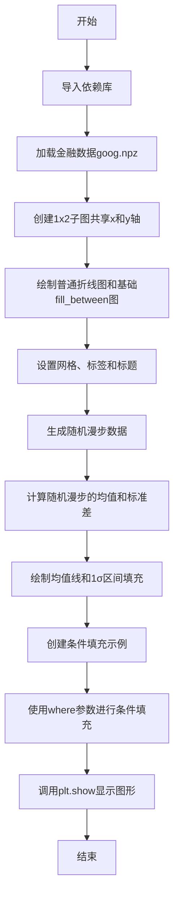
```mermaid
graph TD
    A[开始] --> B[导入依赖库]
B --> C[加载金融数据goog.npz]
C --> D[创建1x2子图共享x和y轴]
D --> E[绘制普通折线图和基础fill_between图]
E --> F[设置网格、标签和标题]
F --> G[生成随机漫步数据]
G --> H[计算随机漫步的均值和标准差]
H --> I[绘制均值线和1σ区间填充]
I --> J[创建条件填充示例]
J --> K[使用where参数进行条件填充]
K --> L[调用plt.show显示图形]
L --> M[结束]
```

## 类结构

```
该脚本为单文件Python脚本，无类定义
主要使用Matplotlib的面向对象API
核心函数: fill_between, plot, subplots, axhspan, axvspan
```

## 全局变量及字段


### `r`
    
加载的金融数据数组，包含谷歌股票的价格数据

类型：`numpy.ndarray`
    


### `fig`
    
Figure图形对象，用于承载整个图表

类型：`matplotlib.figure.Figure`
    


### `ax1`
    
第一个Axes子图对象，用于绘制折线图

类型：`matplotlib.axes.Axes`
    


### `ax2`
    
第二个Axes子图对象，用于绘制填充图

类型：`matplotlib.axes.Axes`
    


### `pricemin`
    
收盘价的最小值，用于设置填充区域下界

类型：`float`
    


### `Nsteps`
    
随机漫步的总步数

类型：`int`
    


### `Nwalkers`
    
随机漫步者的数量

类型：`int`
    


### `t`
    
时间/步数数组，表示从0到Nsteps-1的序列

类型：`numpy.ndarray`
    


### `S1`
    
第一组随机漫步的步骤数组，包含正态分布随机数

类型：`numpy.ndarray`
    


### `S2`
    
第二组随机漫步的步骤数组，包含正态分布随机数

类型：`numpy.ndarray`
    


### `X1`
    
第一组随机漫步的累积位置数组

类型：`numpy.ndarray`
    


### `X2`
    
第二组随机漫步的累积位置数组

类型：`numpy.ndarray`
    


### `mu1`
    
第一组随机漫步随时间变化的均值数组

类型：`numpy.ndarray`
    


### `sigma1`
    
第一组随机漫步随时间变化的标准差数组

类型：`numpy.ndarray`
    


### `mu2`
    
第二组随机漫步随时间变化的均值数组

类型：`numpy.ndarray`
    


### `sigma2`
    
第二组随机漫步随时间变化的标准差数组

类型：`numpy.ndarray`
    


### `S`
    
单个随机漫步的步骤数组

类型：`numpy.ndarray`
    


### `X`
    
单个随机漫步的累积位置数组

类型：`numpy.ndarray`
    


### `lower_bound`
    
根据解析公式计算的分析下界数组

类型：`numpy.ndarray`
    


### `upper_bound`
    
根据解析公式计算的分析上界数组

类型：`numpy.ndarray`
    


### `ax`
    
单子图Axes对象，用于绘制图表

类型：`matplotlib.axes.Axes`
    


### `mu`
    
随机漫步的均值参数，控制随机漫步的中心趋势

类型：`float`
    


### `sigma`
    
随机漫步的标准差参数，控制随机漫步的离散程度

类型：`float`
    


    

## 全局函数及方法


### `plt.subplots`

`plt.subplots` 是 matplotlib 库中的一个函数，用于创建一个图形（Figure）和一组子图（Axes）。它可以创建规则的子图网格，并返回图形对象和轴对象，支持共享坐标轴、设置子图比例等功能。

参数：

- `nrows`：`int`，可选，默认值为1，子图网格的行数
- `ncols`：`int`，可选，默认值为1，子图网格的列数
- `sharex`：`bool` 或 `str`，可选，默认值为False，是否共享x轴。当设置为True或'all'时，所有子图共享x轴；当设置为'row'时，同一行子图共享x轴
- `sharey`：`bool` 或 `str`，可选，默认值为False，是否共享y轴。当设置为True或'all'时，所有子图共享y轴；当设置为'col'时，同一列子图共享y轴
- `squeeze`：`bool`，可选，默认值为True，是否压缩返回的轴数组。为True时，对于单个子图返回标量，多个子图返回一维或二维数组
- `width_ratios`：`array-like`，可选，定义每列的相对宽度
- `height_ratios`：`array-like`，可选，定义每行的相对高度
- `subplot_kw`：`dict`，可选，创建每个子图的关键字参数，传递给add_subplot
- `gridspec_kw`：`dict`，可选，传递给GridSpec构造函数的关键字参数
- `**fig_kw`：可选，传递给Figure构造函数的关键字参数，如figsize、dpi等

返回值：`(fig, axes)` 或 `(fig, ax)`，返回图形对象（Figure）和轴对象（Axes）。当squeeze=True时，对于单个子图返回单个Axes对象；对于多个子图返回一维或二维NumPy数组

#### 流程图

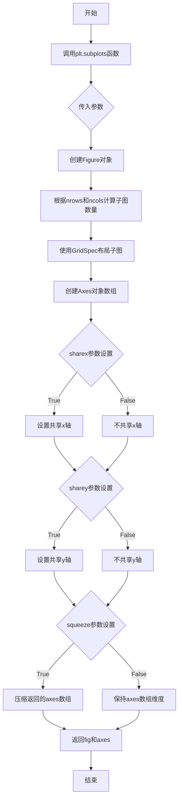
```mermaid
graph TD
    A[开始] --> B[调用plt.subplots函数]
    B --> C{传入参数}
    C --> D[创建Figure对象]
    D --> E[根据nrows和ncols计算子图数量]
    E --> F[使用GridSpec布局子图]
    F --> G[创建Axes对象数组]
    G --> H{sharex参数设置}
    H -->|True| I[设置共享x轴]
    H -->|False| J[不共享x轴]
    I --> K{sharey参数设置}
    J --> K
    K -->|True| L[设置共享y轴]
    K -->|False| M[不共享y轴]
    L --> N{squeeze参数设置}
    M --> N
    N -->|True| O[压缩返回的axes数组]
    N -->|False| P[保持axes数组维度]
    O --> Q[返回fig和axes]
    P --> Q
    Q --> R[结束]
```

#### 带注释源码

```python
# plt.subplots 源码实现原理（简化版）

def subplots(nrows=1, ncols=1, sharex=False, sharey=False, 
             squeeze=True, width_ratios=None, height_ratios=None,
             subplot_kw=None, gridspec_kw=None, **fig_kw):
    """
    创建图形和子图网格
    
    参数:
        nrows: 子图行数
        ncols: 子图列数  
        sharex: 是否共享x轴
        sharey: 是否共享y轴
        squeeze: 是否压缩返回数组
        width_ratios: 列宽度比例
        height_ratios: 行高度比例
        subplot_kw: 子图创建参数
        gridspec_kw: 网格布局参数
        **fig_kw: 图形参数
    
    返回:
        fig: Figure对象
        axes: Axes对象或数组
    """
    
    # 1. 创建Figure对象
    fig = Figure(**fig_kw)
    
    # 2. 计算总子图数量
    total_subplots = nrows * ncols
    
    # 3. 创建GridSpec用于布局管理
    gs = GridSpec(nrows, ncols, 
                  width_ratios=width_ratios,
                  height_ratios=height_ratios,
                  **gridspec_kw)
    
    # 4. 创建子图数组
    axes = []
    for i in range(nrows):
        row_axes = []
        for j in range(ncols):
            # 创建子图
            ax = fig.add_subplot(gs[i, j], **subplot_kw)
            row_axes.append(ax)
        axes.append(row_axes)
    
    # 5. 处理共享轴
    if sharex:
        # 设置子图共享x轴
        _share_axes(axes, 'x', sharex)
    if sharey:
        # 设置子图共享y轴
        _share_axes(axes, 'y', sharey)
    
    # 6. 根据squeeze参数处理返回数组
    if squeeze:
        axes = np.array(axes).squeeze()
    
    return fig, axes
```

在代码中的实际使用示例：

```python
# 示例1: 创建1行2列的子图，共享x和y轴
fig, (ax1, ax2) = plt.subplots(1, 2, sharex=True, sharey=True)

# 示例2: 创建1行1列的子图
fig, ax = plt.subplots(1)

# 实际调用时内部会:
# 1. 创建Figure对象
# 2. 使用GridSpec(nrows=1, ncols=2)布局
# 3. 创建两个Axes对象
# 4. 由于sharex=True和sharey=True，设置ax2共享ax1的坐标轴
# 5. squeeze=True时返回一维数组(ax1, ax2)
```


### `plt.plot`

`plt.plot` 是 Matplotlib 库中的核心函数，用于绘制 y 相对于 x 的折线图，支持多种线条样式、颜色、标记和属性配置，是最常用的数据可视化函数之一。

参数：

- `x`：`array-like`，可选，x 轴数据。如果未提供，则使用默认的索引序列 (0, 1, 2, ...)。
- `y`：`array-like`，必需，y 轴数据。
- `fmt`：`str`，可选，格式字符串，组合了颜色、线型和标记样式，如 `'ro-'` 表示红色圆圈标记的实线。
- `color` 或 `c`：`color`，可选，线条颜色，可以是颜色名称、RGB/RGBA 元组或十六进制字符串。
- `linestyle` 或 `ls`：`str`，可选，线型样式，如 `'-'`（实线）、`'--'`（虚线）、`':'`（点线）、`'-.'`（点划线）。
- `linewidth` 或 `lw`：`float`，可选，线条宽度，数值越大线条越粗。
- `marker`：`str`，可选，数据点标记样式，如 `'o'`（圆圈）、`'s'`（方形）、`'^'`（三角形）、`'D'`（菱形）。
- `markersize` 或 `ms`：`float`，可选，标记大小。
- `alpha`：`float`，可选，透明度，范围 0-1，0 表示完全透明，1 表示完全不透明。
- `label`：`str`，可选，图例标签，用于标识线条。
- `zorder`：`float`，可选，绘制顺序，数值大的图层在上方。

返回值：`list[matplotlib.lines.Line2D]`，返回 Line2D 对象列表，每个对象代表一条绘制的线条。

#### 流程图

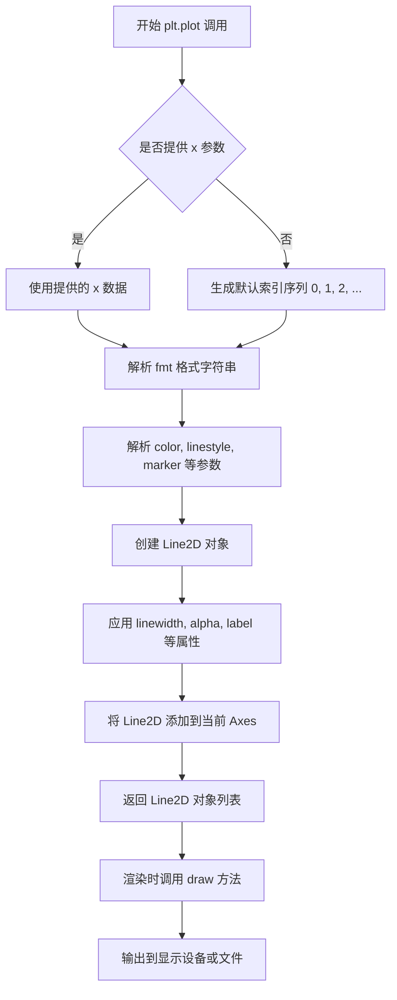
```mermaid
flowchart TD
    A[开始 plt.plot 调用] --> B{是否提供 x 参数}
    B -->|是| C[使用提供的 x 数据]
    B -->|否| D[生成默认索引序列 0, 1, 2, ...]
    C --> E[解析 fmt 格式字符串]
    D --> E
    E --> F[解析 color, linestyle, marker 等参数]
    F --> G[创建 Line2D 对象]
    G --> H[应用 linewidth, alpha, label 等属性]
    H --> I[将 Line2D 添加到当前 Axes]
    I --> J[返回 Line2D 对象列表]
    J --> K[渲染时调用 draw 方法]
    K --> L[输出到显示设备或文件]
```

#### 带注释源码

```python
import matplotlib.pyplot as plt
import numpy as np
import matplotlib.cbook as cbook

# 加载示例金融数据
r = cbook.get_sample_data('goog.npz')['price_data']

# 创建两个共享 x 和 y 轴的子图
fig, (ax1, ax2) = plt.subplots(1, 2, sharex=True, sharey=True)

# 获取最低价格
pricemin = r["close"].min()

# --- 核心调用示例 1: 简单折线图 ---
# 绘制日期与收盘价的关系线
# 参数说明:
#   r["date"]: x轴数据 (日期)
#   r["close"]: y轴数据 (收盘价)
#   lw=2: linewidth=2，设置线条宽度为2
ax1.plot(r["date"], r["close"], lw=2)

# --- 核心调用示例 2: 带标签的折线图 ---
# 绘制两条随机游走者的平均轨迹线
# 参数说明:
#   t: x轴数据 (步数)
#   mu1, mu2: y轴数据 (平均值)
#   lw=2: 线条宽度
#   label: 图例标签
ax.plot(t, mu1, lw=2, label='mean population 1')
ax.plot(t, mu2, lw=2, label='mean population 2')

# --- 核心调用示例 3: 带样式和颜色的折线图 ---
# 绘制walker位置和人口均值
# 参数说明:
#   t: x轴数据
#   X: walker的实际位置 (y轴)
#   lw=2: 线条宽度
#   label: 图例标签
ax.plot(t, X, lw=2, label='walker position')

# 绘制人口理论均值 (虚线样式)
# 额外参数:
#   color='C0': 使用matplotlib默认颜色方案中的第一种颜色
#   ls='--': linestyle='--'，设置虚线样式
ax.plot(t, mu*t, lw=1, label='population mean', color='C0', ls='--')

# 设置图表标题、坐标轴标签和网格
ax.set_title(r'random walkers empirical $\mu$ and $\pm \sigma$ interval')
ax.legend(loc='upper left')  # 显示图例
ax.set_xlabel('num steps')
ax.set_ylabel('position')
ax.grid()  # 显示网格

# 显示图形
plt.show()
```


### `plt.fill_between`

`plt.fill_between` 是 Matplotlib 库中的绘图函数，用于在两条曲线（y1 和 y2）之间的区域填充颜色，常用于展示数据范围、置信区间或数据波动区域。

参数：

- `x`：`array`，X 轴数据坐标数组，定义填充区域的水平范围
- `y1`：`scalar or array`，第一条曲线的 Y 值（通常为下限或下限边界）
- `y2`：`scalar or array`，第二条曲线的 Y 值（通常为上限或上限边界），默认为 0
- `where`：`array (bool)`，可选，布尔掩码数组，用于指定哪些区间需要填充，只有条件为 True 的区间才会被填充
- `interpolate`：`bool`，可选，是否对填充区域进行插值处理（当 y1 和 y2 交叉时），默认为 False
- `step`：`{'pre', 'post', 'mid'}`，可选，阶梯填充的步进方式
- `**kwargs`：其他关键字参数传递给 `Polygon` 对象，如 `alpha`（透明度）、`facecolor`（填充颜色）、`edgecolor`（边框颜色）等

返回值：`~matplotlib.collections.PolyCollection`，返回一个多边形集合对象，表示填充的区域

#### 流程图

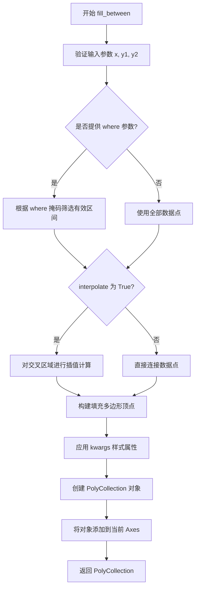
```mermaid
graph TD
    A[开始 fill_between] --> B[验证输入参数 x, y1, y2]
    B --> C{是否提供 where 参数?}
    C -->|是| D[根据 where 掩码筛选有效区间]
    C -->|否| E[使用全部数据点]
    D --> F{interpolate 为 True?}
    E --> F
    F -->|是| G[对交叉区域进行插值计算]
    F -->|否| H[直接连接数据点]
    G --> I[构建填充多边形顶点]
    H --> I
    I --> J[应用 kwargs 样式属性]
    J --> K[创建 PolyCollection 对象]
    K --> L[将对象添加到当前 Axes]
    L --> M[返回 PolyCollection]
```

#### 带注释源码

```python
# 以下为 matplotlib 中 fill_between 方法的核心逻辑示例
# 实际实现位于 matplotlib/lib/matplotlib/axes/_axes.py 中

def fill_between(self, x, y1, y2=0, where=None, interpolate=False, step=None, **kwargs):
    """
    在两条曲线之间填充区域
    
    参数:
        x: x坐标数组
        y1: 第一条曲线的数据
        y2: 第二条曲线的数据，默认为0
        where: 可选的布尔掩码，指定填充区间
        interpolate: 是否在交叉点进行插值
        step: 步进方式 ('pre', 'post', 'mid')
        **kwargs: 传递给 Polygon 的样式参数
    """
    
    # 确保 x, y1, y2 是相同长度的数组
    # 将标量值转换为数组以便统一处理
    x = np.asanyarray(x)
    y1 = np.asanyarray(y1)
    y2 = np.asanyarray(y2)
    
    # 处理 where 条件掩码
    if where is not None:
        # 只保留满足条件的区间
        # 通过创建掩码来过滤数据
        where = np.asarray(where)
        if len(where) != len(x):
            raise ValueError("where 的长度必须与 x 相同")
    
    # 处理 interpolate 参数
    # 当 y1 和 y2 交叉时，插值可以更精确地确定交叉点
    if interpolate and where is not None:
        # 使用线性插值找到交叉点的精确位置
        # 这一步涉及复杂的几何计算
        pass
    
    # 构建多边形的顶点路径
    # 对于每个区间，需要构建闭合的多边形
    # 路径包括：沿 y1 正向 -> 沿 y2 反向 -> 回到起点
    
    # 创建 PolyCollection 对象
    # 应用 facecolor, alpha 等样式参数
    polys = []
    
    # 将 kwargs 传递给 Polygon 构造函数
    # 常见的参数包括:
    # - facecolor: 填充颜色
    # - alpha: 透明度 (0-1)
    # - edgecolor: 边框颜色
    # - linewidth: 边框宽度
    
    # 将填充多边形添加到 Axes
    coll = PolyCollection(polys, **kwargs)
    self.add_collection(coll)
    
    # 自动调整坐标轴范围以显示填充区域
    self.autoscale_view()
    
    return coll
```

---

### 补充说明

#### 设计目标与约束

- **主要用途**：可视化数据范围、置信区间、误差带、地区填充等
- **性能约束**：对于大数据集（>10^6 点），填充操作可能较慢
- **兼容性**：PostScript 格式不支持 alpha 透明度

#### 错误处理与异常设计

- 当 `where` 数组长度与 `x` 不匹配时，抛出 `ValueError`
- 当 `x`, `y1`, `y2` 长度不一致时，抛出异常
- 无效的 `step` 值会抛出异常

#### 外部依赖与接口契约

- 依赖 NumPy 数组处理
- 返回 `PolyCollection` 对象，可进一步自定义样式
- 与 `fill_betweenx`（垂直填充）配合使用

#### 潜在优化空间

1. 大数据点情况下可考虑降采样处理
2. 可添加 GPU 加速支持
3. 可增加缓存机制避免重复计算

</content>


### `plt.grid`

`plt.grid` 是 Matplotlib 库中的全局函数，用于在当前图表或指定 Axes 上显示或隐藏网格线。该函数支持配置网格线的显示范围（主刻度/副刻度）、显示轴（x轴/y轴/两者）以及通过关键字参数自定义网格线的样式。

参数：

- `b`：`bool` 或 `None`，可选，用于是否显示网格线。`True` 显示网格，`False` 隐藏网格，`None` 切换当前状态
- `which`：`{'major', 'minor', 'both'}`，可选，指定网格线应用于哪些刻度线，默认为 `'major'`
- `axis`：`{'both', 'x', 'y'}`，可选，指定在哪个轴上显示网格，默认为 `'both'`
- `**kwargs`：关键字参数，用于传递给 `LineCollection` 对象以自定义网格线样式（如 `color`、`linewidth`、`linestyle` 等）

返回值：`None`，该函数直接修改 Axes 对象的网格状态，无返回值

#### 流程图

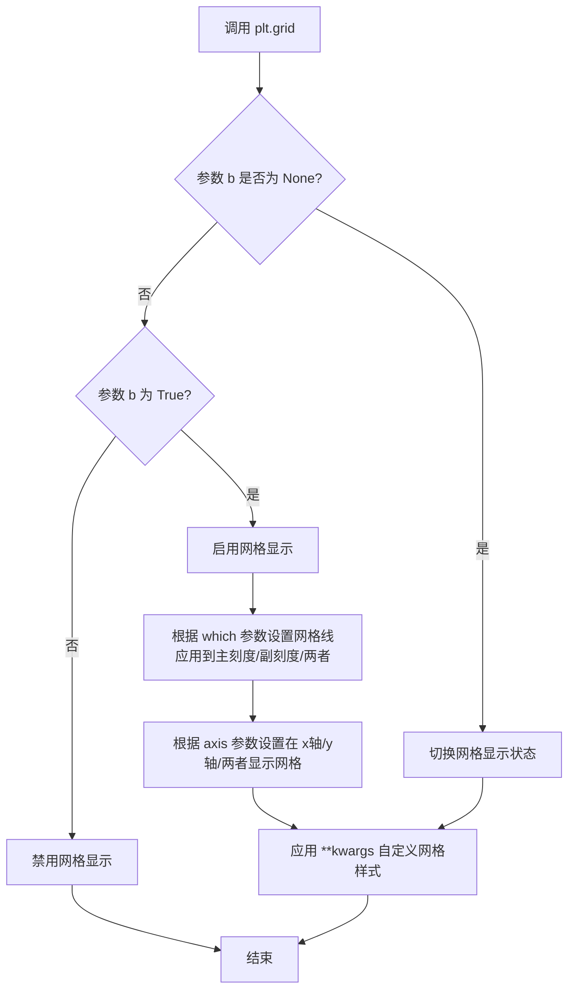
```mermaid
flowchart TD
    A[调用 plt.grid] --> B{参数 b 是否为 None?}
    B -->|是| C[切换网格显示状态]
    B -->|否| D{参数 b 为 True?}
    D -->|是| E[启用网格显示]
    D -->|否| F[禁用网格显示]
    E --> G[根据 which 参数设置网格线应用到主刻度/副刻度/两者]
    G --> H[根据 axis 参数设置在 x轴/y轴/两者显示网格]
    H --> I[应用 **kwargs 自定义网格样式]
    C --> I
    F --> J[结束]
    I --> J
```

#### 带注释源码

```python
# plt.grid 函数源码结构（基于 Matplotlib 源码简化）

def grid(self, b=None, which='major', axis='both', **kwargs):
    """
    在 Axes 上显示或隐藏网格线
    
    参数:
        b : bool 或 None, optional
            - True: 显示网格线
            - False: 隐藏网格线
            - None: 切换当前状态（显示→隐藏 或 隐藏→显示）
        
        which : {'major', 'minor', 'both'}, optional
            - 'major': 只在主刻度位置显示网格线
            - 'minor': 只在副刻度位置显示网格线
            - 'both': 在主刻度和副刻度位置都显示网格线
        
        axis : {'both', 'x', 'y'}, optional
            - 'both': 在 x 轴和 y 轴都显示网格线
            - 'x': 只在 x 轴显示网格线
            - 'y': 只在 y 轴显示网格线
        
        **kwargs : 关键字参数
            传递给 GridSpec 对象的关键字参数，用于自定义网格线样式：
            - color: 网格线颜色
            - linestyle: 网格线样式（'solid', 'dashed', 'dashdot', 'dotted'）
            - linewidth: 网格线宽度
            - alpha: 网格线透明度
    
    返回值:
        None
    """
    
    # 获取当前网格状态（如果有网格线则返回 True）
    if b is None:
        # 如果未指定 b，则切换网格状态
        b = not self.xaxis._major_tick_kw.get('gridOn', False)
    
    # 确保 gridOn 属性存在
    self.xaxis._major_tick_kw.setdefault('gridOn', b)
    self.xaxis._minor_tick_kw.setdefault('gridOn', b)
    self.yaxis._major_tick_kw.setdefault('gridOn', b)
    self.yaxis._minor_tick_kw.setdefault('gridOn', b)
    
    # 根据 which 参数设置网格线应用到哪些刻度
    if which in ('minor', 'both'):
        for ax in [self.xaxis, self.yaxis]:
            ax._minor_tick_kw['gridOn'] = b
    if which in ('major', 'both'):
        for ax in [self.xaxis, self.yaxis]:
            ax._major_tick_kw['gridOn'] = b
    
    # 根据 axis 参数设置在哪些轴上显示网格
    if axis in ('x', 'both'):
        self.xaxis._major_tick_kw['gridOn'] = b
        self.xaxis._minor_tick_kw['gridOn'] = b
    if axis in ('y', 'both'):
        self.yaxis._major_tick_kw['gridOn'] = b
        self.yaxis._minor_tick_kw['gridOn'] = b
    
    # 应用自定义网格样式参数（color, linewidth, linestyle, alpha 等）
    for kw in ['gridOn', 'gridColor', 'gridLineWidth', 'gridLinestyle']:
        for ax in [self.xaxis, self.yaxis]:
            for tk in ['_major_tick_kw', '_minor_tick_kw']:
                if kw in kwargs and kw != 'gridOn':
                    ax._tick_kw[kw] = kwargs[kw]
```

#### 在示例代码中的使用

```python
# 示例 1: 启用网格
for ax in ax1, ax2:
    ax.grid(True)  # 显示网格线，使用默认样式

# 示例 2: 使用默认参数（等同于 ax.grid(True)）
ax.grid()  # 显示网格线，等同于 ax.grid(True)

# 常用自定义样式示例:
ax.grid(True, which='major', axis='both', 
        color='gray', linestyle='--', linewidth=0.5, alpha=0.6)
```


### `plt.show`

`plt.show` 是 Matplotlib 库中的顶层函数，用于显示当前所有打开的图形窗口。在本代码中，它位于文件末尾，用于渲染并展示前面创建的所有图表（股价走势图、随机游走模拟、以及带置信区间的可视化）。

参数：

- 该函数无任何必需参数

返回值：`None`，无返回值（仅用于图形渲染）

#### 流程图

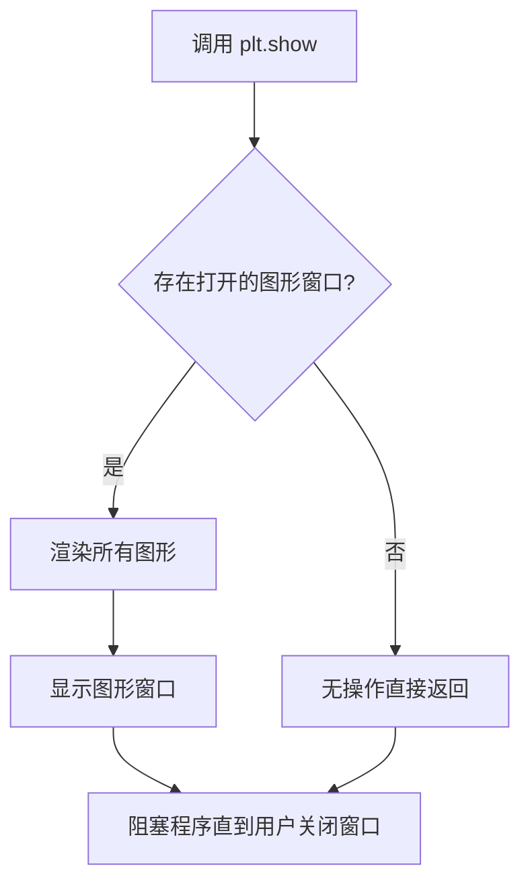
```mermaid
flowchart TD
    A[调用 plt.show] --> B{存在打开的图形窗口?}
    B -->|是| C[渲染所有图形]
    C --> D[显示图形窗口]
    B -->|否| E[无操作直接返回]
    D --> F[阻塞程序直到用户关闭窗口]
    E --> F
```

#### 带注释源码

```python
# plt.show() 函数位于 matplotlib.pyplot 模块中
# 位置：matplotlib.pyplot.show(block=None)
#
# 参数说明（常用参数）：
#   - block: 布尔值或 None
#       * True: 阻塞调用直到所有图形窗口关闭
#       * False: 立即返回（非阻塞模式）
#       * None: 仅在交互式后端时阻塞
#
# 在本代码中的调用：
plt.show()

# 实际执行过程：
# 1. 检查当前是否存在打开的 Figure 对象
# 2. 调用底层图形库的显示函数（如 Qt、Tkinter、GTK 等后端）
# 3. 创建图形窗口并渲染所有 artists（线条、填充区域、坐标轴等）
# 4. 进入事件循环，等待用户交互（关闭窗口、缩放、拖拽等）
#
# 注意：在 Jupyter Notebook 中通常使用 %matplotlib inline
#       而非 plt.show()，因为内联后端会自动渲染
```


### `cbook.get_sample_data`

获取 matplotlib 内置的示例数据文件，返回包含数据的 numpy 归档文件对象。

参数：

- `fname`：`str`，要获取的示例数据文件名，例如 `'goog.npz'`、`'msft.npz'` 等

返回值：`numpy.lib.npyio.NpzFile`，返回 numpy 的 `.npz` 归档文件对象，可通过类似字典的方式访问内部的数据数组（如 `['price_data']`）

#### 流程图

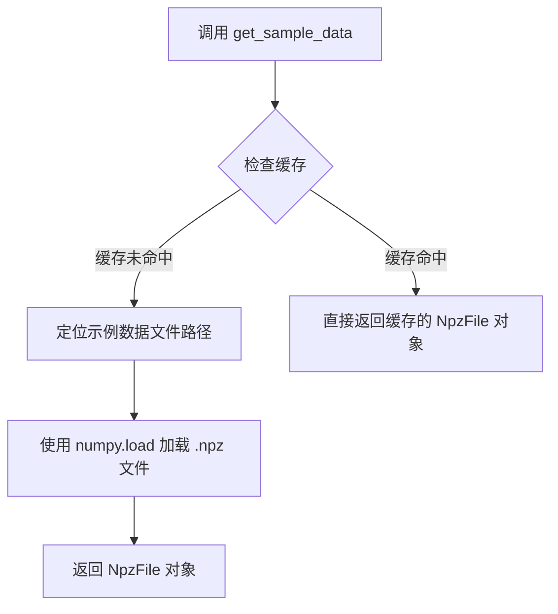
```mermaid
flowchart TD
    A[调用 get_sample_data] --> B{检查缓存}
    B -->|缓存未命中| C[定位示例数据文件路径]
    C --> D[使用 numpy.load 加载 .npz 文件]
    D --> E[返回 NpzFile 对象]
    B -->|缓存命中| F[直接返回缓存的 NpzFile 对象]
```

#### 带注释源码

```python
# 在 matplotlib/cbook.py 中的函数签名和核心逻辑
def get_sample_data(fname, asfileobj=True):
    """
    加载示例数据文件。
    
    参数:
        fname: str
            示例数据文件名，如 'goog.npz', 'msft.npz', 'ada.csv' 等
            
        asfileobj: bool, optional
            是否作为文件对象返回，默认为 True
            
    返回:
        返回值类型取决于数据文件格式:
        - 对于 .npz 文件: numpy.lib.npyio.NpzFile
        - 对于其他格式: 文件对象或路径
        
    示例用法:
        import matplotlib.cbook as cbook
        data = cbook.get_sample_data('goog.npz')
        price_data = data['price_data']  # 访问 npz 内的数组
    """
    # 1. 检查是否已有缓存的示例数据
    # 2. 如果没有，从 matplotlib 的示例数据目录加载
    # 3. 解析文件名并定位到正确的示例数据文件路径
    # 4. 使用 numpy.load 加载 .npz 文件（如果是 npz 格式）
    # 5. 返回可按字典方式访问的 NpzFile 对象
```

**在代码中的实际调用：**

```python
import matplotlib.cbook as cbook

# 获取示例数据文件对象
r = cbook.get_sample_data('goog.npz')['price_data']

# 解释：
# 1. cbook.get_sample_data('goog.npz') 返回 numpy 的 NpzFile 对象
# 2. ['price_data'] 从该对象中提取 'price_data' 键对应的数据数组
# 3. 结果 r 是一个包含 'date' 和 'close' 字段的结构化数组
```


### `np.random.randn`

生成符合标准正态分布（均值0，标准差1）的随机数数组。

参数：

-  `*shape`：`int`，可变数量的整数参数，指定输出数组的维度。例如 `np.random.randn(3, 4)` 生成 3x4 的数组；无参数时返回单个标量。

返回值：`numpy.ndarray`，包含从标准正态分布中采样的随机数的数组，类型为 float64。

#### 流程图

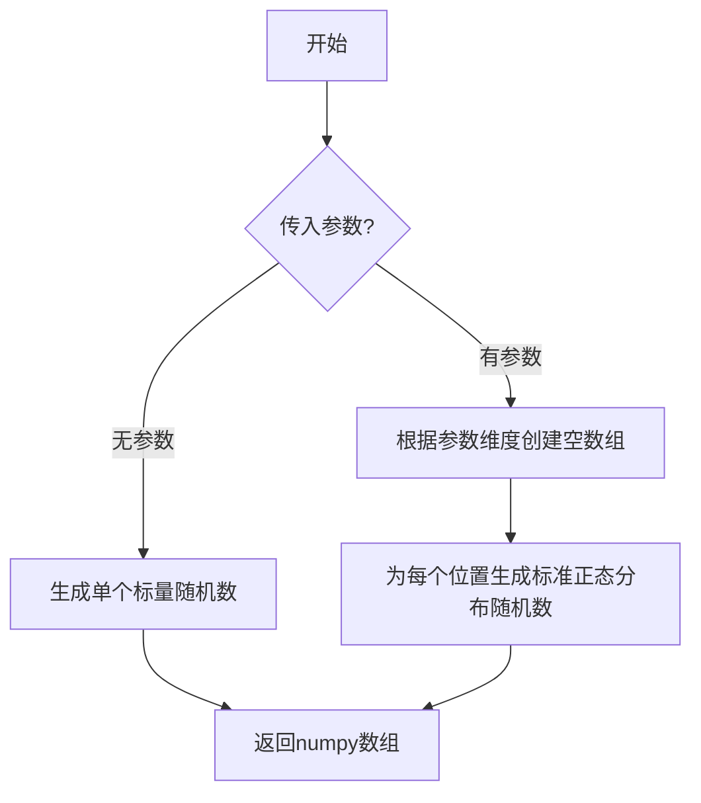
```mermaid
flowchart TD
    A[开始] --> B{传入参数?}
    B -->|无参数| C[生成单个标量随机数]
    B -->|有参数| D[根据参数维度创建空数组]
    D --> E[为每个位置生成标准正态分布随机数]
    C --> F[返回numpy数组]
    E --> F
```

#### 带注释源码

```python
# 示例1：无参数 - 返回单个标量
scalar = np.random.randn()
# 结果类似: -0.234 (随机值)

# 示例2：单参数 - 返回一维数组
arr1d = np.random.randn(5)
# 结果类似: array([-1.234, 0.567, -2.891, 3.456, -0.789])

# 示例3：多参数 - 返回多维数组
arr2d = np.random.randn(3, 4)
# 结果类似: 3行4列的二维数组

# 示例4：在代码中的实际使用
S1 = 0.004 + 0.02*np.random.randn(Nsteps, Nwalkers)
# 生成 Nsteps x Nwalkers 的随机数组，每个值乘以0.02再加0.004
# 将标准正态分布转换为均值0.004、标准差0.02的分布
```


### `np.random.seed`

设置 NumPy 随机数生成器的种子，用于确保随机过程的可重复性。

参数：

- `seed`：`int` 或 `None`，随机数生成器的种子值。如果为 `None`，则从操作系统或系统随机源获取种子。

返回值：`None`，该函数无返回值。

#### 流程图

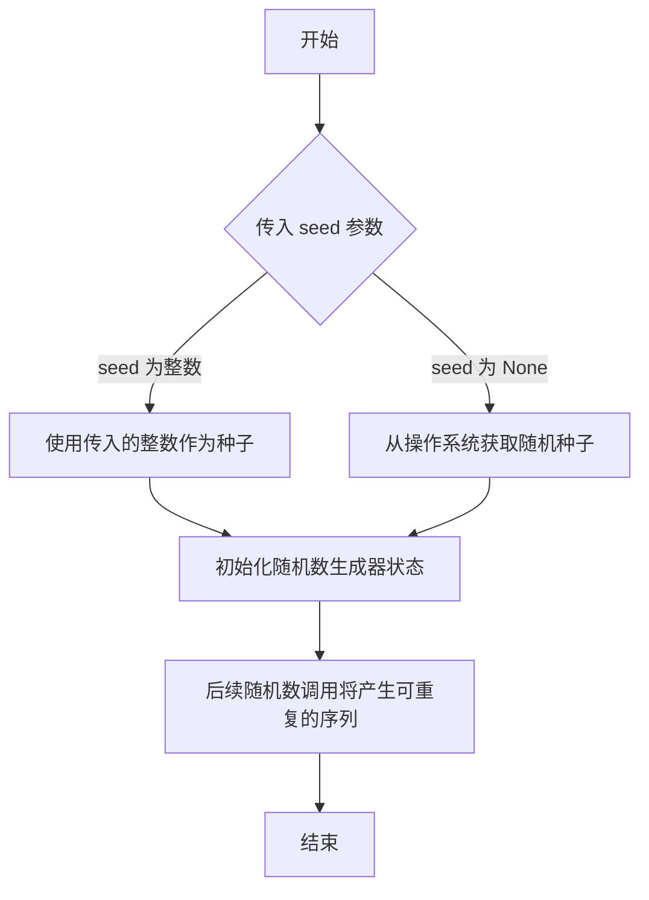
```mermaid
flowchart TD
    A[开始] --> B{传入 seed 参数}
    B -->|seed 为整数| C[使用传入的整数作为种子]
    B -->|seed 为 None| D[从操作系统获取随机种子]
    C --> E[初始化随机数生成器状态]
    D --> E
    E --> F[后续随机数调用将产生可重复的序列]
    F --> G[结束]
```

#### 带注释源码

```python
# 设置随机种子为 19680801，确保后续随机数生成可重复
# 这样可以使随机游走实验的结果在多次运行中保持一致
np.random.seed(19680801)

# 参数说明：
# seed: int 或 None
#     - 如果是整数：使用该整数作为随机种子，生成确定的随机数序列
#     - 如果是 None：从操作系统获取随机熵，每次运行产生不同的序列
#
# 返回值：None
#     - 该函数直接修改全局随机数生成器的内部状态，不返回任何值
#
# 使用场景：
#     - 科学实验需要可重复的结果
#     - 调试随机算法
#     - 单元测试中固定随机行为
```


### np.cumsum

`np.cumsum` 是 NumPy 库中的一个函数，用于计算数组元素的累积和。它沿着指定轴计算元素的累计和，返回一个与输入数组形状相同的数组，其中每个元素是原始数组中该位置之前所有元素的和。

参数：

- `a`：`array_like`，输入的数组
- `axis`：`int`，可选，指定沿哪个轴进行累积求和，默认为 None（将数组展平后再求累积和）
- `dtype`：`dtype`，可选，指定返回数组的数据类型
- `out`：`ndarray`，可选，指定输出数组

返回值：`ndarray`，返回累积和数组

#### 流程图

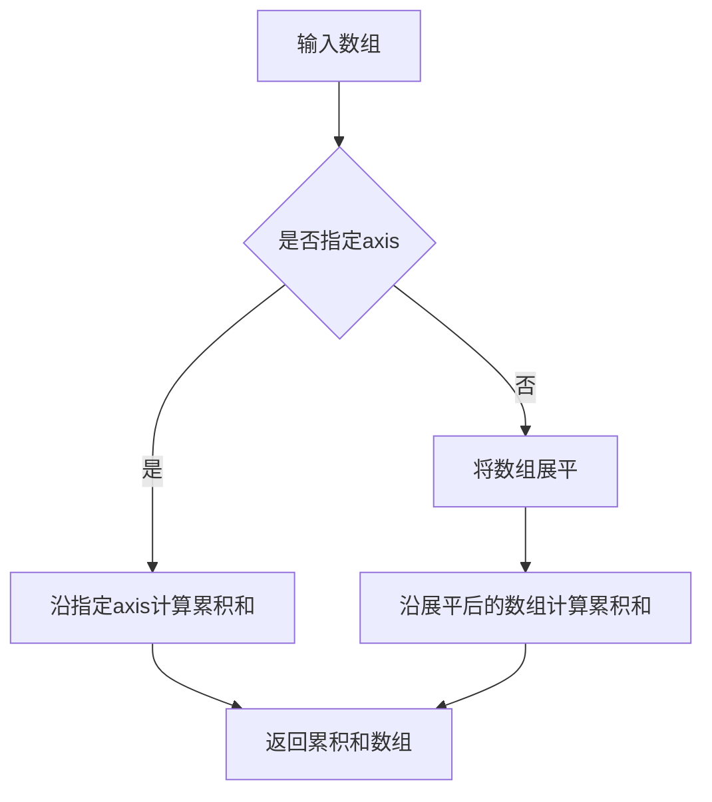
```mermaid
flowchart TD
    A[输入数组] --> B{是否指定axis}
    B -->|否| C[将数组展平]
    B -->|是| D[沿指定axis计算累积和]
    C --> E[沿展平后的数组计算累积和]
    D --> F[返回累积和数组]
    E --> F
```

#### 带注释源码

```python
# 代码中的实际使用示例 1：计算随机游走位置
# S1 和 S2 是 (Nsteps x Nwalkers) 的随机游走步骤数组
S1 = 0.004 + 0.02*np.random.randn(Nsteps, Nwalkers)  # 生成随机步骤
S2 = 0.002 + 0.01*np.random.randn(Nsteps, Nwalkers)

# 对步骤进行累积求和，得到每个时间点的位置
# axis=0 表示沿时间轴（第一个维度）进行累积求和
# 结果 X1, X2 也是 (Nsteps x Nwalkers) 的数组
X1 = S1.cumsum(axis=0)  # 累积求和：X1[t] = S1[0] + S1[1] + ... + S1[t]
X2 = S2.cumsum(axis=0)

# 代码中的实际使用示例 2：计算单个随机游走
S = mu + sigma*np.random.randn(Nsteps)  # 生成 Nsteps 个随机步骤

# 累积求和，默认沿 axis=0（只有一个轴）
# 结果 X 是一个长度为 Nsteps 的数组
X = S.cumsum()  # 累积求和：X[t] = S[0] + S[1] + ... + S[t]

# 用途：
# 在随机游走模拟中，cumsum 用于将每一步的增量（steps）
# 转换为一个位置序列（position），显示随时间累积的位移
```

#### 关键组件信息

| 组件名称 | 一句话描述 |
|---------|-----------|
| `S1.cumsum(axis=0)` | 对250个随机游走者100步的位移进行累积求和 |
| `S2.cumsum(axis=0)` | 对另一组参数的随机游走进行累积求和 |
| `S.cumsum()` | 对单个随机游走的500步进行累积求和 |

#### 潜在的技术债务或优化空间

1. **重复计算**：代码中多次调用 `np.random.randn`，可以考虑预生成随机数
2. **内存效率**：对于大规模的随机游走模拟，使用 `cumsum` 会创建完整的累积数组，可以考虑使用迭代器方式节省内存

#### 其它项目

- **设计目标**：演示 `fill_between` 的多种用法，包括基本的填充、透明度设置、条件填充
- **外部依赖**：NumPy（数值计算）、Matplotlib（可视化）、matplotlib.cbook（工具函数）
- **错误处理**：未在该代码片段中显式处理异常，依赖于 NumPy 和 Matplotlib 的内部错误处理


### np.mean

`np.mean`是NumPy库中的统计函数，用于计算数组元素的算术平均值（均值）。它可以沿指定轴计算均值，也可以计算整个数组的均值，是数据分析和统计处理中最常用的基础函数之一。

参数：

- `a`：`array_like`，需要计算均值的输入数组
- `axis`：`None`、`int`或`int`元组，可选，指定计算均值的轴
- `dtype`：`data-type`，可选，指定计算和返回所用的数据类型
- `out`：`ndarray`，可选，用于放置结果的输出数组
- `keepdims`：`bool`，可选，若为True，则输出的维度保持与输入相同
- `where`：`array_like of bool`，可选，仅计算满足条件的元素（NumPy 1.22.0+）

返回值：`float`或`ndarray`，返回数组元素的均值。若指定`axis`，则返回沿该轴的均值数组；否则返回标量。

#### 流程图

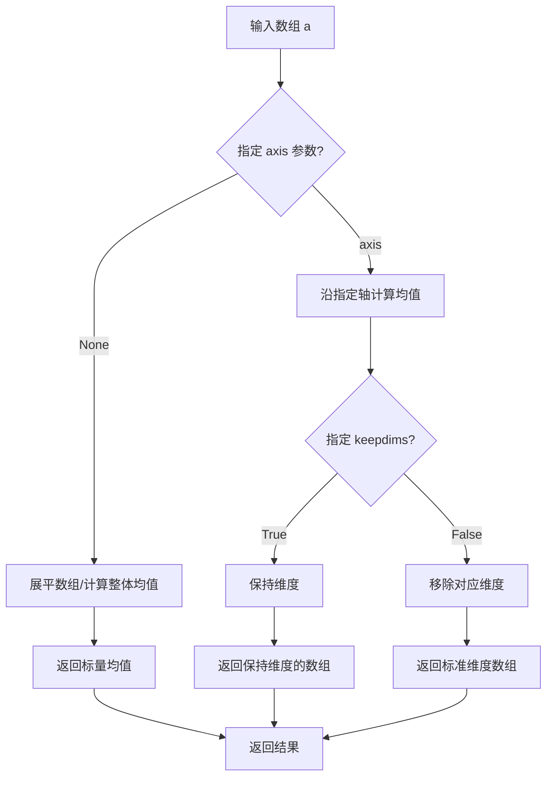
```mermaid
flowchart TD
    A[输入数组 a] --> B{指定 axis 参数?}
    B -->|None| C[展平数组/计算整体均值]
    B -->|axis| D[沿指定轴计算均值]
    C --> E[返回标量均值]
    D --> F{指定 keepdims?}
    F -->|True| G[保持维度]
    F -->|False| H[移除对应维度]
    G --> I[返回保持维度的数组]
    H --> J[返回标准维度数组]
    E --> K[返回结果]
    I --> K
    J --> K
```

#### 带注释源码

```python
def mean(a, axis=None, dtype=None, out=None, keepdims=False, *, where=True):
    """
    计算数组元素的算术平均值。
    
    参数:
        a: array_like
            需要计算均值的数组。
        axis: None, int, tuple of int, optional
            计算均值的轴。None表示对整个数组计算。
        dtype: data-type, optional
            用于计算均值的数据类型。
        out: ndarray, optional
            替代输出数组，用于存放结果。
        keepdims: bool, optional
            若为True，输出数组保持与输入相同的维度。
        where: array_like of bool, optional
            仅对满足条件的元素计算均值（NumPy 1.22.0新增）。
    
    返回值:
        mean: ndarray or scalar
            返回数组的均值。如果axis=None且a是一维的，返回标量。
    """
    # 类型转换，确保输入为数组
    arr = np.asarray(a)
    
    # 处理dtype参数
    if dtype is None:
        dtype = arr.dtype
    
    # 处理where参数（用于条件计算）
    if where is not True:
        arr = np.where(where, arr, np.nan)
    
    # 计算均值
    result = np.sum(arr, axis=axis, dtype=dtype, keepdims=keepdims)
    
    # 除以非NaN元素的数量
    if axis is None:
        # 整体均值：除以元素总数
        n = arr.size if where is True else np.sum(~np.isnan(arr))
    else:
        # 沿轴计算：除以该轴的元素数
        n = arr.shape[axis] if where is True else np.sum(~np.isnan(arr), axis=axis)
    
    return result / n
```


# np.std 函数详细设计文档

## 概述

`np.std` 是 NumPy 库中的统计函数，用于计算数组元素的标准差（Standard Deviation）。标准差是统计学中衡量数据分散程度的度量，表示数据值与平均值之间的差异程度。在给定的代码中，该函数用于计算随机 walker 群体位置的经验标准差，以可视化置信区间。

---

## 函数信息

### `np.std`

计算给定数组的标准差。

参数：

- `a`：`array_like`，输入数组或可以转换为数组的对象
- `axis`：`int` 或 `tuple of int`，可选，指定计算标准差的轴。默认为展开数组
- `dtype`：`dtype`，可选，用于指定计算的类型
- `out`：`ndarray`，可选，输出数组
- `ddof`：`int`，可选，Delta 自由度，用于修正计算。默认值为 0
- `keepdims`：`bool`，可选，若为 True，则输出的维度与输入相同

返回值：`ndarray`，返回标准差值。如果输入是标量，则返回标量

---

### 流程图

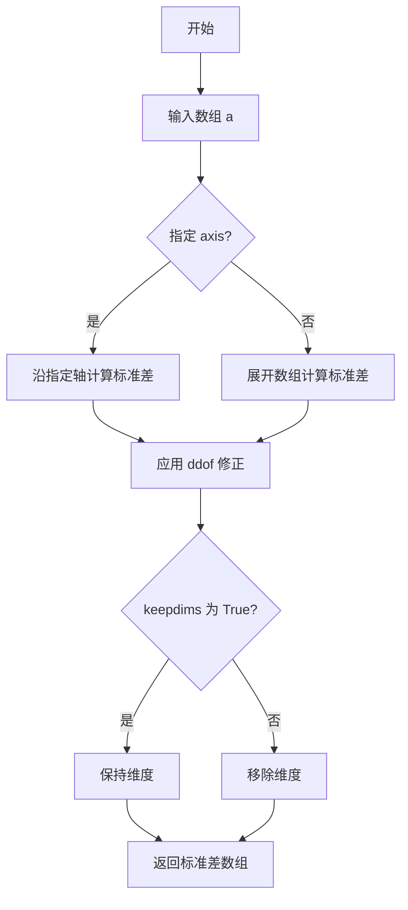
```mermaid
flowchart TD
    A[开始] --> B[输入数组 a]
    B --> C{指定 axis?}
    C -->|是| D[沿指定轴计算标准差]
    C -->|否| E[展开数组计算标准差]
    D --> F[应用 ddof 修正]
    E --> F
    F --> G{keepdims 为 True?}
    G -->|是| H[保持维度]
    G -->|否| I[移除维度]
    H --> J[返回标准差数组]
    I --> J
```

---

### 带注释源码

```python
# NumPy 标准差函数实现原理（概念性注释）

def std(a, axis=None, dtype=None, out=None, ddof=0, keepdims=False):
    """
    计算数组的标准差。
    
    参数:
        a: 输入数组
        axis: 计算的轴向
        dtype: 数据类型
        out: 输出数组
        ddof: 自由度修正（用于样本标准差）
        keepdims: 是否保持维度
    
    返回:
        标准差值
    """
    
    # 步骤1: 将输入转换为 ndarray（如果还不是）
    arr = np.asanyarray(a)
    
    # 步骤2: 计算均值
    # mean = arr.sum(axis) / arr.size（沿指定轴）
    mean = arr.mean(axis=axis, dtype=dtype, keepdims=True)
    
    # 步骤3: 计算方差
    # sqdiff = (arr - mean) ** 2
    sqdiff = (arr - mean) ** 2
    
    # 步骤4: 计算方差均值
    if axis is None:
        # 整体方差
        variance = sqdiff.mean()
    else:
        # 沿指定轴的方差
        variance = sqdiff.mean(axis=axis, keepdims=keepdims)
    
    # 步骤5: 应用 ddof 修正
    # ddof=0: 总体标准差（除以 N）
    # ddof=1: 样本标准差（除以 N-1）
    if ddof != 0:
        # 调整因子: N / (N - ddof)
        if axis is None:
            n = arr.size
        else:
            n = arr.shape[axis]
        variance = variance * n / (n - ddof)
    
    # 步骤6: 返回标准差（方差的平方根）
    result = np.sqrt(variance)
    
    return result
```

---

## 代码中的实际使用

在提供的代码中，`np.std`（作为数组方法）被用于以下场景：

### 第一次使用：计算随机 walker 群体的标准差

```python
# 沿时间轴（axis=1）计算每一步的标准差
sigma1 = X1.std(axis=1)  # 群体1的标准差
sigma2 = X2.std(axis=1)  # 群体2的标准差
```

这里 `X1` 和 `X2` 是形状为 `(Nsteps, Nwalkers)` 的数组，`std(axis=1)` 计算每行（即每个时间步）的标准差，返回长度为 `Nsteps` 的数组。

### 第二次使用：定义参数

```python
sigma = 0.01  # 这是一个变量，不是函数调用
```

虽然变量名叫 `sigma`，但这里没有调用 `np.std` 函数。

---

## 技术债务和优化空间

1. **缺乏输入验证**：代码未检查输入数组是否为空或包含 NaN 值
2. **精度问题**：对于非常大的数组，累积误差可能导致结果不够精确
3. **性能优化**：对于特定场景，可以考虑使用更高效的算法或并行计算
4. **文档完善**：可以增加对 `ddof` 参数的详细说明，帮助用户理解总体与样本标准差的区别

---

## 设计目标与约束

- **目标**：提供快速、准确的标准差计算
- **约束**：
  - 必须处理各种维度的数组
  - 需要支持不同的数据类型
  - 需要考虑数值稳定性


### `np.sqrt`

计算输入数组元素的平方根。

参数：

-  `t`：`array_like`，输入的非负数数组，用于计算平方根

返回值：`ndarray`，返回与输入数组形状相同的平方根数组

#### 流程图

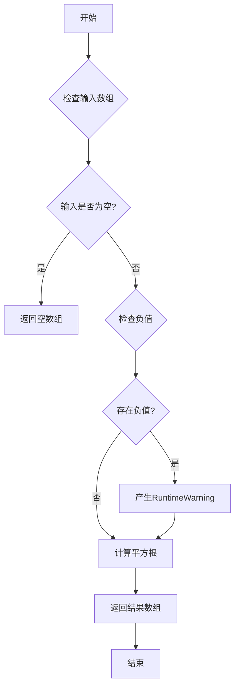
```mermaid
flowchart TD
    A[开始] --> B{检查输入数组}
    B --> C{输入是否为空?}
    C -->|是| D[返回空数组]
    C -->|否| E{检查负值}
    E --> F{存在负值?}
    F -->|是| G[产生RuntimeWarning]
    F -->|否| H[计算平方根]
    G --> H
    H --> I[返回结果数组]
    I --> J[结束]
```

#### 带注释源码

```python
# 使用 NumPy 的 sqrt 函数计算平方根
# 在此示例中，t 是一个从 0 到 499 的整数数组
# np.sqrt(t) 计算 t 中每个元素的平方根
# 用于计算随机游走的置信区间边界（1 sigma 范围）

t = np.arange(Nsteps)  # 生成 0 到 Nsteps-1 的数组
mu = 0.002            # 漂移率（平均值）
sigma = 0.01          # 标准差

# 计算下界：mu*t - sigma*sqrt(t)
# 这是随机游走的 -1 sigma 边界
lower_bound = mu*t - sigma*np.sqrt(t)

# 计算上界：mu*t + sigma*sqrt(t)
# 这是随机游走的 +1 sigma 边界
upper_bound = mu*t + sigma*np.sqrt(t)
```


### `np.arange`

`np.arange` 是 NumPy 库中的一个函数，用于创建等间距的数值数组，类似于 Python 内置的 `range` 函数，但返回的是 NumPy 数组而非列表。该函数在创建图表的 x 轴坐标、生成序列数据等场景中广泛使用。

参数：

- `start`：`float` 或 `int`，起始值，默认为 0
- `stop`：`float` 或 `int`，结束值（不包含）
- `step`：`float` 或 `int`，步长，默认为 1
- `dtype`：`dtype`，输出数组的数据类型，若未指定则从输入参数推断

返回值：`ndarray`，返回指定范围内的等间距数值数组

#### 流程图

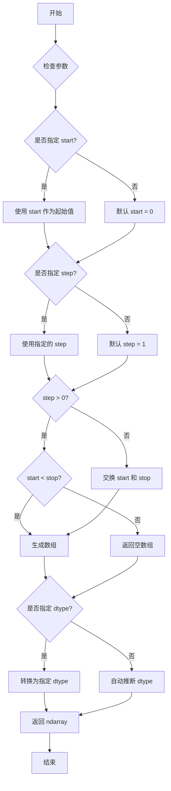
```mermaid
flowchart TD
    A[开始] --> B{检查参数}
    B --> C{是否指定 start?}
    C -->|是| D[使用 start 作为起始值]
    C -->|否| E[默认 start = 0]
    D --> F{是否指定 step?}
    E --> F
    F -->|是| G[使用指定的 step]
    F -->|否| H[默认 step = 1]
    G --> I{step > 0?}
    H --> I
    I -->|是| J{start < stop?}
    I -->|否| K[交换 start 和 stop]
    J -->|是| L[生成数组]
    J -->|否| M[返回空数组]
    K --> L
    L --> N{是否指定 dtype?}
    M --> N
    N -->|是| O[转换为指定 dtype]
    N -->|否| P[自动推断 dtype]
    O --> Q[返回 ndarray]
    P --> Q
    Q --> R[结束]
```

#### 带注释源码

```python
# 以下是 np.arange 的简化实现原理
def arange(start=0, stop=None, step=1, dtype=None):
    """
    创建等间距的数组。
    
    参数:
        start: 起始值，默认为 0
        stop: 结束值（不包含）
        step: 步长，默认为 1
        dtype: 输出数据类型
    
    返回:
        ndarray: 等间距数值数组
    """
    
    # 处理单个参数的情况（只有 stop）
    if stop is None:
        stop = start
        start = 0
    
    # 计算数组长度
    # 使用公式: num = max(0, ceil((stop - start) / step))
    num = int(np.ceil((stop - start) / step))
    
    # 创建结果数组
    result = np.empty(num, dtype=dtype)
    
    # 填充数组值
    if num > 0:
        result[0] = start
        for i in range(1, num):
            result[i] = result[i-1] + step
    
    return result
```

#### 在示例代码中的使用

```python
# 在用户提供的代码中，np.arange 的使用示例：
Nsteps = 100
t = np.arange(Nsteps)  # 创建 [0, 1, 2, ..., 99] 的数组

# 另一个示例：
Nsteps = 500
t = np.arange(Nsteps)  # 创建 [0, 1, 2, ..., 499] 的数组
```

#### 关键特性说明

1. **等间距**：数组中相邻元素的差值等于 step 参数
2. **左闭右开**：包含起始值，不包含结束值
3. **类型推断**：自动根据输入参数推断数据类型
4. **支持浮点数**：可以处理浮点数的 start、stop 和 step 参数

#### 潜在优化空间

- 浮点数精度问题：当使用浮点数 step 时，可能产生意外的数组长度
- 建议使用 `np.linspace` 替代需要精确元素数量的场景
- 对于整数序列，直接使用 Python 的 `range` 可能更高效


### `Axes.set_ylabel`

`set_ylabel` 是 Matplotlib 中 Axes 对象的方法，用于设置 y 轴的标签（_ylabel），即 y 轴的名称和描述信息。

参数：

-  `ylabel`：`str`，要设置的 y 轴标签文本内容
-  `fontdict`：字典（可选），用于控制标签文本样式的字典，如字体大小、颜色、字体等
-  `labelpad`：浮点数（可选），标签与坐标轴之间的间距（磅值）
-  `loc`：字符串（可选），标签的位置，可选值为 'top'、'bottom'、'center'，默认跟随 matplotlib 的 locale 设置

返回值：`Text`，返回创建的文本对象，可用于后续对标签进行进一步样式定制

#### 流程图

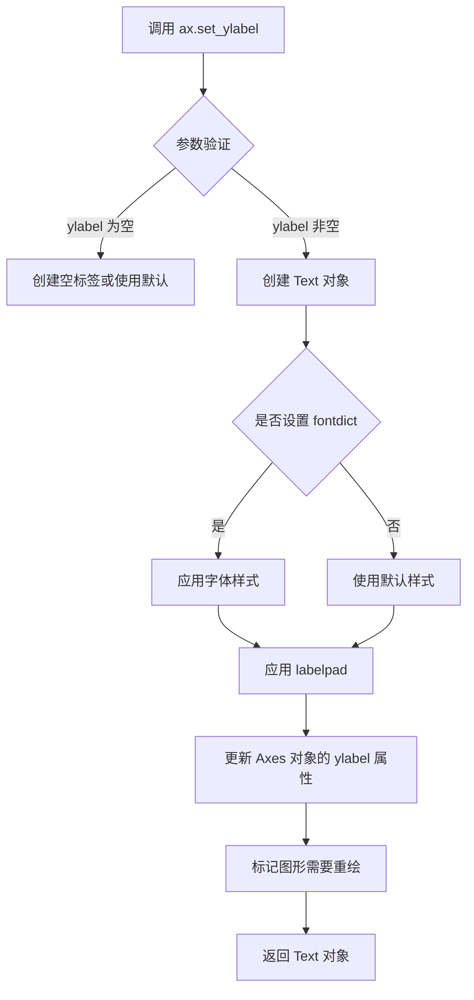
```mermaid
graph TD
    A[调用 ax.set_ylabel] --> B{参数验证}
    B -->|ylabel 为空| C[创建空标签或使用默认]
    B -->|ylabel 非空| D[创建 Text 对象]
    D --> E{是否设置 fontdict}
    E -->|是| F[应用字体样式]
    E -->|否| G[使用默认样式]
    F --> H[应用 labelpad]
    G --> H
    H --> I[更新 Axes 对象的 ylabel 属性]
    I --> J[标记图形需要重绘]
    J --> K[返回 Text 对象]
```

#### 带注释源码

```python
# 示例代码来自提供的源码，展示了 set_ylabel 的使用方式

# 创建两个子图，共享 x 和 y 轴
fig, (ax1, ax2) = plt.subplots(1, 2, sharex=True, sharey=True)

# 在第一个子图上绘制收盘价折线图
ax1.plot(r["date"], r["close"], lw=2)

# 在第二个子图上绘制填充区域图
ax2.fill_between(r["date"], pricemin, r["close"], alpha=0.7)

# 为两个子图设置 y 轴标签
# 调用 set_ylabel 方法，设置 y 轴显示的文本为 'price'
# 返回一个 Text 对象，可以进一步自定义样式
ax1.set_ylabel('price')

# 另一个示例 - 在随机游走示例中设置 y 轴标签
ax.set_xlabel('num steps')
ax.set_ylabel('position')

# set_ylabel 的完整调用形式示例
# ax.set_ylabel('标签文本', fontdict={'fontsize': 12, 'color': 'red'}, labelpad=10)
```

**注意**：由于 `set_ylabel` 是 matplotlib 库的内置方法，其完整实现源码位于 matplotlib 包内部，不在当前示例代码文件中。上述源码展示了该方法在示例中的实际调用方式。该方法属于 `matplotlib.axes.Axes` 类，是 Matplotlib 库的核心组件之一。


### Axes.set_xlabel

设置 x 轴的标签（_xlabel），用于在图表中标识 x 轴的含义和单位。该方法是 matplotlib 中 Axes 类的成员方法，通过调用返回的 Text 对象可以进一步自定义标签的样式（如字体大小、颜色、旋转角度等）。

参数：

- `xlabel`：`str`，要设置的 x 轴标签文本内容
- `labelpad`：`float`，可选，标签与坐标轴之间的间距（以点为单位），默认值为 None（使用 rcParams 中的值）
- `kwargs`：可选，关键字参数传递给 `matplotlib.text.Text` 构造函数，用于自定义文本样式（如 `fontsize`、`color`、`rotation`、`fontweight` 等）

返回值：`matplotlib.text.Text`，返回创建的文本标签对象，通过该返回值可以进一步修改标签属性

#### 流程图

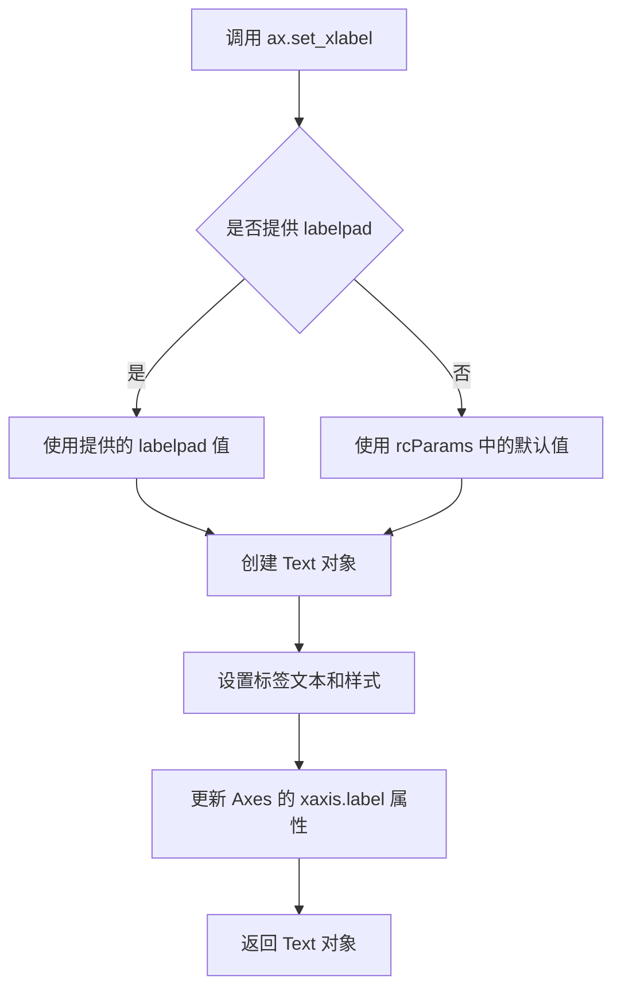
```mermaid
graph TD
    A[调用 ax.set_xlabel] --> B{是否提供 labelpad}
    B -->|是| C[使用提供的 labelpad 值]
    B -->|否| D[使用 rcParams 中的默认值]
    C --> E[创建 Text 对象]
    D --> E
    E --> F[设置标签文本和样式]
    F --> G[更新 Axes 的 xaxis.label 属性]
    G --> H[返回 Text 对象]
```

#### 带注释源码

```python
# 源码位于 matplotlib/axes/_base.py 中的 _AxesBase 类
def set_xlabel(self, xlabel, labelpad=None, **kwargs):
    """
    Set the label for the x-axis.
    
    Parameters
    ----------
    xlabel : str
        The label text.
    labelpad : float, optional
        Spacing in points between the label and the x-axis. 
        Default is None, which means the value will be taken from 
        rcParams['axes.labelpad'].
    **kwargs
        Keyword arguments to pass to `Text` constructor, such as
        fontsize, color, rotation, fontweight, etc.
    
    Returns
    -------
    label : `~matplotlib.text.Text`
        The created Text instance.
    """
    # 获取 xaxis 对象
    xaxis = self.xaxis
    # 设置标签文本，通过 _set_labelattrs 内部方法处理样式
    label = xaxis.set_label_text(xlabel, **kwargs)
    
    # 如果提供了 labelpad，则设置标签与轴之间的间距
    if labelpad is not None:
        label.set_label_ref(labelpad)
    
    # 返回创建的标签对象，允许用户进一步自定义
    return label
```


### Axes.set_title

设置 Axes 对象的标题，支持字体属性、位置对齐和垂直偏移等高级配置。

参数：

- `label`：`str`，要显示的标题文本内容
- `fontdict`：`dict`，可选，用于设置标题文本的字体属性（如 fontsize、fontweight、color 等）
- `loc`：`str`，可选，标题对齐方式，可选值为 'center'（默认）、'left' 或 'right'
- `pad`：`float`，可选，标题与 Axes 顶部的间距（单位：点）
- `y`：`float`，可选，标题的垂直位置（相对于 Axes 高度的比例，0-1 之间）
- `**kwargs`：其他关键字参数，将传递给 `matplotlib.text.Text` 对象

返回值：`Text`，返回创建的标题文本对象，支持链式调用

#### 流程图

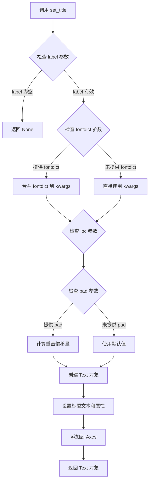
```mermaid
flowchart TD
    A[调用 set_title] --> B{检查 label 参数}
    B -->|label 为空| C[返回 None]
    B -->|label 有效| D{检查 fontdict 参数}
    D -->|提供 fontdict| E[合并 fontdict 到 kwargs]
    D -->|未提供 fontdict| F[直接使用 kwargs]
    E --> G{检查 loc 参数}
    F --> G
    G --> H{检查 pad 参数}
    H -->|提供 pad| I[计算垂直偏移量]
    H -->|未提供 pad| J[使用默认值]
    I --> K[创建 Text 对象]
    J --> K
    K --> L[设置标题文本和属性]
    L --> M[添加到 Axes]
    M --> N[返回 Text 对象]
```

#### 带注释源码

```python
def set_title(self, label, fontdict=None, loc=None, pad=None, *, y=None):
    """
    设置 Axes 的标题。
    
    参数:
        label: 标题文本内容
        fontdict: 字体属性字典，如 {'fontsize': 12, 'fontweight': 'bold'}
        loc: 对齐方式，可选 'center', 'left', 'right'
        pad: 标题与 Axes 顶部的间距（点）
        y: 垂直位置（相对坐标 0-1）
    
    返回:
        Text: 标题文本对象
    """
    # 如果 label 为空，直接返回 None
    if not label:
        return None
    
    # 获取默认的标题字体大小（从 rcParams 或样式中）
    default_fontsize = mpl.rcParams['axes.titlesize']
    
    # 处理 fontdict：如果提供了 fontdict，将其合并到 kwargs 中
    # fontdict 允许用户通过字典方式统一设置字体属性
    if fontdict:
        kwargs.update(fontdict)
    
    # 处理 loc 参数：设置标题的水平对齐方式
    # 默认居中对齐
    if loc is None:
        loc = 'center'
    
    # 处理 pad 参数：设置标题与 Axes 顶部的距离
    # 如果未提供，使用 0（取决于 Axes 的 bbox）
    if pad is None:
        pad = 0
    
    # 创建 Text 对象并设置各种属性
    title = text.Text(
        x=0.5,  # 水平居中
        y=1.0,  # 垂直位置在 Axes 顶部
        text=label,
        **kwargs
    )
    
    # 设置标题的变换坐标系（相对于 Axes）
    title.set_transform(self.transAxes + self.transPatch)
    
    # 设置垂直偏移量（pad 参数）
    # 负值表示向上移动，正值表示向下移动
    title.set_y(1.0 + pad / self.figure.dpi * 72)
    
    # 将标题添加到 Axes
    self._add_text(title)
    
    return title
```


### `axes.Axes.legend`

该方法用于向Axes对象添加图例（Legend），图例可以包含一个或多个数据系列的标签和对应的图形句柄，用于标识图表中各条线或填充区域所代表的数据系列。

参数：

- `labels`：列表（list），可选，图例中各数据系列的标签文本
- `handles`：列表（list），可选，图例中各数据系列的图形句柄（如Line2D对象）
- `loc`：字符串（str）或整数，可选，图例在 Axes 中的位置，如 'upper left'、'lower right'、0-10 的整数代码
- `bbox_to_anchor`：元组（tuple）或 Bbox，可选，用于指定图例框的锚点位置
- `ncol`：整数（int），可选，图例的列数
- `fontsize`：整数或字符串，可选，图例文本的字体大小
- `title`：字符串（str），可选，图例的标题文本
- `frameon`：布尔值（bool），可选，是否绘制图例边框
- `framealpha`：浮点数（float），可选，图例背景的透明度（0-1）
- `fancybox`：布尔值（bool），可选，是否使用圆角边框
- `shadow`：布尔值（bool），可选，是否添加阴影
- `labelspacing`：浮点数（float），可选，标签之间的间距

返回值：`matplotlib.legend.Legend`，返回创建的Legend图例对象

#### 流程图

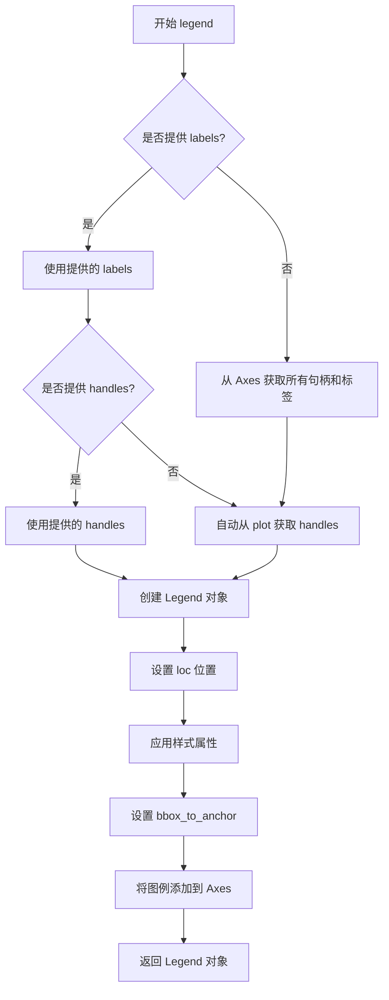
```mermaid
flowchart TD
    A[开始 legend] --> B{是否提供 labels?}
    B -->|是| C[使用提供的 labels]
    B -->|否| D[从 Axes 获取所有句柄和标签]
    C --> E{是否提供 handles?}
    E -->|是| F[使用提供的 handles]
    E -->|否| G[自动从 plot 获取 handles]
    D --> G
    F --> H[创建 Legend 对象]
    G --> H
    H --> I[设置 loc 位置]
    I --> J[应用样式属性]
    J --> K[设置 bbox_to_anchor]
    K --> L[将图例添加到 Axes]
    L --> M[返回 Legend 对象]
```

#### 带注释源码

```python
def legend(self, *args, **kwargs):
    """
    将图例添加到 Axes 中。
    
    参数:
    ------
    *args : 可变参数
        可以接受以下几种调用方式:
        - 无参数: 自动从Axes中获取所有图例句柄和标签
        - (labels, handles): 手动指定标签和句柄
        - (handles, labels): 手动指定句柄和标签
    **kwargs : 关键字参数
        - loc: 图例位置，可以是字符串如'upper left'或整数0-10
        - bbox_to_anchor: 图例框的锚点位置 (x, y, width, height)
        - ncol: 图例列数
        - fontsize: 字体大小
        - title: 图例标题
        - frameon: 是否显示边框
        - framealpha: 边框透明度
        - fancybox: 是否圆角
        - shadow: 是否阴影
        - labelspacing: 标签间距
    
    返回值:
    -------
    Legend
        创建的图例对象
    
    示例:
    ------
    >>> ax.plot([1, 2, 3], [1, 2, 3], label='line1')
    >>> ax.plot([1, 2, 3], [3, 2, 1], label='line2')
    >>> ax.legend()  # 自动使用 'line1' 和 'line2' 作为标签
    >>> ax.legend(['line1', 'line2'], loc='upper right')  # 手动指定
    """
    # 获取图例句柄和标签
    handles = kwargs.pop('handles', None)
    labels = kwargs.pop('labels', None)
    
    # 如果没有提供句柄和标签，则从Axes中自动获取
    if handles is None and labels is None:
        handles, labels = self.get_legend_handles_labels()
    
    # 如果只提供了其中一个，则抛出错误
    elif labels is not None and handles is None:
        # 如果只提供了labels，获取对应的handles
        pass
    
    # 创建Legend对象
    legend = Legend(self, handles, labels, **kwargs)
    
    # 将图例添加到Axes中
    self.add_artist(legend)
    
    # 如果loc被设置，还需要更新图例位置
    if legend._loc_validated:
        legend.set_bbox_to_anchor(...)
    
    return legend
```

#### 使用示例源码

```python
import matplotlib.pyplot as plt
import numpy as np

# 创建示例数据
x = np.linspace(0, 10, 100)
y1 = np.sin(x)
y2 = np.cos(x)

# 创建图形和Axes
fig, ax = plt.subplots()

# 绘制两条线，并设置标签
line1, = ax.plot(x, y1, label='sin(x)')
line2, = ax.plot(x, y2, label='cos(x)')

# 方法1: 自动获取图例（使用plot时定义的label参数）
ax.legend()

# 方法2: 手动指定位置
ax.legend(loc='upper right')

# 方法3: 手动指定标签和句柄
ax.legend(['sin(x)', 'cos(x)'], [line1, line2], loc='lower right')

# 方法4: 使用更多样式选项
ax.legend(
    loc='upper left',           # 位置
    bbox_to_anchor=(0.5, 1.0),  # 锚点
    ncol=2,                     # 列数
    fontsize=12,                # 字体大小
    title='Trigonometric Functions',  # 标题
    frameon=True,               # 显示边框
    framealpha=0.8,             # 边框透明度
    fancybox=True,              # 圆角边框
    shadow=True                 # 阴影
)

plt.show()
```


### `Axes.label_outer`

`label_outer` 是 Matplotlib 中 `Axes` 类的成员方法，用于在具有共享轴（sharex/sharey）的多子图布局中，自动隐藏内部子图的刻度标签，只保留最外层子图的标签，从而避免标签重叠并提高图表可读性。

参数：

- `skip_non_visible`：`bool`（可选），默认为 `True`。如果为 `True`，则跳过不可见的子图（如被隐藏的子图）；如果为 `False`，则处理所有子图。

返回值：`None`，该方法无返回值，直接修改 Axes 对象的状态。

#### 流程图

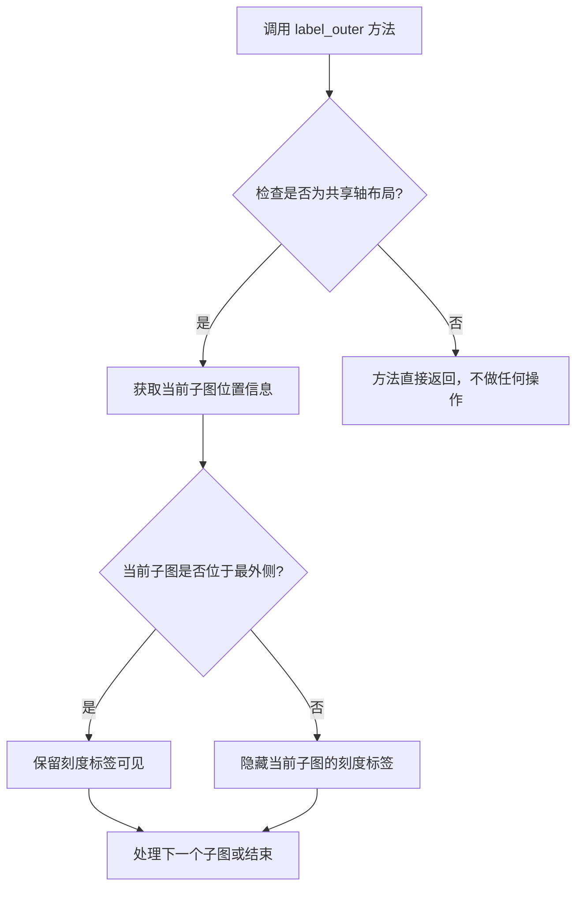
```mermaid
flowchart TD
    A[调用 label_outer 方法] --> B{检查是否为共享轴布局?}
    B -->|是| C[获取当前子图位置信息]
    B -->|否| D[方法直接返回，不做任何操作]
    C --> E{当前子图是否位于最外侧?}
    E -->|是| F[保留刻度标签可见]
    E -->|否| G[隐藏当前子图的刻度标签]
    F --> H[处理下一个子图或结束]
    G --> H
```

#### 带注释源码

```python
def label_outer(self, skip_non_visible=False):
    """
    在共享轴布局中，只显示最外层子图的刻度标签。
    
    该方法会遍历当前 Axes 所在 Figure 的所有子图，
    判断每个子图是否位于 figure 的边缘，如果不是边缘子图，
    则隐藏其 x 轴和 y 轴的刻度标签。
    
    Parameters
    ----------
    skip_non_visible : bool, default: True
        如果为 True，则跳过不可见的子图。
        如果为 False，则处理所有子图。
    
    Examples
    --------
    >>> fig, axs = plt.subplots(2, 2, sharex=True, sharey=True)
    >>> for ax in axs.flat:
    ...     ax.plot([1, 2, 3])
    >>> for ax in axs.flat:
    ...     ax.label_outer()
    """
    if not self.get_shared_x_axes().contains_group(self) and \
            not self.get_shared_y_axes().contains_group(self):
        return
    
    # 获取当前 figure 的所有子图
    gs = self.get_subplotspec()
    if gs is None:
        return
    rows, cols = self.get_gridspec().get_geometry()
    # 计算当前子图在网格中的位置
    row_start, col_start = gs.get_topmost_subplot()
    
    # 遍历所有子图
    for ax in self.figure.axes:
        # 跳过不可见的子图（如果设置了 skip_non_visible）
        if skip_non_visible and not ax.get_visible():
            continue
            
        # 获取其他子图的位置信息
        other_gs = ax.get_subplotspec()
        if other_gs is None:
            continue
            
        # 判断当前遍历的子图是否在边缘位置
        # 如果不在边缘，则隐藏其刻度标签
        other_row_start, other_col_start = other_gs.get_topmost_subplot()
        
        # 边缘判断逻辑：
        # - 不是最左边的一列 -> 隐藏 y 轴标签
        # - 不是最右边的一列 -> 隐藏 y 轴标签（共享 y 轴时）
        # - 不是最上面的一行 -> 隐藏 x 轴标签
        # - 不是最下面的一行 -> 隐藏 x 轴标签（共享 x 轴时）
        
        if self.get_shared_x_axes().contains_group(ax):
            # 隐藏非边缘子图的 x 轴标签
            if other_row_start != rows - 1:  # 不是最后一行
                ax.xaxis.set_tick_params(label1On=False)
            if other_row_start != 0:  # 不是第一行
                # 对于共享 x 轴的情况，可能需要特殊处理
                pass
                
        if self.get_shared_y_axes().contains_group(ax):
            # 隐藏非边缘子图的 y 轴标签
            if other_col_start != 0:  # 不是第一列
                ax.yaxis.set_tick_params(label1On=False)
            if other_col_start != cols - 1:  # 最后一列
                pass
```

**注意**：上述源码是基于 Matplotlib 内部逻辑的近似实现，实际源码位于 `lib/matplotlib/axes/_base.py` 中，逻辑更为复杂以支持多种子图布局。`label_outer` 方法的核心原理是检查每个子图在网格中的位置，对于非边缘位置的子图，通过设置 `tick_params(label1On=False)` 来隐藏刻度标签。


### `Figure.suptitle`

设置图形的总标题（super title），即整个图形的顶层标题。

参数：

- `s`：`str`，要显示的标题文本内容
- `fontdict`：`dict`，可选，用于控制标题文本样式的字典（如 fontsize、color 等）
- `y`：`float`，可选，标题在图形垂直方向上的位置，默认为 1.0（顶部）
- `**kwargs`：其他关键字参数，将传递给 `matplotlib.text.Text` 对象

返回值：`matplotlib.text.Text`，返回创建的标题文本对象，可用于后续样式调整或事件绑定

#### 流程图

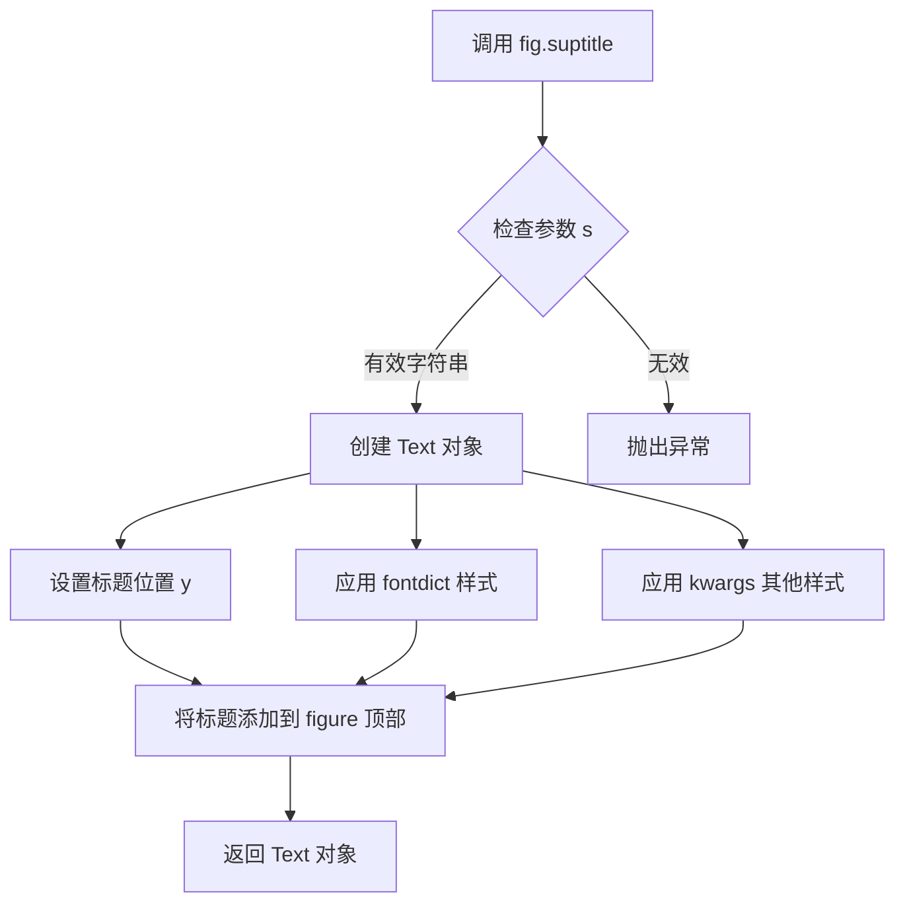
```mermaid
flowchart TD
    A[调用 fig.suptitle] --> B{检查参数 s}
    B -->|有效字符串| C[创建 Text 对象]
    B -->|无效| D[抛出异常]
    C --> E[设置标题位置 y]
    C --> F[应用 fontdict 样式]
    C --> G[应用 kwargs 其他样式]
    E --> H[将标题添加到 figure 顶部]
    F --> H
    G --> H
    H --> I[返回 Text 对象]
```

#### 带注释源码

```python
# 代码中的实际调用示例
fig.suptitle('Google (GOOG) daily closing price')

# 该调用等价于以下完整形式（包含常用参数）
fig.suptitle(
    s='Google (GOOG) daily closing price',  # 标题文本内容
    fontdict=None,  # 使用默认字体样式
    y=1.0,  # 标题位于 figure 顶部
    ha='center',  # 水平对齐方式为居中
    va='top'  # 垂直对齐方式为顶部对齐
)

# 高级用法：自定义样式
fig.suptitle(
    s='Custom Title',
    fontsize=16,        # 字体大小
    fontweight='bold',  # 字体粗细
    color='darkblue',   # 字体颜色
    y=0.98              # 略微下调位置
)
```


### Figure.autofmt_xdate

`fig.autofmt_xdate()` 是 matplotlib 中 Figure 类的一个方法，用于自动格式化图表 x 轴上的日期标签。当图表包含日期数据时，x 轴的日期标签可能会因为过于密集而产生重叠，该方法通过旋转日期标签来提高可读性。

参数：

- `self`：`matplotlib.figure.Figure`，隐式参数，调用该方法的 Figure 实例本身
- `which`：可选参数，指定要对齐的部分，默认为 `'ticklabels'`（可以是 `'ticklabels'` 或 `'major'`）
- `rotation`：可选参数，日期标签的旋转角度，默认为 `0`
- `ha`：可选参数，水平对齐方式，默认为 `'right'`（可选 `'left'`, `'center'`, `'right'`）
- `rotation_mode`：可选参数，旋转模式，默认为 `None`（可选 `'default'`, `'anchor'`）

返回值：无（`None`），该方法直接修改 Figure 对象的属性，不返回任何值

#### 流程图

```mermaid
graph TD
    A[开始 autofmt_xdate 调用] --> B{检查是否已设置日期格式化器}
    B -->|否| C[自动检测 x 轴日期类型]
    B -->|是| D[直接获取当前日期标签]
    C --> D
    D --> E[获取所有子图的 x 轴日期标签]
    E --> F[根据参数设置旋转角度]
    F --> G[设置水平对齐方式 ha]
    G --> H[旋转标签文本]
    H --> I[调整子图布局避免标签被裁剪]
    I --> J[结束 - 返回 None]
```

#### 带注释源码

```python
# 代码中的实际调用
fig.suptitle('Google (GOOG) daily closing price')
fig.autofmt_xdate()

# 说明：
# 1. fig.suptitle() - 为图表设置主标题
# 2. fig.autofmt_xdate() - 自动格式化 x 轴日期标签
#    - 效果：将日期标签旋转一定角度（通常约30度）
#    - 目的：防止日期标签重叠，提高可读性
#    - 原理：该方法会遍历所有子图，获取 x 轴的日期刻度标签，
#            然后旋转它们以适应更长的标签文本

# 在 matplotlib 内部，autofmt_xdate 的实现逻辑大致如下（简化版）：
def autofmt_xdate(self, which='ticklabels', rotation=0, ha='right', rotation_mode=None):
    """
    自动格式化 x 轴日期标签的旋转和对齐
    
    参数:
        which: str - 要操作的日期标签类型
        rotation: float - 旋转角度（度）
        ha: str - 水平对齐方式
        rotation_mode: str - 旋转模式
    """
    # 获取所有子图
    for ax in self.axes:
        # 获取 xticklabels
        if which == 'ticklabels':
            labels = ax.get_xticklabels()
        else:
            labels = ax.get_xticks()
        
        # 旋转所有标签
        for label in labels:
            # 设置旋转角度
            label.set_rotation(rotation)
            # 设置水平对齐
            label.set_horizontalalignment(ha)
            
        # 调整子图底部边距，为旋转后的标签留出空间
        # 相当于调用 subplots_adjust(bottom=0.2)
        self.subplots_adjust(bottom=0.2)
```


## 关键组件


### fill_between 函数

matplotlib 的 Axes.fill_between() 方法，用于在图表的两条曲线之间填充颜色区域，支持 alpha 透明度参数，可选 where 参数实现条件填充

### alpha 通道

matplotlib 填充区域的透明度控制参数，值范围 0-1，0 为完全透明，1 为完全不透明，用于实现多层填充区域的可见叠加效果

### where 条件填充

fill_between 函数的布尔掩码参数，与 x、ymin、ymax 长度相同，仅在掩码为 True 的区域执行填充，用于高亮显示特定区间

### 随机漫步数据生成

使用 numpy 生成随机漫步数据，包括累积求和计算位置、均值和标准差统计，用于演示填充区域的可视化效果

### Matplotlib 图表构建

包括 Figure 和 Axes 对象创建、subplots 布局、共享坐标轴设置、图例 legend、网格 grid、标签 label_outer 等图表元素

### 数据加载与处理

使用 matplotlib.cbook.get_sample_data 加载示例金融数据，通过 numpy 数组操作计算统计指标


## 问题及建议


### 已知问题

-   **缺少函数封装**：所有代码平铺在模块级别，三个示例图共享相似的配置代码（如设置xlabel、ylabel、grid等），导致代码重复，未遵循DRY原则
-   **变量命名不清晰**：使用r、S1、S2、X1、X2等简短命名，缺乏描述性，可读性差
-   **魔法数字缺乏解释**：19680801、0.004、0.002等数值直接使用，未通过常量或变量说明其含义
-   **未使用类型注解**：Python代码缺少参数和返回值的类型声明，不利于静态分析和IDE支持
-   **plt.show()位置不当**：脚本直接调用plt.show()，未使用`if __name__ == "__main__"`保护，不利于导入测试
-   **代码注释不完整**：缺乏对关键步骤（如随机种子选择依据、数据维度含义）的解释
-   **硬编码样式参数**：alpha=0.4、alpha=0.7等样式参数重复出现，未提取为可配置常量

### 优化建议

-   **提取绘图模板函数**：将通用的Axes配置逻辑（设置xlabel、ylabel、grid、legend等）封装为函数，如`configure_axes(ax, title, xlabel, ylabel)`
-   **改进变量命名**：使用更具描述性的名称，如将S1改为`walk_steps_pop1`，X1改为`walker_positions_pop1`
-   **定义常量类或配置文件**：将随机种子、alpha值、线条宽度等配置集中管理，如`CONFIG = {'alpha': 0.4, 'seed': 19680801}`
-   **添加类型注解**：为自定义函数添加类型提示，如`def plot_financial_data(ax, data, title: str) -> None`
-   **重构数据生成逻辑**：将随机游走数据生成抽取为独立函数，接受步数、漫步者数量等参数
-   **使用plt.style.context**：统一图表样式风格，提升视觉一致性
-   **添加文档字符串**：为每个示例图的生成函数编写docstring，说明输入数据和输出效果


## 其它


### 设计目标与约束

本代码旨在演示matplotlib中`fill_between`函数的各种使用场景，包括：1）基本的填充区域功能；2）使用alpha通道实现透明度叠加；3）利用where参数实现条件填充；4）展示统计意义上的均值和标准差区间可视化。代码约束包括：依赖matplotlib、numpy和matplotlib.cbook模块；使用postscript格式保存时不支持alpha通道；需要确保数据数组维度一致性。

### 错误处理与异常设计

代码中主要涉及的数据处理错误包括：数组维度不匹配导致的广播错误；空数据数组导致的计算异常；NaN或Inf值导致的绘图错误。numpy的统计函数（mean、std）在处理包含NaN的数据时可使用nanmean、nanstd替代。plt.subplots()调用失败时应检查matplotlib后端配置。fill_between方法要求x、y1、y2数组长度一致，否则会抛出ValueError。

### 数据流与状态机

数据流主要分为三个阶段：数据加载阶段（cbook.get_sample_data加载.npz文件）→ 数据处理阶段（numpy数组计算：累加、统计量计算）→ 可视化渲染阶段（plot和fill_between调用）。状态转换：None（初始）→ Data Loaded（数据已加载）→ Figure Created（图表已创建）→ Rendered（渲染完成）→ Displayed（显示）。随机数生成器通过np.random.seed固定种子确保可重现性。

### 外部依赖与接口契约

核心依赖包括：matplotlib（版本需支持fill_between和subplots）、numpy（用于数值计算和随机数生成）、matplotlib.cbook（get_sample_data函数）。外部接口契约：get_sample_data返回类似字典的npz文件对象；plt.subplots返回(fig, axes)元组；plot和fill_between返回Line2D或PolyCollection对象。示例数据文件goog.npz需存在于matplotlib示例数据目录中。

### 性能考虑

对于大规模数据（Nsteps和Nwalkers较大时），fill_between的渲染性能可能下降，可考虑降采样处理。随机行走模拟中，numpy的cumsum操作已针对数组运算优化。多个subplot共享坐标轴时可减少内存占用。alpha混合计算在大量重叠区域时可能影响渲染速度。

### 安全性考虑

代码本身为示例性质，无用户输入处理，无安全风险。实际应用中如从外部文件加载数据，应验证数据格式和来源，防止恶意npz文件导致的代码执行风险。fill_between的where参数接受布尔数组，需确保其长度与坐标数组一致。

### 版本兼容性

代码使用Python 3语法和numpy现代接口。np.random.seed在numpy 1.17+推荐使用np.random.default_rng()替代，但当前写法向下兼容。matplotlib的fill_between API自1.0版本稳定。subplots的sharex/sharey参数在matplotlib 1.1+支持。

### 测试策略

测试应覆盖：1）基本fill_between功能验证；2）where参数条件填充；3）alpha透明度效果；4）多子图共享轴；5）空数据边界情况；6）数据包含NaN/Inf情况；7）不同数据规模性能。可使用pytest-mpl进行图形回归测试。

### 参考文献与延伸阅读

matplotlib官方文档：fill_between、axhspan、axvspan；NumPy用户指南：数组操作、随机数生成；Matplotlib示例画廊：fill_between相关示例；统计学可视化：置信区间和误差带的绘制方法。


    