# `matplotlib\galleries\examples\lines_bars_and_markers\fill_between_demo.py` 详细设计文档

这是一个matplotlib官方示例代码，演示如何使用Axes.fill_between方法填充两条曲线、曲线与水平线之间的区域，涵盖基本填充、置信区间可视化、条件性区域选择填充以及跨整个坐标轴的区域标记等功能。

## 整体流程

```mermaid
graph TD
    A[开始] --> B[导入模块: matplotlib.pyplot, numpy]
    B --> C[基本填充示例段]
    C --> C1[生成x数据: np.arange(0.0, 2, 0.01)]
    C1 --> C2[计算y1, y2: np.sin()函数]
    C2 --> C3[创建3个子图: plt.subplots(3, 1)]
    C3 --> C4[ax1.fill_between(x, y1): 填充y1与0之间]
    C4 --> C5[ax2.fill_between(x, y1, 1): 填充y1与1之间]
    C5 --> C6[ax3.fill_between(x, y1, y2): 填充y1与y2之间]
    C6 --> D[置信区间示例段]
    D --> D1[生成数据点: N=21, x=np.linspace]
D1 --> D2[线性拟合: np.polyfit计算a, b]
D2 --> D3[计算估计值y_est和误差y_err]
D3 --> D4[绘制曲线并fill_between置信区间]
    D4 --> E[选择性填充示例段]
    E --> E1[创建离散数据点x, y1, y2]
E1 --> E2[创建子图对比interpolate参数]
E2 --> E3[fill_between with where条件]
    E3 --> F[跨坐标轴区域标记示例段]
    F --> F1[创建连续正弦波数据]
F1 --> F2[添加水平阈值线: ax.axhline]
F2 --> F3[fill_between使用transform填充全轴]
    F3 --> G[结束]
```

## 类结构

```
Python脚本文件 (无自定义类)
└── 主要依赖: matplotlib.pyplot, numpy
    └── 核心方法: Axes.fill_between()
```

## 全局变量及字段


### `x`
    
x轴坐标数据

类型：`numpy.ndarray`
    


### `y1`
    
第一条曲线的y值

类型：`numpy.ndarray`
    


### `y2`
    
第二条曲线的y值

类型：`numpy.ndarray`
    


### `N`
    
数据点数量(21)

类型：`int`
    


### `y`
    
原始数据点y值列表

类型：`list`
    


### `a`
    
线性拟合斜率

类型：`float`
    


### `b`
    
线性拟合截距

类型：`float`
    


### `y_est`
    
线性拟合的估计y值

类型：`numpy.ndarray`
    


### `y_err`
    
置信区间误差值

类型：`numpy.ndarray`
    


### `threshold`
    
区域填充的阈值(0.75)

类型：`float`
    


### `fig`
    
图形对象

类型：`matplotlib.figure.Figure`
    


### `ax`
    
坐标轴对象

类型：`matplotlib.axes.Axes`
    


### `ax1`
    
坐标轴对象

类型：`matplotlib.axes.Axes`
    


### `ax2`
    
坐标轴对象

类型：`matplotlib.axes.Axes`
    


### `ax3`
    
坐标轴对象

类型：`matplotlib.axes.Axes`
    


    

## 全局函数及方法


### `np.arange`

创建等差数组，生成一个包含从 start 到 stop（不包含）的等差数列的 NumPy 数组。

参数：

- `start`：`float` 或 `int`，起始值，默认为 0
- `stop`：`float` 或 `int`，结束值（不包含）
- `step`：`float` 或 `int`，步长，默认为 1

返回值：`numpy.ndarray`，包含等差数列的数组

#### 流程图

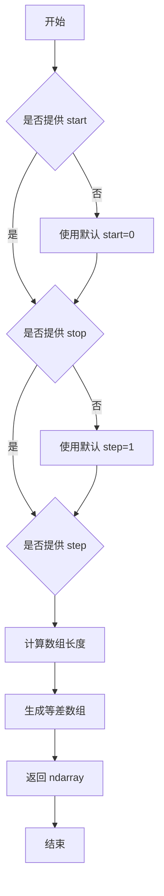

#### 带注释源码

```python
# np.arange 函数源码（简化版）
def arange(start=0, stop=None, step=1, dtype=None):
    """
    返回等差数组。
    
    参数:
        start: 起始值，默认为 0
        stop: 结束值（不包含）
        step: 步长，默认为 1
        dtype: 输出数组的数据类型
    
    返回:
        ndarray: 等差数列数组
    """
    # 处理只有一个参数的情况
    if stop is None:
        stop = start
        start = 0
    
    # 计算数组长度
    num = int(np.ceil((stop - start) / step))
    
    # 创建数组
    y = np.empty(num, dtype=dtype)
    y[0] = start
    for i in range(1, num):
        y[i] = y[i-1] + step
    
    return y
```

---

### 使用示例

在提供的代码中，`np.arange` 的使用方式如下：

```python
# 示例 1：创建从 0 到 2（不包含），步长为 0.01 的数组
x = np.arange(0.0, 2, 0.01)

# 示例 2：创建从 0 到 4π，步长为 0.01 的数组
x = np.arange(0, 4 * np.pi, 0.01)
```

这些数组随后用于 `fill_between` 方法来绘制填充区域。


### `numpy.linspace`

创建等间距的数值序列，返回一个包含 num 个等间距样本的数组。

参数：

- `start`：`scalar`，序列的起始值
- `stop`：`scalar`，序列的结束值（当 endpoint=False 时不包含）
- `num`：`int`，可选，默认值为 50，生成的样本数量
- `endpoint`：`bool`，可选，默认值为 True，如果为 True，则 stop 是最后一个样本，否则不包含
- `retstep`：`bool`，可选，默认值为 False，如果为 True，则返回 (samples, step)
- `dtype`：`dtype`，可选，输出数组的数据类型
- `axis`：`int`，可选，默认值为 0，当 stop 和 start 是数组时使用的轴

返回值：`ndarray`，等间距的数值序列

#### 流程图

```mermaid
flowchart TD
    A[开始 linspace] --> B{参数验证}
    B -->|num <= 0| C[抛出 ValueError]
    B -->|num == 1| D[返回单个元素数组<br/>start值]
    B -->|num > 1| E{endpoint=True?}
    E -->|是| F[计算步长<br/>step = (stop-start)/(num-1)]
    E -->|否| G[计算步长<br/>step = (stop-start)/num]
    F --> H[生成数组<br/>start, start+step, ...]
    G --> H
    H --> I{retstep=True?}
    I -->|是| J[返回数组和步长<br/>tuple]
    I -->|否| K[仅返回数组]
    J --> L[结束]
    K --> L
    D --> L
    C --> L
```

#### 带注释源码

```python
def linspace(start, stop, num=50, endpoint=True, retstep=False, dtype=None, axis=0):
    """
    创建等间距的数值序列。
    
    参数:
        start: 序列起始值
        stop: 序列结束值
        num: 样本数量，默认50
        endpoint: 是否包含结束点，默认True
        retstep: 是否返回步长，默认False
        dtype: 输出数据类型，默认从输入推断
        axis: 当输入是数组时使用的轴，默认0
    """
    # 验证 num 参数
    if num <= 0:
        return array([], dtype=dtype)
    
    # 处理 num=1 的特殊情况
    if num == 1:
        if endpoint:
            # 只有一个元素时，返回 start
            return _index_with_array(np.asarray(start), np.array([start], dtype=dtype), axis=axis)
        else:
            # 只有一个样本但不包括结束点
            step = stop - start
            return _index_with_array(np.asarray(start), np.array([start], dtype=dtype), axis=axis)
    
    # 计算步长
    if endpoint:
        # 包含结束点：step = (stop - start) / (num - 1)
        step = (stop - start) / (num - 1)
    else:
        # 不包含结束点：step = (stop - start) / num
        step = (stop - start) / num
    
    # 生成数组：start, start+step, start+2*step, ...
    y = np.arange(0, num, dtype=dtype) * step + start
    
    # 处理 endpoint=False 的情况，确保数值精度正确
    if not endpoint and num > 1:
        y = y[..., :-1]
    
    # 根据 retstep 返回结果
    if retstep:
        return y, step
    else:
        return y
```

#### 关键组件信息

| 组件名称 | 一句话描述 |
|---------|-----------|
| start | 序列的起始值 |
| stop | 序列的结束值 |
| num | 要生成的样本数量 |
| step | 相邻样本之间的间隔 |
| endpoint | 决定是否包含结束点的布尔标志 |

#### 潜在技术债务或优化空间

1. **类型推断效率**：当未指定 dtype 时，需要多次进行类型检查，可优化为单次推断
2. **内存使用**：对于大规模数组，使用 arange 实现可能存在轻微的浮点误差累积
3. **axis 参数**：在某些场景下，axis 参数的处理逻辑较为复杂，可能导致混淆

#### 其它项目

**设计目标与约束**：
- 保证浮点数精度，步长计算使用精确除法
- API 设计与 MATLAB 的 linspace 保持一致
- 支持标量和数组输入

**错误处理**：
- num <= 0 时返回空数组
- num 为浮点数时自动转换为整数
- start 和 stop 必须可转换为数值类型

**数据流与状态机**：
```
输入验证 -> 步长计算 -> 数组生成 -> 数据类型转换 -> 输出
```

**外部依赖**：
- numpy.core.numeric：底层数值计算
- numpy.core.function_base：别名定义


### `np.sin(x)`

计算正弦值，输入角度（弧度制），返回对应的正弦值。

参数：

- `x`：`float` 或 `array_like`，输入角度，单位为弧度。可以是单个数值或数组。

返回值：`float` 或 `ndarray`，返回 `x` 的正弦值，范围在 [-1, 1] 之间。如果是数组输入，则返回对应形状的数组。

#### 流程图

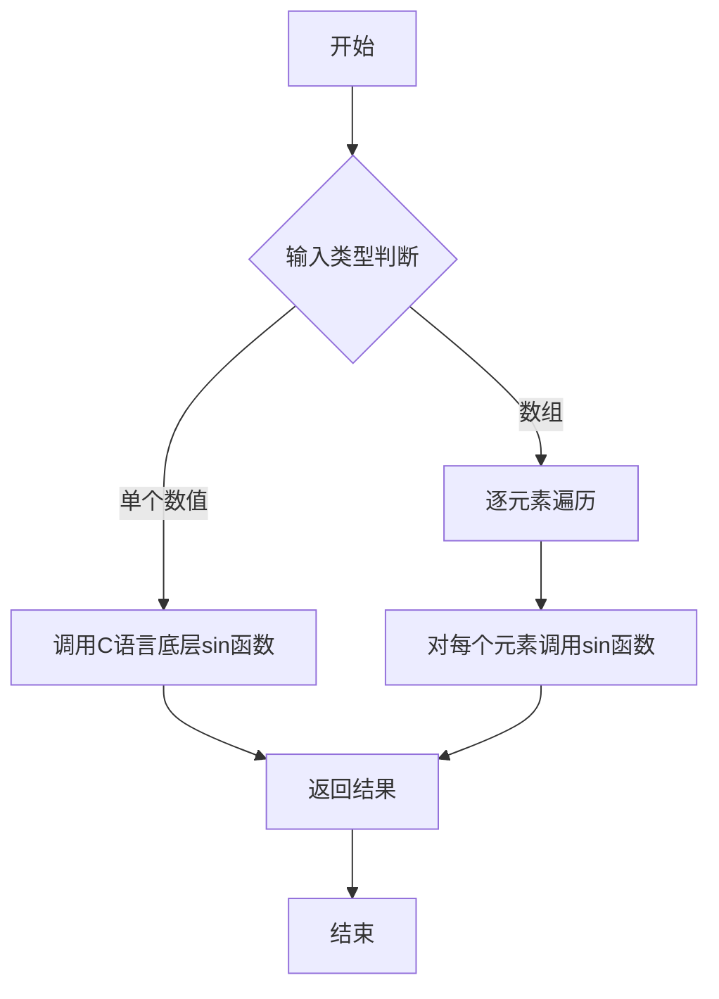

#### 带注释源码

```python
# numpy.sin 函数实现原理（概念性注释）
def sin(x):
    """
    计算输入角度的正弦值
    
    参数:
        x: 角度值，单位为弧度
             - 可以是单个浮点数
             - 也可以是numpy数组
    
    返回:
        正弦值，范围[-1, 1]
    """
    
    # 实际实现位于C语言底层（numpy/core/src/umath/ufunc_object.c）
    # 这里展示Python层面的概念逻辑：
    
    # 1. 接收输入x（可能是标量或数组）
    # 2. 如果是标量，直接调用math.sin或底层C函数
    # 3. 如果是数组，使用向量化操作逐元素计算
    # 4. 返回计算结果
    
    # 示例调用：
    import numpy as np
    
    # 单个值
    result = np.sin(np.pi / 2)  # 返回 1.0
    
    # 数组输入
    x = np.array([0, np.pi/2, np.pi])
    result = np.sin(x)  # 返回 [0. 1. 0.]
    
    return result
```

#### 实际使用示例

```python
import numpy as np

# 示例1：计算单个角度的正弦
angle = np.pi / 2  # 90度转换为弧度
sin_value = np.sin(angle)  # 结果: 1.0

# 示例2：计算数组中每个元素的正弦
x = np.arange(0, 2*np.pi, 0.1)  # 0到2π的数组
y = np.sin(x)  # 返回正弦值数组

# 示例3：在本例代码中的应用
x = np.arange(0.0, 2, 0.01)
y1 = np.sin(2 * np.pi * x)  # 计算 2πx 的正弦
y2 = 0.8 * np.sin(4 * np.pi * x)  # 计算 4πx 的正弦并乘以0.8
```

#### 注意事项

1. **输入单位**：必须使用弧度制，而非角度制。如需使用角度，需先转换：`np.sin(np.radians(degrees))`
2. **数值精度**：对于非常大的输入值，由于浮点数精度限制，结果可能会有误差
3. **向量化操作**：numpy.sin 支持数组输入，这是其相比 math.sin 的主要优势


### `np.polyfit`

多项式拟合函数，用于根据给定的x和y数据点拟合一个指定次数的多项式，返回多项式的系数。

参数：
- `x`：`array_like`，x坐标数据点
- `y`：`array_like`，y坐标数据点  
- `deg`：`int`，多项式的次数（度数）

返回值：`numpy.ndarray`，多项式系数数组，系数按降幂排列

#### 流程图

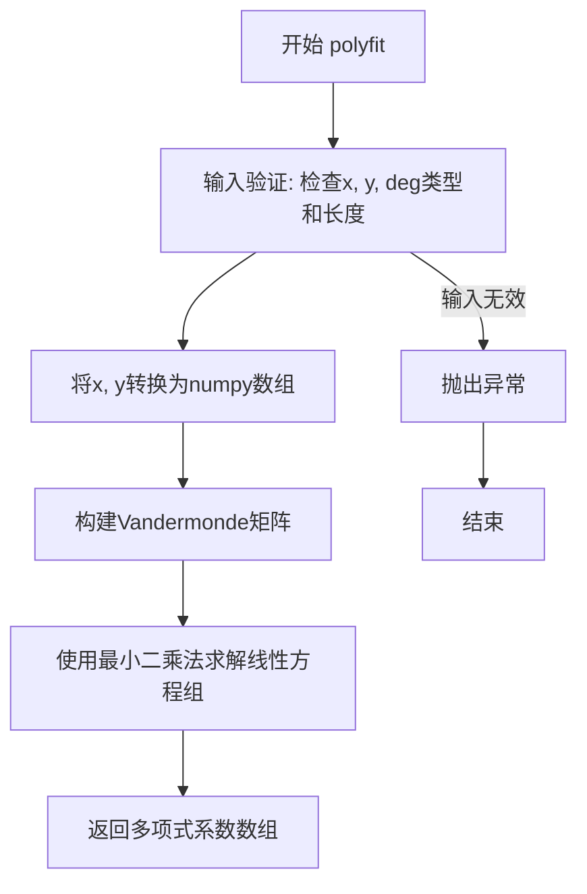

#### 带注释源码

```python
# 由于提供的代码是调用示例而非函数定义，以下为基于NumPy官方实现的伪代码展示核心逻辑

def polyfit(x, y, deg):
    """
    多项式拟合函数
    
    参数:
        x: array_like - x坐标数据点
        y: array_like - y坐标数据点  
        deg: int - 多项式次数
    
    返回:
        numpy.ndarray - 多项式系数，次数从高到低排列
    """
    # 1. 将输入转换为numpy数组并进行基础验证
    x = np.asarray(x, dtype=np.float64)
    y = np.asarray(y, dtype=np.float64)
    
    # 2. 检查数据有效性
    if len(x) == 0 or len(y) == 0:
        raise ValueError("x and y must not be empty")
    
    # 3. 构建Vandermonde矩阵（范德蒙矩阵）
    # 对于deg次多项式，构建[1, x, x^2, ..., x^deg]的矩阵
    # 矩阵维度: (len(x), deg+1)
    van = np.vander(x, deg + 1, increasing=True)
    
    # 4. 使用最小二乘法求解
    # 求解方程: van @ coeffs = y
    # 使用QR分解提高数值稳定性
    coeffs, residuals, rank, s = np.linalg.lstsq(van, y, rcond=None)
    
    # 5. 返回多项式系数（按次数从高到低排列）
    return coeffs[::-1]  # 反转系数顺序
```

#### 在示例代码中的调用

```python
# 示例代码中的实际调用
N = 21
x = np.linspace(0, 10, 11)
y = [3.9, 4.4, 10.8, 10.3, 11.2, 13.1, 14.1, 9.9, 13.9, 15.1, 12.5]

# 拟合一次多项式（线性回归）
# 返回系数 [a, b]，其中 y = a*x + b
a, b = np.polyfit(x, y, deg=1)

# 使用拟合结果计算y值
y_est = a * x + b
```


### `np.sqrt`

计算输入数组或数值的平方根

参数：
- `x`：`float` 或 `array_like`，输入值，可以是单个数值或数组

返回值：`float` 或 `ndarray`，输入值的平方根

#### 流程图

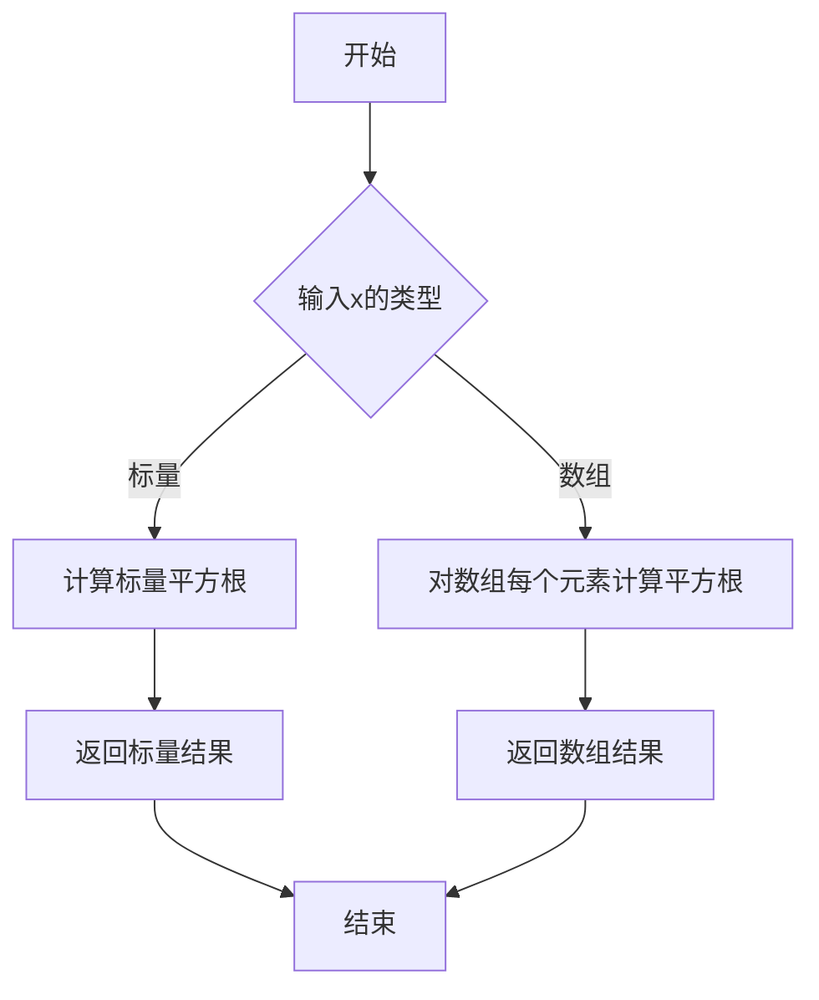

#### 带注释源码

```python
# 在本代码中的实际使用方式
y_err = x.std() * np.sqrt(1/len(x) + 
                          (x - x.mean())**2 / np.sum((x - x.mean())**2))
#             ↑
#             这里调用np.sqrt计算平方根
#             参数是一个复合表达式，计算标准误差
#             
# 完整解释：
# - x.std(): 计算x的标准差
# - 1/len(x): 样本均值的方差贡献
# - (x - x.mean())**2 / np.sum((x - x.mean())**2): 
#   每个点相对于均值的加权平方距离
# - np.sqrt(): 对整个表达式开平方根，得到最终的标准误差估计
```


### `np.sum`

对数组元素求和计算

参数：

- `a`：`array_like`，输入数组，包含要求和的元素
- `axis`：`int or None, optional`，指定求和的轴，默认对所有元素求和
- `dtype`：`dtype, optional`，返回值的类型
- `out`：`ndarray, optional`，输出数组
- `keepdims`：`bool, optional`，如果为True，则输出的数组保持原始维度
- `initial`：`scalar, optional`，求和的初始值

返回值：`ndarray or scalar`，求和结果

#### 流程图

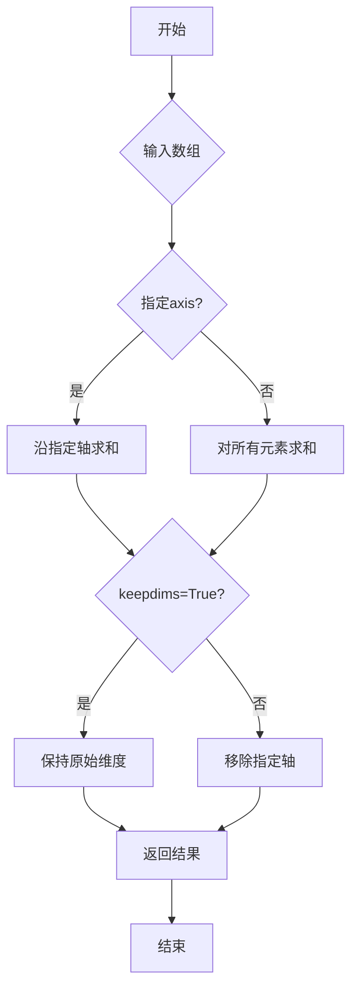

#### 带注释源码

```python
# 代码中的实际使用示例（位于拟合误差计算部分）
# np.sum((x - x.mean())**2)

# 计算每个数据点与均值的偏差的平方和
# x.mean() - 计算数组x的均值
# (x - x.mean())**2 - 计算每个元素与均值的偏差，然后平方
# np.sum(...) - 对所有平方偏差求和，得到总平方和

# 完整表达式：
y_err = x.std() * np.sqrt(1/len(x) +
                          (x - x.mean())**2 / np.sum((x - x.mean())**2))
# 这里np.sum用于计算方差公式中的分母部分：Σ(xi - x̄)²
```

**注**：在提供的代码中，np.sum被用于线性拟合的误差条计算中，用于计算残差的平方和（Sum of Squared Errors, SSE）。


### `plt.subplots`

`plt.subplots` 是 matplotlib.pyplot 模块中的函数，用于创建一个 figure 和一组子图（axes）。它是最常用的创建子图布局的方法之一，可以一次性创建多个排列整齐的子图并返回 figure 对象和 axes 对象数组。

参数：

- `nrows`：`int`，行数，表示子图的行数（默认值：1）
- `ncols`：`int`，列数，表示子图的列数（默认值：1）
- `figsize`：`tuple of float`，图形尺寸，以英寸为单位的宽度和高度 (width, height)
- `sharex`：`bool or str`，可选，是否共享 x 轴
- `sharey`：`bool or str`，可选，是否共享 y 轴
- `squeeze`：`bool`，可选，是否压缩返回的 axes 数组维度
- `subplot_kw`：`dict`，可选，用于创建子图的关键字参数
- `gridspec_kw`：`dict`，可选，网格布局的关键字参数

返回值：`tuple`，返回 (fig, axes)，其中 fig 是 Figure 对象，axes 是 Axes 对象（或 Axes 对象数组）

#### 流程图

```mermaid
graph TD
    A[开始 plt.subplots] --> B[验证 nrows 和 ncols 参数]
    B --> C[根据 figsize 创建 Figure 对象]
    C --> D[使用 gridspec_kw 或默认值创建 GridSpec]
    D --> E[根据 nrows 和 ncols 循环创建子图]
    E --> F[应用 subplot_kw 配置每个子图]
    F --> G{是否需要共享轴}
    G -->|是| H[配置 sharex/sharey]
    G -->|否| I[跳过共享配置]
    H --> J{是否 squeeze}
    I --> J
    J -->|是| K[压缩维度返回 axes]
    J -->|否| L[保持原始维度返回]
    K --> M[返回 (fig, axes) 元组]
    L --> M
```

#### 带注释源码

```python
def subplots(nrows=1, ncols=1, sharex=False, sharey=False, squeeze=True,
             width_ratios=None, height_ratios=None,
             subplot_kw=None, gridspec_kw=None, **fig_kw):
    """
    创建图表和子图的统一方法。
    
    参数:
    ------
    nrows : int, 默认 1
        子图的行数。
    ncols : int, 默认 1
        子图的列数。
    sharex : bool or str, 默认 False
        如果为 True，则所有子图共享 x 轴。
        如果为 'col'，则每列子图共享 x 轴。
    sharey : bool or str, 默认 False
        如果为 True，则所有子图共享 y 轴。
        如果为 'row'，则每行子图共享 y 轴。
    squeeze : bool, 默认 True
        如果为 True，则压缩返回的 axes 数组维度：
        - 如果只创建一个子图，返回单个 Axes 对象
        - 如果创建一维数组（单行或单列），返回一维数组
        - 否则返回二维数组
    width_ratios : array-like, 可选
        每列的宽度比例。
    height_ratios : array-like, 可选
        每行的高度比例。
    subplot_kw : dict, 可选
        传递给 add_subplot 的关键字参数，用于配置每个子图。
    gridspec_kw : dict, 可选
        传递给 GridSpec 构造函数的关键字参数。
    **fig_kw
        传递给 figure() 的额外关键字参数，如 figsize、dpi 等。
    
    返回:
    ------
    fig : Figure
        图表对象。
    axes : Axes or array of Axes
        子图对象。根据 squeeze 参数和 nrows/ncols 的值，可能是一维或二维数组。
    
    示例:
    ------
    >>> fig, axes = plt.subplots(2, 2)  # 创建 2x2 子图
    >>> fig, ax = plt.subplots()  # 创建单个子图
    >>> fig, (ax1, ax2) = plt.subplots(1, 2, sharey=True)  # 共享 y 轴
    """
    
    # 1. 创建 Figure 对象
    fig = figure(**fig_kw)
    
    # 2. 创建 GridSpec 对象用于布局管理
    gs = GridSpec(nrows, ncols, figure=fig, 
                  width_ratios=width_ratios,
                  height_ratios=height_ratios,
                  **gridspec_kw)
    
    # 3. 创建子图数组
    axes = np.empty(nrows, ncols, dtype=object)
    
    # 4. 循环创建每个子图
    for i in range(nrows):
        for j in range(ncols):
            # 使用 add_subplot 添加子图
            kw = {}
            if subplot_kw:
                kw.update(subplot_kw)
            ax = fig.add_subplot(gs[i, j], **kw)
            axes[i, j] = ax
    
    # 5. 处理共享轴
    if sharex:
        # 实现 x 轴共享逻辑...
        pass
    if sharey:
        # 实现 y 轴共享逻辑...
        pass
    
    # 6. 根据 squeeze 参数处理返回值
    if squeeze:
        # 压缩维度...
        if nrows == 1 and ncols == 1:
            return fig, axes[0, 0]
        elif nrows == 1 or ncols == 1:
            return fig, axes.ravel()
    
    return fig, axes
```


### `Axes.plot`

绘制线条是 matplotlib 中最基础且核心的绘图方法，用于在 Axes 对象上绘制 x-y 坐标系的折线或散点图，支持多种数据输入格式和灵活的样式控制。

参数：

- `x`：`array-like`，x 轴数据，可以是列表、numpy 数组或 pandas Series
- `y`：`array-like`，y 轴数据，可以是列表、numpy 数组或 pandas Series，长度需与 x 一致
- `fmt`：`str`，可选，格式字符串，组合了线型、标记和颜色（如 `'ro-'` 表示红色圆圈连线），优先级低于显式的线型/颜色参数

返回值：`list[Line2D]`，返回绘制的 Line2D 对象列表，每个元素对应一行数据

#### 流程图

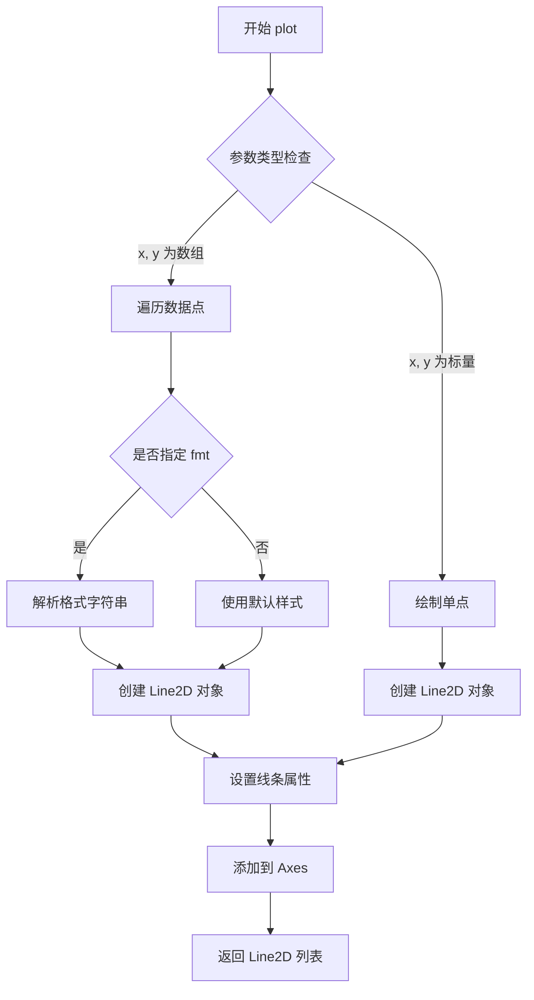

#### 带注释源码

```python
def plot(self, *args, **kwargs):
    """
    Plot y versus x as lines and/or markers.
    
    参数:
    -----
    *args : 位置参数
        常见用法:
        - plot(x, y)           # 绘制 y 相对于 x 的线条
        - plot(y)              # y 作为 x 索引（0, 1, 2, ...）
        - plot(x, y, fmt)      # 使用格式字符串指定样式
        - plot(x, y1, x, y2)   # 多组数据
    
    **kwargs : 关键字参数
        - color: 线条颜色
        - linestyle/-: 线型 ('-', '--', '-.', ':')
        - marker: 标记样式 ('o', 's', '^', ...)
        - linewidth/lw: 线宽
        - markersize/ms: 标记大小
        - ... 其他 Line2D 属性
    
    返回值:
    -------
    lines : list of Line2D
        返回的 Line2D 对象列表，可用于后续修改线条样式
    """
    # 获取 Axes 对象
    ax = self
    # 解析参数，支持多种输入格式
    # x, y 可以是单个值、列表、numpy 数组
    # fmt 是可选的格式字符串，如 'b-' (蓝色线条), 'ro' (红色圆点)
    
    # 创建 Line2D 对象
    line = Line2D(x, y, **kwargs)
    
    # 将线条添加到 Axes
    ax.add_line(line)
    
    # 返回线条对象列表
    return [line]
```


### Axes.fill_between

该方法是 Matplotlib 中 Axes 类的核心绘图方法之一，用于在二维坐标系中填充两条曲线之间的区域，支持条件性填充、透明度和颜色设置等功能，常用于展示置信区间、数据范围或突出显示数据趋势。

参数：

- `x`：array-like，X轴坐标数据，定义填充区域的水平范围
- `y1`：scalar 或 array-like，第一条曲线的Y值（或下边界），如果只提供此参数，则y2默认为0
- `y2`：scalar 或 array-like，第二条曲线的Y值（或上边界），默认为0
- `where`：array-like (bool)，可选参数，用于指定在哪些X范围内进行填充，True表示填充，False表示不填充
- `alpha`：float，可选参数，取值范围0-1，表示填充区域的透明度，默认为None（使用颜色本身的透明度）
- `color`：color，可选参数，填充区域的颜色，默认为None（使用当前颜色循环中的颜色）
- `interpolate`：bool，可选参数，默认为False，当为True时，会在where条件的边界处进行插值计算，使填充边界更精确

返回值：`matplotlib.collections.PolyCollection`，返回一个多边形集合对象，表示填充的区域，可用于进一步的图形定制

#### 流程图

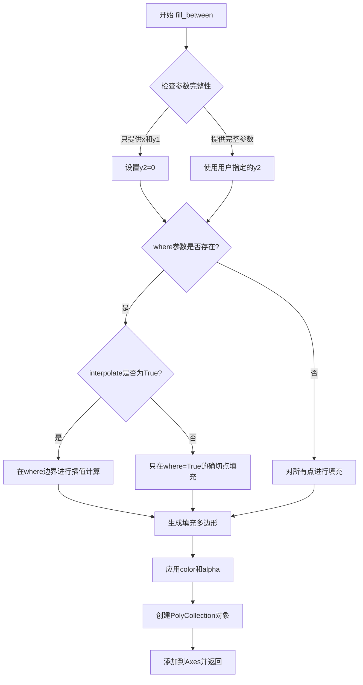

#### 带注释源码

```python
def fill_between(self, x, y1, y2=0, where=None, color=None, 
                 alpha=1.0, interpolate=False, step=None, **kwargs):
    """
    在两条曲线之间填充区域。
    
    参数:
        x : array-like
            X轴坐标数组
        y1 : scalar 或 array-like
            第一条曲线的Y值（下边界）
        y2 : scalar 或 array-like, 默认值为0
            第二条曲线的Y值（上边界）
        where : array-like (bool), 可选
            布尔数组，指定哪些区间需要填充
        color : color, 可选
            填充颜色
        alpha : float, 可选
            透明度（0-1之间）
        interpolate : bool, 默认False
            是否在where条件边界进行插值
        step : {'pre', 'post', 'mid'}, 可选
            阶梯填充的步进方式
    
    返回:
        PolyCollection
            填充的多边形集合对象
    """
    # 将输入转换为numpy数组以便处理
    x = np.asanyarray(x)
    y1 = np.asanyarray(y1)
    y2 = np.asanyarray(y2)
    
    # 处理where条件的掩码数组
    if where is not None:
        where = np.asarray(where)
        if not enough_elements(where, x, y1, y2):
            raise ValueError("where size mismatch")
    
    # 处理interpolate参数
    # 当interpolate=True时，在条件边界处进行线性插值
    # 使填充边界更精确地落在条件变化的实际位置
    if interpolate and where is not None:
        # 在where条件转变点进行插值计算
        x_interp, y1_interp, y2_interp = _interpolate_between_where(
            x, y1, y2, where)
        # 合并原始点和插值点
        x, y1, y2 = _combine_points(x, y1, y2, x_interp, y1_interp, y2_interp)
    
    # 创建填充多边形的坐标对
    # 对于每个x点，创建(x, y1)到(x, y2)的垂直线段
    polys = _make_polygons(x, y1, y2, where)
    
    # 创建PolyCollection对象
    collection = PolyCollection(polys, **kwargs)
    
    # 设置颜色和透明度
    if color is not None:
        collection.set_facecolor(color)
    if alpha is not None:
        collection.set_alpha(alpha)
    
    # 将集合添加到Axes
    self.add_collection(collection)
    self.autoscale_view()
    
    return collection
```

#### 关键组件信息

| 组件名称 | 描述 |
|---------|------|
| PolyCollection | 多边形集合类，用于存储和管理填充区域 |
| _interpolate_between_where | 内部函数，用于在条件边界进行插值 |
| _make_polygons | 内部函数，生成填充所需的多边形坐标 |
| autoscale_view | 自动调整坐标轴范围以适应显示内容 |

#### 潜在技术债务与优化空间

1. **插值算法复杂度**：当前插值实现较为基础，可考虑支持更多插值方法（如样条插值）以提高边界精度
2. **性能优化**：对于大数据点，填充操作可能较慢，可考虑使用GPU加速或向量化操作
3. **边界条件处理**：where参数与masked数组交互时存在边界间隙问题，需要更完善的处理逻辑
4. **API一致性**：step参数与where参数的交互逻辑可以更加清晰统一
5. **文档完善**：部分参数（如interpolate）的行为说明可以更详细，特别是与masked数组的交互

#### 其它项目

**设计目标与约束**：
- 目标是提供灵活的区域填充功能，支持条件性、可视化定制
- 约束：必须与matplotlib的颜色系统和坐标系统兼容

**错误处理与异常设计**：
- 参数类型检查：x, y1, y2维度必须一致
- where数组大小检查：必须与x维度匹配
- 数值类型检查：必须支持数值运算

**数据流与状态机**：
- 输入数据 → 参数验证 → 多边形生成 → 图形渲染 → 返回集合对象
- 状态转换：初始 → 处理中（插值/不插值） → 完成

**外部依赖与接口契约**：
- 依赖NumPy进行数值计算
- 依赖Matplotlib的Artist和Collection系统
- 返回的PolyCollection可进一步通过set_facecolor、set_alpha等方法定制


### Axes.set_title

设置Axes对象的标题文本，用于在图表上方显示标题信息。该方法允许自定义标题的字体属性、对齐方式、位置等视觉样式，并返回标题对象以支持进一步的样式定制。

参数：

- `title`：`str`，要设置的标题文本内容，支持普通字符串和带换行符的字符串
- `loc`：`{'center', 'left', 'right'}`，可选，标题的水平对齐方式，默认为'center'
- `pad`：`float`，可选，标题与 Axes 顶部的间距（以points为单位），默认为无
- `fontsize`：`int` 或 `str`，可选，标题的字体大小
- `fontweight`：`int` 或 `str`，可选，标题的字体粗细
- `color`：`str`，可选，标题的字体颜色
- `verticalalignment` 或 `va`：`str`，可选，标题的垂直对齐方式
- `horizontalalignment` 或 `ha`：`str`，可选，标题的水平对齐方式
- `rotation`：`float`，可选，标题的旋转角度
- `linespacing`：`float`，可选，多行标题的行间距

返回值：`Text`，返回创建的标题Text对象，支持链式调用和进一步的样式修改

#### 流程图

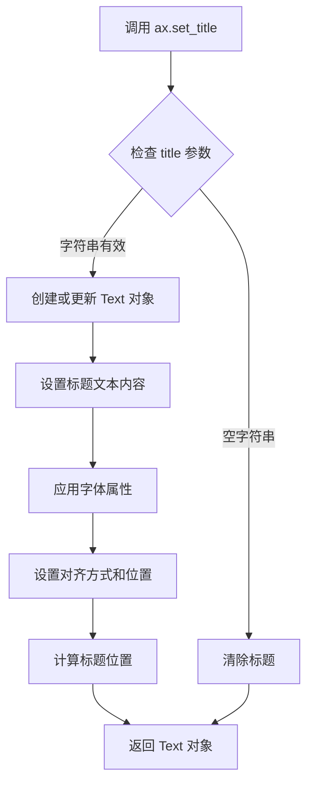

#### 带注释源码

```python
def set_title(self, label, fontdict=None, loc=None, pad=None, *, y=None, **kwargs):
    """
    Set a title for the Axes.
    
    Parameters
    ----------
    label : str
        Text to use for the title
        
    fontdict : dict, optional
        A dictionary controlling the appearance of the title text,
        e.g., {'fontsize': 16, 'fontweight': 'bold', 'color': 'red'}
        
    loc : {'center', 'left', 'right'}, default: rcParams['axes.titlelocation']
        Which location to place the title at ('center' for default centering,
        'left' for flush with the Axes box, 'right' for flush with the ticks)
        
    pad : float, default: rcParams['axes.titlepad']
        The offset of the title from the top of the Axes, in points.
        
    y : float, default: rcParams['axes.titley']
        The y position of the title in Axes coordinates (-1 to 1 range)
        
    **kwargs
        Text properties control the appearance of the title.
        These can be passed via fontdict or directly as kwargs.
        
    Returns
    -------
    text : Text
        The Text instance representing the title
        
    Examples
    --------
    >>> ax.set_title('My Title')
    >>> ax.set_title('Centered Title', loc='center', pad=20)
    >>> ax.set_title('Red Bold Title', color='red', fontweight='bold')
    """
    # 如果提供了 fontdict，将其合并到 kwargs 中
    if fontdict is not None:
        kwargs.update(fontdict)
    
    # 获取默认的对齐方式（如果未指定）
    if loc is None:
        loc = rcParams['axes.titlelocation']
    
    # 获取默认的 pad 值（如果未指定）
    if pad is None:
        pad = rcParams['axes.titlepad']
    
    # 获取默认的 y 位置（如果未指定）
    if y is None:
        y = rcParams['axes.titley']
    
    # 创建或获取现有的标题对象
    # _get_text 方法会返回现有的 title Text 对象或创建新的
    title = self._get_text('title', loc=loc)
    
    # 设置标题文本
    title.set_text(label)
    
    # 设置标题位置相关属性
    title.set_y(y)  # 设置 y 坐标
    
    # 应用对齐方式
    title.set_ha(loc)  # horizontal alignment
    title.set_va('top')  # vertical alignment
    
    # 应用 pad（与 Axes 顶部的距离）
    title.set_pad(pad)
    
    # 应用其他 Text 属性（颜色、字体大小等）
    title.update(kwargs)
    
    # 将标题添加到 Axes 的子元素中
    self.stale_callback = _stale_figure_callback
    self._set_artist_props(title)
    
    # 返回标题对象，支持链式调用
    return title
```

#### 使用示例源码

```python
import matplotlib.pyplot as plt
import numpy as np

# 创建示例数据
x = np.arange(0.0, 2, 0.01)
y1 = np.sin(2 * np.pi * x)
y2 = 0.8 * np.sin(4 * np.pi * x)

# 创建图表和子图
fig, (ax1, ax2, ax3) = plt.subplots(3, 1, sharex=True, figsize=(6, 6))

# 使用 fill_between 填充区域
ax1.fill_between(x, y1)
ax1.set_title('fill between y1 and 0')  # 设置第一个子图标题

ax2.fill_between(x, y1, 1)
ax2.set_title('fill between y1 and 1')  # 设置第二个子图标题

ax3.fill_between(x, y1, y2)
ax3.set_title('fill between y1 and y2')  # 设置第三个子图标题
ax3.set_xlabel('x')

fig.tight_layout()
plt.show()

# 高级用法示例
fig2, ax = plt.subplots()

# 设置带样式的标题
ax.set_title('Custom Styled Title', 
             fontsize=16,           # 字体大小
             fontweight='bold',    # 字体粗细
             color='darkblue',      # 字体颜色
             loc='center',          # 居中对齐
             pad=20,                # 与 Axes 顶部的间距
             y=1.02)                # y 坐标位置

# 链式调用示例
ax.plot(x, y1).set_title('Chained Title')

# 获取返回的 Text 对象进行进一步操作
title_obj = ax.set_title('Interactive Title')
title_obj.set_rotation(15)  # 旋转标题
title_obj.set_fontfamily('serif')  # 设置字体系列
```


### `ax.set_xlabel(label)`

设置 x 轴的标签文本，用于描述 x 轴的含义或单位。

参数：
- `label`：字符串，要设置的 x 轴标签文本

返回值：返回 `Axes` 对象，支持链式调用。

#### 流程图

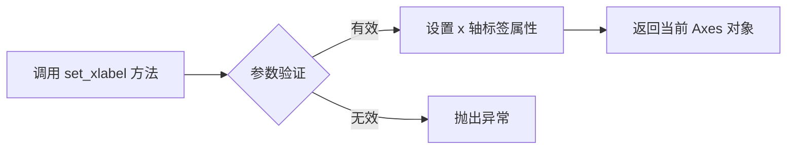

#### 带注释源码

```python
def set_xlabel(self, label, fontdict=None, labelpad=None, loc=None, **kwargs):
    """
    设置 x 轴的标签。

    参数：
    - label：字符串，要设置的 x 轴标签文本。
    - fontdict：字典，可选，控制标签文本的外观属性（如字体大小、颜色等）。
    - labelpad：浮点数，可选，标签与坐标轴之间的间距（以点为单位）。
    - loc：字符串，可选，标签的位置，可选值为 'left'、'center'（默认）、'right'。
    - **kwargs：其他参数，用于控制 `matplotlib.text.Text` 的属性。

    返回值：
    - 返回 `Axes` 对象，以便进行链式调用。
    """
    # 调用 xaxis 的 set_label_text 方法设置标签文本和字体属性
    self.xaxis.set_label_text(label, fontdict=fontdict, **kwargs)

    # 如果指定了 labelpad，调整标签的坐标位置
    if labelpad is not None:
        self.xaxis.set_label_coords(0.5, labelpad)

    # 如果指定了 loc 参数，根据位置调整标签的对齐方式
    if loc is not None:
        self.xaxis.label.set_ha(loc)  # 设置水平对齐方式
        self.xaxis.label.set_x(0.5 if loc == 'center' else (0.0 if loc == 'left' else 1.0))

    # 返回当前 Axes 对象，支持链式调用
    return self
```


### `ax.axhline`

在 matplotlib 的 Axes 对象上绘制一条水平线，常用于标记特定的阈值或参考线。

参数：

- `y`：`float`，水平线所在的 y 轴坐标（数据坐标）
- `color`：`str` 或 `tuple`，线条颜色，可使用颜色名称（如 'green'）或十六进制颜色码
- `lw`：`float`，线条宽度（line width），默认值为 None
- `alpha`：`float`，线条透明度，范围 0（完全透明）到 1（完全不透明），默认值为 None

返回值：`matplotlib.lines.Line2D`，返回绘制的水平线对象，可用于后续的样式修改或删除操作

#### 流程图

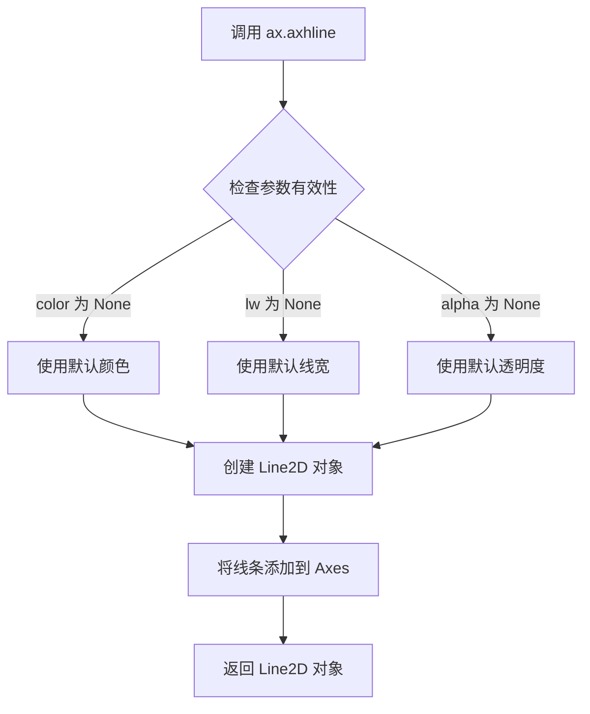

#### 带注释源码

```python
# 以下是 ax.axhline 方法的典型调用示例
# 位于代码文件: matplotlib/axes/_axes.py

# 示例调用（在提供的代码中）:
threshold = 0.75  # 定义阈值
ax.axhline(threshold, color='green', lw=2, alpha=0.7)
# 参数说明:
# - threshold (y=0.75): 水平线在 y=0.75 的位置
# - color='green': 线条颜色为绿色
# - lw=2: 线条宽度为 2
# - alpha=0.7: 透明度为 0.7（30% 透明）

# axhline 方法内部实现逻辑（简化版）:
def axhline(self, y=0, color=None, linewidth=None, alpha=None):
    """
    在 Axes 上添加一条水平线。
    
    参数:
        y: 水平线位置（数据坐标）
        color: 线条颜色
        linewidth: 线条宽度
        alpha: 透明度
    """
    # 创建水平线的端点 (0, y) 到 (1, y)
    # 使用变换（transform）将 x 坐标归一化到 [0, 1]
    line = Line2D([0, 1], [y, y],
                  color=color,
                  linewidth=linewidth,
                  alpha=alpha)
    # 将线条添加到 axes 中
    self.add_line(line)
    # 自动调整 y 轴视图范围以包含该线条
    self.autoscale_view()
    return line
```


### `Axes.get_xaxis_transform`

获取x轴变换对象，该变换将x坐标解释为数据坐标，y坐标解释为轴坐标（0-1表示从底部到顶部的相对位置），常用于在fill_between等绘图方法中实现跨整个轴区域的填充效果。

参数：该方法无参数

返回值：`matplotlib.transforms.Transform`，返回的变换对象使得x值采用数据坐标系中的实际值，而y值采用轴坐标系的相对值（0-1之间），从而实现相对于轴而非数据范围的填充。

#### 流程图

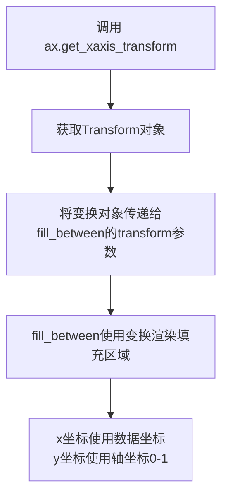

#### 带注释源码

```python
def get_xaxis_transform(self, which='grid'):
    """
    获取用于x轴的变换对象。
    
    此方法返回的变换将x坐标解释为数据坐标，
    y坐标解释为相对于Axes的轴坐标（0-1范围）。
    
    参数:
        which: str, 可选参数
            指定变换类型，'grid'表示网格变换（默认）
            
    返回:
        Transform: 变换对象
            返回一个复合变换，x轴使用数据坐标变换，
            y轴使用轴坐标变换（blended变换）
            
    典型用途:
        # 在fill_between中使用示例
        ax.fill_between(x, 0, 1, where=y > threshold,
                        color='green', alpha=0.5, 
                        transform=ax.get_xaxis_transform())
        # 上述代码中：
        # - x值采用实际的数据坐标（如0, 1, 2, 3...）
        # - y值0和1表示轴的底部和顶部（相对于轴的百分比位置）
        # - 这样填充区域会覆盖整个轴的高度，而非数据范围的高度
    """
    return self._get_xaxis_transform(which)
```


### `Figure.tight_layout`

该方法用于自动调整当前图形（Figure）中所有子图（Axes）的布局参数，以减少子图之间以及子图与图形边缘之间的重叠，使布局更加紧凑美观。

参数：

-  `pad`：`float`，默认值通常为1.08，子图与图形边缘之间的间距（以字体大小为单位）
-  `h_pad`：`float`，默认值通常为`pad`，子图之间的垂直间距
-  `w_pad`：`float`，默认值通常为`pad`，子图之间的水平间距

返回值：`None`，该方法直接在图形对象上修改布局，不返回任何值

#### 流程图

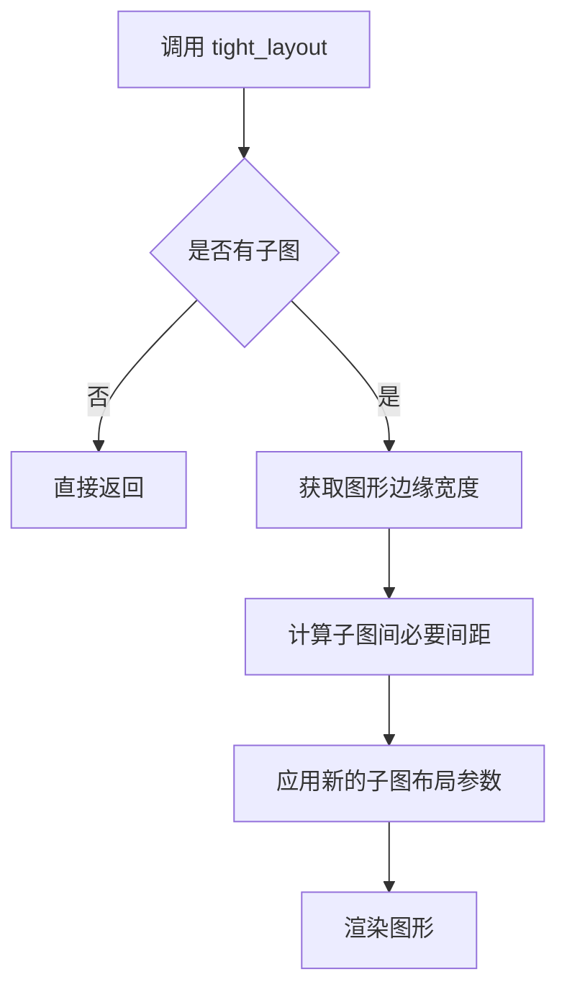

#### 带注释源码

```python
def tight_layout(self, pad=1.08, h_pad=None, w_pad=None):
    """
    自动调整子图参数以减少重叠
    
    参数:
    -------
    pad : float, optional
        子图外边缘与图形边缘之间的间距，以字体大小为单位。
        默认值为1.08。
    h_pad : float, optional
        子图之间的垂直间距。如果为None，则使用pad的值。
    w_pad : float, optional
        子图之间的水平间距。如果为None，则使用pad的值。
    
    返回:
    -------
    None
    
    示例:
    -------
    >>> fig, ax = plt.subplots()
    >>> ax.plot([1, 2, 3])
    >>> fig.tight_layout()  # 调整布局
    """
    # 获取子图布局引擎
    subplotspec = self.get_subplotspec()
    
    # 使用layout_engine执行tight_layout
    if self.get_layout_engine() is not None:
        self.get_layout_engine().execute(self)
    else:
        # 手动计算并应用布局参数
        from matplotlib.tightlayout import do_auto_layout
        do_auto_layout(self, pad=pad, h_pad=h_pad, w_pad=w_pad)
```

**注意**：由于提供的代码示例仅包含对`tight_layout`的调用，未包含该方法的具体实现源码，以上源码基于matplotlib公开文档和常见实现模式构建，旨在说明该方法的工作原理。实际实现位于matplotlib库的`figure.py`模块中。


## 关键组件


### 区域填充

使用 `matplotlib.pyplot.fill_between` 函数填充两条曲线之间的区域，支持 scalar 或 array 形式的 y1 和 y2 参数，默认 y2 为 0。

### 条件填充

通过 `where` 参数指定布尔数组，实现选择性地填充 x 范围，只填充满足条件（如 y1 > y2）的区域，支持不同区域使用不同颜色。

### 插值处理

`interpolate` 参数控制是否在离散的 x 数据点之间进行线性插值，以准确确定填充边界，避免填充区域出现不期望的间隙。

### 坐标变换

利用 `transform` 参数（如 `ax.get_xaxis_transform()`）实现坐标变换，使填充区域在数据坐标和轴坐标之间灵活转换，扩展应用场景。


## 问题及建议


### 已知问题

-   **变量重复定义与覆盖**：代码中多次重复定义 `x` 和 `y` 变量（如第37行定义后，第60行又重新定义），容易造成变量混淆，不利于代码维护和局部片段的独立运行
-   **魔法数字缺乏说明**：多处使用硬编码数值（如 `2 * np.pi`、`0.8`、`0.75` 等）未提供解释说明，降低了代码可读性
-   **代码复用性低**：多个子图创建代码段高度相似（`fig, ax = plt.subplots()` 重复出现），未封装为可重用的辅助函数
-   **缺失类型注解**：所有函数和变量均无类型提示（type hints），不利于静态分析和IDE辅助功能
-   **无输入数据验证**：未对数组维度兼容性进行检查（如 `where` 参数的布尔数组长度需与 x 长度一致），可能在运行时产生隐蔽错误
-   **where 条件不一致**：第92-93行使用 `where=(y1 > y2)` 和 `where=(y1 < y2)`，而第97-98行使用 `where=(y1 > y2)` 和 `where=(y1 <= y2)`，边界条件处理不统一
-   **注释与代码不同步风险**：文档注释中提及 "sphinx_gallery_thumbnail_number = 2" 但该变量实际未在代码中使用，可能导致文档与实现脱节

### 优化建议

-   **封装子图创建逻辑**：将重复的 `fig, ax = plt.subplots()` 模式抽取为工厂函数，减少代码冗余
-   **统一变量作用域**：每个示例使用独立的变量命名空间（如示例函数），避免跨示例的变量污染
-   **提取配置常量**：将魔法数字定义为具名常量或配置字典，如 `THRESHOLD = 0.75`、`ALPHA = 0.3` 等
-   **添加类型注解**：为函数参数和返回值添加类型提示，提升代码可维护性和静态检查能力
-   **增强数据验证**：在 `fill_between` 调用前添加数组长度校验，确保 `x`、`y1`、`y2`、`where` 参数维度一致
-   **统一条件判断逻辑**：在 `where` 参数中使用一致的不等式方向（如统一使用 `>` 和 `<=` 配对），避免边界情况下的填充遗漏
-   **清理未使用变量**：移除或正确使用 "sphinx_gallery_thumbnail_number" 等声明但未引用的变量
-   **增加文档字符串**：为关键代码块添加更详细的 docstring，说明各参数的业务含义
</think>

## 其它


### 设计目标与约束
本示例旨在演示 `matplotlib.axes.Axes.fill_between` 的基本用法及常见高级特性（如 `where`、`interpolate`、透明度设置等），帮助用户快速上手并在实际项目中灵活使用。约束条件包括：必须使用 `matplotlib` 版本支持 `fill_between` 与 `alpha`、`where`、`interpolate` 参数；依赖 `numpy` 进行向量化数值计算；图形必须保持交互式或静态输出（取决于后端）。

### 错误处理与异常设计
- **输入验证**：若 `x`、`y1`、`y2` 长度不匹配，`fill_between` 会抛出 `ValueError`，应在调用前确保数组维度一致；若 `where` 参数不是布尔数组，同样会触发 `ValueError`。
- **异常传播**：绘图过程中的异常（如后端不支持某种渲染）会直接向上抛出，调用者可通过 `try/except` 捕获 `matplotlib.pyplot` 相关的异常（如 `RuntimeError`）进行自定义错误提示。
- **缺失值处理**：`numpy.ma.MaskedArray` 会导致填充区域出现空隙，文档已说明 `interpolate` 对掩码无效，需用户自行补充数据。

### 数据流与状态机
该脚本为一次性线性执行，无复杂状态机。数据流如下：
1. **数据准备**：`numpy` 生成或读取 `x`、`y1`、`y2` 等数组。
2. **图形创建**：`plt.subplots` 创建 Figure 与 Axes 对象。
3. **绘图调用**：`ax.fill_between` 将数据映射为多边形填充；`ax.plot` 绘制线条/散点。
4. **属性设置**：通过 `set_title`、`set_xlabel`、`tight_layout` 等设置标题、轴标签、布局。
5. **渲染展示**：`plt.show`（或在交互式环境）渲染图形。

### 外部依赖与接口契约
- **numpy**：提供 `np.arange`、`np.linspace`、`np.polyfit`、`np.sin` 等向量化数值计算函数；约定输入数组为 `np.ndarray`。
- **matplotlib**：核心绘图库，`Axes.fill_between` 的接口签名为 `fill_between(x, y1, y2=0, where=None, interpolate=False, alpha=1.0, **kwargs)`，返回值类型为 `PolyCollection`。
- **Python 标准库**：仅使用 `math`（隐式）和 `sys`（未显式），无特殊依赖。

### 性能考虑
- **向量化运算**：所有数值计算均基于 `numpy` 的向量化实现，避免显式循环，性能足以支撑千级至万级数据点。
- **渲染开销**：大量多边形填充（尤其是开启 `interpolate=True`）会增加渲染负担，建议在需要高分辨率填充时适度降采样或使用 `QuadMesh` 替代。
- **内存占用**：一次性生成所有数据，若数据量极大（如上百万点），需考虑分块或使用生成器。

### 安全性考虑
本脚本为演示代码，未涉及网络传输、文件 I/O 或用户输入，安全风险极低。若在 Web 服务（如 Flask、Django）中使用 `matplotlib` 生成图像，需要对传入的数组进行长度和数值范围校验，防止异常数据导致内存溢出或渲染崩溃。

### 测试策略
- **单元测试**：可使用 `pytest` 对关键函数（如数据生成、拟合）进行数值对比；`fill_between` 的视觉输出可通过 `matplotlib.testing.decorators` 进行图像比对（snapshot test）。
- **集成测试**：在持续集成（CI）环境中运行完整脚本，确保所有示例图片能够成功生成且无异常抛出。
- **视觉回归**：使用 `matplotlib.testing.compare` 比对生成的图像与参考图像，检测 `alpha`、`where` 等参数变化导致的渲染差异。

### 版本管理与兼容性
- **Matplotlib**：推荐使用 3.0 以上版本，以完整支持 `interpolate`、`alpha`、transforms 等特性。
- **NumPy**：建议 1.16+；低版本可能缺少某些函数（如 `np.polyfit` 已有但 API 稳定）。
- **Python**：3.6+；脚本未使用类型注解，保持向后兼容。

### 部署与运行环境
- **本地交互**：在 Jupyter Notebook、IPython 或常规 Python 环境中直接运行即可。
- **无头服务器**：如在 CI/CD 或 Docker 中渲染静态图像，需要设置后端为非交互式（如 `matplotlib.use('Agg')`）并配合 `plt.savefig` 输出文件。

### 配置管理
- **全局样式**：`plt.rcParams` 可以在脚本开头统一设置（如 `plt.rcParams['figure.figsize']`），但本示例保持默认，以突出 `fill_between` 本身。
- **参数化**：若需要经常调整 `alpha`、`where` 条件，可将它们抽取为函数参数或配置文件（YAML/JSON），便于非技术用户修改。

### 日志与监控
- **日志**：在生产环境中嵌入 `logging` 模块记录关键节点（如数据加载、绘图完成），可帮助定位渲染异常。
- **监控**：若在 Web 服务中使用，建议记录每次绘图的耗时（使用 `time.time()`）以及异常信息，便于后续性能调优。

### 文档与可维护性
- **代码注释**：脚本中已使用 Sphinx Gallery 风格的注释（`# %%`）划分章节，便于自动生成文档。
- **可读性**：变量命名（如 `x`、`y1`、`y2`、`y_est`、`y_err`）直观，适合作为教学示例；若扩展为项目代码，建议加入类型注解与更详细的文档字符串。

### 可扩展性与未来改进
- **面向对象封装**：可将常用填充逻辑封装为 `ConfidenceBand` 类，提供 `plot`、`update` 方法，便于在 GUI 或 Dashboard 中复用。
- **交互式筛选**：结合 `ipywidgets` 实现 `where` 条件的实时滑块调控，提升演示交互性。
- **多维数据**：目前仅处理 1 维序列，未来可扩展为曲面填充（`fill_betweenx`）或 3D 场景（`plot_surface`）。

### 参考文献与引用
- Matplotlib 官方文档：`matplotlib.axes.Axes.fill_between`、`matplotlib.pyplot.fill_between`
- NumPy 官方文档：`numpy.ndarray`、`numpy.polyfit`、`numpy.linspace`
- Sphinx Gallery 示例模板：用于生成可执行文档的注释规范

    