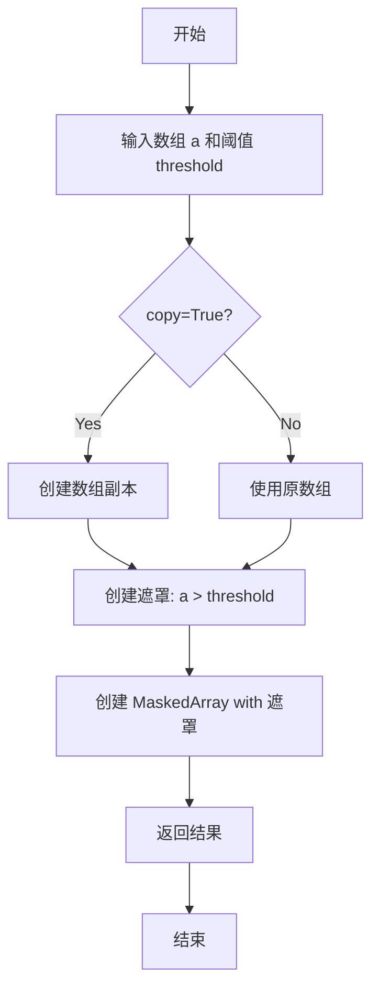
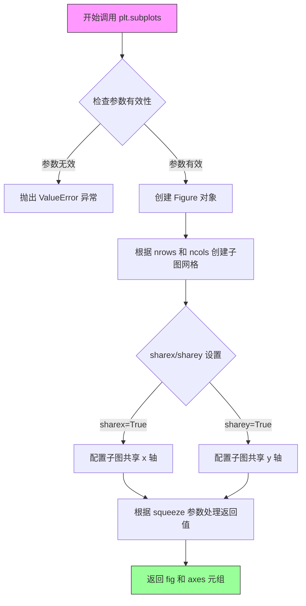
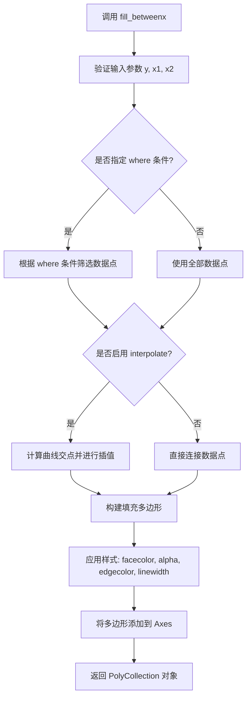
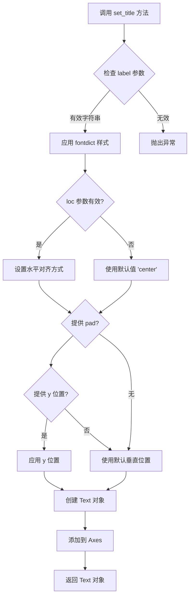
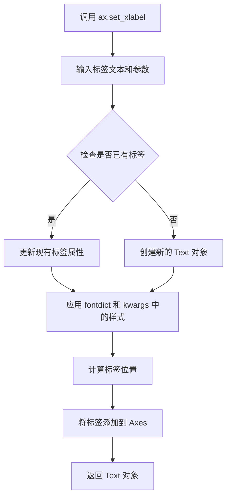
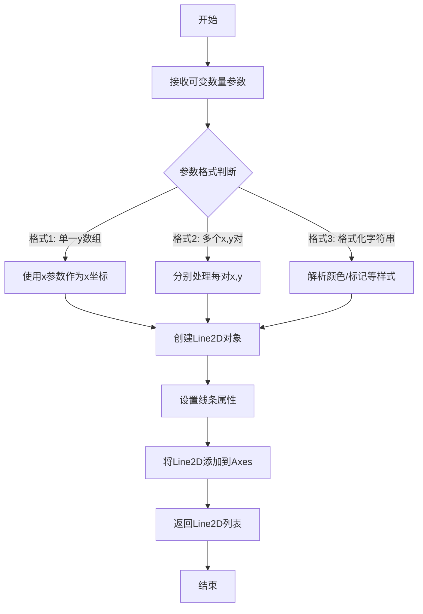
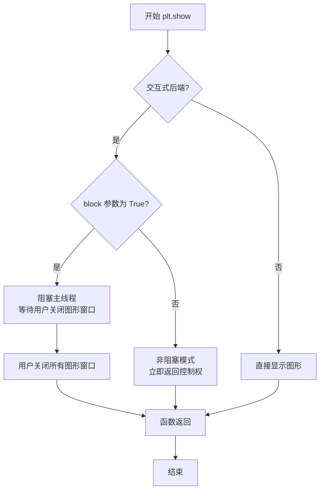

# `matplotlib\galleries\examples\lines_bars_and_markers\fill_betweenx_demo.py` 详细设计文档

这是一个matplotlib示例代码，演示如何使用fill_betweenx函数在两条垂直曲线之间的区域填充颜色，包括基本填充、条件填充和遮罩数组处理等场景。

## 整体流程

```mermaid
graph TD
    A[开始] --> B[创建y轴数据: np.arange(0.0, 2, 0.01)]
    B --> C[计算x1曲线: np.sin(2 * np.pi * y)]
    C --> D[计算x2曲线: 1.2 * np.sin(4 * np.pi * y)]
    D --> E[创建3个子图ax1, ax2, ax3]
    E --> F[ax1: 填充x1与0之间]
    F --> G[ax2: 填充x1与1之间]
    G --> H[ax3: 填充x1与x2之间]
    H --> I[创建2个子图ax, ax1用于条件填充]
    I --> J[绘制x1和x2曲线]
    J --> K[根据条件x2>=x1和x2<=x1分别填充]
    K --> L[遮罩x2>1.0的数据]
    L --> M[再次绘制和填充]
    M --> N[plt.show显示图形]
    N --> O[结束]
```

## 类结构

```
该代码为脚本形式，无类定义
主要使用matplotlib.pyplot和numpy模块
包含6个子图操作：ax1, ax2, ax3, ax, ax1(第二个), ax(第二个)
```

## 全局变量及字段


### `y`
    
y轴数据，从0.0到2，步长0.01

类型：`numpy.ndarray`
    


### `x1`
    
第一条正弦曲线 (2πy)

类型：`numpy.ndarray`
    


### `x2`
    
第二条正弦曲线 (4πy * 1.2)，后续可能被遮罩

类型：`numpy.ndarray`
    


### `fig`
    
图形对象

类型：`matplotlib.figure.Figure`
    


### `ax1`
    
第一个子图的坐标轴

类型：`matplotlib.axes.Axes`
    


### `ax2`
    
第二个子图的坐标轴

类型：`matplotlib.axes.Axes`
    


### `ax3`
    
第三个子图的坐标轴

类型：`matplotlib.axes.Axes`
    


### `ax`
    
第四个子图的坐标轴(用于条件填充)

类型：`matplotlib.axes.Axes`
    


### `ax1_2`
    
第五个子图的坐标轴(用于遮罩数组)

类型：`matplotlib.axes.Axes`
    


    

## 全局函数及方法


### `np.arange`

生成等差数组，用于创建y轴数据。

参数：

- `start`：`float`，起始值，默认为0.0
- `stop`：`float`，结束值（不包含）
- `step`：`float`，步长，默认为1.0
- `dtype`：`dtype`，输出数组的数据类型，若未指定则自动推断

返回值：`numpy.ndarray`，返回一个等差数列的NumPy数组

#### 流程图

```mermaid
flowchart TD
    A[开始] --> B[接收参数 start, stop, step, dtype]
    B --> C{检查参数有效性}
    C -->|参数无效| D[抛出异常]
    C -->|参数有效| E[计算数组长度: ceil((stop-start)/step)]
    E --> F[使用Python range生成序列]
    F --> G[将序列转换为NumPy数组]
    G --> H[转换为指定的dtype]
    H --> I[返回NumPy数组]
```

#### 带注释源码

```python
# 在用户代码中的实际调用
y = np.arange(0.0, 2, 0.01)

# np.arange 函数原型（简化版）
def arange(start=0.0, stop=None, step=1.0, dtype=None):
    """
    生成等差数组
    
    参数:
        start: 起始值，默认为0.0
        stop: 结束值（不包含）
        step: 步长
        dtype: 输出数组的数据类型
    
    返回:
        等差数列的NumPy数组
    """
    # 处理只有stop参数的情况（兼容Matlab风格）
    if stop is None:
        stop = start
        start = 0.0
    
    # 计算数组长度
    # ceil((stop - start) / step)
    length = int(np.ceil((stop - start) / step))
    
    # 使用Python内置range生成序列并转换为NumPy数组
    # 这里会创建一个从start到stop-step的序列
    y = np.linspace(start, start + step * (length - 1), length)
    
    # 如果step为负数，需要调整
    if step < 0:
        y = y[y > stop]
    
    return y

# 在本例中：
# start = 0.0, stop = 2, step = 0.01
# 生成一个从0.0到1.99（不包含2.0）的数组
# 步长为0.01，共200个元素
```


### `np.sin`

正弦函数，用于计算输入数组（以弧度表示）的正弦值，生成周期性曲线数据。

参数：

-  `x`：`ndarray` 或 scalar，输入的角度值（以弧度为单位）

返回值：`ndarray`，返回输入角度的正弦值，数组形状与输入相同

#### 流程图

```mermaid
flowchart TD
    A[开始] --> B[接收输入参数 x]
    B --> C[将 x 转换为弧度值<br/>2πy 或 4πy]
    C --> D[计算 sin(x) 值]
    D --> E[返回正弦结果数组]
    E --> F[结束]
    
    subgraph 曲线生成
    G[y 数据: 0.0 到 2, 步长 0.01] --> C
    end
    
    subgraph 实际应用
    H[x1 = np.sin<br/>2πy] --> I[生成曲线1]
    J[x2 = 1.2 × np.sin<br/>4πy] --> K[生成曲线2]
    end
```

#### 带注释源码

```python
# 导入数值计算库
import numpy as np

# 生成 y 轴数据：从 0.0 到 2，步长 0.01
y = np.arange(0.0, 2, 0.01)

# 计算曲线 x1：使用 np.sin 计算 2π 频率的正弦波
# 参数: 2 * np.pi * y (弧度值)
# 返回: 对应角度的正弦值数组
x1 = np.sin(2 * np.pi * y)

# 计算曲线 x2：使用 np.sin 计算 4π 频率的正弦波，振幅为 1.2
# 参数: 4 * np.pi * y (弧度值)
# 返回: 对应角度的正弦值数组，乘以 1.2 进行振幅缩放
x2 = 1.2 * np.sin(4 * np.pi * y)
```


### `np.ma.masked_greater`

遮罩大于指定阈值的元素，创建一个 MaskedArray，其中所有大于给定阈值的元素被标记为无效（masked）。

参数：

-  `a`：`array_like`，需要遮罩的输入数组
-  `threshold`：`float`，用于比较的阈值，大于此值的元素将被遮罩
-  `copy`：`bool`（可选），默认为 `True`，是否复制数组以创建新的 MaskedArray

返回值：`numpy.ma.MaskedArray`，返回一个新的 MaskedArray，其中大于 `threshold` 的元素被遮罩

#### 流程图



#### 带注释源码

```python
def masked_greater(a, threshold, copy=True):
    """
    遮罩大于指定值的元素。
    
    Parameters
    ----------
    a : array_like
        需要遮罩的输入数组。
    threshold : float
        用于比较的阈值，大于此值的元素将被遮罩。
    copy : bool, optional
        是否复制数组。默认为 True。
    
    Returns
    -------
    numpy.ma.MaskedArray
        返回一个新的 MaskedArray，其中大于 threshold 的元素被遮罩。
    
    Examples
    --------
    >>> import numpy as np
    >>> x = np.array([1, 2, 3, 4, 5])
    >>> np.ma.masked_greater(x, 3)
    masked_array(data=[1, 2, 3, --, --],
                 mask=[False, False, False,  True,  True],
           fill_value=999999)
    """
    # 将输入转换为 MaskedArray（如果还不是）
    a = np.ma.array(a, copy=copy)
    
    # 使用 greater 函数创建遮罩：a > threshold
    # 这会返回一个布尔数组，标记大于阈值的元素为 True
    mask = np.greater(a, threshold)
    
    # 将遮罩应用到数组
    a[mask] = np.ma.masked
    
    return a
```


### `plt.subplots`

`plt.subplots` 是 Matplotlib 库中的一个核心函数，用于创建一个新的图形窗口（Figure）以及指定数量的子图（Axes）网格。该函数简化了创建多个子图的过程，允许用户一次性生成并管理一个由行和列组成的子图阵列，支持共享坐标轴、调整图形尺寸和分辨率等高级配置。

参数：

- `nrows`：int，默认值为 1，指定子图网格的行数
- `ncols`：int，默认值为 1，指定子图网格的列数
- `sharex`：bool 或 str，默认值为 False，如果为 True，则所有子图共享 x 轴刻度；如果为 'row'，则每行的子图共享 x 轴；如果为 'col'，则每列的子图共享 x 轴
- `sharey`：bool 或 str，默认值为 False，如果为 True，则所有子图共享 y 轴刻度；如果为 'row'，则每行的子图共享 y 轴；如果为 'col'，则每列的子图共享 y 轴
- `squeeze`：bool，默认值为 True，如果为 True，则返回的 axes 数组维度会被压缩：如果只创建一个子图（nrows=1, ncols=1）或只创建一维数组，则返回单独的 Axes 对象而不是二维数组
- `width_ratios`：array-like，可选参数，指定每列子图的相对宽度
- `height_ratios`：array-like，可选参数，指定每行子图的相对高度
- `figsize`：tuple of floats，可选参数，指定图形的宽和高（英寸），默认使用 rcParams["figure.figsize"]
- `dpi`：int，可选参数，指定图形的分辨率（每英寸点数），默认值为 100
- `facecolor`：color，可选参数，指定图形的背景颜色，默认使用 rcParams["figure.facecolor"]
- `edgecolor`：color，可选参数，指定图形的边框颜色，默认使用 rcParams["figure.edgecolor"]
- `frameon`：bool，可选参数，指定是否绘制图形边框，默认值为 True
- `subplot_kw`：dict，可选参数，传递给 `add_subplot` 的关键字参数，用于配置每个子图
- `gridspec_kw`：dict，可选参数，传递给 GridSpec 构造函数的关键字参数，用于配置网格布局
- `**kwargs`：其他关键字参数，将传递给 Figure 构造函数

返回值：`tuple(Figure, Axes or array of Axes)`，返回一个元组，其中第一个元素是 Figure 对象（整个图形），第二个元素是 Axes 对象（单个子图）或 Axes 对象的数组（多个子图）

#### 流程图



#### 带注释源码

```python
def subplots(nrows=1, ncols=1, sharex=False, sharey=False, squeeze=True,
             width_ratios=None, height_ratios=None,
             figsize=None, dpi=None, facecolor=None, edgecolor=None,
             frameon=True, subplot_kw=None, gridspec_kw=None, **kwargs):
    """
    创建一个图形窗口和一组子图.
    
    参数:
        nrows (int): 子图网格的行数，默认值为 1
        ncols (int): 子图网格的列数，默认值为 1
        sharex (bool or str): 是否共享 x 轴，可选值为 True, False, 'row', 'col'
        sharey (bool or str): 是否共享 y 轴，可选值为 True, False, 'row', 'col'
        squeeze (bool): 是否压缩返回的轴数组，默认值为 True
        width_ratios (array-like): 每列子图的相对宽度
        height_ratios (array-like): 每行子图的相对高度
        figsize (tuple): 图形的宽和高（英寸）
        dpi (int): 图形的分辨率
        facecolor (color): 图形背景颜色
        edgecolor (color): 图形边框颜色
        frameon (bool): 是否绘制图形边框
        subplot_kw (dict): 传递给每个子图的关键字参数
        gridspec_kw (dict): 传递给 GridSpec 的关键字参数
        **kwargs: 其他传递给 Figure 的关键字参数
    
    返回:
        tuple: (fig, axes) 元组，fig 是 Figure 对象，axes 是 Axes 或 Axes 数组
    """
    # 创建一个新的 Figure 对象，传入图形属性参数
    fig = Figure(
        figsize=figsize, dpi=dpi, facecolor=facecolor, edgecolor=edgecolor,
        frameon=frameon, **kwargs
    )
    
    # 创建 GridSpec 对象，用于管理子图网格布局
    gs = GridSpec(nrows, ncols, figure=fig, 
                  width_ratios=width_ratios, 
                  height_ratios=height_ratios,
                  **gridspec_kw)
    
    # 创建子图数组
    ax_array = np.empty((nrows, ncols), dtype=object)
    
    # 遍历每个网格位置创建子图
    for i in range(nrows):
        for j in range(ncols):
            # 使用 add_subplot 创建子图
            kw = subplot_kw.copy() if subplot_kw else {}
            ax = fig.add_subplot(gs[i, j], **kw)
            ax_array[i, j] = ax
            
            # 配置共享轴
            if sharex:
                # 'col' 表示每列共享，'row' 表示每行共享
                if sharex == 'col' and j > 0:
                    ax.sharex(ax_array[i, 0])
                elif sharex == 'row' and i > 0:
                    ax.sharex(ax_array[0, j])
                elif sharex is True and (i > 0 or j > 0):
                    ax.sharex(ax_array[0, 0])
            
            if sharey:
                if sharey == 'col' and j > 0:
                    ax.sharey(ax_array[i, 0])
                elif sharey == 'row' and i > 0:
                    ax.sharey(ax_array[0, j])
                elif sharey is True and (i > 0 or j > 0):
                    ax.sharey(ax_array[0, 0])
    
    # 根据 squeeze 参数处理返回值的维度
    if squeeze:
        # 压缩为一维数组或单个对象
        if nrows == 1 and ncols == 1:
            axes = ax_array[0, 0]  # 返回单个 Axes 对象
        elif nrows == 1 or ncols == 1:
            axes = ax_array.flatten()  # 返回一维数组
        else:
            axes = ax_array  # 返回二维数组
    else:
        axes = ax_array  # 始终返回二维数组
    
    return fig, axes
```


### `Axes.fill_betweenx`

该方法用于在两条水平曲线之间的区域填充颜色，常用于展示数据在Y轴方向上的范围或区间。

参数：

- `y`：`array_like`，Y坐标数组，定义填充区域的垂直范围
- `x1`：`array_like`，第一条曲线的X坐标值
- `x2`：`array_like`，可选，默认值为0，第二条曲线的X坐标值
- `where`：`array_like`，可选，布尔条件数组，指定满足条件的区域进行填充
- `interpolate`：`bool`，可选，默认值为False，是否在交点处进行插值处理
- `step`：`{'pre', 'post', 'mid'}`，可选，阶梯填充模式
- `alpha`：`float`，可选，填充透明度（0-1之间）
- `facecolor`：`color`，可选，填充区域颜色
- `edgecolor`：`color`，可选，边界颜色
- `linewidth`：`float`，可选，边界线宽度
- `linestyle`：`str`，可选，边界线样式

返回值：`PolyCollection`，返回填充的多边形集合对象

#### 流程图



#### 带注释源码

```python
# fill_betweenx 函数调用示例及参数说明

# 示例1: 在y=0和x1曲线之间填充
ax1.fill_betweenx(y, 0, x1)
# 参数: y=数组, x1=0, x2=x1（隐含）

# 示例2: 在x1曲线和x=1之间填充
ax2.fill_betweenx(y, x1, 1)
# 参数: y=数组, x1=x1, x2=1

# 示例3: 在x1和x2曲线之间填充
ax3.fill_betweenx(y, x1, x2)
# 参数: y=数组, x1=x1, x2=x2

# 示例4: 条件填充 - 根据x2与x1的大小关系使用不同颜色
ax.fill_betweenx(y, x1, x2, where=x2 >= x1, facecolor='green')
ax.fill_betweenx(y, x1, x2, where=x2 <= x1, facecolor='red')
# 参数: y=数组, x1=x1, x2=x2, where=条件数组, facecolor=填充色

# 示例5: 支持掩码数组 - 忽略大于1.0的数据点
x2 = np.ma.masked_greater(x2, 1.0)
ax1.fill_betweenx(y, x1, x2, where=x2 >= x1, facecolor='green')
ax1.fill_betweenx(y, x1, x2, where=x2 <= x1, facecolor='red')
```


### `Axes.set_title`

设置子图（Axes）的标题文本、位置和样式。

参数：

- `label`：`str`，要显示的标题文本
- `fontdict`：`dict`，可选，控制标题字体属性的字典（如 fontsize, fontweight, color 等）
- `loc`：`str`，可选，标题对齐方式，可选值为 'center'（默认）、'left'、'right'
- `pad`：`float`，可选，标题与 Axes 顶部的间距（以点为单位）
- `y`：`float`，可选，标题的垂直位置（相对于 Axes 高度的比例，0-1 之间）
- `**kwargs`：其他关键字参数传递给 `matplotlib.text.Text` 对象

返回值：`matplotlib.text.Text`，返回创建的标题文本对象，可用于后续自定义样式修改

#### 流程图



#### 带注释源码

```python
# matplotlib.axes.Axes.set_title 方法的简化实现逻辑

def set_title(self, label, fontdict=None, loc=None, pad=None, *, y=None):
    """
    设置 Axes 的标题
    
    参数:
        label: 标题文本字符串
        fontdict: 可选的字体属性字典
        loc: 标题对齐方式 ('center', 'left', 'right')
        pad: 标题与顶部的间距
        y: 垂直位置
    """
    
    # 1. 参数验证与处理
    title = _string_to_string(label)  # 确保标签是字符串
    
    # 2. 如果提供了 fontdict，应用字体样式
    if fontdict is not None:
        title.set_fontproperties(
            FontProperties(
                family=fontdict.get('family'),
                style=fontdict.get('style'),
                weight=fontdict.get('weight'),
                size=fontdict.get('size')
            )
        )
    
    # 3. 设置对齐方式（默认居中）
    if loc is not None:
        loc = loc.lower()
        valid_locs = ['center', 'left', 'right']
        if loc not in valid_locs:
            raise ValueError(f'loc must be one of {valid_locs}')
        title.set_ha(loc)  # set horizontal alignment
    
    # 4. 设置垂直位置（可选）
    if y is not None:
        title.set_y(y)
    
    # 5. 设置间距（如果提供）
    if pad is not None:
        title.set_pad(pad)
    
    # 6. 将标题添加到 Axes 并返回 Text 对象
    self.texts.append(title)
    return title
```

#### 在示例代码中的调用

```python
# 示例代码中三次调用 set_title 的使用方式：

ax1.set_title('between (x1, 0)')
# 参数: label='between (x1, 0)'
# 返回: Text 对象

ax2.set_title('between (x1, 1)')
# 参数: label='between (x1, 1)'
# 返回: Text 对象

ax3.set_title('between (x1, x2)')
# 参数: label='between (x1, x2)'
# 返回: Text 对象
```


### `ax.set_xlabel`

设置 Axes 对象的 x 轴标签，用于为图表的横轴添加描述性文本。

参数：
- `xlabel`：`str`，要设置的 x 轴标签文本。
- `fontdict`：可选的字典，用于控制标签文本的字体属性（如 fontsize、fontweight 等）。
- `labelpad`：可选的浮点数，表示标签与坐标轴之间的间距（磅）。
- `**kwargs`：可选，关键字参数，直接传递给 `matplotlib.text.Text` 对象，用于自定义文本外观（如颜色、旋转角度等）。

返回值：`matplotlib.text.Text`，返回创建的文本标签对象，以便进行后续操作或链式调用。

#### 流程图



#### 带注释源码

```python
# 在第二个子图 ax2 上设置 x 轴标签为 'x'
ax2.set_xlabel('x')
# 等价于调用 ax2.set_xlabel(xlabel='x')，默认参数 labelpad=None 使用系统默认值
# 返回一个 Text 对象，可用于进一步自定义（如 ax2.set_xlabel('x', color='red')）
```


### `ax.plot`

在给定的代码中，`ax.plot` 被用于在坐标轴上绘制一条或多条曲线。代码中使用了 `ax.plot(x1, y, x2, y, color='black')` 来同时绘制两条曲线（x1对y和x2对y），这是matplotlib中常用的高效绘图方式。

参数：

- `x1`：`numpy.ndarray` 或类似数组，第一个数据集的x坐标
- `y`：`numpy.ndarray` 或类似数组，y坐标数组
- `x2`：（可选）`numpy.ndarray` 或类似数组，第二个数据集的x坐标
- `color`：`str`，线条颜色，代码中传入 `'black'`

返回值：`list`，返回包含 `Line2D` 对象的列表，每个对象代表一条绘制的曲线。

#### 流程图



#### 带注释源码

```python
# 代码中实际调用方式
ax.plot(x1, y, x2, y, color='black')

# 等价于分别调用两次：
# ax.plot(x1, y, color='black')
# ax.plot(x2, y, color='black')

# 完整函数签名（基于matplotlib官方文档）
# Axes.plot(self, *args, scalex=True, scaley=True, data=None, **kwargs)
#
# *args 接收格式:
#   - plot(y)                   # 只有y数据，x自动生成[0,1,2...]
#   - plot(x, y)               # 单条曲线
#   - plot(x, y, format_string)  # 包含格式字符串
#   - plot(x1, y1, x2, y2, ...)  # 多条曲线
#
# **kwargs 包含:
#   - color: 线条颜色
#   - linewidth: 线宽
#   - linestyle: 线型
#   - marker: 标记样式
#   等等...
```


### `plt.show`

`plt.show` 是 matplotlib 库中的全局函数，用于显示当前所有打开的图形窗口，并将图形渲染到屏幕供用户查看。在本代码中，它位于脚本末尾，负责展示之前通过 `fill_betweenx` 方法绘制的多个填充区域图表。

参数：

- `block`：`bool`，可选参数，默认为 `True`。在交互式模式下，控制函数是否阻塞程序执行；若设为 `False`，则图形显示后立即返回控制权。

返回值：`None`，该函数不返回任何值，仅用于图形渲染和显示。

#### 流程图



#### 带注释源码

```python
def show(*, block=True):
    """
    显示所有打开的图形窗口。
    
    参数:
        block (bool, optional): 
            在交互式后端中，是否阻塞程序执行以等待用户交互。
            默认为 True，即阻塞直到用户关闭图形窗口。
    
    返回值:
        None: 此函数不返回任何值，仅用于显示图形。
    """
    # 获取当前所有的图形对象
    allnums = get_fignums()
    
    # 遍历所有图形并显示
    for num in allnums:
        # 获取对应的图形对象
        fig = figure(num)
        
        # 如果是在某些交互式后端中（如 Qt, Tk, wxWidgets 等）
        # 根据 block 参数决定是否阻塞
        if block:
            # 显示图形并进入事件循环
            fig.show()
        else:
            # 非阻塞模式，仅显示图形但不阻塞
            fig.show()
    
    # 对于某些后端，可能需要调用 plt.draw() 强制重绘
    draw_if_interactive()
```

#### 关键技术细节

| 特性 | 说明 |
|------|------|
| **后端依赖** | `plt.show` 的具体行为取决于所使用的 matplotlib 后端（如 Qt5Agg, TkAgg, WebAgg 等） |
| **阻塞机制** | 当 `block=True` 时，函数会启动图形窗口的事件循环，阻塞主线程直到用户关闭窗口 |
| **多图形支持** | 可以同时显示多个通过 `plt.figure()` 或 `fig2` 创建的图形窗口 |
| **与脚本模式** | 在非交互式后端（如 agg, pdf）中，`plt.show()` 可能仅保存文件而不弹出窗口 |

#### 在本代码中的作用

在给定的示例代码中，`plt.show()` 位于脚本末尾，此时：
1. 三个子图已通过 `fill_betweenx` 完成绘制
2. `plt.show()` 被调用，弹出包含 6 个子图的图形窗口
3. 由于使用默认的 `block=True`，程序会暂停并等待用户查看图形后关闭窗口


## 关键组件


### fill_betweenx 函数

matplotlib 的核心绘图函数，用于在垂直方向（沿 x 轴）填充两条曲线之间的区域，支持指定 x 范围和条件筛选。

### 条件填充机制

通过 `where` 参数实现条件填充，根据逻辑表达式（x2 >= x1 或 x2 <= x1）为不同区域设置不同的填充颜色。

### 掩码数组支持

使用 `np.ma.masked_greater` 对数据进行掩码处理，使满足条件的数据点在绘图时自动忽略，实现选择性渲染。

### 子图布局管理

使用 `plt.subplots` 创建共享 y 轴的多子图布局，展示不同填充方式的对比效果。

### 数据生成模块

使用 numpy 生成正弦波数据，包括 `y` 坐标数组和两条 x 曲线（x1 为标准正弦，x2 为双倍频率正弦）。

### 图形属性设置

通过 `set_title`、`set_xlabel`、`set_ylabel` 等方法设置标题和轴标签，配置图形的视觉呈现。


## 问题及建议


### 已知问题

-   **未填充三角形问题**：代码注释中已承认存在"undesired unfilled triangles at the crossover points"，这是由于数据网格化导致的视觉缺陷
-   **硬编码数值过多**：多处使用硬编码数值（如`1.2`、`0.01`、`2`、`1.0`），降低代码可维护性
-   **代码重复**：多个`fill_betweenx`调用模式相似，存在重复代码
-   **变量命名不一致**：`ax`和`ax1`混用，容易造成混淆
-   **缺乏函数封装**：整个脚本没有将绘图逻辑封装为可复用的函数
-   **无错误处理**：缺少对输入数据有效性、数组维度匹配等的检查
-   **魔法数字**：`2 * np.pi`、`4 * np.pi`等数学常量未定义为具名常量

### 优化建议

-   **封装绘图函数**：将重复的`fill_betweenx`调用模式封装为函数，接受数据和条件作为参数
-   **提取配置常量**：将硬编码的数值（如振幅、频率、阈值）定义为模块级常量或配置参数
-   **统一变量命名**：规范化变量命名，如`ax_base`、`ax_conditional`等
-   **添加数据验证**：在绘图前检查数组维度一致性、NaN值处理等
-   **优化网格精度**：如注释所述，使用插值到更细的网格来解决三角形问题
-   **条件预计算**：预先计算`where`条件表达式，避免重复计算

## 其它


### 设计目标与约束

本代码旨在演示matplotlib的fill_betweenx函数的核心功能，包括：1）在两条垂直线之间填充区域；2）使用where参数实现条件填充；3）支持掩码数组处理。技术约束方面，代码依赖matplotlib 3.x版本和numpy库，要求Python 3.6+环境。

### 外部依赖与接口契约

本代码依赖以下外部库：1）matplotlib.pyplot，提供绘图功能和fill_betweenx方法；2）numpy，提供数组操作和掩码数组功能。接口契约方面，fill_betweenx(y, x1, x2, where=None)方法接收三个必要参数（y数组、x1下界、x2上界）和一个可选条件参数where，返回填充的多边形对象。

### 错误处理与异常设计

代码本身的错误处理较为简单，主要依赖matplotlib和numpy的内部异常机制。可能的异常包括：1）数组维度不匹配时抛出ValueError；2）where条件数组长度与y不匹配时产生意外填充；3）掩码数组处理不当可能导致渲染异常。实际运行时，matplotlib会在无效参数时给出清晰的错误信息。

### 数据流与状态机

数据流遵循单向流程：numpy生成数据数组 → matplotlib创建画布和坐标轴 → fill_betweenx创建填充多边形 → plt.show()渲染显示。状态机方面，代码不涉及复杂状态管理，主要是静态数据可视化流程，无状态转换逻辑。

### 性能考虑与优化空间

当前实现的主要性能考量：1）数组维度较大时（代码中y为200个点），fill_betweenx的渲染性能可接受；2）代码注释提及"edge effects"问题，即交叉点处可能出现未填充的三角区域；3）注释建议通过插值到更细网格来改善这一问题，但这会增加内存消耗。建议的优化方向：对于高精度需求场景，可预先插值到细网格；对于一般演示用途，当前实现已足够。

### 关键组件信息

关键组件为fill_betweenx方法，它用于在水平方向上填充两曲线之间的区域，支持条件填充（where参数）和掩码数组处理，是本示例的核心功能函数。

### 潜在的技术债务或优化空间

1）代码中包含重复的填充逻辑（ax3和后续ax中的fill_betweenx调用模式相似），可考虑封装为辅助函数；2）注释中提到的"undesired unfilled triangles"问题属于已知限制，可通过增加文档说明或提供插值辅助函数来改善；3）缺少对填充区域的边界条件测试和边界值验证。

### 其它项目

代码本身是演示性质的示例脚本，不涉及生产环境下的配置管理、日志记录或监控需求。测试方面，可添加针对不同where条件组合的单元测试，以及掩码数组边界情况的测试用例。代码的可读性较好，注释清晰，适合作为初学者教程材料。

    