# `matplotlib\galleries\examples\lines_bars_and_markers\gradient_bar.py` 详细设计文档

该代码演示了如何在Matplotlib中创建带有渐变效果的柱状图和背景，通过使用AxesImage和双三次插值技术以及色彩映射表来实现渐变填充。

## 整体流程

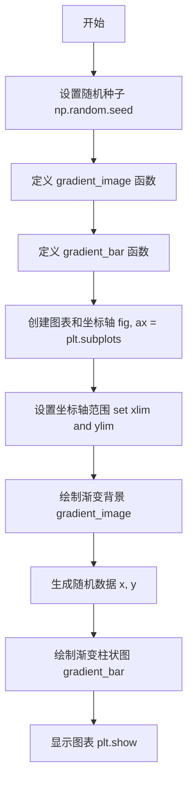

## 类结构

```
无类层次结构 (脚本文件)
├── gradient_image (全局函数)
└── gradient_bar (全局函数)
```

## 全局变量及字段


### `np`
    
NumPy库别名，提供数值计算功能

类型：`numpy module`
    


### `plt`
    
Matplotlib.pyplot库别名，用于创建可视化图表

类型：`matplotlib.pyplot module`
    


### `fig`
    
图表容器对象，表示整个图形窗口

类型：`matplotlib.figure.Figure`
    


### `ax`
    
坐标轴对象，用于绘制图形元素

类型：`matplotlib.axes.Axes`
    


### `N`
    
柱状图的数量，用于控制生成随机数据的个数

类型：`int`
    


### `x`
    
柱状图的x坐标数组，存储每个柱子的水平位置

类型：`numpy.ndarray`
    


### `y`
    
柱状图的y值数组，存储每个柱子的高度数据

类型：`numpy.ndarray`
    


    

## 全局函数及方法


### `gradient_image`

在坐标轴上绘制渐变图像的函数，通过计算梯度方向的单位向量，将颜色映射表（colormap）应用到基于角落投影值的图像上，使用双三次插值实现平滑渐变效果。

参数：

- `ax`：`matplotlib.axes.Axes`，要在其上绘制渐变的坐标轴对象
- `direction`：`float`，渐变方向，范围从 0（垂直）到 1（水平）
- `cmap_range`：`tuple[float, float]`，颜色映射表的使用范围 (cmin, cmax)，完整映射为 (0, 1)
- `**kwargs`：其他传递给 `Axes.imshow()` 的参数，如 cmap、extent 和 transform

返回值：`matplotlib.image.AxesImage`，创建的图像对象

#### 流程图

```mermaid
flowchart TD
    A[开始] --> B[将 direction 转换为弧度 phi]
    B --> C[计算梯度方向的单位向量 v = [cos(phi), sin(phi)]]
    C --> D[构建角落投影矩阵 X]
    D --> E[根据 cmap_range 归一化 X 的值]
    E --> F[调用 ax.imshow 渲染图像]
    F --> G[返回图像对象 im]
    
    D 的具体实现:
    X = [[v@[1,0], v@[1,1]],
         [v@[0,0], v@[0,1]]]
    
    E 的具体实现:
    X = a + (b-a)/X.max() * X
    其中 a, b = cmap_range
```

#### 带注释源码

```python
def gradient_image(ax, direction=0.3, cmap_range=(0, 1), **kwargs):
    """
    Draw a gradient image based on a colormap.

    Parameters
    ----------
    ax : Axes
        The Axes to draw on.
    direction : float
        The direction of the gradient. This is a number in
        range 0 (=vertical) to 1 (=horizontal).
    cmap_range : float, float
        The fraction (cmin, cmax) of the colormap that should be
        used for the gradient, where the complete colormap is (0, 1).
    **kwargs
        Other parameters are passed on to `.Axes.imshow()`.
        In particular, *cmap*, *extent*, and *transform* may be useful.
    """
    # 将方向参数转换为弧度，direction 为 0-1 时，phi 为 0 到 pi/2
    # 0 表示垂直方向（90度），1 表示水平方向（0度）
    phi = direction * np.pi / 2
    
    # 创建梯度方向的单位向量 v
    # v[0] = cos(phi) 控制水平分量
    # v[1] = sin(phi) 控制垂直分量
    v = np.array([np.cos(phi), np.sin(phi)])
    
    # 构建 2x2 角落投影矩阵 X
    # 使用向量 v 与四个角落向量 [x, y] 的点积来计算投影长度
    # 角落坐标: (1,0), (1,1), (0,0), (0,1) 对应右上、右下、左下、左上角
    X = np.array([[v @ [1, 0], v @ [1, 1]],  # 第一行: 右侧两角落的投影
                  [v @ [0, 0], v @ [0, 1]]]) # 第二行: 左侧两角落的投影
    
    # 从 cmap_range 提取最小值 a 和最大值 b
    a, b = cmap_range
    
    # 对 X 进行归一化映射，将 [0, X.max()] 范围映射到 [a, b]
    # 这样可以控制渐变使用的颜色映射范围
    X = a + (b - a) / X.max() * X
    
    # 使用 AxesImage 显示渐变
    # interpolation='bicubic': 使用双三次插值实现平滑渐变
    # clim=(0, 1): 限制颜色映射的数据范围为 0-1
    # aspect='auto': 允许图像自由缩放以适应坐标轴
    im = ax.imshow(X, interpolation='bicubic', clim=(0, 1),
                   aspect='auto', **kwargs)
    
    # 返回创建的图像对象，可用于后续操作如设置透明度等
    return im
```


### `gradient_bar`

在坐标轴上绘制渐变柱状图，通过遍历每个柱子的位置和高度信息，调用 `gradient_image` 函数为每个柱子创建渐变填充效果。

参数：

- `ax`：`matplotlib.axes.Axes`，要绘制渐变柱状图的坐标轴对象
- `x`：`numpy.ndarray`，柱子左下角的 x 坐标数组
- `y`：`numpy.ndarray`，柱子高度数组，与 x 对应
- `width`：`float`，柱子的宽度，默认为 0.5
- `bottom`：`float`，柱子的底部 y 坐标，默认为 0

返回值：`None`，该函数直接在坐标轴上绘制图像，不返回任何值

#### 流程图

```mermaid
flowchart TD
    A[开始 gradient_bar] --> B{遍历 x 和 y}
    B -->|对于每对 left, top| C[计算 right = left + width]
    C --> D[调用 gradient_image]
    D --> E[设置 extent=(left, right, bottom, top)]
    E --> F[使用 Blues_r 色彩映射]
    F --> G[设置 cmap_range=(0, 0.8)]
    G --> B
    B -->|遍历完成| H[结束]
```

#### 带注释源码

```
def gradient_bar(ax, x, y, width=0.5, bottom=0):
    """
    在坐标轴上绘制渐变柱状图。
    
    Parameters
    ----------
    ax : Axes
        要绘制渐变柱状图的坐标轴对象
    x : array-like
        柱子左下角的 x 坐标数组
    y : array-like
        柱子高度数组
    width : float, optional
        柱子的宽度，默认为 0.5
    bottom : float, optional
        柱子的底部 y 坐标，默认为 0
    """
    # 遍历每个柱子的位置和高度
    for left, top in zip(x, y):
        # 计算柱子的右边界坐标
        right = left + width
        # 调用 gradient_image 绘制渐变填充
        # extent 参数定义图像的范围：(xmin, xmax, ymin, ymax)
        # cmap="Blues_r" 使用反向的蓝色色阶
        # cmap_range=(0, 0.8) 只使用色图的 0 到 0.8 部分
        gradient_image(ax, extent=(left, right, bottom, top),
                       cmap="Blues_r", cmap_range=(0, 0.8))
```


### np.random.seed

设置随机种子，确保每次运行程序时生成的随机数序列相同，用于结果可复现。

参数：

-  `seed`：`int` 或 `None`，随机数生成器的种子。如果设置为 `None`，则每次调用时都会从系统 entropy 源获取不同的随机数序列；如果是整数，则作为随机数生成器的种子，产生可复现的随机数序列。

返回值：无（`None`），该函数直接修改 numpy 随机数生成器的内部状态。

#### 流程图

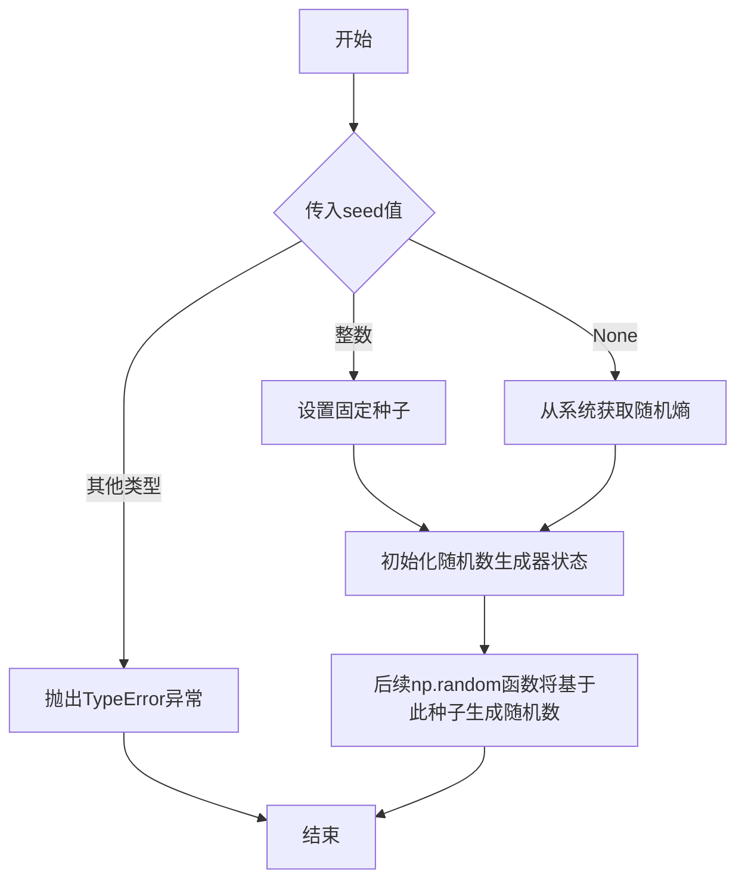

#### 带注释源码

```python
np.random.seed(19680801)
# seed: 整数类型，设置为19680801
# 作用：初始化随机数生成器的种子，确保后续生成的随机数序列可复现
# 说明：19680801是Matplotlib官方示例中常用的一个日期（1968年8月1日）
# 后续调用 np.random.rand(N) 将基于此种子生成确定性的随机数序列
```


### `np.random.rand`

该函数是 NumPy 库中的随机数生成函数，用于生成指定数量的随机浮点数，范围在 [0, 1) 区间内。在本代码中用于生成柱状图的高度数据。

参数：

-  `N`：`int`，要生成的随机数的数量，在代码中 N=10

返回值：`ndarray`，返回一个包含 N 个随机浮点数的 NumPy 数组，数值范围在 [0, 1) 之间

#### 流程图

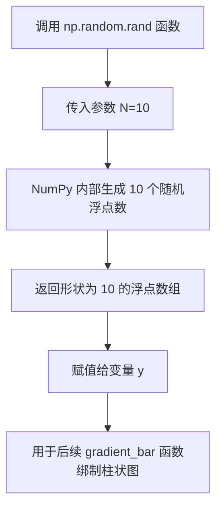

#### 带注释源码

```python
# 导入 NumPy 库（在前面的代码中已导入）
# import numpy as np

# 设置随机种子以确保结果可复现（在代码前面：np.random.seed(19680801)）

# 调用 np.random.rand 生成随机数组
N = 10  # 定义要生成的随机数数量
y = np.random.rand(N)  # 生成 10 个 [0, 1) 范围内的随机浮点数
# 返回值 y 是一个形状为 (10,) 的 NumPy 数组
# 示例返回值可能是：array([0.47, 0.87, 0.08, 0.55, 0.97, 0.77, 0.79, 0.21, 0.44, 0.02])
```


### `np.array`

在代码中用于创建表示梯度方向和梯度数值的 NumPy 数组，是实现渐变效果的核心数据构造工具。

参数：

- `obj`：列表、元组或数组，输入的数组_like对象，代码中传入的是 `[np.cos(phi), np.sin(phi)]` 用于创建方向向量，以及 `[[v @ [1, 0], v @ [1, 1]], [v @ [0, 0], v @ [0, 1]]]` 用于创建角点梯度值矩阵
- `dtype`：数据类型（可选），指定数组元素的数据类型
- `copy`：布尔值（可选），是否复制数据
- `order`：字符串（可选），内存布局 'C'(行优先)或 'F'(列优先)

返回值：`numpy.ndarray`，返回创建的 NumPy 数组对象

#### 流程图

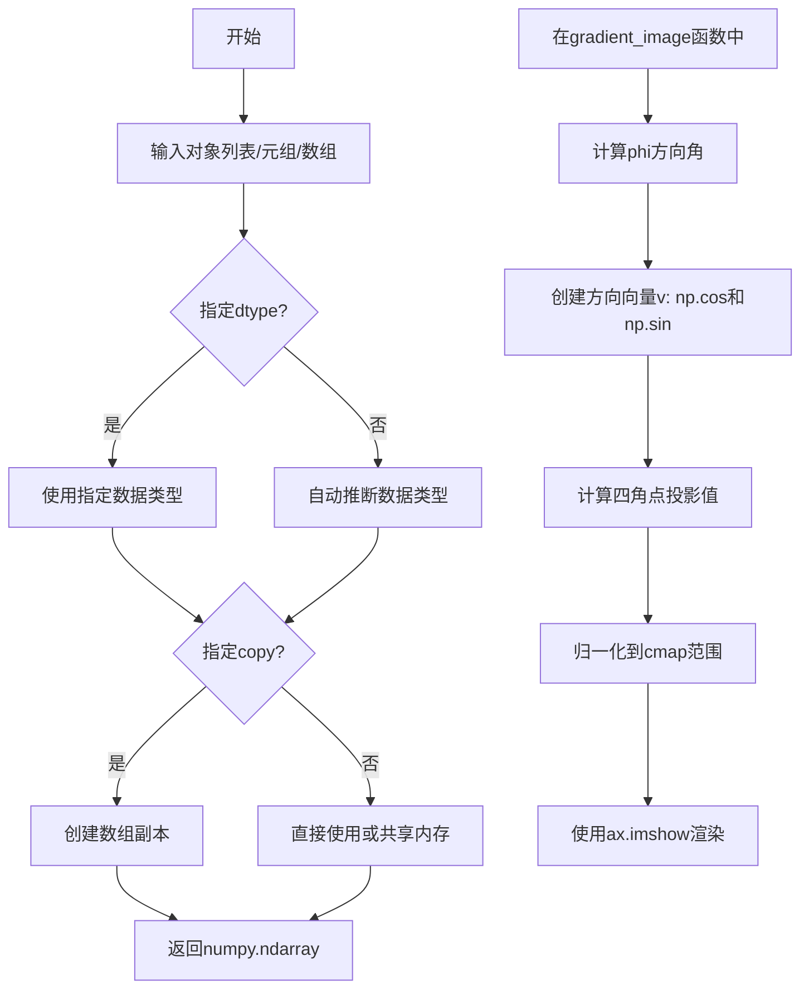

#### 带注释源码

```python
# 1. 在 gradient_image 函数中创建梯度方向向量
phi = direction * np.pi / 2  # 将方向参数转换为弧度 (0-1 -> 0-π/2)
# 使用 np.array 创建二维方向向量 v
# v[0] = cos(phi) 表示水平分量
# v[1] = sin(phi) 表示垂直分量
v = np.array([np.cos(phi), np.sin(phi)])

# 2. 创建梯度值矩阵 X，用于定义四角点的颜色值
# 使用 np.array 构造 2x2 矩阵，每个元素是方向向量 v 与角点坐标的点积
# [1,0] 右下角, [1,1] 右上角, [0,0] 左下角, [0,1] 左上角
# 通过点积 @ 计算每个角点在梯度方向上的投影长度
X = np.array([[v @ [1, 0], v @ [1, 1]],  # 第一行: 右下角和右上角投影
              [v @ [0, 0], v @ [0, 1]]]) # 第二行: 左下角和左上角投影

# 3. 将投影值映射到指定的 colormap 范围
a, b = cmap_range  # 解包 colormap 范围 (0, 1) 或 (0.2, 0.8) 等
# 归一化公式: a + (b - a) / X.max() * X
# 确保所有值都在 [a, b] 范围内，用于后续 imshow 插值生成渐变
X = a + (b - a) / X.max() * X
```


### `np.cos`

余弦函数，用于计算给定角度（弧度）的余弦值。在此代码中，`np.cos(phi)` 用于根据梯度方向计算单位向量 v 的 x 分量。

参数：

-  `phi`：`float`，输入的角度（弧度），由 `direction * np.pi / 2` 计算得出，其中 `direction` 是梯度方向参数（范围 0 到 1）

返回值：`numpy.ndarray` 或 `float`，输入角度的余弦值，用于构成梯度方向单位向量的 x 分量

#### 流程图

```mermaid
graph LR
    A[开始] --> B[输入: phi 弧度]
    B --> C[调用 np.cos 计算余弦值]
    C --> D[输出: cos(phi) 结果]
    D --> E[作为单位向量 v 的 x 分量]
    
    style A fill:#f9f,color:#000
    style D fill:#9f9,color:#000
```

#### 带注释源码

```python
# 在 gradient_image 函数中使用 np.cos
def gradient_image(ax, direction=0.3, cmap_range=(0, 1), **kwargs):
    """
    Draw a gradient image based on a colormap.
    """
    # 将方向参数转换为弧度
    # direction 范围 0 (垂直) 到 1 (水平)
    # phi 范围 0 到 π/2
    phi = direction * np.pi / 2
    
    # 计算梯度方向的单位向量 v
    # v[0] = np.cos(phi) - 单位向量的 x 分量（水平分量）
    # v[1] = np.sin(phi) - 单位向量的 y 分量（垂直分量）
    v = np.array([np.cos(phi), np.sin(phi)])
    
    # 使用单位向量 v 计算图像四个角的值
    # 通过向量投影来确定角点颜色值
    X = np.array([[v @ [1, 0], v @ [1, 1]],
                  [v @ [0, 0], v @ [0, 1]]])
    
    # 归一化 X 到指定的 colormap 范围
    a, b = cmap_range
    X = a + (b - a) / X.max() * X
    
    # 使用 bicubic 插值显示渐变图像
    im = ax.imshow(X, interpolation='bicubic', clim=(0, 1),
                   aspect='auto', **kwargs)
    return im
```


### `np.sin`

正弦函数，计算输入数组或标量中每个元素的正弦值（以弧度为单位）。

参数：

-  `x`：`ndarray` 或 `scalar`，输入角度（弧度制），可以是任何形状的数组或单个数值

返回值：`ndarray`，返回与输入形状相同的数组，包含对应输入角度的正弦值，范围在 [-1, 1] 之间

#### 流程图

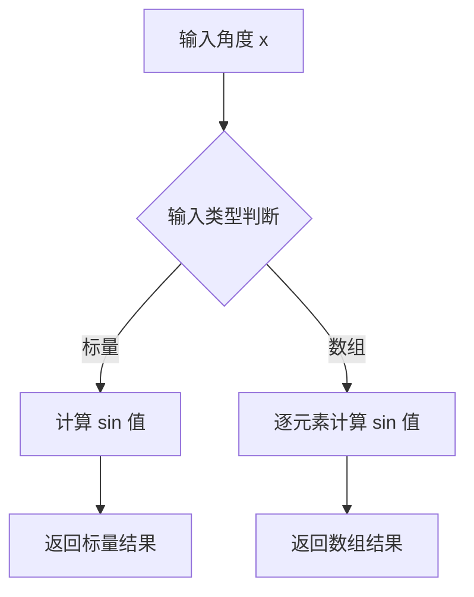

#### 带注释源码

```python
# 在本代码中，np.sin 的实际使用示例：
phi = direction * np.pi / 2  # 将方向角度转换为弧度
v = np.array([np.cos(phi), np.sin(phi)])  # 计算单位方向向量的 x 和 y 分量
# 其中 np.sin(phi) 计算 phi 弧度的正弦值
# 返回值是 -1 到 1 之间的浮点数，表示单位向量在 y 轴方向上的分量
```


### `plt.subplots`

创建图表（Figure）和坐标轴（Axes）的函数，是 matplotlib 中最常用的初始化图表的方式之一。该函数返回一个包含 figure 对象和 axes 对象（或 axes 数组）的元组，方便用户同时获取图表容器和绘图区域。

参数：

- `nrows`：`int`，默认为 1，表示子图的行数
- `ncols`：`int`，默认为 1，表示子图的列数
- `sharex`：`bool` 或 `str`，默认为 False。如果为 True，则所有子图共享 x 轴刻度；如果为 'col'，则每列子图共享 x 轴刻度
- `sharey`：`bool` 或 `str`，默认为 False。如果为 True，则所有子图共享 y 轴刻度；如果为 'row'，则每行子图共享 y 轴刻度
- `squeeze`：`bool`，默认为 True。如果为 True，则返回的 axes 对象维度会被压缩：对于单行或单列情况，返回一维数组而不是二维数组
- `width_ratios`：`array-like`，可选，定义每列的相对宽度
- `height_ratios`：`array-like`，可选，定义每行的相对高度
- `**fig_kw`：传递给 `plt.figure()` 的额外关键字参数，如 figsize、dpi 等

返回值：`tuple(Figure, Axes or array of Axes)`，返回一个大元组，第一个元素是 Figure 对象（图表容器），第二个元素是 Axes 对象（坐标轴）或 Axes 数组

#### 流程图

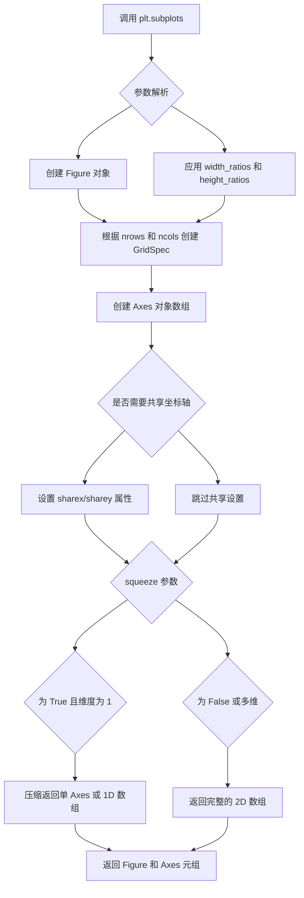

#### 带注释源码

```python
# 注意：这是 matplotlib 库内部实现的简化版本，仅用于说明原理
# 实际源码位于 lib/matplotlib/pyplot.py 和 lib/matplotlib/figure.py 中

def subplots(nrows=1, ncols=1, *, sharex=False, sharey=False, squeeze=True, 
             width_ratios=None, height_ratios=None, **fig_kw):
    """
    创建图表和坐标轴的便捷函数。
    
    Parameters
    ----------
    nrows, ncols : int
        子图的行数和列数，默认为 1
    sharex, sharey : bool or {'none', 'all', 'row', 'col'}
        是否共享坐标轴刻度
    squeeze : bool
        是否压缩返回的 Axes 数组维度
    width_ratios, height_ratios : array-like
        子图的宽高比例
    **fig_kw
        传递给 figure 的参数
    
    Returns
    -------
    fig : Figure
        图表对象
    axes : Axes or array of Axes
        坐标轴对象
    """
    # 1. 创建 Figure 对象
    fig = figure(**fig_kw)
    
    # 2. 使用 GridSpec 创建子图布局
    gs = GridSpec(nrows, ncols, width_ratios=width_ratios, 
                  height_ratios=height_ratios)
    
    # 3. 创建子图数组
    axes = np.empty((nrows, ncols), dtype=object)
    
    # 4. 遍历每个位置创建 Axes
    for i in range(nrows):
        for j in range(ncols):
            # 使用 subplot2grid 在指定位置创建子图
            ax = fig.add_subplot(gs[i, j])
            axes[i, j] = ax
    
    # 5. 处理坐标轴共享
    if sharex == True or sharex == 'all':
        for ax in axes.flat[1:]:
            ax.sharex(axes.flat[0])
    elif sharex == 'col':
        for j in range(ncols):
            for ax in axes[1:, j]:
                ax.sharex(axes[0, j])
    
    # 类似处理 sharey...
    
    # 6. 根据 squeeze 参数处理返回值
    if squeeze:
        # 压缩维度
        if nrows == 1 and ncols == 1:
            return fig, axes[0, 0]
        elif nrows == 1 or ncols == 1:
            return fig, axes.flatten()
    
    return fig, axes
```

#### 使用示例

```python
# 在给定代码中的实际使用
fig, ax = plt.subplots()
# 等价于:
# fig = plt.figure()
# ax = fig.add_subplot(111)

# 也可以创建多子图
# fig, axes = plt.subplots(2, 2)  # 创建 2x2 的子图网格
```


我仔细查看了您提供的代码，发现代码中并没有定义`ax.set`方法。代码中使用的是matplotlib库中`Axes`对象的`set`方法来进行坐标轴属性的设置（`ax.set(xlim=(0, 10), ylim=(0, 1))`）。

让我基于代码的实际内容，为您提供文档。首先是整体代码的设计文档，然后我会说明`ax.set`的情况。


# Matplotlib渐变条形图设计文档

## 一段话描述

该代码是一个matplotlib可视化示例，演示了如何通过`AxesImage`和bicubic插值技术创建具有渐变效果的条形图和坐标轴背景，实现了matplotlib原生不支持的渐变功能。

## 文件整体运行流程

1. **初始化阶段**：设置随机种子确保可重复性
2. **渐变图像生成函数定义**：定义`gradient_image()`函数用于创建渐变背景
3. **渐变条形图函数定义**：定义`gradient_bar()`函数用于绘制渐变条形
4. **图表创建**：创建figure和axes对象
5. **坐标轴设置**：使用ax.set()设置坐标轴范围
6. **背景绘制**：调用gradient_image()绘制渐变背景
7. **数据生成**：生成随机数据
8. **条形图绘制**：调用gradient_bar()绘制渐变条形
9. **显示图表**：调用plt.show()显示结果

## 类详细信息

本代码不包含自定义类，主要使用matplotlib的以下核心类：

### matplotlib.pyplot

**模块描述**：MATLAB风格的绘图接口

**全局函数**：
- `plt.subplots()`：创建图表和axes对象
- `plt.show()`：显示图表

### matplotlib.axes.Axes

**类描述**：坐标轴对象，用于绘制图形

**类方法**：
- `ax.set(**kwargs)`：设置坐标轴属性
- `ax.imshow()`：在坐标轴上显示图像

### numpy

**模块描述**：数值计算库

**全局函数**：
- `np.array()`：创建数组
- `np.random.rand()`：生成随机数
- `np.random.seed()`：设置随机种子

## 全局变量和全局函数详细信息

### gradient_image

- **名称**：gradient_image
- **类型**：函数
- **描述**：根据colormap绘制渐变图像

**参数**：
- `ax`：`Axes`对象，要绘制渐变的坐标轴
- `direction`：`float`，渐变方向，范围0（垂直）到1（水平）
- `cmap_range`：`tuple`，colormap使用范围，格式为(cmin, cmax)
- `**kwargs`：其他参数传递给Axes.imshow()

**返回值**：`matplotlib.image.AxesImage`，返回创建的图像对象

**mermaid流程图**：

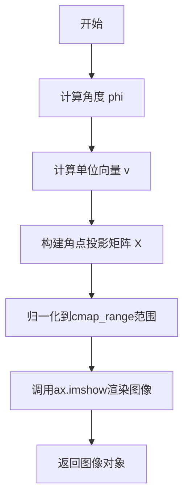

**带注释源码**：

```python
def gradient_image(ax, direction=0.3, cmap_range=(0, 1), **kwargs):
    """
    Draw a gradient image based on a colormap.

    Parameters
    ----------
    ax : Axes
        The Axes to draw on.
    direction : float
        The direction of the gradient. This is a number in
        range 0 (=vertical) to 1 (=horizontal).
    cmap_range : float, float
        The fraction (cmin, cmax) of the colormap that should be
        used for the gradient, where the complete colormap is (0, 1).
    **kwargs
        Other parameters are passed on to `.Axes.imshow()`.
        In particular, *cmap*, *extent*, and *transform* may be useful.
    """
    # 将direction转换为弧度，0-1范围映射到0-90度
    phi = direction * np.pi / 2
    # 计算渐变方向的单位向量
    v = np.array([np.cos(phi), np.sin(phi)])
    # 计算四个角点在v方向上的投影长度
    X = np.array([[v @ [1, 0], v @ [1, 1]],
                  [v @ [0, 0], v @ [0, 1]]])
    # 获取cmap范围
    a, b = cmap_range
    # 将投影值归一化到cmap范围
    X = a + (b - a) / X.max() * X
    # 使用bicubic插值渲染图像
    im = ax.imshow(X, interpolation='bicubic', clim=(0, 1),
                   aspect='auto', **kwargs)
    return im
```

### gradient_bar

- **名称**：gradient_bar
- **类型**：函数
- **描述**：绘制单个渐变条形图

**参数**：
- `ax`：`Axes`对象，要绘制条形的坐标轴
- `x`：`array`，条形的左边界位置数组
- `y`：`array`，条形的高度数组
- `width`：`float`，条形宽度，默认0.5
- `bottom`：`float`，条形底部位置，默认0

**返回值**：`None`

**mermaid流程图**：

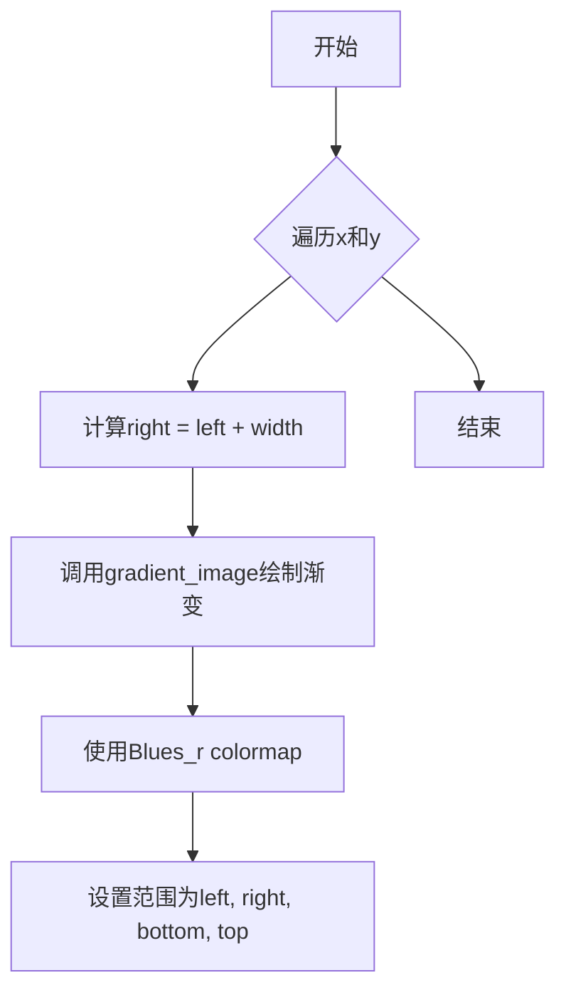

**带注释源码**：

```python
def gradient_bar(ax, x, y, width=0.5, bottom=0):
    """绘制渐变条形图"""
    # 遍历每个条形的左边界和高度
    for left, top in zip(x, y):
        # 计算右边界
        right = left + width
        # 调用gradient_image绘制渐变矩形
        # extent定义图像在数据坐标中的范围
        # cmap="Blues_r"使用反转的蓝色colormap
        # cmap_range=(0, 0.8)限制颜色范围
        gradient_image(ax, extent=(left, right, bottom, top),
                       cmap="Blues_r", cmap_range=(0, 0.8))
```

## 关键组件信息

| 名称 | 描述 |
|------|------|
| gradient_image | 根据colormap生成渐变图像的核心函数 |
| gradient_bar | 封装gradient_image绘制条形图的便捷函数 |
| AxesImage | matplotlib图像对象，用于显示渐变 |
| bicubic插值 | 用于平滑渐变效果的插值方法 |

## 潜在技术债务和优化空间

1. **函数参数封装**：gradient_image和gradient_bar可以合并为一个更通用的类
2. **性能优化**：对于大量条形，当前实现逐个绘制，可以考虑批量渲染
3. **渐变算法**：当前使用简单的线性投影，可以考虑使用更复杂的非线性渐变
4. **硬编码值**：colormap和cmap_range可以提取为配置参数

## 其他项目

### 设计目标与约束
- **目标**：实现matplotlib原生不支持的渐变效果
- **约束**：必须使用现有matplotlib API，不能修改库本身

### 错误处理
- 代码未包含显式错误处理
- 假设输入的x, y数组长度一致
- 假设direction在0-1范围内

### 外部依赖
- matplotlib >= 3.0
- numpy

---

## 关于 ax.set 方法的说明

### ax.set

代码中使用的`ax.set(xlim=(0, 10), ylim=(0, 1))`调用的是matplotlib库中`Axes`类的方法，不是本代码文件中定义的。

**参数**：
- `xlim`：`tuple`，x轴范围(最小值, 最大值)
- `ylim`：`tuple`，y轴范围(最小值, 最大值)
- `**kwargs`：其他Axes属性

**返回值**：`Artist`，返回调用它的Artist对象（这里是Axes）

**mermaid流程图**：

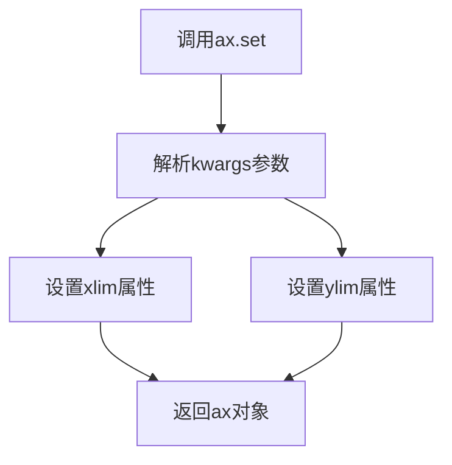

**带注释源码**：

```python
# 这是matplotlib库中的方法调用示例
# 设置x轴范围为0到10
# 设置y轴范围为0到1
ax.set(xlim=(0, 10), ylim=(0, 1))
```

**方法来源**：此方法定义在matplotlib的lib/matplotlib/axes/_base.py中的Axes类中，是matplotlib的核心API，用于批量设置Axes对象的各种属性。


### `ax.imshow`

在 `gradient_image` 函数中调用，用于在坐标轴上显示图像数据，支持插值、颜色映射和坐标变换等功能。

参数：

- `X`：`numpy.ndarray`，图像数据数组，此处为由梯度方向向量投影计算得到的 2x2 数组
- `interpolation`：`str`，插值方法，此处传入 `'bicubic'` 使用双三次插值
- `clim`：`tuple`，颜色范围限制 (vmin, vmax)，此处传入 `(0, 1)`
- `aspect`：`str`，长宽比控制，此处传入 `'auto'` 允许自动调整
- `**kwargs`：其他关键字参数，此处传递 `extent`、`cmap`、`transform` 等用于定义颜色映射和坐标变换

返回值：`matplotlib.image.AxesImage`，返回创建的 AxesImage 对象，可用于进一步操作（如设置透明度 alpha）

#### 流程图

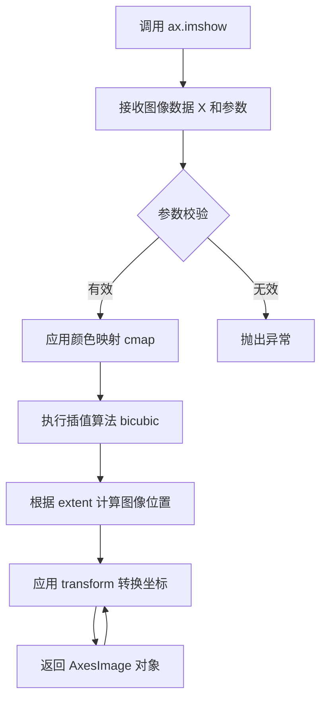

#### 带注释源码

```python
# 在 gradient_image 函数中的调用
im = ax.imshow(X,               # 图像数据：2x2 数组，包含角点投影值
               interpolation='bicubic',  # 使用双三次插值平滑图像
               clim=(0, 1),    # 颜色范围限制为 0 到 1
               aspect='auto',  # 自动调整长宽比
               **kwargs)       # 传递额外参数如 cmap, extent, transform 等

# imshow 核心逻辑（matplotlib 内部实现简化）
def imshow(self, X, cmap=None, norm=None, aspect=None, 
           interpolation=None, alpha=None, vmin=None, vmax=None,
           origin=None, extent=None, transform=None, **kwargs):
    """
    在 Axes 上显示图像数据。
    
    处理流程：
    1. 将输入数据 X 转换为图像数组
    2. 应用颜色映射 (colormap) 将数值映射为颜色
    3. 根据插值方法重采样图像
    4. 根据 extent 和 transform 计算图像在数据坐标系中的位置
    5. 返回 AxesImage 对象用于后续操作
    """
    # ... [matplotlib 内部实现]
    return image.AxesImage(self, xmin, ymin, xmax, ymax, ...)
```


### `plt.show`

`plt.show` 是 matplotlib.pyplot 模块的核心函数，用于显示所有当前已创建但尚未显示的图形窗口，并将图形渲染到屏幕供用户查看。

参数：

- `block`：布尔值（可选），默认为 True。控制是否阻塞程序执行直到窗口关闭。若设为 False，则在非阻塞模式下显示图形（适用于 Jupyter Notebook 等交互环境）。

返回值：无返回值（返回 None）。

#### 流程图

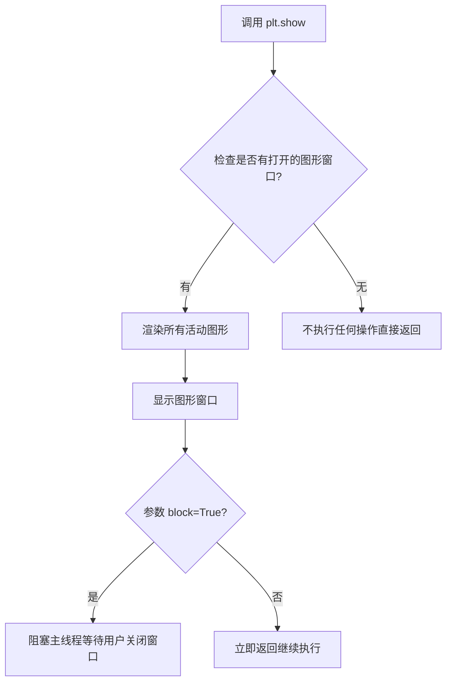

#### 带注释源码

```python
def show(block=None):
    """
    显示所有打开的图形窗口。
    
    对于交互式显示，图形将在后台更新，并且此函数
    很可能不会返回直到用户关闭所有窗口（除非 
    block=False）。
    
    在某些后端（如 TkAgg），show() 会启动一个阻塞的
    事件循环。即使没有图形显示，调用 show() 也会
    启动适当的事件循环。
    
    Parameters
    ----------
    block : bool, optional
        是否阻塞调用直到窗口关闭。默认值为 True。
        如果设置为 False，函数会立即返回（特别有用于
        Jupyter Notebook 等交互环境）。
        
    Returns
    -------
    None
    
    See Also
    --------
    ion : 开启交互模式
    ioff : 关闭交互模式
    FigureManagerBase : 图形管理器的基类
    """
    # 导入必要的模块
    import matplotlib._pylab_helpers as pylab_helpers
    import matplotlib.pyplot as _plt
    
    # 获取所有活动图形管理器的引用
    # Gcf 是一个字典，键为图形编号，值为对应的图形管理器
    allnums = pylab_helpers.Gcf.figs
    
    # 如果没有任何图形，则不执行操作
    if not allnums:
        return
    
    # 遍历所有活动的图形管理器并显示它们
    for manager in allnums.values():
        # canvas 是绘图区域，draw_idle() 方法会触发重绘
        manager.canvas.draw_idle()
        
        # show_percent 用于显示进度（如果有）
        if hasattr(manager, 'show_percent'):
            manager.show_percent()
    
    # 如果 block 参数为 True 或未设置（默认为 True）
    if block:
        # 导入当前平台相关的显示管理器
        # _get_running_interactive_framework() 返回当前运行的交互框架
        import matplotlib.backends
        from matplotlib._pylab_helpers import _get_running_interactive_framework
        
        # 获取当前交互框架
        framework = _get_running_interactive_framework()
        
        # 根据不同的框架调用不同的阻塞方法
        # 例如：Tk、Qt、GTK 等
        if framework == 'TkAgg':
            # Tkinter 后端使用 mainloop 阻塞
            import tkinter as tk
            tk.mainloop()
        elif framework in ['Qt5Agg', 'PyQt5Agg', 'PySide2Agg']:
            # Qt 后端使用 QApplication.exec_() 阻塞
            from matplotlib.backends.qt_compat import QtWidgets
            QtWidgets.QApplication.instance().exec_()
        elif framework in ['Qt4Agg', 'PyQt4Agg']:
            # Qt4 后端
            from matplotlib.backends.qt4_compat import QtGui
            QtGui.QApplication.instance().exec_()
        elif framework == 'GTK3Agg':
            # GTK3 后端使用 gtk.main_iteration 阻塞
            import gtk
            gtk.main_iteration()
        elif framework == 'WXAgg':
            # wxPython 后端使用 MainLoop 阻塞
            import wx
            wx.GetApp().MainLoop()
        # ... 其他后端类似处理
        else:
            # 对于不支持的后端，可能直接返回或打印警告
            pass
    else:
        # 非阻塞模式，立即返回
        pass
    
    return None
```

**简化版本（实际源码更简洁）：**

```python
# 实际的 plt.show() 实现位于 lib/matplotlib/pyplot.py 中
# 大致逻辑如下：

def show(*, block=None):
    """
    显示所有打开的图形。
    
    Parameters
    ----------
    block : bool, optional
        是否阻塞。默认为 True。
    """
    # 导入图形管理器和后端
    import matplotlib._pylab_helpers as _pylab_helpers
    import matplotlib.backends.backend_agg as backend_agg
    
    # 获取所有活动的图形
    figs = _pylab_helpers.Gcf.figs
    
    if not figs:
        # 没有图形时直接返回
        return
    
    # 对每个图形调用 show 方法
    for manager in figs.values():
        # 触发重绘
        manager.canvas.draw_idle()
        
        # 显示图形（调用底层后端的 show 方法）
        manager.show()
    
    # 如果 block=True，则阻塞等待
    # 这通常涉及启动相应 GUI 框架的事件循环
    if block is None:
        # 默认行为：根据 rcParams['interactive'] 决定
        block = matplotlib.rcParams['interactive']
    
    if block:
        # 启动主事件循环阻塞
        # 具体实现依赖于后端
        _pylab_helpers.Gcf.blocking_show()
    
    return None
```


## 关键组件


### gradient_image 函数

用于在Axes上绘制渐变图像的核心函数，通过colormap和bicubic插值实现渐变效果。

### gradient_bar 函数

用于在柱状图上逐个应用渐变效果的函数，遍历每个柱子并调用gradient_image。

### 渐变方向计算逻辑

通过direction参数计算单位向量v，使用点积投影确定四个角落的值。

### 背景渐变

使用Axes坐标系的transform实现在Axes背景上添加半透明渐变。

### 色彩映射与插值

使用bicubic插值和clim控制实现平滑的渐变色彩过渡。


## 问题及建议


### 已知问题

- **函数参数缺乏验证**：gradient_image函数的direction参数没有范围检查，应该限制在0到1之间，但实际可以接受任意浮点数
- **gradient_bar函数不返回图像对象**：函数内部创建的渐变图像没有返回给调用者，导致调用者无法进一步操作（如获取图像对象、修改透明度等）
- **gradient_bar函数缺乏灵活性**：cmap和cmap_range参数被硬编码，用户无法自定义条形图的渐变颜色和范围
- **全局状态管理不当**：np.random.seed(19680801)放置在模块顶层，作为全局代码会影响整个应用程序的随机数状态，应该在需要的地方局部设置或使用np.random.default_rng()
- **插值方法选择不当**：对于简单的线性渐变，使用'bicubic'插值是过度杀鸡用牛刀，会带来不必要的计算开销，'bilinear'插值对于线性渐变已经足够
- **缺乏输入验证**：x和y数组的长度没有一致性检查，当x和y长度不匹配时会产生难以理解的错误
- **魔法数值**：0.8、0.5、0.2等数值作为魔法数字散落在代码中，缺乏解释
- **函数文档不完整**：gradient_bar函数缺少docstring，用户无法了解其参数含义

### 优化建议

- **增加参数验证**：在gradient_image函数开头添加direction参数的范围检查（0 <= direction <= 1），并对gradient_bar的x和y长度一致性进行验证
- **让gradient_bar返回图像对象列表**：修改函数以返回创建的图像对象列表，便于后续操作
- **增加gradient_bar的可配置性**：添加cmap和cmap_range参数，允许用户自定义颜色映射和范围
- **使用局部随机数生成器**：将np.random.seed()替换为rng = np.random.default_rng()并使用rng.random(N)，避免污染全局随机状态
- **考虑更轻量的插值方法**：对于纯线性渐变场景，可以考虑使用'bilinear'插值或自定义着色器以提高性能
- **提取魔法数字为常量**：将可配置的数值（如0.8、0.5、0.2等）定义为模块级常量或函数默认参数，并添加说明注释
- **完善gradient_bar的文档**：添加详细的docstring说明参数、返回值和示例
- **考虑使用Type Hints**：为函数添加类型提示，提高代码可读性和可维护性


## 其它


### 设计目标与约束

本代码的设计目标是演示如何在matplotlib中创建带有渐变效果的柱状图和背景，实现非原生支持的渐变填充功能。约束条件包括：依赖matplotlib的AxesImage和bicubic插值实现渐变效果，渐变方向由单位向量控制，颜色映射范围可自定义调整。

### 错误处理与异常设计

代码主要通过matplotlib和numpy的异常机制处理错误。参数验证方面：`direction`参数应在0-1范围内，否则渐变方向计算结果可能不符合预期；`cmap_range`参数需要确保(a, b)有效且a<b；`x`和`y`数组长度需一致。当数组长度不匹配时，zip函数会截断到较短数组的长度，可能导致数据丢失而非抛出明确异常。插值方式固定为'bicubic'，不支持自定义。

### 数据流与状态机

数据流分为两条路径：背景渐变流和柱状图渐变流。背景渐变流：输入direction、cmap_range → 计算单位向量v → 计算角点投影值X → 归一化处理 → AxesImage渲染。柱状图渐变流：输入x、y坐标数组 → 遍历每个(left, top)对 → 调用gradient_image绘制独立渐变矩形。状态机表现为从空Axes → 绘制背景 → 绘制柱状图 → 显示的顺序流程。

### 外部依赖与接口契约

核心依赖库：matplotlib>=3.0（提供axes.imshow和colormap支持）、numpy>=1.15（提供数组操作和数学计算）。gradient_image函数接口：接收ax（Axes对象）、direction（float）、cmap_range（tuple）、**kwargs；返回AxesImage对象。gradient_bar函数接口：接收ax、x（array）、y（array）、width（float）、bottom（float）；无返回值。外部契约：调用plt.show()时依赖图形后端（如Qt5Agg、Agg）进行渲染。

### 性能考虑与优化空间

性能瓶颈：gradient_bar中逐个绘制柱状图，循环调用gradient_image和ax.imshow，效率较低。优化方向：对于大量柱状图，可预先计算所有柱状图的渐变值并合并为单一AxesImage；背景渐变可在axes创建时一次性设置而非重复渲染。内存方面：临时数组X的创建和销毁未优化，可考虑复用数组缓冲区。

### 安全性考虑

代码本身为演示脚本，安全性风险较低。潜在风险点：`np.random.seed(19680801)`使用固定种子确保可复现性，但在生产环境中可能需要动态种子。kwargs参数直接透传给imshow，需确保调用者可信，避免注入恶意参数。图形输出无敏感信息泄露风险。

### 可测试性设计

测试策略建议：单元测试层面可验证gradient_image返回AxesImage对象、角点计算逻辑正确性、cmap_range归一化行为；集成测试层面验证在真实Figure上渲染、与其他图表元素共存时的表现。测试数据建议使用已知梯度方向的特殊值（如direction=0.5对应45度）验证投影计算准确性。

### 兼容性考虑

matplotlib版本兼容性：代码使用imshow的clim参数，在较新版本中可能推荐使用set_clim；aspect='auto'参数在所有版本中稳定支持。numpy兼容性：使用np.array和基本数学函数，兼容numpy 1.15+所有版本。图形后端兼容性：代码仅使用agg后端支持的API，无需特定图形库，跨平台兼容。Python版本：依赖Python 3.6+的f-string和类型注解语法支持。

### 关键算法说明

梯度计算基于投影原理：给定方向单位向量v=(cos(φ), sin(φ))，角点(0,0)、(1,0)、(0,1)、(1,1)在v方向的投影长度即为梯度值。数学公式：X[i,j] = v · [i, j]，其中i,j∈{0,1}。归一化处理将投影值映射到cmap_range范围，确保渐变覆盖完整colormap区间。


    