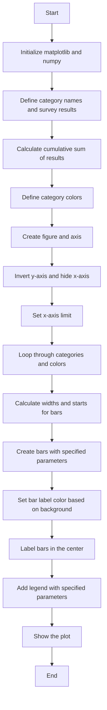
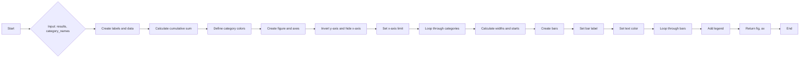
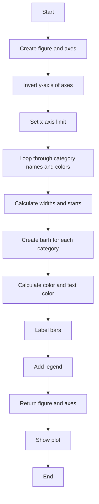
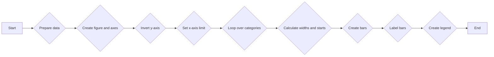

# `matplotlib\galleries\examples\lines_bars_and_markers\horizontal_barchart_distribution.py` 详细设计文档

This code generates a horizontal bar chart to visualize the results of a survey where participants rate their agreement to questions on a five-element scale.

## 整体流程



## 类结构

```
SurveyPlot (主类)
├── matplotlib.pyplot (全局模块)
├── numpy (全局模块)
└── category_names (全局变量)
```

## 全局变量及字段


### `category_names`
    
The list of category labels for the survey questions.

类型：`list of str`
    


### `results`
    
A dictionary mapping question labels to lists of answers per category.

类型：`dict`
    


### `data`
    
A 2D numpy array containing the survey results.

类型：`numpy.ndarray`
    


### `data_cum`
    
A 2D numpy array containing the cumulative sums of the survey results.

类型：`numpy.ndarray`
    


### `category_colors`
    
A colormap for the categories.

类型：`matplotlib colormaps`
    


### `fig`
    
The matplotlib figure object.

类型：`matplotlib.figure.Figure`
    


### `ax`
    
The matplotlib axes object for plotting.

类型：`matplotlib.axes._subplots.AxesSubplot`
    


### `rects`
    
The list of rectangles representing the bars in the plot.

类型：`list of matplotlib.patches.Rectangle`
    


### `text_color`
    
The color of the text labels on the bars in the plot.

类型：`str`
    


### `SurveyPlot.results`
    
The survey results stored as a dictionary.

类型：`dict`
    


### `SurveyPlot.category_names`
    
The category names for the survey questions stored as a list of strings.

类型：`list of str`
    


### `SurveyPlot.results`
    
The survey results stored as a dictionary.

类型：`dict`
    


### `SurveyPlot.category_names`
    
The category names for the survey questions stored as a list of strings.

类型：`list of str`
    
    

## 全局函数及方法


### survey

This function generates a horizontal bar chart to visualize the results of a survey where people rate their agreement to questions on a five-element scale.

参数：

- `results`：`dict`，A mapping from question labels to a list of answers per category. It is assumed all lists contain the same number of entries and that it matches the length of `category_names`.
- `category_names`：`list of str`，The category labels.

返回值：`fig, ax`：`tuple`，A tuple containing the `Figure` and `Axes` objects used to create the plot.

#### 流程图



#### 带注释源码

```python
def survey(results, category_names):
    """
    Parameters
    ----------
    results : dict
        A mapping from question labels to a list of answers per category.
        It is assumed all lists contain the same number of entries and that
        it matches the length of *category_names*.
    category_names : list of str
        The category labels.
    """
    labels = list(results.keys())
    data = np.array(list(results.values()))
    data_cum = data.cumsum(axis=1)
    category_colors = plt.colormaps['RdYlGn'](
        np.linspace(0.15, 0.85, data.shape[1]))

    fig, ax = plt.subplots(figsize=(9.2, 5))
    ax.invert_yaxis()
    ax.xaxis.set_visible(False)
    ax.set_xlim(0, np.sum(data, axis=1).max())

    for i, (colname, color) in enumerate(zip(category_names, category_colors)):
        widths = data[:, i]
        starts = data_cum[:, i] - widths
        rects = ax.barh(labels, widths, left=starts, height=0.5,
                        label=colname, color=color)

        r, g, b, _ = color
        text_color = 'white' if r * g * b < 0.5 else 'darkgrey'
        ax.bar_label(rects, label_type='center', color=text_color)
    ax.legend(ncols=len(category_names), bbox_to_anchor=(0, 1),
              loc='lower left', fontsize='small')

    return fig, ax
```


### SurveyPlot.__init__

初始化SurveyPlot对象，用于创建调查结果的条形图。

参数：

- `results`：`dict`，包含问题标签到每个类别答案列表的映射。
- `category_names`：`list of str`，类别标签列表。

返回值：无

#### 流程图



#### 带注释源码

```python
def survey(results, category_names):
    """
    Parameters
    ----------
    results : dict
        A mapping from question labels to a list of answers per category.
        It is assumed all lists contain the same number of entries and that
        it matches the length of *category_names*.
    category_names : list of str
        The category labels.
    """
    labels = list(results.keys())
    data = np.array(list(results.values()))
    data_cum = data.cumsum(axis=1)
    category_colors = plt.colormaps['RdYlGn'](
        np.linspace(0.15, 0.85, data.shape[1]))

    fig, ax = plt.subplots(figsize=(9.2, 5))
    ax.invert_yaxis()
    ax.xaxis.set_visible(False)
    ax.set_xlim(0, np.sum(data, axis=1).max())

    for i, (colname, color) in enumerate(zip(category_names, category_colors)):
        widths = data[:, i]
        starts = data_cum[:, i] - widths
        rects = ax.barh(labels, widths, left=starts, height=0.5,
                        label=colname, color=color)

        r, g, b, _ = color
        text_color = 'white' if r * g * b < 0.5 else 'darkgrey'
        ax.bar_label(rects, label_type='center', color=text_color)
    ax.legend(ncols=len(category_names), bbox_to_anchor=(0, 1),
              loc='lower left', fontsize='small')

    return fig, ax
```


### survey

This function generates a horizontal bar chart to visualize the results of a survey where people rate their agreement to questions on a five-element scale.

参数：

- `results`：`dict`，A mapping from question labels to a list of answers per category. It is assumed all lists contain the same number of entries and that it matches the length of `category_names`.
- `category_names`：`list of str`，The category labels.

返回值：`fig, ax`：`tuple`，A tuple containing the `Figure` and `Axes` objects used to create the plot.

#### 流程图



#### 带注释源码

```python
def survey(results, category_names):
    """
    Parameters
    ----------
    results : dict
        A mapping from question labels to a list of answers per category.
        It is assumed all lists contain the same number of entries and that
        it matches the length of *category_names*.
    category_names : list of str
        The category labels.
    """
    labels = list(results.keys())
    data = np.array(list(results.values()))
    data_cum = data.cumsum(axis=1)
    category_colors = plt.colormaps['RdYlGn'](
        np.linspace(0.15, 0.85, data.shape[1]))

    fig, ax = plt.subplots(figsize=(9.2, 5))
    ax.invert_yaxis()
    ax.xaxis.set_visible(False)
    ax.set_xlim(0, np.sum(data, axis=1).max())

    for i, (colname, color) in enumerate(zip(category_names, category_colors)):
        widths = data[:, i]
        starts = data_cum[:, i] - widths
        rects = ax.barh(labels, widths, left=starts, height=0.5,
                        label=colname, color=color)

        r, g, b, _ = color
        text_color = 'white' if r * g * b < 0.5 else 'darkgrey'
        ax.bar_label(rects, label_type='center', color=text_color)
    ax.legend(ncols=len(category_names), bbox_to_anchor=(0, 1),
              loc='lower left', fontsize='small')

    return fig, ax
```


## 关键组件


### 张量索引与惰性加载

张量索引与惰性加载是指在处理数据时，只对需要的数据进行索引和加载，而不是一次性加载整个数据集。这种技术可以减少内存消耗，提高数据处理效率。

### 反量化支持

反量化支持是指在模型训练过程中，对量化后的模型进行反量化处理，以便进行后续的推理或评估。这有助于在量化模型和原始模型之间进行转换。

### 量化策略

量化策略是指在模型训练过程中，对模型中的权重和激活进行量化处理，以减少模型的大小和提高推理速度。常见的量化策略包括全精度量化、定点量化等。


## 问题及建议


### 已知问题

-   {问题1: 代码中使用了硬编码的色图（colormap）'RdYlGn'，这可能会限制图表的可视化效果，特别是在不同的文化或个人偏好中。建议使用更灵活的色图选择机制，允许用户自定义色图或从预定义的色图中选择。}
-   {问题2: 代码没有提供任何错误处理机制，如果输入数据不符合预期（例如，结果字典中的列表长度不匹配），程序可能会崩溃。建议添加输入验证和错误处理逻辑，以确保程序的健壮性。}
-   {问题3: 代码没有提供任何文档字符串来描述每个参数和返回值，这会使得代码难以理解和维护。建议为每个函数和参数添加详细的文档字符串。}
-   {问题4: 代码没有提供任何注释来解释代码的某些部分，这可能会使得代码难以理解。建议添加必要的注释来解释代码的逻辑和目的。}

### 优化建议

-   {建议1: 为了提高代码的可重用性，可以将 `survey` 函数封装在一个类中，这样就可以更容易地扩展和修改功能。}
-   {建议2: 可以考虑添加一个功能，允许用户自定义图表的布局，例如图表的大小、标签的位置和颜色等。}
-   {建议3: 可以使用更高级的绘图库，如 Seaborn，它提供了更丰富的图表选项和更好的默认样式。}
-   {建议4: 可以考虑将代码转换为 Jupyter Notebook 格式，以便于交互式展示和分享。}


## 其它


### 设计目标与约束

- 设计目标：实现一个能够可视化调查结果的离散分布的堆叠条形图。
- 约束条件：使用matplotlib库进行绘图，数据源为字典格式，包含问题和对应的答案列表。

### 错误处理与异常设计

- 错误处理：确保输入数据格式正确，如字典和列表类型，以及列表长度匹配。
- 异常设计：捕获并处理可能出现的异常，如matplotlib绘图库未安装或数据格式错误。

### 数据流与状态机

- 数据流：从输入字典中提取问题和答案，计算累积和，生成条形图。
- 状态机：无状态机，流程线性，从数据准备到绘图完成。

### 外部依赖与接口契约

- 外部依赖：matplotlib库用于绘图。
- 接口契约：函数`survey`接受字典和列表作为输入，返回绘图对象。

### 测试与验证

- 测试策略：编写单元测试验证函数输入输出，确保绘图正确性。
- 验证方法：手动检查生成的条形图是否符合预期。

### 性能考量

- 性能考量：确保绘图过程高效，避免不必要的计算和内存占用。

### 安全性考量

- 安全性考量：确保输入数据的安全性，防止注入攻击。

### 可维护性与可扩展性

- 可维护性：代码结构清晰，易于理解和修改。
- 可扩展性：易于添加新的问题和答案，以及调整图表样式。

### 文档与注释

- 文档：提供详细的设计文档和代码注释，便于其他开发者理解和使用。
- 注释：在代码中添加必要的注释，解释关键步骤和算法。

### 用户界面与交互

- 用户界面：无用户界面，通过命令行运行。
- 交互：用户通过命令行参数或配置文件提供输入数据。

### 部署与部署策略

- 部署：将代码打包成可执行文件或库，部署到目标环境。
- 部署策略：使用虚拟环境管理依赖，确保环境一致性。

### 维护与支持

- 维护：定期更新代码，修复已知问题。
- 支持：提供技术支持，解答用户疑问。


    