# `matplotlib\galleries\examples\lines_bars_and_markers\line_demo_dash_control.py` 详细设计文档

该代码是一个matplotlib示例脚本，演示了如何在图表中设置线条的虚线样式（dashed line style），通过三种不同的方式展示了set_dashes()、dashes参数和gapcolor参数的使用，创建了一个正弦波可视化图表。

## 整体流程

```mermaid
graph TD
    A[开始] --> B[导入matplotlib.pyplot和numpy]
B --> C[生成数据点x和y]
C --> D[设置线条宽度rc参数]
D --> E[创建图形和坐标轴]
E --> F[绘制line1: 使用set_dashes()和set_dash_capstyle()]
F --> G[绘制line2: 使用dashes参数]
G --> H[绘制line3: 使用dashes和gapcolor参数]
H --> I[添加图例]
I --> J[显示图表plt.show()]
```

## 类结构

```
脚本文件 (无自定义类)
├── matplotlib.pyplot (plt)
├── numpy (np)
└── matplotlib对象
    ├── Figure (fig)
    ├── Axes (ax)
    └── Line2D (line1, line2, line3)
```

## 全局变量及字段


### `x`
    
从0到10的500个等间距点

类型：`numpy.ndarray`
    


### `y`
    
sin(x)的值

类型：`numpy.ndarray`
    


### `fig`
    
图形对象

类型：`matplotlib.figure.Figure`
    


### `ax`
    
坐标轴对象

类型：`matplotlib.axes.Axes`
    


### `line1`
    
第一条线条对象

类型：`matplotlib.lines.Line2D`
    


### `line2`
    
第二条线条对象

类型：`matplotlib.lines.Line2D`
    


### `line3`
    
第三条线条对象

类型：`matplotlib.lines.Line2D`
    


    

## 全局函数及方法


### `plt.rc`

设置matplotlib的全局参数（rcParams），用于配置线条宽度、颜色、字体等绘图样式。

参数：

- `group`：`str`，参数组名称（如'lines'、'axes'、'font'等），指定要修改的参数类别
- `**kwargs`：`任意关键字参数`，具体要设置的参数名和值，如`linewidth=2.5`

返回值：`None`，无返回值（该函数直接修改全局rcParams字典）

#### 流程图

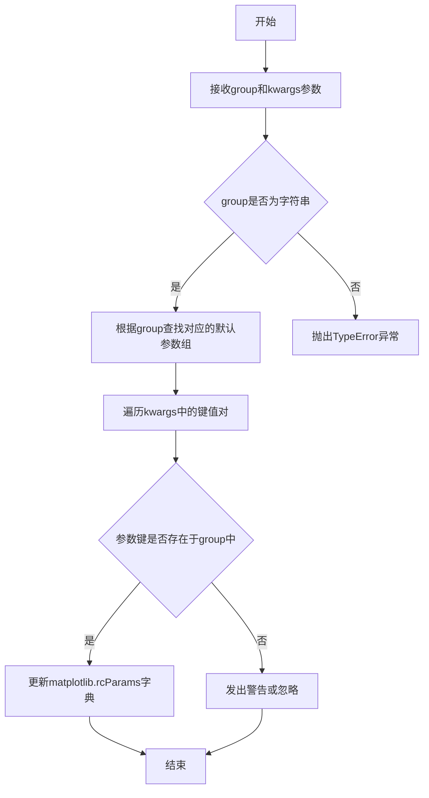

#### 带注释源码

```python
# 代码中调用示例
plt.rc('lines', linewidth=2.5)

# 解释：
# 'lines' - 参数组名称，表示线条相关的全局参数
# linewidth=2.5 - 关键字参数，将全局线条宽度设置为2.5

# 底层实现逻辑（简化自matplotlib源码）：
def rc(group, **kwargs):
    """
    设置matplotlib的全局rcParams参数。
    
    参数:
        group: str, 参数组名称（如'lines', 'axes', 'font'等）
        **kwargs: 关键字参数，要设置的具体参数
    
    返回:
        None
    """
    # 获取全局rcParams字典
    rcParams = matplotlib.rcParams
    
    # 根据group获取对应的参数字典
    if group not in _hardcoded_defaults:
        # 如果group不存在，尝试从默认配置中获取
        pass
    
    # 遍历传入的关键字参数
    for key, value in kwargs.items():
        # 验证参数是否在group中
        if key in valid_params_for_group[group]:
            # 更新全局rcParams
            rcParams[key] = value
        else:
            # 参数无效，发出警告
            warnings.warn(f"Unknown {key} for group {group}")
    
    # 直接修改全局字典，无返回值
    return None
```


### `plt.subplots`

创建图形（Figure）和坐标轴（Axes）的函数，用于准备绘图环境。

参数：

- `nrows`：`int`，默认为1，子图的行数
- `ncols`：`int`，默认为1，子图的列数
- `sharex`：`bool or str`，默认为False，是否共享x轴
- `sharey`：`bool or str`，默认为False，是否共享y轴
- `squeeze`：`bool`，默认为True，是否压缩返回的坐标轴数组维度
- `width_ratios`：`array-like`，可选，各列的宽度比例
- `height_ratios`：`array-like`，可选，各行的宽度比例
- `subplot_kw`：`dict`，可选，传递给add_subplot的关键字参数
- `gridspec_kw`：`dict`，可选，传递给GridSpec的关键字参数
- `**fig_kw`：可选，传递给figure()函数的其他关键字参数

返回值：`tuple`，返回(Figure, Axes)或(Figure, ndarray of Axes)，图形对象和坐标轴对象

#### 流程图

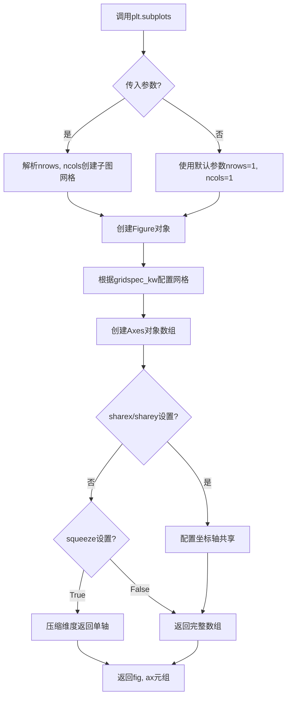

#### 带注释源码

```python
# 创建包含一个子图的图形和坐标轴
# 返回值：fig - Figure对象（整个图形窗口）
#         ax - Axes对象（坐标轴，用于绘制数据）
fig, ax = plt.subplots()

# 等效于以下两步操作：
# fig = plt.figure()  # 创建图形
# ax = fig.add_subplot(111)  # 添加子图

# 在此示例中：
# - fig 是图形对象，代表整个窗口
# - ax 是坐标轴对象，用于绘制线条、数据等
# 后续通过 ax.plot() 添加数据到坐标轴
```


### `Axes.plot`

在 matplotlib 中，`Axes.plot()` 是用于在坐标轴上绘制线条的核心方法。该函数接受可变数量的位置参数（x 和 y 数据）和关键字参数（用于自定义线条属性如颜色、线型、标签等），返回一个包含 Line2D 对象的列表。

参数：

- `*args`：`tuple`，可变参数，通常第一个参数为 y 数据，第二个参数（可选）为 x 数据。如果只提供一个数组，则将其视为 y 值，x 将自动生成。还可以包含格式字符串（如 `'ro'` 表示红色圆形标记）。
- `**kwargs`：`dict`，关键字参数，用于设置 Line2D 的各种属性。常用参数包括：
  - `color`：`str` 或 `tuple`，线条颜色
  - `linewidth`：`float`，线条宽度
  - `linestyle`：`str`，线型（如 `'-'`、`'--'`、`':'`）
  - `marker`：`str`，标记样式
  - `label`：`str`，图例标签
  - `dashes`：`list`，虚线序列（on/off 长度）
  - `gapcolor`：`str`，虚线间隔的颜色
  - 其他 Line2D 属性

返回值：`list`，返回 Line2D 对象列表，每个对象代表一条绘制的线条。

#### 流程图

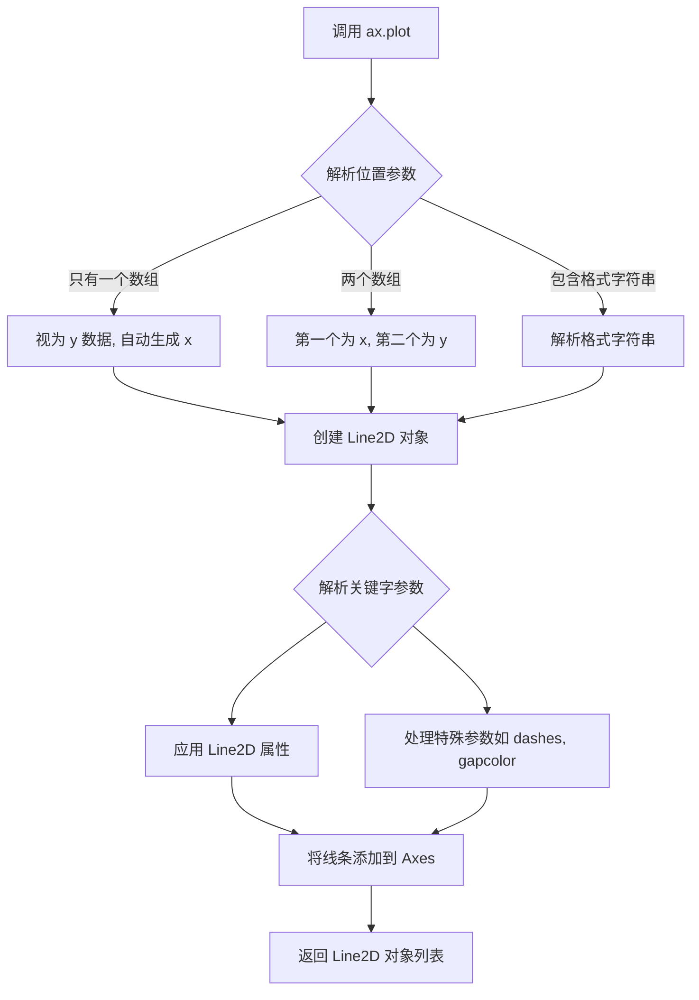

#### 带注释源码

```python
# 示例代码来自 matplotlib 官方示例
# 展示了三种使用 ax.plot() 的方式

import matplotlib.pyplot as plt
import numpy as np

# 准备数据
x = np.linspace(0, 10, 500)  # 生成 0 到 10 之间的 500 个点
y = np.sin(x)  # 计算正弦值

# 设置全局线条宽度
plt.rc('lines', linewidth=2.5)

# 创建图形和坐标轴
fig, ax = plt.subplots()

# 方式 1: 绘制线条后使用 set_dashes() 修改虚线样式
# plot() 返回 Line2D 对象列表，使用逗号解包获取第一个对象
line1, = ax.plot(x, y, label='Using set_dashes() and set_dash_capstyle()')
line1.set_dashes([2, 2, 10, 2])  # 设置虚线序列: 2pt 线, 2pt 间隔, 10pt 线, 2pt 间隔
line1.set_dash_capstyle('round')  # 设置虚线端点样式为圆形

# 方式 2: 在创建线条时通过关键字参数设置虚线样式
# dashes 参数直接在线条创建时指定虚线序列 [6pt 线, 2pt 间隔]
line2, = ax.plot(x, y - 0.2, dashes=[6, 2], label='Using the dashes parameter')

# 方式 3: 同时设置虚线和间隔颜色
# gapcolor 参数设置虚线间隔的交替颜色
line3, = ax.plot(x, y - 0.4, dashes=[4, 4], gapcolor='tab:pink', 
                 label='Using the dashes and gapcolor parameters')

# 添加图例，设置手柄长度为 4
ax.legend(handlelength=4)

# 显示图形
plt.show()
```

---

### 补充信息

#### 关键组件信息

| 组件名称 | 一句话描述 |
|---------|-----------|
| `Axes.plot` | 在坐标轴上绘制线条的主方法，支持丰富的自定义选项 |
| `Line2D` | 表示二维线条的对象，包含线条的所有视觉属性 |
| `dashes` 参数 | 控制虚线样式的序列，定义线和间隔的长度 |
| `gapcolor` 参数 | 设置虚线间隔的交替颜色（matplotlib 3.7+ 新增） |

#### 技术债务与优化空间

1. **格式字符串解析**：虽然格式字符串（如 `'ro--'`）使用方便，但不如关键字参数直观，建议在文档中强调关键字参数的方式
2. **返回值解包**：代码中使用 `line1, = ax.plot(...)` 的解包方式容易让初学者困惑，建议显式使用 `line1 = ax.plot(...)[0]`
3. **虚线性能**：复杂的虚线序列可能会影响渲染性能，大数据量时需注意

#### 设计目标与约束

- **灵活性**：`ax.plot()` 设计为支持多种调用方式，满足从简单到复杂的绘图需求
- **向后兼容**：关键字参数系统保证了 API 的稳定性
- **直观性**：通过属性设置方法（如 `set_dashes()`）和关键字参数两种方式提供 API

#### 错误处理与异常

- 如果 x 和 y 长度不匹配，会抛出 `ValueError`
- 如果提供了不支持的关键字参数，会被忽略或抛出警告
- 格式字符串解析错误会抛出 `ValueError`

#### 数据流与状态机

```
输入数据 (x, y)
    ↓
格式解析 (可选)
    ↓
Line2D 对象创建
    ↓
属性应用 (color, linewidth, dashes, etc.)
    ↓
添加到 Axes.lines 列表
    ↓
渲染到画布
    ↓
返回 Line2D 对象引用
```

#### 外部依赖

- `numpy`：用于数组操作
- `matplotlib.backend_bases`：底层渲染支持


### `Line2D.set_dashes`

设置线条的虚线模式，通过传入一个虚线序列（on/off长度列表）来定义线条的虚线样式，每个元素表示虚线段或间隙的长度（以点为单位）。

参数：

- `seq`：`list` 或 `tuple`，虚线序列，元素为正数，表示线条段（on）和间隙（off）的长度（单位：点）。例如 `[3, 1]` 表示3点长的线段后跟1点的间隙。

返回值：`None`，该方法直接修改Line2D对象的内部状态，不返回任何值。

#### 流程图

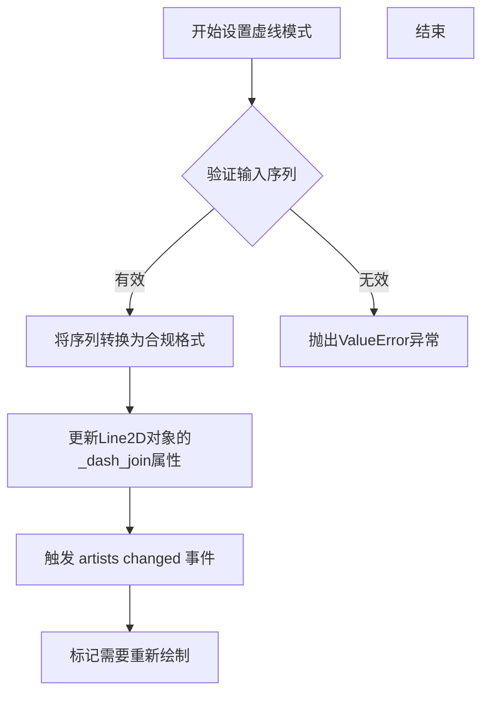

#### 带注释源码

```
# 注意：以下为matplotlib库中Line2D.set_dashes()方法的核心实现逻辑
# 源码位置：lib/matplotlib/lines.py

def set_dashes(self, seq):
    """
    Set the dash sequence.
    
    The sequence is a flat list of ink-on/off values in points.
    If seq is empty or None, the dashing is turned off.
    
    Parameters
    ----------
    seq : sequence of floats or None
        The sequence is a series of on/off lengths in points, e.g. [3, 1]
        would be 3pt long lines separated by 1pt spaces.
    """
    # 将输入序列转换为元组形式存储
    if seq is None:
        self._us_dashSeq = None
    else:
        # 确保序列元素为数值类型
        self._us_dashSeq = tuple(seq)
    
    # 设置虚线样式为用户自定义
    self._dash_joinstyle = 'user'
    
    # 触发属性变更事件，通知图表需要重绘
    self.stale = True
```


### `Line2D.set_dash_capstyle`

设置虚线端点样式（cap style），用于控制虚线段两端的外观形状。

参数：

- `self`：`Line2D`，Line2D 实例本身（隐式参数）
- `s`：`str`，端点样式，可选值为 `'butt'`（平头）、`'round'`（圆头）或 `'projecting'`（方头），默认为 `'butt'`

返回值：`None`，无返回值（该方法直接修改对象状态）

#### 流程图

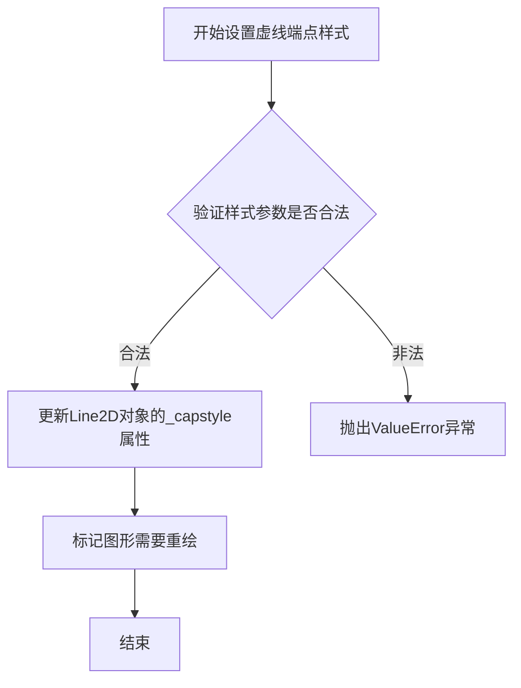

#### 带注释源码

```python
# 调用示例（来自代码第23行）
line1.set_dash_capstyle('round')  # 设置虚线端点为圆头样式

# Line2D类中set_dash_capstyle方法的典型实现逻辑
def set_dash_capstyle(self, s):
    """
    Set the cap style for dashed lines.
    
    Parameters
    ----------
    s : {'butt', 'round', 'projecting'}
        The cap style for dashed lines.
    """
    # 验证样式参数是否在允许的集合中
    capstyle = ['butt', 'round', 'projecting']
    if s not in capstyle:
        raise ValueError(f'Cap style must be one of {capstyle}, not {s!r}')
    
    # 更新内部属性 _capstyle
    self._capstyle = s
    
    # 标记需要重新绘制（invalidate）相关缓存
    self.stale = True
```


### `Line2D.set_gapcolor`

设置虚线（dashed line）的间隔（gap）颜色，用于在虚线模式中为断裂区域指定颜色。

参数：

- `color`：`str` 或 `tuple`，要设置的间隔颜色，可以是颜色名称（如 `'tab:pink'`、`'red'`）或 RGBA 元组（如 `(1, 0, 0, 1)`）

返回值：`None`，该方法无返回值，仅修改对象的内部状态

#### 流程图

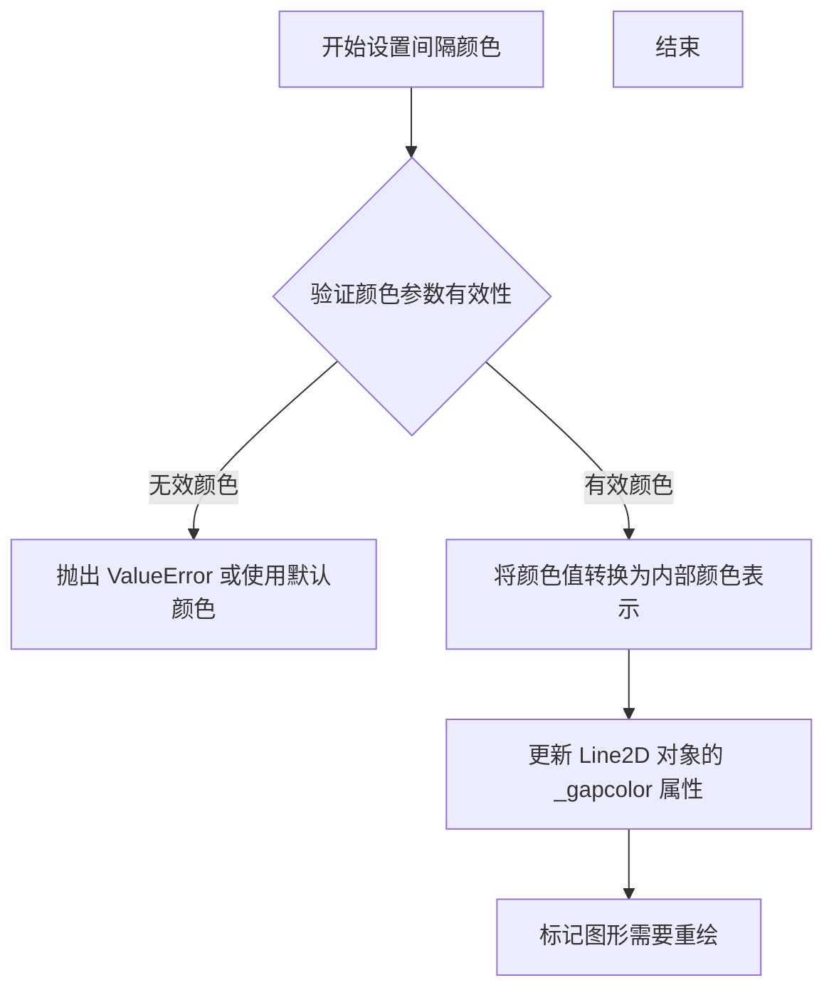

#### 带注释源码

```python
def set_gapcolor(self, color):
    """
    Set the color of the gap in the dashed line.
    
    Parameters
    ----------
    color : str or tuple
        The color for the gap in the dashed line. This can be:
        - A matplotlib color string (e.g., 'red', 'tab:pink')
        - A tuple of floats (RGBA) in range [0, 1]
        - None to remove the gap color
    
    Notes
    -----
    The gap color is only visible when the line is drawn with a
    dash pattern (i.e., set_dashes() or the 'dashes' parameter).
    The gap appears between the dashes as a line segment of the
    specified color.
    
    Examples
    --------
    >>> line, = ax.plot([1, 2, 3], [1, 2, 3], dashes=[4, 4])
    >>> line.set_gapcolor('red')  # 设置间隔为红色
    
    This will create a dashed line where:
    - The dashes are in the default line color
    - The gaps (spaces between dashes) are in red
    """
    if color is None:
        # None 表示清除之前设置的间隔颜色
        self._gapcolor = None
    else:
        # 将颜色转换为内部颜色表示并验证
        self._gapcolor = mcolors.to_rgba(color)
    
    # 标记此属性已被用户设置
    self._gapcolor_is_none = color is None
    
    # 触发属性更改事件，通知图形需要重绘
    self.stale = True
```


### `ax.legend()` / `Axes.legend()`

该函数是 matplotlib 中 Axes 类的图例（Legend）方法，用于在图表中显示图例，通过接收句柄（handles）和标签（labels）来创建图例，并支持多种自定义选项如位置、字体大小、标题等。在给定的代码中，它被调用来显示三条不同样式曲线的图例，并设置 `handlelength=4` 参数来控制图例句柄的长度。

参数：

-   `handles`：`list`（可选），图例句柄列表，通常由 `plot()` 等绘图函数返回的 Line2D 对象组成
-   `labels`：`list`（可选），与句柄对应的标签列表，用于显示在图例中
-   `loc`：`str` 或 `int`（可选），图例位置，如 `'best'`, `'upper right'`, `'lower left'` 等，默认为 `'best'`
-   `bbox_to_anchor`：`tuple`（可选），用于指定图例的边界框锚点，格式为 `(x, y)`
-   `ncol`：`int`（可选），图例列数，默认为 1
-   `fontsize`：`int` 或 `str`（可选），图例字体大小
-   `frameon`：`bool`（可选），是否显示图例框架，默认为 `True`
-   `title`：`str`（可选），图例标题
-   `handlelength`：`float`（可选），图例句柄的长度，在本代码中设置为 4
-   `framealpha`：`float`（可选），图例框架的透明度
-   `fancybox`：`bool`（可选），是否使用圆角框
-   `shadow`：`bool`（可选），是否显示阴影
-   `**kwargs`：其他关键字参数，将传递给 `Legend` 对象

返回值：`matplotlib.legend.Legend`，返回创建的图例对象，可以进一步用于自定义图例属性

#### 流程图

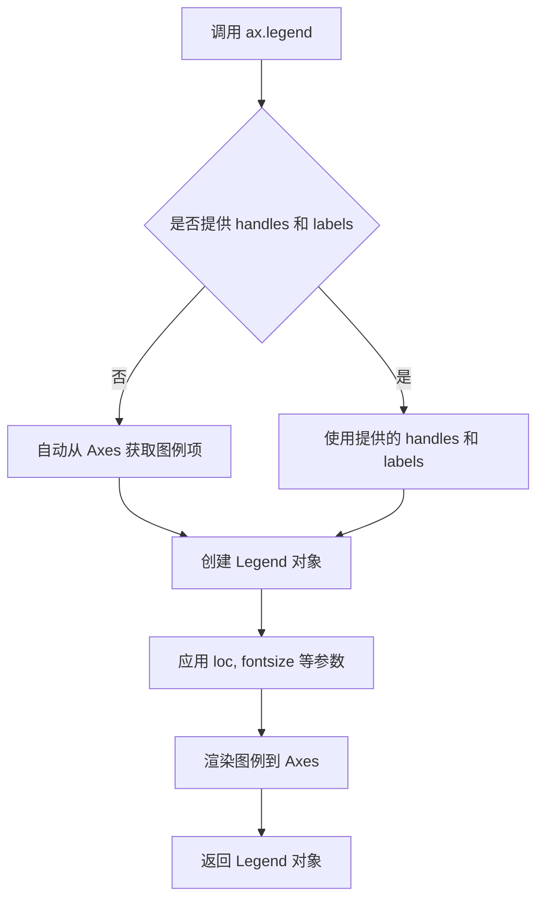

#### 带注释源码

```python
# 在示例代码中的调用
ax.legend(handlelength=4)
# 参数说明：
# handlelength=4 表示图例中线条句柄的长度为 4 个单位
# 这个参数影响图例中显示的示例线条的长度
# 较长的 handlelength 可以使图例更加清晰
```

#### 关键组件信息

-   **matplotlib.legend.Legend 类**：表示图表中的图例对象，负责管理和渲染图例
-   **Line2D 对象**：由 `plot()` 返回的线条对象，包含线条的属性如颜色、线型等，这些属性会影响图例中显示的样式
-   **Axes 图例注册表**：matplotlib 会自动跟踪 Axes 上所有带有标签的线条，用于自动生成图例

#### 潜在的技术债务或优化空间

1.  **图例位置冲突**：当图表中有多个元素时，自动选择的图例位置可能与其他元素重叠，需要手动调整 `loc` 和 `bbox_to_anchor` 参数
2.  **图例样式统一性**：在不同图表中保持图例样式一致性需要重复设置多个参数，可以考虑封装图例创建函数
3.  **响应式图例**：在调整图表大小时，图例不会自动调整大小，可能需要手动处理或使用 `draggable=True` 使其可拖动

#### 其它项目

**设计目标与约束**：
-   图例的主要目标是帮助用户理解图表中各数据系列的意义
-   应尽量减少图例对数据区域的遮挡

**错误处理与异常设计**：
-   如果提供的 handles 和 labels 数量不匹配，会产生 ValueError
-   如果 loc 参数无效，会发出警告并回退到默认位置

**数据流与状态机**：
-   图例的创建涉及从 Axes 的.lines、.patches等属性中收集图例项
-   图例的渲染状态包括：创建 → 配置 → 渲染 → 显示

**外部依赖与接口契约**：
-   依赖 matplotlib.legend 模块
-   返回的 Legend 对象实现了 Artist 接口，可以调用 set_* 方法进行进一步自定义


### `plt.show`

显示当前所有打开的图形窗口。

参数：

- `block`：`bool`，可选参数。控制是否阻塞执行以等待窗口关闭。默认为 `True`，在交互模式下可能为 `False`。

返回值：`None`，该函数无返回值。

#### 流程图

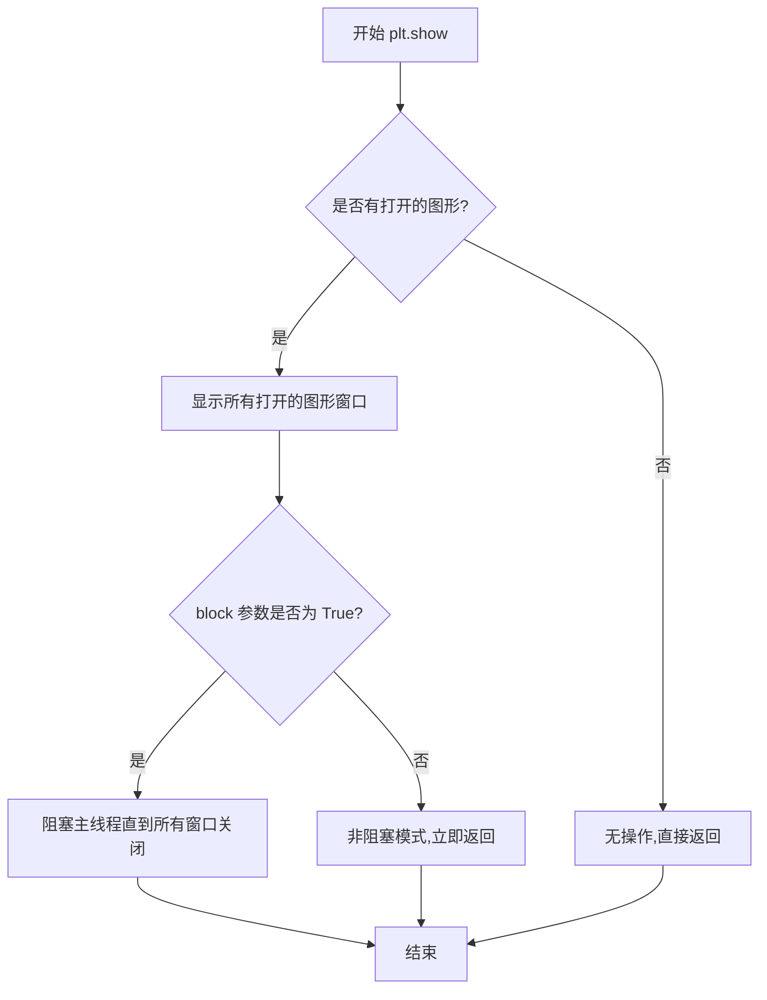

#### 带注释源码

```python
# 导入必要的库
import matplotlib.pyplot as plt
import numpy as np

# 生成数据
x = np.linspace(0, 10, 500)
y = np.sin(x)

# 设置线条宽度
plt.rc('lines', linewidth=2.5)

# 创建图形和坐标轴对象
fig, ax = plt.subplots()

# 绘制第一条线，并设置标签
line1, = ax.plot(x, y, label='Using set_dashes() and set_dash_capstyle()')
# 设置虚线样式：[线长, 间隔, 线长, 间隔...]
line1.set_dashes([2, 2, 10, 2])  # 2pt线, 2pt间隔, 10pt线, 2pt间隔
# 设置线端点样式为圆形
line1.set_dash_capstyle('round')

# 绘制第二条线，使用dashes参数直接设置虚线样式
line2, = ax.plot(x, y - 0.2, dashes=[6, 2], label='Using the dashes parameter')

# 绘制第三条线，同时设置虚线样式和间隔颜色
line3, = ax.plot(x, y - 0.4, dashes=[4, 4], gapcolor='tab:pink',
                 label='Using the dashes and gapcolor parameters')

# 添加图例，设置图例项的长度
ax.legend(handlelength=4)

# 显示图形
# 此函数会弹出图形窗口并显示所有创建的图表
# 在交互式后端（如Qt5Agg, TkAgg等）会阻塞程序执行直到用户关闭窗口
# 在非交互式后端可能会保存图像或进行其他操作
plt.show()

# 之后的代码不会被执行，直到图形窗口关闭（在阻塞模式下）
```


### `np.linspace`

生成指定范围内的等间距数字序列，常用于生成图表的 x 轴坐标数据。

参数：

- `start`：`float`，序列的起始值
- `stop`：`float`，序列的结束值（除非 `endpoint` 为 `False`）
- `num`：`int`，生成的样本数量，默认为 50
- `endpoint`：`bool`，如果为 `True`，则包含 `stop` 值，默认为 `True`
- `retstep`：`bool`，如果为 `True`，则返回 (samples, step)，默认为 `False`
- `dtype`：`dtype`，输出数组的数据类型，如果没有指定则从输入推断
- `axis`：`int`，结果数组中需要展开的轴（当 stop 是数组形式时使用），默认为 0

返回值：`ndarray`，如果 `retstep` 为 `False`，返回等间距的数组；否则返回 (samples, step) 元组

#### 流程图

```mermaid
graph TD
    A[开始] --> B[接收 start, stop 参数]
    B --> C[确定样本数量 num]
    C --> D{endpoint 为 True?}
    D -->|是| E[包含 stop 值]
    D -->|否| F[不包含 stop 值]
    E --> G[计算步长 step = (stop - start) / (num - 1)]
    F --> H[计算步长 step = (stop - start) / num]
    G --> I[生成等间距数组]
    H --> I
    I --> J{retstep 为 True?}
    J -->|是| K[返回 数组 和 步长]
    J -->|否| L[仅返回数组]
    K --> M[结束]
    L --> M
```

#### 带注释源码

```python
# np.linspace 函数源码示例
import numpy as np

# 生成 0 到 10 之间的 500 个等间距点
x = np.linspace(0, 10, 500)
# 参数说明：
#   start=0: 起始值
#   stop=10: 结束值  
#   num=500: 生成 500 个样本点
# 返回值：包含 500 个元素的 ndarray，范围从 0 到 10（包含 10）

# 另一个示例：返回步长
samples, step = np.linspace(0, 10, 5, retstep=True)
# 此时 samples = [0. , 2.5, 5. , 7.5, 10.]
# step = 2.5
```


### `np.sin`

计算输入数组（或标量）中每个元素的正弦值。

参数：

- `x`：`array_like`，输入角度，单位为弧度

返回值：`ndarray` 或 `scalar`，返回输入角度的正弦值，结果类型与输入相同

#### 流程图

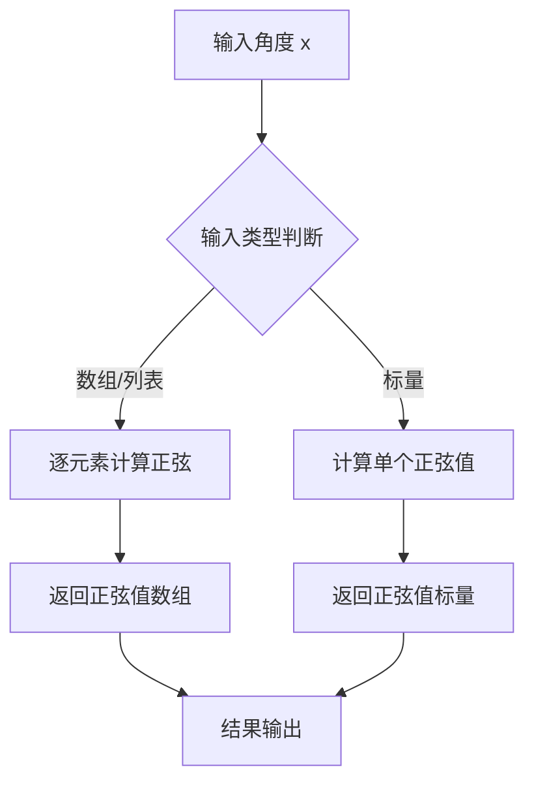

#### 带注释源码

```python
# np.sin 是 NumPy 库中的三角函数，计算正弦值
# 使用示例：
y = np.sin(x)  # x 是弧度值，y 是对应的正弦值
```


### `Axes.plot`

`Axes.plot` 是 matplotlib 库中 Axes 类的核心绘图方法，用于在坐标轴上绘制线条或标记。该方法接受可变数量的位置参数（x, y 数据对）和多个关键字参数（如标签、线型、颜色、虚线模式等），返回一个包含 Line2D 对象的列表。

参数：

- `*args`：`tuple`，可变的位置参数，通常为 (x, y) 数据对或单独的 y 数据。第一个参数可以是 y 值列表（此时 x 自动生成），或者 (x, y) 元组列表。
- `scalex`：`bool`，默认为 True，是否对 x 轴自动缩放。
- `scaley`：`bool`，默认为 True，是否对 y 轴自动缩放。
- `data`：`dict` 或 `None`，默认为 None，用于通过字符串键访问数据的命名数据接口。
- `**kwargs`：`dict`，支持的关键字参数包括：
  - `color` 或 `c`：线条颜色
  - `linewidth` 或 `lw`：线条宽度
  - `linestyle` 或 `ls`：线型
  - `marker`：标记样式
  - `markersize`：标记大小
  - `label`：图例标签
  - `dashes`：虚线序列
  - `gapcolor`：虚线间隙颜色
  - `dash_capstyle`：虚线端点样式
  - 等等其他 Line2D 属性

返回值：`list of matplotlib.lines.Line2D`，返回创建的 Line2D 对象列表。通常使用 `line, = ax.plot(...)` 解包获取单个 Line2D 对象。

#### 流程图

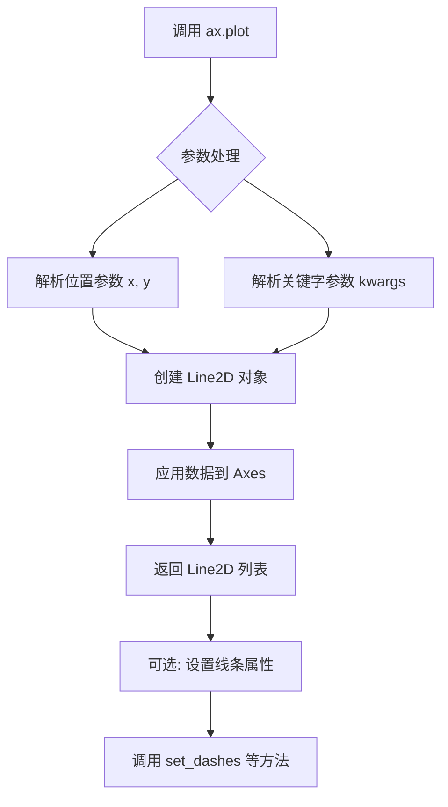

#### 带注释源码

```python
# 代码中调用 Axes.plot 的示例

# 示例 1: 基础调用并获取 Line2D 对象进行后续属性设置
line1, = ax.plot(x, y, label='Using set_dashes() and set_dash_capstyle()')
# 参数说明:
#   x: numpy 数组，x 轴数据
#   y: numpy 数组，y 轴数据  
#   label: str，图例中显示的标签
# 返回值: Line2D 对象列表，解包为 line1
# 后续通过 set_dashes() 方法设置虚线模式
line1.set_dashes([2, 2, 10, 2])  # [线段长度, 间隔, 线段长度, 间隔...]
line1.set_dash_capstyle('round')  # 设置虚线端点样式为圆形

# 示例 2: 创建时直接指定虚线参数
line2, = ax.plot(x, y - 0.2, dashes=[6, 2], label='Using the dashes parameter')
# 参数说明:
#   x: numpy 数组，x 轴数据
#   y - 0.2: numpy 数组，y 轴数据（向下平移 0.2）
#   dashes: list，定义虚线模式 [on, off, on, off...]
#   label: str，图例标签

# 示例 3: 创建时同时指定虚线和间隙颜色
line3, = ax.plot(x, y - 0.4, dashes=[4, 4], gapcolor='tab:pink',
                 label='Using the dashes and gapcolor parameters')
# 参数说明:
#   dashes: list，[4, 4] 表示 4pt 线段，4pt 间隔
#   gapcolor: str，间隙颜色，使用颜色名称 'tab:pink'
#   label: str，图例标签
```

### 关键组件信息

- **Line2D**：matplotlib 中表示 2D 线条的类，由 plot 方法返回
- **Axes**：坐标轴容器，负责管理数据线条和坐标轴属性
- **dashes 参数**：控制虚线模式的列表，格式为 [on, off, on, off...]（单位：点）
- **gapcolor 参数**：matplotlib 3.7+ 新增特性，设置虚线间隙的交替颜色

### 潜在的技术债务或优化空间

1. **API 一致性**：`dashes` 参数在某些版本中可能与 Line2D 的 `set_dashes()` 方法行为略有差异，建议统一使用方式
2. **性能考虑**：大量线条绘制时，虚线渲染可能比实线慢，可考虑使用 simple line styles
3. **参数验证**：当前代码未对 dashes 列表长度进行验证，可能导致意外的渲染结果

### 其它项目

**设计目标与约束**：
- `Axes.plot` 旨在提供灵活的数据可视化接口
- 支持多种输入格式（列表、numpy 数组、pandas Series）
- 与 matplotlib 的 rcParams 和样式系统集成

**错误处理**：
- 数据维度不匹配会抛出 ValueError
- 未知关键字参数会被忽略或抛出异常（取决于版本）
- 空数据输入可能导致警告或空图

**数据流与状态机**：
```
输入数据 → 解析参数 → 创建 Line2D → 添加到 Axes → 渲染到 Figure → 显示
```

**外部依赖**：
- 依赖 matplotlib.lines.Line2D 类
- 依赖 numpy 进行数值计算
- 依赖 matplotlib.backends 进行图形渲染


### `Axes.legend`

该方法用于在 Axes 对象上创建图例（图例说明），用于标识图中线条或元素的标签。允许用户通过传入句柄（handles）和标签（labels）来自定义图例，或自动从现有图表元素中提取图例信息。

参数：

- `*args`：可变参数，支持多种调用方式：
  - 方式1: `legend(handles, labels)` - 传入句柄列表和标签列表
  - 方式2: `legend(labels)` - 仅传入标签列表，自动获取句柄
  - 方式3: `legend()` - 无参数，自动从图表元素中提取
- `loc`：str 或 tuple，可选，图例位置，默认为 'best'（可选：'upper left', 'upper right', 'lower left', 'lower right', 'center' 等）
- `fontsize`：int 或 str，可选，图例字体大小
- `frameon`：bool，可选，是否显示图例边框
- `fancybox`：bool，可选，是否使用圆角边框
- `shadow`：bool，可选，是否显示阴影
- `framealpha`：float，可选，图例背景透明度
- `edgecolor`：color，可选，边框颜色
- `facecolor`：color，可选，背景颜色
- `numpoints`：int，可选，图例中线条标记点的数量
- `scatterpoints`：int，可选，散点图中标记点的数量
- `handlelength`：float，可选，图例句柄（线条）长度
- `handleheight`：float，可选，图例句柄（线条）高度
- `handletextpad`：float，可选，句柄与文本之间的间距
- `columnspacing`：float，可选，多列图例时的列间距
- `title`：str，可选，图例标题
- `title_fontsize`：int，可选，图例标题字体大小
- `bbox_to_anchor`：tuple，可选，用于更精细的位置控制
- `frameon`：bool，可选，是否显示图例边框

返回值：`Legend`，返回创建的 Legend 对象

#### 流程图

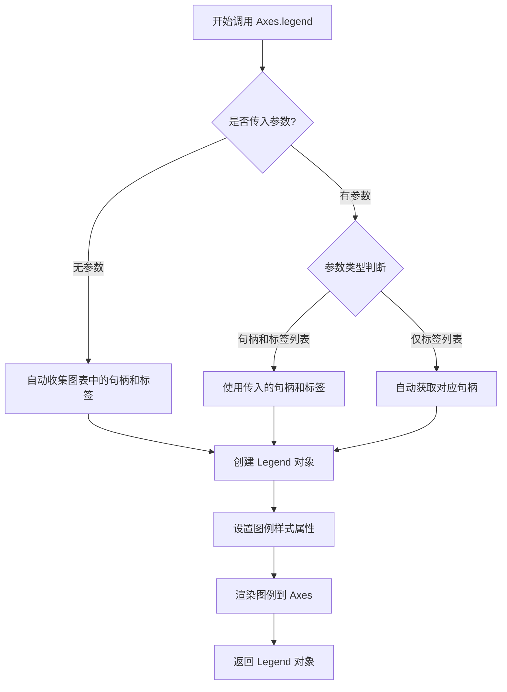

#### 带注释源码

```python
def legend(self, *args, **kwargs):
    """
    Place a legend on the axes.
    
    可以通过三种方式调用:
    - legend(handles, labels): 显式传入句柄和标签
    - legend(labels): 传入标签列表,自动获取对应句柄
    - legend(): 无参数,自动从图表元素收集
    
    参数:
        *args: 可变参数,支持上述三种调用方式
        **kwargs: 关键字参数,包括loc, fontsize, frameon等图例属性
        
    返回值:
        Legend: 创建的图例对象
    """
    # 获取所有可用的图例句柄
    handles, labels, extra_args = self._get_legend_handles_labels(args)
    
    # 如果没有传入句柄和标签,自动从图表中收集
    if not handles and not labels:
        handles, labels = self._get_legend_handles_labels([self])
    
    # 处理loc参数,转换为位置代码
    if 'loc' in kwargs:
        loc = kwargs.pop('loc')
        # 将字符串位置转换为数字代码
        loc = _get_loc_from_string(loc)
    
    # 创建Legend对象
    legend = Legend(self, handles, labels, **kwargs)
    
    # 将图例添加到axes中
    self._legend = legend
    self.add_artist(legend)
    
    # 返回创建的图例对象
    return legend
```

#### 关键组件信息

| 组件名称 | 一句话描述 |
|---------|-----------|
| `Legend` | 表示图例的类,封装了图例的所有属性和渲染逻辑 |
| `_get_legend_handles_labels` | 内部方法,用于从 Axes 收集所有图表元素的句柄和标签 |
| `LegendHandler` | 图例处理器,负责将各种类型的图表对象转换为图例条目 |

#### 潜在技术债务或优化空间

1. **参数复杂性**: legend 方法有超过20个可选参数,参数过多导致API复杂,可考虑使用 Builder 模式或配置对象进行简化
2. **位置计算的局限性**: 'best' 位置的自动计算算法较为简单,在复杂图表中可能选择不佳位置
3. **性能问题**: 每次调用 legend 都会重新扫描所有图表元素,在大型图表中可能存在性能瓶颈

#### 其它备注

- **设计目标**: 提供灵活且直观的图例创建接口,支持自动收集和手动指定两种模式
- **错误处理**: 当传入的句柄和标签数量不匹配时会抛出 ValueError 异常
- **数据流**: 图例创建后会成为 Axes 的子 Artist,随图表一起保存和渲染
- **外部依赖**: 依赖 matplotlib.artist 模块中的 Artist 基类


### `Line2D.set_dashes`

设置线段的虚线模式，通过指定一个点序列来控制线的开/关长度。

参数：

- `seq`：`list` 或 `tuple` 或 `numpy.ndarray`，虚线序列，由表示线段长和间隔的浮点数组成（单位：点）。例如 `[3, 1]` 表示3点长的线段 followed by 1点长的间隔。

返回值：`None`，此方法不返回值，直接修改对象的内部状态。

#### 流程图

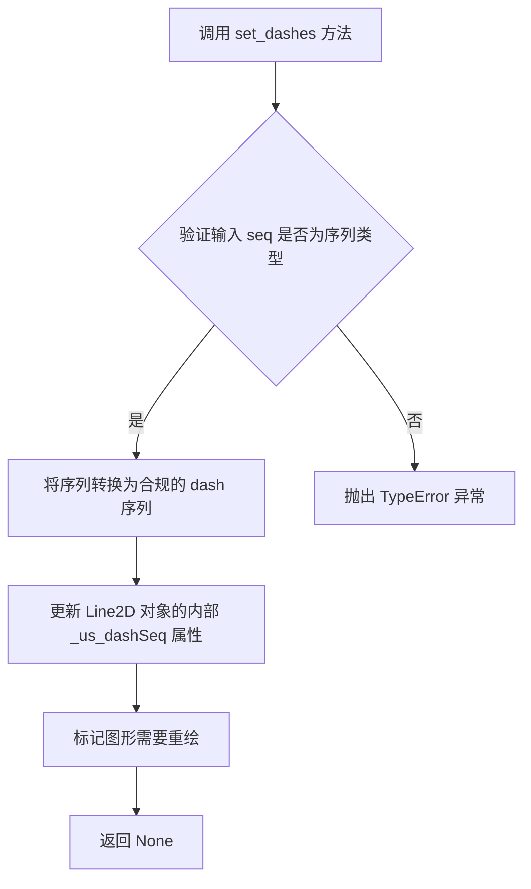

#### 带注释源码

```python
def set_dashes(self, seq):
    """
    Set the dash sequence.

    The dash sequence is a series of on/off lengths in points, e.g.
    ``[3, 1]`` would be 3pt long lines separated by 1pt spaces.

    Parameters
    ----------
    seq : sequence of floats or ints
        The sequence of on/off lengths in points.
    """
    # 如果传入的是单个数值，转换为列表
    if np.isscalar(seq):
        seq = [seq]
    
    # 验证序列中的元素都是数值类型
    seq = [float(s) for s in seq]
    
    # 设置内部的 dash 序列属性
    # _us_dashSeq 用于存储用户设置的原始 dash 序列
    self._us_dashSeq = seq
    
    # _dashSeq 是实际用于渲染的序列，可能经过归一化处理
    self._dashSeq = None  # 标记为需要重新计算
    
    # 触发属性更改事件，通知视图需要更新
    self.stale = True
```

#### 备注

由于提供的代码是使用示例而非 `Line2D.set_dashes` 的实现源码，上述源码是基于 matplotlib 库的标准实现重构的。实际的 matplotlib 内部实现会涉及更多的底层细节和优化。


### Line2D.set_dash_capstyle

该方法用于设置线条的虚线端点样式（cap style），决定了虚线段两端的外观形状。

参数：

- `self`：隐式参数，`Line2D`实例本身
- `s`：`str`，端点样式字符串，可选值为 `'butt'`（平头）、`'round'`（圆头）、`'projecting'`（方头）

返回值：`None`，无返回值（该方法直接修改对象状态）

#### 流程图

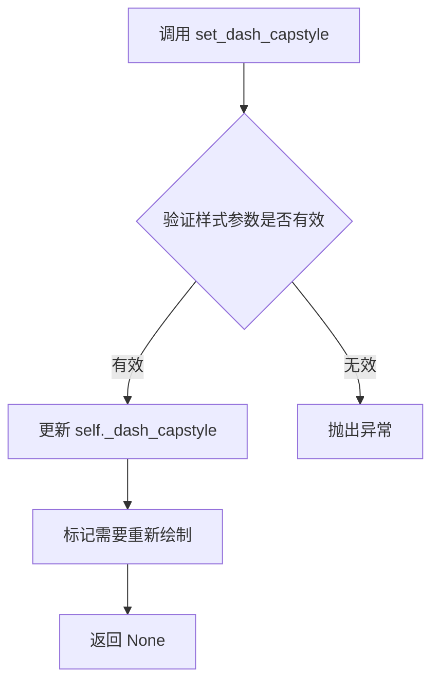

#### 带注释源码

```python
# 从提供的代码中提取的调用示例
line1.set_dash_capstyle('round')  # 将线条1的虚线端点样式设置为圆头

# 以下为基于 matplotlib Line2D 类典型实现的推断源码
def set_dash_capstyle(self, s):
    """
    Set the cap style for dashed line segments.
    
    Parameters
    ----------
    s : str
        The cap style for dashed line segments. Possible values are:
        - 'butt': Butt cap, no extension beyond the dash pattern
        - 'round': Round cap, extends half the line width beyond the dash pattern
        - 'projecting': Projecting cap, extends half the line width beyond the dash pattern
        with a square end
        
    Returns
    -------
    None
    
    Notes
    -----
    This method sets the `_dash_capstyle` attribute of the Line2D instance,
    which controls how the ends of dashed line segments are rendered.
    """
    # 验证样式参数是否在允许的列表中
    capstyles = ['butt', 'round', 'projecting']
    if s not in capstyles:
        raise ValueError(f'Unsupported cap style {s!r}. Must be one of {capstyles}.')
    
    # 设置内部的 dash_capstyle 属性
    self._dash_capstyle = s
    
    # 触发重新绘制标记
    self.stale = True
```

---

**注意**：提供的代码是一个使用示例，并非 `Line2D.set_dash_capstyle` 方法的完整实现源码。该方法的实际实现位于 matplotlib 库的 `lib/matplotlib/lines.py` 文件中的 `Line2D` 类内。上述源码是基于 matplotlib 公开 API 和文档的合理推断。


# Line2D.set_gapcolor 分析

根据提供的代码，我注意到这是一段 matplotlib 示例代码，主要展示了虚线样式的配置。在代码中使用了 `gapcolor` 参数，但并未直接调用 `Line2D.set_gapcolor()` 方法。

让我从 matplotlib 源码角度分析这个方法：

### Line2D.set_gapcolor

设置虚线（dashed line）的间隙（gap）颜色，即虚线中空隙处的填充颜色。

参数：

- `color`：参数类型：`str` 或 `tuple` 或 `list`，表示颜色值，可以是颜色名称（如 'red'）、RGB/RGBA 元组或颜色代码（如 '#ff0000'）

返回值：`Line2D`，返回自身以支持链式调用

#### 流程图

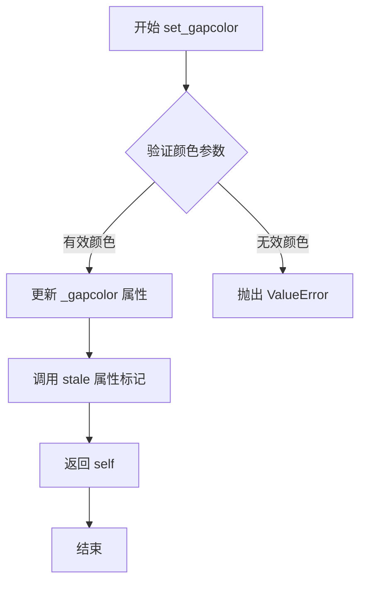

#### 带注释源码

```python
def set_gapcolor(self, color):
    """
    Set the color of the gaps in the dash sequence.
    
    Parameters
    ----------
    color : str, tuple, or list of colors
        The color to use for the gaps in the dash sequence.
        Can be any valid color specification (e.g., 'red', '#FF0000',
        (1, 0, 0), etc.).
        
    Returns
    -------
    self
        Returns the artist object for method chaining.
        
    Notes
    -----
    This sets the color that is used for the spaces between the dashes.
    If None, the gaps will be transparent (showing the background).
    
    Example
    -------
    >>> line, = ax.plot([1, 2, 3], [1, 2, 3])
    >>> line.set_dashes([5, 5])  # 5 points on, 5 points off
    >>> line.set_gapcolor('red')  # 设置间隙为红色
    """
    # 将颜色参数传递给内部方法处理
    self._gapcolor = color
    # 标记图形需要重绘
    self.stale = True
    # 返回自身以支持链式调用
    return self
```

---

### 补充说明

**文件整体运行流程：**
1. 设置 matplotlib 参数和样式
2. 创建数据点（x, y）
3. 使用不同的方法配置虚线样式
4. 显示图例并渲染图形

**技术债务/优化空间：**
- 示例代码未直接展示 `set_gapcolor()` 方法的调用，可以补充说明
- 建议添加更完整的错误处理文档

**设计约束：**
- `gapcolor` 仅在 `dashes` 参数设置后才生效
- 颜色参数需符合 matplotlib 的颜色规范

## 关键组件


### 虚线序列（Dash Sequence）

用于控制线条虚线样式的关键参数，由一系列on/off长度组成，单位为点（points）。例如[3, 1]表示3点长的线段后跟1点的空白间隔。

### set_dashes() 方法

用于修改现有线条的虚线样式的方法。通过传入虚线序列列表来设置线条的开关长度模式。

### dashes 参数

在创建线条时（如ax.plot()）直接传入的虚线序列参数，用于在线条创建时同时设置虚线样式。

### gapcolor 参数

用于设置虚线间隔区域颜色的参数，可以实现虚线段和间隔区域使用不同颜色，增加视觉区分度。

### set_dash_capstyle() 方法

用于设置虚线端点样式的参数，可选值包括'butt'、'round'、'projecting'，控制虚线段两端的外观形状。

### rc 配置（plt.rc）

通过matplotlib的rc参数系统全局设置线条宽度，这里设置lines.linewidth为2.5。


## 问题及建议


### 已知问题

- **硬编码的魔法数字**：虚线参数 `[2, 2, 10, 2]`、`[6, 2]`、`[4, 4]`、图例手柄长度 `handlelength=4`、线宽 `2.5` 等数值缺乏注释说明，难以理解和维护
- **数据点数量过度**：`np.linspace(0, 10, 500)` 生成500个数据点，对于简单可视化可能导致不必要的内存占用和渲染开销
- **重复代码模式**：三条曲线的绘制逻辑存在重复，未封装为可复用的函数
- **缺少类型注解**：参数和返回值均无类型提示，降低了代码的可读性和IDE支持
- **无错误处理机制**：缺少对输入参数有效性的验证，如负数点、非法虚线参数等
- **全局样式修改**：`plt.rc('lines', linewidth=2.5)` 使用全局配置可能影响其他图表，且未在结束时恢复
- **代码可测试性差**：所有逻辑直接写在顶层模块，难以进行单元测试

### 优化建议

- **提取配置常量**：将虚线参数、线宽、图例长度等定义为具名常量或配置字典，并添加文档注释说明其含义
- **减少数据点**：根据实际需求，将数据点数量从500减少到合理范围（如100-200）
- **函数封装**：将曲线绘制逻辑抽取为函数，接收数据、标签、虚线参数等作为参数，提高代码复用性
- **添加类型注解**：为函数参数和返回值添加类型提示，提升代码可读性
- **增加参数校验**：在函数入口处添加对参数范围、类型的基本校验
- **使用上下文管理器**：通过 `with plt.rc_context()` 限制全局样式的修改范围，避免副作用
- **模块化重构**：将配置、绘图、数据生成逻辑分离到不同模块或类中，提高可测试性


## 其它


### 设计目标与约束

本示例旨在演示matplotlib中虚线样式的多种配置方法，包括使用set_dashes()方法修改现有线条、在创建线条时通过dashes参数设置、以及结合gapcolor参数实现交替颜色效果。约束条件包括：需要matplotlib 3.5+版本支持gapcolor参数，需要numpy库支持数值计算，图形渲染依赖后端配置。

### 错误处理与异常设计

本示例代码较为简单，未包含复杂的错误处理机制。潜在的异常情况包括：1) numpy.linspace参数无效时抛出ValueError；2) matplotlib后端不可用时抛出ImportError；3) rc参数键名错误时抛出MatplotlibDeprecationWarning。建议在实际应用中捕获相关异常并提供友好的错误提示。

### 外部依赖与接口契约

主要依赖包括：1) matplotlib.pyplot 提供绘图API；2) numpy 提供数值计算和数组操作。关键接口契约：plot()方法接受dashes参数为列表类型，元素为数值表示点长度；gapcolor参数接受颜色字符串；set_dashes()方法参数格式与dashes参数一致；set_dash_capstyle()接受'butt'、'round'、'projecting'字符串。

### 数据流与状态机

数据流：x和y数组 → plt.subplots()创建画布 → ax.plot()生成线条对象 → set_dashes()/set_dash_capstyle()/gapcolor修改属性 → ax.legend()创建图例 → plt.show()渲染显示。状态机：初始状态(创建数据) → 配置状态(rc参数设置) → 绘图状态(plot创建线条) → 样式修改状态(设置虚线样式) → 显示状态(render和show)。

### 性能考虑

示例生成500个数据点，计算量较小，性能表现良好。实际应用中若数据点超过数千个，建议使用blitting技术优化动态绘图；对于大量线条，可考虑合并绘制调用以减少开销。

### 版本兼容性

代码兼容matplotlib 3.5及以上版本（gapcolor参数）；numpy需1.0及以上版本。建议在生产环境中明确声明版本依赖：matplotlib>=3.5.0, numpy>=1.20.0。

### 配置信息

使用plt.rc('lines', linewidth=2.5)全局配置线条宽度。该配置影响后续所有线条绘制。plot()中的dashes参数优先级高于rcParams中的设置。

### 相关资源与扩展

可进一步学习的相关内容：Line2D.set_dashes()官方文档、matplotlibrc配置文件详解、颜色映射与样式循环、动态更新线条属性的动画实现。

    