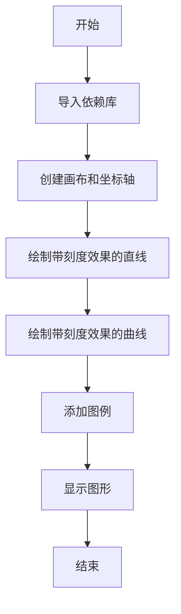
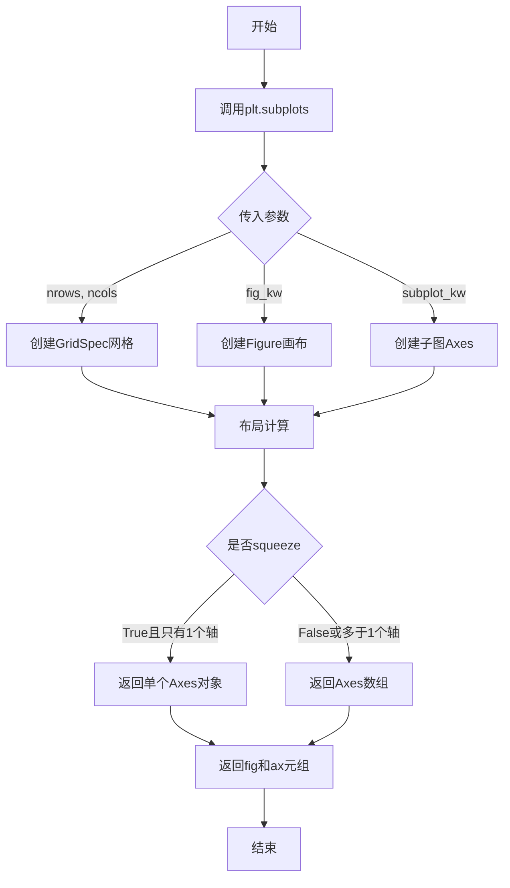
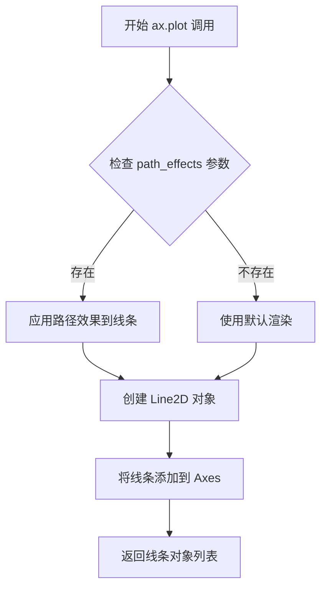
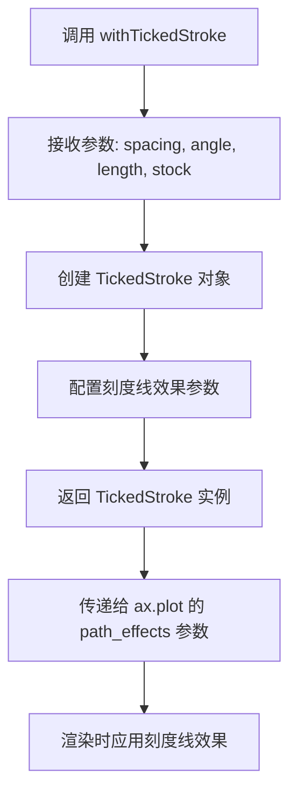
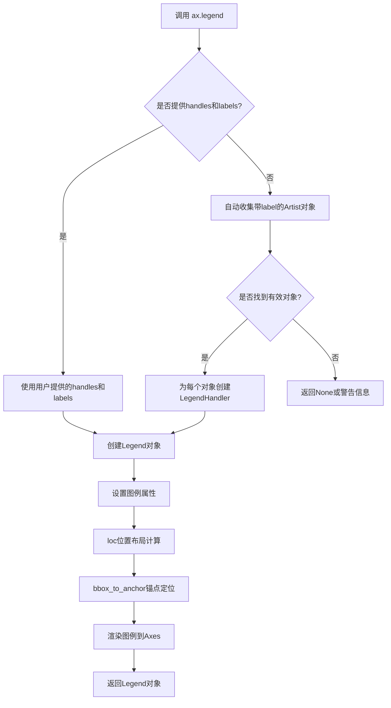
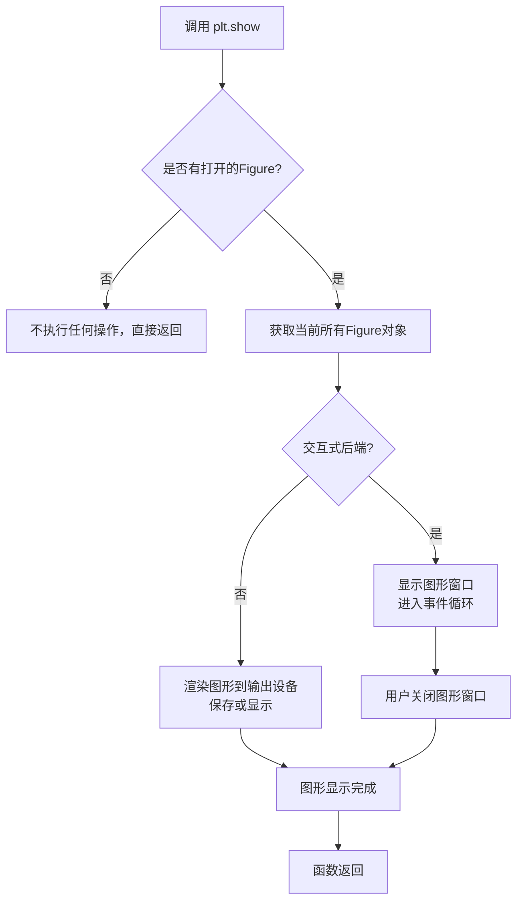

# `matplotlib\galleries\examples\lines_bars_and_markers\lines_with_ticks_demo.py` 详细设计文档

这是一个matplotlib示例脚本，展示了如何使用patheffects.withTickedStroke在图表线条上添加刻度线效果，用于标记边界或障碍物，并支持在图例中正确显示。

## 整体流程



## 类结构

```
无类层次结构（脚本文件）
```

## 全局变量及字段


### `fig`
    
画布对象，用于承载和显示图形

类型：`matplotlib.figure.Figure`
    


### `ax`
    
坐标轴对象，用于管理图表的坐标轴和绘图元素

类型：`matplotlib.axes.Axes`
    


### `nx`
    
曲线采样点数，值为101，用于控制正弦曲线的平滑度

类型：`int`
    


### `x`
    
x轴数据，从0到1的等差数列，共101个点

类型：`numpy.ndarray`
    


### `y`
    
y轴数据，由正弦函数计算得出的曲线数据

类型：`numpy.ndarray`
    


    

## 全局函数及方法


### `plt.subplots`

创建画布和坐标轴的函数，用于生成一个包含一个或多个子图的图形窗口，并返回图形对象和坐标轴对象。

参数：

- `nrows`：`int`，默认值 1，子图的行数
- `ncols`：`int`，默认值 1，子图的列数
- `sharex`：`bool` 或 `{'row', 'col', 'all'}`，默认值 False，是否共享 x 轴
- `sharey`：`bool` 或 `{'row', 'col', 'all'}`，默认值 False，是否共享 y 轴
- `squeeze`：`bool`，默认值 True，是否返回压缩的坐标轴数组
- `width_ratios`：`array-like`，可选，子图宽度比例
- `height_ratios`：`array-like`，可选，子图高度比例
- `subplot_kw`：`dict`，可选，传递给每个子图的关键字参数
- `gridspec_kw`：`dict`，可选，传递给 GridSpec 的关键字参数
- `fig_kw`：`dict`，可选，传递给 figure() 的关键字参数

返回值：`tuple`，返回 (figure, axes)，其中 figure 是 `matplotlib.figure.Figure` 对象，axes 是 `matplotlib.axes.Axes` 对象或 Axes 对象数组

#### 流程图



#### 带注释源码

```python
# plt.subplots 的核心实现逻辑（简化版）
def subplots(nrows=1, ncols=1, sharex=False, sharey=False, squeeze=True,
             width_ratios=None, height_ratios=None, subplot_kw=None,
             gridspec_kw=None, fig_kw=None):
    """
    创建画布和坐标轴
    
    参数:
        nrows: 子图行数，默认1
        ncols: 子图列数，默认1
        sharex: 是否共享x轴
        sharey: 是否共享y轴
        squeeze: 是否压缩返回的坐标轴数组
        width_ratios: 各列宽度比例
        height_ratios: 各行高度比例
        subplot_kw: 创建子图的关键字参数
        gridspec_kw: 网格布局的关键字参数
        fig_kw: 创建Figure的关键字参数
    """
    
    # 1. 创建Figure画布对象
    fig = plt.figure(**(fig_kw or {}))
    
    # 2. 创建GridSpec网格布局对象
    gs = GridSpec(nrows, ncols, 
                  width_ratios=width_ratios,
                  height_ratios=height_ratios,
                  **(gridspec_kw or {}))
    
    # 3. 创建子图数组
    ax_arr = np.empty((nrows, ncols), dtype=object)
    
    # 4. 遍历每个网格位置创建子图
    for i in range(nrows):
        for j in range(ncols):
            # 创建子图并添加到画布
            ax = fig.add_subplot(gs[i, j], **(subplot_kw or {}))
            ax_arr[i, j] = ax
    
    # 5. 处理共享轴逻辑
    if sharex or sharey:
        # 设置子图之间的共享关系
        _handle_shared_axes(ax_arr, sharex, sharey)
    
    # 6. 根据squeeze参数处理返回值
    if squeeze and nrows == 1 and ncols == 1:
        # 单个子图时返回单个Axes对象
        return fig, ax_arr[0, 0]
    else:
        # 多个子图时返回数组
        if squeeze:
            # 尝试移除长度为1的维度
            ax_arr = np.squeeze(ax_arr)
        return fig, ax_arr
```


### ax.plot

该方法用于在matplotlib Axes对象上绘制线条（或标记），支持通过`path_effects`参数应用路径效果来增强线条的视觉效果，如添加刻度线、阴影等装饰效果。

参数：

- `x`：array-like，X轴数据坐标
- `y`：array-like，Y轴数据坐标
- `fmt`：str，格式字符串（如'bo-'表示蓝色圆圈标记和实线），默认为None
- `label`：str，图例标签，默认为空
- `path_effects`：list of `~matplotlib.patheffects.AbstractPathEffect`，路径效果列表，用于装饰线条，默认为None
- `**kwargs`：关键字参数，支持多种线条属性（如color、linewidth、linestyle等）

返回值：`list of ~matplotlib.lines.Line2D`，返回绘制的线条对象列表

#### 流程图



#### 带注释源码

```python
# 示例代码展示 ax.plot 的 path_effects 参数用法
import matplotlib.pyplot as plt
import numpy as np
from matplotlib import patheffects

# 创建画布和坐标轴
fig, ax = plt.subplots(figsize=(6, 6))

# 绘制直线，标签为"Line"，应用刻度路径效果
# path_effects 参数接受路径效果对象列表
ax.plot([0, 1], [0, 1], label="Line",
        path_effects=[patheffects.withTickedStroke(spacing=7, angle=135)])

# 绘制曲线
nx = 101
x = np.linspace(0.0, 1.0, nx)
y = 0.3*np.sin(x*8) + 0.4  # 正弦波计算
ax.plot(x, y, label="Curve", path_effects=[patheffects.withTickedStroke()])

# 添加图例
ax.legend()

# 显示图形
plt.show()
```


### `patheffects.withTickedStroke`

创建刻度线路径效果（`TickedStroke`），用于在绘制的线条上添加刻度标记，常用于表示边界或障碍物。可控制刻度的间距、角度和长度，刻度会正确显示在图例中。

参数：

- `spacing`：`float`，刻度之间的间距，值越大刻度越稀疏
- `angle`：`float`，刻度的角度（以度为单位），默认值为 135，表示刻度相对于线条的倾斜角度
- `length`：`float`，刻度的长度，默认值取决于线条宽度
- `stock`：`bool`，是否使用库存（默认）的渲染方式

返回值：`~matplotlib.pathteffs.TickedStroke`，返回配置好的刻度线路径效果对象，可传递给 plot 的 `path_effects` 参数

#### 流程图



#### 带注释源码

```python
from matplotlib import patheffects

# 使用示例 - 绘制带刻度效果的直线
fig, ax = plt.subplots(figsize=(6, 6))

# 绘制对角线，添加刻度线路径效果
# spacing=7: 刻度间距为7个单位
# angle=135: 刻度倾斜135度
ax.plot([0, 1], [0, 1], label="Line",
        path_effects=[patheffects.withTickedStroke(spacing=7, angle=135)])

# 绘制正弦曲线，使用默认参数的刻度效果
nx = 101
x = np.linspace(0.0, 1.0, nx)
y = 0.3*np.sin(x*8) + 0.4
ax.plot(x, y, label="Curve", path_effects=[patheffects.withTickedStroke()])

ax.legend()
plt.show()

# withTickedStroke 函数签名（推断）
# def withTickedStroke(spacing=4.0, angle=135.0, length=4.0, stock=True):
#     """
#     Create a TickedStroke path effect.
#     
#     Parameters
#     ----------
#     spacing : float, default: 4.0
#         Spacing between ticks in points.
#     angle : float, default: 135.0
#         Angle of the ticks in degrees.
#     length : float, default: 4.0
#         Length of the ticks in points.
#     stock : bool, default: True
#         Whether to use the stock rendering.
#     
#     Returns
#     -------
#     TickedStroke
#         The path effect.
#     """
#     return TickedStroke(spacing=spacing, angle=angle, 
#                        length=length, stock=stock)
```


### `Axes.legend`

`ax.legend()` 是 matplotlib 中 Axes 类的方法，用于为图表添加图例（Legend），以标识plot函数绘制的数据系列的标签和对应的视觉元素。该方法能够自动收集当前Axes中所有带有label参数的plot元素，或者接受手动指定的handles和labels来生成图例。

参数：

- `labels`：`list of str`，可选，图例中每个数据系列的文本标签列表
- `handles`：`list of Artist`，可选，要添加到图例的艺术家对象（如Line2D）列表
- `loc`：`str or int`，可选，指定图例的位置，如 'upper right', 'lower left', 'center' 等，默认值为 'best'
- `bbox_to_anchor`：`tuple of 2 floats`，可选，指定图例锚点的坐标，用于更灵活的定位
- `ncol`：`int`，可选，图例的列数，默认值为1
- `prop`：`matplotlib.font_manager.FontProperties`，可选，图例文本的字体属性
- `fontsize`：`int or float or str`，可选，图例文本的字体大小
- `title`：`str`，可选，图例的标题文本
- `frameon`：`bool`，可选，是否显示图例边框，默认值为 True
- `shadow`：`bool`，可选，是否显示图例阴影，默认值为 False
- `framealpha`：`float`，可选，图例边框的透明度，范围0-1
- `fancybox`：`bool`，可选，是否使用圆角边框，默认值为 False
- `markerscale`：`float`，可选，图例中标记的缩放比例
- `labelcolor`：`str or list`，可选，标签文本的颜色
- `handlelength`：`float`，可选，图例句柄的长度
- `handletextpad`：`float`，可选，图例句柄与文本之间的间距
- `borderaxespad`：`float`，可选，图例边框与坐标轴之间的间距
- `columnspacing`：`float`，可选，图例列之间的间距

返回值：`matplotlib.legend.Legend`，返回创建的Legend对象，可以进一步用于自定义图例的外观和行为

#### 流程图



#### 带注释源码

```python
# matplotlib/axes/_axes.py 中的 legend 方法简化示例

def legend(self, *args, **kwargs):
    """
    Place a legend on the axes.
    
    图例可以有三种调用方式:
    1. 无参数: 自动收集所有带label的artist
    2. legend(handles, labels): 手动提供句柄和标签
    3. legend(labels): 只提供标签字符串列表
    """
    
    # 解析位置参数
    handles = kwargs.pop('handles', None)
    labels = kwargs.pop('labels', None)
    
    # 如果没有提供handles和labels，则自动收集
    if handles is None and labels is None:
        # 收集所有艺术家对象中带有label属性且label非空的元素
        handles, labels = [], []
        for artist in self._children:
            label = artist.get_label()
            if label and not label.startswith('_'):
                handles.append(artist)
                labels.append(label)
        
        # 如果没有找到任何label，发出警告
        if not handles:
            warnings.warn(
                "No artists with labels found to put in legend. "
                "A legend will not be added."
            )
            return None
    
    # 如果只提供了labels，为每个label创建占位句柄
    elif labels is not None and handles is None:
        handles = [None] * len(labels)
    
    # 从所有可用句柄创建Legend对象
    legend = Legend(self, handles, labels, **kwargs)
    
    # 将图例添加到axes的children列表中
    self._children.append(legend)
    
    # 触发图例的绘制
    legend._draw_frame = True
    
    # 返回Legend对象供进一步自定义
    return legend
```


### `plt.show`

显示图形函数，用于将所有当前打开的Figure对象的图形渲染到屏幕或输出设备。

参数：

- `block`：布尔型，可选，默认为`True`。如果设置为`True`，则阻塞程序执行直到图形窗口关闭；如果设置为`False`，则立即返回（仅在某些后端有效）。

返回值：`None`，无返回值。

#### 流程图



#### 带注释源码

```python
# 导入matplotlib.pyplot用于绘图和显示图形
import matplotlib.pyplot as plt
import numpy as np

# 导入patheffects用于路径效果
from matplotlib import patheffects

# 创建图形和坐标轴，设置图形大小为6x6英寸
fig, ax = plt.subplots(figsize=(6, 6))

# 绘制一条直线，使用ticked path effect
# spacing=7: 刻度线之间的间距
# angle=135: 刻度线的角度
ax.plot([0, 1], [0, 1], label="Line",
        path_effects=[patheffects.withTickedStroke(spacing=7, angle=135)])

# 创建正弦曲线数据
nx = 101
x = np.linspace(0.0, 1.0, nx)
y = 0.3*np.sin(x*8) + 0.4

# 绘制曲线，使用默认参数的ticked path effect
ax.plot(x, y, label="Curve", path_effects=[patheffects.withTickedStroke()])

# 添加图例，显示两条线的标签
ax.legend()

# 显示图形：将所有打开的Figure对象渲染到屏幕
# block=True: 阻塞程序执行直到用户关闭图形窗口
plt.show()
```

## 关键组件


### patheffects.withTickedStroke

用于创建带有刻度（ticked）效果的路径效果对象，可应用于线条以沿着线条一侧添加标记，模拟 barrier 或分隔线效果。

### spacing 参数

控制刻度之间的间距，值越大刻度越稀疏。在示例中设置为 7。

### angle 参数

控制刻度相对于线条的角度，以度为单位。在示例中设置为 135 度。

### path_effects 参数

matplotlib 中用于为图形元素添加渲染效果的参数，可接收路径效果列表来实现线条样式的增强。

### ax.plot 绑定路径效果

通过 path_effects 参数将刻度效果绑定到绘制的线条上，使普通线条具有刻度样式的视觉效果。

### 图例与刻度效果

刻度效果会自动出现在图例中，保持线条和图例的一致性，这是该功能的内置特性。


## 问题及建议


### 已知问题

- **魔法数值缺乏说明**：代码中使用了多个硬编码数值（如`spacing=7`、`angle=135`、`0.3`、`0.4`、`8`、`101`等），这些参数值的含义和选择依据缺乏注释说明，可读性较差。
- **变量命名不够直观**：`nx`表示数据点数量不够清晰，`x`、`y`变量名过于通用，容易与matplotlib的xlim/ylim等混淆。
- **缺乏参数化设计**：图表的尺寸(6, 6)、刻度间隔、角度等参数直接写死，若需要调整需修改源码，不利于复用。
- **缺少错误处理**：没有对输入数据合法性进行检查（如x数组是否为空、是否包含NaN值、y值是否有限等）。
- **无类型注解**：作为示例代码，缺乏类型提示信息，不利于用户理解API签名。
- **图例与标签未国际化封装**：label字符串硬编码，若要支持多语言需要逐个修改。

### 优化建议

- **提取魔法数值为具名常量**：将关键参数定义为有意义的变量或配置文件，如`TICK_SPACING = 7`、`TICK_ANGLE = 135`、`AMPLITUDE = 0.3`、`FREQUENCY = 8`等。
- **改进变量命名**：使用更描述性的名称，如`num_points`替代`nx`，`sinusoid_x`/`sinusoid_y`替代`x`/`y`。
- **封装为可复用的绘图函数**：将绘图逻辑封装成函数，接收参数如`figsize`、`spacing`、`angle`、`amplitude`等，提高代码复用性。
- **添加输入验证**：在绘图前检查数据的有效性，添加`np.isfinite()`检查并给出明确错误信息。
- **添加类型注解和文档字符串**：为封装函数添加参数类型提示和详细文档说明参数作用、取值范围。
- **考虑性能优化**：对于`nx=101`的正弦曲线，可考虑使用更高效的向量化操作，并说明数据点数量选择依据。


## 其它


### 设计目标与约束

本代码是一个演示脚本，旨在展示matplotlib patheffects模块中TickedStroke路径效果的用法。设计目标是让用户了解如何创建带有刻度标记的线条，以及如何在图例中正确显示这些效果。约束条件包括：需要matplotlib 3.6+版本支持，以及numpy作为数值计算依赖。

### 错误处理与异常设计

当前脚本采用最简单的实现方式，未包含复杂的错误处理机制。可能的异常情况包括：导入模块失败（matplotlib或numpy未安装）、参数值不合理（如angle、spacing为负数或过大）、以及图形显示环境不可用（无GUI后端）。建议在实际应用中增加异常捕获和默认值回退逻辑。

### 外部依赖与接口契约

主要外部依赖包括：matplotlib库（核心绘图功能）、matplotlib.patheffects子模块（路径效果）、numpy库（数值计算）。其中patheffects.withTickedStroke()函数的接口契约为：spacing参数控制刻度间距（默认7），angle参数控制刻度角度（默认135度），其他可选参数包括length（刻度长度）等。函数返回PathEffect对象，可直接传递给plot函数的path_effects参数。

### 性能考虑与优化空间

当前代码性能表现良好，因为数据点数量较少（nx=101）。潜在的优化方向包括：对于大规模数据点，可以使用插值减少渲染负担；图例渲染可能因path_effects而增加渲染时间；如需批量生成类似图形，可考虑封装为函数以提高代码复用性。当前实现无明显的性能瓶颈。

### 可维护性与代码风格

代码遵循PEP8基本规范，命名清晰，注释完善。作为演示脚本，代码结构简单，易于理解和维护。建议的改进包括：将绘图参数提取为配置常量、封装Plotting函数以提高可测试性、添加类型注解以增强代码健壮性。

### 测试覆盖

当前为演示脚本，未包含单元测试。在生产环境中，建议增加：导入测试（验证依赖可用性）、参数边界测试（验证异常参数处理）、渲染测试（验证输出正确性）等。

### 版本兼容性说明

代码使用了patheffects.withTickedStroke()，该功能在matplotlib 3.6.0版本中引入。numpy的使用方式（np.linspace、np.sin）与主流版本兼容。建议在文档中标注最低依赖版本要求：matplotlib>=3.6.0、numpy>=1.20.0。

### 平台依赖性

代码本身无平台特定依赖，但图形显示依赖于系统GUI后端。在无显示环境中（如服务器）运行时，需要提前设置matplotlib后端为Agg（matplotlib.use('Agg')），或在调用plt.show()前进行环境检测。

### 扩展性建议

当前实现仅展示了两种基本用法。可扩展方向包括：支持自定义刻度样式（不同形状的tick）、支持动画效果、与其他path_effects组合使用实现更复杂效果、支持3D图形中的ticked效果等。


    