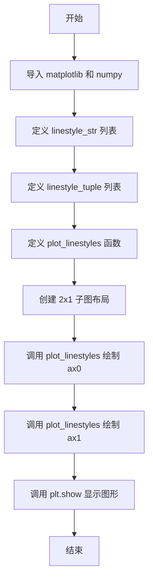
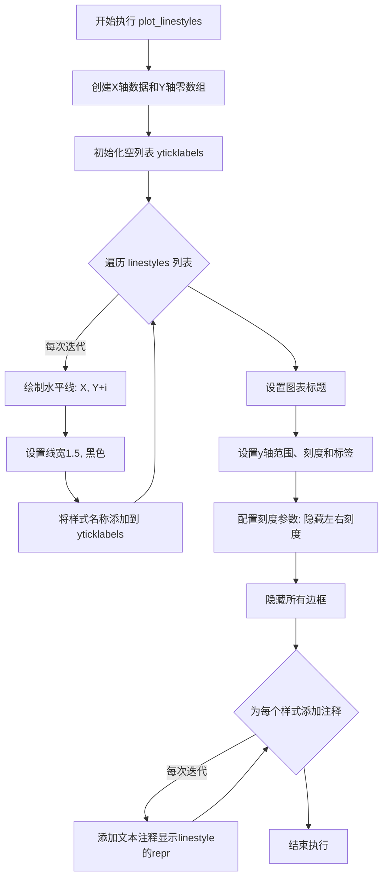

# `matplotlib\galleries\examples\lines_bars_and_markers\linestyles.py` 详细设计文档

这是一个 matplotlib 示例脚本，用于演示和可视化不同的线条样式（linestyles），包括命名样式（solid、dotted、dashed、dashdot）和参数化样式（自定义的 dash tuple 模式）。

## 整体流程



## 类结构

```
无类层次结构
该文件为简单的脚本文件，不包含类定义
仅包含全局变量和全局函数
```

## 全局变量及字段


### `linestyle_str`
    
命名线条样式列表，包含 solid、dotted、dashed、dashdot 四种样式

类型：`List[Tuple[str, str]]`
    


### `linestyle_tuple`
    
参数化线条样式列表，包含多种自定义 dash tuple 模式

类型：`List[Tuple[str, Tuple[int, ...]]]`
    


### `fig`
    
matplotlib 图形对象

类型：`matplotlib.figure.Figure`
    


### `ax0`
    
第一个子图的坐标轴对象

类型：`matplotlib.axes.Axes`
    


### `ax1`
    
第二个子图的坐标轴对象

类型：`matplotlib.axes.Axes`
    


### `X`
    
用于绘图的 X 轴数据数组

类型：`numpy.ndarray`
    


### `Y`
    
用于绘图的 Y 轴基准数组（全零）

类型：`numpy.ndarray`
    


### `yticklabels`
    
Y 轴刻度标签列表

类型：`list`
    


### `function.plot_linestyles`
    
绘制线条样式示例的函数，接受坐标轴对象、线条样式列表和标题作为参数

类型：`Callable[[Axes, List[Tuple[str, Any]], str], None]`
    
    

## 全局函数及方法


### plot_linestyles

该函数用于在给定的matplotlib axes上绘制多种线条样式的示例，通过循环遍历线条样式列表，在垂直方向上绘制多条水平线，每条线使用不同的线条样式，并添加对应的文本注释显示线条样式的元组表示，最后配置图表的标题、刻度轴和边框。

参数：

- `ax`：`matplotlib.axes.Axes`，matplotlib的axes对象，用于承载和渲染线条样式示例
- `linestyles`：`list[tuple[str, str | tuple]]`，线条样式列表，每个元素为(name, linestyle)的元组，其中name是样式名称，linestyle是线条样式（字符串或元组）
- `title`：`str`，图表的标题文字

返回值：`None`，该函数直接修改传入的ax对象，不返回任何值

#### 流程图



#### 带注释源码

```python
def plot_linestyles(ax, linestyles, title):
    """
    在指定的axes上绘制多种线条样式示例
    
    Parameters:
    -----------
    ax : matplotlib.axes.Axes
        matplotlib的axes对象，用于绘制图形
    linestyles : list of tuple
        线条样式列表，每个元素为(name, linestyle)元组
        name: 样式名称字符串
        linestyle: 线条样式，可以是字符串'solid'/'dotted'/'dashed'/'dashdot'
                   或元组(off, (on_off_seq))格式
    title : str
        图表标题
    """
    
    # 生成X轴数据: 从0到100的10个等间距点
    # 生成Y轴数据: 全部为零的数组，长度与X相同
    X, Y = np.linspace(0, 100, 10), np.zeros(10)
    
    # 用于存储y轴刻度标签的空列表
    yticklabels = []

    # 遍历每一种线条样式，在垂直方向上绘制水平线
    for i, (name, linestyle) in enumerate(linestyles):
        # 绘制线条: X为横坐标，Y+i为纵坐标（每条线垂直偏移i个单位）
        # linestyle参数指定线条样式，linewidth设置线宽为1.5
        # color设置线条颜色为黑色
        ax.plot(X, Y+i, linestyle=linestyle, linewidth=1.5, color='black')
        
        # 将当前线条样式名称添加到刻度标签列表
        yticklabels.append(name)

    # 设置图表标题
    ax.set_title(title)
    
    # 配置坐标轴:
    # ylim设置y轴显示范围，从-0.5到len(linestyles)-0.5
    # yticks设置y轴刻度位置为0到len(linestyles)-1
    # yticklabels设置每个刻度对应的标签文本
    ax.set(ylim=(-0.5, len(linestyles)-0.5),
           yticks=np.arange(len(linestyles)),
           yticklabels=yticklabels)
    
    # 配置刻度参数:
    # left=False 隐藏左侧刻度线
    # bottom=False 隐藏底部刻度线  
    # labelbottom=False 隐藏底部刻度标签
    ax.tick_params(left=False, bottom=False, labelbottom=False)
    
    # 隐藏所有边框(spines)
    # spines[:]表示所有4条边框(上、下、左、右)
    ax.spines[:].set_visible(False)

    # 遍历每种线条样式，添加文本注释显示linestyle的元组表示
    for i, (name, linestyle) in enumerate(linestyles):
        # 使用repr()将linestyle转换为可读字符串形式
        # xy设置参考点: (0.0, i)表示x轴最左端，y轴第i个位置
        # xycoords设置坐标系: ax.get_yaxis_transform()使x用axes坐标(0-1)，y用数据坐标
        # xytext设置文本偏移: 相对参考点向左6像素，向下12像素
        # textcoords设置偏移坐标系: 'offset points'表示像素单位
        # color设置文字颜色为蓝色，fontsize设为8，ha="right"右对齐
        # family="monospace"使用等宽字体显示
        ax.annotate(repr(linestyle),
                    xy=(0.0, i), xycoords=ax.get_yaxis_transform(),
                    xytext=(-6, -12), textcoords='offset points',
                    color="blue", fontsize=8, ha="right", family="monospace")
```

## 关键组件


### linestyle_str

预定义的字符串线型列表，包含四种基本线型：solid（实线）、dotted（点线）、dashed（虚线）和dashdot（点划线），每种线型都有对应的字符串别名。

### linestyle_tuple

预定义的元组线型列表，包含多种可配置的虚线模式，通过(offset, (on_off_seq))元组形式定义，支持精细控制线段和空白的长度组合。

### plot_linestyles 函数

用于绘制线型示例图表的核心函数，接收Axes对象、线型数据和标题作为参数，在图表中绘制多条水平线并添加对应的线型注解。

### 主程序逻辑

创建包含两个子图的图表，分别展示字符串线型和元组线型，调用plot_linestyles函数分别绘制named和parametrized两类线型示例。

### matplotlib.pyplot 依赖

使用matplotlib库进行绑图，包括plt.subplots创建画布、ax.plot绑制线条、ax.annotate添加注解等操作。

### numpy 依赖

使用numpy的linspace生成X轴数据点，使用arange生成Y轴刻度。


## 问题及建议


### 已知问题

- 缺少类型注解（Type Hints），函数参数和返回值没有类型标注，降低了代码的可读性和可维护性
- 存在硬编码值（如颜色'black'、'blue'、字体大小8、偏移量-6,-12等），不易于配置和复用
- `plot_linestyles`函数缺少文档字符串（Docstring），无法快速理解函数用途和参数含义
- 代码中存在魔法数字（Magic Numbers），如`0.0`、`-0.5`等，缺乏解释性命名
- 对`linestyles`参数缺少输入验证，如果传入空列表或格式错误的数据可能导致异常
- 全局数据`linestyle_str`和`linestyle_tuple`与业务逻辑混在一起，缺乏模块化组织
- 重复迭代：函数内部对`linestyles`进行了两次遍历（一次plot，一次annotation），可以合并优化

### 优化建议

- 为`plot_linestyles`函数添加类型注解和详细的文档字符串，说明参数和返回值含义
- 将硬编码的配置值提取为常量或配置参数，提高函数的可配置性
- 使用Enum或dataclass封装linestyle配置数据，增强类型安全性和可读性
- 添加输入参数校验逻辑，处理空列表、None等边界情况
- 将数据定义部分封装为独立模块或类，实现关注点分离
- 合并两次遍历为一次，使用enumerate的结果同时进行plot和annotation操作
- 考虑将通用的绘图逻辑抽取为可复用的工具函数


## 其它


### 设计目标与约束

本代码旨在展示matplotlib中可用的各种线型（linestyles），包括预定义的字符串线型（solid、dotted、dashed、dashdot）和通过元组参数自定义的线型。设计约束包括：必须依赖matplotlib和numpy库；线型元组必须遵循(offset, (on_off_seq))格式；绘图区域使用固定布局且不支持动态调整。

### 错误处理与异常设计

代码未实现显式的错误处理机制。潜在异常包括：linestyles参数类型不匹配时plt.plot()会抛出TypeError；数组维度不一致时可能引发ValueError；matplotlib后端缺失时可能导致show()失败。建议添加参数类型检查和异常捕获逻辑。

### 数据流与状态机

数据流：linestyle_str/linestyle_tuple定义 → plot_linestyles()接收参数 → 遍历生成plot()和annotate()调用 → 最终渲染到Figure。无复杂状态机，仅有matplotlib Figure/Axes对象的状态转换（创建→配置→渲染→显示）。

### 外部依赖与接口契约

依赖库：matplotlib>=3.5.0、numpy>=1.20.0。核心接口：plot_linestyles(ax, linestyles, title)函数，接收Axes对象、线型列表((name, style)元组)、标题字符串，返回None。linestyles参数必须为list[tuple[str, str|tuple]]类型。

### 性能考虑

当前实现性能可接受。潜在优化点：np.linspace(0, 100, 10)生成的数组可复用；循环中的plot()调用可合并为单次多线绘制；yticklabels列表构建可用列表推导式优化。

### 安全性考虑

代码为纯展示型，无用户输入处理，无安全风险。但annotate()中使用repr()输出线型值需注意特殊字符转义。

### 可维护性与扩展性

代码结构清晰但扩展性有限。若需添加新线型需修改全局列表；plot_linestyles()函数可提取为独立模块以提高复用性。建议将linestyle_str和linestyle_tuple移至配置模块，支持从rc参数动态加载。

### 测试考量

建议添加单元测试：验证plot_linestyles()对不同输入的处理；测试空linestyles列表的边界情况；验证返回值的稳定性。可使用pytest-mock模拟Axes对象进行无GUI测试。

### 配置与参数说明

plot_linestyles参数：ax(Axes对象，必需)，linestyles(list，必需)，title(str，必需)。全局常量linestyle_str和linestyle_tuple为预定义线型库。plt.show()后Figure对象由matplotlib后端管理。

### 使用示例与用例

主要用例：学习matplotlib线型配置；在文档/教程中作为参考示例；作为Line2D.set_linestyle()的API演示。示例代码展示了两种调用方式：通过字符串名称和通过参数化元组。

### 版本兼容性

代码使用Python 3类型标注语法（list[tuple[str, str|tuple]]）需Python 3.9+；layout='constrained'参数需要matplotlib 3.6+；np.arange()在numpy 1.4+稳定。

### 文档与注释规范

代码遵循Google风格docstring，模块级docstring详细说明了线型格式和rc参数参考。每个函数包含docstring说明参数和返回值。注释使用#格式，包含关键实现说明（如offset和on_off_seq的含义）。


    