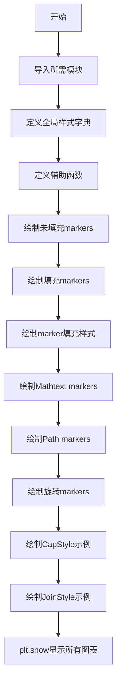
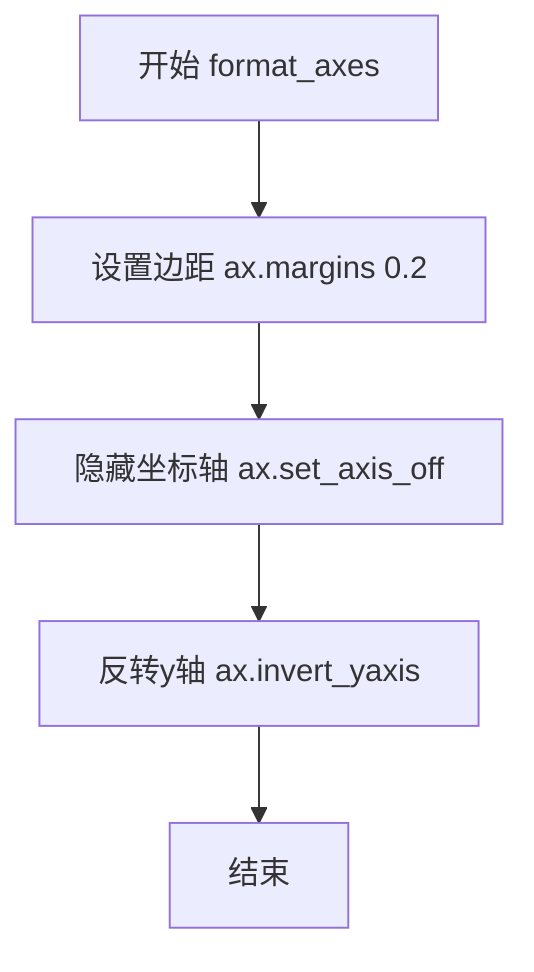

# `matplotlib\galleries\examples\lines_bars_and_markers\marker_reference.py` 详细设计文档

该文件是Matplotlib官方示例脚本，演示了不同类型的marker（标记）的使用方法，包括未填充marker、填充marker、TeX符号marker、路径marker，以及通过变换、CapStyle和JoinStyle进行的高级marker定制。

## 整体流程



## 类结构

```
该脚本为扁平结构，无类定义
主要包含全局变量、辅助函数和绘图逻辑
```

## 全局变量及字段


### `text_style`
    
A dictionary containing text formatting properties including horizontal alignment, vertical alignment, font size, and font family for axis text labels.

类型：`dict`
    


### `marker_style`
    
A dictionary containing marker styling properties including line style, color, markersize, markerfacecolor, and markeredgecolor for plot markers.

类型：`dict`
    


### `filled_marker_style`
    
A dictionary containing filled marker styling properties including marker type 'o', line style, size, primary and alternate face colors, and edge color.

类型：`dict`
    


### `marker_inner`
    
A dictionary containing inner marker styling properties with larger markersize (35), blue face colors, brown edge color, and thick edge width (8) for cap/join style demonstration.

类型：`dict`
    


### `marker_outer`
    
A dictionary containing outer marker styling properties with larger markersize (35), blue face colors, white edge color, and thin edge width (1) for cap/join style demonstration.

类型：`dict`
    


### `unfilled_markers`
    
A list of unfilled marker symbols filtered from Line2D.markers, excluding 'nothing' markers and filled markers.

类型：`list`
    


### `angles`
    
A list of rotation angles in degrees [0, 10, 20, 30, 45, 60, 90] used for demonstrating rotated marker transformations.

类型：`list`
    


### `star`
    
A Path object representing a unit regular star with 6 points, created using mpath.Path.unit_regular_star(6).

类型：`matplotlib.path.Path`
    


### `circle`
    
A Path object representing a unit circle, created using mpath.Path.unit_circle().

类型：`matplotlib.path.Path`
    


### `cut_star`
    
A Path object representing a composite shape combining circle vertices with reversed star vertices to create a circle with cut-out star pattern.

类型：`matplotlib.path.Path`
    


### `markers`
    
A dictionary mapping marker names ('star', 'circle', 'cut_star') to their corresponding Path objects for path marker demonstration.

类型：`dict`
    


### `common_style`
    
A dictionary containing marker style properties copied from filled_marker_style excluding the 'marker' key, used for rotated marker demonstrations.

类型：`dict`
    


    

## 全局函数及方法


### `format_axes`

该函数用于格式化matplotlib坐标轴的外观，设置边距、隐藏坐标轴并反转y轴方向，以便更好地展示标记图形。

参数：

- `ax`：`matplotlib.axes.Axes`，matplotlib的坐标轴对象，用于设置坐标轴的显示样式

返回值：`None`，该函数直接修改传入的坐标轴对象，不返回任何值

#### 流程图



#### 带注释源码

```python
def format_axes(ax):
    """
    格式化matplotlib坐标轴的显示样式
    
    参数:
        ax: matplotlib.axes.Axes对象
    """
    ax.margins(0.2)      # 设置坐标轴边距为0.2（20%）
    ax.set_axis_off()   # 隐藏坐标轴（不显示刻度、标签等）
    ax.invert_yaxis()   # 反转y轴方向（使第一个元素显示在顶部）
```


### `split_list`

该函数用于将输入的列表从中间位置分割成两个子列表，返回一个包含前半部分和后半部分的元组。

参数：

- `a_list`：`list`，需要进行分割的输入列表

返回值：`tuple[list, list]`，返回两个子列表组成的元组，第一个元素为列表的前半部分，第二个元素为列表的后半部分

#### 流程图

```mermaid
flowchart TD
    A[开始] --> B[计算列表长度<br/>len_a_list = len(a_list)]
    B --> C[计算中点索引<br/>i_half = len_a_list // 2]
    C --> D[返回前半部分和后半部分<br/>return a_list[:i_half], a_list[i_half:]]
    D --> E[结束]
    
    style A fill:#f9f,stroke:#333
    style E fill:#9f9,stroke:#333
```

#### 带注释源码

```python
def split_list(a_list):
    """
    将输入列表从中间分割成两个子列表。
    
    参数:
        a_list: 待分割的列表对象
        
    返回:
        包含两个子列表的元组 (前半部分, 后半部分)
    """
    # 计算列表长度的一半（整数除法）
    i_half = len(a_list) // 2
    
    # 使用切片操作返回前半部分和后半部分
    # 前半部分: a_list[0:i_half]
    # 后半部分: a_list[i_half:末尾]
    return a_list[:i_half], a_list[i_half:]
```

## 关键组件


### MarkerStyle类

用于定义标记样式的核心类，支持多种标记类型、变换、填充样式、端点样式和连接样式的配置。

### Line2D.filled_markers

包含所有填充标记类型的列表，用于区分填充标记和非填充标记。

### Line2D.fillStyles

定义标记的填充样式，包括'full'、'left'、'right'、'bottom'、'top'等，用于控制标记的部分填充行为。

### Affine2D变换

用于对标记进行旋转、缩放、平移等几何变换，实现标记的方向调整。

### CapStyle和JoinStyle

CapStyle控制标记端点的形状（butt、round、projecting），JoinStyle控制线条连接处的样式（miter、round、bevel）。

### Path路径标记

通过matplotlib.path.Path创建自定义形状作为标记，支持顶点(codes)和样式的复杂定义。

### Mathtext数学文本标记

使用LaTeX数学符号作为标记，通过$符号包裹实现数学表达式的渲染。

### 标记填充颜色机制

通过markerfacecolor和markerfacecoloralt分别设置主填充色和替代填充色，配合fillstyle实现半填充效果。

### 标记边缘样式

通过markeredgecolor和markeredgewidth分别控制标记边缘的颜色和宽度，实现标记的轮廓效果。


## 问题及建议


### 已知问题

-   **代码重复**：多处存在相似的绘图逻辑（如创建子图、设置格式、循环遍历数据绘图），违反了DRY原则
-   **全局状态管理混乱**：`text_style`、`marker_style`等全局字典在多处被直接修改（如`marker_style.update()`），导致状态不可预测
-   **魔法数字和硬编码**：angles列表、markersize数值、坐标偏移量等直接硬编码在代码中，缺乏常量定义
-   **导入管理不当**：`numpy`被导入但仅在部分示例中使用，`matplotlib.path`和`matplotlib.markers`的导入也较晚，应在文件头部统一导入
-   **缺乏错误处理**：代码假设`Line2D.markers`和`Line2D.filled_markers`等属性总是存在且格式正确，未做防御性检查
-   **函数职责不单一**：`format_axes`函数被多次调用，但其功能较简单，可考虑内联或合并到其他函数中

### 优化建议

-   **提取公共逻辑**：将重复的绘图逻辑封装为辅助函数，如`plot_marker_row()`、`create_marker_figure()`等
-   **配置集中管理**：使用`dataclass`或配置类集中管理`text_style`、`marker_style`等配置，避免全局状态被意外修改
-   **定义常量**：将`angles = [0, 10, 20, 30, 45, 60, 90]`等数值提取为模块级常量
-   **优化导入结构**：在文件头部统一导入所有需要的模块，使用`from ... import ...`减少命名空间污染
-   **添加类型提示和文档**：为函数添加参数和返回值的类型提示，增强代码可维护性
-   **考虑面向对象重构**：可以将整个演示程序封装为一个`MarkerDemo`类，按类别组织不同的marker展示方法
-   **添加错误处理**：对`Line2D.markers.items()`的遍历添加保护逻辑，处理可能的边界情况


## 其它


### 设计目标与约束

本代码是一个演示性质的matplotlib示例脚本，主要目标是可视化展示matplotlib中各种marker类型的使用方式，包括未填充标记、填充标记、TeX符号标记、路径标记、以及通过transform进行的标记变换。设计约束包括：依赖于matplotlib库的最新API、需要在图形界面支持下运行、生成的图表需要清晰的视觉呈现效果。

### 错误处理与异常设计

代码主要依赖matplotlib的内部错误处理机制。由于是演示脚本，未实现显式的异常捕获逻辑。潜在错误包括：导入模块失败（matplotlib未安装）、图形后端不可用（无显示设备）、不支持的marker类型参数。在实际应用中应添加try-except块捕获ImportError、RuntimeError等异常，并提供友好的错误提示信息。

### 数据流与状态机

代码执行流程分为六个独立阶段：初始化阶段（导入依赖、定义样式字典）→ 未填充标记展示阶段 → 填充标记展示阶段 → 填充样式展示阶段 → TeX标记展示阶段 → 路径标记展示阶段 → 高级变换展示阶段 → CapStyle和JoinStyle展示阶段。各阶段通过plt.subplots()创建新的图形窗口，通过ax.plot()方法绑定marker参数到数据点上，最终通过plt.show()渲染所有图形。

### 外部依赖与接口契约

核心依赖包括：matplotlib.pyplot（图形绘制）、matplotlib.lines.Line2D（标记属性访问）、matplotlib.markers.MarkerStyle（标记样式类）、matplotlib.transforms.Affine2D（仿射变换）、matplotlib.path.Path（路径对象）、numpy（数值计算）。接口契约规定：format_axes()函数接收Axes对象并配置坐标轴外观；split_list()函数接收列表返回两个子列表；所有绘图函数通过marker参数接收标记规范，fillstyle参数控制填充方式。

### 性能考虑

代码性能开销主要集中在图形渲染阶段，marker数量和变换角度的组合决定了渲染工作量。当前实现中角度列表长度为7，CapStyle和JoinStyle各3种，总计产生21个标记实例。优化建议包括：对于静态展示场景可预先渲染到缓冲区；对于大量marker场景考虑使用PathCollection批量绘制；避免在循环中重复创建相同的MarkerStyle对象。

### 安全性考虑

代码不涉及用户输入处理、网络数据传输或文件操作，因此安全风险较低。潜在风险包括：使用eval()或exec()动态执行代码（本代码未使用）；处理TeX字符串时的注入风险（matplotlib已做防护）。建议在接收外部marker定义时进行白名单验证，避免直接使用用户提供的字符串作为marker参数。

### 测试策略

由于是演示代码，未包含单元测试。测试策略应包括：验证各marker类型能正确渲染、验证transform变换效果符合预期、验证fillstyle参数正确应用、验证不同后端的兼容性。建议使用pytest框架编写测试用例，使用matplotlib.testing模块进行图像比对验证。

### 版本兼容性

代码使用Line2D.markers.items()和Line2D.filled_markers属性，这些API在matplotlib 3.4+版本中稳定。MarkerStyle的构造函数参数（marker symbol, fillstyle, transform）在matplotlib 3.0+版本中支持。CapStyle和JoinStyle的枚举访问在matplotlib 3.0+版本中可用。最低兼容版本建议为matplotlib 3.4。

### 部署配置

代码作为独立脚本运行，无需特殊部署配置。运行时环境要求：Python 3.6+、matplotlib 3.4+、numpy 1.16+。图形输出需要配置合适的matplotlib后端（默认自动选择），无图形界面环境可使用Agg后端（matplotlib.use('Agg')）进行非交互式渲染。部署时可通过python脚本方式或Jupyter notebook中运行。

### 代码规范与注释

代码遵循PEP 8命名规范，使用下划线命名法。文档字符串采用Google风格。模块级常量（text_style、marker_style）使用字典字面量定义，便于配置修改。注释规范包括：章节标题使用# %%-分隔的RST格式注释；代码块间使用# %%标记分割线；行内注释解释关键参数含义。改进建议：添加模块级docstring说明脚本用途、为format_axes和split_list函数添加文档字符串。

### 可扩展性设计

代码采用模块化函数设计（format_axes、split_list），便于复用和扩展。可扩展方向包括：添加新的marker类别展示函数、增加更多transform变体（如缩放、平移）、支持动画效果展示marker动态变化、添加交互式控件选择marker类型。建议将样式配置提取为独立配置文件（JSON/YAML），实现展示参数的动态调整。

    