# `matplotlib\galleries\examples\lines_bars_and_markers\markevery_demo.py` 详细设计文档

这是一个matplotlib演示脚本，展示了Line2D的markevery属性在不同场景下的用法，包括线性尺度、对数尺度、缩放视图和极坐标图四种情况，用于控制数据点上标记的绘制密度和分布方式。

## 整体流程

```mermaid
graph TD
    A[开始] --> B[定义markevery参数列表cases]
    B --> C[生成数据点x, y = sin(x) + 1.0 + delta]
    C --> D[创建3x3子图布局-线性尺度]
    D --> E[遍历cases绘制标记图]
    E --> F[创建3x3子图布局-对数尺度]
    F --> G[遍历cases绘制标记图并设置log scale]
    G --> H[创建3x3子图布局-缩放视图]
    H --> I[遍历cases绘制标记图并设置xlim, ylim]
    I --> J[创建3x3子图布局-极坐标图]
    J --> K[遍历cases绘制极坐标标记图]
    K --> L[plt.show显示所有图形]
```

## 类结构

```
无自定义类 - 脚本式代码
主要使用matplotlib.pyplot和numpy
├── matplotlib.pyplot (绘图库)
│   ├── plt.subplots (创建子图)
ax.plot (绘制线条和标记)
ax.set_title (设置标题)
ax.set_xscale/yscale (设置坐标轴尺度)
ax.set_xlim/ylim (设置坐标轴范围)
└── numpy (数值计算)
    ├── np.linspace (生成线性空间)
    └── np.sin (正弦函数)
```

## 全局变量及字段


### `cases`
    
markevery参数的各种配置方式列表

类型：`list`
    


### `delta`
    
数据偏移量(0.11)

类型：`float`
    


### `x`
    
线性空间数据点数组

类型：`ndarray`
    


### `y`
    
正弦函数计算结果数组

类型：`ndarray`
    


### `r`
    
极坐标径向距离数组

类型：`ndarray`
    


### `theta`
    
极坐标角度数组

类型：`ndarray`
    


    

## 全局函数及方法


# 详细设计文档

## 一段话描述

该代码是一个 matplotlib 演示脚本，通过创建四个不同的图表场景（线性坐标、对数坐标、缩放视图、极坐标），展示 `Line2D` 的 `markevery` 属性如何控制线图中数据点的标记显示，支持整数、浮点数、元组、列表和切片等多种参数形式。

## 文件的整体运行流程

```
┌─────────────────────────────────────────────┐
│  1. 定义 markevery 测试用例列表 (cases)     │
└─────────────────┬───────────────────────────┘
                  ▼
┌─────────────────────────────────────────────┐
│  2. 生成测试数据 (x, y)                     │
│     - 使用 numpy 生成正弦波数据              │
└─────────────────┬───────────────────────────┘
                  ▼
┌─────────────────────────────────────────────┐
│  3. 创建第一个图表 - 线性刻度                │
│     - 3x3 子图，每个子图使用不同 markevery  │
└─────────────────┬───────────────────────────┘
                  ▼
┌─────────────────────────────────────────────┐
│  4. 创建第二个图表 - 对数刻度                │
│     - 设置 xscale='log', yscale='log'       │
└─────────────────┬───────────────────────────┘
                  ▼
┌─────────────────────────────────────────────┐
│  5. 创建第三个图表 - 缩放视图                │
│     - 限制 xlim 和 ylim 来展示缩放效果      │
└─────────────────┬───────────────────────────┘
                  ▼
┌─────────────────────────────────────────────┐
│  6. 创建第四个图表 - 极坐标                  │
│     - 使用 projection='polar'               │
└─────────────────┬───────────────────────────┘
                  ▼
┌─────────────────────────────────────────────┐
│  7. 调用 plt.show() 显示所有图表            │
└─────────────────────────────────────────────┘
```

## 全局变量详细信息

| 变量名 | 类型 | 描述 |
|--------|------|------|
| `cases` | `list` | 存储不同类型的 markevery 参数值，用于演示各种标记策略 |
| `delta` | `float` | 时间增量，用于调整数据点位置和正弦波的偏移量 |
| `x` | `numpy.ndarray` | 200 个 x 坐标数据点，从 delta 到 10-delta 范围内均匀分布 |
| `y` | `numpy.ndarray` | 对应的 y 坐标值，由 sin(x) + 1.0 + delta 计算得到 |

## 关键组件信息

| 组件名称 | 一句话描述 |
|----------|------------|
| `markevery` 参数 | 控制线图中标记点的显示策略，可为整数、浮点数、元组、列表或切片 |
| `plt.subplots()` | 创建多子图布局的 Figure 和 Axes 对象 |
| `ax.plot()` | 绘制带标记的线条图，传入 markevery 参数控制标记显示 |
| `ax.set_xscale()` / `ax.set_yscale()` | 设置坐标轴刻度类型（linear、log、polar 等） |
| `ax.set_xlim()` / `ax.set_ylim()` | 设置坐标轴显示范围，用于演示缩放效果 |

## 潜在的技术债务或优化空间

1. **代码重复**：四个图表的绘制逻辑高度相似，存在大量重复代码，可以使用函数封装来减少冗余
2. **硬编码参数**：子图数量 (3, 3)、图表尺寸 (10, 6) 等参数硬编码，缺乏配置灵活性
3. **缺少错误处理**：没有对无效的 markevery 参数值进行验证
4. **魔法数字**：数据生成中的数值（如 10, 200, 3.0）缺乏明确语义，应使用命名常量

## 其它项目

### 设计目标与约束

- **目标**：直观展示 matplotlib 中 `markevery` 属性的各种用法和效果
- **约束**：使用 matplotlib 和 numpy 两个标准库，不依赖其他外部库

### 错误处理与异常设计

- 代码依赖 matplotlib 和 numpy 的默认错误处理机制
- 无自定义异常处理逻辑

### 数据流与状态机

- 数据流：静态定义 `cases` → 生成 `(x, y)` 数据 → 遍历 `cases` 绘制图表
- 无复杂状态机设计

### 外部依赖与接口契约

- `matplotlib.pyplot`：用于创建图表和显示
- `numpy`：用于生成数值数据和数学计算
- 两者均为 Python 科学计算的标准库

---

### 纯脚本代码说明

本代码为**纯脚本代码**，没有定义任何自定义函数或类。所有逻辑均通过顶层语句顺序执行。如需提取具体函数或方法的详细信息，请提供具体的函数名称。


### `numpy.linspace`

生成指定范围内的等间距数字序列

参数：

- `start`：`array_like`，序列的起始值
- `stop`：`array_like`，序列的结束值（包含）
- `num`：`int`，生成的样本数量，默认为50
- `endpoint`：`bool`，如果为True，则stop是最后一个样本，否则不包含
- `retstep`：`bool`，如果为True，则返回(step,)
- `dtype`：`dtype`，输出数组的类型

返回值：`ndarray`，num个等间距的样本

#### 流程图

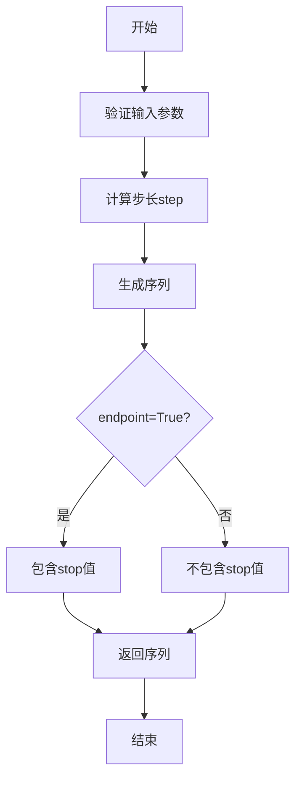

#### 带注释源码

```
def linspace(start, stop, num=50, endpoint=True, retstep=False, dtype=None):
    """
    生成等间距的数值序列
    
    参数:
        start: 序列起始值
        stop: 序列结束值
        num: 样本数量
        endpoint: 是否包含结束值
        retstep: 是否返回步长
        dtype: 数据类型
    """
    num = int(num)
    if num <= 0:
        return np.empty(0, dtype=dtype)
    
    step = (stop - start) / (num - 1 if endpoint else num)
    if endpoint:
        stop = start + step * (num - 1)
    
    return np.arange(num, dtype=dtype) * step + start
```

---

### `numpy.sin`

计算数组元素的正弦值

参数：

- `x`：`array_like`，输入数组（弧度）

返回值：`ndarray`，x的正弦值

#### 流程图

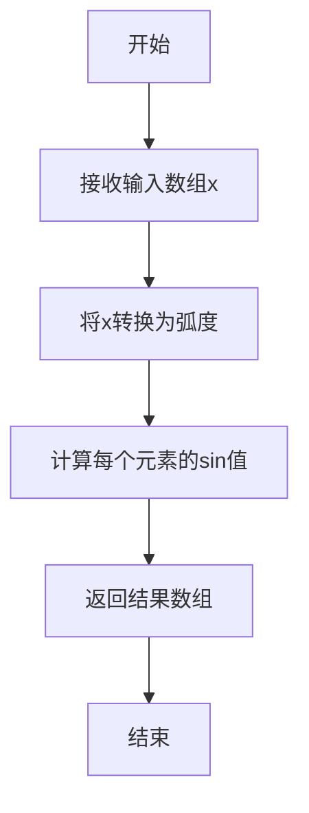

#### 带注释源码

```
def sin(x, out=None, where=True, casting='same_kind', order='K', dtype=None, subok=True):
    """
    正弦函数
    
    参数:
        x: 输入角度（弧度）
        out: 输出数组
        where: 计算条件
        casting: 类型转换模式
        order: 内存布局
        dtype: 数据类型
        subok: 是否允许子类
    """
    return _ufuncs_impl.sin(x, out, where, casting, order, dtype, subok)
```

---

### `numpy.pi`

圆周率常量

参数：无需参数

返回值：`float`，圆周率值（约3.141592653589793）

#### 流程图

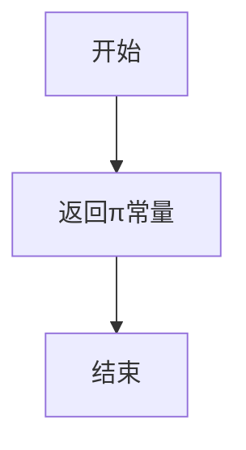

#### 带注释源码

```
# numpy.pi 是一个预定义的数学常量
pi = 3.141592653589793  # 圆周率π的近似值
```

---

### `matplotlib.pyplot.subplots`

创建一个图形和一组子图

参数：

- `nrows`：`int`，子图行数，默认为1
- `ncols`：`int`，子图列数，默认为1
- `sharex`：`bool`，是否共享x轴
- `sharey`：`bool`，是否共享y轴
- `squeeze`：`bool`，是否压缩返回值
- `width_ratios`：`array_like`，宽度比例
- `height_ratios`：`array_like`，高度比例
- `subplot_kw`：`dict`，传递给add_subplot的关键字参数
- `gridspec_kw`：`dict`，传递给GridSpec的关键字参数
- `fig_kw`：`dict`，传递给figure的关键字参数

返回值：`tuple`，(fig, ax)或(fig, ax[])

#### 流程图

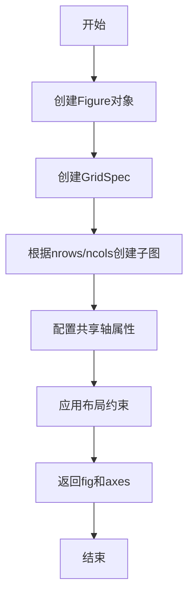

#### 带注释源码

```
def subplots(nrows=1, ncols=1, sharex=False, sharey=False, squeeze=True,
             width_ratios=None, height_ratios=None,
             subplot_kw=None, gridspec_kw=None, fig_kw=None):
    """
    创建图形和子图
    
    参数:
        nrows: 子图行数
        ncols: 子图列数
        sharex: 共享x轴
        sharey: 共享y轴
        squeeze: 压缩返回的axes数组
        width_ratios: 列宽比例
        height_r行高比例
        subplot_kw: 子图关键字参数
        gridspec_kw: 网格规范关键字参数
        fig_kw: 图形关键字参数
    
    返回:
        fig: Figure对象
        ax: Axes对象或Axes数组
    """
    fig = plt.figure(**fig_kw)
    gs = GridSpec(nrows, ncols, width_ratios, height_ratios, **gridspec_kw)
    
    for i in range(nrows):
        for j in range(ncols):
            ax = fig.add_subplot(gs[i, j], **subplot_kw)
            # 配置共享轴
            if sharex and i > 0:
                ax.sharex(fig.axes[0])
            if sharey and j > 0:
                ax.sharey(fig.axes[0])
    
    return fig, axes
```

---

### `matplotlib.pyplot.show`

显示所有打开的图形

参数：无

返回值：`None`

#### 流程图

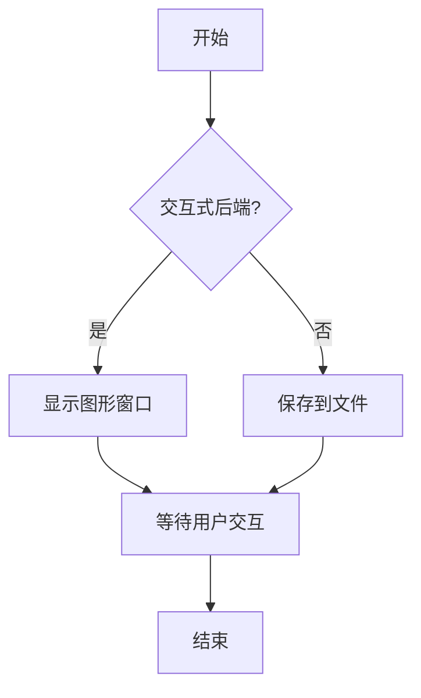

#### 带注释源码

```
def show(*args, **kwargs):
    """
    显示所有打开的图形
    
    参数:
        *args: 传递给show的后端特定参数
        **kwargs: 关键字参数
    
    返回:
        None
    """
    # 获取当前后端并调用其show方法
    backend = _get_backend()
    backend.show()
```

---

### `Axes.set_title`

设置子图的标题

参数：

- `label`：`str`，标题文本
- `fontdict`：`dict`，文本属性字典
- `loc`：`str`，对齐方式('center', 'left', 'right')
- `pad`：`float`，标题与轴顶部的距离
- `y`：`float`，标题的y位置
- `**kwargs`：传递给Text的属性

返回值：`Text`，创建的文本对象

#### 流程图

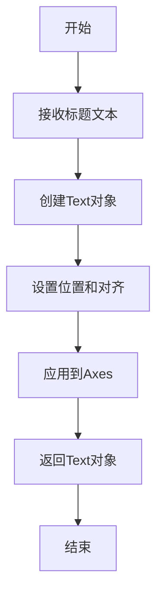

#### 带注释源码

```
def set_title(self, label, fontdict=None, loc='center', pad=None, y=None, **kwargs):
    """
    设置子图标题
    
    参数:
        label: 标题文本
        fontdict: 字体属性字典
        loc: 对齐位置
        pad: 与轴的间距
        y: 垂直位置
        **kwargs: 传递给Text的属性
    
    返回:
        Text: 标题文本对象
    """
    title = Text(x=0.5, y=1.0, text=label)
    # 应用字体属性
    if fontdict:
        title.update(fontdict)
    # 设置位置和对齐
    title.set_ha(loc)
    if pad:
        title.set_pad(pad)
    # 添加到axes
    self.texts.append(title)
    return title
```

---

### `Axes.plot`

在Axes上绘制线条或标记

参数：

- `*args`：`variable arguments`，x, y数据对
- `fmt`：`str`，格式字符串（如'o-'）
- `data`：`dict`，可选的数据容器
- `**kwargs`：`Line2D`属性

返回值：`list`，Line2D对象列表

#### 流程图

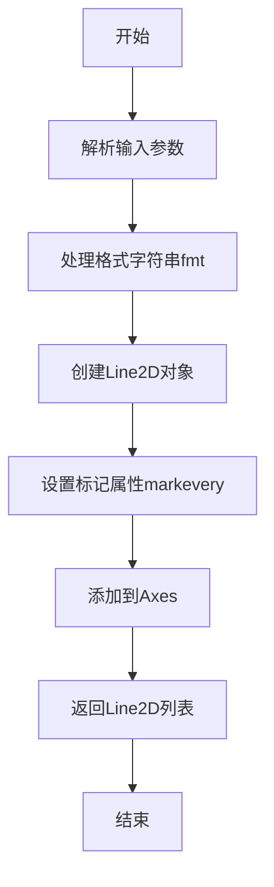

#### 带注释源码

```
def plot(self, *args, fmt=None, data=None, **kwargs):
    """
    绘制线条和标记
    
    参数:
        *args: (x, y)数据对或单一y数组
        fmt: 格式字符串 'markerline_style'
        data: 数据容器
        **kwargs: Line2D属性
            - markevery: 标记显示频率
            - ls / linestyle: 线条样式
            - marker: 标记样式
            - ms / markersize: 标记大小
            - color: 颜色
    
    返回:
        list: Line2D对象列表
    """
    # 解析数据
    if fmt is None:
        lines = []
        for xy in args:
            if len(xy) == 2:
                x, y = xy
                line = Line2D(x, y, **kwargs)
            else:
                line = Line2D(range(len(xy)), xy, **kwargs)
            lines.append(line)
    else:
        # 解析格式字符串
        line = self._parse_fmt(fmt, data, **kwargs)
        lines = [line]
    
    # 应用markevery属性
    markevery = kwargs.get('markevery', None)
    if markevery is not None:
        line.set_markevery(markevery)
    
    # 添加到axes
    self.lines.extend(lines)
    self.autoscale_view()
    return lines
```

---

### `Axes.set_xscale`

设置x轴的刻度类型

参数：

- `scale`：`str`，刻度类型('linear', 'log', 'symlog', 'logit'等)

返回值：`None`

#### 流程图

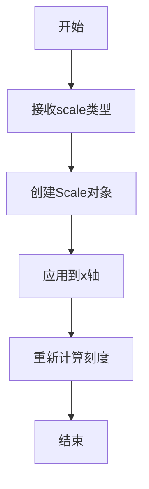

#### 带注释源码

```
def set_xscale(self, scale):
    """
    设置x轴刻度类型
    
    参数:
        scale: 刻度类型
            - 'linear': 线性刻度
            - 'log': 对数刻度
            - 'symlog': 对称对数刻度
            - 'logit': logistic刻度
    
    返回:
        None
    """
    self._xscale = scale
    # 创建对应的Scale对象
    scale_class = scale_registry.get(scale)
    self.xaxis.set_scale(scale_class(self))
    # 重新计算限制和刻度
    self.autoscale_view()
```

---

### `Axes.set_yscale`

设置y轴的刻度类型

参数：

- `scale`：`str`，刻度类型('linear', 'log', 'symlog', 'logit'等)

返回值：`None`

#### 流程图


#### 带注释源码

```
def set_yscale(self, scale):
    """
    设置y轴刻度类型
    
    参数:
        scale: 刻度类型
            - 'linear': 线性刻度
            - 'log': 对数刻度
            - 'symlog': 对称对数刻度
            - 'logit': logistic刻度
    
    返回:
        None
    """
    self._yscale = scale
    scale_class = scale_registry.get(scale)
    self.yaxis.set_scale(scale_class(self))
    self.autoscale_view()
```

---

### `Axes.set_xlim`

设置x轴的显示范围

参数：

- `left`：`float`，左边界
- `right`：`float`，右边界
- `emit`：`bool`，是否通知观察者变化
- `auto`：`bool`，是否自动调整
- `xmin`：`float`，已废弃
- `xmax`：`float`，已废弃

返回值：`tuple`，(left, right)

#### 流程图

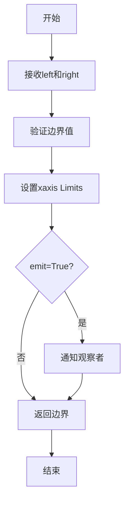

#### 带注释源码

```
def set_xlim(self, left=None, right=None, emit=True, auto=False, xmin=None, xmax=None):
    """
    设置x轴范围
    
    参数:
        left: x轴最小值
        right: x轴最大值
        emit: 是否发送变化通知
        auto: 是否自动调整边界
        xmin: 已废弃
        xmax: 已废弃
    
    返回:
        tuple: (left, right)
    """
    if left is not None and right is not None:
        if left >= right:
            raise ValueError("left must be less than right")
    self._xlim = (left, right)
    self.xaxis._set_lim(*self._xlim)
    if emit:
        self._send_xlim_change()
    return self._xlim
```

---

### `Axes.set_ylim`

设置y轴的显示范围

参数：

- `bottom`：`float`，下边界
- `top`：`float`，上边界
- `emit`：`bool`，是否通知观察者变化
- `auto`：`bool`，是否自动调整
- `ymin`：`float`，已废弃
- `ymax`：`float`，已废弃

返回值：`tuple`，(bottom, top)

#### 流程图

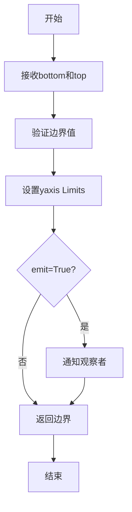

#### 带注释源码

```
def set_ylim(self, bottom=None, top=None, emit=True, auto=False, ymin=None, ymax=None):
    """
    设置y轴范围
    
    参数:
        bottom: y轴最小值
        top: y轴最大值
        emit: 是否发送变化通知
        auto: 是否自动调整边界
        ymin: 已废弃
        ymax: 已废弃
    
    返回:
        tuple: (bottom, top)
    """
    if bottom is not None and top is not None:
        if bottom >= top:
            raise ValueError("bottom must be less than top")
    self._ylim = (bottom, top)
    self.yaxis._set_lim(*self._ylim)
    if emit:
        self._send_ylim_change()
    return self._ylim
```

---

### `Line2D.set_markevery`

设置标记的显示频率

参数：

- `markevery`：`int/tuple/list/slice/float`，标记显示方式

返回值：`None`

#### 流程图

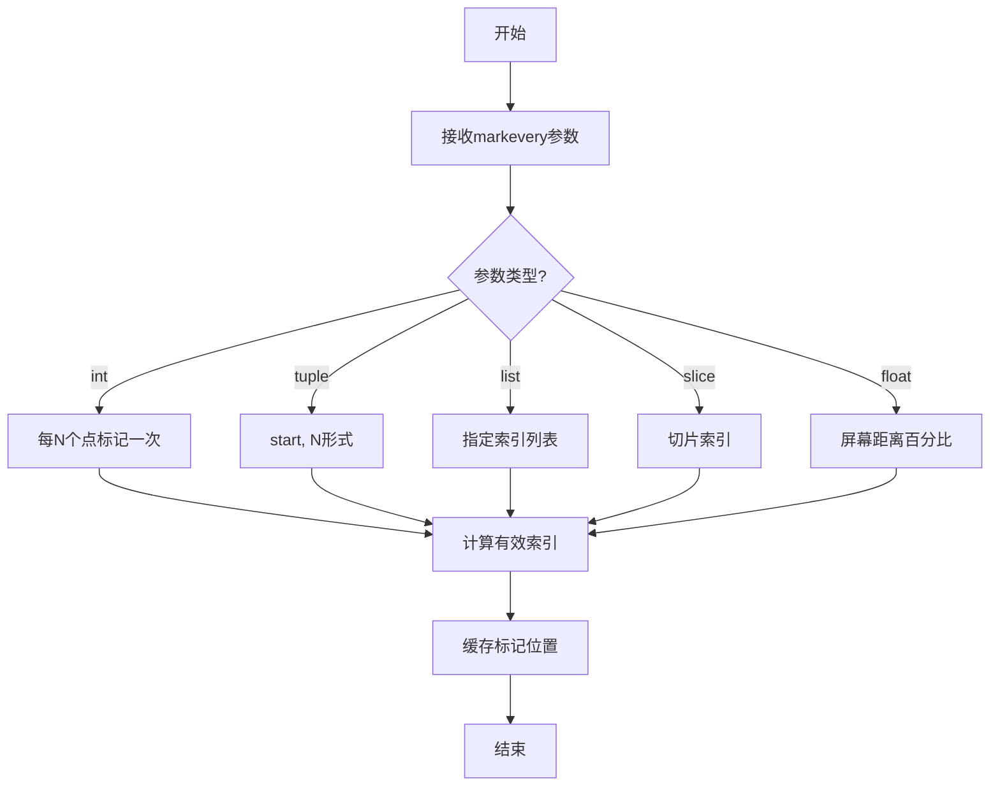

#### 带注释源码

```
def set_markevery(self, markevery):
    """
    设置标记显示频率
    
    参数:
        markevery: 标记位置指定方式
            - None: 所有点
            - int N: 每N个点
            - tuple (start, N): 从start开始每N个点
            - list [i, j, k]: 指定索引
            - slice(start, stop, step): 切片
            - float frac: 屏幕距离百分比
    
    返回:
        None
    """
    self._markevery = markevery
    # 根据类型计算有效索引
    if isinstance(markevery, int):
        # 每markevery个点标记一次
        self._markevery_every = markevery
    elif isinstance(markevery, tuple):
        # (start, step)形式
        self._markevery_start = markevery[0]
        self._markevery_every = markevery[1]
    elif isinstance(markevery, list):
        # 指定索引列表
        self._markevery_indices = markevery
    elif isinstance(markevery, slice):
        # 切片对象
        self._markevery_slice = markevery
    elif isinstance(markevery, float):
        # 基于屏幕距离
        self._markevery_frac = markevery
    
    # 重新计算标记位置
    self._update_path()
```


## 关键组件


### markevery 参数系统

markevery 是 Line2D 的属性，用于控制绘制标记的数据点子集，支持整数、元组、列表、切片和浮点数等多种参数类型，实现灵活的点采样策略。

### 线性坐标图表示例

使用 plt.subplots 创建 3x3 子图网格，在线性坐标系下展示不同的 markevery 取值效果，每个子图绘制正弦曲线并应用对应的标记采样策略。

### 对数坐标图表示例

在 x 和 y 轴都设置对数刻度（set_xscale('log'), set_yscale('log')）的情况下展示 markevery 效果，体现整数采样与浮点数采样在对数尺度下的视觉差异。

### 缩放图表示例

通过 set_xlim 和 set_ylim 限制显示范围，展示缩放视图下的标记分布特性，浮点数类型的 markevery 会随显示区域变化而调整标记数量。

### 极坐标图表示例

使用 subplot_kw={'projection': 'polar'} 创建极坐标子图，展示 markevery 在极坐标系下的表现，绘制螺旋线图案。

### 数据生成模块

使用 numpy 生成正弦曲线数据点，包含 200 个数据点，x 范围为 delta 到 10-delta，y 包含正弦值和偏移量，用于所有绘图场景。

### 标记样式配置

在 plot 调用中指定 'o' 标记类型、'-' 线型、ms=4 标记大小，markevery 参数动态传入实现不同的采样效果。


## 问题及建议


### 已知问题

- **代码重复**：四个绘图部分（线性坐标、对数坐标、缩放、极坐标）包含大量重复的 `ax.plot()` 调用逻辑，仅参数不同，违反 DRY 原则
- **硬编码值过多**：图形尺寸(10, 6)、markersize(4)、数据点数(200)等均采用魔法数字，缺乏可配置性
- **变量命名不清晰**：`delta`、`x`、`y`、`cases` 等变量名过于简短，缺乏描述性
- **缺乏文档**：整个脚本缺少模块级和函数的文档字符串，数据生成逻辑无说明
- **扩展性差**：若要添加新的 markevery 用例，需要在多处修改代码
- **无错误处理**：缺乏对空数据、无效参数等异常情况的处理
- **未提取常量**：颜色('o')、线型('-')、布局('constrained')等重复出现，未定义为常量

### 优化建议

- **提取绘图函数**：将重复的绘图逻辑封装为通用函数，接受坐标轴、标记参数等作为参数
- **定义配置常量**：将图形大小、markersize、数据范围等提取为模块级常量或配置字典
- **改进变量命名**：使用更具描述性的名称，如 `num_points`、`x_range`、`markevery_cases`
- **添加文档字符串**：为模块和关键函数添加 docstring，说明数据生成和绘图逻辑
- **分离关注点**：将不同类型的图（线性、对数、缩放、极坐标）分别封装为独立函数
- **添加类型注解**：为函数参数和返回值添加类型提示，提高代码可读性和可维护性
- **支持参数化**：考虑使用 argparse 或配置文件，使数据范围、图形尺寸等可外部配置


## 其它


### 设计目标与约束

演示matplotlib Line2D的markevery属性功能，展示9种不同的标记间隔策略，包括None、整数、整数元组、整数列表、切片对象、浮点数等在不同坐标系统（线性坐标、对数坐标、极坐标）和缩放场景下的表现效果。

### 错误处理与异常设计

代码依赖matplotlib和numpy库，主要通过matplotlib的内部错误处理机制捕获无效的markevery参数。当传入无效参数时，matplotlib会抛出TypeError或ValueError。

### 数据流与状态机

数据流：x = np.linspace生成200个数据点 → y = np.sin计算正弦值 → cases列表定义9种标记策略 → 遍历创建9个子图 → 每个子图调用ax.plot绘制带有指定markevery参数的折线图。

状态机：无复杂状态机，仅为静态演示代码。

### 外部依赖与接口契约

matplotlib.pyplot：用于创建图形、子图、坐标轴和绑定绘图函数
matplotlib.axes.Axes：set_title设置标题、set_xscale/set_yscale设置坐标轴刻度、set_xlim/set_ylim设置显示范围、plot绑定绘图函数
numpy：linspace生成等间距数组、sin计算正弦函数
Line2D.set_markevery：设置标记绘制策略的核心接口

### 性能考虑

markevery参数对大数据集有优化效果，可减少渲染的标记数量。浮点数类型的markevery计算涉及屏幕空间转换，复杂度高于整数类型。

### 可扩展性设计

当前演示固定为3x3网格布局，可扩展为任意网格布局。cases列表可扩展更多markevery组合策略。

### 兼容性考虑

代码兼容matplotlib 3.x版本，numpy 1.x版本。polar子图需要matplotlib 3.1以上版本支持。

### 配置与参数说明

delta = 0.11：数据偏移量，避免边界值为零
x范围：0到10-2*delta，共200个点
y范围：sin(x)+1.0+delta，振幅为1的正弦波上移1.0
ms=4：marker size，标记大小为4
ls='-'：line style，实线

    