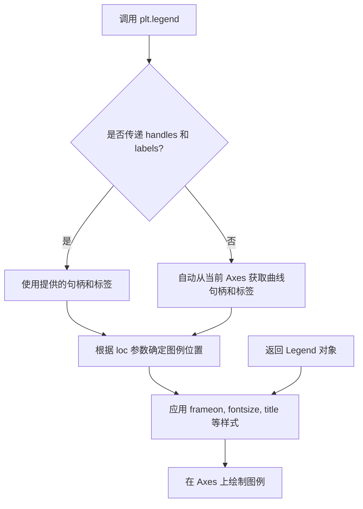
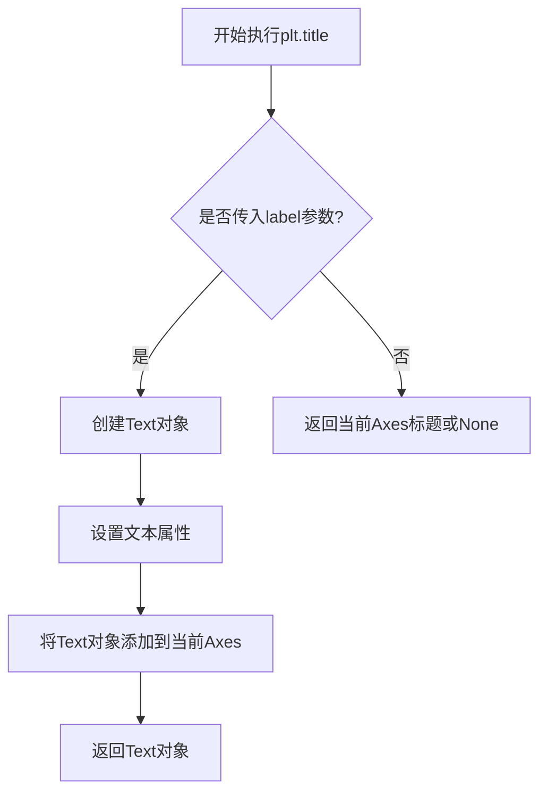
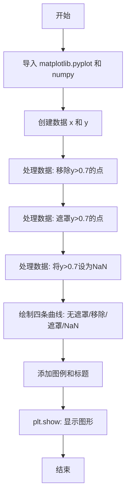
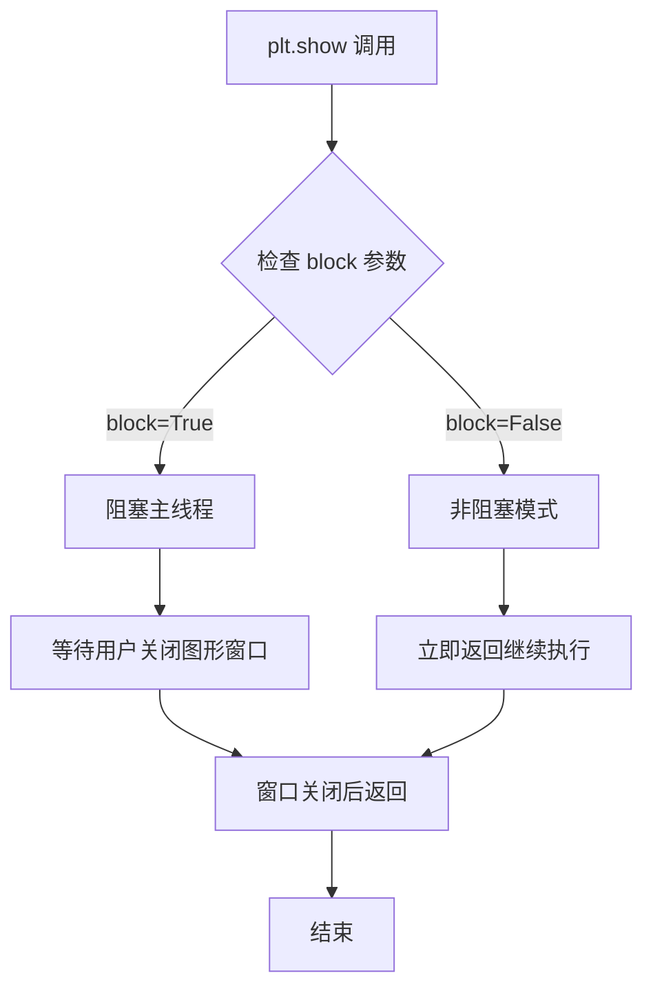
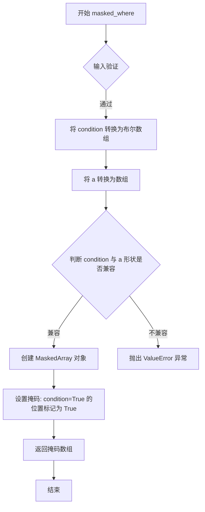
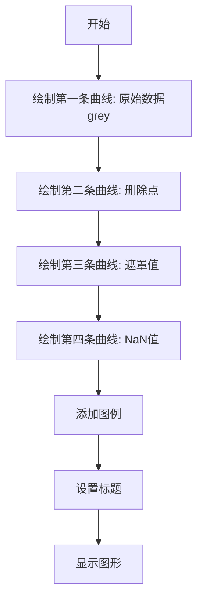

# `matplotlib\galleries\examples\lines_bars_and_markers\masked_demo.py` 详细设计文档

本示例演示了使用matplotlib绘制包含缺失值数据的三种方法：直接删除超出阈值的数据点、使用numpy掩码数组标记缺失值、以及将缺失值设置为NaN。

## 整体流程

```mermaid
graph TD
    A[开始] --> B[导入 matplotlib.pyplot 和 numpy]
B --> C[生成x和y数据: x从-pi/2到pi/2, y=cos(x)^3]
C --> D[方式1: 删除点 - x2和y2保留y<=0.7的数据]
D --> E[方式2: 掩码 - 使用np.ma.masked_where掩码y>0.7的点]
E --> F[方式3: NaN - 复制y并将y>0.7设为np.nan]
F --> G[绘制四条曲线对比效果]
G --> H[添加图例和标题]
H --> I[调用plt.show()显示图像]
```

## 类结构

```
本脚本为单文件脚本，无类定义
主要使用matplotlib.pyplot和numpy两个库的函数
```

## 全局变量及字段


### `x`
    
从-pi/2到pi/2的31个等间距点

类型：`numpy.ndarray`
    


### `y`
    
cos(x)^3的计算结果

类型：`numpy.ndarray`
    


### `x2`
    
筛选后的x数组(保留y<=0.7)

类型：`numpy.ndarray`
    


### `y2`
    
筛选后的y数组(保留y<=0.7)

类型：`numpy.ndarray`
    


### `y3`
    
掩码数组, y>0.7的点被掩码

类型：`numpy.ndarray`
    


### `y4`
    
副本数组, y>0.7的点被设为NaN

类型：`numpy.ndarray`
    


    

## 全局函数及方法


### `plt.plot` (`matplotlib.pyplot.plot`)

该函数是 `matplotlib.pyplot` 模块提供的核心绘图接口，用于将 **y** 数据相对 **x** 坐标绘制为折线、标记或两者的组合。它能够自动处理 `numpy.ma.MaskedArray` 与 `NaN` 缺失值——在缺失位置不绘制标记并使线条断开，从而实现“无数据间隙”的可视化效果。

---

#### 参数

- `x`：`array‑like`，x 坐标向量。代码中常通过乘以一个因子（如 `x*0.1`、`x2*0.4`、`x*0.7`、`x*1.0`）实现水平平移或缩放。  
- `y`：`array‑like`，y 坐标向量。可以是普通数组、掩码数组或包含 `NaN` 的数组。  
- `fmt`：`str`，可选，格式字符串（如 `'o-'`），用于一次性指定线条样式、标记类型和颜色。  
- `color`：`str`，可选，关键字参数，用来明确指定线条颜色（如 `color='lightgrey'`）。  
- `label`：`str`，可选，关键字参数，用于图例的文字描述（如 `label='No mask'`）。  
- `scalex`、`scaley`：`bool`，可选，默认均为 `True`，决定是否根据数据自动缩放对应轴。  
- `data`：`dict`，可选，如果使用命名参数（`plt.plot(..., data={'x': ..., 'y': ...})`），可将数组放进字典供函数内部引用。  
- `**kwargs`：其他关键字参数（如 `linewidth`、`markersize`、`alpha` 等），会直接传递给底层的 `Line2D` 对象。

> **注意**：实际调用时，`x` 与 `y` 必须长度一致，否则会抛出 `ValueError`。

---

#### 返回值

`list[matplotlib.lines.Line2D]`，返回一个包含所创建的所有 `Line2D` 实例的列表。每个 `Line2D` 对象对应一次 `plot` 调用，可用于后续的属性修改（如颜色、线宽）或动画添加。

---

#### 流程图

```mermaid
graph TD
    A([开始]) --> B[准备原始数据 x, y]
    B --> C{需要水平缩放?}
    C -->|是| D[计算 x_scaled = x * factor]
    C -->|否| E[使用原始 x]
    D --> F[调用 plt.plot(x_scaled, y, fmt, **kwargs)]
    E --> F
    F --> G[内部解析 fmt、创建 Line2D]
    G --> H{检测 y 是否为掩码数组或含 NaN?}
    H -->|是| I[在缺失位置断开线条、不绘制标记]
    H -->|否| J[连续绘制线条]
    I --> K[将 Line2D 添加到当前 Axes]
    J --> K
    K --> L[返回 Line2D 列表]
    L --> M([结束])
```

---

#### 带注释源码

```python
# -*- coding: utf-8 -*-
"""
演示如何使用 plt.plot 绘制包含缺失值（掩码或 NaN）的曲线。
"""

import matplotlib.pyplot as plt
import numpy as np

# ------------------- 1. 生成原始数据 -------------------
x = np.linspace(-np.pi / 2, np.pi / 2, 31)   # x 轴范围：[-π/2, π/2]
y = np.cos(x) ** 3                           # 原始 y = cos^3(x)

# ------------------- 2. 四种不同的绘图方式 -------------------

# ① 直接绘制，未做任何掩码处理（No mask）
#   - x*0.1：水平缩放 0.1
#   - 使用灰度颜色 'lightgrey'，并在图例中标记为 'No mask'
plt.plot(x * 0.1, y, 'o-', color='lightgrey', label='No mask')

# ② 删除 y > 0.7 的数据点后绘制（Points removed）
#   - 先通过布尔索引过滤得到 x2、y2
x2 = x[y <= 0.7]      # 保留 y ≤ 0.7 的 x
y2 = y[y <= 0.7]      # 对应的 y
plt.plot(x2 * 0.4, y2, 'o-', label='Points removed')

# ③ 使用掩码数组（Masked values）
#   - np.ma.masked_where 将满足条件的元素标记为掩码，
#     绘图时这些位置不会出现标记，线条也会在此断开
y3 = np.ma.masked_where(y > 0.7, y)   # 将 y > 0.7 的位置掩码
plt.plot(x * 0.7, y3, 'o-', label='Masked values')

# ④ 将满足条件的值设为 NaN（NaN values）
#   - 通过复制 y 并将对应位置赋值为 np.nan，
#     同样实现在缺失处断开线条的效果
y4 = y.copy()
y4[y3 > 0.7] = np.nan   # 将原本掩码的位置再转为 NaN
plt.plot(x * 1.0, y4, 'o-', label='NaN values')

# ------------------- 3. 图表装饰 -------------------
plt.legend()                # 显示图例
plt.title('Masked and NaN data')  # 图表标题
plt.show()                  # 弹出窗口展示图形
```

---

#### 关键组件信息

| 组件 | 描述 |
|------|------|
| `matplotlib.pyplot.plot` | 负责接收数据并实例化 `Line2D`，自动处理坐标轴缩放、格式解析、缺失值等。 |
| `matplotlib.lines.Line2D` | 代表绘图线段和标记的艺术家对象，属性包括颜色、线宽、标记样式等。 |
| `matplotlib.axes.Axes` | 当前的坐标轴容器，`plot` 会把创建的 `Line2D` 加入该对象。 |
| `numpy` | 提供数组运算、掩码数组 (`np.ma.MaskedArray`) 与 `np.nan`（非数值）支持。 |

---

#### 潜在的技术债务或优化空间

1. **重复的因子乘法**：在每一次 `plt.plot` 调用前都手动做 `x*factor`，可以在绘图前一次性生成缩放好的 `x` 数组，降低代码重复度。  
2. **缺失值处理方式不统一**：示例同时演示了“删除点”“掩码数组”“NaN”三种手段，实际项目中建议统一使用一种（推荐掩码数组或 NaN），以免产生混淆。  
3. **缺少显式的错误检查**：虽然 `plot` 会在不匹配长度时抛出异常，但在业务层可以提前进行形状校验，提供更友好的错误信息。  
4. **硬编码的可视化参数**：颜色、线型、标记大小等如果写死在代码里，后续改样式需要全局搜索‑替换，建议抽取到配置或样式文件中。

---

#### 其它项目

- **设计目标与约束**  
  - 必须兼容 `numpy.array`、`numpy.ma.MaskedArray` 与包含 `np.nan` 的普通数组。  
  - 自动处理坐标轴的自动缩放（`scalex`、`scaley`），但可通过参数关闭。  
  - 必须返回可迭代的 `Line2D` 列表，以便后续定制。

- **错误处理与异常设计**  
  - **ShapeMismatchError**（实际抛 `ValueError`）：当 `x` 与 `y` 长度不一致时触发。  
  - **TypeError**：当 `fmt` 不是字符串或提供了非法关键字时抛出。  
  - **RuntimeWarning**：在绘制含 `NaN` 的数据时会产生警告（可使用 `errormask` 参数抑制）。

- **外部依赖与接口契约**  
  - **依赖库**：`numpy`、`matplotlib`。  
  - **接口**：公开的函数签名 `plot(x, y, fmt=None, **kwargs)`，返回值始终是 `list[Line2D]`。  
  - **向后兼容性**：自 Matplotlib 1.5 以来，`plot` 对掩码数组与 `NaN` 的处理保持不变，未来计划继续保持。

--- 

以上即为 `plt.plot` 在本示例中的完整设计文档，涵盖函数概述、参数与返回值说明、运行流程（Mermaid 图）、带注释的示例源码以及关键技术点与优化建议。  


### `plt.legend`

添加图例以显示绘图中各曲线的标签，允许用户自定义图例的位置、样式和内容。

参数：

- `*args`：可变位置参数，用于传递图例句柄和标签，例如 `plt.legend(handles, labels)`。
- `loc`：字符串或元组，指定图例位置，如 `'upper right'`、`'best'` 或 `(x, y)` 坐标。
- `frameon`：布尔值，控制是否绘制图例框架，默认为 `True`。
- `fontsize`：整数或字符串，设置图例字体大小，如 `12` 或 `'small'`。
- `title`：字符串，设置图例标题，默认为 `None`（无标题）。
- `bbox_to_anchor`：元组或文档，设置图例的锚定框，用于精确定位。
- `ncol`：整数，设置图例列数，默认为 `1`。
- `**kwargs`：其他关键字参数，用于传递给 `Legend` 对象的属性，如 `facecolor`、`edgecolor`、`shadow` 等。

返回值：`matplotlib.legend.Legend`，返回创建的图例对象，以便进一步自定义。

#### 流程图



#### 带注释源码

```python
def legend(*args, **kwargs):
    """
    添加图例到当前 Axes。
    
    参数:
        *args: 可选，图例句柄和标签。通常格式为 (handles, labels) 或仅 labels。
        loc: 字符串或元组，图例位置。如 'upper right', 'best', (x, y)。
        frameon: 布尔值，是否显示图例边框。
        fontsize: 整数或字符串，图例字体大小。
        title: 字符串，图例标题。
        bbox_to_anchor: 元组，图例锚定框。
        ncol: 整数，图例列数。
        **kwargs: 其他关键字参数，传递给 Legend 对象。
    
    返回:
        Legend: 图例对象。
    """
    # 获取当前 Axes 对象
    ax = gca()
    
    # 解析参数：提取 handles 和 labels
    if args:
        # 如果第一个参数是句柄列表
        if len(args) == 1 and isarray_like(args[0]):
            handles, labels = args[0], []
        elif len(args) == 2:
            handles, labels = args
        else:
            # 假设所有参数都是标签，从当前曲线获取句柄
            labels = list(args)
            handles, _ = ax.get_legend_handles_labels()
    else:
        # 自动从 Axes 获取句柄和标签
        handles, labels = ax.get_legend_handles_labels()
    
    # 创建 Legend 对象，传递所有参数
    legend = Legend(ax, handles, labels, loc=loc, 
                     frameon=frameon, fontsize=fontsize, 
                     title=title, bbox_to_anchor=bbox_to_anchor, 
                     ncol=ncol, **kwargs)
    
    # 将图例添加到 Axes
    ax.add_artist(legend)
    
    # 返回图例对象，供进一步操作
    return legend
```


### `plt.title`

设置当前Axes的标题文本。

参数：

- `label`：`str`，要设置的标题文本内容
- `*args`：可变位置参数，支持额外的参数传递给`Text`对象
- `**kwargs`：关键字参数，支持`matplotlib.text.Text`的属性，如字体大小、颜色、对齐方式等

返回值：`Text`，返回创建的`matplotlib.text.Text`对象，可用于进一步自定义标题样式

#### 流程图



#### 带注释源码

```python
# 设置图表标题
# 参数: label - 标题文本字符串
# 返回: matplotlib.text.Text对象
plt.title('Masked and NaN data')

# 等效于底层API调用:
# ax = plt.gca()  # 获取当前Axes
# text = ax.set_title('Masked and NaN data')  # 设置标题
# 返回的text是Text对象,可用于后续自定义
```


### `plt.show()`

`plt.show()` 是 Matplotlib 库中的顶层函数，用于显示所有当前打开的图形窗口，并将最终的绘图结果渲染到屏幕或交互式后端。

#### 文件整体运行流程



#### `plt.show()` 详细信息

- **函数名称**：`plt.show()`
- **所属模块**：`matplotlib.pyplot`
- **功能描述**：显示所有当前打开的图形窗口，并将最终的绘图结果渲染到屏幕。在交互式后端中会打开一个窗口显示图形；在非交互式后端中可能会保存文件或执行其他操作。

#### 参数

- `block`：布尔值，可选参数。控制是否阻塞程序执行直到图形窗口关闭。默认为 `None`，在交互式模式下自动设置为 `True`。

#### 返回值

- **返回值类型**：`None`
- **返回值描述**：该函数不返回任何值，仅用于显示图形。

#### 流程图



#### 带注释源码

```python
# plt.show() 位于 matplotlib/pyplot.py 中，以下为简化注释说明

def show(*, block=None):
    """
    Display all open figures.
    
    在交互式后端中显示所有打开的图形窗口。
    
    Parameters
    ----------
    block : bool, optional
        如果设置为 True，程序会阻塞直到所有图形窗口关闭。
        如果设置为 False，函数立即返回。
        默认为 True（在交互式环境中）。
    """
    
    # 获取当前所有的 Figure 对象
    figs = get_figures(raise_on_empty=False)
    
    if not figs:
        # 如果没有图形，直接返回
        return
    
    # 遍历所有图形并进行显示
    for fig in figs:
        # 调用后端的显示方法
        fig.canvas.draw_idle()
        # 根据后端类型决定是否阻塞
        if block is None:
            # 自动检测是否需要阻塞
            block = isinteractive()
        
        if block:
            # 进入事件循环，等待用户交互
            fig.canvas.start_event_loop_default()
        else:
            # 立即返回，不阻塞
            break
```

#### 关键组件信息

| 组件名称 | 一句话描述 |
|---------|-----------|
| `matplotlib.pyplot` | 提供类似 MATLAB 的绘图接口的顶层模块 |
| `Figure` | 表示整个图形容器的对象 |
| `Canvas` | 图形绘制的画布，负责渲染图形 |
| `Backend` | 渲染后端，负责将图形输出到屏幕或文件 |

#### 潜在的技术债务或优化空间

1. **缺少错误处理**：代码未对 `plt.show()` 可能出现的图形窗口创建失败进行异常捕获。
2. **后端兼容性**：不同后端（Qt、Tkinter、AGG 等）的行为可能不一致，block 参数在某些后端可能不生效。
3. **资源管理**：图形窗口关闭后，未自动清理相关的内存资源。
4. **返回值缺失**：函数返回 `None`，无法获取图形渲染状态或错误信息。

#### 其它项目

**设计目标与约束**：
- 目标是提供一个统一的跨平台图形显示接口
- 约束是必须在有图形后端的环境下运行

**错误处理与异常设计**：
- 如果没有安装图形后端，可能会抛出 `RuntimeError`
- 如果没有打开的图形窗口，函数静默返回而不报错

**数据流与状态机**：
- `plt.show()` 读取当前全局图形状态（通过 `gcf()` 获取当前 Figure）
- 状态机：创建图形 → 添加数据 → 渲染 → 显示 → 关闭

**外部依赖与接口契约**：
- 依赖具体的图形后端（如 TkAgg、Agg、Qt5Agg 等）
- 契约：调用后必须显示图形，block 参数控制是否阻塞


### `numpy.linspace`

生成等间距的一维数组，返回在指定区间内均匀分布的数字序列。

参数：

- `start`：`array_like`，序列的起始值
- `stop`：`array_like`，序列的结束值（当 `endpoint` 为 True 时为最后一个样本）
- `num`：`int`，要生成的样本数量，默认为 50
- `endpoint`：`bool`，若为 True，则 stop 为最后一个样本；若为 False，则不包含 stop 值，默认为 True
- `retstep`：`bool`，若为 True，则返回 (samples, step)，step 为样本之间的间距，默认为 False
- `dtype`：`dtype`，输出数组的数据类型，若未指定，则从 start 和 stop 的类型推断
- `axis`：`int`，结果中存储样本的轴（仅当 start 或 stop 为类数组对象时有效），默认为 0

返回值：`ndarray`，包含 num 个等间距样本的数组

#### 流程图

```mermaid
flowchart TD
    A[开始] --> B[验证 num 参数<br>num 必须为非负整数]
    B --> C{num == 0?}
    C -->|是| D[返回空数组<br>根据 dtype]
    C -->|否| E{num == 1?}
    E -->|是| F[返回只包含 start 的数组<br>endpoint=True 时返回 start]
    E -->|否| G[计算步长 step<br>step = (stop - start) / (num - 1)<br>或 step = (stop - start) / num]
    G --> H[生成数组<br>arr = start + step * arange(num)]
    H --> I{dtype 指定?}
    I -->|是| J[转换为指定 dtype]
    I -->|否| K[推断 dtype]
    J --> L{retstep?}
    K --> L
    L -->|是| M[返回 (arr, step) 元组]
    L -->|否| N[仅返回 arr]
    M --> O[结束]
    N --> O
    D --> O
    F --> O
```

#### 带注释源码

```python
def linspace(start, stop, num=50, endpoint=True, retstep=False, dtype=None, axis=0):
    """
    生成指定数量的等间距样本。
    
    参数:
        start: 序列起始值
        stop: 序列结束值
        num: 样本数量（默认50）
        endpoint: 是否包含结束值（默认True）
        retstep: 是否返回步长（默认False）
        dtype: 输出数据类型（默认自动推断）
        axis: 结果数组中样本存储的轴（默认0）
    
    返回:
        ndarray 或 tuple: 等间距数组，或(数组, 步长)元组
    """
    # 验证 num 参数
    if num < 0:
        raise ValueError("Number of samples, %s, must be non-negative." % num)
    
    # 处理 num=0 的情况
    if num == 0:
        # 返回空数组，根据 dtype 或从 start/stop 推断
        if dtype is None:
            dtype = _nx.asarray(start).dtype
        return _nx.empty(0, dtype=dtype)
    
    # 处理 num=1 的情况
    if num == 1:
        if endpoint:
            # 只返回一个点，即 start 值
            return _nx.asarray(start, dtype=dtype)[()]
        else:
            # 不包含 end point，返回空数组
            return _nx.empty(0, dtype=dtype)
    
    # 计算步长
    # endpoint=True: step = (stop - start) / (num - 1)
    # endpoint=False: step = (stop - start) / num
    if endpoint:
        step = (stop - start) / (num - 1)
    else:
        step = (stop - start) / num
    
    # 使用 arange 生成数组: start + step * [0, 1, 2, ..., num-1]
    # arange 比直接使用索引更高效
    y = _arange_dispatcher(start, stop, step, num, dtype=dt)
    
    # 处理 axis 参数（当 start/stop 为多维数组时）
    if axis != 0:
        # 重新组织数组维度，将 axis 移到第一维
        ...
    
    # 根据需要返回 (数组, 步长) 或仅返回数组
    if retstep:
        return y, step
    else:
        return y
```


### `np.ma.masked_where`

该函数是 NumPy 掩码数组模块的核心函数之一，根据布尔条件在指定数组上创建掩码，当条件为 True 时，对应位置的元素将被标记为掩码状态，从而在后续计算中忽略这些值。

参数：

- `condition`：`array_like`，布尔条件数组，其形状应与输入数组 `a` 兼容。为 True 的位置将对 `a` 中对应元素进行掩码。
- `a`：`array_like`，需要创建掩码的输入数组，可以是任意维度的数组或类似数组的对象。

返回值：`MaskedArray`，返回一个新的掩码数组，其数据源自输入数组 `a`，掩码源自条件数组 `condition`。掩码值为 True 表示对应位置的原始数据被隐藏。

#### 流程图



#### 带注释源码

```python
def masked_where(condition, a, copy=True):
    """
    根据条件掩码数组中的元素。
    
    参数:
        condition: 布尔数组，True 表示需要掩码的位置
        a: 输入数组
        copy: 是否复制数据，默认为 True
    
    返回:
        MaskedArray: 带掩码的数组对象
    """
    # 将条件转换为掩码数组（确保是布尔类型）
    mask = np.ma.array(np.asarray(condition), mask=False)
    
    # 获取输入数组（不改变类型）
    a = np.asarray(a)
    
    # 创建掩码数组，保持原始数据类型
    output = np.ma.array(a, mask=mask)
    
    # 如果 copy=True 且条件为 True 的位置需要处理
    if copy:
        output = output.copy()
    
    return output
```


### 全局变量与执行流程

#### 变量列表

- `x`：ndarray，从 -π/2 到 π/2 的31个等间距点
- `y`：ndarray，x的余弦三次方值
- `x2`：ndarray，筛选后满足 y <= 0.7 的x值
- `y2`：ndarray，筛选后满足 y <= 0.7 的y值
- `y3`：MaskedArray，根据条件 y > 0.7 遮罩后的y值
- `y4`：ndarray，y的副本，将大于0.7的值设置为NaN

#### 整体运行流程

1. 导入matplotlib.pyplot和numpy模块
2. 生成x轴数据（角度范围）和y轴数据（余弦三次方）
3. 方式一：通过布尔索引移除 y > 0.7 的数据点
4. 方式二：使用masked_array遮罩 y > 0.7 的数据点
5. 方式三：复制y数组并将 y > 0.7 的值设置为np.nan
6. 使用plt.plot绘制四条曲线展示不同处理方式的效果
7. 添加图例、标题并显示图形

---

### `np.linspace`

参数：
- `start`：`float`，序列起始值（-π/2）
- `stop`：`float`，序列结束值（π/2）
- `num`：`int`，生成样本数量（31）

返回值：`ndarray`，指定范围内的等间距数组

#### 带注释源码

```python
x = np.linspace(-np.pi/2, np.pi/2, 31)
# 生成从 -π/2 到 π/2 的31个等间距点，作为x轴数据
```

---

### `np.cos`

参数：
- `x`：`array_like`，输入角度（弧度）

返回值：`ndarray`，输入角度的余弦值

#### 带注释源码

```python
y = np.cos(x)**3
# 计算x的余弦值并立方，得到y轴绘图数据
```

---

### `np.ma.masked_where`

参数：
- `condition`：`array_like`，布尔条件数组
- `a`：`array_like`，需要遮罩的数组

返回值：`MaskedArray`，遮罩后的数组

#### 带注释源码

```python
y3 = np.ma.masked_where(y > 0.7, y)
# 当y > 0.7时，将对应位置的数值遮罩，在图中显示为断点
```

---

### `plt.plot`

参数：
- `x`：`array_like`，x轴数据
- `y`：`array_like`，y轴数据
- `fmt`：`str`，格式字符串（'o-'表示圆圈标记+实线）
- `color`：`str`，线条颜色
- `label`：`str`，图例标签

返回值：`list`，Line2D对象列表

#### 流程图



#### 带注释源码

```python
plt.plot(x*0.1, y, 'o-', color='lightgrey', label='No mask')
# 绘制原始数据，x缩放0.1避免与后续曲线重叠

plt.plot(x2*0.4, y2, 'o-', label='Points removed')
# 绘制移除点后的数据，x缩放0.4

plt.plot(x*0.7, y3, 'o-', label='Masked values')
# 绘制遮罩数据，x缩放0.7，遮罩点不显示

plt.plot(x*1.0, y4, 'o-', label='NaN values')
# 绘制含NaN的数据，x缩放1.0，NaN点不显示
```

---

### `plt.legend`

参数：
- `loc`：`str`，图例位置（默认'best'）

返回值：`Legend`

#### 带注释源码

```python
plt.legend()
# 自动选择最佳位置显示图例
```

---

### `plt.title`

参数：
- `label`：`str`，标题文本
- `fontdict`：`dict`，字体属性（可选）

返回值：`Text`

#### 带注释源码

```python
plt.title('Masked and NaN data')
# 设置图表标题
```

---

### `plt.show`

参数：无

返回值：`None`

#### 带注释源码

```python
plt.show()
# 渲染并显示所有配置的图形
```

---

### 关键组件信息

| 组件名称 | 描述 |
|---------|------|
| matplotlib.pyplot | Python 2D绘图库，提供类似MATLAB的绘图接口 |
| numpy | Python科学计算基础库，提供数组和矩阵运算 |
| numpy.ma | NumPy遮罩数组模块，用于处理无效或缺失数据 |
| np.nan | NumPy IEEE 754浮点标准中的非数值常量 |

---

### 潜在的技术债务或优化空间

1. **重复计算**：y > 0.7 的条件在三个地方重复计算，可以预先存储为布尔数组
2. **魔法数字**：x轴的缩放因子（0.1, 0.4, 0.7, 1.0）缺乏明确含义，应定义为常量或使用子图
3. **硬编码参数**：角度范围、样本数量、阈值0.7应作为配置参数
4. **缺乏错误处理**：未验证输入数据的有效性

---

### 其它项目

#### 设计目标与约束

- **目标**：演示处理缺失数据的三种方式及其在matplotlib中的可视化效果
- **约束**：使用NumPy和Matplotlib原生功能，保持代码简洁易懂

#### 错误处理与异常设计

- 代码未包含显式错误处理，假设输入参数有效
- NaN值在绘图时自动被忽略，不会抛出异常

#### 数据流与状态机

```
输入数据(x, y) 
    ↓
    ├─→ 分支1: 布尔索引筛选 → (x2, y2)
    ├─→ 分支2: masked_where → y3  
    └─→ 分支3: 赋值np.nan → y4
    ↓
四条曲线并行渲染 → 合并图例 → 显示
```

#### 外部依赖与接口契约

- **numpy**：提供数组操作、遮罩数组、nan常量
- **matplotlib**：提供绑图、图例、标题等可视化接口
- 所有依赖均为Python科学计算生态的标准库


## 关键组件


### 数据生成模块

使用 numpy 生成从 -π/2 到 π/2 的 31 个等间距点，并计算余弦立方值作为原始数据源，为后续三种缺失值处理方式提供测试数据。

### 移除数据点模块

通过布尔索引过滤，移除 y > 0.7 的数据点，直接生成新的筛选后数组 x2 和 y2，实现最简单的不连续数据处理方式。

### 掩码数组模块

使用 numpy.ma.masked_where 函数将满足条件 y > 0.7 的数据标记为掩码状态，生成掩码数组 y3，Matplotlib 绘图时会自动跳过掩码点并在断裂处断开线条。

### NaN 值处理模块

复制原始数组 y 并将满足条件 y3 > 0.7 的元素设置为 NaN，生成 y4 数组，Matplotlib 绘图时会自动跳过 NaN 值位置，形成线条断裂效果。

### 可视化模块

使用 matplotlib.pyplot 的 plot 方法绘制四条曲线，展示原始数据、移除点、掩码数组和 NaN 值四种处理方式的视觉效果差异，并通过 legend 和 title 进行标注说明。


## 问题及建议


### 已知问题

-   **逻辑缺陷**：第27行 `y4[y3 > 0.7] = np.nan` 使用已masked的数组作为索引条件，masked数组的比较操作会返回masked结果，导致该行代码可能无法按预期将对应位置设为NaN
-   **数据不一致**：第16-17行使用布尔索引 `x[y <= 0.7]` 和 `y[y <= 0.7]` 分别筛选x和y，但这样可能导致x和y的对应关系丢失（应使用 `x2 = x[y <= 0.7]`）
-   **魔法数字硬编码**：阈值0.7、缩放因子0.1、0.4、0.7、1.0等数值散布在代码中，缺乏可配置性
-   **代码复用性差**：所有逻辑直接执行在全局作用域，无函数封装，难以作为模块被其他代码调用
-   **类型提示缺失**：所有变量均无类型注解，降低了代码的可读性和静态分析能力
-   **重复代码**：4次 `plt.plot()` 调用中样式参数存在重复，可提取公共配置

### 优化建议

-   **修复逻辑缺陷**：将第27行改为 `y4[y > 0.7] = np.nan`，使用原始y数组作为条件判断
-   **修复数据筛选**：确保x和y使用相同的布尔条件筛选，保持数据点的一一对应关系
-   **提取配置参数**：将阈值、缩放因子、样式配置等定义为常量或函数参数
-   **封装为函数**：将绘图逻辑封装为可配置的函数，接受数据、阈值、样式等参数
-   **添加类型注解**：为函数参数和返回值添加类型提示，提升代码清晰度
-   **抽取公共配置**：使用循环或配置字典简化重复的绘图调用


## 其它


### 设计目标与约束

本代码旨在演示 matplotlib 中处理缺失数据的三种常见方法：移除数据点、使用 masked array 遮罩数据点、设置数据点为 NaN。代码运行于 Python 3.x 环境，需安装 matplotlib 和 numpy 库。代码无性能约束，因数据量较小（31个点）。

### 错误处理与异常设计

代码未包含显式的错误处理机制。潜在的异常包括：1) numpy 或 matplotlib 未安装时抛出 ImportError；2) 如果输入数组维度不匹配，matplotlib 绘图时可能抛出 ValueError；3) 若 x 和 y 数组长度不一致，np.linspace 和索引操作可能产生意外结果。当前代码假设输入数据合法，未进行运行时验证。

### 数据流与状态机

代码数据流如下：首先生成 x 和 y 数组，然后通过三种不同方式处理 y 数据得到 y2、y3、y4，最后将四组数据传递给 plt.plot 进行绑制。状态机较为简单，主要为顺序执行：数据生成 → 数据处理 → 绑图 → 显示。无复杂状态转换。

### 外部依赖与接口契约

代码依赖两个外部库：numpy（提供 np.linspace、np.ma.masked_where、np.nan 等函数）和 matplotlib（提供 plt.plot、plt.legend、plt.title、plt.show 等接口）。接口契约方面：np.linspace 返回指定范围的等间距数组；np.ma.masked_where 返回 MaskedArray；plt.plot 返回 Line2D 对象列表。所有函数均遵循各库的公开 API 约定。

### 代码结构与模块划分

代码整体为单脚本结构，未模块化。分为三个逻辑部分：数据准备（x, y 生成）、数据处理（三种处理方式）、可视化绑图（plt 调用）。无类定义，所有函数为全局函数调用。

### 性能考量

当前代码数据量极小（31个点），性能可忽略。若数据量增大，建议：1) 对大规模数据避免频繁复制（y4 = y.copy() 可优化）；2) 使用向量化操作替代显式循环；3) 对于实时绑图考虑使用交互式后端。

### 可维护性与扩展性

代码结构简单，易于维护。扩展方向包括：1) 将三种处理方法封装为函数，接受不同参数；2) 支持自定义阈值（当前硬编码为 0.7）；3) 添加更多可视化选项（如颜色、标记样式参数化）。当前硬编码较多，灵活度有限。

### 安全与边界情况

代码未处理边界情况：1) 若 y 数组全为 NaN 或被全部遮罩，绑图可能异常；2) 若 x 数组包含 NaN，可能影响绑图；3) 未检查 plt.show() 在无图形界面环境下的行为（如服务器环境）。建议添加数据有效性验证。

    