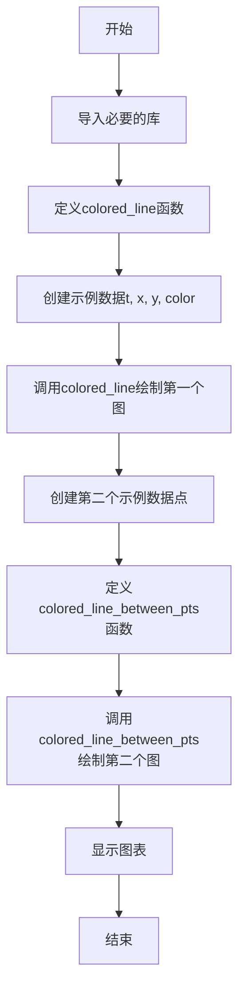

# `matplotlib\galleries\examples\lines_bars_and_markers\multicolored_line.py` 详细设计文档

该脚本展示了使用matplotlib绘制颜色沿线条变化的两种方法：通过在每个数据点处定义颜色以及在每对相邻点之间定义颜色，使用LineCollection实现平滑的颜色渐变效果。

## 整体流程



## 类结构

```
无类层次结构（基于函数的模块）
├── 全局函数
│   ├── colored_line（在每个点处着色）
│   └── colored_line_between_pts（在每对点之间着色）
└── 全局变量
```

## 全局变量及字段


### `t`
    
时间参数数组，用于生成第一个示例的坐标

类型：`numpy.ndarray`
    


### `x`
    
第一个示例的x坐标数据，通过正弦函数生成

类型：`numpy.ndarray`
    


### `y`
    
第一个示例的y坐标数据，通过余弦函数生成

类型：`numpy.ndarray`
    


### `color`
    
颜色值数组，用于第一个示例的线条着色

类型：`numpy.ndarray`
    


### `fig1`
    
第一个图表的Figure对象，用于显示彩色线条图

类型：`matplotlib.figure.Figure`
    


### `ax1`
    
第一个图表的Axes对象，用于绘制彩色线条

类型：`matplotlib.axes.Axes`
    


### `lines`
    
第一个图表的线条集合，包含颜色映射信息

类型：`matplotlib.collections.LineCollection`
    


### `x`
    
第二个示例的x坐标列表，用于演示不连续数据点

类型：`list`
    


### `y`
    
第二个示例的y坐标列表，用于演示不连续数据点

类型：`list`
    


### `c`
    
第二个示例的颜色值列表，对应每个数据点

类型：`list`
    


### `fig`
    
第二个图表的Figure对象，用于显示散点和线条

类型：`matplotlib.figure.Figure`
    


### `ax`
    
第二个图表的Axes对象，用于绘制散点和线条

类型：`matplotlib.axes.Axes`
    


### `x`
    
第三个示例的x坐标数组，通过linspace生成

类型：`numpy.ndarray`
    


### `y`
    
第三个示例的y坐标数据，通过正弦函数生成

类型：`numpy.ndarray`
    


### `dydx`
    
第三个示例的导数值，用于表示相邻点间的颜色变化

类型：`numpy.ndarray`
    


### `fig2`
    
第三个图表的Figure对象，用于显示导数彩色线条图

类型：`matplotlib.figure.Figure`
    


### `ax2`
    
第三个图表的Axes对象，用于绘制导数彩色线条

类型：`matplotlib.axes.Axes`
    


### `line`
    
第三个图表的线条集合，包含导数颜色映射

类型：`matplotlib.collections.LineCollection`
    


    

## 全局函数及方法


### `colored_line`

该函数通过将数据点分割成线段集合来实现沿路径渐变的彩色线条绘制。它利用每两个相邻点之间的中点来创建平滑过渡的线段，使颜色能够在整个线条上连续变化，适用于展示沿路径变化的数据（如时间序列、高度剖面等）。

参数：

- `x`：`array-like`，数据点的水平坐标数组
- `y`：`array-like`，数据点的垂直坐标数组
- `c`：`array-like`，与x和y相同大小的颜色值数组，用于定义每点的颜色
- `ax`：`matplotlib.axes.Axes`，可选，目标绘图坐标轴，未提供时使用当前坐标轴
- `**lc_kwargs`：关键字参数，传递给`matplotlib.collections.LineCollection`构造器的额外参数（不含array参数）

返回值：`matplotlib.collections.LineCollection`，生成的线集合对象，可直接添加到图表或用于图例绑定

#### 流程图

```mermaid
flowchart TD
    A[开始 colored_line] --> B{检查 lc_kwargs 中是否包含 'array'}
    B -->|是| C[发出 UserWarning 警告]
    B -->|否| D[继续执行]
    C --> D
    D --> E[堆叠 x, y 为坐标数组 xy]
    F[计算中点数组 xy_mid] --> E
    E --> G[构建线段数组 segments]
    G --> H[设置 lc_kwargs['array'] = c]
    H --> I[创建 LineCollection 实例 lc]
    I --> J[获取或创建 axes 对象 ax]
    J --> K[将 lc 添加到 ax]
    K --> L[返回 LineCollection 对象]
```

#### 带注释源码

```python
def colored_line(x, y, c, ax=None, **lc_kwargs):
    """
    Plot a line with a color specified along the line by a third value.

    It does this by creating a collection of line segments. Each line segment is
    made up of two straight lines each connecting the current (x, y) point to the
    midpoints of the lines connecting the current point with its two neighbors.
    This creates a smooth line with no gaps between the line segments.

    Parameters
    ----------
    x, y : array-like
        The horizontal and vertical coordinates of the data points.
    c : array-like
        The color values, which should be the same size as x and y.
    ax : matplotlib.axes.Axes, optional
        The axes to plot on. If not provided, the current axes will be used.
    **lc_kwargs
        Any additional arguments to pass to matplotlib.collections.LineCollection
        constructor. This should not include the array keyword argument because
        that is set to the color argument. If provided, it will be overridden.

    Returns
    -------
    matplotlib.collections.LineCollection
        The generated line collection representing the colored line.
    """
    # 检查用户是否误传了 array 参数，若传入则发出警告并让后续代码覆盖
    if "array" in lc_kwargs:
        warnings.warn(
            'The provided "array" keyword argument will be overridden',
            UserWarning,
            stacklevel=2,
        )

    # 将 x, y 坐标堆叠成 N x 2 的坐标数组，便于后续处理
    # 堆叠后 shape 为 (n_points, 2)，每行 [x_i, y_i]
    xy = np.stack((x, y), axis=-1)
    
    # 计算相邻坐标点的中点，构建用于平滑线段的中点数组
    # 使用 concat 连接：起始点、所有中间中点、终止点
    # 结果 shape 为 (n_points, 2)
    xy_mid = np.concat(
        (xy[0, :][None, :], (xy[:-1, :] + xy[1:, :]) / 2, xy[-1, :][None, :]), axis=0
    )
    
    # 构建线段数组，每个点作为三个点的中间点
    # segments 形状为 (n_points-1, 3, 2)：(n_points-1) 个线段，每个线段 3 个点，2 维坐标
    # 每个线段格式：[左中点, 当前点, 右中点]
    segments = np.stack((xy_mid[:-1, :], xy, xy_mid[1:, :]), axis=-2)
    # Note that
    # segments[0, :, :] is [xy[0, :], xy[0, :], (xy[0, :] + xy[1, :]) / 2]
    # segments[i, :, :] is [(xy[i - 1, :] + xy[i, :]) / 2, xy[i, :],
    #     (xy[i, :] + xy[i + 1, :]) / 2] if i not in {0, len(x) - 1}
    # segments[-1, :, :] is [(xy[-2, :] + xy[-1, :]) / 2, xy[-1, :], xy[-1, :]]

    # 将颜色值数组 c 存入 lc_kwargs，覆盖用户可能误传的 array 参数
    lc_kwargs["array"] = c
    
    # 创建 LineCollection 对象，传入线段和所有关键字参数
    lc = LineCollection(segments, **lc_kwargs)

    # 获取目标坐标轴，未提供则使用当前活跃的坐标轴
    ax = ax or plt.gca()
    
    # 将线集合添加到坐标轴进行渲染
    ax.add_collection(lc)

    # 返回线集合对象，供调用者进行进一步操作（如添加颜色条）
    return lc
```


### `colored_line_between_pts`

该函数用于绘制一条颜色沿数据点之间变化的线段。它通过将相邻的数据点对组合成线段，并利用 `matplotlib.collections.LineCollection` 根据提供的颜色数组 `c` 为每条线段着色的方式来实现。

参数：

-  `x`：`array-like`，数据点的水平坐标。
-  `y`：`array-like`，数据点的垂直坐标。
-  `c`：`array-like`，颜色值数组，其长度应比 `x` 和 `y` 的长度小 1，对应每两个连续点之间的颜色。
-  `ax`：`matplotlib.axes.Axes`，用于绑定 LineCollection 的坐标轴对象。
-  `**lc_kwargs`：`dict`，传递给 `LineCollection` 构造器的额外关键字参数。

返回值：`matplotlib.collections.LineCollection`，生成的线段集合对象。

#### 流程图

```mermaid
graph TD
    A([Start]) --> B{检查 'array' 是否在 lc_kwargs 中?}
    B -- 是 --> C[发出警告: array 会被覆盖]
    B -- 否 --> D{检查 len(c) 是否等于 len(x) - 1?}
    C --> D
    D -- 否 --> E[发出警告: 颜色数组长度不匹配]
    D -- 是 --> F[将 x, y 重塑为点数组]
    E --> F
    F --> G[将点数组连接成线段数组]
    G --> H[创建 LineCollection 实例]
    H --> I[使用 set_array 设置颜色映射值]
    I --> J[调用 ax.add_collection 添加到坐标轴]
    J --> K([Return LineCollection])
```

#### 带注释源码

```python
def colored_line_between_pts(x, y, c, ax, **lc_kwargs):
    """
    Plot a line with a color specified between (x, y) points by a third value.

    It does this by creating a collection of line segments between each pair of
    neighboring points. The color of each segment is determined by the
    made up of two straight lines each connecting the current (x, y) point to the
    midpoints of the lines connecting the current point with its two neighbors.
    This creates a smooth line with no gaps between the line segments.

    Parameters
    ----------
    x, y : array-like
        The horizontal and vertical coordinates of the data points.
    c : array-like
        The color values, which should have a size one less than that of x and y.
    ax : Axes
        Axis object on which to plot the colored line.
    **lc_kwargs
        Any additional arguments to pass to matplotlib.collections.LineCollection
        constructor. This should not include the array keyword argument because
        that is set to the color argument. If provided, it will be overridden.

    Returns
    -------
    matplotlib.collections.LineCollection
        The generated line collection representing the colored line.
    """
    # 检查是否在关键字参数中传入了 array，如果是则发出警告，因为内部会强制设置 array 为 c
    if "array" in lc_kwargs:
        warnings.warn('The provided "array" keyword argument will be overridden')

    # 检查颜色数组大小，如果不匹配则发出警告
    # LineCollection 仍然可以工作，但颜色值将不会被使用（或可能引发混淆）
    if len(c) != len(x) - 1:
        warnings.warn(
            "The c argument should have a length one less than the length of x and y. "
            "If it has the same length, use the colored_line function instead."
        )

    # 创建一个点集，以便我们可以轻松地将它们堆叠在一起以获取线段
    # 这将点创建为 N x 1 x 2 数组，以便可以轻松堆叠。
    # 线集合的 segments 数组需要是 (线数量) x (每条线的点数) x 2 (x 和 y)
    points = np.array([x, y]).T.reshape(-1, 1, 2)
    # 通过连接当前点和下一个点来创建线段：[points[i], points[i+1]]
    segments = np.concatenate([points[:-1], points[1:]], axis=1)
    
    # 使用线段和额外的关键字参数初始化 LineCollection
    lc = LineCollection(segments, **lc_kwargs)

    # 设置用于颜色映射的值（将 c 设置为 LineCollection 的 array 属性）
    lc.set_array(c)

    # 将集合添加到 Axes 并返回
    # 注意：add_collection 在较新的 matplotlib 版本中返回 collection 对象
    return ax.add_collection(lc)
```

## 关键组件


### 彩色线段生成算法

将离散的(x, y)坐标点转换为连续的线段集合，通过计算相邻点中点来实现平滑着色效果。

### LineCollection 组件

matplotlib集合类，用于高效渲染大量独立颜色的线段，支持逐线段着色。

### 点到线段转换逻辑

将输入的坐标数组重构为N×1×2形状，再通过concatenate生成N-1×2×2的线段数组。

### 颜色数组映射机制

将颜色值数组通过set_array方法绑定到LineCollection，使用colormap进行离散或连续着色。

### 坐标插值计算

计算相邻坐标点的中点：(xy[i-1,:] + xy[i,:]) / 2，用于构建三段式线段结构消除间隙。

### 颜色值长度校验

对colored_line_between_pts函数，验证颜色数组长度应为坐标数组长度减一，确保每段线唯一对应一个颜色值。


## 问题及建议


### 已知问题

- **函数签名不一致**：`colored_line` 函数的 `ax` 参数有默认值 `None`（可选），而 `colored_line_between_pts` 函数的 `ax` 参数是必需参数（无默认值），造成 API 使用上的不一致。
- **返回值不明确**：`colored_line_between_pts` 返回 `ax.add_collection(lc)` 的结果，其实际返回的是 LineCollection 对象，但代码中未明确说明返回值类型，且这种写法依赖于 add_collection 的隐式返回值。
- **NumPy API 使用问题**：代码中使用了 `np.concat`，在较新版本的 NumPy 中已被弃用，应使用 `np.concatenate`。
- **文档字符串错误**：`colored_line_between_pts` 函数的文档字符串中包含不完整的句子和明显从 `colored_line` 复制的错误描述（"The color of each segment is determined by the made up of two straight lines..."），语义不通顺。
- **警告信息缺失 stacklevel**：`colored_line_between_pts` 中关于 "array" 关键字被覆盖的警告未指定 `stacklevel`，而 `colored_line` 中相同警告使用了 `stacklevel=2`，导致警告堆栈信息不准确。
- **参数命名不够直观**：使用单字母 `c` 作为颜色参数名称，不如 `color` 或 `color_values` 语义清晰。
- **缺少输入验证**：两个函数均未对输入数组进行有效性检查（如空数组、长度不匹配等），可能导致运行时错误或静默失败。

### 优化建议

- **统一 API 设计**：将 `colored_line_between_pts` 的 `ax` 参数也设置为可选参数（`ax=None`），保持与 `colored_line` 的一致性。
- **明确返回值**：在 `colored_line_between_pts` 中先调用 `ax.add_collection(lc)`，然后显式返回 `lc`，避免依赖隐式返回值。
- **修复文档错误**：重写 `colored_line_between_pts` 的文档字符串，删除重复和错误的描述内容。
- **统一警告机制**：为 `colored_line_between_pts` 中的警告添加 `stacklevel=2` 参数。
- **增强输入验证**：添加对输入数组长度匹配的空值检查，提高函数健壮性。
- **考虑重命名参数**：将参数名 `c` 改为更描述性的名称，或在文档中明确说明其含义。
- **使用推荐 API**：将 `np.concat` 替换为 `np.concatenate` 以确保未来的 NumPy 兼容性。

## 其它


### 设计目标与约束

本代码的设计目标是演示如何使用matplotlib的LineCollection实现沿路径渐变的彩色线条绘制。主要约束包括：依赖matplotlib和numpy库；颜色值数组长度需与坐标点数组长度匹配（colored_line函数）或少一个元素（colored_line_between_pts函数）；该方法适用于点间距和颜色差异较小的平滑曲线，不适合剧变的数据。

### 错误处理与异常设计

代码使用了warnings模块进行异常提示。对于`array`关键字参数冲突，会抛出UserWarning提示该参数将被覆盖。对于颜色数组长度不匹配的情况，在colored_line_between_pts函数中会检查长度并发出警告，但程序仍会继续执行（LineCollection仍会创建，只是颜色值未使用）。建议增加更严格的参数验证，对于严重不匹配可抛出ValueError异常。

### 数据流与状态机

数据流主要分为三部分：输入数据（x, y, c坐标和颜色值）→ 中间处理（计算中点、构建线段）→ 输出渲染（LineCollection对象添加到Axes）。状态机相对简单，主要为初始化→数据准备→线段构建→渲染添加四个状态。两个函数独立工作，无状态共享。

### 外部依赖与接口契约

核心依赖包括：matplotlib.pyplot（绘图）、numpy（数值计算）、matplotlib.collections.LineCollection（线段集合）。接口契约方面：colored_line函数接受array-like的x, y, c，可选ax参数和lc_kwargs，返回LineCollection对象；colored_line_between_pts函数接受array-like的x, y, c和必需的ax参数，返回add_collection的返回值（即LineCollection）。

### 性能考虑与优化空间

当前实现的主要性能瓶颈在于频繁的numpy数组拼接和堆叠操作。对于大数据集（数千个点），segments数组的创建会消耗较多内存。建议：对于实时绘图场景，可考虑使用更高效的数组操作；可添加缓存机制存储重复使用的segments；可增加下采样参数以处理大规模数据点。

### 可维护性与扩展性

代码结构清晰但存在改进空间：两个函数有大量重复逻辑（创建LineCollection、设置array、添加到ax），可抽象出公共基类或辅助函数；文档字符串可增加更多使用示例；建议添加类型注解（Type Hints）以提高代码可读性和IDE支持；可考虑添加单元测试覆盖边界情况。

### 测试策略建议

建议补充以下测试用例：空数组输入测试；单点输入测试；颜色数组长度不匹配的边界情况测试；不同colormap和linewidth参数组合测试；与matplotlib直接绘制线条的性能对比测试。

### 配置管理与参数化

当前代码中硬编码了部分参数（如示例中的t, x, y, color值）。建议将示例数据生成逻辑与核心函数分离；可将默认参数（如cmap、linewidth）提取为配置文件或函数默认参数；可增加命令行参数支持以便用户自定义演示效果。

### 版本兼容性与依赖说明

代码兼容Python 3.x和matplotlib 3.x系列。使用了numpy的np.stack和np.concat（新版本API，numpy 1.24+推荐使用concatenate替代concat，但当前仍可使用）。建议在文档中明确最低依赖版本要求。

### 许可证与法律合规

本代码作为matplotlib示例项目发布，应遵循matplotlib的BSD许可证条款。代码中无第三方专有依赖，使用时需保留版权声明。

### 代码规范与审查

代码遵循PEP 8基本规范，函数命名清晰，文档字符串完整。建议补充：类型注解（typing模块）；更详细的行内注释解释算法原理（如segments数组的三维结构说明）；代码格式化工具（black、isort）的配置文件。

### 性能指标与监控建议

可增加的监控指标包括：线段数量与内存占用关系；不同数据量级的渲染时间对比；颜色映射计算开销。建议提供性能基准测试脚本，帮助用户了解函数的能力边界。

### 部署与运行环境

该代码为库级别函数，不涉及服务部署。运行环境需要：Python 3.8+；matplotlib 3.5+；numpy 1.21+。建议在文档中说明安装方式和依赖关系。

### 文档与注释改进建议

当前文档字符串较为完整，但可补充：算法原理的图示说明；与其他matplotlib颜色线条方案的对比；常见问题和解决方案；Jupyter notebook集成示例。

### 关键组件信息补充

LineCollection：matplotlib.collections.LineCollection，核心组件，用于存储和渲染多条线段，每条线段可独立设置颜色。axes.add_collection()：将LineCollection添加到坐标系的方法。np.stack/np.concat：用于构建线段坐标数组的numpy函数。

### 潜在技术债务

1. 两个函数存在代码重复，可提取公共逻辑
2. 缺少类型注解，影响IDE支持和代码可读性
3. 错误处理不够严格，警告而非异常可能掩盖问题
4. 未提供单元测试，代码质量依赖手动验证
5. 示例代码与核心函数耦合，未分离为独立模块


    