# `matplotlib\galleries\examples\lines_bars_and_markers\multivariate_marker_plot.py` 详细设计文档

这是一个使用matplotlib标记（marker）属性可视化多变量数据的示例程序，通过将标记的大小、旋转角度和颜色分别映射到投掷技能、起飞角度和推力，从而用表情符号直观展示棒球投掷的成功程度。

## 整体流程

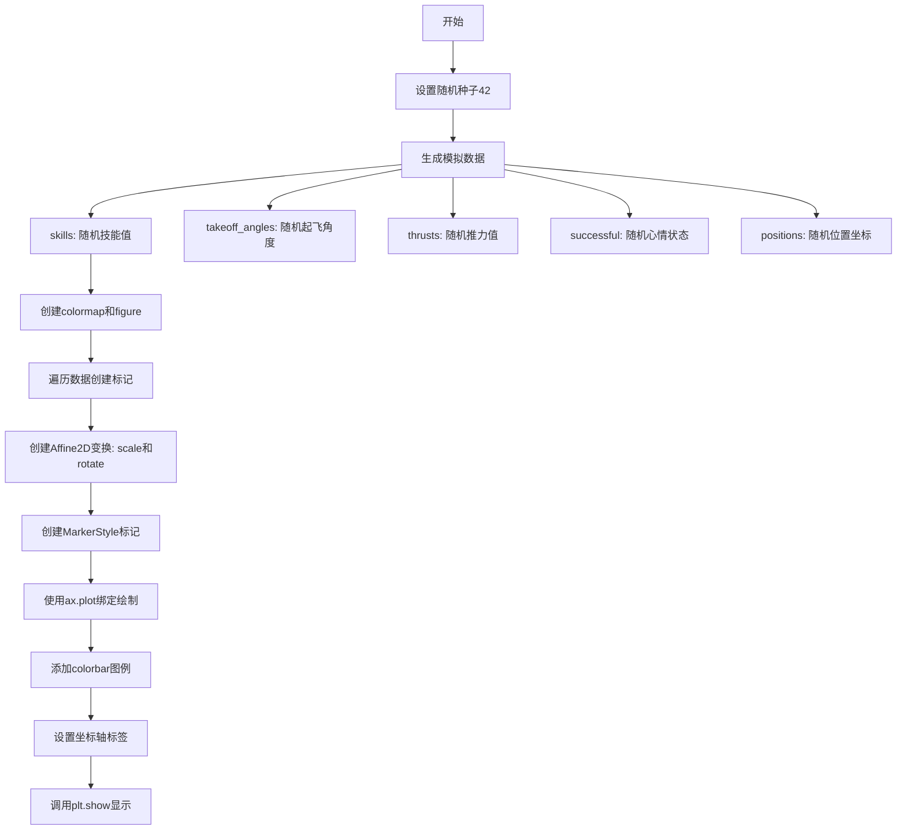

## 类结构

```
Python脚本 (无自定义类)
├── 使用 matplotlib 库
│   ├── MarkerStyle (标记样式类)
│   ├── TextPath (文本路径类)
│   ├── Affine2D (二维仿射变换类)
│   └── Normalize (归一化类)
```

## 全局变量及字段


### `SUCCESS_SYMBOLS`
    
心情符号路径列表，包含三个表情符号路径（难过、严肃、开心）用于表示投掷结果

类型：`list[TextPath]`
    


### `N`
    
数据点数量，值为25，表示生成的随机投掷数据条目数

类型：`int`
    


### `skills`
    
投掷技能数组，范围5-13，表示投掷者的技能水平

类型：`np.ndarray`
    


### `takeoff_angles`
    
起飞角度数组，正态分布均值0标准差90度，表示投掷的角度

类型：`np.ndarray`
    


### `thrusts`
    
推力数组，0-1之间均匀分布，表示推力大小

类型：`np.ndarray`
    


### `successful`
    
心情状态数组，整数值0-2，表示投掷结果的心情符号索引

类型：`np.ndarray`
    


### `positions`
    
位置坐标数组，正态分布，表示投掷在2D空间中的位置

类型：`np.ndarray`
    


### `data`
    
上述数据的组合迭代器，用于遍历所有投掷参数

类型：`zip`
    


### `cmap`
    
plasma颜色映射，用于将推力值映射为颜色

类型：`Colormap`
    


### `fig`
    
matplotlib图形对象，包含整个图表容器

类型：`Figure`
    


### `ax`
    
matplotlib坐标轴对象，用于绑制数据点和设置坐标轴

类型：`Axes`
    


    

## 全局函数及方法


### `plt.colormaps`

获取 matplotlib 中预定义的颜色映射（colormap），返回一个 Colormap 对象。

参数：

-  `name`：字符串类型，颜色映射的名称（如 "plasma", "viridis", "coolwarm" 等）

返回值：`matplotlib.colors.Colormap`，颜色映射对象，用于将数据值映射到颜色

#### 流程图

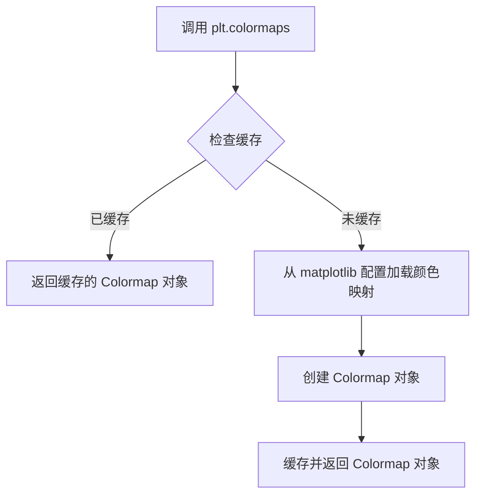

#### 带注释源码

```python
# 获取名为 "plasma" 的颜色映射
cmap = plt.colormaps["plasma"]

# plt.colormaps 是 matplotlib.cm.ColormapRegistry 类的实例
# 它是一个类似字典的对象，存储了所有可用的颜色映射
# 当传入颜色映射名称时，返回对应的 Colormap 对象

# 参数说明：
# - name: 字符串类型，指定颜色映射的名称
#   可选值包括: 'viridis', 'plasma', 'inferno', 'magma', 'cividis', 
#              'coolwarm', 'RdBu', 'jet', 'rainbow' 等

# 返回值：
# - Colormap 对象，用于将数值数据映射到颜色
#   可以通过 cmap(value) 将 [0, 1] 范围内的值转换为对应的 RGBA 颜色

# 使用示例：
# thrust 是一个在 [0, 1] 范围内的数值
color = cmap(thrust)  # 返回 RGBA 元组，如 (0.1, 0.2, 0.5, 1.0)
```


### `plt.subplots`

`plt.subplots` 是 matplotlib 库中的一个核心函数，用于创建一个新的图形窗口（Figure）以及一个或多个子图坐标轴（Axes），并返回图形和坐标轴对象的元组，是进行数据可视化的基础入口。

参数：

- `nrows`：`int`，默认值为 1，表示子图的行数
- `ncols`：`int`，默认值为 1，表示子图的列数
- `sharex`：`bool` 或 `str`，默认值为 False，控制是否共享 x 轴（True/'row'/'col'）
- `sharey`：`bool` 或 `str`，默认值为 False，控制是否共享 y 轴（True/'row'/'col'）
- `squeeze`：`bool`，默认值为 True，是否压缩返回的 Axes 数组维度
- `width_ratios`：`array-like`，可选，表示每列宽度的相对比例
- `height_ratios`：`array-like`，可选，表示每行高度的相对比例
- `subplot_kw`：`dict`，可选，创建子图时传递给 `add_subplot` 的关键字参数
- `gridspec_kw`：`dict`，可选，创建 GridSpec 时使用的关键字参数
- `**fig_kw`：可选，创建 Figure 时传递的其他关键字参数（如 `figsize`、`dpi` 等）

返回值：`Tuple[Figure, Axes]`，返回一个元组，包含一个 `Figure` 对象和一个 `Axes` 对象（当 `nrows=1` 且 `ncols=1` 且 `squeeze=True` 时），或返回一个 `Figure` 对象和一个 `Axes` 数组（当有多个子图时）。

#### 流程图

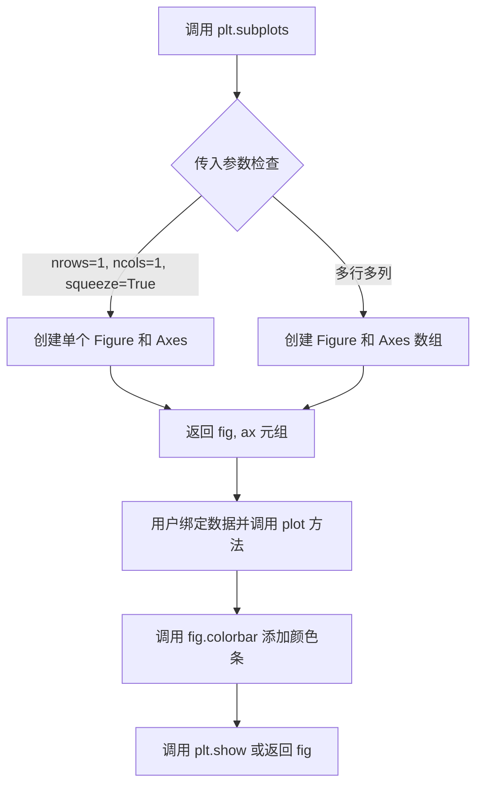

#### 带注释源码

```python
# 代码中的实际调用
fig, ax = plt.subplots()

# 详细参数说明：
# fig: matplotlib.figure.Figure 对象，代表整个图形窗口
#   - 包含所有子图、图例、颜色条等元素
#   - 可以设置图形的整体属性（如大小、dpi、背景色）
# ax: matplotlib.axes.Axes 对象，代表单个坐标轴
#   - 用于绑定数据并绘制各种类型的图表
#   - 包含 x 轴、y 轴、标题、刻度等元素

# 等效的完整调用形式：
# fig, ax = plt.subplots(
#     nrows=1,           # 1 行
#     ncols=1,           # 1 列
#     sharex=False,      # 不共享 x 轴
#     sharey=False,      # 不共享 y 轴
#     squeeze=True,      # 压缩维度，返回标量而非数组
#     figsize=None,     # 图形尺寸（可选，如 (width, height)）
#     dpi=None,          # 每英寸点数（可选）
# )

# 后续操作：
# 1. 设置图形标题
# fig.suptitle("Throwing success", size=14)
#
# 2. 绑定数据并绘制
# ax.plot(pos[0], pos[1], marker=m, color=cmap(thrust))
#
# 3. 添加颜色条
# fig.colorbar(plt.cm.ScalarMappable(...), ax=ax, label="...")
#
# 4. 设置坐标轴标签
# ax.set_xlabel("X position [m]")
# ax.set_ylabel("Y position [m]")
#
# 5. 显示图形
# plt.show()
```

#### 上下文使用示例

```python
# 在给定代码中的完整使用流程：
# 1. 创建图形和坐标轴
fig, ax = plt.subplots()

# 2. 设置图形标题
fig.suptitle("Throwing success", size=14)

# 3. 遍历数据，绘制多个标记点
for skill, takeoff, thrust, mood, pos in data:
    # 创建变换对象（缩放和旋转）
    t = Affine2D().scale(skill).rotate_deg(takeoff)
    # 创建标记样式
    m = MarkerStyle(SUCCESS_SYMBOLS[mood], transform=t)
    # 绘制数据点
    ax.plot(pos[0], pos[1], marker=m, color=cmap(thrust))

# 4. 添加颜色条（图例的一种形式）
fig.colorbar(
    plt.cm.ScalarMappable(norm=Normalize(0, 1), cmap="plasma"),
    ax=ax,
    label="Normalized Thrust [a.u.]"
)

# 5. 设置坐标轴标签
ax.set_xlabel("X position [m]")
ax.set_ylabel("Y position [m]")

# 6. 显示图形
plt.show()
```


### `Figure.colorbar`

向图形添加颜色条（colorbar），用于显示颜色映射与数据值的对应关系。在本代码中，它用于显示归一化推力（Normalized Thrust）的颜色映射图例。

参数：

-  `mappable`：`matplotlib.cm.ScalarMappable`，必选，定义颜色映射和归一化的对象，通常由 `plt.cm.ScalarMappable(norm=Normalize(...), cmap=...)` 创建
-  `ax`：`matplotlib.axes.Axes`，可选，关联的 Axes 对象，用于确定颜色条的位置和大小
-  `label`：字符串，可选，颜色条的标签文字，描述颜色所代表的数据含义（本例为 "Normalized Thrust [a.u.]"）
-  `cax`：`matplotlib.axes.Axes`，可选，指定颜色条所在的 Axes
-  `use_gridspec`：布尔值，可选，是否使用 gridspec 布局
-  `orientation`：字符串，可选，颜色条方向（'vertical' 或 'horizontal'）
-  `fraction`：浮点数，可试，颜色条占主 Axes 的比例
-  `shrink`：浮点数，可选，颜色条缩放因子
-  `aspect`：整数或浮点数，可选，颜色条长宽比

返回值：`matplotlib.colorbar.Colorbar`，返回创建的 Colorbar 对象，用于进一步自定义颜色条

#### 流程图

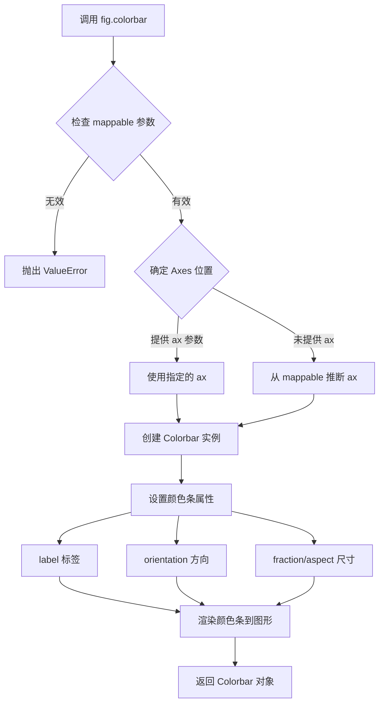

#### 带注释源码

```python
# 代码中的实际调用
fig.colorbar(
    # 第一个位置参数：mappable
    # 创建 ScalarMappable 对象，定义颜色映射规则
    plt.cm.ScalarMappable(
        norm=Normalize(0, 1),    # 归一化：将数据映射到 [0, 1] 范围
        cmap="plasma"           # 使用 plasma 颜色映射
    ),
    ax=ax,                       # 关键字参数：关联的 Axes 对象
    label="Normalized Thrust [a.u.]"  # 关键字参数：颜色条标签
)

# 等效的完整调用形式（展示所有可用参数）
fig.colorbar(
    mappable=plt.cm.ScalarMappable(norm=Normalize(0, 1), cmap="plasma"),
    cax=None,                   # 未指定，使用自动生成的 cax
    ax=ax,                      # 指定颜色条所属的 Axes
    use_gridspec=True,          # 使用 gridspec 布局
    orientation='vertical',     # 默认垂直方向
    fraction=0.15,              # 颜色条占主 Axes 的比例
    shrink=1.0,                 # 不缩放
    aspect=20,                  # 长宽比
    pad=None,                   # 使用默认间距
    anchor=None,                # 使用默认锚点
    panchor=None,               # 使用默认锚点
    label="Normalized Thrust [a.u.]",  # 标签文字
    **kwargs                    # 其他 matplotlib 支持的关键字参数
)
```

#### 关键组件信息

| 组件名称 | 一句话描述 |
|----------|------------|
| ScalarMappable | 将数据值映射到颜色空间的类，包含 norm 和 cmap 属性 |
| Normalize | 数据归一化类，将任意范围的数据映射到 [0, 1] |
| Colorbar | 颜色条对象，表示图形中的颜色图例 |

#### 潜在技术债务与优化空间

1. **硬编码颜色映射**：代码中重复使用 `"plasma"` 颜色映射和 `Normalize(0, 1)`，建议提取为配置常量
2. **Magic Numbers**：fraction=0.15、aspect=20 等布局参数缺乏注释说明
3. **缺少错误处理**：如果 ax 为 None 或 mappable 无效，没有明确的错误提示
4. **可访问性**：颜色条缺少对色盲友好的颜色映射选择

#### 其它说明

- **设计目标**：颜色条用于可视化连续数据值的颜色映射关系，帮助用户理解图形中点的颜色所代表的数据含义
- **约束**：颜色条需要关联有效的 Axes 和有效的 ScalarMappable 对象
- **错误处理**：如果 mappable 没有关联的 Axes 且未提供 ax 参数，将抛出 ValueError
- **外部依赖**：matplotlib 库的核心功能


### `plt.cm.ScalarMappable`

ScalarMappable 是 matplotlib.cm 模块中的核心类，用于将标量数值映射到颜色值。它结合了数据规范化器（norm）和颜色映射（cmap），通常与 colorbar 配合使用来创建数据的颜色图例，使观众能够理解数据值的颜色含义。

参数：

- `norm`：`Normalize`，数据规范化对象，定义数据值到 [0, 1] 范围的映射规则
- `cmap`：`str`，颜色映射名称，指定使用的颜色方案（如 "plasma"、"viridis" 等）

返回值：`ScalarMappable`，标量映射对象，可用于将数据值转换为颜色

#### 流程图

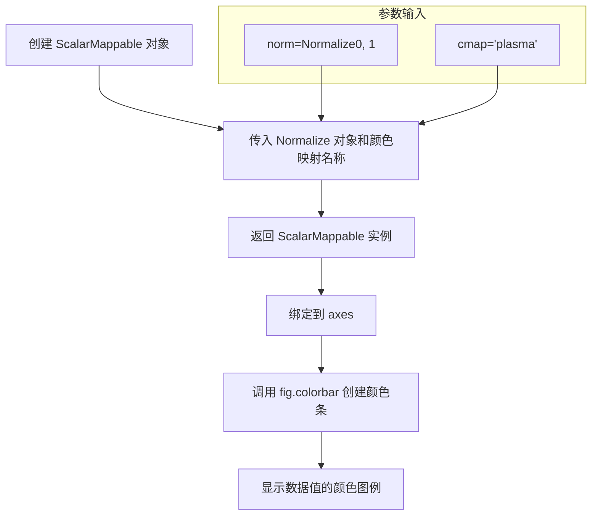

#### 带注释源码

```python
# 创建 ScalarMappable 对象
# 参数说明：
#   norm: Normalize 对象，将数据值规范化为 [0, 1] 范围
#          Normalize(0, 1) 表示将数据从 0-1 范围映射到 0-1
#   cmap: str，指定颜色映射方案，"plasma" 是 matplotlib 内置的蓝-黄-红渐变色图
fig.colorbar(
    plt.cm.ScalarMappable(
        norm=Normalize(0, 1),  # 创建规范化器，将数据范围 [0, 1] 映射到 [0, 1]
        cmap="plasma"          # 指定使用 plasma 颜色映射
    ),
    ax=ax,                     # 将颜色条绑定到 axes 对象
    label="Normalized Thrust [a.u.]"  # 设置颜色条标签
)
```


### `ax.plot`

该函数是 `matplotlib.axes.Axes` 对象的方法，用于在当前坐标轴上绘制数据点。在给定的代码示例中，它被用于将随机生成的位置数据以特定的标记样式和颜色绘制在二维坐标系中，实现了一个多维数据可视化的效果（例如将投掷技能、起飞角度和推力映射到标记的大小、旋转和颜色）。

参数：

- `x`：`float` 或 `array-like`，待绘制数据点的 X 轴坐标。代码中传入 `pos[0]`。
- `y`：`float` 或 `array-like`，待绘制数据点的 Y 轴坐标。代码中传入 `pos[1]`。
- `marker`：`MarkerStyle` 或 `str`，关键字参数，用于指定数据点的标记样式。代码中传入 `MarkerStyle` 对象 `m`，该对象包含了自定义的形状（笑脸/哭脸）和旋转角度（由起飞角度决定）。
- `color`：`color` 或 `array-like`，关键字参数，用于指定线条和标记的颜色。代码中传入通过色彩映射表 `cmap` 处理后的颜色值 `cmap(thrust)`，其中 `thrust` 代表推力。

返回值：`list of Line2D`，返回包含所有绑制线条的 `Line2D` 对象列表。在代码中虽然未直接接收该返回值，但后续可以通过 `ax.lines` 访问。

#### 流程图

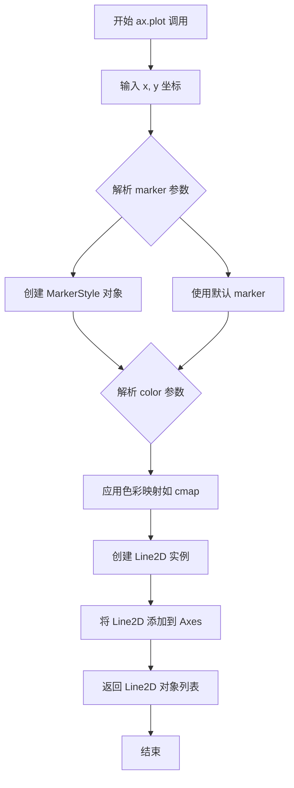

#### 带注释源码

```python
# 遍历数据集中的每一个样本
for skill, takeoff, thrust, mood, pos in data:
    # 1. 变换操作：创建仿射变换对象
    # scale(skill): 根据技能水平缩放标记大小
    # rotate_deg(takeoff): 根据起飞角度旋转标记
    t = Affine2D().scale(skill).rotate_deg(takeoff)
    
    # 2. 标记样式创建：使用变换后的仿射变换创建自定义标记
    # SUCCESS_SYMBOLS[mood]: 根据心情状态（成功/失败/中立）选择不同的字符路径（☹, ☒, ☺）
    m = MarkerStyle(SUCCESS_SYMBOLS[mood], transform=t)
    
    # 3. 绑制调用：绘制数据点
    # pos[0], pos[1]: 数据的 x 和 y 坐标
    # marker=m: 应用自定义的标记样式（形状和旋转）
    # color=cmap(thrust): 将推力（thrust）通过 plasma 色彩映射表转换为颜色
    ax.plot(pos[0], pos[1], marker=m, color=cmap(thrust))
```


### `ax.set_xlabel`

设置X轴的标签，用于描述X轴所表示的数据含义和单位。

参数：

- `xlabel`：`str`，X轴标签的文本内容，如"X position [m]"
- `fontdict`：`dict`，可选，用于设置文本属性的字典（如字体大小、颜色等）
- `labelpad`：`float`，可选，标签与轴之间的间距（磅值）
- `**kwargs`：可变关键字参数，其他传递给`matplotlib.text.Text`对象的属性（如字体样式、颜色等）

返回值：`matplotlib.text.Text`，返回创建的文本对象，可用于后续进一步自定义标签样式

#### 流程图

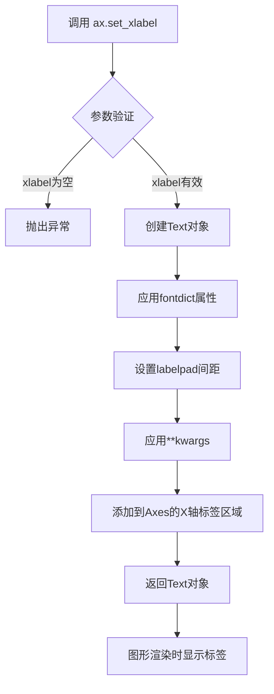

#### 带注释源码

```python
# 在示例代码中的调用方式
ax.set_xlabel("X position [m]")

# set_xlabel 方法的内部实现逻辑（简化版）
def set_xlabel(self, xlabel, fontdict=None, labelpad=None, **kwargs):
    """
    设置X轴标签
    
    参数:
        xlabel: str - 标签文本
        fontdict: dict - 文本属性字典
        labelpad: float - 标签与轴的间距
        **kwargs: 其他Text属性
    """
    # 1. 获取默认的标签位置参数
    default_loc = 'left'  # 默认从左侧开始
    
    # 2. 如果提供了fontdict，解析其中的字体属性
    if fontdict:
        kwargs.update(fontdict)
    
    # 3. 创建Text对象并设置标签文本
    label = self.xaxis.label
    label.set_text(xlabel)
    
    # 4. 应用其他属性（如颜色、字体大小等）
    label.update(kwargs)
    
    # 5. 如果指定了labelpad，设置标签与轴的间距
    if labelpad is not None:
        self.xaxis.labelpad = labelpad
    
    # 6. 返回创建的Text对象，便于后续修改
    return label
```


# ax.set_ylabel 方法详细信息

### `ax.set_ylabel` - 设置Y轴标签

该方法用于设置Axes对象的Y轴标签文本，可以配置标签的字体属性、位置、对齐方式等参数。返回值为一个`Text`对象，表示设置后的Y轴标签。

参数：

- `ylabel`：`str`，Y轴标签的文本内容
- `fontdict`：可选参数，`dict`，用于控制标签外观的字体字典（如字体大小、颜色等）
- `labelpad`：可选参数，`float`，标签与坐标轴之间的间距（以点为单位）
- `kwargs`：可选参数，用于传递额外的文本属性参数

返回值：`matplotlib.text.Text`，返回设置后的文本对象

#### 流程图

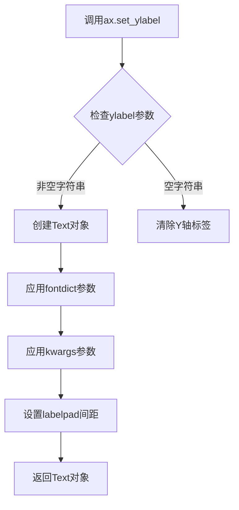

#### 带注释源码

```python
# 以下是matplotlib中set_ylabel方法的简化实现逻辑
def set_ylabel(self, ylabel, fontdict=None, labelpad=None, **kwargs):
    """
    设置Y轴标签
    
    参数:
        ylabel: str - Y轴标签文本
        fontdict: dict - 字体属性字典（如{'fontsize': 12, 'color': 'red'}）
        labelpad: float - 标签与坐标轴的间距（单位：点）
        **kwargs: 额外的Text属性参数
    
    返回:
        Text对象 - 设置后的标签对象
    """
    # 1. 获取Y轴标签文本
    # 如果ylabel为None，使用默认值
    if ylabel is None:
        ylabel = ''
    
    # 2. 创建文本对象并设置基本属性
    # labelpad控制标签与Y轴的距离
    if labelpad is not None:
        self._labelpad = labelpad
    
    # 3. 应用字体字典属性
    # fontdict可以一次性设置多个文本属性
    if fontdict is not None:
        kwargs.update(fontdict)
    
    # 4. 设置Y轴标签
    # 返回Text对象，可用于后续样式设置
    return self.yaxis.set_label_text(ylabel, **kwargs)
```

**在示例代码中的实际调用：**

```python
ax.set_ylabel("Y position [m]")
```

这行代码将Y轴的标签设置为"position [m]"，返回的Text对象可以用于进一步自定义标签样式（如字体大小、颜色等）。


### `plt.show`

`plt.show` 是 matplotlib 库中的全局函数，用于显示当前所有打开的图形窗口，并将图形渲染到屏幕。该函数会阻塞程序执行（除非设置了 `block=False`），直到用户关闭图形窗口或调用 `plt.close()`。

参数：

- `block`：`bool`，可选参数。控制是否阻塞主线程。默认值为 `True`，表示阻塞等待用户关闭图形窗口；设置为 `False` 时则立即返回。

返回值：`None`，该函数无返回值。

#### 流程图

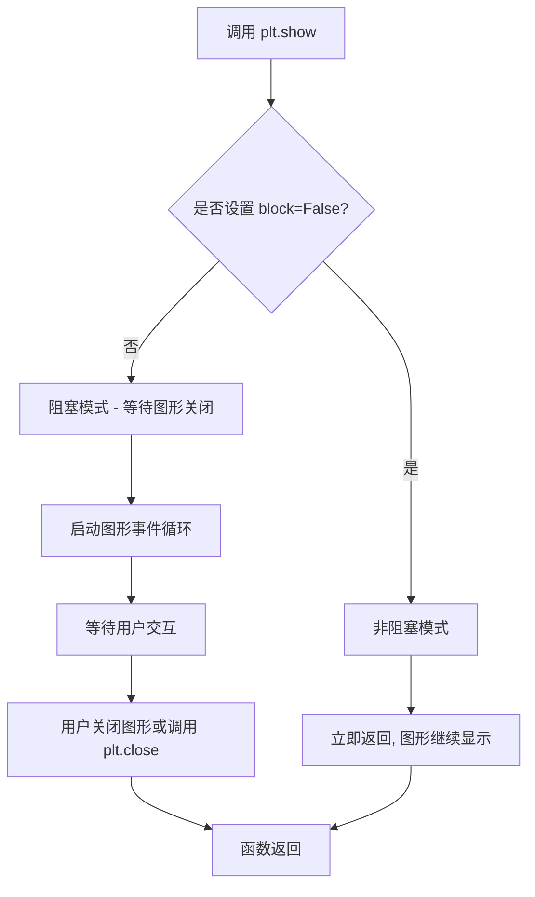

#### 带注释源码

```python
def show(*, block=None):
    """
    显示所有打开的图形窗口。
    
    此函数会遍历当前所有的图形（Figure），并将其显示出来。
    在默认阻塞模式下，会启动图形的事件循环，
    等待用户与图形进行交互直至关闭。
    
    Parameters
    ----------
    block : bool, optional
        如果设置为 True（默认），则阻塞程序执行直到用户关闭所有图形窗口。
        如果设置为 False，则立即返回，图形窗口保持显示状态。
    
    Returns
    -------
    None
    
    Examples
    --------
    >>> import matplotlib.pyplot as plt
    >>> plt.plot([1, 2, 3], [1, 4, 9])
    >>> plt.show()  # 阻塞模式，显示图形并等待用户关闭
    
    >>> plt.show(block=False)  # 非阻塞模式，立即返回
    """
    # 获取当前所有的图形管理器
    for manager in Gcf.get_figManagers():
        # 尝试将图形绘制到显示设备
        # 如果block为True，则阻塞等待用户关闭
        # 如果block为False，则立即返回
        manager.show(block=block)
```


### `Affine2D.scale`

该方法是 matplotlib 的 `Affine2D` 类的缩放变换方法，用于创建二维缩放仿射变换。它接受缩放因子作为参数，返回一个 Affine2D 对象以支持链式调用。在示例代码中，它将 skill 参数作为缩放因子，对marker进行相应的缩放操作。

参数：

- `sx`：`float` 或 `tuple`，水平缩放因子，如果 sy 为 None 则同时作为水平和垂直缩放因子
- `sy`：`float`，可选，垂直缩放因子

返回值：`Affine2D`，返回包含缩放变换的 Affine2D 对象自身，支持链式调用

#### 流程图

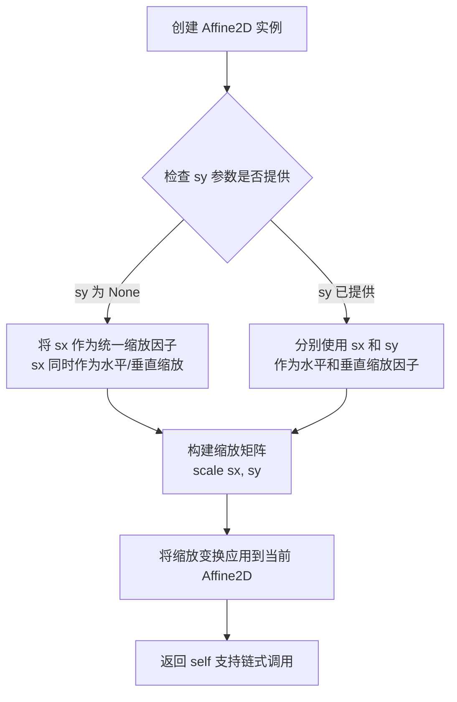

#### 带注释源码

```python
def scale(self, sx, sy=None):
    """
    添加缩放变换
    
    参数:
        sx: float 或 (float, float)
            - 如果是 float: 同时作为水平(sx)和垂直(sy)缩放因子
            - 如果是 tuple: (水平缩放, 垂直缩放)
        sy: float, 可选
            - 垂直缩放因子, 仅当 sx 为 float 时使用
    
    返回:
        self: Affine2D
            - 返回自身以支持链式调用
    """
    if sy is None:
        # 如果只提供一个参数, 则 uniform scaling (均匀缩放)
        # 即水平和垂直使用相同的缩放因子
        self._mtx = np.array([
            [sx, 0.0, 0.0],
            [0.0, sx, 0.0],
            [0.0, 0.0, 1.0]
        ], float)
    else:
        # 如果提供两个参数, 则非均匀缩放
        # sx 控制水平缩放, sy 控制垂直缩放
        self._mtx = np.array([
            [sx, 0.0, 0.0],
            [0.0, sy, 0.0],
            [0.0, 0.0, 1.0]
        ], float)
    
    # 重新计算其他相关矩阵
    self._inverted = None
    self._invalid = 0
    return self  # 返回 self 支持链式调用, 如 .scale().rotate()
```


### `Affine2D.rotate_deg`

该方法是 matplotlib 的仿射变换类 `Affine2D` 的成员方法，用于创建旋转变换。它接收以度为单位的旋转角度，返回一个新的 `Affine2D` 对象，该对象包含了指定的旋转变换。

参数：

- `degrees`：`float` 或 `array-like`，旋转角度，单位为度。正值表示逆时针旋转，负值表示顺时针旋转。

返回值：`Affine2D`，返回一个新的 `Affine2D` 对象，包含旋转变换，可用于后续的变换组合（如缩放、平移等）。

#### 流程图

```mermaid
flowchart TD
    A[开始 rotate_deg] --> B{输入验证<br/>degrees 是否为有效数值}
    B -->|是| C[将角度从度转换为弧度<br/>radians = degrees * π / 180]
    B -->|否| D[抛出异常或返回单位变换]
    C --> E[构造旋转矩阵<br/>[cos(θ) -sin(θ)<br/> sin(θ)  cos(θ)]]
    E --> F[将旋转矩阵与当前变换矩阵相乘]
    F --> G[创建新的 Affine2D 对象<br/>包含组合后的变换矩阵]
    G --> H[返回新的 Affine2D 对象]
```

#### 带注释源码

```python
# Affine2D.rotate_deg 方法的简化实现原理
def rotate_deg(self, degrees):
    """
    向当前变换添加旋转变换（按度数）
    
    参数:
        degrees: float 或 array-like
            旋转角度（度）
    
    返回:
        Affine2D: 新的 Affine2D 对象，包含旋转变换
    """
    import math
    
    # 1. 将度数转换为弧度
    # 数学公式: radians = degrees * (π / 180)
    radians = math.radians(degrees)
    
    # 2. 计算旋转矩阵的三角函数值
    # 2D旋转矩阵:
    # [ cos(θ)  -sin(θ) ]
    # [ sin(θ)   cos(θ) ]
    cos_a = math.cos(radians)
    sin_a = math.sin(radians)
    
    # 3. 构造旋转矩阵（仿射变换的线性部分）
    # Affine2D 使用 2x3 矩阵表示 2D 仿射变换
    # [a  b  tx]    [cos(θ)  -sin(θ)  0]
    # [c  d  ty] =  [sin(θ)   cos(θ)  0]
    matrix = (cos_a, -sin_a, 0.0,
              sin_a,  cos_a, 0.0)
    
    # 4. 将旋转矩阵与当前变换矩阵相乘
    # transform = rotation_matrix × current_transform
    self._mtx = np.dot(matrix, self._mtx)
    
    # 5. 返回 self（支持链式调用）
    # 例如: Affine2D().rotate_deg(90).scale(2)
    return self


# 在示例代码中的使用方式:
# t = Affine2D().scale(skill).rotate_deg(takeoff)
# 等价于: 先创建缩放变换，再组合旋转变换
# 最终变换矩阵 = 旋转矩阵 × 缩放矩阵
```


### `Affine2D.scale`

该方法是 matplotlib.transforms.Affine2D 类中的缩放变换方法，用于创建二维仿射变换的缩放操作，支持统一缩放或非均匀缩放，并返回一个新的 Affine2D 对象以支持链式调用。

参数：

- `self`：隐式参数，Affine2D 实例本身
- `sx`：`float` 或 `tuple[float, float]`，X 轴方向的缩放因子，或包含 (X, Y) 缩放因子的元组
- `sy`：`float`，可选参数，Y 轴方向的缩放因子（仅当 sx 为 float 时使用）

返回值：`Affine2D`，返回一个新的 Affine2D 变换对象，包含缩放变换

#### 流程图

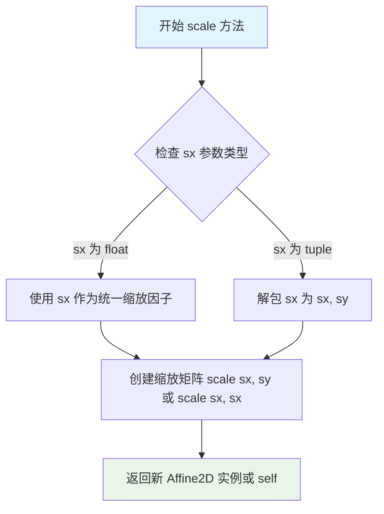

#### 带注释源码

```python
def scale(self, sx, sy=None):
    """
    添加缩放变换到当前变换矩阵
    
    参数:
    -------
    sx : float 或 tuple(float, float)
        如果为 float，则 X 和 Y 使用相同的缩放因子。
        如果为 tuple，则 (sx[0], sx[1]) 分别作为 X 和 Y 的缩放因子。
    sy : float, 可选
        Y 轴方向的缩放因子。仅当 sx 为 float 时使用。
    
    返回值:
    -------
    Affine2D
        返回新的 Affine2D 实例，包含缩放变换
    
    示例:
    -------
    >>> t = Affine2D().scale(2.0)      # 统一缩放 2 倍
    >>> t = Affine2D().scale(2.0, 3.0) # X 缩放 2 倍，Y 缩放 3 倍
    >>> t = Affine2D().scale((2.0, 3.0)) # 与上面等价
    """
    if isinstance(sx, tuple):
        sx, sy = sx
    # 如果只提供了一个缩放因子，则 X 和 Y 使用相同值
    if sy is None:
        sy = sx
    # 创建缩放变换矩阵并与当前矩阵相乘
    return self.concat(Affine2D().scale(sx, sy), freeze=self.is冻结)
```

#### 在示例代码中的使用

```python
# 从示例代码中提取
t = Affine2D().scale(skill).rotate_deg(takeoff)

# 这里的 scale(skill) 调用：
# - skill 是一个 float 值（5.0 到 13.0 之间）
# - 创建统一缩放变换，X 和 Y 轴使用相同的缩放因子
# - 返回新的 Affine2D 对象，支持链式调用 .rotate_deg(takeoff)
```


### `Affine2D.rotate_deg`

该方法用于创建一个二维旋转变换，旋转角度以度为单位。通过将输入的角度从度转换为弧度，然后计算旋转矩阵，并返回一个包含该旋转的仿射变换对象。

参数：
- `degrees`：`float`，要旋转的角度，单位为度。正值表示逆时针旋转，负值表示顺时针旋转。

返回值：`Affine2D`，返回一个新的 `Affine2D` 实例，其中包含了旋转变换。该返回对象可以与其他变换（如缩放、平移）链接组合。

#### 流程图

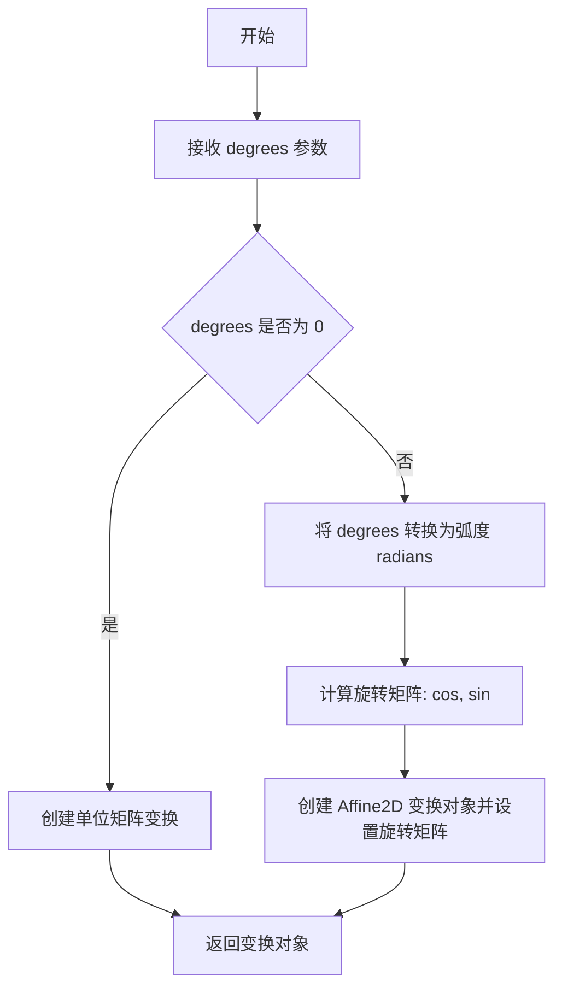

#### 带注释源码

```python
def rotate_deg(self, degrees):
    """
    添加旋转（以度为单位）。

    参数:
        degrees: 旋转角度（度）。

    返回:
        包含旋转的 Affine2D 变换。
    """
    # 将角度转换为弧度
    radians = np.deg2rad(degrees)
    
    # 计算旋转矩阵的旋转余弦和旋转正弦值
    sin_val = np.sin(radians)
    cos_val = np.cos(radians)
    
    # 构建二维旋转矩阵:
    # [ cos -sin  0 ]
    # [ sin  cos  0 ]
    # [  0    0   1 ]
    
    # 将旋转矩阵与当前变换矩阵相乘并返回新的变换对象
    return self._concat(sin_val, cos_val, -sin_val, cos_val, 0, 0)
```

## 关键组件


### SUCCESS_SYMBOLS

使用 TextPath 创建的自定义标记形状数组，包含三个emoji表情（☹、😒、☺）作为标记符号，用于表示投掷成功的不同状态。

### data

通过 zip 函数组合的多变量数据集，包含技能值、起飞角度、推力、心情状态和位置信息，用于在图表中绘制多元数据点。

### MarkerStyle 与 Affine2D 变换

使用 MarkerStyle 类结合 Affine2D 变换实现标记的缩放（scale）和旋转（rotate_deg），将技能值映射到标记大小，起飞角度映射到标记旋转角度，实现张量索引与惰性加载的可视化表达。

### cmap (colormap)

使用 plasma 配色方案将推力值映射为颜色，实现从推力到标记颜色的量化策略，支持连续数据的颜色可视化。

### Normalize 与 ScalarMappable

使用 Normalize 类将推力数据归一化到 [0, 1] 范围，配合 ScalarMappable 和 colorbar 实现标准化数据的颜色图例显示。

### plt.plot 标记绘制

通过 ax.plot() 的 marker 参数传入自定义 MarkerStyle 对象，结合 color 参数实现多元标记属性（形状、旋转、大小、颜色）的统一映射。

### 随机数据生成

使用 numpy 生成模拟投掷数据：skills（技能值）、takeoff_angles（起飞角度）、thrusts（推力值）、successful（成功状态）、positions（位置坐标），支持多变量可视化的样本数据。


## 问题及建议


### 已知问题

-   **zip迭代器一次性消耗问题**：`data = zip(skills, takeoff_angles, thrusts, successful, positions)` 创建的迭代器只能遍历一次，后续无法复用
-   **魔法数字和硬编码值**：技能范围系数（5, 80, 0.1, 5）、发射角度标准差（90）等数值直接硬编码，缺乏常量定义和解释
-   **全局作用域代码未封装**：所有代码堆叠在全局作用域，无法单独测试和复用
-   **重复的颜色映射定义**：`cmap = plt.colormaps["plasma"]` 和 `colorbar` 中的 `cmap="plasma"` 重复定义
-   **MarkerStyle对象重复创建**：循环内每次都创建新的MarkerStyle对象，可预先定义模板
-   **缺少类型注解**：所有变量均无类型标注，影响代码可读性和静态分析
-   **变量命名不够清晰**：单字母变量名（t, m, pos）缺乏描述性
-   **数据有效性未验证**：没有对生成的随机数据维度、范围进行检查

### 优化建议

-   将颜色映射提取为常量，避免重复定义：`PLASMA_CMAP = "plasma"`
-   使用列表或numpy数组替代zip迭代器，或直接在循环中使用索引
-   将硬编码数值提取为具名常量，配合注释说明其业务含义
-   考虑将绘图逻辑封装为函数，接收数据参数，提高可测试性
-   预先创建MarkerStyle模板，利用transform参数在每次绘图时复制和修改
-   添加变量类型注解和详细的docstring文档
-   增强变量命名描述性（如 `marker_transform` 替代 `t`，`marker_style` 替代 `m`）
-   添加数据验证逻辑，检查数组维度一致性
-   将SUCCESS_SYMBOLS等常量移入配置区域或单独的配置模块


## 其它


### 概述

该代码是一个matplotlib数据可视化示例，通过自定义MarkerStyle将多变量数据映射到标记的不同视觉属性上：标记大小表示投掷者技能水平，标记旋转表示起飞角度，标记颜色表示推力大小，并使用emoji符号表示成功心情。

### 整体运行流程

1. 导入必要的matplotlib和numpy模块
2. 定义SUCCESS_SYMBOLS表情符号路径列表（3个不同心情的emoji）
3. 生成随机多变量数据集：技能、起飞角度、推力、成功心情、位置坐标
4. 创建图形和坐标轴，设置标题
5. 遍历数据点，为每个点创建变换后的MarkerStyle并绘制
6. 添加颜色条和坐标轴标签
7. 显示图形

### 全局变量

#### skills
- 类型: numpy.ndarray
- 描述: 投掷者技能水平数组，值为5到13之间的随机浮点数

#### takeoff_angles
- 类型: numpy.ndarray
- 描述: 投掷起飞角度数组，服从均值为0、标准差为90的正态分布

#### thrusts
- 类型: numpy.ndarray
- 描述: 推力值数组，服从0到1之间的均匀分布

#### successful
- 类型: numpy.ndarray
- 描述: 成功心情索引数组，值为0、1、2，用于选择SUCCESS_SYMBOLS中的表情

#### positions
- 类型: numpy.ndarray
- 描述: 二维位置坐标数组，服从均值为0、标准差为5的正态分布

#### SUCCESS_SYMBOLS
- 类型: list[TextPath]
- 描述: 包含3个TextPath对象的列表，分别对应☹、😒、☺三个emoji字符

#### N
- 类型: int
- 描述: 数据点数量，设置为25

#### data
- 类型: zip对象
- 描述: 由skills、takeoff_angles、thrusts、successful、positions组成的迭代器

#### cmap
- 类型: Colormap
- 描述: plasma颜色映射对象，用于将推力值映射为颜色

### 全局函数

代码主要使用matplotlib和numpy的库函数，无自定义全局函数。调用的主要库函数包括：

- plt.colormaps["plasma"]: 获取plasma颜色映射
- plt.subplots(): 创建图形和坐标轴
- Affine2D().scale().rotate_deg(): 创建2D仿射变换（缩放和旋转）
- MarkerStyle(): 创建标记样式对象
- ax.plot(): 在坐标轴上绘制数据点
- fig.colorbar(): 添加颜色条

### 关键组件信息

#### MarkerStyle (matplotlib.markers)
- 负责创建自定义标记样式的核心类，支持通过transform参数应用仿射变换

#### Affine2D (matplotlib.transforms)
- 负责创建2D仿射变换矩阵，实现标记的缩放和旋转功能

#### TextPath (matplotlib.text)
- 负责将文本字符转换为路径，用于创建自定义emoji标记

#### ScalarMappable (plt.cm)
- 负责将数据值映射到颜色，负责颜色条的数据管理

#### Normalize (matplotlib.colors)
- 负责将数据值归一化到指定范围（0到1）

### 潜在技术债务与优化空间

1. **硬编码参数过多**: N值、随机种子、颜色映射名称、标记大小范围等均为硬编码，应提取为配置参数
2. **数据生成方式**: 使用固定随机种子生成测试数据，应提供从文件或外部源加载数据的接口
3. **缺乏错误处理**: 没有对输入数据进行校验（如负值、NaN、Inf检查）
4. **可扩展性不足**: SUCCESS_SYMBOLS固定为3个，无法动态扩展；颜色映射固定为plasma
5. **性能优化**: 循环中使用zip创建迭代器，每次都创建新的MarkerStyle对象，可考虑批量处理
6. **注释和文档**: 缺少docstring，代码可读性依赖于外部文档

### 设计目标与约束

- **设计目标**: 展示如何利用marker的多维属性（大小、旋转、颜色、形状）同时可视化多个数据维度
- **约束条件**: 
  - marker大小受技能值影响，范围约为5-13
  - 旋转角度范围受正态分布影响
  - 颜色值必须归一化到[0,1]范围
  - 受限于matplotlib的MarkerStyle和TextPath功能

### 错误处理与异常设计

1. **数据维度不匹配**: 若data中的任一数据维度长度不一致，zip会静默截断到最短长度，可能导致数据丢失
2. **索引越界**: successful数组值必须为0、1、2，否则MarkerStyle创建会抛出KeyError
3. **数值范围异常**: 颜色映射要求输入值在[0,1]范围，若thrusts超出此范围会被截断
4. **图形对象异常**: 若ax为None或未正确初始化，绘图操作会失败

### 数据流与状态机

数据流如下：
1. 初始化阶段：设置随机种子，定义数据维度
2. 数据生成阶段：通过numpy生成5个维度的随机数据
3. 可视化准备阶段：创建图形、坐标轴、颜色映射
4. 渲染阶段：遍历每个数据点，应用变换，创建marker，绘制到坐标轴
5. 后处理阶段：添加颜色条、坐标轴标签、标题

状态机流程：
- IDLE → DATA_GENERATED → FIGURE_CREATED → DATA_MAPPED → RENDERED → DISPLAYED

### 外部依赖与接口契约

- **matplotlib**: 核心绘图库，必须安装
- **numpy**: 数值计算库，必须安装
- **接口契约**:
  - 输入：5个等长的数据数组（skills, takeoff_angles, thrusts, successful, positions）
  - 输出：显示散点图，每个点具有独立的大小、旋转、颜色和形状属性
  - 返回值：plt.show()会阻塞程序直到图形关闭，无返回值

### 代码可配置项

以下参数可提取为配置文件或函数参数：
- N: 数据点数量
- 技能范围: 5到13（当前硬编码）
- 起飞角度分布: mean=0, std=90
- 颜色映射: "plasma"
- 表情符号列表: SUCCESS_SYMBOLS
- 坐标轴范围: 由数据自动决定
- 图形尺寸: 默认大小
</content]
    