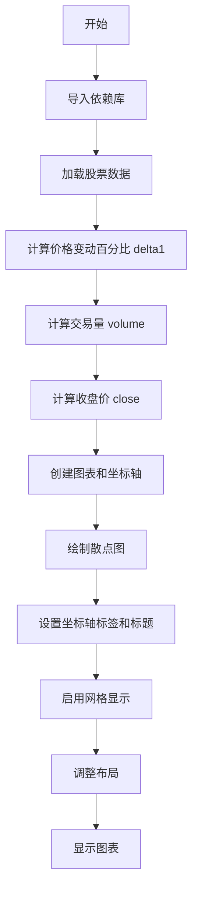
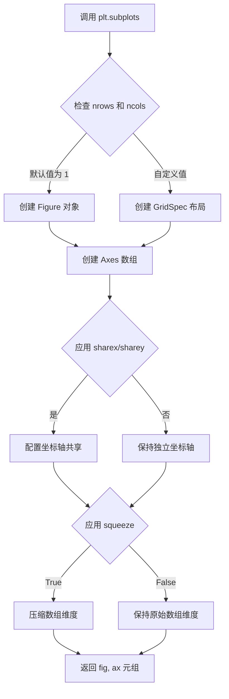
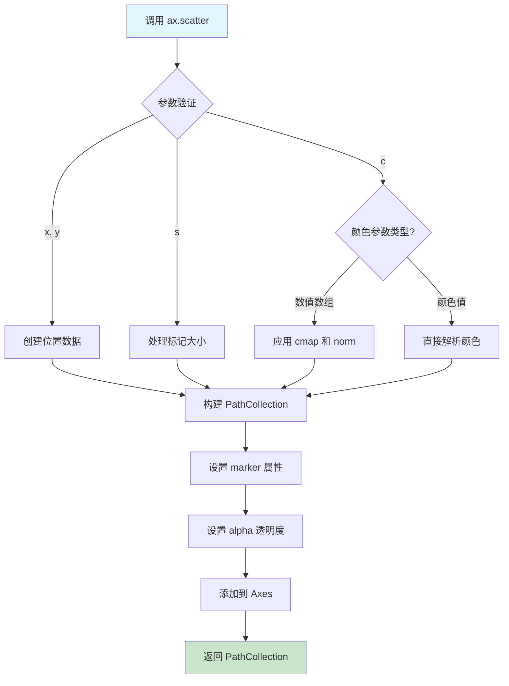
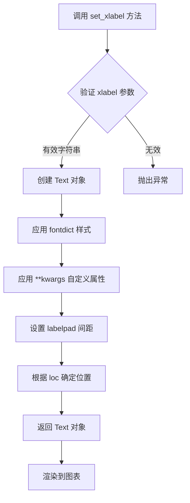
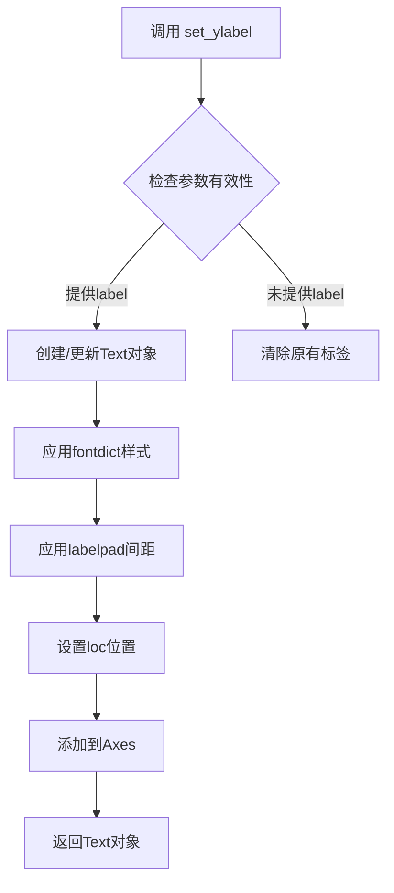
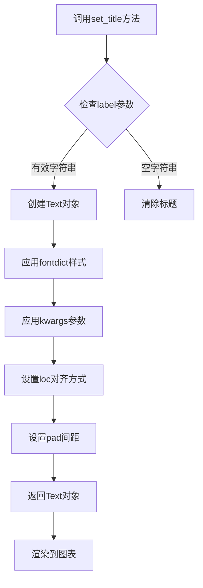
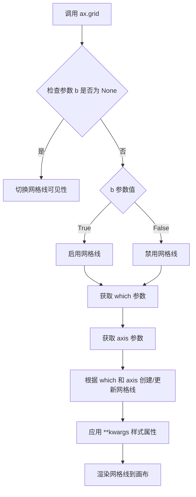
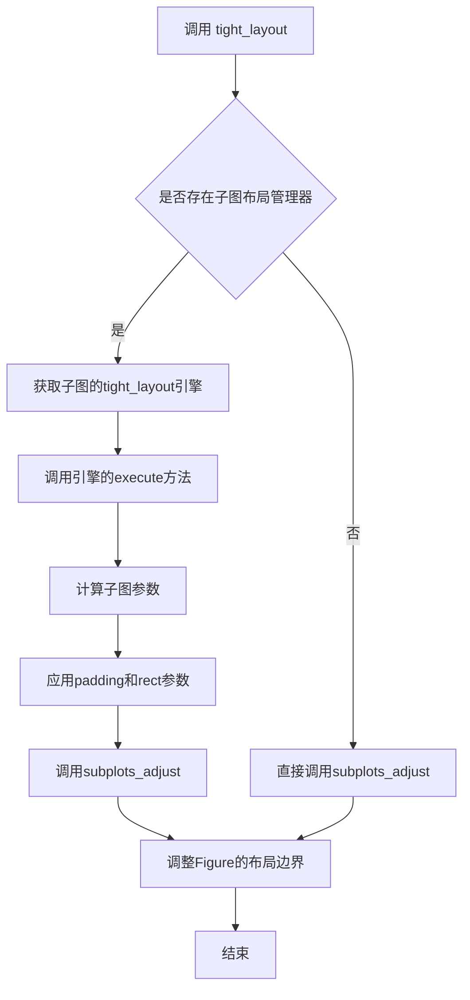
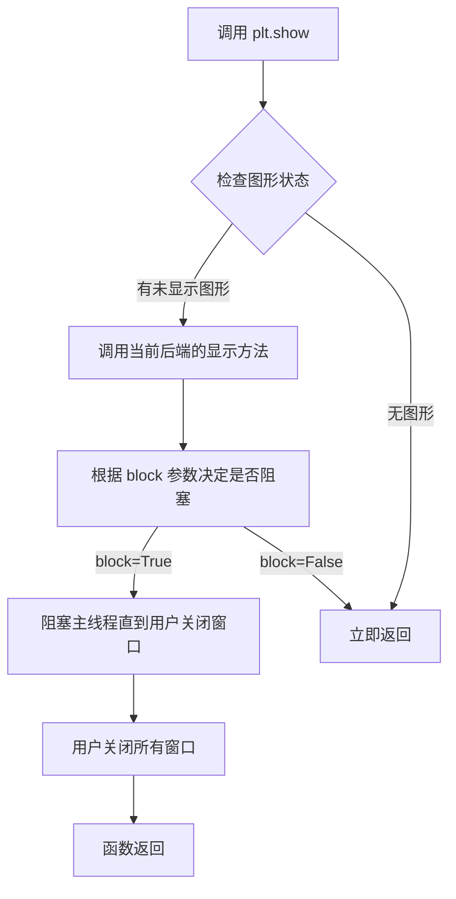
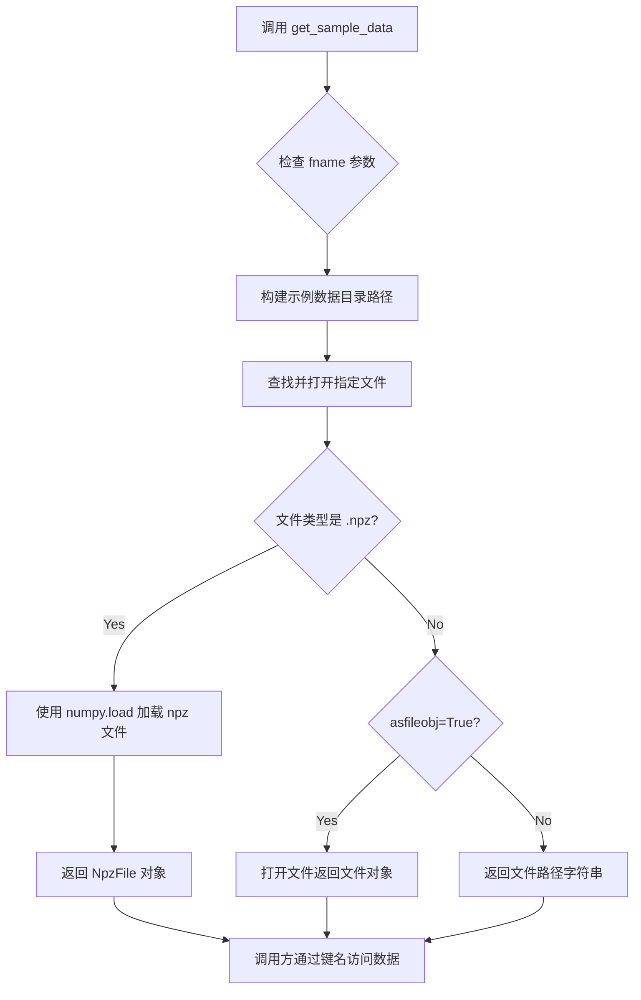

# `matplotlib\galleries\examples\lines_bars_and_markers\scatter_demo2.py` 详细设计文档

这是一个使用matplotlib绑定的散点图演示脚本，通过加载谷歌股票历史价格数据，计算价格变动百分比和交易量，以不同颜色和大小展示Delta_i与Delta_i+1之间的关系，用于可视化金融数据的相关性和交易量分布。

## 整体流程



## 类结构

```
无面向对象类结构 (本文件为过程式脚本)
```

## 全局变量及字段


### `price_data`
    
股票价格数据记录数组，包含date、open、high、low、close、volume、adj_close等字段

类型：`numpy.ndarray`
    


### `delta1`
    
调整后收盘价的百分比变化数组，通过相邻两天收盘价差值计算

类型：`numpy.ndarray`
    


### `volume`
    
用于标记大小的交易量数据，经过归一化和平方处理以控制散点图标记大小

类型：`numpy.ndarray`
    


### `close`
    
收盘价相关计算值，用于散点图的色彩映射

类型：`numpy.ndarray`
    


### `fig`
    
图表对象，整个图形的容器

类型：`matplotlib.figure.Figure`
    


### `ax`
    
坐标轴对象，包含图表的所有绘图元素和坐标轴设置

类型：`matplotlib.axes.Axes`
    


    

## 全局函数及方法


### `plt.subplots`

`plt.subplots` 是 matplotlib.pyplot 模块中的函数，用于创建一个新的 Figure（图形）对象和一个或多个 Axes（坐标轴）对象，返回它们的元组。该函数封装了 figure 创建、add_subplot 调用和 subplot2grid 逻辑，是创建多子图布局的标准高效方式。

参数：

- `nrows`：`int`，行数，默认为 1
- `ncols`：`int`，列数，默认为 1
- `sharex`：`bool` 或 `str`，如果为 True，则所有子图共享 x 轴；如果为 'col'，则每列共享 x 轴
- `sharey`：`bool` 或 `str`，如果为 True，则所有子图共享 y 轴；如果为 'row'，则每行共享 y 轴
- `squeeze`：`bool`，默认为 True，如果为 True，则返回的 Axes 对象数组维度压缩为最低维度（单子图返回单个 Axes 对象而非数组）
- `width_ratios`：`array-like`，可选，定义每列的相对宽度
- `height_ratios`：`array-like`，可选，定义每行的相对高度
- `subplot_kw`：`dict`，可选，关键字参数传递给 add_subplot，用于创建每个子图
- `gridspec_kw`：`dict`，可选，关键字参数传递给 GridSpec 构造函数
- `fig_kw`：`dict`，可选，关键字参数传递给 Figure 构造函数

返回值：`tuple`，包含 `(Figure, Axes)` 或 `(Figure, ndarray of Axes)`。第一个返回值是 Figure 对象，第二个返回值是 Axes 对象（单子图时）或 Axes 对象数组（多子图时）。

#### 流程图



#### 带注释源码

```python
def subplots(nrows=1, ncols=1, sharex=False, sharey=False, squeeze=True,
             width_ratios=None, height_ratios=None,
             subplot_kw=None, gridspec_kw=None, fig_kw=None):
    """
    创建图表 figure 和坐标轴 axes 的便捷函数。
    
    参数:
        nrows: 行数，默认1
        ncols: 列数，默认1
        sharex: 是否共享x轴，可为False, True, 'col', 'row'
        sharey: 是否共享y轴，可为False, True, 'col', 'row'
        squeeze: 是否压缩返回的axes数组维度
        width_ratios: 每列宽度比例
        height_ratios: 每行高度比例
        subplot_kw: 传递给add_subplot的关键字参数
        gridspec_kw: 传递给GridSpec的关键字参数
        fig_kw: 传递给Figure的关键字参数
    
    返回:
        (fig, axes): Figure对象和Axes对象或Axes数组
    """
    # 1. 创建 Figure 对象，传入 fig_kw 参数（如 figsize, dpi 等）
    fig = Figure(**fig_kw)
    
    # 2. 创建 GridSpec 对象，定义子图布局网格
    gs = GridSpec(nrows, nrows, 
                  width_ratios=width_ratios, 
                  height_ratios=height_ratios,
                  **gridspec_kw)
    
    # 3. 根据 nrows 和 ncols 创建 Axes 对象数组
    axes_arr = np.empty(nrows * ncols, dtype=object)
    
    for i in range(nrows):
        for j in range(ncols):
            # 使用 subplot2grid 或 add_subplot 创建每个子图
            ax = fig.add_subplot(gs[i, j], **subplot_kw)
            axes_arr[i * ncols + j] = ax
    
    # 4. 处理坐标轴共享逻辑
    if sharex:
        # 配置x轴共享
        pass
    if sharey:
        # 配置y轴共享
        pass
    
    # 5. 处理 squeeze 逻辑
    if squeeze:
        # 压缩数组维度：单子图返回单个Axes，多子图返回一维数组
        if nrows == 1 and ncols == 1:
            return fig, axes_arr[0]
        elif nrows == 1 or ncols == 1:
            return fig, axes_arr.flatten()
    
    # 6. 返回 Figure 和 Axes 数组
    return fig, axes_arr.reshape(nrows, ncols)
```

#### 使用示例源码

```python
import matplotlib.pyplot as plt
import numpy as np

# 示例1：基本用法 - 创建单子图
fig, ax = plt.subplots()
# fig 是 Figure 对象
# ax 是 Axes 对象（由于 squeeze=True，非数组）

# 示例2：创建 2x2 子图网格
fig, axes = plt.subplots(nrows=2, ncols=2)
# axes 是 2x2 的 Axes 数组

# 示例3：共享x轴的列子图
fig, axes = plt.subplots(nrows=2, ncols=2, sharex=True, sharey=True)

# 示例4：指定子图大小和相对比例
fig, axes = plt.subplots(nrows=2, ncols=2, 
                         figsize=(10, 6),
                         width_ratios=[1, 2],
                         height_ratios=[1, 3])

# 示例5：在代码中的实际应用
fig, ax = plt.subplots()  # 创建图表和坐标轴
ax.scatter(delta1[:-1], delta1[1:], c=close, s=volume, alpha=0.5)
ax.set_xlabel(r'$\Delta_i$', fontsize=15)
ax.set_ylabel(r'$\Delta_{i+1}$', fontsize=15)
ax.set_title('Volume and percent change')
ax.grid(True)
fig.tight_layout()
plt.show()
```


### `Axes.scatter`

绘制散点图是 Matplotlib 中用于可视化两个或多个变量之间关系的重要方法。该函数在 Axes 对象上创建一个散点图，其中每个数据点由标记的位置、大小和颜色表示，支持通过颜色映射（colormap）展示额外维度数据，并通过 PathCollection 对象返回对散点图的艺术控制。

参数：

- `x`：`array_like`，X 轴坐标数据
- `y`：`array_like`，Y 轴坐标数据
- `s`：`float` 或 `array_like`，可选，标记的大小（以点数²为单位），默认 rcParams['lines.markersize'] ** 2
- `c`：`array_like` 或 `color`，可选，标记的颜色，可以是单个颜色、颜色序列或与 cmap 配合使用的数值数组
- `marker`：`MarkerStyle`，可选，标记样式，默认为 'o'（圆圈）
- `cmap`：`str` 或 `Colormap`，可选，当 c 是数值数组时使用的色彩映射
- `norm`：`Normalize`，可选，用于将 c 数据归一化到 [0, 1] 范围的 Normalize 实例
- `vmin, vmax`：`float`，可选，配合 norm 使用，设置色彩映射的数据范围
- `alpha`：`float`，可选，透明度，值介于 0（完全透明）和 1（完全不透明）之间
- `linewidths`：`float` 或 `array_like`，可选，标记边缘的线宽
- `edgecolors`：`color` 或 `array_like`，可选，标记边缘的颜色
- `plotnonfinite`：`bool`，可选，是否绘制非有限值（inf、-inf、nan），默认为 False
- `data`：`indexable`，可选，数据参数，如果提供，则 x 和 y 可以是字符串键

返回值：`PathCollection`，返回包含散点图元素的 PathCollection 对象，可用于进一步自定义散点图的外观

#### 流程图



#### 带注释源码

```python
def scatter(self, x, y, s=None, c=None, marker=None, cmap=None, norm=None,
            vmin=None, vmax=None, alpha=None, linewidths=None, 
            edgecolors=None, plotnonfinite=False, data=None, **kwargs):
    """
    绘制散点图（x, y 位置的标记）
    
    参数:
        x, y : array_like, shape (n,)
            数据点的位置
            
        s : float or array_like, shape (n,) or scalar
            标记大小，单位为点^2。
            如果是标量，所有标记具有相同大小。
            如果是数组，每个标记具有对应的大小。
            
        c : array_like or color
            标记颜色。
            可以是:
            - 与 x, y 长度相同的数值数组（配合 cmap 使用）
            - 颜色字符串或 RGB/RGBA 元组
            
        marker : MarkerStyle, optional
            标记样式，默认 'o'（圆圈）
            
        cmap : Colormap, optional
            色彩映射，用于将 c 数组值映射到颜色
            
        norm : Normalize, optional
            数据归一化对象
            
        vmin, vmax : float, optional
            色彩映射的最小/最大值
            
        alpha : float, optional
            透明度 [0, 1]
            
        linewidths : float or array_like, optional
            标记边缘线宽
            
        edgecolors : color or array_like, optional
            标记边缘颜色
            
        plotnonfinite : bool, optional
            是否绘制非有限值（nan, inf）
            
        **kwargs : 
            其他传递给 PathCollection 的关键字参数
            如: 'label', 'zorder', 'picker' 等
            
    返回:
        PathCollection
        返回的 PathCollection 对象允许进一步自定义，
        如修改单个点的属性:
        - paths: 标记的路径数据
        - set_sizes(): 设置标记大小
        - set_facecolors(): 设置填充颜色
        - set_edgecolors(): 设置边缘颜色
        - set_alpha(): 设置透明度
    """
    # 处理数据参数（允许通过 data= 参数使用字符串键）
    if data is not None:
        x = _plot_args(x, data)
        y = _plot_args(y, data)
    
    # 解析颜色参数
    # 如果 c 是数值数组且提供了 cmap，则进行颜色映射
    if c is not None and cmap is not None and norm is None:
        norm = plt.Normalize(vmin, vmax)
    
    # 处理标记大小
    # 将 s 转换为数组形式以便后续处理
    s = np.asarray(s) if s is not None else None
    
    # 创建 PathCollection 对象
    # 这是 scatter 的核心返回类型，包含所有标记的路径信息
    sc = PathCollection(
        # 生成标记路径（根据 marker 参数）
        _gen_with_scale(marker, np.sqrt(s) if s is not None else s),
        # 填充颜色
        facecolors=color,
        # 边缘颜色
        edgecolors=edgecolors,
        # 线条宽度
        linewidths=linewidths,
        # 透明度
        alpha=alpha,
        # offsets 设置标记在 Axes 中的位置
        offsets=np.column_stack([x, y]),
        # 位置数据的变换（使用 Axes 的变换系统）
        transOffset=self.transData,
        **kwargs
    )
    
    # 添加到 Axes 并设置正确的 zorder
    self.add_collection(sc, autolim=True)
    
    # 更新 Axes 的数据限制以包含所有点
    self.autoscale_view()
    
    return sc
```

---

### 补充信息

#### 关键组件信息

| 组件名称 | 描述 |
|---------|------|
| `PathCollection` | 返回的艺术家对象，包含散点图中所有标记的路径和属性信息 |
| `MarkerStyle` | 标记样式定义类，支持多种预设标记（圆形、方形、三角形等） |
| `Colormap` | 色彩映射对象，用于将数值数据映射到颜色空间 |
| `Normalize` | 数据归一化类，用于将数据值归一化到特定范围 |

#### 技术债务与优化空间

1. **参数复杂性**：scatter 方法拥有超过 15 个参数，部分参数之间存在依赖关系（如 c 需要配合 cmap/norm 使用），对初学者不够友好
2. **颜色处理逻辑**：颜色解析分支较多（c 可以是数值数组、颜色字符串、RGB 元组等），存在一定代码重复
3. **性能考虑**：当数据点数量巨大时（>10^5），PathCollection 可能出现性能瓶颈，建议考虑 `PathCollection.set_offsets()` 的批处理优化
4. **文档一致性**：某些参数的默认值与文档描述可能存在微小差异（如 linewidths 的默认值）

#### 错误处理与异常设计

- 当 `x` 和 `y` 长度不同时，抛出 `ValueError: 'x' and 'y' must have same first dimension`
- 当 `c` 是数值数组但长度与 `x` 不同时，抛出 `ValueError: 'c' and 'x' must have same first dimension`
- 当 `s` 是数组但长度不匹配时，同样抛出长度相关的 ValueError
- 当 `cmap` 指定但 `c` 不是数值数组时，会发出警告但仍尝试处理

#### 数据流与状态机

```
输入数据 (x, y, s, c)
    ↓
参数验证与预处理
    ↓
颜色映射处理（如果需要）
    ↓
构建 PathCollection 对象
    ↓
应用变换（transData）定位标记
    ↓
添加到 Axes（更新 autolim）
    ↓
返回 PathCollection（可进一步修改）
```

#### 外部依赖与接口契约

- 依赖 `matplotlib.artist.PathCollection`：核心返回类型
- 依赖 `matplotlib.markers.MarkerStyle`：标记样式处理
- 依赖 `matplotlib.colors`：颜色和归一化处理
- 依赖 `matplotlib.transforms`：坐标变换系统


### `matplotlib.axes.Axes.set_xlabel`

设置X轴的标签文字，用于描述X轴所代表的数据含义。在散点图中，X轴代表前一天的收益率变化（$\Delta_i$）。

参数：

- `xlabel`：`str`，X轴标签的文本内容，支持LaTeX数学表达式
- `fontdict`：`dict`，可选，字体属性字典，用于控制标签的字体大小、颜色等样式
- `labelpad`：`float`，可选，标签与坐标轴之间的间距（磅值）
- `loc`：`str`，可选，标签在轴上的位置，可选值为'left'、'center'、'right'
- `**kwargs`：可变关键字参数，传递给`matplotlib.text.Text`对象的属性，如`fontsize`、`color`、`fontweight`等

返回值：`matplotlib.text.Text`，返回创建的文本对象，可用于后续进一步自定义标签样式

#### 流程图



#### 带注释源码

```python
def set_xlabel(self, xlabel, fontdict=None, labelpad=None, *, loc=None, **kwargs):
    """
    Set the label for the x-axis.
    
    Parameters
    ----------
    xlabel : str
        The label text. Support LaTeX math expression with $...$.
    
    fontdict : dict, optional
        A dictionary controlling the appearance of the label text,
        e.g., {'fontsize': 15, 'color': 'red'}.
    
    labelpad : float, optional
        Spacing in points between the label and the x-axis.
    
    loc : {'left', 'center', 'right'}, default: 'center'
        The label position relative to the axis.
    
    **kwargs
        Additional parameters passed to the Text constructor.
    
    Returns
    -------
    text : matplotlib.text.Text
        The created Text instance.
    """
    # 示例代码中的调用方式：
    # ax.set_xlabel(r'$\Delta_i$', fontsize=15)
    # 
    # 第一个参数 r'$\Delta_i$' 是标签文本（LaTeX格式）
    # fontsize=15 是通过 **kwargs 传递的样式参数
    
    # 方法内部逻辑：
    # 1. 验证xlabel是否为有效字符串
    # 2. 创建Text对象表示x轴标签
    # 3. 应用fontdict中的样式属性
    # 4. 应用额外的kwargs自定义属性
    # 5. 设置labelpad控制标签与轴的距离
    # 6. 根据loc参数设置标签对齐方式
    # 7. 返回Text对象供进一步操作
```


### `matplotlib.axes.Axes.set_ylabel`

该方法用于设置Y轴的标签（_ylabel），即y轴的名称和样式。可以设置标签文本、字体属性、标签与轴之间的间距以及标签的位置。

参数：

- `ylabel`：`str`，Y轴标签的文本内容
- `fontdict`：`dict`，可选，用于控制标签文本的字体属性（如fontsize、color等）
- `labelpad`：`float`，可选，标签与Y轴之间的间距（单位为点）
- `loc`：`str`，可选，标签的位置（'top'、'bottom'、'center'），默认为'center'
- `**kwargs`：其他关键字参数，直接传递给`matplotlib.text.Text`对象

返回值：`matplotlib.text.Text`，返回创建的标签文本对象

#### 流程图



#### 带注释源码

```python
def set_ylabel(self, ylabel, fontdict=None, labelpad=None, loc=None, **kwargs):
    """
    Set the label for the y-axis.
    
    Parameters
    ----------
    ylabel : str
        The label text.
    fontdict : dict, optional
        A dictionary to control the appearance of the label text.
        Common keys include:
        - 'fontsize' or 'size': size of the font
        - 'color': color of the text
        - 'fontweight': weight of the font (e.g., 'bold')
        - 'fontstyle': style of the font (e.g., 'italic')
    labelpad : float, default: rcParams["axes.labelpad"]
        Spacing in points between the label and the y-axis.
    loc : {'top', 'center', 'bottom'}, default: 'top' for y-axis
        Location of the ylabel. 
        - 'top': Above the y-axis
        - 'center': Centered on the y-axis  
        - 'bottom': Below the y-axis (for inverted y-axis)
    **kwargs
        Additional keyword arguments are passed to `matplotlib.text.Text`,
        which allows further customization of the text appearance.
    
    Returns
    -------
    text : matplotlib.text.Text
        The created text label object. This can be used to further
        modify the label after creation.
    
    Examples
    --------
    >>> ax.set_ylabel('Y-axis Label')
    >>> ax.set_ylabel('Y-axis', fontsize=12, color='red')
    >>> ax.set_ylabel('Y-axis', fontdict={'fontsize': 14, 'fontweight': 'bold'})
    >>> ax.set_ylabel('Y-axis', labelpad=10, loc='center')
    """
    # 获取ylabel的默认值（如果未提供）
    ylabel = cbook._check_get_param("y.label", self._label_settings,
                                     kwargs, ylabel)
    
    # 创建Text对象并设置各种属性
    # fontdict先应用，然后被kwargs覆盖
    if fontdict:
        kwargs.update(fontdict)
    
    # 设置标签与轴之间的间距
    if labelpad is None:
        labelpad = rcParams["axes.labelpad"]
    
    # 获取位置参数
    if loc is not None:
        loc = cbook._check_get_param("y.label.location", 
                                     self._label_location_settings,
                                     kwargs, loc)
    
    # 创建ylabel文本对象
    # 对于Y轴，rotation=0表示水平文字
    # position设置基于loc参数
    text = self.yaxis.label(
        text=ylabel,
        # 设置旋转角度（Y轴标签通常水平）
        rotation=0,
        # 设置位置
        transform=transforms.blend_coordinates_auto,
        # 间距
        pad=labelpad,
        # 位置
        loc=loc,
        **kwargs
    )
    
    # 返回创建的Text对象
    return text
```


### `matplotlib.axes.Axes.set_title`

设置Axes对象的标题，用于为图表添加标题文本。

参数：

- `label`：`str`，要显示的标题文本内容
- `fontdict`：`dict`，可选，控制标题样式的字典（如字体大小、颜色、字体权重等）
- `loc`：`str`，可选，标题对齐方式，默认为'center'，可选'left'或'right'
- `pad`：`float`，可选，标题与Axes顶部的距离（以点为单位）
- `**kwargs`：关键字参数，传递给matplotlib.text.Text对象的属性（如颜色、字体家族等）

返回值：`matplotlib.text.Text`，返回创建的Text标题对象，可以进一步自定义样式

#### 流程图



#### 带注释源码

```python
def set_title(self, label, fontdict=None, loc='center', pad=None, **kwargs):
    """
    Set a title for the axes.
    
    Parameters
    ----------
    label : str
        Title text label.
        
    fontdict : dict, optional
        A dictionary controlling the appearance of the title text,
        e.g., {'fontsize': 15, 'fontweight': 'bold', 'color': 'blue'}.
        
    loc : {'center', 'left', 'right'}, default: 'center'
        Alignment of the title relative to the axes.
        
    pad : float, optional
        The distance in points between the title and the top of the axes.
        
    **kwargs
        Additional keyword arguments passed to the underlying `Text` object,
        such as color, fontfamily, rotation, etc.
        
    Returns
    -------
    matplotlib.text.Text
        The text object representing the title.
        
    Examples
    --------
    >>> ax.set_title('My Plot Title')
    >>> ax.set_title('Left Title', loc='left')
    >>> ax.set_title('Custom', fontdict={'fontsize': 20, 'color': 'red'})
    """
    # 获取Axes的title_text对象（内部维护的Text实例）
    title = self._get_title()
    
    # 如果提供了fontdict，将其合并到kwargs中
    if fontdict is not None:
        kwargs.update(fontdict)
    
    # 设置标题文本
    title.set_text(label)
    
    # 设置对齐方式
    title.set_ha(loc)  # horizontal alignment
    
    # 设置间距（如果提供）
    if pad is not None:
        title.set_pad(pad)
    
    # 应用其他关键字参数到Text对象
    title.update(kwargs)
    
    # 返回Text对象以便进一步自定义
    return title
```

#### 使用示例

```python
import matplotlib.pyplot as plt

fig, ax = plt.subplots()

# 基本用法 - 设置简单标题
ax.set_title('Volume and percent change')

# 带样式参数的用法
ax.set_title('Styled Title', 
             fontdict={'fontsize': 15, 'fontweight': 'bold', 'color': 'darkblue'})

# 设置对齐方式和间距
ax.set_title('Left Aligned Title', loc='left', pad=20)

# 获取返回的Text对象进行进一步自定义
title_obj = ax.set_title('Custom Title')
title_obj.set_rotation(15)  # 旋转标题文本

plt.show()
```


### `matplotlib.axes.Axes.grid`

该方法是 matplotlib 中 Axes 类的成员函数，用于显示或隐藏坐标轴网格线，支持控制网格线的显示位置（主刻度/次刻度）、应用坐标轴（X轴/Y轴/both）以及通过关键字参数自定义网格线样式。

参数：

- `b`：`bool` 或 `None`，是否显示网格线。`True` 显示，`False` 隐藏，`None` 切换当前状态
- `which`：`str`，可选 `'major'`、`'minor'` 或 `'both'`，默认 `'major'`，指定要显示网格线的刻度级别
- `axis`：`str`，可选 `'both'`、`'x'` 或 `'y'`，默认 `'both'`，指定要显示网格线的坐标轴
- `**kwargs`：关键字参数传递给 `matplotlib.lines.Line2D` 对象，用于自定义网格线的外观属性（如 `color`、`linestyle`、`linewidth` 等）

返回值：`None`，该方法直接修改 Axes 对象的图形属性，无返回值

#### 流程图



#### 带注释源码

```python
def grid(self, b=None, which='major', axis='both', **kwargs):
    """
    显示或隐藏坐标轴网格线。
    
    Parameters
    ----------
    b : bool or None, optional
        是否显示网格线。True 显示，False 隐藏，
        None 切换当前可见性状态。默认为 None。
    which : {'major', 'minor', 'both'}, optional
        绘制网格线的刻度类型。'major' 只在主刻度位置显示网格，
        'minor' 只在次刻度位置显示，'both' 同时显示。默认为 'major'。
    axis : {'both', 'x', 'y'}, optional
        指定要显示网格线的坐标轴。'both' 同时显示 x 和 y 轴网格，
        'x' 只显示 x 轴网格，'y' 只显示 y 轴网格。默认为 'both'。
    **kwargs
        传递给 matplotlib.lines.Line2D 的关键字参数，
        用于自定义网格线外观，如 color、linestyle、linewidth、alpha 等。
    
    Returns
    -------
    None
    
    Examples
    --------
    简单的网格显示：
    >>> ax.grid(True)
    
    只显示 x 轴网格：
    >>> ax.grid(axis='x')
    
    自定义网格线样式：
    >>> ax.grid(color='r', linestyle='--', linewidth=0.5)
    """
    # 获取网格线的当前状态（如果是第一次调用则初始化）
    grid_on = self._gridOnMajor if which in ('major', 'both') else self._gridOnMinor
    
    # 处理 b 参数：切换或设置网格线可见性
    if b is None:
        # None 表示切换当前状态
        b = not grid_on
    
    # 更新对应刻度级别的网格线状态
    if which in ('major', 'both'):
        self._gridOnMajor = b
    if which in ('minor', 'both'):
        self._gridOnMinor = b
    
    # 根据 axis 参数确定需要绘制网格的坐标轴
    if axis in ('x', 'both'):
        # 为 X 轴创建或更新网格线
        self.xaxis.grid(b, which=which, **kwargs)
    if axis in ('y', 'both'):
        # 为 Y 轴创建或更新网格线
        self.yaxis.grid(b, which=which, **kwargs)
```


### `matplotlib.figure.Figure.tight_layout`

调整图形布局以确保子图、轴标签、标题等元素不会相互重叠，并自动计算合适的边距填充。

参数：

- `self`：`matplotlib.figure.Figure`，调用该方法的Figure实例
- `pad`：`float`，单位为字体大小（points），控制图形边缘与子图之间的最小填充间距，默认值为1.08
- `h_pad`：`float` 或 `None`，子图之间的垂直填充距离，如果为None则使用基于字体大小的自动计算值
- `w_pad`：`float` 或 `None`，子图之间的水平填充距离，如果为None则使用基于字体大小的自动计算值
- `rect`：`tuple` of 4 `float`，指定应用布局调整的矩形区域，格式为(left, bottom, right, top)，取值范围为0到1，默认值为(0, 0, 1, 1)

返回值：`None`，该方法直接修改Figure对象的布局，不返回任何值

#### 流程图



#### 带注释源码

```python
def tight_layout(self, *, pad=1.08, h_pad=None, w_pad=None, rect=(0, 0, 1, 1)):
    """
    调整子图布局参数以防止重叠
    
    参数:
        pad: float, 默认1.08
            图形边缘与子图之间的填充，以字体大小为单位
        h_pad: float 或 None, 默认None
            子图之间的垂直填充
        w_pad: float 或 None, 默认None
            子图之间的水平填充
        rect: tuple of 4 floats, 默认(0, 0, 1, 1)
            应用布局的矩形区域 [left, bottom, right, top]
    
    返回:
        None
    """
    # 获取当前Figure的子图
    subplots = self.get_axes()
    
    # 检查是否有子图需要调整
    if not subplots:
        return
    
    # 使用tight_layout引擎执行布局调整
    # 通常通过GridSpec或SubplotSpec的tight_layout方法
    for ax in subplots:
        # 获取子图的position信息
        pos = ax.get_position()
        
        # 计算基于字体大小的实际填充值
        # 如果h_pad或w_pad为None，则根据pad和字体大小自动计算
        if h_pad is None:
            h_pad = pad * self._fontsize / 72.0
        if w_pad is None:
            w_pad = pad * self._fontsize / 72.0
        
        # 调用subplots_adjust调整子图间距
        # left, right, top, bottom根据rect和padding计算
        left = rect[0] + w_pad
        right = rect[2] - w_pad
        top = rect[3] - h_pad
        bottom = rect[1] + h_pad
        
        self.subplots_adjust(
            left=left,
            right=right,
            top=top,
            bottom=bottom
        )
```

#### 备注

在实际matplotlib源码中，`tight_layout`的实现更为复杂，涉及`LayoutEngine`和`ConstrainedLayout`等组件。上述源码为简化版本，展示了核心逻辑。


### `matplotlib.pyplot.show`

显示当前所有已创建的图形窗口。该函数会阻塞程序执行，直到用户关闭所有图形窗口（在某些后端中），或者在某些交互式环境中显示图形后立即返回。

参数：

-  `block`：`bool`，可选参数。默认为 `True`。如果设置为 `True`，则阻塞程序执行直到所有图形窗口关闭；如果设置为 `False`，则立即返回（在某些后端中）。在 Jupyter Notebook 环境中通常设置为 `False` 或使用 `%matplotlib` 魔法命令以非阻塞方式显示。

返回值：`None`，无返回值。该函数仅用于显示图形，不返回任何数据。

#### 流程图



#### 带注释源码

```python
# matplotlib.pyplot.show 的简化实现逻辑
def show(*, block=None):
    """
    显示所有打开的图形窗口。
    
    参数:
        block (bool, optional): 是否阻塞程序执行。
    """
    # 获取当前所有的图形对象
    allnums = get_fignums()
    
    # 遍历所有图形并显示
    for num in allnums:
        # 获取图形对象
        fig = figure(num)
        
        # 调用后端的显示方法
        # Qt, Tk, GTK 等不同后端有不同实现
        fig.canvas.draw_idle()
        fig.canvas.flush_events()
    
    # 根据 block 参数决定是否阻塞
    if block is None:
        # 根据环境自动决定是否阻塞
        # 在非交互式后端中通常为 True
        block = matplotlib.is_interactive()
    
    if block:
        # 在交互式后端中等待用户关闭窗口
        # 通常会启动事件循环
        _show(block=True)
    else:
        # 非阻塞模式，立即返回
        return
```


### `numpy.diff`

计算数组中相邻元素之间的差值（即一阶离散差分），返回一个新数组，其元素数量比输入数组少一个。

参数：

- `arr`：array_like，输入数组，计算其相邻元素的差值
- `n`：int（可选），默认为 1，递归计算差分的次数
- `axis`：int（可选），默认为 -1（最后一个轴），指定沿哪个轴计算差分

返回值：`ndarray`，返回计算后的差分数组，元素数量为 `arr.shape[axis] - n`

#### 流程图

```mermaid
flowchart TD
    A[输入数组 arr] --> B{参数验证}
    B --> C[确定计算轴 axis]
    C --> D[循环遍历 axis 维度的元素]
    D --> E[计算相邻元素差值: arr[i+1] - arr[i]]
    E --> F[生成结果数组]
    F --> G{是否重复 n 次}
    G -->|是| D
    G -->|否| H[返回差分数组]
```

#### 带注释源码

```python
# numpy.diff 函数的简化实现逻辑
def diff(arr, n=1, axis=-1):
    """
    计算数组的 n 阶离散差分
    
    参数:
        arr: 输入数组
        n: 差分阶数（默认1，表示一阶差分）
        axis: 计算轴（默认-1，最后一个轴）
    
    返回:
        差分数组
    """
    # 将输入转换为 ndarray
    arr = np.asarray(arr)
    
    # 如果 n <= 0，直接返回原数组
    if n <= 0:
        return arr
    
    # 如果轴为负数，转换为正数索引
    if axis < 0:
        axis += arr.ndim
    
    # 计算一阶差分
    # 例如: arr = [1, 3, 6, 10]
    # diff = [3-1, 6-3, 10-6] = [2, 3, 4]
    slice1 = [slice(None)] * arr.ndim
    slice2 = [slice(None)] * arr.ndim
    slice1[axis] = slice(1, None)
    slice2[axis] = slice(None, -1)
    
    result = arr[tuple(slice1)] - arr[tuple(slice2)]
    
    # 递归计算 n 阶差分
    if n > 1:
        return diff(result, n=n-1, axis=axis)
    
    return result

# 在示例代码中的具体使用:
# price_data["adj_close"] 是包含每日调整收盘价的数组
# np.diff(price_data["adj_close"]) 计算相邻天的价格差
# 结果再除以[:-1]（去掉最后一个元素的原价格数组）得到日收益率
delta1 = np.diff(price_data["adj_close"]) / price_data["adj_close"][:-1]
```


### `matplotlib.cbook.get_sample_data`

该函数是 matplotlib.cbook 模块提供的示例数据加载工具，用于从 matplotlib 安装目录的 mpl-data/sample_data 目录中获取预置的示例数据文件，支持 npz、csv、txt 等多种格式，返回一个类似字典的类文件对象，可通过键名直接访问内部数据。

参数：

-  `fname`：`str`，要加载的示例数据文件名，如 'goog.npz'、'apple_stock.csv' 等
-  `asfileobj`：`bool`（可选），默认为 True，当为 True 时返回文件对象，为 False 时返回文件路径字符串

返回值：`np.lib.npyio.NpzFile` 或 `io.IOBase` 或 `str`，返回类型取决于参数和文件格式：
- 对于 .npz 文件，返回类似字典的 NpzFile 对象，可通过键名访问内部数组
- 对于文本/CSV 文件，当 asfileobj=True 时返回文件对象，否则返回文件路径

#### 流程图



#### 带注释源码

```python
def get_sample_data(fname, asfileobj=True):
    """
    Load a sample data file from the mpl-data/sample_data directory.
    
    This function is used to access example data files bundled with matplotlib,
    such as stock price data, images, or other datasets used in demos.
    
    Parameters
    ----------
    fname : str
        The filename of the sample data file to load.
        Common examples: 'goog.npz', 'apple_stock.csv', 'README.txt'
    
    asfileobj : bool, default: True
        If True, returns a file object for text-based files.
        If False, returns the path to the file as a string.
        For .npz files, this parameter is ignored and always returns
        an NpzFile object (dict-like).
    
    Returns
    -------
    file-like object or str or np.lib.npyio.NpzFile
        The loaded data. For .npz files, returns a dictionary-like
        NpzFile object where arrays can be accessed by key name.
        For text files with asfileobj=True, returns an open file object.
        For text files with asfileobj=False, returns the file path.
    
    Examples
    --------
    >>> import matplotlib.cbook as cbook
    >>> data = cbook.get_sample_data('goog.npz')
    >>> price_data = data['price_data']  # Access the 'price_data' array
    """
    # 获取 matplotlib 数据目录路径
    # _get_data_path() 返回 matplotlib/mpl-data 目录
    data_dir = cbook._get_data_path()
    
    # 拼接完整文件路径
    filepath = data_dir / 'sample_data' / fname
    
    # 根据文件扩展名处理不同类型
    if fname.endswith('.npz'):
        # 使用 numpy 加载 .npz 文件，返回类似字典的 NpzFile 对象
        # 可以通过 data['key'] 访问内部数组
        return np.load(filepath)
    
    if asfileobj:
        # 对于文本文件，打开并返回文件对象
        # 使用 gzip 打开器处理可能的压缩文件
        opener = open if fname.endswith(('.csv', '.txt')) else gzip.open
        return opener(filepath, 'rb')
    else:
        # 返回文件路径字符串
        return str(filepath)
```

#### 使用示例源码（来自任务代码）

```python
import matplotlib.cbook as cbook

# 调用 get_sample_data 函数加载示例数据
# 参数：'goog.npz' - Google 股票数据的 npz 格式文件
# 返回：NpzFile 对象，类似字典，可通过键名访问内部数据

price_data = cbook.get_sample_data('goog.npz')['price_data']
# 这里的 ['price_data'] 表示从 npz 文件中提取名为 'price_data' 的数组

# 获取最近 250 个交易日的股票数据
price_data = price_data[-250:]

# 计算每日_adj close_价格变化率
delta1 = np.diff(price_data["adj_close"]) / price_data["adj_close"][:-1]
```

#### 关键组件信息

| 组件名称 | 一句话描述 |
|---------|-----------|
| `mpl-data/sample_data` | matplotlib 捆绑的示例数据存储目录 |
| `npz` 格式 | NumPy 的压缩数组存储格式，支持存储多个数组并通过键名访问 |
| `cbook._get_data_path()` | 内部函数，用于获取 matplotlib 数据目录的系统路径 |

#### 潜在的技术债务或优化空间

1. **错误处理不足**：函数未对文件不存在的情况提供清晰的错误提示，可能导致加载失败时难以定位问题
2. **硬编码路径依赖**：依赖 matplotlib 内部数据目录，限制了函数在自定义数据场景中的复用性
3. **文档与实现不一致**：函数签名中 `asfileobj` 参数对 npz 文件无效，但文档未明确说明
4. **性能考虑**：对于大型数据文件，未提供流式加载或分块加载选项

#### 其它项目

**设计目标与约束**：
- 目标是方便用户访问 matplotlib 示例数据，降低学习和调试成本
- 约束：仅能访问 mpl-data 目录下的文件，不支持任意文件路径

**错误处理与异常设计**：
- 文件不存在时抛出 `FileNotFoundError` 或 `OSError`
- npz 文件格式损坏时，numpy.load 会抛出相应的解析异常

**数据流与状态机**：
```
用户调用 → 路径解析 → 文件类型判断 → 数据加载 → 返回数据对象
```

**外部依赖与接口契约**：
- 依赖 `numpy` 模块加载 .npz 文件
- 依赖 `pathlib` 或 `os.path` 处理文件路径
- 返回的 NpzFile 对象接口兼容字典操作（`in`, `keys()`, `values()`, `items()`）


## 关键组件


### 数据加载模块

使用matplotlib.cbook.get_sample_data从mpl-data/sample_data目录加载goog.npz文件中的股票价格数据，包含date、open、high、low、close、volume、adj_close等字段。

### 数据预处理模块

对原始价格数据进行切片操作，提取最近250个交易日的数据，并通过np.diff计算相邻交易日调整后收盘价的百分比变化率，作为散点图的X和Y坐标。

### 散点图标记大小计算

根据交易量计算标记面积，使用公式`(15 * volume[:-2] / volume[0])**2`，将交易量标准化为标记大小的平方根单位，使视觉效果与数据量级匹配。

### 散点图颜色映射

基于收盘价与开盘价的比率计算颜色值，使用`0.003 * close[:-2] / 0.003 * open[:-2]`简化后的比率作为颜色映射的数值来源。

### 散点图绘制组件

使用ax.scatter创建散点图，delta1[:-1]和delta1[1:]分别作为X和Y坐标，c参数绑定颜色映射，s参数绑定标记大小，alpha=0.5设置半透明效果以处理数据点重叠。

### 图表装饰组件

包含坐标轴标签设置(ax.set_xlabel/set_ylabel)、标题设置(ax.set_title)、网格线启用(ax.grid(True))以及图表布局优化(fig.tight_layout)。

### 图表展示模块

调用plt.show()渲染并显示最终的可视化图表。


## 问题及建议


### 已知问题

-   **魔法数字缺乏解释**：代码中包含多个硬编码数值（如`250`、`15`、`0.003`），这些数字的含义和来源未做任何说明，影响代码可维护性。
-   **冗余计算表达式**：`close = 0.003 * price_data["close"][:-2] / 0.003 * price_data["open"][:-2]`中的`0.003`因子相互抵消，表达式可简化为`close = price_data["close"][:-2] / price_data["open"][:-2]`，当前写法容易引起困惑。
-   **缺少错误处理**：未对数据文件不存在、文件损坏或数据格式异常等情况进行捕获和处理，可能导致程序直接崩溃。
-   **潜在的除零风险**：当`price_data["volume"][0]`为零或`price_data["open"][:-2]`包含零值时，将触发除零错误。
-   **资源管理不当**：未显式关闭matplotlib图表，可能导致内存泄漏，特别是在长时间运行的应用程序中。
-   **类型注解缺失**：代码未使用类型提示（Type Hints），降低了静态分析和IDE辅助功能的有效性。
-   **数据索引边界假设**：代码隐式假设数据数组长度足够（至少252个元素），未对数据量不足的情况进行校验。

### 优化建议

-   **提取魔法数字为常量**：将`250`、`15`、`0.003`等数值定义为具名常量，并添加注释说明其含义和用途。
-   **简化数学表达式**：移除冗余的`0.003`因子，使用更清晰的计算逻辑，如需缩放应明确说明缩放目的。
-   **添加数据校验和错误处理**：在数据加载和处理前进行有效性检查，添加try-except块捕获可能的异常，并给出友好的错误提示。
-   **完善除零保护**：使用`np.where`或条件判断处理可能出现的零值情况，或使用`np.divide`并设置`where`参数。
-   **使用上下文管理器管理资源**：利用`with plt.subplots()`或显式调用`fig.close()`确保资源释放。
-   **添加类型注解**：为函数参数、返回值和关键变量添加类型提示，提升代码可读性和可维护性。
-   **添加数据验证逻辑**：在数据切片前检查数组长度，确保数据量符合预期，必要时给出警告或使用默认值。


## 其它


### 设计目标与约束

本代码演示如何使用matplotlib创建带有颜色和大小变化的散点图，用于可视化股票市场数据。目标是展示交易量（用点的大小表示）和价格变化（用颜色表示）之间的关系。约束条件是数据必须来自特定的numpy数组格式，且需要matplotlib.cbook模块来加载样本数据。

### 错误处理与异常设计

代码中缺少显式的错误处理机制。可能出现的异常包括：文件加载失败（FileNotFoundError）、数据格式不匹配（KeyError）、除零错误（ZeroDivisionError）、数组维度不匹配（IndexError）等。建议添加try-except块来捕获这些异常，并给用户友好的错误提示。

### 数据流与状态机

数据流如下：加载price_data数组 → 提取最后250条记录 → 计算价格变化百分比delta1 → 计算成交量volume → 计算收盘价与开盘价的比率close → 创建figure和axes → 绑定散点图 → 设置标签和标题 → 显示图表。状态机相对简单，主要是数据的获取、转换和可视化三个状态。

### 外部依赖与接口契约

主要依赖包括：matplotlib.pyplot（绘图）、numpy（数值计算）、matplotlib.cbook（数据加载）。其中get_sample_data函数返回包含'price_data'键的npz文件，期望的数据格式为包含'adj_close'、'volume'、'close'、'open'字段的numpy记录数组，date字段为np.datetime64类型。

### 性能考虑

当前代码在处理250条数据时性能良好。对于更大数据集，可考虑：1）使用向量化操作代替循环；2）对大数据集下采样后再绑定；3）使用blitting技术优化动态绑定；4）考虑使用dataclasses或namedtuples提高内存效率。

### 安全性考虑

代码不涉及用户输入或网络通信，安全性风险较低。主要安全考虑包括：1）确保样本数据文件路径安全；2）避免硬编码敏感路径；3）如果未来支持外部数据源，需要对输入进行验证。

### 可维护性与扩展性

可维护性方面：代码结构清晰，但建议添加更多注释和文档字符串。扩展性方面：可以参数化数据源、图表标题、轴标签等，使其成为可重用的函数。当前硬编码的部分（如250条记录、15倍成交量因子等）可以考虑作为配置参数提取出来。

### 测试相关

建议添加单元测试验证：1）数据加载函数返回正确的数据类型和形状；2）计算逻辑正确（delta1、volume、close的计算）；3）绑定函数正确调用且返回预期的axes对象；4）边界条件测试（如数据为空或只有一条记录的情况）。

### 配置与参数说明

关键配置参数包括：price_data为股票数据数组；delta1为调整后收盘价的变化率；volume为散点大小，基于成交量计算，系数15用于缩放；close为颜色映射值，基于收盘价与开盘价比率，系数0.003用于缩放；alpha透明度设置为0.5用于处理重叠点。

### 使用示例与预期输出

预期输出是一个散点图，X轴表示Δi（今日价格变化率），Y轴表示Δi+1（明日价格变化率），点的颜色表示收盘价与开盘价的比率，点的大小表示交易量。图表标题为"Volume and percent change"，带有网格线和紧凑布局。
    