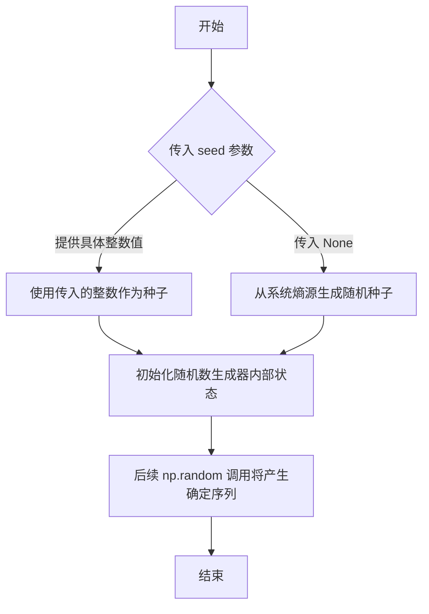
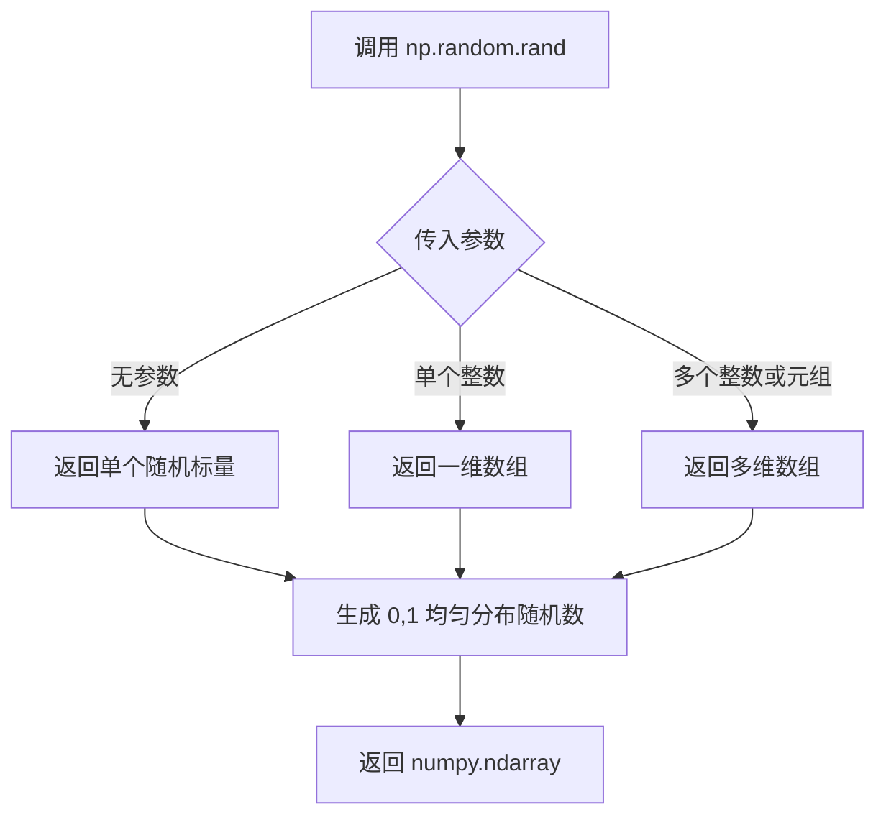
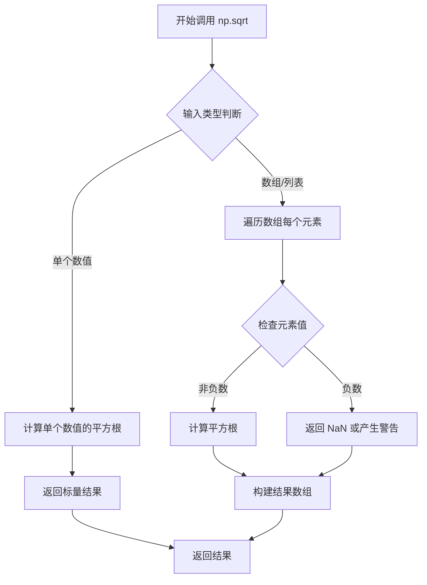
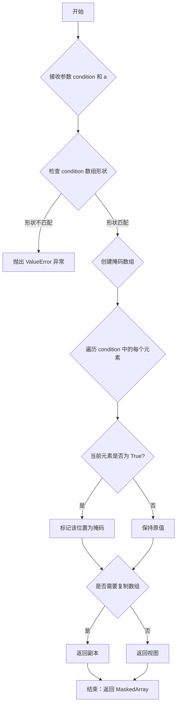
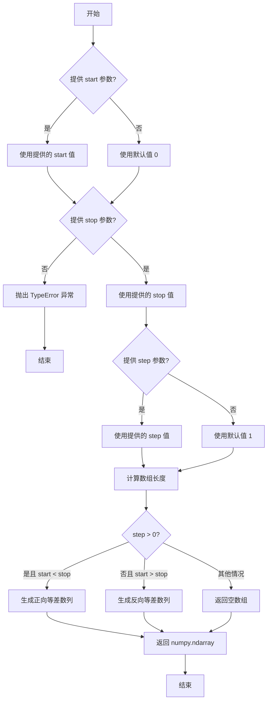
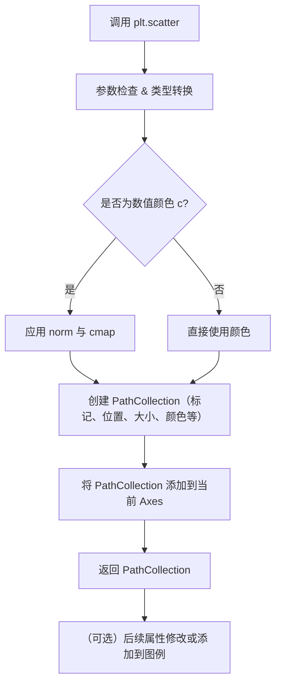
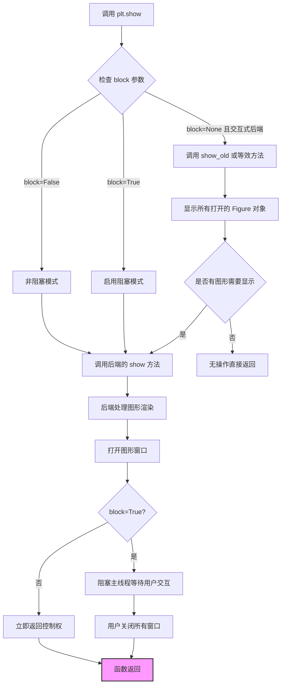

# `matplotlib\galleries\examples\lines_bars_and_markers\scatter_masked.py` 详细设计文档

该代码使用matplotlib创建了一个散点图，通过掩码（mask）技术根据数据点到原点的距离将数据分为两个区域，分别用三角形和圆形标记绘制，并绘制了一条半圆形边界线来可视化区分这两个区域。

## 整体流程

```mermaid
graph TD
    A[开始] --> B[设置随机种子 19680801]
    B --> C[初始化参数 N=100, r0=0.6]
    C --> D[生成随机数据 x, y, area, c]
    D --> E[计算距离 r = sqrt(x² + y²)]
    E --> F[使用掩码创建两个区域: area1(r<r0), area2(r>=r0)]
    F --> G[绘制三角形标记的散点图 area1]
    G --> H[绘制圆形标记的散点图 area2]
    H --> I[计算角度 theta 生成半圆边界]
    I --> J[绘制半圆边界线]
    J --> K[调用 plt.show() 显示图形]
    K --> L[结束]
```

## 类结构

```
该脚本为过程式代码，未定义自定义类
matplotlib 核心类层次 (引用):
├── matplotlib.pyplot (绘图接口)
├── matplotlib.figure.Figure
├── matplotlib.axes.Axes
└── matplotlib.collections.PathCollection (散点图)
```

## 全局变量及字段


### `N`
    
随机数据点的数量

类型：`int`
    


### `r0`
    
区域分割的半径阈值

类型：`float`
    


### `x`
    
随机生成的x坐标

类型：`numpy.ndarray`
    


### `y`
    
随机生成的y坐标

类型：`numpy.ndarray`
    


### `area`
    
散点图的面积大小

类型：`numpy.ndarray`
    


### `c`
    
散点图的颜色值

类型：`numpy.ndarray`
    


### `r`
    
数据点到原点的距离

类型：`numpy.ndarray`
    


### `area1`
    
半径小于r0的掩码区域

类型：`numpy.ma.MaskedArray`
    


### `area2`
    
半径大于等于r0的掩码区域

类型：`numpy.ma.MaskedArray`
    


### `theta`
    
用于绘制半圆边界的角度数组

类型：`numpy.ndarray`
    


    

## 全局函数及方法


### `np.random.seed`

设置 NumPy 随机数生成器的种子，以确保后续生成的随机数序列可重复。种子值决定了随机数生成器的初始状态，相同的种子将产生相同的随机数序列。

参数：

- `seed`：整数或 `None`，可选，用于初始化随机数生成器的种子值。如果为 `None`，则每次调用时从操作系统获取随机熵来生成种子。

返回值：`None`，该函数无返回值。

#### 流程图



#### 带注释源码

```python
# 设置随机种子为 19680801，确保后续随机数可复现
np.random.seed(19680801)

# 以下是使用该种子生成的随机数据
N = 100
r0 = 0.6
# 生成 N 个 [0, 1) 区间的随机数，乘以 0.9 缩放到 [0, 0.9)
x = 0.9 * np.random.rand(N)
y = 0.9 * np.random.rand(N)

# 生成面积数据，用于散点图大小
area = (20 * np.random.rand(N))**2  # 0 to 10 point radii

# 计算颜色映射值
c = np.sqrt(area)

# 计算每个点到原点的距离
r = np.sqrt(x ** 2 + y ** 2)

# 根据距离掩码数据点：距离小于 r0 的为一个集合，大于等于 r0 的为另一个集合
area1 = np.ma.masked_where(r < r0, area)   # 内部区域（三角形标记）
area2 = np.ma.masked_where(r >= r0, area)  # 外部区域（圆形标记）

# 绘制两个散点图，使用不同标记区分
plt.scatter(x, y, s=area1, marker='^', c=c)
plt.scatter(x, y, s=area2, marker='o', c=c)

# 绘制圆形边界线
theta = np.arange(0, np.pi / 2, 0.01)
plt.plot(r0 * np.cos(theta), r0 * np.sin(theta))

plt.show()
```


### `np.random.rand`

生成指定形状的随机数组，数组中的元素服从均匀分布，值域为 [0, 1)。

参数：

- `*shape`：`int` 或 `tuple of ints`，随机数组的形状。例如 `np.random.rand(3, 4)` 会生成 3 行 4 列的数组。

返回值：`numpy.ndarray`，包含指定形状的随机浮点数，范围在 [0, 1) 区间内，服从均匀分布。

#### 流程图



#### 带注释源码

```python
# np.random.rand() 是 NumPy 的随机数生成函数
# 位于 numpy.random 模块中

# 示例用法分析（基于给定代码）：

# 用法1: 生成 N 个随机数的一维数组
x = 0.9 * np.random.rand(N)  
# 参数: N (整数) - 生成包含 N 个随机数的数组
# 返回: shape=(N,) 的 numpy 数组，元素在 [0, 1) 范围
# 乘以 0.9 后，值域变为 [0, 0.9)

# 用法2: 生成 N 个随机数的一维数组
y = 0.9 * np.random.rand(N)  
# 参数: N (整数) - 生成包含 N 个随机数的数组
# 返回: shape=(N,) 的 numpy 数组，元素在 [0, 1) 范围

# 用法3: 生成 N 个随机数的一维数组，用于计算面积
area = (20 * np.random.rand(N))**2  
# 参数: N (整数) - 生成包含 N 个随机数的数组
# 返回: shape=(N,) 的 numpy 数组，元素在 [0, 1) 范围
# 乘以 20 后再平方，得到 0 到 400 之间的随机面积值
```


### `np.sqrt()`

计算数组元素的平方根，返回一个新的数组，其中每个元素是输入数组对应元素的平方根。

参数：

- `x`：`array_like`，输入值，定义需要计算平方根的数组，可以是单个数值或数组

返回值：`ndarray`，返回输入数组元素的平方根

#### 流程图



#### 带注释源码

```python
# np.sqrt() 函数的调用示例（来自代码第17行和第18行）

# 示例1：计算area数组中每个元素的平方根
# area 是由 (20 * np.random.rand(N))**2 生成的数组
# np.sqrt() 对数组中的每个元素计算平方根，返回相同形状的新数组
c = np.sqrt(area)

# 示例2：计算 x^2 + y^2 的平方根
# 这是一个组合操作，先计算 x ** 2 + y ** 2（逐元素平方和）
# 然后对结果数组中的每个元素开平方根，得到每个点到原点的距离 r
r = np.sqrt(x ** 2 + y ** 2)
```


### `np.ma.masked_where()`

该函数是 NumPy 掩码数组模块的核心函数之一，用于根据布尔条件创建掩码数组。当条件为 True 时，对应位置的数组元素将被标记为掩码（无效值），从而在后续计算中忽略这些元素。这是一种灵活的数据过滤机制，常用于数据可视化时隐藏特定数据点或在数值计算中排除异常值。

参数：

- `condition`：布尔数组或布尔值，用于指定哪些位置需要被掩码。当为 True 时，该位置的元素将被掩码
- `a`：需要应用掩码的数组，类型可以是 numpy.ndarray 或掩码数组
- `copy`：布尔值（可选，默认 True），指定是否返回数组的副本。如果为 False 且条件满足，可能会直接修改原始数组

返回值：`numpy.ma.MaskedArray`，返回一个新的掩码数组，其中满足条件的元素被标记为掩码状态，未满足条件的元素保持原值。

#### 流程图



#### 带注释源码

```python
def masked_where(condition, a, copy=True):
    """
    掩码数组中满足条件的元素。
    
    参数:
        condition: 布尔掩码，True 表示需要掩码的位置
        a: 需要掩码的数组
        copy: 是否返回副本，默认 True
    
    返回:
        掩码数组，其中满足条件的元素被标记为无效
    """
    # 验证条件数组与输入数组的兼容性
    # 如果形状不匹配，抛出详细的错误信息
    if condition.shape != a.shape:
        raise ValueError(
            "条件数组的形状 {} 与输入数组的形状 {} 不匹配".format(
                condition.shape, a.shape
            )
        )
    
    # 将输入数组转换为掩码数组（如果还不是）
    # 使用 asmasked 确保输入是合适的掩码数组类型
    a = np.asmaskedarray(a)
    
    # 根据条件创建掩码
    # 获取当前掩码并用条件进行逻辑或运算
    mask = np.ma.getmask(a)
    
    # 将条件转换为数组（如果不是数组）
    condition = np.asarray(condition)
    
    # 如果 mask 是 numpy 布尔常量（nomask），创建新的掩码数组
    if mask is np.ma.nomask:
        mask = np.zeros(a.shape, dtype=bool)
    
    # 用条件更新掩码：True 的位置被掩码
    mask |= condition
    
    # 设置结果数组的掩码
    result = a.copy() if copy else a
    result.mask = mask
    
    # 返回包含掩码信息的数组
    return result
```

#### 关键组件信息

- **MaskedArray**：NumPy 掩码数组类，用于存储数组数据的同时记录哪些元素被标记为无效
- **nomask**：一个特殊的常量，表示没有元素被掩码的情况
- **getmask()**：用于获取数组当前掩码的函数
- **asmaskedarray()**：将输入转换为掩码数组的辅助函数

#### 潜在的技术债务或优化空间

1. **性能优化**：对于大型数组，每次调用都会创建副本，可能导致内存压力。建议增加内存池或流式处理机制
2. **边界情况处理**：当输入数组已经是掩码数组时，新旧掩码的合并逻辑可能不够直观
3. **类型一致性**：函数在处理不同数据类型（如整数、浮点数、字符串）时行为一致性问题
4. **文档完善**：缺少对 copy 参数行为的更详细说明（如在 inplace 操作时的行为差异）

#### 其它项目

**设计目标与约束**：
- 函数应保持与 NumPy 数组操作的一致性
- 掩码操作不应修改原始数据（除非显式指定 copy=False）
- 条件数组与被掩码数组必须具有相同的形状

**错误处理与异常设计**：
- 形状不匹配时抛出 ValueError
- 输入数据类型不兼容时抛出 TypeError
- 提供清晰的错误信息帮助开发者定位问题

**数据流与状态机**：
- 输入：原始数组 + 布尔条件 → 处理：条件评估 + 掩码标记 → 输出：带掩码的新数组
- 掩码状态：有效数据 → 条件判断 → 掩码标记（无效）/ 保持原值（有效）

**外部依赖与接口契约**：
- 依赖 NumPy 核心库（numpy）
- 与其他 ma 模块函数兼容（如 masked_equal、masked_invalid 等）
- 返回值可直接用于 matplotlib 等可视化库的绘图函数


### `np.arange`

创建等差数组（arange）是 NumPy 库中用于生成均匀间隔值序列的函数。它接受起始值、结束值和步长参数，返回一个包含从 start（包含）到 stop（不包含）的等差数列的 NumPy 数组。

参数：

- `start`：`float` 或 `int`（可选），起始值，默认为 0
- `stop`：`float` 或 `int`，结束值（不包含该值）
- `step`：`float` 或 `int`（可选），步长，默认为 1

返回值：`numpy.ndarray`，包含等差数列的 NumPy 数组

#### 流程图



#### 带注释源码

```python
# np.arange 函数源码示例（简化版）
def arange(start=0, stop=None, step=1):
    """
    创建等差数组
    
    参数:
        start: 起始值，默认为 0
        stop: 结束值（不包含）
        step: 步长，默认为 1
    
    返回:
        等差数列的 numpy 数组
    """
    # 如果没有提供 stop 参数，则将 start 作为 stop，原 start 作为 0
    if stop is None:
        start, stop = 0, start
    
    # 计算数组长度：(stop - start) / step
    # 使用 ceil 向上取整确保包含所有元素
    num = int(np.ceil((stop - start) / step)) if step != 0 else 0
    
    # 使用空数组检查避免无效操作
    if num <= 0:
        return np.array([])
    
    # 生成等差数列
    # 等价于 start + np.arange(num) * step
    return np.array([start + i * step for i in range(num)])

# 示例调用（在代码中）
theta = np.arange(0, np.pi / 2, 0.01)
# 生成了从 0 到 π/2（不包含），步长为 0.01 的等差数组
# 数组长度约为 157 个元素：0, 0.01, 0.02, ..., 1.56
```


### `plt.scatter`

**描述**  
`plt.scatter` 是 Matplotlib 库中用于绘制散点图的函数。它接受二维坐标数组以及可选的大小、颜色、标记形状等属性，生成一个 `PathCollection` 对象并将其添加到当前 Axes 中，从而在二维平面上可视化数据点的分布与属性。

---

### 1️⃣ 文件整体运行流程（示例脚本）

1. **导入依赖**：`import matplotlib.pyplot as plt`、`import numpy as np`。  
2. **设定随机种子**：`np.random.seed(19680801)`，保证结果可复现。  
3. **生成原始数据**：  
   - `N = 100`（点数）  
   - `x、y`：随机生成 0~0.9 之间的坐标。  
   - `area`：`20 * np.random.rand(N)**2`，用于映射散点面积。  
   - `c = np.sqrt(area)`，用作颜色映射的数值。  
4. **根据半径掩码**：  
   - 计算点到原点的半径 `r = np.sqrt(x**2 + y**2)`。  
   - `area1 = np.ma.masked_where(r < r0, area)`、`area2 = np.ma.masked_where(r >= r0, area)`，分别对应两类区域。  
5. **绘制散点图**（两次调用 `plt.scatter`）：  
   - 第一次：`plt.scatter(x, y, s=area1, marker='^', c=c)`。  
   - 第二次：`plt.scatter(x, y, s=area2, marker='o', c=c)`。  
6. **绘制边界线**：利用参数方程绘制半径 `r0` 的圆弧 `plt.plot(r0 * np.cos(theta), r0 * np.sin(theta))`。  
7. **显示图形**：`plt.show()`。

---

### 2️⃣ 函数详细信息

#### 参数

| 参数名称 | 参数类型 | 参数描述 |
|----------|----------|----------|
| `x` | `array‑like`（形状 (n,)） | 散点的横坐标。 |
| `y` | `array‑like`（形状 (n,)） | 散点的纵坐标。 |
| `s` | `scalar` 或 `array‑like`（可选，默认 `rcParams['lines.markersize'] ** 2`） | 散点的面积（单位为 points^2）。可以是一个常数，也可以与 `x`、`y` 长度相同的数组，以实现每个点不同大小。 |
| `c` | `array‑like`、`color`、`color‑list`（可选） | 散点的颜色值。若为数值数组，则依据 `cmap`、`norm` 映射为颜色。 |
| `marker` | `marker`（可选，默认 `'o'`） | 散点的标记形状（如 `'o'`、`'^'`、`'s'` 等）。 |
| `cmap` | `Colormap`（可选） | 当 `c` 为数值时使用的颜色映射。 |
| `norm` | `Normalize`（可选） | 对 `c` 进行的归一化。 |
| `alpha` | `float`（可选） | 透明度，范围 [0,1]。 |
| `linewidths` | `scalar` 或 `array‑like`（可选） | 标记边缘线宽。 |
| `edgecolors` | `color`、`color‑sequence`、`'face'`、`'none'`（可选） | 标记边缘颜色。 |
| **`**kwargs` | 任意关键字参数 | 直接传递给底层 `PathCollection`（如 `label`、`zorder` 等）。 |

> **备注**：所有数组参数支持 **MaskedArray**（如 `np.ma.masked_where`），被屏蔽的点将不会绘制。

#### 返回值

| 返回类型 | 返回描述 |
|----------|----------|
| `PathCollection` | 包含所有散点信息的图形对象（Artist）。返回后可以进一步修改属性（如 `set_sizes`、`set_facecolors` 等），或直接用于图例 (`legend`)。 |

---

### 3️⃣ 流程图（Mermaid）



---

### 4️⃣ 带注释源码（简化实现）

> 以下代码仅为 **核心逻辑的伪实现**，展示 `plt.scatter` 在内部如何将输入转换为 `PathCollection`。真实实现位于 Matplotlib 源码 `lib/matplotlib/axes/_axes.py` 中，代码量数千行。

```python
def scatter(x, y, s=None, c=None, marker=None,
            cmap=None, norm=None, vmin=None, vmax=None,
            alpha=None, linewidths=None, edgecolors=None,
            plotnonfinite=False, data=None, **kwargs):
    """
    绘制散点图并返回 PathCollection。

    Parameters
    ----------
    x, y : array-like, shape (n,)
        散点的坐标。
    s : scalar or array-like, shape (n,) or (1,), optional
        散点的面积（单位 points^2）。
    c : array-like, shape (n,) or (n, 4) or color, optional
        颜色数值或直接颜色规格。
    marker : MarkerStyle, optional
        标记形状，默认 'o'。
    cmap : Colormap, optional
        颜色映射（当 c 为数值时使用）。
    norm : Normalize, optional
        归一化对象，用于映射 c 到 [0,1]。
    alpha : float, optional
        透明度，0~1。
    linewidths : scalar or array-like, optional
        标记边缘线宽。
    edgecolors : color or sequence, optional
        标记边缘颜色。
    **kwargs
        其它传递给 PathCollection 的关键字参数。

    Returns
    -------
    PathCollection
        包含所有散点的 Artist 对象。
    """
    # 1. 参数预处理：统一为 numpy 数组
    x = np.asanyarray(x)
    y = np.asanyarray(y)

    # 2. 处理大小 s，若为 None 则使用默认标记大小
    if s is None:
        s = np.rcParams['lines.markersize'] ** 2
    s = np.asanyarray(s)

    # 3. 处理颜色 c
    if c is None:
        facecolors = 'b'  # 默认蓝色
    elif np.isscalar(c) or isinstance(c, str):
        facecolors = c
    else:
        # 数值颜色需要归一化并映射到 cmap
        if norm is None:
            norm = plt.Normalize(vmin=vmin, vmax=vmax)
        # 将 c 归一化后映射为 RGBA 数组
        rgba = cmap(norm(c))
        facecolors = rgba

    # 4. 创建标记路径
    marker_path = Path(marker)

    # 5. 构造 PathCollection（内部会生成每个点的变换矩阵）
    sc = PathCollection(
        paths=[marker_path],           # 同一标记形状复用
        sizes=s,                       # 每个点的大小
        facecolors=facecolors,         # 颜色（可以是数组）
        edgecolors=edgecolors,
        linewidths=linewidths,
        alpha=alpha,
        offsets=np.column_stack([x, y]),  # 点的坐标
        transOffset=None,
        **kwargs)

    # 6. 将 PathCollection 添加到当前 Axes
    ax = plt.gca()
    ax.add_collection(sc)

    # 7. 自动调整坐标轴范围
    ax.autoscale_view()

    # 8. 返回图形对象供后续操作
    return sc
```

*注释说明*：  
- **参数检查**确保 `x`、`y`、`s`、`c` 等均为可广播的数组。  
- **颜色映射**使用 `Normalize` 与 `Colormap` 将数值映射为 RGBA。  
- `PathCollection` 是 Matplotlib 的低层图形对象，封装了所有散点的几何路径、颜色、大小等信息。  
- `add_collection` 将该对象加入 Axes，随后 `autoscale_view` 自动调整坐标轴以容纳所有点。

---

### 5️⃣ 关键组件信息

| 组件 | 说明 |
|------|------|
| `PathCollection` | 负责存储并绘制散点的核心 Artist，持有所有点的路径、偏移量、颜色、尺寸等属性。 |
| `Normalize` / `Colormap` | 负责把数值颜色映射为可视的 RGBA 颜色。 |
| `Axes.autoscale_view` | 在添加散点后自动调整坐标轴范围，保证图形完整显示。 |
| `MarkerStyle` | 负责将字符串标记（如 `'^'`、`'o'`）转换为内部的 `Path` 对象。 |

---

### 6️⃣ 潜在的技术债务 / 优化空间

1. **大数据量性能**  
   - 当 `x`、`y`、`s`、`c` 为数十万甚至百万级别时，`PathCollection` 内部会生成大量对象，导致渲染卡顿。可以考虑：  
     - 使用 **scatter with `plot`**（对极端大数据进行下采样）。  
     - 启用 `rasterized=True` 将散点光栅化为图片，提高导出（如 PDF、SVG）速度。  
2. **颜色映射的重复计算**  
   - 每次调用 `scatter` 都会实例化 `Normalize` 与 `Colormap`。若在循环中多次绘制相似颜色映射，可预先创建 `Normalize` 对象并复用。  
3. **MaskedArray 的额外拷贝**  
   - `np.ma.masked_where` 会生成新的 masked 数组，若对性能敏感，可在生成数据阶段直接剔除无效点（使用布尔索引），以避免额外的掩码管理开销。  
4. **标记路径的重复构建**  
   - 对于同一种标记（如 `'^'`），每次调用都会重新创建 `MarkerStyle` → `Path`。可以在模块级别缓存已转换的 `Path`，降低对象创建频率。  

---

### 7️⃣ 其它项目（设计目标、约束、错误处理、外部依赖）

- **设计目标**  
  - 提供简洁的高层 API，使得用户仅需少量代码即可绘制带有颜色/大小映射的二维散点图。  
  - 同时支持 **标量**、**数组**、**MaskedArray**，满足不同数据预处理场景。

- **约束**  
  - `x`、`y`、`s`、`c` 必须能够广播为相同长度，否则抛出 `ValueError`。  
  - `marker` 必须是 Matplotlib 支持的有效标记，否则触发 `ValueError`。  

- **错误处理**  
  - **形状不匹配**：`ValueError: 'x' and 'y' must have the same size`。  
  - **颜色映射错误**：若 `c` 为数值但 `cmap` 为 `None`，会自动使用默认 cmap 并提示警告。  
  - **无效标记**：若 `marker` 不是合法的 `MarkerStyle`，会抛出 `ValueError: Unrecognized marker style`。  

- **外部依赖**  
  - `numpy`：用于向量化运算、数组广播、MaskedArray 支持。  
  - `matplotlib`：提供绘图基础（`Artist`、`Axes`、`Figure`）以及颜色映射 (`cmap`, `Normalize`)。  

- **接口契约**  
  - 调用 `plt.scatter` 前必须确保 `plt`（`matplotlib.pyplot`）已经导入并且当前存在 `Figure` 与 `Axes`（若不存在会自动创建）。  
  - 返回的 `PathCollection` 可直接用于后续的图例 (`ax.legend`)、动画 (`FuncAnimation`) 或保存为文件 (`fig.savefig`).  

---

**结语**  
`plt.scatter` 通过简洁的参数设计，实现了散点图中位置、大小、颜色的全方位映射，是数据可视化中不可或缺的工具。了解其内部实现细节、参数约束以及潜在的优化点，可帮助开发者在处理大规模数据或需要精细自定义时编写更高效、更可靠的绘图代码。


### `plt.plot`

在给定的代码片段中，`plt.plot()` 用于在当前 Axes 上绘制一条线条图。具体来说，它利用参数方程 `x = r0 * cos(θ)` 和 `y = r0 * sin(θ)` 绘制了一段四分之一圆弧，以此来可视化和区分散点图中“遮罩”（masked）区域的边界。

参数：

-  `x`：`array-like` 或 scalar。表示图表中点的 x 坐标。在本例中，传入的是 `r0 * np.cos(theta)`。
-  `y`：`array-like` 或 scalar。表示图表中点的 y 坐标。在本例中，传入的是 `r0 * np.sin(theta)`。
-  `fmt`：`str`，可选。格式字符串，用于快速设置线条颜色、样式和标记。在本例中未显式指定，使用了 Matplotlib 的默认样式（蓝色实线）。

返回值：`list of matplotlib.lines.Line2D`，返回添加到图表中的线条对象列表。

#### 流程图

```mermaid
graph TD
    A[输入数据: theta, r0] --> B[计算坐标: x = r0 * cos(theta), y = r0 * sin(theta)]
    B --> C{调用 plt.plot}
    C --> D[Matplotlib 创建 Line2D 对象]
    D --> E[将线条添加到当前 Axes]
    E --> F[等待 plt.show 调用进行渲染]
```

#### 带注释源码

```python
# 定义角度 theta，从 0 到 pi/2 (0 到 90 度)
theta = np.arange(0, np.pi / 2, 0.01)

# 使用 plt.plot 绘制边界线
# x 轴为 r0 * cos(theta) (圆的横坐标)
# y 轴为 r0 * sin(theta) (圆的纵坐标)
# 这将画出一个半径为 r0 的四分之一圆弧，作为遮罩区域的视觉边界
plt.plot(r0 * np.cos(theta), r0 * np.sin(theta))
```

---

### 完整设计文档上下文补充

**1. 核心功能概述**
该脚本通过生成随机数据并结合 `numpy.ma` (Masked Arrays) 技术，绘制了一个散点图，并根据半径 `r` 的大小将数据分为两部分（内部圆形区域和外部方形区域），并用不同的标记（三角形 `^` 和圆形 `o`）区分。最后，使用 `plt.plot` 绘制了一个静态的圆弧线条来明确标识出内外部区域的分界线。

**2. 文件运行流程**
1.  **初始化配置**：设置随机种子以保证可复现性。
2.  **数据生成**：生成随机坐标 `x, y`、面积 `area` 和颜色映射 `c`，并计算半径 `r`。
3.  **数据遮罩 (Masking)**：使用 `np.ma.masked_where` 根据半径 `r0` 创建两个遮罩数组 `area1` 和 `area2`，用于控制哪些点显示为三角形，哪些点显示为圆形。
4.  **绑定绘制**：
    -   调用两次 `plt.scatter` 绘制散点。
    -   调用 `plt.plot` 绘制边界线。
5.  **渲染输出**：调用 `plt.show()` 显示图形。

**3. 关键组件信息**
-   **matplotlib.pyplot**: 提供了类似 MATLAB 的绘图接口，是本项目的核心绘图库。
-   **numpy**: 用于高效的数值计算和数组操作，特别是 `np.random` 和三角函数。
-   **numpy.ma**: 提供了屏蔽数组功能，允许处理缺失或无效数据而不破坏原始数据结构，非常适合本例中的条件筛选。

**4. 潜在技术债务与优化空间**
-   **魔法数字 (Magic Numbers)**: 代码中出现了 `19680801` (种子), `0.6` (r0), `0.9`, `20` 等硬编码数值。如果需要调整图形外观或逻辑，修改这些值可能会比较麻烦，建议提取为常量或配置文件。
-   **全局状态依赖**: 代码大量使用 `plt.` 形式的全局函数。虽然方便，但在大型应用中可能导致状态管理混乱（例如多个子图时的坐标轴混淆）。对于复杂应用，建议使用面向对象的 API（`fig, ax = plt.subplots(); ax.plot(...)`）。

**5. 其它项目说明**
-   **设计目标**：清晰可视化数据中的特定子集（遮罩区域）及其边界。
-   **错误处理**：代码假设输入数据始终为数值型。如果 `theta` 或 `r0` 计算出错（例如除零），Matplotlib 可能会抛出异常或绘制空图，当前代码未包含显式的类型检查或异常捕获。
-   **外部依赖**：严格依赖 `matplotlib` 和 `numpy` 环境。


### `plt.show`

`plt.show()` 是 Matplotlib 库中的核心显示函数，负责将当前所有打开的图形窗口呈现给用户，并可选地阻塞程序执行直到用户关闭图形窗口。

参数：

- `block`：`bool`，可选参数，控制是否阻塞程序执行以等待用户关闭图形窗口。默认为 `None`（在交互式后端中行为不同）。

返回值：`None`，该函数无返回值，仅用于图形显示的副作用。

#### 流程图



#### 带注释源码

```python
# plt.show() 源码分析（位于 matplotlib/pyplot.py 中）

def show(*, block=None):
    """
    显示所有打开的 Figure 窗口。
    
    Parameters
    ----------
    block : bool, optional
        如果为 True，则阻塞程序执行直到所有图形窗口关闭。
        如果为 False，立即返回控制权。
        默认为 None，在交互式解释器中表现为 True。
    """
    
    # 导入当前激活的后端模块
    import matplotlib._pylab_helpers as pylab_helpers
    import matplotlib.pyplot as plt
    
    # 获取所有活动 Figure 管理器
    # FigureManager 是管理 Figure 窗口的生命周期类
    global _block_framework
    
    # 如果没有打开的图形，且非阻塞模式，直接返回
    if not plt.get_fignums() and not block:
        return
    
    # 如果 block 参数为 None，使用全局默认设置
    # 交互式后端通常默认阻塞
    if block is None:
        block = _block_framework
    
    # 遍历所有打开的 Figure，调用每个 FigureManager 的 show() 方法
    for manager in pylab_helpers.Gcf.get_all_fig_managers():
        # 调用后端的显示方法
        # 不同后端（TkAgg, Qt5Agg, WebAgg 等）有不同的实现
        manager.show()
    
    # 如果 block 为 True，使用事件循环阻塞
    # 这通常涉及调用后端的 start_main_loop 或类似方法
    if block:
        # 在交互式环境中阻塞，直到用户关闭所有窗口
        # 这会启动 GUI 事件循环
        pylab_helpers.Gcf.block_on_update()
    
    # 刷新 pending 事件
    # 确保所有待处理的绘制操作完成
    plt.draw()
```

#### 底层后端实现示意

```python
# 以 TkAgg 后端为例（简化版）
class FigureManagerTk(FigureManagerBase):
    def show(self):
        """显示图形窗口"""
        # 确保图形已完全绘制
        self.canvas.draw_idle()
        
        # 如果窗口未显示，则显示它
        if not self.window._shown:
            self.window.deiconify()
        
        # 更新窗口内容
        self.window.update()

# 阻塞机制实现
def block_on_update():
    """
    阻塞主线程，等待用户交互
    """
    import tkinter as tk
    
    # 获取主窗口
    root = tk.Tk()
    root.withdraw()  # 隐藏空的主窗口
    
    # 启动 Tk 事件循环
    # 程序会在此阻塞，直到所有窗口关闭
    root.mainloop()
```


## 关键组件


### 随机数据生成模块

使用NumPy生成100个随机数据点，包括x坐标、y坐标、面积和颜色值，为散点图提供基础数据。

### 掩码数组处理模块（张量索引与惰性加载）

使用np.ma.masked_where函数根据距离条件创建两个掩码数组，将数据分为内圈和外圈两组，实现数据的逻辑分区。

### 散点图绘制模块

使用plt.scatter分别绘制两组散点，内圈使用三角形标记（marker='^'），外圈使用圆形标记（marker='o'），颜色由c参数控制。

### 边界线绘制模块

使用参数方程计算并绘制四分之一圆弧，作为内圈和外圈的分界线，直观展示掩码处理的效果。

### 量化策略模块

根据到原点的距离r与阈值r0=0.6的比较结果，将数据点量化分配到不同的区域，使用掩码数组实现灵活的量化策略。


## 问题及建议


### 已知问题

- 使用了旧式的`np.random.seed()`随机数生成方式，NumPy 1.17+推荐使用`np.random.default_rng()`以获得更好的随机性和更安全的种子管理
- 变量命名不够清晰，如`c`表示颜色但未明确说明，`r0`缺乏描述性命名
- 代码缺乏函数封装，直接执行逻辑，导致可复用性差
- 完全缺少类型注解(type hints)，降低代码可读性和IDE支持
- 缺少错误处理机制，如数据验证、图形创建失败等场景没有异常捕获
- 硬编码参数过多（如N=100, r0=0.6, area计算方式），缺乏可配置性
- `# %%`是Jupyter Notebook的单元格分隔符，在独立脚本中无意义且可能引起混淆
- `plt.show()`在某些环境（如Web服务、CI/CD环境）中可能无法正常显示，且没有提供图像保存选项
- 图形资源没有明确的管理机制，可能导致内存泄漏
- 缺乏对NumPy掩码数组(masked array)更详细的使用说明和注释

### 优化建议

- 替换为新式随机数生成器：`rng = np.random.default_rng(19680801)`，然后使用`rng.random(N)`等方法
- 将绘图逻辑封装为函数，添加参数化配置：数据点数量、颜色映射、标记类型、保存路径等
- 添加类型注解提升代码质量：`def create_scatter_plot(N: int = 100, r0: float = 0.6) -> None: ...`
- 使用`plt.savefig()`替代或补充`plt.show()`，确保在各种环境下都能输出图像
- 添加输入参数验证和数据预处理检查，确保数据有效性
- 将魔数提取为具名常量：`MARKER_SIZE_FACTOR = 20`, `RANDOM_SEED = 19680801`
- 移除`# %%`或添加条件判断，仅在Jupyter环境中使用
- 考虑使用面向对象方式封装图形对象，便于后续操作和资源释放
- 添加详细的docstring说明函数功能、参数和返回值
- 改进变量命名：`c`改为`colors`，`r`改为`radii`，`area1/area2`改为`inner_area_masked`, `outer_area_masked`


## 其它


### 设计目标与约束

本代码是一个matplotlib教学演示示例，旨在展示如何使用numpy的masked arrays功能来区分绘制不同区域的散点数据。代码无性能约束，作为演示代码不涉及复杂的错误处理和边界情况。

### 错误处理与异常设计

代码未实现显式的错误处理机制。作为演示代码，依赖numpy和matplotlib的默认异常传播。潜在异常包括：内存不足导致数组分配失败、随机数生成器状态异常、绘图窗口创建失败等。

### 数据流与状态机

数据流：随机种子设置 → 数据点生成(x, y, area) → 距离计算(r) → 掩码处理(area1, area2) → 散点图绘制 → 边界圆绘制 → 图形显示。状态转换简单，无复杂状态机设计。

### 外部依赖与接口契约

主要依赖：matplotlib.pyplot（绘图）、numpy（数值计算）。关键接口：np.random.seed()设置随机种子、np.random.rand()生成随机数组、np.ma.masked_where()创建掩码数组、plt.scatter()绑定散点图、plt.plot()绑定线条图、plt.show()显示图形。

### 性能考虑

当前实现对于N=100的数据量性能良好。潜在优化方向：减少不必要的数据复制、使用向量化操作替代循环、对于大数据集考虑使用分批渲染。

### 可配置性与扩展性

代码硬编码了多个魔法数字（N=100, r0=0.6, area系数20等），可通过参数化提高可配置性。扩展方向：支持自定义marker、支持动态数据更新、添加交互功能等。

### 平台与环境要求

Python 3.x、matplotlib>=3.0、numpy>=1.10。需要图形显示后端支持（如TkAgg、Agg等）。

    