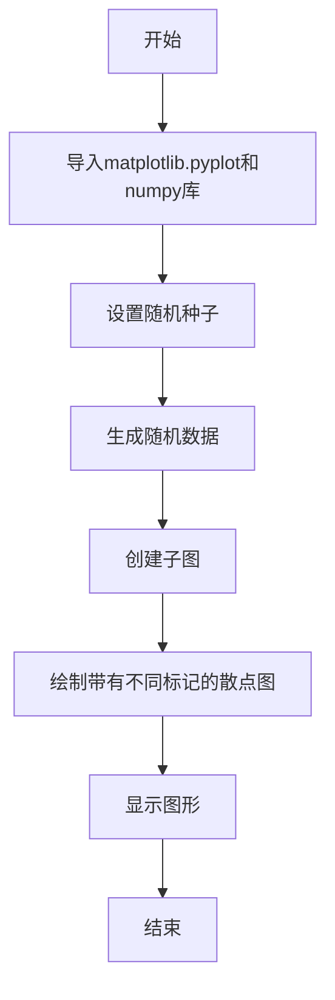
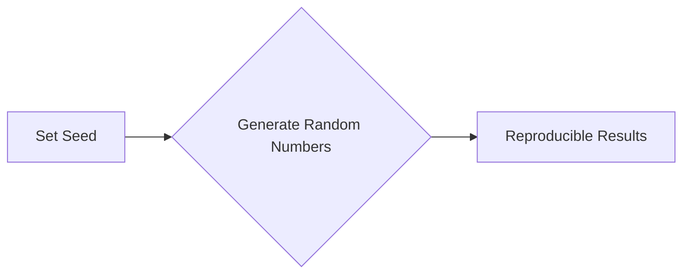
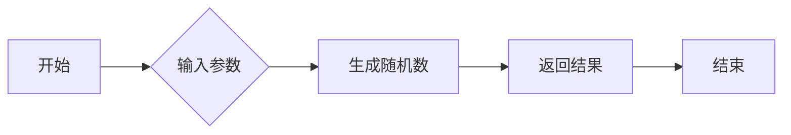
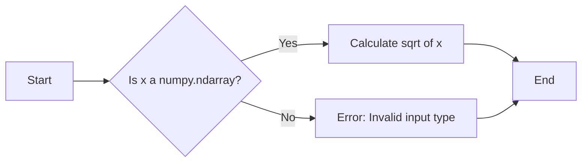

# `matplotlib\galleries\examples\lines_bars_and_markers\scatter_star_poly.py` 详细设计文档

This code generates scatter plots with different marker symbols in Matplotlib.

## 整体流程



## 类结构

```
matplotlib.pyplot
├── scatter(x, y, s, c, marker)
└── show()
```

## 全局变量及字段


### `x`
    
An array of random numbers between 0 and 1, representing the x-coordinates of the scatter plot points.

类型：`numpy.ndarray`
    


### `y`
    
An array of random numbers between 0 and 1, representing the y-coordinates of the scatter plot points.

类型：`numpy.ndarray`
    


### `z`
    
An array of calculated values representing the distance from the origin for each point in the scatter plot.

类型：`numpy.ndarray`
    


### `fig`
    
The main figure object created by plt.subplots(), which contains all the axes and is used to display the plot.

类型：`matplotlib.figure.Figure`
    


### `axs`
    
An array of axes objects created by plt.subplots(), each of which is used to plot a subset of the data.

类型：`numpy.ndarray of matplotlib.axes.Axes`
    


### `verts`
    
A list of lists containing the vertices of a custom marker path for the scatter plot points.

类型：`list of lists`
    


### `matplotlib.pyplot.scatter`
    
A method to create a scatter plot.

类型：`function`
    


### `matplotlib.pyplot.show`
    
A method to display the plot.

类型：`function`
    


### `matplotlib.axes._subplots.AxesSubplot.scatter`
    
A method to create a scatter plot on a specific axes object.

类型：`function`
    


### `matplotlib.axes._subplots.AxesSubplot.show`
    
A method to display the plot on a specific axes object.

类型：`function`
    
    

## 全局函数及方法


### np.random.seed

`np.random.seed` is a function used to set the seed for the random number generator in NumPy, ensuring reproducibility of the random numbers generated.

参数：

- `seed`：`int`，An integer seed for the random number generator. This seed is used to initialize the random number generator's internal state, ensuring that the same sequence of random numbers is generated each time the seed is set to the same value.

返回值：`None`，This function does not return any value. It simply sets the seed for the random number generator.

#### 流程图



#### 带注释源码

```python
import numpy as np

# Fixing random state for reproducibility
np.random.seed(19680801)
```


### np.random.rand

生成一系列在[0, 1)区间内的伪随机浮点数。

参数：

- `*size`：`int` 或 `tuple`，指定输出的形状。如果是一个整数，则输出一个一维数组；如果是一个元组，则输出一个多维数组。
- ...

返回值：`float` 或 `numpy.ndarray`，返回一个指定形状的数组，包含在[0, 1)区间内的伪随机浮点数。

#### 流程图



#### 带注释源码

```python
import numpy as np

# Fixing random state for reproducibility
np.random.seed(19680801)

x = np.random.rand(10)
# 生成一个包含10个在[0, 1)区间内的伪随机浮点数的数组
```


### np.sqrt

计算输入数组的平方根。

参数：

- `x`：`numpy.ndarray`，输入数组，其元素将被计算平方根。

返回值：`numpy.ndarray`，包含输入数组元素的平方根。

#### 流程图



#### 带注释源码

```python
import numpy as np

def np_sqrt(x):
    """
    Calculate the square root of the elements in the input array.

    Parameters:
    - x: numpy.ndarray, the input array whose elements are to be calculated for the square root.

    Returns:
    - numpy.ndarray, an array containing the square roots of the elements in x.
    """
    return np.sqrt(x)
```


### matplotlib.pyplot.scatter

matplotlib.pyplot.scatter 是一个用于绘制散点图的函数。

参数：

- `x`：`numpy.ndarray` 或 `sequence`，x 坐标数据。
- `y`：`numpy.ndarray` 或 `sequence`，y 坐标数据。
- `s`：`float` 或 `numpy.ndarray`，每个点的面积。
- `c`：`color` 或 `sequence`，颜色数据。
- `marker`：`str` 或 `tuple`，标记类型。
- `label`：`str`，图例标签。
- `alpha`：`float`，透明度。
- `edgecolors`：`color` 或 `sequence`，边缘颜色。
- `linewidths`：`float` 或 `numpy.ndarray`，边缘线宽。
- `zorder`：`float`，z 轴顺序。

返回值：`AxesSubplot`，散点图所在的轴对象。

#### 流程图

```mermaid
graph LR
A[Start] --> B{Call scatter()}
B --> C[End]
```

#### 带注释源码

```python
import matplotlib.pyplot as plt
import numpy as np

# Fixing random state for reproducibility
np.random.seed(19680801)

x = np.random.rand(10)
y = np.random.rand(10)
z = np.sqrt(x**2 + y**2)

fig, axs = plt.subplots(2, 3, sharex=True, sharey=True, layout="constrained")

# Matplotlib marker symbol
axs[0, 0].scatter(x, y, s=80, c=z, marker=">")
axs[0, 0].set_title("marker='>'")

# marker from TeX: passing a TeX symbol name enclosed in $-signs
axs[0, 1].scatter(x, y, s=80, c=z, marker=r"$\clubsuit$")
axs[0, 1].set_title(r"marker=r'\$\clubsuit\$'")

# marker from path: passing a custom path of N vertices as a (N, 2) array-like
verts = [[-1, -1], [1, -1], [1, 1], [-1, -1]]
axs[0, 2].scatter(x, y, s=80, c=z, marker=verts)
axs[0, 2].set_title("marker=verts")

# regular pentagon marker
axs[1, 0].scatter(x, y, s=80, c=z, marker=(5, 0))
axs[1, 0].set_title("marker=(5, 0)")

# regular 5-pointed star marker
axs[1, 1].scatter(x, y, s=80, c=z, marker=(5, 1))
axs[1, 1].set_title("marker=(5, 1)")

# regular 5-pointed asterisk marker
axs[1, 2].scatter(x, y, s=80, c=z, marker=(5, 2))
axs[1, 2].set_title("marker=(5, 2)")

plt.show()
```


### plt.show()

`plt.show()` 是一个全局函数，用于显示当前图形的窗口。

参数：

- 无

返回值：无

#### 流程图

```mermaid
graph LR
A[Start] --> B[Call plt.show()]
B --> C[End]
```

#### 带注释源码

```python
plt.show()  # 显示当前图形的窗口
```


## 关键组件


### 张量索引

张量索引用于在多维数组中定位和访问特定元素。

### 惰性加载

惰性加载是一种延迟计算或初始化数据的技术，直到实际需要时才进行。

### 反量化支持

反量化支持允许在量化过程中对某些操作进行非量化处理，以保持精度。

### 量化策略

量化策略定义了如何将浮点数转换为固定点数，以减少计算资源消耗。


## 问题及建议


### 已知问题

-   **全局变量和函数的使用**：代码中使用了全局变量和函数，如 `np.random.seed` 和 `plt.subplots`，这可能导致代码的可重用性和可维护性降低，尤其是在大型项目中。
-   **硬编码的标记样式**：代码中硬编码了多种标记样式，这限制了代码的灵活性和可配置性。
-   **重复的代码**：在展示不同标记样式的部分，存在重复的代码，这可以通过函数封装来减少。

### 优化建议

-   **封装函数**：将展示不同标记样式的代码封装成函数，以提高代码的可重用性和可维护性。
-   **参数化标记样式**：允许用户通过参数来指定标记样式，而不是硬编码在代码中，这样可以提高代码的灵活性和可配置性。
-   **使用配置文件**：对于复杂的配置，可以考虑使用配置文件来管理，这样可以在不修改代码的情况下调整配置。
-   **异常处理**：增加异常处理机制，以处理可能出现的错误，如文件读取错误、绘图错误等。
-   **代码注释**：增加代码注释，以解释代码的功能和目的，提高代码的可读性。
-   **单元测试**：编写单元测试来验证代码的功能，确保代码的质量和稳定性。


## 其它


### 设计目标与约束

- 设计目标：实现一个能够展示不同类型标记符的示例代码，并支持自定义标记符。
- 约束条件：代码应使用Matplotlib库进行绘图，并确保代码的可读性和可维护性。

### 错误处理与异常设计

- 错误处理：代码中应包含异常处理机制，以捕获并处理可能出现的错误，如绘图错误或数据错误。
- 异常设计：定义自定义异常类，以提供更具体的错误信息。

### 数据流与状态机

- 数据流：数据从随机数生成到绘图的过程，包括数据生成、数据转换和绘图。
- 状态机：代码中没有明确的状态机，但可以通过函数调用和条件语句来模拟状态转换。

### 外部依赖与接口契约

- 外部依赖：代码依赖于Matplotlib和NumPy库。
- 接口契约：Matplotlib的scatter函数和scatter方法的接口契约应遵循Matplotlib的文档规范。


    