# `matplotlib\galleries\examples\lines_bars_and_markers\scatter_with_legend.py` 详细设计文档

This code generates scatter plots with legends using the matplotlib library, demonstrating various customization options such as marker size, color, and transparency.

## 整体流程

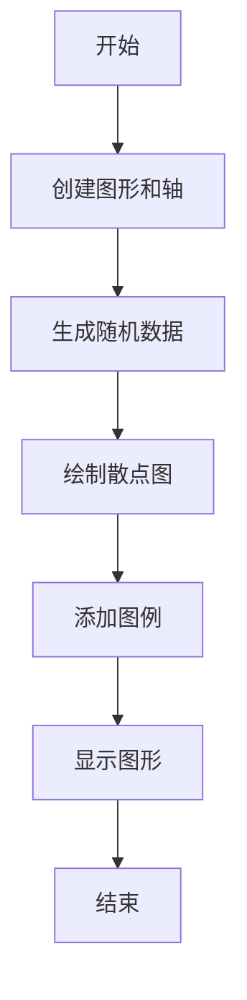

## 类结构

```
matplotlib.pyplot (主模块)
├── fig, ax = plt.subplots()
│   ├── fig[图形对象]
│   └── ax[轴对象]
├── for color in ['tab:blue', 'tab:orange', 'tab:green']
│   ├── color[颜色变量]
│   ├── n[数据点数量]
│   ├── x, y[随机数据]
│   ├── scale[缩放因子]
│   └── ax.scatter(x, y, c=color, s=scale, label=color, alpha=0.3, edgecolors='none')
├── ax.legend()
│   └── ax.legend()
├── ax.grid(True)
│   └── ax.grid(True)
└── plt.show()
```

## 全局变量及字段


### `fig`
    
The main figure object containing all the plot elements.

类型：`matplotlib.figure.Figure`
    


### `ax`
    
The axes object where the plot is drawn.

类型：`matplotlib.axes._subplots.AxesSubplot`
    


### `color`
    
The color of the scatter plot markers.

类型：`str`
    


### `n`
    
The number of points to generate for the scatter plot.

类型：`int`
    


### `x`
    
The x-coordinates of the scatter plot markers.

类型：`numpy.ndarray`
    


### `y`
    
The y-coordinates of the scatter plot markers.

类型：`numpy.ndarray`
    


### `scale`
    
The scale factor for the size of the scatter plot markers.

类型：`numpy.ndarray`
    


### `scatter`
    
The scatter plot collection object.

类型：`matplotlib.collections.PathCollection`
    


### `volume`
    
The volume values for the scatter plot.

类型：`numpy.ndarray`
    


### `amount`
    
The amount values for the scatter plot.

类型：`numpy.ndarray`
    


### `ranking`
    
The ranking values for the scatter plot.

类型：`numpy.ndarray`
    


### `price`
    
The price values for the scatter plot.

类型：`numpy.ndarray`
    


### `matplotlib.pyplot.fig`
    
The main figure object containing all the plot elements.

类型：`matplotlib.figure.Figure`
    


### `matplotlib.pyplot.ax`
    
The axes object where the plot is drawn.

类型：`matplotlib.axes._subplots.AxesSubplot`
    


### `matplotlib.pyplot.color`
    
The color of the scatter plot markers.

类型：`str`
    


### `matplotlib.pyplot.n`
    
The number of points to generate for the scatter plot.

类型：`int`
    


### `matplotlib.pyplot.x`
    
The x-coordinates of the scatter plot markers.

类型：`numpy.ndarray`
    


### `matplotlib.pyplot.y`
    
The y-coordinates of the scatter plot markers.

类型：`numpy.ndarray`
    


### `matplotlib.pyplot.scale`
    
The scale factor for the size of the scatter plot markers.

类型：`numpy.ndarray`
    


### `matplotlib.pyplot.scatter`
    
The scatter plot collection object.

类型：`matplotlib.collections.PathCollection`
    


### `matplotlib.pyplot.volume`
    
The volume values for the scatter plot.

类型：`numpy.ndarray`
    


### `matplotlib.pyplot.amount`
    
The amount values for the scatter plot.

类型：`numpy.ndarray`
    


### `matplotlib.pyplot.ranking`
    
The ranking values for the scatter plot.

类型：`numpy.ndarray`
    


### `matplotlib.pyplot.price`
    
The price values for the scatter plot.

类型：`numpy.ndarray`
    
    

## 全局函数及方法


### np.random.seed

设置NumPy随机数生成器的种子。

参数：

- `seed`：`int`，用于初始化随机数生成器的种子值。

返回值：无

#### 流程图

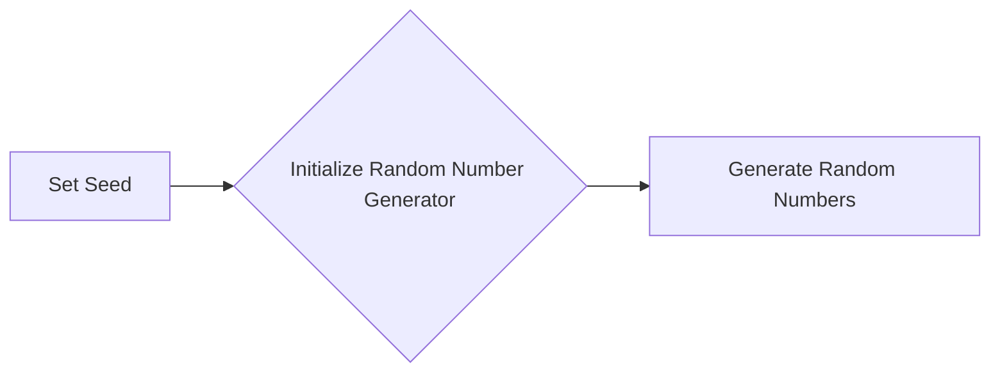

#### 带注释源码

```python
np.random.seed(19680801)
```

该行代码设置了NumPy随机数生成器的种子为19680801。这意味着每次运行代码时，生成的随机数序列将是相同的，这对于调试和重现结果非常有用。


### np.random.rand

生成指定范围内的随机浮点数。

参数：

- `*size*`：`int` 或 `tuple`，指定输出的形状，默认为 `None`，表示生成一个浮点数。
- `*dtype*`：`dtype`，可选，指定输出数据的类型，默认为 `float64`。

返回值：`numpy.ndarray`，形状为 `*size*` 的浮点数数组。

#### 流程图

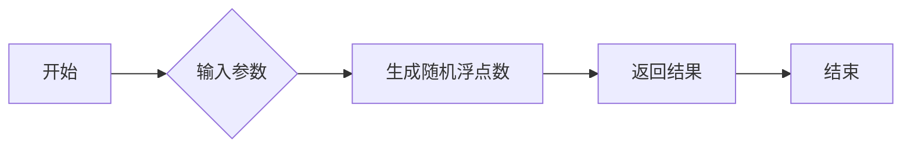

#### 带注释源码

```python
import numpy as np

def np_random_rand(*size, dtype=np.float64):
    """
    生成指定范围内的随机浮点数。

    参数：
    - size: int 或 tuple，指定输出的形状，默认为 None，表示生成一个浮点数。
    - dtype: dtype，可选，指定输出数据的类型，默认为 float64。

    返回值：numpy.ndarray，形状为 size 的浮点数数组。
    """
    return np.random.rand(*size, dtype=dtype)
```


### np.random.randint

`np.random.randint` 是 NumPy 库中的一个函数，用于生成一个随机整数。

参数：

- `low`：`int`，随机整数的最小值（包含）。
- `high`：`int`，随机整数的最小值（不包含）。
- `size`：`int` 或 `tuple`，生成随机数的数量或形状。

参数描述：

- `low`：指定随机整数的最小值。
- `high`：指定随机整数的最小值，但不包含该值。
- `size`：指定生成随机数的数量或形状。

返回值类型：`int` 或 `numpy.ndarray`

返回值描述：返回一个随机整数或一个随机整数数组。

#### 流程图

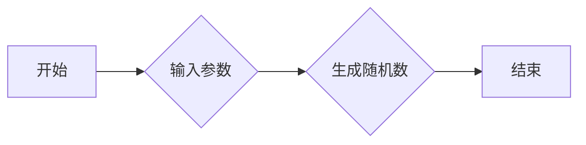

#### 带注释源码

```python
import numpy as np

# 生成一个介于1到5之间的随机整数
random_int = np.random.randint(1, 5)

# 生成一个形状为(3, 4)的随机整数数组
random_array = np.random.randint(1, 5, size=(3, 4))
```


### np.random.rayleigh

生成具有雷利分布的样本。

参数：

- `sigma`：`float`，雷利分布的标准差。
- `size`：`int`或`tuple`，输出样本的形状。

返回值：`float`或`array`，具有雷利分布的样本。

#### 流程图

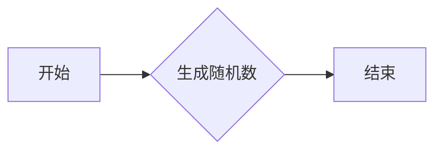

#### 带注释源码

```python
volume = np.random.rayleigh(27, size=40)
```

在这段代码中，`np.random.rayleigh(27, size=40)`生成了40个具有标准差为27的雷利分布的样本，并将它们存储在`volume`变量中。


### np.random.poisson

生成泊松分布的随机样本。

参数：

- `p`：`float`，泊松分布的参数，表示平均发生率。
- ...

返回值：`numpy.ndarray`，泊松分布的随机样本。

#### 流程图

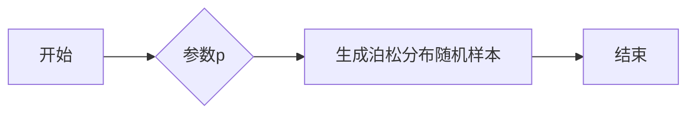

#### 带注释源码

```python
import numpy as np

def poisson(p):
    """
    Generate random samples from a Poisson distribution.

    Parameters:
    - p: float, the parameter of the Poisson distribution, representing the average rate of occurrence.

    Returns:
    - numpy.ndarray, random samples from the Poisson distribution.
    """
    return np.random.poisson(p)
```


### np.random.normal

生成符合高斯分布的随机样本。

参数：

- `loc`：`float`，高斯分布的均值，默认为0。
- `scale`：`float`，高斯分布的标准差，默认为1。
- `size`：`int`或`tuple`，输出样本的形状，默认为None。

返回值：`ndarray`，形状为`size`的数组，包含符合高斯分布的随机样本。

#### 流程图

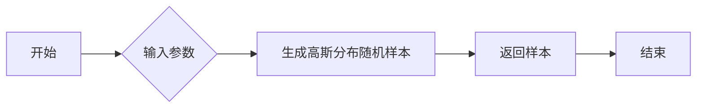

#### 带注释源码

```python
import numpy as np

def generate_gaussian_samples(loc=0.0, scale=1.0, size=None):
    """
    Generate random samples from a Gaussian distribution.

    Parameters:
    - loc: float, mean of the Gaussian distribution, default is 0.0.
    - scale: float, standard deviation of the Gaussian distribution, default is 1.0.
    - size: int or tuple, shape of the output samples, default is None.

    Returns:
    - ndarray, array of random samples from the Gaussian distribution.
    """
    samples = np.random.normal(loc, scale, size)
    return samples
```


### np.random.uniform

生成指定范围内的随机浮点数。

参数：

- `low`：`float`，随机浮点数的最小值。
- `high`：`float`，随机浮点数的最大值。
- `size`：`int`或`tuple`，可选，生成随机浮点数的大小或形状。

返回值：`float`或`numpy.ndarray`，随机浮点数。

#### 流程图

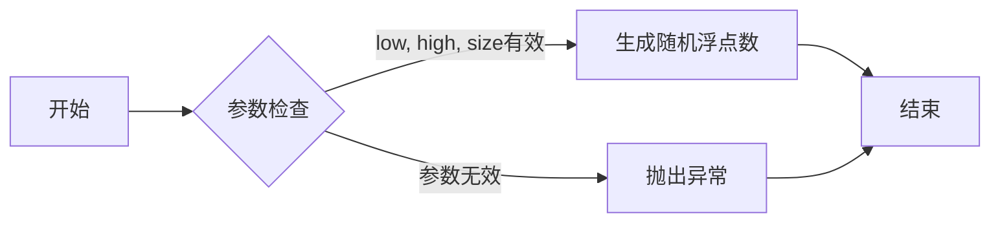

#### 带注释源码

```python
import numpy as np

def uniform(low, high, size=None):
    """
    Generate a random float in the range [low, high).

    Parameters:
    - low: float, the lower bound of the random float.
    - high: float, the upper bound of the random float.
    - size: int or tuple, optional, the size or shape of the random float.

    Returns:
    - float or numpy.ndarray, the random float or an array of random floats.
    """
    if size is None:
        return np.random.uniform(low, high)
    else:
        return np.random.uniform(low, high, size)
```


### plt.subplots

`plt.subplots` 是一个用于创建图形和轴对象的函数。

参数：

- `figsize`：`tuple`，图形的大小（宽度和高度），默认为 (6, 4)。
- `dpi`：`int`，图形的分辨率，默认为 100。
- `facecolor`：`color`，图形的背景颜色，默认为白色。
- `edgecolor`：`color`，图形的边缘颜色，默认为 None。
- `frameon`：`bool`，是否显示图形的边框，默认为 True。
- `num`：`int`，要创建的轴对象的数量，默认为 1。
- `gridspec_kw`：`dict`，用于定义网格规格的字典。
- `constrained_layout`：`bool`，是否启用约束布局，默认为 False。

返回值：`Figure` 对象，包含一个轴对象。

#### 流程图

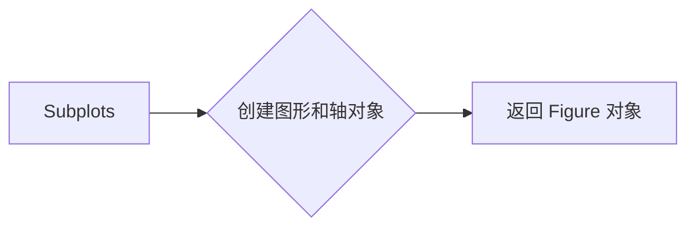

#### 带注释源码

```python
import matplotlib.pyplot as plt

fig, ax = plt.subplots()
```


### matplotlib.pyplot.scatter

matplotlib.pyplot.scatter 是一个用于创建散点图的函数。

参数：

- x：`array_like`，散点在 x 轴上的位置。
- y：`array_like`，散点在 y 轴上的位置。
- s：`array_like`，散点的大小，默认为 None，表示使用默认大小。
- c：`array_like`，散点的颜色，默认为 None，表示使用默认颜色。
- marker：`str` 或 `path`，散点的标记形状，默认为 'o'。
- alpha：`float`，散点的透明度，默认为 1.0。
- edgecolors：`color`，散点边缘的颜色，默认为 None。
- linewidths：`float` 或 `array_like`，散点边缘的宽度，默认为 None。
- **kwargs：`dict`，传递给散点图的其他关键字参数。

返回值：`Scatter` 对象，表示散点图。

#### 流程图

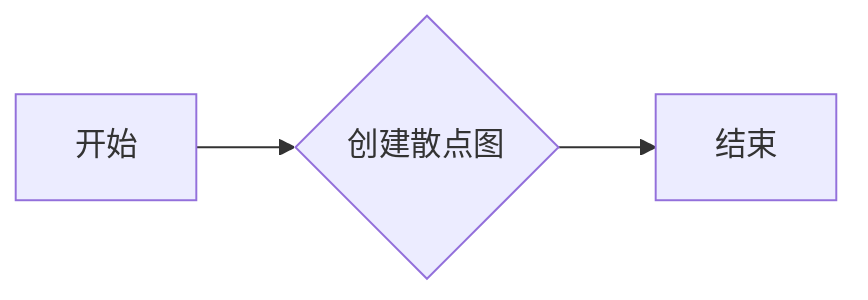

#### 带注释源码

```python
import matplotlib.pyplot as plt
import numpy as np

np.random.seed(19680801)

fig, ax = plt.subplots()
for color in ['tab:blue', 'tab:orange', 'tab:green']:
    n = 750
    x, y = np.random.rand(2, n)
    scale = 200.0 * np.random.rand(n)
    ax.scatter(x, y, c=color, s=scale, label=color,
               alpha=0.3, edgecolors='none')
```


### `matplotlib.pyplot.legend`

`matplotlib.pyplot.legend` 是一个用于在图表中创建图例的函数。

参数：

- `handles`：`Handle`对象列表，表示图例的条目。
- `labels`：与`handles`对应的标签列表。
- `loc`：图例的位置，可以是字符串或浮点数。
- `title`：图例的标题。
- `bbox_to_anchor`：图例的边界框的锚点。
- `bbox_transform`：边界框的转换。
- `ncol`：图例的列数。
- `mode`：图例的显示模式。
- `frameon`：是否显示图例的边框。
- `fancybox`：是否显示图例的边框为方框。
- `shadow`：是否显示图例的阴影。
- `ncol`：图例的列数。
- `handlelength`：图例条目的长度。
- `labelspacing`：图例标签之间的间距。
- `borderpad`：图例边框与图表边缘的间距。
- `columnspacing`：图例列之间的间距。
- `handletextpad`：图例条目文本与图例条目的间距。

返回值：`Legend`对象，表示创建的图例。

#### 流程图

```mermaid
graph LR
A[Start] --> B{Call matplotlib.pyplot.legend()}
B --> C[End]
```

#### 带注释源码

```python
import matplotlib.pyplot as plt

# 创建一个散点图
ax.scatter(x, y, c=c, s=s)

# 创建图例
legend = ax.legend(*scatter.legend_elements(),
                    loc="lower left", title="Classes")
```


### matplotlib.pyplot.grid

matplotlib.pyplot.grid 是一个用于在绘制的图形上添加网格线的函数。

参数：

- `grid`：布尔值，如果为 True，则在图形上添加网格线。

返回值：无

#### 流程图

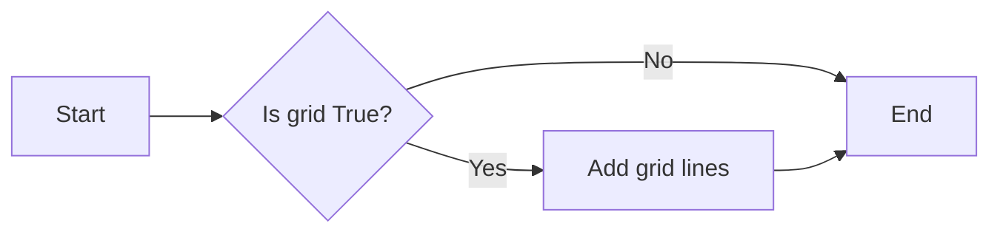

#### 带注释源码

```python
import matplotlib.pyplot as plt

# ... (其他代码)

ax.grid(True)  # 添加网格线

# ... (其他代码)
plt.show()  # 显示图形
```


### plt.show()

显示matplotlib图形。

参数：

- 无

返回值：无

#### 流程图


#### 带注释源码

```python
plt.show()
```


## 关键组件


### 张量索引与惰性加载

张量索引与惰性加载是用于在数据操作中高效访问和计算数据的技术。它允许在需要时才计算数据，从而减少内存消耗和提高性能。

### 反量化支持

反量化支持是指系统对量化数据的处理能力，它允许在量化过程中将量化数据转换回原始数据，以便进行进一步的处理或分析。

### 量化策略

量化策略是指用于将浮点数数据转换为固定点数表示的方法，以减少数据的大小和提高计算效率。这通常涉及到选择合适的量化位宽和范围。

## 问题及建议


### 已知问题

-   **代码重复性**：代码中多次使用循环和条件语句来创建散点图和图例，这可能导致维护困难，如果需要修改散点图或图例的创建逻辑。
-   **数据可视化灵活性**：代码中使用的散点图参数（如颜色、大小、透明度等）是硬编码的，这限制了用户自定义数据可视化的能力。
-   **异常处理**：代码中没有显示异常处理机制，如果发生错误（如matplotlib库未安装或数据问题），程序可能会崩溃。

### 优化建议

-   **模块化**：将散点图和图例的创建逻辑封装到函数中，提高代码的可重用性和可维护性。
-   **参数化**：允许用户通过参数自定义散点图和图例的属性，增加代码的灵活性。
-   **异常处理**：添加异常处理机制，确保程序在遇到错误时能够优雅地处理，并提供有用的错误信息。
-   **文档和注释**：为代码添加详细的文档和注释，帮助其他开发者理解代码的功能和结构。
-   **单元测试**：编写单元测试来验证代码的功能，确保代码的稳定性和可靠性。


## 其它


### 设计目标与约束

- 设计目标：实现一个灵活且可扩展的散点图绘制功能，支持自定义颜色、大小、透明度和图例。
- 约束条件：使用matplotlib库进行绘图，确保代码兼容性和可移植性。

### 错误处理与异常设计

- 错误处理：在代码中添加异常处理机制，捕获并处理可能出现的错误，如matplotlib库版本不兼容等。
- 异常设计：定义自定义异常类，用于处理特定的错误情况，提高代码的可读性和可维护性。

### 数据流与状态机

- 数据流：数据从随机数生成器生成，经过处理和转换后，传递给matplotlib库进行绘图。
- 状态机：代码中没有明确的状态机，但可以通过添加状态变量和控制逻辑来实现状态管理。

### 外部依赖与接口契约

- 外部依赖：代码依赖于matplotlib和numpy库，需要确保这些库在运行环境中可用。
- 接口契约：定义清晰的接口规范，确保代码模块之间的交互符合预期，提高代码的可复用性和可维护性。

### 测试与验证

- 测试策略：编写单元测试，验证代码的功能和性能，确保代码的正确性和稳定性。
- 验证方法：通过可视化结果和代码执行结果进行验证，确保散点图绘制功能符合预期。

### 性能优化

- 性能优化：分析代码性能瓶颈，如计算密集型操作，进行优化以提高代码执行效率。
- 优化方法：使用更高效的算法和数据结构，减少不必要的计算和内存占用。

### 安全性

- 安全性：确保代码在处理用户输入时进行适当的验证和过滤，防止潜在的安全漏洞。
- 安全措施：对敏感数据进行加密存储和传输，防止数据泄露。

### 可维护性与可扩展性

- 可维护性：编写清晰的代码注释和文档，提高代码的可读性和可维护性。
- 可扩展性：设计模块化的代码结构，方便后续功能扩展和代码维护。

### 用户文档与帮助

- 用户文档：编写详细的用户手册，指导用户如何使用散点图绘制功能。
- 帮助信息：提供在线帮助文档和示例代码，方便用户快速上手。

### 项目管理

- 项目管理：制定项目计划，明确项目目标、任务分配和进度安排。
- 项目监控：定期监控项目进度，确保项目按计划进行。

### 部署与维护

- 部署：将代码部署到生产环境，确保散点图绘制功能稳定运行。
- 维护：定期更新代码，修复潜在的问题和漏洞，提高代码的可靠性和安全性。


    