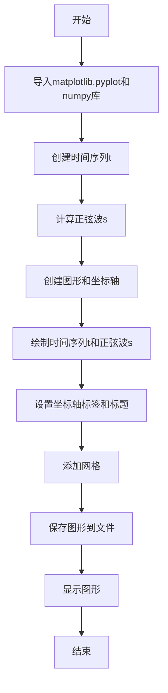
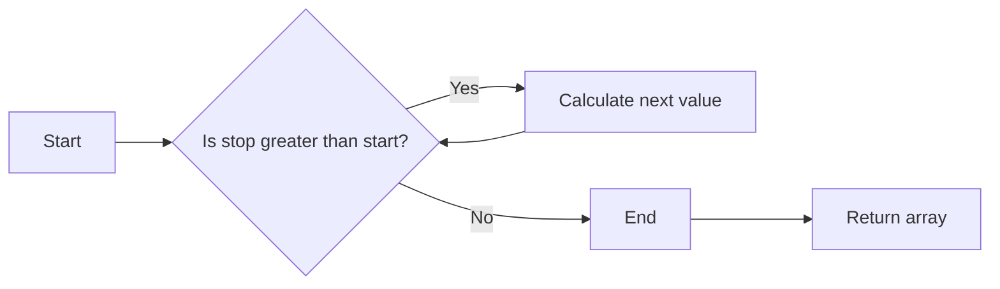
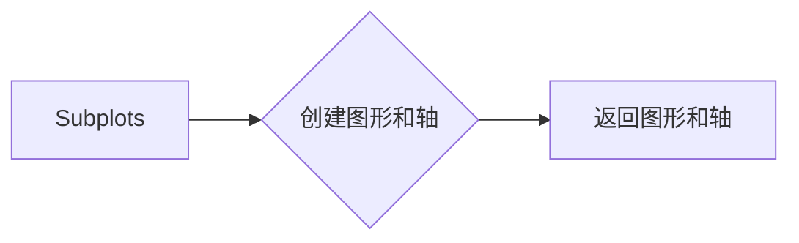

# `matplotlib\galleries\examples\lines_bars_and_markers\simple_plot.py` 详细设计文档

This code generates a simple line plot using matplotlib and numpy, plotting a sine wave over time.

## 整体流程



## 类结构

```
matplotlib.pyplot (matplotlib模块)
├── subplots()
│   ├── fig
│   └── ax
└── plot(t, s)
```

## 全局变量及字段


### `t`
    
Array of time values for the plot.

类型：`numpy.ndarray`
    


### `s`
    
Array of voltage values corresponding to the time values in 't'.

类型：`numpy.ndarray`
    


### `fig`
    
Figure object created by 'plt.subplots()'.

类型：`matplotlib.figure.Figure`
    


### `ax`
    
Axes object created by 'plt.subplots()'. It is used to plot the data and set labels and title.

类型：`matplotlib.axes._subplots.AxesSubplot`
    


### `matplotlib.pyplot.fig`
    
Figure object created by 'subplots()'.

类型：`matplotlib.figure.Figure`
    


### `matplotlib.pyplot.ax`
    
Axes object created by 'subplots()'. It is used to plot the data and set labels and title.

类型：`matplotlib.axes._subplots.AxesSubplot`
    
    

## 全局函数及方法


### np.arange

`np.arange` 是 NumPy 库中的一个函数，用于生成一个等差数列。

参数：

- `start`：`float`，数列的起始值。
- `stop`：`float`，数列的结束值，但不包括该值。
- `step`：`float`，数列的公差。

返回值：`numpy.ndarray`，一个包含等差数列的 NumPy 数组。

#### 流程图



#### 带注释源码

```python
t = np.arange(0.0, 2.0, 0.01)
# t is an array of values from 0.0 to 2.0 with a step of 0.01
```


### np.sin(2 * np.pi * t)

该函数计算并返回给定时间序列 `t` 的正弦值，其中时间序列 `t` 是从 0 到 2.0 的等差数列，步长为 0.01。

参数：

- `t`：`numpy.ndarray`，时间序列数组，表示时间点。
- `2 * np.pi * t`：`numpy.ndarray`，计算每个时间点与 2π 相乘的结果。
- `np.sin()`：`numpy.ndarray`，计算输入数组中每个元素的余弦值。

返回值：`numpy.ndarray`，与输入时间序列 `t` 长度相同的数组，包含每个时间点的正弦值。

#### 流程图

```mermaid
graph LR
A[Start] --> B{Calculate 2 * np.pi * t}
B --> C[Calculate sin(2 * np.pi * t)]
C --> D[Return result]
D --> E[End]
```

#### 带注释源码

```
s = 1 + np.sin(2 * np.pi * t)
```


### plt.subplots()

创建一个matplotlib图形和轴对象。

#### 描述

`plt.subplots()` 是一个用于创建matplotlib图形和轴对象的函数。它返回一个包含图形和轴对象的元组。

#### 参数：

- `figsize`：`tuple`，图形的大小（宽度和高度），默认为 (6, 4)。
- `dpi`：`int`，图形的分辨率，默认为 100。
- `facecolor`：`color`，图形的背景颜色，默认为 'white'。
- `edgecolor`：`color`，图形的边缘颜色，默认为 'none'。
- `frameon`：`bool`，是否显示图形的边框，默认为 True。
- `num`：`int`，轴对象的编号，默认为 1。
- `gridspec_kw`：`dict`，用于定义网格的参数，默认为 None。
- `constrained_layout`：`bool`，是否启用约束布局，默认为 False。

#### 返回值：

- `fig`：`matplotlib.figure.Figure`，图形对象。
- `ax`：`matplotlib.axes.Axes`，轴对象。

#### 流程图

```mermaid
graph LR
A[Start] --> B{Call plt.subplots()}
B --> C[Return fig and ax]
C --> D[End]
```

#### 带注释源码

```python
import matplotlib.pyplot as plt

fig, ax = plt.subplots()
```


### ax.plot(t, s)

该函数用于在matplotlib图形中绘制一条线。

参数：

- `t`：`numpy.ndarray`，时间序列数据，用于定义x轴的值。
- `s`：`numpy.ndarray`，数据序列，用于定义y轴的值。

返回值：无，该函数直接在matplotlib图形中绘制线。

#### 流程图

```mermaid
graph LR
A[开始] --> B{调用ax.plot(t, s)}
B --> C[绘制线]
C --> D[结束]
```

#### 带注释源码

```python
fig, ax = plt.subplots()  # 创建图形和坐标轴
ax.plot(t, s)  # 在坐标轴上绘制线
```


### ax.set()

`ax.set()` 是一个用于设置matplotlib图形轴（Axes）属性的方法。

参数：

- `xlabel`：`str`，设置x轴标签。
- `ylabel`：`str`，设置y轴标签。
- `title`：`str`，设置图形标题。

返回值：`None`，该方法不返回任何值。

#### 流程图

```mermaid
graph LR
A[开始] --> B{调用 ax.set()}
B --> C[设置 xlabel]
C --> D[设置 ylabel]
D --> E[设置 title]
E --> F[结束]
```

#### 带注释源码

```python
ax.set(xlabel='time (s)', ylabel='voltage (mV)',
       title='About as simple as it gets, folks')
```


### ax.grid()

设置图表的网格线。

#### 描述

`ax.grid()` 方法用于在图表上添加网格线，这有助于在图表中定位数据点。

#### 参数：

- 无

#### 返回值：

- 无

#### 流程图

```mermaid
graph LR
A[开始] --> B{调用 ax.grid()}
B --> C[结束]
```

#### 带注释源码

```python
fig, ax = plt.subplots()
ax.plot(t, s)
# 设置图表标题和轴标签
ax.set(xlabel='time (s)', ylabel='voltage (mV)', title='About as simple as it gets, folks')
# 添加网格线
ax.grid()
fig.savefig("test.png")
plt.show()
```


### fig.savefig('test.png')

该函数用于将matplotlib图形保存为PNG格式的图片文件。

参数：

- `fig`：`matplotlib.figure.Figure`，表示当前正在操作的图形对象。
- `'test.png'`：`str`，指定保存的文件名。

返回值：`None`，该函数没有返回值。

#### 流程图

```mermaid
graph LR
A[开始] --> B{调用fig.savefig('test.png')}
B --> C[结束]
```

#### 带注释源码

```python
fig.savefig("test.png")  # 保存当前图形为PNG格式的图片文件
```


### plt.show()

显示matplotlib图形窗口。

参数：

- 无

返回值：无

#### 流程图

```mermaid
graph LR
A[开始] --> B{调用plt.show()}
B --> C[结束]
```

#### 带注释源码

```python
plt.show()
```


### matplotlib.pyplot.subplots()

创建一个matplotlib图形和轴的实例。

#### 描述

`subplots()` 函数用于创建一个图形和一个或多个轴的实例。它返回一个图形和一个轴的元组，可以用来绘制图形。

#### 参数：

- `nrows`：`int`，可选，指定轴的行数。
- `ncols`：`int`，可选，指定轴的列数。
- `sharex`：`bool`，可选，指定是否共享x轴。
- `sharey`：`bool`，可选，指定是否共享y轴。
- `figsize`：`tuple`，可选，指定图形的大小。
- `dpi`：`int`，可选，指定图形的分辨率。
- `constrained_layout`：`bool`，可选，指定是否启用约束布局。

#### 返回值：

- `fig`：`matplotlib.figure.Figure`，图形实例。
- `axes`：`numpy.ndarray`，轴的数组。

#### 流程图



#### 带注释源码

```python
import matplotlib.pyplot as plt

fig, ax = plt.subplots()
```


### matplotlib.pyplot.plot

matplotlib.pyplot.plot 是一个用于绘制二维线图的函数。

参数：

- `t`：`numpy.ndarray`，时间序列数据，用于x轴。
- `s`：`numpy.ndarray`，与时间序列 `t` 对应的值，用于y轴。

返回值：`matplotlib.lines.Line2D`，绘制的线对象。

#### 流程图


#### 带注释源码

```python
import matplotlib.pyplot as plt
import numpy as np

# Data for plotting
t = np.arange(0.0, 2.0, 0.01)
s = 1 + np.sin(2 * np.pi * t)

fig, ax = plt.subplots()
ax.plot(t, s)  # Plot the line
ax.set(xlabel='time (s)', ylabel='voltage (mV)', title='About as simple as it gets, folks')
ax.grid()  # Add grid
fig.savefig("test.png")  # Save the figure
plt.show()  # Show the figure
```


## 关键组件


### 张量索引与惰性加载

张量索引与惰性加载允许在处理大型数据集时，只加载和处理需要的数据部分，从而提高效率。

### 反量化支持

反量化支持使得代码能够处理非整数类型的量化数据，增加了代码的灵活性和适用范围。

### 量化策略

量化策略定义了如何将浮点数数据转换为固定点数表示，以减少计算资源消耗和提高运行速度。


## 问题及建议


### 已知问题

-   **代码复用性低**：代码中绘制的图形和设置是硬编码的，如果需要绘制不同的图形或使用不同的数据，需要修改大量代码。
-   **无错误处理**：代码中没有错误处理机制，如果绘图过程中出现异常（如文件保存失败），程序将无法给出任何提示。
-   **无参数化输入**：代码没有提供参数化输入的功能，无法通过命令行或配置文件调整图形的参数。

### 优化建议

-   **增加代码复用性**：将绘图和设置的部分封装成函数或类，以便在不同的上下文中重用。
-   **添加错误处理**：在关键操作（如文件保存）中添加异常处理，确保程序在出现错误时能够给出清晰的提示。
-   **实现参数化输入**：通过命令行参数或配置文件允许用户自定义图形的参数，如标题、坐标轴标签、数据等。
-   **使用配置文件**：将绘图参数存储在配置文件中，使得代码更加灵活，易于维护。
-   **模块化设计**：将绘图相关的代码拆分成多个模块，提高代码的可读性和可维护性。
-   **文档化**：为代码添加详细的文档注释，说明每个函数和类的用途、参数和返回值。


## 其它


### 设计目标与约束

- 设计目标：创建一个基本的线形图，展示时间和电压的关系。
- 约束：使用matplotlib库进行绘图，不使用额外的绘图库。

### 错误处理与异常设计

- 错误处理：代码中没有显式的错误处理机制。
- 异常设计：如果matplotlib库无法正常工作，可能会抛出异常。

### 数据流与状态机

- 数据流：从numpy生成时间序列t和电压序列s，然后使用matplotlib进行绘图。
- 状态机：代码没有使用状态机，它是一个简单的线性流程。

### 外部依赖与接口契约

- 外部依赖：代码依赖于matplotlib和numpy库。
- 接口契约：matplotlib和numpy库提供了绘图和数值计算的功能。


    