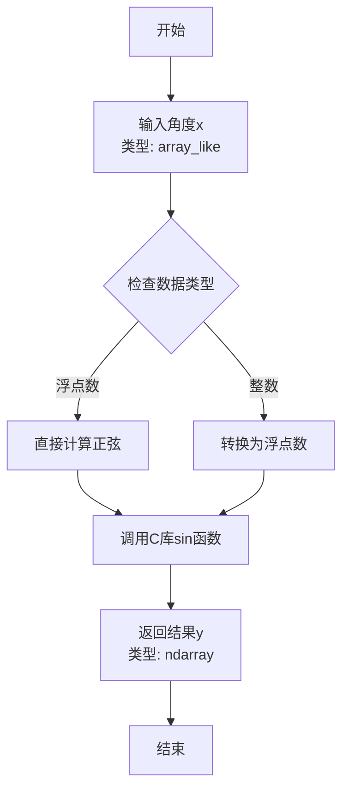
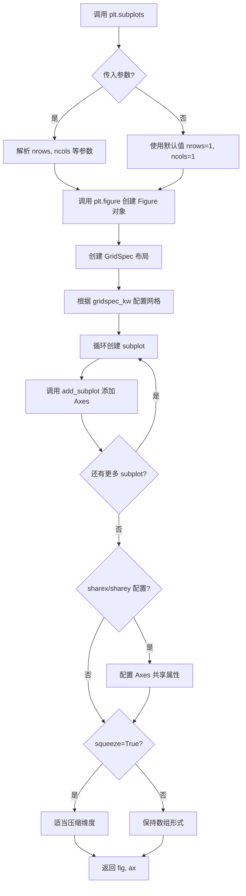
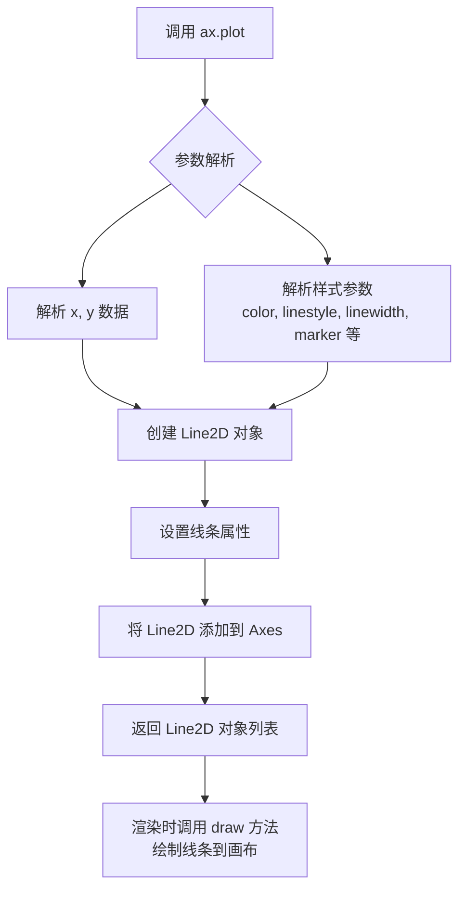
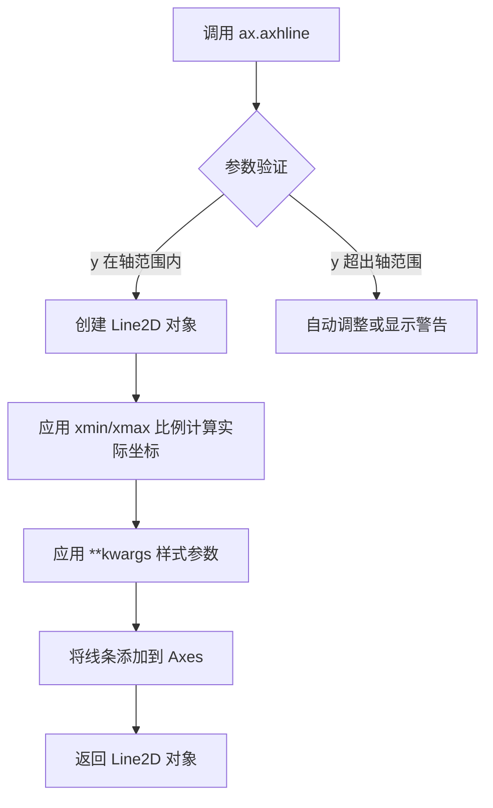
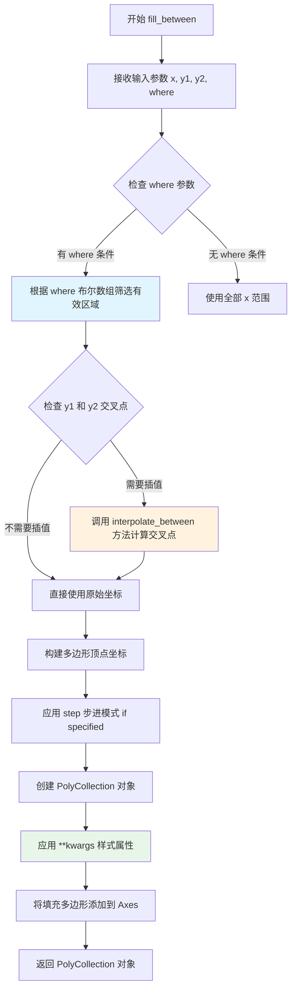
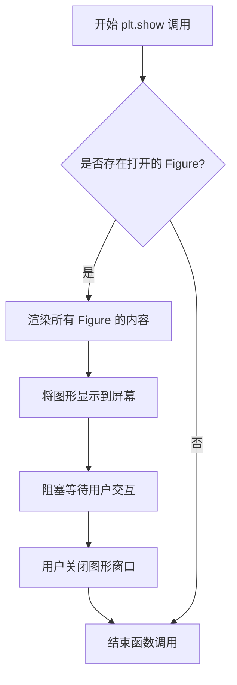

# `matplotlib\galleries\examples\lines_bars_and_markers\span_regions.py` 详细设计文档

该脚本使用matplotlib的fill_between函数，根据正弦波的的正负值条件，在坐标轴上用不同颜色（绿色表示正值区域，红色表示负值区域）填充波形曲线与边界线之间的区域，直观展示正弦波的上下半周期。

## 整体流程

```mermaid
graph TD
    A[开始] --> B[导入matplotlib.pyplot和numpy]
    B --> C[创建时间数组t: 0到2，步长0.01]
    C --> D[计算正弦波数组s = sin(2πt)]
    D --> E[创建图形fig和坐标轴ax]
    E --> F[在ax上绘制正弦曲线s]
    F --> G[在y=0处绘制水平黑色参考线]
    G --> H[填充条件s>0的区域: 从1到s，绿色，透明度0.5]
    H --> I[填充条件s<0的区域: 从-1到s，红色，透明度0.5]
    I --> J[调用plt.show()显示图形]
    J --> K[结束]
```

## 类结构

```
该脚本为面向过程式代码，无类定义
└── 全局变量作用域
    ├── t: 时间数组（numpy.ndarray）
    ├── s: 正弦波数组（numpy.ndarray）
    ├── fig: 图形对象（matplotlib.figure.Figure）
    └── ax: 坐标轴对象（matplotlib.axes.Axes）
```

## 全局变量及字段


### `t`
    
时间序列数组，从0到2（不含2），步长0.01

类型：`numpy.ndarray`
    


### `s`
    
对应时间序列的正弦波数值数组

类型：`numpy.ndarray`
    


### `fig`
    
整个图形容器对象

类型：`matplotlib.figure.Figure`
    


### `ax`
    
坐标轴对象，用于绘图和填充操作

类型：`matplotlib.axes.Axes`
    


    

## 全局函数及方法


### `np.arange`

生成等差数列时间数组的函数，用于创建均匀间隔的值序列。

参数：

- `start`：`float` 或 `int`，起始值（可选，默认为0）
- `stop`：`float` 或 `int`，结束值（必选，生成的数组不包含此值）
- `step`：`float` 或 `int`，步长（可选，默认为1）
- `dtype`：`dtype`，输出数组的数据类型（可选，若未指定则根据输入参数推断）

返回值：`ndarray`，返回一个均匀间隔的一维数组

#### 流程图

```mermaid
flowchart TD
    A[开始] --> B{是否指定start?}
    B -->|是| C[使用指定的start值]
    B -->|否| D[默认start=0]
    C --> E{是否指定step?}
    D --> E
    E -->|是| F[使用指定的step值]
    E -->|否| G[默认step=1]
    F --> H{是否指定dtype?}
    G --> H
    H -->|是| I[使用指定的dtype]
    H -->|否| J[根据start, stop, step推断dtype]
    I --> K[计算数组长度: ceil((stop-start)/step)]
    J --> K
    K --> L[创建并返回等差数列数组]
    L --> M[结束]
```

#### 带注释源码

```python
def arange(start=0, stop=None, step=1, dtype=None):
    """
    生成等差数列数组
    
    参数:
        start: 起始值，默认为0
        stop: 结束值（不包含）
        step: 步长，默认为1
        dtype: 输出数据类型（可选）
    
    返回:
        ndarray: 均匀间隔的数组
    """
    # 如果只提供一个参数，它被视为stop值，起始值默认为0
    if stop is None:
        start, stop = 0, start
    
    # 计算数组长度：(stop - start) / step，向上取整
    # 例如：arange(0, 2, 0.01) 产生 200 个元素
    length = int(np.ceil((stop - start) / step))
    
    # 创建数组并返回
    return np.array([start + i * step for i in range(length)], dtype=dtype)

# 示例用法：
t = np.arange(0.0, 2, 0.01)  # 生成从0到2（不包含），步长0.01的数组
# 结果：array([0.00, 0.01, 0.02, ..., 1.99, 2.00])
```


### `np.sin`

计算输入数组或标量的正弦值（以弧度为单位）。

参数：

-  `x`：`array_like`，输入角度（弧度）
-  `out`：`ndarray, optional`，用于存储结果的数组
-  `where`：`array_like, optional`，仅计算满足条件的元素（仅在某些numpy版本中作为ufunc参数）
-  `dtype`：`data-type, optional`，输出的数据类型

返回值：

-  `y`：`ndarray`，与 `x` 形状相同的正弦值数组

#### 流程图



#### 带注释源码

```python
# numpy中sin函数的简化实现逻辑
import numpy as np

# 示例调用
t = np.arange(0.0, 2, 0.01)  # 生成0到2之间、步长0.01的数组
s = np.sin(2*np.pi*t)        # 计算2*pi*t的正弦值

# np.sin源码核心逻辑（伪代码）
def sin(x):
    """
    计算正弦值
    
    参数:
        x: 输入角度，单位为弧度，可以是标量或数组
    
    返回:
        正弦值，类型与输入相同
    """
    # 将输入转换为numpy数组（如果还不是）
    x = np.asarray(x)
    
    # 使用numpy的ufunc机制调用底层的sin实现
    # 底层通常调用C库的sin函数
    return np.sin(x)  # 实际上这里会调用numpy的C实现
```

> **注**：上述源码为逻辑伪代码，`np.sin` 的实际实现位于NumPy的C源代码中（`numpy/_core/src/umath/loops.c.src` 等文件），通过向量化操作对每个元素计算正弦值。


### `plt.subplots`

`plt.subplots` 是 matplotlib 库中的一个便捷函数，用于创建一个新的图形窗口（Figure）以及一个或多个坐标轴（Axes），它封装了 `figure()` 和 `add_subplot()` 的操作，是快速创建子图布局的首选方法。

参数：

- `nrows`：`int`，默认值 1，子图网格的行数
- `ncols`：`int`，默认值 1，子图网格的列数
- `sharex`：`bool` 或 `str`，默认值 False，是否共享 x 轴刻度
- `sharey`：`bool` 或 `str`，默认值 False，是否共享 y 轴刻度
- `squeeze`：`bool`，默认值 True，是否压缩返回的 Axes 数组维度
- `width_ratios`：`array-like`，长度等于 ncols，各列宽度比例
- `height_ratios`：`array-like`，长度等于 nrows，各行高度比例
- `subplot_kw`：`dict`，传递给 add_subplot 的关键字参数
- `gridspec_kw`：`dict`，传递给 GridSpec 构造器的关键字参数
- `**fig_kw`：传递给 figure() 函数的其他关键字参数

返回值：`tuple(Figure, Axes | ndarray of Axes)`，返回图形对象和坐标轴对象（或坐标轴数组）

#### 流程图



#### 带注释源码

```python
def subplots(nrows=1, ncols=1, *, sharex=False, sharey=False, squeeze=True,
             width_ratios=None, height_ratios=None,
             subplot_kw=None, gridspec_kw=None, **fig_kw):
    """
    创建一个包含子图的图形和坐标轴。
    
    参数:
        nrows: 子图网格行数，默认1
        ncols: 子图网格列数，默认1
        sharex: 是否共享x轴，False/'row'/'col'/'all'
        sharey: 是否共享y轴，False/'row'/'col'/'all'
        squeeze: 是否压缩返回的Axes数组维度
        width_ratios: 各列宽度比例数组
        height_ratios: 各行高度比例数组
        subplot_kw: 传递给add_subplot的参数字典
        gridspec_kw: 传递给GridSpec的参数字典
        **fig_kw: 传递给figure()的额外参数
    
    返回:
        fig: matplotlib.figure.Figure 对象
        ax: axes.Axes 或 axes.Axes 数组
    """
    # 1. 创建 Figure 对象
    fig = figure(**fig_kw)
    
    # 2. 创建 GridSpec 布局对象
    gs = GridSpec(nrows, nrows, 
                  width_ratios=width_ratios,
                  height_ratios=height_ratios,
                  **gridspec_kw)
    
    # 3. 遍历创建 subplot
    ax_arr = np.empty((nrows, ncols), dtype=object)
    for i in range(nrows):
        for j in range(ncols):
            # 创建子图关键字参数
            kw = {}
            if subplot_kw:
                kw.update(subplot_kw)
            
            # 调用 add_subplot 添加子图
            ax = fig.add_subplot(gs[i, j], **kw)
            ax_arr[i, j] = ax
    
    # 4. 处理 Axes 共享逻辑
    if sharex == 'col':
        for i in range(ncols):
            for j in range(1, nrows):
                ax_arr[j, i].sharex(ax_arr[0, i])
    # ... 其他 sharex/sharey 逻辑
    
    # 5. 根据 squeeze 参数处理返回值
    if squeeze:
        # 压缩单维度数组
        if nrows == 1 and ncols == 1:
            return fig, ax_arr[0, 0]
        elif nrows == 1 or ncols == 1:
            return fig, ax_arr.flatten()
    
    return fig, ax_arr
```


### `ax.plot`

在 matplotlib 的 Axes 对象上绘制 y 与 x 的关系曲线（或仅 y 值与索引的关系），支持多种样式参数配置，返回表示所绘线条的 Line2D 对象列表。

参数：

- `x`：`array-like`，可选，x 轴数据。如果未提供，则使用 y 的索引作为 x 值。
- `y`：`array-like`，y 轴数据，必需参数。
- `color`：`str` 或 `rgba`，可选，线条颜色，如 `'black'`、`'#000000'` 或 `'#FF0000FF'`。
- `linestyle` / `ls`：`str`，可选，线条样式，如 `'-'`（实线）、`'--'`（虚线）、`':'`（点线）。
- `linewidth` / `lw`：`float`，可选，线条宽度，如 `1.5`。
- `marker`：`str`，可选，数据点标记样式，如 `'o'`（圆形）、`'s'`（方形）。
- `label`：`str`，可选，图例标签，用于 legend 显示。
- `alpha`：`float`，可选，透明度，范围 0-1。
- `markerfacecolor`：`str`，可选，标记填充颜色。
- `markeredgecolor`：`str`，可选，标记边框颜色。

返回值：`list of matplotlib.lines.Line2D`，返回绘制的线条对象列表，每个 Line2D 对象包含线条的样式、数据和属性信息。

#### 流程图



#### 带注释源码

```python
# 示例代码展示 ax.plot 的使用
import matplotlib.pyplot as plt
import numpy as np

# 准备数据：生成 x 轴时间序列和 y 轴正弦波数据
t = np.arange(0.0, 2, 0.01)          # 从 0 到 2，步长 0.01 的时间数组
s = np.sin(2*np.pi*t)               # 2π 频率的正弦波

# 创建图表和坐标轴对象
fig, ax = plt.subplots()

# 调用 ax.plot 绘制曲线
# 参数：t 为 x 轴数据，s 为 y 轴数据，color='black' 设置线条颜色为黑色
# 返回值：Line2D 对象（示例中未捕获）
ax.plot(t, s, color='black')

# 绘制水平参考线 y=0
ax.axhline(0, color='black')

# 使用 fill_between 填充区域（与 plot 无关的附加功能）
ax.fill_between(t, 1, where=s > 0, facecolor='green', alpha=.5)
ax.fill_between(t, -1, where=s < 0, facecolor='red', alpha=.5)

# 显示图表
plt.show()

# ax.plot 内部简化逻辑：
# 1. 接收 x, y 数据和样式关键字参数
# 2. 创建 matplotlib.lines.Line2D 对象
# 3. 设置线条的 xdata, ydata 属性
# 4. 根据 kwargs 设置样式属性（color, linestyle, linewidth 等）
# 5. 调用 ax.add_line(line) 将线条添加到坐标轴
# 6. 返回包含 Line2D 对象的列表
```


### ax.axhline

在 matplotlib 的 Axes 对象上绘制一条水平线，用于在图表中标记特定的 y 坐标位置，常用于添加参考线或基准线。

参数：

- `y`：`float`，默认为 0。水平线的 y 坐标位置
- `xmin`：`float`，默认为 0。线条起始的 x 位置（相对于坐标轴宽度的比例，取值范围 0-1）
- `xmax`：`float`，默认为 1。线条结束的 x 位置（相对于坐标轴宽度的比例，取值范围 0-1）
- `**kwargs`：关键字参数传递给 `matplotlib.lines.Line2D`，用于自定义线条样式（如 `color`、`linestyle`、`linewidth`、`alpha` 等）

返回值：`matplotlib.lines.Line2D`，返回绘制好的水平线对象，可用于后续的样式修改或属性设置

#### 流程图



#### 带注释源码

```python
# matplotlib.axes.Axes.axhline 方法源码结构

def axhline(self, y=0, xmin=0, xmax=1, **kwargs):
    """
    在 Axes 上绘制水平线
    
    参数:
        y: float - 水平线的 y 坐标（默认 0）
        xmin: float - 起始位置比例（默认 0，表示最左边）
        xmax: float - 结束位置比例（默认 1，表示最右边）
        **kwargs: 传递给 Line2D 的样式参数
    """
    
    # 1. 将 xmin/xmax 比例转换为实际数据坐标
    # xmin=0 对应 axes 的左侧边缘，xmax=1 对应右侧边缘
    xline = [self.get_xlim()[0], self.get_xlim()[1]]
    yline = [y, y]
    
    # 2. 根据 xmin/xmax 比例调整线条的实际起止位置
    xlim = self.get_xlim()
    xline[0] = xlim[0] + xmin * (xlim[1] - xlim[0])
    xline[1] = xlim[0] + xmax * (xlim[1] - xlim[0])
    
    # 3. 创建 Line2D 对象并应用样式参数
    line = mlines.Line2D(xline, yline, **kwargs)
    
    # 4. 将线条添加到 Axes 中
    self.add_line(line)
    
    # 5. 返回 Line2D 对象供后续操作
    return line
```


### `matplotlib.axes.Axes.fill_between`

`fill_between` 是 Matplotlib 中 Axes 类的核心方法，用于在两条曲线之间的区域填充颜色。该方法特别适合展示数据区间、强调数据范围或可视化条件性区域。通过 `where` 参数，可以根据逻辑条件选择性地填充特定区域，实现条件渲染效果。

参数：

- `x`：`numpy.ndarray` 或 array-like，x轴坐标数据，长度为N的数组
- `y1`：`scalar`、`numpy.ndarray` 或 None，第一条曲线的y值，长度为N的数组，默认为None（即y=0）
- `y2`：`scalar`、`numpy.ndarray` 或 None，第二条曲线的y值，默认为0
- `where`：`numpy.ndarray` 或 None，布尔条件数组，用于指定在哪些x位置填充区域
- `interpolate`：`bool`，是否在交叉点处进行精确插值，默认为False
- `step`：`{'pre', 'post', 'mid'}` 或 None，步进插值模式，默认为None
- `**kwargs`：传递给 `matplotlib.collections.PolyCollection` 的关键字参数，如 `facecolor`、`alpha`、`edgecolor`、`label` 等

返回值：`matplotlib.collections.PolyCollection`，返回填充区域的多边形集合对象，可用于进一步自定义样式或获取填充区域信息

#### 流程图



#### 带注释源码

```python
# 示例代码：使用 fill_between 根据条件填充正负区域
import matplotlib.pyplot as plt
import numpy as np

# 1. 准备数据：创建时间序列和正弦波数据
t = np.arange(0.0, 2, 0.01)       # x轴：0到2秒，步长0.01
s = np.sin(2*np.pi*t)            # y轴：正弦波，周期1秒

# 2. 创建图形和坐标轴
fig, ax = plt.subplots()

# 3. 绘制基础线条和参考线
ax.plot(t, s, color='black')     # 绘制正弦曲线
ax.axhline(0, color='black')     # 绘制x轴参考线（y=0）

# 4. 使用 fill_between 填充正区域（s > 0）
# 参数说明：
#   t: x坐标数组
#   1: y1 上边界（固定值1）
#   where=s > 0: 仅在正弦波为正时填充
#   facecolor='green': 填充颜色为绿色
#   alpha=.5: 透明度50%
ax.fill_between(
    t,                  # x坐标数组
    1,                  # y1上边界
    where=s > 0,       # 条件：仅填充s>0的区域
    facecolor='green', # 填充颜色
    alpha=.5            # 透明度
)

# 5. 使用 fill_between 填充负区域（s < 0）
ax.fill_between(
    t,                  # x坐标数组
    -1,                 # y1下边界（固定值-1）
    where=s < 0,       # 条件：仅填充s<0的区域
    facecolor='red',   # 填充颜色
    alpha=.5            # 透明度
)

# 6. 显示图形
plt.show()

# 返回值 PolyCollection 的典型用法：
# fill_collection = ax.fill_between(t, 1, where=s > 0)
# fill_collection.set_facecolor('blue')     # 修改填充色
# fill_collection.set_alpha(0.3)            # 修改透明度
# fill_collection.get_paths()              # 获取填充区域路径
```


### `plt.show`

显示图形，将所有打开的 Figure 对象呈现到屏幕上。该函数会阻塞程序的执行，直到用户关闭图形窗口或调用 `plt.close()`。

参数：

- 该函数没有参数

返回值：`None`，无返回值

#### 流程图



#### 带注释源码

```python
# plt.show() 函数是 matplotlib.pyplot 模块中的显示函数
# 位于 matplotlib.pyplot 库中

# 以下是从给定代码中提取的相关调用：

# 导入 matplotlib.pyplot 模块
import matplotlib.pyplot as plt

# ... (前面的代码创建了图形)

# fig, ax = plt.subplots()  # 创建图形和坐标轴
# ax.plot(t, s, color='black')  # 绘制正弦曲线
# ax.axhline(0, color='black')  # 绘制水平线
# ax.fill_between(t, 1, where=s > 0, facecolor='green', alpha=.5)  # 填充正区域
# ax.fill_between(t, -1, where=s < 0, facecolor='red', alpha=.5)  # 填充负区域

# 调用 plt.show() 显示最终图形
# 这是 matplotlib 中显示所有待渲染图形的标准方式
# 函数会检查当前所有打开的 Figure 对象，并将其渲染到屏幕
# 在某些交互环境（如 Jupyter Notebook）中可能需要使用 %matplotlib inline
plt.show()  # 显示图形，阻塞直到用户关闭窗口
```

## 关键组件


### fill_between 条件填充

使用 matplotlib 的 fill_between 方法，根据逻辑条件（sin函数正负）在指定区间填充不同颜色的区域

### 逻辑掩码 (where 参数)

通过 where 参数实现条件填充，只在满足 s > 0 或 s < 0 的区域进行填充，实现条件渲染

### 数据生成 (numpy)

使用 numpy 生成时间序列和正弦波数据，为图形提供基础数据源

### 坐标轴配置

通过 plot 和 axhline 设置曲线和基准线，axhline 用于绘制 y=0 基准线


## 问题及建议


### 已知问题

-  **图形尺寸未设置**：代码未指定图形尺寸（figsize），使用默认尺寸，可能导致图形比例不理想
-  **缺少必要的图表元素**：没有设置图表标题（title）、坐标轴标签（xlabel/ylabel），图表缺乏完整性和可读性
-  **样式硬编码**：颜色（'green'、'red'、'black'）、透明度（.5）等值直接硬编码，缺乏灵活性和可配置性
-  **魔法命令依赖**：代码中的`# %%`是Jupyter Notebook/Sphinx的单元格分隔符，在标准Python环境中执行会产生不必要的注释
-  **边界填充不完整**：fill_between只处理了where条件区域，未处理s=0的边界线，可能导致视觉上的不连续
-  **函数封装缺失**：所有代码直接执行，无法作为函数复用，也不便于单元测试
-  **缺少数据验证**：未对输入数据t和s进行有效性检查（如长度匹配、NaN值处理）
-  **文档字符串不完整**：模块级文档过于简略，缺少参数说明、返回值说明和使用示例

### 优化建议

- **添加图形尺寸和样式配置**：使用`figsize=(10, 6)`设置合适的图形大小，考虑添加`plt.style.use()`使用预定义样式
- **完善图表标注**：添加`ax.set_title()`、`ax.set_xlabel()`、`ax.set_ylabel()`提供完整的图表信息
- **参数化设计**：将颜色、透明度、线宽等作为可配置参数，或使用matplotlib的rcParams进行全局样式设置
- **封装为可复用函数**：将绘图逻辑封装成函数，接受数据参数和样式参数，提高代码复用性
- **添加数据验证**：在绘图前验证输入数据的有效性，处理NaN、无穷值等异常情况
- **添加图例和网格**：使用`ax.legend()`添加图例说明，使用`ax.grid()`添加网格线提升可读性
- **支持多种导出格式**：添加`fig.savefig()`支持将图形保存为PNG、SVG等格式


## 其它


### 设计目标与约束

本示例旨在演示如何使用matplotlib的fill_between方法根据逻辑条件（正弦波的的正负区域）对图表进行条件填充着色。设计目标是创建清晰的可视化图形，直观展示正弦波的正负半周期。约束条件包括：需要matplotlib和numpy库支持，图形窗口环境可用。

### 错误处理与异常设计

本示例为简单脚本，未包含复杂的错误处理机制。潜在的异常情况包括：1) 导入异常 - matplotlib或numpy未安装；2) 图形后端异常 - 无可用显示设备；3) 数据类型异常 - 输入数组维度不匹配。实际应用中应添加try-except块捕获ImportError、RuntimeError等异常，并提供友好的错误提示信息。

### 外部依赖与接口契约

本代码依赖以下外部包：1) matplotlib.pyplot - 绘图框架，提供Figure、Axes对象；2) numpy - 数值计算，提供arange、sin函数和数组操作。接口契约：np.arange(start, stop, step)返回等差数组；plt.subplots()返回(fig, ax)元组；ax.fill_between(x, y1, y2, where, **kwargs)执行区域填充。

### 性能考虑

当前实现数据点数量为200个（0.0到2.0，步长0.01），性能表现良好。如需优化大规模数据渲染，可考虑：1) 减少采样点数量；2) 使用LineCollection代替多次fill_between调用；3) 对静态图表使用savefig直接保存而非plt.show()。

### 可测试性设计

本示例为演示脚本，未包含单元测试。测试用例可包括：1) 验证数据生成函数的输出形状；2) 验证fill_between调用参数正确性；3) 验证图形对象创建成功。建议使用pytest框架编写测试，通过fighash或图像比对进行可视化回归测试。

### 版本兼容性

代码使用标准的matplotlib和numpy API，具有良好的向后兼容性。建议最低版本：numpy>=1.0，matplotlib>=2.0。Python版本建议3.6以上以支持f-string等新特性。

### 配置管理

本示例未使用配置文件，所有参数硬编码。扩展建议：可将颜色(green/red)、透明度(alpha)、数据范围等参数提取至配置字典或YAML/JSON配置文件，便于非技术人员调整图表样式。

### 资源管理

matplotlib后端会自动管理图形窗口和渲染资源。内存释放通过plt.close(fig)显式调用实现（尤其在循环生成多个图表时）。建议在使用完毕后显式调用plt.close()避免资源泄漏。


    