# `matplotlib\galleries\examples\lines_bars_and_markers\spectrum_demo.py` 详细设计文档

该脚本生成了一个带有指数衰减噪声的正弦波信号，并使用matplotlib展示了该信号在时域的波形以及在频域的多种表示形式，包括幅度谱、对数幅度谱、相位谱和角度谱，用于演示FFT频谱分析的不同视图。

## 整体流程

```mermaid
graph TD
    A[开始] --> B[设置随机种子 np.random.seed(0)]
    B --> C[定义采样间隔 dt=0.01]
    C --> D[计算采样频率 Fs=1/dt]
    D --> E[生成时间数组 t=np.arange(0, 10, dt)]
    E --> F[生成高斯白噪声 nse=np.random.randn(len(t))]
    F --> G[生成指数衰减脉冲响应 r=np.exp(-t/0.05)]
    G --> H[卷积生成有色噪声 cnse=np.convolve(nse, r)*dt]
    H --> I[截断噪声数组 cnse=cnse[:len(t)]]
    I --> J[合成信号 s=0.1*sin(4πt)+cnse]
    J --> K[创建图形 fig=plt.figure]
    K --> L[使用subplot_mosaic创建2x3子图布局]
    L --> M[绘制时域信号 axs['signal'].plot(t, s)]
    M --> N[绘制幅度谱 axs['magnitude'].magnitude_spectrum]
    N --> O[绘制对数幅度谱 axs['log_magnitude'].magnitude_spectrum(scale='dB')]
    O --> P[绘制相位谱 axs['phase'].phase_spectrum]
    P --> Q[绘制角度谱 axs['angle'].angle_spectrum]
    Q --> R[调用plt.show()显示图形]
```

## 类结构

```
该脚本为单文件无类定义脚本
所有代码在全局作用域执行
使用面向过程的方式完成信号生成和可视化
```

## 全局变量及字段


### `dt`
    
采样间隔，值为0.01秒

类型：`float`
    


### `Fs`
    
采样频率，由1/dt计算得出

类型：`float`
    


### `t`
    
时间数组，从0到10秒，步长dt

类型：`numpy.ndarray`
    


### `nse`
    
高斯白噪声数组，长度与t相同

类型：`numpy.ndarray`
    


### `r`
    
指数衰减脉冲响应数组

类型：`numpy.ndarray`
    


### `cnse`
    
卷积后的有色噪声，经截断处理

类型：`numpy.ndarray`
    


### `s`
    
最终合成信号，包含正弦分量和噪声

类型：`numpy.ndarray`
    


### `fig`
    
图形对象

类型：`matplotlib.figure.Figure`
    


### `axs`
    
子图轴对象字典，通过subplot_mosaic创建

类型：`dict`
    


    

## 全局函数及方法


### `np.random.seed`

设置 NumPy 随机数生成器的种子，用于确保后续随机操作的可重复性。通过指定相同的种子值，可以获得相同的随机数序列，从而保证实验或结果的可复现性。

参数：

- `seed`：`int` 或 `None`，随机数生成器的种子值。`None` 表示每次调用都使用系统时间作为种子；`0` 或其他整数表示使用固定的种子值，使随机数序列可复现。

返回值：`None`，无返回值。该函数仅修改随机数生成器的内部状态。

#### 流程图

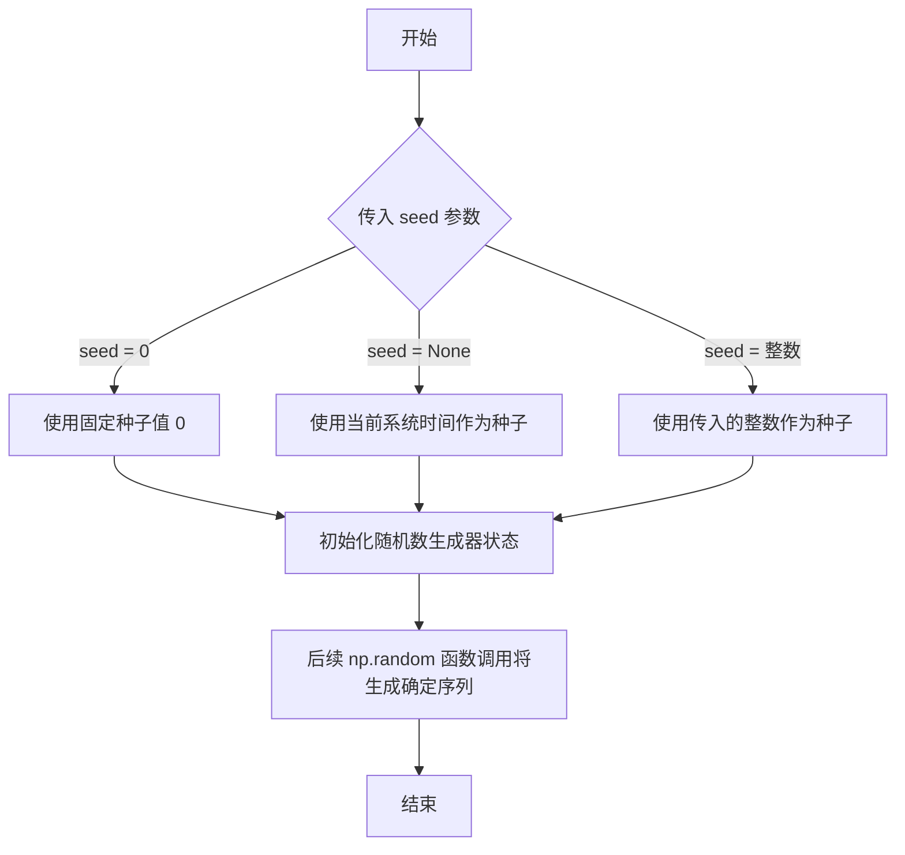

#### 带注释源码

```python
# 设置随机数种子为 0，确保后续随机操作可复现
# 参数 seed: 整数类型，种子值
#   - 0: 使用固定种子，每次运行生成相同的随机序列
#   - None: 使用系统时间作为种子（默认行为）
#   - 其他整数: 使用指定整数作为种子
np.random.seed(0)
```


### `np.arange`

创建等差数组函数，用于生成均匀间隔的值序列。该函数是 NumPy 中最基础且常用的数组创建函数之一，类似于 Python 内置的 `range()` 函数，但返回的是 NumPy 数组而非列表，支持浮点数精度。

参数：

- `start`：`float` 或 `int`，起始值，默认为 0。如果只提供 stop 参数，则作为结束值
- `stop`：`float` 或 `int`，结束值（不包含）
- `step`：`float` 或 `int`，步长，默认为 1
- `dtype`：`dtype`，输出数组的数据类型，如果未指定则从输入参数推断

返回值：`ndarray`，返回均匀间隔的值数组

#### 流程图

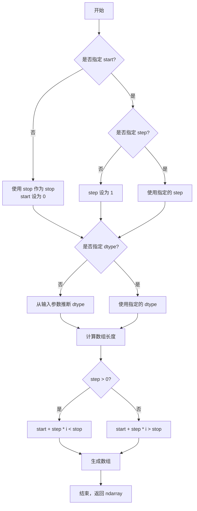

#### 带注释源码

```python
def arange(start=0, stop=None, step=1, dtype=None):
    """
    返回均匀间隔的值。
    
    参数
    ----------
    start : number, optional
        序列的起始值，默认为 0
    stop : number
        序列的结束值（不包含）
    step : number, optional
        值之间的步长，默认为 1
    dtype : dtype, optional
        输出数组的数据类型
    
    返回值
    -------
    arange : ndarray
        均匀间隔值的数组
    
    示例
    --------
    >>> np.arange(5)
    array([0, 1, 2, 3, 4])
    
    >>> np.arange(1, 5)
    array([1, 2, 3, 4])
    
    >>> np.arange(0, 10, 2)
    array([0, 2, 4, 6, 8])
    """
    # 处理只有一个参数的情况（stop）
    if stop is None:
        stop = start
        start = 0
    
    # 推断数据类型
    if dtype is None:
        # 根据输入参数选择合适的类型
        dtype = _PromotionToFloat.get(start, stop, step)
    
    # 计算数组长度
    # num = ceil((stop - start) / step)
    # 处理浮点数精度问题
    if step > 0:
        num = int(np.ceil((stop - start) / step))
    else:
        num = int(np.ceil((stop - start) / step))
    
    # 防止内存分配过大
    if num < 0:
        num = 0
    
    # 生成数组
    y = _arange_jet(start, step, num, dtype)
    return y
```

#### 使用示例（在提供的代码中）

```python
# 在给定代码中的使用
dt = 0.01  # 采样间隔
t = np.arange(0, 10, dt)  # 生成从 0 到 10，步长为 0.01 的数组
# 结果：array([0.00, 0.01, 0.02, ..., 9.98, 9.99])
```


### `np.random.randn`

生成标准正态分布（均值为0，标准差为1）的随机数数组。该函数是 NumPy 随机数生成模块的核心函数之一，常用于信号处理、机器学习等领域模拟高斯噪声或初始化参数。

参数：

-  `*args`：可变数量的整数参数（int），表示输出数组的维度。在代码中传入 `len(t)` 表示生成一个长度为 `len(t)` 的一维数组。

返回值：`ndarray`，返回指定形状的标准正态分布随机数数组，数据类型为 float64。

#### 流程图

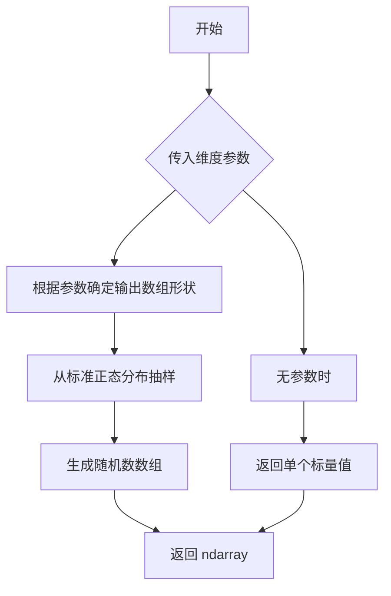

#### 带注释源码

```python
# 在本项目中的实际使用：
nse = np.random.randn(len(t))

# 函数原型（NumPy 内部实现简化版）：
# def randn(*args):
#     """
#     返回一个或一组来自标准正态分布（高斯分布）的随机数。
#     
#     参数:
#         *args: int, 可选
#             定义输出数组的形状。如果未提供参数，则返回单个标量。
#     
#     返回值:
#         ndarray 或 float
#             标准正态分布的随机数数组
#     """
#     # 内部调用正态分布生成器，均值=0，标准差=1
#     return random_generator.normal(loc=0.0, scale=1.0, size=args)

# 详细调用示例：
# np.random.randn(d0, d1, d2, ...)  # 多维数组
# np.random.randn(5)                # 一维数组，长度5
# np.random.randn(3, 4)             # 3x4二维数组
# np.random.randn()                 # 单个标量值
```


### `np.exp`

np.exp 是 NumPy 库中的指数函数，用于计算自然常数 e 的 x 次方（e^x）。在当前代码中，该函数用于生成指数衰减因子 r，模拟信号中的衰减特性。

参数：

-  `x`：`ndarray` 或 `scalar`，输入值，可以是任意形状的数组或标量，计算 e 的 x 次方

返回值：`ndarray`，返回与输入形状相同的数组，包含 e 的 x 次方的计算结果

#### 流程图

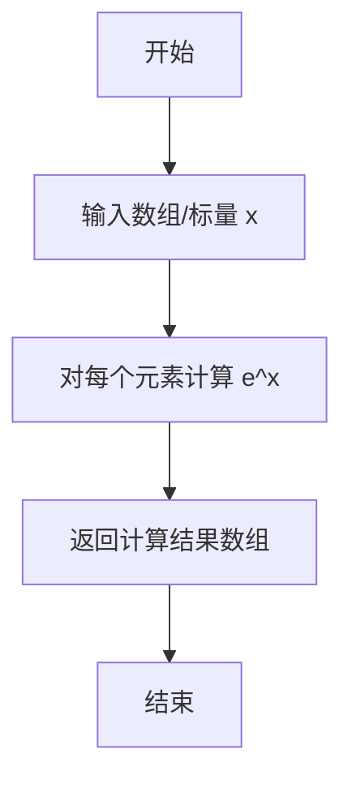

#### 带注释源码

```python
# 在本代码中的实际使用：
r = np.exp(-t / 0.05)

# 详细解释：
# t: 时间数组，范围从0到10，步长0.01
# -t / 0.05: 计算负的衰减时间常数，得到一个从0开始向负无穷递减的数组
# np.exp(-t / 0.05): 计算 e 的(-t/0.05)次方
#   - 当 t=0 时，exp(0) = 1
#   - 随着 t 增大，-t/0.05 越来越负，exp 值越来越小，趋近于 0
#   - 这创建了一个指数衰减包络信号
# r: 得到的指数衰减数组，用于与噪声卷积生成带衰减的噪声
```

#### 关键技术点

- **数学原理**：np.exp 计算自然指数函数 f(x) = e^x，其中 e ≈ 2.71828
- **向量化操作**：该函数支持NumPy的向量化操作，可对整个数组进行元素级计算，无需循环
- **数值特性**：由于使用浮点数计算，当输入值较大时可能出现溢出（返回 inf）
- **在信号处理中的作用**：生成的衰减因子 r 用于模拟物理系统中信号的指数衰减现象，如RC电路响应、阻尼振荡等


### `np.convolve`

`np.convolve` 是 NumPy 库中的卷积运算函数，用于计算两个一维数组的线性卷积。该函数在信号处理中常用于滤波、信号平滑以及系统响应计算等场景。

参数：

- `a`：`array_like`，第一个输入数组，通常为被卷积的信号
- `v`：`array_like`，第二个输入数组，通常为卷积核或滤波器系数
- `mode`：`{'full', 'valid', 'same'}`, 可选，默认 'full'，指定输出数组的长度模式

返回值：`ndarray`，两个输入数组的卷积结果

#### 流程图

```mermaid
flowchart TD
    A[开始卷积运算] --> B{检查输入数组}
    B --> C[将输入转换为ndarray]
    C --> D{确定卷积模式}
    D -->|full| E[输出长度 = len(a) + len(v) - 1]
    D -->|same| F[输出长度 = max(len(a), len(v))]
    D -->|valid| G[输出长度 = max - min + 1]
    E --> H[执行卷积计算]
    F --> H
    G --> H
    H --> I[返回卷积结果]
```

#### 带注释源码

```python
# np.convolve 函数源码分析（基于NumPy源码简化）

def convolve(a, v, mode='full'):
    """
    计算两个一维数组的线性卷积
    
    参数:
        a: 第一个输入数组 (array_like)
        v: 第二个输入数组 (array_like)  
        mode: 卷积模式，可选 'full', 'valid', 'same' (str)
    
    返回:
        ndarray: 卷积结果
    """
    
    # 1. 输入验证：将输入转换为numpy数组
    a = np.asarray(a)
    v = np.asarray(v)
    
    # 2. 检查输入维度：仅支持一维数组
    if a.ndim == 0 or v.ndim == 0:
        raise ValueError("卷积操作要求输入为一维数组")
    
    # 3. 确定卷积模式并计算输出长度
    if mode == 'full':
        # 完全卷积：输出长度为 len(a) + len(v) - 1
        n = len(a) + len(v) - 1
    elif mode == 'same':
        # 相同模式：输出长度与输入数组中较长的相同
        n = max(len(a), len(v))
    elif mode == 'valid':
        # 有效模式：仅计算无填充区域
        n = max(len(a), len(v)) - min(len(a), len(v)) + 1
    else:
        raise ValueError(f"未知的卷积模式: {mode}")
    
    # 4. 反转第二个数组（卷积定义）
    # 5. 滑动窗口计算卷积：每一步将对应元素相乘并求和
    result = np.zeros(n, dtype=np.result_type(a, v))
    
    for i in range(n):
        # 确定当前窗口覆盖的输入数组范围
        start = max(0, i - len(v) + 1)
        end = min(i + 1, len(a))
        
        # 计算卷积和
        for j in range(start, end):
            result[i] += a[j] * v[i - j]
    
    return result
```

#### 在示例代码中的使用

在提供的代码中，`np.convolve` 的具体应用如下：

```python
# 生成噪声信号
nse = np.random.randn(len(t))  # 高斯白噪声
r = np.exp(-t / 0.05)           # 指数衰减脉冲响应（卷积核）

# 使用卷积将指数衰减特性添加到噪声中
cnse = np.convolve(nse, r) * dt  # 线性卷积 + 缩放
cnse = cnse[:len(t)]              # 截取与原始时间序列相同长度
```

此操作模拟了信号通过具有指数衰减特性的物理系统（如RC电路）后的输出效果，是信号处理中经典的系统响应建模方法。

#### 关键组件信息

| 组件名称 | 一句话描述 |
|---------|-----------|
| 卷积核 (r) | 指数衰减函数，模拟系统的脉冲响应 |
| 输入信号 (nse) | 高斯白噪声，作为被卷积的信号源 |
| 卷积结果 (cnse) | 经系统滤波后的噪声信号 |

#### 潜在的技术债务或优化空间

1. **性能优化**：代码中使用纯Python循环实现卷积，NumPy实际实现采用FFT算法效率更高，大数组时应使用 `np.convolve` 的C实现
2. **内存管理**：卷积结果 `cnse[:len(t)]` 截断操作会产生临时数组拷贝，大数据量时可考虑直接使用 `mode='same'` 参数
3. **随机种子**：显式设置 `np.random.seed(0)` 确保可复现性是良好实践

#### 其它项目

- **设计目标**：演示不同频谱表示方法（幅值谱、对数幅值谱、相位谱、角谱）
- **约束**：采样间隔 dt=0.01s，采样频率 Fs=100Hz
- **错误处理**：NumPy的convolve函数会自动处理类型转换，但需要确保输入为有限值
- **数据流**：时间序列 -> 噪声生成 -> 卷积滤波 -> 频谱分析 -> 可视化


### `np.sin`

该函数是 NumPy 库中的正弦函数，用于计算输入数组中每个元素的正弦值。在本代码中，np.sin(4 * np.pi * t) 用于生成一个频率为 2Hz 的正弦信号（因为 4 * π * t 对应于 2 * 2π * t）。

参数：

-  `x`：`array_like`，输入角度（以弧度为单位），可以是单个数值、列表或 NumPy 数组

返回值：`ndarray`，返回与输入 x 形状相同的正弦值数组，值域为 [-1, 1]

#### 流程图

```mermaid
flowchart TD
    A[输入角度 x<br/>单位：弧度] --> B{输入类型判断}
    B -->|Python数值| C[转换为NumPy数组]
    B -->|列表| C
    B -->|已是NumPy数组| D[直接计算]
    C --> D
    D --> E[逐元素计算 sin 值]
    E --> F[返回结果数组<br/>类型: ndarray<br/>值域: [-1, 1]]
```

#### 带注释源码

```python
# np.sin 是 NumPy 库中的数学函数
# 源代码位于 numpy/lib/function_base.py 中（核心实现位于 C 语言层）

# 在本代码中的实际调用：
s = 0.1 * np.sin(4 * np.pi * t) + cnse

# 参数说明：
#   - 4 * np.pi * t: 角度值（弧度）
#       * t 是时间数组，从 0 到 10，步长 0.01
#       * 4 * np.pi * t 等价于 2 * 2π * t，对应频率为 2Hz
#       * 完整角度范围：0 到 40π（即 0 到 125.66 弧度）
#
# 返回值：
#   - 返回与 t 形状相同的 ndarray，包含各时间点对应的正弦值
#   - 幅值范围：[-0.1, 0.1]（乘以系数 0.1 后）
#
# 数学原理：
#   sin(θ) = sin(θ + 2πk)，其中 k 为整数
#   频率 f = 2Hz 意味着周期 T = 0.5s
#   角频率 ω = 2πf = 4π rad/s
#   因此信号表示为：0.1 * sin(ω * t) = 0.1 * sin(4π * t)
```


### `plt.figure`

`plt.figure` 是 matplotlib 库中的核心函数，用于创建一个新的图形窗口或图形对象（Figure 对象），并返回该对象的引用。该函数支持自定义图形的尺寸、分辨率、背景色等属性，是绘制可视化图表的第一步。

参数：

- `figsize`：`tuple` 或 `(float, float)`，图形的宽和高（英寸），默认值为 `rcParams["figure.figsize"]`
- `dpi`：`float`，图形的分辨率（每英寸点数），默认值为 `rcParams["figure.dpi"]`
- `facecolor`：`str` 或 `tuple`，图形背景颜色，默认值为 `rcParams["figure.facecolor"]`
- `edgecolor`：`str` 或 `tuple`，图形边框颜色，默认值为 `rcParams["figure.edgecolor"]`
- `frameon`：`bool`，是否绘制图形边框，默认值为 `True`
- `num`：`int` 或 `str` 或 `Figure`，图形编号或名称，用于标识图形窗口；若提供已存在的编号，则激活该图形而不是创建新图形
- `clear`：`bool`，如果图形已存在，是否清除其内容，默认值为 `False`
- `layout`：`str` 或 `LayoutEngine`，布局管理器，可选值为 `"constrained"`、`"tight"` 或 `None`
- `**kwargs`：其他关键字参数，将传递给 `Figure` 构造函数

返回值：`matplotlib.figure.Figure`，返回新创建的图形对象

#### 流程图

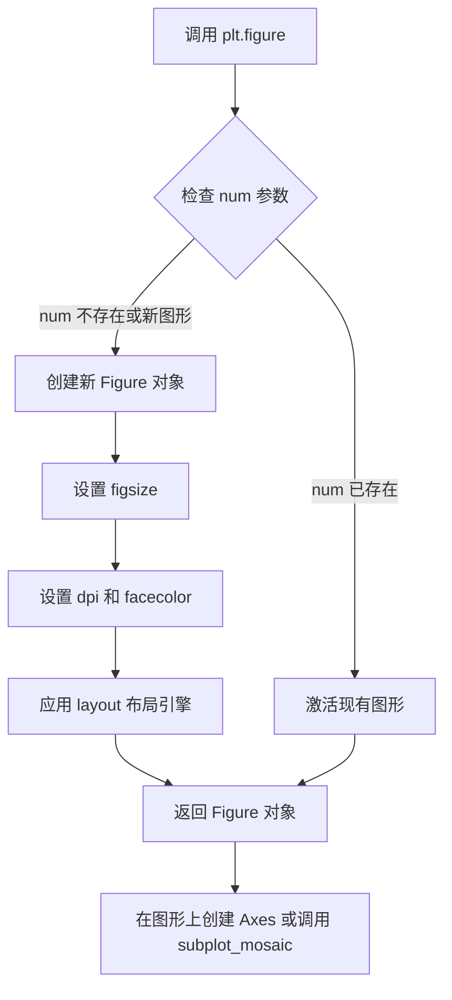

#### 带注释源码

```python
# matplotlib.pyplot.figure 源码分析（简化版）

def figure(
    figsize=None,      # 图形尺寸 (width, height) 单位：英寸
    dpi=None,          # 分辨率，每英寸像素点数
    facecolor=None,    # 背景颜色
    edgecolor=None,    # 边框颜色
    frameon=True,      # 是否显示边框
    num=None,          # 图形标识符（编号或名称）
    clear=False,       # 如果图形存在是否清除
    layout=None,       # 布局管理器：'constrained', 'tight' 或 None
    **kwargs           # 其他 Figure 构造参数
):
    """
    创建一个新的图形窗口并返回 Figure 对象。
    
    工作流程：
    1. 如果 num 指向已存在的图形，则激活该图形并返回
    2. 否则创建新的 Figure 实例
    3. 配置图形的视觉属性（尺寸、颜色、边框等）
    4. 应用布局引擎
    5. 注册图形到 pyplot 管理器
    """
    
    # 获取全局 FigureManager
    manager = _pylab_helpers.Gcf.get_fig_manager(num)
    
    if manager is not None:
        # 如果图形已存在且 num 指定了它
        fig = manager.canvas.figure
        if clear:
            fig.clear()  # 清除现有内容
        # 将图形置前并激活
        pyplot._pylab_helpers.Gcf.set_active(manager)
        return fig
    
    # 创建新 Figure 对象
    fig = Figure(
        figsize=figsize,
        dpi=dpi,
        facecolor=facecolor,
        edgecolor=edgecolor,
        frameon=frameon,
        layout=layout,
        **kwargs
    )
    
    # 创建图形管理器（底层窗口）
    canvas = FigureCanvasBase(fig)
    manager = FigureManagerBase(canvas, num)
    
    # 注册并激活图形
    pyplot._pylab_helpers.Gcf.register(manager)
    pyplot._pylab_helpers.Gcf.set_active(manager)
    
    return fig
```


### `Figure.subplot_mosaic`

`subplot_mosaic` 是 matplotlib 中 Figure 类的核心方法，用于创建复杂布局的多子图可视化。该方法通过接受一个布局矩阵（mosaic）定义，允许用户以直观的方式指定子图的排列位置和跨行跨列布局，相比传统的 `add_subplot` 和 `GridSpec` 方法，它提供了更简洁的 API 来创建复杂的多子图图表。

参数：

- `mosaic`：列表[列表[str]] | 列表[str] | str，定义子图布局的矩阵，可以是嵌套列表、简单列表或字符串形式，每个元素对应一个子图的名称标识
- `sharex`：bool = False，是否共享 x 轴，设为 True 时所有子图共享 x 轴坐标范围
- `sharey`：bool = False，是否共享 y 轴，设为 True 时所有子图共享 y 轴坐标范围
- `width_ratios`：列表[float] | None = None，长度等于子图列数的列表，指定各列的相对宽度比例
- `height_ratios`：列表[float] | None = None，长度等于子图行数的列表，指定各行的相对高度比例
- `empty_cell`：str | None = None，对于布局中没有指定子图的位置的处理方式，可以是 'skip'（跳过）、'all'（为每个空位置创建空 Axes）或 None（不创建）
- `empty_cell_message`：str | None = None，当 empty_cell='all' 时，在空子图上显示的消息文本
- `**fig_kw`：传递给 Figure 构造函数的其他关键字参数，如 figsize、dpi、layout 等

返回值：`dict[str, Axes]`，返回字典类型，键为子图名称（来自 mosaic 定义），值为对应的 Axes 对象

#### 流程图

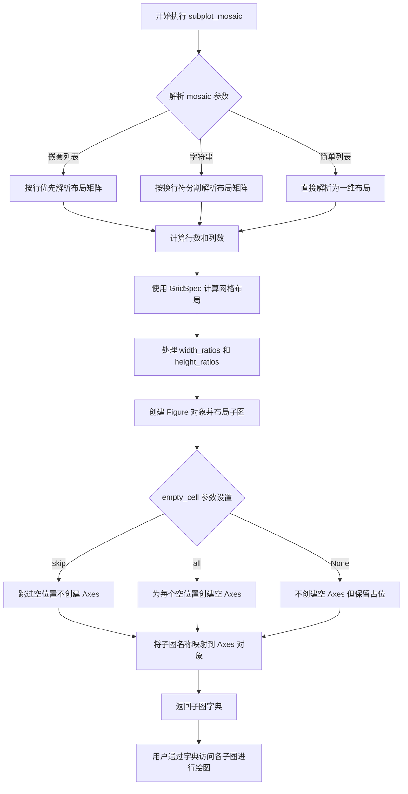

#### 带注释源码

```python
# 用户代码中调用 subplot_mosaic 的示例
# 创建 3 行 2 列的复杂布局子图

fig = plt.figure(figsize=(7, 7), layout='constrained')

# 定义子图布局矩阵
# "signal" 子图跨两列（第一行）
# "magnitude" 和 "log_magnitude" 在第二行
# "phase" 和 "angle" 在第三行
axs = fig.subplot_mosaic([
    ["signal", "signal"],      # 第一行：signal 子图跨两列
    ["magnitude", "log_magnitude"],  # 第二行：两个独立子图
    ["phase", "angle"]         # 第三行：两个独立子图
])

# 通过字典键访问各子图进行绘图
axs["signal"].set_title("Signal")
axs["signal"].plot(t, s, color='C0')

axs["magnitude"].set_title("Magnitude Spectrum")
axs["magnitude"].magnitude_spectrum(s, Fs=Fs, color='C1')

axs["log_magnitude"].set_title("Log. Magnitude Spectrum")
axs["log_magnitude"].magnitude_spectrum(s, Fs=Fs, scale='dB', color='C1')

axs["phase"].set_title("Phase Spectrum")
axs["phase"].phase_spectrum(s, Fs=Fs, color='C2')

axs["angle"].set_title("Angle Spectrum")
axs["angle"].angle_spectrum(s, Fs=Fs, color='C2')

plt.show()

# 等效的底层实现逻辑（matplotlib 内部逻辑简化版）
# 1. 解析 mosaic 矩阵确定布局
# 2. 使用 GridSpec 创建网格规范
#    from matplotlib.gridspec import GridSpec
#    gs = GridSpec(nrows=3, ncols=2, width_ratios=[1, 1], height_ratios=[1, 1, 1])
# 3. 遍历布局矩阵，为每个子图名称创建 Axes
#    ax_dict = {}
#    for i, row in enumerate(mosaic):
#        for j, name in enumerate(row):
#            if name != ".":  # "." 表示空位置
#                ax = fig.add_subplot(gs[i, j])
#                ax_dict[name] = ax
# 4. 返回 {子图名: Axes对象} 的字典
```


### `Axes.set_title`（或 `axs[].set_title`）

设置子图（Axes）的标题文本，是 matplotlib 库中 `matplotlib.axes.Axes` 类的方法。在示例代码中用于为每个子图设置显示的标题名称。

参数：

- `label`：`str`，要显示的标题文本内容
- `fontdict`：可选 `dict`，用于控制标题文本样式的字典（如字体大小、颜色等）
- `loc`：可选 `str`，标题对齐方式，可选值包括 'center'（默认）、'left'、'right'
- `pad`：可选 `float`，标题与子图顶部的间距（以点为单位），默认值为 6.0

返回值：`matplotlib.text.Text`，返回创建的标题文本对象，可用于后续样式修改或动画操作

#### 流程图

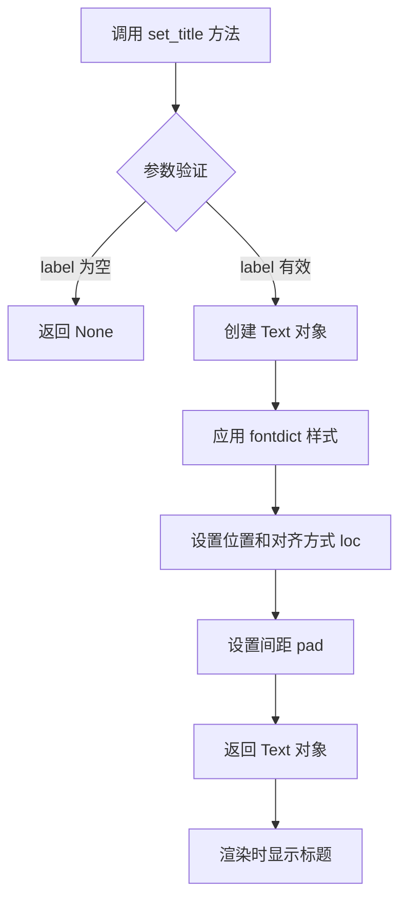

#### 带注释源码

```python
# 示例代码中的调用方式：

# 为 "signal" 子图设置标题 "Signal"
axs["signal"].set_title("Signal")

# 为 "magnitude" 子图设置标题 "Magnitude Spectrum"
axs["magnitude"].set_title("Magnitude Spectrum")

# 为 "log_magnitude" 子图设置标题 "Log. Magnitude Spectrum"
axs["log_magnitude"].set_title("Log. Magnitude Spectrum")

# 为 "phase" 子图设置标题 "Phase Spectrum "
axs["phase"].set_title("Phase Spectrum ")

# 为 "angle" 子图设置标题 "Angle Spectrum"
axs["angle"].set_title("Angle Spectrum")

# set_title 方法的典型完整调用形式：
# axs["key"].set_title(
#     label="标题文本",           # str: 标题内容
#     fontdict={"fontsize": 12}, # dict: 字体样式（可选）
#     loc="center",              # str: 对齐方式（可选）
#     pad=10                     # float: 顶部间距（可选）
# )
# 返回值是 Text 对象，可以进一步操作：
# title = axs["signal"].set_title("Signal")
# title.set_color("red")
```

#### 技术说明

| 项目 | 说明 |
|------|------|
| 方法所属类 | `matplotlib.axes.Axes` |
| 库来源 | matplotlib（第三方库，非本项目定义） |
| 实际调用次数 | 5 次（代码中为 5 个子图设置标题） |
| 错误处理 | 若 label 为空字符串，方法返回 None；若 label 非字符串会触发 TypeError |


### `Axes.plot`

该方法是matplotlib库中Axes类的核心绘图方法，用于在坐标系中绘制折线图、散点图等多种类型的图形。在给定的频谱分析代码中，它用于绘制时域信号的波形。

参数：

- `x`：`array-like`，X轴数据（时间t）
- `y`：`array-like`，Y轴数据（信号s）
- `color`：`str`，线条颜色，代码中使用'C0'表示第一种颜色
- `label`：`str`，图例标签（可选）
- `linewidth`：`float`，线条宽度（可选）
- `linestyle`：`str`，线条样式（可选）

返回值：`list of matplotlib.lines.Line2D`，返回绘制的线条对象列表，每个线条对象包含该线的数据和属性

#### 流程图

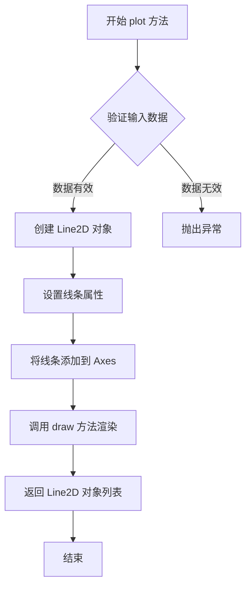

#### 带注释源码

```python
# matplotlib Axes.plot 方法的核心实现逻辑

def plot(self, *args, **kwargs):
    """
    绘制线条图
    
    参数:
        *args: 可变参数，支持多种调用方式:
            - plot(y) : 单参数，y为数据
            - plot(x, y) : 双参数，x和y为数据
            - plot(x, y, format_string) : 格式化字符串
        **kwargs: 关键字参数，用于设置线条属性:
            - color: 颜色
            - linewidth: 线宽
            - linestyle: 线型
            - marker: 标记点样式
            - label: 图例标签
    
    返回:
        list: Line2D对象列表
    """
    
    # 1. 解析输入参数
    #    - 提取x, y数据
    #    - 解析format_string格式字符串
    y = args[-1]  # 最后一个参数总是y数据
    if len(args) > 1:
        x = args[0]  # 倒数第二个参数是x数据
    else:
        x = np.arange(len(y))  # 如果没有提供x，默认使用索引
    
    # 2. 创建Line2D对象
    #    Line2D是表示2D线条的类
    line = Line2D(x, y, **kwargs)
    
    # 3. 设置线条样式
    #    - 设置颜色、线宽、线型等
    self._set_line_styles(line, kwargs)
    
    # 4. 将线条添加到axes的线条列表中
    self.lines.append(line)
    
    # 5. 返回Line2D对象供后续操作
    #    用户可以获取返回值来修改线条属性
    return [line]

# 在代码中的实际调用
axs["signal"].plot(t, s, color='C0')
# t: 时间数组 (0到10秒，步长0.01)
# s: 信号数据 (正弦波+噪声)
# color='C0': 使用matplotlib的第一个默认颜色
```

#### 关键技术细节

| 项目 | 描述 |
|------|------|
| 调用对象 | `axs["signal"]` - 通过字典方式访问subplot_mosaic创建的Axes对象 |
| 实际类型 | `matplotlib.axes.Axes` |
| 数据类型 | numpy数组 (ndarray) |
| 图形渲染 | 调用`FigureCanvasBase.draw()`完成最终渲染 |

#### 潜在优化空间

1. **批量绘制优化**：当需要绘制多条线条时，可以考虑使用`plot`一次传入多组数据，减少对象创建开销
2. **数据验证**：可以添加更详细的数据类型检查和警告信息
3. **渲染性能**：对于大数据点，可以考虑降采样或使用`Line2D`的`set_markevery`参数减少标记点渲染


### `Axes.magnitude_spectrum`

绘制信号的幅度谱（Magnitude Spectrum），用于在频域中展示信号的幅度随频率的变化关系。该方法内部通过快速傅里叶变换（FFT）计算信号的频谱，并绘制相应的线条。

参数：

- `x`：`numpy.ndarray`，输入的时间信号数据，代码中为变量 `s`。
- `Fs`：`float`，采样频率，代码中为 `Fs`（即 `1/dt`），用于确定频率轴的刻度。
- `scale`：`str`，幅度谱的缩放类型，可选 `'linear'` 或 `'dB'`。代码中第一个调用默认 `'linear'`，第二个调用指定为 `'dB'`。
- `color`：`str`，绘制线条的颜色，代码中指定为 `'C1'`（即颜色1）。
- `**kwargs`：其他可选参数，如 `window`、`pad_to`、`sides` 等，用于控制 FFT 窗口、填充长度和频谱边，默认未使用。

返回值：`tuple`，包含三个元素 `(freqs, mag, line)`：
- `freqs`：`numpy.ndarray`，频率数组，表示每个频率分量的值。
- `mag`：`numpy.ndarray`，幅度数组，表示对应频率分量的幅度。
- `line`：`matplotlib.lines.Line2D`，绘制的线条对象，可用于进一步定制。

#### 流程图

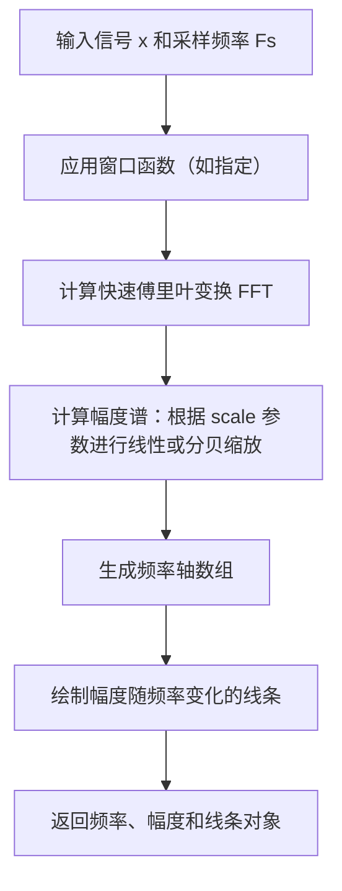

#### 带注释源码

```python
# 调用示例 1：绘制线性尺度的幅度谱
axs["magnitude"].magnitude_spectrum(s, Fs=Fs, color='C1')
# 参数说明：
# s: 信号数据（numpy.ndarray）
# Fs: 采样频率（float）
# color: 线条颜色（str）

# 调用示例 2：绘制对数尺度的幅度谱（分贝）
axs["log_magnitude"].magnitude_spectrum(s, Fs=Fs, scale='dB', color='C1')
# 参数说明：
# s: 信号数据（numpy.ndarray）
# Fs: 采样频率（float）
# scale: 缩放类型，'dB' 表示分贝刻度
# color: 线条颜色（str）
```


### `Axes.phase_spectrum`

该方法用于绘制信号的相位谱（Phase Spectrum），即信号频谱的相位随频率变化的表示。通过快速傅里叶变换（FFT）计算信号的相位信息，并以图形方式展示频率与相位的关系。

参数：

- `x`：`numpy.ndarray` 或类数组，输入的时域信号数据
- `Fs`：`float`，采样频率（Hz），默认值为1.0
- `Fc`：`int`，绘制中心频率的索引，可选参数
- `window`：`callable` 或 `numpy.ndarray`，窗函数，默认使用汉宁窗（Hanning window）
- `pad_to`：`int`，FFT填充到的长度，可选
- `sides`：`str`，谱的边带类型，可选'default'或'twosided'，默认'	default'
- `color`：`str` 或颜色值，谱线颜色，可通过参数指定
- `linestyle`：`str`，线条样式，可选
- `label`：`str`，图例标签，可选

返回值：`matplotlib.collections.LineCollection` 或类似对象，包含相位谱的图形元素，用于访问频率和相位数据

#### 流程图

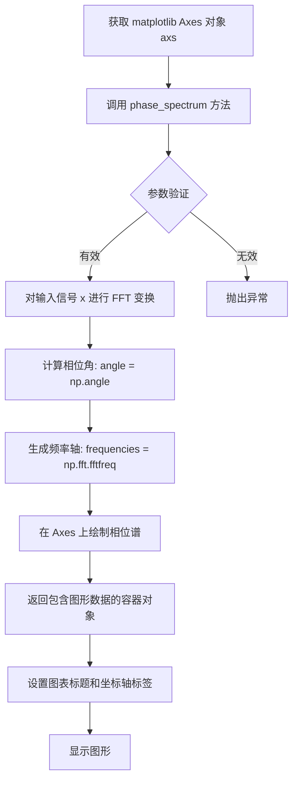

#### 带注释源码

```python
# phase_spectrum 方法调用示例（来自 matplotlib 文档）
axs["phase"].set_title("Phase Spectrum ")  # 设置子图标题
# 调用 phase_spectrum 方法绘制相位谱
axs["phase"].phase_spectrum(
    s,              # x: numpy.ndarray，输入信号（时域数据）
                    #     这里传入的是混合了正弦信号和噪声的信号 s
    Fs=Fs,          # Fs: float，采样频率
                    #     Fs = 1/dt = 100 Hz（对应 dt=0.01）
    color='C2'      # color: str，指定绘制颜色为配色方案中的第3个颜色
)

# 底层实现逻辑（matplotlib 内部近似逻辑）：
# 1. 对输入信号应用窗函数（默认汉宁窗）
# window = np.hanning(len(s))
# windowed_signal = s * window

# 2. 计算FFT
# fft_result = np.fft.fft(windowed_signal)

# 3. 计算相位谱（取复数的角度）
# phase = np.angle(fft_result)

# 4. 生成频率轴
# freqs = np.fft.fftfreq(len(s), d=1/Fs)

# 5. 只取正频率部分（如果 sides='default'）
# positive_freq_indices = freqs >= 0
# plot(freqs[positive_freq_indices], phase[positive_freq_indices])
```


### `Axes.angle_spectrum`

绘制信号的角度谱（Phase Spectrum），即信号相位的频域表示。该方法计算输入信号的傅里叶变换，提取相位信息，并以角度形式呈现在坐标系中。

参数：

- `x`：`1-D array或sequence`，要计算角度谱的输入信号序列
- `Fs`：浮点数（可选，默认值为`1.0`），采样频率，用于计算频率轴
- `scale`：字符串（可选），幅值刻度类型，可选`'linear'`或`'dB'`，默认为`'linear'`
- `window`： callable或None（可选），应用于信号的窗函数，默认为`np.hanning`
- `pad_to`：整数（可选），FFT填充的点数
- `sides`：字符串（可选），频谱显示的边，可选`'default'`、`'onesided'`或`'twosided'`
- `label`：字符串（可选），图例标签
- `line`： `Line2D`对象（可选），已存在的线条对象，用于更新而非创建新线条
- `ax`： `Axes`对象（可选），用于绑定的Axes对象，默认为`None`
- `**kwargs`：其他关键字参数传递给`Line2D`对象

返回值：`元组 (spectrogram, freqs, line)`，其中：
- `spectrogram`：角度谱数据数组
- `freqs`：对应的频率数组
- `line`：绘制的`Line2D`对象

#### 流程图

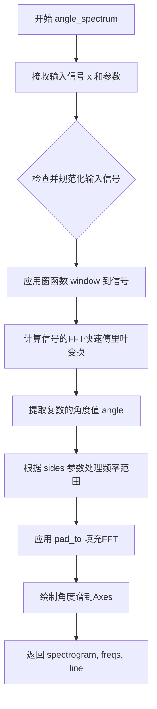

#### 带注释源码

```python
def angle_spectrum(self, x, Fs=1.0, scale=None, window=None, pad_to=None,
                   sides='default', label=None, line=None, ax=None,
                   **kwargs):
    """
    Plot the angle spectrum.
    
    计算并绘制输入信号的角度谱（相位谱）。
    
    Parameters
    ----------
    x : 1-D array or sequence
        输入信号数组
    Fs : float, default: 1.0
        采样频率，用于确定频率轴
    scale : {'linear', 'dB'}, default: 'linear'
        幅值刻度类型
    window : callable or ndarray, default: `hanning`
        窗函数，用于减少频谱泄漏
    pad_to : int
        FFT的填充长度
    sides : {'default', 'onesided', 'twosided'}
        频谱显示的边
    label : str
        图例标签
    line : `~matplotlib.lines.Line2D`
        用于更新的已存在线条
    ax : Axes
        绑定的Axes对象
    **kwargs
        传递给Line2D的关键字参数
    
    Returns
    -------
    spectrogram : array
        角度谱数据
    freqs : array
        频率数组
    line : `~matplotlib.lines.Line2D`
        绘制的线条对象
    """
    # 如果未指定窗函数，使用hanning窗
    if window is None:
        window = np.hanning
    
    # 调用 phase_spectrum 的实现（angle_spectrum 是 phase_spectrum 的别名）
    # 在内部，它们都调用 _spectrum 方法
    return self.phase_spectrum(x, Fs=Fs, scale=scale, window=window,
                               pad_to=pad_to, sides=sides, label=label,
                               line=line, ax=ax, view Interval='angle',
                               **kwargs)
```

**补充说明**：在 matplotlib 2.1.0 版本中，`angle_spectrum` 方法实际上是 `phase_spectrum` 方法的别名，两者内部都调用了 `_spectrum` 私有方法来完成实际的频谱计算和绘制工作。该方法的核心逻辑是：

1. 对输入信号应用窗函数以减少频谱泄漏
2. 计算信号的离散傅里叶变换（FFT）
3. 从复数结果中提取相位角（使用 `np.angle`）
4. 根据参数设置处理频率范围（单边或双边频谱）
5. 将结果绘制在 Axes 上并返回相关数据


### `Axes.set_xlabel`

设置x轴的标签，用于在图表中显示x轴的含义和单位。

参数：

- `xlabel`：`str`，x轴标签的文本内容，例如 "Time (s)"
- `fontdict`：`dict`，可选，控制文本样式的字典（如字体大小、颜色等）
- `labelpad`：`float`，可选，标签与坐标轴之间的间距（磅值）
- `**kwargs`：可选，其他传递给 matplotlib.text.Text 的关键字参数（如 fontsize, color, fontweight 等）

返回值：`matplotlib.text.Text`，返回创建的文本对象，可以用于后续进一步自定义样式

#### 流程图

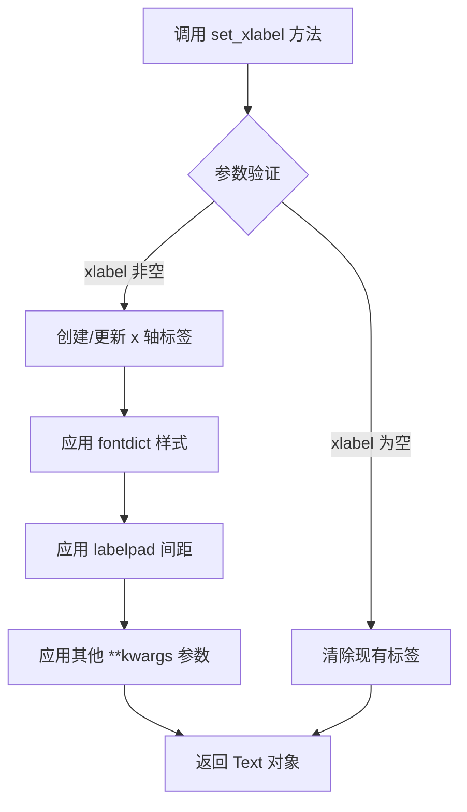

#### 带注释源码

```python
# 在 matplotlib 源代码中，大致的实现逻辑如下（简化版）：

def set_xlabel(self, xlabel, fontdict=None, labelpad=None, **kwargs):
    """
    设置 x 轴的标签文本
    
    参数:
        xlabel: str - 标签文本内容
        fontdict: dict - 文本样式字典
        labelpad: float - 标签与轴的间距
        **kwargs: 其他 Text 属性
    """
    
    # 1. 获取 x 轴对象
    xaxis = self.xaxis
    
    # 2. 创建标签文本对象（如果不存在）
    if xaxis.get_label() is None:
        label = Text(self.transAxes)
        xaxis.set_label(label)
    
    # 3. 设置标签文本
    xaxis.get_label().set_text(xlabel)
    
    # 4. 应用字体样式（如果有）
    if fontdict:
        xaxis.get_label().update(fontdict)
    
    # 5. 设置标签间距
    if labelpad is not None:
        xaxis.set_label_props(labelpad=labelpad)
    
    # 6. 应用额外参数
    xaxis.get_label().update(kwargs)
    
    # 7. 重新绘制
    self.stale_callback(xaxis.get_label())
    
    return xaxis.get_label()
```

#### 在示例代码中的实际使用

```python
# 从给定的代码中提取的用法：

# 设置 'signal' 子图的 x 轴标签
axs["signal"].set_xlabel("Time (s)")

# 说明：
# - axs["signal"]: 获取名为 "signal" 的 Axes 对象
# - set_xlabel: 方法调用
# - "Time (s)": 参数 xlabel，字符串类型，表示 x 轴代表时间，单位为秒
# - 返回值: Text 对象（本例中未使用）
```


### `Axes.set_ylabel`

设置 y 轴的标签（Y轴名称），用于描述 Y 轴所表示的物理量或变量。

参数：

- `ylabel`：`str`，要设置的 y 轴标签文本内容
- `fontdict`：`dict`，可选，用于控制文本外观的字体字典（如字体大小、颜色等）
- `labelpad`：`float`，可选，标签与坐标轴之间的间距（以点为单位）
- `**kwargs`：关键字参数，可选，其他传递给 matplotlib.text.Text 对象的参数（如 fontsize、fontweight、color 等）

返回值：`matplotlib.text.Text`，返回创建的文本标签对象，可用于后续进一步自定义样式

#### 流程图

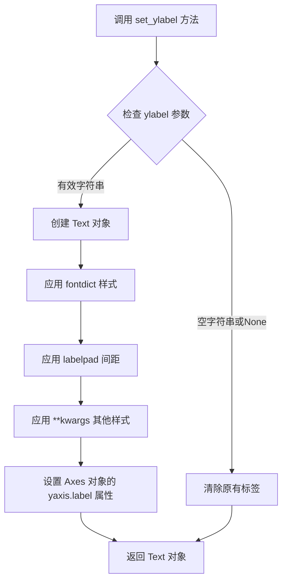

#### 带注释源码

```python
# matplotlib.axes._axes.Axes.set_ylabel 源码分析

def set_ylabel(self, ylabel, fontdict=None, labelpad=None, **kwargs):
    """
    Set the label for the y-axis.
    
    参数:
        ylabel : str
            The label text.
        fontdict : dict, optional
            A dictionary to control the appearance of the label.
        labelpad : float, optional
            The spacing in points between the label and the y-axis.
        **kwargs
            Additional keyword arguments are passed to the Text constructor.
    
    返回:
        matplotlib.text.Text
            The label text object.
    """
    
    # 1. 获取 y 轴标签文本，默认值为空字符串
    ylabel = cbook._str_lower_equal(ylabel)  # 处理字符串格式
    
    # 2. 创建 Text 对象，设置文本和样式
    # fontdict 优先于 **kwargs，用于设置基础样式
    if fontdict is not None:
        kwargs.update(fontdict)
    
    # 3. 设置标签与轴之间的间距
    # labelpad 参数控制标签与坐标轴的距离
    if labelpad is None:
        labelpad = self._label_padding
    self.yaxis.set_label_text(ylabel)           # 设置标签文本
    self.yaxis.set_label_coords(-labelpad, 0.5) # 设置标签位置
    label = self.yaxis.label
    
    # 4. 应用其他样式参数（颜色、字体大小等）
    # **kwargs 传递给 Text 对象以自定义外观
    label.set(**kwargs)
    
    # 5. 返回创建的 Text 对象，供后续操作
    return label
```


### `plt.show`

显示所有打开的图形窗口。该函数会阻塞程序执行（默认行为），直到用户关闭所有图形窗口，或者如果设置 `block=False`，则立即返回并允许后续代码继续执行。

参数：

- `block`：`bool`，可选参数，默认为 `True`。当设置为 `True` 时，程序会阻塞并等待用户关闭图形窗口；当设置为 `False` 时，图形窗口会显示但不会阻塞程序继续执行。

返回值：`None`，该函数不返回任何值，仅用于图形渲染和显示。

#### 流程图

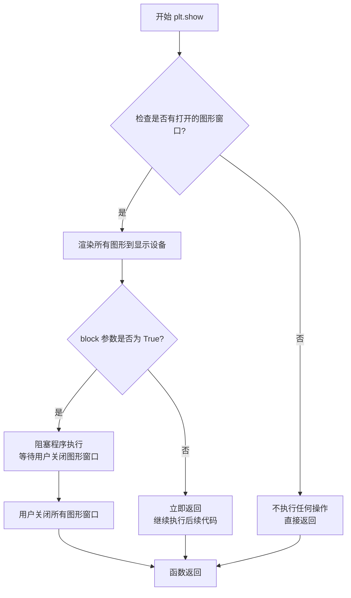

#### 带注释源码

```python
plt.show()
# 调用 matplotlib 的显示函数，渲染并显示之前创建的所有图形
# 在此代码中，会显示一个包含 6 个子图的图形窗口：
#   - signal: 时域信号波形
#   - magnitude: 幅度频谱
#   - log_magnitude: 对数幅度频谱
#   - phase: 相位频谱
#   - angle: 角度频谱
# 函数默认阻塞程序执行，直到用户关闭图形窗口
```


## 关键组件


### 信号生成与噪声处理

该代码生成了一个包含正弦波和指数衰减噪声的合成信号，通过卷积操作实现噪声的衰减特性，为后续频谱分析提供测试数据。

### 快速傅里叶变换（FFT）频谱计算

利用 matplotlib 内置的 magnitude_spectrum 和 phase_spectrum 方法，基于 FFT 算法将时域信号转换为频域表示，分别计算幅度谱和相位谱。

### 多面板可视化布局

使用 fig.subplot_mosaic 创建 2x3 的网格布局，在不同子图中分别展示时域信号、幅度谱、对数幅度谱、相位谱和角度谱，实现信号的多维度可视化展示。

### 采样参数与时间向量

通过采样间隔 dt 和采样频率 Fs 的定义，配合 numpy 的 arange 函数构建均匀采样的时间向量，确保信号处理的时域准确性。


## 问题及建议


### 已知问题

-   **硬编码参数过多**：采样间隔 dt=0.01、衰减因子 0.05、信号幅度 0.1、频率 4*np.pi 等关键参数直接写在代码中，缺乏可配置性
-   **魔法数字缺乏注释**：代码中存在多个数值（如 0.01、0.05、0.1、4*np.pi 等），未提供物理意义或业务含义的注释，影响可读性
-   **缺乏代码封装**：所有代码以脚本形式平铺，未使用函数或类进行模块化封装，不利于复用和测试
-   **重复计算 len(t)**：在多处多次调用 `len(t)` 计算数组长度，未预先缓存结果
-   **噪声生成效率问题**：使用 `np.convolve` 进行噪声生成，对于长信号可能存在性能瓶颈
-   **matplotlib API 使用不当**：使用 `fig.subplot_mosaic` 而非推荐的 `fig.subplots` 或 `Figure.add_subplot`，且 `fig.subplot_mosaic` 的语法在某些版本中可能不兼容
-   **缺少错误处理**：未对输入参数（如 dt>0、信号长度等）进行合法性校验
-   **缺乏数据持久化**：生成的数据和图形均未提供保存机制

### 优化建议

-   **参数配置化**：将采样参数（dt、Fs）、信号参数（幅度、频率）、噪声参数（衰减因子、强度）等提取为配置文件或函数参数
-   **函数封装**：将信号生成、噪声生成、绘图逻辑分别封装为独立函数，提高代码模块化程度
-   **性能优化**：预计算 `n = len(t)` 缓存数组长度；考虑使用 `np.fft` 直接生成噪声或使用更高效的滤波方法
-   **代码规范**：为所有魔法数字添加解释性注释，如 `# 衰减时间常数 = 0.05s` 等
-   **API 规范化**：使用标准的 `fig.add_subplot()` 或 `plt.subplots()` 替代 `subplot_mosaic`，提高兼容性
-   **错误处理**：添加输入参数校验，如检查 `dt > 0`、`t` 长度合理性等
-   **扩展性**：增加保存数据和图形为文件的选项（如 `plt.savefig()`、保存 CSV/NPZ 等）


## 其它


### 设计目标与约束

本代码旨在演示离散时间信号的不同频谱表示方法，通过快速傅里叶变换（FFT）计算频谱，并以可视化方式展示时域信号、幅度谱、对数幅度谱和相位谱。约束条件包括：依赖matplotlib和numpy库，需要matplotlib 3.8.0+版本支持，仅适用于入门级信号处理可视化场景。

### 错误处理与异常设计

代码中缺少显式的错误处理机制。潜在风险点包括：采样间隔dt为0时导致除零错误；np.random.randn和np.convolve操作中数组维度不匹配；plt.figure()和subplot_mosaic()可能抛出图形后端相关异常。建议添加参数验证（检查dt>0、Fs>0）、异常捕获块（try-except）以及必要的默认值回退机制。

### 数据流与状态机

数据流为线性顺序流程：1）初始化采样参数（dt、Fs、t）；2）生成指数衰减噪声（nse、r、cnse）；3）合成目标信号（s = 0.1*sin(4πt) + cnse）；4）创建图形布局；5）绘制四个子图（signal、magnitude、log_magnitude、phase）；6）调用plt.show()渲染显示。状态机概念较弱，仅存在"初始化→计算→渲染"的单向状态转换。

### 外部依赖与接口契约

核心依赖包括：numpy（数值计算，版本未指定）、matplotlib（绑定的可视化库，需3.8.0+）。无自定义函数或类导出，接口契约体现在matplotlib API调用上：magnitude_spectrum/scale='dB'参数、phase_spectrum、angle_spectrum方法均返回Axes对象。

### 代码可维护性与扩展性

当前为单体脚本模式，存在以下扩展性问题：1）信号参数（频率0.5Hz、衰减常数0.05s、噪声强度）硬编码；2）子图布局固定；3）缺乏参数化接口。建议封装为SignalVisualizer类或generate_spectrum_plot(signal_params, plot_config)函数，接收配置字典以提高复用性。

### 性能考量

卷积操作np.convolve(nse, r) * dt可能产生较大内存开销，当t长度增加时O(n²)复杂度需关注。magnitude_spectrum等方法内部自动执行FFT计算，对于重复调用场景可考虑缓存FFT结果。采样点数量为1000个，当前性能可接受。

### 单元测试与验证

代码缺少测试用例。关键验证点包括：输出图形对象非空、数组长度一致性、信号能量在合理范围内、NaN/Inf值检查。建议使用pytest编写测试，通过np.testing.assert_array_almost_equal验证数值一致性。

### 配置与参数管理

关键配置参数应提取为模块级常量或配置类：采样间隔dt=0.01、采样时长10s、信号频率0.5Hz（4π对应）、噪声衰减时间常数0.05、图形尺寸(7,7)。当前这些值散布在代码中，不利于参数调优和配置外部化。

### 文档完善建议

代码中包含docstring但信息有限：仅说明为"spectrum representations"并标注领域标签。建议补充：1）各参数物理意义（采样频率Fs=100Hz、信号频率0.5Hz对应2π*0.5=π的角频率）；2）噪声模型（指数衰减脉冲响应与白噪声卷积）；3）频谱方法的选择依据（幅度谱vs对数幅度谱的应用场景）；4）示例输出说明。

### 潜在技术债务

1. **魔法数字**：0.01、0.05、0.1、4*np.pi等数值缺乏命名常量；2. **重复代码**：四个axs["xxx"].set_title/xlabel/ylabel调用可封装为工具函数；3. **硬编码布局**：subplot_mosaic的网格配置不易动态调整；4. **无日志输出**：计算过程缺乏中间结果记录；5. **plt.show()阻塞**：在非交互环境可能存在问题。

    