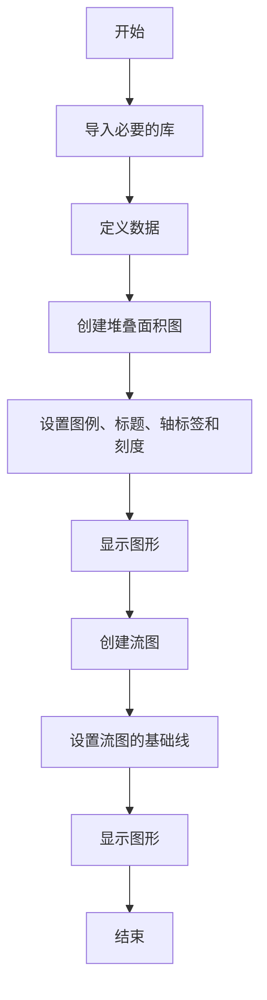
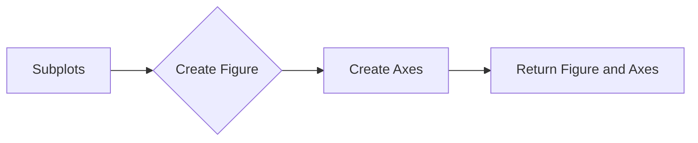
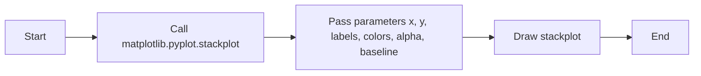
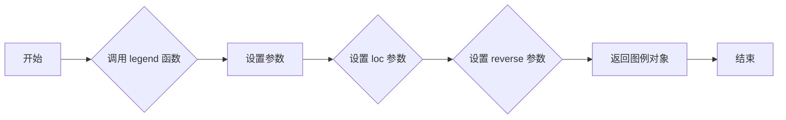
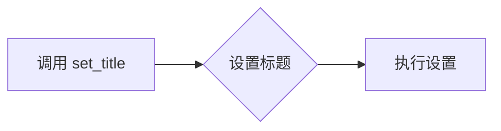
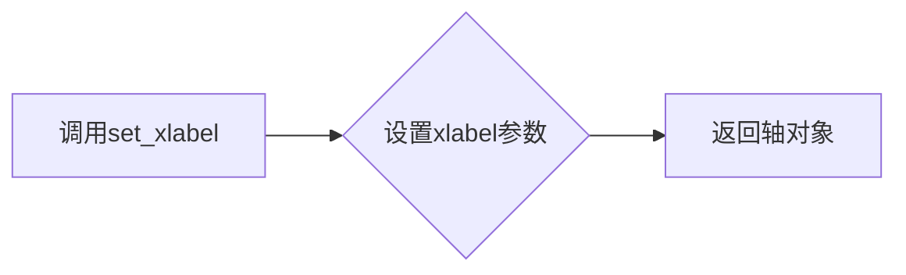
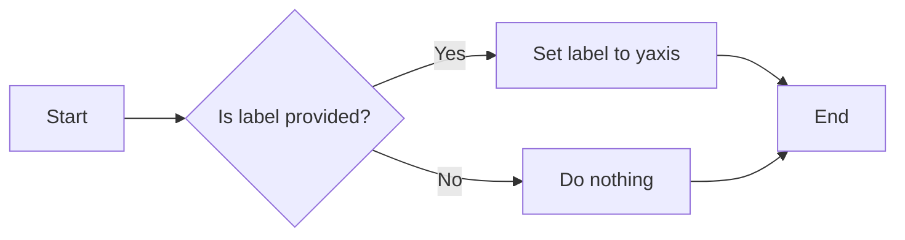
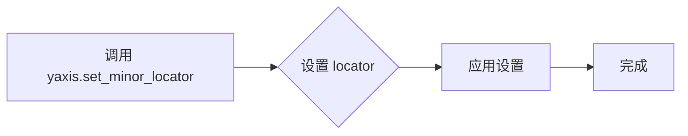
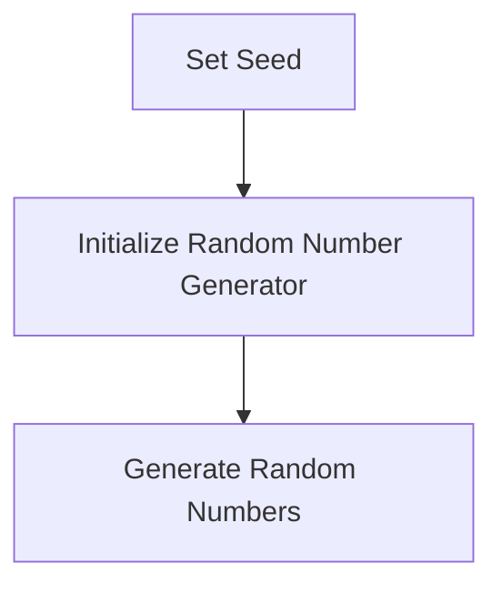

# `matplotlib\galleries\examples\lines_bars_and_markers\stackplot_demo.py` 详细设计文档

This code generates stackplots and streamgraphs to visualize population data over time by continent.

## 整体流程



## 类结构

```
matplotlib.pyplot (matplotlib 库)
├── np (numpy 库)
│   ├── gaussian_mixture
│   └── linspace
└── stackplots_and_streamgraphs (主模块)
```

## 全局变量及字段


### `year`
    
List of years for which population data is provided.

类型：`list of int`
    


### `population_by_continent`
    
Dictionary containing population data by continent.

类型：`dict`
    


### `fig`
    
Figure object created by matplotlib for plotting.

类型：`matplotlib.figure.Figure`
    


### `ax`
    
Axes object on which the plot is drawn.

类型：`matplotlib.axes._subplots.AxesSubplot`
    


### `x`
    
Array of x values for the plot.

类型：`numpy.ndarray`
    


### `ys`
    
List of arrays containing y values for the plot, one for each dataset.

类型：`list of numpy.ndarray`
    


### `matplotlib.pyplot.matplotlib.pyplot`
    
Module for plotting with matplotlib.

类型：`module`
    


### `matplotlib.figure.Figure.matplotlib.pyplot.fig`
    
Figure object created by matplotlib for plotting.

类型：`Figure`
    


### `matplotlib.axes._subplots.AxesSubplot.matplotlib.pyplot.ax`
    
Axes object on which the plot is drawn.

类型：`AxesSubplot`
    
    

## 全局函数及方法


### gaussian_mixture

Return a random mixture of *n* Gaussians, evaluated at positions *x*.

参数：

- `x`：`numpy.ndarray`，The positions at which to evaluate the Gaussian mixture.
- `n`：`int`，The number of Gaussians to mix. Default is 5.

返回值：`numpy.ndarray`，The evaluated Gaussian mixture at the positions *x*.

#### 流程图

```mermaid
graph TD
    A[Start] --> B[Initialize a with zeros]
    B --> C[For each j in range(n)]
    C --> D[Add random Gaussian to a]
    D --> E[Return a]
```

#### 带注释源码

```python
def gaussian_mixture(x, n=5):
    """Return a random mixture of *n* Gaussians, evaluated at positions *x*."""
    def add_random_gaussian(a):
        amplitude = 1 / (.1 + np.random.random())
        dx = x[-1] - x[0]
        x0 = (2 * np.random.random() - .5) * dx
        z = 10 / (.1 + np.random.random()) / dx
        a += amplitude * np.exp(-(z * (x - x0))**2)
    a = np.zeros_like(x)
    for j in range(n):
        add_random_gaussian(a)
    return a
```


### plt.subplots()

创建一个matplotlib图形和一个轴。

描述：

`subplots` 函数用于创建一个图形和一个或多个轴。它返回一个图形和一个轴对象，可以用来绘制图形。

参数：

- `figsize`：`tuple`，可选，图形的大小（宽度和高度）。
- `dpi`：`int`，可选，图形的分辨率（每英寸点数）。
- `facecolor`：`color`，可选，图形的背景颜色。
- `edgecolor`：`color`，可选，图形的边缘颜色。
- `frameon`：`bool`，可选，是否显示图形的边框。
- `num`：`int`，可选，要创建的轴的数量。
- `gridspec_kw`：`dict`，可选，用于定义网格规格的字典。
- `constrained_layout`：`bool`，可选，是否启用约束布局。

返回值：

- `fig`：`Figure`，matplotlib图形对象。
- `axes`：`Axes`，轴对象列表。

#### 流程图



#### 带注释源码

```python
fig, ax = plt.subplots()
```


### matplotlib.pyplot.stackplot

matplotlib.pyplot.stackplot 是一个用于绘制堆叠面积图的函数，它将多个数据集作为垂直堆叠的面积绘制出来。

参数：

- `x`：`array_like`，x轴的数据点。
- `y`：`sequence`，每个数据集的y值列表或数组。
- `labels`：`sequence`，每个数据集的标签。
- `colors`：`sequence`，每个数据集的颜色。
- `alpha`：`float`，透明度。
- `baseline`：`str`，堆叠的基础线，默认为'0'。

返回值：`AxesSubplot`，包含绘制的图形的子图。

#### 流程图



#### 带注释源码

```python
import matplotlib.pyplot as plt
import numpy as np

fig, ax = plt.subplots()
ax.stackplot(year, population_by_continent.values(),
             labels=population_by_continent.keys(), alpha=0.8)
# ...
```


### matplotlib.pyplot.legend

matplotlib.pyplot.legend 是一个用于在图表中添加图例的全局函数。

参数：

- `loc`：`str`，指定图例的位置。默认为 'best'，自动选择最佳位置。
- `reverse`：`bool`，如果为 True，则反转图例中标签的顺序。

返回值：`matplotlib.legend.Legend`，返回创建的图例对象。

#### 流程图



#### 带注释源码

```python
ax.legend(loc='upper left', reverse=True)
```

在这段代码中，`ax.legend(loc='upper left', reverse=True)` 调用 `legend` 函数，将图例放置在图表的左上角，并且反转图例中标签的顺序。


### matplotlib.pyplot.set_title

设置当前轴的标题。

#### 描述

`set_title` 方法用于设置当前轴（Axes）的标题。标题可以包含文本和可选的字体样式、大小等属性。

#### 参数：

- `title`：`str`，要设置的标题文本。
- `loc`：`str`，标题的位置，可以是 'left', 'right', 'center', 'upper left', 'upper right', 'upper center', 'lower left', 'lower right', 'lower center' 或 'center left', 'center right', 'center top', 'center bottom'。
- `pad`：`float`，标题与轴边缘的距离。
- `fontsize`：`float`，标题的字体大小。
- `fontweight`：`str`，标题的字体粗细，可以是 'normal' 或 'bold'。
- `color`：`str`，标题的颜色。
- `verticalalignment`：`str`，垂直对齐方式，可以是 'bottom', 'middle', 'top'。
- `horizontalalignment`：`str`，水平对齐方式，可以是 'left', 'center', 'right'。

#### 返回值：

无返回值。

#### 流程图



#### 带注释源码

```python
ax.set_title('World population')
```

在这个例子中，`set_title` 方法被用来设置当前轴的标题为 "World population"。没有使用任何额外的参数，因此标题将默认居中显示在轴的上方。


### matplotlib.pyplot.set_xlabel

设置x轴标签。

#### 描述

`set_xlabel` 方法用于设置matplotlib图形中x轴的标签文本。

#### 参数：

- `xlabel`：`str`，x轴标签的文本。

#### 返回值：

- `matplotlib.pyplot.Axes`：调用该方法的轴对象。

#### 流程图



#### 带注释源码

```python
# 设置x轴标签
ax.set_xlabel('Year')
```


### matplotlib.pyplot.set_ylabel

设置y轴标签。

参数：

- `label`：`str`，要设置的y轴标签文本。

返回值：`None`。

#### 流程图



#### 带注释源码

```python
# 假设以下代码块是matplotlib.pyplot模块的一部分

def set_ylabel(self, label):
    """
    Set the y-axis label.

    Parameters
    ----------
    label : str
        The label to set for the y-axis.

    Returns
    -------
    None
    """
    self._yaxis.label.set_text(label)
```


### matplotlib.pyplot.yaxis.set_minor_locator

设置轴的次要刻度定位器。

#### 描述

`yaxis.set_minor_locator` 方法用于设置轴的次要刻度定位器。次要刻度是主刻度之间的额外刻度，它们通常用于提供更精细的数值表示。

#### 参数

- `locator`：`matplotlib.ticker.Locator` 对象，指定次要刻度的位置。

#### 返回值

无返回值。

#### 流程图



#### 带注释源码

```python
# 设置轴的次要刻度定位器
ax.yaxis.set_minor_locator(mticker.MultipleLocator(.2))
```

在这段代码中，`mticker.MultipleLocator(.2)` 创建了一个定位器，它将次要刻度设置为每个主要刻度之间的 0.2 个单位。然后，这个定位器被传递给 `yaxis.set_minor_locator` 方法，以应用于当前的轴对象 `ax`。


### plt.show()

显示matplotlib图形。

参数：

- 无

返回值：无

#### 流程图

```mermaid
graph LR
A[开始] --> B{调用plt.show()}
B --> C[结束]
```

#### 带注释源码

```python
plt.show()
```


### np.random.seed

设置NumPy随机数生成器的种子，以确保结果的可重复性。

参数：

- `seed`：`int`，用于初始化随机数生成器的种子值。

返回值：无

#### 流程图



#### 带注释源码

```python
# Fixing random state for reproducibility
np.random.seed(19680801)
```


### np.linspace

生成线性空间。

参数：

- `start`：`float`，线性空间的起始值。
- `stop`：`float`，线性空间的结束值。
- `num`：`int`，可选，线性空间中的点的数量，默认为50。

返回值：`numpy.ndarray`，线性空间中的点。

#### 流程图


#### 带注释源码

```python
import numpy as np

def linspace(start, stop, num=50):
    """
    Generate linearly spaced samples, calculated over the interval
    [start, stop].

    Parameters
    ----------
    start : float
        The starting value of the interval.
    stop : float
        The ending value of the interval.
    num : int, optional
        The number of samples to generate. Default is 50.

    Returns
    -------
    numpy.ndarray
        The linearly spaced samples.
    """
    return np.linspace(start, stop, num)
```


### np.gaussian_mixture

返回一个随机混合的 *n* 个高斯函数，在位置 *x* 上评估。

参数：

- `x`：`numpy.ndarray`，输入数据的位置数组。
- `n`：`int`，要生成的混合高斯函数的数量，默认为5。

返回值：`numpy.ndarray`，在位置 *x* 上评估的随机混合高斯函数的值。

#### 流程图

```mermaid
graph TD
    A[Start] --> B[Initialize a with zeros]
    B --> C[For each j in range(n)]
    C --> D[Add random gaussian to a]
    D --> E[End of loop]
    E --> F[Return a]
```

#### 带注释源码

```python
def gaussian_mixture(x, n=5):
    """Return a random mixture of *n* Gaussians, evaluated at positions *x*."""
    def add_random_gaussian(a):
        amplitude = 1 / (.1 + np.random.random())
        dx = x[-1] - x[0]
        x0 = (2 * np.random.random() - .5) * dx
        z = 10 / (.1 + np.random.random()) / dx
        a += amplitude * np.exp(-(z * (x - x0))**2)
    a = np.zeros_like(x)
    for j in range(n):
        add_random_gaussian(a)
    return a
```


## 关键组件


### 张量索引与惰性加载

张量索引与惰性加载是用于处理大型数据集时的高效数据访问策略，它允许在需要时才计算或加载数据，从而减少内存消耗和提高性能。

### 反量化支持

反量化支持是指系统对量化操作的反向操作的能力，即能够从量化后的数据中恢复原始数据，这对于确保量化过程的准确性至关重要。

### 量化策略

量化策略是指将浮点数数据转换为固定点数表示的方法，这通常用于减少模型大小和加速计算，但可能会牺牲精度。


## 问题及建议


### 已知问题

-   {问题1}：代码中使用了硬编码的数据，例如年份和人口数据。这可能导致代码的可维护性降低，因为任何数据变更都需要手动修改代码。
-   {问题2}：代码中使用了`np.random.seed`来设置随机种子，这可能导致每次运行代码时生成的图形略有不同。如果需要可重复的结果，应该避免使用随机种子。
-   {问题3}：代码中没有提供任何错误处理机制，如果输入数据不符合预期，可能会导致程序崩溃或产生不正确的输出。

### 优化建议

-   {建议1}：将数据存储在配置文件或数据库中，以便于管理和更新，同时提高代码的可维护性。
-   {建议2}：如果需要可重复的结果，可以移除`np.random.seed`或将其设置为固定的值。
-   {建议3}：添加异常处理机制，确保在输入数据不符合预期时，程序能够优雅地处理错误，并提供有用的错误信息。
-   {建议4}：考虑将代码封装成函数或类，以便于重用和测试。
-   {建议5}：添加文档字符串，说明每个函数和类的用途、参数和返回值，以提高代码的可读性和可维护性。
-   {建议6}：如果代码被用于生产环境，考虑添加日志记录功能，以便于跟踪程序的运行情况和潜在的问题。


## 其它


### 设计目标与约束

- 设计目标：
  - 提供一种直观的方式来展示多个数据集的累积值。
  - 支持多种数据集的叠加展示。
  - 确保图表的可读性和美观性。

- 约束条件：
  - 使用matplotlib库进行绘图。
  - 数据来源为联合国世界人口展望数据。
  - 图表应适应不同屏幕尺寸。

### 错误处理与异常设计

- 错误处理：
  - 检查输入数据的类型和格式。
  - 处理matplotlib绘图过程中可能出现的异常。

- 异常设计：
  - 提供清晰的错误信息。
  - 在异常情况下提供备选方案或默认值。

### 数据流与状态机

- 数据流：
  - 数据从联合国世界人口展望数据源获取。
  - 数据经过处理和转换后用于绘图。

- 状态机：
  - 无状态机设计，程序流程为顺序执行。

### 外部依赖与接口契约

- 外部依赖：
  - matplotlib库。
  - numpy库。

- 接口契约：
  - matplotlib库的绘图接口。
  - numpy库的数据处理接口。


    