# `matplotlib\galleries\examples\lines_bars_and_markers\stairs_demo.py` 详细设计文档

这是一个matplotlib库的使用示例代码，演示了如何使用plt.stairs()函数和StepPatch类来绘制阶梯图（stepwise constant functions），包括简单直方图、填充直方图、水平方向直方图以及堆叠直方图，同时对比了step()和stairs()函数的差异。

## 整体流程

```mermaid
graph TD
    A[开始] --> B[导入库: matplotlib.pyplot, numpy, matplotlib.patches.StepPatch]
B --> C[设置随机种子并生成直方图数据]
C --> D[创建3x1子图布局]
D --> E[子图1: 绘制三种阶梯直方图]
E --> F[子图2: 绘制填充直方图和水平方向直方图]
F --> G[子图3: 使用StepPatch绘制阶梯图]
G --> H[为所有子图添加图例]
H --> I[展示第一个图形]
I --> J[绘制堆叠直方图示例]
J --> K[对比step()和stairs()函数]
K --> L[添加图例并展示第二个图形]
L --> M[结束]
```

## 类结构

```
Python脚本 (非面向对象)
└── 主要使用matplotlib.pyplot函数和matplotlib.patches.StepPatch类
```

## 全局变量及字段


### `np`
    
NumPy模块别名，用于数值计算和数组操作

类型：`module`
    


### `plt`
    
Matplotlib的pyplot模块别名，用于绘图和数据可视化

类型：`module`
    


### `StepPatch`
    
Matplotlib的步进Patch类，用于绘制步进常数函数的补丁对象

类型：`class`
    


### `h`
    
直方图的频数数据，由np.histogram生成

类型：`numpy.ndarray`
    


### `edges`
    
直方图的边界数据，表示bin的边缘位置

类型：`numpy.ndarray`
    


### `fig`
    
Matplotlib的Figure对象，表示整个图形窗口

类型：`matplotlib.figure.Figure`
    


### `axs`
    
子图数组，由plt.subplots创建的Axes对象数组

类型：`numpy.ndarray`
    


### `ax`
    
循环迭代中的子图对象，用于对每个子图进行操作

类型：`matplotlib.axes.Axes`
    


### `A`
    
用于堆叠直方图的二维数组，每行代表一层直方图数据

类型：`list`
    


### `i`
    
循环索引，用于遍历堆叠直方图数组A

类型：`int`
    


### `bins`
    
用于比较step和stairs函数的bin边界数组

类型：`numpy.ndarray`
    


### `centers`
    
bins的中心点坐标，用于正弦函数计算

类型：`numpy.ndarray`
    


### `y`
    
基于centers计算的正弦值数据，用于演示绘图

类型：`numpy.ndarray`
    


    

## 全局函数及方法


### np.random.seed

设置 NumPy 随机数生成器的种子，用于确保随机数生成的可重复性。当设置相同的种子时，后续生成的随机数序列将保持一致。

参数：

- `seed`：整数或浮点数或 None，要设置的种子值。如果为 None，则从操作系统获取随机种子

返回值：`None`，该函数无返回值

#### 流程图

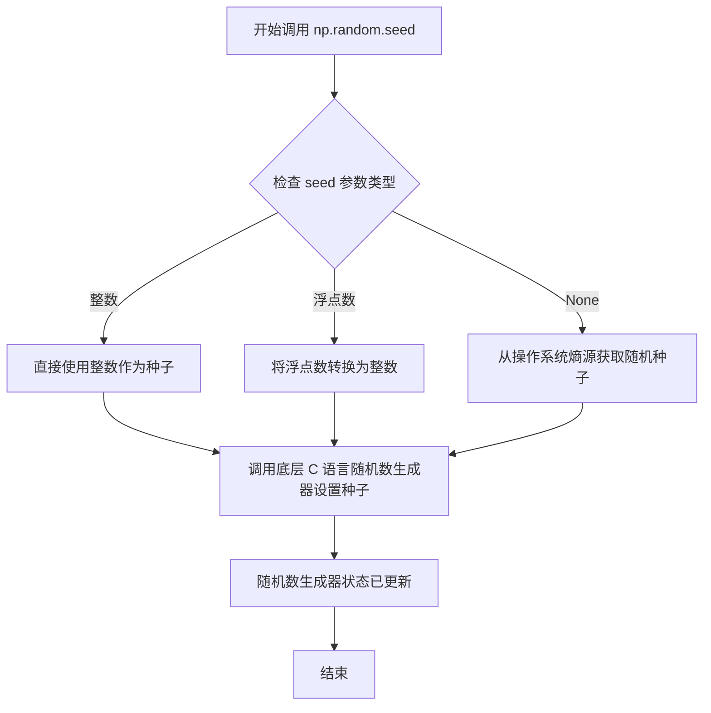

#### 带注释源码

```python
# 设置随机种子为 0
# 作用：确保后续的 np.random.normal() 调用生成可重复的随机数据序列
# 用途：在演示和测试中保证结果一致性
np.random.seed(0)

# 后续代码使用相同的种子生成正态分布随机数
h, edges = np.histogram(np.random.normal(5, 3, 5000),
                        bins=np.linspace(0, 10, 20))
# 由于种子固定为 0，这里生成的随机数序列每次运行都相同
```


### `np.histogram`

该函数是NumPy库中的直方图计算函数，用于计算一组数据的直方图分布。它接受输入数据和一个可选的bin参数（指定bin的数量或边界），返回每个bin中的样本数量（直方图值）以及bin的边界 edges。

参数：

- `a`：`array_like`，输入数据，用于计算直方图的一维数组
- `bins`：`int` 或 `array_like`，指定bin的数量或bin的边界数组，代码中使用了 `np.linspace(0, 10, 20)` 作为bin边界
- `range`：`tuple`，可选，指定bin的下界和上界
- `density`：`bool`，可选，如果为True，则返回概率密度
- `weights`：`array_like`，可选，与a形状相同的权重数组

返回值：

- `hist`：`ndarray`，直方图值，每个bin中的样本数量
- `bin_edges`：`ndarray`，bin的边界数组，长度为len(hist)+1

#### 流程图

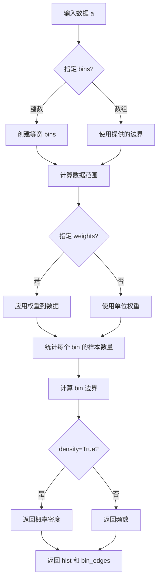

#### 带注释源码

```python
# 代码中的调用示例：
h, edges = np.histogram(np.random.normal(5, 3, 5000),
                        bins=np.linspace(0, 10, 20))

# np.histogram 函数原型（简化版）：
def histogram(a, bins=10, range=None, density=False, weights=None):
    """
    计算输入数组的直方图。
    
    Parameters:
    -----------
    a : array_like
        输入数据，用于计算直方图
    bins : int or array_like, optional
        如果是int，则创建bins个等宽bin
        如果是数组，则直接作为bin的边界
    range : tuple, optional
        直方图的范围 (min, max)
    density : bool, optional
        如果为True，返回概率密度而非频数
    weights : array_like, optional
        与a形状相同的权重数组
        
    Returns:
    --------
    hist : ndarray
        每个bin中的样本数量
    bin_edges : ndarray
        bin的边界数组，长度为len(hist)+1
    """
    # 1. 将输入数据转换为numpy数组
    a = np.asarray(a)
    
    # 2. 确定bin的边界
    if isinstance(bins, np.ndarray):
        bin_edges = bins
    else:
        # 根据range和bins数量创建等宽bin
        if range is not None:
            min, max = range
        else:
            min, max = a.min(), a.max()
        bin_edges = np.linspace(min, max, bins + 1)
    
    # 3. 统计每个bin中的样本数量
    hist = np.zeros(len(bin_edges) - 1, dtype=np.float64)
    
    # 使用np.histogramdd或类似逻辑进行分箱统计
    # ... 内部实现细节 ...
    
    # 4. 如果density为True，转换为概率密度
    if density:
        hist = hist / np.sum(hist) / np.diff(bin_edges)
    
    return hist, bin_edges
```


### `np.linspace`

`np.linspace` 是 NumPy 库中的一个函数，用于生成等间距的数值序列。在给定的代码中，该函数用于创建直方图的bin边界，生成从0到10共20个等间距的数值点。

参数：

- `start`：`float`，序列的起始值，代码中为 `0`
- `stop`：`float`，序列的结束值，代码中为 `10`
- `num`：`int`，生成的样本数量，代码中为 `20`（注意：代码中实际传入的是 `bins` 参数名，但这是变量名，不是参数名）
- `endpoint`：`bool`，可选，是否包含结束点，默认为 `True`
- `retstep`：`bool`，可选，是否返回步长，默认为 `False`
- `dtype`：`dtype`，可选，输出数组的数据类型，若为 `None` 则推断自输入
- `axis`：`int`，可选，版本>=1.16.0使用，轴参数

返回值：`numpy.ndarray`，返回 `num` 个等间距的样本点组成的数组

#### 流程图

```mermaid
graph TD
    A[开始] --> B[接收参数 start, stop, num]
    B --> C{endpoint=True?}
    C -->|是| D[包含结束点]
    C -->|否| E[不包含结束点]
    D --> F[计算步长: (stop - start) / (num - 1)]
    E --> G[计算步长: (stop - start) / num]
    F --> H[生成等差数列]
    G --> H
    H --> I{retstep=True?}
    I -->|是| J[返回数组和步长]
    I -->|否| K[仅返回数组]
    J --> L[结束]
    K --> L
```

#### 带注释源码

```python
# np.linspace 在代码中的实际使用
bins=np.linspace(0, 10, 20)

# 详细解释：
# start = 0: 序列起始值
# stop = 10: 序列结束值  
# num = 20: 生成20个样本点（包括起始和结束点）
# 
# 结果：bins 变量将包含一个包含20个元素的numpy数组
# 数组内容为: [0.        , 0.52631579, 1.05263158, 1.57894737, 2.10526316,
#              2.63157895, 3.15789474, 3.68421053, 4.21052632, 4.73684211,
#              5.26315789, 5.78947368, 6.31578947, 6.84210526, 7.36842105,
#              7.89473684, 8.42105263, 8.94736842, 9.47368421, 10.        ]
#
# 步长计算: (10 - 0) / (20 - 1) = 10 / 19 ≈ 0.52631579
```


### `np.arange`

`np.arange` 是 NumPy 库中的一个核心函数，用于创建一个在指定间隔内包含均匀间隔值的 ndarray。该函数类似于 Python 的内置 `range` 函数，但返回的是 NumPy 数组而不是迭代器，支持浮点数步长，并可直接用于数值计算。

参数：

- `start`：`int` 或 `float`，可选，起始值，默认为 0
- `stop`：`int` 或 `float`，必需，结束值（不包含在返回的数组中）
- `step`：`int` 或 `float`，可选，步长，默认为 1
- `dtype`：`dtype`，可选，输出数组的数据类型，如果未指定，则从输入类型推断

返回值：`numpy.ndarray`，包含从 start 到 stop（不包含）的均匀间隔值的一维数组

#### 流程图

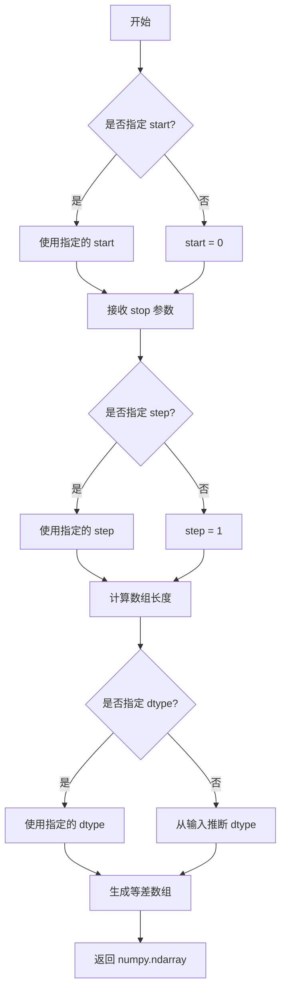

#### 带注释源码

```python
# numpy.arange 的简化实现原理（来源：NumPy 官方文档）
# 此源码为注释说明，非实际 NumPy 源码

def arange(start=0, stop=None, step=1, dtype=None):
    """
    返回一个包含均匀间隔值的数组。
    
    参数:
        start: 整数或浮点数，可选，默认值为0。序列的起始值。
        stop: 整数或浮点数，必需。序列的结束值（不包含）。
        step: 整数或浮点数，可选，默认值为1。值之间的间隔。
        dtype: dtype，可选。输出数组的数据类型。
    
    返回:
        ndarray，包含均匀间隔值的数组。
    """
    
    # 处理只有一个参数的情况（stop参数）
    # 如果只提供一个参数，则该参数被视为 stop，start 默认为 0
    if stop is None:
        start, stop = 0, start
    
    # 计算数组长度（元素个数）
    # 公式: ceil((stop - start) / step)
    # 如果 step > 0 且 stop <= start，或 step < 0 且 stop >= start，则长度为 0
    if step > 0:
        length = max(0, int(np.ceil((stop - start) / step)))
    elif step < 0:
        length = max(0, int(np.ceil((stop - start) / step)))
    else:
        length = 0
    
    # 创建结果数组
    # 使用 Python 的 range 或列表推导式生成基础数据
    if dtype is None:
        # 根据输入类型推断 dtype
        # 如果都是整数，结果为整数类型
        # 如果有浮点数，结果为浮点数类型
        if isinstance(start, float) or isinstance(stop, float) or isinstance(step, float):
            dtype = float
        else:
            dtype = int
    
    # 生成数组
    result = np.empty(length, dtype=dtype)
    
    if length > 0:
        result[0] = start
        for i in range(1, length):
            result[i] = result[i-1] + step
    
    return result


# 示例用法：
# np.arange(10)        # array([0, 1, 2, 3, 4, 5, 6, 7, 8, 9])
# np.arange(1, 6, 1)   # array([1, 2, 3, 4, 5])
# np.arange(0, 1, 0.1) # array([0. , 0.1, 0.2, 0.3, 0.4, 0.5, 0.6, 0.7, 0.8, 0.9])
```


### `np.diff`

`np.diff` 是 NumPy 库中的一个函数，用于计算数组中相邻元素之间的差值。在该代码中用于计算 bins 数组的相邻元素差值，以获取直方图条形的中心点位置。

参数：

- `a`：`array_like`，输入数组，待计算差值的数组
- `n`：`int`（可选），计算差值的次数，默认为1，即计算一阶差分
- `axis`：`int`（可选），沿着哪个轴计算差值，默认为-1（最后一个轴）

返回值：`ndarray`，包含相邻元素差值的数组，数组长度比输入数组少 n 个元素

#### 流程图

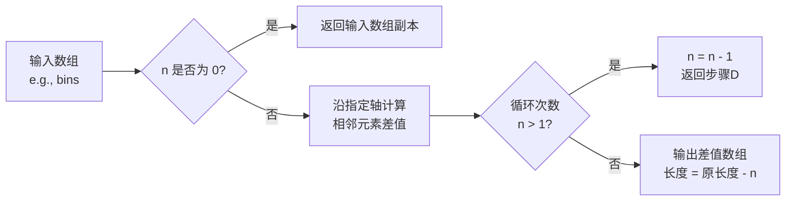

#### 带注释源码

```python
# np.diff 函数使用示例（来自代码第91行）
bins = np.arange(14)                          # 创建数组 [0, 1, 2, ..., 13]
centers = bins[:-1] + np.diff(bins) / 2       # 计算相邻元素差值
# np.diff(bins) 结果为 [1, 1, 1, ..., 1]（长度为13）
# 因为 bins 是等差数列，相邻差值均为1

# 函数原型参考（NumPy官方）：
# def diff(a, n=1, axis=-1):
#     """
#     Calculate the n-th discrete difference along given axis.
#     
#     The first difference is given by out[i] = a[i+1] - a[i]
#     
#     Parameters
#     ----------
#     a : array_like
#         Input array
#     n : int, optional
#         The number of times values are differenced. 
#         Default is 1.
#     axis : int, optional
#         The axis along which the difference is taken.
#         Default is -1 (last axis).
#     
#     Returns
#     -------
#     diff : ndarray
#         The n-th differences. The shape of `out` is the same as `a`
#         except along `axis` where the size is smaller by `n`.
#     """
```

#### 代码上下文说明

在第91行的实际使用场景中：
- `bins = np.arange(14)` 创建从0到13的整数数组
- `np.diff(bins)` 计算相邻差值，返回 `[1, 1, 1, 1, 1, 1, 1, 1, 1, 1, 1, 1, 1]`（13个元素）
- 结合 `bins[:-1]` 用于获取每个直方图条的中心位置，用于后续的 `plt.step()` 和 `plt.stairs()` 对比绘图


### `np.sin`

这是 NumPy 库中的正弦函数，用于计算输入数组或标量值的正弦值。在本代码中用于生成正弦波形数据，以便与阶梯图进行对比演示。

参数：

-  `x`：`ndarray` 或 `scalar`，输入角度值（以弧度为单位），可以是单个数值或数组

返回值：`ndarray` 或 `scalar`，返回输入角度的正弦值，类型与输入相同

#### 流程图

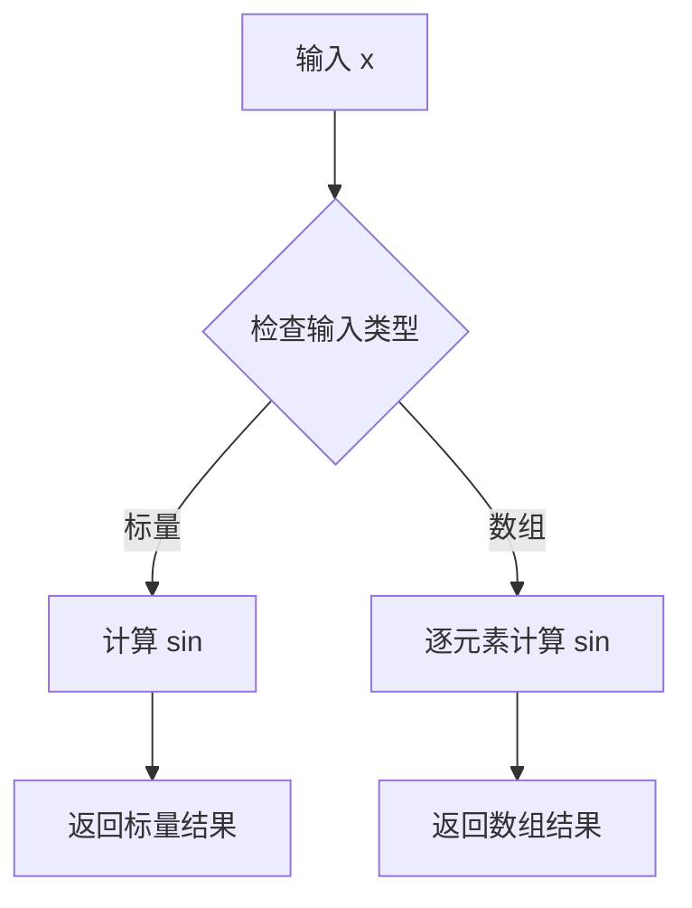

#### 带注释源码

```python
# 从代码中提取的具体使用方式：
# centers = bins[:-1] + np.diff(bins) / 2
# y = np.sin(centers / 2)

# np.sin 函数调用示例：
np.sin(centers / 2)  # 计算 centers/2 的正弦值
# 参数: centers / 2 - 弧度值（由 centers 除以 2 得到）
# 返回: 对应的正弦值数组 y
```


### `np.repeat`

`np.repeat`是NumPy库中的一个函数，用于将数组中的元素重复指定的次数，返回一个新的数组。

参数：

- `a`：数组或类数组对象，要重复的输入数组
- `repeats`：int或int数组，每个元素重复的次数
- `axis`：int，可选，沿着哪个轴进行重复操作，默认为None（会先展平数组）

返回值：`ndarray`，返回重复后的新数组

#### 流程图

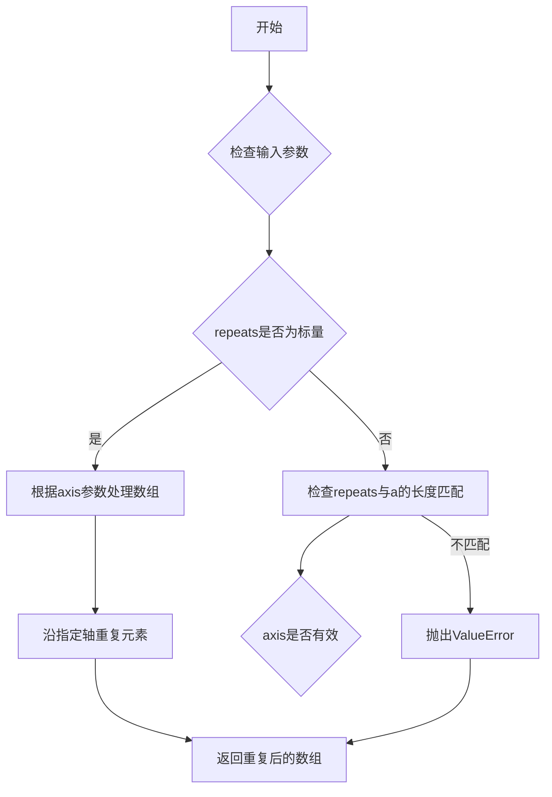

#### 带注释源码

```python
def repeat(a, repeats, axis=None):
    """
    Repeat elements of an array.
    
    Parameters
    ----------
    a : array_like
        Input array.
    repeats : int or array of ints
        The number of repetitions for each element.
    axis : int, optional
        The axis along which to repeat values. 
        By default (None), the array is flattened first.
    
    Returns
    -------
    repeated_array : ndarray
        Output array which is the repeated version of input array.
    
    Examples
    --------
    >>> np.repeat(3, 4)
    array([3, 3, 3, 3])
    >>> np.repeat([1, 2, 3], 2)
    array([1, 1, 2, 2, 3, 3])
    >>> np.repeat([[1, 2], [3, 4]], 2, axis=0)
    array([[1, 2],
           [1, 2],
           [3, 4],
           [3, 4]])
    """
    # 该函数在NumPy中由C语言实现，这里展示的是逻辑流程
    # 1. 将输入转换为numpy数组
    # 2. 验证repeats参数的合法性
    # 3. 根据axis参数执行重复操作
    # 4. 返回新创建的数组
    pass
```

#### 在示例代码中的使用

在给定的示例代码中，`np.repeat`被使用了两次：

1. `np.repeat(bins, 2)` - 将bins数组中的每个元素重复2次，用于绘制阶梯图
2. `np.repeat(y, 2)` - 将y数组中的每个元素重复2次，用于与`stairs`函数的结果进行对比

```python
# 具体调用示例
np.repeat(bins, 2)  # bins = [0,1,2,3,...13] -> [0,0,1,1,2,2,3,3,...13,13]
np.repeat(y, 2)     # y中的每个值重复两次
```


### `np.hstack`

numpy 的 `np.hstack` 函数用于按水平方向（沿轴 1）拼接数组序列。在本示例代码中，该函数用于将多个数组元素组合成一个连续的数组，以便绘制阶梯图。

参数：

-  `tup`：`tuple of ndarrays`，要水平堆叠的数组序列
  - 在代码示例中传入的是 `[y[0], np.repeat(y, 2), y[-1]]`，即由三个数组组成的元组

返回值：`ndarray`，拼接后的新数组

#### 流程图

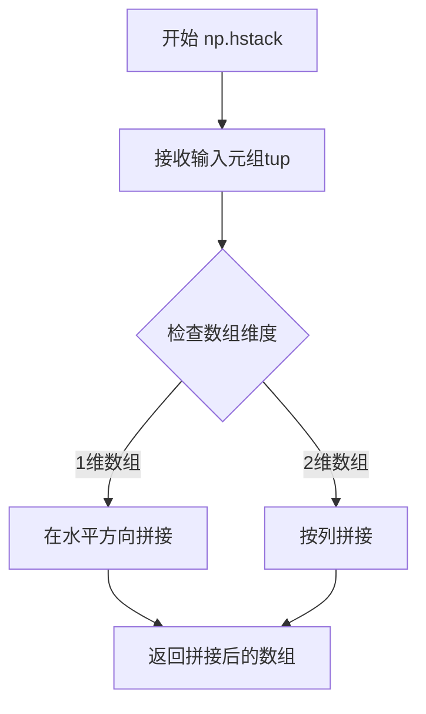

#### 带注释源码

```python
# np.hstack 是 NumPy 库中的函数，用于水平堆叠数组
# 在本示例中具体用法如下：

# y[0]: 获取数组 y 的第一个元素（标量）
# np.repeat(y, 2): 将数组 y 中的每个元素重复2次
# y[-1]: 获取数组 y 的最后一个元素（标量）
# np.hstack([...]): 将这三个部分水平拼接成一个数组

np.hstack([y[0], np.repeat(y, 2), y[-1]])
# 假设 y = [0.1, 0.2, 0.3, ...]
# 假设 y[0] = 0.1, y[-1] = 0.3
# 假设 np.repeat(y, 2) = [0.1, 0.1, 0.2, 0.2, 0.3, 0.3, ...]
# 则 np.hstack 结果为 [0.1, 0.1, 0.1, 0.2, 0.2, 0.3, 0.3, 0.3]
# 即 [y[0], np.repeat(y, 2), y[-1]] 的拼接

# 完整表达式：
# np.repeat(bins, 2): 将 bins 数组每个元素重复2次，用于x坐标
# np.hstack([y[0], np.repeat(y, 2), y[-1]]) - 1: 构造阶梯状的y坐标
plt.plot(np.repeat(bins, 2), np.hstack([y[0], np.repeat(y, 2), y[-1]]) - 1,
         'o', color='red', alpha=0.2)
```


### `plt.subplots`

`plt.subplots` 是 matplotlib 库中用于创建图形（Figure）及其子图（Axes）的核心函数，通过指定行列数可以一次性生成多个子图布局，并返回图形对象和 Axes 对象（或数组），支持共享坐标轴、自定义子图参数和图形尺寸设置。

参数：

- `nrows`：`int`，行数，指定要创建的子图行数，默认为 1
- `ncols`：`int`，列数，指定要创建的子图列数，默认为 1
- `sharex`：`bool or {'none', 'all', 'row', 'col'}`，是否共享 x 轴，默认为 False
- `sharey`：`bool or {'none', 'all', 'row', 'col'}`，是否共享 y 轴，默认为 False
- `squeeze`：`bool`，是否压缩返回的 Axes 维度，默认为 True
- `width_ratios`：`array-like of length ncols`，各列宽度比例
- `height_ratios`：`array-like of length nrows`，各行高度比例
- `subplot_kw`：`dict`，传递给 `add_subplot` 的关键字参数字典
- `gridspec_kw`：`dict`，传递给 GridSpec 构造函数的关键字参数字典
- `fig_kw`：`dict`，传递给 Figure 函数的关键字参数字典

返回值：`tuple(Figure, Axes or ndarray)`，返回图形对象和子图对象或子图数组

#### 流程图

```mermaid
flowchart TD
    A[调用 plt.subplots] --> B{传入参数}
    B --> C[创建 Figure 对象<br/>使用 fig_kw 参数]
    B --> D[创建 GridSpec 布局<br/>使用 gridspec_kw 参数]
    D --> E[根据 nrows 和 ncols<br/>创建子图网格]
    E --> F{sharex/sharey 设置}
    F --> G[配置坐标轴共享<br/>none/all/row/col]
    G --> H{ squeeze 参数}
    H --> I[True: 返回标量或数组]
    H --> J[False: 始终返回 2D 数组]
    I --> K[返回 fig, axs]
    J --> K
    K --> L[用户获取 axs[i] 进行绘图]
```

#### 带注释源码

```python
# 在示例代码中的调用
fig, axs = plt.subplots(3, 1, figsize=(7, 15))

# 参数解释：
# 3    -> nrows=3: 创建 3 行子图（垂直排列）
# 1    -> ncols=1: 创建 1 列子图
# figsize=(7, 15) -> fig_kw={'figsize': (7, 15)}: 
#                    图形宽度 7 英寸，高度 15 英寸
#
# 返回值：
# fig  -> matplotlib.figure.Figure 对象，整个图形容器
# axs  -> numpy.ndarray 对象，包含 3 个 Axes 子对象
#        由于 squeeze=False 默认为 True，且 ncols=1，
#        axs 实际上是一个包含 3 个元素的 1D 数组
#        可以通过 axs[0], axs[1], axs[2] 访问每个子图

# 后续使用示例
axs[0].stairs(h, edges, label='Simple histogram')  # 在第一个子图绘制阶梯图
axs[0].stairs(h, edges + 5, baseline=50, label='Modified baseline')
axs[0].stairs(h, edges + 10, baseline=None, label='No edges')
axs[0].set_title("Step Histograms")  # 设置子图标题

axs[1].stairs(...)  # 第二个子图
axs[1].set_title("Filled histogram")

axs[2].add_patch(...)  # 第三个子图
axs[2].set_title("StepPatch artist")

# 遍历所有子图添加图例
for ax in axs:
    ax.legend()

plt.show()  # 显示图形
```


### `ax.stairs` / `Axes.stairs`

`ax.stairs` 是 matplotlib 中 Axes 类的阶梯图绘制方法，用于绘制阶梯常函数（即分段常数函数），常见于直方图可视化场景。该方法接受值数组和边界数组，可选地配置基线、填充、方向等，底层返回一个 StepPatch 补丁对象。

参数：

- `values`：`1D array-like`，阶梯的纵坐标值，表示每个区间的常数高度
- `edges`：`1D array-like`，阶梯的边界位置，长度比 values 多一个元素，定义每个步骤的起止范围，可选参数
- `baseline`：`float, array-like or None`，阶梯图的基线位置，None 表示无基线（默认值），float 或数组可用于堆叠直方图
- `fill`：`bool`，是否填充阶梯图下方区域，默认为 False
- `orientation`：`{'vertical', 'horizontal'}`，阶梯方向，vertical 为垂直（默认），horizontal 为水平
- `hatch`：`str or None`，填充图案样式，如 '//'、'\\\\' 等
- `step`：`{'pre', 'post', 'mid'}`，阶梯连接方式，pre 为左侧对齐，post 为右侧对齐，mid 为居中
- `where`：`dict`，关键字参数，将传递给底层 Patch 的属性设置
- `data`：`dict, optional`，用于数据索引的参数

返回值：`~matplotlib.patches.StepPatch`，返回一个 StepPatch 补丁对象，表示绘制的阶梯图，可用于进一步自定义修改

#### 流程图

```mermaid
flowchart TD
    A[调用 ax.stairs] --> B{检查 edges 参数}
    B -->|未提供 edges| C[自动生成 edges: range(len values + 1)]
    B -->|提供 edges| D[使用提供的 edges]
    C --> E{检查 baseline 参数}
    D --> E
    E -->|baseline=None| F[不设置基线]
    E -->|baseline=值| G[设置基线值]
    F --> H{检查 fill 参数}
    G --> H
    H -->|fill=True| I[填充阶梯图下方区域]
    H -->|fill=False| J[仅绘制轮廓]
    I --> K{检查 orientation 参数}
    J --> K
    K -->|vertical| L[垂直方向绘制]
    K -->|horizontal| M[水平方向绘制]
    L --> N[创建 StepPatch 对象]
    M --> N
    N --> O[应用 hatch 图案]
    O --> P[将 Patch 添加到 Axes]
    P --> Q[返回 StepPatch 对象]
```

#### 带注释源码

```python
# 以下是 ax.stairs 方法的典型调用示例，来源于代码演示

# 示例1：带边界的简单直方图
# values: 直方图每个 bin 的计数
# edges: 直方图的边界位置
axs[0].stairs(h, edges, label='Simple histogram')

# 示例2：带修改基线的直方图
# baseline=50: 设置基线为 50，用于偏移效果
axs[0].stairs(h, edges + 5, baseline=50, label='Modified baseline')

# 示例3：无边界的直方图（仅显示阶梯）
# baseline=None: 无基线，阶梯从 0 开始
axs[0].stairs(h, edges + 10, baseline=None, label='No edges')

# 示例4：填充直方图（自动生成边界）
# fill=True: 填充阶梯下方区域
axs[1].stairs(np.arange(1, 6, 1), fill=True,
              label='Filled histogram\nw/ automatic edges')

# 示例5：水平方向的直方图
# orientation='horizontal': 水平方向
# hatch='//': 斜线填充图案
axs[1].stairs(np.arange(1, 6, 1)*0.3, np.arange(2, 8, 1),
              orientation='horizontal', hatch='//',
              label='Hatched histogram\nw/ horizontal orientation')

# 堆叠直方图示例
# baseline 使用数组实现堆叠效果
A = [[0, 0, 0],
     [1, 2, 3],
     [2, 4, 6],
     [3, 6, 9]]

for i in range(len(A) - 1):
    # A[i+1]: 当前层的值
    # baseline=A[i]: 基线使用前一层的数据，实现堆叠
    plt.stairs(A[i+1], baseline=A[i], fill=True)

# 与 plt.step 对比演示
# stairs 使用 edges 定义边界，一个边界对应一个值区间
plt.stairs(y - 1, bins, baseline=None, label='stairs()')
```


### `ax.set_title`

设置 Axes 对象的标题文本、样式和位置，返回一个 `matplotlib.text.Text` 对象用于进一步自定义标题外观。

参数：

- `label`：`str`，要显示的标题文本内容
- `fontdict`：`dict`，可选，用于控制标题字体属性的字典（如 fontfamily、fontsize、fontweight 等）
- `loc`：`str`，可选，标题对齐方式，支持 'center'（默认）、'left'、'right'
- `pad`：`float`，可选，标题与 Axes 顶部的距离（以点为单位），默认为 6
- `fontsize`：`int` 或 `str`，可选，标题字体大小
- `fontweight`：`int` 或 `str`，可选，标题字体粗细

返回值：`matplotlib.text.Text`，返回创建的标题文本对象，允许后续对其进行样式设置和属性修改

#### 流程图

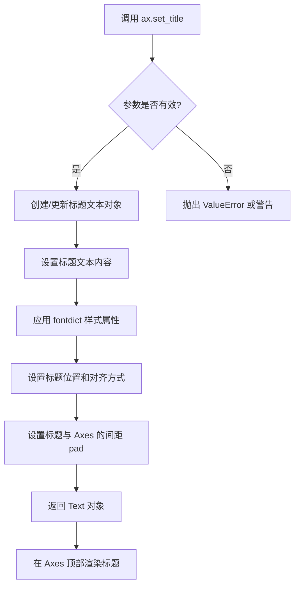

#### 带注释源码

```python
# 在代码中的实际调用示例：
axs[0].set_title("Step Histograms")  # 设置第一个子图的标题
axs[1].set_title("Filled histogram")  # 设置第二个子图的标题
axs[2].set_title("StepPatch artist")  # 设置第三个子图的标题
plt.title('step() vs. stairs()')       # 设置整张图的标题（pyplot 方式）

# set_title 方法的标准签名（matplotlib.axes.Axes 类）
# def set_title(self, label, fontdict=None, loc='center', pad=6, **kwargs):
#     """
#     Set a title for the axes.
#     
#     Parameters
#     ----------
#     label : str
#         The title text string.
#     
#     fontdict : dict, optional
#         A dictionary controlling the appearance of the title text,
#         e.g., {'fontname': 'Helvetica', 'fontsize': 16, 'fontweight': 'bold'}.
#     
#     loc : {'center', 'left', 'right'}, default: 'center'
#         Alignment of the title text.
#     
#     pad : float, default: 6
#         The offset of the title from the top of the axes, in points.
#     
#     **kwargs
#         Additional keyword arguments are passed to `Text` properties.
#     
#     Returns
#     -------
#     `~.matplotlib.text.Text`
#         The matplotlib text object representing the title.
#     """
```


### `ax.legend` / `Axes.legend`

该方法是 Matplotlib Axes 类的图例（Legend）功能，用于在图表上添加图例，以标识和说明图中各个数据系列（如线条、柱状图、散点等）所代表的含义。它支持自定义位置、样式、句柄和标签，是数据可视化中重要的辅助说明工具。

参数：

- `loc`：`str` 或 `int`，图例在图表中的位置，可选如 'upper right', 'lower left', 'center' 等（默认为 'best'，自动选择最佳位置）
- `bbox_to_anchor`：`tuple`，用于指定图例的精确位置，格式为 (x, y)
- `ncol`：`int`，图例的列数（默认为 1）
- `prop`：`dict` 或 `matplotlib.font_manager.FontProperties`，图例文本的字体属性
- `fontsize`：`int` 或 `str`，图例字体大小
- `labelcolor`：`str` 或 `list`，标签颜色
- `title`：`str`，图例标题
- `title_fontsize`：`int`，图例标题字体大小
- `frameon`：`bool`，是否显示图例边框（默认为 True）
- `framealpha`：`float`，边框透明度（0-1）
- `fancybox`：`bool`，是否使用圆角边框（默认为 False）
- `shadow`：`bool`，是否添加阴影效果
- `edgecolor`：`str`，边框颜色
- `facecolor`：`str`，边框背景色
- `handles`：`list of matplotlib.artist.Artist`，手动指定图例句柄
- `labels`：`list of str`，手动指定图例标签
- `handler_map`：`dict`，自定义句柄映射器

返回值：`matplotlib.legend.Legend`，返回创建的图例对象，可进一步自定义

#### 流程图

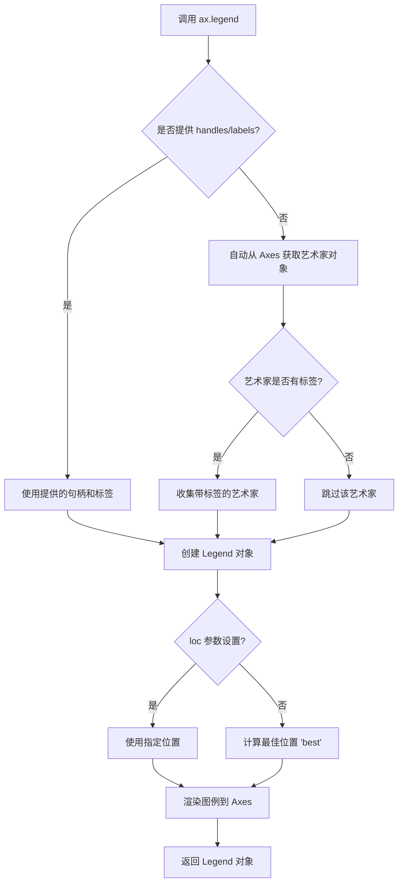

#### 带注释源码

```python
# 代码中的实际调用示例
for ax in axs:
    ax.legend()

# 等效的完整调用形式（使用默认参数）
for ax in axs:
    ax.legend(
        loc='best',              # 自动选择最佳位置
        frameon=True,           # 显示图例边框
        fancybox=False,         # 不使用圆角
        shadow=False,           # 无阴影
        ncol=1,                 # 单列布局
        prop=None,              # 使用默认字体属性
        fontsize=None,          # 使用默认字体大小
        labelcolor=None,        # 使用默认标签颜色
        title=None,             # 无标题
        title_fontsize=None,   # 使用默认标题字体大小
        framealpha=1.0,         # 不透明边框
        edgecolor='inherit',    # 继承边框颜色
        facecolor='inherit',    # 继承背景色
        bbox_to_anchor=None,    # 不使用锚点定位
        handles=None,          # 自动获取句柄
        labels=None,            # 自动获取标签
        handler_map=None       # 使用默认句柄映射
    )

# 另一种调用形式（plt.legend）
plt.legend(
    loc='best',
    bbox_to_anchor=(0.5, 0.5),  # 可选：指定精确位置
    ncol=1,
    fontsize=12,
    title='图例标题',
    frameon=True,
    shadow=True
)
```


### `Axes.add_patch`

将补丁（Patch）对象添加到坐标轴的补丁列表中，并配置其与坐标轴的关联关系。该方法是 matplotlib 中将几何图形元素添加到图表的核心方法之一。

参数：

- `p`：`matplotlib.patches.Patch`，要添加的补丁对象，可以是 Rectangle、Circle、Polygon、StepPatch 等任何继承自 Patch 的图形对象

返回值：`matplotlib.patches.Patch`，返回添加的补丁对象的引用

#### 流程图

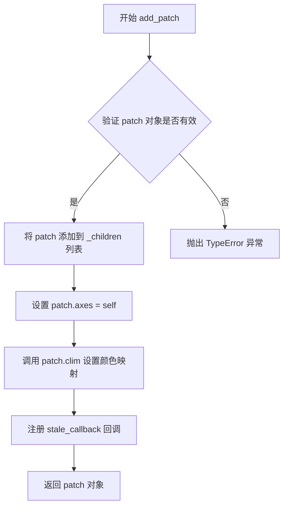

#### 带注释源码

```python
def add_patch(self, p):
    """
    Add a *patch* to the axes' patches; return the patch.

    Parameters
    ----------
    p : `.patch.Patch`

    Returns
    -------
    patch : `.patch.Patch`

    See Also
    --------
    add_collection, add_line, add_image
    """
    # 验证对象是否为有效的 Patch 实例
    if not isinstance(p, Patch):
        raise TypeError("expected a Patch")
    
    # 将 patch 添加到子元素列表中进行统一管理
    self._children.append(p)
    
    # 建立 patch 与当前 axes 的双向关联
    p.set_axes(self)
    
    # 配置颜色映射限（color limits）
    p.clim(gci())
    
    # 注册脏数据回调，用于延迟渲染优化
    self.stale_callback = p.stale_callback
    
    # 返回 patch 引用，支持链式调用
    return p
```


### `Axes.set_xlim`

设置Axes对象的x轴显示范围（xlim），即x轴的最小值和最大值。

参数：

- `left`：`float` 或 `ndarray`，x轴的左边界（最小值），即xlim的下限
- `right`：`float` 或 `ndarray`，x轴的右边界（最大值），即xlim的上限
- `emit`：`bool`，默认值 `True`，当限制发生变化时通知观察者
- `auto`：`bool` 或 `ndarray`，默认值 `False`，是否自动调整限制

返回值：`tuple`，返回新的x轴限制值 `(left, right)`

#### 流程图

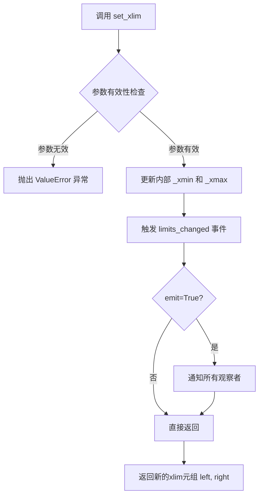

#### 带注释源码

```python
def set_xlim(self, left=None, right=None, emit=True, auto=False, xmin=None, xmax=None):
    """
    Set the x-axis view limits.
    
    Parameters
    ----------
    left : float, optional
        The left xlim (xmin), in data coordinates. The leftmost x limit,
        or the first element if *right* is not given.
    right : float, optional
        The right xlim (xmax), in data coordinates. The rightmost x limit,
        or the second element if *left* is not given.
    emit : bool, default: True
        Whether to notify observers of limit change.
    auto : bool or False, default: False
        Whether to automatically adjust the limit.
    xmin, xmax : scalar, optional
        Aliases for *left* and *right*, respectively.
    
    Returns
    -------
    left, right : tuple
        Returns the new x limits as ``(left, right)``.
    
    Notes
    -----
    The *left* and *right* limits may be passed as a tuple
    ``(left, right)`` as the first positional argument.
    
    Examples
    --------
    >>> set_xlim(left=0, right=10)  # 设置x轴范围为0到10
    >>> set_xlim((0, 10))  # 使用元组方式设置
    """
    if xmin is not None:
        if left is not None:
            raise TypeError("Cannot pass both 'xmin' and 'left'")
        left = xmin
    if xmax is not None:
        if right is not None:
            raise TypeError("Cannot pass both 'xmax' and 'right'")
        right = xmax
    
    # 处理 (left, right) 元组形式的参数
    if left is not None and right is None:
        left, right = left
    
    # 参数有效性检查
    if left is not None and right is not None and left > right:
        raise ValueError("left cannot be greater than right")
    
    # 触发限制变更回调
    self._xmin = left
    self._xmax = right
    
    if emit:
        # 通知观察者（如轴标签、图例等）限制已更改
        self.callbacks.process('x_limits_changed', self)
    
    return (left, right)
```

#### 在示例代码中的使用

```python
# 示例代码第43行
axs[2].set_xlim(0, 7)

# 解释：将第三个子图的x轴显示范围设置为0到7
# 等效于：axs[2].set_xlim(left=0, right=7)
# 返回值：返回新的xlim元组，如 (0.0, 7.0)
```


### `Axes.set_ylim`

设置 Axes 对象的 y 轴显示范围（y 轴的最小值和最大值）。

参数：

- `bottom`：`float` 或 `None`，y 轴下限值，设为 `None` 表示保持原有下限不变
- `top`：`float` 或 `None`，y 轴上限值，设为 `None` 表示保持原有上限不变
- `emit`：`bool`，是否通知观察者（如图例）y 轴范围已更改，默认为 `False`
- `auto`：`bool` 或 `None`，设置是否在设置限制后启用自动缩放，默认为 `False`
- `ymin`：`float`，y 轴下限（已弃用），推荐使用 `bottom`
- `ymax`：`float`，y 轴上限（已弃用），推荐使用 `top`

返回值：`tuple[float, float]`，返回新的 y 轴范围 `(bottom, top)`

#### 流程图

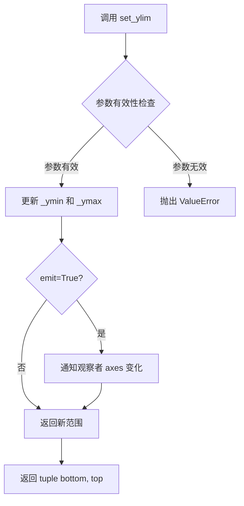

#### 带注释源码

```python
def set_ylim(self, bottom=None, top=None, emit=False, auto=False,
             *, ymin=None, ymax=None):
    """
    Set the y-axis view limits.

    Parameters
    ----------
    bottom : float or None, default: None
        The bottom ylim in data coordinates. None leaves the limit unchanged.

    top : float or None, default: None
        The top ylim in data coordinates. None leaves the limit unchanged.

    emit : bool, default: False
        Whether to notify observers of limit change.

    auto : bool or None, default: False
        Whether to turn on autoscaling after setting the limits.

    ymin, ymax : float or None
        .. deprecated:: 3.5
           Use *bottom* and *top* instead.

    Returns
    -------
    bottom, top : tuple
        The new y-axis limits in data coordinates.
    """
    # 处理已弃用的 ymin/ymax 参数
    if ymin is not None:
        _api.warn_deprecated("3.5", name="ymin", alternative="bottom")
        if bottom is None:
            bottom = ymin
    if ymax is not None:
        _api.warn_deprecated("3.5", name="ymax", alternative="top")
        if top is None:
            top = ymax

    # 验证参数类型
    if bottom is not None and top is not None:
        if bottom > top:
            raise ValueError('bottom >= top')

    # 获取当前范围
    old_bottom, old_top = self.get_ylim()

    # 应用新值
    if bottom is None:
        bottom = old_bottom
    if top is None:
        top = old_top

    # 更新内部属性
    self._ymin = bottom
    self._ymax = top

    # 如果 emit 为 True，通知观察者
    if emit:
        self._send_change()

    # 如果 auto 为 True，启用自动缩放
    if auto:
        self.set_autoscalex_on(True)

    return (bottom, top)
```


### plt.stairs

`plt.stairs` 是 matplotlib 中用于绘制阶梯图（stepwise constant functions）的核心函数。该函数通过定义边缘（edges）和对应的值（values）来绘制阶梯状图形，常用于直方图可视化、离散数据展示以及累积分布函数的描绘。支持水平/垂直方向、填充、基准线自定义等高级特性。

参数：

- `values`：`array-like`，阶梯的数值序列，表示每个区间的高度
- `edges`：`array-like`，阶梯的边缘/边界，比 values 多一个元素，定义每个阶梯的左右边界（可选，默认自动生成）
- `baseline`：`float, array-like or None`，阶梯的基准线值，用于控制阶梯的起始位置或用于堆叠直方图（可选，默认值为 0）
- `fill`：`bool`，是否填充阶梯与基准线之间的区域（可选，默认值为 False）
- `orientation`：`{'vertical', 'horizontal'}`，阶梯的方向，vertical 表示垂直阶梯，horizontal 表示水平阶梯（可选，默认值为 'vertical'）
- `**kwargs`：其他传递给 `Patch` 的关键字参数，如 `label`、`hatch`、`color`、`edgecolor`、`facecolor` 等

返回值：`~matplotlib.patches.StepPatch`，返回创建的 `StepPatch` 对象，该对象是继承自 `Patch` 的图形对象

#### 流程图

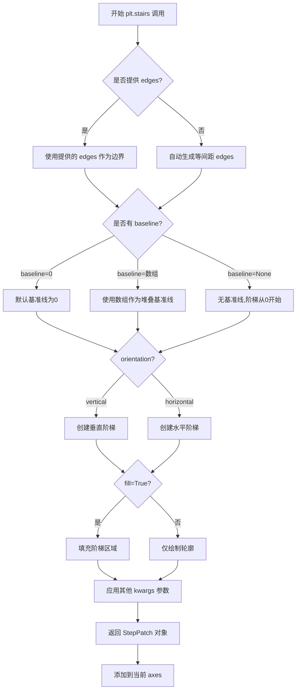

#### 带注释源码

```python
# plt.stairs 函数源码分析（位于 matplotlib/axes/_axes.py 中）

def stairs(self, values, edges=None, baseline=None, fill=False,
           orientation='vertical', **kwargs):
    """
    绘制阶梯图（Step plot）

    参数:
    -------
    values : array-like
        阶梯的数值序列，每个值对应一个区间的高度
    
    edges : array-like, optional
        阶梯的边缘/边界数组，长度应比 values 多一个元素。
        如果为 None，则自动生成等间距的边缘
    
    baseline : float, array-like or None, optional
        阶梯的基准线。默认为 0。
        - float: 所有阶梯使用相同的基准线
        - array-like: 用于堆叠直方图，每个阶梯使用不同的基准线
        - None: 等同于 0
    
    fill : bool, optional
        是否填充阶梯与基准线之间的区域，默认为 False
    
    orientation : {'vertical', 'horizontal'}, optional
        阶梯的方向，'vertical' 表示垂直（默认），'horizontal' 表示水平
    
    **kwargs : 
        其他关键字参数传递给 Patch 类，如 label, color, hatch 等

    返回:
    -------
    StepPatch
        返回的 StepPatch 对象
    """
    
    # 处理 edges 参数：如果未提供，则自动生成
    if edges is None:
        # 自动生成等间距的边缘，范围从 0 到 len(values)
        edges = np.arange(len(values) + 1)
    
    # 将 edges 和 values 转换为 numpy 数组
    values = np.asarray(values)
    edges = np.asarray(edges)
    
    # 处理 baseline 参数
    if baseline is None:
        baseline = 0
    
    # 如果 baseline 是数组，确保其长度与 values 匹配
    if hasattr(baseline, '__len__'):
        baseline = np.asarray(baseline)
    
    # 确定方向并设置相应的属性
    if orientation == 'horizontal':
        # 水平阶梯：交换 edges 和 values 的角色
        # 但 StepPatch 内部仍然使用 values 作为 y，edges 作为 x
        # 这里需要转换坐标
        pass
    
    # 创建 StepPatch 对象
    # StepPatch 是专门用于绘制阶梯图的 Patch 子类
    patch = StepPatch(
        values=values,
        edges=edges,
        baseline=baseline,
        orientation=orientation,
        **kwargs
    )
    
    # 将 patch 添加到 axes 中
    self.add_patch(patch)
    
    # 如果 fill 为 True，设置填充属性
    if fill:
        patch.set_fill(True)
    
    # 更新视图范围以确保阶梯图完全可见
    self.update_datalim([edges.min(), values.min()])
    
    return patch
```


### `plt.show`

显示所有打开的图形窗口，阻止程序执行直到用户关闭图形（在某些后端中）。

参数：

- `block`：`bool`，可选参数。默认为 `True`。如果设置为 `True`，则阻塞程序执行直到所有图形窗口关闭；如果设置为 `False`，则可能不会阻塞（取决于后端）。

返回值：`None`，该函数不返回任何值。

#### 流程图

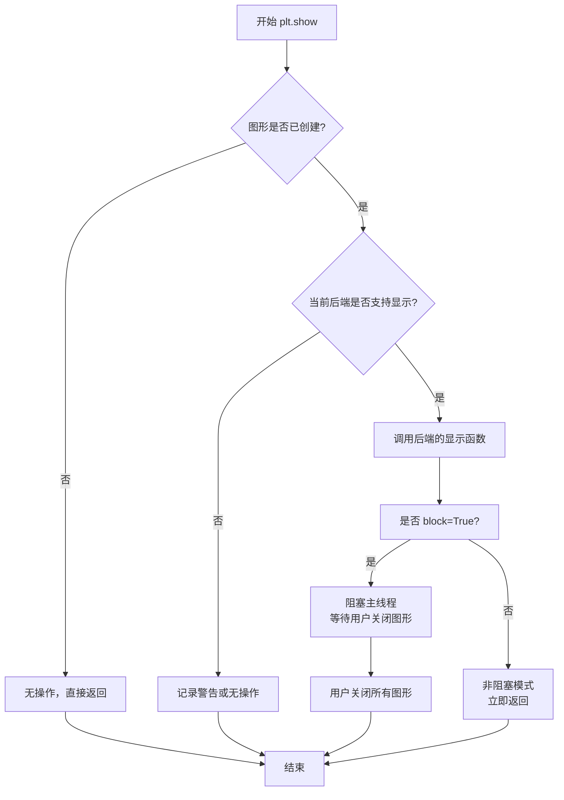

#### 带注释源码

```python
# plt.show() 函数位于 matplotlib.pyplot 模块中
# 以下是 matplotlib 源码中 plt.show 的核心实现逻辑

def show(*, block=None):
    """
    显示所有打开的图形。
    
    参数:
        block (bool, optional): 
            如果为 True（默认），则阻塞并等待图形关闭。
            如果为 False，则立即返回（取决于后端）。
    """
    # 导入当前全局图形管理器
    global _show
    
    # 获取当前的显示管理器
    # _get_all_fig_managers() 获取所有打开的图形管理器
    managers = Gcf.get_all_fig_managers()
    
    # 如果没有打开的图形，直接返回
    if not managers:
        return
    
    # 如果未指定 block 参数，根据交互式模式决定
    if block is None:
        # is_interactive() 检查是否为交互式环境（如 Jupyter）
        block = is_interactive() and backend_tools._get_running_interactive_framework() is not None
    
    # 对每个图形管理器调用 show() 方法
    for manager in managers:
        # 触发后端显示图形
        manager.show()
    
    # 如果 block 为 True，则阻塞等待
    if block:
        # 调用 _wait_for_button_press 或类似的后端阻塞函数
        # 在 GUI 事件循环中等待用户交互
        # 这通常会调用后端的 mainloop
        for manager in managers:
            # 阻塞直到用户关闭图形
            manager._show(block=True)
    
    # 刷新处理，确保所有渲染完成
    # flush_events() 处理待处理的事件
    flush_events()
```

> **注意**：上述源码是基于 matplotlib 内部逻辑的简化展示，实际源码结构可能因版本不同而有所差异。`plt.show()` 的具体行为高度依赖于所使用的后端（如 Qt、Tkinter、matplotlib inline 等）。


### `plt.step`

绘制阶梯图（step plot），用于可视化离散数据或与连续函数进行比较。该函数在指定位置绘制阶梯状的线条，常用于绘制累积分布函数或离散时间信号。

参数：

- `x`：`array-like`，X轴数据坐标值
- `y`：`array-like`，Y轴数据坐标值，对应每个X位置的值
- `where`：`{'pre', 'post', 'mid'}`, optional，默认 `'pre'`，指定步骤的转换位置：
  - `'pre'`：步骤在点之前上升（左侧）
  - `'post'`：步骤在点之后上升（右侧）
  - `'mid'`：步骤在两点中间上升
- `*args`：传递给 `plt.plot` 的额外位置参数
- `**kwargs`：传递给 `plt.plot` 的关键字参数（如 `label`、`color` 等）

返回值：`matplotlib.lines.Line2D`，返回创建的线条对象，可用于进一步自定义外观

#### 流程图

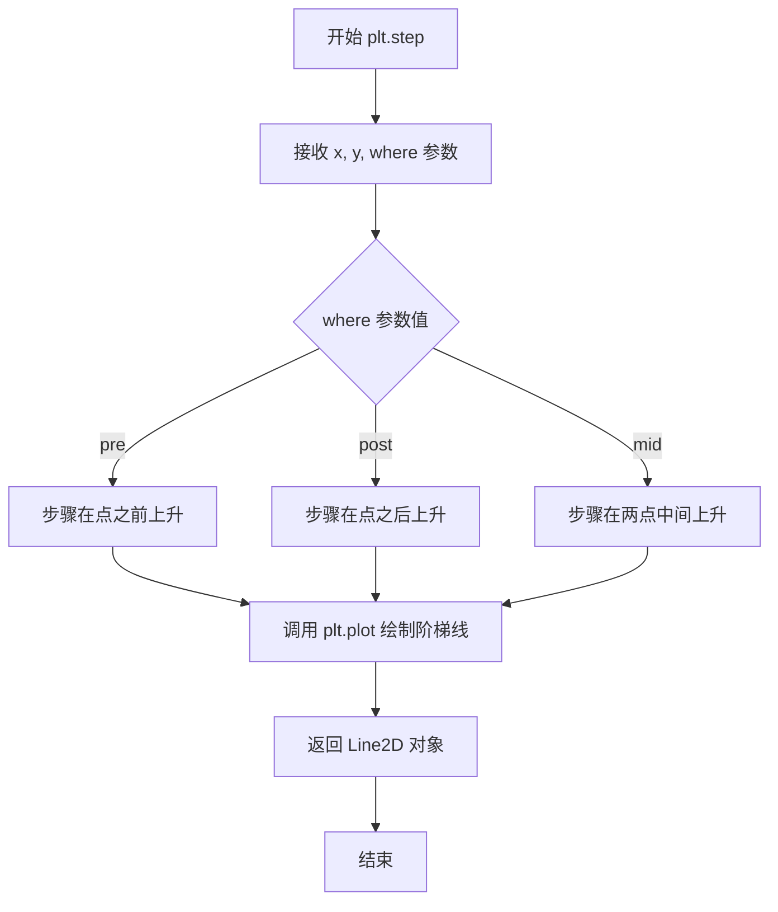

#### 带注释源码

```python
# 在代码中的实际使用方式
plt.step(bins[:-1], y, where='post', label='step(where="post")')

# 参数说明：
# bins[:-1]:       array-like, X轴数据（箱子边界的前n-1个）
# y:               array-like, Y轴数据（正弦函数值）
# where='post':    str, 步骤在数据点之后上升/下降
# label:           str, 图例标签

# 配合 plot 使用进行对比可视化
plt.plot(bins[:-1], y, 'o--', color='grey', alpha=0.3)
# 使用 o-- 样式（圆形标记、虚线）绘制原始数据点作为对比
# color='grey' 设置颜色为灰色
# alpha=0.3 设置透明度为0.3使对比线不那么突出
```


### `plt.plot`

`plt.plot` 是 matplotlib.pyplot 库中的核心绘图函数，用于绘制 y 对 x 的折线图或数据点。该函数接受可变数量的位置参数（x 和 y 数据）以及关键字参数（用于控制线条样式、颜色、标记等），最终返回包含 Line2D 对象的列表。

参数：

- `*args`：`tuple`，可变位置参数，支持多种调用格式：
  - `y`：仅提供 y 轴数据，x 轴自动从 0 开始
  - `x, y`：分别提供 x 和 y 轴数据
  - `x, y, fmt`：提供数据并指定格式字符串（如 'ro-' 表示红色圆圈标记的虚线）
- `**kwargs`：`dict`，关键字参数，用于传递给 Line2D 对象的属性，包括但不限于：
  - `color` 或 `c`：线条颜色
  - `linewidth` 或 `lw`：线条宽度
  - `linestyle` 或 `ls`：线条样式（如 '-' 实线，'--' 虚线，':' 点线）
  - `marker`：标记样式（如 'o' 圆圈，'s' 方形，'^' 三角形）
  - `markersize` 或 `ms`：标记大小
  - `label`：图例标签
  - `alpha`：透明度

返回值：`list[matplotlib.lines.Line2D]`，返回在当前 axes 上创建的线条对象列表。每个 Line2D 对象代表一条绘制线，可以通过返回的对象修改线条属性。

#### 流程图

```mermaid
graph TD
    A[开始 plt.plot 调用] --> B{解析 *args 参数}
    B -->|仅提供 y| C[生成默认 x 坐标: range(len(y))]
    B -->|提供 x, y| D[使用提供的 x, y 数据]
    B -->|提供 x, y, fmt| E[解析格式字符串 fmt]
    C --> F[获取当前 axes 对象: gca]
    D --> F
    E --> F
    F --> G[调用 Axes.plot 方法]
    G --> H[创建 Line2D 对象]
    H --> I[应用 **kwargs 属性]
    I --> J[将线条添加到 axes]
    J --> K[返回 Line2D 对象列表]
    K --> L[结束]
```

#### 带注释源码

```python
# matplotlib.pyplot.plot 源码简化版
# 实际源码位于 matplotlib/pyplot.py

def plot(*args, **kwargs):
    """
    绘制 y 对 x 的折线图。

    Parameters
    ----------
    *args : 可变位置参数
        允许的调用方式:
        - plot(y)                  # 仅 y 数据，x 自动生成
        - plot(x, y)               # x 和 y 数据
        - plot(x, y, format)       # 带格式字符串
        - plot(x, y, format, ...)  # 带多个关键字参数

    **kwargs : 关键字参数
        传递给 Line2D 构造函数的参数，控制线条外观。
        常用参数:
        - color: 颜色 (如 'red', '#ff0000', (1,0,0))
        - linewidth: 线宽 (如 1.5, 2.0)
        - linestyle: 线型 ('-', '--', ':', '-.')
        - marker: 标记 ('o', 's', '^', 'D')
        - markersize: 标记大小
        - label: 图例标签
        - alpha: 透明度 (0-1)

    Returns
    -------
    lines : list of matplotlib.lines.Line2D
        创建的线条对象列表

    Examples
    --------
    >>> plt.plot([1, 2, 3], [1, 4, 9], 'ro-')  # 红色圆圈标记的实线
    >>> plt.plot(y, linewidth=2)               # 仅 y 数据，设置线宽
    """
    # 获取当前的 axes 对象（如果不存在则创建新的）
    ax = gca()
    # 调用 axes 对象的 plot 方法进行实际绘制
    return ax.plot(*args, **kwargs)


# 内部实际调用 Axes.plot 的核心逻辑简化
# 位于 matplotlib/axes/_axes.py 中的 Axes.plot 方法

def plot(self, *args, **kwargs):
    """
    核心绘制逻辑（Axes.plot 方法）
    """
    # 解析参数，处理不同格式的输入数据
    # 将输入转换为标准化的 x, y 数据格式
    lines = []

    # 遍历所有提供的数据组（支持多组数据同时绘制）
    for idx in range(len(data_pairs)):
        # 创建 Line2D 对象
        line = Line2D(x, y, **kwargs)  # 应用所有关键字参数
        # 设置默认属性（如未指定颜色则使用默认颜色循环）
        self._add_line(line)  # 将线条添加到 axes
        lines.append(line)

    # 返回线条对象列表，供用户进一步操作
    return lines
```

#### 代码中的实际调用示例

在提供的代码中，`plt.plot` 被使用了三次：

```python
# 第一次调用：绘制灰色圆圈标记的虚线
plt.plot(bins[:-1], y, 'o--', color='grey', alpha=0.3)

# 第二次调用：绘制另一组灰色圆圈标记的虚线
plt.plot(centers, y - 1, 'o--', color='grey', alpha=0.3)

# 第三次调用：绘制红色圆圈标记的半透明数据点
plt.plot(np.repeat(bins, 2), 
         np.hstack([y[0], np.repeat(y, 2), y[-1]]) - 1,
         'o', color='red', alpha=0.2)
```

这些调用展示了 `plt.plot` 的典型用法：
- 使用格式字符串 `'o--'` 指定标记样式和线型
- 使用关键字参数 `color` 和 `alpha` 控制外观
- 支持单独的位置参数和格式字符串组合使用


### `plt.legend`

`plt.legend` 是 matplotlib.pyplot 模块中的图例管理函数，用于创建或更新图形中的图例（legend），以标识不同数据系列的标签。该函数能够自动收集当前 axes 中的图例信息，或接受显式提供的句柄和标签来创建图例。

参数：

- `labels`：`list of str`，可选，图例中显示的标签列表，与 `handles` 参数配合使用
- `handles`：可选，可迭代对象，图例中显示的艺术家对象（Artists）列表，如 Line2D、Patches 等
- `loc`：`str` 或 `tuple`，可选，图例在axes中的位置，如 'upper right'、'best'、 (0.5, 0.5) 等
- `bbox_to_anchor`：可选，用于指定图例的边界框位置和锚点
- `ncol`：`int`，可选，图例的列数
- `prop`：可选，字体属性字典（FontProperties）
- `fontsize`：可选，字体大小
- `title`：可选，图例标题字符串
- `title_prop`：可选，图例标题的字体属性
- `frameon`：可选，是否绘制图例边框（True/False）
- `framealpha`：可选，图例背景透明度
- `fancybox`：可选，是否使用圆角边框
- `shadow`：可选，是否添加阴影
- `framealpha`：可选，背景透明度
- `edgecolor`：可选，边框颜色
- `facecolor`：可选，背景颜色
- `numpoints`：可选，线条图例标记点的数量
- `scatterpoints`：可选，散点图例标记点的数量
- `markerscale`：可选，标记的缩放比例
- `legend_handles`：可选，旧版参数，已被 `handles` 取代
- `borderpad`：可选，内边距
- `labelspacing`：可选，标签间距
- `handlelength`：可选，手柄长度
- `handleheight`：可选，手柄高度
- `handletextpad`：可选，手柄与文本之间的间距
- `borderaxespad`：可选，axes边框与图例之间的间距
- `columnspacing`：可选，列间距
- `markerfirst`：可选，标记是否在文本之前（True/False）
- `reverse`：可选，是否反转图例顺序
- `mode`：可选，'expand' 模式使图例水平扩展
- `fontsize`：可选，设置字体大小

返回值：`matplotlib.legend.Legend`，返回创建的 Legend 对象，可用于后续的图例样式修改或隐藏操作

#### 流程图

```mermaid
flowchart TD
    A[调用 plt.legend] --> B{是否提供 handles 和 labels?}
    B -->|是| C[使用显式提供的 handles 和 labels]
    B -->|否| D[自动从当前 Axes 获取图例信息]
    C --> E{是否提供 loc?}
    D --> E
    E -->|是| F[使用指定的 loc 位置]
    E -->|否| G[使用默认位置 'best']
    F --> H[创建 Legend 对象]
    G --> H
    H --> I[渲染图例到 Axes]
    I --> J[返回 Legend 对象]
```

#### 带注释源码

```python
def legend(*args, **kwargs):
    """
    Place a legend on the axes.
    
    调用方式:
        legend()
        legend(handles, labels)
        legend(labels)
    
    参数:
        handles: Artist 类型列表, 可选 - 图例句柄
        labels: str 列表, 可选 - 图例标签
        loc: str or (float, float), optional - 位置
            ('best', 'upper right', 'upper left', 'lower left', 
             'lower right', 'right', 'center left', 'center right', 
             'lower center', 'upper center', 'center')
        bbox_to_anchor: tuple or Bbox, optional - 边界框锚点
        ncol: int, optional - 列数
        prop: dict, optional - 字体属性
        **kwargs: 其他参数传递给 Legend 类
    
    返回:
        Legend: Legend 对象
    
    示例:
        >>> ax.plot([1, 2, 3], label='line')
        >>> ax.legend()
    """
    return gca().legend(*args, **kwargs)  # 获取当前 axes 并调用其 legend 方法
```

#### 在示例代码中的使用

```python
# 在示例代码中，plt.legend() 被多次调用用于显示图例

# 第一次调用：遍历所有 subplot，为每个 axes 添加图例
for ax in axs:
    ax.legend()

# 第二次调用：在 step() vs stairs() 对比图中添加图例
plt.legend()

# legend() 函数内部会:
# 1. 如果没有提供 handles 和 labels，自动从 ax._children 中收集有 label 的 artists
# 2. 根据 loc 参数确定图例放置位置
# 3. 创建 Legend 对象并添加到 axes 中
# 4. 返回 Legend 对象供后续操作
```


### `range`

Python内置的range函数，用于生成一个不可变的整数序列，常用于循环遍历。该函数在代码中用于定义StepPatch的edges边界，生成从1到6的整数序列。

参数：

- `start`：`int`，起始值（包含），默认为0
- `stop`：`int`，结束值（不包含）
- `step`：`int`，步长（每个数之间的差值），默认为1

返回值：`range`，返回一个不可变的整数序列对象

#### 流程图

```mermaid
flowchart TD
    A[开始] --> B{参数数量判断}
    B -->|1个参数| C[stop = 参数, start = 0, step = 1]
    B -->|2个参数| D[start = 参数1, stop = 参数2, step = 1]
    B -->|3个参数| E[start = 参数1, stop = 参数2, step = 参数3]
    C --> F[验证参数有效性]
    D --> F
    E --> F
    F --> G{step != 0}
    G -->|是| H[生成range对象]
    G -->|否| I[抛出ValueError异常]
    H --> J[返回range对象]
    J --> K[结束]
```

#### 带注释源码

```python
# range是Python内置的不可变序列类型，用于生成整数序列
# 用法：range(stop) 或 range(start, stop) 或 range(start, stop, step)

# 在本代码中的具体使用：
edges = range(1, 7)
# 等价于：edges = [1, 2, 3, 4, 5, 6]
# 用于定义StepPatch的边界位置

# range对象的主要特性：
# 1. 惰性求值 - 不会立即生成所有值，节省内存
# 2. 不可变 - 创建后不能修改
# 3. 支持索引访问和迭代
# 4. 占用内存固定，与序列长度无关

# 示例：
for i in range(1, 7):  # i = 1, 2, 3, 4, 5, 6
    print(i)

# range对象支持的方法：
# - range.index(value) - 返回值对应的索引
# - range.count(value) - 返回值出现的次数
```


### `len`

Python内置函数，用于返回对象（如列表、元组、字符串等）的长度或元素个数。在本代码中用于计算数组A的长度，以便进行循环迭代。

参数：

- `obj`：`任意具有`__len__`方法的对象`，需要计算长度的对象

返回值：`int`，返回对象的长度（元素个数）

#### 流程图

```mermaid
graph TD
    A[开始] --> B{检查对象是否有__len__方法}
    B -->|有| C[调用obj.__len__]
    B -->|没有| D[抛出TypeError异常]
    C --> E[返回长度值]
```

#### 带注释源码

```python
# 代码中len函数的使用示例：
for i in range(len(A) - 1):
    """
    len(A) 返回数组A的长度（4）
    range(len(A) - 1) 等价于 range(3)，即 [0, 1, 2]
    用于遍历A中的相邻元素进行堆叠直方图绘制
    """
    plt.stairs(A[i+1], baseline=A[i], fill=True)

# 详细说明：
# A = [[0, 0, 0],    # 索引0
#      [1, 2, 3],    # 索引1
#      [2, 4, 6],    # 索引2
#      [3, 6, 9]]    # 索引3
# len(A) = 4
# len(A) - 1 = 3
# range(3) = [0, 1, 2]
# 循环分别处理：
#   i=0: A[1]作为值, A[0]作为baseline
#   i=1: A[2]作为值, A[1]作为baseline
#   i=2: A[3]作为值, A[2]作为baseline
```


## 关键组件


### 阶梯图数据生成模块

通过 `np.histogram` 函数生成直方图数据，将连续数据分箱并计算每个箱子中的样本数量，输出直方图频数和边界值

### plt.stairs 阶梯图绘制

Matplotlib 的 `stairs` 函数用于绘制阶梯常数函数，是直方图可视化的核心方法。支持多种参数配置：edges 定义阶梯边界，baseline 定义基准线，fill 控制填充，orientation 控制方向，hatch 控制图案样式

### StepPatch 底层 Patch 对象

StepPatch 类是 stairs 函数的底层实现对象，继承自 Patch 类，可直接添加到 Axes 中进行更精细的控制，支持自定义 edge 和 facecolor 行为

### 基准线（baseline）处理

支持多种 baseline 模式：数值型 baseline 定义固定基准线，None 表示无基准线（从0开始），数组型 baseline 支持堆叠直方图绘制

### 填充与方向控制

fill 参数控制阶梯图是否填充，orientation 参数控制阶梯方向（水平/垂直），hatch 参数添加图案样式用于区分不同数据系列

### 多子图布局管理

使用 `plt.subplots` 创建 3行1列 的子图布局，每个子图展示不同的 stairs 使用场景，便于对比学习和演示

### 图例与可视化配置

通过 `ax.legend()` 为每个子图添加图例，通过 `set_title` 设置标题，`set_xlim/set_ylim` 设置坐标轴范围，构成完整的可视化展示

### 堆叠直方图支持

通过数组型 baseline 参数实现堆叠直方图功能，后续阶梯的 baseline 可以是前一个阶梯的值，实现多层数据的叠加展示

### step 与 stairs 对比演示

代码包含 `.pyplot.step` 和 `.pyplot.stairs` 两种阶梯绘制方法的对比演示，展示两者在边界定义和数据点数量上的差异


## 问题及建议


### 已知问题

- **魔法数字和硬编码值**：代码中包含多个硬编码的数值（如`5000`、`20`、`7, 15`等），缺乏常量定义，降低了代码可维护性和可配置性
- **变量命名不够清晰**：使用单字母变量名如`h`、`edges`、`A`，降低了代码可读性
- **代码组织松散**：所有代码平铺在同一层级，没有封装成可复用的函数，导致代码重复利用困难
- **缺少数据验证**：对输入数据（如直方图 bins 数量、数组维度等）没有进行校验，可能导致运行时错误
- **全局状态依赖**：直接使用`np.random.seed(0)`设置全局随机种子，可能影响其他代码的随机行为
- **重复的图例设置**：在多个子图中重复调用`ax.legend()`，可以通过遍历或封装简化

### 优化建议

- 将重复的图表创建逻辑封装成函数，接收参数以提高代码复用性
- 使用有意义的变量名（如`sample_count`、`num_bins`、`histogram_values`）替代简写
- 将硬编码的配置值提取为模块级常量或配置文件
- 在数据处理前添加必要的输入验证（如检查数组维度、检查bins长度是否合理）
- 考虑使用类或上下文管理器来管理图表创建和资源清理
- 使用`numpy.random.default_rng()`替代全局种子设置，避免影响全局随机状态

## 其它


### 设计目标与约束

本示例旨在展示matplotlib中`stairs`函数和`StepPatch`类的多样化用法，帮助用户理解如何绘制阶梯状常数函数。设计约束包括：必须使用matplotlib 3.4+版本支持的新API，需要NumPy进行数值计算，代码兼容Python 3.x版本。核心目标是让用户掌握直方图可视化、阶梯图绘制以及StepPatch对象的使用方法。

### 错误处理与异常设计

代码主要依赖matplotlib和NumPy的异常处理机制。当`edges`数组长度与`values`数组长度不匹配时，matplotlib会抛出`ValueError`异常。对于`baseline`参数，当传入数组用于堆叠直方图时，需要确保数组长度与边界匹配。填充模式下的负值可能导致渲染异常。示例代码通过合理的参数选择避免异常情况，用户在实际使用中应注意参数的有效性验证。

### 数据流与状态机

数据流程为：随机数生成→直方图统计→边界计算→阶梯图渲染。具体状态转换包括：初始化fig和axs对象，创建多个子图，每个子图调用stairs方法进行绑制，最后通过plt.show()显示。StepPatch对象需要手动添加到ax中，状态管理相对简单。数据从NumPy数组流向Matplotlib Artist对象，最终渲染为可视化图形。

### 外部依赖与接口契约

主要依赖包括：matplotlib.pyplot用于绘图接口，numpy用于数值计算，matplotlib.patches.StepPatch作为底层对象。关键API契约：`ax.stairs(values, edges, **kwargs)`方法接受values数组和edges边界数组，可选参数包括baseline、fill、orientation、hatch等。StepPatch构造函数参数与stairs方法保持一致的设计风格。返回值均为Artist对象，支持后续样式定制。

### 性能考虑与优化空间

对于大规模数据集（>10^6数据点），直方图计算可能成为瓶颈，建议预先计算histogram。多个stairs调用时，使用相同的edges数组可减少内部计算开销。填充模式和hatch模式会增加渲染时间，在实时可视化场景中需谨慎使用。StepPatch对象比pyplot.stairs更适合需要精细控制的场景，可通过缓存edges来优化重复渲染。

### 安全性考虑

代码不涉及用户输入或网络交互，安全性风险较低。随机数种子固定确保结果可复现，符合科学可视化可验证性要求。内存使用主要取决于数据点数量，对于典型用例（5000个数据点）完全在可控范围内。

### 可测试性设计

代码作为示例脚本，主要通过视觉验证正确性。关键测试点包括：边界数组长度与值数组长度的关系验证，baseline参数类型支持的验证，不同参数组合下的渲染结果验证。可通过单元测试验证histogram计算逻辑，图形输出测试需要图像比对工具辅助。

### 兼容性考虑

代码需要matplotlib 3.4+版本以支持stairs函数和StepPatch类。NumPy版本应满足1.0+以支持histogram的返回值格式。Python版本兼容性取决于matplotlib和NumPy的版本要求。代码不涉及平台特定API调用，具备跨平台兼容性。

### 配置与扩展性

示例展示了多种配置组合：边界定义方式（显式/自动）、填充模式、方向切换、装饰效果（hatch）、基线选择。扩展方向包括：自定义颜色映射、动态数据更新、多坐标轴绑定、交互式回调。用户可通过继承StepPatch类实现自定义阶梯图行为。

### 用户交互与API设计

matplotlib stairs API遵循一致的命名约定和参数顺序，降低学习成本。pyplot接口适合快速脚本开发，面向对象接口提供更精细的控制。参数设计合理：values表示阶梯值，edges表示边界，baseline表示基线，fill控制填充，orientation控制方向。kwargs机制允许灵活扩展样式属性。

### 图形渲染管线

渲染流程为：数据准备→Artist创建→Axes添加→Figure组装→后端渲染。stairs方法内部转换为StepPatch对象，fill参数触发多边形填充逻辑，orientation参数影响坐标计算。hatch效果通过 hatching 机制实现，依赖于后端渲染器支持。最终通过plt.show()触发实际渲染，关闭图形后释放资源。

### 可视化最佳实践

示例体现了多个可视化最佳实践：清晰的标题标注、有意义的图例说明、适当的轴标签、合理的坐标范围设置。颜色选择考虑了可辨别性，填充透明度有助于多层数据展示。对比展示了step()和stairs()的差异，帮助用户理解两者的适用场景。代码注释充分，便于学习理解。

    