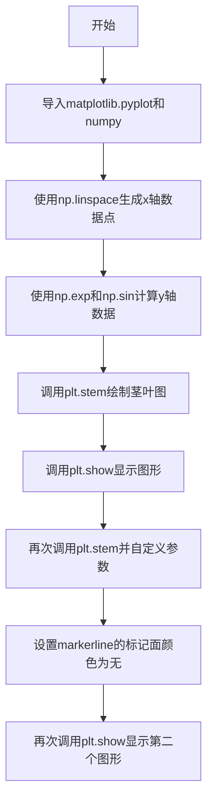
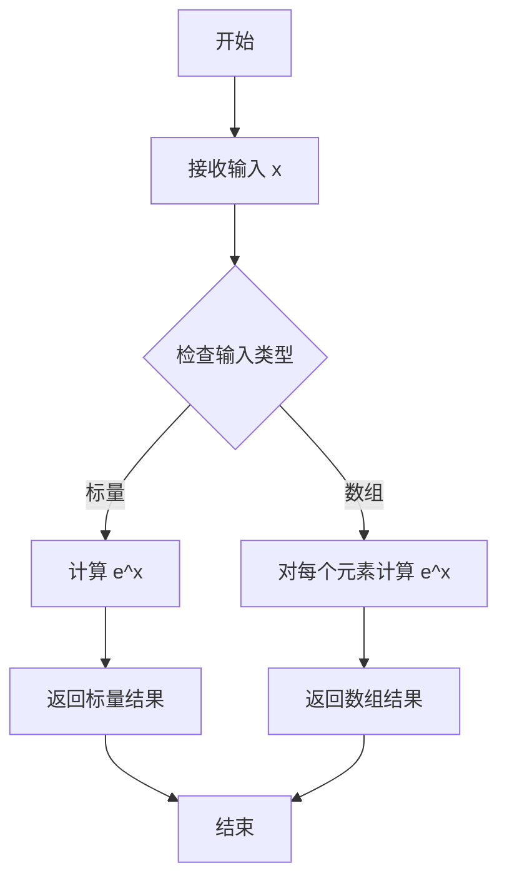
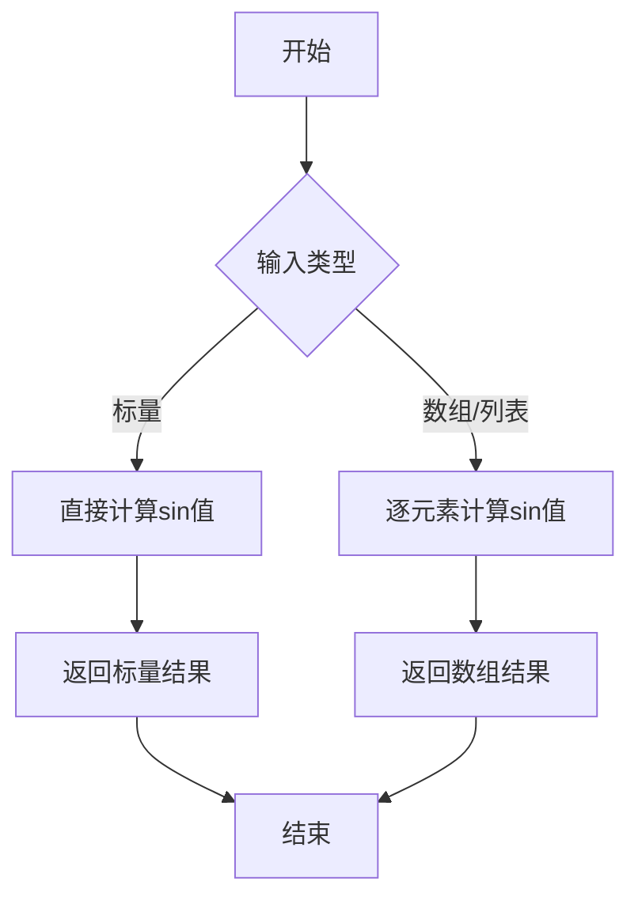
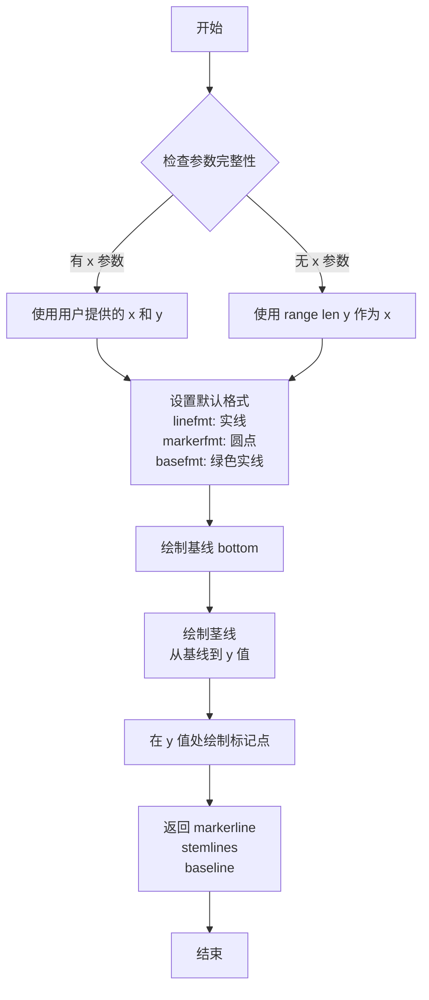
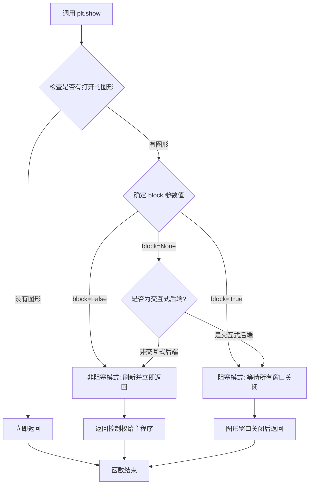
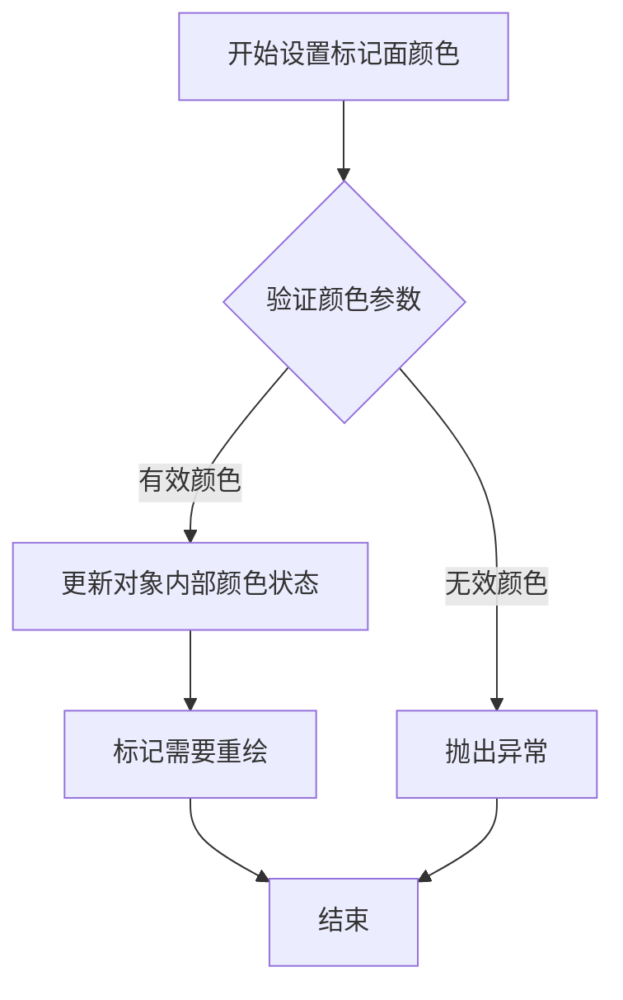

# `matplotlib\galleries\examples\lines_bars_and_markers\stem_plot.py` 详细设计文档

该代码是一个matplotlib茎叶图（stem plot）绘制示例，展示了如何使用plt.stem函数绘制从基线到y坐标的垂直散点线，并在每个顶端放置标记，同时演示了如何自定义线格式、标记格式和基线位置。

## 整体流程



## 类结构

```
无面向对象类结构，为脚本式代码
```

## 全局变量及字段


### `x`
    
x轴数据点数组

类型：`numpy.ndarray`
    


### `y`
    
通过指数和正弦计算得到的y轴数据

类型：`numpy.ndarray`
    


### `markerline`
    
标记线的艺术对象

类型：`Line2D`
    


### `stemlines`
    
茎线的艺术对象

类型：`Line2D`
    


### `baseline`
    
基线的艺术对象

类型：`Line2D`
    


    

## 全局函数及方法


### `np.linspace`

`np.linspace` 是 NumPy 库中的一个函数，用于在指定的间隔内生成等间隔的数值序列，常用于生成测试数据、绘图时的 x 轴坐标等场景。

参数：

- `start`：`float`，序列的起始值
- `stop`：`float`，序列的结束值（当 `endpoint=True` 时包含该值）
- `num`：`int`，要生成的样本数量，默认为 50
- `endpoint`：`bool`，如果为 True，则 stop 是最后一个样本，否则不包含，默认为 True
- `retstep`：`bool`，如果为 True，则返回 (samples, step)，默认为 False
- `dtype`：`dtype`，输出数组的数据类型，如果没有指定，则从 start 和 stop 推断
- `axis`：`int`，当 stop 是数组或 start 是数组时，用于指定结果数组中插入数据的轴

返回值：`ndarray`，返回等间隔的数值序列

#### 流程图

```mermaid
flowchart TD
    A[开始] --> B[验证参数<br>num >= 0<br>dtype 不能是 void]
    B --> C{retstep = True?}
    C -->|Yes| D[计算步长 step<br>step = (stop - start) / (num - 1)]
    C -->|No| E[计算步长 step<br>step = (stop - start) / num]
    D --> F[生成等间隔数组<br>使用 start + step * arange(num)]
    E --> F
    F --> G{axis 参数有效?}
    G -->|Yes| H[沿指定轴重排数组]
    G -->|No| I{retstep = True?}
    H --> I
    I -->|Yes| J[返回数组和步长<br>tuple (samples, step)]
    I -->|No| K[返回数组<br>samples]
    J --> L[结束]
    K --> L
```

#### 带注释源码

```python
def linspace(start, stop, num=50, endpoint=True, retstep=False, dtype=None,
             axis=0):
    """
    返回指定间隔内的等间隔数值序列。
    
    参数:
        start : 序列的起始值
        stop : 序列的结束值
        num : int, 要生成的样本数量，默认为50
        endpoint : bool, 如果为True，stop是最后一个样本，默认为True
        retstep : bool, 如果为True，返回步长，默认为False
        dtype : 输出数组的数据类型
        axis : int, 当输入是数组时，指定结果数组的轴
    
    返回:
        samples : ndarray
            等间隔的数值序列
        step : float (可选)
            仅当retstep=True时返回
    """
    # 验证num参数
    num = operator.index(num)
    if num < 0:
        raise ValueError("Number of samples, %s, must be non-negative" % num)
    
    # 验证dtype
    if dtype is np.dtype('V'):  # void dtype
        raise TypeError("Cannot create a numpy array of void type")
    
    # 计算步长
    if endpoint:
        step = (stop - start) / (num - 1)
    else:
        step = (stop - start) / num
    
    # 生成等间隔数组
    y = _arange_0_to_num(start, step, length=num, dtype=dtype)
    
    # 处理axis参数（当输入是数组时）
    if axis != 0:
        y = _move_axis_to_0(y, axis)
    
    if retstep:
        return y, step
    else:
        return y
```


### `np.exp`

`np.exp` 是 NumPy 库中的指数函数，计算输入数组或标量中每个元素的自然指数值（e^x），返回一个包含计算结果的数组或标量。

参数：

-  `x`：ndarray 或 scalar，输入数组或标量，表示要计算指数的数值
  - 类型：`ndarray` 或 `scalar`（如 `float`、`int`）
  - 描述：输入值，可以是单个数值或 NumPy 数组，函数会对数组中的每个元素分别计算 e^x

返回值：`ndarray` 或 `scalar`，返回输入数组或标量的自然指数值（e^x）

- 类型：`ndarray` 或 `scalar`
- 描述：返回 e 的 x 次方。如果输入是数组，则返回相同形状的数组，其中每个元素是相应输入元素的指数值

#### 流程图



#### 带注释源码

```python
# 使用 np.exp 计算指数函数
y = np.exp(np.sin(x))
# 解释：
# 1. np.sin(x) 首先计算 x 中每个元素的正弦值
# 2. np.exp() 接收 np.sin(x) 的结果作为输入
# 3. 对输入中的每个元素计算自然指数 e^value
# 4. 返回结果存储在变量 y 中
# 
# 例如：如果 x = [0.1, 0.2, 0.3]
# 则 np.sin(x) ≈ [0.0998, 0.1987, 0.2955]
# 最终 y = np.exp([0.0998, 0.1987, 0.2955]) ≈ [1.105, 1.220, 1.344]
```


### `np.sin`

计算输入数组或标量值的正弦值（以弧度为单位）。

参数：

- `x`：`array_like`，输入角度值（弧度制）

返回值：

- `ndarray`，输入角度对应的正弦值

#### 流程图



#### 带注释源码

```python
# np.sin 函数的典型使用方式
import numpy as np

# 示例代码中的实际调用
x = np.linspace(0.1, 2 * np.pi, 41)  # 生成41个角度值（弧度）
y = np.exp(np.sin(x))  # 先计算sin(x)，再计算exp结果

# np.sin 函数的参数说明
# x: array_like - 输入的角度值，单位为弧度
# 返回: ndarray - 与输入形状相同的正弦值数组

# 基本调用示例
result = np.sin(np.pi / 2)  # 返回 1.0
result_array = np.sin([0, np.pi/2, np.pi])  # 返回 [0. 1. 0.]
```


### `plt.stem`

绘制茎叶图（Stem Plot），用于展示数据的变化趋势和分布情况。茎叶图从基线（baseline）向上绘制垂直线段（茎），并在每个线段末端添加标记点，常用于离散数据的可视化。

参数：

- `x`：array-like，可选，x 轴坐标数据。如果未提供，则默认使用 `range(len(y))`。当提供两个参数时，第一个作为 x 坐标，第二个作为 y 坐标。
- `y`：array-like，必需，y 轴坐标数据，表示每个茎叶的高度。
- `linefmt`：str，可选，控制茎线（垂直线）的格式，语法类似于 plot 的格式字符串（如 `'b-'` 表示蓝色实线）。默认值为 `None`，通常显示为蓝色实线。
- `markerfmt`：str，可选，控制标记点的格式，默认值为 `None`，通常显示为圆形。
- `basefmt`：str，可选，控制基线（baseline）的格式，默认值为 `'C2-'`，即绿色实线。
- `bottom`：float 或 array-like，可选，基线的 y 坐标值，默认为 0。对于数组形式的 bottom，可以为每个数据点设置不同的基线。
- `label`：str，可选，图例标签，用于图例显示。
- `data`：可选，关键字参数，用于指定数据对象（如 pandas DataFrame），通过字符串索引访问数据。

返回值：`tuple`，包含三个元素：
- `markerline`：`matplotlib.lines.Line2D`，标记点（marker）的线条对象
- `stemlines`：`matplotlib.collections.LineCollection`，茎线（垂直线）的集合对象
- `baseline`：`matplotlib.lines.Line2D`，基线对象

#### 流程图



#### 带注释源码

```python
import matplotlib.pyplot as plt
import numpy as np

# 示例数据
x = np.linspace(0.1, 2 * np.pi, 41)
y = np.exp(np.sin(x))

# 基础调用：使用默认格式绘制茎叶图
# 默认 bottom=0, linefmt='C0-', markerfmt='C0o', basefmt='C2-'
markerline, stemlines, baseline = plt.stem(x, y)

# 展示图形
plt.show()

# %%
#
# 高级用法：自定义格式和基线位置
# - linefmt='grey': 茎线为灰色
# - markerfmt='D': 标记点为菱形
# - bottom=1.1: 基线位置设为 1.1
markerline, stemlines, baseline = plt.stem(
    x, y, 
    linefmt='grey',      # 茎线格式：灰色
    markerfmt='D',       # 标记格式：菱形
    bottom=1.1           # 基线 y 坐标：1.1
)

# 修改标记点的填充颜色为无（透明）
markerline.set_markerfacecolor('none')

# 展示图形
plt.show()
```

#### 关键组件信息

| 组件名称 | 描述 |
|---------|------|
| `markerline` | Line2D 对象，表示茎叶图顶端的标记点，可通过 `set_markerfacecolor()` 等方法自定义样式 |
| `stemlines` | LineCollection 对象，包含所有茎线的集合，用于批量控制茎线样式 |
| `baseline` | Line2D 对象，表示基线，可通过 `set_linestyle()` 等方法自定义 |

#### 潜在的技术债务或优化空间

1. **格式参数限制**：与 `plt.plot()` 不同，`stem()` 不支持所有关键字参数自定义，用户需要通过返回值对象逐个修改样式，学习成本较高
2. **返回值处理繁琐**：返回三个对象需要用户分别处理，不如直接返回统一的数据结构直观
3. **文档示例不足**：官方示例较少展示如何通过 `stemlines` 批量修改样式

#### 其它说明

- **设计目标**：茎叶图适用于离散数据的可视化，能够清晰展示数据点之间的关系和变化趋势
- **错误处理**：当 x 和 y 长度不一致时，会抛出 ValueError 异常
- **与 plot 的区别**：stem 是专门为离散数据设计的，基线是必须的；而 plot 可以绘制连续曲线
- **外部依赖**：依赖 `matplotlib.pyplot` 和 `numpy`


### `plt.show`

显示所有打开的图形窗口。`plt.show()` 会刷新所有未显示的图形，并将控制权交给交互式窗口管理器（如果有的话）。在阻塞模式下，它会等待所有图形窗口关闭后才返回。

参数：

- `block`：`bool` 或 `None`，可选参数。控制是否阻塞程序执行以等待图形窗口关闭。如果设置为 `True`，程序会阻塞直到所有图形窗口关闭；如果设置为 `False`，则立即返回；如果设置为 `None`（默认值），在交互式后端（如 Qt、Tkinter）下会阻塞，在非交互式后端（如 Agg）下会立即返回。

返回值：`None`，无返回值。

#### 流程图



#### 带注释源码

```python
def show(*, block=None):
    """
    显示所有打开的图形窗口。
    
    此函数会刷新所有待显示的图形，并将控制权交给系统的
    窗口管理器。在阻塞模式下，会等待用户关闭所有图形窗口。
    
    参数:
        block: 布尔值或None
            - True: 阻塞执行直到所有图形窗口关闭
            - False: 非阻塞，刷新图形后立即返回
            - None (默认): 根据后端类型自动决定行为
               交互式后端阻塞，非交互式后端非阻塞
    
    返回值:
        None
    
    示例:
        >>> import matplotlib.pyplot as plt
        >>> plt.plot([1, 2, 3], [4, 5, 6])
        [<matplotlib.lines.Line2D object at 0x...>]
        >>> plt.show()  # 显示图形并阻塞
    """
    # 获取当前图形的后端
    backend = _get_backend()
    
    # 刷新所有待显示的图形（调用 draw_idle 或 draw）
    for figure_manager in _pylab_helpers.Gcf.get_all_fig_managers():
        figure_manager.canvas.draw_idle()
    
    # 根据 block 参数和后端类型决定行为
    if block:
        # 阻塞模式：进入事件循环，等待窗口关闭
        return backend.show()
    elif block is None:
        # 默认行为：检查是否为交互式后端
        if backend in交互式后端列表:
            return backend.show()  # 阻塞
        else:
            return None  # 非阻塞，直接返回
    else:
        # block=False：非阻塞模式
        return None
```


### `Line2D.set_markerfacecolor`

设置折线图中标记面的填充颜色，用于控制标记（如圆形、菱形等）的内部填充样式。

参数：

- `color`：`str` 或 `tuple` 或 `None`，要设置的颜色值，支持颜色名称（如 `'red'`、`'none'`）、RGB/RGBA 元组（如 `(1, 0, 0, 1)`）或 `None`（表示使用默认颜色）
- `alpha`：`float` 或 `None`，可选参数，表示颜色的透明度，范围 0-1

返回值：`None`，无返回值（setter 方法）

#### 流程图



#### 带注释源码

```python
def set_markerfacecolor(self, color):
    """
    Set the marker face color.

    Parameters
    ----------
    color : str or tuple or None
        The color to set. Can be a named color (e.g., 'red'),
        an RGB/RGBA tuple, or None for default color.
        Use 'none' for transparent (no fill).
    """
    # 调用内部方法处理颜色值的解析和设置
    self._set_markercolor('face', color)
    # 标记属性已更改，需要重绘
    self.stale = True

def _set_markercolor(self, attr, color):
    """
    Internal method to set marker colors.
    
    Parameters
    ----------
    attr : str
        The attribute to set ('face' for facecolor, 'edge' for edgecolor)
    color : str or tuple or None
        The color value to set
    """
    # 解析颜色值并存储到内部属性
    if color is None:
        # 使用默认颜色
        self._markeredgecolor = 'auto'
        self._markerfacecolor = 'auto'
    else:
        # 将颜色转换为 RGBA 格式并存储
        color = mcolors.to_rgba(color)
        if attr == 'face':
            self._markerfacecolor = color
        else:
            self._markeredgecolor = color
```

## 关键组件


### plt.stem()

matplotlib的茎叶图（Stem Plot）绑制函数，用于绘制从基准线到y坐标值的垂直线条，并在末端放置标记。该函数接受x坐标数组和y坐标数组作为主要参数，可选参数包括基准线位置(linefmt, markerfmt, basefmt, bottom)等。

### numpy数组 (x, y)

代码中使用numpy的linspace函数生成x轴数据点，范围从0.1到2π共41个点，y值通过指数和正弦函数计算得出。这两个数组作为plt.stem()的输入数据。

### 返回值绑定 (markerline, stemlines, baseline)

plt.stem()函数返回三个对象：markerline（标记线对象）、stemlines（所有茎线组成的集合）、baseline（基准线对象）。通过这些返回对象，用户可以进一步自定义图形的属性，如设置标记面的颜色。

### 格式参数 (linefmt, markerfmt, basefmt)

代码演示了三种格式参数的控制：linefmt控制茎线的颜色/样式（示例中设为'grey'）、markerfmt控制标记的样式（示例中设为'D'即菱形）、basefmt控制基准线的格式。这些参数提供了比标准plot函数更细粒度的格式控制。

### 图形属性设置 (set_markerfacecolor)

通过返回的markerline对象调用set_markerfacecolor('none')方法，可以将标记的填充色设为透明（无填充），这是对已返回图形对象进行自定义修改的典型用法。

### matplotlib.pyplot 命名空间

代码导入的matplotlib.pyplot模块提供了stem()函数和show()函数，是MATLAB风格绘图接口的核心模块，承载了所有基础绘图函数的调用入口。

### np.linspace 数值生成

numpy的linspace函数用于生成等间距的数值序列，在这个示例中用于创建x轴的41个数据点，是数值计算和可视化准备的基础工具。

### np.exp 与 np.sin 数学运算

代码使用了numpy的指数函数(exp)和正弦函数(sin)对数组进行元素级运算，展示了numpy在数学计算方面的向量化操作能力，这些运算结果直接作为y轴数据输入到绘图函数。


## 问题及建议


### 已知问题

- **缺乏输入数据验证**：代码未对 x 和 y 数组进行长度一致性检查，若两者长度不匹配可能导致运行时错误
- **硬编码的魔法数字**：阈值参数如 `41`、`0.1`、`2 * np.pi`、`1.1` 缺乏解释性注释，影响代码可维护性
- **缺少类型注解**：代码中无 Python 类型提示，降低了代码的可读性和 IDE 支持
- **重复调用 plt.show()**：代码中两次调用 `plt.show()`，可考虑合并或明确说明其用途
- **缺乏异常处理**：调用 `plt.stem()` 时未捕获可能出现的异常（如数据格式错误、内存问题等）
- **顶层代码无文档字符串**：作为独立脚本缺少模块级说明
- **matplotlib 版本依赖**：代码假设特定版本的 matplotlib 可用，未进行版本检查或兼容性处理

### 优化建议

- 提取配置参数（如采样点数、角度范围、bottom 值）为具名常量，并添加说明注释
- 在调用 `plt.stem()` 前添加数据验证逻辑，确保 x 和 y 长度一致
- 为顶层脚本添加模块级 docstring，说明脚本功能和用途
- 考虑添加 matplotlib 版本检查，确保 API 兼容性
- 将重复的 `plt.show()` 调用合并，或在注释中说明其必要性（如演示多步骤绘图流程）
- 考虑使用上下文管理器或显式关闭图形对象，提高资源管理效率


## 其它


### 设计目标与约束

本代码旨在演示matplotlib.pyplot.stem函数的基本用法和高级定制功能。设计目标包括：展示stem plot的基本绘制流程、说明基线位置的调整方法、演示格式化参数（linefmt、markerfmt、basefmt）的使用方法，以及展示如何通过返回对象进行高级自定义。约束条件为：代码为演示性质，非生产级应用；依赖matplotlib和numpy两个外部库；仅适用于2D离散数据的可视化展示。

### 错误处理与异常设计

代码本身未包含显式的错误处理逻辑，因为作为演示脚本，主要依赖matplotlib和numpy的内部错误处理机制。可能出现的异常包括：数据维度不匹配异常（当x和y长度不一致时）、类型错误（当传入非数值类型数据时）、以及matplotlib渲染异常。在详细设计文档中应说明这些潜在异常及捕获方式。

### 数据流与状态机

代码的数据流如下：首先通过numpy.linspace生成等间距的x轴数据，然后通过numpy.exp和numpy.sin计算y轴数据，最终调用plt.stem()进行绑制。状态机流程为：数据准备阶段 → 基础绑制阶段 → 格式定制阶段 → 渲染显示阶段。stem函数返回三个对象（markerline、stemlines、baseline），分别对应标记线、茎线和基线的艺术对象，可用于后续自定义修改。

### 外部依赖与接口契约

本代码依赖两个外部包：numpy（提供数值计算功能，至少需要numpy 1.x版本）和matplotlib（提供绑图功能，至少需要matplotlib 3.x版本）。核心接口为matplotlib.pyplot.stem函数，其接口契约为：接受x轴数据（数组-like）、y轴数据（数组-like）以及可选的bottom、linefmt、markerfmt、basefmt参数，返回值为三个Line2D对象的元组。

### 性能考虑

代码本身的性能开销主要来自numpy的数值计算和matplotlib的渲染过程。对于大规模数据集，stem plot可能面临性能瓶颈，因为每个数据点都需要绘制独立的垂直线。优化方向包括：使用更高效的渲染后端、对大量数据点进行采样绑制、或考虑使用其他更适合大数据集的绑图类型。

### 安全性考虑

本代码为本地演示脚本，不涉及网络通信、用户输入处理或敏感数据访问，安全性风险较低。唯一的潜在安全点在于如果x和y数据来源于不可信的外部输入，可能存在缓冲区溢出风险，但matplotlib已有适当的输入验证机制。

### 兼容性考虑

代码需要Python 3.x环境运行。在matplotlib方面，不同版本之间可能存在API差异，特别是stem函数的参数名称和默认值在不同版本间可能有变化。建议在详细设计文档中注明测试通过的matplotlib版本范围（如3.5.0及以上版本）。

### 使用示例和用例

stem plot适用于以下场景：展示离散数据点的分布、比较多个离散序列、呈现周期性或振荡数据、显示信号处理结果等。本代码提供了两个典型用例：基础绑制（展示指数正弦函数的形态）和自定义格式绑制（使用菱形标记、灰色线条和调整后的基线位置）。

### 配置参数说明

代码中使用的关键配置参数包括：x数据（np.linspace生成的41个点，范围0.1到2π）、y数据（exp(sin(x))计算结果）、bottom参数（基线位置，默认为0，可设置为1.1）、linefmt参数（线条格式，代码中使用'grey'灰色）、markerfmt参数（标记格式，代码中使用'D'菱形标记）、basefmt参数（基线格式）。

    