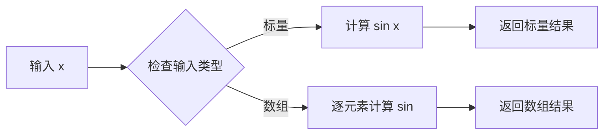
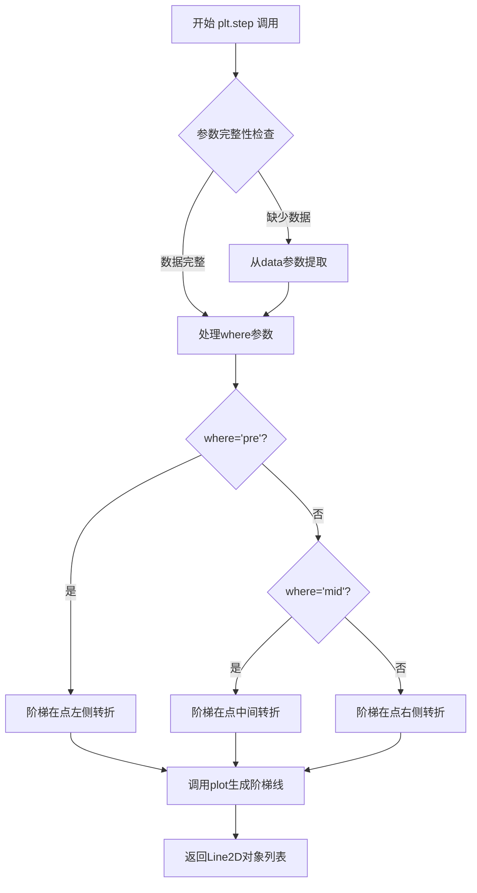
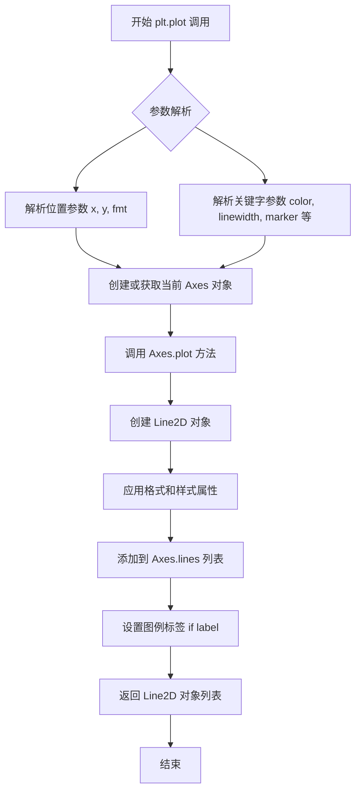
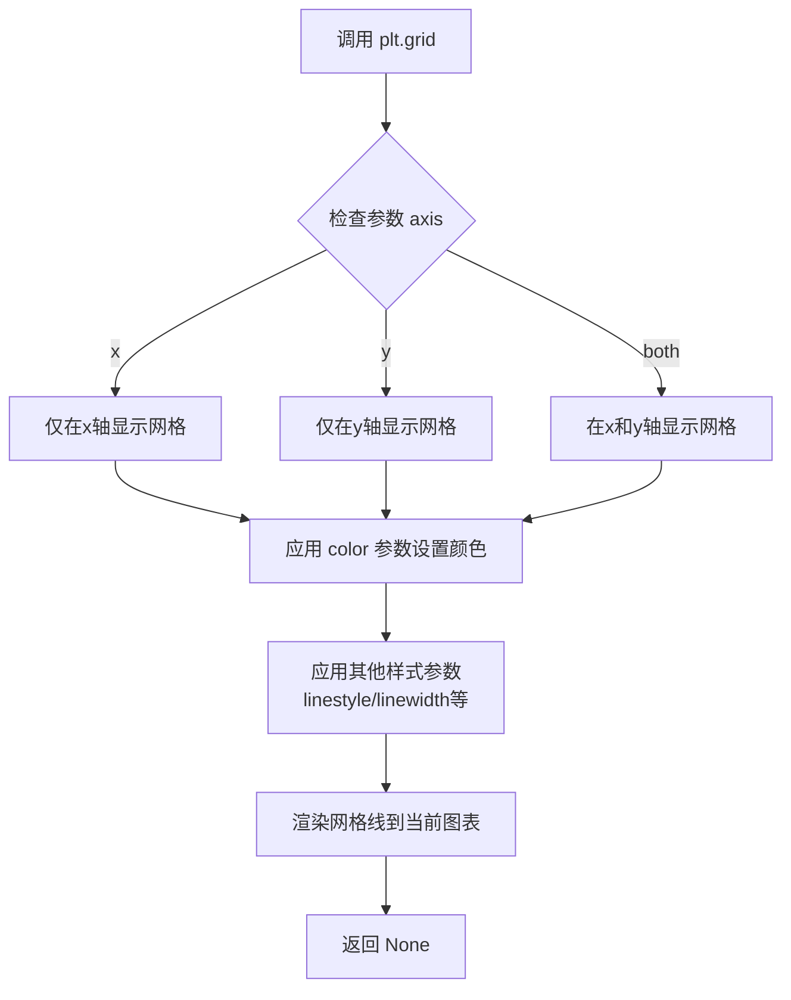
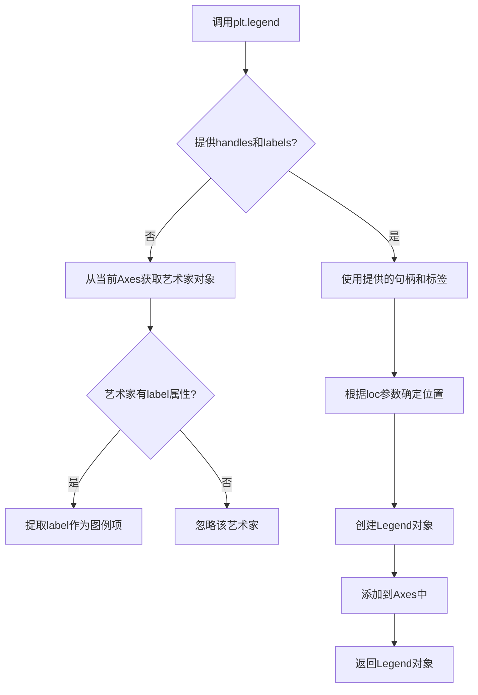
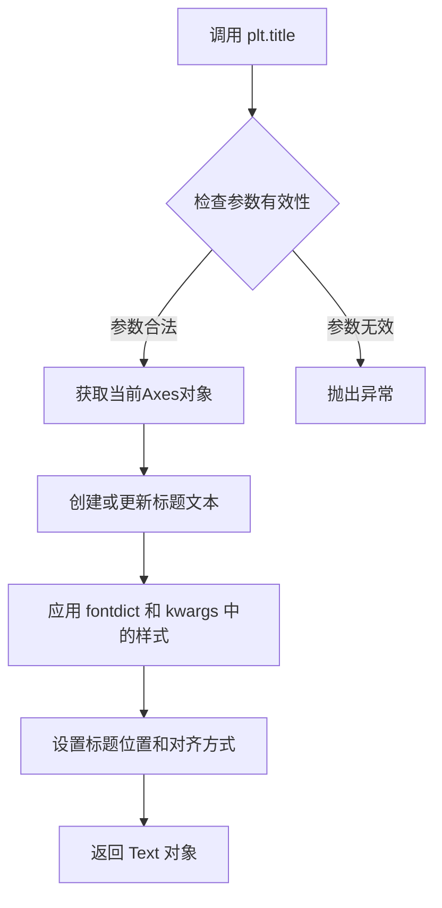
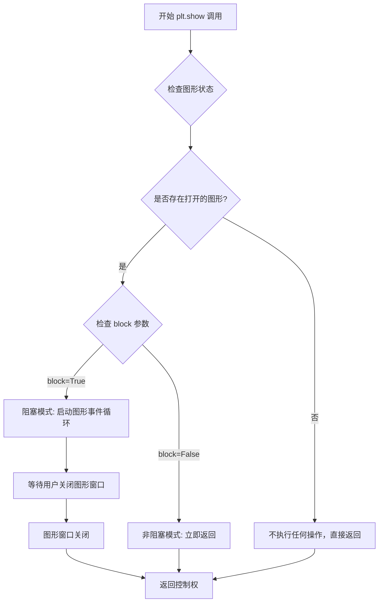

# `matplotlib\galleries\examples\lines_bars_and_markers\step_demo.py` 详细设计文档

这是一个matplotlib示例脚本，演示如何使用plt.step函数绘制阶梯图，展示了where参数（pre/mid/post）对阶梯位置的影响，以及如何通过plot函数的drawstyle参数实现相同效果。

## 整体流程

```mermaid
graph TD
    A[开始] --> B[导入matplotlib.pyplot和numpy]
    B --> C[创建数据: x = np.arange(14), y = np.sin(x/2)]
    C --> D[使用plt.step绘制三条阶梯线]
    D --> E[添加圆点标记显示实际数据点]
    E --> F[设置网格和图例]
    F --> G[显示第一张图: plt.step(where=...)]
    G --> H[使用plt.plot + drawstyle参数绘制阶梯线]
    H --> I[添加圆点标记]
    I --> J[设置网格和图例]
    J --> K[显示第二张图: plt.plot(drawstyle=...)]
    K --> L[结束]
```

## 类结构

```
该脚本为非面向对象代码，无类定义
直接使用matplotlib.pyplot和numpy模块的函数
```

## 全局变量及字段


### `x`
    
从0到13的整数数组

类型：`np.ndarray`
    


### `y`
    
对x/2取正弦的结果数组

类型：`np.ndarray`
    


    

## 全局函数及方法


### `np.arange`

**描述**  
`np.arange` 是 NumPy 库中的一个核心函数，用于在给定的起始值、终止值（不含）和步长之间生成等间距的数值序列，并返回包含该序列的 `ndarray`。当仅提供一个参数时，该参数充当 `stop`，起始值默认为 0。

---

#### 参数

- **`start`**：`数值类型`（`int`、`float` 等），可选，序列的起始值，默认为 `0`。当 `stop` 省略时，`start` 作为 `stop`，实际区间为 `[0, start)`。
- **`stop`**：`数值类型`（必填），序列的终止值（不包含）。
- **`step`**：`数值类型`，可选，序列中相邻两个元素的间隔，默认为 `1`。如果 `step` 为负数，则生成递减序列。
- **`dtype`**：`dtype`，可选，输出数组的数据类型。默认为 `None`，表示根据 `start`、`stop`、`step` 的数值类型自动推断。

---

#### 返回值

- **`ndarray`**：包含等差数列的数组。其长度由 `ceil((stop - start) / step)` 决定，数据类型由 `dtype` 指定或自动推断。

---

#### 流程图

```mermaid
flowchart TD
    A[输入参数: start, stop, step, dtype] --> B{stop 是否为 None?}
    B -- 是 --> C[将 start 当作 stop，start 设为 0]
    B -- 否 --> D[保持原参数]
    C --> E[计算元素个数: num = ceil((stop - start) / step)]
    D --> E
    E --> F[创建长度为 num、dtype 的空数组]
    F --> G[循环填充数组: arr[i] = start + i * step]
    G --> H[返回数组 arr]
```

---

#### 带注释源码

下面的代码展示了一个简化版的 `np.arange` 实现（实际 NumPy 底层采用 C 实现以获得更高性能），并在关键步骤上提供了中文注释：

```python
import math
import numpy as np

def arange(start=0, stop=None, step=1, dtype=None):
    """
    生成等间距的数值序列并返回 NumPy 数组。

    参数
    ----------
    start : 数值类型, optional
        序列起始值，默认为 0。当 stop 为 None 时，start 视为 stop，
        实际区间为 [0, start)。
    stop : 数值类型
        序列结束值（不包含）。
    step : 数值类型, optional
        相邻元素之间的间距，默认为 1。若为负数，则生成递减序列。
    dtype : dtype, optional
        输出数组的数据类型。若为 None，则根据输入参数自动推断。

    返回值
    -------
    out : ndarray
        包含等差数列的数组。
    """
    # 1. 处理只有一位参数的情况：arange(stop)
    if stop is None:
        stop = start
        start = 0

    # 2. 计算需要生成的元素个数
    #    使用 math.ceil 向上取整，确保不遗漏最后一个元素
    num = math.ceil((stop - start) / step)

    # 3. 若未显式指定 dtype，则根据 start、stop、step 的类型自动推断
    if dtype is None:
        # 这里的推断规则与 NumPy 保持一致：优先使用整数类型（若全是整数）
        # 否则使用浮点数类型
        if isinstance(start, int) and isinstance(stop, int) and isinstance(step, int):
            dtype = int
        else:
            dtype = float

    # 4. 创建指定长度和 dtype 的空数组
    out = np.empty(num, dtype=dtype)

    # 5. 手动填充数组（实际实现会使用向量化或 C 级循环提升性能）
    for i in range(num):
        out[i] = start + i * step

    return out


# 示例
if __name__ == "__main__":
    # 产生 0 到 13 的整数序列
    print(arange(14))               # [0 1 2 ... 13]

    # 产生 2 到 10，步长为 2 的序列
    print(arange(2, 11, 2))         # [2 4 6 8 10]

    # 产生 10 到 0，步长为 -2 的递减序列
    print(arange(10, 0, -2))        # [10  8  6  4  2]
```

> **说明**  
> - 上述实现仅用于演示核心逻辑；生产环境请直接使用 `np.arange`，因为它在 C 层实现，能够处理大规模数组并保持极高性能。  
> - `np.arange` 的行为与 Python 内置 `range` 类似，但返回的是 NumPy 数组，支持向量化运算。  

---


### np.sin

该函数是 NumPy 库中的三角函数，用于计算输入数组或标量中每个元素的正弦值（以弧度为单位）。

参数：

- `x`：`array_like`，输入角度（以弧度为单位），可以是标量、列表或 NumPy 数组

返回值：`ndarray 或 scalar`，返回输入值的正弦值，类型与输入相同

#### 流程图



#### 带注释源码

```python
import numpy as np  # 导入 NumPy 库

x = np.arange(14)  # 创建 0 到 13 的整数数组
y = np.sin(x / 2)  # 计算数组 x/2 的正弦值
# 注释：x / 2 将角度从整数转换为弧度
# np.sin 对数组中的每个元素分别计算正弦值
# 结果存储在数组 y 中
```


### `plt.step`

`plt.step`是matplotlib.pyplot库中的函数，用于绘制阶梯图（step plot），即以阶梯形式展示数据点的变化，特别适合表示离散数据或区间数据。该函数允许通过`where`参数控制阶梯的转折点位置（'pre'、'mid'或'post'）。

参数：

- `x`：`array_like`，X轴数据点
- `y`：`array_like`，Y轴数据点
- `where`：`{'pre', 'mid', 'post'}`，可选，默认为'pre'，控制阶梯转折点的位置
- `data`：`indexable object`，可选，可通过数据名称指定坐标
- `**kwargs`：关键字参数，传递给`matplotlib.axes.Axes.plot`函数，用于自定义线条外观

返回值：`list of matplotlib.lines.Line2D`，返回创建的Line2D对象列表

#### 流程图



#### 带注释源码

```python
# 注意：这是基于matplotlib plt.step的调用示例源码
# 实际实现位于matplotlib库中

# 示例1：默认where='pre'（阶梯在点左侧转折）
plt.step(x, y + 2, label='pre (default)')
# x: 数据点x坐标
# y + 2: 数据点y坐标（偏移2个单位）
# label: 图例标签

# 示例2：where='mid'（阶梯在点中间转折）
plt.step(x, y + 1, where='mid', label='mid')
# where='mid': 阶梯转折点位于数据点之间

# 示例3：where='post'（阶梯在点右侧转折）
plt.step(x, y, where='post', label='post')
# where='post': 阶梯在点右侧转折

# 补充说明：如何通过drawstyle实现相同效果
plt.plot(x, y + 2, drawstyle='steps', label='steps (=steps-pre)')
# drawstyle='steps' 等同于 where='pre'

plt.plot(x, y + 1, drawstyle='steps-mid', label='steps-mid')
# drawstyle='steps-mid' 等同于 where='mid'

plt.plot(x, y, drawstyle='steps-post', label='steps-post')
# drawstyle='steps-post' 等同于 where='post'
```


### plt.plot

绘制普通折线图（也支持散点图、阶梯图等），是 matplotlib 中最基础且功能最强大的绘图函数之一。通过格式字符串或关键字参数，可以灵活控制线条颜色、样式、标记等属性。

参数：

- `*args`：可变位置参数，支持多种调用方式：
  - `plt.plot(y)`：仅传入 y 轴数据，自动生成 x 轴索引
  - `plt.plot(x, y)`：分别传入 x 和 y 轴数据
  - `plt.plot(x, y, format_string)`：可加格式字符串（如 `'o--'` 表示圆点虚线）
- `x`：`array_like`，可选，x 轴数据，默认值为 range(len(y))
- `y`：`array_like`，必填，y 轴数据
- `fmt`：`str`，可选，格式字符串，组合颜色、标记和线型（如 `'ro-'` 表示红色圆点实线）
- `color`：`str` 或 `tuple`，可选，颜色名称或 RGB/RGBA 元组
- `linewidth`：`float`，可选，线条宽度，默认 rcParams 中定义
- `linestyle` 或 `ls`：`str`，可选，线型（`'-'` 实线，`'--'` 虚线，`'-.'` 点划线，`':'` 点线）
- `marker`：`str`，可选，标记样式（如 `'o'` 圆点，`'s'` 方形，`'^'` 三角形）
- `markersize` 或 `ms`：`float`，可选，标记大小
- `markerfacecolor` 或 `mfc`：`str`，可选，标记填充颜色
- `markeredgecolor` 或 `mec`：`str`，可选，标记边缘颜色
- `label`：`str`，可选，图例中显示的标签
- `alpha`：`float`，可选，透明度，范围 0-1
- `antialiased` 或 `aa`：`bool`，可选，是否抗锯齿
- `clip_box`：`Bbox`，可选，剪辑框
- `clip_on`：`bool`，可选，是否启用剪辑
- `dash_capstyle`：`str`，可选，虚线端点样式
- `dash_joinstyle`：`str`，可选，虚线连接样式
- `drawstyle` 或 `ds`：`str`，可选，绘制样式（`'default'`、`'steps'`、`'steps-pre'`、`'steps-mid'`、`'steps-post'`）
- `fillstyle`：`str`，可选，填充样式
- `gid`：`str`，可选，组 ID
- `in_layout`：`bool`，可选，是否纳入布局计算
- `label`：`str`，图例标签
- `lod`：`bool`，可选，是否启用细节层次渲染
- `markeredgewidth` 或 `mew`：`float`，可选，标记边缘宽度
- `pickable`：`bool`，可选，是否可选择
- `pickradius`：`float`，可选，选择半径
- `rasterized`：`bool`，可选，是否栅格化
- `sketch_params`：`dict`，可选，草图参数
- `snap`：`bool` 或 `None`，可选，对齐到像素网格
- `solid_capstyle`：`str`，可选，实线端点样式
- `solid_joinstyle`：`str`，可选，实线连接样式
- `url`：`str`，可选，元素 URL
- `visible` 或 `visible`：`bool`，可选，是否可见
- `zorder`：`float`，可选，绘制顺序

返回值：`list of matplotlib.lines.Line2D`，返回创建的 Line2D 对象列表（通常为单元素列表），包含线条的所有属性，可用于后续修改

#### 流程图



#### 带注释源码

```python
# plt.plot 函数源码位于 matplotlib/pyplot.py 中
# 这是一个简化的调用流程注释

def plot(*args, **kwargs):
    """
    绘制 y 对 x 的线图或标记
    
    调用方式:
    - plot(y)                  # 单参数，y 为数据
    - plot(x, y)               # 双参数，x, y 为数据
    - plot(x, y, format_string)  # 可选格式字符串
    """
    
    # 1. 获取全局图形对象（如不存在则创建）
    gcf().add_subplot(111, projection='gca')  # 简化的投影获取
    
    # 2. 将参数传递给当前 Axes 对象的 plot 方法
    return gca().plot(*args, **kwargs)

# 实际的 Axes.plot 方法核心逻辑（简化）:
def plot(self, *args, **kwargs):
    """
    Axes 类的 plot 方法核心流程:
    """
    
    # 解析参数：分离出格式字符串
    lines = []
    extra_args = ()
    
    # 处理 'o--' 这样的格式字符串
    if len(args) > 0 and isinstance(args[-1], str):
        fmt = args[-1]
        args = args[:-1]  # 格式字符串不传给 Line2D
    else:
        fmt = ''
    
    # 2. 创建 Line2D 对象
    line = Line2D(
        xdata, ydata,           # x 和 y 数据
        linewidth=linewidth,    # 线宽
        linestyle=linestyle,    # 线型
        color=color,            # 颜色
        marker=marker,          # 标记样式
        markersize=markersize,  # 标记大小
        **kwargs
    )
    
    # 3. 应用格式字符串解析的结果
    # 例如 'ro-' 表示红色(red) 圆点(o) 实线(-)
    line.set_color(fg_color)    # 设置颜色
    line.set_marker(marker)    # 设置标记
    line.set_linestyle(ls)     # 设置线型
    
    # 4. 将 Line2D 添加到 Axes
    self.lines.append(line)
    
    # 5. 更新数据限制（xlim, ylim）
    self.relim()
    self.autoscale_view()
    
    # 6. 返回 Line2D 对象列表
    return [line]

# Line2D 类的关键属性:
# - xdata, ydata: 数据点
# - color, linewidth, linestyle: 外观属性
# - marker, markersize: 标记属性
# - label: 图例标签
# - zorder: 绘制顺序
# - visible: 可见性
```


### plt.grid

该函数用于配置图表的网格线（grid lines），可以控制网格线的显示、样式、颜色以及针对哪个坐标轴（x轴、y轴或两者）。

参数：

- `axis`：`str`，指定在哪个轴上显示网格线，可选值为 `'x'`、`'y'` 或 `'both'`（默认值为 `'both'`）
- `color`：`str`，设置网格线的颜色，可以是颜色名称、十六进制颜色码或灰度值（如 `'0.95'` 表示浅灰色）
- `b`：`bool` 或 `None`，（可选）是否显示网格线，默认为 `None`（切换显示状态）
- `which`：`str`，（可选）控制显示哪类网格线，可选值为 `'major'`、`'minor'` 或 `'both'`，默认为 `'major'`
- `linestyle` 或 `ls`：`str`，（可选）设置网格线的线型，如 `'-'`、`'--'`、`'-.'`、`':'`
- `linewidth` 或 `lw`：`float`，（可选）设置网格线的线宽

返回值：`None`，该函数直接作用于当前 axes 对象，无返回值

#### 流程图



#### 带注释源码

```python
# 调用 plt.grid 函数设置网格线
# 参数说明：
#   axis='x'   -> 仅在x轴显示网格线（垂直线）
#   color='0.95' -> 设置网格线颜色为浅灰色（接近白色的灰度值）
plt.grid(axis='x', color='0.95')

# 完整函数签名参考（matplotlib.pyplot.grid）：
# def grid(b=True, which='major', axis='both', **kwargs)
#
# b: bool|None - 是否显示网格线，None表示切换当前状态
# which: str   - 'major'(主刻度), 'minor'(次刻度), 'both'
# axis: str    - 'x', 'y', 'both'  # 当前代码使用此参数
# **kwargs: 其他传递给 matplotlib.lines.Line2D 的参数
#           如 color, linestyle, linewidth, alpha 等
#           # 当前代码使用 color 参数
```


### `plt.legend`

向当前Axes添加图例，用于标识数据系列的标签。

参数：

- `handles`：`list of Artist, optional`，图例句柄列表，包含要显示在图例中的图形元素
- `labels`：`list of str, optional`，图例标签列表，与handles对应
- `loc`：`str or int, optional`，图例位置，如'best'、'upper right'、'lower left'等
- `bbox_to_anchor`：`tuple, optional`，边界框锚点，用于更精细的位置控制
- `ncol`：`int, optional`，图例列数
- `title`：`str, optional`，图例标题
- `fontsize`：`int or str, optional`，字体大小
- `frameon`：`bool, optional`，是否显示图例边框
- `framealpha`：`float, optional`，图例背景透明度

返回值：`matplotlib.legend.Legend`，返回创建的Legend对象，可用于后续的图例定制

#### 流程图



#### 带注释源码

```python
# 调用方式1：使用title参数设置图例标题
plt.legend(title='Parameter where:')
# 等效于：
# legend = plt.legend()
# legend.set_title('Parameter where:')

# 调用方式2：自定义图例项和标签
line1, = plt.plot(x, y1, label='Data 1')
line2, = plt.plot(x, y2, label='Data 2')
plt.legend(handles=[line1, line2], labels=['Label 1', 'Label 2'], loc='upper right')

# 调用方式3：设置多列图例
plt.legend(title='Legend', ncol=2, fontsize='small')

# 调用方式4：使用bbox_to_anchor精确定位
plt.legend(title='Legend', bbox_to_anchor=(1.05, 1), loc='upper left')

# 返回值可以用于后续定制
legend = plt.legend(title='My Legend')
legend.get_title().set_fontsize('12')  # 设置标题字体大小
```


### plt.title

设置当前Axes对象的标题文本

参数：

- `s`：`str`，要显示的标题文本
- `fontdict`：可选参数，用于设置标题的字体属性字典（如 fontsize, fontweight, color 等）
- `loc`：可选参数，标题对齐方式，可选值为 'left'、'center'（默认）、'right'
- `pad`：可选参数，标题与图表顶部边缘之间的间距（以点为单位）
- `y`：可选参数，标题在 Axes 内的相对垂直位置（0-1 之间）
- `**kwargs`：可选关键字参数，用于设置文本的其他属性

返回值：`Text`，返回创建的标题文本对象，可以用于后续的样式修改

#### 流程图



#### 带注释源码

```python
# plt.title 函数源码注释（matplotlib源码结构）

def title(self, label, fontdict=None, loc=None, pad=None, *, y=None, **kwargs):
    """
    设置 Axes 的标题
    
    参数:
        label (str): 标题文本内容
        fontdict (dict, optional): 字体属性字典，如 {'fontsize': 12, 'fontweight': 'bold'}
        loc (str, optional): 对齐方式，可选 'left', 'center', 'right'，默认 'center'
        pad (float, optional): 标题与顶部边距的距离（ points 为单位）
        y (float, optional): 标题的 y 轴相对位置（0-1）
        **kwargs: 其他 matplotlib text 属性
    
    返回:
        matplotlib.text.Text: 返回创建的文本对象
    
    示例:
        plt.title('My Plot Title')  # 简单用法
        plt.title('Title', fontdict={'fontsize': 14, 'fontweight': 'bold'})
        plt.title('Left Title', loc='left')  # 左对齐
    """
    # 获取当前 Axes 对象
    ax = self.gca()
    
    # 创建标题文本对象，设置初始文本
    title = ax.set_title(label, fontdict=fontdict, loc=loc, pad=pad, y=y, **kwargs)
    
    # 返回 Text 对象以便后续操作
    return title
```

#### 在示例代码中的使用

```python
# 第一次使用 plt.title
plt.title('plt.step(where=...)')
# 设置第一个图表的标题为 'plt.step(where=...)'

# 第二次使用 plt.title  
plt.title('plt.plot(drawstyle=...)')
# 设置第二个图表的标题为 'plt.plot(drawstyle=...)'
```

#### 补充信息

- **设计目标**：提供简单易用的接口来设置图表标题
- **错误处理**：当 label 不是字符串时会抛出 TypeError
- **外部依赖**：matplotlib 库
- **注意事项**：
  - 调用 `plt.title()` 会设置当前活跃 Axes 的标题
  - 如果需要更精细的控制，可以使用返回的 Text 对象进行修改
  - 在子图系统中，每个 Axes 都可以有独立的标题


### `plt.show`

`plt.show` 是 Matplotlib 库中的一个核心函数，用于显示当前所有打开的图形窗口，并将图形渲染到屏幕或交互式后端。该函数会阻塞程序执行（默认行为），直到用户关闭所有显示的图形窗口，或者在非阻塞模式下立即返回控制权。

参数：

- `block`：`bool`，可选参数，默认值为 `True`。当设置为 `True` 时，函数会阻塞调用线程，直到图形窗口关闭；当设置为 `False` 时，函数会立即返回，允许程序继续执行。

返回值：`None`，该函数不返回任何值。

#### 流程图



#### 带注释源码

```python
def show(*, block=True):
    """
    显示所有打开的图形窗口。
    
    该函数会刷新所有待渲染的图形，并将它们显示在屏幕上。
    在默认的阻塞模式下，它会启动图形后端的事件循环，
    阻止程序退出，直到用户关闭所有图形窗口。
    
    Parameters
    ----------
    block : bool, optional
        如果为 True（默认值），则阻塞程序直到所有图形窗口关闭。
        如果为 False，则立即返回，允许程序继续执行，
        图形窗口仍保持显示状态。
    
    Returns
    -------
    None
    
    Examples
    --------
    基本的图形显示：
    
    >>> import matplotlib.pyplot as plt
    >>> plt.plot([1, 2, 3], [4, 5, 6])
    >>> plt.show()  # 显示图形并阻塞
    
    非阻塞模式显示：
    
    >>> plt.show(block=False)  # 立即返回，图形保持显示
    """
    # 获取当前活动的事件循环管理器
    global _showblocks
    _showblocks = block
    
    # 遍历所有打开的图形并显示它们
    for manager in Gcf.get_all_fig_managers():
        # 尝试显示每个图形管理器
        # 如果后端支持，会触发图形窗口的显示
        manager.show()
    
    # 根据 block 参数决定是否阻塞
    if block:
        # 阻塞模式：启动事件循环并等待图形关闭
        # 这通常会调用后端的 mainloop
        _on_screen_show()
    else:
        # 非阻塞模式：立即返回，图形继续显示
        # 适用于交互式环境如 Jupyter Notebook
        pass
    
    # 清理：重置全局状态
    _showblocks = None
    return None


def _on_screen_show():
    """
    内部函数：处理阻塞模式下的屏幕显示。
    
    会根据当前配置的图形后端启动相应的事件循环，
    常见的 backend 如 Qt、Tkinter、GTK 等。
    """
    # 获取当前后端
    backend = matplotlib.get_backend()
    
    # 根据后端类型启动合适的 GUI 事件循环
    if 'Qt' in backend:
        # Qt 后端使用 QApplication.exec_()
        from matplotlib.backends.qt_compat import QtWidgets
        QtWidgets.QApplication.instance().exec_()
    elif 'Tk' in backend:
        # Tkinter 后端使用 mainloop()
        import tkinter as tk
        tk.mainloop()
    # ... 其他后端的处理类似
    
    # 等待所有窗口关闭后返回
    pass
```

#### 关键组件信息

| 组件名称 | 一句话描述 |
|---------|-----------|
| `matplotlib.pyplot` | Matplotlib 的 MATLAB 风格绘图接口模块，提供便捷的绘图函数 |
| `FigureManager` | 图形管理器类，负责管理单个图形窗口的生命周期和显示 |
| `backend` | 图形后端，负责实际的窗口渲染和事件处理 |
| `Gcf` | 全局图形注册表（Get Current Figure），管理所有打开的图形实例 |

#### 潜在的技术债务或优化空间

1. **后端兼容性处理**：不同后端的显示逻辑分散在多个地方，缺乏统一的抽象层，导致维护困难。
2. **阻塞机制的实现**：当前实现对不同后端的阻塞方式差异较大，可能导致某些后端的行为不一致。
3. **事件循环管理**：在非阻塞模式下，程序退出时可能没有正确清理图形窗口，导致资源泄漏。
4. **文档和错误处理**：某些后端特定的错误信息不够清晰，用户难以诊断显示问题。

#### 其它项目

**设计目标与约束：**
- 目标：提供一个统一的接口来显示所有图形，无论使用何种后端
- 约束：必须与各种 GUI 框架（Qt、Tkinter、GTK 等）兼容

**错误处理与异常设计：**
- 如果没有打开的图形，函数静默返回，不抛出异常
- 如果后端初始化失败，可能抛出 `ImportError` 或后端特定的异常

**数据流与状态机：**
- `plt.show()` 读取全局图形注册表（Gcf）中的图形列表
- 状态从"待显示"转换为"显示中"，最后在窗口关闭后转换为"已关闭"

**外部依赖与接口契约：**
- 依赖具体的后端实现（如 Qt、Tkinter、GTK）
- 公开接口稳定，内部实现可能随版本变化


## 关键组件


### plt.step

用于绘制分段常数曲线（阶梯图）的函数，支持通过`where`参数控制阶梯的位置（pre、mid、post）。

### plt.plot

用于绘制普通线图的函数，支持通过`drawstyle`参数实现与`plt.step`相同的阶梯效果。

### where 参数

控制阶梯图步进位置的参数，可选值为'pre'（默认）、'mid'和'post'，决定数据点在阶梯中的相对位置。

### drawstyle 参数

控制普通线图绘制风格的参数，可选值包括'steps'、'steps-mid'和'steps-post'，用于实现阶梯图的绘制效果。

### np.arange

用于生成示例数据的函数，创建从0到13的整数数组作为x轴数据。

### np.sin

用于生成示例数据的函数，创建基于x/2的正弦值作为y轴数据。

### plt.grid

用于添加网格线的函数，通过`axis`参数指定只显示x轴方向的网格。

### plt.legend

用于添加图例的函数，展示不同曲线对应的标签信息。

### plt.title

用于设置图表标题的函数。


## 问题及建议


### 已知问题

-   **代码重复**：绘制step曲线和对应数据点的模式重复了3次（pre、mid、post），包含相同的`plt.plot(x, y + n, 'o--', color='grey', alpha=0.3)`调用，造成代码冗余。
-   **魔法数字和硬编码**：颜色值`'grey'`、透明度`0.3`、加法偏移`2`、`1`等数值散布在代码中，缺乏常量定义，降低了可维护性。
-   **数据生成与渲染未分离**：`x`和`y`的计算与绘图代码混合在一起，违反了关注点分离原则。
-   **全局变量污染**：数据数组`x`和`y`作为全局变量定义，未封装到函数作用域内。
-   **缺少函数封装**：整个脚本是线性执行流程，没有抽象成可复用的函数或类。
-   **重复的图表配置代码**：两个`show()`之前的`plt.grid()`、`plt.legend()`、`plt.title()`调用存在重复。

### 优化建议

-   **提取数据生成函数**：将`x`和`y`的生成逻辑封装到独立函数中，提高可测试性。
-   **创建绘图辅助函数**：定义如`plot_step_with_markers(x, y, offset, label, where)`的辅助函数，消除代码重复。
-   **使用配置字典或常量**：将颜色、透明度、偏移量等硬编码值提取为命名常量或配置字典。
-   **重构为面向对象方式**：考虑使用`matplotlib.figure.Figure`和`matplotlib.axes.Axes`对象进行封装，使代码更易于测试和复用。
-   **提取公共配置**：将`grid`、`legend`、`title`等通用配置封装为配置函数或方法。
-   **添加类型提示和文档字符串**：为函数参数添加类型注解和详细文档，提高代码可读性和IDE支持。
-   **考虑参数化**：使用pytest或unittest参数化方式，将不同场景（pre/mid/post）作为测试用例而非重复代码。


## 其它


### 设计目标与约束

本代码为Matplotlib示例演示文件，主要目标是展示`plt.step`函数在不同`where`参数（pre/mid/post）下的阶梯图绘制效果，以及通过`drawstyle`参数实现相同功能的方式。代码为教学性质，不涉及生产级错误处理和复杂业务逻辑，运行环境需支持图形界面显示。

### 错误处理与异常设计

由于本代码为示例演示性质，错误处理较为简单：
- **导入错误**：若matplotlib或numpy未安装将抛出`ModuleNotFoundError`
- **图形显示错误**：在无图形界面环境（如部分服务器环境）运行时，`plt.show()`可能无法显示图形
- **数据输入错误**：假设输入数据为合法numpy数组，未进行显式类型检查

### 数据流与状态机

代码为线性执行流程，无复杂状态机：
1. 导入matplotlib.pyplot和numpy模块
2. 生成示例数据：x为0-13的整数序列，y为sin(x/2)的计算结果
3. 第一组图表：分别使用pre、mid、post三种where参数绘制阶梯图
4. 第二组图表：分别使用steps、steps-mid、steps-post三种drawstyle绘制相同效果
5. 调用plt.show()显示图形

### 外部依赖与接口契约

本代码依赖以下外部库：
- **matplotlib.pyplot**：图形绘制库，提供step()、plot()、show()等函数
- **numpy**：数值计算库，提供arange()和sin()函数

关键接口契约：
- `plt.step(x, y, where=...)`：接收x坐标数组、y坐标数组和where参数，返回Step艺术家对象
- `plt.plot(x, y, ...)`：接收x、y坐标数组及可选样式的绘图函数，返回线条艺术家对象列表

### 性能考虑与资源消耗

本代码为轻量级演示，资源消耗主要来自：
- 图形渲染开销：每次plt.show()调用会创建新的图形窗口
- 内存占用：存储x和y数组，尺寸较小（14个数据点）
- 无长期运行的后台进程

### 跨平台兼容性

代码依赖Python标准库和主流科学计算库：
- Windows、Linux、macOS三大主流操作系统均可运行
- 需要安装Python 3.x、matplotlib、numpy
- 图形显示功能在支持X11/Wayland/Quartz的系统上正常工作

### 代码可维护性与扩展性

当前代码结构简单，维护性良好。扩展方向包括：
- 可通过循环简化重复的绘图代码
- 可将数据生成和绘图逻辑封装为函数以提高复用性
- 可添加命令行参数支持以动态调整数据范围和样式


    