# `matplotlib\galleries\examples\lines_bars_and_markers\timeline.py` 详细设计文档

该脚本从 GitHub API 获取 Matplotlib 发布版本和日期信息（失败时使用备用数据），并使用 Matplotlib 创建一个可视化的时间线图，展示版本发布历史，通过不同高度和颜色的茎线区分主版本和次版本。

## 整体流程

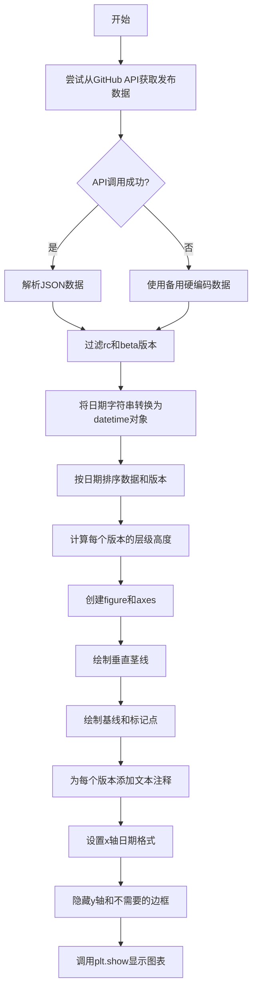

## 类结构

```
该脚本为扁平结构，无类定义
主要依赖 matplotlib.pyplot, numpy, datetime
核心函数 is_feature 用于判断是否为特性发布版本
```

## 全局变量及字段


### `url`
    
GitHub API请求URL，用于获取Matplotlib发布信息

类型：`str`
    


### `data`
    
从GitHub API获取的原始发布数据列表

类型：`list`
    


### `dates`
    
按时间排序的发布日期列表（datetime对象）

类型：`list[datetime.datetime]`
    


### `releases`
    
发布版本号列表（按点号分割的元组形式）

类型：`list[tuple]`
    


### `levels`
    
时间线每个事件的垂直层级高度，用于区分不同版本的显示位置

类型：`list[float]`
    


### `macro_meso_releases`
    
主版本和中间版本的唯一集合，用于确定版本的层级分类

类型：`set`
    


### `fig`
    
Matplotlib图形对象，包含整个可视化画布

类型：`matplotlib.figure.Figure`
    


### `ax`
    
Matplotlib坐标轴对象，用于绘制时间线元素

类型：`matplotlib.axes.Axes`
    


### `meso_dates`
    
特性发布版本（主版本）的日期列表

类型：`list[datetime.datetime]`
    


### `micro_dates`
    
次要版本（补丁版本）的日期列表

类型：`list[datetime.datetime]`
    


    

## 全局函数及方法


### `is_feature`

判断版本是否为特性发布（特性发布的版本号最后一位为0，如3.0.0，而补丁发布如3.0.1最后一位不为0）

参数：

- `release`：`tuple`，版本号元组，包含版本号的各个组件（例如 `('3', '0', '0')` 表示主版本.次版本.补丁版本）

返回值：`bool`，如果版本是特性发布（最后一位为 '0'）返回 `True`，否则返回 `False`

#### 流程图

```mermaid
flowchart TD
    A[开始] --> B[输入: release tuple]
    B --> C{release[-1] == '0'?}
    C -->|是| D[返回 True]
    C -->|否| E[返回 False]
    D --> F[结束]
    E --> F
```

#### 带注释源码

```python
def is_feature(release):
    """Return whether a version (split into components) is a feature release."""
    # release 是一个元组，如 ('3', '0', '0') 或 ('3', '0', '1')
    # release[-1] 获取最后一个元素，即补丁版本号
    # 如果补丁版本号为 '0'，则表示这是一个特性发布版本
    # 否则为补丁/微版本发布
    return release[-1] == '0'
```

---

### 补充说明

#### 设计目标与约束

- **设计目标**：通过检查版本号元组的最后一个组件是否为 `'0'` 来区分特性发布（feature release）和补丁发布（patch release）。特性发布表示新功能引入，补丁发布用于 bug 修复。
- **约束**：该函数假设输入的 `release` 参数已经是经过 `split('.')` 处理后的元组形式。

#### 错误处理与异常设计

- 该函数未进行显式的错误处理。如果传入非元组类型或空元组，可能会引发 `IndexError` 异常。
- 调用者需确保传入的参数格式正确。

#### 数据流

- 该函数被用于列表推导式和循环中，为每个发布版本生成可视化样式（颜色、字体粗细等）。
- 数据流：原始版本字符串 → 分割为元组 → 排序 → `is_feature()` 判断 → 根据结果设置图表样式

#### 调用场景

在代码中该函数被多次调用：

1. 在 `ax.vlines()` 中作为颜色透明度计算的一部分
2. 在列表推导式中筛选特性发布和补丁发布的日期
3. 在 `ax.annotate()` 中决定文本的字体粗细


### `datetime.strptime`

将符合特定格式的字符串解析为 Python 的 datetime 对象。

参数：

- `d`：`str`，需要转换的日期字符串，例如 "2019-02-26"
- `fmt`：`str`，日期格式模板，用于指定字符串的日期格式，例如 "%Y-%m-%d" 表示"年-月-日"

返回值：`datetime.datetime`，返回解析后的 datetime 对象

#### 流程图

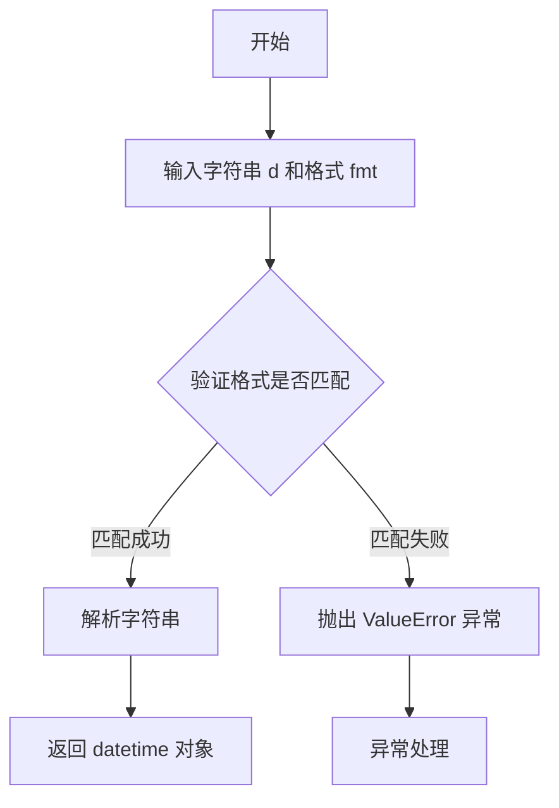

#### 带注释源码

```python
# 从原始字符串列表创建 datetime 对象列表
# 原始 dates 列表包含形如 '2019-02-26' 的字符串
dates = [datetime.strptime(d, "%Y-%m-%d") for d in dates]

# 参数说明：
#   d: 输入的日期字符串，例如 '2019-02-26'
#      - 来自 GitHub API 返回的 published_at 字段（取 T 前的日期部分）
#      - 或 fallback 列表中的预定义日期字符串
#   
#   "%Y-%m-%d": 格式模板字符串
#      - %Y: 4位年份 (如 2019)
#      - %m: 2位月份 (如 02)
#      - %d: 2位日期 (如 26)
#      - 分隔符 '-' 需要与输入字符串中的分隔符一致
#
# 返回值：
#   datetime.strptime() 返回 datetime.datetime 对象
#   例如：datetime.datetime(2019, 2, 26, 0, 0)
#
# 使用场景：
#   1. GitHub API 返回的日期格式为 ISO 8601 (如 "2019-02-26T00:00:00Z")
#      代码中使用 split("T")[0] 提取日期部分，得到 "2019-02-26" 格式的字符串
#   2. 需要将字符串转换为 datetime 对象才能进行：
#      - 日期排序 (zip(*sorted(zip(dates, releases))))
#      - 时间轴绘图 (matplotlib 自动处理 datetime 对象)
#      - 日期计算和比较
#
# 异常处理：
#   如果字符串格式与格式模板不匹配，会抛出 ValueError 异常
#   本代码中通过 try-except 块捕获网络请求异常，但格式匹配异常会导致程序终止
```


### plt.subplots()

`plt.subplots()` 是 matplotlib.pyplot 模块中的函数，用于创建一个新的图形（Figure）以及一个或多个子坐标轴（Axes），并返回图形对象和坐标轴对象的元组，是最常用的 matplotlib 初始化图形的函数。

参数：

- `nrows`：`int`，默认值 1，表示子图的行数
- `ncols`：`int`，默认值 1，表示子图的列数
- `figsize`：`tuple of (float, float)`，可选参数，表示图形的尺寸，格式为（宽度，高度），单位为英寸
- `dpi`：`int`，可选参数，表示图形的分辨率（每英寸点数）
- `facecolor`：颜色值或 `None`，可选参数，表示图形背景色
- `edgecolor`：颜色值或 `None`，可选参数，表示图形边框颜色
- `frameon`：`bool`，可选参数，表示是否绘制框架
- `layout`：`str` 或 `GridSpec`，可选参数，表示布局约束方式（如 "constrained"、"tight" 等）

返回值：`tuple of (Figure, Axes or array of Axes)`，返回图形对象（Figure）和坐标轴对象（Axes），如果 nrows > 1 或 ncols > 1，则返回 Axes 对象的多维数组

#### 流程图

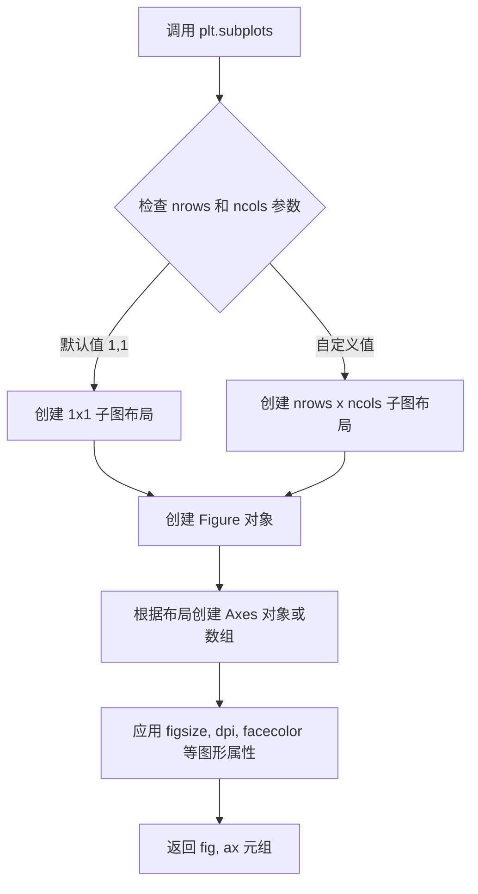

#### 带注释源码

```python
# 使用 plt.subplots 创建图形和坐标轴
# 参数说明：
#   figsize=(8.8, 4): 图形宽度 8.8 英寸，高度 4 英寸
#   layout="constrained": 使用约束布局，自动调整子图间距
# 返回值：
#   fig: Figure 对象，代表整个图形
#   ax: Axes 对象，代表子坐标轴
fig, ax = plt.subplots(figsize=(8.8, 4), layout="constrained")

# 设置图形标题
ax.set(title="Matplotlib release dates")
```


### `matplotlib.axes.Axes.vlines`

在 Matplotlib 中，`Axes.vlines()` 是 `Axes` 类的一个方法，用于在指定 x 坐标位置绘制从 `ymin` 到 `ymax` 的垂直线序列，常用于时间线图中标记关键时间点或事件。

参数：

- `x`：数组-like，垂直线的 x 坐标位置（通常为日期或数值）
- `ymin`：数组-like 或标量，每个垂直线起点的 y 坐标（代码中设为 0 表示基线）
- `ymax`：数组-like 或标量，每个垂直线终点的 y 坐标（代码中设为 levels 表示不同高度）
- `colors`：颜色序列、'inherit' 或 None，线条颜色，None 时使用默认颜色
- `linestyles`：字符串或元组序列，线条样式（如 'solid', 'dashed'）
- `linewidths`：浮点数或数组-like，线条宽度
- `data`：索引able 对象，可选的字典，用于通过字符串索引访问数据
- `**kwargs`：其他关键字参数传递给 `LineCollection` 构造函数

返回值：`matplotlib.collections.LineCollection`，返回创建的 LineCollection 对象，包含所有垂直线

#### 流程图

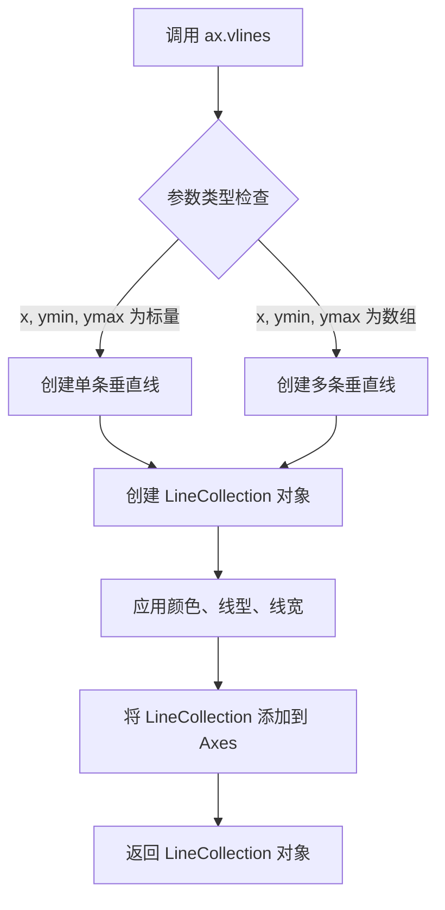

#### 带注释源码

```python
# 在代码中的实际调用
ax.vlines(dates, 0, levels,
          color=[("tab:red", 1 if is_feature(release) else .5) for release in releases])

# 参数说明：
# - dates: 时间序列，类型为 datetime 对象列表，用于指定每条垂直线的 x 位置
# - 0: ymin 参数，表示所有垂直线从 y=0 处开始（基线位置）
# - levels: ymax 参数，表示每条垂直线的高度，根据版本类型动态计算
#           - 功能发布（feature release）显示在上方
#           - 补丁发布（patch release）显示在下方
# - color: 颜色列表，根据是否为功能发布设置不同透明度
#           - 功能发布（release[-1] == '0'）：透明度为 1（完全不透明）
#           - 补丁发布：透明度为 0.5（半透明）
#           使用 ("tab:red", alpha) 元组格式指定颜色和透明度
```


### `Axes.axhline`

在图表上绘制一条水平线，线条从 x 轴的 xmin 位置延伸到 xmax 位置，默认横跨整个 x 轴范围。

参数：

- `y`：`float`，水平线的 y 坐标位置（数据坐标），默认为 0
- `xmin`：`float`，线条起始的 x 位置（相对于轴宽度的比例，范围 0-1），默认为 0
- `xmax`：`float`，线条结束的 x 位置（相对于轴宽度的比例，范围 0-1），默认为 1
- `**kwargs`：关键字参数，其他传递给 `matplotlib.lines.Line2D` 的参数，如颜色(c)、线宽(lw)等

返回值：`matplotlib.lines.Line2D`，返回绘制水平线所创建的 Line2D 对象，可用于进一步自定义线条样式

#### 流程图

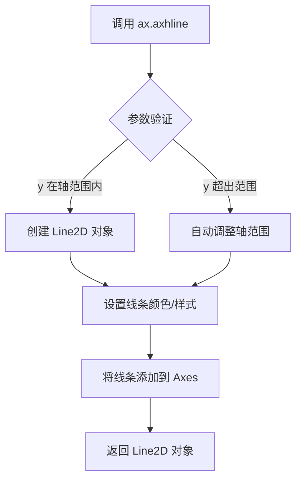

#### 带注释源码

```python
# The baseline. - 绘制水平线作为时间轴的基准线
ax.axhline(0, c="black")
# 等效于: ax.axhline(y=0, xmin=0, xmax=1, color='black')
#
# 参数说明:
#   y=0: 在 y=0 的位置绘制水平线（时间轴基准线）
#   c='black': 设置线条颜色为黑色
#
# 返回值: Line2D 对象，可用于后续自定义
#   line = ax.axhline(0, c="black")
#   line.set_linewidth(2)  # 可进一步设置线宽
```


### ax.plot()

在时间线示例中，`ax.plot()` 方法用于在基线（y=0）上绘制标记点（markers），以视觉方式强调时间线上的特定日期（微版本和中版本发布日期）。

参数：

- `x`：`list[datetime]`，要绘制的日期数据（x轴坐标），这里传入 `micro_dates`（微版本日期）或 `meso_dates`（特征版本日期）
- `y`：`numpy.ndarray`，与 x 长度相同的数组（y轴坐标），这里使用 `np.zeros_like()` 创建的全零数组，表示基线位置
- `fmt`：`str`，格式字符串，"ko" 表示黑色（k）圆形（o）标记
- `mfc`：`str`，标记填充颜色（marker face color），"white" 为白色，"tab:red" 为红色

返回值：`list[matplotlib.lines.Line2D]`，返回包含 Line2D 对象的列表，每个对象代表一条绘制的线条或一组标记

#### 流程图

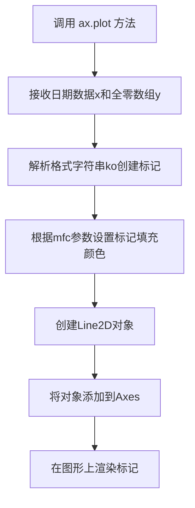

#### 带注释源码

```python
# 绘制微版本（micro releases）的标记点
# micro_dates: 微版本发布日期列表（datetime对象列表）
# np.zeros_like(micro_dates): 创建与micro_dates长度相同的全零数组，y坐标为0表示基线
# "ko": 格式字符串，k=黑色，o=圆形标记
# mfc="white": marker face color，白色填充，与背景区分
ax.plot(micro_dates, np.zeros_like(micro_dates), "ko", mfc="white")

# 绘制特征版本/中版本（feature/meso releases）的标记点
# meso_dates: 特征版本发布日期列表
# np.zeros_like(meso_dates): 全零数组作为y坐标
# "ko": 黑色圆形标记
# mfc="tab:red": marker face color，红色填充，用于视觉区分重要版本（特征版本）
ax.plot(meso_dates, np.zeros_like(meso_dates), "ko", mfc="tab:red")
```


### `ax.annotate`

在时间线图中，`ax.annotate()` 方法用于为每个 Matplotlib 发布版本添加文本注释。该方法通过指定注释位置、偏移量、对齐方式和样式，将版本号信息直观地标注在时间线的相应位置。

参数：

- `text`（或位置参数第一个）：`str`，要显示的文本内容，这里是版本号字符串（如 "3.0.0"）
- `xy`：`tuple`，要注释的数据点坐标，格式为 `(date, level)`，date 是日期对象，level 是垂直高度
- `xytext`：`tuple`，文本标签的位置偏移，格式为 `(-3, np.sign(level)*3)`，表示向左偏移3个点，垂直方向根据 level 符号偏移
- `textcoords`：`str`，指定 `xytext` 使用的坐标系，这里是 "offset points"（相对于 xy 点的偏移量，单位为点）
- `verticalalignment`：`str`，文本的垂直对齐方式，根据 level 正负值动态选择 "bottom"（level > 0）或 "top"（level < 0）
- `weight`：`str`，文本字体的粗细，feature release（最后一位为0）使用 "bold"，其他使用 "normal"
- `bbox`：`dict`，文本框的样式配置，包含 boxstyle、pad、lw 和 fc（背景色，设置为白色半透明）

返回值：`matplotlib.text.Annotation`，返回创建的 Annotation 对象，可用于后续修改或删除注释

#### 流程图

```mermaid
graph TD
    A[开始为每个 release 添加注释] --> B{获取当前 release 的<br/>date, level, version_str}
    B --> C[确定垂直对齐方式:<br/>if level > 0 then 'bottom'<br/>else 'top']
    C --> D{判断是否为 feature release:<br/>is_feature release}
    D -->|是| E[weight = 'bold']
    D -->|否| F[weight = 'normal']
    E --> G[计算 xytext 偏移量:<br/>x = -3<br/>y = np.sign(level) * 3]
    F --> G
    G --> H[调用 ax.annotate 添加注释]
    H --> I{是否还有更多 release}
    I -->|是| B
    I -->|否| J[结束]
```

#### 带注释源码

```python
# 为每个日期、级别和发布版本添加注释
for date, level, release in zip(dates, levels, releases):
    # 将版本号元组转换为字符串格式，如 ('3', '0', '0') -> "3.0.0"
    version_str = '.'.join(release)
    
    # 调用 annotate 方法添加文本注释
    ax.annotate(
        version_str,                    # text: 要显示的文本（版本号）
        xy=(date, level),               # xy: 注释目标点的坐标（日期, 高度）
        xytext=(-3, np.sign(level)*3),  # xytext: 文本标签的偏移位置（x轴-3点，y轴根据正负调整）
        textcoords="offset points",     # textcoords: xytext 使用的坐标系（相对于点的偏移，单位为点）
        verticalalignment="bottom" if level > 0 else "top",  # verticalalignment: 垂直对齐方式
        weight="bold" if is_feature(release) else "normal",  # weight: 字体粗细（feature release 加粗）
        bbox=dict(boxstyle='square', pad=0, lw=0, fc=(1, 1, 1, 0.7))  # bbox: 文本框样式（方形，无边距，白色半透明背景）
    )
```


### `matplotlib.axis.Axis.set`

设置 x 轴的属性，如刻度定位器和格式化器。该方法是一个通用属性设置器，接受关键字参数来配置坐标轴的各个属性。

参数：

-  `major_locator`：`matplotlib.ticker.Locator`，设置 x 轴主要刻度的定位器（例如 YearLocator 用于每年显示一个刻度）
-  `major_formatter`：`matplotlib.ticker.Formatter`，设置 x 轴主要刻度的格式化器（例如 DateFormatter 用于格式化日期显示）
-  `**kwargs`：其他可选关键字参数，会被传递给对应的 setter 方法

返回值：`matplotlib.axis.Axis`，返回自身以支持链式调用（chain call）

#### 流程图

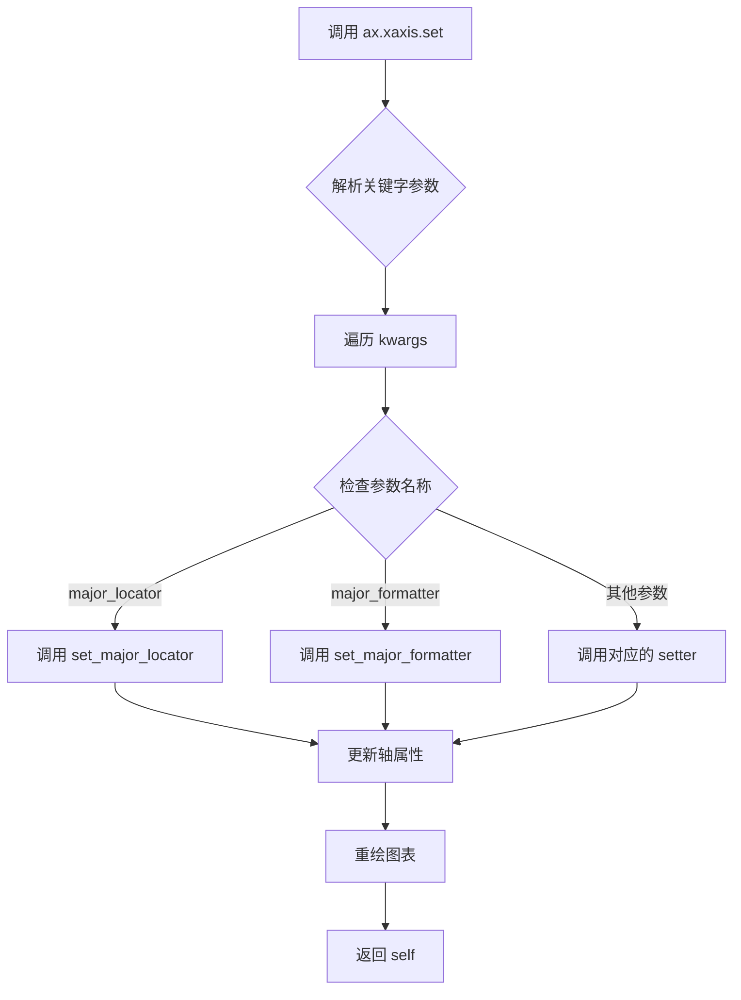

#### 带注释源码

```python
# 在代码中的实际调用
ax.xaxis.set(major_locator=mdates.YearLocator(),
             major_formatter=mdates.DateFormatter("%Y"))

# Axis.set() 方法的典型实现逻辑（简化版）
def set(self, **kwargs):
    """
    设置轴的多个属性。
    
    参数:
        **kwargs: 关键字参数，键为属性名，值为要设置的值。
                  支持的属性包括：
                  - major_locator: 主要刻度定位器
                  - major_formatter: 主要刻度格式化器
                  - minor_locator: 次要刻度定位器
                  - label: 轴标签
                  - labelprops: 标签样式属性
                  等等...
    """
    # 遍历所有传入的关键字参数
    for attr, value in kwargs.items():
        # 根据属性名获取对应的 setter 方法
        # 例如: 'major_locator' -> set_major_locator
        setter_name = f'set_{attr}'
        setter = getattr(self, setter_name, None)
        
        if setter is not None and callable(setter):
            # 调用对应的 setter 方法设置属性
            setter(value)
        else:
            # 如果没有对应的 setter，尝试直接设置属性
            if hasattr(self, attr):
                setattr(self, attr, value)
    
    # 返回自身以支持链式调用
    return self
```

#### 调用链分析

```python
# 1. 创建 Axes 对象
fig, ax = plt.subplots(figsize=(8.8, 4), layout="constrained")

# 2. 获取 XAxis 对象
# ax.xaxis 返回的是 matplotlib.axis.XAxis 实例（继承自 Axis）
xaxis = ax.xaxis

# 3. 调用 set 方法设置属性
# 等价于分别调用:
# xaxis.set_major_locator(mdates.YearLocator())
# xaxis.set_major_formatter(mdates.DateFormatter("%Y"))
xaxis.set(
    major_locator=mdates.YearLocator(),   # 每年一个主要刻度
    major_formatter=mdates.DateFormatter("%Y")  # 格式化为四位年份
)
```

#### 关联方法

| 方法名 | 描述 |
|--------|------|
| `set_major_locator()` | 设置主要刻度定位器 |
| `set_major_formatter()` | 设置主要刻度格式化器 |
| `set_minor_locator()` | 设置次要刻度定位器 |
| `set_label()` | 设置轴标签文本 |
| `set_visible()` | 设置轴是否可见 |


### `matplotlib.axis.Axis.set_visible`

该方法是 Matplotlib 中 `Axis` 类（坐标轴对象）的成员函数，用于控制 Y 轴（或 X 轴）整体的可见性。当传入 `False` 时，将隐藏对应的坐标轴（包括轴线、刻度、刻度标签等）；传入 `True` 时则恢复显示。此方法常用于创建精简图表（如隐藏 Y 轴以强调 X 轴数据）或在多轴图表中隐藏特定轴。

参数：

- `visible`：`bool`，必选参数。指定坐标轴是否可见。`True` 表示显示坐标轴，`False` 表示隐藏坐标轴。

返回值：`None`，该方法无返回值，直接修改对象内部状态。

#### 流程图

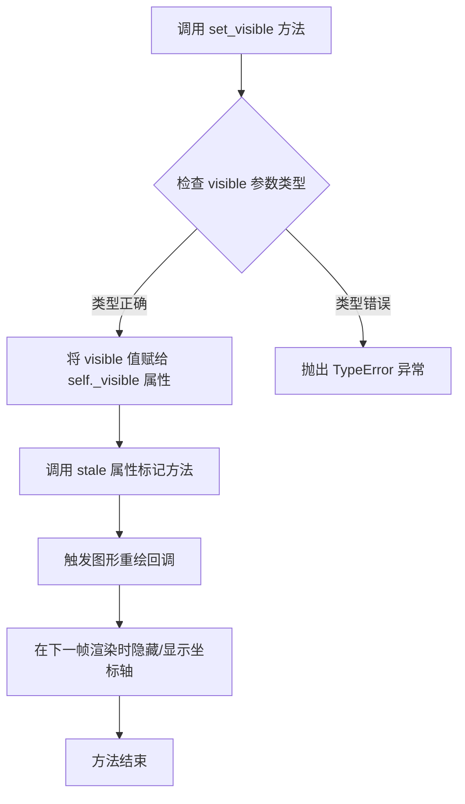

#### 带注释源码

```python
# 源码位于 matplotlib/artist.py 中，由 Axis 类继承自 Artist 基类
def set_visible(self, b):
    """
    设置艺术家的可见性。

    参数
    ----------
    b : bool
        艺术家对象是否可见。
    """
    """
    Set the artist's visibility.

    Parameters
    ----------
    b : bool
    """
    # self._visible 是 Artist 类的内部属性，存储当前可见性状态
    self._visible = bool(b)  # 将输入转换为布尔值，确保类型安全
    
    # 继承自 Artist 的 stale() 方法，用于标记该对象需要重绘
    # 当属性发生变化时，Matplotlib 会自动在下一帧重新渲染图形
    self.stale()
    
    # 返回 self 以支持链式调用（如 ax.yaxis.set_visible(False).set_zorder(1)）
    # 注意：虽然 Matplotlib 大多数 set_ 方法返回 self，但 set_visible 明确返回 None
    # 这是因为 set_visible 的基类实现返回 None 以保持一致性
    return None
```

```python
# 在 Axis 类中的具体调用示例（来自用户代码第 109 行）
ax.yaxis.set_visible(False)  # 隐藏 Y 轴，使图表更简洁
```

---

#### 补充说明

| 项目 | 描述 |
|------|------|
| **所属类** | `matplotlib.axis.Axis`（继承自 `matplotlib.artist.Artist`） |
| **定义模块** | `matplotlib.axis` |
| **调用对象** | `ax.yaxis` 是 Axes 对象的 Y 轴属性，返回 `Axis` 实例 |
| **关联方法** | `get_visible()`（获取可见性状态）、`spines.set_visible()`（单独控制轴脊柱） |
| **使用场景** | 隐藏不需要的坐标轴、创建时间线图、制作对比图表 |


### `ax.spines().set_visible()`

控制坐标轴边框（spines）的可见性，用于隐藏不需要的边框以简化图表外观。

参数：

-  `visible`：`bool`，设置为 `False` 隐藏指定边框，设置为 `True` 显示边框

返回值：`None`，无返回值（修改对象状态）

#### 流程图

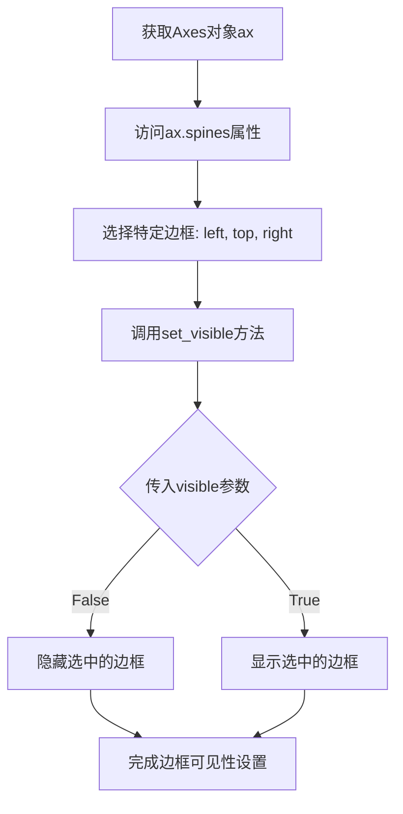

#### 带注释源码

```python
# 代码中的实际用法：
ax.spines[["left", "top", "right"]].set_visible(False)

# 解释：
# 1. ax.spines - 获取Axes对象的Spines对象（字典结构，包含left, right, top, bottom四个边框）
# 2. ax.spines[["left", "top", "right"]] - 选择左侧、顶部、右侧三个边框（返回Spines对象）
# 3. .set_visible(False) - 设置这些边框不可见
#
# 效果：只保留下边框（bottom），隐藏其他三个边框
# 常用于时间线图等只需要单边框的场景
```


### `ax.margins`

该方法用于设置坐标轴的边距（margins），即数据范围与绘图区域边界之间的留白空间。在代码中，此方法被调用以调整 y 轴方向的边距，确保时间线图表的视觉效果更加舒展。

参数：

- `y`：`float`，代码中赋值为 `0.1`，表示 y 轴范围的 10% 作为边距。

返回值：`tuple` 或 `None`，返回当前的边距值（元组形式）或设置后的 `Axes` 对象（具体返回值类型取决于 matplotlib 版本）。

#### 流程图

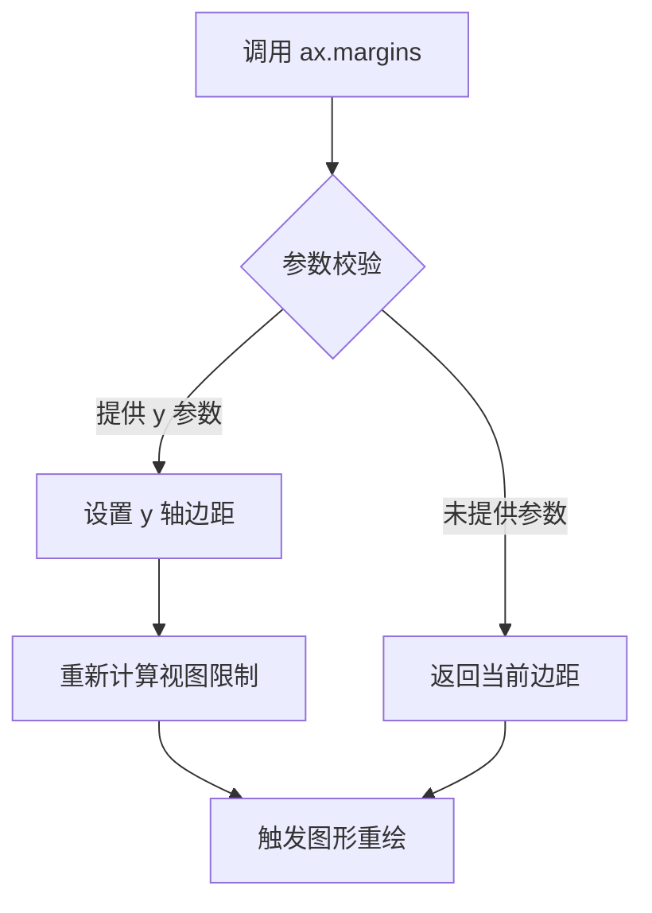

#### 带注释源码

```python
# 在给定的代码中，对该方法的调用如下：
ax.margins(y=0.1)

# 上下文说明：
# ax 是通过 plt.subplots() 创建的 Axes 对象。
# .margins() 是 matplotlib.axes.Axes 类的方法。
# 参数 y=0.1 表示在 y 轴方向上，上下两端留出数据范围 10% 的空白边距，
# 使线条不会紧贴图表边缘。

# 注意：由于该方法是 matplotlib 库的内部实现，未在当前代码文件中定义，
# 因此无法直接提供其完整的内部源码。
# 以上代码展示了该方法在当前上下文中的调用方式及参数含义。
```


### `plt.show()`

显示图形。

参数：
- `block`：`bool` 或 `None`，可选。控制是否阻塞程序执行以等待用户交互。默认值为 `None`。

返回值：`None`，无返回值。

#### 流程图

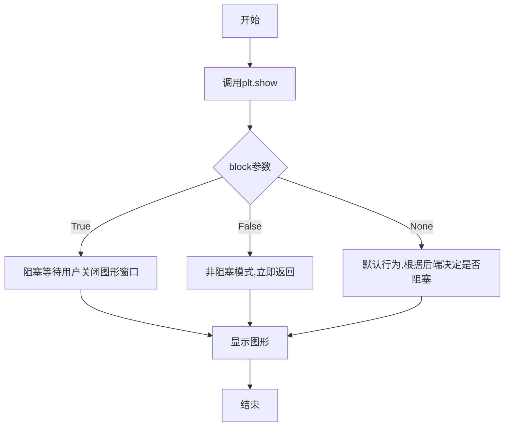

#### 带注释源码

```python
# 显示图形
# block=True: 阻塞程序直到用户关闭图形窗口
# block=False: 不阻塞,立即返回
# block=None: 默认行为,通常阻塞
plt.show(block=None)  # 调用show函数显示所有打开的图形
```

## 关键组件


### 数据获取模块

负责从GitHub API获取Matplotlib发布信息，包含主流程（网络请求+JSON解析）和异常 fallback（使用预定义列表）

### 日期解析与排序模块

将字符串日期转换为datetime对象，按版本号分割并按时间升序排序

### 级别计算模块

根据版本号（宏版本/中版本/微版本）计算时间线中每个事件的高度级别，特征发布版本交替分布在上下两侧

### 特征版本判断函数

判断版本是否为特征发布版本（版本号最后一位为0），用于区分重要发布节点

### 时间线绘制模块

使用vlines绘制垂直stem线，根据是否为特征版本设置不同颜色透明度，基线使用axhline绘制

### 标记绘制模块

在时间线基线上绘制标记点，特征版本使用红色标记，微版本使用白色标记

### 注释标注模块

为每个发布版本添加文本标注，包含版本号、位置偏移、样式边框等属性

### 坐标轴配置模块

设置X轴为年份定位器和日期格式化器，隐藏Y轴和多余边框，调整边距


## 问题及建议


### 已知问题

- **过时的网络请求方式**：使用 `urllib.request` 而非更现代的 `requests` 库，网络请求代码冗长且不够优雅
- **网络超时设置过短**：`timeout=1` 仅1秒，在网络状况不佳时极易导致请求失败
- **缺乏重试机制**：API 请求失败后直接进入 fallback，没有重试逻辑或指数退避策略
- **无缓存机制**：每次运行都会发起网络请求获取相同数据，没有实现本地缓存或内存缓存
- **全局作用域代码过多**：所有逻辑都写在全局作用域内，缺乏函数封装和模块化设计
- **缺少类型提示**：整个代码没有使用 Python 类型注解，降低了代码可读性和 IDE 辅助支持
- **异常处理过于宽泛**：`except Exception` 捕获所有异常，无法针对不同类型的错误进行差异化处理
- **硬编码的配置值**：如 `timeout=1`、`figsize=(8.8, 4)`、颜色值等散落在代码各处，不利于配置管理
- **列表推导式性能问题**：在 `ax.vlines` 中使用复杂的列表推导式生成颜色列表，每次调用都会重新计算
- **数据处理与展示耦合**：数据获取、处理、可视化逻辑全部混杂在一起，难以单独测试和复用
- **缺少日志记录**：没有使用 `logging` 模块，无法追踪程序执行状态和调试问题

### 优化建议

- **引入配置管理**：将超时、API URL、图形尺寸等配置提取到配置字典或配置文件中
- **封装网络请求函数**：创建独立函数处理 API 请求，添加重试机制和更合理的超时设置
- **添加缓存机制**：使用 `functools.lru_cache` 或文件缓存避免重复请求
- **模块化拆分**：将数据获取、数据处理、可视化分别封装成独立函数，提高代码可测试性
- **添加类型提示**：为函数参数和返回值添加类型注解，提升代码可维护性
- **细化异常处理**：针对不同异常类型（网络超时、JSON 解析错误、API 错误等）分别处理
- **预计算颜色列表**：将颜色列表在循环外预先计算，避免重复计算
- **使用现代 HTTP 库**：考虑使用 `requests` 库或 `httpx` 替代 `urllib.request`
- **添加日志记录**：引入 `logging` 模块记录关键操作和错误信息
- **提取魔法数字**：将 `0.8`、`5`、`3` 等数值定义为具名常量，提高代码可读性


## 其它


### 设计目标与约束

本代码的核心目标是创建一个可视化的时间线图，展示Matplotlib各个版本的发布日期。设计约束包括：1）优先从GitHub API获取实时数据，若失败则使用本地备用数据；2）时间线需要清晰区分功能发布（feature release）和补丁发布（patch release）；3）图形需要具备良好的可读性，包括适当的注释和视觉层次。

### 错误处理与异常设计

代码采用try-except块捕获所有异常情况。当GitHub API请求失败（如网络超时、API限制、无网络连接等）时，程序会捕获Exception并使用预定义的备用数据（releases和dates列表）继续执行。这种设计确保了代码的健壮性，即使在离线或API不可用的情况下也能生成时间线图表。异常处理粒度较粗，未区分不同类型的错误，可能影响问题诊断。

### 数据流与状态机

数据流主要分为三个阶段：1）数据获取阶段：尝试从GitHub API获取发布信息，失败时回退到备用数据；2）数据处理阶段：将日期字符串转换为datetime对象，将版本号拆分为元组，按日期排序；3）可视化阶段：根据版本号结构计算每个发布的时间线级别，生成stem plot并添加注释。状态转换较为简单，主要为获取成功/失败两个状态的切换。

### 外部依赖与接口契约

主要外部依赖包括：1）matplotlib.pyplot - 用于创建图形和坐标轴；2）numpy - 用于数值计算和数组操作；3）matplotlib.dates - 用于处理日期格式化；4）datetime - 用于日期时间处理；5）json和urllib.request - 用于HTTP请求和JSON解析（仅在数据获取阶段使用）。这些依赖均为Python标准库或Matplotlib生态系统的核心组件，接口稳定。

### 性能考虑

代码性能瓶颈主要在网络请求阶段（timeout=1秒限制）。数据处理部分（日期转换、排序、级别计算）使用Python原生操作和NumPy，对于少量数据（<100条发布记录）性能可接受。图形渲染由Matplotlib处理，对于数十个数据点的渲染效率较高。建议优化点：可添加数据缓存机制避免每次运行都请求API。

### 安全性考虑

代码安全性风险较低，主要关注点：1）网络请求未设置完整的请求头，可能被GitHub API拒绝；2）未对API返回的数据进行严格验证，假设返回数据格式符合预期；3）超时设置较短（1秒），可能在慢速网络下频繁失败。建议添加User-Agent请求头，对返回数据进行schema验证。

### 可扩展性设计

代码在以下方面具备可扩展性：1）备用数据机制允许轻松添加更多历史版本；2）级别计算逻辑（is_feature函数和h计算）可轻松修改以调整时间线外观；3）注释样式（bbox参数）可自定义；4）时间格式和定位器可配置。扩展限制：图形布局假设固定数量级的时间点，大规模数据可能需要重新设计布局。

### 测试策略

由于这是示例代码，建议的测试策略包括：1）单元测试：验证is_feature函数对不同版本号的判断；验证数据排序逻辑；2）集成测试：验证在网络可用时能正确解析API响应；验证在离线时能正确使用备用数据；3）视觉回归测试：验证生成的图形符合预期（可使用Matplotlib的图像比对工具）。当前代码未包含正式测试。

### 配置管理

代码中的可配置项包括：1）API URL和请求参数（per_page=100, timeout=1）；2）图形尺寸figsize=(8.8, 4)；3）级别计算参数（0.8, 5等magic numbers）；4）注释偏移量(-3, 3)；5）时间格式和定位器。当前这些参数均为硬编码，建议提取为配置文件或函数参数以提高灵活性。

### 版本兼容性

代码使用了较新的Python语法（类型注解风格的zip解包），兼容Python 3.x系列。Matplotlib API调用均为稳定接口，兼容Matplotlib 1.5至3.x版本。datetime和json模块为Python标准库，版本兼容性好。urllib.request在Python 3中可用，Python 2需要使用urllib2。主要依赖的最低版本：Matplotlib 1.5（用于部分API）、NumPy（版本无关紧要）。

### 使用示例和用例

主要使用场景：1）开发者展示项目发布历史时间线；2）数据可视化教学示例；3）作为创建自定义时间线的模板代码。使用方式：直接运行脚本生成时间线图，或将相关函数（级别计算、注释添加）移植到其他项目。用户可通过修改releases和dates数据来展示其他项目的发布历史。

    