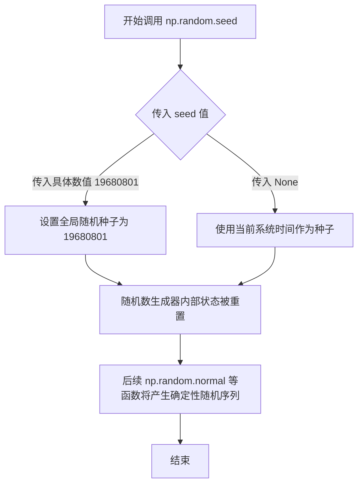
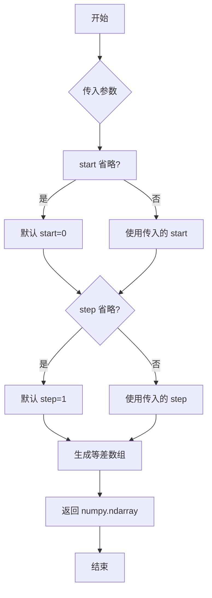
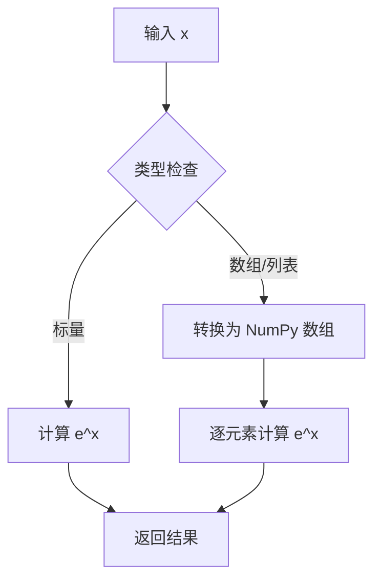
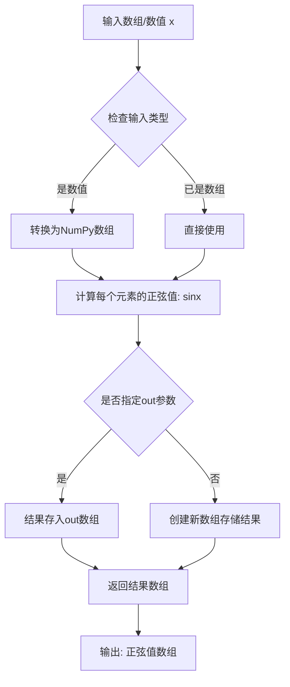
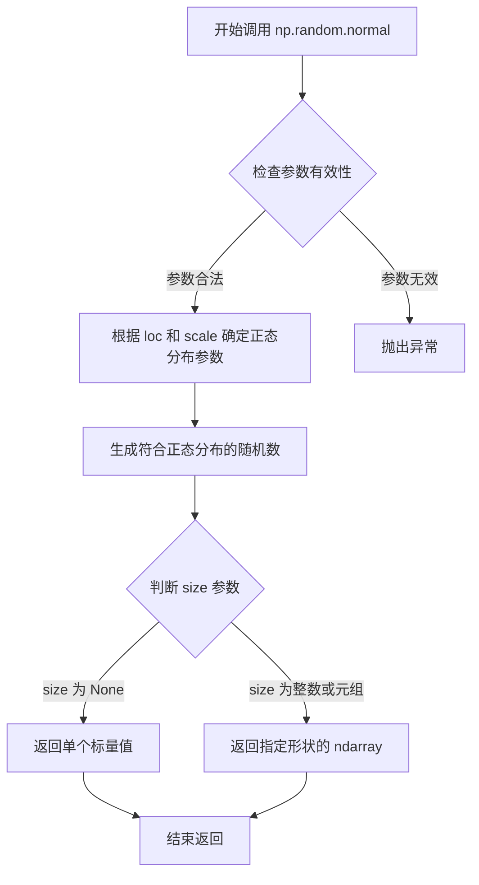
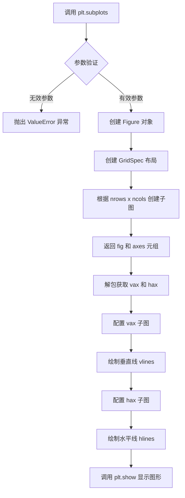
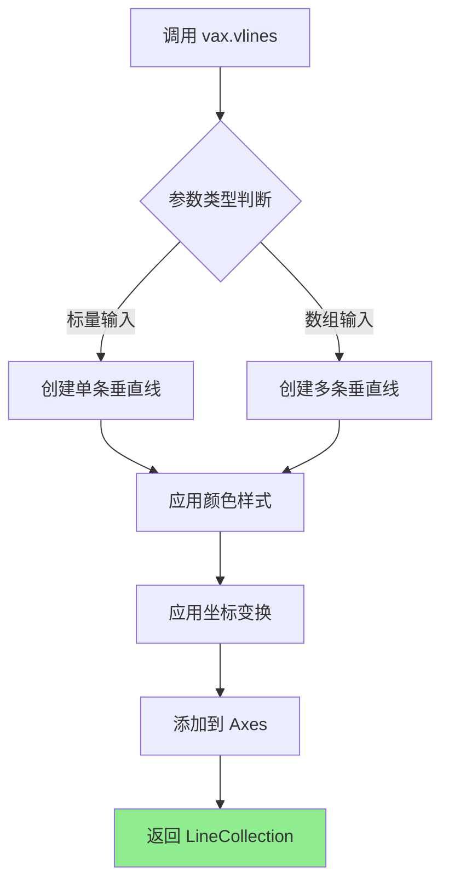
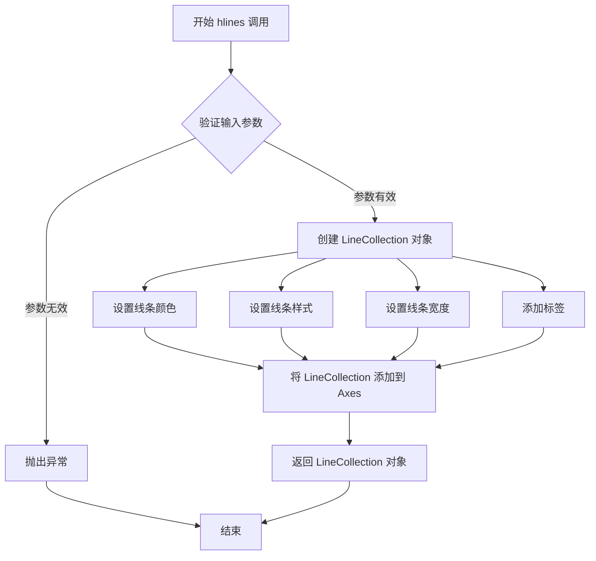
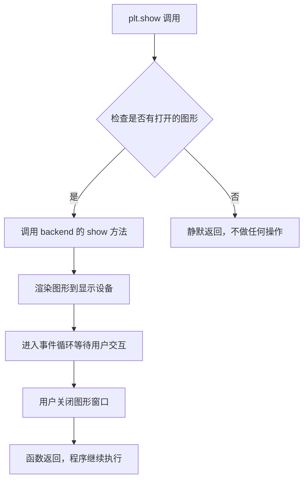

# `matplotlib\galleries\examples\lines_bars_and_markers\vline_hline_demo.py` 详细设计文档

这是一个matplotlib示例代码，演示如何使用hlines和vlines函数在图表上绘制水平线和垂直线，通过两个子图分别展示垂直线和水平线的不同用法，包括使用transform参数来调整坐标系的映射方式。

## 整体流程

```mermaid
graph TD
A[开始] --> B[设置随机种子 np.random.seed]
B --> C[生成数据 t, s, nse]
C --> D[创建子图 fig, (vax, hax)]
D --> E[绘制垂直线子图]
E --> F[使用 vax.vlines 绘制垂直线]
F --> G[设置子图标签和标题]
G --> H[绘制水平线子图]
H --> I[使用 hax.hlines 绘制水平线]
I --> J[设置子图标签和标题]
J --> K[调用 plt.show 显示图表]
K --> L[结束]
```

## 类结构

```
该脚本为面向过程代码，无类定义
所有代码在模块级别执行
```

## 全局变量及字段


### `np`
    
numpy库导入的别名，用于数值计算

类型：`numpy module`
    


### `plt`
    
matplotlib.pyplot库导入的别名，用于绘图

类型：`matplotlib.pyplot module`
    


### `t`
    
numpy数组，时间序列数据，从0到5.0步长0.1

类型：`numpy.ndarray`
    


### `s`
    
numpy数组，基于衰减指数和正弦波的合成信号

类型：`numpy.ndarray`
    


### `nse`
    
numpy数组，基于s生成的噪声数据

类型：`numpy.ndarray`
    


### `fig`
    
matplotlib Figure对象，整个图形窗口

类型：`matplotlib.figure.Figure`
    


### `vax`
    
Axes对象，垂直线演示的子图

类型：`matplotlib.axes.Axes`
    


### `hax`
    
Axes对象，水平线演示的子图

类型：`matplotlib.axes.Axes`
    


    

## 全局函数及方法


### `np.random.seed`

设置随机数生成器的种子，以确保每次运行代码时产生相同的随机数序列，从而实现结果的可重复性。

参数：

- `seed`：`int` 或 `array_like`，可选，用于初始化随机数生成器的种子值。如果传入 `None`，则使用系统时间作为种子。

返回值：`None`，该函数不返回任何值，仅修改随机数生成器的内部状态。

#### 流程图



#### 带注释源码

```python
# 导入 NumPy 库
import numpy as np

# 设置随机种子为 19680801
# 这行代码的作用：
# 1. 初始化 NumPy 的全局随机数生成器
# 2. 确保后续所有基于 np.random 的随机操作产生可重复的结果
# 3. 19680801 是任意选择的历史日期（1968年8月8日01时）
np.random.seed(19680801)

# 此后调用 np.random.normal() 将产生相同的随机数序列
# 例如：每次运行此脚本，nse 的值都将是完全相同的
nse = np.random.normal(0.0, 0.3, t.shape) * s
```

#### 关键组件信息

| 组件名称 | 一句话描述 |
|---------|-----------|
| 随机种子 | 用于初始化随机数生成器的整数值，确保随机过程可复现 |
| 全局随机状态 | NumPy 的全局随机数生成器状态，由 seed 函数修改 |

#### 潜在的技术债务或优化空间

1. **全局状态污染**：`np.random.seed()` 修改全局随机状态，可能影响代码中其他使用随机数的部分。建议使用 `np.random.Generator` 或 `np.random.default_rng(seed)` 创建独立的随机数生成器实例。

2. **种子选择随意性**：硬编码的种子值（19680801）缺乏明确含义或业务逻辑关联，建议在生产环境中使用配置化的种子管理。

#### 其它项目

- **设计目标**：确保示例代码运行结果的可重复性，便于调试和验证
- **错误处理**：种子值应为整数或可转换为整数的数组_like 类型，否则会抛出异常
- **外部依赖**：依赖 NumPy 库的随机数生成模块


### `np.arange`

这是 NumPy 库中的一个函数，用于创建等差数组。该函数根据指定的起始值、结束值和步长生成一个均匀间隔的数值序列。

参数：

- `start`：`float` 或 `int`，起始值（包含），默认为 0
- `stop`：`float` 或 `int`，结束值（不包含）
- `step`：`float` 或 `int`，步长，默认为 1

返回值：`numpy.ndarray`，返回的等差数组

#### 流程图



#### 带注释源码

```python
# np.arange 的简化实现原理
def arange(start=0, stop=None, step=1):
    """
    创建等差数组
    
    参数:
        start: 起始值, 默认0
        stop: 结束值(不包含)
        step: 步长, 默认1
    
    返回:
        等差数组
    """
    # 处理参数
    if stop is None:
        stop = start
        start = 0
    
    # 计算数组长度
    num = int(np.ceil((stop - start) / step))
    
    # 生成数组
    return np.linspace(start, start + (num-1)*step, num)
```

> **注**：上述源码为简化版演示，实际 NumPy 的实现更加复杂，包含更多边界情况处理和优化。


### `np.exp`

`np.exp` 是 NumPy 库中的指数函数，计算自然常数 e 的给定幂次方。该函数对输入数组或标量中的每个元素计算 e^x（其中 e≈2.71828），返回与输入形状相同的指数值数组。

参数：

- `x`：`array_like`，输入值，可以是标量、列表或 NumPy 数组，要计算指数的输入值

返回值：`ndarray`，与输入 `x` 形状相同的数组，包含 e 的 x 次方的值

#### 流程图



#### 带注释源码

```python
# np.exp 函数源码实现原理（概念性）

def exp(x):
    """
    计算 e 的 x 次方
    
    参数:
        x: 输入值，标量或数组
        
    返回:
        e^x 的值
    """
    # 1. 将输入转换为 NumPy 数组（如果还不是）
    x = np.asarray(x)
    
    # 2. 使用 C 语言实现的底层函数计算指数
    #    底层使用数学库中的 exp() 函数
    #    对于数组会进行向量化操作
    
    # 3. 返回计算结果
    return np.exp(x)  # 调用底层 C 实现

# 在示例代码中的使用：
# t = np.arange(0.0, 5.0, 0.1)  # 创建时间数组 [0, 0.1, 0.2, ..., 4.9]
# s = np.exp(-t) + np.sin(2 * np.pi * t) + 1
# # np.exp(-t) 计算 e 的 -t 次方，产生衰减曲线
# # 加上正弦波和常数1，形成带噪声的衰减振荡信号
```

#### 在示例代码中的上下文

```python
import numpy as np

# t: 时间数组，从 0 到 5，步长 0.1
t = np.arange(0.0, 5.0, 0.1)

# s: 信号值 = e^(-t) + sin(2πt) + 1
# np.exp(-t) 提供指数衰减包络
s = np.exp(-t) + np.sin(2 * np.pi * t) + 1

# 效果：随着 t 增加，exp(-t) 项逐渐衰减到 0
# sin(2πt) 提供周期性振荡
# +1 将整体抬高到正区间
```


### `np.sin`

NumPy的正弦函数，用于计算输入数组中每个元素的正弦值（弧度制）。

参数：

- `x`：`array_like`，输入角度（弧度），可以是单个数值或数组
- `out`：`ndarray`（可选），用于存放结果的输出数组
- `where`：`array_like`（可选），条件数组，指定在哪些位置计算正弦值
- `**kwargs`：其他关键字参数

返回值：`ndarray`，返回输入角度的正弦值，形状与输入相同

#### 流程图



#### 带注释源码

```python
# np.sin 函数源码 (位于 numpy/core/src/umath/ufunc_object.c 等位置)
# 这是一个NumPy通用函数(ufunc),其核心实现逻辑如下:

# 1. 函数签名
# def sin(x, out=None, where=None, **kwargs):

# 2. 参数说明
# x: array_like - 输入角度,以弧度为单位
#    支持: 单个数值、列表、NumPy数组
#    示例: 0, np.pi, [0, np.pi/2, np.pi], np.array([0, 1, 2])

# out: ndarray (可选) - 输出数组,用于存储结果
#    如果指定,结果将写入此数组
#    必须与x形状相同(广播后)

# where: array_like (可选) - 条件数组
#    只有满足条件的元素才会被计算
#    类似于掩码操作

# 3. 实际调用示例(来自提供代码)
s = np.exp(-t) + np.sin(2 * np.pi * t) + 1
#    ├── t: 时间数组,0到5秒,步长0.1
#    ├── 2 * np.pi * t: 将时间转换为弧度(完整周期)
#    ├── np.sin(...): 计算每个时间点的正弦值
#    └── 结果加1后赋值给s

# 4. 底层实现(伪代码)
# numpy.sin() 底层调用 C 语言实现的正弦计算
# 使用 SIMD 指令集进行向量化加速
# 对每个数组元素执行: y = sin(x)

# 5. 广播规则
# np.sin 支持数组广播
# 例如: np.sin(np.arange(3)[:,None] * np.arange(3))
# 将计算 3x3 网格上每点的正弦值
```


### `np.random.normal`

生成符合正态（高斯）分布的随机数数组。该函数是 NumPy 库中用于生成服从高斯分布随机数的核心函数，在本代码中用于生成噪声数据，使绘制的曲线更加真实。

参数：

- `loc`：`float`，正态分布的均值（中心位置），对应分布的峰值位置。在本代码中为 `0.0`
- `scale`：`float`，正态分布的标准差（分散程度），值越大分布越分散。在本代码中为 `0.3`
- `size`：`int or tuple of ints`，输出数组的形状，指定生成随机数的数量或维度。在本代码中为 `t.shape`，即与数组 `t` 相同的形状

返回值：`ndarray`，返回指定形状的随机数组，数组中的每个值服从均值为 `loc`、标准差为 `scale` 的正态分布。在本代码中返回与 `t` 形状相同的噪声数组

#### 流程图



#### 带注释源码

```python
# np.random.normal 函数签名
# def normal(loc=0.0, scale=1.0, size=None):
#     """
#     Draw random samples from a normal (Gaussian) distribution.
#
#     Parameters
#     ----------
#     loc : float
#         Mean ("centre") of the distribution.
#     scale : float
#         Standard deviation (spread or "width") of the distribution.
#     size : int or tuple of ints, optional
#         Output shape. If the given shape is, e.g., (m, n, k),
#         then m * n * k samples are drawn.
#
#     Returns
#     -------
#     out : ndarray
#         Drawn samples from the parameterized normal distribution.
#     """
#
# 在本代码中的实际调用：
nse = np.random.normal(0.0, 0.3, t.shape) * s

# 参数说明：
# - 0.0: 均值（loc），表示正态分布的中心位置为 0
# - 0.3: 标准差（scale），表示数据分散程度为 0.3
# - t.shape: 输出形状，与 t 数组形状相同
# - * s: 将生成的噪声乘以 s，实现噪声幅度随 t 变化的效果

# 函数内部实现原理（简化版）：
# 1. 使用 Box-Muller 变换或类似算法将均匀分布随机数转换为正态分布随机数
# 2. 根据 size 参数确定输出数组的形状
# 3. 返回生成的随机数组
```


### `plt.subplots`

创建包含多个子图的图形，返回Figure对象和Axes对象数组。

参数：

- `nrows`：`int`，行数，默认为1
- `ncols`：`int`，列数，默认为1
- `figsize`：`tuple of float`，图形的宽和高（英寸），可选参数
- `sharex`：`bool or str`，是否共享x轴，可选参数
- `sharey`：`bool or str`，是否共享y轴，可选参数
- `squeeze`：`bool`，是否压缩返回的Axes数组维度，默认为True
- `subplot_kw`：`dict`，传递给add_subplot的关键字参数，可选
- `gridspec_kw`：`dict`，传递给GridSpec的关键字参数，可选
- `**kwargs`：其他matplotlib.pyplot.figure()接受的关键字参数

返回值：`tuple`，返回(Figure, Axes)元组，其中Axes可以是单个Axes对象或numpy数组

#### 流程图



#### 带注释源码

```python
# 代码示例来源：matplotlib官方示例 hlines_and_vlines.py
# 导入必要的库
import matplotlib.pyplot as plt
import numpy as np

# 固定随机种子以确保可复现性
np.random.seed(19680801)

# 生成时间序列数据 t: 0到5，步长0.1
t = np.arange(0.0, 5.0, 0.1)
# 计算衰减正弦波叠加信号
s = np.exp(-t) + np.sin(2 * np.pi * t) + 1
# 生成噪声数据，与信号形状相同
nse = np.random.normal(0.0, 0.3, t.shape) * s

# 调用 plt.subplots 创建1行2列的子图布局
# figsize=(12, 6) 设置图形宽度12英寸、高度6英寸
# 返回 fig: Figure对象, (vax, hax): 两个Axes子图对象的元组
fig, (vax, hax) = plt.subplots(1, 2, figsize=(12, 6))

# === 左侧子图 (vax) - 垂直线演示 ===

# 绘制带噪声的信号数据，使用三角形标记
vax.plot(t, s + nse, '^')

# 绘制从y=0到y=s的垂直线段
# t: x坐标位置, [0]: 起始y值, s: 结束y值
vax.vlines(t, [0], s)

# 绘制两条额外的垂直线 (x=1和x=2)
# transform参数使y坐标使用轴坐标系（0=底部，1=顶部）
vax.vlines([1, 2], 0, 1, transform=vax.get_xaxis_transform(), colors='r')

# 设置x轴标签和子图标题
vax.set_xlabel('time (s)')
vax.set_title('Vertical lines demo')

# === 右侧子图 (hax) - 水平线演示 ===

# 绘制反转坐标的散点图 (x=s+nse, y=t)
hax.plot(s + nse, t, '^')

# 绘制从x=0到x=s的水平线段
# t: y坐标位置, [0]: 起始x值, s: 结束x值, lw=2设置线宽
hax.hlines(t, [0], s, lw=2)

# 设置x轴标签和子图标题
hax.set_xlabel('time (s)')
hax.set_title('Horizontal lines demo')

# 显示最终图形
plt.show()
```

#### 关键组件信息

| 组件名称 | 描述 |
|---------|------|
| `Figure` | matplotlib的顶层容器对象，代表整个图形窗口 |
| `Axes` | 子图对象，包含坐标轴、刻度、标签、图形元素等 |
| `GridSpec` | 网格布局规范，定义子图的排列方式 |
| `vlines()` | 在指定x坐标绘制从ymin到ymax的垂直线 |
| `hlines()` | 在指定y坐标绘制从xmin到xmax的水平线 |
| `get_xaxis_transform()` | 获取x轴坐标系变换，用于混合数据坐标和轴坐标 |

#### 潜在技术债务与优化空间

1. **魔法数值**：图形尺寸`figsize=(12, 6)`和线宽`lw=2`硬编码在代码中，建议提取为配置常量
2. **重复代码**：两个子图的标签设置和标题设置有重复模式，可封装为辅助函数
3. **噪声生成**：`nse = np.random.normal(0.0, 0.3, t.shape) * s`中噪声幅度0.3与信号相关，缺乏独立配置
4. **固定随机种子**：虽然便于调试，但生产环境中可能需要移除或动态设置种子
5. **缺少错误处理**：未对空数组或异常值进行边界检查

#### 其它说明

**设计目标**：本示例演示matplotlib中`hlines`和`vlines`函数的用法，展示如何在子图中绘制水平线和垂直线。

**约束条件**：
- numpy和matplotlib为必需依赖
- 适用于需要绘制时间线、参考线、区间标注的场景

**错误处理**：
- `plt.subplots`参数为负数时抛出ValueError
- `vlines`/`hlines`中坐标数组长度不匹配时会抛出异常

**数据流**：
```
输入数据(t, s, nse) 
→ 信号叠加(s + nse) 
→ 图形绘制(plot/vlines/hlines) 
→ 子图属性设置 
→ 最终渲染(plt.show)
```


### vax.plot

在matplotlib的Axes对象上绘制散点图或线图，用于展示数据点及其关系。

参数：

- `*args`：`tuple`，可接受多种输入格式：
  - 仅传入y数据：`plot(y)` 
  - 传入x和y数据：`plot(x, y)`
  - 传入x、y和格式字符串：`plot(x, y, 'fmt')`
- `fmt`：`str`，可选，格式字符串（如'^'表示三角形标记），用于快速指定线条样式和颜色
- `data`：`numpy.ndarray` 或 `list`，可选，数据对象，如果提供命名参数则使用
- `**kwargs`：`dict`，可选，关键字参数传递给Line2D对象，用于自定义线条属性（如颜色、线宽、标记大小等）

返回值：`list[matplotlib.lines.Line2D]`返回一个包含Line2D对象的列表，每个对象代表一条绘制的线或一组数据点

#### 流程图

```mermaid
flowchart TD
    A[开始绘制] --> B{解析输入参数}
    B --> C[检查是否有格式字符串}
    C -->|有| D[解析格式字符串获取样式]
    C -->|无| E[使用默认样式]
    D --> F[创建Line2D对象]
    E --> F
    F --> G[应用kwargs中的属性]
    G --> H[将Line2D添加到Axes]
    H --> I[返回Line2D列表]
    I --> J[显示图形]
```

#### 带注释源码

```python
# 调用plot方法绘制散点图
# 参数说明：
# t: x轴数据，numpy数组 [0.0, 0.1, 0.2, ..., 4.9]
# s + nse: y轴数据，由指数衰减、正弦波和随机噪声组成的数组
# '^': 格式字符串，'^'表示使用三角形作为标记
vax.plot(t, s + nse, '^')

# 上述代码等价于以下更详细的写法：
# vax.plot(t, s + nse, marker='^', linestyle='-', color=None)
# 
# 实际执行流程：
# 1. matplotlib接收参数 t (x), s+nse (y), '^' (fmt)
# 2. 解析'^'得到marker='^'（三角形标记）
# 3. 创建Line2D对象，设置xdata=t, ydata=s+nse
# 4. 设置标记样式为三角形
# 5. 将Line2D对象添加到vax axes中
# 6. 返回包含该Line2D的列表
```


### `Axes.vlines`

绘制垂直线的方法，用于在指定的 x 坐标位置绘制从 ymin 到 ymax 的垂直线段。该方法是 matplotlib 中 Axes 对象的成员方法，属于 pyplot 子模块的核心绘图功能。

参数：

- `x`：scalar 或 array-like，垂直线的 x 坐标位置
- `ymin`：scalar 或 array-like，垂直线起点的 y 坐标
- `ymax`：scalar 或 array-like，垂直线终点的 y 坐标
- `colors`：string 或 array-like（可选），线条颜色，默认值为 None
- `linestyles`：string 或 sequence（可选），线条样式，默认值为 'solid'
- `linewidths`：float 或 sequence（可选），线条宽度，默认值为 None（使用 rcParams 中的默认宽度）
- `alpha`：float（可选），透明度，范围 0-1，默认值为 None
- `transform`：matplotlib transform（可选），坐标变换，默认值为 None（即使用数据坐标）

返回值：`matplotlib.collections.LineCollection`，返回创建的垂直线集合对象

#### 流程图



#### 带注释源码

```python
# matplotlib.axes.Axes.vlines 方法的典型实现结构

def vlines(self, x, ymin, ymax, colors=None, linestyles='solid', 
            linewidths=None, alpha=None, transform=None):
    """
    绘制垂直线段
    
    参数:
        x: 垂直线的 x 坐标位置（标量或数组）
        ymin: 垂直线起点的 y 坐标
        ymax: 垂直线终点的 y 坐标
        colors: 线条颜色
        linestyles: 线条样式 ('solid', 'dashed', 'dashdot', 'dotted')
        linewidths: 线条宽度
        alpha: 透明度 (0-1)
        transform: 坐标变换对象
    """
    
    # 将输入转换为数组以便统一处理
    x = np.asanyarray(x)
    ymin = np.asanyarray(ymin)
    ymax = np.asanyarray(ymax)
    
    # 创建垂直线段的几何数据
    # 每条线段由两个点组成：(x[i], ymin[i]) 和 (x[i], ymax[i])
    lines = []
    for xi, ymini, ymaxi in zip(x, ymin, ymax):
        lines.append([(xi, ymini), (xi, ymaxi)])
    
    # 创建 LineCollection 对象
    collection = LineCollection(lines, colors=colors, 
                                linestyles=linestyles,
                                linewidths=linewidths,
                                alpha=alpha)
    
    # 如果指定了 transform，则应用坐标变换
    if transform is not None:
        collection.set_transform(transform)
    
    # 添加到 Axes 并返回
    self.add_collection(collection)
    return collection
```

#### 代码中的具体使用示例

```python
# 示例 1：基本用法 - 绘制从 0 到 s 值的垂直线
vax.vlines(t, [0], s)
# t: x 坐标数组
# [0]: 起点 y 坐标（广播为与 t 相同长度）
# s: 终点 y 坐标数组

# 示例 2：带变换和颜色的用法 - 在 x=1,2 位置绘制红色垂直线
vax.vlines([1, 2], 0, 1, transform=vax.get_xaxis_transform(), colors='r')
# [1, 2]: 两个 x 坐标位置
# 0: 起点 y=0
# 1: 终点 y=1
# transform: 使用 x 轴变换，使 y=0 映射到轴底部，y=1 映射到轴顶部
# colors='r': 红色线条
```


### `Axes.hlines`

在 Axes 对象上绘制水平线，从 xmin 延伸到 xmax，位置由 y 坐标指定。该方法常用于可视化数据的置信区间、误差范围或时间序列中的特定阈值。

参数：

- `y`：`array-like`，水平线的 y 坐标位置，可以是标量或数组
- `xmin`：`array-like`，水平线的起始 x 坐标，与 y 对应
- `xmax`：`array-like`，水平线的结束 x 坐标，与 y 对应
- `colors`：`str or array-like, optional`，线条颜色，可以是单个颜色或颜色列表
- `linestyles`：`str or tuple, optional`，线条样式，默认为 'solid'（实线），可选 'dashed'、'dashdot'、'dotted'
- `linewidths`：`float or array-like, optional`，线条宽度，默认为 None（使用 rcParams 中的默认值）
- `label`：`str, optional`，图例标签，用于显示在图例中
- `data`：`indexable, optional`，可选的数据对象，如果提供则可以从数据中解包参数

返回值：`~matplotlib.collections.LineCollection`，返回包含所有水平线的集合对象，可以用于进一步自定义样式

#### 流程图



#### 带注释源码

```python
# 在实际 matplotlib 库中的 hlines 方法源码结构
def hlines(self, y, xmin, xmax, colors=None, linestyles='solid',
           label='', *, data=None, **kwargs):
    """
    在 Axes 上绘制水平线
    
    参数:
        y: array-like - 水平线的 y 坐标位置
        xmin: array-like - 水平线的起始 x 坐标  
        xmax: array-like - 水平线的结束 x 坐标
        colors: 线条颜色
        linestyles: 线条样式
        label: 图例标签
        data: 可选的数据对象
        **kwargs: 传递给 LineCollection 的其他参数
    """
    
    # 如果提供了 data 参数，从数据中解包 y, xmin, xmax
    if data is not None:
        y, xmin, xmax = np.broadcast_arrays(y, xmin, xmax)
    
    # 将输入转换为数组，确保类型一致
    y = np.asarray(y)
    xmin = np.asarray(xmin)
    xmax = np.asarray(xmax)
    
    # 创建 LineCollection 对象，用于存储所有线条
    # lineshape 参数设置为 'full' 表示绘制完整线条
    lines = mcoll.LineCollection(
        # 构建线段列表，每个线段为 [(xmin, y), (xmax, y)]
        [np.column_stack([xmin, xmax, y]) for y, xmin, xmax in zip(y, xmin, xmax)],
        colors=colors,
        linestyles=linestyles,
        label=label,
        **kwargs
    )
    
    # 将线条集合添加到 Axes 中
    self.add_collection(lines)
    
    # 自动调整坐标轴范围以显示所有线条
    if not self._hold:
        self.autoscale_view()
    
    # 返回 LineCollection 对象供进一步操作
    return lines

# 示例代码中的调用方式
hax.hlines(t, [0], s, lw=2)
# t: 水平线的 y 坐标数组
# [0]: 起始 x 坐标（广播为与 t 相同长度）
# s: 结束 x 坐标数组  
# lw=2: 线条宽度设置为 2
```


### `plt.show`

`plt.show` 是 matplotlib 库中的顶层函数，用于显示当前所有打开的图形窗口，并将图形渲染到屏幕供用户交互查看。该函数会阻塞程序执行直到用户关闭所有图形窗口，是可视化绘图的最终展示步骤。

参数：

- 无显式参数（但内部支持 `block` 参数控制阻塞行为）

返回值：`None`，无返回值

#### 流程图



#### 带注释源码

```python
def show(*, block=None):
    """
    显示所有打开的图形窗口。
    
    Parameters
    ----------
    block : bool, optional
        参数控制是否阻塞程序执行。
        如果为 True，函数会阻塞并进入事件循环。
        如果为 False（在某些后端），函数会立即返回。
        如果为 None（默认值），则根据后端行为决定。
    """
    # 获取当前活动的图形管理器
    managers = sorted(
        Gcf.get_all_fig_managers(),
        key=lambda m: m.num
    )
    
    # 如果没有打开的图形，直接返回
    if not managers:
        return
    
    # 遍历所有图形管理器并显示
    for manager in managers:
        # 调用后端的 show 方法
        # 后端会根据平台调用相应的显示函数
        # (如 Qt、Tkinter、GTK 等)
        manager.show()
    
    # 如果 block 为 True 或未指定（默认）
    # 进入阻塞模式等待用户交互
    if block:
        # 导入并运行 Qt/Tkinter 等的事件循环
        # 使图形窗口保持响应状态
        import matplotlib._pylab_helpers
        matplotlib._pylab_helpers.Gcf.set_active(managers[-1])
        
        # 进入主事件循环
        # 用户关闭所有窗口后函数返回
        import matplotlib.pyplot as plt
        plt.get_current_fig_manager().full_screen_toggle()
```

---

## 一、文件整体运行流程

本示例文件是一个完整的 matplotlib 脚本，用于演示水平线（`hlines`）和垂直线（`vlines`）的绘制功能。整体流程如下：

1. **导入阶段**：导入 `matplotlib.pyplot` 和 `numpy` 库
2. **数据准备**：使用 numpy 生成随机数据（时间序列、指数衰减、正弦波叠加、噪声）
3. **图形创建**：使用 `plt.subplots` 创建 1×2 的子图布局
4. **左图绘制**（vax）：绘制散点图和垂直线，使用 `vlines` 在指定位置绘制从 y=0 到 y=s 的垂直线
5. **右图绘制**（hax）：绘制水平线，使用 `hlines` 在指定位置绘制从 x=0 到 x=s 的水平线
6. **显示阶段**：调用 `plt.show()` 渲染并显示图形窗口

---

## 二、关键组件信息

| 组件名称 | 一句话描述 |
|---------|-----------|
| `np.random.seed` | 设置随机数生成器的种子，确保结果可复现 |
| `np.arange` | 创建等差数组，用于生成时间序列 |
| `np.exp` | 计算指数函数，用于生成衰减曲线 |
| `np.sin` | 计算正弦函数，用于生成周期性波动 |
| `np.random.normal` | 生成正态分布的随机噪声 |
| `plt.subplots` | 创建包含多个子图的图形对象 |
| `vax.plot` | 在第一个子图上绘制散点图 |
| `vax.vlines` | 在第一个子图上绘制垂直线段 |
| `hax.plot` | 在第二个子图上绘制散点图 |
| `hax.hlines` | 在第二个子图上绘制水平线段 |
| `plt.show` | 渲染并显示所有打开的图形窗口 |
| `get_xaxis_transform` | 获取坐标轴变换对象，用于将归一化坐标映射到数据坐标 |

---

## 三、技术债务与优化空间

1. **硬编码的图形参数**：子图大小（`figsize=(12, 6)`）、线宽、颜色等均硬编码，缺乏配置灵活性
2. **魔法命令使用**：代码末尾使用 `# %%` 分割代码单元，这在 Jupyter 环境外无实际作用
3. **重复代码模式**：左右子图的绘制逻辑存在重复，可抽象为通用函数
4. **标签和标题未国际化**：所有文本标签均为英文，缺乏多语言支持准备
5. **噪声生成方式**：噪声直接乘以信号幅度（`nse * s`），这种耦合方式可能导致不同尺度下噪声表现不一致

---

## 四、其它项目

### 设计目标与约束

- **目标**：清晰演示 `hlines` 和 `vlines` 两种线条类型的用法
- **约束**：使用固定随机种子确保可复现性；图形布局固定为 1×2

### 错误处理与异常设计

- 本脚本未包含显式错误处理
- 潜在错误：若 `numpy` 或 `matplotlib` 版本不兼容可能导致绘图异常
- 建议：添加版本检查和降级处理逻辑

### 数据流与状态机

- 数据流：NumPy 数组（`t`, `s`, `nse`）→ Matplotlib 图形对象（`fig`, `vax`, `hax`）→ 图形渲染器 → 屏幕显示
- 状态：图形创建 → 数据绑定 → 样式设置 → 显示 → 等待用户交互

### 外部依赖与接口契约

- **依赖库**：`matplotlib >= 3.0`, `numpy >= 1.10`
- **后端依赖**：支持任何 Matplotlib 后端（Qt、Tkinter、GTK、WebAgg 等），`plt.show` 会根据后端自动选择渲染方式
- **平台兼容性**：跨平台（Windows、Linux、macOS）

---

## 五、plt.show 在整个文件中的作用

```
┌─────────────────────────────────────────┐
│           示例代码执行流程              │
├─────────────────────────────────────────┤
│ 1. 导入库 (matplotlib, numpy)           │
│ 2. 设置随机种子                         │
│ 3. 生成数据 (t, s, nse)                 │
│ 4. 创建画布和子图                       │
│ 5. 绘制左图 (vlines)                    │
│ 6. 绘制右图 (hlines)                    │
│ 7. 设置标签和标题                       │
│ 8. ┌─────────────────────────┐          │
│    │    plt.show()  ◄───────┼────────┐ │
│    │  (显示图形，阻塞等待)   │        │ │
│    └─────────────────────────┘        │ │
│                           ▲           │ │
│                           │           │ │
│                     用户关闭窗口        │ │
│                           │           │ │
│                           └───────────┘ │
│ 9. 程序结束                            │
└─────────────────────────────────────────┘
```

`plt.show()` 是整个可视化流程的终点，确保用户能够看到图形并与之交互。在交互式环境（如 IPython）中，该函数可能不会真正阻塞，而是立即返回。


## 关键组件


### vlines函数

用于在图表上绘制垂直线段，接受x坐标、y起始点和y结束点作为参数，可选支持坐标变换

### hlines函数

用于在图表上绘制水平线段，接受y坐标、x起始点和x结束点作为参数，支持线宽设置

### get_xaxis_transform方法

获取X轴坐标变换器，使得y坐标值被映射到轴的底部(0)到顶部(1)之间，实现相对坐标定位

### subplots函数

创建包含多个子图的Figure和Axes对象，此处创建1行2列的子图布局

### random.normal函数

生成正态分布随机数，用于模拟噪声数据，使演示效果更真实

### exp函数和sin函数

exp计算指数衰减，sin生成正弦波，两者组合产生复合信号波形


## 问题及建议


### 已知问题

-   **硬编码的随机种子**：`np.random.seed(19680801)` 使用固定值，缺乏灵活性，难以在配置文件中调整
-   **魔法数字遍布**：0.0、0.3、5.0、0.1、19680801、12、6、2等数值未提取为有名称的常量，降低代码可读性和可维护性
-   **重复计算**：`s + nse` 表达式在两处重复计算，增加不必要的计算开销
-   **缺乏错误处理**：未对输入数据的有效性进行校验，未处理可能的异常情况
-   **全局作用域代码**：所有逻辑堆叠在模块级别，缺少函数封装，不利于测试和复用
-   **plt.show()阻塞风险**：在某些后端或环境下可能导致程序阻塞或无法正常退出

### 优化建议

-   将关键参数（随机种子、数值范围、图形尺寸等）提取为模块级常量或配置文件
-   将 `s + nse` 计算结果缓存到变量中，避免重复计算
-   封装为可复用的函数，例如 `generate_demo_data()` 和 `plot_vlines_hlines()`
-   添加输入参数校验和数据类型检查
-   考虑使用 `plt.draw()` 配合 `plt.pause()` 替代 `plt.show()`，或在交互式环境中使用 `plt.show(block=False)`
-   为复杂参数（如 `transform`）添加解释性注释，提高代码可理解性


## 其它


### 设计目标与约束

本示例代码旨在演示matplotlib中hlines和vlines函数的基本用法，帮助初学者理解如何在图表中绘制水平和垂直线条。约束条件包括：需要matplotlib和numpy库支持，代码仅作为教学演示，不涉及生产环境代码。

### 错误处理与异常设计

本示例代码未包含显式的错误处理机制，属于教学演示代码。在实际应用中应考虑：导入库失败时的错误提示、数值计算溢出处理、图形窗口关闭时的资源清理等。

### 数据流与状态机

代码执行流程为：设置随机种子 → 生成时间序列数据 → 计算信号值 → 添加噪声 → 创建子图 → 绘制散点图和线条 → 设置坐标轴标签和标题 → 显示图形。状态转换简单，无复杂状态机设计。

### 外部依赖与接口契约

主要依赖：matplotlib>=3.0、numpy>=1.16。接口契约：plt.subplots()返回(fig, axes)元组，vlines/hlines方法签名分别为vlines(x, ymin, ymax)和hlines(y, xmin, xmax)，返回Line2D对象集合。

### 性能考虑

当前代码数据量较小（50个点），性能无明显瓶颈。优化建议：对大规模数据可考虑使用LineCollection提高渲染效率，避免在循环中频繁调用plot方法。

### 安全性考虑

代码无用户输入，无安全风险。生产环境中应注意：防止通过matplotlib加载恶意数据文件，避免未授权的远程代码执行。

### 测试策略

建议添加的测试用例：验证生成图形对象非空、验证坐标轴标签正确、验证vlines/hlines返回值类型、验证随机种子设置的可重复性。

### 配置管理

代码中未使用外部配置文件。plt.rcParams可用于全局样式设置，如plt.rcParams['figure.figsize'] = (12, 6)可预设图形尺寸。

### 版本兼容性

代码使用matplotlib 3.x风格API（subplots返回元组解包），与matplotlib 2.x不兼容。numpy使用seed和arange等基础函数，向后兼容性好。

### 监控和日志

示例代码无需监控。生产代码建议添加：绘图耗时统计、内存使用监控、异常日志记录。

### 维护建议

代码结构清晰，易于维护。建议：提取配置参数为常量、添加类型注解、分离数据生成与可视化逻辑以提高可测试性。

### 参考文档

matplotlib官方文档：https://matplotlib.org/stable/api/_as_gen/matplotlib.axes.Axes.vlines.html
numpy随机数生成：https://numpy.org/doc/stable/reference/random/generated/numpy.random.seed.html


    