# `matplotlib\galleries\examples\misc\anchored_artists.py` 详细设计文档

This code demonstrates the use of anchored objects in matplotlib to draw various graphical elements such as text, circles, ellipses, and sizebars within a figure.

## 整体流程

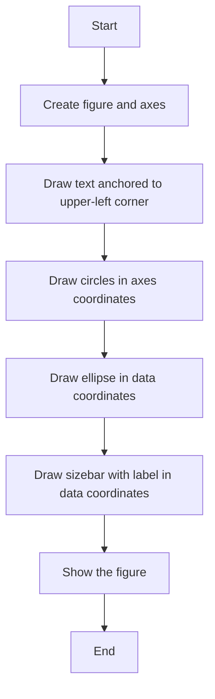

## 类结构

```
Figure
├── Axes
│   ├── Text
│   ├── Circles
│   ├── Ellipse
│   └── Sizebar
```

## 全局变量及字段


### `fig`
    
The main figure object containing all the plot elements.

类型：`matplotlib.figure.Figure`
    


### `ax`
    
The axes object where all the plot elements are drawn.

类型：`matplotlib.axes._subplots.AxesSubplot`
    


### `box`
    
An offset box used to position text or other elements relative to the axes.

类型：`matplotlib.offsetbox.AnchoredOffsetbox`
    


### `area`
    
A drawing area used to draw shapes within an offset box.

类型：`matplotlib.offsetbox.DrawingArea`
    


### `aux_tr_box`
    
An auxiliary transform box used to apply transformations to the child elements.

类型：`matplotlib.offsetbox.AuxTransformBox`
    


### `sizebar`
    
An auxiliary transform box used to draw a size bar with a label.

类型：`matplotlib.offsetbox.AuxTransformBox`
    


### `text`
    
A text area used to display text within an offset box.

类型：`matplotlib.offsetbox.TextArea`
    


### `packer`
    
A vertical packer used to arrange child elements vertically.

类型：`matplotlib.offsetbox.VPacker`
    


### `Figure`
    
The main figure object containing all the plot elements.

类型：`matplotlib.figure.Figure`
    


### `Axes`
    
The axes object where all the plot elements are drawn.

类型：`matplotlib.axes._subplots.AxesSubplot`
    


### `AnchoredOffsetbox`
    
An offset box used to position text or other elements relative to the axes.

类型：`matplotlib.offsetbox.AnchoredOffsetbox`
    


### `DrawingArea`
    
A drawing area used to draw shapes within an offset box.

类型：`matplotlib.offsetbox.DrawingArea`
    


### `AuxTransformBox`
    
An auxiliary transform box used to apply transformations to the child elements.

类型：`matplotlib.offsetbox.AuxTransformBox`
    


### `TextArea`
    
A text area used to display text within an offset box.

类型：`matplotlib.offsetbox.TextArea`
    


### `VPacker`
    
A vertical packer used to arrange child elements vertically.

类型：`matplotlib.offsetbox.VPacker`
    


### `Circle`
    
A circle patch with a center and a radius.

类型：`matplotlib.patches.Circle`
    


### `Ellipse`
    
An ellipse patch with a center, width, and height.

类型：`matplotlib.patches.Ellipse`
    


### `Line2D`
    
A line segment with x and y data points and a color.

类型：`matplotlib.lines.Line2D`
    


### `name`
    
The name of the object.

类型：`str`
    


### `fields`
    
A list of fields of the object.

类型：`list`
    


### `methods`
    
A list of methods of the object.

类型：`list`
    


### `AnchoredOffsetbox.child`
    
The child element of the anchored offset box.

类型：`matplotlib.offsetbox.OffsetBox`
    


### `AnchoredOffsetbox.loc`
    
The location of the anchored offset box relative to the axes.

类型：`str`
    


### `AnchoredOffsetbox.pad`
    
The padding between the child element and the border of the anchored offset box.

类型：`float`
    


### `AnchoredOffsetbox.frameon`
    
Whether to draw a frame around the anchored offset box.

类型：`bool`
    


### `DrawingArea.width`
    
The width of the drawing area in points.

类型：`int`
    


### `DrawingArea.height`
    
The height of the drawing area in points.

类型：`int`
    


### `AuxTransformBox.transData`
    
The transformation applied to the child elements.

类型：`matplotlib.transforms.Transform`
    


### `TextArea.text`
    
The text to be displayed in the text area.

类型：`str`
    


### `VPacker.children`
    
The list of child elements to be packed vertically.

类型：`list`
    


### `VPacker.align`
    
The alignment of the child elements within the packer.

类型：`str`
    


### `VPacker.sep`
    
The separation between the child elements in points.

类型：`int`
    


### `Circle.center`
    
The center of the circle as a tuple of (x, y) coordinates.

类型：`tuple`
    


### `Circle.radius`
    
The radius of the circle in points.

类型：`int`
    


### `Circle.fc`
    
The face color of the circle.

类型：`str`
    


### `Ellipse.center`
    
The center of the ellipse as a tuple of (x, y) coordinates.

类型：`tuple`
    


### `Ellipse.width`
    
The width of the ellipse in points.

类型：`float`
    


### `Ellipse.height`
    
The height of the ellipse in points.

类型：`float`
    


### `Line2D.xdata`
    
The x data points of the line segment as a list of floats.

类型：`list`
    


### `Line2D.ydata`
    
The y data points of the line segment as a list of floats.

类型：`list`
    


### `Line2D.color`
    
The color of the line segment.

类型：`str`
    
    

## 全局函数及方法


### draw_text(ax)

Draw a text-box anchored to the upper-left corner of the figure.

参数：

- `ax`：`matplotlib.axes.Axes`，The axes on which to draw the text-box.

返回值：无

#### 流程图

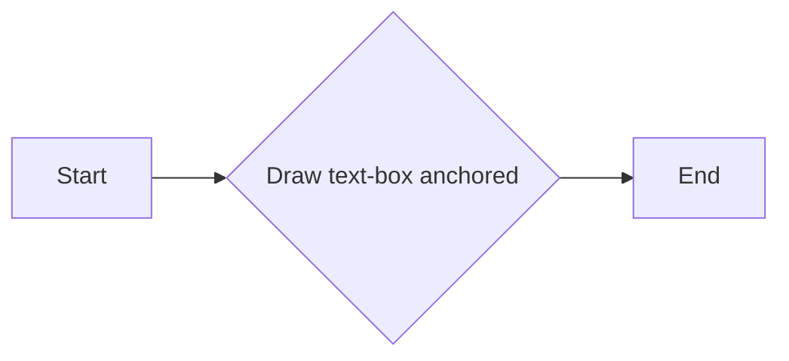

#### 带注释源码

```python
def draw_text(ax):
    """Draw a text-box anchored to the upper-left corner of the figure."""
    box = AnchoredOffsetbox(child=TextArea("Figure 1a"),
                            loc="upper left", frameon=True)
    box.patch.set_boxstyle("round,pad=0.,rounding_size=0.2")
    ax.add_artist(box)
```


### draw_circles

Draw circles in axes coordinates.

参数：

- `ax`：`matplotlib.axes.Axes`，The axes on which to draw the circles.

返回值：`None`，No return value, the circles are drawn directly on the axes.

#### 流程图

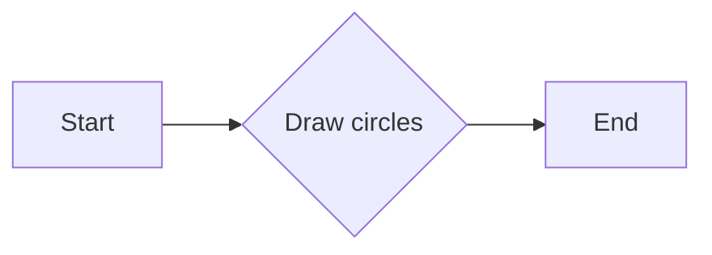

#### 带注释源码

```python
def draw_circles(ax):
    """Draw circles in axes coordinates."""
    area = DrawingArea(width=40, height=20)
    area.add_artist(Circle((10, 10), 10, fc="tab:blue"))
    area.add_artist(Circle((30, 10), 5, fc="tab:red"))
    box = AnchoredOffsetbox(
        child=area, loc="upper right", pad=0, frameon=False)
    ax.add_artist(box)
```


### draw_ellipse

Draw an ellipse of specified width and height in data coordinates.

参数：

- `ax`：`matplotlib.axes.Axes`，The axes on which to draw the ellipse.

返回值：`None`，No return value.

#### 流程图

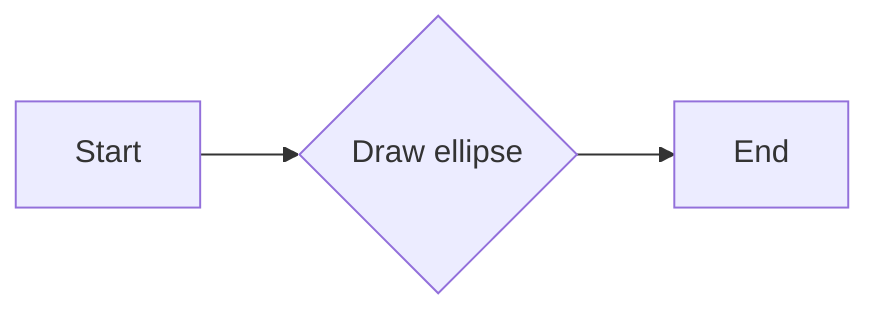

#### 带注释源码

```python
def draw_ellipse(ax):
    """Draw an ellipse of width=0.1, height=0.15 in data coordinates."""
    aux_tr_box = AuxTransformBox(ax.transData)
    aux_tr_box.add_artist(Ellipse((0, 0), width=0.1, height=0.15))
    box = AnchoredOffsetbox(child=aux_tr_box, loc="lower left", frameon=True)
    ax.add_artist(box)
```


### draw_sizebar

Draw a horizontal bar with length of 0.1 in data coordinates, with a fixed label center-aligned underneath.

参数：

- `ax`：`matplotlib.axes.Axes`，The axes on which to draw the sizebar.

返回值：`None`，This function does not return any value.

#### 流程图

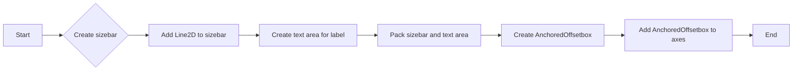

#### 带注释源码

```python
def draw_sizebar(ax):
    """
    Draw a horizontal bar with length of 0.1 in data coordinates,
    with a fixed label center-aligned underneath.
    """
    size = 0.1
    text = r"1$^{\prime}$"
    sizebar = AuxTransformBox(ax.transData)
    sizebar.add_artist(Line2D([0, size], [0, 0], color="black"))
    text = TextArea(text)
    packer = VPacker(
        children=[sizebar, text], align="center", sep=5)  # separation in points.
    ax.add_artist(AnchoredOffsetbox(
        child=packer, loc="lower center", frameon=False,
        pad=0.1, borderpad=0.5))  # paddings relative to the legend fontsize.
``` 


### plt.subplots

`plt.subplots` is a function from the `matplotlib.pyplot` module that creates a figure and a set of subplots (axes) in a single call.

参数：

- `figsize`：`tuple`，指定图形的大小，例如 `(width, height)`。
- `ncols`：`int`，指定子图的数量。
- `nrows`：`int`，指定子图的总行数。
- `sharex`：`bool`，如果为 `True`，则所有子图共享 x 轴。
- `sharey`：`bool`，如果为 `True`，则所有子图共享 y 轴。
- `fig`：`matplotlib.figure.Figure`，如果提供，则使用该图形而不是创建新的图形。
- `gridspec_kw`：`dict`，用于 `GridSpec` 的关键字参数。
- `constrained_layout`：`bool`，如果为 `True`，则使用 `constrained_layout` 自动调整子图参数。

返回值：`matplotlib.figure.Figure`，包含子图的图形对象。

#### 流程图

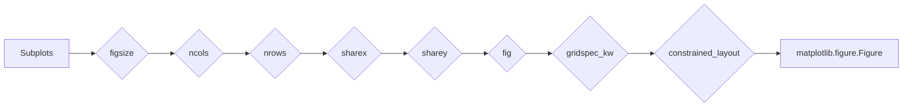

#### 带注释源码

```
fig, ax = plt.subplots(figsize=(6, 4), ncols=1, nrows=1, sharex=True, sharey=True)
```


### plt.show()

显示当前图形。

参数：

- 无

返回值：无

#### 流程图

```mermaid
graph LR
A[开始] --> B{调用plt.show()}
B --> C[结束]
```

#### 带注释源码

```python
plt.show()
```


### Figure.set_aspect

`Figure.set_aspect` is a method that sets the aspect ratio of the figure.

参数：

- `aspect`：`float`，The aspect ratio of the figure. The aspect ratio is defined as the ratio of the width to the height of the figure.

返回值：`None`，This method does not return any value.

#### 流程图

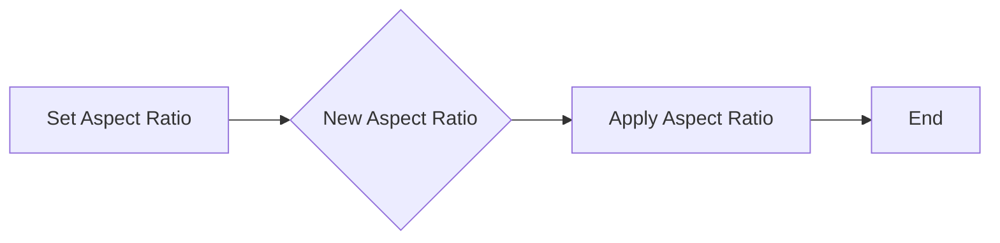

#### 带注释源码

```
fig, ax = plt.subplots()
ax.set_aspect(1)  # Set the aspect ratio of the figure to 1
```


### draw_text

`draw_text` is a function that draws a text-box anchored to the upper-left corner of the figure.

参数：

- `ax`：`AxesSubplot`，The axes object to which the text-box will be added.

返回值：`None`，This function does not return any value.

#### 流程图

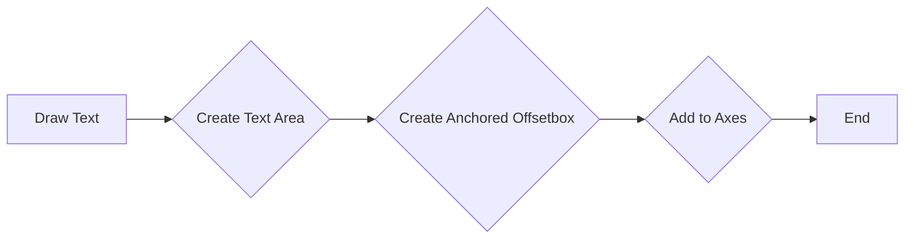

#### 带注释源码

```
def draw_text(ax):
    """Draw a text-box anchored to the upper-left corner of the figure."""
    box = AnchoredOffsetbox(child=TextArea("Figure 1a"),
                            loc="upper left", frameon=True)
    box.patch.set_boxstyle("round,pad=0.,rounding_size=0.2")
    ax.add_artist(box)
```


### draw_circles

`draw_circles` is a function that draws circles in axes coordinates.

参数：

- `ax`：`AxesSubplot`，The axes object to which the circles will be added.

返回值：`None`，This function does not return any value.

#### 流程图

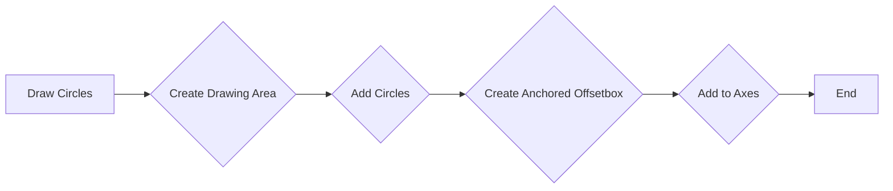

#### 带注释源码

```
def draw_circles(ax):
    """Draw circles in axes coordinates."""
    area = DrawingArea(width=40, height=20)
    area.add_artist(Circle((10, 10), 10, fc="tab:blue"))
    area.add_artist(Circle((30, 10), 5, fc="tab:red"))
    box = AnchoredOffsetbox(
        child=area, loc="upper right", pad=0, frameon=False)
    ax.add_artist(box)
```


### draw_ellipse

`draw_ellipse` is a function that draws an ellipse of width=0.1, height=0.15 in data coordinates.

参数：

- `ax`：`AxesSubplot`，The axes object to which the ellipse will be added.

返回值：`None`，This function does not return any value.

#### 流程图

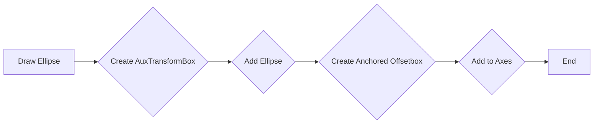

#### 带注释源码

```
def draw_ellipse(ax):
    """Draw an ellipse of width=0.1, height=0.15 in data coordinates."""
    aux_tr_box = AuxTransformBox(ax.transData)
    aux_tr_box.add_artist(Ellipse((0, 0), width=0.1, height=0.15))
    box = AnchoredOffsetbox(child=aux_tr_box, loc="lower left", frameon=True)
    ax.add_artist(box)
```


### draw_sizebar

`draw_sizebar` is a function that draws a horizontal bar with length of 0.1 in data coordinates, with a fixed label center-aligned underneath.

参数：

- `ax`：`AxesSubplot`，The axes object to which the sizebar will be added.

返回值：`None`，This function does not return any value.

#### 流程图

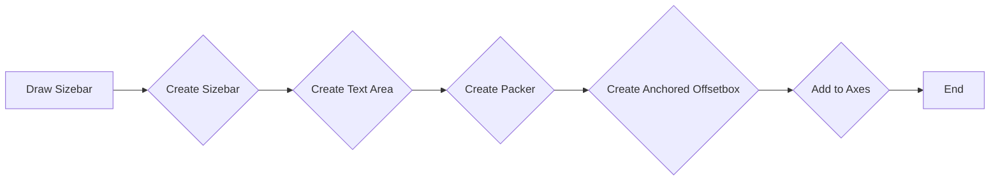

#### 带注释源码

```
def draw_sizebar(ax):
    """
    Draw a horizontal bar with length of 0.1 in data coordinates,
    with a fixed label center-aligned underneath.
    """
    size = 0.1
    text = r"1$^{\prime}$"
    sizebar = AuxTransformBox(ax.transData)
    sizebar.add_artist(Line2D([0, size], [0, 0], color="black"))
    text = TextArea(text)
    packer = VPacker(
        children=[sizebar, text], align="center", sep=5)  # separation in points.
    ax.add_artist(AnchoredOffsetbox(
        child=packer, loc="lower center", frameon=False,
        pad=0.1, borderpad=0.5))  # paddings relative to the legend fontsize.
```


### draw_text(ax)

Draw a text-box anchored to the upper-left corner of the figure.

参数：

- `ax`：`matplotlib.axes.Axes`，The axes on which to draw the text-box.

返回值：无

#### 流程图

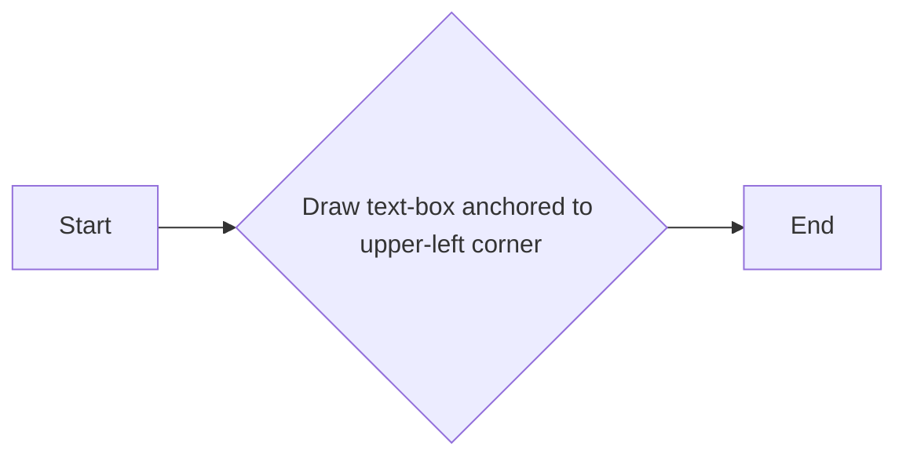

#### 带注释源码

```python
def draw_text(ax):
    """Draw a text-box anchored to the upper-left corner of the figure."""
    box = AnchoredOffsetbox(child=TextArea("Figure 1a"),
                            loc="upper left", frameon=True)
    box.patch.set_boxstyle("round,pad=0.,rounding_size=0.2")
    ax.add_artist(box)
```


### draw_text(ax)

该函数用于在图中添加一个文本框，该文本框锚定在图的上左角。

参数：

- `ax`：`matplotlib.axes.Axes`，表示要添加文本框的轴。

返回值：无

#### 流程图

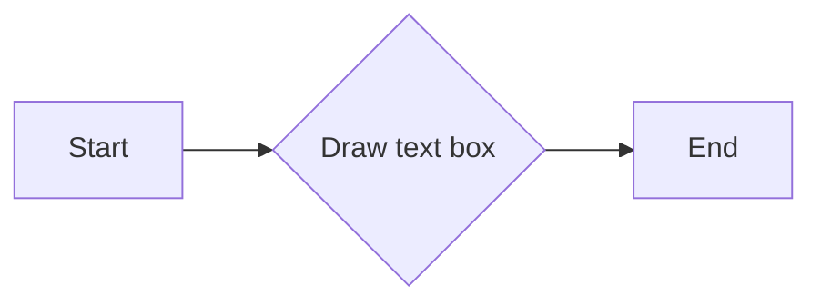

#### 带注释源码

```python
def draw_text(ax):
    """Draw a text-box anchored to the upper-left corner of the figure."""
    box = AnchoredOffsetbox(child=TextArea("Figure 1a"),
                            loc="upper left", frameon=True)
    box.patch.set_boxstyle("round,pad=0.,rounding_size=0.2")
    ax.add_artist(box)
```


### AnchoredOffsetbox.set_boxstyle

`AnchoredOffsetbox.set_boxstyle` 是一个方法，用于设置 `AnchoredOffsetbox` 的框样式。

参数：

- `boxstyle`：`str`，指定框的样式，例如 "round,pad=0.,rounding_size=0.2"。

返回值：无

#### 流程图

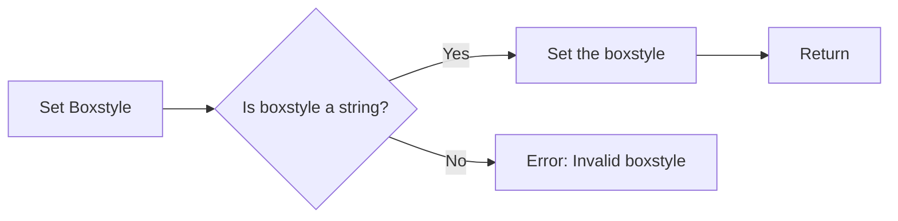

#### 带注释源码

```python
def set_boxstyle(self, boxstyle):
    """
    Set the boxstyle for the anchored offset box.

    Parameters
    ----------
    boxstyle : str
        The box style to set for the anchored offset box.

    Returns
    -------
    None
    """
    self.patch.set_boxstyle(boxstyle)
```


### draw_text(ax)

该函数用于在图中添加一个文本框，该文本框锚定在图的上左角。

参数：

- `ax`：`matplotlib.axes.Axes`，表示要添加文本框的轴。

返回值：无

#### 流程图

```mermaid
graph LR
A[draw_text] --> B{参数 ax}
B --> C[创建 AnchoredOffsetbox]
C --> D{设置 child 为 TextArea("Figure 1a")}
D --> E{设置 loc 为 "upper left"}
E --> F{设置 frameon 为 True}
F --> G[ax.add_artist(box)]
```

#### 带注释源码

```python
def draw_text(ax):
    """Draw a text-box anchored to the upper-left corner of the figure."""
    box = AnchoredOffsetbox(child=TextArea("Figure 1a"),
                            loc="upper left", frameon=True)
    box.patch.set_boxstyle("round,pad=0.,rounding_size=0.2")
    ax.add_artist(box)
```


### DrawingArea.add_artist

`DrawingArea.add_artist` 是 `DrawingArea` 类的一个方法，用于向 `DrawingArea` 对象中添加一个艺术家（artist）。

参数：

- `artist`：`matplotlib.artist.Artist`，要添加到 `DrawingArea` 的艺术家对象。

返回值：无

#### 流程图

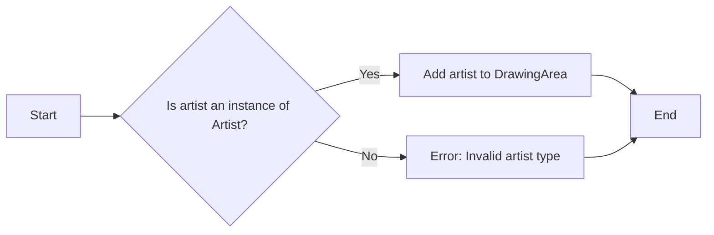

#### 带注释源码

```python
def add_artist(self, artist):
    # Check if the artist is an instance of Artist
    if not isinstance(artist, Artist):
        raise ValueError("Invalid artist type")
    
    # Add the artist to the DrawingArea
    self.artists.append(artist)
``` 


### draw_ellipse(ax)

Draw an ellipse of width=0.1, height=0.15 in data coordinates.

参数：

- `ax`：`matplotlib.axes.Axes`，The axes on which to draw the ellipse.

返回值：`None`，No return value, the ellipse is drawn directly on the axes.

#### 流程图

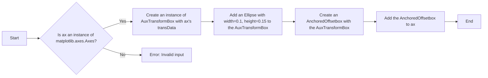

#### 带注释源码

```python
def draw_ellipse(ax):
    """Draw an ellipse of width=0.1, height=0.15 in data coordinates."""
    aux_tr_box = AuxTransformBox(ax.transData)  # Create an instance of AuxTransformBox with ax's transData
    aux_tr_box.add_artist(Ellipse((0, 0), width=0.1, height=0.15))  # Add an Ellipse with width=0.1, height=0.15 to the AuxTransformBox
    box = AnchoredOffsetbox(child=aux_tr_box, loc="lower left", frameon=True)  # Create an AnchoredOffsetbox with the AuxTransformBox
    ax.add_artist(box)  # Add the AnchoredOffsetbox to ax
```


## 关键组件


### 张量索引与惰性加载

张量索引与惰性加载是用于在计算过程中延迟计算，直到实际需要结果时才进行计算，从而提高效率。

### 反量化支持

反量化支持是指代码能够处理和转换不同量级的数值，以便于在不同量级之间进行计算和比较。

### 量化策略

量化策略是指对数值进行压缩和简化，以便于在有限的计算资源下进行高效计算。


## 问题及建议


### 已知问题

-   **代码重复性**：`draw_circles`、`draw_ellipse`和`draw_sizebar`函数中存在重复的代码，例如创建`AuxTransformBox`和添加图形元素。这可能导致维护困难，如果需要修改图形元素的创建方式。
-   **全局变量和函数**：代码中使用了全局变量`fig`和`ax`，这可能导致代码的可重用性和可测试性降低。在函数内部直接修改这些全局变量也可能导致不可预测的行为。
-   **异常处理**：代码中没有异常处理机制，如果发生错误（例如，matplotlib版本不兼容），程序可能会崩溃。

### 优化建议

-   **代码重构**：将重复的代码提取到单独的函数中，减少代码重复性，提高可维护性。
-   **封装全局变量**：将全局变量封装在类中，或者通过参数传递给函数，以提高代码的可重用性和可测试性。
-   **添加异常处理**：在关键操作处添加异常处理，确保程序在遇到错误时能够优雅地处理异常，而不是直接崩溃。
-   **文档和注释**：为代码添加详细的文档和注释，解释代码的功能、参数和返回值，提高代码的可读性。
-   **单元测试**：编写单元测试来验证代码的功能，确保代码在修改后仍然能够正常工作。


## 其它


### 设计目标与约束

- 设计目标：实现一个使用matplotlib绘图的示例，展示如何使用anchored objects进行图形元素定位。
- 约束条件：仅使用matplotlib命名空间，不依赖额外的工具包。

### 错误处理与异常设计

- 错误处理：代码中未包含显式的错误处理机制，但应确保所有函数调用都在合适的上下文中执行，避免未捕获的异常。
- 异常设计：未定义特定的异常类，但应确保所有函数在遇到错误时能够抛出适当的异常。

### 数据流与状态机

- 数据流：代码中的数据流主要是从matplotlib的pyplot模块获取绘图对象，然后通过一系列函数调用进行绘制。
- 状态机：代码中没有明显的状态机，但绘图过程中涉及到多个步骤，每个步骤都有明确的开始和结束。

### 外部依赖与接口契约

- 外部依赖：代码依赖于matplotlib库，特别是pyplot、lines、offsetbox和patches模块。
- 接口契约：所有函数都有明确的输入和输出，确保了函数的可用性和可维护性。


    