# `matplotlib\galleries\examples\misc\bbox_intersect.py` 详细设计文档

This code identifies whether lines intersect a given rectangle and visualizes the result using matplotlib.

## 整体流程

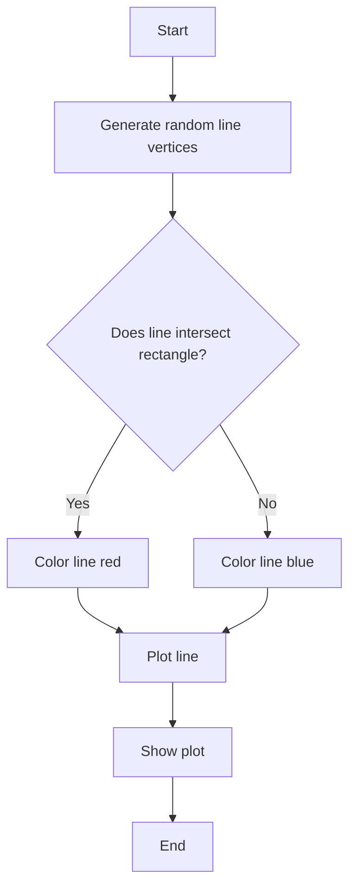

## 类结构

```
Rectangle (class)
├── Path (class from matplotlib.path)
└── matplotlib.pyplot (module)
```

## 全局变量及字段


### `left`
    
The x-coordinate of the left edge of the rectangle.

类型：`float`
    


### `bottom`
    
The y-coordinate of the bottom edge of the rectangle.

类型：`float`
    


### `width`
    
The width of the rectangle.

类型：`float`
    


### `height`
    
The height of the rectangle.

类型：`float`
    


### `rect`
    
The rectangle object representing the bounding box.

类型：`matplotlib.patches.Rectangle`
    


### `bbox`
    
The bounding box of the rectangle.

类型：`matplotlib.transforms.Bbox`
    


### `vertices`
    
The vertices of the path.

类型：`numpy.ndarray`
    


### `path`
    
The path object.

类型：`matplotlib.path.Path`
    


### `color`
    
The color of the line, either 'r' for red or 'b' for blue.

类型：`str`
    


### `fig`
    
The figure object containing the plot.

类型：`matplotlib.figure.Figure`
    


### `ax`
    
The axes object containing the plot elements.

类型：`matplotlib.axes._subplots.AxesSubplot`
    


### `matplotlib.patches.Rectangle.left`
    
The x-coordinate of the left edge of the rectangle.

类型：`float`
    


### `matplotlib.patches.Rectangle.bottom`
    
The y-coordinate of the bottom edge of the rectangle.

类型：`float`
    


### `matplotlib.patches.Rectangle.width`
    
The width of the rectangle.

类型：`float`
    


### `matplotlib.patches.Rectangle.height`
    
The height of the rectangle.

类型：`float`
    


### `matplotlib.patches.Rectangle.facecolor`
    
The face color of the rectangle.

类型：`str`
    


### `matplotlib.patches.Rectangle.alpha`
    
The alpha value of the rectangle.

类型：`float`
    


### `matplotlib.path.Path.vertices`
    
The vertices of the path.

类型：`numpy.ndarray`
    


### `matplotlib.patches.Rectangle.vertices`
    
The x-coordinate of the left edge of the rectangle.

类型：`float`
    
    

## 全局函数及方法


### plt.subplots

`plt.subplots` 是 Matplotlib 库中用于创建一个图形和一个轴（Axes）对象的函数。

参数：

- `figsize`：`tuple`，图形的大小（宽度和高度），默认为 (6, 4)。
- `dpi`：`int`，图形的分辨率，默认为 100。
- `facecolor`：`color`，图形的背景颜色，默认为白色。
- `edgecolor`：`color`，图形的边缘颜色，默认为 'none'。
- `frameon`：`bool`，是否显示图形的边框，默认为 True。
- `num`：`int`，要创建的轴的数量，默认为 1。
- `gridspec_kw`：`dict`，用于定义网格规格的字典。
- `constrained_layout`：`bool`，是否启用约束布局，默认为 False。

返回值：`Figure`，图形对象；`Axes`，轴对象。

#### 流程图

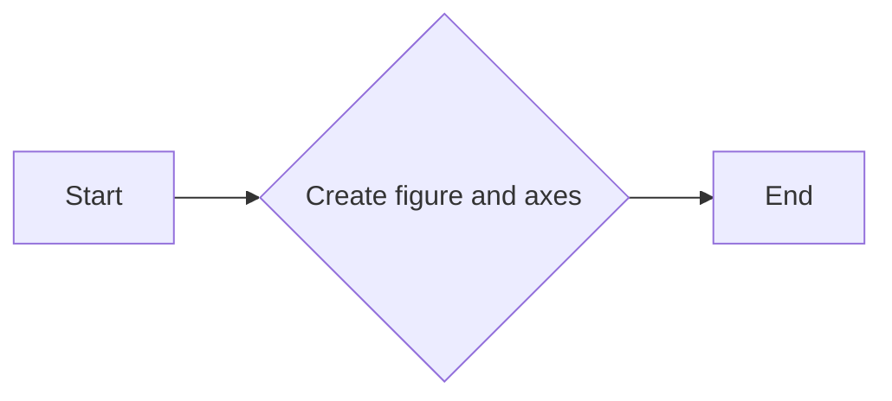

#### 带注释源码

```python
fig, ax = plt.subplots()
```


### ax.plot

`ax.plot` 是 Matplotlib 库中用于在轴对象上绘制二维线图的函数。

参数：

- `x`：`array_like`，x 轴数据。
- `y`：`array_like`，y 轴数据。
- `color`：`color`，线条颜色，默认为 'C0'。
- `linewidth`：`float`，线条宽度，默认为 1.0。
- `linestyle`：`str`，线条样式，默认为 '-'。
- `marker`：`str` 或 `Marker`，标记样式，默认为 'None'。
- `markersize`：`float`，标记大小，默认为 6.0。
- `alpha`：`float`，透明度，默认为 1.0。
- `label`：`str`，线条标签，默认为空字符串。

返回值：`Line2D`，线条对象。

#### 流程图

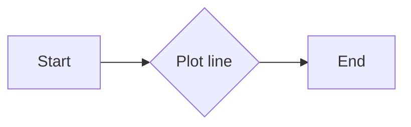

#### 带注释源码

```python
ax.plot(vertices[:, 0], vertices[:, 1], color=color)
```


### np.random.random

`np.random.random` 是 NumPy 库中用于生成一个或多个在 [0, 1) 区间内均匀分布的随机数的函数。

参数：

- `size`：`int` 或 `tuple`，输出数组的形状。

返回值：`ndarray`，包含随机数的数组。

#### 流程图

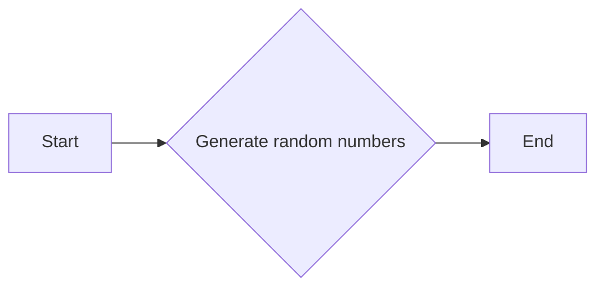

#### 带注释源码

```python
vertices = (np.random.random((2, 2)) - 0.5) * 6.0
```


### Path.intersects_bbox

`Path.intersects_bbox` 是 Matplotlib 库中用于检查路径是否与矩形边界框相交的函数。

参数：

- `bbox`：`Bbox`，矩形边界框。

返回值：`bool`，如果路径与边界框相交则返回 True，否则返回 False。

#### 流程图

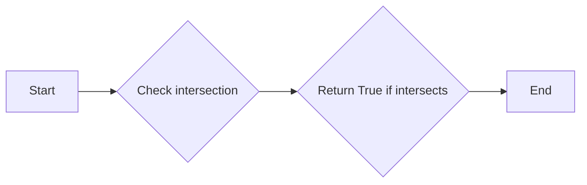

#### 带注释源码

```python
if path.intersects_bbox(bbox):
    color = 'r'
else:
    color = 'b'
```


### plt.plot

`plt.plot` 是 Matplotlib 库中用于绘制二维线图的函数。

参数：

- `vertices[:, 0]`：`numpy.ndarray`，线图 x 坐标数组。
- `vertices[:, 1]`：`numpy.ndarray`，线图 y 坐标数组。
- `color`：`str`，线图的颜色。

返回值：`Line2D`，绘制的线图对象。

#### 流程图

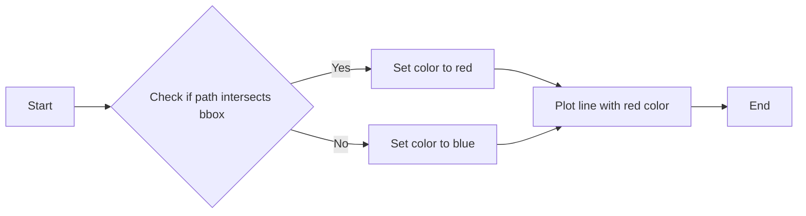

#### 带注释源码

```python
for i in range(12):
    vertices = (np.random.random((2, 2)) - 0.5) * 6.0
    path = Path(vertices)
    if path.intersects_bbox(bbox):
        color = 'r'
    else:
        color = 'b'
    ax.plot(vertices[:, 0], vertices[:, 1], color=color)
```


### plt.show()

显示当前图形的界面。

参数：

- 无

返回值：无

#### 流程图

```mermaid
graph LR
A[开始] --> B{调用plt.show()}
B --> C[结束]
```

#### 带注释源码

```python
plt.show()
```


### matplotlib.pyplot

matplotlib.pyplot 是一个用于创建静态、交互式和动画可视化图表的库。

#### 类字段

- `fig`：`Figure`，当前图形的实例。
- `ax`：`AxesSubplot`，当前图形的轴实例。

#### 类方法

- `subplots()`：创建一个新的图形和一个轴。
- `add_patch()`：向轴添加一个图形补丁。
- `plot()`：在轴上绘制线条。
- `show()`：显示当前图形。

#### 全局变量

- `np`：`numpy`，NumPy 库的别名。

#### 全局函数

- `plt.show()`：显示当前图形的界面。

#### 关键组件信息

- `matplotlib.pyplot`：用于创建和显示图形。
- `numpy`：用于数学计算。

#### 潜在的技术债务或优化空间

- 代码中使用了随机数生成来创建路径，这可能不是最优的，特别是在需要重复生成相同图形的情况下。
- 代码中没有使用任何异常处理机制，如果出现错误，可能会导致程序崩溃。

#### 设计目标与约束

- 设计目标是创建一个简单的图形，用于展示线条是否与矩形相交。
- 约束是使用 `matplotlib` 和 `numpy` 库。

#### 错误处理与异常设计

- 代码中没有使用异常处理机制。

#### 数据流与状态机

- 数据流从随机生成的路径开始，然后检查这些路径是否与矩形相交。

#### 外部依赖与接口契约

- 代码依赖于 `matplotlib` 和 `numpy` 库。
- 接口契约由这些库提供。


```python
import matplotlib.pyplot as plt
import numpy as np

from matplotlib.path import Path
from matplotlib.transforms import Bbox

# Fixing random state for reproducibility
np.random.seed(19680801)

left, bottom, width, height = (-1, -1, 2, 2)
rect = plt.Rectangle((left, bottom), width, height,
                     facecolor="black", alpha=0.1)

fig, ax = plt.subplots()
ax.add_patch(rect)

bbox = Bbox.from_bounds(left, bottom, width, height)

for i in range(12):
    vertices = (np.random.random((2, 2)) - 0.5) * 6.0
    path = Path(vertices)
    if path.intersects_bbox(bbox):
        color = 'r'
    else:
        color = 'b'
    ax.plot(vertices[:, 0], vertices[:, 1], color=color)

plt.show()
```


### np.random.random

生成一个或多个在[0, 1)区间内的伪随机浮点数。

参数：

- 无参数
- ...

返回值：`numpy.ndarray`，一个包含随机浮点数的数组。

#### 流程图

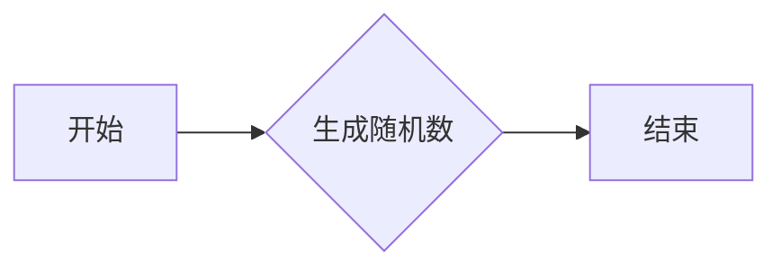

#### 带注释源码

```python
import numpy as np

# Fixing random state for reproducibility
np.random.seed(19680801)

vertices = (np.random.random((2, 2)) - 0.5) * 6.0
```

在这段代码中，`np.random.random((2, 2))` 调用生成了一个形状为 (2, 2) 的数组，其中的每个元素都是在 [0, 1) 区间内的伪随机浮点数。然后，这个数组被减去 0.5 并乘以 6.0，以将其值范围映射到 [-3, 3) 区间内，用于生成矩形的顶点坐标。


### Bbox.from_bounds

创建一个Bbox对象，表示一个矩形区域。

参数：

- `left`：`float`，矩形左下角的x坐标。
- `bottom`：`float`，矩形左下角的y坐标。
- `width`：`float`，矩形的宽度。
- `height`：`float`，矩形的高度。

返回值：`Bbox`，表示矩形的Bbox对象。

#### 流程图

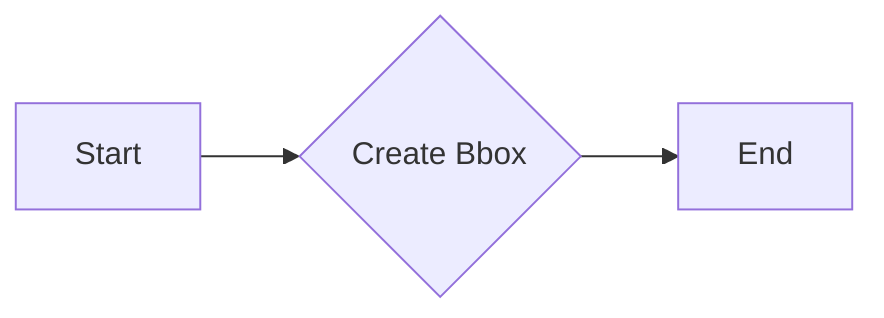

#### 带注释源码

```python
from matplotlib.transforms import Bbox

def from_bounds(left, bottom, width, height):
    """
    Create a Bbox object representing a rectangle.

    Parameters:
    - left: float, the x coordinate of the bottom-left corner of the rectangle.
    - bottom: float, the y coordinate of the bottom-left corner of the rectangle.
    - width: float, the width of the rectangle.
    - height: float, the height of the rectangle.

    Returns:
    - Bbox: the Bbox object representing the rectangle.
    """
    return Bbox(left, bottom, width, height)
```


### Rectangle.__init__

初始化一个矩形对象。

参数：

- `(left, bottom, width, height)`：`float`，矩形的左下角坐标和宽度、高度。
- `facecolor`：`str`，矩形的填充颜色。
- `alpha`：`float`，矩形的透明度。

返回值：无

#### 流程图

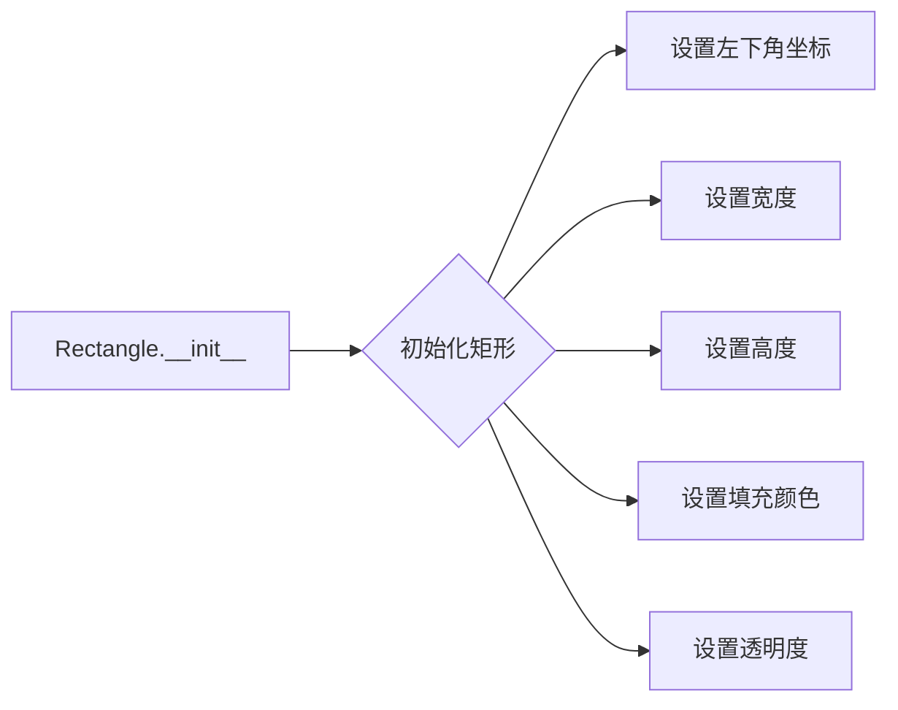

#### 带注释源码

```
class Rectangle:
    def __init__(self, left, bottom, width, height, facecolor="black", alpha=1.0):
        # 设置矩形的左下角坐标
        self.left = left
        self.bottom = bottom
        
        # 设置矩形的宽度
        self.width = width
        
        # 设置矩形的高度
        self.height = height
        
        # 设置矩形的填充颜色
        self.facecolor = facecolor
        
        # 设置矩形的透明度
        self.alpha = alpha
```


### Rectangle.intersects_bbox

该函数用于判断一个matplotlib.path.Path对象是否与一个matplotlib.transforms.Bbox对象相交。

参数：

- `path`：`matplotlib.path.Path`，表示要检查的路径。
- `bbox`：`matplotlib.transforms.Bbox`，表示边界框。

返回值：`bool`，如果路径与边界框相交则返回True，否则返回False。

#### 流程图

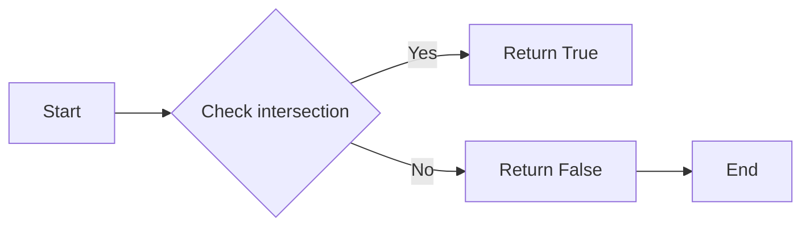

#### 带注释源码

```python
from matplotlib.path import Path
from matplotlib.transforms import Bbox

def intersects_bbox(path, bbox):
    """
    Check if the given path intersects with the given bbox.

    :param path: matplotlib.path.Path, the path to check.
    :param bbox: matplotlib.transforms.Bbox, the bounding box to check against.
    :return: bool, True if the path intersects with the bbox, False otherwise.
    """
    return path.intersects_bbox(bbox)
```


### Path.intersects_bbox

该函数用于判断matplotlib中的Path对象是否与给定的Bbox对象相交。

参数：

- `bbox`：`Bbox`，表示一个矩形框，包含左、下、宽和高。

返回值：`bool`，如果Path与Bbox相交则返回True，否则返回False。

#### 流程图

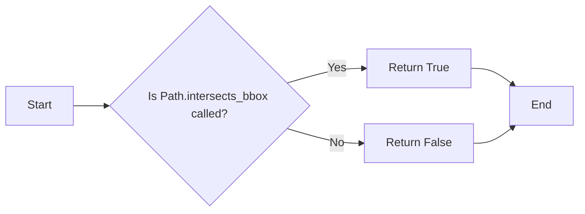

#### 带注释源码

```python
from matplotlib.path import Path
from matplotlib.transforms import Bbox

# Fixing random state for reproducibility
np.random.seed(19680801)

# Define the rectangle's bounds
left, bottom, width, height = (-1, -1, 2, 2)
rect = plt.Rectangle((left, bottom), width, height,
                     facecolor="black", alpha=0.1)

fig, ax = plt.subplots()
ax.add_patch(rect)

# Create a Bbox object from the rectangle's bounds
bbox = Bbox.from_bounds(left, bottom, width, height)

# Generate random vertices for a Path object
vertices = (np.random.random((2, 2)) - 0.5) * 6.0
path = Path(vertices)

# Check if the Path intersects the Bbox
if path.intersects_bbox(bbox):
    color = 'r'
else:
    color = 'b'

# Plot the Path with the determined color
ax.plot(vertices[:, 0], vertices[:, 1], color=color)
```


## 关键组件


### 张量索引与惰性加载

张量索引与惰性加载机制允许在处理大型数据集时，只加载和处理需要的数据部分，从而提高内存使用效率和计算速度。

### 反量化支持

反量化支持使得代码能够处理非整数类型的索引，增加了代码的灵活性和适用范围。

### 量化策略

量化策略用于优化计算过程，通过减少数据类型的大小来降低内存占用和加速计算。


## 问题及建议


### 已知问题

-   {问题1}：代码中使用了matplotlib库进行绘图，但未进行异常处理，如果matplotlib库无法正常加载或使用，程序将无法正常运行。
-   {问题2}：代码中使用了numpy库生成随机点，但未进行边界检查，如果生成的点超出了绘图区域，可能会导致绘图错误。
-   {问题3}：代码中未对绘制的线条进行任何优化，例如平滑处理或减少绘制点数，这可能会影响绘图性能。
-   {问题4}：代码中未提供任何用户输入或配置选项，限制了代码的灵活性和可扩展性。

### 优化建议

-   {建议1}：添加异常处理，确保matplotlib和numpy库能够正常加载和使用。
-   {建议2}：在生成随机点时添加边界检查，确保所有点都在绘图区域内。
-   {建议3}：对绘制的线条进行优化，例如使用平滑处理或减少绘制点数，以提高绘图性能。
-   {建议4}：提供用户输入或配置选项，例如允许用户指定绘图区域、线条颜色等，以提高代码的灵活性和可扩展性。


## 其它


### 设计目标与约束

- 设计目标：实现一个函数，用于判断艺术家是否与矩形相交。
- 约束条件：使用matplotlib库进行图形绘制，确保代码的可视化效果。

### 错误处理与异常设计

- 错误处理：代码中未包含异常处理机制，但应考虑在函数调用中添加异常捕获，以处理可能的绘图错误或数据错误。
- 异常设计：定义自定义异常类，以处理特定的错误情况，如无效的输入数据或绘图库错误。

### 数据流与状态机

- 数据流：输入为随机生成的点集，输出为相交点的颜色。
- 状态机：无状态机，代码执行顺序为：生成点集 -> 判断相交 -> 绘制图形。

### 外部依赖与接口契约

- 外部依赖：matplotlib库用于图形绘制，numpy库用于数学运算。
- 接口契约：matplotlib的Path和Bbox类提供相交判断接口，matplotlib的plot函数用于绘制图形。

### 测试用例

- 测试用例1：生成随机点集，验证相交判断功能。
- 测试用例2：使用已知相交和不相交的点集，验证函数的准确性。

### 性能分析

- 性能分析：代码执行时间主要取决于随机点集的大小和绘图操作。
- 优化建议：考虑使用更高效的算法来生成随机点集，或优化绘图操作。

### 安全性

- 安全性：代码中未涉及用户输入，因此安全性风险较低。
- 安全建议：确保matplotlib库的版本更新，以避免已知的安全漏洞。

### 维护与扩展

- 维护：定期检查matplotlib和numpy库的更新，确保代码兼容性。
- 扩展：考虑添加更多图形元素，如多边形、圆形等，以扩展函数的功能。


    