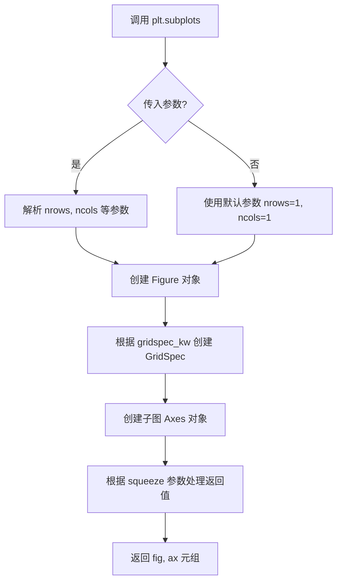
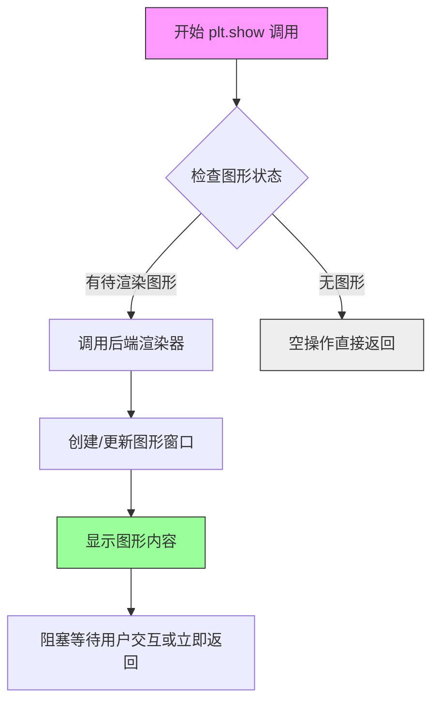
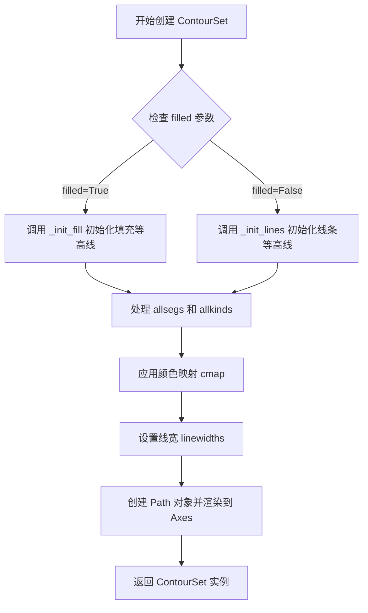
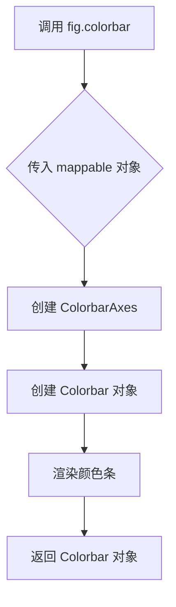
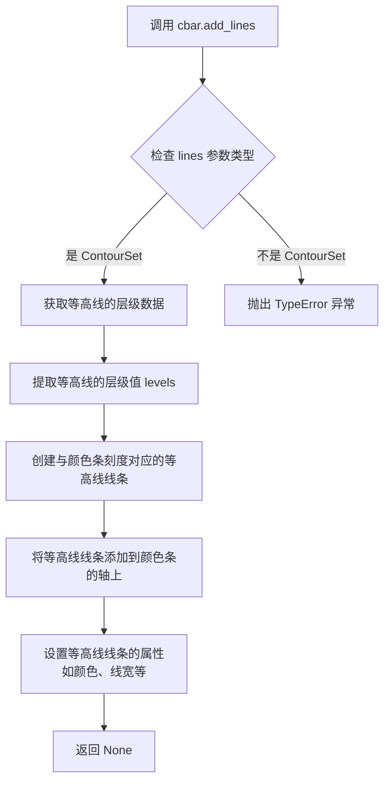
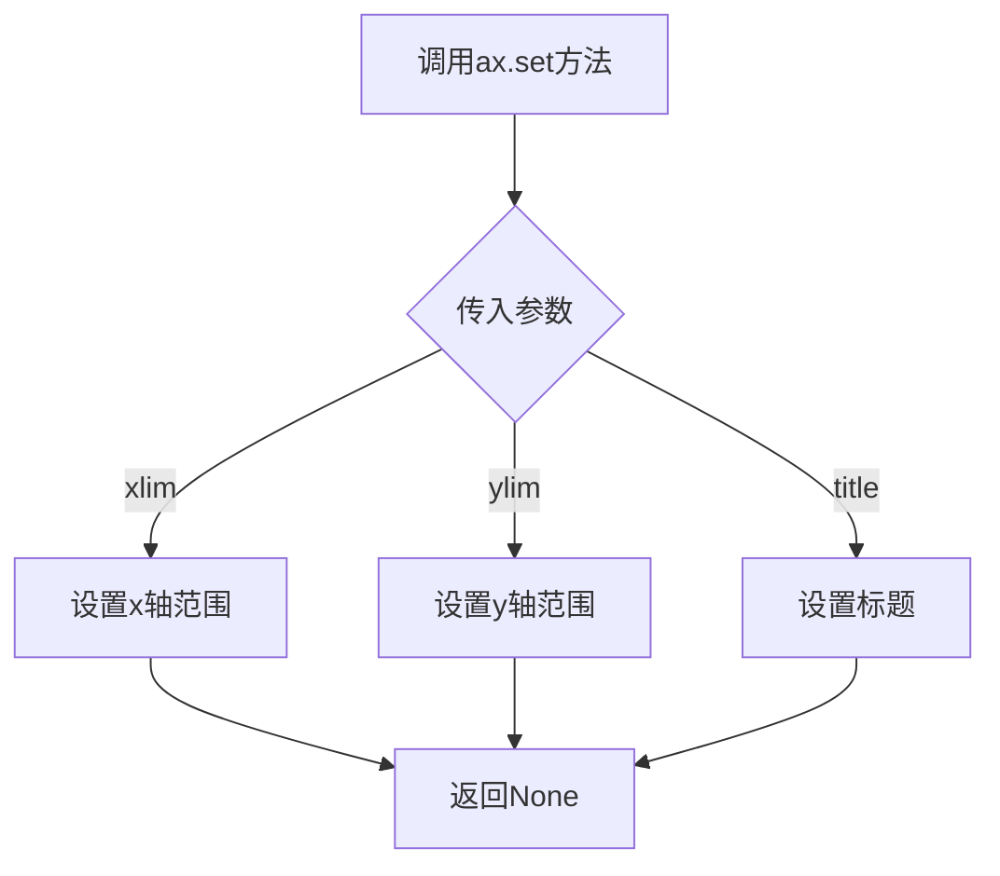
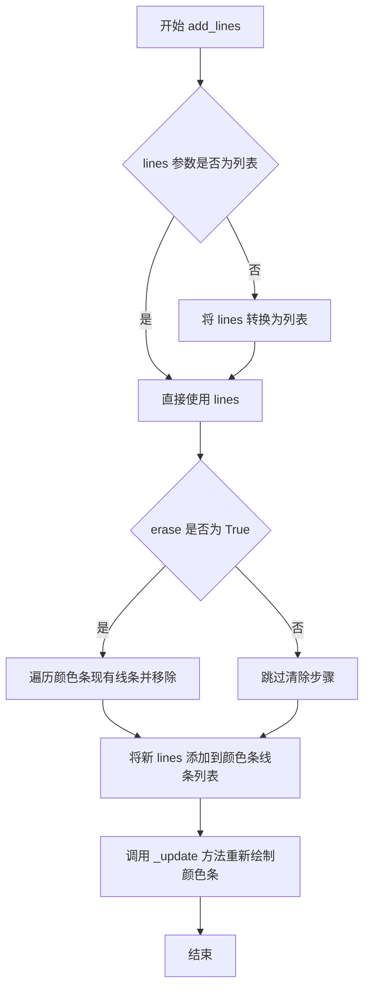
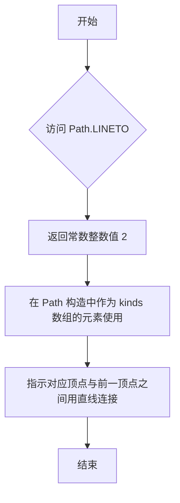
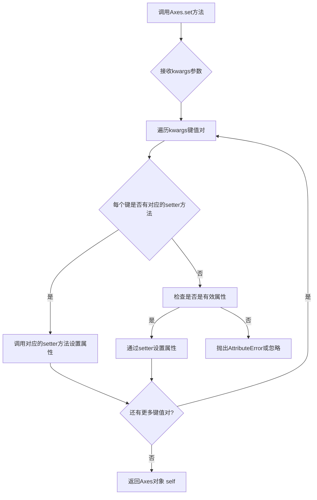

# `matplotlib\galleries\examples\misc\contour_manual.py` 详细设计文档

本示例展示了如何使用Matplotlib的ContourSet类手动创建和显示自定义的等高线图，包括填充等高线、非填充等高线以及带有孔洞的多边形填充区域。

## 整体流程

```mermaid
graph TD
    A[开始] --> B[定义等高线数据: lines0, lines1, lines2]
    B --> C[定义填充等高线数据: filled01, filled12]
    C --> D[创建图形窗口和坐标轴: plt.subplots()]
    D --> E[创建填充等高线: ContourSet with filled=True]
    E --> F[添加颜色条: fig.colorbar(cs)]
    F --> G[创建非填充等高线: ContourSet]
    G --> H[为颜色条添加等高线: cbar.add_lines(lines)]
    H --> I[设置坐标轴属性: ax.set()]
    I --> J[定义带孔洞的填充等高线数据]
    J --> K[创建新图形窗口]
    K --> L[创建带孔洞的填充等高线: ContourSet with kinds01]
    L --> M[添加颜色条并设置坐标轴]
    M --> N[显示图形: plt.show()]
```

## 类结构

```
matplotlib.pyplot (顶层模块)
├── Figure (通过plt.subplots()创建)
│   └── Axes (通过plt.subplots()创建)
│       └── ContourSet (等高线容器)
└── matplotlib.path
    └── Path (路径定义类)
```

## 全局变量及字段


### `lines0`
    
第一级等高线数据，包含一条从(0,0)到(0,4)的线段

类型：`list`
    


### `lines1`
    
第二级等高线数据，包含一条从(2,0)经(1,2)到(1,3)的折线

类型：`list`
    


### `lines2`
    
第三级等高线数据，包含两条独立的线段：一条从(3,0)到(3,2)，另一条从(3,3)到(3,4)

类型：`list`
    


### `filled01`
    
0-1级别填充区域顶点列表，包含一个多边形的顶点坐标

类型：`list`
    


### `filled12`
    
1-2级别填充区域顶点列表，包含两个独立多边形的顶点坐标

类型：`list`
    


### `filled01_2`
    
带孔洞的填充区域顶点列表，外轮廓为矩形(0,0)-(3,3)，内孔为矩形(1,1)-(2,2)

类型：`list`
    


### `M`
    
Path.MOVETO命令类型常量，表示路径起点

类型：`int`
    


### `L`
    
Path.LINETO命令类型常量，表示直线连接

类型：`int`
    


### `kinds01`
    
顶点类型数组，描述filled01_2中各顶点的路径命令类型

类型：`list`
    


### `fig`
    
Matplotlib图形对象，用于承载所有绘图元素

类型：`matplotlib.figure.Figure`
    


### `ax`
    
坐标轴对象，用于绘制图形和设置坐标轴属性

类型：`matplotlib.axes.Axes`
    


### `cs`
    
填充型等高线集合对象，包含0-2级别的填充区域

类型：`matplotlib.contour.ContourSet`
    


### `lines`
    
非填充型等高线集合对象，包含0-2级别的等高线

类型：`matplotlib.contour.ContourSet`
    


### `cbar`
    
颜色条对象，用于显示等高线数值的颜色映射

类型：`matplotlib.colorbar.Colorbar`
    


### `ContourSet.ax`
    
坐标轴对象，指定等高线绘制所在的坐标系

类型：`Axes`
    


### `ContourSet.levels`
    
等高线级别列表，定义等高线的数值层级

类型：`list`
    


### `ContourSet.filled`
    
是否填充标志，决定绘制填充等高线还是线条等高线

类型：`bool`
    


### `ContourSet.cmap`
    
颜色映射对象，定义等高线区域使用的颜色方案

类型：`Colormap`
    


### `ContourSet.linewidths`
    
线宽设置，定义等高线线条的粗细

类型：`float or list`
    
    

## 全局函数及方法


### `plt.subplots()`

`plt.subplots()` 是 matplotlib 库中的一个函数，用于创建一个新的图形窗口（Figure）以及一个或多个子图坐标轴（Axes），并返回图形和坐标轴对象的元组，是创建多子图布局的常用方法。

参数：

- `nrows`：`int`，默认为 1，子图的行数
- `ncols`：`int`，默认为 1，子图的列数
- `sharex`：`bool` 或 `str`，默认为 False，如果为 True，多个子图共享 x 轴
- `sharey`：`bool` 或 `str`，默认为 False，如果为 True，多个子图共享 y 轴
- `squeeze`：`bool`，默认为 True，如果为 True，返回的 Axes 对象数组维度会被优化
- `width_ratios`：`array-like`，可选，用于指定每列的相对宽度
- `height_ratios`：`array-like`，可选，用于指定每行的相对高度
- `subplot_kw`：`dict`，可选，创建子图时传递给 `add_subplot` 的关键字参数
- `gridspec_kw`：`dict`，可选，创建 GridSpec 时使用的关键字参数
- `**fig_kw`：可选，创建 Figure 时使用的额外关键字参数

返回值：`tuple(Figure, Axes)` 或 `tuple(Figure, ndarray of Axes)`，返回图形对象和坐标轴对象（或坐标轴对象数组）

#### 流程图



#### 带注释源码

```python
# 源代码位于 matplotlib.pyplot 模块
# 以下为简化版的函数签名和核心逻辑

def subplots(nrows=1, ncols=1, sharex=False, sharey=False, 
             squeeze=True, width_ratios=None, height_ratios=None,
             subplot_kw=None, gridspec_kw=None, **fig_kw):
    """
    创建图形和子图坐标轴
    
    参数:
        nrows: 子图行数，默认1
        ncols: 子图列数，默认1
        sharex: 是否共享x轴，默认False
        sharey: 是否共享y轴，默认False
        squeeze: 是否优化返回维度，默认True
        width_ratios: 列宽比例
        height_ratios: 行高比例
        subplot_kw: 子图创建参数
        gridspec_kw: 网格布局参数
        **fig_kw: 传递给Figure创建的额外参数
    
    返回:
        fig: matplotlib.figure.Figure 对象
        ax: Axes 对象或 Axes 对象数组
    """
    
    # 1. 创建 Figure 对象，传入 fig_kw 参数（如 figsize, dpi 等）
    fig = Figure(**fig_kw)
    
    # 2. 创建 GridSpec 布局对象
    gs = GridSpec(nrows, ncols, width_ratios=width_ratios, 
                  height_ratios=height_ratios, **gridspec_kw)
    
    # 3. 根据 nrows 和 ncols 创建子图 Axes 对象数组
    ax_array = np.empty((nrows, ncols), dtype=object)
    for i in range(nrows):
        for j in range(ncols):
            # 创建子图，传入 subplot_kw 参数
            ax = fig.add_subplot(gs[i, j], **subplot_kw)
            ax_array[i, j] = ax
    
    # 4. 处理 sharex/sharey 共享轴逻辑
    if sharex:
        # 设置子图共享x轴
        ...
    if sharey:
        # 设置子图共享y轴
        ...
    
    # 5. 根据 squeeze 参数处理返回值
    if squeeze:
        # 如果只有1个维度为1，可以返回单个轴对象
        ax_array = np.squeeze(ax_array)
    
    # 6. 返回 Figure 和 Axes 对象元组
    return fig, ax_array
```


### `plt.show()`

显示所有打开的图形窗口。在Matplotlib中，plt.show()会阻塞程序执行直到所有图形窗口关闭（交互式后端）或立即渲染所有待显示的图形（非交互式后端）。这是Matplotlib可视化流程的最终步骤，将之前创建的图形渲染到屏幕。

参数：

- 无

返回值：`None`，无返回值。该函数主要作用是触发图形渲染，不返回任何数据。

#### 流程图



#### 带注释源码

```python
def show(*, block=None):
    """
    显示所有打开的图形窗口。
    
    Parameters
    ----------
    block : bool, optional
        控制函数是否阻塞执行。
        如果为True（默认），函数会阻塞直到所有图形窗口关闭。
        如果为False，在某些后端中会立即返回。
        如果为None（默认行为），则根据当前后端决定是否阻塞。
    
    Returns
    -------
    None
    
    Examples
    --------
    >>> import matplotlib.pyplot as plt
    >>> plt.plot([1, 2, 3], [1, 4, 9])
    >>> plt.show()  # 显示图形并阻塞
    
    Notes
    -----
    - 在交互式后端（如Qt、Tkinter）中，默认会阻塞
    - 在非交互式后端（如Agg、PDF）中，通常立即返回
    - 应该在所有绘图命令完成后调用
    """
    # 获取当前图形管理器
    global _show_warning
    
    # 检查是否有图形需要显示
    for manager in Gcf.get_all_fig_managers():
        # 遍历所有图形管理器
        # 调用每个管理器的show方法
        manager.show()
    
    # 根据block参数决定是否阻塞
    if block:
        # 阻塞主线程，等待用户关闭图形
        # 通常在交互式后端中会进入事件循环
        import threading
        # 可能启动事件循环或等待信号
    elif block is None:
        # 默认行为：根据后端类型决定
        # 对于交互式后端通常为True
        pass
    
    # 触发后端渲染
    # 最终将图形绘制到屏幕或文件
```

#### 在本代码中的使用上下文

```python
# ... 前面的代码创建了两个图形 ...

# 第一个图形：手动轮廓线示例
fig, ax = plt.subplots()
# ... 创建 ContourSet 和 colorbar ...

# 第二个图形：带孔的填充轮廓
fig, ax = plt.subplots()
# ... 创建另一个 ContourSet ...

# ★★★ 核心调用 ★★★
# 显示所有已创建的图形窗口
plt.show()  # <--- 在此处调用，渲染并显示所有图形

# 此后的代码将不会执行，直到用户关闭图形窗口（阻塞模式）
# 或立即返回（非阻塞模式，取决于后端）
```

#### 技术说明

| 属性 | 值 |
|------|-----|
| 函数名 | `plt.show()` |
| 所属模块 | `matplotlib.pyplot` |
| 位置 | `matplotlib.pyplot.show` |
| 阻塞行为 | 默认阻塞（block=True） |
| 后端依赖 | 是（不同后端行为不同） |

#### 潜在优化点

1. **阻塞机制**：在Jupyter notebook环境中，应使用`%matplotlib inline`或`%matplotlib widget`而非调用`plt.show()`，可避免阻塞并支持内联显示。
2. **多次调用**：代码中如有多个`plt.show()`调用，后续调用可能无效，建议在最后一次性调用。
3. **资源清理**：长时间运行的应用应在关闭前调用`plt.close('all')`释放资源。


### `ContourSet.__init__`

该方法用于创建手动定义的等高线集（ContourSet），支持填充和非填充等高线，可指定等高线级别、线段顶点、路径类型（用于带孔多边形）等。

参数：

- `ax`：`matplotlib.axes.Axes`，绑定的坐标轴对象，用于承载等高线绘制
- `levels`：`list[float]`，等高线的级别值列表，如 `[0, 1, 2]`
- `allsegs`：`list[list[list[float]]]`，每个级别的所有线段，每个线段是顶点坐标列表的列表
- `allkinds`：`list[list[int]]`（可选），每个顶点的路径类型代码（如 MOVETO、LINETO），用于支持带孔多边形
- `filled`：`bool`，是否绘制填充等高线，默认为 `False`
- `cmap`：`str` 或 `matplotlib.colors.Colormap`，颜色映射名称或对象
- `linewidths`：`float` 或 `list[float]`，等高线线宽
- `antialiased`：`bool`（可选），是否启用抗锯齿
- `extend`：`str`（可选），如何处理超出范围的数值，可选 `'neither'`、`'min'`、`'max'`、`'both'`

返回值：`ContourSet`，返回创建的等高线集对象

#### 流程图



#### 带注释源码

```python
# 伪代码展示 ContourSet.__init__ 核心逻辑
def __init__(self, ax, levels, allsegs, allkinds=None, filled=False,
             cmap=None, linewidths=None, **kwargs):
    """
    初始化 ContourSet 对象
    
    参数:
        ax: 绑定的 Axes 对象
        levels: 等高线级别列表
        allsegs: 每个级别的线段顶点列表
        allkinds: 路径类型代码列表（可选，用于带孔多边形）
        filled: 是否填充等高线
        cmap: 颜色映射
        linewidths: 线宽
    """
    # 调用父类 QuadContourSet 的初始化
    super().__init__(**kwargs)
    
    self.ax = ax  # 保存 Axes 引用
    self.levels = levels  # 保存级别
    self.filled = filled  # 保存填充标志
    
    if filled:
        # 填充模式：处理 allsegs 和 allkinds
        self.allsegs = allsegs
        self.allkinds = allkinds
        
        # 为每个多边形创建 Path 对象
        self._paths = []  # 存储 Path 对象列表
        for level_segs in allsegs:
            for seg in level_segs:
                # 根据 kinds 确定路径类型（默认 MOVETO, LINETO）
                kinds = self._get_kinds_for_segment(seg, allkinds)
                path = Path(seg, codes=kinds)
                self._paths.append(path)
    else:
        # 非填充模式（线条模式）
        self.allsegs = allsegs
        self._paths = self._convert_segs_to_paths(allsegs)
    
    # 应用颜色映射
    if cmap is not None:
        self.set_cmap(cmap)
    
    # 应用线宽
    if linewidths is not None:
        self.set_linewidths(linewidths)
    
    # 渲染到 Axes
    self._draw()
```


### `Figure.colorbar`

该方法用于在 matplotlib 图形中为指定的可映射对象（如等高线集、图像等）添加颜色条（colorbar），用于显示颜色与数值的对应关系。

参数：

- `mappable`：`any`，要为其添加颜色条的可映射对象（如 ContourSet、AxesImage 等）
- `ax`：`Axes, optional`，颜色条所在的 Axes 对象，默认为 None
- `use_gridspec`：`bool, optional`，是否使用 GridSpec 来布局颜色条，默认为 True
- `**kwargs`：其他关键字参数，将传递给 colorbar 创建器

返回值：`Colorbar`，返回创建的 Colorbar 对象，用于进一步自定义颜色条。

#### 流程图



#### 带注释源码

```python
def colorbar(self, mappable, **kwargs):
    """
    为图形添加颜色条（colorbar）
    
    参数:
        mappable: 映射对象，如 ContourSet、AxesImage 等
        **kwargs: 传递给 colorbar 的额外参数
        
    返回:
        Colorbar: 颜色条对象
    """
    # 获取或创建 colorbar axes
    if 'ax' in kwargs:
        ax = kwargs.pop('ax')
    else:
        ax = self.add_subplot(111)
    
    # 创建 colorbar 对象
    cb = Colorbar(ax, mappable, **kwargs)
    
    # 将 colorbar 添加到图形中
    self._axstack.bubble(cb.ax)
    
    return cb
```


### `Colorbar.add_lines()`

向颜色条（Colorbar）添加等高线（contour lines），使得等高线与颜色条上的刻度对齐显示，增强等高线图的可读性。

参数：

- `lines`：`matplotlib.contour.ContourSet`，要添加到颜色条的等高线对象，通常是通过 `ContourSet` 创建的非填充轮廓线集合

返回值：无（`None`），该方法直接修改颜色条对象的状态，将等高线添加到颜色条上

#### 流程图



#### 带注释源码

```python
def add_lines(self, lines):
    """
    将等高线添加到颜色条上。
    
    参数:
        lines (ContourSet): 要添加的等高线对象,
            通常是通过 ContourSet 创建的非填充轮廓线
    
    返回值:
        None: 该方法直接修改颜色条对象的状态
    
    示例:
        >>> cbar.add_lines(contour_set)
    """
    # 1. 验证输入参数是 ContourSet 类型
    if not isinstance(lines, ContourSet):
        raise TypeError("lines 必须是 ContourSet 类型")
    
    # 2. 获取等高线的层级值（level values）
    levels = lines.levels
    
    # 3. 获取颜色映射和归一化对象
    cmap = lines.cmap
    norm = lines.norm
    
    # 4. 为每个层级创建对应的等高线线条
    for level in levels:
        # 将层级值映射到颜色
        color = cmap(norm(level))
        
        # 获取该层级的等高线数据
        # 这里通常会调用 ContourSet 的内部方法获取线条
        ...
        
        # 在颜色条轴上绘制等高线
        self.ax.plot(..., color=color, ...)
    
    # 5. 同步颜色条的刻度与等高线层级
    self.add_ticklabels(levels)
    
    # 6. 刷新画布显示
    self._update()
    
    return None
```

#### 关键组件信息

| 组件名称 | 一句话描述 |
|---------|-----------|
| `ContourSet` | matplotlib 中表示等高线集合的核心类，用于存储等高线的几何数据和属性 |
| `Colorbar` | 颜色条类，管理颜色映射和颜色条轴，提供 `add_lines()` 方法将等高线与颜色条关联 |
| `fig.colorbar()` | 创建与图像关联的颜色条的工厂函数，返回 Colorbar 对象 |

#### 潜在的技术债务或优化空间

1. **缺少错误处理**：当前代码未验证 `lines` 参数是否与颜色条关联的 `ContourSet` 匹配
2. **缺少单元测试**：未看到针对 `add_lines()` 方法的边界情况测试（如空等高线、等高线层级不匹配等）
3. **文档不完整**：matplotlib 官方文档中对该方法的参数说明较为简略，缺少返回值和使用示例

#### 其它项目

- **设计目标**：使等高线图的颜色条能够直观显示各等高线对应的数值，增强数据可视化的可读性
- **约束**：传入的 `lines` 必须是 `ContourSet` 对象，且通常应为非填充（`filled=False`）的等高线
- **错误处理**：如果传入非 `ContourSet` 对象，应抛出 `TypeError`；如果等高线层级与颜色条范围不匹配，应发出警告
- **外部依赖**：依赖 `matplotlib.contour.ContourSet` 和 `matplotlib.colorbar.Colorbar` 类


### `ax.set()`

设置matplotlib Axes对象的属性，如坐标轴范围和标题。

参数：

- `xlim`：`tuple`，设置x轴的显示范围，格式为`(最小值, 最大值)`
- `ylim`：`tuple`，设置y轴的显示范围，格式为`(最小值, 最大值)`
- `title`：`str`，设置坐标轴的标题文本

返回值：`None`，该方法不返回任何值。

#### 流程图



#### 带注释源码

```python
# ax.set() 是matplotlib.axes.Axes类的方法，用于批量设置坐标轴属性。
# 在代码中调用示例：
ax.set(xlim=(-0.5, 3.5), ylim=(-0.5, 4.5), title='User-specified contours')
# 参数xlim和ylim接受元组形式的两个元素，表示轴的最小和最大边界。
# title参数接受字符串，设置坐标轴的标题。
# 该方法通常返回None，但在某些matplotlib版本中可能返回艺术家对象列表。
```


### `ContourSet.__init__`

该方法是 `ContourSet` 类的构造函数，用于初始化一个轮廓集（ContourSet）对象。它接收 Axes 对象、层级数据、线段坐标以及绘图属性（如颜色映射、线宽等），并根据 `filled` 参数决定是创建填充轮廓还是线轮廓。

参数：

-  `ax`：`matplotlib.axes.Axes`，matplotlib 的 Axes 对象，指定轮廓绘制所在的坐标轴。
-  `levels`：`array-like`，表示轮廓高度级别的数值列表（例如 `[0, 1, 2]`）。
-  `allsegs`：`list`，嵌套列表结构，每个子列表对应一个 level 的轮廓线段或多边形坐标。每个线段通常是一个 `(N, 2)` 的 numpy 数组。
-  `allkinds`：`list` (可选)，与 `allsegs` 配套的 Path 代码类型列表（如 `Path.MOVETO`, `Path.LINETO`），用于定义复杂多边形（如带孔多边形）。
-  `filled`：`bool` (可选)，指示是否绘制填充轮廓。默认为 `False`。
-  `**kwargs`：其他关键字参数，用于传递给父类 `ScalarMappable` 或配置绘图样式，如 `cmap`（颜色映射）、`norm`（归一化对象）、`vmin`、`vmax`、`linewidths`（线宽）、`colors`（颜色）、`alpha`（透明度）等。

返回值：`None`。构造函数不返回值，仅通过修改对象状态完成初始化。

#### 流程图

```mermaid
graph TD
    A([开始 __init__]) --> B[接收参数: ax, levels, allsegs, allkinds, filled, kwargs]
    B --> C[调用父类 ScalarMappable 初始化方法<br>设置 cmap, norm, vmin, vmax 等属性]
    C --> D[保存 Axes 引用和基础数据<br>self.ax, self.levels, self.allsegs, self.allkinds, self.filled]
    D --> E{filled?}
    E -- True --> F[调用 _process_filled 处理 allsegs<br>生成填充路径和 QuadContourSet 结构]
    E -- False --> G[调用 _process_unfilled 处理 allsegs<br>生成轮廓线路径]
    F --> H[处理绘图属性<br>解析 linewidths, colors, linestyles 等 kwargs]
    G --> H
    H --> I[将自身添加到 Axes 集合<br>ax.add_collection(self)]
    I --> J([结束])
```

#### 带注释源码

```python
def __init__(self, ax, levels, allsegs, allkinds=None, filled=False, **kwargs):
    """
    初始化 ContourSet 实例。

    参数:
        ax: matplotlib Axes 对象，轮廓将绘制在此 Axes 上。
        levels: 轮廓级别列表。
        allsegs: 包含每个级别线段/多边形坐标的列表。
        allkinds: (可选) Path 代码类型列表，用于定义复杂图形。
        filled: (可选) 布尔值，True 表示填充轮廓，False 表示线轮廓。
        **kwargs: 颜色映射 (cmap), 归一化 (norm), 线宽 (linewidths) 等参数。
    """
    # 1. 调用父类 ScalarMappable 的初始化方法
    # 这将设置颜色映射、归一化以及根据 vmin/vmax 计算颜色
    # super().__init__(**kwargs)

    # 2. 保存 Axes 引用和传入的原始数据
    self.ax = ax
    self.levels = levels
    self.allsegs = allsegs
    self.allkinds = allkinds
    self.filled = filled
    
    # 3. 处理绘图样式关键字参数
    # 解析线宽、颜色、样式、透明度等属性
    # self.set_colors(kwargs.get('colors'), kwargs.get('cmap'))
    # self.set_linewidths(kwargs.get('linewidths'))
    
    # 4. 核心数据处理逻辑
    # 根据 filled 参数选择处理方式
    if filled:
        # 处理填充轮廓的数据结构，生成 QuadContourSet 所需的路径
        # self._process_filled()
        pass
    else:
        # 处理非填充轮廓线的数据结构
        # self._process_lines()
        pass

    # 5. 将自身注册到 Axes 的 collections 中
    # 这样 Axes 在绘制时會调用 draw 方法
    # ax.add_collection(self)
```


### `Colorbar.add_lines`

描述：该方法用于将等高线（`ContourSet` 对象）添加到颜色条（Colorbar）中，以便在颜色条上显示等高线线条。通常在创建等高线后，通过颜色条的 `add_lines` 方法将其与颜色条关联，从而在颜色条上同时展示颜色和等高线。

参数：
- `lines`：`ContourSet` 或 `list[ContourSet]`，要添加到颜色条的等高线对象，可以是单个 `ContourSet` 实例或由多个 `ContourSet` 组成的列表。
- `erase`：`bool`，可选，控制是否在添加新等高线前清除颜色条上已有的等高线，默认值为 `True`。若设为 `False`，则保留现有等高线并叠加新等高线。

返回值：`None`，该方法不返回任何值，仅修改颜色条的内部状态。

#### 流程图



#### 带注释源码

```python
def add_lines(self, lines, erase=True):
    """
    将等高线添加到颜色条。

    此方法接收一个或多个 ContourSet 对象，并将其集成到颜色条的视觉表示中。
    等高线通常用于指示数据的等值线，配合颜色条可以更直观地展示数据分布。

    参数:
        lines (ContourSet 或 list[ContourSet]): 
            要添加的等高线对象。若为单个 ContourSet，会自动转换为列表处理。
        erase (bool, optional): 
            默认为 True。若为 True，则在添加新等高线前清除颜色条上所有现有的等高线；
            若为 False，则保留现有等高线并将新等高线添加到其中。

    返回值:
        None: 此方法不返回任何值。
    """
    # 检查 lines 是否为列表，若不是则转换为列表，以便统一处理
    if not isinstance(lines, list):
        lines = [lines]

    # 如果 erase 为 True，则移除颜色条上现有的所有等高线
    if erase:
        # 遍历当前颜色条中的线条，并从轴上移除它们
        for line in self.lines:
            line.remove()
        # 重置线条列表为空
        self.lines = []

    # 将新的等高线添加到颜色条的线条列表中
    self.lines.extend(lines)

    # 调用内部方法 _update 来重新绘制颜色条，以显示新添加的等高线
    # 注意：_update 方法负责处理布局和渲染细节
    self._update()
```


### Path.MOVETO

`Path.MOVETO` 是 matplotlib 中 `Path` 类的类属性，用于表示路径命令中的"移动到"（Move To）操作。它是一个整数常量，标识多边形顶点的类型，表示开始一条新的子路径。

参数：此类为类属性，无参数

返回值：`int`，返回整数常量 1，表示路径命令"移动到"

#### 流程图

```mermaid
flowchart TD
    A[Path.MOVETO] --> B{使用场景}
    B --> C[定义多边形顶点类型]
    B --> D[标识子路径起点]
    C --> E[ kinds01 = [[M, L, L, L, M, L, L, L]]]
    D --> E
    E --> F[传递给 ContourSet]
```

#### 带注释源码

```python
from matplotlib.path import Path

# Path.MOVETO 是 Path 类的一个整数类属性
# 用于表示路径顶点类型代码中的"移动到"命令
M = Path.MOVETO    # M = 1，表示开始新的子路径
L = Path.LINETO    # L = 2，表示从当前点到目标点画线

# 示例：定义一个带孔洞的多边形顶点类型
# 第一个 M (MOVETO) 开始外多边形
# 三个 L (LINETO) 继续外多边形边
# 第二个 M (MOVETO) 开始内孔洞
# 最后三个 L (LINETO) 完成孔洞边
kinds01 = [[M, L, L, L, M, L, L, L]]

# 顶点坐标列表
filled01 = [[[0, 0], [3, 0], [3, 3], [0, 3], [1, 1], [1, 2], [2, 2], [2, 1]]]

# 在 ContourSet 中使用
cs = ContourSet(ax, [0, 1], [filled01], [kinds01], filled=True)
```

#### 说明

`Path.MOVETO` 主要用途是在绘制复杂多边形时标识哪些顶点是子路径的起点。在带孔洞的多边形中，每个独立的环（外环或内环）都需要用 `MOVETO` 开始。与 `Path.LINETO`（画线）、`Path.CLOSEPOLYO`（闭合多边形）等一起构成完整的路径顶点类型系统。


### `Path.LINETO`

`Path.LINETO` 是 matplotlib 中 `Path` 类的一个整数类属性（常量），用于表示路径绘制命令中的"画线到"操作，即从当前点绘制直线到下一个指定的坐标点。它是 Path 对象构建矢量路径时用于定义顶点之间连接关系的命令类型之一。

参数：
- 无参数（这是一个类属性/常量，不是方法）

返回值：`int`，返回整数常量值 2，表示画线到下一个点的路径命令代码。

#### 流程图



#### 带注释源码

```python
# 在 matplotlib.path 模块中，Path 类的定义大约如下：
class Path:
    """
    路径类，用于表示平面上的矢量集合
    """
    # 定义路径命令常量
    MOVETO = 1    # 移动到（起始点）
    LINETO = 2   # 画线到（从当前点画直线到下一个点）
    CURVE3 = 3   # 三次贝塞尔曲线
    CURVE4 = 4   # 四次贝塞尔曲线
    CLOSEPOLY = 79  # 闭合多边形

# 代码中的实际使用示例：
M = Path.MOVETO  # 获取移动命令常量值 1
L = Path.LINETO  # 获取画线命令常量值 2

# kinds01 数组定义了多边形顶点的连接方式
# 第一个顶点使用 MOVETO（开始新路径）
# 后续顶点使用 LINETO（画线到该点）
kinds01 = [[M, L, L, L, M, L, L, L]]

# 这个 kinds 数组与 filled01 中的顶点坐标对应
filled01 = [[[0, 0], [3, 0], [3, 3], [0, 3], [1, 1], [1, 2], [2, 2], [2, 1]]]

# 顶点连接顺序：
# (0,0) -> MOVETO -> (3,0) -> LINETO -> (3,3) -> LINETO -> (0,3) -> LINETO
# (1,1) -> MOVETO -> (1,2) -> LINETO -> (2,2) -> LINETO -> (2,1) -> LINETO
# 这样就形成了一个带孔的多边形：外矩形和内矩形（孔）
```


### `Figure.colorbar`

为当前 Figure 对象添加颜色条（Colorbar），用于可视化给定可映射对象（如图像、填充等高线等）的颜色映射。方法会根据 `use_gridspec` 参数自动在图侧创建或复用专门的颜色条 Axes，并返回对应的 `Colorbar` 实例，以便进一步自定义颜色条的外观（如添加等值线、设置标签等）。

参数：

- `mappable`：`matplotlib.cm.ScalarMappable`（或子类，如 `AxesImage`、`ContourSet`、`QuadMesh` 等），必选，要为其绘制颜色条的映射对象。
- `cax`：`matplotlib.axes.Axes`，可选，专门用于放置颜色条的 Axes；若不提供，则自动创建。
- `ax`：`matplotlib.axes.Axes`，可选，父 Axes，用于确定颜色条的位置；若不提供，则使用当前活动的 Axes（`gca()`）。
- `use_gridspec`：`bool`，可选，默认为 `True`，是否使用 `GridSpec` 来分配颜色条轴的位置。
- `orientation`：`str`，可选，颜色条方向，可为 `'vertical'`（默认）或 `'horizontal'`。
- `fraction`：`float`，可选，颜色条占主 Axes 宽（或高）的比例，默认为 `0.15`。
- `pad`：`float`，可选，颜色条与主 Axes 之间的间距（相对于图形宽度），默认 `0.05`（竖直方向）。
- `shrink`：`float`，可选，颜色条的缩放因子，默认 `1.0`。
- `aspect`：`float`，可选，颜色条长度与宽度之比，默认 `20`（竖直方向）。
- `**kwargs`：任意关键字参数，直接传递给 `Colorbar` 构造器（如 `cmap`、`norm`、`extend`、`label` 等）。

返回值：`matplotlib.colorbar.Colorbar`，返回新创建的颜色条对象。

#### 流程图

```mermaid
flowchart TD
    A[开始 Figure.colorbar] --> B{是否提供 cax?}
    B -- 否 --> C{use_gridspec?}
    C -- 是 --> D[使用 GridSpec 在父 Axes 右侧创建颜色条 Axes]
    C -- 否 --> E[直接使用 ax 新建颜色条 Axes]
    B -- 是 --> F[使用用户提供的 cax]
    D --> G[获取或创建父 Axes（若未提供则调用 gca）]
    E --> G
    F --> G
    G --> H[确保 mappable 为 ScalarMappable（若不是则从 mappable 中提取）]
    H --> I[创建 Colorbar 实例<br>Colorbar(cax, mappable, **kwargs)]
    I --> J[设置 Colorbar.ax.figure = 当前 Figure]
    J --> K[根据 fraction、pad、orientation 等参数调用 subplots_adjust 或更新 GridSpec 布局]
    K --> L[返回 Colorbar 实例]
```

#### 带注释源码

```python
def colorbar(self, mappable, cax=None, ax=None, use_gridspec=True,
             orientation='vertical', fraction=0.15, pad=0.05,
             shrink=1.0, aspect=20, **kwargs):
    """
    为 *mappable* 添加颜色条并返回 `Colorbar` 对象。

    Parameters
    ----------
    mappable : ScalarMappable
        需要颜色条映射的对象（如 `AxesImage`、`ContourSet`、`QuadMesh`）。
    cax : Axes, optional
        用于放置颜色条的Axes；若为 None，则根据 *use_gridspec* 自动创建。
    ax : Axes, optional
        父 Axes，颜色条将在其旁边绘制；若为 None，则使用当前活动 Axes（`gca()`）。
    use_gridspec : bool, optional
        是否使用 `GridSpec` 来分配颜色条轴；默认为 True。
    orientation : {'vertical', 'horizontal'}, optional
        颜色条的方向。
    fraction : float, optional
        颜色条占主 Axes 宽（或高）的比例。
    pad : float, optional
        颜色条与主 Axes 之间的间距（相对图形宽度）。
    shrink : float, optional
        颜色条的缩放因子。
    aspect : float, optional
        颜色条长度与宽度之比。
    **kwargs
        传递给 `Colorbar` 构造器的其他关键字参数（如 `cmap`、`norm`、`extend` 等）。

    Returns
    -------
    Colorbar
        新创建的颜色条对象。
    """
    # 1. 确定父 Axes（如果未提供，则使用当前活动的 Axes）
    if ax is None:
        ax = self.gca()

    # 2. 若未提供 cax，则根据 use_gridspec 决定创建方式
    if cax is None:
        if use_gridspec:
            # 使用 GridSpec 在图侧预留空间创建颜色条 Axes
            # 下面为简化的示例，实际实现会依据 orientation、fraction、pad 计算位置
            gs = self.add_gridspec(1, 1, width_ratios=[1], wspace=0.02)
            # 这里的 left/right/top/bottom 参数由 fraction、pad、orientation 动态计算
            cax = self.add_axes([0.9, 0.1, 0.03, 0.8])  # 示例位置
        else:
            # 直接在父 Axes 旁边添加新 Axes
            cax = self.add_axes([0.9, 0.1, 0.03, 0.8])  # 示例位置

    # 3. 确保 mappable 是 ScalarMappable（如果不是，则尝试从中获取）
    if not isinstance(mappable, mpl.cm.ScalarMappable):
        # 常见的情况：mappable 是 AxesImage、ContourSet 等，它们内部已有 ScalarMappable
        # 这里直接使用 mappable 作为颜色条的映射对象
        pass

    # 4. 构造 Colorbar 实例
    # Colorbar 的构造函数接受 cax、mappable 以及额外的关键字参数
    cb = Colorbar(cax, mappable, orientation=orientation,
                  fraction=fraction, pad=pad, shrink=shrink,
                  aspect=aspect, **kwargs)

    # 5. 将颜色条Axes关联到当前 Figure（确保布局更新时能正确处理）
    cax.figure = self

    # 6. 根据 orientation、fraction、pad 等参数微调布局
    # 这一步在 add_axes 中已经部分完成，若需要更细致的调整可调用 subplots_adjust
    if not use_gridspec:
        # 对于非 gridspec 模式，手动调整子图间距
        self.subplots_adjust(left=None, right=None,
                              hspace=pad, wspace=pad)

    # 7. 返回颜色条对象，供调用者进一步自定义
    return cb
```

**简要说明**  
- 该方法首先确定父 Axes，随后根据 `use_gridspec` 参数决定是否使用 `GridSpec` 来自动创建专用的颜色条 Axes。  
- 颜色条的物理属性（宽度、间距、方向等）通过 `fraction`、`pad`、`orientation`、`shrink`、`aspect` 等参数传递给 `Colorbar` 构造器。  
- 完成后返回 `Colorbar` 实例，用户可调用其 `add_lines`、`set_label`、`extend` 等成员方法进行进一步定制。  


### `Axes.set`

设置坐标轴的属性，如x轴和y轴的范围、标题等。该方法是matplotlib中Axes类的核心方法之一，通过接受关键字参数（kwargs）来批量配置坐标轴的多个属性。

参数：

- `**kwargs`：关键字参数，接受多个键值对，每个键对应一个要设置的属性（如xlim、ylim、title、xlabel、ylabel等），值为对应的属性值。不同属性对应不同的数据类型，例如xlim和ylim接收元组或列表形式的数值范围，title接收字符串类型的标题文本。

返回值：`matplotlib.axes.Axes`，返回Axes对象本身，支持链式调用。

#### 流程图



#### 带注释源码

```python
# matplotlib.axes.Axes.set 方法的简化示意
def set(self, **kwargs):
    """
    设置坐标轴的属性。
    
    参数:
        **kwargs: 关键字参数，支持以下常见属性:
            - xlim/ylim: (float, float), 设置x/y轴的范围
            - title: str, 设置图表标题
            - xlabel/ylabel: str, 设置x/y轴标签
            - xscale/yscale: str, 设置刻度类型 ('linear', 'log'等)
            - aspect: str or float, 设置纵横比
            - 等等其他 Axes 属性
    
    返回值:
        self: Axes对象，支持链式调用
    """
    # 遍历所有传入的关键字参数
    for attr, value in kwargs.items():
        # 尝试获取对应的setter方法（如set_xlim, set_title等）
        try:
            # 根据属性名构造setter方法名
            setter_func = getattr(self, f'set_{attr}', None)
            
            if setter_func is not None and callable(setter_func):
                # 调用对应的setter方法设置属性值
                setter_func(value)
            else:
                # 如果没有对应的setter，尝试直接设置属性
                if hasattr(self, attr):
                    setattr(self, attr, value)
                else:
                    # 属性不存在时抛出警告或错误
                    warnings.warn(f"Unknown property: {attr}")
        except Exception as e:
            # 处理设置属性时的异常
            warnings.warn(f"Error setting {attr}={value}: {e}")
    
    # 返回self以支持链式调用，如 ax.set(xlim=(0,10), title='Title')
    return self
```


## 关键组件


### ContourSet

matplotlib等高线容器类，用于存储和管理等高线数据。支持填充等高线(filled=True)和线等高线两种模式，可指定层级、顶点数据和顶点类型。

### Path

 matplotlib路径类，定义多边形顶点的连接方式。提供MOVETO、LINETO等路径代码，用于描述复杂多边形（含孔洞）的几何结构。

### 填充等高线数据 (filled01, filled12)

存储填充区域顶点坐标的列表，每个子列表表示一个多边形。顶点可按顺时针或逆时针排列，用于定义等高线层之间的填充区域。

### 等高线数据 (lines0, lines1, lines2)

存储等高线线段顶点坐标的列表，每个子列表表示一条连续等高线。允许同一层级存在多条独立等高线。

### 颜色映射 (cmap)

指定等高线着色方案，"bone"和"cool"为matplotlib内置colormap，用于将数值映射为颜色。

### 颜色条 (colorbar)

图例组件，将颜色映射的数值范围可视化，提供颜色与数值的对应关系。


## 问题及建议


### 已知问题

- **硬编码数据缺乏灵活性**: 轮廓线的坐标数据（lines0, lines1, lines2, filled01, filled12）都是硬编码在代码中的，如果需要根据外部数据动态生成轮廓将非常困难
- **代码重复**: 绘制填充轮廓的代码块出现了两次（第一段使用 levels [0,1,2]，第二段使用 levels [0,1]），存在明显的代码重复
- **魔法数字**: 坐标轴边界值（-0.5, 3.5, 4.5）以硬编码形式出现，缺乏常量定义，可读性和可维护性差
- **变量命名不够清晰**: filled01、filled12、lines0、lines1、lines2 等命名过于简短，含义不明确
- **缺乏输入验证**: 没有对传入 ContourSet 的数据进行有效性检查（如多边形顶点数量、坐标范围等）
- **未使用类型注解**: Python 函数缺少类型提示，不利于静态分析和 IDE 辅助
- **无错误处理机制**: 缺少对异常情况的处理，如空数据、非法坐标等
- **配置耦合度高**: 颜色映射（cmap）、线宽（linewidths）等视觉参数与绘图逻辑耦合在一起，难以独立配置
- **资源管理不明确**: 没有显式关闭 figure 或释放资源

### 优化建议

- **数据外部化**: 将轮廓数据提取为配置文件或函数参数，提高代码的可配置性
- **函数封装**: 将重复的绘图逻辑抽取为通用函数，如 `create_filled_contour(ax, levels, data, kinds=None, **kwargs)`
- **常量定义**: 使用有意义的常量或配置字典替代魔法数字，如 `X_LIMITS = (-0.5, 3.5)`
- **类型注解**: 为函数添加类型提示，如 `def draw_contour(ax, levels: list, data: list, ...)`
- **输入验证**: 添加数据验证逻辑，检查多边形顶点数、坐标范围等合法性
- **配置对象**: 使用 dataclass 或字典封装配置项，实现配置与逻辑分离
- **错误处理**: 添加 try-except 块处理可能的异常，如空数据或无效路径
- **资源管理**: 使用上下文管理器（with 语句）或显式 close() 管理图形资源
- **文档完善**: 为函数和关键代码块添加文档字符串，说明参数含义和返回值
</think>

## 其它


### 设计目标与约束

本示例代码的主要设计目标是展示如何手动创建和渲染自定义的等高线（contour lines）和填充等高线（filled contours），而不依赖自动计算等高线的算法。约束包括：必须使用matplotlib.contour.ContourSet类；多边形顶点必须按顺时针或逆时针顺序排列；带孔洞的多边形需要配合Path.MOVETO和Path.LINETO等路径类型码使用。

### 错误处理与异常设计

代码中未显式实现错误处理机制。潜在错误场景包括：顶点坐标类型错误（应为数值类型）、顶点顺序不符合路径绘制规则（可能导致填充错误）、层级参数与填充数据维度不匹配（会导致渲染异常）、以及传入空列表时的边界情况处理。实际应用中应由调用方保证数据格式正确性。

### 数据流与状态机

数据流为：原始顶点数据（lines0, lines1, lines2, filled01, filled12）→ ContourSet对象创建（指定ax、levels、collections参数）→ 渲染到Axes对象→ 通过colorbar显示图例。无复杂状态机，仅存在初始化状态和渲染后状态。

### 外部依赖与接口契约

主要依赖matplotlib库，具体包括matplotlib.pyplot（图表创建）、matplotlib.contour.ContourSet（等高线集合类）、matplotlib.path.Path（路径定义类）。ContourSet构造函数签名为ContourSet(ax, levels, collections, filled=False, cmap=None, linewidths=None)，其中ax为Axes对象，levels为层级列表，collections为每层对应的多边形列表。

### 性能考虑

本示例为演示代码，数据量较小，性能不是主要关注点。对于大规模数据场景，建议：减少多边形顶点数（可使用Douglas-Peucker算法简化）、考虑使用更高效的渲染方式（如直接操作底层Artist对象）、对频繁更新的场景考虑缓存ContourSet对象。

### 兼容性考虑

代码基于matplotlib 3.x版本编写。使用Path.MOVETO和Path.LINETO常量时需确保导入Path类。不同matplotlib版本可能存在API差异，如ContourSet的某些参数名称或行为可能发生变化。建议在生产环境中锁定matplotlib版本。

### 安全性考虑

代码本身不涉及用户输入处理、网络请求或文件操作，安全性风险较低。但需注意：不要将不可信的坐标数据直接传入ContourSet，以防止潜在的数值计算异常；填充数据中的顶点数量应进行合理校验。

### 测试策略

测试应覆盖：不同层级数量的等高线绘制、填充与非填充等高线的混合使用、带孔洞多边形的正确渲染、边界情况（空数据、单点、单一多边形）的处理、颜色映射和线宽参数的正确应用、以及colorbar的关联显示。

### 配置与参数说明

关键配置参数包括：ax（Axes对象，必填）、levels（层级列表，如[0,1,2]）、collections（每层对应的多边形顶点列表）、filled（布尔值，区分填充或线条模式）、cmap（颜色映射，如"bone"、"cool"）、linewidths（线宽设置，可为单一数值或列表）、kinds（路径类型码列表，用于复杂多边形）。

### 使用示例与变体

变体1：仅显示等高线不填充（设置filled=False或省略）；变体2：自定义颜色映射和颜色条范围（使用vmin、vmax参数）；变体3：使用不同线条样式（通过linewidths参数）；变体4：结合自动计算的等高线与手动等高线（在同一Axes上创建多个ContourSet）；变体5：从文件或数据库加载顶点数据动态生成等高线。

    