# `matplotlib\galleries\examples\misc\custom_projection.py` 详细设计文档

This code defines a custom Hammer projection for Matplotlib, providing a geographic projection class that can be used to create equal-area maps.

## 整体流程

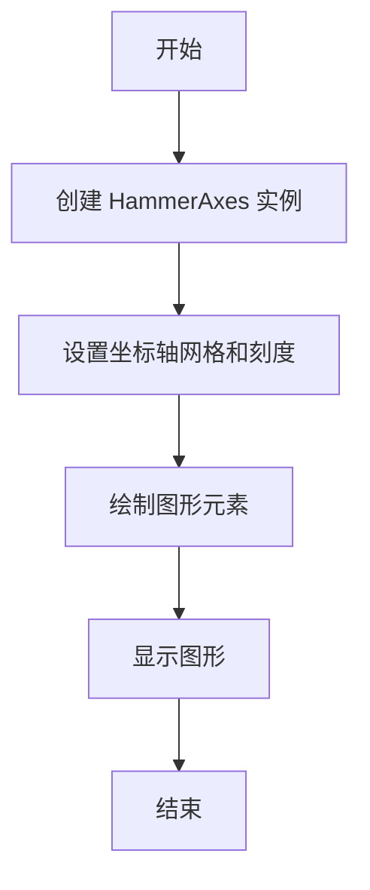

## 类结构

```
GeoAxes (地理投影基类)
├── HammerAxes (Hammer 投影类)
```

## 全局变量及字段


### `rcParams`
    
Matplotlib's runtime configuration parameters.

类型：`dict`
    


### `np`
    
NumPy module for numerical operations.

类型：`module`
    


### `matplotlib`
    
Matplotlib module for plotting.

类型：`module`
    


### `Axes`
    
Base class for all axes in Matplotlib.

类型：`class`
    


### `maxis`
    
Module containing axis classes for Matplotlib.

类型：`module`
    


### `Circle`
    
Class for creating circle patches in Matplotlib.

类型：`class`
    


### `Path`
    
Class for representing a path in Matplotlib.

类型：`class`
    


### `register_projection`
    
Function to register a custom projection with Matplotlib.

类型：`function`
    


### `Transform`
    
Base class for all transformations in Matplotlib.

类型：`class`
    


### `Affine2D`
    
Class for representing 2D affine transformations in Matplotlib.

类型：`class`
    


### `BboxTransformTo`
    
Class for transforming bounding boxes in Matplotlib.

类型：`class`
    


### `FixedLocator`
    
Class for creating fixed interval locators in Matplotlib.

类型：`class`
    


### `Formatter`
    
Base class for formatters in Matplotlib.

类型：`class`
    


### `NullLocator`
    
Class for creating null locators in Matplotlib.

类型：`class`
    


### `DEGREE SIGN`
    
Unicode character for degree sign.

类型：`string`
    


### `GeoAxes.ThetaFormatter`
    
Formatter for theta tick labels in GeoAxes.

类型：`class`
    


### `GeoAxes.RESOLUTION`
    
Resolution of the geographic projection.

类型：`int`
    


### `HammerAxes._longitude_cap`
    
Latitude at which to stop drawing longitude grids.

类型：`float`
    
    

## 全局函数及方法

### plot

The `plot` method is a part of the `HammerAxes` class in the provided code. It is used to draw lines and markers on the plot using the custom Hammer projection.

#### 参数

- `x`：`numpy.ndarray`，代表x坐标的数组。
- `y`：`numpy.ndarray`，代表y坐标的数组。
- `fmt`：`str`，用于指定线型和标记的样式。

#### 返回值

- `Line2D`：表示绘制出的线对象。

#### 流程图

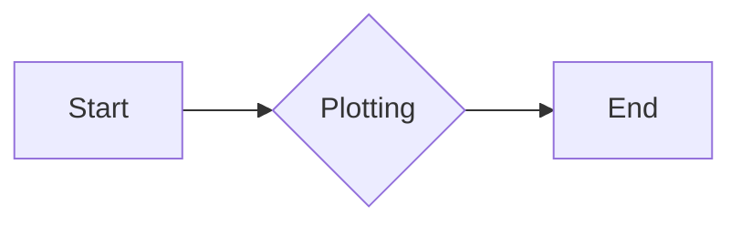

#### 带注释源码

```python
def plot(self, x, y, fmt=None):
    """
    Plot lines and/or markers on the plot using the custom Hammer projection.

    Parameters
    ----------
    x : numpy.ndarray
        Array of x coordinates.
    y : numpy.ndarray
        Array of y coordinates.
    fmt : str, optional
        Line and marker style string.

    Returns
    -------
    Line2D
        Line object representing the plotted line.
    """
    # Convert x and y coordinates to Hammer projection
    x_hammer, y_hammer = self._get_core_transform(self.RESOLUTION).transform(x, y)

    # Plot the line using the transformed coordinates
    line = self.plot(x_hammer, y_hammer, fmt)

    return line
```

### Key Components

- `HammerAxes`: Custom class for the Aitoff-Hammer projection.
- `_get_core_transform`: Method to get the core transformation for the Hammer projection.
- `plot`: Method to plot lines and markers on the plot using the custom Hammer projection.

### HammerAxes._get_core_transform

**描述**

该函数用于获取 Hammer 投影的核心转换。它返回一个 `HammerTransform` 对象，该对象负责将经纬度坐标转换为 Hammer 投影空间中的坐标。

**参数**

- `resolution`：`int`，用于控制转换的精度。分辨率越高，转换结果越精确。

**返回值**

- `HammerAxes.HammerTransform`：一个 `HammerTransform` 对象，用于执行转换。

#### 流程图

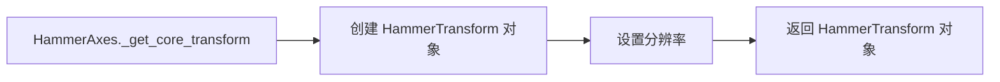

#### 带注释源码

```python
def _get_core_transform(self, resolution):
    return self.HammerTransform(resolution)
```

### HammerAxes._get_core_transform

#### 描述

`_get_core_transform` 方法是 `HammerAxes` 类的一个私有方法，它返回一个 `HammerTransform` 对象，该对象用于将地理坐标（经度和纬度）转换为 Hammer 投影坐标。

#### 参数

- `resolution`：`int`，表示在输入线段之间进行插值的步数，以近似其在 Hammer 空间中的路径。

#### 返回值

- `HammerTransform` 对象，用于转换地理坐标到 Hammer 投影坐标。

#### 流程图

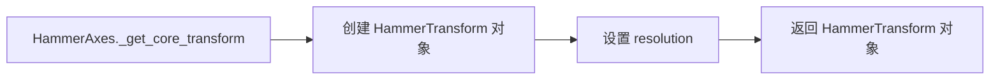

#### 带注释源码

```python
def _get_core_transform(self, resolution):
    return self.HammerTransform(resolution)
```


### HammerAxes.HammerTransform

#### 描述

`HammerTransform` 是 `HammerAxes` 类的一个嵌套类，它是一个 `Transform` 对象，用于将地理坐标（经度和纬度）转换为 Hammer 投影坐标。

#### 参数

- `resolution`：`int`，表示在输入线段之间进行插值的步数，以近似其在 Hammer 空间中的路径。

#### 方法

- `transform_non_affine`：将地理坐标转换为 Hammer 投影坐标。
- `transform_path_non_affine`：将地理坐标路径转换为 Hammer 投影路径。
- `inverted`：返回一个 `InvertedHammerTransform` 对象，用于将 Hammer 投影坐标转换回地理坐标。

#### 流程图

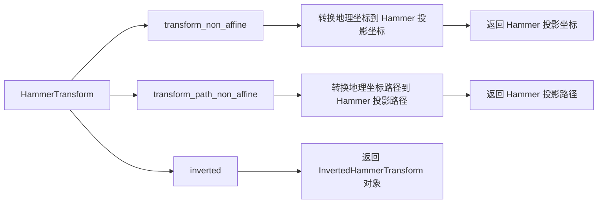

#### 带注释源码

```python
class HammerTransform(Transform):
    input_dims = output_dims = 2

    def __init__(self, resolution):
        Transform.__init__(self)
        self._resolution = resolution

    def transform_non_affine(self, ll):
        longitude, latitude = ll.T

        # Pre-compute some values
        half_long = longitude / 2
        cos_latitude = np.cos(latitude)
        sqrt2 = np.sqrt(2)

        alpha = np.sqrt(1 + cos_latitude * np.cos(half_long))
        x = (2 * sqrt2) * (cos_latitude * np.sin(half_long)) / alpha
        y = (sqrt2 * np.sin(latitude)) / alpha
        return np.column_stack([x, y])

    def transform_path_non_affine(self, path):
        # vertices = path.vertices
        ipath = path.interpolated(self._resolution)
        return Path(self.transform(ipath.vertices), ipath.codes)

    def inverted(self):
        return HammerAxes.InvertedHammerTransform(self._resolution)
```


### HammerAxes.InvertedHammerTransform

#### 描述

`InvertedHammerTransform` 是 `HammerAxes` 类的一个嵌套类，它是一个 `Transform` 对象，用于将 Hammer 投影坐标转换回地理坐标。

#### 参数

- `resolution`：`int`，表示在输入线段之间进行插值的步数，以近似其在 Hammer 空间中的路径。

#### 方法

- `transform_non_affine`：将 Hammer 投影坐标转换回地理坐标。
- `inverted`：返回一个 `HammerTransform` 对象，用于将地理坐标转换为 Hammer 投影坐标。

#### 流程图

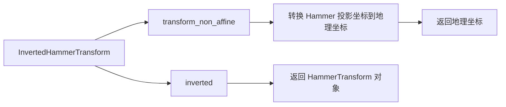

#### 带注释源码

```python
class InvertedHammerTransform(Transform):
    input_dims = output_dims = 2

    def __init__(self, resolution):
        Transform.__init__(self)
        self._resolution = resolution

    def transform_non_affine(self, xy):
        x, y = xy.T
        z = np.sqrt(1 - (x / 4) ** 2 - (y / 2) ** 2)
        longitude = 2 * np.arctan((z * x) / (2 * (2 * z ** 2 - 1)))
        latitude = np.arcsin(y*z)
        return np.column_stack([longitude, latitude])

    def inverted(self):
        return HammerAxes.HammerTransform(self._resolution)
```

### `_init_axis`

初始化地理轴，设置坐标轴和网格。

#### 参数

- 无

#### 返回值

- 无

#### 流程图

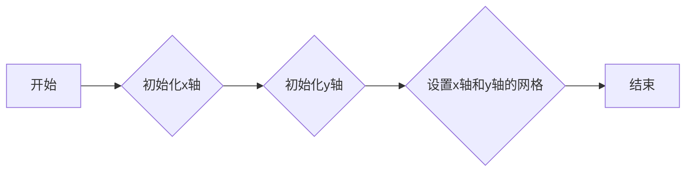

#### 带注释源码

```python
def _init_axis(self):
    self.xaxis = maxis.XAxis(self)
    self.yaxis = maxis.YAxis(self)
    # Do not register xaxis or yaxis with spines -- as done in
    # Axes._init_axis() -- until GeoAxes.xaxis.clear() works.
    # self.spines['geo'].register_axis(self.yaxis)
```

### GeoAxes.clear

#### 描述

`GeoAxes.clear` 方法用于清除 GeoAxes 对象上的所有内容，包括轴标签、网格线、图例等。

#### 参数

- 无

#### 返回值

- 无

#### 流程图

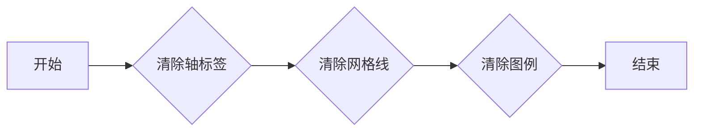

#### 带注释源码

```python
def clear(self):
    # docstring inherited
    super().clear()

    self.set_longitude_grid(30)
    self.set_latitude_grid(15)
    self.set_longitude_grid_ends(75)
    self.xaxis.set_minor_locator(NullLocator())
    self.yaxis.set_minor_locator(NullLocator())
    self.xaxis.set_ticks_position('none')
    self.yaxis.set_ticks_position('none')
    self.yaxis.set_tick_params(label1On=True)
    # Why do we need to turn on yaxis tick labels, but
    # xaxis tick labels are already on?

    self.grid(rcParams['axes.grid'])

    Axes.set_xlim(self, -np.pi, np.pi)
    Axes.set_ylim(self, -np.pi / 2.0, np.pi / 2.0)
```


### GeoAxes._set_lim_and_transforms

This method sets up the coordinate transformations for the GeoAxes class, which is used for geographic projections in Matplotlib.

参数：

- `self`：`GeoAxes`对象，表示当前GeoAxes实例

返回值：无

#### 流程图

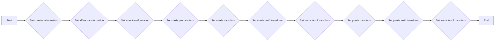

#### 带注释源码

```python
def _set_lim_and_transforms(self):
    # A (possibly non-linear) projection on the (already scaled) data

    # There are three important coordinate spaces going on here:
    #
    # 1. Data space: The space of the data itself
    #
    # 2. Axes space: The unit rectangle (0, 0) to (1, 1)
    #    covering the entire plot area.
    #
    # 3. Display space: The coordinates of the resulting image,
    #    often in pixels or dpi/inch.

    # This function makes heavy use of the Transform classes in
    # ``lib/matplotlib/transforms.py.`` For more information, see
    # the inline documentation there.

    # The goal of the first two transformations is to get from the
    # data space (in this case longitude and latitude) to Axes
    # space.  It is separated into a non-affine and affine part so
    # that the non-affine part does not have to be recomputed when
    # a simple affine change to the figure has been made (such as
    # resizing the window or changing the dpi).

    # 1) The core transformation from data space into
    # rectilinear space defined in the HammerTransform class.
    self.transProjection = self._get_core_transform(self.RESOLUTION)

    # 2) The above has an output range that is not in the unit
    # rectangle, so scale and translate it so it fits correctly
    # within the Axes.  The peculiar calculations of xscale and
    # yscale are specific to an Aitoff-Hammer projection, so don't
    # worry about them too much.
    self.transAffine = self._get_affine_transform()

    # 3) This is the transformation from Axes space to display
    # space.
    self.transAxes = BboxTransformTo(self.bbox)

    # Now put these 3 transforms together -- from data all the way
    # to display coordinates.  Using the '+' operator, these
    # transforms will be applied "in order".  The transforms are
    # automatically simplified, if possible, by the underlying
    # transformation framework.
    self.transData = \
        self.transProjection + \
        self.transAffine + \
        self.transAxes

    # The main data transformation is set up.  Now deal with
    # gridlines and tick labels.

    # Longitude gridlines and ticklabels.  The input to these
    # transforms are in display space in x and Axes space in y.
    # Therefore, the input values will be in range (-xmin, 0),
    # (xmax, 1).  The goal of these transforms is to go from that
    # space to display space.  The tick labels will be offset 4
    # pixels from the equator.
    self._xaxis_pretransform = \
        Affine2D() \
        .scale(1.0, self._longitude_cap * 2.0) \
        .translate(0.0, -self._longitude_cap)
    self._xaxis_transform = \
        self._xaxis_pretransform + \
        self.transData
    self._xaxis_text1_transform = \
        Affine2D().scale(1.0, 0.0) + \
        self.transData + \
        Affine2D().translate(0.0, 4.0)
    self._xaxis_text2_transform = \
        Affine2D().scale(1.0, 0.0) + \
        self.transData + \
        Affine2D().translate(0.0, -4.0)

    # Now set up the transforms for the latitude ticks.  The input to
    # these transforms are in Axes space in x and display space in
    # y.  Therefore, the input values will be in range (0, -ymin),
    # (1, ymax).  The goal of these transforms is to go from that
    # space to display space.  The tick labels will be offset 4
    # pixels from the edge of the Axes ellipse.
    yaxis_stretch = Affine2D().scale(np.pi*2, 1).translate(-np.pi, 0)
    yaxis_space = Affine2D().scale(1.0, 1.1)
    self._yaxis_transform = \
        yaxis_stretch + \
        self.transData
    yaxis_text_base = \
        yaxis_stretch + \
        self.transProjection + \
        (yaxis_space +
         self.transAffine +
         self.transAxes)
    self._yaxis_text1_transform = \
        yaxis_text_base + \
        Affine2D().translate(-8.0, 0.0)
    self._yaxis_text2_transform = \
        yaxis_text_base + \
        Affine2D().translate(8.0, 0.0)
```


### GeoAxes._get_affine_transform

This method computes the affine transformation for the Hammer projection.

参数：

- `self`：`GeoAxes`，The GeoAxes instance itself.

返回值：`Affine2D`，The computed affine transformation.

#### 流程图

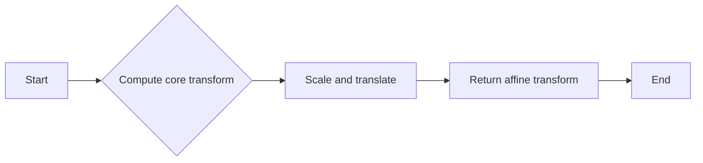

#### 带注释源码

```python
def _get_affine_transform(self):
    transform = self._get_core_transform(self.RESOLUTION)
    xscale, _ = transform.transform((np.pi, 0))
    _, yscale = transform.transform((0, np.pi/2))
    return Affine2D() \
        .scale(0.5 / xscale, 0.5 / yscale) \
        .translate(0.5, 0.5)
```


### GeoAxes.get_xaxis_transform

This method provides a transformation for the x-axis tick labels.

参数：

- `which`：`str`，The type of transformation to return. It must be one of 'tick1', 'tick2', or 'grid'.

返回值：`tuple`，A tuple of the form (transform, valign, halign) representing the transformation, vertical alignment, and horizontal alignment of the x-axis tick labels.

#### 流程图

```mermaid
graph LR
A[Input] --> B{which == 'tick1'}
B -- Yes --> C[Get _xaxis_text1_transform]
B -- No --> D{which == 'tick2'}
D -- Yes --> E[Get _xaxis_text2_transform]
D -- No --> F[Get _xaxis_transform]
C --> G[Return (transform, valign, halign)]
E --> G
F --> G
```

#### 带注释源码

```python
def get_xaxis_transform(self, which='grid'):
    """
    Override this method to provide a transformation for the
    x-axis tick labels.

    Returns a tuple of the form (transform, valign, halign)
    """
    if which not in ['tick1', 'tick2', 'grid']:
        raise ValueError(
            "'which' must be one of 'tick1', 'tick2', or 'grid'")
    return self._xaxis_transform
```


### GeoAxes.get_xaxis_text1_transform

This method returns the transformation for the primary x-axis tick labels.

参数：

- `pad`：`int`，The padding to apply to the tick labels.

返回值：`tuple`，A tuple containing the transformation, vertical alignment, and horizontal alignment.

#### 流程图

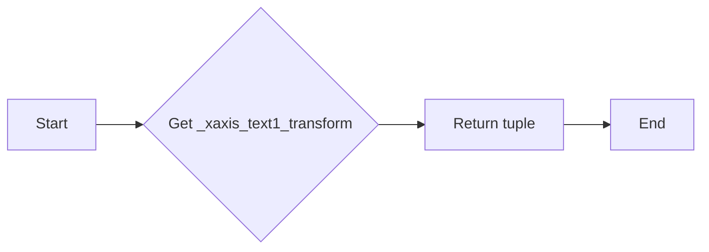

#### 带注释源码

```python
def get_xaxis_text1_transform(self, pad):
    return self._xaxis_text1_transform, 'bottom', 'center'
```


### GeoAxes.get_xaxis_text2_transform

This method provides a transformation for the secondary x-axis tick labels in the GeoAxes class.

参数：

- `pad`：`int`，The padding to apply to the tick labels.

返回值：`tuple`，A tuple containing the transformation, vertical alignment, and horizontal alignment.

#### 流程图

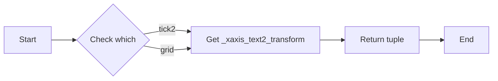

#### 带注释源码

```python
def get_xaxis_text2_transform(self, pad):
    """
    Override this method to provide a transformation for the
    secondary x-axis tick labels.

    Returns a tuple of the form (transform, valign, halign)
    """
    return self._xaxis_text2_transform, 'top', 'center'
```


### GeoAxes.get_yaxis_transform

This method provides a transformation for the y-axis grid and ticks.

参数：

- `which`：`str`，指定要获取的变换类型，可以是 'tick1', 'tick2', 或 'grid'。

返回值：`tuple`，包含三个元素：`transform`（变换对象），`valign`（垂直对齐方式），`halign`（水平对齐方式）。

#### 流程图

```mermaid
graph LR
A[Input] --> B{which == 'tick1'}
B -- Yes --> C[Get _yaxis_text1_transform]
B -- No --> D{which == 'tick2'}
D -- Yes --> E[Get _yaxis_text2_transform]
D -- No --> F[Get _yaxis_transform]
F --> G[Return (transform, valign, halign)]
```

#### 带注释源码

```python
def get_yaxis_transform(self, which='grid'):
    """
    Override this method to provide a transformation for the
    y-axis grid and ticks.
    """
    if which not in ['tick1', 'tick2', 'grid']:
        raise ValueError(
            "'which' must be one of 'tick1', 'tick2', or 'grid'")
    return self._yaxis_transform
```


### GeoAxes.get_yaxis_text1_transform

This method provides a transformation for the y-axis tick labels.

参数：

- `pad`：`int`，The padding to apply to the tick labels.

返回值：`tuple`，A tuple containing the transformation, vertical alignment, and horizontal alignment.

#### 流程图

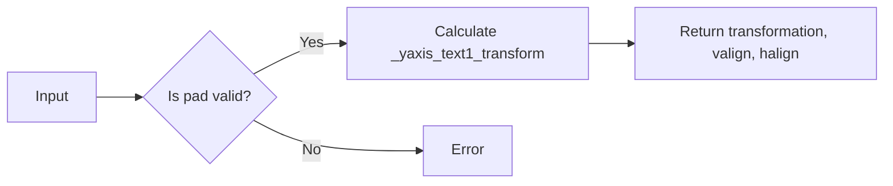

#### 带注释源码

```python
def get_yaxis_text1_transform(self, pad):
    """
    Override this method to provide a transformation for the
    y-axis tick labels.

    Returns a tuple of the form (transform, valign, halign)
    """
    return self._yaxis_text1_transform, 'center', 'right'
```


### GeoAxes.get_yaxis_text2_transform

This method provides a transformation for the secondary y-axis tick labels.

参数：

- `pad`：`int`，The padding to apply to the tick labels.

返回值：`tuple`，A tuple containing the transformation, vertical alignment, and horizontal alignment.

#### 流程图

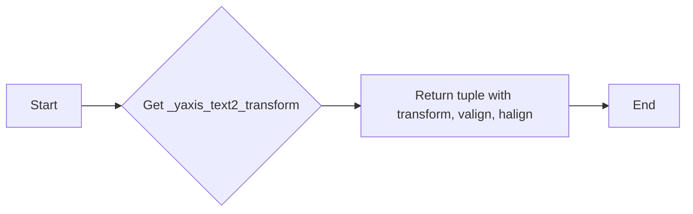

#### 带注释源码

```python
def get_yaxis_text2_transform(self, pad):
    """
    Override this method to provide a transformation for the
    secondary y-axis tick labels.

    Returns a tuple of the form (transform, valign, halign)
    """
    return self._yaxis_text2_transform, 'center', 'left'
```


### `_gen_axes_patch`

#### 描述

`_gen_axes_patch` 方法用于定义用于绘制图形背景的形状。在这个例子中，它是一个圆（可能被轴的变换扭曲成椭圆）。任何数据和网格线都将被裁剪到这个形状。

#### 参数

- 无

#### 返回值

- `Circle((0.5, 0.5), 0.5)`：返回一个圆，圆心在 (0.5, 0.5)，半径为 0.5。

#### 流程图

```mermaid
graph LR
A[开始] --> B{调用 _gen_axes_patch()}
B --> C[返回 Circle((0.5, 0.5), 0.5)}
C --> D[结束]
```

#### 带注释源码

```python
def _gen_axes_patch(self):
    """
    Override this method to define the shape that is used for the
    background of the plot.  It should be a subclass of Patch.

    In this case, it is a Circle (that may be warped by the Axes
    transform into an ellipse).  Any data and gridlines will be
    clipped to this shape.
    """
    return Circle((0.5, 0.5), 0.5)
```

### `_gen_axes_spines`

This method generates the spines for the GeoAxes class, specifically for the 'geo' spine, which is used to define the shape of the plot's background.

#### 参数

- 无

#### 返回值

- `dict`：包含 'geo' 键和对应的 `Spine` 对象，该对象定义了背景的形状。

#### 流程图

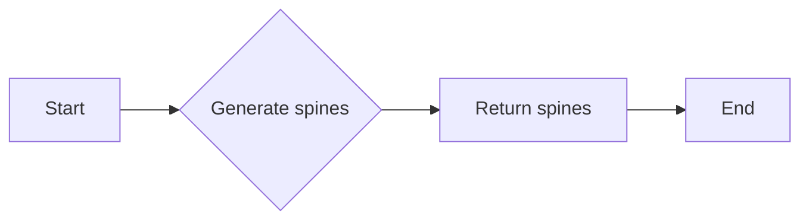

#### 带注释源码

```python
def _gen_axes_spines(self):
    return {'geo': mspines.Spine.circular_spine(self, (0.5, 0.5), 0.5)}
```

### GeoAxes.set_yscale

#### 描述

`set_yscale` 方法用于设置 y 轴的缩放方式。目前只支持线性缩放。

#### 参数

- `*args`：任意数量的参数，第一个参数必须是 'linear'，表示线性缩放。

#### 返回值

- 无返回值。

#### 流程图

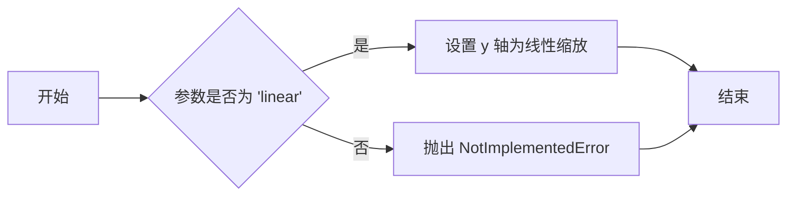

#### 带注释源码

```python
def set_yscale(self, *args, **kwargs):
    if args[0] != 'linear':
        raise NotImplementedError
```

### GeoAxes.set_xscale

#### 描述

`set_xscale` 方法用于设置 x 轴的缩放方式。在这个例子中，由于 GeoAxes 是一个地理投影的抽象基类，它不允许用户对 x 轴进行缩放，因此该方法会抛出一个 `NotImplementedError` 异常。

#### 参数

- 无

#### 返回值

- 无

#### 流程图

```mermaid
graph LR
A[开始] --> B{调用 set_xscale()}
B --> C{抛出 NotImplementedError}
C --> D[结束]
```

#### 带注释源码

```python
def set_xscale(self, *args, **kwargs):
    if args[0] != 'linear':
        raise NotImplementedError
```

### GeoAxes.set_yscale

#### 描述

`set_yscale` 方法用于设置 y 轴的缩放方式。在这个例子中，由于 GeoAxes 是一个地理投影的抽象基类，它不允许用户对 y 轴进行缩放，因此该方法会抛出一个 `NotImplementedError` 异常。

#### 参数

- 无

#### 返回值

- 无

#### 流程图

```mermaid
graph LR
A[开始] --> B{调用 set_yscale()}
B --> C{抛出 NotImplementedError}
C --> D[结束]
```

#### 带注释源码

```python
def set_yscale(self, *args, **kwargs):
    if args[0] != 'linear':
        raise NotImplementedError
```

### GeoAxes.set_xlim

#### 描述

`set_xlim` 方法用于设置地理投影轴的 x 轴限制。由于地理投影的特殊性，此方法不允许用户更改轴的限制，因此总是抛出 `TypeError`。

#### 参数

- 无

#### 返回值

- 无

#### 流程图

```mermaid
graph LR
A[开始] --> B{调用 set_xlim}
B --> C{抛出 TypeError}
C --> D[结束]
```

#### 带注释源码

```python
def set_xlim(self, *args, **kwargs):
    raise TypeError("Changing axes limits of a geographic projection is "
                    "not supported.  Please consider using Cartopy.")
```

### GeoAxes.set_ylim

该函数用于设置地理投影轴的y轴限制。

参数：

- 无

返回值：无

#### 流程图

```mermaid
graph LR
A[开始] --> B{调用Axes.set_ylim()}
B --> C[结束]
```

#### 带注释源码

```python
def set_ylim(self, *args, **kwargs):
    raise TypeError("Changing axes limits of a geographic projection is "
                    "not supported.  Please consider using Cartopy.")
```

### GeoAxes.format_coord

该函数用于自定义地理投影轴（GeoAxes）中坐标值的显示格式。它将经纬度值转换为度数，并添加相应的N/S/E/W方向符号。

#### 参数

- `lon`：`float`，经度值，以弧度为单位。
- `lat`：`float`，纬度值，以弧度为单位。

#### 返回值

- `str`：格式化后的坐标字符串，包含经纬度值和方向符号。

#### 流程图

```mermaid
graph LR
A[输入经纬度] --> B{转换为度数}
B --> C{添加方向符号}
C --> D[返回格式化字符串]
```

#### 带注释源码

```python
def format_coord(self, lon, lat):
    """
    Override this method to change how the values are displayed in
    the status bar.

    In this case, we want them to be displayed in degrees N/S/E/W.
    """
    lon, lat = np.rad2deg([lon, lat])
    ns = 'N' if lat >= 0.0 else 'S'
    ew = 'E' if lon >= 0.0 else 'W'
    return ('%f\N{DEGREE SIGN}%s, %f\N{DEGREE SIGN}%s'
            % (abs(lat), ns, abs(lon), ew))
```


### GeoAxes.set_longitude_grid

This method sets the number of degrees between each longitude grid in the GeoAxes class, which is an abstract base class for geographic projections.

参数：

- `degrees`：`int`，The number of degrees between each longitude grid.

返回值：`None`，This method does not return any value.

#### 流程图

```mermaid
graph LR
A[Start] --> B{Set longitude grid}
B --> C[End]
```

#### 带注释源码

```python
def set_longitude_grid(self, degrees):
    """
    Set the number of degrees between each longitude grid.

    This is an example method that is specific to this projection class -- it provides a more convenient interface to set the ticking than set_xticks would.
    """
    # Skip -180 and 180, which are the fixed limits.
    grid = np.arange(-180 + degrees, 180, degrees)
    self.xaxis.set_major_locator(FixedLocator(np.deg2rad(grid)))
    self.xaxis.set_major_formatter(self.ThetaFormatter(degrees))
``` 


### GeoAxes.set_latitude_grid

This method sets the number of degrees between each latitude grid in the GeoAxes class, which is a custom geographic projection class in Matplotlib.

参数：

- `degrees`：`int`，The number of degrees between each latitude grid. The latitude grid lines will be drawn at these intervals.

返回值：`None`，This method does not return any value.

#### 流程图

```mermaid
graph LR
A[Start] --> B{Set latitude grid interval}
B --> C[End]
```

#### 带注释源码

```python
def set_latitude_grid(self, degrees):
    """
    Set the number of degrees between each longitude grid.

    This is an example method that is specific to this projection
    class -- it provides a more convenient interface than
    set_yticks would.
    """
    # Skip -90 and 90, which are the fixed limits.
    grid = np.arange(-90 + degrees, 90, degrees)
    self.yaxis.set_major_locator(FixedLocator(np.deg2rad(grid)))
    self.yaxis.set_major_formatter(self.ThetaFormatter(degrees))
```


### GeoAxes.set_longitude_grid_ends

This method sets the latitude(s) at which to stop drawing the longitude grids in the GeoAxes class, which is an abstract base class for geographic projections.

参数：

- `degrees`：`int`，The latitude(s) at which to stop drawing the longitude grids, specified in degrees.

返回值：`None`，This method does not return any value.

#### 流程图

```mermaid
graph LR
A[Start] --> B{Set longitude cap to degrees}
B --> C[Update xaxis_pretransform]
C --> D[End]
```

#### 带注释源码

```python
def set_longitude_grid_ends(self, degrees):
    """
    Set the latitude(s) at which to stop drawing the longitude grids.

    Often, in geographic projections, you wouldn't want to draw
    longitude gridlines near the poles.  This allows the user to
    specify the degree at which to stop drawing longitude grids.

    This is an example method that is specific to this projection
    class -- it provides an interface to something that has no
    analogy in the base Axes class.
    """
    self._longitude_cap = np.deg2rad(degrees)
    self._xaxis_pretransform \
        .clear() \
        .scale(1.0, self._longitude_cap * 2.0) \
        .translate(0.0, -self._longitude_cap)
```


### GeoAxes.get_data_ratio

Return the aspect ratio of the data itself.

参数：

- 无

返回值：`float`，The aspect ratio of the data itself.

#### 流程图

```mermaid
graph LR
A[Start] --> B{Return aspect ratio}
B --> C[End]
```

#### 带注释源码

```python
def get_data_ratio(self):
    """
    Return the aspect ratio of the data itself.

    This method should be overridden by any Axes that have a
    fixed data ratio.
    """
    return 1.0
```


### GeoAxes.can_zoom

This method returns whether the `Axes` object supports the zoom box button functionality.

参数：

- 无

返回值：`bool`，Indicates whether the `Axes` object supports interactive zoom box.

#### 流程图

```mermaid
graph LR
A[Start] --> B{Can Zoom?}
B -- Yes --> C[Supports Zoom]
B -- No --> D[Does Not Support Zoom]
C --> E[End]
D --> E
```

#### 带注释源码

```python
def can_zoom(self):
    """
    Return whether this Axes supports the zoom box button functionality.

    This Axes object does not support interactive zoom box.
    """
    return False
```


### GeoAxes.can_pan

This method returns whether the `Axes` object supports the pan/zoom button functionality.

参数：

- 无

返回值：`bool`，Indicates whether the `Axes` object supports the pan/zoom functionality.

#### 流程图

```mermaid
graph LR
A[GeoAxes.can_pan()] --> B{返回值}
B -->|True| C[支持]
B -->|False| D[不支持]
```

#### 带注释源码

```python
def can_pan(self):
    """
    Return whether this Axes supports the pan/zoom button functionality.

    This Axes object does not support interactive pan/zoom.
    """
    return False
```


### GeoAxes.start_pan

#### 描述

`start_pan` 方法是 `GeoAxes` 类的一个方法，它被用来开始一个交互式的平移操作。当用户开始平移时，这个方法会被调用。

#### 参数

- `x`：`float`，表示鼠标点击的 x 坐标。
- `y`：`float`，表示鼠标点击的 y 坐标。
- `button`：`int`，表示被按下的鼠标按钮。

#### 返回值

- `None`，该方法不返回任何值。

#### 流程图

```mermaid
graph LR
A[开始] --> B{调用 GeoAxes.start_pan}
B --> C[结束]
```

#### 带注释源码

```python
def start_pan(self, x, y, button):
    pass
```

### end_pan

This method is used to finalize the panning action on the GeoAxes object. It is a placeholder method in the GeoAxes class, which inherits from the Axes class in Matplotlib. The method does not take any parameters and does not return any value.

#### 参数

- None

#### 参数描述

No parameters are required for this method.

#### 返回值

- None

#### 返回值描述

This method does not return any value.

#### 流程图

```mermaid
graph LR
A[Start] --> B{end_pan called?}
B -- Yes --> C[End]
B -- No --> D[End]
```

#### 带注释源码

```python
def end_pan(self):
    # This method is a placeholder for finalizing the panning action.
    # It does nothing and is intended to be overridden by subclasses
    # that support interactive panning.
    pass
```

### GeoAxes.drag_pan

该函数允许用户在拖动时进行交互式平移。

参数：

- `button`：`int`，表示哪个鼠标按钮被按下。
- `key`：`int`，表示哪个键盘键被按下。
- `x`：`float`，表示鼠标的x坐标。
- `y`：`float`，表示鼠标的y坐标。

返回值：`None`，该函数不返回任何值。

#### 流程图

```mermaid
graph LR
A[开始] --> B{检测按钮和键}
B -->|是| C[开始平移]
B -->|否| D[结束平移]
C --> E[更新视图]
E --> F[结束]
D --> G[结束]
```

#### 带注释源码

```python
def drag_pan(self, button, key, x, y):
    # Interactive panning and zooming is not supported with this projection,
    # so we override all of the following methods to disable it.
    pass
```


### HammerAxes.__init__

This method initializes a new instance of the `HammerAxes` class, which is a custom class for the Aitoff-Hammer projection, an equal-area map projection.

参数：

- `*args`：Variable length argument list passed to the base class `GeoAxes`.
- `**kwargs`：Keyword arguments passed to the base class `GeoAxes`.

返回值：None

#### 流程图

```mermaid
graph LR
A[Start] --> B{Initialize HammerAxes}
B --> C[Set _longitude_cap]
C --> D[Call super().__init__(*args, **kwargs)]
D --> E[Set aspect ratio]
E --> F[Clear axes]
F --> G[End]
```

#### 带注释源码

```python
def __init__(self, *args, **kwargs):
    self._longitude_cap = np.pi / 2.0  # Set the longitude cap to 90 degrees
    super().__init__(*args, **kwargs)  # Call the base class constructor
    self.set_aspect(0.5, adjustable='box', anchor='C')  # Set the aspect ratio
    self.clear()  # Clear the axes
```


### HammerAxes._get_core_transform

This method initializes and returns a HammerTransform object, which is used to perform the core transformation from data space (longitude and latitude) to a rectilinear space defined by the Hammer projection.

参数：

- `resolution`：`int`，指定在输入线段之间进行插值的步骤数，以近似其在曲线 Hammer 空间中的路径。

返回值：`HammerAxes.HammerTransform`，一个 HammerTransform 对象，用于执行从数据空间到 Hammer 投影定义的矩线性空间的核心转换。

#### 流程图

```mermaid
graph LR
A[Input] --> B{Create HammerTransform}
B --> C[Return HammerTransform]
```

#### 带注释源码

```python
def _get_core_transform(self, resolution):
    return self.HammerTransform(resolution)
```


## 关键组件


### 张量索引与惰性加载

张量索引与惰性加载是用于处理和操作大型数据集的关键组件，它允许在需要时才计算数据，从而节省内存和提高效率。

### 反量化支持

反量化支持是用于将量化后的数据转换回原始数据类型的关键组件，这对于在量化模型中恢复精度至关重要。

### 量化策略

量化策略是用于将浮点数数据转换为固定点数表示的关键组件，它有助于减少模型大小和提高推理速度。


## 问题及建议


### 已知问题

-   **代码复杂度**：该代码片段包含大量的数学计算和复杂的几何变换，这可能导致代码难以理解和维护。
-   **缺乏注释**：代码中缺少足够的注释，这会使得理解代码的功能和目的变得困难。
-   **全局变量**：使用了全局变量 `rcParams`，这可能导致代码难以测试和重用。
-   **类继承**：`HammerAxes` 类继承自 `GeoAxes` 类，但并没有重写所有必要的基类方法，这可能导致不正确的行为。
-   **错误处理**：代码中没有明显的错误处理机制，这可能导致在运行时出现未处理的异常。

### 优化建议

-   **增加注释**：在代码中添加详细的注释，解释每个函数和类的作用，以及重要的计算步骤。
-   **使用配置文件**：将全局变量 `rcParams` 的值存储在一个配置文件中，而不是直接在代码中使用，以提高代码的可维护性和可测试性。
-   **重写基类方法**：确保 `HammerAxes` 类正确地重写了所有必要的 `GeoAxes` 类方法。
-   **添加错误处理**：在代码中添加适当的错误处理机制，以捕获和处理可能发生的异常。
-   **代码重构**：考虑将复杂的数学计算和几何变换分解成更小的、更易于管理的函数。
-   **单元测试**：编写单元测试来验证代码的正确性和稳定性。
-   **文档化**：编写详细的文档，包括代码的安装、配置和使用说明。


## 其它


### 设计目标与约束

- 设计目标：
  - 实现一个自定义的 Hammer 投影，用于地理数据可视化。
  - 提供一个与 Matplotlib 兼容的接口，方便用户使用。
  - 支持自定义网格线和刻度格式。
  - 支持交互式操作，如缩放和平移。
- 约束：
  - 必须使用 Matplotlib 库进行绘图。
  - 投影必须保持等面积特性。
  - 代码应具有良好的可读性和可维护性。

### 错误处理与异常设计

- 错误处理：
  - 当用户尝试设置不支持的轴限制时，抛出 `TypeError`。
  - 当用户尝试设置不支持的轴缩放时，抛出 `NotImplementedError`。
  - 当用户尝试设置不支持的刻度格式时，抛出 `ValueError`。
- 异常设计：
  - 使用自定义异常类来处理特定于 Hammer 投影的错误。
  - 异常信息应提供足够的信息，以便用户了解错误原因。

### 数据流与状态机

- 数据流：
  - 用户数据（如经纬度）通过 `plot` 方法输入到 `HammerAxes` 类。
  - `HammerAxes` 类使用 `HammerTransform` 类将用户数据转换为 Hammer 投影坐标。
  - 转换后的数据用于绘制图形。
- 状态机：
  - `HammerAxes` 类的状态包括：
    - 初始化状态：初始化轴和刻度。
    - 绘图状态：处理绘图请求。
    - 清除状态：清除轴内容。
    - 设置网格状态：设置网格线和刻度。

### 外部依赖与接口契约

- 外部依赖：
  - Matplotlib 库：用于绘图和图形界面。
  - NumPy 库：用于数学运算。
- 接口契约：
  - `HammerAxes` 类应提供与 Matplotlib `Axes` 类兼容的接口。
  - `HammerTransform` 类应提供将用户数据转换为 Hammer 投影坐标的方法。
  - `register_projection` 函数用于将 `HammerAxes` 类注册为 Matplotlib 投影。


    