# `matplotlib\galleries\examples\misc\customize_rc.py` 详细设计文档

This code demonstrates how to dynamically customize Matplotlib's rcParams for different scenarios, such as publication and interactive exploration.

## 整体流程

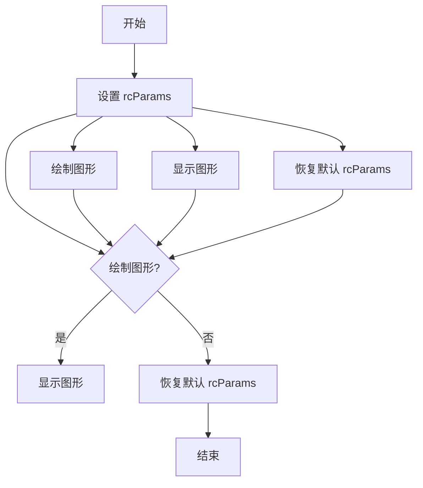

## 类结构

```
CustomRC (自定义 rcParams 类)
```

## 全局变量及字段


### `rcParams`
    
The rcParams object contains all the parameters that can be set for the rcParams system.

类型：`matplotlib.rcParams`
    


### `matplotlib.pyplot.rcParams`
    
The rcParams object contains all the parameters that can be set for the rcParams system.

类型：`matplotlib.rcParams`
    
    

## 全局函数及方法


### update_params

更新matplotlib的rcParams配置。

参数：

- `params`：`dict`，包含要更新的rcParams键值对。

返回值：`None`，无返回值。

#### 流程图

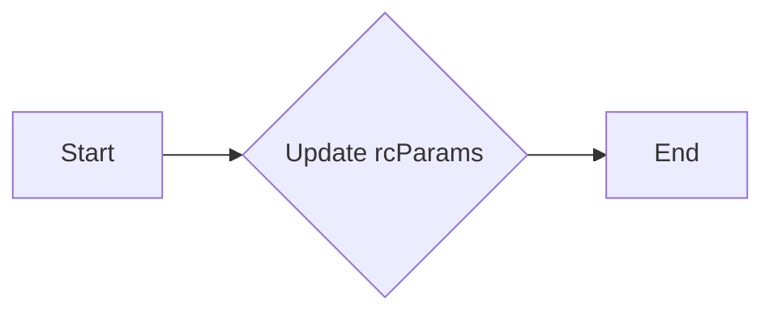

#### 带注释源码

```python
def update_params(params):
    plt.rcParams.update(params)
```


### plot([1, 2, 3])

该函数用于绘制一个包含三个点的折线图。

参数：

- `x`：`list`，包含折线图x轴的数据点。
- `y`：`list`，包含折线图y轴的数据点。

返回值：`None`，该函数不返回任何值。

#### 流程图

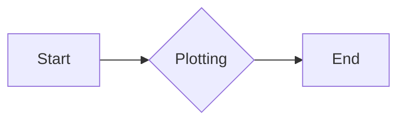

#### 带注释源码

```
plt.plot([1, 2, 3])
```


### plt.subplot(311)

该函数用于创建一个新的子图，并设置其在当前图形中的位置。

参数：

- `nrows`：`int`，子图的总行数。
- `ncols`：`int`，子图的总列数。
- `index`：`int`，子图在当前图形中的索引。

返回值：`None`，该函数不返回任何值。

#### 流程图

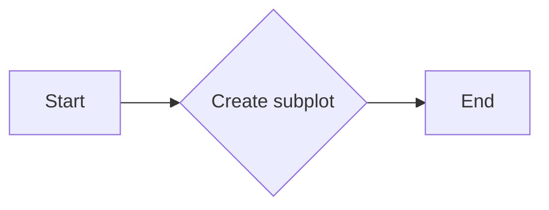

#### 带注释源码

```
plt.subplot(311)
```


### plt.rcParams.update()

该函数用于更新当前图形的配置参数。

参数：

- `kwargs`：`dict`，包含要更新的配置参数。

返回值：`None`，该函数不返回任何值。

#### 流程图


#### 带注释源码

```
plt.rcParams.update({
    "font.weight": "bold",
    "xtick.major.size": 5,
    "xtick.major.pad": 7,
    "xtick.labelsize": 15,
    "grid.color": "0.5",
    "grid.linestyle": "-",
    "grid.linewidth": 5,
    "lines.linewidth": 2,
    "lines.color": "g",
})
```


### plt.grid(True)

该函数用于在当前子图上添加网格。

参数：

- `flag`：`bool`，如果为`True`，则添加网格。

返回值：`None`，该函数不返回任何值。

#### 流程图

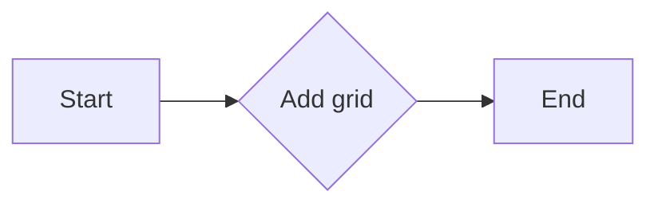

#### 带注释源码

```
plt.grid(True)
```


### plt.show()

该函数用于显示当前图形。

参数：无

返回值：`None`，该函数不返回任何值。

#### 流程图

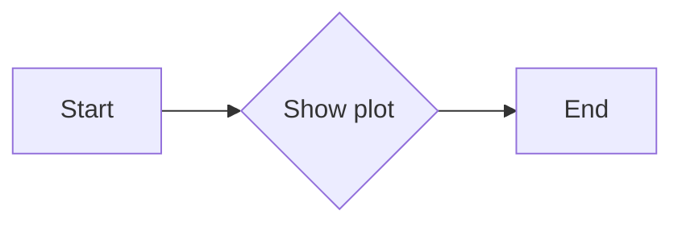

#### 带注释源码

```
plt.show()
```


### plt.rcdefaults()

该函数用于将当前图形的配置参数恢复到默认值。

参数：无

返回值：`None`，该函数不返回任何值。

#### 流程图

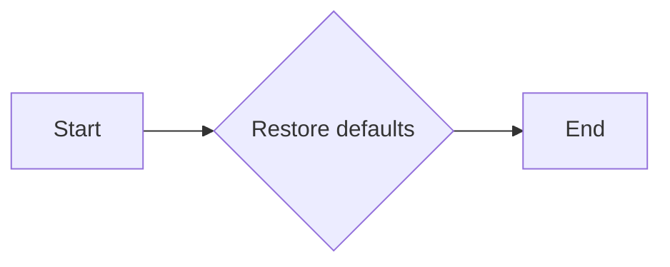

#### 带注释源码

```
plt.rcdefaults()
```


### plt.show()

显示当前图形的窗口。

参数：

- 无

返回值：`None`，无返回值，但会显示图形窗口。

#### 流程图

```mermaid
graph LR
A[开始] --> B{调用plt.show()}
B --> C[结束]
```

#### 带注释源码

```
plt.show()
```


### plt.subplot()

创建一个新的子图。

参数：

- `n`：`int`，子图的编号。
- `sharex`：`bool`，是否共享x轴。
- `sharey`：`bool`，是否共享y轴。
- `rowspan`：`int`，子图在行方向上的跨度。
- `colspan`：`int`，子图在列方向上的跨度。
- `row`：`int`，子图所在的行。
- `col`：`int`，子图所在的列。

返回值：`AxesSubplot`，子图对象。

#### 流程图

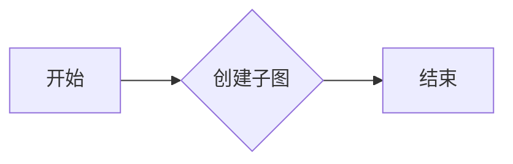

#### 带注释源码

```
plt.subplot(311)
```


### plt.plot()

绘制二维数据。

参数：

- `x`：`array_like`，x轴数据。
- `y`：`array_like`，y轴数据。
- `fmt`：`str`，线型、颜色和标记的字符串。
- `data`：`object`，可选，包含x和y数据的对象。

返回值：`Line2D`，线对象。

#### 流程图

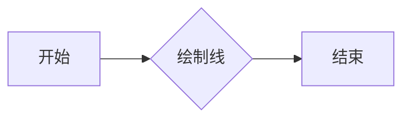

#### 带注释源码

```
plt.plot([1, 2, 3])
```


### plt.grid()

在当前轴上添加网格。

参数：

- `b`：`bool`，是否在底部添加网格。
- `h`：`bool`，是否在顶部添加网格。
- `which`：`str`，指定添加网格的位置。
- `axis`：`str`，指定添加网格的轴。

返回值：`None`，无返回值。

#### 流程图

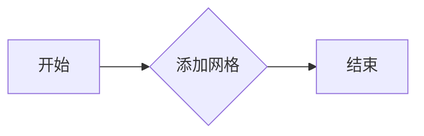

#### 带注释源码

```
plt.grid(True)
```


### plt.rcdefaults()

恢复matplotlib的默认参数。

参数：无

返回值：`None`，无返回值。

#### 流程图

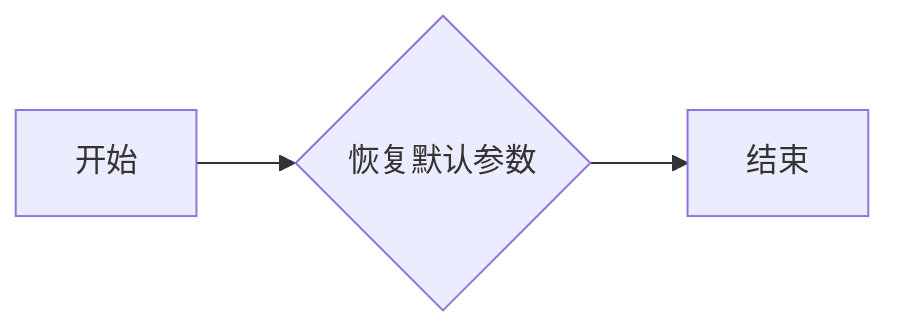

#### 带注释源码

```
plt.rcdefaults()
```


### rcdefaults()

该函数用于恢复matplotlib的rcParams到默认设置。

参数：

- 无

返回值：`None`，无返回值，但会修改全局的rcParams。

#### 流程图

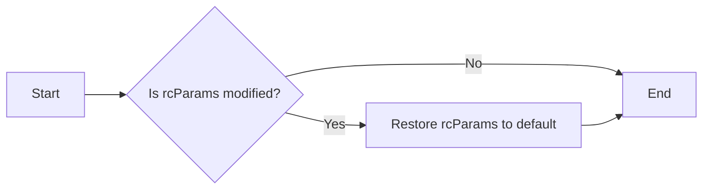

#### 带注释源码

```
import matplotlib.pyplot as plt

def rcdefaults():
    # Restore matplotlib's rcParams to default settings
    plt.rcdefaults()
``` 


### CustomRC.update_params

更新matplotlib的rcParams配置。

参数：

- `params`：`dict`，包含要更新的rcParams键值对。

返回值：`None`，无返回值。

#### 流程图

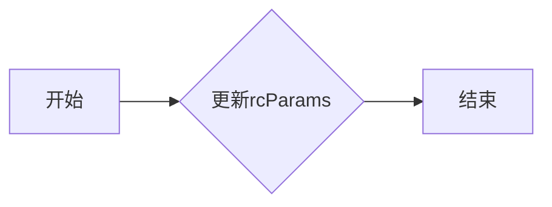

#### 带注释源码

```python
# 假设CustomRC类存在，并且update_params是其中的一种方法
class CustomRC:
    # ...

    def update_params(self, params):
        # 更新rcParams配置
        plt.rcParams.update(params)
        # 返回None，表示无返回值
        return None
```


### CustomRC.plot

该函数用于绘制一个简单的折线图，并应用特定的样式设置。

参数：

- 无

返回值：无

#### 流程图

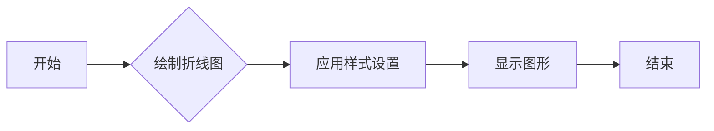

#### 带注释源码

```python
import matplotlib.pyplot as plt

# 绘制折线图
plt.plot([1, 2, 3])

# 应用样式设置
plt.rcParams.update({
    "font.weight": "bold",
    "xtick.major.size": 5,
    "xtick.major.pad": 7,
    "xtick.labelsize": 15,
    "grid.color": "0.5",
    "grid.linestyle": "-",
    "grid.linewidth": 5,
    "lines.linewidth": 2,
    "lines.color": "g",
})

# 显示图形
plt.grid(True)
plt.show()
```


### plt.show()

显示当前图形的窗口。

参数：

- 无

返回值：无

#### 流程图

```mermaid
graph LR
A[开始] --> B{调用plt.show()}
B --> C[结束]
```

#### 带注释源码

```
plt.show()
```


### rcdefaults()

该函数用于恢复matplotlib的rcParams到默认设置。

参数：

- 无

返回值：`None`，无返回值，但会更新rcParams到默认设置。

#### 流程图

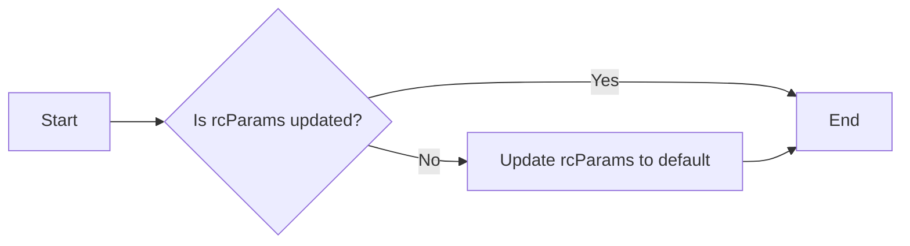

#### 带注释源码

```
plt.rcdefaults()
```


## 关键组件


### 张量索引与惰性加载

张量索引与惰性加载是用于高效处理大型数据集的技术，它允许在需要时才计算数据，从而节省内存和提高性能。

### 反量化支持

反量化支持是指系统对量化操作的反向操作的支持，允许在量化后的模型上进行反向传播，以恢复原始的浮点数值。

### 量化策略

量化策略是指将浮点数转换为固定点数表示的方法，以减少模型的大小和提高计算效率。


## 问题及建议


### 已知问题

-   {问题1}：代码中直接修改了matplotlib的rcParams，这可能会影响后续的绘图操作，导致绘图结果不一致。
-   {问题2}：代码中使用了硬编码的参数值，这降低了代码的可维护性和可扩展性。
-   {问题3}：代码没有提供参数的默认值，这可能导致在调用函数时出现错误。

### 优化建议

-   {建议1}：创建一个配置类或模块，用于封装rcParams的设置，这样可以更好地控制参数的修改，并避免对后续绘图的影响。
-   {建议2}：使用配置文件或参数对象来管理参数值，这样可以在不修改代码的情况下更改参数，提高代码的可维护性。
-   {建议3}：为每个参数提供默认值，并在调用函数时检查参数值，确保参数的有效性。

## 其它


### 设计目标与约束

- 设计目标：提供一种灵活的方式来动态修改matplotlib的rcParams，以便用户可以根据不同的需求设置不同的绘图参数。
- 约束：必须兼容matplotlib的现有API，不修改matplotlib的内部实现。

### 错误处理与异常设计

- 错误处理：当用户尝试设置不存在的rcParams时，应抛出异常。
- 异常设计：定义自定义异常类，如`InvalidRcParamError`，以提供更清晰的错误信息。

### 数据流与状态机

- 数据流：用户通过调用函数来设置rcParams，这些参数随后被应用到matplotlib的绘图上下文中。
- 状态机：没有明确的状态机，但可以通过函数调用序列来管理rcParams的状态。

### 外部依赖与接口契约

- 外部依赖：依赖于matplotlib库。
- 接口契约：定义了`set_pub`和`rcdefaults`函数的接口，这些函数用于设置和恢复rcParams。


    