# `matplotlib\galleries\examples\misc\demo_agg_filter.py` 详细设计文档

This code provides a set of filters for Matplotlib Artists to modify their rendering, including offset, Gaussian blur, drop shadow, and light source effects.

## 整体流程

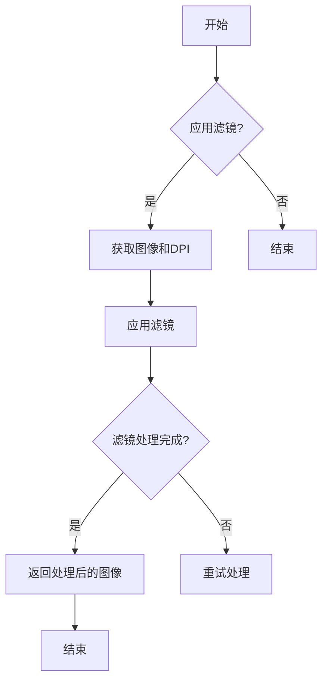

## 类结构

```
BaseFilter (基类)
├── OffsetFilter (偏移滤镜)
├── GaussianFilter (高斯滤镜)
├── DropShadowFilter (阴影滤镜)
├── LightFilter (光源滤镜)
├── GrowFilter (增长滤镜)
└── FilteredArtistList (艺术家列表)
    └── Artist (艺术家基类)
```

## 全局变量及字段


### `offsets`
    
The offsets for the image processing.

类型：`tuple`
    


### `sigma`
    
The standard deviation for the Gaussian filter.

类型：`float`
    


### `alpha`
    
The alpha value for blending the filtered image with the original image.

类型：`float`
    


### `color`
    
The color to use for the image processing.

类型：`tuple`
    


### `fraction`
    
The fraction to use for the LightSource filter.

类型：`number`
    


### `pixels`
    
The number of pixels to grow the image area.

类型：`int`
    


### `color`
    
The color to use for the GrowFilter.

类型：`tuple`
    


### `OffsetFilter.offsets`
    
The offsets for the image processing.

类型：`tuple`
    


### `GaussianFilter.sigma`
    
The standard deviation for the Gaussian filter.

类型：`float`
    


### `GaussianFilter.alpha`
    
The alpha value for blending the filtered image with the original image.

类型：`float`
    


### `GaussianFilter.color`
    
The color to use for the image processing.

类型：`tuple`
    


### `LightFilter.fraction`
    
The fraction to use for the LightSource filter.

类型：`number`
    


### `GrowFilter.pixels`
    
The number of pixels to grow the image area.

类型：`int`
    


### `GrowFilter.color`
    
The color to use for the GrowFilter.

类型：`tuple`
    


### `FilteredArtistList._artist_list`
    
The list of artists to be filtered.

类型：`list`
    


### `FilteredArtistList._filter`
    
The filter to be applied to the artists.

类型：`object`
    
    

## 全局函数及方法

### smooth1d

平滑一维信号。

参数：

- `x`：`numpy.ndarray`，要平滑的一维信号。
- `window_len`：`int`，窗口长度。

返回值：`numpy.ndarray`，平滑后的信号。

#### 流程图

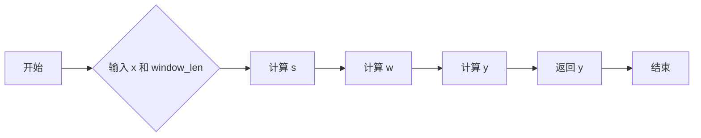

#### 带注释源码

```python
def smooth1d(x, window_len):
    # copied from https://scipy-cookbook.readthedocs.io/items/SignalSmooth.html
    s = np.r_[2*x[0] - x[window_len:1:-1], x, 2*x[-1] - x[-1:-window_len:-1]]
    w = np.hanning(window_len)
    y = np.convolve(w/w.sum(), s, mode='same')
    return y[window_len-1:-window_len+1]
```

### smooth2d

平滑二维数组。

#### 参数

- `A`：`numpy.ndarray`，要平滑的二维数组。
- `sigma`：`float`，高斯滤波器的标准差，默认为3。

#### 返回值

- `numpy.ndarray`，平滑后的二维数组。

#### 流程图

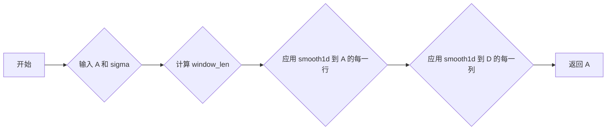

#### 带注释源码

```python
def smooth2d(A, sigma=3):
    window_len = max(int(sigma), 3) * 2 + 1
    A = np.apply_along_axis(smooth1d, 0, A, window_len)
    A = np.apply_along_axis(smooth1d, 1, A, window_len)
    return A
```

### filtered_text

This function applies various filters to an image and then displays it using Matplotlib. It includes a Gaussian filter, a drop shadow filter, and a grow filter to enhance the visibility of the image elements.

参数：

- `ax`：`matplotlib.axes.Axes`，The axes on which to draw the image and filters.

返回值：无

#### 流程图


#### 带注释源码

```python
def filtered_text(ax):
    # mostly copied from contour_demo.py

    # prepare image
    delta = 0.025
    x = np.arange(-3.0, 3.0, delta)
    y = np.arange(-2.0, 2.0, delta)
    X, Y = np.meshgrid(x, y)
    Z1 = np.exp(-X**2 - Y**2)
    Z2 = np.exp(-(X - 1)**2 - (Y - 1)**2)
    Z = (Z1 - Z2) * 2

    # draw
    ax.imshow(Z, interpolation='bilinear', origin='lower',
              cmap="gray", extent=(-3, 3, -2, 2), aspect='auto')
    levels = np.arange(-1.2, 1.6, 0.2)
    CS = ax.contour(Z, levels,
                    origin='lower',
                    linewidths=2,
                    extent=(-3, 3, -2, 2))

    # contour label
    cl = ax.clabel(CS, levels[1::2],  # label every second level
                   fmt='%1.1f',
                   fontsize=11)

    # change clabel color to black
    from matplotlib.patheffects import Normal
    for t in cl:
        t.set_color("k")
        # to force TextPath (i.e., same font in all backends)
        t.set_path_effects([Normal()])

    # Add white glows to improve visibility of labels.
    white_glows = FilteredArtistList(cl, GrowFilter(3))
    ax.add_artist(white_glows)
    white_glows.set_zorder(cl[0].get_zorder() - 0.1)

    ax.xaxis.set_visible(False)
    ax.yaxis.set_visible(False)
```

### drop_shadow_line

This function applies a drop shadow effect to lines drawn on a matplotlib plot.

参数：

- `ax`：`matplotlib.axes.Axes`，The axes on which to draw the lines and their shadows.

返回值：`None`，This function does not return any value.

#### 流程图

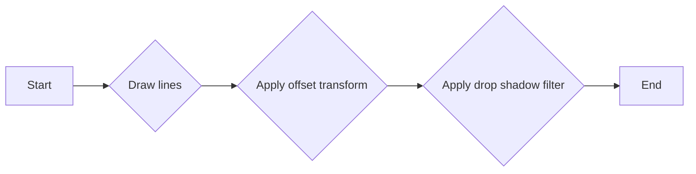

#### 带注释源码

```python
def drop_shadow_line(ax):
    # draw lines
    l1, = ax.plot([0.1, 0.5, 0.9], [0.1, 0.9, 0.5], "bo-")
    l2, = ax.plot([0.1, 0.5, 0.9], [0.5, 0.2, 0.7], "ro-")

    gauss = DropShadowFilter(4)

    for l in [l1, l2]:
        # draw shadows with same lines with slight offset.
        xx = l.get_xdata()
        yy = l.get_ydata()
        shadow, = ax.plot(xx, yy)
        shadow.update_from(l)

        # offset transform
        transform = mtransforms.offset_copy(l.get_transform(), ax.figure,
                                            x=4.0, y=-6.0, units='points')
        shadow.set_transform(transform)

        # adjust zorder of the shadow lines so that it is drawn below the
        # original lines
        shadow.set_zorder(l.get_zorder() - 0.5)
        shadow.set_agg_filter(gauss)
        shadow.set_rasterized(True)  # to support mixed-mode renderers

    ax.set_xlim(0., 1.)
    ax.set_ylim(0., 1.)

    ax.xaxis.set_visible(False)
    ax.yaxis.set_visible(False)
```

### drop_shadow_patches

This function applies a drop shadow effect to a set of patches (bars) in a matplotlib plot. It uses the `DropShadowFilter` to create the shadow effect and then applies it to the patches.

参数：

- `ax`：`matplotlib.axes.Axes`，The axes on which the patches are drawn.

返回值：`None`，This function does not return any value.

#### 流程图

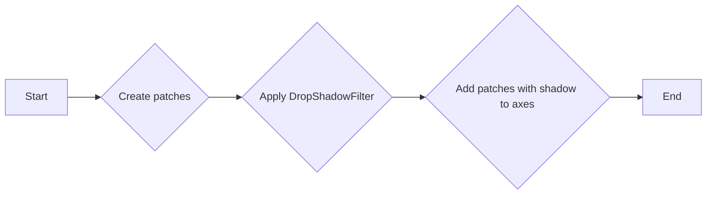

#### 带注释源码

```python
def drop_shadow_patches(ax):
    # Copied from barchart_demo.py
    N = 5
    group1_means = [20, 35, 30, 35, 27]

    ind = np.arange(N)  # the x locations for the groups
    width = 0.35  # the width of the bars

    rects1 = ax.bar(ind, group1_means, width, color='r', ec="w", lw=2)

    group2_means = [25, 32, 34, 20, 25]
    rects2 = ax.bar(ind + width + 0.1, group2_means, width,
                    color='y', ec="w", lw=2)

    drop = DropShadowFilter(5, offsets=(1, 1))
    shadow = FilteredArtistList(rects1 + rects2, drop)
    ax.add_artist(shadow)
    shadow.set_zorder(rects1[0].get_zorder() - 0.1)

    ax.set_ylim(0, 40)

    ax.xaxis.set_visible(False)
    ax.yaxis.set_visible(False)
```

### light_filter_pie

The `light_filter_pie` function applies a light source filter to a pie chart in a matplotlib plot. It enhances the visual appearance of the pie chart by adding a light source effect, which simulates the effect of light shining on the pie chart, thereby increasing its visual appeal.

参数：

- `ax`：`matplotlib.axes.Axes`，The axes on which the pie chart is drawn.

返回值：`None`，The function modifies the pie chart directly and does not return any value.

#### 流程图


#### 带注释源码

```python
def light_filter_pie(ax):
    fracs = [15, 30, 45, 10]
    explode = (0.1, 0.2, 0.1, 0.1)
    pie = ax.pie(fracs, explode=explode)

    light_filter = LightFilter(9)
    for p in pie.wedges:
        p.set_agg_filter(light_filter)
        p.set_rasterized(True)  # to support mixed-mode renderers
        p.set(ec="none",
              lw=2)

    gauss = DropShadowFilter(9, offsets=(3, -4), alpha=0.7)
    shadow = FilteredArtistList(pie.wedges, gauss)
    ax.add_artist(shadow)
    shadow.set_zorder(pie.wedges[0].get_zorder() - 0.1)
```

### BaseFilter.get_pad

#### 描述

`get_pad` 方法是 `BaseFilter` 类的一个方法，它计算并返回图像边缘需要填充的像素数，以便在图像上应用滤镜。

#### 参数

- `dpi`：`int`，图像的分辨率（每英寸点数）。

#### 返回值

- `int`：图像边缘需要填充的像素数。

#### 流程图

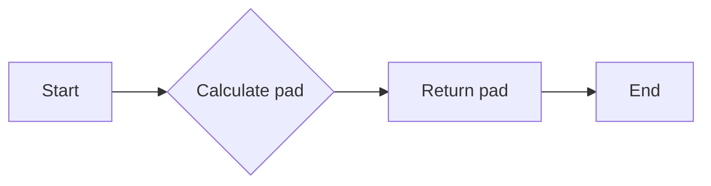

#### 带注释源码

```python
def get_pad(self, dpi):
    return 0
```

### OffsetFilter.get_pad

#### 描述

`get_pad` 方法是 `OffsetFilter` 类的一个方法，它计算并返回图像边缘需要填充的像素数，以便在图像上应用滤镜，考虑到偏移量。

#### 参数

- `dpi`：`int`，图像的分辨率（每英寸点数）。

#### 返回值

- `int`：图像边缘需要填充的像素数。

#### 流程图

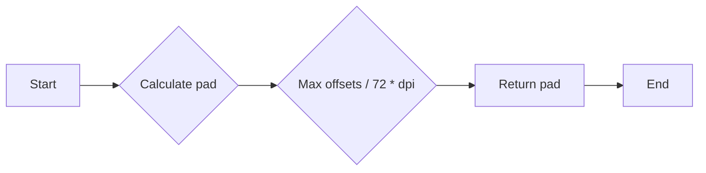

#### 带注释源码

```python
def get_pad(self, dpi):
    return int(max(self.offsets) / 72 * dpi)
```

### GaussianFilter.get_pad

#### 描述

`get_pad` 方法是 `GaussianFilter` 类的一个方法，它计算并返回图像边缘需要填充的像素数，以便在图像上应用高斯滤镜。

#### 参数

- `dpi`：`int`，图像的分辨率（每英寸点数）。

#### 返回值

- `int`：图像边缘需要填充的像素数。

#### 流程图

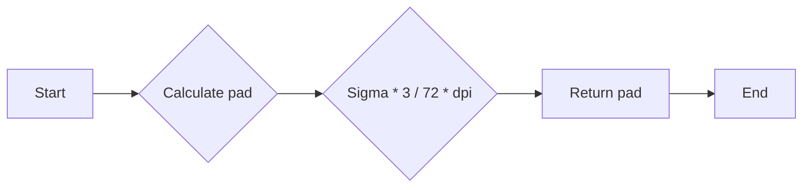

#### 带注释源码

```python
def get_pad(self, dpi):
    return int(self.sigma*3 / 72 * dpi)
```

### DropShadowFilter.get_pad

#### 描述

`get_pad` 方法是 `DropShadowFilter` 类的一个方法，它计算并返回图像边缘需要填充的像素数，以便在图像上应用高斯滤镜和偏移滤镜。

#### 参数

- `dpi`：`int`，图像的分辨率（每英寸点数）。

#### 返回值

- `int`：图像边缘需要填充的像素数。

#### 流程图

```mermaid
graph LR
A[Start] --> B{Calculate pad}
B --> C{Max gauss_filter.get_pad(dpi) and offset_filter.get_pad(dpi)}
C --> D[Return pad]
D --> E[End]
```

#### 带注释源码

```python
def get_pad(self, dpi):
    return max(self.gauss_filter.get_pad(dpi),
               self.offset_filter.get_pad(dpi))
```

### BaseFilter.process_image

#### 描述

`BaseFilter.process_image` 是一个抽象方法，用于处理图像。它被设计为在子类中实现，以提供特定的图像处理逻辑。

#### 参数

- `padded_src`：`numpy.ndarray`，处理前的图像，已经填充了边界。
- `dpi`：`int`，图像的分辨率（每英寸点数）。

#### 返回值

- `numpy.ndarray`，处理后的图像。

#### 流程图

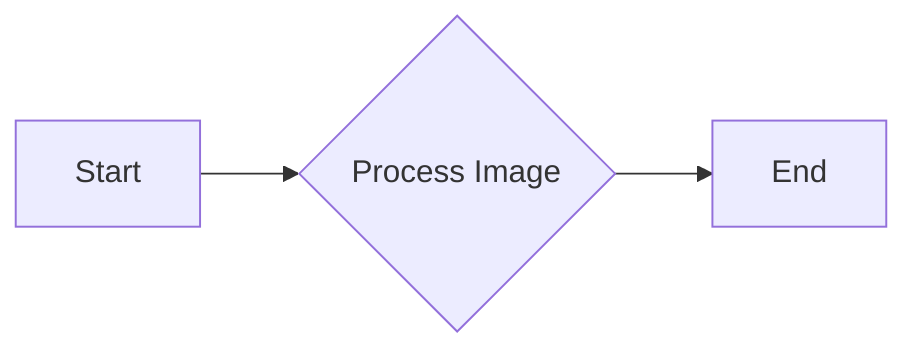

#### 带注释源码

```python
def process_image(self, padded_src, dpi):
    # This method should be overridden by subclasses to provide specific image processing logic.
    raise NotImplementedError("Should be overridden by subclasses")
```

#### 关键组件

- `padded_src`：输入图像，已经填充了边界。
- `dpi`：图像的分辨率。

#### 潜在的技术债务或优化空间

- 子类可能需要实现不同的图像处理算法，这可能导致代码重复。
- 可以考虑使用设计模式，如策略模式，来管理不同的图像处理策略。

#### 设计目标与约束

- 提供一个通用的接口来处理图像。
- 允许子类实现特定的图像处理逻辑。

#### 错误处理与异常设计

- 如果子类没有实现 `process_image` 方法，将抛出 `NotImplementedError`。

#### 数据流与状态机

- 数据流：输入图像 -> 填充边界 -> 处理 -> 输出图像。
- 状态机：没有使用状态机。

#### 外部依赖与接口契约

- 依赖于 NumPy 库进行图像处理。
- 接口契约：子类必须实现 `process_image` 方法。

### BaseFilter.__call__

**描述**

`BaseFilter.__call__` 方法是 `BaseFilter` 类的调用接口，它接受一个图像和分辨率作为输入，然后应用过滤效果并返回处理后的图像以及偏移量。

**参数**

- `im`：`numpy.ndarray`，输入图像。
- `dpi`：`int`，图像的分辨率。

**返回值**

- `tgt_image`：`numpy.ndarray`，处理后的图像。
- `offsetx`：`int`，水平偏移量。
- `offsety`：`int`，垂直偏移量。

#### 流程图

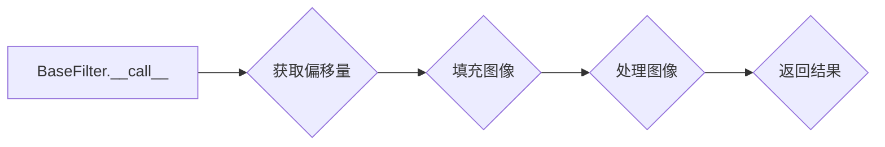

#### 带注释源码

```python
def __call__(self, im, dpi):
    pad = self.get_pad(dpi)
    padded_src = np.pad(im, [(pad, pad), (pad, pad), (0, 0)], "constant")
    tgt_image = self.process_image(padded_src, dpi)
    return tgt_image, -pad, -pad
```


### OffsetFilter.__init__

This method initializes an instance of the `OffsetFilter` class, which is a subclass of `BaseFilter`. It sets the initial offsets for the image processing.

参数：

- `offsets`：`(int, int)`，The initial offsets for the image processing in pixels.

返回值：`None`，This method does not return any value.

#### 流程图

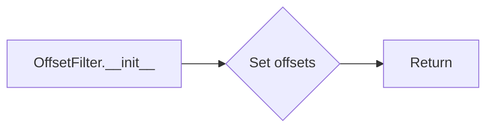

#### 带注释源码

```python
def __init__(self, offsets=(0, 0)):
    # Initialize the base class
    super().__init__()
    
    # Set the initial offsets
    self.offsets = offsets
```


### OffsetFilter.get_pad

OffsetFilter.get_pad 是 OffsetFilter 类的一个方法，用于计算图像处理时需要添加的填充大小。

参数：

- dpi：`int`，图像的分辨率（每英寸点数）

返回值：`int`，计算得到的填充大小

#### 流程图

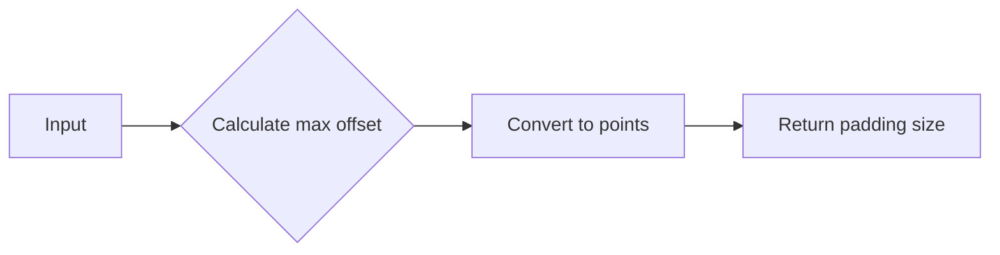

#### 带注释源码

```python
def get_pad(self, dpi):
    return int(max(self.offsets) / 72 * dpi)
```

### OffsetFilter.process_image

OffsetFilter.process_image 是 OffsetFilter 类的一个方法，用于处理图像，通过在图像上应用水平或垂直偏移。

参数：

- `padded_src`：`numpy.ndarray`，经过填充的源图像。
- `dpi`：`int`，图像的分辨率（每英寸点数）。

返回值：`numpy.ndarray`，处理后的图像。

#### 流程图

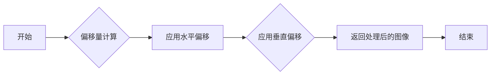

#### 带注释源码

```python
def process_image(self, padded_src, dpi):
    ox, oy = self.offsets
    a1 = np.roll(padded_src, int(ox / 72 * dpi), axis=1)  # 应用水平偏移
    a2 = np.roll(a1, -int(oy / 72 * dpi), axis=0)  # 应用垂直偏移
    return a2  # 返回处理后的图像
```

### OffsetFilter.__call__

OffsetFilter.__call__ 是 OffsetFilter 类的一个实例方法，它用于对图像应用偏移滤镜。

参数：

- `im`：`numpy.ndarray`，输入图像。
- `dpi`：`int`，图像的分辨率。

返回值：`numpy.ndarray`，处理后的图像。

#### 流程图


#### 带注释源码

```python
def __call__(self, im, dpi):
    # 获取偏移量
    ox, oy = self.offsets
    
    # 创建填充图像
    pad = self.get_pad(dpi)
    padded_src = np.pad(im, [(pad, pad), (pad, pad), (0, 0)], "constant")
    
    # 应用偏移
    a1 = np.roll(padded_src, int(ox / 72 * dpi), axis=1)
    a2 = np.roll(a1, -int(oy / 72 * dpi), axis=0)
    
    # 返回处理后的图像
    return a2
```


### GaussianFilter.__init__

初始化 GaussianFilter 类，设置高斯滤波器的参数。

参数：

- `sigma`：`float`，高斯滤波器的标准差，用于控制模糊程度。
- `alpha`：`float`，用于控制图像透明度，默认为 0.5。
- `color`：`tuple`，用于设置背景颜色，默认为黑色 `(0, 0, 0)`。

返回值：无

#### 流程图

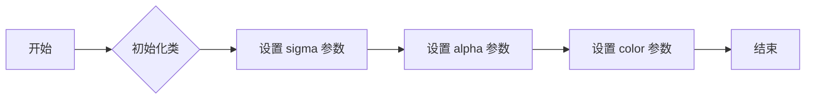

#### 带注释源码

```python
def __init__(self, sigma, alpha=0.5, color=(0, 0, 0)):
    self.sigma = sigma
    self.alpha = alpha
    self.color = color
```


### GaussianFilter.get_pad

**描述**

`get_pad` 方法是 `GaussianFilter` 类的一个方法，用于计算在应用高斯滤波器之前图像需要增加的填充大小。

**参数**

- `dpi`：`int`，图像的分辨率（每英寸点数）。

**返回值**

- `int`：计算出的填充大小。

#### 流程图

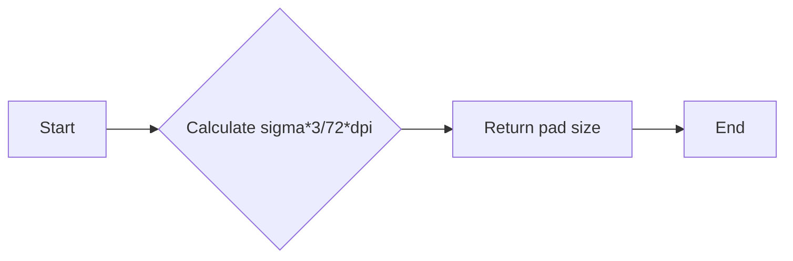

#### 带注释源码

```python
def get_pad(self, dpi):
    # Calculate the padding size based on sigma, alpha, and dpi
    return int(self.sigma * 3 / 72 * dpi)
```

### GaussianFilter.process_image

GaussianFilter.process_image 是 GaussianFilter 类的一个方法，用于对图像应用高斯模糊。

参数：

- `padded_src`：`numpy.ndarray`，经过填充的源图像。
- `dpi`：`int`，图像的分辨率。

返回值：`numpy.ndarray`，应用高斯模糊后的图像。

#### 流程图

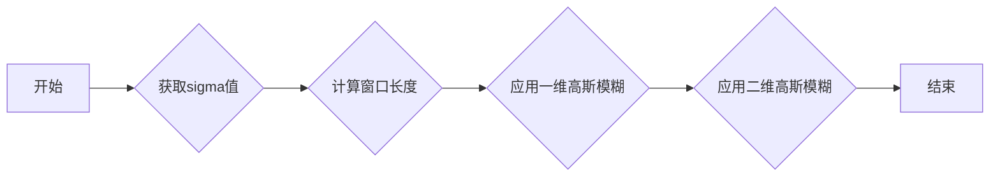

#### 带注释源码

```python
def process_image(self, padded_src, dpi):
    tgt_image = np.empty_like(padded_src)
    tgt_image[:, :, :3] = self.color
    tgt_image[:, :, 3] = smooth2d(padded_src[:, :, 3] * self.alpha,
                                  self.sigma / 72 * dpi)
    return tgt_image
```

### GaussianFilter.__call__

GaussianFilter.__call__ is a method of the GaussianFilter class that applies a Gaussian blur to an image.

参数：

- `im`：`numpy.ndarray`，输入图像
- `dpi`：`int`，图像的分辨率

返回值：`numpy.ndarray`，处理后的图像

#### 流程图

```mermaid
graph LR
A[开始] --> B{创建 GaussianFilter 实例}
B --> C{获取 pad 大小}
C --> D{创建 padded_src}
D --> E{调用 process_image}
E --> F{返回 tgt_image, -pad, -pad}
F --> G[结束]
```

#### 带注释源码

```python
def __call__(self, im, dpi):
    pad = self.get_pad(dpi)
    padded_src = np.pad(im, [(pad, pad), (pad, pad), (0, 0)], "constant")
    tgt_image = self.process_image(padded_src, dpi)
    return tgt_image, -pad, -pad
```


### DropShadowFilter.__init__

DropShadowFilter 类的构造函数，用于初始化阴影滤镜的参数。

参数：

- `sigma`：`float`，高斯滤波器的标准差，用于控制阴影的模糊程度。
- `alpha`：`float`，阴影的透明度，默认为 0.3。
- `color`：`tuple`，阴影的颜色，默认为 `(0, 0, 0)`。
- `offsets`：`tuple`，阴影的偏移量，默认为 `(0, 0)`。

返回值：无

#### 流程图

```mermaid
classDiagram
    class DropShadowFilter {
        float sigma
        float alpha
        tuple color
        tuple offsets
        GaussianFilter gauss_filter
        OffsetFilter offset_filter
    }
    DropShadowFilter <|-- GaussianFilter
    DropShadowFilter <|-- OffsetFilter
    DropShadowFilter : +init(sigma: float, alpha: float, color: tuple, offsets: tuple)
    DropShadowFilter : +get_pad(dpi: float): int
    DropShadowFilter : +process_image(padded_src: np.ndarray, dpi: float): np.ndarray
}
```

#### 带注释源码

```python
class DropShadowFilter(BaseFilter):

    def __init__(self, sigma, alpha=0.3, color=(0, 0, 0), offsets=(0, 0)):
        self.gauss_filter = GaussianFilter(sigma, alpha, color)
        self.offset_filter = OffsetFilter(offsets)

    def get_pad(self, dpi):
        return max(self.gauss_filter.get_pad(dpi),
                   self.offset_filter.get_pad(dpi))

    def process_image(self, padded_src, dpi):
        t1 = self.gauss_filter.process_image(padded_src, dpi)
        t2 = self.offset_filter.process_image(t1, dpi)
        return t2
```


### DropShadowFilter.get_pad

This method calculates the padding required for the shadow effect based on the DPI and the sigma value of the Gaussian filter used to create the shadow.

参数：

- dpi：`int`，The dots per inch value used for scaling the padding.
- ...

返回值：`int`，The calculated padding value in pixels.

#### 流程图

```mermaid
graph LR
A[Start] --> B{Calculate padding}
B --> C[Return padding]
C --> D[End]
```

#### 带注释源码

```python
def get_pad(self, dpi):
    return max(self.gauss_filter.get_pad(dpi),
               self.offset_filter.get_pad(dpi))
```


### DropShadowFilter.process_image

This method applies a Gaussian blur and an offset to an image to create a drop shadow effect.

参数：

- `padded_src`：`numpy.ndarray`，The padded source image.
- `dpi`：`int`，The dots per inch of the image.

返回值：`numpy.ndarray`，The processed image with a drop shadow effect.

#### 流程图

```mermaid
graph LR
A[Start] --> B{Create Gaussian filter}
B --> C{Create offset filter}
C --> D{Apply Gaussian filter}
D --> E{Apply offset filter}
E --> F[End]
```

#### 带注释源码

```python
def process_image(self, padded_src, dpi):
    t1 = self.gauss_filter.process_image(padded_src, dpi)
    t2 = self.offset_filter.process_image(t1, dpi)
    return t2
```


### DropShadowFilter.__call__

DropShadowFilter类的实例调用方法，用于应用阴影效果到图像上。

参数：

- `im`：`numpy.ndarray`，输入图像数据。
- `dpi`：`int`，图像的分辨率。

返回值：`numpy.ndarray`，应用阴影效果后的图像数据。

#### 流程图

```mermaid
graph LR
A[开始] --> B{创建 GaussianFilter 实例}
B --> C{创建 OffsetFilter 实例}
C --> D{获取 GaussianFilter 的 padding}
D --> E{获取 OffsetFilter 的 padding}
E --> F{取最大 padding}
F --> G{创建 padded_src}
G --> H{应用 GaussianFilter}
H --> I{应用 OffsetFilter}
I --> J[结束]
```

#### 带注释源码

```python
class DropShadowFilter(BaseFilter):

    def __init__(self, sigma, alpha=0.3, color=(0, 0, 0), offsets=(0, 0)):
        self.gauss_filter = GaussianFilter(sigma, alpha, color)
        self.offset_filter = OffsetFilter(offsets)

    def get_pad(self, dpi):
        return max(self.gauss_filter.get_pad(dpi),
                   self.offset_filter.get_pad(dpi))

    def process_image(self, padded_src, dpi):
        t1 = self.gauss_filter.process_image(padded_src, dpi)
        t2 = self.offset_filter.process_image(t1, dpi)
        return t2

    def __call__(self, im, dpi):
        pad = self.get_pad(dpi)
        padded_src = np.pad(im, [(pad, pad), (pad, pad), (0, 0)], "constant")
        tgt_image = self.process_image(padded_src, dpi)
        return tgt_image, -pad, -pad
```


### LightFilter.__init__

This method initializes a `LightFilter` object, which applies a light source filter to an image to enhance its contrast and add a light effect.

参数：

- `sigma`：`float`，sigma for gaussian filter，用于控制高斯滤波器的宽度。
- `fraction`：`number`，default: 1，用于调整对比度。

返回值：无

#### 流程图

```mermaid
graph LR
A[Start] --> B{Create GaussianFilter}
B --> C{Create LightSource}
C --> D{Set sigma and fraction}
D --> E[End]
```

#### 带注释源码

```python
class LightFilter(BaseFilter):
    """Apply LightSource filter"""

    def __init__(self, sigma, fraction=1):
        """
        Parameters
        ----------
        sigma : float
            sigma for gaussian filter
        fraction: number, default: 1
            Increases or decreases the contrast of the hillshade.
            See `matplotlib.colors.LightSource`

        """
        self.gauss_filter = GaussianFilter(sigma, alpha=1)
        self.light_source = LightSource()
        self.fraction = fraction
``` 


### LightFilter.get_pad

该函数用于计算在应用高斯滤波器之前图像需要增加的填充大小。

#### 参数

- `dpi`：`int`，图像的分辨率（每英寸点数）

#### 返回值

- `int`：计算出的填充大小

#### 流程图

```mermaid
graph LR
A[Start] --> B{Calculate sigma*3/72*dpi}
B --> C[Return pad size]
C --> D[End]
```

#### 带注释源码

```python
def get_pad(self, dpi):
    return int(self.sigma*3 / 72 * dpi)
```

### LightFilter.process_image

LightFilter.process_image 是 LightFilter 类的一个方法，用于应用 LightSource 滤镜到图像上。

#### 参数

- `padded_src`：`numpy.ndarray`，经过填充的源图像。
- `dpi`：`int`，图像的分辨率（每英寸点数）。

#### 返回值

- `numpy.ndarray`，处理后的图像。

#### 流程图

```mermaid
graph LR
A[开始] --> B{获取高程}
B --> C{获取 RGB 和 Alpha}
C --> D{应用 Gaussian 滤镜}
D --> E{应用 LightSource 滤镜}
E --> F[结束]
```

#### 带注释源码

```python
def process_image(self, padded_src, dpi):
    t1 = self.gauss_filter.process_image(padded_src, dpi)
    elevation = t1[:, :, 3]
    rgb = padded_src[:, :, :3]
    alpha = padded_src[:, :, 3:]
    rgb2 = self.light_source.shade_rgb(rgb, elevation,
                                       fraction=self.fraction,
                                       blend_mode="overlay")
    return np.concatenate([rgb2, alpha], -1)
```

### LightFilter.__call__

LightFilter 类的 `__call__` 方法用于应用 LightSource 滤镜到图像上。

参数：

- `im`：`numpy.ndarray`，输入图像，应为三维数组，其中包含 RGB 和 alpha 通道。
- `dpi`：`int`，图像的 DPI 值。

返回值：`numpy.ndarray`，处理后的图像，与输入图像具有相同的形状和类型。

#### 流程图

```mermaid
graph LR
A[开始] --> B{获取垫片大小}
B --> C{创建填充图像}
C --> D{应用高斯滤波}
D --> E{获取高度}
E --> F{应用 LightSource 滤镜}
F --> G[结束]
```

#### 带注释源码

```python
def process_image(self, padded_src, dpi):
    t1 = self.gauss_filter.process_image(padded_src, dpi)
    elevation = t1[:, :, 3]
    rgb = padded_src[:, :, :3]
    alpha = padded_src[:, :, 3:]
    rgb2 = self.light_source.shade_rgb(rgb, elevation,
                                       fraction=self.fraction,
                                       blend_mode="overlay")
    return np.concatenate([rgb2, alpha], -1)
```


### GrowFilter.__init__

This method initializes a `GrowFilter` instance, which is used to enlarge the area of an image by adding pixels around it.

参数：

- `pixels`：`int`，The number of pixels to add around the image.
- `color`：`tuple`，The color to use for the added pixels. Default is `(1, 1, 1)`.

返回值：`None`

#### 流程图

```mermaid
graph LR
A[Start] --> B{Initialize GrowFilter}
B --> C[Set pixels to {pixels}]
B --> D[Set color to {color}]
C & D --> E[End]
```

#### 带注释源码

```python
class GrowFilter(BaseFilter):
    """Enlarge the area."""

    def __init__(self, pixels, color=(1, 1, 1)):
        self.pixels = pixels
        self.color = color
```


### GrowFilter.__call__

GrowFilter.__call__ 是一个类方法，用于放大图像区域。

参数：

- `im`：`numpy.ndarray`，输入图像。
- `dpi`：`int`，图像的分辨率。

返回值：`numpy.ndarray`，放大后的图像。

#### 流程图

```mermaid
graph LR
A[开始] --> B{创建alpha}
B --> C{填充alpha}
C --> D{平滑alpha}
D --> E{创建新图像}
E --> F{设置颜色}
F --> G{设置alpha}
G --> H[结束]
```

#### 带注释源码

```python
class GrowFilter(BaseFilter):
    """Enlarge the area."""

    def __init__(self, pixels, color=(1, 1, 1)):
        self.pixels = pixels
        self.color = color

    def __call__(self, im, dpi):
        # 创建alpha
        alpha = np.pad(im[..., 3], self.pixels, "constant")
        # 填充alpha
        alpha2 = np.clip(smooth2d(alpha, self.pixels / 72 * dpi) * 5, 0, 1)
        # 创建新图像
        new_im = np.empty((*alpha2.shape, 4))
        # 设置颜色
        new_im[:, :, :3] = self.color
        # 设置alpha
        new_im[:, :, 3] = alpha2
        # 返回结果
        offsetx, offsety = -self.pixels, -self.pixels
        return new_im, offsetx, offsety
```


### FilteredArtistList.__init__

FilteredArtistList 的构造函数用于初始化一个包含多个艺术家对象的列表，并为这些艺术家应用一个过滤器。

参数：

- `artist_list`：`list`，包含艺术家对象的列表。
- `filter`：`BaseFilter`，应用于艺术家列表的过滤器。

返回值：无

#### 流程图

```mermaid
classDiagram
    class FilteredArtistList {
        -artist_list: list
        -filter: BaseFilter
    }
    class Artist {
    }
    FilteredArtistList <|-- Artist
    FilteredArtistList {
        -init(artist_list: list, filter: BaseFilter)
    }
    FilteredArtistList {
        -_artist_list: list
        -_filter: BaseFilter
    }
}
```

#### 带注释源码

```python
class FilteredArtistList(Artist):
    """A simple container to filter multiple artists at once."""

    def __init__(self, artist_list, filter):
        super().__init__()
        self._artist_list = artist_list
        self._filter = filter
```


### FilteredArtistList.draw

FilteredArtistList.draw 是一个类方法，它用于在 Matplotlib 中绘制经过过滤的艺术家列表。

#### 描述

该方法遍历艺术家列表，并对每个艺术家调用其 draw 方法，然后应用过滤效果。

#### 参数

- `renderer`：`matplotlib.backends.backend_agg.FigureCanvasAgg`，渲染器对象，用于绘制图像。

#### 返回值

无返回值。

#### 流程图

```mermaid
graph LR
A[FilteredArtistList.draw] --> B{开始}
B --> C{遍历艺术家列表}
C --> D{调用艺术家.draw方法}
D --> E{应用过滤效果}
E --> F{结束}
```

#### 带注释源码

```python
def draw(self, renderer):
    renderer.start_rasterizing()
    renderer.start_filter()
    for a in self._artist_list:
        a.draw(renderer)
    renderer.stop_filter(self._filter)
    renderer.stop_rasterizing()
```

## 关键组件


### 张量索引与惰性加载

张量索引与惰性加载是代码中用于处理图像数据的关键组件。它允许对图像数据进行高效的索引和访问，同时延迟实际的数据加载，从而提高性能和资源利用率。

### 反量化支持

反量化支持是代码中用于处理量化数据的组件。它允许将量化后的数据转换回原始数据，以便进行进一步的处理和分析。

### 量化策略

量化策略是代码中用于处理图像数据的关键组件。它定义了如何将图像数据量化为有限数量的离散值，以便在有限的资源下进行高效的存储和处理。


## 问题及建议


### 已知问题

-   **代码重复**：`drop_shadow_line` 和 `drop_shadow_patches` 函数中使用了相似的代码来创建阴影效果，这可能导致维护困难。
-   **全局变量和函数**：代码中使用了全局变量和函数，这可能导致代码难以理解和维护。
-   **异常处理**：代码中没有明显的异常处理机制，这可能导致程序在遇到错误时崩溃。
-   **性能问题**：`smooth2d` 函数可能在大图像上运行缓慢，因为它使用了 `np.convolve`。

### 优化建议

-   **代码重构**：将重复的代码提取到单独的函数中，以减少代码重复并提高可维护性。
-   **使用类**：将全局变量和函数封装到类中，以提高代码的组织性和可读性。
-   **异常处理**：添加异常处理机制，以捕获和处理可能发生的错误。
-   **性能优化**：考虑使用更高效的算法或库来处理图像平滑，例如使用 `scipy.ndimage`。
-   **文档**：为代码添加详细的文档注释，以提高代码的可读性和可维护性。
-   **测试**：编写单元测试来验证代码的功能和性能。


## 其它


### 设计目标与约束

- 设计目标：
  - 提供一系列图像过滤功能，包括平滑、阴影、光照和放大。
  - 支持与Matplotlib集成，允许在绘图时应用这些过滤效果。
  - 提供灵活的配置选项，如偏移量、颜色和强度。
- 约束：
  - 必须与Matplotlib的Artist类兼容。
  - 过滤效果应在不同的渲染后端上保持一致。
  - 应尽可能减少性能影响。

### 错误处理与异常设计

- 错误处理：
  - 在`process_image`方法中，如果输入图像格式不正确，应抛出`ValueError`。
  - 在`get_pad`方法中，如果`dpi`参数无效，应抛出`ValueError`。
- 异常设计：
  - 所有方法都应捕获并处理可能发生的异常，确保程序的健壮性。

### 数据流与状态机

- 数据流：
  - 输入图像通过`process_image`方法进行处理。
  - 处理后的图像通过`draw`方法绘制到Matplotlib的画布上。
- 状态机：
  - 每个过滤类都有自己的状态，如偏移量、颜色和强度。
  - 这些状态在初始化时设置，并在处理图像时使用。

### 外部依赖与接口契约

- 外部依赖：
  - Matplotlib：用于绘图和图像处理。
  - NumPy：用于数值计算。
- 接口契约：
  - `BaseFilter`类定义了所有过滤类的接口。
  - `FilteredArtistList`类用于同时过滤多个Artist对象。

### 测试与验证

- 测试：
  - 对每个过滤类进行单元测试，确保其功能按预期工作。
  - 对整个模块进行集成测试，确保所有过滤效果可以协同工作。
- 验证：
  - 使用不同的图像和配置选项进行验证，确保过滤效果在各种情况下都有效。

### 性能优化

- 性能优化：
  - 使用NumPy的向量化操作来提高性能。
  - 优化图像处理算法，减少不必要的计算。

### 安全性

- 安全性：
  - 验证输入图像的格式，防止潜在的注入攻击。
  - 确保所有外部依赖都来自可信来源。

### 可维护性

- 可维护性：
  - 使用清晰的命名约定和代码组织结构。
  - 提供详细的文档和注释，方便其他开发者理解和使用代码。

### 用户文档

- 用户文档：
  - 提供安装和配置指南。
  - 提供每个过滤类的详细说明和示例。

### 社区与支持

- 社区与支持：
  - 建立一个开发者社区，鼓励用户反馈和贡献。
  - 提供技术支持，帮助用户解决使用过程中遇到的问题。


    