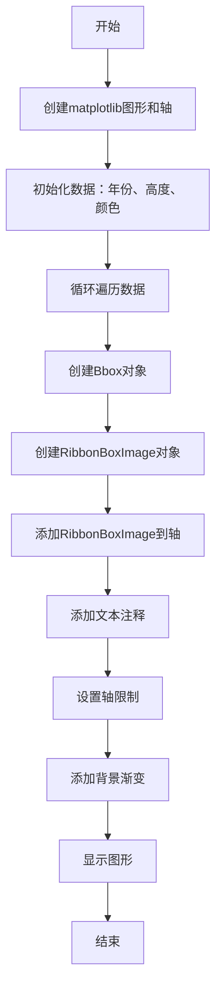
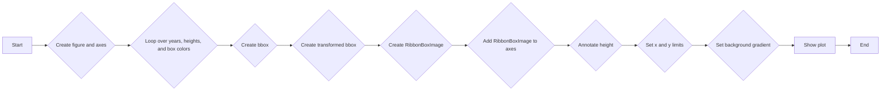
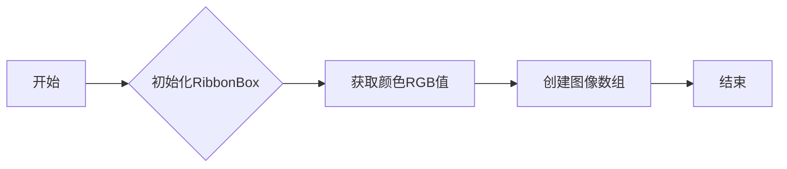
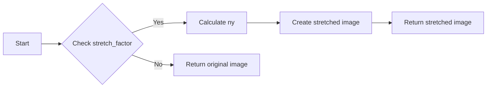
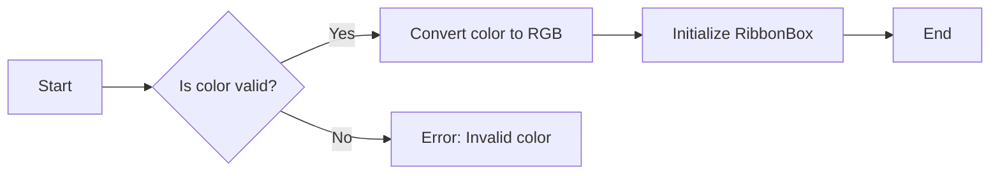

# `matplotlib\galleries\examples\misc\demo_ribbon_box.py` 详细设计文档

This code defines a RibbonBox class to create and manipulate ribbon-like images for visualization purposes, and a RibbonBoxImage class to integrate these images into matplotlib plots.

## 整体流程



## 类结构

```
RibbonBox (类)
├── RibbonBoxImage (类)
└── main (全局函数)
```

## 全局变量及字段


### `plt`
    
Matplotlib's pyplot module for plotting and visualizing data.

类型：`module`
    


### `np`
    
NumPy module for numerical operations.

类型：`module`
    


### `cbook`
    
Matplotlib's internal utility module for bookkeeping.

类型：`module`
    


### `mcolors`
    
Matplotlib's color manipulation module.

类型：`module`
    


### `AxesImage`
    
Matplotlib's AxesImage class for handling images in an Axes object.

类型：`class`
    


### `Bbox`
    
Matplotlib's Bbox class for representing a bounding box in axes coordinates.

类型：`class`
    


### `BboxTransformTo`
    
Matplotlib's BboxTransformTo class for transforming a bounding box to a different coordinate system.

类型：`class`
    


### `TransformedBbox`
    
Matplotlib's TransformedBbox class for representing a transformed bounding box.

类型：`class`
    


### `RibbonBox.original_image`
    
The original image loaded from a file.

类型：`numpy.ndarray`
    


### `RibbonBox.cut_location`
    
The location where the image is cut for processing.

类型：`int`
    


### `RibbonBox.b_and_h`
    
The blue and hue channels of the original image.

类型：`numpy.ndarray`
    


### `RibbonBox.color`
    
The color difference between the blue and hue channels of the original image.

类型：`numpy.ndarray`
    


### `RibbonBox.alpha`
    
The alpha (transparency) channel of the original image.

类型：`numpy.ndarray`
    


### `RibbonBox.nx`
    
The width of the original image.

类型：`int`
    


### `RibbonBoxImage.zorder`
    
The z-order for rendering the image in the plot.

类型：`int`
    
    

## 全局函数及方法


### main()

The `main` function is the entry point of the script. It creates a plot with a ribbon box image for each year and height pair, annotated with the height value.

参数：

- 无

返回值：无

#### 流程图



#### 带注释源码

```python
def main():
    fig, ax = plt.subplots()  # A: Create figure and axes

    years = np.arange(2004, 2009)
    heights = [7900, 8100, 7900, 6900, 2800]
    box_colors = [
        (0.8, 0.2, 0.2),
        (0.2, 0.8, 0.2),
        (0.2, 0.2, 0.8),
        (0.7, 0.5, 0.8),
        (0.3, 0.8, 0.7),
    ]

    for year, h, bc in zip(years, heights, box_colors):  # C: Loop over years, heights, and box colors
        bbox0 = Bbox.from_extents(year - 0.4, 0., year + 0.4, h)  # D: Create bbox
        bbox = TransformedBbox(bbox0, ax.transData)  # E: Create transformed bbox
        ax.add_artist(RibbonBoxImage(ax, bbox, bc, interpolation="bicubic"))  # F: Create RibbonBoxImage
        ax.annotate(str(h), (year, h), va="bottom", ha="center")  # H: Annotate height

    ax.set_xlim(years[0] - 0.5, years[-1] + 0.5)  # I: Set x and y limits
    ax.set_ylim(0, 10000)

    background_gradient = np.zeros((2, 2, 4))
    background_gradient[:, :, :3] = [1, 1, 0]
    background_gradient[:, :, 3] = [[0.1, 0.3], [0.3, 0.5]]  # alpha channel
    ax.imshow(background_gradient, interpolation="bicubic", zorder=0.1,
              extent=(0, 1, 0, 1), transform=ax.transAxes)  # J: Set background gradient

    plt.show()  # K: Show plot
``` 


### RibbonBox.__init__

初始化RibbonBox类，设置图像的初始颜色。

参数：

- `color`：`str`，颜色字符串，用于设置图像的初始颜色。

返回值：无

#### 流程图



#### 带注释源码

```python
def __init__(self, color):
    rgb = mcolors.to_rgb(color)  # 将颜色字符串转换为RGB值
    self.im = np.dstack(  # 创建图像数组
        [self.b_and_h - self.color * (1 - np.array(rgb)), self.alpha])  # 设置图像颜色和透明度
```


### RibbonBox.get_stretched_image

获取拉伸后的图像。

参数：

- `stretch_factor`：`float`，拉伸因子，用于调整图像的高度。

返回值：`numpy.ndarray`，拉伸后的图像数组。

#### 流程图



#### 带注释源码

```python
def get_stretched_image(self, stretch_factor):
    stretch_factor = max(stretch_factor, 1)
    ny, nx, nch = self.im.shape
    ny2 = int(ny * stretch_factor)
    return np.vstack(
        [self.im[:self.cut_location],
         np.broadcast_to(
             self.im[self.cut_location], (ny2 - ny, nx, nch)),
         self.im[self.cut_location:]])
```


### RibbonBox.__init__

初始化RibbonBox类，用于创建一个具有特定颜色的图像。

参数：

- `color`：`str`，颜色字符串，用于确定图像的颜色。

返回值：无

#### 流程图



#### 带注释源码

```python
def __init__(self, color):
    rgb = mcolors.to_rgb(color)
    self.im = np.dstack(
        [self.b_and_h - self.color * (1 - np.array(rgb)), self.alpha])
```

在这个方法中，首先检查传入的颜色是否有效。如果有效，则将颜色字符串转换为RGB值，然后创建一个新的图像数组`self.im`，该数组由背景颜色、颜色和透明度通道组成。


### RibbonBoxImage.draw

The `draw` method of the `RibbonBoxImage` class is responsible for drawing the image on the axes. It stretches the image based on the bounding box and updates the array if necessary.

参数：

- `renderer`：`matplotlib.backends.backend_agg.FigureCanvasAggRendererAgg`，The renderer object used to draw the image.

返回值：无

#### 流程图

```mermaid
graph LR
A[Start] --> B{Check if array is None or shape is incorrect}
B -- Yes --> C[Set array to stretched image]
B -- No --> D[Draw image using super().draw(renderer)]
C --> E[End]
D --> E
```

#### 带注释源码

```python
def draw(self, renderer):
    stretch_factor = self._bbox.height / self._bbox.width

    ny = int(stretch_factor * self._ribbonbox.nx)
    if self.get_array() is None or self.get_array().shape[0] != ny:
        arr = self._ribbonbox.get_stretched_image(stretch_factor)
        self.set_array(arr)

    super().draw(renderer)
``` 


## 关键组件


### 张量索引与惰性加载

张量索引与惰性加载用于在`RibbonBox`类中处理图像数据，允许在需要时才进行计算，从而提高效率。

### 反量化支持

反量化支持确保在图像处理过程中，颜色和透明度值能够正确地转换和存储。

### 量化策略

量化策略用于将图像数据转换为更小的数据类型，以减少内存使用和提高处理速度。


## 问题及建议


### 已知问题

-   **全局变量使用**: 代码中使用了多个全局变量，如 `original_image`, `cut_location`, `b_and_h`, `color`, `alpha`, 和 `nx`。这些变量在类外部定义，可能会引起命名冲突和难以追踪。
-   **硬编码值**: `cut_location` 和 `nx` 是硬编码的值，这限制了代码的灵活性和可重用性。
-   **颜色转换**: `mcolors.to_rgb(color)` 用于将颜色字符串转换为 RGB 值，但未进行错误处理，如果输入的颜色字符串无效，可能会导致异常。
-   **内存使用**: `original_image` 是一个大型图像数据，如果图像文件很大，这可能会导致内存使用过高。
-   **代码可读性**: 代码中存在一些复杂的操作，如 `np.dstack` 和 `np.vstack`，这可能会降低代码的可读性。

### 优化建议

-   **封装全局变量**: 将全局变量封装到类中，以减少命名冲突和增加代码的可维护性。
-   **参数化硬编码值**: 将硬编码的值作为参数传递给函数或类，以提高代码的灵活性和可重用性。
-   **错误处理**: 在颜色转换函数中添加错误处理，以确保输入的颜色字符串有效。
-   **内存管理**: 考虑使用图像处理库（如 PIL）来处理图像，这可能会更有效地管理内存。
-   **代码重构**: 对复杂的操作进行重构，以提高代码的可读性。

## 其它


### 设计目标与约束

- 设计目标：实现一个能够根据给定颜色生成并显示彩色条带图像的类。
- 约束条件：使用matplotlib库进行图像处理和显示，图像颜色需符合RGB格式。

### 错误处理与异常设计

- 异常处理：在类方法和全局函数中，对可能出现的异常进行捕获和处理，确保程序的健壮性。
- 错误反馈：当发生错误时，提供清晰的错误信息，帮助用户定位问题。

### 数据流与状态机

- 数据流：数据从外部输入（如颜色字符串）经过RibbonBox类处理，生成图像数据，最终通过matplotlib显示。
- 状态机：RibbonBox类在初始化时接收颜色，生成图像数据；RibbonBoxImage类在绘制时根据bbox调整图像大小和位置。

### 外部依赖与接口契约

- 外部依赖：matplotlib库用于图像处理和显示。
- 接口契约：RibbonBox类提供get_stretched_image方法用于获取拉伸后的图像数据；RibbonBoxImage类继承自AxesImage，提供绘制图像的功能。

### 测试与验证

- 测试策略：编写单元测试，验证RibbonBox类和RibbonBoxImage类的功能是否符合预期。
- 验证方法：通过比较实际输出与预期输出，确保程序的正确性。

### 维护与扩展

- 维护策略：定期检查代码质量，修复潜在的错误和漏洞。
- 扩展方向：增加更多图像处理功能，支持更多图像格式和显示效果。


    