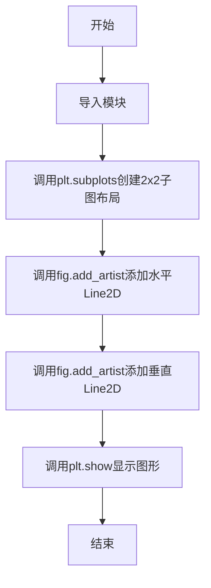
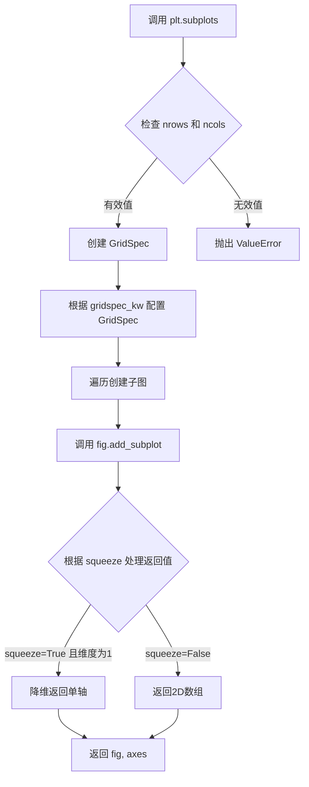
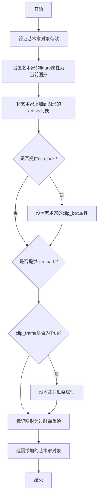
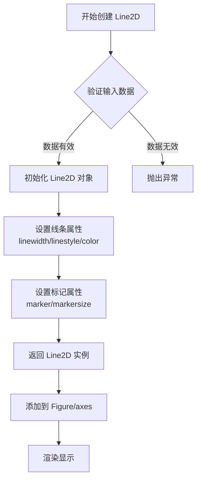
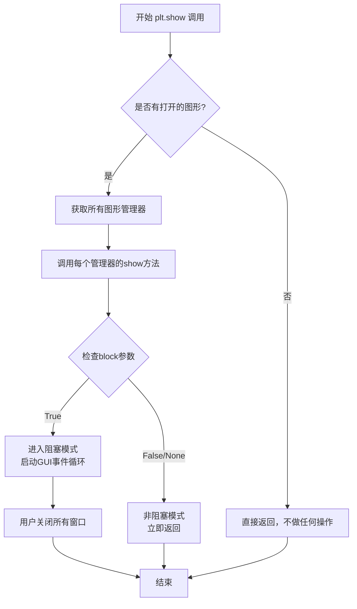

# `matplotlib\galleries\examples\misc\fig_x.py` 详细设计文档

这是一个matplotlib示例代码，展示了如何通过fig.add_artist()方法直接向图形画布添加Line2D线条对象，实现视觉结构化（如辅助线分隔），而不仅依赖于子图坐标轴。

## 整体流程



## 类结构

```
无自定义类层次结构
使用matplotlib.lines.Line2D类
```

## 全局变量及字段


### `fig`
    
plt.subplots返回的Figure对象，代表整个图形窗口，用于添加艺术家对象

类型：`matplotlib.figure.Figure`
    


### `axs`
    
2x2的Axes数组，包含四个子图区域

类型：`numpy.ndarray (shape=(2,2))`
    


### `lines.Line2D实例1`
    
水平线对象，从(0, 0.47)到(1, 0.47)，线宽为3

类型：`matplotlib.lines.Line2D`
    


### `lines.Line2D实例2`
    
垂直线对象，从(0.5, 1)到(0.5, 0)，线宽为3

类型：`matplotlib.lines.Line2D`
    


### `Line2D.xdata`
    
线条x坐标数据

类型：`list 或 array-like`
    


### `Line2D.ydata`
    
线条y坐标数据

类型：`list 或 array-like`
    


### `Line2D.linewidth`
    
线条宽度

类型：`float`
    
    

## 全局函数及方法


### `matplotlib.pyplot.subplots`

`plt.subplots` 是 matplotlib.pyplot 模块的核心函数之一，用于创建一个包含多个子图的 figure 对象，并返回 figure 和 axes 数组。该函数简化了创建子图布局的流程，支持自定义行列数、子图间距、轴共享等高级配置。

参数：

- `nrows`：`int`，默认值 1，子图的行数
- `ncols`：`int`，默认值 1，子图的列数
- `sharex`：`bool or str`，默认值 False，控制子图之间是否共享 x 轴。True 或 'row' 表示共享，'col' 表示按列共享
- `sharey`：`bool or str`，默认值 False，控制子图之间是否共享 y 轴。True 或 'col' 表示共享，'row' 表示按行共享
- `squeeze`：`bool`，默认值 True，若为 True，当子图数量为 1 时返回单个 Axes 对象而非数组
- `width_ratios`：`array-like`，长度为 ncols，定义每列的相对宽度
- `height_ratios`：`array-like`，长度为 nrows，定义每行的相对高度
- `subplot_kw`：`dict`，传递给 `add_subplot` 的关键字参数，用于创建每个子图
- `gridspec_kw`：`dict`，传递给 GridSpec 构造函数的关键字参数
- `**fig_kw`：额外关键字参数，传递给 `plt.figure()` 函数

返回值：`tuple(Figure, ndarray)`，返回 figure 对象和 axes 对象（或 axes 数组）

#### 流程图



#### 带注释源码

```python
def subplots(nrows=1, ncols=1, *, sharex=False, sharey=False,
             squeeze=True, width_ratios=None, height_ratios=None,
             subplot_kw=None, gridspec_kw=None, **fig_kw):
    """
    创建子图布局的便捷函数。
    
    参数:
        nrows: 子图行数，默认1
        ncols: 子图列数，默认1
        sharex: x轴共享策略，False/'row'/True/'col'
        sharey: y轴共享策略，False/'col'/True/'row'
        squeeze: 是否压缩返回的axes数组维度
        width_ratios: 每列宽度比例
        height_ratios: 每行高度比例
        subplot_kw: 创建子图的关键字参数
        gridspec_kw: GridSpec配置参数
        **fig_kw: 传递给figure的关键字参数
    
    返回:
        fig: Figure对象
        ax: Axes对象或Axes数组
    """
    # 1. 创建Figure对象
    fig = figure(**fig_kw)
    
    # 2. 创建GridSpec对象
    gs = GridSpec(nrows, ncols, width_ratios=width_ratios,
                  height_ratios=height_ratios, **gridspec_kw)
    
    # 3. 创建子图数组
    axs = [[fig.add_subplot(gs[i, j], **subplot_kw) 
            for j in range(ncols)] 
           for i in range(nrows)]
    axs = np.array(axs)
    
    # 4. 配置轴共享
    if sharex:
        # 实现x轴共享逻辑
        ...
    if sharey:
        # 实现y轴共享逻辑
        ...
    
    # 5. 根据squeeze处理返回值
    if squeeze:
        axs = np.squeeze(axs)
    
    return fig, axs
```

#### 使用示例源码

```python
import matplotlib.pyplot as plt
import matplotlib.lines as lines

# 创建2x2子图布局，配置子图间距
fig, axs = plt.subplots(2, 2, gridspec_kw={'hspace': 0.4, 'wspace': 0.4})

# 直接向figure添加线条对象
fig.add_artist(lines.Line2D([0, 1], [0.47, 0.47], linewidth=3))
fig.add_artist(lines.Line2D([0.5, 0.5], [1, 0], linewidth=3))

plt.show()
```


### `fig.add_artist`

向图形（Figure）添加一个艺术家对象（Artist），如线条、文本等，使其成为图形的一部分并可被渲染。

参数：
-  `artist`：`matplotlib.artist.Artist`，要添加到图形的艺术家对象（例如 `Line2D`、`Text` 等）。
-  `clip_box`：`matplotlib.transforms.Bbox`，可选，定义艺术家的裁剪框。
-  `clip_path`：`matplotlib.transforms.Path`，可选，定义艺术家的裁剪路径。
-  `clip_frame`：bool，可选，是否裁剪到图形框架，默认为 True。

返回值：`matplotlib.artist.Artist`，返回已添加的艺术家对象。

#### 流程图



#### 带注释源码

```python
def add_artist(self, artist, clip_box=None, clip_path=None, clip_frame=True):
    """
    向图形添加一个艺术家对象（Artist）。

    参数:
        artist (matplotlib.artist.Artist): 要添加的艺术家对象。
        clip_box (matplotlib.transforms.Bbox, optional): 裁剪框。
        clip_path (matplotlib.transforms.Path, optional): 裁剪路径。
        clip_frame (bool, optional): 是否裁剪到框架，默认为True。

    返回值:
        matplotlib.artist.Artist: 返回添加的艺术家对象。
    """
    # 将艺术家的figure属性设置为当前图形，建立关联
    artist.set_figure(self)
    
    # 将艺术家添加到图形的artists列表中
    self.artists.append(artist)
    
    # 如果提供了裁剪框，设置艺术家的clip_box属性
    if clip_box is not None:
        artist.set_clip_box(clip_box)
    
    # 如果提供了裁剪路径，设置艺术家的clip_path属性
    if clip_path is not None:
        artist.set_clip_path(clip_path)
    
    # 设置裁剪框架属性
    artist.set_clip_frame(clip_frame)
    
    # 标记图形为过时，以便在下次绘制时更新
    self.stale_callback = artist.stale_callback
    
    # 返回已添加的艺术家对象
    return artist
```


### `lines.Line2D`

`Line2D` 是 matplotlib 中用于表示 2D 线条的类，通过指定 x 和 y 坐标数据创建线条对象，并可自定义线宽、颜色、线型等属性。该类继承自 `Artist` 基类，是绘制数据可视化图形的基本元素之一。

参数：

- `xdata`：`array-like` 或 `scalar`，线条的 x 坐标数据，可以是单个值或序列
- `ydata`：`array-like` 或 `scalar`，线条的 y 坐标数据，可以是单个值或序列
- `linewidth`：`float`，线条宽度，默认为 `rcParams['lines.linewidth']`（当前为 1.5）
- `linestyle`：`-str-`，线型样式，可选值包括 `'-'`（实线）、`'--'`（虚线）、`'-.'`（点划线）、`':'`（点线）等
- `color`：`color`，线条颜色，可以是颜色名称、十六进制颜色码、RGB 元组等
- `marker`：`str`，标记样式，用于在数据点处显示标记，如 `'o'`（圆圈）、`'s'`（方形）、`'^'`（三角形）等
- `markersize`：`float`，标记大小
- `markerfacecolor`：`color`，标记填充颜色
- `markeredgecolor`：`color`，标记边缘颜色
- `alpha`：`float`，透明度，范围 0-1
- `label`：`str`，图例标签，用于显示图例

返回值：`matplotlib.lines.Line2D`，创建的 2D 线条对象

#### 流程图



#### 带注释源码

```python
import matplotlib.pyplot as plt
import matplotlib.lines as lines

# 创建包含 2x2 子图的图表，配置子图间距
fig, axs = plt.subplots(2, 2, gridspec_kw={'hspace': 0.4, 'wspace': 0.4})

# 创建第一条水平线
# 参数 [0, 1] 为 x 坐标范围（从 0 到 1）
# 参数 [0.47, 0.47] 为 y 坐标（水平线，y 值保持 0.47）
# linewidth=3 设置线条宽度为 3 磅
line1 = lines.Line2D([0, 1], [0.47, 0.47], linewidth=3)

# 创建第二条垂直线
# 参数 [0.5, 0.5] 为 x 坐标（垂直线，x 值保持 0.5）
# 参数 [1, 0] 为 y 坐标范围（从顶部 1 到底部 0）
# linewidth=3 设置线条宽度为 3 磅
line2 = lines.Line2D([0.5, 0.5], [1, 0], linewidth=3)

# 将创建的 Line2D 对象添加到图表中
# add_artist 方法将 artist 对象添加到图表的艺术家列表中
fig.add_artist(lines.Line2D([0, 1], [0.47, 0.47], linewidth=3))
fig.add_artist(lines.Line2D([0.5, 0.5], [1, 0], linewidth=3))

# 显示图表
plt.show()
```

#### 关键组件信息

| 组件名称 | 描述 |
|---------|------|
| `matplotlib.lines.Line2D` | 表示 2D 线条的类，继承自 `Artist` 基类 |
| `fig.add_artist()` | 将 Artist 对象添加到 Figure 的方法 |
| `plt.subplots()` | 创建子图布局的函数 |

#### 潜在的技术债务或优化空间

1. **硬编码坐标值**：示例代码中的坐标值（如 0.47）是硬编码的，建议通过变量或配置方式管理，提高可维护性
2. **重复代码**：创建两条 Line2D 的代码结构相似，可封装为函数减少重复
3. **缺乏错误处理**：未对输入坐标数据的有效性进行验证（如空数组、类型错误等）
4. **注释缺失**：核心创建逻辑缺少详细的参数说明注释

#### 其它项目

**设计目标与约束：**
- Line2D 设计为轻量级的 2D 线条表示，适用于简单线条绘制场景
- 支持多种线条样式和标记，满足基本数据可视化需求
- 遵循 matplotlib 的 Artist 层次结构，可与其他 Artist 组件互操作

**错误处理与异常设计：**
- 当 xdata 和 ydata 长度不匹配时，会抛出 `ValueError` 异常
- 当坐标数据包含无效值时，可能导致渲染异常或警告
- 建议在调用前验证数据有效性

**数据流与状态机：**
```
创建 Line2D 对象 → 设置属性 → 添加到 Figure/Axes → 渲染引擎绘制 → 显示
```

**外部依赖与接口契约：**
- 依赖 `matplotlib.artist.Artist` 基类
- 与 `matplotlib.pyplot` 模块紧密集成
- 返回的 Line2D 对象实现了 `draw()` 方法用于自定义渲染


### plt.show

显示当前所有打开的图形窗口，是Matplotlib库中用于将图形渲染到屏幕的核心函数。它会刷新所有待显示的图形，并根据block参数决定是否阻塞主线程等待用户交互。

参数：

- `block`：`bool`，可选，控制是否阻塞主线程等待图形窗口关闭。默认为None（取决于后端设置）

返回值：`None`，该函数无返回值，仅用于显示图形

#### 流程图



#### 带注释源码

```python
# matplotlib.pyplot.show 函数源码示例
def show(*, block=None):
    """
    显示所有打开的图形窗口。
    
    此函数会刷新所有待显示的图形并将其渲染到屏幕上。
    在某些后端中，它会阻塞程序执行直到用户关闭所有图形窗口。
    
    参数:
        block: bool, 可选
            - True: 阻塞主线程，进入GUI事件循环，等待用户关闭窗口
            - False: 非阻塞模式，函数立即返回，图形继续显示
            - None: 使用后端默认值（大多数后端默认为True）
    
    返回值:
        None: 此函数不返回任何值
    
    使用示例:
        >>> import matplotlib.pyplot as plt
        >>> plt.plot([1, 2, 3], [1, 4, 9])
        >>> plt.show()  # 显示图形
    """
    # 获取所有打开的图形管理器
    for manager in Gcf.get_all_fig_managers():
        # 调用每个图形管理器的show方法进行渲染
        manager.show()
    
    # 如果block为True，则进入阻塞模式
    if block:
        # 启动GUI事件循环，阻塞程序执行
        # 等待用户交互关闭图形窗口
        import matplotlib
        matplotlib.pyplot.show(block=True)
```

---

## 完整设计文档

### 一、代码核心功能概述

该代码演示了如何使用Matplotlib直接在图形（Figure）上添加`Line2D`艺术元素，通过`fig.add_artist()`方法将线条对象直接添加到图形画布中，实现图形的自定义绘制和可视化结构化。

### 二、文件整体运行流程

```
1. 导入模块
   ├── import matplotlib.pyplot as plt
   └── import matplotlib.lines as lines

2. 创建子图布局
   └── plt.subplots(2, 2, gridspec_kw={'hspace': 0.4, 'wspace': 0.4})
       ├── 创建2x2的子图网格
       └── 设置子图之间的间距

3. 添加线条元素
   ├── fig.add_artist(lines.Line2D([0, 1], [0.47, 0.47], linewidth=3))
   │   └── 添加水平线条（从(0, 0.47)到(1, 0.47)）
   └── fig.add_artist(lines.Line2D([0.5, 0.5], [1, 0], linewidth=3))
       └── 添加垂直线条（从(0.5, 1)到(0.5, 0)）

4. 显示图形
   └── plt.show()
```

### 三、关键组件信息

| 组件名称 | 一句话描述 |
|---------|-----------|
| `plt.subplots()` | 创建包含多个子图的图形窗口和坐标轴 |
| `fig.add_artist()` | 将艺术元素（如线条）直接添加到图形画布 |
| `lines.Line2D` | 表示2D线条的艺术家对象 |
| `plt.show()` | 渲染并显示所有打开的图形窗口 |

### 四、潜在的技术债务与优化空间

1. **硬编码坐标值**：线条坐标`[0, 1]`、`[0.47, 0.47]`等使用硬编码值，缺乏灵活性和可配置性
2. **魔法数值**：线条宽度`linewidth=3`和间距`0.4`为魔法数字，应提取为常量或配置参数
3. **缺少错误处理**：未对图形创建失败或线条参数异常进行处理
4. **文档不完整**：代码中的注释可以更加详细，说明每个步骤的目的

### 五、其它项目

**设计目标与约束**：
- 目标：展示如何直接向Figure对象添加艺术家元素
- 约束：需要配合`plt.subplots()`创建的图形使用

**错误处理与异常设计**：
- 如果`fig`对象不存在或已关闭，`add_artist`可能失败
- `Line2D`参数异常（如坐标类型错误）可能导致绘制失败

**外部依赖与接口契约**：
- 依赖`matplotlib.pyplot`和`matplotlib.lines`模块
- `add_artist()`方法接受任何继承自`Artist`的对象


### `matplotlib.lines.Line2D`

该代码展示了如何使用matplotlib内置的`Line2D`类直接将线条艺术家（artist）添加到figure中，而无需通过axes对象。这是一种灵活的图形结构化方法，可以在任何位置添加自定义线条。

参数：

- `xdata`：`list` 或 `array`，线条的X坐标数据
- `ydata`：`list` 或 `array`，线条的Y坐标数据
- `linewidth`：`float`，线条宽度（默认为1.5）
- 其他可选参数包括颜色、样式等Line2D属性

返回值：`matplotlib.lines.Line2D`，返回创建的线条对象

#### 流程图

```mermaid
flowchart TD
    A[开始] --> B[导入matplotlib.pyplot和matplotlib.lines]
    B --> C[创建2x2子图布局 fig, axs]
    C --> D[创建第一个Line2D对象 - 水平线]
    D --> E[使用fig.add_artist添加到figure]
    E --> F[创建第二个Line2D对象 - 垂直线]
    F --> G[使用fig.add_artist添加到figure]
    G --> H[调用plt.show显示图形]
    H --> I[结束]
    
    D --> D1[坐标: [0, 1], Y: [0.47, 0.47]]
    F --> F1[坐标: [0.5, 0.5], Y: [1, 0]]
```

#### 带注释源码

```python
# 导入matplotlib.pyplot用于创建图形和子图
import matplotlib.pyplot as plt

# 导入matplotlib.lines模块以使用Line2D类
import matplotlib.lines as lines

# 创建2行2列的子图布局，配置子图间距
# gridspec_kw: 设置子图之间的水平和垂直间距为0.4
fig, axs = plt.subplots(2, 2, gridspec_kw={'hspace': 0.4, 'wspace': 0.4})

# 方法1: 使用Line2D类创建水平线条
# 参数[x1, x2], [y1, y2]定义线条起点和终点坐标
# linewidth=3设置线条宽度为3磅
fig.add_artist(lines.Line2D([0, 1], [0.47, 0.47], linewidth=3))

# 方法2: 创建垂直线条
# x坐标固定为0.5（中间位置）
# y坐标从1（顶部）到0（底部）
fig.add_artist(lines.Line2D([0.5, 0.5], [1, 0], linewidth=3))

# 显示生成的图形
plt.show()
```

---

### `Figure.add_artist`

将艺术家（Artist）对象添加到图形中，使其成为图形层的一部分而非axes层。

参数：

- `artist`：`matplotlib.artist.Artist`，要添加的艺术家对象
- `clip`：`bool`，是否裁剪（默认False）

返回值：`matplotlib.artist.Artist`，返回添加的艺术家对象本身

#### 带注释源码

```python
# fig: matplotlib.figure.Figure对象
# lines.Line2D(...): 创建的线条艺术家对象
# add_artist方法将Line2D对象添加到figure的艺术家列表中
# 注意：此方法添加的艺术家不会随子图移动，独立于axes坐标系
fig.add_artist(lines.Line2D([0, 1], [0.47, 0.47], linewidth=3))
```

---

### 文件整体运行流程

1. **导入模块**：导入pyplot和lines两个模块
2. **创建画布**：使用`plt.subplots()`创建2x2子图网格，返回figure和axes数组
3. **添加水平线**：创建从(0, 0.47)到(1, 0.47)的水平线条并添加到figure
4. **添加垂直线**：创建从(0.5, 1)到(0.5, 0)的垂直线条并添加到figure
5. **显示图形**：调用`plt.show()`渲染并显示最终图形

---

### 关键组件信息

| 组件名称 | 一句话描述 |
|---------|----------|
| `matplotlib.pyplot` | MATLAB风格的绘图库，提供创建图形和子图的接口 |
| `matplotlib.lines.Line2D` | 用于绘制2D线条的艺术家类，支持自定义坐标、颜色、宽度等属性 |
| `Figure.add_artist()` | 将艺术家对象直接添加到figure的底层方法 |
| `plt.subplots()` | 创建子图布局的便捷函数，返回figure和axes数组 |

---

### 技术债务与优化空间

1. **硬编码坐标值**：线条位置坐标(0.47, 0.5等)硬编码在代码中，缺乏灵活性
2. **魔法数字**：0.4的间距值缺乏变量命名，语义不明确
3. **注释缺失**：代码缺少对线条用途的说明（如分隔线、参考线等）
4. **错误处理**：未对无效坐标或负值进行验证

---

### 其它项目

**设计目标**：演示如何绕过axes直接在figure上添加线条艺术家，实现更灵活的图形布局

**约束条件**：
- Line2D对象通过`add_artist`添加后，独立于axes坐标系
- 添加的艺术家不会自动随子图移动或调整大小

**错误处理**：
- 无坐标验证：如果坐标超出显示范围，线条将不可见但不会报错
- 无类型检查：传入非Line2D对象可能导致运行时错误

**外部依赖**：
- matplotlib >= 3.0版本
- 需要GUI后端支持（如TkAgg、Qt5Agg等）以显示图形

**数据流**：
```
用户输入坐标 → Line2D构造函数 → 创建Line2D对象 → add_artist添加到figure → 渲染引擎 → 显示图形
```


## 关键组件


### matplotlib.pyplot (plt)

Matplotlib 的 pyplot 模块，提供类似 MATLAB 的绘图接口，用于创建图形和 axes。

### matplotlib.lines (lines)

包含 Line2D 类和相关函数的模块，用于创建和操作 2D 线条对象。

### fig.add_artist()

Figure 对象的方法，直接将任意 Artist 对象（如 Line2D）添加到图形中，不依赖于子图坐标系。

### Line2D

用于创建二维线条的类，支持自定义坐标、线宽、颜色等属性。

### plt.subplots()

创建包含多个子图的图形布局，支持通过 gridspec_kw 配置子图间距。

### plt.show()

显示当前所有图形并进入交互模式。

### gridspec_kw

子图网格布局的配置参数，用于设置子图之间的水平和垂直间距。


## 问题及建议


### 已知问题

- 未使用的变量 `axs`：通过 `plt.subplots(2, 2, ...)` 创建的 axes 数组被定义但从未使用，造成资源浪费
- 硬编码的数值：坐标值 `[0, 1], [0.47, 0.47]` 和 `[0.5, 0.5], [1, 0]` 以及 `linewidth=3` 等数值直接写死，缺乏可配置性
- 代码复用性差：重复创建 `Line2D` 对象的逻辑未封装成函数，导致类似的线条添加操作需要重复代码
- 缺乏输入参数验证：未对坐标值范围、线宽有效性等进行校验
- 魔法数字：数值 0.47、0.4、0.5 等缺乏语义化命名，可读性和可维护性低

### 优化建议

- 删除未使用的 `axs` 变量或添加下划线前缀 `_axs` 表示有意忽略
- 将线条创建逻辑封装为函数，接收坐标、线宽等参数以提高复用性
- 使用具名常量或配置字典替代魔法数字，提升代码可读性
- 添加必要的参数验证和错误处理逻辑
- 考虑使用 `fig.subplots_adjust()` 或 `constrained_layout` 等更现代的布局方式替代 `gridspec_kw`


## 其它


### 设计目标与约束

本示例旨在演示如何直接向matplotlib图形（而非坐标轴）添加艺术家对象（Artist），特别是Line2D线条。这种方法适用于需要在整个图形级别添加视觉元素的场景，如分隔线、参考线等。约束方面，该代码仅适用于matplotlib 3.5.0及以上版本（add_artist方法在该版本中稳定），且依赖于matplotlib的lines模块。

### 错误处理与异常设计

代码本身较为简单，未包含显式的错误处理。对于add_artist方法，可能的异常包括：传入的Line2D对象无效时抛出TypeError；图形已关闭时调用add_artist不会报错但线条不会显示。在实际应用中，建议添加参数验证，确保传入的对象是有效的Artist实例。

### 数据流与状态机

代码的数据流如下：首先通过plt.subplots创建Figure对象和Axes数组，然后通过fig.add_artist()方法将Line2D对象添加到Figure的艺术家列表中，最后通过plt.show()触发渲染。状态机方面，图形经历创建状态（Figure创建）→ 添加状态（艺术家添加）→ 渲染状态（显示图形）。

### 外部依赖与接口契约

主要依赖包括：matplotlib.pyplot模块提供绘图接口，matplotlib.lines模块提供Line2D类。add_artist接口接收Artist对象作为参数，返回添加的艺术家对象。该方法将对象添加到figure.artists列表中，并设置其figure属性为当前figure。

### 性能考虑

该示例代码性能开销极低，因为add_artist是即时操作，渲染性能取决于最终plt.show()调用。在大量添加艺术家对象的场景下，建议预先创建Line2D对象池以复用实例，避免频繁的对象创建和销毁开销。

### 安全性考虑

代码不涉及用户输入、不执行外部命令、不访问文件系统，因此不存在明显的安全风险。唯一需要注意的是在生产环境中使用plt.show()时可能导致的图形窗口阻塞问题，建议在非交互环境中使用plt.savefig()替代。

### 兼容性考虑

该代码兼容Python 3.6+和matplotlib 3.5.0+。对于更早版本的matplotlib，add_artist方法可能存在细微行为差异。跨平台兼容性良好，支持Windows、Linux和macOS系统。

### 测试策略

由于这是示例代码而非生产库，建议的测试包括：验证add_artist返回正确的艺术家对象类型；验证添加的线条在正确的图层顺序中（add_artist添加的对象位于axes之后）；验证多平台渲染一致性。

### 部署和配置

无需特殊部署配置，代码可作为独立脚本运行或导入为模块。在Jupyter Notebook环境中运行时，建议使用%matplotlib inline魔术命令以确保图形正确显示。


    